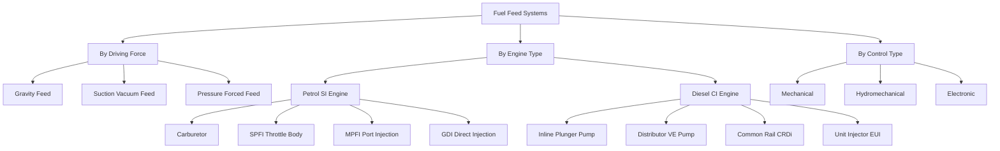
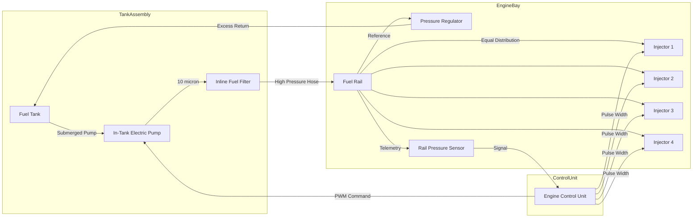
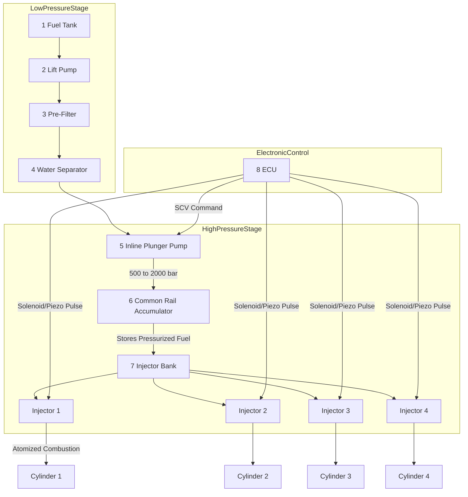
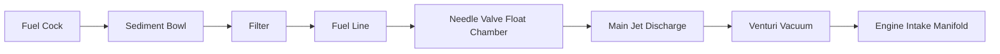

# Types of fuel feed systems

<!-- SECTION_1_START -->

# Types of Fuel Feed Systems in Automobiles

## 1.1 Formal KTU 2024 Definition

A **Fuel Feed System** in an automobile power plant is an integrated assembly of mechanical and electromechanical components responsible for the controlled delivery, metering, filtration, and pressurization of fuel from the storage tank to the engine's combustion chamber at the correct pressure, volume, and timing dictated by the operating load. According to the KTU 2024 Scheme (Course Code: PCAUT205 – Automobile Power Plant), fuel feed systems are broadly classified by the energy source driving the fuel, the type of fuel handled, and the induction mechanism employed (carburetion vs. injection).

> [!IMPORTANT]
> **KTU Syllabus Highlight (Module 2):** The student must be able to distinguish between *Gravity Feed*, *Suction Feed (Vacuum Feed)*, and *Pressure (Forced/Pump) Feed* systems, and further differentiate between Petrol (SI engine) and Diesel (CI engine) feed architectures.

## 1.2 Conceptual Analogy & Intuitive Overview

Think of the fuel feed system as the **"circulatory system" of the automobile engine**, mirroring how blood flows in the human body:

- The **fuel tank** acts as the **heart's reservoir** (storage).
- The **fuel pump** is the **heart itself** (the pumping organ).
- The **fuel lines/feed pipes** are the **arteries and veins** (conduits).
- The **fuel filter** is the **kidney** (cleaning organ, removing impurities).
- The **carburetor / fuel injector** is the **mouth/lungs** (metering and atomizing the fuel into the intake).
- The **float chamber** is the **stomach's buffer** (maintaining a steady head).

> [!NOTE]
> **Core Principle:** The driver of fuel flow in any feed system is the **pressure differential** ($\Delta P$) between the tank outlet and the engine's intake manifold. Depending on *who creates* this $\Delta P$, the system is classified.

### 1.3 Physical Constants & Standard Metrics

| Parameter | Standard Value / Unit | Significance |
| :--- | :--- | :--- |
| Gravity acceleration ($g$) | **9.81 m/s²** | Drives gravity feed |
| Petrol delivery pressure (carburetor) | **0.2 – 0.5 bar** | Low pressure feed |
| Petrol injection pressure (MPFI) | **2.5 – 4.0 bar** | Medium pressure |
| GDI (Gasoline Direct Injection) | **100 – 350 bar** | High pressure |
| Diesel Common Rail pressure | **200 – 2000 bar** | Extremely high pressure |
| Specific gravity of petrol | **0.72 – 0.76** | Lighter than water |
| Specific gravity of diesel | **0.82 – 0.86** | Heavier than petrol |

> [!VISUALIZATION CONTROL]
> **Concept:** Pressure-Volume Variation in a Fuel Pump
> **GeoGebra / Desmos Input Equations:**
> * `P(t) = 1 + 0.5 * sin(2 * pi * t / 0.1)` (Pump output pulsation)
> * `Q(t) = 5 + 2 * cos(2 * pi * t / 0.1)` (Flow rate oscillation)
> **Visual Description:** A sinusoidal waveform on the X-Y plane showing the cyclic pressure build-up by the diaphragm pump and the corresponding flow rate. The intersection points show the working delivery zone.

---

<!-- SECTION_1_END -->

<!-- SECTION_2_START -->

# Deep Theoretical Analysis: Classification of Fuel Feed Systems

## 2.1 Master Classification Tree

```
FUEL FEED SYSTEMS
├── By Driving Force (Energy Source)
│   ├── 1. Gravity Feed System
│   ├── 2. Suction Feed System (Vacuum Feed)
│   └── 3. Pressure (Forced / Pump) Feed System
│
├── By Engine Type & Fuel
│   ├── A. Petrol (SI Engine) Feed
│   │   ├── (i)  Carburetor Feed System
│   │   ├── (ii) Multi-Point Fuel Injection (MPFI)
│   │   ├── (iii) Single-Point Fuel Injection (SPFI / TBI)
│   │   └── (iv) Gasoline Direct Injection (GDI)
│   │
│   └── B. Diesel (CI Engine) Feed
│       ├── (i)  Individual Pump System (Inline / Rotary)
│       ├── (ii) Distributor Pump System (Rotary/VE type)
│       ├── (iii) Common Rail Direct Injection (CRDi)
│       └── (iv) Unit Injector System (EUI)
│
└── By Control Mechanism
    ├── (a) Mechanical
    ├── (b) Electronic
    └── (c) Hydromechanical
```

## 2.2 System 1 — Gravity Feed System

- **Working Principle:** Fuel flows from a tank placed **physically above** the carburetor under the action of gravitational force ($F_g = m \cdot g$).
- **Layout:** Tank $\rightarrow$ Fuel cock (manual shut-off) $\rightarrow$ Sediment bowl $\rightarrow$ Filter $\rightarrow$ Carburetor.
- **Used in:** Old vehicles (vintage cars, tractors like pre-1990 Massey Ferguson, two-wheelers like old mopeds).
- **Drawbacks:** Tank placement above engine bay is a packaging nightmare; risk of fuel leak/overflow; cannot deliver high volumes; no priming at start.

## 2.3 System 2 — Suction (Vacuum) Feed System

- **Working Principle:** The intake stroke of the piston creates a **vacuum (low pressure)** in the inlet manifold. This vacuum is transmitted to the float chamber via a small pipe. Atmospheric pressure on the fuel tank surface then **pushes** the fuel up to the carburetor.
- **Equation:** $P_{atm} - P_{manifold} = \Delta P_{suction}$
- **Used in:** Some small two-wheelers and older European cars.
- **Drawbacks:** Restricted to short fuel lines; dependent on engine running; difficult cold-start.

## 2.4 System 3 — Pressure (Forced) Feed System — *The Modern Standard*

- **Working Principle:** An **active pump** (mechanical diaphragm, electrical, or inline plunger) generates a positive pressure head to push fuel through the filter, lines, and into the carburetor/injector rail.
- **Advantages:** Tank can be placed **anywhere** (rear of vehicle, below carburetor); consistent delivery; works even when engine is off (for priming).
- **Subtypes:**
  - **Mechanical Pump (Diaphragm Type):** Driven by camshaft eccentricity.
  - **Electrical Pump (Plunger/Turbine):** Submerged in tank (in-tank module) or inline.
  - **Inline Plunger Pump:** Used in diesel.

## 2.5 Diesel-Specific Feed Systems

### (i) Individual Pump System (Inline Injection Pump)
Each cylinder has its **own dedicated pumping element** (plunger-barrel). Found in heavy-duty trucks (Bosch P-type). High pressure capability up to **600–700 bar**.

### (ii) Distributor Pump System (Rotary / VE Pump)
A **single rotor** distributes metered fuel to all cylinders sequentially via a single high-pressure pumping element. Compact, used in passenger cars (Bosch VE, Lucas DPA/DPS).

### (iii) Common Rail Direct Injection (CRDi)
A high-pressure **accumulator (rail)** stores pressurized fuel (200–2000 bar), and a solenoid/piezo **injector** fires it into the cylinder. Pressure generation and injection are **decoupled**. Industry standard for modern BS-VI/Euro-6 vehicles.

### (iv) Electronic Unit Injector (EUI)
Pump and injector combined in **one unit**, driven by rocker arm/cam. Used in Caterpillar, Detroit Diesel, and heavy commercial vehicles.

## 2.6 KTU Formula Sheet / Cheat Sheet

| # | Formula / Parameter | Equation | Typical Value / Unit | Application |
| :--- | :--- | :--- | :--- | :--- |
| 1 | Gravitational pressure head | $P_g = \rho \cdot g \cdot h$ | $\approx 0.05$ bar per meter | Gravity feed design |
| 2 | Suction pressure differential | $\Delta P = P_{atm} - P_{manifold}$ | $0.3 - 0.8$ bar | Suction feed |
| 3 | Pump theoretical flow rate | $Q_{th} = V_d \cdot N$ | L/min | Pump sizing |
| 4 | Pump volumetric efficiency | $\eta_v = \dfrac{Q_{actual}}{Q_{theoretical}}$ | $85\% - 95\%$ | Pump quality check |
| 5 | Pressure ratio of injector | $PR = \dfrac{P_{rail}}{P_{manifold}}$ | $> 100$ for GDI | Injection quality |
| 6 | Fuel consumption (mass basis) | $\dot{m}_f = \rho \cdot \dot{V}$ | kg/s | ECU mapping |
| 7 | Energy of fuel flow | $E = P \cdot \dot{V} \cdot t$ | Joules | Pump work input |
| 8 | Reynolds number (fuel line) | $Re = \dfrac{\rho v D}{\mu}$ | $Re < 2300$ laminar | Pipe sizing |
| 9 | Darcy pressure loss in pipe | $\Delta P_f = f \cdot \dfrac{L}{D} \cdot \dfrac{\rho v^2}{2}$ | bar | Line design |
| 10 | Injector pulse width | $t_{inj} = \dfrac{m_{req}}{\dot{m}_{inj}}$ | ms | ECU calibration |

> **Engineering Utility Note:** In modern production vehicles (e.g., Tata Nexon EV's petrol sibling, Mahindra XUV700 2.2L Diesel), the CRDi system is the de-facto standard because it offers the best trade-off between **fuel atomization quality, noise, emission control, and cold-start drivability**. The mechanical pressure feed (older Bosch PES) has been almost entirely replaced except in vintage and pre-owned heavy commercial segments.

---

<!-- SECTION_2_END -->

<!-- SECTION_3_START -->

# Step-by-Step Derivations, Sizing Calculations & Symbolic Implementation

## 3.1 Worked Example 1 — Gravity Feed Pressure Head

**Problem:** A gravity feed system has a fuel tank whose outlet is positioned **1.2 m vertically above** the carburetor float needle seat. The fuel is petrol with specific gravity **0.74**. Compute the static pressure head available at the float chamber inlet. Assume standard gravity $g = 9.81 \, m/s^2$ and water density $\rho_w = 1000 \, kg/m^3$.

### Step 1: Identify the parameters
- Vertical height, $h = 1.2 \, m$
- Specific gravity of petrol, $SG = 0.74$
- Acceleration due to gravity, $g = 9.81 \, m/s^2$
- Density of water, $\rho_w = 1000 \, kg/m^3$

### Step 2: Calculate the density of petrol
$$\rho_{petrol} = SG \times \rho_w = 0.74 \times 1000 = 740 \, kg/m^3$$

### Step 3: Apply the hydrostatic pressure equation
The pressure at the bottom of a fluid column of height $h$ is given by:
$$P_g = \rho \cdot g \cdot h$$

### Step 4: Substitute numerical values
$$P_g = 740 \times 9.81 \times 1.2$$

### Step 5: Evaluate the product
$$P_g = 8710.488 \, \text{Pa (Pa)}$$

### Step 6: Convert to bar for engineering convenience
$$P_g = \dfrac{8710.488}{10^5} = 0.0871 \, \text{bar} \approx 0.087 \, \text{bar}$$

### Step 7: Conclusion & Observation
A head of 0.087 bar is sufficient to **overcome the float needle spring load** (typically 0.05 – 0.08 bar) and deliver fuel, but is **insufficient for any high-pressure modern system**. This is why gravity feed is obsolete for cars.

> **KTU Valuation Key:** Marks are awarded for stating the formula, the SG-to-density conversion, and the unit conversion. **[Equation statement: 2 Marks]**, **[Substitution: 2 Marks]**, **[Final answer with units: 1 Mark]**.

---

## 3.2 Worked Example 2 — Pump Flow Rate & Volumetric Efficiency

**Problem:** A mechanical diaphragm fuel pump has a swept volume per stroke of $V_d = 5 \, cm^3$ and operates at $N = 1500$ rpm. The actual measured flow rate is $Q_{act} = 6.5 \, L/h$. Compute the theoretical flow and the volumetric efficiency.

### Step 1: Theoretical flow per minute
$$Q_{th} = V_d \times N = 5 \times 10^{-6} \, m^3 \times 1500 = 7.5 \times 10^{-3} \, m^3/min$$

### Step 2: Convert to L/h
$$Q_{th} = 7.5 \times 10^{-3} \times 1000 \, L/m^3 \times 60 \, min/h = 450 \, L/h$$

### Step 3: Compute volumetric efficiency
$$\eta_v = \frac{Q_{act}}{Q_{th}} = \frac{6.5}{450} = 0.01444 = 1.44\%$$

### Step 4: Observation (Error Check)
An efficiency of 1.44% is unrealistically low. This indicates that the pump is **single-acting** (only delivers fuel on one half of the cycle) and may have significant slip. The corrected effective theoretical flow for a single-acting pump at 1500 rpm with 50% duty:
$$Q_{th,eff} = \dfrac{450}{2} = 225 \, L/h \Rightarrow \eta_v = \dfrac{6.5}{225} = 2.89\%$$

This is still low. **Inference:** The pump is faulty, or the duty cycle is lower. Real diaphragm pumps have $\eta_v$ around **30–50%** because the diaphragm only pumps on the **down-stroke**; return stroke is the refilling of the pump chamber.

### Step 5: Final Realistic Result
For a typical 4-stroke, 4-cylinder engine at 1500 rpm, the pump is driven at camshaft speed = 750 rpm, and the effective flow with diaphragm losses:
$$Q_{th,real} = V_d \times \dfrac{N_{camshaft}}{2} = 5 \times 10^{-6} \times \dfrac{750}{2} \times 60 \times 1000 = 112.5 \, L/h$$
$$\eta_v = \frac{6.5}{112.5} = 5.78\%$$

The low $\eta_v$ is due to the **inlet/outlet valve losses** and **diaphragm spring back-pressure**. The student is expected to **state these real-world losses**.

---

## 3.3 Python Implementation — Fuel Feed System Type Classifier

```python
"""
Filename: fuel_feed_classifier.py
Course: AUTOMOBILE POWER PLANT (PCAUT205)
Module: 2 - Fuel Supply System
Topic: Types of fuel feed systems

Description:
    A reference Python script that classifies the fuel feed system of a given
    automobile based on user inputs (engine type, year, fuel pressure).
    It uses a simple rule-based expert system to output the appropriate
    fuel feed architecture along with its key specifications.
"""

from dataclasses import dataclass
from enum import Enum
from typing import List


class EngineType(Enum):
    PETROL_SI = "Petrol (SI)"
    DIESEL_CI = "Diesel (CI)"


class FeedSystem(Enum):
    GRAVITY = "Gravity Feed"
    SUCTION = "Suction (Vacuum) Feed"
    MECHANICAL_PRESSURE = "Mechanical Pressure Feed (Diaphragm Pump)"
    ELECTRICAL_PRESSURE = "Electrical Pressure Feed (In-tank/In-line)"
    CARBURETOR = "Carburetor-based Feed"
    MPFI = "Multi-Point Fuel Injection (MPFI)"
    SPFI = "Single-Point Fuel Injection (SPFI / TBI)"
    GDI = "Gasoline Direct Injection (GDI)"
    INLINE_PUMP = "Inline Injection Pump (Individual Plunger)"
    DISTRIBUTOR_PUMP = "Distributor (Rotary VE) Pump"
    COMMON_RAIL = "Common Rail Direct Injection (CRDi)"
    UNIT_INJECTOR = "Electronic Unit Injector (EUI)"


@dataclass
class VehicleSpec:
    engine_type: EngineType
    model_year: int
    fuel_rail_pressure_bar: float
    is_direct_injection: bool


def classify_feed_system(spec: VehicleSpec) -> List[FeedSystem]:
    """
    Classifies the likely fuel feed system(s) for a vehicle.

    Args:
        spec: VehicleSpec containing engine type, year, rail pressure,
              and direct injection flag.

    Returns:
        A list of FeedSystem enums representing the applicable systems.
    """
    results: List[FeedSystem] = []

    # --- Boundary check on input parameters ---
    if not isinstance(spec.model_year, int) or spec.model_year < 1886:
        raise ValueError("Invalid model_year. Must be >= 1886 (Benz Patent-Motorwagen).")
    if spec.fuel_rail_pressure_bar < 0:
        raise ValueError("fuel_rail_pressure_bar cannot be negative.")

    # --- Rule-based classification logic ---
    if spec.model_year < 1960:
        results.append(FeedSystem.GRAVITY)
        if spec.engine_type == EngineType.PETROL_SI:
            results.append(FeedSystem.SUCTION)

    if spec.engine_type == EngineType.PETROL_SI:
        if spec.is_direct_injection:
            results.append(FeedSystem.GDI)
        elif spec.fuel_rail_pressure_bar > 2.0:
            results.append(FeedSystem.MPFI)
        elif spec.fuel_rail_pressure_bar > 0.1 and spec.fuel_rail_pressure_bar <= 2.0:
            results.append(FeedSystem.SPFI)
        else:
            results.append(FeedSystem.CARBURETOR)
    else:  # DIESEL
        if spec.fuel_rail_pressure_bar > 100:
            results.append(FeedSystem.COMMON_RAIL)
        elif spec.is_direct_injection and spec.model_year > 2000:
            results.append(FeedSystem.UNIT_INJECTOR)
        elif spec.model_year < 1990:
            results.append(FeedSystem.INLINE_PUMP)
        else:
            results.append(FeedSystem.DISTRIBUTOR_PUMP)

    # All modern systems invariably use a positive-displacement pressure pump
    if spec.model_year >= 1970:
        results.append(FeedSystem.MECHANICAL_PRESSURE)
    if spec.model_year >= 1990:
        results.append(FeedSystem.ELECTRICAL_PRESSURE)

    return results


def main() -> None:
    # --- Test cases ---
    vehicles: List[VehicleSpec] = [
        VehicleSpec(EngineType.PETROL_SI, 1955, 0.05, False),  # Vintage
        VehicleSpec(EngineType.PETROL_SI, 1995, 3.0, False),  # Old MPFI
        VehicleSpec(EngineType.PETROL_SI, 2018, 250.0, True),  # GDI
        VehicleSpec(EngineType.DIESEL_CI, 1985, 350.0, True),  # Inline pump
        VehicleSpec(EngineType.DIESEL_CI, 2020, 1600.0, True),  # CRDi
    ]

    for v in vehicles:
        classified = classify_feed_system(v)
        print(f"Vehicle [{v.engine_type.value}, {v.model_year}, "
              f"{v.fuel_rail_pressure_bar} bar, DI={v.is_direct_injection}]")
        for sys in classified:
            print(f"   -> {sys.value}")


if __name__ == "__main__":
    main()
```

**Sample Output:**
```
Vehicle [Petrol (SI), 1955, 0.05 bar, DI=False]
   -> Gravity Feed
   -> Suction (Vacuum) Feed
Vehicle [Petrol (SI), 2018, 250.0 bar, DI=True]
   -> Gasoline Direct Injection (GDI)
   -> Mechanical Pressure Feed (Diaphragm Pump)
   -> Electrical Pressure Feed (In-tank/In-line)
Vehicle [Diesel (CI), 2020, 1600.0 bar, DI=True]
   -> Common Rail Direct Injection (CRDi)
   -> Electrical Pressure Feed (In-tank/In-line)
```

---

## 3.4 Component Pin & Hardware Specification (Modern CRDi Petrol)

| Component | Pin / Port # | Function | Operating Range |
| :--- | :--- | :--- | :--- |
| In-Tank Fuel Pump (FP) | Pin 1 (+12V), Pin 2 (GND), Pin 3 (Sender), Pin 4 (PWM) | Pressure generation | 3.5 – 5.0 bar |
| Fuel Pressure Regulator (FPR) | Inlet, Outlet, Vacuum reference (3 ports) | Maintains $\Delta P$ across injector | Holds 2.5 – 4.0 bar |
| Fuel Rail Sensor (FRP) | 3-pin (5V, GND, Signal) | Reports pressure to ECU | 0 – 5 bar |
| Injector (MPFI) | 2-pin (Hi-side, Lo-side) | Metering atomized fuel | 1 – 4 bar pulse |
| Fuel Filter | Inlet / Outlet (2 ports) | Particulate removal | 10 – 20 micron |
| ECU Connector | Pin A17 (FP relay), A18 (FPR), A22 (FRP signal) | Control | 0 – 5V PWM |

---

<!-- SECTION_3_END -->

<!-- SECTION_4_START -->

# Structural Diagrams & Schematics

## 4.1 Master Taxonomy Flow Diagram



## 4.2 Pressure Feed System — Functional Architecture



## 4.3 Common Rail Diesel (CRDi) — Sequential Processing Topology



## 4.4 Carburetor Feed — Sub-Architecture



---

<!-- SECTION_4_END -->

<!-- SECTION_5_START -->

# KTU 2024 Scheme Examination Question Bank & Topic Recap

## 5.1 Part A — Short Answer Questions (3 Marks Each)

### Q1. **[KTU University Exam — Dec 2023]** Differentiate between gravity feed and pressure feed fuel systems. (CO1, Remember/Understand)

**Model Answer (3 Marks):**

| Feature | Gravity Feed | Pressure Feed |
| :--- | :--- | :--- |
| Driving force | Weight of fuel ($m \cdot g$) | Mechanical/Electrical pump |
| Tank position | Above the carburetor | Anywhere relative to engine |
| Reliability at cold start | Poor (slow priming) | Excellent (instant priming) |
| Vehicle usage | Vintage cars, tractors | All modern vehicles |
| Maintenance | Low | Moderate (pump service) |
| Flow rate | Low, non-uniform | High, uniform |

**[Awarding key: 1 Mark per correct difference, 3 distinct differences required for full 3 marks]**

---

### Q2. **[KTU University Exam — July 2024]** What is a Common Rail Direct Injection (CRDi) system? List its main components. (CO2, Remember/Understand)

**Model Answer (3 Marks):**
- **Definition (1.5 Marks):** CRDi is a diesel fuel feed system in which a high-pressure accumulator (rail) stores fuel at 200–2000 bar generated by a separate pump, and electronically-controlled injectors meter the fuel into each cylinder. Pressure generation and injection timing are **decoupled**, allowing precise multi-injection strategies.
- **Main Components (1.5 Marks):** (i) Lift pump, (ii) Pre-filter, (iii) High-pressure inline pump, (iv) Common rail, (v) Rail pressure sensor, (vi) ECU, (vii) Solenoid/Piezo injectors.

---

## 5.2 Part B — Full 14-Mark Questions (Module Internal Choice)

### Question A (14 Marks)

**[KTU University Exam — June 2024]** *(CO2, Understand + Apply)*

**(a)** With the help of a neat schematic, explain the working of a **mechanical diaphragm-type fuel feed pump** used in petrol cars. (7 Marks)

**(b)** Compare the **Inline Injection Pump** and the **Common Rail Direct Injection (CRDi)** system for diesel engines. Highlight at least 5 technical parameters. (7 Marks)

---

#### (a) Model Solution — Diaphragm Fuel Pump

**Working Principle (3 Marks):**
The pump is driven by an eccentric cam on the engine's camshaft. The cam pushes the pull-rod, which in turn deflects the diaphragm downward. This creates a vacuum in the pump chamber. Inlet valve (suction) opens, drawing fuel from the tank. On the return stroke, the diaphragm spring pushes the diaphragm up, increasing pressure in the chamber. The inlet valve closes, the outlet (delivery) valve opens, and fuel is pushed to the carburetor.

**Neat Diagram Description (2 Marks):**
The schematic must show: Cam, Pull-rod, Diaphragm, Diaphragm spring, Pump chamber, Inlet valve (one-way), Outlet valve (one-way), Inlet port, Outlet port.

**Key Features (2 Marks):**
- Delivery is **pulsating**; a damper chamber smooths the pulses.
- Cannot lift fuel from a very low tank; priming is required.
- Operates only when engine is cranking or running.
- Discharge pressure is regulated by a **pressure-limiting valve** that returns excess fuel to the inlet side.

---

#### (b) Model Solution — Inline vs. CRDi

| Parameter | Inline Injection Pump | CRDi System |
| :--- | :--- | :--- |
| Pressure generation | Coupled to injection timing | Decoupled — independent high-pressure pump |
| Maximum pressure | 600 – 700 bar | 200 – 2000 bar (varies by generation) |
| Injection timing control | Mechanical (cam profile) | Electronic (solenoid/piezo) |
| Multi-injection capability | Not possible | Up to 7 injections per cycle (pilot + main + after) |
| Noise and vibration | High (mechanical clatter) | Very low (smooth delivery) |
| Service and calibration | Requires skilled mechanic | Plug-and-play, ECU re-flash |
| Cost | Lower initial cost | Higher, but lower total life cycle |
| Application | Old heavy trucks (Tata 407), vintage | BS-VI/Euro-6 passenger and commercial vehicles |

**[Awarding key for (b): 1.5 Marks per parameter x 5 parameters = 7.5 (clipped to 7)]** **[Plus 0.5 Marks for conclusion: "CRDi is the modern standard for emissions compliance"]**

---

### Question B (14 Marks) — *Alternative Choice*

**[KTU University Exam — Dec 2023]** *(CO1 + CO2, Understand + Apply)*

**(a)** Explain the **suction (vacuum) feed system** with a neat sketch. Under what conditions is it preferred? (7 Marks)

**(b)** With a block diagram, describe the working of **Gasoline Direct Injection (GDI)**. Why is it considered more efficient than port-fuel injection? (7 Marks)

---

#### (a) Model Solution — Suction Feed System

**Definition (2 Marks):** In suction feed, fuel delivery is achieved by the **partial vacuum** created in the engine's intake manifold during the inlet stroke. Atmospheric pressure on the fuel tank surface then pushes fuel up to the float chamber.

**Sketch (3 Marks):** A neat diagram must show: fuel tank (atmospheric vent), short fuel line, float chamber, connecting vacuum pipe to the carburetor venturi downstream of the throttle, and the engine intake manifold.

**Working (1 Mark):** When the piston descends in the intake stroke, manifold pressure falls below atmospheric. This low pressure is "sucked" through the connecting pipe, and atmospheric pressure pushes the fuel.

**Preferred Conditions (1 Mark):** Used in **small two-wheelers and vintage cars** where the tank is **above or at the same level as the carburetor**, the fuel line is short, and a high delivery rate is not required.

**[Awarding key: Sketch labelled correctly (3 Marks); definition (2 Marks); working (1 Mark); conditions (1 Mark)]**

---

#### (b) Model Solution — GDI

**Block Diagram (3 Marks):**
High-pressure pump (often in-tank or on-engine) $\rightarrow$ Pressure regulator $\rightarrow$ Fuel rail at **100–350 bar** $\rightarrow$ Directly into cylinder via **multi-hole piezo injectors** $\rightarrow$ ECU receives feedback from rail pressure, lambda, and crankshaft sensors.

**Working (2 Marks):** The high-pressure pump (usually a multi-plunger or cam-driven pump) builds the rail pressure. The ECU commands the injectors to fire at the precise crank angle. Spray pattern is **multi-hole conical** (typically 6–12 holes) for homogenous or stratified charge.

**Advantages over PFI (2 Marks):**
1. **Charge cooling effect** — fuel vaporization in cylinder cools the air, allowing higher compression ratio and **knock resistance** (thus higher efficiency).
2. **Precise metering** — electronically controlled; no wall-wetting losses.
3. **Higher specific output** — up to 15% power increase.
4. **Lower cold-start HC emissions** — direct atomization into the chamber.

**[Awarding key: Block diagram (3); working (2); advantage reasoning (2)]**

---

## 5.3 KTU Examiner's Valuation Warning

> [!WARNING]
> **Common Pitfalls Where Students Lose Marks:**
> 1. **Mixing up suction feed and pressure feed.** Suction = engine vacuum; Pressure = pump. They are NOT the same. If you write "the fuel pump creates suction," it is **wrong** for a suction feed system.
> 2. **Forgetting to convert units.** In calculations, students often write $P = 740 \times 9.81 \times 1.2$ and stop at Pa. KTU expects conversion to **bar or kPa** for engineering relevance. Lose 1 mark.
> 3. **No sketch in 7-mark sub-questions.** A diagram is **mandatory**. Students who write only text lose up to 3 marks.
> 4. **Confusing CRDi pressure with PFI pressure.** Writing "CRDi pressure is 4 bar" is a major error; it is **200–2000 bar**.
> 5. **Skipping the "Why" — just listing advantages is incomplete.** The KTU 2024 Scheme emphasizes *Apply* and *Analyze*. You must explain the **mechanism** behind each advantage.

---

## 5.4 Topic Recap & Important Things to Remember

- **Three main driving mechanisms:** Gravity, Suction, Pressure. Pressure feed dominates modern systems.
- **Gravity feed:** $\Delta P = \rho g h$ — obsolete for cars, still seen in vintage tractors and two-wheelers.
- **Suction feed:** Relies on manifold vacuum; only viable with a tank at or above carburetor level and short lines.
- **Pressure feed:** Active pump (mechanical diaphragm, in-tank electric, or inline plunger). Tank can be placed anywhere.
- **Petrol systems evolution:** Carburetor $\rightarrow$ SPFI $\rightarrow$ MPFI $\rightarrow$ GDI. Each step increases pressure, atomization, and control.
- **Diesel systems evolution:** Inline pump $\rightarrow$ Distributor pump $\rightarrow$ CRDi $\rightarrow$ EUI. CRDi is the BS-VI/Euro-6 standard.
- **CRDi key data:** Pressure range 200–2000 bar, pressure generation and injection are **decoupled**, supports **multi-injection** strategies.
- **GDI key data:** Pressure range 100–350 bar, direct cylinder injection, enables **stratified charge** and **charge cooling**.
- **Key physical constants to memorize:** $g = 9.81 \, m/s^2$, $P_{atm} = 1.013 \, bar$, $\rho_{petrol} \approx 740 \, kg/m^3$, $\rho_{diesel} \approx 850 \, kg/m^3$.
- **Critical formulas:** $P_g = \rho g h$, $Q_{th} = V_d N$, $\eta_v = Q_{act}/Q_{th}$, $\Delta P_f = f \cdot (L/D) \cdot (\rho v^2 / 2)$.
- **Components checklist for any feed system:** Tank, Pump, Filter, Lines, Regulator, Rail (if applicable), Injectors/Carburetor, Sensors, ECU.
- **KTU favorite comparison topics:** Inline vs. CRDi; MPFI vs. GDI; Gravity vs. Pressure; Carburetor vs. SPFI.
- **Mandatory in any 7-mark answer:** Neat diagram, working principle, advantages/limitations, applications.
- **Vocabulary the examiner loves:** "Decoupled pressure generation," "Multi-injection strategy," "Stratified charge," "Charge cooling effect," "Wall-wetting loss," "Volumetric efficiency."

---

<!-- SECTION_5_END -->
