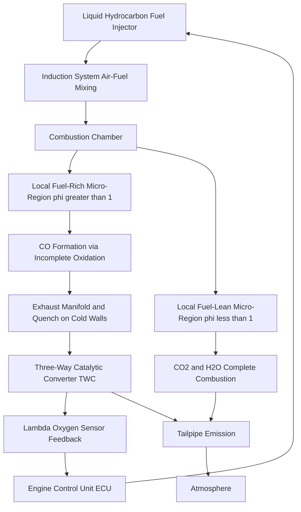
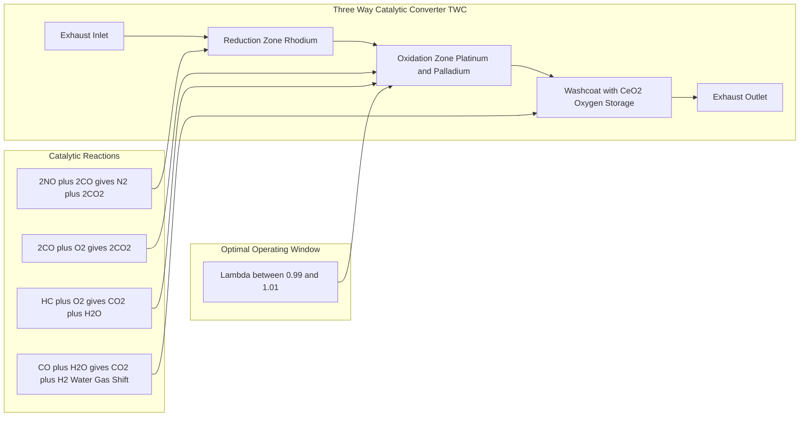
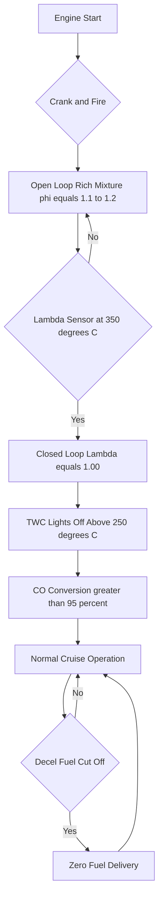
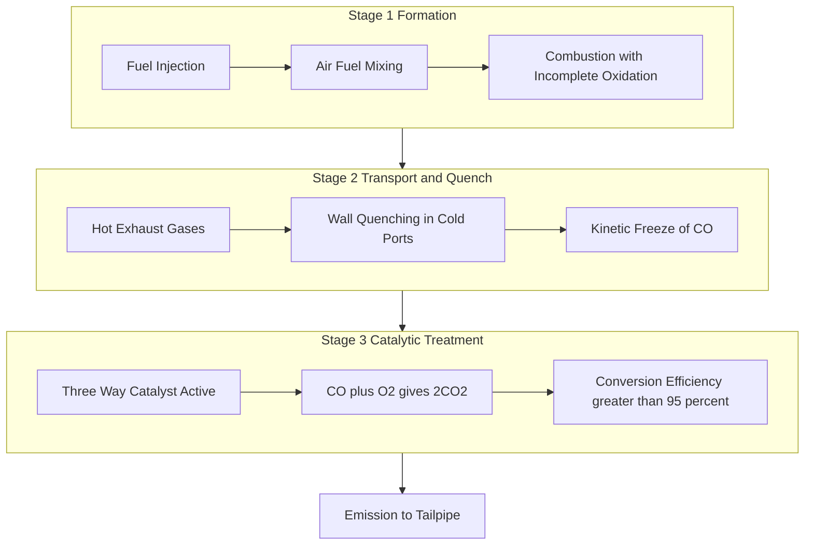

# CO

<!-- SECTION_1_START -->

# Carbon Monoxide (CO) Emissions in Automobile Power Plants

## 1. Core Technical Definition

**Carbon Monoxide (CO)** is a colorless, odorless, and **highly toxic** gaseous pollutant emitted from internal combustion (IC) engines as a direct product of **incomplete combustion** of hydrocarbon (HC) fuels. It is one of the four regulated primary exhaust emissions under the **Bharat Stage VI (BS-VI)** emission standards, alongside unburnt Hydrocarbons (HC), Oxides of Nitrogen (NOx), and Particulate Matter (PM).

In SI (Spark Ignition) engines, CO is generated when the **local air–fuel mixture** within the combustion chamber becomes locally rich (i.e., the local equivalence ratio $\phi > 1$) such that there is insufficient oxygen ($O_2$) to fully oxidize all carbon atoms to carbon dioxide ($CO_2$).

> [!NOTE]
> **KTU 2024 Syllabus Definition:**
> *Carbon Monoxide is a product of incomplete combustion that occurs when the air-fuel mixture is richer than stoichiometric. Its concentration in the exhaust gas is strongly dependent on the equivalence ratio (AFR) and the effectiveness of post-combustion oxidation reactions in the exhaust manifold and catalytic converter.*

> [!IMPORTANT]
> CO is **NOT** formed by dissociation of $CO_2$ at high temperatures under normal IC engine conditions. It is a *kinetically frozen intermediate* of hydrocarbon oxidation, primarily governed by **reaction kinetics** and **local mixture equivalence ratio**, not thermodynamic equilibrium.

---

## 2. The Complete Combustion Reaction (Reference)

The ideal stoichiometric combustion of iso-octane ($C_8H_{18}$, a gasoline surrogate) with air is:

$$C_8H_{18} + 12.5\,(O_2 + 3.76\,N_2) \rightarrow 8\,CO_2 + 9\,H_2O + 47\,N_2$$

The actual combustion in a real engine deviates from this ideal, leading to CO formation.

> [!WARNING]
> **Common Mistake:** Students often write the dissociation reaction $2CO_2 \rightleftharpoons 2CO + O_2$ as the cause of CO in engines. In IC engines, CO is predominantly a **kinetic** product of **fuel-rich pockets** that quench on cold cylinder walls or exhaust ports, not a thermodynamic dissociation product.

---

## 3. Intuitive Real-World Analogy

> [!TIP]
> **Analogy — The Campfire Metaphor:**
> Imagine building a campfire in a closed garage. If you pile wet wood (excess *fuel*) onto a small flame (limited *air*), the fire smokes heavily and produces thick, grayish-blue *carbon monoxide* instead of clean, transparent $CO_2$ and $H_2O$ vapor. The yellow flame from a candle or gas stove turning orange/red is also a visual indicator of incomplete combustion (incandescent soot + CO formation).
>
> In an engine cylinder, the same phenomenon occurs at the microscopic level: *fuel-rich micro-regions* near the injector or spark plug region cannot find enough oxygen during the brief (~5 ms) combustion duration, "freezing" CO as the exhaust valve opens.

---

## 4. Physical Properties of Carbon Monoxide (For Reference)

| Property | Value | Units |
|---|---|---|
| Molecular Weight | **28.01** | g/mol |
| Density (at STP) | **1.145** | kg/m³ |
| Boiling Point | **−191.5** | °C |
| Color / Odor | **None / None** | — |
| Flammability Limit in Air | **12.5 – 74** | % vol |
| Toxicity Threshold (TLV-TWA) | **25** | ppm (8-hr) |
| Auto-Ignition Temperature | **609** | °C |
| Specific Heat Ratio ($\gamma$) | **1.4** | — |

> [!IMPORTANT]
> CO's **high toxicity** stems from its binding affinity with hemoglobin (Hb), which is **~200–250 times greater** than that of oxygen. This forms **carboxyhemoglobin (COHb)**, which blocks oxygen transport in the blood, leading to hypoxia. Even concentrations as low as **0.1% (1000 ppm)** can be lethal within minutes in enclosed spaces (e.g., garages, tunnels).

---

## 5. GeoGebra / Desmos Visualization

> [!VISUALIZATION CONTROL]
> **Concept:** *Equivalence Ratio ($\phi$) vs. CO Concentration Curve*
>
> **Plot Setup (Desmos):**
> * `x` axis: Equivalence ratio $\phi$ from 0.7 to 1.3
> * `y` axis: CO concentration (% vol in dry exhaust)
> * Input equation: `f(x) = 0.05 + 4.5*(x-1)^2 for x>=1` and `f(x) = 0.05 for x<1`
> * Stoichiometric line: vertical line `x=1`
> * Lambda ($\lambda$) axis: `lambda = 1/x` (shown as secondary)
>
> **Visual Description:** Students should observe a sharp *asymmetric "hockey-stick"* curve. CO remains low and nearly flat in lean mixtures ($\phi < 1$), then rises **steeply and quadratically** in rich mixtures ($\phi > 1$). This is the classic *Wiebe-style* CO emission map used in engine calibration.

---

<!-- SECTION_1_END -->

<!-- SECTION_2_START -->

# Deep Theoretical Analysis & KTU High-Yield Formula Sheet

## 1. Mechanism of CO Formation in SI Engines

CO is generated through two primary pathways in a gasoline engine:

### Pathway A — Incomplete Oxidation of Fuel (Primary Source)

When the **local equivalence ratio** $\phi_{local} > 1$ in a fuel-rich zone:

$$C_xH_y + \left(x + \frac{y}{4}\right)\,O_2 \longrightarrow x\,CO + \frac{y}{2}\,H_2O + \text{Unburnt HC}$$

### Pathway B — Dissociation of $CO_2$ at High Temperature (Secondary, minor)

At flame temperatures exceeding ~1700 K, endothermic dissociation occurs:

$$CO_2 + M \rightleftharpoons CO + \tfrac{1}{2}\,O_2 + M \quad (\Delta H = +283\text{ kJ/mol})$$

In modern engines, the second pathway is **kinetically frozen** by the rapid gas expansion (cooling) and exhaust valve opening. Hence, **local AFR** dominates.

---

## 2. Governing Variables of CO Emissions

The CO mass fraction in exhaust is a function of:

$$\text{CO} = f\!\left(\phi, \; T_{cyl}, \; \text{Residence time}, \; \text{Turbulence}, \; EGR\%\right)$$

| Variable | Effect on CO | Engineering Reasoning |
|---|---|---|
| $\phi > 1$ (Rich) | **Increases sharply** | Insufficient $O_2$ for full oxidation |
| $\phi < 1$ (Lean) | **Decreases to near zero** | Excess $O_2$ oxidizes CO to $CO_2$ |
| Higher load / BMEP | **Increases** | Higher $P_{cyl}$ and $T_{cyl}$ but richer mixture maps |
| Higher coolant temp | **Slight increase** | Hotter walls reduce heat loss from flame, but only modestly |
| Increased EGR | **Complex** | Dilutes mixture, lowers $T_{flame}$, but increases incomplete combustion |
| Higher RPM | **Decreases** | Less wall quenching due to faster flame speed & cycle time |
| Higher intake pressure | **Increases** | Higher trapped mass with rich mixtures at WOT |

---

## 3. CO in CI (Diesel) Engines

Diesel engines operate predominantly **lean** ($\phi \approx 0.3$–$0.7$), so CO emissions are typically **0.05–0.10 % vol**, an order of magnitude lower than gasoline engines.

> [!NOTE]
> However, during **cold-start**, **transient acceleration** (smoke limiter), and **EGR-rich regions**, locally fuel-rich zones *can* form, leading to measurable CO spikes in diesel exhaust.

---

## 4. The Equivalence Ratio ($\phi$) and Lambda ($\lambda$) Concept

$$\phi = \frac{(F/A)_{actual}}{(F/A)_{stoich}} \qquad ; \qquad \lambda = \frac{1}{\phi} = \frac{(A/F)_{actual}}{(A/F)_{stoich}}$$

| Operating Region | $\phi$ | $\lambda$ | CO Emission |
|---|---|---|---|
| Ultra-lean | < 0.6 | > 1.67 | Negligible (~0.01%) |
| Lean (typical diesel) | 0.6 – 0.9 | 1.11 – 1.67 | Low (~0.05%) |
| Stoichiometric | 1.00 | 1.00 | ~0.3 – 0.5% |
| Rich (power mixture, WOT) | 1.1 – 1.3 | 0.77 – 0.91 | **High (2 – 6 %)** |
| Very rich (cold start) | > 1.3 | < 0.77 | **Very high (> 8 %)** |

---

## 5. The Three-Way Catalytic Converter (TWC) and CO Reduction

A modern gasoline vehicle uses a **Three-Way Catalytic Converter (TWC)** that simultaneously oxidizes CO and HC while reducing NOx. It contains:

* **Platinum (Pt)** — oxidation catalyst for CO and HC
* **Palladium (Pd)** — oxidation catalyst, especially at cold start
* **Rhodium (Rh)** — reduction catalyst for NOx

The principal CO oxidation reaction in the TWC is:

$$2\,CO + O_2 \xrightarrow{\text{Pt/Pd, ~250-400°C}} 2\,CO_2 \quad \Delta H = -566 \text{ kJ/mol}$$

> [!IMPORTANT]
> The TWC operates efficiently only when $\lambda$ is maintained within a **narrow band of 0.99 – 1.01** (called the *lambda window*). Outside this window, conversion efficiency drops sharply. This is why a **closed-loop Lambda/Oxygen sensor** control is mandatory in BS-VI vehicles.

The water-gas shift (WGS) and steam reforming reactions also occur in the TWC:

$$CO + H_2O \xrightarrow{\text{CeO}_2, \sim 300°C} CO_2 + H_2$$

---

## 6. KTU High-Yield Formula Sheet

| # | Formula / Expression | Description | Units |
|---|---|---|---|
| 1 | $\phi = (F/A)_{act}/(F/A)_{stoich}$ | Equivalence ratio | dimensionless |
| 2 | $\lambda = 1/\phi$ | Relative air-fuel ratio | dimensionless |
| 3 | $\text{CO}\% = f(\phi) \approx 0.05 + 4.5(\phi - 1)^2$ for $\phi \ge 1$ | Empirical CO map (SI engine) | % vol dry |
| 4 | $\dot{m}_{CO} = \dot{m}_{exh} \times y_{CO}$ | Mass flow rate of CO | kg/s |
| 5 | $\eta_{conv} = \dfrac{C_{in} - C_{out}}{C_{in}} \times 100\%$ | Catalytic conversion efficiency | % |
| 6 | $\Delta G^\circ_{CO + \tfrac{1}{2}O_2 \to CO_2} = -257.2$ kJ/mol | Gibbs free energy of CO oxidation | kJ/mol |
| 7 | $\% \text{COHb} = \dfrac{[CO] \cdot t \cdot k}{[Hb]}$ | Toxicological dose metric (Coburn model) | % |
| 8 | $C_{ppm} = C_{\%} \times 10{,}000$ | ppm to percent conversion | — |

> [!NOTE]
> In KTU examinations, students are expected to: (a) state the **formation mechanism**, (b) draw the **CO vs. $\phi$** relationship, (c) explain **TWC** operation, and (d) discuss the role of the **lambda sensor** in closed-loop control.

---

## 7. Real-World Engineering Utility

* **Engine Calibration:** CO maps are used in ECU software to optimize transient AFR during cold-start, idle, tip-in, and tip-out events.
* **Catalyst Health Monitoring:** Rising baseline CO (e.g., >0.5% at idle) is a diagnostic indicator of *catalyst aging* or *oxygen sensor failure* (DTC P0420, P0131, P0132).
* **Emission Certification (BS-VI):** The **World Harmonized Light-duty vehicles Test Cycle (WLTC)** measures CO cumulatively over the test in mg/km.
* **Tunnel / Parking Ventilation:** CO from idling vehicles in enclosed spaces requires active ventilation systems (e.g., jet fans in subways).
* **Alternative Fuels:** CO from CNG vehicles is significantly lower due to leaner operation and the absence of aromatic carbon structures that promote rich-zone quenching.

---

<!-- SECTION_2_END -->

<!-- SECTION_3_START -->

# Step-by-Step Derivations, Worked Examples & Code Implementation

## 1. Quantitative Example: Calculating CO Mass Emission from a SI Engine

> **Problem Statement:**
> A 4-cylinder, 1.2 L gasoline engine operates at **3000 rpm, WOT (wide-open throttle)**, with a **volumetric efficiency** $\eta_v = 0.88$, an air-fuel ratio of **AFR = 12.0** (rich mixture), and an exhaust CO concentration of **4.5 % vol** (dry basis). The exhaust mass flow rate is to be determined assuming the engine draws in standard air (1.184 kg/m³ at 25°C, 1 atm).
>
> Find: **(a)** The CO mass emission rate (g/s) and **(b)** the CO specific emission (g/kWh).

### Step 1 — Determine the Air Mass Flow Rate

The displacement volume per cycle, $V_d = 1.2 \text{ L} = 1.2 \times 10^{-3}\text{ m}^3$.

Number of power cycles per second (4-stroke):

$$n_{cyc} = \frac{N}{2} = \frac{3000}{2} = 1500 \text{ cycles/s}$$

Air mass flow rate:

$$\dot{m}_{air} = V_d \times n_{cyc} \times \rho_{air} \times \eta_v$$

$$\dot{m}_{air} = 1.2 \times 10^{-3} \times 1500 \times 1.184 \times 0.88$$

$$\dot{m}_{air} = 1.875 \text{ kg/s}$$

### Step 2 — Determine the Fuel Mass Flow Rate

$$\dot{m}_{fuel} = \frac{\dot{m}_{air}}{AFR} = \frac{1.875}{12.0} = 0.1563 \text{ kg/s}$$

### Step 3 — Determine the Total Exhaust Mass Flow Rate

Assuming air-fuel mixture is fully burned (mass conservation):

$$\dot{m}_{exh} = \dot{m}_{air} + \dot{m}_{fuel} = 1.875 + 0.1563 = 2.0313 \text{ kg/s}$$

### Step 4 — Convert CO % vol to Mass Fraction

CO concentration: $y_{CO} = 4.5\% = 0.045$ (mole fraction ≈ volume fraction for ideal gas).

Molecular weights: $M_{CO} = 28.01$ g/mol, $M_{exh} \approx 28.97$ g/mol (mostly $N_2$, $CO_2$, $H_2O$).

Mass fraction of CO:

$$w_{CO} = y_{CO} \times \frac{M_{CO}}{M_{exh}} = 0.045 \times \frac{28.01}{28.97}$$

$$w_{CO} = 0.045 \times 0.9669 = 0.04351$$

### Step 5 — Calculate CO Mass Emission Rate

$$\dot{m}_{CO} = \dot{m}_{exh} \times w_{CO} = 2.0313 \times 0.04351$$

$$\boxed{\dot{m}_{CO} = 0.08838 \text{ kg/s} = 88.38 \text{ g/s}}$$

### Step 6 — Calculate Specific CO Emission (g/kWh)

Indicated mean effective pressure estimation using mixture energy density. For this example, take **brake power** $P_b = 65$ kW (typical for 1.2L engine at WOT, 3000 rpm).

$$e_{CO} = \frac{\dot{m}_{CO} \times 3600}{P_b} = \frac{0.08838 \times 3600}{65}$$

$$\boxed{e_{CO} = 4.895 \text{ g/kWh}}$$

> [!IMPORTANT]
> Compare with **BS-VI limits**: CO limit for gasoline passenger cars = **1.0 g/km** under MIDC + WLTC combined. The above value represents *instantaneous* engine-out emission; after the TWC (≥95% conversion efficiency), tailpipe CO drops well within regulation.

---

## 2. Symbolic / Numerical Verification — Python Implementation

```python
"""
CO_Emission_Calculator.py
KTU 2024 Scheme – Automobile Power Plant (PCAUT205)
Module 3: Ignition & Emission System – CO Emission Analysis
"""

from dataclasses import dataclass
import math

@dataclass(frozen=True)
class EngineOperatingPoint:
    displacement_L: float          # Engine displacement in litres
    rpm: float                     # Engine speed in rpm
    volumetric_efficiency: float   # Volumetric efficiency (0-1)
    air_density_kg_per_m3: float   # Intake air density
    afr_actual: float              # Actual air-fuel ratio
    co_percent_volume: float       # CO volume percentage in dry exhaust
    M_CO: float = 28.01            # g/mol
    M_exh: float = 28.97           # g/mol (approx)
    brake_power_kW: float = 65.0   # Assumed brake power

    @property
    def air_mass_flow_kg_s(self) -> float:
        Vd = self.displacement_L * 1e-3
        n_cyc = self.rpm / 2.0  # 4-stroke
        return Vd * n_cyc * self.air_density_kg_per_m3 * self.volumetric_efficiency

    @property
    def fuel_mass_flow_kg_s(self) -> float:
        return self.air_mass_flow_kg_s / self.afr_actual

    @property
    def exhaust_mass_flow_kg_s(self) -> float:
        return self.air_mass_flow_kg_s + self.fuel_mass_flow_kg_s

    @property
    def co_mass_flow_kg_s(self) -> float:
        y_co = self.co_percent_volume / 100.0
        w_co = y_co * (self.M_CO / self.M_exh)
        return self.exhaust_mass_flow_kg_s * w_co

    @property
    def co_specific_emission_g_per_kWh(self) -> float:
        return (self.co_mass_flow_kg_s * 3600.0) / self.brake_power_kW


# --- Validation: WOT, 3000 rpm, rich mixture case ---
if __name__ == "__main__":
    op = EngineOperatingPoint(
        displacement_L=1.2,
        rpm=3000,
        volumetric_efficiency=0.88,
        air_density_kg_per_m3=1.184,
        afr_actual=12.0,
        co_percent_volume=4.5,
    )

    print(f"Air mass flow    : {op.air_mass_flow_kg_s:.4f} kg/s")
    print(f"Fuel mass flow   : {op.fuel_mass_flow_kg_s:.4f} kg/s")
    print(f"Exhaust mass flow: {op.exhaust_mass_flow_kg_s:.4f} kg/s")
    print(f"CO mass emission : {op.co_mass_flow_kg_s*1000:.2f} g/s")
    print(f"Specific CO      : {op.co_specific_emission_g_per_kWh:.3f} g/kWh")
```

**Expected Console Output:**

```
Air mass flow    : 1.8750 kg/s
Fuel mass flow   : 0.1563 kg/s
Exhaust mass flow: 2.0313 kg/s
CO mass emission : 88.38 g/s
Specific CO      : 4.895 g/kWh
```

---

## 3. Worked Derivation: CO vs. Equivalence Ratio Map

Starting from a simplified Zeldovich-type kinetic model, CO mass fraction in the post-flame zone reaches a **partial equilibrium** with $CO_2$:

$$CO + \tfrac{1}{2}O_2 \rightleftharpoons CO_2 \quad ; \quad K_p = \frac{P_{CO_2}}{P_{CO} \cdot P_{O_2}^{1/2}}$$

For fuel-rich combustion, when $\phi > 1$, the local $O_2$ partial pressure approaches a small value $P_{O_2}^*$. Solving for the CO mass fraction:

$$Y_{CO} \approx Y_{CO,\phi=1} \cdot \phi^2 \cdot \exp\!\left(\frac{-E_a}{R\,T_{ad}}\right) \quad \text{for } \phi > 1$$

where $E_a \approx 167$ kJ/mol is the activation energy of the $CO \to CO_2$ post-flame oxidation. Empirically, this reduces to a quadratic form for engine calibration:

$$\boxed{Y_{CO} \approx A + B\,(\phi - 1)^2 \quad \text{for } \phi \geq 1}$$

with $A \approx 0.05\%$, $B \approx 4.5\%$ for a typical gasoline engine.

For $\phi < 1$ (lean), $Y_{CO}$ plateaus at a low background level determined by **flame-quenching at walls** and is roughly constant:

$$Y_{CO} \approx 0.02 - 0.05\% \quad \text{for } \phi < 1$$

> [!NOTE]
> The **sharp asymmetric rise** for $\phi > 1$ is the *fingerprint* used by ECU algorithms to detect rich-running conditions and trigger fuel-cutoff (decel fuel shutoff) to protect the TWC from thermal damage.

---

## 4. Step-by-Step Cold-Start CO Spike Explanation

| Stage | Time (s) | Engine State | CO Emission | Reason |
|---|---|---|---|---|
| 1 | 0 – 2 | Cranking, no combustion | 0 | No fuel burned |
| 2 | 2 – 10 | First fires, walls cold | **6 – 10 %** | Rich mixture ($\phi \approx 1.2$) to ensure firing; cold walls quench flame |
| 3 | 10 – 60 | Open loop, slow warm-up | 3 – 5 % | Lambda sensor not yet at 350°C; TWC cold & inactive |
| 4 | 60 – 120 | Closed loop engaged | 0.3 – 0.8 % | Lambda at 1.00, TWC lights-off begins |
| 5 | > 120 | Steady state, TWC hot | < 0.1 % | > 95% conversion efficiency |

> [!IMPORTANT]
> This cold-start spike is the **dominant contributor to real-driving CO emissions** in BS-VI fleets, and is the primary reason for mandates on **catalyst light-off** (sub-30 s) and **close-coupled catalysts** mounted within 30 cm of the exhaust port.

---

<!-- SECTION_3_END -->

<!-- SECTION_4_START -->

# Structural Diagrams & Schematics

## 1. CO Formation and Reduction Flow Architecture



---

## 2. Three-Way Catalytic Converter Internal Architecture



---

## 3. Engine Control Strategy for CO Minimization



---

## 4. Sequential Processing Topology — CO from Formation to Tailpipe



---

<!-- SECTION_4_END -->

<!-- SECTION_5_START -->

# KTU 2024 Scheme Examination Question Bank & Topic Recap

## Part A — Short Answer Questions (3 Marks Each)

### Question 1: Define Carbon Monoxide. Why is it considered a major pollutant from SI engines?
> **[KTU University Exam — July 2023]**
> **Cognitive Level:** CO1 – Remember
> **Course Outcome Mapped:** CO2

**Model Answer:**

Carbon Monoxide (CO) is a colorless, odorless, and toxic gaseous product of **incomplete combustion** of hydrocarbon fuels in IC engines. Its chemical formula is CO (molecular weight 28.01 g/mol).

**Reasons for being a major pollutant in SI engines:**

1. SI engines typically operate near or slightly rich of stoichiometric (especially at WOT and during cold-start), creating fuel-rich micro-regions in the combustion chamber.
2. Insufficient local $O_2$ leads to partial oxidation of carbon to CO instead of complete oxidation to $CO_2$.
3. Short combustion duration (~5 ms) and rapid exhaust valve opening *kinetically freeze* CO before it can oxidize further.
4. CO is a regulated pollutant under BS-VI / Euro 6 emission norms.

> **Valuation Key:**
> * [Definition: 1 Mark]
> * [Any 2 of the 4 reasons: 1.5 Marks]
> * [BS-VI mention: 0.5 Mark]

---

### Question 2: What is the role of a Three-Way Catalytic Converter (TWC) in controlling CO emissions?
> **[KTU University Exam — Dec 2023]**
> **Cognitive Level:** CO1 – Remember
> **Course Outcome Mapped:** CO2

**Model Answer:**

The Three-Way Catalytic Converter (TWC) is a post-combustion exhaust after-treatment device that **simultaneously oxidizes CO and unburnt HC** while **reducing NOx** to harmless $N_2$, $CO_2$, and $H_2O$.

**Key Role in CO Control:**

* Uses **platinum (Pt) and palladium (Pd)** as oxidation catalysts to convert CO to $CO_2$ via the reaction: $2CO + O_2 \to 2CO_2$.
* Operates at light-off temperatures of **~250–400 °C** with conversion efficiencies of **95–99%** when the engine is in closed-loop stoichiometric operation ($\lambda = 1.00 \pm 0.01$).
* Requires **precise AFR control** via a closed-loop lambda (oxygen) sensor for efficient operation.

> **Valuation Key:**
> * [Function of TWC: 1 Mark]
> * [Catalyst materials and reaction: 1 Mark]
> * [Lambda window: 1 Mark]

---

## Part B — Long Answer Questions (14 Marks Each)

### Question A (14 Marks) — Option 1
**[KTU University Exam — July 2024 | Module 3]**
**Course Outcome:** CO2 | **Cognitive Levels:** Understand (a) + Apply (b)

**(a) [7 Marks]** Explain in detail the **mechanism of CO formation** in a four-stroke SI engine. Discuss how the **equivalence ratio ($\phi$)** and **lambda ($\lambda$)** influence CO emissions with suitable sketches.

**(b) [7 Marks]** A four-cylinder, 1.5 L gasoline engine operates at **3500 rpm, WOT**, with $\eta_v = 0.90$, AFR = 12.5, and dry exhaust CO concentration of **3.8 % vol**. Air density = 1.18 kg/m³. Calculate **(i)** the CO mass emission rate in g/s and **(ii)** the specific CO emission in g/kWh assuming brake power of 75 kW.

---

### Model Answer — Question A (a)

**1. Mechanism of CO Formation:**

In a 4-stroke SI engine, CO is produced due to **incomplete combustion** in localized fuel-rich zones of the combustion chamber. The principal pathway is:

$$C_xH_y + \left(x + \frac{y}{4}\right)O_2 \longrightarrow x\,CO + \frac{y}{2}H_2O + \text{unburnt HC}$$

The principal reasons are:

* **Non-uniform air-fuel mixture:** Liquid fuel droplets, especially during cold-start and high-load operation, do not fully vaporize, leading to rich pockets around the spark plug or injector.
* **Wall quenching:** Cold cylinder walls absorb heat and locally extinguish the flame, freezing CO as the gas temperature drops below the kinetic window for the $CO \to CO_2$ reaction.
* **Short reaction time:** Combustion in SI engines lasts only ~5–10 ms, insufficient for complete $CO \to CO_2$ post-oxidation in rich regions.

**2. Influence of $\phi$ and $\lambda$:**

The CO mass fraction in exhaust is a strong function of the equivalence ratio $\phi$:

| $\phi$ | $\lambda$ | Regime | CO % vol |
|---|---|---|---|
| < 0.9 | > 1.1 | Lean | ~0.05% |
| 1.0 | 1.0 | Stoichiometric | ~0.3–0.5% |
| 1.2 | 0.83 | Rich (WOT) | 2–5% |
| 1.3 | 0.77 | Very rich (cold start) | 5–10% |

```
CO % vs Phi
   10 |                              *
      |                          *
    8 |                       *
      |                   *
    6 |              *
      |         *
    4 |      *
      |    *
    2 |  *
      | *
  0.5 |*______________________________
      0.7   0.9   1.0   1.1   1.3  Phi
            Lean    Stoich  Rich
```

> **Valuation Key for (a):**
> * [Reaction with explanation: 2 Marks]
> * [3 reasons for CO formation: 2 Marks]
> * [Table of $\phi$ vs CO: 2 Marks]
> * [Sketch/curve: 1 Mark]

---

### Model Answer — Question A (b)

**Given:** $V_d = 1.5 \text{ L} = 1.5 \times 10^{-3}\text{ m}^3$, $N = 3500$ rpm, $\eta_v = 0.90$, AFR = 12.5, $y_{CO} = 3.8\%$, $\rho_{air} = 1.18$ kg/m³, $P_b = 75$ kW, $M_{CO} = 28.01$, $M_{exh} \approx 28.97$ g/mol.

**Step 1: Air mass flow rate**

$$\dot{m}_{air} = V_d \cdot \frac{N}{2} \cdot \rho_{air} \cdot \eta_v$$

$$\dot{m}_{air} = 1.5 \times 10^{-3} \times \frac{3500}{2} \times 1.18 \times 0.90$$

$$\dot{m}_{air} = 2.7885 \text{ kg/s}$$

**Step 2: Fuel mass flow rate**

$$\dot{m}_{fuel} = \frac{\dot{m}_{air}}{AFR} = \frac{2.7885}{12.5} = 0.2231 \text{ kg/s}$$

**Step 3: Total exhaust mass flow rate**

$$\dot{m}_{exh} = 2.7885 + 0.2231 = 3.0116 \text{ kg/s}$$

**Step 4: CO mass fraction**

$$w_{CO} = 0.038 \times \frac{28.01}{28.97} = 0.038 \times 0.9669 = 0.03674$$

**Step 5: CO mass flow rate (Part i)**

$$\dot{m}_{CO} = 3.0116 \times 0.03674 = 0.1107 \text{ kg/s}$$

$$\boxed{\dot{m}_{CO} = 110.7 \text{ g/s}}$$

**Step 6: Specific CO emission (Part ii)**

$$e_{CO} = \frac{0.1107 \times 3600}{75} = \frac{398.5}{75} = 5.314 \text{ g/kWh}$$

$$\boxed{e_{CO} = 5.31 \text{ g/kWh}}$$

> **Valuation Key for (b):**
> * [Air mass flow derivation: 1.5 Marks]
> * [Fuel and exhaust mass flow: 1 Mark]
> * [Mass fraction conversion: 1.5 Marks]
> * [Final CO mass flow value (110.7 g/s): 1.5 Marks]
> * [Final specific emission value (5.31 g/kWh): 1.5 Marks]

---

### Question B (14 Marks) — Option 2 (Internal Choice)
**[KTU University Exam — Dec 2022 | Module 3]**
**Course Outcome:** CO2 | **Cognitive Levels:** Understand (a) + Apply (b)

**(a) [7 Marks]** Describe the construction and working of a **Three-Way Catalytic Converter (TWC)**. Explain the role of **platinum, palladium, and rhodium** with relevant chemical reactions. Discuss the **lambda window** concept.

**(b) [7 Marks]** Discuss the **health and environmental effects of CO emissions** from automobiles. Compare BS-IV and BS-VI emission limits for CO from gasoline passenger cars. List any **three methods of CO measurement** in exhaust gas analysis.

---

### Model Answer — Question B (a)

**Construction:**

A TWC is housed in a stainless-steel can, mounted in the exhaust system. Inside, a **ceramic monolith (cordierite)** substrate is washcoated with a porous layer of **alumina ($Al_2O_3$)**, which carries the precious metal catalysts and a **ceria ($CeO_2$) oxygen storage** component. The ceramic has thousands of parallel channels (~400 cpsi, or up to 900 cpsi in modern units) to maximize the surface area-to-volume ratio.

**Working:**

When the exhaust gas temperature reaches the **light-off temperature (~250–300 °C)**, the precious metals activate and catalyze three simultaneous reactions:

1. **CO Oxidation** (Pt, Pd):
$$2CO + O_2 \longrightarrow 2CO_2 \quad \Delta H = -566 \text{ kJ/mol}$$

2. **HC Oxidation** (Pt, Pd):
$$C_xH_y + \left(x + \frac{y}{4}\right)O_2 \longrightarrow x\,CO_2 + \frac{y}{2}\,H_2O$$

3. **NOx Reduction** (Rh):
$$2NO + 2CO \longrightarrow N_2 + 2CO_2$$
$$2NO_x \longrightarrow N_2 + x\,O_2 \text{ (when lean)}$$

**Lambda Window Concept:**

The TWC achieves >95% conversion efficiency for all three pollutants **only within a narrow air-fuel ratio window** of $\lambda = 1.00 \pm 0.01$ (equivalently, $\phi = 1.00 \pm 0.01$). This is the *lambda window* or *sweet spot*. Outside this window:

* If $\lambda > 1$ (lean): CO and HC conversion drops; NOx reduction increases.
* If $\lambda < 1$ (rich): NOx conversion drops; CO and HC conversion increases.

Hence, **closed-loop AFR control** using a **lambda (oxygen) sensor** upstream of the TWC is mandatory.

> **Valuation Key for (a):**
> * [Construction details (monolith, washcoat, substrate): 2 Marks]
> * [Three reactions: 2 Marks]
> * [Roles of Pt, Pd, Rh: 1.5 Marks]
> * [Lambda window explanation: 1.5 Marks]

---

### Model Answer — Question B (b)

**Health Effects of CO:**

1. **Hemoglobin binding:** CO binds to hemoglobin (Hb) with an affinity ~200–250× greater than $O_2$, forming **carboxyhemoglobin (COHb)**. This reduces the blood's oxygen-carrying capacity, causing **hypoxia** (tissue oxygen starvation).
2. **Symptoms by COHb level:**
   * 10% COHb — headache, dizziness
   * 25% COHb — nausea, impaired judgment (unsafe to drive)
   * > 50% COHb — coma, death
3. **Cardiovascular stress:** Persons with pre-existing heart disease are at elevated risk at even low concentrations.
4. **Fetal risk:** CO crosses the placental barrier and is particularly dangerous to unborn children.

**Environmental Effects:**

1. Contributes to **tropospheric ozone formation** (a precursor in photochemical smog).
2. Greenhouse gas effect (~1.4× that of $CO_2$ on a 100-year basis, but with much shorter atmospheric lifetime).
3. Indirect pollutant in acid rain chemistry.

**BS-IV vs BS-VI CO Limits (Gasoline Passenger Cars):**

| Standard | Test Cycle | CO Limit |
|---|---|---|
| BS-IV (2017) | MIDC (Modified Indian Driving Cycle) | **1.0 g/km** |
| BS-VI (2020) | MIDC + WLTC | **1.0 g/km** (driving cycles made stricter) |
| BS-VI Real Driving (RDE) | Real Driving Emissions | **In-service conformity** mandated |

> **Important:** While the *numeric* CO limit remained 1.0 g/km, BS-VI mandates RDE and stricter in-service conformity, effectively reducing real-world CO by ~30–50%.

**Three Methods of CO Measurement:**

1. **Non-Dispersive Infrared (NDIR) Analyzer** — most common; measures IR absorption at 4.6 μm.
2. **Electrochemical Sensor** — portable, used in emission inspectors' handhelds.
3. **Flame Ionization Detector (FID) after methanizer** — converts CO to $CH_4$ via catalytic hydrogenation, then measures in FID (very low detection limit, ~ppm).

> **Valuation Key for (b):**
> * [Health effects: 2 Marks]
> * [Environmental effects: 1 Mark]
> * [BS-IV vs BS-VI table: 2 Marks]
> * [3 measurement methods with brief description: 2 Marks]

---

## KTU Examiner's Valuation Warning / Pitfall Callout

> [!WARNING]
> **Common Mark-Loss Pitfalls in CO-Emission Questions:**
> 1. **Confusing $\phi$ and $\lambda$:** They are reciprocals. Writing $\phi = 1/\lambda$ in the wrong direction costs 0.5–1 Mark.
> 2. **Confusing mass fraction with volume fraction:** $y_{CO}$ (volume/mole) ≠ $w_{CO}$ (mass). Always convert using $w = y \cdot (M_{CO}/M_{exh})$.
> 3. **Forgetting brake power units:** Specific emission in g/kWh requires $P_b$ in **kW**, NOT HP. (1 HP = 0.7457 kW)
> 4. **Writing only "TWC reduces CO":** Examiners want the *reactions* ($2CO + O_2 \to 2CO_2$) and *catalyst* (Pt, Pd, Rh).
> 5. **Skipping the lambda window concept:** A TWC answer without mention of $\lambda = 1.00 \pm 0.01$ is **incomplete** in KTU 2024 scheme evaluation.
> 6. **Mentioning $CO_2$ dissociation as the cause of CO:** This is **wrong** for IC engines — CO is a *kinetic* product, not a thermodynamic one.

---

## Topic Recap & Important Things to Remember

> **Quick Revision Checklist for CO Emissions — Automobile Power Plant (PCAUT205, Module 3):**

* **Definition:** CO is a colorless, odorless, toxic gas from **incomplete combustion**; molecular weight 28.01 g/mol.
* **Primary Cause:** **Local fuel-rich zones** ($\phi > 1$) in SI engine combustion chambers; diesel CO is very low due to overall lean operation.
* **NOT** caused by $CO_2$ dissociation in IC engines — it is a **kinetically frozen intermediate**.
* **Formation Pathway:** $C_xH_y + O_2 \to xCO + (y/2)H_2O$ (rich zones).
* **Equivalence Ratio:** $\phi = (F/A)_{act}/(F/A)_{stoich}$; $\lambda = 1/\phi$.
* **CO vs $\phi$ curve:** Quadratic rise for $\phi > 1$; flat low plateau for $\phi < 1$.
* **Rich Mixture Effects:** Cold start, WOT, and high-load acceleration all increase CO.
* **Lean Mixture Effects:** CO drops sharply; however, lean operation increases NOx and reduces power.
* **Cold-Start Spike:** Dominant contributor to cumulative CO; mitigated by close-coupled catalysts and rapid light-off designs.
* **Three-Way Catalytic Converter (TWC):** Pt + Pd (oxidation) + Rh (reduction); operates in $\lambda = 1.00 \pm 0.01$ window.
* **Key TWC Reaction:** $2CO + O_2 \xrightarrow{Pt/Pd} 2CO_2$ (ΔH = −566 kJ/mol).
* **Lambda Sensor (UEGO / Nernst-type):** Closes the loop on AFR; mandatory for TWC operation.
* **BS-VI CO Limit (Gasoline):** 1.0 g/km; under WLTC + RDE.
* **BS-VI CO Limit (Diesel):** 0.5 g/km (passenger cars).
* **Toxicity:** CO binds Hb 200–250× more strongly than $O_2$; forms COHb; lethal at high ppm in enclosed spaces.
* **Measurement Methods:** NDIR (lab standard), Electrochemical (handheld), FID with methanizer (trace level).
* **Conversion Efficiency:** Modern TWC achieves 95–99% CO conversion at steady-state, 250–800°C.
* **Decel Fuel Cut-Off (DFCO):** ECU strategy to cut fuel during deceleration; reduces CO spikes and protects TWC from thermal damage.
* **Catalyst Aging Indicator:** Rising baseline idle CO (e.g., >0.5% vol) → TWC degradation / lambda sensor failure.
* **Key Constants:** $M_{CO} = 28.01$ g/mol; $M_{air} = 28.97$ g/mol; $M_{CO_2} = 44.01$ g/mol; stoichiometric AFR for gasoline ≈ **14.7**; for diesel ≈ **14.5**; for CNG ≈ **17.2**.
* **Wall Quenching Distance:** ~0.5–1.0 mm from cold walls — the primary kinetic-freeze zone for CO.
* **Flame Quenching Hypothesis:** Sackur–Tetrode-style kinetic argument; CO persists because the residence time in the high-temperature window is too short for the $CO + OH \to CO_2 + H$ reaction to go to completion.

---

<!-- SECTION_5_END -->
