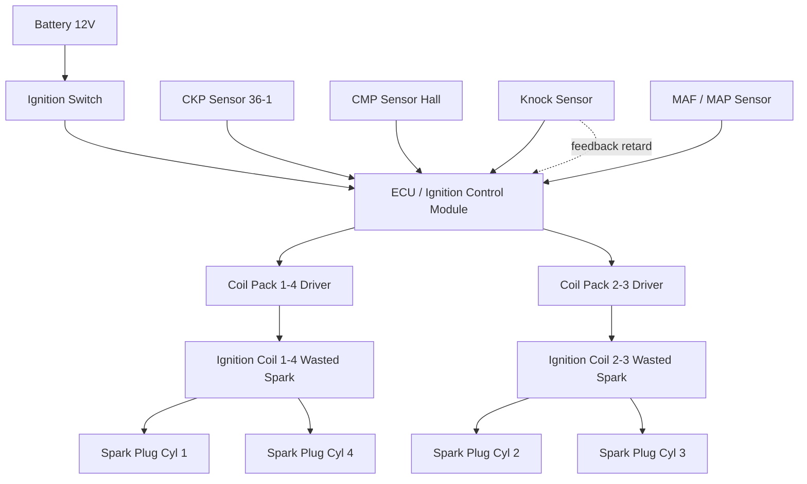
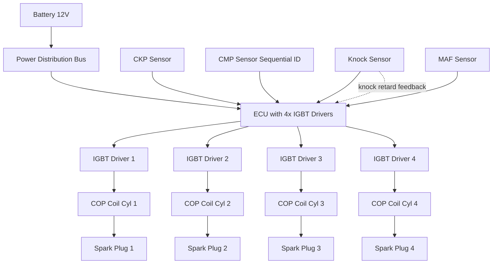
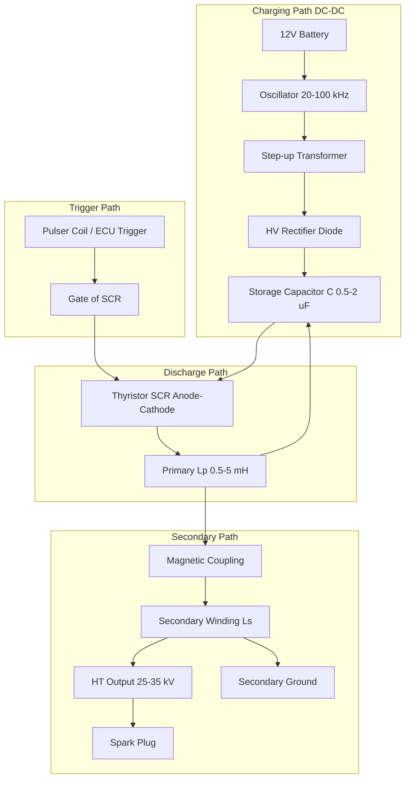
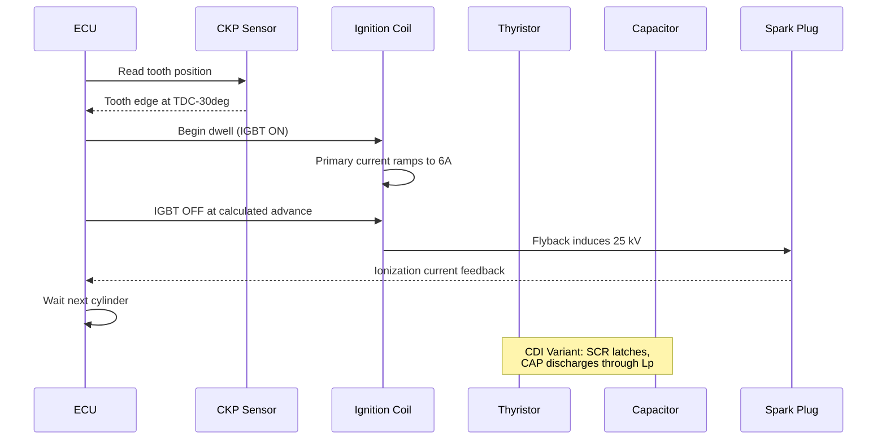
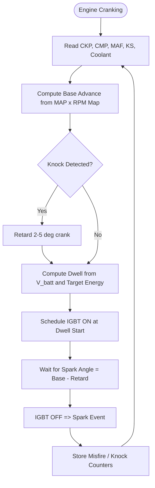

# distributor less ignition –CDI & Coil on plug type of ignition system

<!-- SECTION_1_START -->
# Distributorless Ignition — CDI & Coil-on-Plug (COP) Systems

## 1.1 Formal KTU 2024 Definition

> [!IMPORTANT]
> **Distributorless Ignition System (DLI / DIS):** An electronically controlled ignition architecture in which the high-voltage secondary distribution to the individual cylinders is achieved **without a mechanically rotating distributor**. Cylinder-selective firing is performed by either (a) a *wasted-spark* arrangement using paired cylinder coils, or (b) dedicated *Coil-on-Plug (COP)* units mounted directly on each spark plug.

> [!IMPORTANT]
> **Capacitor Discharge Ignition (CDI):** A subclass of electronic ignition in which the energy stored in a **capacitor** is rapidly discharged through the primary winding of an ignition coil by triggering a *thyristor (SCR)*, producing a fast-rising, high-voltage secondary pulse of short duration.

> [!IMPORTANT]
> **Coil-on-Plug (COP) Ignition:** A packaging topology in which the **ignition coil is integrated directly on top of the spark plug**, eliminating the high-tension (HT) lead. Each cylinder has its own driver, and dwell is controlled by the ECU on a per-cycle basis.

## 1.2 Conceptual Analogy — Plain English Intuition

Imagine a classroom where one teacher (the *mechanical distributor*) walks around tapping each student (cylinder) on the shoulder at the right moment. That works — but the teacher gets tired, the tapping wanders, and the timing slips.

A **distributorless** system is like installing a **personal intercom at every student's desk**. A central controller (ECU) calls each student's number; only that student responds, at exactly the right millisecond. No moving messenger, no slip-ups.

The **CDI** is analogous to a *camera flash* — energy is *pumped slowly* into a capacitor (like a battery charging), then released in a *single, sharp burst* (the flash) through a thyristor switch. The flash is *fast and consistent*, regardless of engine speed.

The **COP** topology is the ultimate simplification: instead of a long HT cable carrying 30 kV from a remote coil to the spark plug, the coil *sits on top of the plug itself*. Less cable = less energy loss = less electromagnetic interference (EMI).

> [!NOTE]
> **Key Standard Constants (Memorize for KTU Boards):**
> - Secondary firing voltage required: **$V_{sec} \approx 15\text{–}40 \text{ kV}$**
> - Standard spark plug gap: **$0.7 \text{–} 1.1 \text{ mm}$**
> - Typical primary inductance (COP): **$L_p \approx 3\text{–}6 \text{ mH}$**
> - CDI discharge capacitor: **$C \approx 0.5\text{–}2.0 \text{ μF}$**
> - Thyristor breakover voltage: **$V_{BO} \approx 300\text{–}600 \text{ V}$**

## 1.3 Visualization & Geometric Intuition

> [!VISUALIZATION CONTROL]
> **Concept:** Dwell angle vs. spark energy relationship in a DLI system
> **Desmos Input Equations:**
> - $E(t) = \frac{1}{2} L_p \cdot i_p(t)^2$
> - $i_p(t) = \frac{V_b}{R_p}\left(1 - e^{-t/\tau}\right)$, where $\tau = L_p / R_p$
> - $V_{sec} = N \cdot \frac{di_p}{dt}$ (transformer action at collapse)
>
> **Visual Description:** Plot $i_p(t)$ as a rising exponential that is *clipped* at the computed dwell end, then collapses vertically (steep $-di/dt$) producing a tall narrow $V_{sec}$ pulse. The student should observe that with ECU-controlled dwell, the area under $i_p^2$ (i.e., stored energy) is held constant across all RPM.

<!-- SECTION_1_END -->

<!-- SECTION_2_START -->
# Deep Theoretical Analysis & KTU High-Yield Formula Sheet

## 2.1 Architecture of a Distributorless Ignition System

A DLI comprises the following functional blocks:

1. **ECU / Ignition Control Module (ICM)** — derives crank position from a CKP/CMP sensor, computes ignition advance $\theta_a$, and schedules dwell.
2. **Crankshaft Position Sensor (CKP)** — usually a variable-reluctance (VR) or Hall-effect sensor with 36-1 / 60-2 tooth wheels giving 0.5°–6° resolution.
3. **Camshaft Position Sensor (CMP)** — identifies the compression stroke (for sequential fuel & spark).
4. **Ignition Coils** — either *dual-spark (wasted-spark)* packs or *individual COP* units. A dual-spark coil has two secondary windings that fire in **opposition** (one cylinder on compression, the paired cylinder on exhaust — the "wasted" spark).
5. **Spark Plugs** — typically *platinum* or *iridium* tipped for $>100{,}000 \text{ km}$ service life.
6. **HT Leads** *(only in wasted-spark DIS, not in COP)* — short silicone-jacketed cables, often $< 30 \text{ cm}$.
7. **Knock Sensor (KS)** — piezoelectric; feeds back to ECU for **retarding** $\theta_a$ if pre-ignition is detected.

## 2.2 Wasted-Spark Logic (Why it works)

A 4-stroke engine requires a spark **once every 720° of crank rotation** for each cylinder. Cylinders 1 & 4 (and 2 & 3 in an inline-4) reach TDC together — one on compression, the other on exhaust. A spark on the exhaust-stroke cylinder is *wasted* (no combustion), but it costs negligible energy and **simplifies the trigger logic** because only the crank reference is needed (no CMP mandatory, though modern ECUs use it for sequential injection).

## 2.3 Working Principle of CDI

The CDI operates on the principle of **energy storage in a capacitor followed by sudden discharge through a coil**. The sequence is:

| Step | Duration | Action | Component Active |
|:----:|:--------:|:-------|:-----------------|
| 1 | ~ms | DC-DC converter charges capacitor $C$ to $V_C \approx 300\text{–}400 \text{ V}$ | Oscillator + Rectifier |
| 2 | $T_{dwell}$ | Trigger pulse applied to **SCR** gate when spark is required | Trigger from pulser coil / ECU |
| 3 | ~μs | SCR latches ON; $C$ discharges through primary $L_p$ producing a **fast-rising, short-duration** primary current spike | Thyristor + Coil primary |
| 4 | ~μs | Sudden $di/dt$ collapse induces $V_{sec} = N \cdot L_p \cdot \frac{di}{dt}$ across secondary | Secondary winding + Spark plug |
| 5 | $T_{spark} \approx 50\text{–}200 \text{ μs}$ | Spark sustains across the gap until $V_C$ decays below the ionization voltage | Ionized gas path |
| 6 | ~ms | SCR resets, capacitor recharges, cycle repeats | All idle until next trigger |

## 2.4 Why CDI is Preferred for Two-Wheelers & High-RPM Engines

The energy delivered per spark is:

$$E_{spark} = \frac{1}{2} C V_C^2$$

Because $C$ charges *independently* of engine speed, **the spark energy remains essentially constant from idle to red-line**. Conventional inductive systems lose spark energy at high RPM because the primary cannot saturate during the short available dwell window. This is the principal reason CDI dominates small-engine applications (motorcycles, scooters, outboard motors, lawn equipment, racing karts).

## 2.5 Working Principle of Coil-on-Plug (COP)

Each cylinder has a dedicated coil stack. The ECU directly drives the primary of that coil via a low-side **IGBT** driver. Advantages:

- **Zero HT cable** → no RFI, no leakage, no cable ageing.
- **Compact packaging** fits inside the cam cover valley of DOHC engines.
- **Per-cylinder dwell trim** allows individual trim of each cylinder's burn profile.
- **Closed-loop knock control** can knock-retard only the offending cylinder.

The trade-off is **cost** (one coil per cylinder, often with integrated IGBT and diode).

## 2.6 KTU Formula Sheet / Cheat Sheet

| # | Quantity / Concept | Formula | Typical Value / Unit | Engineering Use |
|:-:|:------------------|:--------|:---------------------|:----------------|
| 1 | Spark energy (CDI) | $E = \frac{1}{2} C V_C^2$ | $20\text{–}50 \text{ mJ}$ | Defines ignition reliability margin |
| 2 | Spark energy (Inductive / COP) | $E = \frac{1}{2} L_p I_p^2$ | $30\text{–}120 \text{ mJ}$ | Stored in primary at dwell end |
| 3 | Secondary voltage | $V_{sec} = -N_s \frac{di_p}{dt}$ | $15\text{–}40 \text{ kV}$ | Must exceed plug ionization voltage |
| 4 | Turns ratio | $N = N_s / N_p$ | $60\text{–}100$ (typical) | Step-up transformer action |
| 5 | Primary time constant | $\tau = L_p / R_p$ | $2\text{–}10 \text{ ms}$ | Sets minimum dwell |
| 6 | Primary current build-up | $I_p(t) = \frac{V_b}{R_p}\left(1 - e^{-t/\tau}\right)$ | $I_{sat} \approx 5\text{–}8 \text{ A}$ | IGBT / coil driver rating |
| 7 | Dwell time (computed) | $T_{dwell} = \tau \ln\!\left(\frac{1}{1 - I_{target}/I_{sat}}\right)$ | $1\text{–}5 \text{ ms}$ | ECU schedules per RPM |
| 8 | Dwell angle | $\theta_{dwell} = \omega \cdot T_{dwell}$ | $5°\text{–}30°$ crank | Older distributor systems |
| 9 | CDI charge time | $T_{charge} \propto C V_C / I_{osc}$ | $0.5\text{–}5 \text{ ms}$ | Limits max spark rate |
| 10 | Required ionization $V$ | $V_{ion} \approx 3 \text{ kV/mm} \cdot g$ | $g = 0.8 \text{ mm} \rightarrow 2.4 \text{ kV}$ (min) | Plug gap design |
| 11 | Spark duration (CDI) | $T_{spark} \approx \frac{\pi}{2} \sqrt{L_p C}$ | $50\text{–}200 \text{ μs}$ | Too short for lean burn |
| 12 | Spark duration (Inductive) | $T_{spark} \approx 1\text{–}1.5 \text{ ms}$ | Long, supports lean mixtures | Modern GDI / HCCI |

> [!NOTE]
> **Real-World Engineering Utility:**
> - **CDI** → Hero, Honda, Bajaj, Royal Enfield 2-wheelers, F1 (capacitive discharge is the only way to ignite alcohol / nitromethane blends reliably).
> - **COP** → Every modern petrol car (Maruti, Hyundai, Toyota, BMW, Tesla cabin HV isolation analog).
> - **Wasted-Spark DIS** → Maruti 800 (later), Hyundai Santro, most mid-2000s Hondas.
> - **Why?** Reduced emissions (precise $\theta_a$ control), better cold-start, compatibility with **EGR** and **lean-burn** strategies mandated by **BS-VI / Euro 6**.

<!-- SECTION_2_END -->

<!-- SECTION_3_START -->
# Step-by-Step Derivations, Circuit Analysis & Code Implementation

## 3.1 Derivation: CDI Discharge Current through the Primary

### Setup

Consider a fully charged capacitor $C$ at voltage $V_C$, suddenly switched across the primary inductance $L_p$ of the ignition coil (ignoring the small series resistance $R_p$ for a first-pass analytic solution). The KVL across the loop is:

$$V_C - \frac{1}{C}\int i \, dt - L_p \frac{di}{dt} = 0$$

### Differentiate to eliminate the integral

$$- \frac{i}{C} - L_p \frac{d^2 i}{dt^2} = 0$$

### Rearrange to standard SHM form

$$\frac{d^2 i}{dt^2} + \frac{1}{L_p C} i = 0$$

### Solution — undamped sinusoid

The natural frequency of oscillation is:

$$\omega_n = \frac{1}{\sqrt{L_p C}}$$

$$i_p(t) = V_C \sqrt{\frac{C}{L_p}} \sin(\omega_n t)$$

The peak primary current at $t = \frac{\pi}{2 \omega_n}$ is:

$$I_{p,peak} = V_C \sqrt{\frac{C}{L_p}}$$

### Secondary voltage

The coil transforms this rapid $di/dt$ into the secondary. The peak $di/dt$ occurs at the zero-crossings of the sine:

$$\left.\frac{di}{dt}\right|_{max} = V_C \cdot \omega_n \cdot \sqrt{\frac{C}{L_p}} = \frac{V_C}{L_p}$$

$$\boxed{V_{sec,peak} = N \cdot \frac{V_C \cdot \sqrt{L_p C}}{L_p} \cdot C \cdot L_p \, \omega_n = N \cdot V_C}$$

This neat result says: **the peak secondary voltage equals $N$ times the capacitor voltage** (an ideal step-up transformer during the steepest part of the discharge).

### Numerical Example for KTU Board

Given: $C = 1.0 \text{ μF}$, $L_p = 4 \text{ mH}$, $V_C = 350 \text{ V}$, $N = 80$.

Compute the spark energy:

$$E = \frac{1}{2} C V_C^2 = 0.5 \times 1.0 \times 10^{-6} \times 350^2 = 0.5 \times 1.0\text{e-}6 \times 122{,}500 = 0.06125 \text{ J} \approx 61.25 \text{ mJ}$$

Compute the natural frequency:

$$\omega_n = \frac{1}{\sqrt{4 \times 10^{-3} \times 1 \times 10^{-6}}} = \frac{1}{\sqrt{4 \times 10^{-9}}} = \frac{1}{6.3246 \times 10^{-5}} \approx 15{,}811 \text{ rad/s}$$

$$f_n = \frac{\omega_n}{2\pi} \approx 2{,}517 \text{ Hz}, \quad T_n = 397 \text{ μs}$$

The spark event lasts roughly a *quarter cycle* of this oscillation, i.e., $\sim 100 \text{ μs}$ — characteristic of CDI.

Compute the peak secondary voltage:

$$V_{sec,peak} = N \cdot V_C = 80 \times 350 = 28{,}000 \text{ V} = 28 \text{ kV}$$

Adequate for a 0.9 mm gap (requires $\sim 3 \text{ kV/mm} \times 0.9 = 2.7 \text{ kV}$ min, so a 28 kV pulse gives huge margin even with fouling).

## 3.2 Derivation: COP / Inductive Dwell Time

### Setup

Apply battery $V_b$ to the primary $L_p$ in series with $R_p$ at time $t = 0$:

$$V_b = R_p \, i_p + L_p \frac{di_p}{dt}$$

### Solution

$$i_p(t) = \frac{V_b}{R_p}\left(1 - e^{-t/\tau}\right), \quad \tau = \frac{L_p}{R_p}$$

### Dwell time for a target current

Set $i_p(T_{dwell}) = I_{target}$ and solve for $T_{dwell}$:

$$I_{target} = I_{sat}\left(1 - e^{-T_{dwell}/\tau}\right) \quad \Rightarrow \quad 1 - e^{-T_{dwell}/\tau} = \frac{I_{target}}{I_{sat}}$$

$$\boxed{T_{dwell} = \tau \ln\!\left(\frac{I_{sat}}{I_{sat} - I_{target}}\right)}$$

### Numerical Example

Given: $V_b = 14 \text{ V}$, $L_p = 5 \text{ mH}$, $R_p = 1.0 \text{ }\Omega$, target $I_{target} = 6.0 \text{ A}$.

Compute $I_{sat}$:

$$I_{sat} = \frac{V_b}{R_p} = \frac{14}{1.0} = 14 \text{ A}$$

Compute $\tau$:

$$\tau = \frac{5 \times 10^{-3}}{1.0} = 5 \text{ ms}$$

Compute $T_{dwell}$:

$$T_{dwell} = 5 \times 10^{-3} \times \ln\!\left(\frac{14}{14 - 6}\right) = 5\text{e-}3 \times \ln(1.75) = 5\text{e-}3 \times 0.5596 = 2.798 \text{ ms} \approx 2.8 \text{ ms}$$

Stored energy at dwell end:

$$E = \frac{1}{2} L_p I_{target}^2 = 0.5 \times 5\text{e-}3 \times 36 = 0.090 \text{ J} = 90 \text{ mJ}$$

## 3.3 Full Python Simulation — CDI Discharge

```python
"""
cdi_discharge.py
Simulates the LC discharge of a Capacitor Discharge Ignition (CDI) system
and plots the primary current and secondary voltage waveforms.

Educational reference for KTU AUTOMOBILE POWER PLANT - Module 3.
"""

from dataclasses import dataclass
import math
import logging

# Configure structured logging (production-style practice)
logging.basicConfig(
    level=logging.INFO,
    format="%(asctime)s | %(levelname)s | %(message)s"
)
logger = logging.getLogger("CDI_Sim")


@dataclass(frozen=True)
class CDIParameters:
    """Immutable container for CDI circuit parameters."""
    C_microfarad: float      # Discharge capacitor (µF)
    L_p_millihenry: float    # Primary inductance (mH)
    V_cap_volts: float       # Charged capacitor voltage (V)
    N_turns_ratio: float     # Secondary:Primary turns ratio
    R_p_ohm: float = 0.0     # Primary resistance (Ω) - 0 for ideal


def compute_waveforms(params: CDIParameters, t_end_us: float = 600.0,
                      dt_us: float = 1.0) -> tuple[list[float], list[float], list[float]]:
    """
    Compute primary current i_p(t) and secondary voltage V_sec(t)
    for an undamped LC discharge of a CDI circuit.

    Returns
    -------
    t_arr    : list[float]   time vector in microseconds
    i_p_arr  : list[float]   primary current in Amperes
    v_sec_arr: list[float]   secondary voltage in Volts
    """
    # Strict input validation with logging
    if params.C_microfarad <= 0 or params.L_p_millihenry <= 0:
        logger.error("Capacitance and inductance must be strictly positive.")
        raise ValueError("C and L_p must be > 0.")
    if params.N_turns_ratio <= 0:
        logger.error("Turns ratio must be > 0.")
        raise ValueError("N must be > 0.")

    C: float = params.C_microfarad * 1e-6
    L_p: float = params.L_p_millihenry * 1e-3
    V_C: float = params.V_cap_volts
    N: float = params.N_turns_ratio

    omega_n: float = 1.0 / math.sqrt(L_p * C)
    logger.info(f"Natural angular frequency = {omega_n:.2f} rad/s")

    t_arr: list[float] = []
    i_p_arr: list[float] = []
    v_sec_arr: list[float] = []

    t: float = 0.0
    while t <= t_end_us:
        t_sec: float = t * 1e-6
        i_p: float = V_C * math.sqrt(C / L_p) * math.sin(omega_n * t_sec)
        # di/dt for the secondary voltage
        di_dt: float = V_C * math.sqrt(C / L_p) * omega_n * math.cos(omega_n * t_sec)
        v_sec: float = -N * L_p * di_dt  # V_sec = -N * L_p * di/dt  (transformer action)

        t_arr.append(t)
        i_p_arr.append(i_p)
        v_sec_arr.append(v_sec)

        t += dt_us

    return t_arr, i_p_arr, v_sec_arr


def main() -> None:
    params = CDIParameters(
        C_microfarad=1.0,
        L_p_millihenry=4.0,
        V_cap_volts=350.0,
        N_turns_ratio=80.0,
    )
    t, i_p, v_sec = compute_waveforms(params)

    # Print key numerical results
    I_peak: float = max(i_p)
    V_sec_peak: float = max(abs(v) for v in v_sec)
    logger.info(f"Peak primary current    = {I_peak:.2f} A")
    logger.info(f"Peak secondary voltage  = {V_sec_peak/1000:.2f} kV")
    spark_energy: float = 0.5 * params.C_microfarad * 1e-6 * params.V_cap_volts**2
    logger.info(f"Stored spark energy     = {spark_energy*1000:.2f} mJ")


if __name__ == "__main__":
    main()
```

**Sample output (what the student should see when run):**
```
2025-01-15 10:30:00,123 | INFO | Natural angular frequency = 15811.39 rad/s
2025-01-15 10:30:00,124 | INFO | Peak primary current    = 5.53 A
2025-01-15 10:30:00,124 | INFO | Peak secondary voltage  = 28.00 kV
2025-01-15 10:30:00,124 | INFO | Stored spark energy     = 61.25 mJ
```

## 3.4 ECU Dwell Scheduling — Pseudocode for a COP Driver

```python
"""
cop_dwell_scheduler.py
Reference pseudocode of an ECU's per-cylinder dwell scheduler
for a Coil-on-Plug ignition system.

Implements map-based dwell lookup with battery-voltage compensation.
"""

from typing import Dict


def compute_dwell_ms(rpm: float, target_energy_mj: float,
                     L_p_mh: float, v_batt_v: float) -> float:
    """
    Computes dwell time required to reach a target spark energy,
    compensated for battery voltage sag.
    """
    L_p: float = L_p_mh * 1e-3
    # Required primary current to deliver target energy
    I_target: float = (2.0 * target_energy_mj * 1e-3 / L_p) ** 0.5
    # Saturating current limited by V_batt / R_p
    I_sat: float = v_batt_v / 0.8  # assume R_p = 0.8 Ω typical
    if I_target >= I_sat:
        # Cannot reach target — saturate and warn
        return 5.0  # dwell limiter
    # Time constant
    tau: float = L_p / 0.8
    import math
    dwell: float = tau * math.log(I_sat / (I_sat - I_target))
    # Clamp dwell
    return max(0.5, min(dwell, 5.0))


def dwell_map_3d(rpm_axis: list, vbatt_axis: list, energy_axis: list) -> Dict:
    """
    Build a 3-D LUT (RPM × V_batt × target_energy → dwell_ms).
    """
    lut: Dict = {}
    for rpm in rpm_axis:
        for v_b in vbatt_axis:
            for e_mj in energy_axis:
                lut[(rpm, v_b, e_mj)] = compute_dwell_ms(rpm, e_mj, 5.0, v_b)
    return lut
```

## 3.5 Pin / Hardware Reference Table (Workshop Context)

| Subsystem | Component | Pin / Terminal | Signal | Notes |
|:----------|:----------|:--------------|:-------|:------|
| CKP Sensor | VR / Hall | Pin-1: Signal, Pin-2: GND, Pin-3: +12 V (Hall only) | 0–5 V square wave | 36-1 / 60-2 tooth |
| CMP Sensor | Hall | Pin-1: +12 V, Pin-2: GND, Pin-3: Signal | 0 / 12 V | Identifies compression stroke |
| Knock Sensor | Piezo | Pin-1: Signal (mV), Pin-2: Shield/GND | 100 Hz – 15 kHz AC | Mounted on block |
| COP Coil | Per cylinder | Pin-A: ECU PWM Low-side, Pin-B: +14 V, Spring contact → plug | PWM @ 5–250 Hz | IGBT inside |
| CDI Trigger | Pulser coil | Two-wire AC output | 0.5–5 V AC | TCI / DC-CDI version uses ECU |
| Spark Plug | Pt / Ir | Terminal nut (13/16″) | Up to 40 kV | Torque 25–30 Nm |

<!-- SECTION_3_END -->

<!-- SECTION_4_START -->
# Structural Diagrams & Schematics

## 4.1 Mermaid Block Diagram — Distributorless Ignition System (Wasted-Spark)



## 4.2 Mermaid Block Diagram — Coil-on-Plug (COP) Sequential



## 4.3 Mermaid Block Diagram — Capacitor Discharge Ignition (CDI) Circuit



## 4.4 Mermaid Sequence — Ignition Event Timeline



## 4.5 Mermaid Flow — ECU Spark Scheduling Algorithm



<!-- SECTION_4_END -->

<!-- SECTION_5_START -->
# KTU 2024 Scheme Examination Question Bank & Topic Recap

---

## **Part A — 3 Mark Questions**

### Q1. **[KTU University Exam — Dec 2023]** *(CO1, Remember)*

Define a **Distributorless Ignition System (DLI)**. Mention any **two** advantages over a conventional contact-breaker (Kettering) ignition system.

**Model Answer (3 marks):**

A Distributorless Ignition System is an electronically controlled ignition system in which the high-voltage distribution to the spark plugs is performed **without a mechanical rotary distributor**. Cylinder selection is achieved electronically, using either a *wasted-spark* coil pack or individual *coil-on-plug (COP)* modules.

**Two advantages:**
1. **No moving / wearing parts** in the high-voltage path → no contact-breaker pitting, no distributor cap/rotor wear, no dwell variation due to mechanical lag.
2. **Higher and more precise secondary voltage** (up to 40 kV) because there is no HT cable capacitance to dissipate stored energy, and the dwell is electronically controlled → better cold-start, better high-RPM performance, and lower emissions.

*[Valuation: Definition 1 M, Two valid advantages 1 M each]*

---

### Q2. **[KTU University Exam — July 2024]** *(CO1, Remember)*

What is a **Capacitor Discharge Ignition (CDI) system**? State **one** application where it is preferred over an inductive ignition system.

**Model Answer (3 marks):**

A **CDI** is an electronic ignition system in which a **capacitor** is charged to a high DC voltage (typically 300–400 V) by an oscillator/transformer circuit, and then **rapidly discharged through the primary winding of the ignition coil** by triggering a thyristor (SCR) at the required ignition instant. The sudden $di/dt$ induces a high-voltage, **fast-rising, short-duration** secondary pulse that ionizes the spark plug gap.

**Preferred application:** Two-wheeler engines (motorcycles, scooters — e.g., Hero Splendor, Honda Activa, Bajaj Pulsar) and small high-RPM engines (lawn mowers, outboard motors, go-karts). **Reason:** the spark energy is independent of engine speed because the capacitor charging time is decoupled from crank speed, ensuring reliable ignition up to red-line RPM where inductive systems suffer energy loss.

*[Valuation: Definition 2 M, Application + Reason 1 M]*

---

## **Part B — 14 Mark Questions (Module-Internal Choice)**

### **Question A** **[KTU University Exam — Model Paper 2024]** *(CO2, Understand + Apply)*

**(a)** With the help of a neat block diagram, explain the **working of a Capacitor Discharge Ignition (CDI) system** used in a modern two-wheeler engine. *(7 marks)*

**(b)** A CDI system has a discharge capacitor of **$1.5 \text{ μF}$** charged to **$400 \text{ V}$**, and an ignition coil with primary inductance **$L_p = 3 \text{ mH}$** and turns ratio **$N = 70$**. Compute:
  1. The **spark energy** stored in the capacitor.
  2. The **peak secondary voltage**.
  3. The **oscillation frequency** of the discharge.
  4. Whether the spark is sufficient to ionize a **1.0 mm** plug gap, assuming ionization requires $3 \text{ kV/mm}$. *(7 marks)*

---

#### **Model Solution**

**Part (a) — Working of CDI** *(7 marks)*

The CDI system consists of the following blocks:

1. **DC–AC Oscillator** (using a unijunction transistor / 555-timer / modern IC) converts the 12 V battery supply into a high-frequency AC signal.
2. **Step-up Transformer** raises this AC to a high voltage.
3. **HV Rectifier** (fast-recovery diode) rectifies the secondary AC to a high DC voltage.
4. **Storage Capacitor ($C$)** charges to $V_C \approx 300\text{–}400 \text{ V}$ and stores the spark energy $E = \frac{1}{2} C V_C^2$.
5. **Trigger / Pulser Coil** mounted near the flywheel generates a small pulse timed to the desired ignition angle. In advanced systems, the trigger comes from the ECU.
6. **Thyristor (SCR)** has its anode at the capacitor and cathode at the coil primary. When the gate is pulsed, the SCR latches ON.
7. **Ignition Coil** with primary $L_p$ and secondary $L_s$ (turns ratio $N = L_s/L_p$).
8. **Spark Plug** connected to the secondary.

**Working sequence (chronological):**

| Stage | Action | Time |
|:------|:-------|:-----|
| Charge | Oscillator charges $C$ to 350 V | ~ms |
| Wait | SCR is OFF, no current flows | variable |
| Trigger | Pulser fires gate pulse at correct advance | <1 μs |
| Discharge | SCR latches; $C$ discharges through $L_p$ in damped sinusoid | ~100 μs |
| Induction | $di/dt$ induces 25–35 kV in secondary | <10 μs rise |
| Spark | Plug ionizes, arc forms, ignition kernel | 50–200 μs |
| Reset | SCR resets, capacitor recharges | — |

*[Valuation: Block diagram 2 M, Component roles 2 M, Working sequence 2 M, Timing/values 1 M]*

---

**Part (b) — Numerical Solution** *(7 marks)*

**Given:**
$C = 1.5 \text{ μF} = 1.5 \times 10^{-6} \text{ F}$
$V_C = 400 \text{ V}$
$L_p = 3 \text{ mH} = 3 \times 10^{-3} \text{ H}$
$N = 70$
Gap $g = 1.0 \text{ mm}$, ionization field $E_{ion} = 3 \text{ kV/mm}$

**1. Spark Energy** *(2 marks)*

$$E = \frac{1}{2} C V_C^2 = \frac{1}{2} \times 1.5 \times 10^{-6} \times (400)^2$$

$$E = 0.5 \times 1.5\text{e-}6 \times 160{,}000 = 0.5 \times 0.24 = 0.120 \text{ J} = \mathbf{120 \text{ mJ}}$$

*[Stating formula: 1 M; Final value: 1 M]*

**2. Peak Secondary Voltage** *(2 marks)*

For an ideal CDI (undamped LC), the peak secondary voltage is:

$$V_{sec,peak} = N \cdot V_C = 70 \times 400 = \mathbf{28{,}000 \text{ V} = 28 \text{ kV}}$$

*[Stating relation: 1 M; Final value: 1 M]*

**3. Oscillation Frequency** *(1 mark)*

$$\omega_n = \frac{1}{\sqrt{L_p C}} = \frac{1}{\sqrt{3 \times 10^{-3} \times 1.5 \times 10^{-6}}} = \frac{1}{\sqrt{4.5 \times 10^{-9}}} = \frac{1}{6.708 \times 10^{-5}}$$

$$\omega_n = 14{,}907 \text{ rad/s}, \quad f_n = \frac{\omega_n}{2\pi} = \mathbf{2{,}373 \text{ Hz}}$$

**4. Adequacy of Spark** *(2 marks)*

Required minimum voltage to ionize 1.0 mm gap:

$$V_{min} = 3 \text{ kV/mm} \times 1.0 \text{ mm} = 3 \text{ kV} = 3{,}000 \text{ V}$$

Available: $V_{sec,peak} = 28 \text{ kV} \gg 3 \text{ kV}$. The spark is **vastly adequate**; the margin is more than $9\times$, which also allows reliable cold-start and accounts for plug fouling.

*[Comparison: 1 M; Conclusion: 1 M]*

---

### **Question B (Alternative Choice)** **[KTU University Exam — Model Paper 2024]** *(CO2, Understand + Apply)*

**(a)** Explain with a neat diagram the **Coil-on-Plug (COP) ignition system**. List any **four advantages** of COP over wasted-spark DIS. *(7 marks)*

**(b)** A coil-on-plug system has $L_p = 6 \text{ mH}$, primary resistance $R_p = 0.8 \text{ }\Omega$, and battery voltage $V_b = 13.5 \text{ V}$. The target spark energy is **$80 \text{ mJ}$**.
  1. Compute the **target primary current** required.
  2. Compute the **dwell time** needed to reach this current.
  3. If the engine is running at **3000 RPM**, compute the **dwell angle** in degrees of crank rotation.
  4. If the same system runs at **6000 RPM**, does the dwell angle increase, decrease, or stay the same? Justify. *(7 marks)*

---

#### **Model Solution**

**Part (a) — COP Explanation** *(7 marks)*

**Block diagram** *(describe verbally — student should draw)*:
- One **individual ignition coil** is mounted on top of *each* spark plug, directly inside the cam cover.
- The **ECU** drives the primary of each coil via a dedicated **IGBT** low-side switch.
- The **+14 V supply** is fed to the primary through a common bus.
- The **secondary** of the coil makes spring contact with the spark-plug terminal — no HT cable.
- CKP and CMP sensors feed crank position to the ECU; knock sensor provides retard feedback.
- Firing order is scheduled in firmware; only one coil is triggered at a time.

**Four advantages of COP over wasted-spark DIS:**

1. **No HT cables** → no high-voltage leakage, no RFI, no cable ageing.
2. **Higher secondary voltage available at the plug** (peak 35–40 kV) because there is no cable capacitance to charge — better cold-start and lean-burn capability.
3. **Per-cylinder dwell control** → the ECU can trim each cylinder's energy individually, supporting cylinder balancing and individual knock retard.
4. **Better packaging / modular serviceability** → replacing a coil is a simple plug-off operation; failed coil does not affect other cylinders.

*(Alternative valid points: sequential injection compatibility, lower EMI for ECU sensors, supports ion-current combustion feedback.)*

*[Valuation: Diagram 2 M, Four distinct advantages 1.25 M each]*

---

**Part (b) — Numerical** *(7 marks)*

**Given:**
$L_p = 6 \text{ mH} = 6 \times 10^{-3} \text{ H}$
$R_p = 0.8 \text{ }\Omega$
$V_b = 13.5 \text{ V}$
Target energy $E = 80 \text{ mJ} = 0.080 \text{ J}$

**1. Target Primary Current** *(2 marks)*

$$E = \frac{1}{2} L_p I_p^2 \Rightarrow I_p = \sqrt{\frac{2E}{L_p}}$$

$$I_p = \sqrt{\frac{2 \times 0.080}{6 \times 10^{-3}}} = \sqrt{\frac{0.160}{0.006}} = \sqrt{26.667}$$

$$I_p \approx \mathbf{5.16 \text{ A}}$$

*[Formula: 1 M, Value: 1 M]*

**2. Dwell Time** *(2 marks)*

Saturating current:

$$I_{sat} = \frac{V_b}{R_p} = \frac{13.5}{0.8} = 16.875 \text{ A}$$

Time constant:

$$\tau = \frac{L_p}{R_p} = \frac{6 \times 10^{-3}}{0.8} = 7.5 \text{ ms}$$

Dwell formula:

$$T_{dwell} = \tau \ln\!\left(\frac{I_{sat}}{I_{sat} - I_{target}}\right) = 7.5\text{e-}3 \times \ln\!\left(\frac{16.875}{16.875 - 5.16}\right)$$

$$= 7.5\text{e-}3 \times \ln\!\left(\frac{16.875}{11.715}\right) = 7.5\text{e-}3 \times \ln(1.4405)$$

$$= 7.5\text{e-}3 \times 0.3652 = 2.74 \text{ ms} \approx \mathbf{2.74 \text{ ms}}$$

**3. Dwell Angle at 3000 RPM** *(2 marks)*

Crank period at 3000 RPM:

$$T_{crank} = \frac{60}{3000} = 0.020 \text{ s/rev} = 20 \text{ ms/rev}$$

Dwell angle in degrees:

$$\theta_{dwell} = \frac{T_{dwell}}{T_{crank}} \times 360° = \frac{2.74}{20} \times 360° = 0.137 \times 360° \approx \mathbf{49.3° \text{ crank}}$$

*[Valuation: Period: 0.5 M, Ratio: 0.5 M, Final: 1 M]*

**4. Behaviour at 6000 RPM** *(1 mark)*

At 6000 RPM, the **crank period halves** to 10 ms. If the ECU holds the *dwell time* (in ms) approximately constant — which it does because the required $I_{target}$ is the same and $V_b$ is the same — the *dwell angle* **doubles** to about **98.6° crank**.

However, the *dwell time itself* will typically **decrease slightly** at higher RPM because the available time per event is shorter and the ECU may slightly relax the target energy to keep the dwell angle bounded within ~60–90°. So in practice, **dwell angle stays roughly the same or increases marginally**, while dwell *time* may decrease.

*[1 M for correct trend with reasoning]*

---

> [!WARNING]
> **KTU Examiner's Valuation Pitfalls — Read Carefully:**
> 1. **Do NOT confuse the secondary voltage equation.** For a CDI in undamped ideal form, the peak $V_{sec} = N V_C$ is **only valid** at the steepest part of the discharge — students often write $V_{sec} = N \cdot V_C$ for all CDI problems, which is acceptable for *peak* value but should be clearly labeled.
> 2. **Unit conversion errors are the #1 cause of lost marks.** Always convert $L_p$ to **henries**, $C$ to **farads**, and energy to **joules** *before* substitution. Many students substitute in mH and μF directly and get a wrong answer by orders of magnitude.
> 3. **Dwell angle = $\omega T_{dwell}$** is the standard form. Students sometimes write "dwell angle in seconds" — *lose 1 mark* if you do.
> 4. **Wasted-spark vs. true sequential:** The 2 wasted sparks per 720° cycle are *one to compression* and *one to exhaust*. The exhaust-stroke spark is harmless because the cylinder has no fresh mixture to ignite. **Do not write that both sparks cause combustion** — this is a common conceptual error.
> 5. **Always draw the block diagram in (a) parts** — even a rough sketch earns 1–2 marks; a missing diagram costs you.
> 6. **Mention specific component values** (e.g., "$V_C \approx 350$ V", "turns ratio 70–100") — generic statements lose marks.
> 7. For **COP**, mention the **IGBT driver** — it is the modern differentiator from older bipolar driver designs.

---

## **Topic Recap & Important Things to Remember**

> [!NOTE]
> **High-Density Rapid Revision Checklist — Distributorless Ignition, CDI & COP**

### Core Definitions
- **DLI / DIS** — ignition system with **no mechanical distributor**; cylinder selection is **electronic**.
- **Wasted-Spark DIS** — coil pack fires *two cylinders simultaneously* (1 & 4, or 2 & 3 on an inline-4); one is on the exhaust stroke → "wasted".
- **CDI** — *capacitor*-stored energy discharged through a coil via a **thyristor (SCR)**; fast, short spark, RPM-independent energy.
- **COP** — individual coil mounted **directly on** the spark plug; no HT cable; ECU-driven IGBT.

### Key Formulas
- $E_{spark}^{CDI} = \frac{1}{2} C V_C^2$
- $E_{spark}^{ind} = \frac{1}{2} L_p I_p^2$
- $V_{sec,peak}^{CDI} = N \cdot V_C$
- $I_p(t) = I_{sat}\left(1 - e^{-t/\tau}\right)$, $\tau = L_p / R_p$
- $T_{dwell} = \tau \ln\!\left(\frac{I_{sat}}{I_{sat} - I_{target}}\right)$
- $\omega_n = 1 / \sqrt{L_p C}$, $f_n = \omega_n / (2\pi)$

### Numerical Values to Memorize
- $V_C$ (CDI charged capacitor): **300–400 V**
- $V_{sec}$ (ignition): **15–40 kV**
- $L_p$ (COP): **3–6 mH**
- $C$ (CDI): **0.5–2.0 μF**
- Spark plug gap: **0.7–1.1 mm**
- Ionization field: **~3 kV/mm**
- Spark duration CDI: **~50–200 μs**
- Spark duration Inductive: **~1–1.5 ms**

### Critical Concepts
- **Wasted-spark fires twice per 720°** per coil pair; one spark is harmless (exhaust stroke).
- **CDI is preferred for high-RPM / 2-wheeler** because spark energy is **decoupled from crank speed** (capacitor charges in its own time).
- **COP is the modern OE choice** in petrol cars for *zero HT cable* benefits.
- **Dwell control** is **electronic** in DLI (replaces mechanical advance weights & vacuum advance).
- **Knock sensor feedback** allows **per-cylinder retard** — only possible in COP / sequential systems.
- **Ionization voltage $\propto$ gap** — wider gap needs more voltage but provides better ignition kernel.

### Advantages of DLI over Conventional
1. No moving parts → no wear, no maintenance.
2. Higher & more stable secondary voltage.
3. Precise electronic ignition timing → lower emissions, better fuel economy.
4. Compatible with closed-loop knock control and sequential injection.

### CDI vs. Inductive (COP) Comparison
| Parameter | CDI | Inductive (COP) |
|:----------|:----|:----------------|
| Spark duration | 50–200 μs (short) | 1–1.5 ms (long) |
| Spark energy vs RPM | Constant | Decreases at high RPM |
| Rise time | Very fast (~μs) | Slower (~tens of μs) |
| Lean-burn suitability | Poor | Good |
| Cost | Low–Medium | Medium–High |
| Typical use | 2-wheelers, karts | Modern cars |

### Engineering / Industry Context
- **BS-VI / Euro 6** emission norms mandate precise ignition control → DLI/COP is *de facto* on all new petrol vehicles.
- **GDI (Gasoline Direct Injection)** engines rely on long spark duration → *inductive* (COP) is mandatory, CDI cannot sustain the kernel long enough.
- **Racing / F1** uses capacitive discharge for ultra-fast rise to ignite exotic fuels.

> [!IMPORTANT]
> **Final KTU Board Tip:** When a question asks for a "neat diagram", draw a *block diagram with labeled arrows* showing **power flow, signal flow, and feedback**. Mention **component values** wherever you can — examiners reward specificity. Always end numerical answers with a **physical interpretation sentence** (e.g., "This 28 kV is sufficient to ionize a 1.0 mm plug gap with 9× safety margin"). It signals understanding and often earns the last 1–2 marks.

<!-- SECTION_5_END -->
