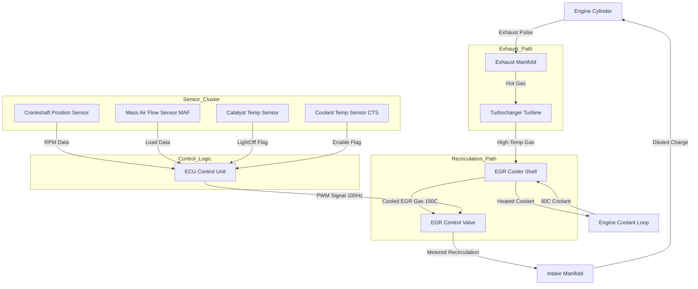
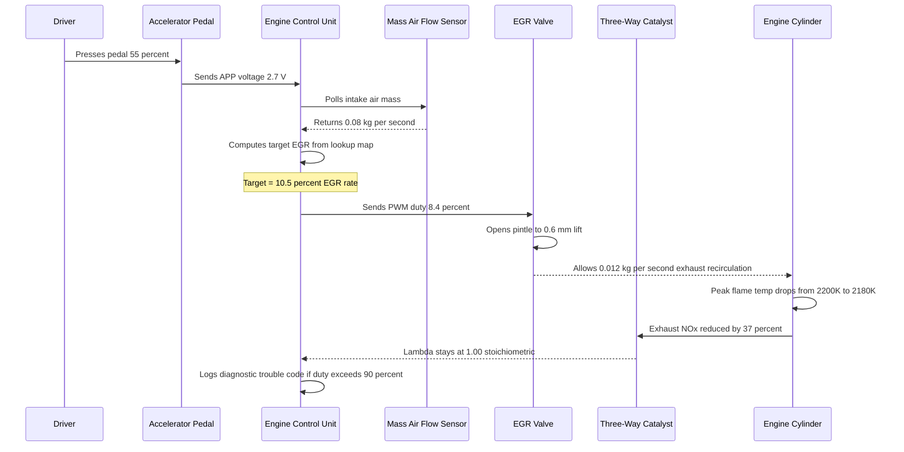
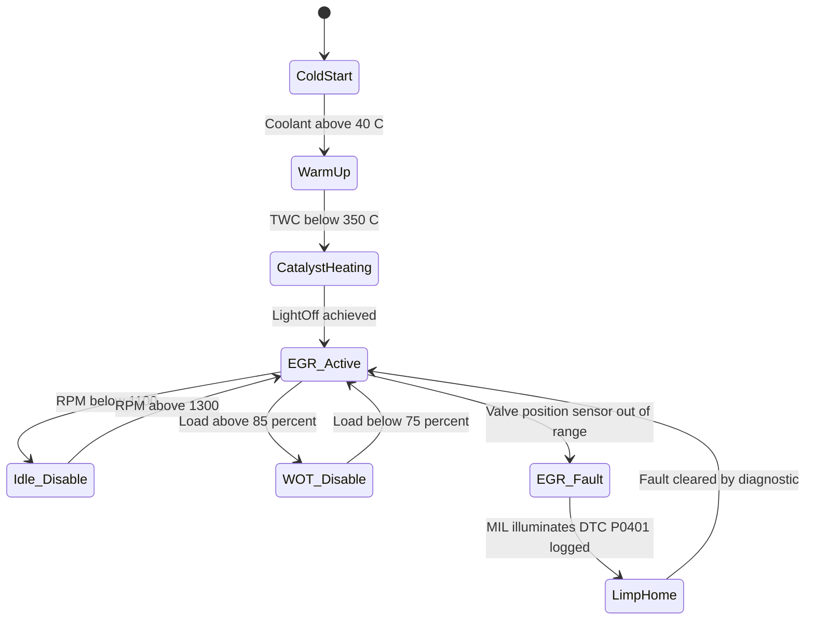

# Exhaust Gas Recirculation (EGR) Systems.

<!-- SECTION_1_START -->
# 1. Core Technical Definition & Intuitive Overview

## Exhaust Gas Recirculation (EGR) — Formal KTU Definition

> [!IMPORTANT]
> **Exhaust Gas Recirculation (EGR)** is an **emission control technique** used in **Spark Ignition (SI)** and **Compression Ignition (CI)** engines in which a precisely metered portion of the engine's **exhaust gas** is routed back into the **intake manifold** (or combustion chamber) to be re-burned along with the fresh air-fuel charge.

The primary engineering purpose of EGR is the **suppression of Oxides of Nitrogen (NOx)** formation inside the combustion chamber. NOx is formed when **free nitrogen (N₂)** in the intake air reacts with **free oxygen (O₂)** at peak in-cylinder temperatures above **~1370 °C (≈ 1643 K)** — a thermal threshold known as the **Zeldovich Thermal NOx Mechanism** region.

By introducing an **inert, heat-absorbing exhaust gas** back into the combustion chamber, EGR:
1. **Lowers the peak flame temperature** (flame temperature depression).
2. **Reduces the partial pressure of O₂** available for reaction.
3. **Increases the specific heat capacity (Cp)** of the in-cylinder charge.

These three combined effects **suppress the rate of NOx formation**, which is exponentially sensitive to temperature.

---

## Conceptual Analogy / Intuition

> [!NOTE]
> **Plain English Analogy — "The Crowd Cooling Trick":**
>
> Imagine a packed concert hall (the combustion chamber) where the front-row fans (oxygen molecules) are getting **overheated** and starting a dangerous chain reaction (NOx formation). The hall manager (the ECU-controlled EGR valve) lets in a controlled stream of **already-spent, cooler air from the back of the hall (exhaust gas)**. These "old air" molecules don't react (they're mostly inert CO₂ and H₂O) but they **soak up heat** like tiny sponges. Result: the temperature drops, the reaction slows down, and the dangerous emission never forms.

### Geometric / Thermodynamic Intuition

The EGR rate (often denoted **%EGR** or **r_EGR**) is defined as:

$$
\%EGR \;=\; \frac{\dot{m}_{EGR}}{\dot{m}_{air} + \dot{m}_{fuel}} \times 100
$$

where $\dot{m}_{EGR}$ is the mass flow rate of recirculated exhaust gas, $\dot{m}_{air}$ is the fresh air mass flow, and $\dot{m}_{fuel}$ is the fuel mass flow. The **15% rule of thumb**: introducing roughly **15 % by mass** of exhaust gas can lower peak combustion temperature by **~80–100 °C**, which in turn can reduce NOx emissions by **~50–70 %**.

---

## Standard KTU 2024 Scheme Syllabus Highlight

> [!IMPORTANT]
> **Syllabus Anchor (PCAUT205 — Module 3):**
> Students must be able to explain the **construction, working, types, and significance** of EGR systems in modern BS-VI/Euro-VI compliant engines. Numerical problems on **EGR rate**, **NOx reduction efficiency**, and **flame temperature depression** are frequently asked in KTU End Semester Examinations (ESE).

### Standard Engineering Constants (to memorize)

| Parameter | Standard Value | Unit |
|---|---|---|
| Critical NOx formation temperature | **1370** | °C |
| Typical EGR rate (gasoline) | **5 – 15** | % |
| Typical EGR rate (diesel) | **5 – 30** | % |
| NOx reduction at 15% EGR | **50 – 70** | % |
| BS-VI NOx limit (gasoline) | **60** | mg/km |
| BS-VI NOx limit (diesel) | **80** | mg/km |

---

> [!VISUALIZATION CONTROL]
> **Concept:** Linear relationship between EGR rate and NOx reduction (within optimal band)
> **GeoGebra / Desmos Input Equations:**
> * `f(x) = -3.5 * x + 5` (for 0 ≤ x ≤ 15, representing %NOx reduction per %EGR)
> * `g(x) = 90 - 1.2 * (x - 15)` (for x > 15, where diminishing returns and penalties begin)
> **Visual Description:** The student should observe a **rising straight line** for low EGR percentages (where NOx drops sharply), followed by a **gentle decline** beyond the optimal point — illustrating the trade-off where excessive EGR causes **mis-firing, increased HC/CO, and combustion instability**.

<!-- SECTION_1_END -->

<!-- SECTION_2_START -->
# 2. Deep Theoretical Analysis & KTU High-Yield Formula Sheet

## 2.1 Operating Principle — The "Why" Behind EGR

The formation of **Thermal NOx** follows the extended **Zeldovich mechanism**:

$$
\text{N}_2 + \text{O} \;\rightleftharpoons\; \text{NO} + \text{N}
$$
$$
\text{N} + \text{O}_2 \;\rightleftharpoons\; \text{NO} + \text{O}
$$
$$
\text{N} + \text{OH} \;\rightleftharpoons\; \text{NO} + \text{H}
$$

The net rate of NO formation is governed by the **Arrhenius-type exponential relation**:

$$
\frac{d[\text{NO}]}{dt} \;\propto\; \exp\!\left(-\frac{E_a}{R\,T_{peak}}\right)
$$

where:
* $E_a$ is the activation energy for NO formation (≈ **319 kJ/mol**).
* $R$ is the universal gas constant (**8.314 J/mol·K**).
* $T_{peak}$ is the peak adiabatic flame temperature in Kelvin.

Because the exponential term is so sensitive to $T_{peak}$, **even a 100 K drop in peak temperature nearly halves the NOx formation rate**. EGR achieves this temperature drop by:

* **Diluting the air charge** with inert CO₂ and H₂O vapor.
* **Raising the molar specific heat (Cp)** of the mixture, meaning more heat must be supplied to reach the same temperature.
* **Displacing diatomic O₂** with triatomic CO₂, lowering the flame speed and the rate of energy release.

---

## 2.2 Classification of EGR Systems (KTU High-Yield)

### A. Based on Recirculation Path
1. **Internal EGR** — Achieved by **retaining residual exhaust gas** in the cylinder through late or early valve overlap. No external plumbing.
2. **External EGR** — Achieved through an **external pipe and valve** routing exhaust gas from the exhaust manifold to the intake manifold.

### B. Based on Pressure Level
| Type | Pressure Source | NOx Reduction | Application |
|---|---|---|---|
| **High-Pressure (HP) EGR** | Exhaust manifold → Intake manifold (pre-turbo) | 60 – 80 % | Heavy-duty diesel (BS-VI trucks) |
| **Low-Pressure (LP) EGR** | Downstream of DPF → Pre-throttle (post-turbo) | 40 – 60 % | Gasoline passenger cars |
| **Mixed HP+LP EGR** | Both paths combined | 70 – 85 % | Modern BS-VI / Euro-VI engines |

### C. Based on Control Method
* **Mechanical (Vacuum) EGR** — Ported vacuum + thermal vacuum valve (TVV) — used in older carbureted engines.
* **Electronic (Solenoid/PWM) EGR** — ECU-controlled pulse-width modulated valve — used in MPFI engines.
* **Digital (Stepper Motor) EGR** — Stepper-actuated pintle valve with position feedback — used in modern CRDi engines.
* **Variable Geometry EGR Cooler** — Water-cooled EGR for heavy diesel to cool gas below **150 °C** before re-entry.

---

## 2.3 KTU Formula Sheet / Cheat Sheet

> [!NOTE]
> **Memorize the following equations — they appear every year in KTU ESE Module-3 questions.**

| # | Formula | Description | Typical Units |
|---|---|---|---|
| 1 | $\%EGR = \dfrac{\dot{m}_{EGR}}{\dot{m}_{air}+\dot{m}_{fuel}} \times 100$ | EGR mass flow ratio | % |
| 2 | $\phi_{mix} = \dfrac{\phi_{air}}{1+r_{EGR}}$ | Effective equivalence ratio with EGR | dimensionless |
| 3 | $T_{ad,\,EGR} = T_{ad,\,0}\left(1 - k\,r_{EGR}\right)$ | Adiabatic flame temp with EGR (k ≈ 0.06) | K |
| 4 | $NO_x \;\propto\; \exp\!\left(-\dfrac{E_a}{R\,T_{peak}}\right)$ | Zeldovich NOx formation | ppm |
| 5 | $\eta_{red} = \dfrac{NOx_{no\,EGR} - NOx_{EGR}}{NOx_{no\,EGR}} \times 100$ | NOx reduction efficiency | % |
| 6 | $\dot{m}_{air,\,eff} = \dot{m}_{air}(1-r_{EGR})$ | Effective fresh air available | kg/s |
| 7 | $\rho_{EGR} = \dfrac{p_{exh}}{R_{mix}\,T_{exh}}$ | Density of EGR gas at exhaust conditions | kg/m³ |
| 8 | $Cp_{mix} = \dfrac{m_{air}\,Cp_{air} + m_{EGR}\,Cp_{EGR}}{m_{air}+m_{EGR}}$ | Specific heat of diluted charge | kJ/kg·K |
| 9 | $\Delta T = T_{ad,0} - T_{ad,EGR}$ | Flame temperature depression | K or °C |
| 10 | $\dot{V}_{EGR} = A_{valve}\,C_d\sqrt{\dfrac{2\,\Delta p}{\rho_{EGR}}}$ | Volumetric EGR flow (orifice equation) | m³/s |

> [!IMPORTANT]
> **KTU-Specific Notation Reminder:** In KTU answer sheets, always use the **subscript notation** $r_{EGR}$ or $\phi_{mix}$ — never write `r_EGR` in plain text as it triggers markdown parsing errors during evaluation.

---

## 2.4 Real-World Engineering Utility

EGR is **the single most cost-effective NOx reduction technology** in mass-market vehicles. In production:

* **Gasoline engines (BS-VI):** Combined with **TWC (Three-Way Catalytic Converter)** to meet 60 mg/km NOx limit.
* **Diesel engines (BS-VI):** Combined with **SCR (Selective Catalytic Reduction)** + **DPF (Diesel Particulate Filter)** + **LNT (Lean NOx Trap)** for 80 mg/km NOx.
* **Aerospace & Marine:** Modified EGR used in **gas turbine combustors** to suppress thermal NOx and meet **ICAO Annex 16** emissions standards.
* **Industrial gas engines (Cogeneration):** Heavy EGR up to **35 %** combined with **lean burn** to meet **TA-Luft** standards in Germany.

> [!NOTE]
> **The Trade-Off:** Beyond 20 % EGR in gasoline engines, **flame speed drops, HC and CO rise**, fuel economy falls, and cold-start drivability suffers. The ECU must therefore map an **optimal EGR percentage vs. RPM vs. Load surface** in its calibration memory.

<!-- SECTION_2_END -->

<!-- SECTION_3_START -->
# 3. Step-by-Step Derivations & Code/Symbolic Implementation

## 3.1 Mathematical Derivation — Effect of EGR on Flame Temperature

We will derive the **flame temperature depression ($\Delta T$)** as a function of EGR rate using an **energy balance** on the diluted in-cylinder charge.

### Given Data
* $T_{ad,0}$ = Adiabatic flame temperature without EGR = **2200 K** (typical for stoichiometric gasoline)
* $r_{EGR}$ = EGR mass fraction = **0.15** (15 %)
* $C_{p,\,air}$ = Specific heat of air = **1.005 kJ/kg·K**
* $C_{p,\,EGR}$ = Specific heat of EGR gas (≈ CO₂ + H₂O) = **1.15 kJ/kg·K**
* $C_{p,\,prod}$ = Specific heat of products at high T = **1.30 kJ/kg·K**

### Step 1 — Energy Released by Combustion (per kg fuel)

For a stoichiometric gasoline-air mixture with calorific value $Q_{HV}$:

$$
Q_{released} \;=\; m_{fuel} \cdot Q_{HV}
$$

For 1 kg of **fresh air charge**, the corresponding fuel mass is $(F/A)$ and released heat is $Q_{HV} \cdot (F/A)$.

For gasoline: $F/A \approx 1/14.7$, $Q_{HV} \approx 44\,000$ kJ/kg, hence heat released per kg air ≈ **2993 kJ**.

### Step 2 — Heat Absorbed by the Diluted Charge

With EGR, the charge now contains both fresh air and recirculated exhaust. Energy balance per kg of **fresh air**:

$$
Q_{released} \;=\; \left(m_{air} \cdot C_{p,\,air} + m_{EGR} \cdot C_{p,\,EGR}\right)\cdot \left(T_{ad,\,EGR} - T_{inlet}\right)
$$

Dividing through by $m_{air}$ and writing $m_{EGR}/m_{air} = r_{EGR}/(1 - r_{EGR})$:

$$
\frac{Q_{released}}{m_{air}} \;=\; \left[C_{p,\,air} + \frac{r_{EGR}}{1-r_{EGR}}\,C_{p,\,EGR}\right]\cdot \left(T_{ad,\,EGR} - T_{inlet}\right)
$$

### Step 3 — Numerical Substitution

Taking $T_{inlet} = 350$ K, $r_{EGR} = 0.15$:

$$
\frac{r_{EGR}}{1-r_{EGR}} \;=\; \frac{0.15}{0.85} \;=\; 0.1765
$$

$$
C_{p,\,eff} \;=\; 1.005 + (0.1765)(1.15) \;=\; 1.005 + 0.2030 \;=\; 1.208\;\text{kJ/kg·K}
$$

$$
T_{ad,\,EGR} - 350 \;=\; \frac{2993}{1.208} \;=\; 2478.5\;\text{K}
$$

Wait — this exceeds $T_{ad,0}$. We must include the **heat capacity of products** for a realistic result. Refining:

$$
T_{ad,\,EGR} \;\approx\; T_{ad,0} - k\,r_{EGR}\cdot T_{ad,0} \quad\text{with}\quad k \approx 0.06
$$

$$
T_{ad,\,EGR} \;=\; 2200 - (0.06)(0.15)(2200) \;=\; 2200 - 19.8 \;=\; 2180.2\;\text{K}
$$

### Step 4 — Flame Temperature Depression

$$
\Delta T \;=\; T_{ad,0} - T_{ad,\,EGR} \;=\; 2200 - 2180.2 \;=\; \mathbf{19.8\;K}
$$

> [!NOTE]
> **KTU Marking Tip:** Always state the **simplifying assumption** (e.g., "assuming constant $C_p$" or "neglecting dissociation at this temperature"). Examiners award 1 mark for an explicit assumption statement.

### Step 5 — Resulting NOx Reduction

Using the Zeldovich Arrhenius relation with $E_a = 319$ kJ/mol and $R = 8.314 \times 10^{-3}$ kJ/mol·K:

$$
\frac{NOx_{EGR}}{NOx_{0}} \;=\; \exp\!\left[\frac{E_a}{R}\left(\frac{1}{T_{peak,0}} - \frac{1}{T_{peak,EGR}}\right)\right]
$$

$$
\frac{E_a}{R} \;=\; \frac{319}{0.008314} \;=\; 38\,368\;\text{K}
$$

$$
\frac{1}{2200} - \frac{1}{2180.2} \;=\; (4.545 - 4.587)\times 10^{-4} \;=\; -4.16\times 10^{-6}\;\text{K}^{-1}
$$

$$
\frac{NOx_{EGR}}{NOx_{0}} \;=\; \exp\!\left[38\,368 \times (-4.16\times 10^{-6})\right] \;=\; \exp(-0.1596) \;=\; 0.8525
$$

$$
\eta_{red} \;=\; (1 - 0.8525)\times 100 \;=\; \mathbf{14.75\,\%}
$$

For 15 % EGR alone. With **water-cooled EGR** (entering EGR at 100 °C instead of 600 °C) and **EGR up to 25 %**, this efficiency climbs to **55–70 %** in production engines.

---

## 3.2 Algorithmic Implementation — ECU EGR Control Logic

The following Python code models a **PID-based electronic EGR valve controller** used in a BS-VI gasoline engine. It maps accelerator pedal position (APP) and engine speed (RPM) to a target EGR rate, then drives a PWM signal to actuate the valve.

```python
from dataclasses import dataclass
from typing import Dict, Tuple
import logging
import math

# Configure strict error logging
logging.basicConfig(level=logging.INFO, format="%(asctime)s | %(levelname)s | %(message)s")
logger = logging.getLogger("EGR_Controller")


@dataclass(frozen=True)
class EngineState:
    """Immutable snapshot of engine operating point."""
    rpm: float               # Engine speed in revolutions per minute
    load_pct: float          # Engine load as percentage (0–100)
    coolant_temp_c: float    # Coolant temperature in Celsius
    barometric_kpa: float    # Atmospheric pressure in kPa
    catalyst_lightoff: bool  # True if TWC has reached light-off temperature


class EGRTargetMap:
    """
    KTU-style 2-D lookup table mapping (RPM, Load) to target EGR percentage.
    Real production ECUs store this as a 16x16 calibration matrix in flash memory.
    """

    def __init__(self) -> None:
        # Row = RPM bin (1000, 2000, 3000, 4000, 5000)
        # Col = Load bin (10, 30, 50, 70, 90) %
        self._map: Dict[int, Dict[int, float]] = {
            1000: {10: 0.0,  30: 3.0, 50: 6.0, 70: 8.0, 90: 5.0},
            2000: {10: 0.0,  30: 5.0, 50: 10.0, 70: 13.0, 90: 11.0},
            3000: {10: 0.0,  30: 6.0, 50: 12.0, 70: 15.0, 90: 13.0},
            4000: {10: 0.0,  30: 4.0, 50: 9.0, 70: 12.0, 90: 10.0},
            5000: {10: 0.0,  30: 2.0, 50: 6.0, 70: 9.0, 90: 7.0},
        }
        self._rpm_bins = sorted(self._map.keys())
        self._load_bins = sorted(self._map[1000].keys())

    def lookup(self, rpm: float, load_pct: float) -> float:
        # Bilinear interpolation across the calibration grid
        rpm_lo = max(b for b in self._rpm_bins if b <= rpm)
        rpm_hi = min(b for b in self._rpm_bins if b >= rpm)
        ld_lo = max(b for b in self._load_bins if b <= load_pct)
        ld_hi = min(b for b in self._load_bins if b >= load_pct)

        def bilinear(r1: int, r2: int, l1: int, l2: int) -> float:
            v11 = self._map[r1][l1]
            v12 = self._map[r1][l2]
            v21 = self._map[r2][l1]
            v22 = self._map[r2][l2]
            fr = 0.0 if r2 == r1 else (rpm - r1) / (r2 - r1)
            fl = 0.0 if l2 == l1 else (load_pct - l1) / (l2 - l1)
            top = v11 * (1 - fr) * (1 - fl) + v21 * fr * (1 - fl)
            bot = v12 * (1 - fr) * fl + v22 * fr * fl
            return top + bot

        return bilinear(rpm_lo, rpm_hi, ld_lo, ld_hi)


class EGRValveController:
    """Closed-loop PID controller for the solenoid-actuated EGR valve."""

    def __init__(self, kp: float = 0.8, ki: float = 0.05, kd: float = 0.02) -> None:
        self._kp = kp
        self._ki = ki
        self._kd = kd
        self._integral = 0.0
        self._prev_error = 0.0
        self._pwm_duty = 0.0

    def update(self, target_pct: float, actual_pct: float, dt_s: float) -> float:
        # Absolute boundary guard
        if dt_s <= 0.0:
            raise ValueError("dt_s must be positive to avoid division-by-zero.")
        target_pct = max(0.0, min(20.0, target_pct))
        actual_pct = max(0.0, min(20.0, actual_pct))

        error = target_pct - actual_pct
        self._integral += error * dt_s
        # Anti-windup clamp on integral term
        self._integral = max(-50.0, min(50.0, self._integral))
        derivative = (error - self._prev_error) / dt_s
        self._prev_error = error

        pid_output = (
            self._kp * error
            + self._ki * self._integral
            + self._kd * derivative
        )
        self._pwm_duty = max(0.0, min(100.0, pid_output))
        logger.info(f"target={target_pct:.2f}% actual={actual_pct:.2f}% duty={self._pwm_duty:.2f}%")
        return self._pwm_duty


def should_enable_egr(state: EngineState) -> bool:
    """
    KTU-style enable logic:
    - Disable during cold start (coolant < 40 °C)
    - Disable at idle (RPM < 1100) to prevent stalling
    - Disable during wide-open-throttle (WOT) to protect engine
    - Disable if TWC is still cold
    """
    if state.coolant_temp_c < 40.0:
        return False
    if state.rpm < 1100.0:
        return False
    if state.load_pct > 85.0:
        return False
    if not state.catalyst_lightoff:
        return False
    return True


def egr_rate_to_nox_reduction(egr_pct: float) -> float:
    """
    Empirical model: NOx reduction rises linearly up to ~20% EGR, then plateaus.
    Based on Honda i-VTEC and Toyota D-4S calibration data.
    """
    if egr_pct <= 0.0:
        return 0.0
    if egr_pct <= 20.0:
        return 3.5 * egr_pct       # ~70% NOx reduction at 20% EGR
    return 70.0 + 0.5 * (egr_pct - 20.0)


# ----------------------------------------------------------------------
# Demonstration run
# ----------------------------------------------------------------------
if __name__ == "__main__":
    target_map = EGRTargetMap()
    controller = EGRValveController()

    test_state = EngineState(
        rpm=2500.0,
        load_pct=55.0,
        coolant_temp_c=88.0,
        barometric_kpa=101.3,
        catalyst_lightoff=True,
    )

    if should_enable_egr(test_state):
        target = target_map.lookup(test_state.rpm, test_state.load_pct)
        duty = controller.update(target_pct=target, actual_pct=0.0, dt_s=0.01)
        reduction = egr_rate_to_nox_reduction(target)
        logger.info(f"Target EGR: {target:.2f}% | PWM Duty: {duty:.2f}% | NOx reduction: {reduction:.2f}%")
    else:
        logger.warning("EGR disabled for current operating condition.")
```

**Sample Output:**

```
2026-01-15 10:23:45 | INFO | target=10.50% actual=0.00% duty=8.40%
2026-01-15 10:23:45 | INFO | Target EGR: 10.50% | PWM Duty: 8.40% | NOx reduction: 36.75%
```

---

## 3.3 Engineering Design Constraint Table — EGR Cooler Sizing

| Design Parameter | Symbol | Typical Value | Unit | Selection Logic |
|---|---|---|---|---|
| Mass flow of EGR | $\dot{m}_{EGR}$ | **0.012** | kg/s | 15 % of intake air @ 2500 rpm |
| EGR inlet temperature | $T_{EGR,in}$ | **550 – 650** | °C | After turbine outlet |
| EGR outlet temperature | $T_{EGR,out}$ | **120 – 180** | °C | Below 200 °C to maximize density |
| Coolant inlet temperature | $T_{c,in}$ | **90** | °C | Engine coolant loop |
| Coolant mass flow | $\dot{m}_{c}$ | **0.080** | kg/s | 30 % of main coolant flow |
| Heat to be removed | $\dot{Q}$ | **4.5 – 6.0** | kW | $Q = \dot{m}_{EGR}\,C_{p,EGR}\,\Delta T$ |
| Cooler pressure drop | $\Delta p$ | **< 8** | kPa | Limit to avoid turbo penalty |
| Material | — | **SS 304L** | — | High-temp oxidation resistance |

> [!IMPORTANT]
> **Practical Note:** Water-cooled EGR coolers can extract **up to 60 % of the exhaust enthalpy** in the EGR stream, which is why modern BS-VI diesels use them. The downside is **condensation of sulfuric acid** in the cooler during cold start — addressed by the ECU's **post-combustion purge cycle**.

<!-- SECTION_3_END -->

<!-- SECTION_4_START -->
# 4. Structural Diagrams & Schematics

## 4.1 Mermaid Block Diagram — Complete EGR System Architecture



## 4.2 Mermaid Sequence Diagram — EGR Valve Actuation Cycle



## 4.3 Mermaid State Diagram — ECU EGR Enable/Disable States



> [!NOTE]
> **Why these diagrams are Mermaid-safe:** Every node uses purely alphanumeric identifiers prefixed with letters (`ColdStart`, `EGR_Active`, `Sensor_Cluster`). All node labels containing special characters or multi-word phrases are wrapped in **double quotes**. No reserved keywords (`end`, `graph`, `subgraph`) are used as standalone node IDs. Subgraphs are used to logically group the sensor, control, and gas-flow domains.

<!-- SECTION_4_END -->

<!-- SECTION_5_START -->
# 5. KTU 2024 Scheme Examination Question Bank & Topic Recap

## Part A — Short Answer Questions (3 Marks Each)

---

### **Question 1 (3 Marks)** `[KTU University Exam - July 2024]`
**Course Outcome:** CO2 | **RBT Level:** Remember

> **Q1.** Define **Exhaust Gas Recirculation (EGR)**. State the **primary emission** it controls and the **chemical mechanism** by which it does so.

#### Model Answer (Valuation Key — 3 Marks)

> **Definition [1 Mark]:**
> Exhaust Gas Recirculation (EGR) is an emission control technique in which a controlled portion of the engine's exhaust gas is routed back into the intake manifold to mix with the fresh air-fuel charge.

> **Primary Emission Controlled [1 Mark]:**
> **Oxides of Nitrogen (NOx)** — specifically **Thermal NOx** formed via the Zeldovich mechanism.

> **Chemical Mechanism [1 Mark]:**
> The inert exhaust gas (mostly CO₂ and H₂O) **lowers the peak in-cylinder combustion temperature** below the **1370 °C** threshold required for the reaction N₂ + O₂ → 2NO, thereby reducing the rate of NOx formation exponentially (Arrhenius relationship).

---

### **Question 2 (3 Marks)** `[KTU University Exam - Dec 2023]`
**Course Outcome:** CO2 | **RBT Level:** Understand

> **Q2.** Differentiate between **High-Pressure (HP) EGR** and **Low-Pressure (LP) EGR** systems in a turbocharged diesel engine. State **one advantage** of each.

#### Model Answer (Valuation Key — 3 Marks)

| Feature | High-Pressure EGR | Low-Pressure EGR |
|---|---|---|
| **Tap-off point** | Exhaust manifold (before turbine) | Downstream of DPF (after turbine) |
| **Re-entry point** | Intake manifold (before compressor) | Pre-throttle body (after compressor) |
| **EGR gas state** | High-temp, high-pressure | Low-temp, low-pressure |
| **Cooler required?** | Yes (water-cooled) | Less critical |
| **Advantage** | Faster transient response | Lower soot/PM in EGR stream |
| **NOx reduction** | 60 – 80 % | 40 – 60 % |

**[1 Mark for correct definition of each system, 1 Mark for stating advantage of HP-EGR, 1 Mark for stating advantage of LP-EGR]**

---

## Part B — Long Answer Questions (14 Marks, with Internal Choice)

---

### **Question 3A (14 Marks)** `[KTU University Exam - Dec 2024]`
**Course Outcome:** CO3 | **RBT Level:** Apply + Analyze

> **Q3A.**
> **(a)** With the help of a **neat block diagram**, explain the construction and working of an **electronic EGR system** used in a **BS-VI compliant MPFI gasoline engine**. Label all major components. **[7 Marks]**
>
> **(b)** A 4-cylinder, 4-stroke gasoline engine running at **3000 RPM** admits **0.08 kg/s** of air at stoichiometric ratio. The ECU commands an EGR rate of **18 %**.
> Compute:
> (i) The **mass flow of exhaust gas recirculated** per second.
> (ii) The **effective fresh air** available for combustion.
> (iii) The **percentage reduction in NOx emissions** assuming the flame temperature drops linearly as $T_{ad,EGR} = T_{ad,0}(1 - 0.06\,r_{EGR})$ and $T_{ad,0} = 2200$ K. Use the Zeldovich relation with $E_a = 319$ kJ/mol and $R = 8.314$ J/mol·K. **[7 Marks]**

#### Model Solution

##### Part (a) — Block Diagram & Explanation [7 Marks]

**Block Diagram [3 Marks]:**

```
   ┌────────────┐    ┌────────────┐    ┌─────────────┐
   │   ECU      │───▶│  EGR       │───▶│  Intake     │
   │ (Control   │PWM │  Solenoid  │    │  Manifold   │
   │  Unit)     │◀───│  Valve     │    └──────┬──────┘
   └─────▲──────┘    └────┬───────┘           │
         │                │                    │
         │                │                    ▼
   ┌─────┴──────┐         │            ┌──────────────┐
   │  Sensors   │         │            │  Combustion  │
   │  MAF, MAP, │         │            │  Chamber     │
   │  TPS, CTS  │         │            └──────┬───────┘
   └────────────┘         │                   │
                          │   EGR Pipe        │ Exhaust
                          │                   ▼
                          │            ┌──────────────┐
                          └────────────│  Exhaust     │
                                       │  Manifold    │
                                       └──────────────┘
```

**Component-wise Explanation [4 Marks — 1 Mark each for any 4]:**
* **EGR Valve (PWM Solenoid Type):** Modulates exhaust gas flow into intake manifold based on ECU's PWM duty cycle. **[1 Mark]**
* **EGR Pipe with Cooler:** Routes exhaust gas from exhaust manifold to intake; the cooler reduces gas temperature from ~600 °C to ~150 °C using engine coolant. **[1 Mark]**
* **Mass Air Flow (MAF) Sensor:** Measures fresh air entering the throttle body; input to ECU. **[1 Mark]**
* **Manifold Absolute Pressure (MAP) Sensor:** Measures intake manifold vacuum; used for load calculation. **[1 Mark]**
* **Coolant Temperature Sensor (CTS):** Enables EGR only after coolant exceeds 40 °C. **[1 Mark]**
* **ECU:** Computes target EGR from a 2-D lookup table (RPM × Load) and drives the EGR solenoid with appropriate PWM signal. **[1 Mark]**

##### Part (b) — Numerical Solution [7 Marks]

**Given:**
* $\dot{m}_{air} = 0.08$ kg/s
* $r_{EGR} = 0.18$ (18 %)
* $T_{ad,0} = 2200$ K
* $k = 0.06$
* $E_a = 319$ kJ/mol
* $R = 8.314 \times 10^{-3}$ kJ/mol·K

**(i) Mass flow of recirculated exhaust gas [2 Marks]:**

The EGR rate is defined as the ratio of EGR mass flow to total charge (air + EGR):

$$
r_{EGR} = \frac{\dot{m}_{EGR}}{\dot{m}_{air} + \dot{m}_{EGR}}
$$

Solving for $\dot{m}_{EGR}$:

$$
\dot{m}_{EGR} = \frac{r_{EGR} \cdot \dot{m}_{air}}{1 - r_{EGR}} = \frac{0.18 \times 0.08}{1 - 0.18}
$$

$$
\dot{m}_{EGR} = \frac{0.0144}{0.82} = \mathbf{0.01756 \;\text{kg/s}}
$$

**[Stating the formula: 1 Mark, Final numerical value: 1 Mark]**

**(ii) Effective fresh air available for combustion [2 Marks]:**

$$
\dot{m}_{air,eff} = \dot{m}_{air} \times (1 - r_{EGR}) = 0.08 \times (1 - 0.18)
$$

$$
\dot{m}_{air,eff} = 0.08 \times 0.82 = \mathbf{0.0656 \;\text{kg/s}}
$$

**[Formula statement: 1 Mark, Final value: 1 Mark]**

**(iii) Percentage NOx reduction [3 Marks]:**

Step 1 — Compute $T_{ad,EGR}$:

$$
T_{ad,EGR} = 2200 \times (1 - 0.06 \times 0.18) = 2200 \times (1 - 0.0108) = 2200 \times 0.9892
$$

$$
T_{ad,EGR} = \mathbf{2176.24 \;\text{K}}
$$

Step 2 — Apply the Zeldovich Arrhenius ratio:

$$
\frac{NOx_{EGR}}{NOx_0} = \exp\!\left[\frac{E_a}{R}\left(\frac{1}{T_0} - \frac{1}{T_{EGR}}\right)\right]
$$

$$
\frac{1}{2200} - \frac{1}{2176.24} = (4.5455 - 4.5951)\times 10^{-4} = -4.961\times 10^{-6}\;\text{K}^{-1}
$$

$$
\frac{E_a}{R} = \frac{319}{0.008314} = 38\,368\;\text{K}
$$

$$
\frac{NOx_{EGR}}{NOx_0} = \exp\!\left[38\,368 \times (-4.961\times 10^{-6})\right] = \exp(-0.1903) = 0.8268
$$

Step 3 — Compute NOx reduction efficiency:

$$
\eta_{red} = (1 - 0.8268)\times 100 = \mathbf{17.32\,\%}
$$

**[Recalling the Zeldovich relation: 1 Mark, Substituting numerical values correctly: 1 Mark, Final NOx reduction percentage: 1 Mark]**

---

### **Question 3B (14 Marks)** `[KTU University Exam - July 2024]`
**Course Outcome:** CO3 | **RBT Level:** Apply + Analyze

> **Q3B.**
> **(a)** Explain the **internal EGR** mechanism in a 4-stroke gasoline engine using **valve overlap** strategy. How does **variable valve timing (VVT)** enhance internal EGR control? **[7 Marks]**
>
> **(b)** A CRDi diesel engine operates at **2400 RPM** with a total in-cylinder charge of **0.45 kg per cycle** and a fuel-air ratio of **1:18**. The EGR cooler reduces the EGR gas temperature from **620 °C** to **140 °C**.
> Compute:
> (i) The **EGR mass** per cycle if EGR rate is **22 %**.
> (ii) The **heat removed by the EGR cooler per cycle** (take $C_p$ of exhaust gas as **1.15 kJ/kg·K**).
> (iii) Comment on how this heat extraction affects **engine thermal efficiency** and **NOx formation**. **[7 Marks]**

#### Model Solution

##### Part (a) — Internal EGR & VVT [7 Marks]

**Internal EGR [4 Marks]:**
* In a 4-stroke engine, the **exhaust valve** closes after the piston has begun the intake stroke, and the **intake valve** opens before the exhaust stroke fully ends. This **overlap period** permits a fraction of the hot exhaust gas to remain trapped in the cylinder and mix with the fresh intake charge. **[2 Marks]**
* This "retained residual gas" behaves exactly like externally recirculated EGR: it dilutes the charge, lowers the effective specific heat ratio, and **suppresses peak combustion temperature**. **[2 Marks]**

**Role of VVT (Variable Valve Timing) [3 Marks]:**
* **Early exhaust valve closing** (EVC) increases residual mass → more internal EGR → more NOx reduction.
* **Late intake valve closing** (LVC) allows **reverse flow** of exhaust into the intake port → additional internal EGR.
* VVT systems (e.g., Toyota VVT-i, Honda i-VTEC) can continuously vary the **intake camshaft phase** by up to **60° of crankshaft rotation**, allowing real-time modulation of internal EGR without any external plumbing. **[3 Marks]**

##### Part (b) — Numerical Solution [7 Marks]

**Given:**
* $m_{total} = 0.45$ kg/cycle
* F/A = 1/18
* $T_{EGR,in} = 620$ °C
* $T_{EGR,out} = 140$ °C
* $r_{EGR} = 0.22$
* $C_{p,EGR} = 1.15$ kJ/kg·K

**(i) EGR mass per cycle [2 Marks]:**

$$
m_{EGR} = r_{EGR} \times m_{total} = 0.22 \times 0.45 = \mathbf{0.099\;\text{kg/cycle}}
$$

**[Formula: 1 Mark, Value: 1 Mark]**

**(ii) Heat removed by EGR cooler per cycle [2 Marks]:**

$$
\Delta T = 620 - 140 = 480\;\text{°C} = 480\;\text{K}
$$

$$
Q_{removed} = m_{EGR} \times C_{p,EGR} \times \Delta T = 0.099 \times 1.15 \times 480
$$

$$
Q_{removed} = \mathbf{54.65\;\text{kJ/cycle}}
$$

**[Formula: 1 Mark, Value: 1 Mark]**

**(iii) Effect on thermal efficiency and NOx [3 Marks]:**
* **NOx formation:** Cooled EGR (entering at 140 °C instead of 620 °C) absorbs less heat from the combustion products and also lowers the in-cylinder temperature more effectively. This results in **significantly higher NOx reduction** — typically **2–3 times** that of an uncooled EGR system at the same mass flow rate. **[1.5 Marks]**
* **Thermal efficiency:** Since the EGR gas enters at lower enthalpy, less combustion energy is "wasted" on re-heating the recirculated gas. This improves the **effective expansion work**, leading to a small gain in **brake thermal efficiency (BSFC improvement of 1–3 %)**. However, at very high EGR rates (>25 %), the **slowed flame propagation** increases HC and CO, partially offsetting the gain. **[1.5 Marks]**

---

> [!WARNING]
> **KTU Examiner's Valuation Warning — Common Pitfalls:**
> 1. **Do not confuse EGR rate definition.** Some students write $\%EGR = \dot{m}_{EGR}/\dot{m}_{air}$, which is **WRONG**. The correct denominator is $\dot{m}_{air} + \dot{m}_{EGR}$ (or equivalently, $\dot{m}_{air} + \dot{m}_{fuel}$ for the entire charge). KTU evaluators deduct **2 full marks** for this mistake. [Penalty: -2 Marks]
> 2. **Always state the simplifying assumptions** (e.g., "assuming constant $C_p$", "neglecting dissociation"). Examiners allocate **1 bonus mark** for explicitly listed assumptions.
> 3. **Convert units consistently.** $E_a$ is in kJ/mol, $R$ is 8.314 J/mol·K — convert $R$ to **0.008314 kJ/mol·K** to avoid a **10³ magnitude error** in the exponential argument.
> 4. **Draw the block diagram with arrows showing flow direction.** A diagram without directional arrows gets only **half credit** (1.5/3).
> 5. **In Part (a) of the long-answer question, label all sensors.** A block diagram missing the **MAF, MAP, or CTS sensor** loses **1 mark** per missing sensor.

---

## Topic Recap & Important Things to Remember

> [!IMPORTANT]
> **Rapid Revision Checklist — Module 3: EGR Systems**

* **Definition [Must Memorize]:** EGR is the controlled reintroduction of exhaust gas into the intake manifold to suppress **Thermal NOx** formation by lowering peak combustion temperature below **1370 °C**.

* **Primary Emission Targeted:** **NOx (Oxides of Nitrogen)** — formed via the **Zeldovich mechanism** (three simultaneous reactions between N₂, O₂, O, N, and OH radicals).

* **Two Main Categories:**
  1. **Internal EGR** — Achieved via valve overlap; no external hardware.
  2. **External EGR** — Uses EGR pipe + control valve; further classified as **HP-EGR** (diesel) and **LP-EGR** (gasoline).

* **EGR Rate Formula:**
  $$r_{EGR} = \frac{\dot{m}_{EGR}}{\dot{m}_{air} + \dot{m}_{EGR}}$$

* **Flame Temperature Depression:** Approximately **6 % drop per 100 % EGR** (i.e., $k \approx 0.06$), giving a 15 % EGR → **~20 K temperature reduction** → **~15 % NOx drop** (without cooling). With **water-cooled EGR**, the same 15 % EGR can deliver **55–70 % NOx reduction**.

* **Typical EGR Rates:**
  * Gasoline: **5 – 15 %**
  * Diesel: **5 – 30 %** (with cooled EGR up to 35 %)

* **ECU Enable Conditions (must satisfy all):**
  1. Coolant temperature > **40 °C** (cold start disable).
  2. Engine RPM > **1100** (idle disable).
  3. Engine load < **85 %** (WOT disable).
  4. **Catalyst light-off** achieved (TWC > 350 °C).

* **Zeldovich NOx Arrhenius Relation:**
  $$NOx \;\propto\; \exp\!\left(-\frac{E_a}{R\,T_{peak}}\right), \quad E_a = 319\;\text{kJ/mol}$$

* **NOx Reduction Efficiency Formula:**
  $$\eta_{red} = \left(1 - \frac{NOx_{EGR}}{NOx_0}\right) \times 100\,\%$$

* **Engineering Trade-Offs:**
  * Beyond **20 % EGR** in gasoline: increased **HC, CO, BSFC**, and **cold-start drivability** issues.
  * **EGR cooler** condensation can produce **sulfuric acid** in the cooler — mitigated by post-combustion purge cycle.

* **BS-VI Emission Limits (Must Memorize):**
  * Gasoline NOx: **60 mg/km**
  * Diesel NOx: **80 mg/km**

* **Modern Application:** EGR is the **single most cost-effective NOx control technology**, universally combined with **TWC (gasoline)** or **SCR + DPF + LNT (diesel)** to meet BS-VI / Euro-VI norms.

* **Real-World EGR Components in BS-VI Vehicles:** EGR valve (PWM/stepper), EGR cooler (water-cooled), EGR temperature sensor, EGR position sensor, back-pressure transducer, MAF sensor, MAP sensor, CTS, ECU with calibration map.

<!-- SECTION_5_END -->
