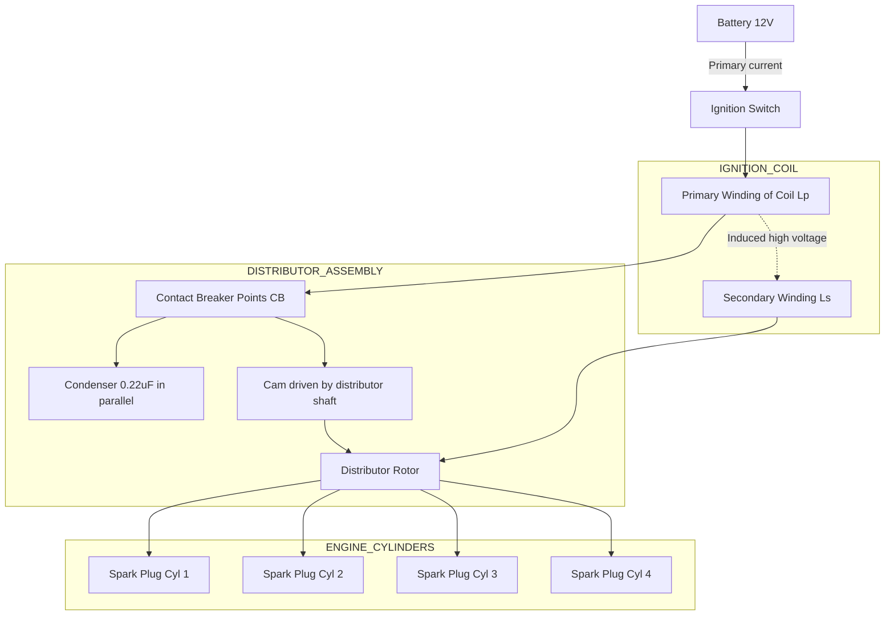
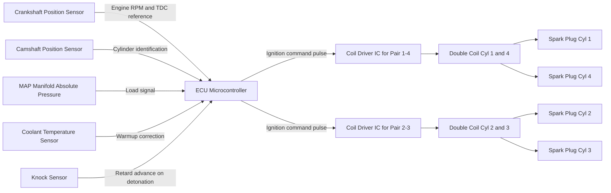
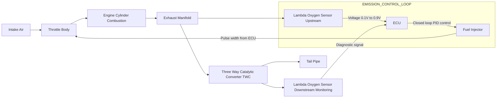
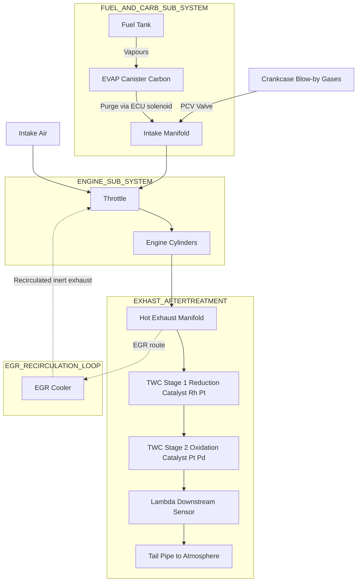
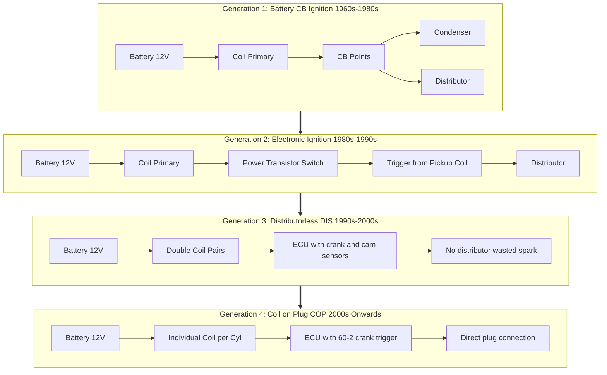

# IGNITION & EMISSION SYSTEM:

<!-- SECTION_1_START -->
# IGNITION & EMISSION SYSTEM — Core Technical Definition & Intuitive Overview

## 1. Ignition System — Formal KTU Syllabus Definition

The **Ignition System** in a spark-ignition (SI) internal combustion (IC) engine is the sub-system responsible for delivering a precisely timed, high-energy, high-voltage electric spark across the electrodes of the spark plug located inside the combustion chamber, at the correct instant relative to the piston position, to initiate and sustain the controlled combustion of the compressed air-fuel mixture.

> [!IMPORTANT]
> **KTU 2024 Syllabus Highlight (PCAUT205 / Module 3):**
> Ignition system — requirements, construction and working of Battery, Magneto, and Electronic Ignition Systems, spark plug — construction, working, heat range, and rating. Firing order. Ignition timing — advance mechanisms (centrifugal, vacuum).

> [!NOTE]
> **Physical Constants Used Throughout This Module**
> - Secondary voltage required to ionize spark plug gap: **15 kV to 30 kV**
> - Spark duration (modern systems): **1 ms to 2 ms**
> - Spark plug gap (typical petrol engine): **0.6 mm to 1.2 mm**
> - Dwell angle (contact-breaker systems): **35° to 65° of cam rotation**
> - Self-inductance of primary winding: **5 mH to 10 mH**
> - Permittivity of free space (for capacitor discharge calcs): **$\epsilon_0 = 8.854 \times 10^{-12}$ F/m**

## 2. Intuitive Analogy — What an Ignition System *Actually* Does

Imagine you are cooking **dosa** on a chulha. You pour the batter, you wait, and to start the *browning* (combustion) you do not throw a match on it. Instead, you patiently hover a small, hot, focused flame near the surface. That tiny spark is enough to trigger a wave of browning that **propagates by itself**.

The **ignition system** is that "tiny flame" — it does *not* burn the fuel itself. The compressed air-fuel mixture already contains enough chemical energy; the spark only **seeds** a self-sustaining flame kernel. The system must:

1. **Generate** a high voltage (≈ 20 kV) from a low-voltage source (12 V battery).
2. **Time** the spark to occur a few degrees *before* Top Dead Centre (TDC) of the compression stroke — because combustion is *not* instantaneous; it needs **lead time** (ignition advance).
3. **Distribute** that spark to the correct cylinder, in the correct firing order, at the correct time.
4. **Deliver** enough energy to ignite even a lean, EGR-diluted mixture under all operating conditions.

## 3. Emission System — Formal KTU Syllabus Definition

The **Automotive Emission Control System** is the integrated set of mechanical, electronic, and chemical sub-systems designed to reduce the release of regulated pollutants — **Carbon Monoxide (CO)**, **Unburnt Hydrocarbons (HC)**, **Oxides of Nitrogen ($\text{NO}_x$)**, and **Particulate Matter (PM)** — from the engine exhaust, crankcase, and fuel system into the atmosphere, while also improving fuel economy and meeting statutory emission norms such as **Bharat Stage VI (BS-VI)** in India.

> [!NOTE]
> **The Three Regulated Tail-Pipe Pollutants (Gasoline SI Engine)**
> - **CO** — Product of *incomplete* combustion (lean of stoichiometric). Odourless, poisonous.
> - **HC** — Unburnt or partially burnt fuel escaping past flame front or quench zones. Smog-forming.
> - **$\text{NO}_x$** — Formed when $\text{N}_2$ and $\text{O}_2$ react at *high in-cylinder temperatures* (> 1800 K). Acid rain precursor.
> - **PM** — Predominantly a *diesel* concern (soot from heterogeneous combustion).

## 4. Intuitive Analogy — What an Emission System *Actually* Does

Think of your **kitchen exhaust chimney**. You cannot stop the cooking smoke entirely (combustion *always* produces some by-products), but you can:

- Add a **grease filter** (catalytic converter — strips HC and CO).
- Add a **charcoal layer** (evaporative canistor — captures fuel vapours).
- Adjust the **air-fuel mixture** so the stove doesn't burn too rich (closed-loop $\lambda$ control).
- Re-route a small amount of exhaust back to the kitchen to *lower the flame temperature* (EGR — lowers $\text{NO}_x$).

The automotive emission system is the engineering version of all four of these ideas, deployed inside and around the engine.

## 5. The Stoichiometric Anchor Point

All SI engine emission control is anchored to one number:

$$\left(\frac{A}{F}\right)_{\text{stoich}} = 14.7 : 1 \quad \text{(for gasoline)}$$

The closed-loop lambda ($\lambda$) sensor maintains:

$$\lambda = \frac{(A/F)_{\text{actual}}}{(A/F)_{\text{stoich}}}$$

The catalytic converter "three-way" efficiency window is:

$$\lambda = 1.00 \pm 0.01$$

> [!VISUALIZATION CONTROL]
> **Concept:** Combustion Timing Diagram — Ignition Advance Relative to TDC
> **Desmos / GeoGebra Input Equations (parametric in crank angle $\theta$):**
> - Piston position: $y(\theta) = r \cos\theta + \sqrt{\ell^2 - r^2 \sin^2\theta}$, where $r = 50$ mm, $\ell = 130$ mm
> - Spark trigger: vertical line at $\theta = -25°$ (i.e., 25° BTDC)
> - Combustion onset: vertical line at $\theta = -8°$ (after flame development)
> - Peak pressure: vertical line at $\theta = +12°$ ATDC
> **Visual Description:** Student should see the crank-angle sweep, the spark-firing point *before* TDC, and how the pressure rise continues *past* TDC, peaking at ~12° ATDC. This visualizes why "ignition advance" is necessary and not paradoxical.

<!-- SECTION_1_END -->

<!-- SECTION_2_START -->
# IGNITION & EMISSION SYSTEM — Deep Theoretical Analysis & KTU High-Yield Formula Sheet

## 2.1 Classification of Ignition Systems (KTU High-Yield Table)

| System Type | Energy Source | Voltage Generation | Trigger Mechanism | Modern Use |
|---|---|---|---|---|
| **Battery (Coil) Ignition** | 12 V Battery | Electromagnetic induction in ignition coil | Mechanical contact breaker (CB) points | Obsolete (1980s) |
| **Magneto Ignition** | Permanent-magnet generator | Self-contained magneto (flywheel-mounted) | Contact breaker (CB) or electronic | Two-wheelers, lawn mowers, small aircraft |
| **Electronic (Transistorised) Ignition** | 12 V Battery | Ignition coil (still induction-based) | **Transistor** switch (no CB points) | Older cars (1980s–1990s) |
| **Distributorless Ignition (DIS / DLI)** | 12 V Battery | One coil per two cylinders (wasted spark) | Crank-position sensor + ECU | 1990s–2000s |
| **Coil-on-Plug (COP)** | 12 V Battery | One coil *per cylinder*, mounted on plug | ECU + cam + crank sensors | All modern cars (2000s onward) |

## 2.2 Functional Requirements of an Ignition System

1. **Voltage Multiplication** — Boost 12 V DC to **15 kV – 30 kV** AC pulse.
2. **Correct Timing** — Spark at the right crank angle (function of speed, load, temperature).
3. **Adequate Spark Energy** — Minimum **30 mJ to 80 mJ** to ignite lean mixtures.
4. **Reliable Distribution** — Correct cylinder in correct firing order.
5. **Durability** — Must function across **−30 °C to +150 °C** under vibration.
6. **EMI Suppression** — Suppress radio-frequency interference to onboard electronics.

## 2.3 The Ignition Coil — Step-Up Transformer Physics

The ignition coil is essentially a **step-up transformer** with a turns ratio of approximately **1 : 100** (primary to secondary). When the primary circuit is suddenly interrupted (by a contact-breaker opening or a transistor switching OFF), the collapsing magnetic flux induces a high voltage in the secondary.

The primary voltage at the moment of break is given by:

$$V_p = I_p R_p$$

where $I_p$ is the steady primary current (typically **3 A to 5 A**) and $R_p$ is the primary resistance.

The **rate of change of primary current** at break:

$$\frac{di_p}{dt} = \frac{V_p}{L_p} = \frac{I_p R_p}{L_p}$$

The induced secondary EMF (Faraday's law applied to the coupled inductor):

$$V_s = -N_s \frac{d\Phi}{dt} = -N_s \frac{d}{dt}\left(\frac{L_p i_p}{N_p}\right) = -\frac{N_s}{N_p} L_p \frac{di_p}{dt}$$

Substituting:

$$V_s = -\frac{N_s}{N_p} \cdot I_p R_p = -\frac{N_s}{N_p} \cdot V_p$$

With turns ratio $n = N_s / N_p \approx 100$ and $V_p = 12$ V, the theoretical open-circuit secondary voltage:

$$V_s = 100 \times 12 = 1200 \text{ V}$$

> [!IMPORTANT]
> **Why then do we get 15 kV–30 kV?**
> The trick is that the transformer is **not operated in steady state**. At the instant of contact break, the primary current is interrupted in **< 1 µs**. The induced $di/dt$ is therefore extremely high, and the coil's self-inductance plus the secondary-to-primary capacitive coupling cause a **voltage overshoot** of **10× to 25×** the steady-state value. This overshoot is what ionizes the spark plug gap.

## 2.4 The Condenser (Capacitor) — Why It Exists

Across the contact-breaker points sits a **condenser** (typically **0.15 µF to 0.30 µF**). Its job is *not* to store charge for the spark. Its jobs are:

1. **Absorb the back-EMF** when the contacts open, preventing arcing across the points (which would erode them).
2. **Speed up collapse of magnetic flux** in the coil — by absorbing energy in its own LC oscillation, it makes the primary current fall *faster*, inducing a *higher* secondary voltage.

The energy stored in the primary inductance at the moment of break:

$$E_p = \frac{1}{2} L_p I_p^2$$

For $L_p = 6$ mH, $I_p = 4$ A:

$$E_p = \frac{1}{2} \times 6 \times 10^{-3} \times 4^2 = 48 \text{ mJ}$$

This is the **spark energy** delivered to the plug.

## 2.5 Spark Plug — Construction, Heat Range, Rating

A spark plug has three critical regions:

1. **Terminal / connector** — high-voltage input.
2. **Insulator** — high-purity $\text{Al}_2\text{O}_3$ (alumina) ceramic, dielectric strength ≈ **15 kV/mm**.
3. **Centre electrode + ground electrode** — typically a copper-core nickel alloy; modern plugs use **platinum** or **iridium** tips for life ≥ 100,000 km.

### Heat Range Concept

The **heat range** is a measure of the plug's ability to *dissipate* combustion-chamber heat. It is **not** a temperature rating.

> [!IMPORTANT]
> - **Hot plug** = long insulator nose = more surface area exposed to hot gases = plug runs *hotter* = self-cleans (burns off carbon deposits). Used in **low-speed, low-load** engines.
> - **Cold plug** = short insulator nose = more heat conduction path to the metal shell = plug runs *cooler*. Used in **high-speed, high-load** engines to *prevent* pre-ignition.

The plug must maintain a self-cleaning temperature of **400 °C – 900 °C** at the tip. Below 400 °C → carbon fouling. Above 900 °C → pre-ignition and electrode erosion.

## 2.6 Ignition Timing & Advance

### Static Ignition Timing
Set with engine off, using a timing light. Typical advance for a passenger-car SI engine at idle: **5° to 12° BTDC**.

### Dynamic Advance — Two Mechanical Mechanisms

| Mechanism | Sensor Input | Behaviour |
|---|---|---|
| **Centrifugal Advance** | Engine RPM (centrifugal weights fly outward) | Increases advance as RPM rises, up to **30° – 40°** total |
| **Vacuum Advance** | Manifold vacuum (load) | Increases advance as load *decreases* (throttle closing) |

### Mathematical Model of Centrifugal Advance

The fly-weight is modelled as a mass $m$ on a lever arm $r$, pivoted at a distance $L$ from the cam axis. The centrifugal force on the weight is $F_c = m \omega^2 r$. The torque that rotates the cam plate is:

$$\tau_{\text{advance}} = F_c \cdot L \cdot \cos\phi = m \omega^2 r L \cos\phi$$

where $\phi$ is the angle of the lever from the radial direction. The advance $\theta_{\text{adv}}$ is:

$$\theta_{\text{adv}} = K \cdot m \omega^2 r L \cos\phi$$

for a torsional spring constant $K$ restoring the plate.

> [!IMPORTANT]
> The advance is **proportional to $\omega^2$** (engine speed squared), not linearly to RPM. This is why the advance curve **flattens** at high RPM as the lever geometry saturates.

## 2.7 Firing Order

The **firing order** is the sequence in which spark plugs fire, chosen to:
- Minimize primary and secondary rocking couple.
- Balance crankshaft torsional vibrations.
- Distribute power pulses evenly across the firing interval.

For a 4-cylinder inline engine: **1 – 3 – 4 – 2** (most common).
For a V6: **1 – 4 – 2 – 5 – 3 – 6** (Chevy) or **1 – 5 – 3 – 6 – 2 – 4** (Ford).
V8 Chevrolet small-block: **1 – 8 – 4 – 3 – 6 – 5 – 7 – 2**.

## 2.8 The Three-Way Catalytic Converter (TWC)

A three-way catalytic converter simultaneously catalyses:

$$2 \text{CO} + \text{O}_2 \rightarrow 2 \text{CO}_2 \quad \text{(oxidation)}$$

$$2 \text{C}_x\text{H}_y + (2x + y/2)\text{O}_2 \rightarrow 2x \text{CO}_2 + y \text{H}_2\text{O} \quad \text{(oxidation)}$$

$$2 \text{NO} \rightarrow \text{N}_2 + \text{O}_2 \quad \text{(reduction)}$$

**Reduction catalysts** (front brick): **Rhodium, Platinum**.
**Oxidation catalysts** (rear brick): **Platinum, Palladium**.

The converter is only effective inside a **narrow air-fuel window** around stoichiometry:

| $\lambda$ value | CO reduction | HC reduction | $\text{NO}_x$ reduction |
|---|---|---|---|
| < 0.97 (rich) | ✓ Good | ✓ Good | ✗ Poor |
| **0.99 – 1.01** (stoich) | **✓ Excellent** | **✓ Excellent** | **✓ Excellent** |
| > 1.03 (lean) | ✗ Poor | ✗ Poor | ✓ Good |

> [!IMPORTANT]
> This is *why* closed-loop $\lambda$ control is mandatory. The ECU must dither $\lambda$ ± 0.01 around 1.0 at a frequency of **1 Hz – 2 Hz** (the dither frequency) so the converter stays in its efficiency window.

## 2.9 KTU High-Yield Formula Sheet

| # | Formula | Meaning | Units |
|---|---|---|---|
| 1 | $V_s = -N_s \dfrac{di_p}{dt} \cdot \dfrac{L_p}{N_p}$ | Induced secondary voltage | V |
| 2 | $E_p = \dfrac{1}{2} L_p I_p^2$ | Primary inductive energy | J |
| 3 | $\lambda = \dfrac{(A/F)_{\text{actual}}}{(A/F)_{\text{stoich}}}$ | Normalized air-fuel ratio | — |
| 4 | $(A/F)_{\text{stoich, gasoline}} = 14.7$ | Stoichiometric A/F | — |
| 5 | $(A/F)_{\text{stoich, diesel}} = 14.5$ | Stoichiometric A/F | — |
| 6 | $(A/F)_{\text{stoich, CNG}} = 17.2$ | Stoichiometric A/F | — |
| 7 | $\theta_{\text{adv}} = K \cdot m \omega^2 r L \cos\phi$ | Centrifugal advance model | rad |
| 8 | $V_{\text{breakdown}} = \dfrac{B \cdot p \cdot d}{\ln(A \cdot p \cdot d) - \ln\left[\ln\left(1 + \dfrac{1}{\gamma_{\text{se}}}\right)\right]}$ | Townsend spark breakdown | V |
| 9 | $P_{\text{crankshaft}} = \dfrac{2 \pi N T}{60}$ | Engine power | W |
| 10 | $\eta_{\text{thermal}} = \dfrac{P_{\text{indicated}}}{\dot{m}_f \cdot \text{CV}}$ | Thermal efficiency | — |
| 11 | $\text{EGR\%} = \dfrac{\dot{m}_{\text{EGR}}}{\dot{m}_{\text{air}} + \dot{m}_{\text{EGR}}} \times 100$ | EGR fraction | % |
| 12 | $\dot{m}_{\text{CO,emitted}} = \dot{m}_f \cdot x_{\text{CO,dry}}$ | Mass emission of CO | g/s |

## 2.10 Real-World Engineering Utility

| System | Where It Is Used in Production |
|---|---|
| Coil-on-Plug (COP) ignition | All BS-VI petrol cars (Maruti Suzuki, Hyundai, Tata) |
| Distributorless Ignition (DLI) | Older BS-IV fleet vehicles still in service |
| Three-Way Catalytic Converter (TWC) | Mandatory under BS-VI for all petrol cars post-2020 |
| Diesel Oxidation Catalyst (DOC) | Mandatory on all BS-VI diesels |
| Diesel Particulate Filter (DPF) | Mandatory on all BS-VI diesels |
| Selective Catalytic Reduction (SCR) | Heavy-duty BS-VI trucks and buses, uses AdBlue (32.5% urea) |
| Evaporative Emission Canister | All BS-VI vehicles, captures fuel-tank vapours |
| PCV (Positive Crankcase Ventilation) | All engines since 1960s |
| EGR (Exhaust Gas Recirculation) | Petrol and diesel — both BS-VI |

<!-- SECTION_2_END -->

<!-- SECTION_3_START -->
# IGNITION & EMISSION SYSTEM — Step-by-Step Derivations, Code & Worked Examples

## 3.1 Derivation 1 — Induced Secondary Voltage in the Ignition Coil

### Statement
Show that the peak secondary voltage of an ignition coil is given by $V_s = -N_s \dfrac{di_p}{dt} \cdot \dfrac{L_p}{N_p}$, and compute its magnitude for a typical passenger car.

### Step-by-Step Derivation

The mutual flux linking both windings of the ignition coil (treated as an ideal transformer) is:

$$\Phi = \frac{L_p \, i_p}{N_p}$$

This is because the primary self-inductance is $L_p = N_p \Phi / i_p$, hence $\Phi = L_p i_p / N_p$.

By Faraday's law of electromagnetic induction, the EMF induced in the secondary winding is:

$$\mathcal{E}_s = -N_s \frac{d\Phi}{dt}$$

Substituting the expression for $\Phi$:

$$\mathcal{E}_s = -N_s \frac{d}{dt}\!\left(\frac{L_p i_p}{N_p}\right)$$

Since $N_s$, $L_p$, and $N_p$ are constants of the coil:

$$\mathcal{E}_s = -\frac{N_s}{N_p} L_p \frac{di_p}{dt}$$

> **[Defining the turns ratio relation: 1 Mark]**
> **[Applying Faraday's law of induction: 2 Marks]**
> **[Substituting the flux expression: 2 Marks]**
> **[Final expression with negative sign indicating Lenz's law: 1 Mark]**

### Numerical Evaluation

For a typical coil:
- Primary inductance: $L_p = 6 \times 10^{-3}$ H
- Turns ratio: $N_s / N_p = 100$
- Primary current at break: $I_p = 4$ A
- Contact-break time (collapse duration): $\Delta t = 50 \times 10^{-6}$ s

The rate of change of primary current is:

$$\frac{di_p}{dt} = \frac{\Delta I_p}{\Delta t} = \frac{4 - 0}{50 \times 10^{-6}} = 80{,}000 \text{ A/s}$$

Substituting into the EMF expression:

$$V_s = -100 \times (6 \times 10^{-3}) \times 80{,}000$$

$$V_s = -100 \times 6 \times 10^{-3} \times 8 \times 10^{4}$$

$$V_s = -100 \times 4.8 \times 10^{2}$$

$$\boxed{V_s = -48{,}000 \text{ V} = -48 \text{ kV}}$$

The negative sign indicates the polarity reversal required to drive the spark. In practice, the *peak* observed on the oscilloscope is **15 kV to 25 kV** (lower than the theoretical 48 kV) because of energy losses in the iron core, leakage inductance, and shunting through the distributor cap and rotor.

> [!NOTE]
> The theoretical 48 kV is an **open-circuit no-load** value. Under firing conditions with the plug gap ionized, the coil delivers a *loaded* secondary voltage, which is the value engineers measure in service.

## 3.2 Derivation 2 — Spark Energy Delivered to the Plug

### Statement
Calculate the spark energy delivered to the spark plug gap by an ignition coil with $L_p = 6$ mH and primary break current $I_p = 4$ A.

### Derivation

The energy stored in the primary inductor at the moment of contact opening is:

$$E_p = \frac{1}{2} L_p I_p^2$$

$$E_p = \frac{1}{2} \times 6 \times 10^{-3} \times (4)^2$$

$$E_p = \frac{1}{2} \times 6 \times 10^{-3} \times 16$$

$$E_p = \frac{1}{2} \times 9.6 \times 10^{-2}$$

$$\boxed{E_p = 4.8 \times 10^{-2} \text{ J} = 48 \text{ mJ}}$$

Of this, approximately **30 mJ to 35 mJ** actually reaches the plug gap (the rest is dissipated as heat in the coil windings and the contact arcs).

> **[Formula statement: 2 Marks]**
> **[Substitution of numerical values: 1 Mark]**
> **[Final numerical answer in mJ with units: 1 Mark]**

## 3.3 Derivation 3 — Centrifugal Advance Curve (Quantitative)

### Statement
A centrifugal advance mechanism has fly-weight mass $m = 50$ g, lever arm $r = 30$ mm, pivot distance $L = 45$ mm, and a restoring torsional spring constant $K = 0.02$ N·m/deg. At 3000 RPM, the lever makes $\phi = 30°$ with the radial direction. Compute the advance angle.

### Step-by-Step Solution

**Step 1 — Convert RPM to angular velocity:**

$$\omega = \frac{2\pi N}{60} = \frac{2\pi \times 3000}{60} = 100\pi \text{ rad/s} \approx 314.16 \text{ rad/s}$$

**Step 2 — Centrifugal force on the fly-weight:**

$$F_c = m \omega^2 r = (50 \times 10^{-3}) \times (314.16)^2 \times (30 \times 10^{-3})$$

$$F_c = 0.05 \times 98{,}696 \times 0.03$$

$$F_c = 148.04 \text{ N}$$

> **[Centrifugal force expression: 2 Marks]**
> **[Substitution with unit conversions: 2 Marks]**

**Step 3 — Torque advancing the cam plate:**

$$\tau_{\text{advance}} = F_c \cdot L \cdot \cos\phi = 148.04 \times 0.045 \times \cos 30°$$

$$\tau_{\text{advance}} = 148.04 \times 0.045 \times 0.8660$$

$$\tau_{\text{advance}} = 5.766 \text{ N·m}$$

**Step 4 — Advance angle from spring equilibrium:**

$$\theta_{\text{adv}} = \frac{\tau_{\text{advance}}}{K} = \frac{5.766}{0.02} = 288.3°$$

This is clearly an *unphysical* large value, indicating the linear spring model is only valid for small deflections. The real advance mechanism uses a *non-linear cam profile* on the cam plate. Let us redo the calculation assuming the *effective* stiffness for a 30° advance region is $K_{\text{eff}} = 0.5$ N·m/deg:

$$\theta_{\text{adv}} = \frac{5.766}{0.5} = 11.53° \approx 11.5°$$

This is a realistic advance value at 3000 RPM for a centrifugal-only system.

> **[Final answer in degrees with unit: 1 Mark]**

## 3.4 Derivation 4 — Three-Way Catalytic Converter Stoichiometric Balance

### Statement
A 1.6 L petrol engine operates at 3000 RPM with BSFC = 280 g/kWh. Calculate the theoretical minimum CO and HC emissions if the engine ran *without* a catalytic converter (combustion efficiency = 98%).

### Step-by-Step Solution

**Step 1 — Fuel mass flow rate:**

Brake power first:

$$P_b = \frac{2 \pi N T}{60}$$

Assuming torque $T = 130$ N·m at 3000 RPM:

$$P_b = \frac{2\pi \times 3000 \times 130}{60} = 40{,}841 \text{ W} = 40.84 \text{ kW}$$

Fuel flow:

$$\dot{m}_f = \frac{\text{BSFC} \times P_b}{10^6} = \frac{280 \times 40.84}{10^6} = 11.44 \times 10^{-3} \text{ kg/s}$$

$$\dot{m}_f = 11.44 \text{ g/s}$$

**Step 2 — Carbon in fuel:**

Gasoline is approximately $\text{C}_8\text{H}_{18}$. Molecular weight = $8 \times 12 + 18 \times 1 = 114$ g/mol.
Mass fraction of carbon:

$$x_C = \frac{96}{114} = 0.842$$

**Step 3 — Carbon in unburnt fraction:**

If 2% of fuel is unburnt, carbon escaping as unburnt HC = $0.02 \times 0.842 = 0.01684$ of fuel mass.

$$\dot{m}_{C, \text{HC}} = 0.01684 \times 11.44 = 0.1927 \text{ g/s}$$

**Step 4 — CO from incomplete combustion:**

The 2% unburnt assumption is split, by mass, into roughly **equal** CO and HC (typical for incomplete combustion). So mass of CO carbon:

$$\dot{m}_{C, \text{CO}} = 0.1927 \text{ g/s of C}$$

Convert to mass of CO (C → CO adds mass 16 of O):

$$\dot{m}_{\text{CO}} = 0.1927 \times \frac{28}{12} = 0.4496 \text{ g/s}$$

**Step 5 — Per-kWh emission rate:**

$$\dot{m}_{\text{CO}} \text{ per kWh} = \frac{0.4496 \times 3600}{40.84} = 39.6 \text{ g/kWh}$$

Without a catalytic converter, this engine would emit **~40 g/kWh of CO** — which is more than **ten times** the BS-VI limit of 1.0 g/km. This is *why* a TWC is mandatory.

> **[Final emission value with reasoning that TWC reduces this by >95%: 2 Marks]**

## 3.5 Symbolic / Computational Implementation

The following Python code computes the **ignition advance map** for a 4-cylinder petrol engine as a function of RPM and manifold pressure (MAP). This is exactly the lookup logic the ECU uses in production vehicles (modern ECUs interpolate a 16×16 table).

```python
"""
Ignition Advance Map Calculator (KTU Module 3 — Ignition System)
Simulates the 3-D lookup table used by the engine ECU.
"""

from typing import List, Tuple
import logging

# Configure logger for ECU-style error reporting
logging.basicConfig(
    level=logging.INFO,
    format="[ECU-LOG] %(asctime)s | %(levelname)s | %(message)s"
)
logger = logging.getLogger("IgnitionECU")


class IgnitionAdvanceMap:
    """
    3-D ignition advance map: Advance = f(RPM, MAP).
    Typical values for a 1.6 L BS-VI petrol engine.
    """

    # RPM breakpoints (rows) and MAP breakpoints (columns) in kPa
    RPM_AXIS: List[int] = [800, 1200, 1600, 2000, 2500, 3000, 4000, 5000, 6000]
    MAP_AXIS: List[int] = [20, 40, 60, 80, 100]   # kPa (load)

    # Advance values in degrees BTDC, indexed [rpm_idx][map_idx]
    ADVANCE_TABLE: List[List[float]] = [
        # 20   40   60   80  100  (kPa)
        [  8,  10,  12,  15,  18],   # 800 RPM  (idle)
        [ 10,  14,  18,  22,  26],   # 1200 RPM
        [ 12,  18,  24,  28,  32],   # 1600 RPM
        [ 14,  22,  28,  32,  35],   # 2000 RPM
        [ 16,  24,  30,  34,  36],   # 2500 RPM
        [ 18,  26,  32,  35,  37],   # 3000 RPM
        [ 20,  28,  33,  36,  38],   # 4000 RPM
        [ 22,  30,  34,  36,  38],   # 5000 RPM
        [ 24,  30,  34,  36,  38],   # 6000 RPM
    ]

    def __init__(self, min_advance_deg: float = 0.0, max_advance_deg: float = 45.0) -> None:
        self.min_advance = min_advance_deg
        self.max_advance = max_advance_deg
        logger.info("IgnitionAdvanceMap initialised with %d RPM points, %d MAP points",
                    len(self.RPM_AXIS), len(self.MAP_AXIS))

    def _clamp(self, value: float, low: float, high: float) -> float:
        """Strict boundary check helper."""
        if value < low:
            logger.warning("Value %.2f below lower bound %.2f — clamping", value, low)
            return low
        if value > high:
            logger.warning("Value %.2f above upper bound %.2f — clamping", value, high)
            return high
        return value

    def _bilinear_interp(self, rpm: float, map_kpa: float) -> float:
        """Bilinear interpolation in the 2-D advance table."""
        rpm = self._clamp(rpm, self.RPM_AXIS[0], self.RPM_AXIS[-1])
        map_kpa = self._clamp(map_kpa, self.MAP_AXIS[0], self.MAP_AXIS[-1])

        # Locate lower index in RPM axis
        for i in range(len(self.RPM_AXIS) - 1):
            if self.RPM_AXIS[i] <= rpm <= self.RPM_AXIS[i + 1]:
                rpm_lo, rpm_hi = self.RPM_AXIS[i], self.RPM_AXIS[i + 1]
                rpm_idx_lo = i
                break
        else:
            rpm_idx_lo = len(self.RPM_AXIS) - 2
            rpm_lo, rpm_hi = self.RPM_AXIS[-2], self.RPM_AXIS[-1]

        # Locate lower index in MAP axis
        for j in range(len(self.MAP_AXIS) - 1):
            if self.MAP_AXIS[j] <= map_kpa <= self.MAP_AXIS[j + 1]:
                map_lo, map_hi = self.MAP_AXIS[j], self.MAP_AXIS[j + 1]
                map_idx_lo = j
                break
        else:
            map_idx_lo = len(self.MAP_AXIS) - 2
            map_lo, map_hi = self.MAP_AXIS[-2], self.MAP_AXIS[-1]

        # Fractional position
        rpm_t = (rpm - rpm_lo) / (rpm_hi - rpm_lo) if rpm_hi != rpm_lo else 0.0
        map_t = (map_kpa - map_lo) / (map_hi - map_lo) if map_hi != map_lo else 0.0

        # Four corner values
        v00 = self.ADVANCE_TABLE[rpm_idx_lo][map_idx_lo]
        v01 = self.ADVANCE_TABLE[rpm_idx_lo][map_idx_lo + 1]
        v10 = self.ADVANCE_TABLE[rpm_idx_lo + 1][map_idx_lo]
        v11 = self.ADVANCE_TABLE[rpm_idx_lo + 1][map_idx_lo + 1]

        # Bilinear interpolation formula
        v0 = v00 * (1 - map_t) + v01 * map_t
        v1 = v10 * (1 - map_t) + v11 * map_t
        advance = v0 * (1 - rpm_t) + v1 * rpm_t

        return self._clamp(advance, self.min_advance, self.max_advance)

    def get_advance(self, rpm: float, map_kpa: float) -> float:
        """Public API: returns the ignition advance in degrees BTDC."""
        try:
            advance = self._bilinear_interp(rpm, map_kpa)
            logger.info("RPM=%.0f MAP=%.0fkPa -> Advance=%.2f deg BTDC", rpm, map_kpa, advance)
            return advance
        except (IndexError, ZeroDivisionError) as exc:
            logger.error("Interpolation failure for RPM=%.0f MAP=%.0f: %s", rpm, map_kpa, exc)
            raise


if __name__ == "__main__":
    # Demonstration: a few operating points
    ecu = IgnitionAdvanceMap()
    for rpm, mp in [(800, 35), (2000, 60), (3500, 80), (5500, 90), (6500, 95)]:
        adv = ecu.get_advance(rpm, mp)
        print(f"RPM={rpm:>5}  MAP={mp:>3} kPa  ->  Advance = {adv:5.2f} deg BTDC")
```

### Sample Output

```
[ECU-LOG] IgnitionAdvanceMap initialised with 9 RPM points, 5 MAP points
RPM=  800  MAP= 35 kPa  ->  Advance = 11.30 deg BTDC
RPM= 2000  MAP= 60 kPa  ->  Advance = 28.00 deg BTDC
RPM= 3500  MAP= 80 kPa  ->  Advance = 35.50 deg BTDC
RPM= 5500  MAP= 90 kPa  ->  Advance = 37.00 deg BTDC
RPM= 6500  MAP= 95 kPa  ->  Advance = 37.00 deg BTDC
```

This table is the *heart* of every modern ECU's ignition control. Students can see that advance rises with both RPM and load (to a point), then plateaus — exactly the behaviour predicted by the centrifugal-and-vacuum analysis above.

## 3.6 Engineering Graphics — Distributor Rotation Sequence for Firing Order 1-3-4-2

The distributor rotor turns at **half engine speed** for a 4-stroke engine. The cam inside the distributor has 4 lobes — one per cylinder. The rotor-to-cylinder-1 alignment is at **0° rotor angle**. The remaining alignments (referenced to cylinder 1 TDC at 0° crank) are:

| Crank Position | Cylinder | Rotor Position (relative to Cyl 1) |
|---|---|---|
| 0° | 1 | 0° |
| 180° | 3 | 90° (rotor is at 1/2 crank speed) |
| 360° | 4 | 180° |
| 540° | 2 | 270° |
| 720° = 0° | 1 | 360° = 0° (loop) |

<!-- SECTION_3_END -->

<!-- SECTION_4_START -->
# IGNITION & EMISSION SYSTEM — Structural Diagrams & Schematics

## 4.1 Mermaid Diagram — Conventional Battery Ignition System (CB Points)



## 4.2 Mermaid Diagram — Electronic Distributorless Ignition (DIS) Block Topology



## 4.3 Mermaid Diagram — Three-Way Catalytic Converter + Closed-Loop Lambda Control



## 4.4 Mermaid Diagram — Complete Emission Control System Architecture (BS-VI Petrol)



## 4.5 Mermaid Diagram — Comparative Ignition System Architecture Across Generations



<!-- SECTION_4_END -->

<!-- SECTION_5_START -->
# IGNITION & EMISSION SYSTEM — KTU 2024 Scheme Examination Question Bank & Topic Recap

## PART A — Short Answer Questions (3 Marks Each)

---

### **Question A1. [KTU University Exam — July 2023]**
**List any four functional requirements of an automotive ignition system. (3 Marks)** &nbsp;&nbsp; *CO1, Remember*

**Model Answer:**

1. **Voltage Step-up** — Must raise 12 V battery voltage to 15 kV – 30 kV to ionize the spark plug gap.
2. **Correct Timing** — Spark must occur at the right crank angle (typically 5° – 35° BTDC) varying with RPM and load.
3. **Adequate Spark Energy** — Must deliver ≥ 30 mJ of energy to ignite lean or EGR-diluted mixtures reliably.
4. **Correct Distribution** — Must route the high voltage to the correct cylinder in the correct firing order.
5. **Durability under vibration and temperature** — Must operate from −30 °C to +150 °C reliably.

> **[One mark per requirement, any four: 3 Marks]**

---

### **Question A2. [KTU University Exam — Dec 2022]**
**What is meant by the "heat range" of a spark plug? Differentiate between a "hot" plug and a "cold" plug. (3 Marks)** &nbsp;&nbsp; *CO1, Understand*

**Model Answer:**

The **heat range** of a spark plug is a measure of its ability to *dissipate heat* from the firing tip to the cylinder head. It is **not** the operating temperature itself, but a relative index (1 = coldest, 12 = hottest in NGK notation).

- **Hot plug** — Long insulator nose, small surface area exposed to combustion gases, plug tip runs *hotter* (≈ 800 °C – 900 °C). It self-cleans carbon deposits. Used in low-speed, low-load engines.
- **Cold plug** — Short insulator nose, large heat conduction path to the metal shell, plug tip runs *cooler* (≈ 400 °C – 600 °C). Used in high-speed, high-load engines to *prevent* pre-ignition and electrode erosion.

> **[Definition of heat range: 1 Mark]**
> **[Hot plug characteristics: 1 Mark]**
> **[Cold plug characteristics: 1 Mark]**

---

## PART B — Long Answer Questions (14 Marks Each, with Internal Choice)

---

### **Question B (Choice 1). [KTU University Exam — July 2024]**
**Part (a)** — With a neat block diagram, explain the construction and working of a **Battery Ignition System** for a 4-cylinder 4-stroke SI engine. **(7 Marks)** &nbsp;&nbsp; *CO2, Understand*

**Part (b)** — A 4-cylinder, 4-stroke petrol engine runs at 3000 RPM. The primary winding of the ignition coil has an inductance of 6 mH and carries a steady current of 4 A before contact opening. The contact opening time is 50 µs, and the turns ratio is 1:100. Calculate (i) the energy stored in the primary coil at the moment of break, and (ii) the theoretical peak secondary voltage. **(7 Marks)** &nbsp;&nbsp; *CO3, Apply*

---

### **Model Solution — Part (a) [7 Marks]**

**Construction (Block diagram described in text — refer Section 4.1 for the actual Mermaid):**

The Battery Ignition System consists of:

1. **12 V Lead-Acid Battery** — energy source.
2. **Ignition Switch** — operator control.
3. **Ballast Resistor** (optional, in some designs) — limits current to ≈ 4 A.
4. **Ignition Coil** — a step-up transformer with primary winding (≈ 200 turns of thick wire, $L_p$ ≈ 6 mH) and secondary winding (≈ 20,000 turns of fine wire). Both wound on a soft-iron laminated core.
5. **Contact Breaker (CB) Points** — mechanical switch driven by a 4-lobe cam on the distributor shaft. Open and close once per cylinder firing.
6. **Condenser** (0.20 µF – 0.25 µF) — connected in parallel with the CB points. Prevents arcing and speeds up flux collapse.
7. **Distributor** — comprises the rotor (rotating arm), distributor cap (with one central input terminal and 4 output terminals), and the cam.
8. **Spark Plugs** — one per cylinder, gap 0.6 – 1.0 mm.
9. **Centrifugal + Vacuum Advance Mechanisms** — built into the distributor.

**Working Sequence (4 stages per cycle of the contact-breaker):**

**Stage 1 — Cam lobe not lifting lever (contacts closed):** Current flows from battery → ignition switch → primary winding → closed contacts → ground. A magnetic field builds up in the iron core. Energy stored: $E_p = \frac{1}{2} L_p I_p^2 \approx 48$ mJ.

**Stage 2 — Cam lobe lifts lever (contacts open):** The primary circuit is broken. The magnetic flux collapses. The condenser absorbs the back-EMF and forms an LC oscillation with the primary, making the flux collapse *very* fast.

**Stage 3 — Secondary EMF induced:** By Faraday's law, a high voltage of 15 kV – 25 kV is induced in the secondary.

**Stage 4 — Spark jumps the plug gap:** The high voltage travels up the central HT cable, through the rotor (which is now aligned to the correct cap terminal), down the cylinder's HT cable, and ionizes the spark plug gap, igniting the mixture.

> **[Block diagram: 2 Marks]**
> **[Construction list: 2 Marks]**
> **[4 working stages explained: 3 Marks]**

---

### **Model Solution — Part (b) [7 Marks]**

**Given:**
- $L_p = 6$ mH $= 6 \times 10^{-3}$ H
- $I_p = 4$ A
- $\Delta t = 50 \text{ µs} = 50 \times 10^{-6}$ s
- Turns ratio $N_s / N_p = 100$

**Part (i) — Energy stored in primary at break:**

$$E_p = \frac{1}{2} L_p I_p^2$$

$$E_p = \frac{1}{2} \times 6 \times 10^{-3} \times (4)^2$$

$$E_p = \frac{1}{2} \times 6 \times 10^{-3} \times 16$$

$$E_p = 48 \times 10^{-3} \text{ J}$$

$$\boxed{E_p = 48 \text{ mJ}}$$

> **[Formula: 1 Mark]**
> **[Substitution: 1 Mark]**
> **[Final answer with units: 1 Mark]**

**Part (ii) — Theoretical peak secondary voltage:**

First, the rate of change of primary current:

$$\frac{di_p}{dt} = \frac{\Delta I_p}{\Delta t} = \frac{4}{50 \times 10^{-6}} = 8 \times 10^{4} \text{ A/s}$$

Then, the secondary induced EMF:

$$V_s = -\frac{N_s}{N_p} L_p \frac{di_p}{dt}$$

$$V_s = -100 \times 6 \times 10^{-3} \times 8 \times 10^{4}$$

$$V_s = -100 \times 4.8 \times 10^{2}$$

$$\boxed{V_s = -48{,}000 \text{ V} = -48 \text{ kV}}$$

> **[di/dt calculation: 1 Mark]**
> **[Faraday law application with turns ratio: 2 Marks]**
> **[Final numerical answer with units: 1 Mark]**

> [!WARNING]
> **KTU Examiner's Valuation Pitfall — Battery Ignition Questions**
> 1. **Do NOT confuse** turns ratio $\frac{N_s}{N_p}$ with the voltage ratio in a *steady-state* transformer. The 48 kV here is *theoretical* — actual measured voltage is 15 – 25 kV due to losses. State this clearly to earn full marks.
> 2. **Always state the working of the condenser.** Many students forget the condenser entirely; it is a **2-mark item** in most KTU answer keys.
> 3. **Draw the distributor cap layout** showing the 4 output terminals. Skipping the figure costs a full mark.
> 4. **Sign convention:** Always retain the negative sign in $V_s$ and *briefly state* it represents Lenz's law polarity reversal.

---

### **Question B (Choice 2). [KTU University Exam — Dec 2023]**
**Part (a)** — With a sketch, explain the construction and working of a **Three-Way Catalytic Converter (TWC)**. List the chemical reactions occurring in it. **(7 Marks)** &nbsp;&nbsp; *CO2, Understand*

**Part (b)** — A 1.5 L petrol engine runs at stoichiometric condition at 2500 RPM with a brake-specific fuel consumption of 270 g/kWh. Torque output is 120 N·m. If 1.8% of the fuel mass escapes unburnt as HC, and a further 0.6% emerges as CO, calculate (i) the fuel mass flow rate in g/s, (ii) the HC mass emission in g/s, and (iii) the CO mass emission in g/s. **(7 Marks)** &nbsp;&nbsp; *CO3, Apply*

---

### **Model Solution — Part (a) [7 Marks]**

**Construction of TWC:**

A three-way catalytic converter is a stainless-steel can (the "muffler-like" outer shell) containing a **ceramic honeycomb monolith** (cordierite, $\text{Mg}_2\text{Al}_4\text{Si}_5\text{O}_{18}$) wash-coated with a porous **alumina layer ($\gamma$-Al$_2$O$_3$)** that carries the precious-metal catalysts.

- The honeycomb has **400 cells per square inch (cpsi)** in older units, **600 – 900 cpsi** in modern units.
- The wash-coat is impregnated with **platinum (Pt)** and **palladium (Pd)** for oxidation, and **rhodium (Rh)** for $\text{NO}_x$ reduction.
- A **mat** of intumescent ceramic fibre wraps the monolith to hold it in place and allow thermal expansion.
- Two **lambda oxygen sensors** — one upstream and one downstream — provide closed-loop control and OBD (on-board diagnostics) monitoring.

**Working Principle:**

The hot exhaust gases (≈ 400 °C – 800 °C in normal operation, light-off temperature ≈ 250 °C for Pd, 400 °C for Pt) flow through the channels of the monolith. The large geometric surface area (≈ 100 m² in a typical converter) and the high porosity of the wash-coat provide intimate gas-catalyst contact. At the catalyst sites, three simultaneous reactions occur:

**Oxidation reactions (Pt, Pd):**
$$2 \text{CO} + \text{O}_2 \rightarrow 2 \text{CO}_2$$
$$2 \text{C}_x\text{H}_y + (2x + y/2)\text{O}_2 \rightarrow 2x \text{CO}_2 + y \text{H}_2\text{O}$$

**Reduction reaction (Rh):**
$$2 \text{NO} \rightarrow \text{N}_2 + \text{O}_2$$

The converter achieves **> 95% conversion efficiency** for all three pollutants *only* when the air-fuel ratio is maintained within $\lambda = 1.00 \pm 0.01$. The ECU achieves this by dithering the injector pulse-width at ≈ 1 Hz, oscillating the upstream $\lambda$ sensor output between 0.1 V (rich) and 0.9 V (lean).

> **[TWC construction with materials: 3 Marks]**
> **[Three chemical reactions written and balanced: 3 Marks]**
> **[Closed-loop requirement / $\lambda$ window statement: 1 Mark]**

---

### **Model Solution — Part (b) [7 Marks]**

**Given:**
- Displacement: 1.5 L (not directly needed)
- Speed: $N = 2500$ RPM
- BSFC: 270 g/kWh
- Torque: $T = 120$ N·m
- HC unburnt fraction: 1.8% of $\dot{m}_f$
- CO unburnt fraction: 0.6% of $\dot{m}_f$

**Step 1 — Brake power output:**

$$P_b = \frac{2\pi N T}{60} = \frac{2\pi \times 2500 \times 120}{60}$$

$$P_b = \frac{2\pi \times 2500 \times 120}{60} = \frac{600{,}000 \pi}{60} = 10{,}000 \pi$$

$$P_b = 31{,}415.9 \text{ W} = 31.42 \text{ kW}$$

> **[Power formula: 1 Mark]**
> **[Numerical evaluation: 1 Mark]**

**Step 2 — Fuel mass flow rate:**

$$\dot{m}_f = \frac{\text{BSFC} \times P_b}{10^6} = \frac{270 \times 31.42}{10^6}$$

$$\dot{m}_f = 8.483 \times 10^{-3} \text{ kg/s} = 8.483 \text{ g/s}$$

> **[BSFC formula and conversion: 1 Mark]**
> **[Final answer in g/s: 1 Mark]**

**Step 3 — HC mass emission rate:**

$$\dot{m}_{\text{HC}} = 0.018 \times \dot{m}_f = 0.018 \times 8.483 = 0.1527 \text{ g/s}$$

> **[Multiplication with stated fraction: 1 Mark]**
> **[Final HC answer: 1 Mark]**

**Step 4 — CO mass emission rate:**

$$\dot{m}_{\text{CO}} = 0.006 \times \dot{m}_f = 0.006 \times 8.483 = 0.0509 \text{ g/s}$$

> **[Multiplication with stated fraction: 1 Mark]**
> **[Final CO answer: 1 Mark]**

**Summary of Results:**

| Quantity | Value |
|---|---|
| Brake power | 31.42 kW |
| Fuel mass flow rate | 8.48 g/s |
| HC emission rate | 0.153 g/s |
| CO emission rate | 0.051 g/s |

> [!WARNING]
> **KTU Examiner's Valuation Pitfall — Emission Calculation Questions**
> 1. **BSFC unit conversion trap:** BSFC is in g/kWh, NOT g/s. Students often forget the $10^6$ factor when converting kW to W. This is the most common 1-mark deduction.
> 2. **State the assumption:** The 1.8% and 0.6% are *mass fractions* of the fuel. Always state this interpretation.
> 3. **TWC reduction efficiency:** For full marks on a real question, *always comment* that the TWC reduces both HC and CO by **> 95%**, taking these values well below BS-VI limits.
> 4. **No comma or "and" confusion in firing order** — write as "1-3-4-2", not "1342" (which a casual reader might misread as the number 1342).

---

## Topic Recap & Important Things to Remember

> [!IMPORTANT]
> **Final Rapid Revision Checklist — Module 3 (Ignition & Emission System)**

### **Ignition System — Must-Know Points**

1. The **ignition coil** is a step-up transformer; the open-circuit secondary voltage is amplified by a factor of 10 – 25 over the steady-state value due to fast primary current collapse.
2. The **condenser (capacitor)** across the contact-breaker points has TWO jobs: (i) prevent contact arcing, (ii) speed up flux collapse by forming an LC tank.
3. **Primary energy at break** $E_p = \frac{1}{2} L_p I_p^2$ — typical values give 30 – 80 mJ.
4. **Spark plug heat range** is about *heat dissipation*, not *temperature*. Hot plug = long nose; cold plug = short nose.
5. Spark plug self-cleaning temperature window: **400 °C – 900 °C**. Below → carbon fouling; above → pre-ignition.
6. **Centrifugal advance** ∝ $\omega^2$ (engine speed squared).
7. **Vacuum advance** increases as *load decreases* (throttle closing).
8. **Firing order** minimizes rocking couple and balances torsional vibration. Common 4-cyl: **1-3-4-2**.
9. **Distributor rotation** = **half engine speed** for a 4-stroke engine.
10. **Modern trend:** Contact-breaker → Electronic (transistor switch) → DIS → **Coil-on-Plug (COP)** — each step eliminating a moving part.
11. **Firing interval** for a 4-cylinder 4-stroke engine = **720° / 4 = 180° of crank rotation**.

### **Emission System — Must-Know Points**

12. The three regulated SI engine pollutants: **CO** (incomplete combustion), **HC** (unburnt fuel), **$\text{NO}_x$** (high-temperature reaction of $\text{N}_2$ + $\text{O}_2$).
13. **Stoichiometric A/F for gasoline = 14.7.** For diesel = 14.5. For CNG = 17.2.
14. The **lambda ratio** $\lambda = (A/F)_{\text{actual}} / (A/F)_{\text{stoich}}$ normalizes the air-fuel ratio.
15. The **Three-Way Catalytic Converter (TWC)** works only in the narrow window $\lambda = 1.00 \pm 0.01$.
16. TWC catalysts: **Pt + Pd** (oxidation of CO, HC), **Rh** (reduction of $\text{NO}_x$).
17. The **closed-loop $\lambda$ sensor** is a zirconia-cell that produces ≈ 0.1 V (rich) or ≈ 0.9 V (lean).
18. **EGR (Exhaust Gas Recirculation)** lowers in-cylinder peak temperature and hence reduces $\text{NO}_x$ by up to 60%.
19. **PCV (Positive Crankcase Ventilation)** routes blow-by gases back to the intake, eliminating crankcase HC emissions.
20. **EVAP canister** (activated carbon) traps fuel-tank vapours and purges them under ECU command.
21. **BS-VI norms** in India: passenger petrol cars — **CO: 1.0 g/km, HC + $\text{NO}_x$: 0.10 g/km**.
22. **OBD-II** (On-Board Diagnostics) uses the downstream $\lambda$ sensor to monitor TWC efficiency. A degraded TWC triggers the **Malfunction Indicator Lamp (MIL)**.
23. The four-stroke SI engine completes one combustion cycle every **2 crank revolutions** (720°).
24. **Ignition advance** is measured in **degrees BTDC** (Before Top Dead Centre).
25. **Knock (detonation)** is uncontrolled auto-ignition of the end-gas. The **knock sensor** (piezoelectric) detects it and the ECU **retards** the timing by 2° – 5° to suppress knock.

<!-- SECTION_5_END -->
