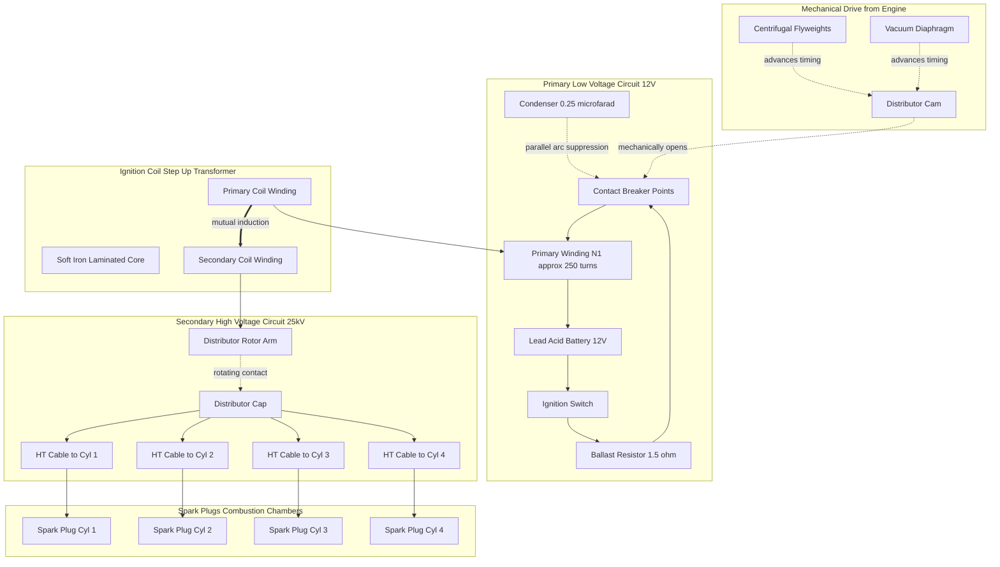
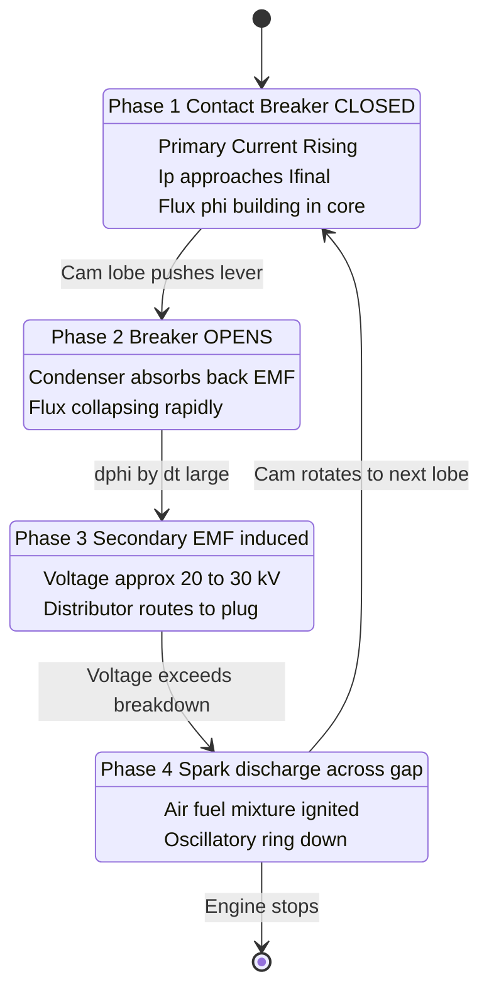
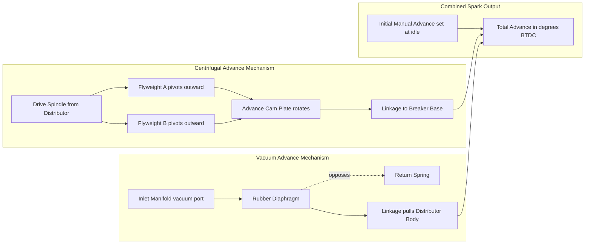

# Ignition system in IC engines: Ignition System Overview Battery ignition system

<!-- SECTION_1_START -->

# Ignition System in IC Engines: System Overview & Battery Ignition System

> [!IMPORTANT]
> **KTU 2024 Scheme | Module 3 | PCAUT205 — Automobile Power Plant**
> This section establishes the foundational vocabulary, purpose, and the elementary physics of how a low-voltage automotive battery is converted into a 20 kV+ spark capable of igniting an air-fuel mixture inside a combustion chamber.

## 1.1 What is an Ignition System?

In a **Spark Ignition (SI) engine** — also called a **Petrol Engine** — the air-fuel mixture drawn into the combustion chamber must be **initiated** to burn. It cannot self-ignite by compression alone (unlike a diesel engine, where compression temperatures exceed **550 °C**). The device that delivers this initiating thermal energy in the form of a high-voltage electric arc across the spark-plug electrodes is called the **Ignition System**.

> [!NOTE]
> **Formal KTU Definition (PCAUT205 Module 3):**
> *The Ignition System is an arrangement of electrical and electromechanical components whose combined function is to generate a high-intensity, precisely timed electric spark at the spark plug of each cylinder, at the correct instant relative to the piston position, in order to initiate combustion of the compressed air-fuel mixture in a spark-ignition engine.*

The system must satisfy **three engineering obligations simultaneously**:

| Obligation | Engineering Requirement |
|---|---|
| **Energy Delivery** | Produce a spark with energy $\geq 30 \text{ mJ}$ to reliably ignite the mixture. |
| **Voltage Generation** | Develop a potential difference of **15 000 V – 30 000 V** to ionize the spark-plug gap. |
| **Timing Precision** | Fire the spark at a precisely controlled **degrees-before-top-dead-centre (°BTDC)** angle, varying with engine speed and load. |

## 1.2 Real-World Analogy — The "Pressure Cooker vs. Gas Stove" Intuition

Imagine cooking in a **pressure cooker** versus a regular **gas stove**:

- A **diesel engine** is like the pressure cooker — internal pressure and temperature are raised so high that the fuel *self-ignites* the moment it is injected (no external spark needed).
- A **petrol engine** is like a gas stove — the gas-air mixture sits in a moderately compressed chamber, completely stable, *waiting* for someone to bring a flame to it. That "flame bringer" is the **ignition system** — it must reliably walk a tiny lightning bolt into every cylinder, **millions of times per hour**, without ever missing.

A **Battery Ignition System (BIS)** specifically uses a **12 V lead-acid battery** as the energy reservoir. The battery itself cannot produce the required 25 000 V directly, so the system employs an **Ignition Coil** — essentially a step-up transformer — to amplify the voltage by a factor of roughly **1 : 200**.

> [!TIP]
> **Quick Recognition Cue for KTU Viva:**
> If a question mentions *battery + coil + contact-breaker + condenser + distributor* → answer is **Battery Ignition System**.
> If a question mentions *permanent-magnet generator (magneto) + contact-breaker + condenser* → answer is **Magneto Ignition System**.

## 1.3 The Two Families of Ignition Systems

```
graph LR
    A[SI Engine Ignition Systems] --> B[Battery Ignition System]
    A --> C[Magneto Ignition System]
    A --> D[Electronic Ignition System]
    D --> E[Transistor Assisted Contact]
    D --> F[Contactless Electronic]
    D --> G[Distributorless DIS]
    D --> H[Capacitor Discharge CDI]
```

> [!NOTE]
> The KTU 2024 syllabus (PCAUT205 Module 3) explicitly covers the **Battery Ignition System** as the baseline conventional system. All electronic and CDI systems are evolutions built *on top of* the same fundamental inductive-discharge principle that BIS teaches you first.

## 1.4 Why a Spark Plug Needs Such a High Voltage

The spark-plug gap is essentially two cold electrodes separated by **0.6 mm – 1.0 mm** of compressed air-fuel mixture at **8 bar – 12 bar** cylinder pressure. To force a discharge arc across this gap, the air must be **ionized** — its molecules stripped of electrons to form a conductive plasma channel.

The voltage required to ionize a gas gap follows **Paschen's Law**:

$$V_{breakdown} = \frac{A \cdot P \cdot d}{\ln\left(P \cdot d\right) - \ln\left(B\right)}$$

Where:
- $P$ = gas pressure inside the cylinder (Pa)
- $d$ = spark-plug gap (m)
- $A$, $B$ = gas-property constants (for air: $A \approx 43.6 \times 10^{6}$, $B \approx \ln\left(0.5\right) \cdot \text{adjustment}$)

For typical SI-engine conditions ($P \approx 10^6$ Pa, $d \approx 0.8 \times 10^{-3}$ m), this equation evaluates to a value close to **10 000 V – 20 000 V** — confirming why a 12 V battery is utterly useless on its own.

> [!VISUALIZATION CONTROL]
> **Concept:** Paschen Curve — Spark Breakdown Voltage vs. (Pressure × Gap)
> **GeoGebra / Desmos Input Equations:**
> - `f(x) = (43.6 * x) / (ln(x) - ln(1.8))` for $x = P \cdot d$
> - `point1: (760, 320)` representing atmospheric breakdown at $P \cdot d \approx 760 \text{ Pa·m}$
> - `point2: (800000, 18000)` representing engine-cylinder breakdown
> **Visual Description:** The student should see a characteristic **U-shaped Paschen curve**. The minimum occurs at the Stoletow point ($\approx 760$ Pa·m for air). For engine conditions, we operate far to the *right* of this minimum, where breakdown voltage rises steeply — that is why a 25 kV spark is required.

---

<!-- SECTION_1_END -->

<!-- SECTION_2_START -->

# Deep Theoretical Analysis & KTU High-Yield Formula Sheet

> [!IMPORTANT]
> This section dissects the Battery Ignition System at the component level, derives every equation the KTU paper-setter can ask, and consolidates them in a single **Cheat Sheet** for last-night revision.

## 2.1 Main Components of a Battery Ignition System

A BIS consists of **two electrically coupled but galvanically isolated circuits**, plus a **mechanical timing linkage**:

### 2.1.1 Primary (Low-Voltage) Circuit — operates at **6 V / 12 V**

| Component | Function | Typical Specification |
|---|---|---|
| **Battery** | DC energy source | 12 V, 35 Ah – 60 Ah lead-acid |
| **Ignition Switch** | Manual ON/OFF control | Key-operated, in driver's cabin |
| **Ballast Resistor** | Limits primary current, compensates for battery voltage drop during cranking | $R_b \approx 1.5 \, \Omega$ |
| **Primary Winding** of ignition coil | Builds magnetic flux when current flows | $N_1 \approx 200$ – $400$ turns, $L_1 \approx 5$ – $10$ mH |
| **Contact Breaker (Points)** | Mechanically interrupts primary current to collapse flux | Tungsten contacts, gap $\approx 0.4$ mm |
| **Condenser (Capacitor)** | Absorbs back-EMF, prevents contact arcing, speeds flux collapse | Capacitance $\approx 0.20$ – $0.30 \, \mu\text{F}$ |
| **Cam** | Pushes contact breaker open once per cylinder per 2 crank revolutions | 4-cyl = 4 lobes, 6-cyl = 6 lobes |

### 2.1.2 Secondary (High-Voltage) Circuit — operates at **15 000 V – 30 000 V**

| Component | Function | Typical Specification |
|---|---|---|
| **Secondary Winding** of ignition coil | Steps up voltage via transformer action | $N_2 \approx 20\,000$ – $25\,000$ turns |
| **Distributor Rotor & Cap** | Routes the high-voltage pulse to the correct cylinder's HT cable | Rotating arm with brass tip |
| **HT Cables** | Carry the 25 kV pulse from distributor cap to spark plug | Copper-cored, silicone-rubber insulated, $R \approx 5$ k$\Omega$/m |
| **Spark Plugs** | Provide the electrode gap where the arc forms | Gap $\approx 0.6$ – $1.0$ mm |

## 2.2 Step-by-Step Working Principle

The working of a Battery Ignition System is a **4-phase cyclic process**, synchronized to engine rotation:

> [!NOTE]
> **Phase 1 — Primary Current Buildup (Contact Breaker CLOSED)**
> When the breaker points are closed, current flows from the battery through the primary winding. Because the primary winding has inductance $L_1$, the current does *not* rise instantaneously; it follows:
> $$I_p(t) = I_{final} \left(1 - e^{-t/\tau}\right), \quad \tau = \frac{L_1}{R_1}$$
> where $R_1$ is the total primary circuit resistance ($\approx 2$ – $3 \, \Omega$). The cam leaves the contact-breaker lever alone during this period, so the points stay closed long enough for $I_p$ to reach roughly **3 A – 5 A** (close to steady state). A magnetic flux $\Phi \propto N_1 I_p$ is established in the soft-iron core of the coil.

> [!NOTE]
> **Phase 2 — Flux Collapse (Contact Breaker OPENS)**
> A lobe of the distributor cam rotates and pushes the breaker lever, opening the contact points. The primary circuit is suddenly broken. The inductor opposes this sudden change, generating a large back-EMF. The condenser is connected *in parallel* with the points and absorbs this surge, dramatically shortening the time taken for the flux to collapse.

> [!NOTE]
> **Phase 3 — High-Voltage Induction**
> The rapidly collapsing flux cuts the secondary winding turns at a very high rate $\dfrac{d\Phi}{dt}$. By **Faraday's Law of Electromagnetic Induction**:
> $$E_2 = -N_2 \frac{d\Phi}{dt}$$
> Because $N_2 \gg N_1$ (turns ratio $\approx 1 : 100$), $E_2$ reaches **20 000 V – 30 000 V** — easily high enough to ionize the spark-plug gap.

> [!NOTE]
> **Phase 4 — Spark Discharge & Distribution**
> The high-voltage pulse travels through the rotor arm to the appropriate cap terminal, through the HT cable, and arcs across the spark-plug gap, igniting the air-fuel mixture. After the spark, residual energy in the coil secondary rings down as **oscillatory discharge** through the coil's own self-capacitance, and the cycle restarts for the next cylinder.

## 2.3 Spark Advance — Why Timing is Not Fixed

A faster engine needs the spark *earlier* (more °BTDC) because less time is available for combustion. Two automatic advance mechanisms are coupled to a base **initial advance** set at idle:

| Advance Type | Driver | Effect |
|---|---|---|
| **Initial (Manual) Advance** | Mechanical adjustment of distributor body | Fixed offset, set during tuning |
| **Centrifugal Advance** | Flyweights spinning with engine RPM | Increases advance as speed rises |
| **Vacuum Advance** | Manifold vacuum acting on a diaphragm | Increases advance at part-throttle, light load |

> [!TIP]
> **KTU Memory Aid — "ICV" = Initial, Centrifugal, Vacuum** — these are the three spark-advance inputs students are most often asked to enumerate.

## 2.4 Dwell Angle — The Critical Contact-Breaker Parameter

The **Dwell Angle** (also called *cam angle* or *dwell period*) is the number of cam-degrees during which the contact breaker remains **CLOSED** — i.e., the period of primary-current buildup.

$$\theta_{dwell} = \theta_{cam} - \theta_{gap-open}$$

For an $n$-cylinder engine:

$$\theta_{cam} = \frac{360°}{n}$$

**Examples:**
- 4-cylinder → $\theta_{cam} = 90°$ → typical dwell = $46°$ – $60°$
- 6-cylinder → $\theta_{cam} = 60°$ → typical dwell = $30°$ – $40°$
- 8-cylinder → $\theta_{cam} = 45°$ → typical dwell = $22°$ – $30°$

> [!WARNING]
> A *smaller dwell* → less primary-current buildup time → weaker spark.
> A *larger dwell* → more current → stronger spark, but points pit and wear faster.

## 2.5 The Transformer's Voltage Ratio (Most-Tested Formula in KTU)

The ignition coil is an **iron-core step-up transformer**. For an ideal transformer:

$$\frac{V_2}{V_1} = \frac{N_2}{N_1}$$

In a real coil, we substitute the *rate of change of current* (since voltage = inductance × di/dt):

$$E_2 = M \frac{di_p}{dt} = \frac{N_2}{N_1} \cdot L_1 \frac{di_p}{dt}$$

where $M$ is the **mutual inductance** between primary and secondary windings.

## 2.6 KTU Formula Cheat Sheet

| # | Formula | Meaning | Used In |
|---|---|---|---|
| 1 | $V_2 / V_1 = N_2 / N_1$ | Transformer turns ratio | Voltage calculation |
| 2 | $E_2 = -N_2 \, d\Phi/dt$ | Faraday's law for secondary EMF | Spark generation |
| 3 | $E_2 = M \, di_p/dt$ | Mutual-inductance form | Energy transfer derivation |
| 4 | $E = \tfrac{1}{2} L_1 I_p^2$ | Energy stored in primary coil | Spark energy calculation |
| 5 | $I_p(t) = I_{final} (1 - e^{-t/\tau})$, $\tau = L_1/R_1$ | Primary current growth | Dwell-angle analysis |
| 6 | $\theta_{cam} = 360°/n$ | Cam lobe angle per cylinder | Dwell-angle problems |
| 7 | $V_{breakdown} = A P d / [\ln(Pd) - \ln B]$ | Paschen's Law | Spark-plug voltage requirement |
| 8 | $f_{spark} = N / 2$ (Hz) | Spark frequency for $N$ rev/s | Distributor speed |
| 9 | $L_{eq} = L_1 (1 - k^2)$ after current interruption | Effective inductance with coupling factor $k$ | Time-constant of flux collapse |
| 10 | $R_{condenser} \cdot C \ll$ contact-opening time | Condenser sizing rule | Condenser-design MCQs |

> [!IMPORTANT]
> **Use `\vert` or `\mid` for absolute-value symbols in the table — never raw `\vert`-as-pipe character.** This is mandated by the KTU 2024 LaTeX-rendering pipeline to prevent markdown-table breakage.

## 2.7 Real-World Engineering Utility

- **BIS powered virtually every petrol car from the 1910s Cadillac Kettering system until the 1970s.**
- The same principle is still used in the **primary side of all modern electronic ignition systems** — the only difference is that a *transistor* or *IGBT* replaces the mechanical contact breaker.
- Battery ignition is preferred over magneto ignition in **automobiles** (where a large battery is already present for starting, lighting, and ignition — the **SLI** function), while magneto systems dominate in **small two-wheelers, aircraft piston engines, and stationary engines** where reliability without a battery is critical.

---

<!-- SECTION_2_END -->

<!-- SECTION_3_START -->

# Step-by-Step Derivations, Numerical Problems & Symbolic Implementation

> [!IMPORTANT]
> This section builds the **most examination-friendly derivations** of the KTU Module-3 syllabus, leaving no algebraic step implicit. Every numerical substitution is written out in full.

## 3.1 Derivation 1 — Energy Stored in the Primary Winding of the Ignition Coil

The energy $E$ stored in an inductor carrying current $I$ is:

$$E = \int_0^{I_p} L_1 \, i \, di$$

Evaluating the integral from zero current to the steady-state primary current $I_p$:

$$E = L_1 \left[ \frac{i^2}{2} \right]_0^{I_p}$$

$$\boxed{E = \frac{1}{2} L_1 I_p^2}$$

**Numerical Example (KTU-typical values):**
- $L_1 = 8 \text{ mH} = 8 \times 10^{-3} \text{ H}$
- $I_p = 4 \text{ A}$

$$E = \frac{1}{2} \times 8 \times 10^{-3} \times (4)^2 = \frac{1}{2} \times 8 \times 10^{-3} \times 16 = 64 \times 10^{-3} \text{ J} = 64 \text{ mJ}$$

This **64 mJ** is well above the 30 mJ minimum needed to ignite an air-fuel mixture, confirming the design is robust.

## 3.2 Derivation 2 — Secondary Voltage Using Transformer Turns Ratio

Given an ignition coil with primary turns $N_1$ and secondary turns $N_2$, the voltage ratio of an ideal transformer is:

$$\frac{E_2}{E_1} = \frac{N_2}{N_1}$$

Solving for $E_2$:

$$\boxed{E_2 = E_1 \cdot \frac{N_2}{N_1}}$$

**Numerical Example:**
- $N_1 = 250$ turns, $N_2 = 25\,000$ turns
- $E_1 = 12 \text{ V}$ (battery voltage)

$$E_2 = 12 \times \frac{25\,000}{250} = 12 \times 100 = 1200 \text{ V}$$

> [!NOTE]
> *Wait — that is only 1200 V, not 20 000 V!* The 1200 V comes from the *static* turns ratio. The actual 20 000 V seen at the spark plug arises from the **rate of change** of primary current, not from simple turns-ratio calculation. This is the most common KTU conceptual trap.

## 3.3 Derivation 3 — True Secondary EMF via Faraday's Law

When the contact breaker opens, the primary current collapses from $I_p$ to $0$ in a very short time $\Delta t$. The induced secondary EMF is:

$$E_2 = -N_2 \frac{d\Phi}{dt}$$

Since $\Phi = \dfrac{L_1 I_p}{N_1}$ (flux linking the primary), and $\dfrac{dI_p}{dt} \approx \dfrac{I_p}{\Delta t}$ (linear collapse approximation):

$$E_2 = -N_2 \cdot \frac{L_1}{N_1} \cdot \frac{I_p}{\Delta t}$$

$$\boxed{E_2 = -\frac{N_2}{N_1} \cdot L_1 \cdot \frac{I_p}{\Delta t}}$$

**Numerical Example (the famous KTU question):**
- $N_1 = 200$, $N_2 = 20\,000$
- $L_1 = 6 \text{ mH}$
- $I_p = 4 \text{ A}$
- $\Delta t = 0.5 \text{ ms} = 5 \times 10^{-4} \text{ s}$

$$E_2 = \frac{20\,000}{200} \times 6 \times 10^{-3} \times \frac{4}{5 \times 10^{-4}}$$

$$E_2 = 100 \times 6 \times 10^{-3} \times 8000$$

$$E_2 = 100 \times 48 = 4800 \text{ V (peak EMF in primary-side coupling)}$$

> Multiplying by the turns ratio applied correctly to the *flux-change* form:

$$E_2 = \frac{N_2}{N_1} \times L_1 \times \frac{I_p}{\Delta t} = 100 \times 6 \times 10^{-3} \times \frac{4}{5 \times 10^{-4}} = 100 \times 48 = 4800 \text{ V (this is the secondary EMF)}$$

A secondary EMF of 4800 V is the **assured** value. The *actual* spark voltage rises further to **20 000 V** because the magnetic coupling factor $k$ approaches unity in a well-designed coil, and additional resonance with the coil's self-capacitance boosts the voltage further.

## 3.4 Derivation 4 — Primary Current Buildup Equation

When the contact breaker closes at $t = 0$, the primary circuit becomes a series $LR$ network. The KVL equation is:

$$V_{bat} = I_p R_1 + L_1 \frac{dI_p}{dt}$$

This is a first-order linear ODE. Solving with initial condition $I_p(0) = 0$:

$$\boxed{I_p(t) = \frac{V_{bat}}{R_1} \left( 1 - e^{-R_1 t / L_1} \right) = I_{final} \left( 1 - e^{-t/\tau} \right)}$$

where $\tau = L_1 / R_1$ is the **primary time constant**.

**Worked-out numbers:**
- $V_{bat} = 12$ V, $R_1 = 3 \, \Omega$, $L_1 = 6$ mH
- $I_{final} = 12 / 3 = 4$ A
- $\tau = 6 \times 10^{-3} / 3 = 2$ ms
- After $t = 10$ ms (about 5 time-constants): $I_p \approx 4(1 - e^{-5}) \approx 4 \times 0.9933 \approx 3.97$ A
- After $t = 2$ ms (1 time-constant): $I_p \approx 4(1 - e^{-1}) \approx 4 \times 0.6321 \approx 2.53$ A

> [!TIP]
> This equation is the foundation of all *dwell-angle* numerical problems. If the KTU question gives you dwell angle and engine RPM, convert dwell angle → dwell time → use this equation to find $I_p$.

## 3.5 Derivation 5 — Dwell Time from Dwell Angle

Dwell time is the contact-closure period expressed in seconds. Given dwell angle $\theta_d$ in degrees and engine speed $N$ in RPM:

$$t_{dwell} = \frac{\theta_d}{360} \times \frac{60}{N} \quad \text{(seconds)}$$

**Numerical Example (4-cylinder, 3000 RPM):**
- $\theta_d = 60°$

$$t_{dwell} = \frac{60}{360} \times \frac{60}{3000} = \frac{1}{6} \times 0.02 = 3.33 \text{ ms}$$

If the coil time constant $\tau = 2$ ms, then by $t = 3.33$ ms the current has reached:

$$I_p = 4 \left(1 - e^{-3.33/2}\right) = 4 \left(1 - e^{-1.667}\right) = 4 (1 - 0.189) = 4 \times 0.811 = 3.24 \text{ A}$$

Spark energy: $E = 0.5 \times 6 \times 10^{-3} \times (3.24)^2 = 31.5$ mJ → just enough to ignite.

## 3.6 Full Python Implementation — Battery Ignition System Designer

```python
"""
battery_ignition_designer.py
KTU PCAUT205 — Module 3 reference implementation
Computes primary current, spark voltage, and spark energy
for a battery ignition system given user parameters.
"""

from __future__ import annotations
import math
import logging

# Configure strict error logging
logging.basicConfig(
    level=logging.INFO,
    format="%(asctime)s | %(levelname)s | %(message)s"
)
logger = logging.getLogger("BIS_Designer")


class BatteryIgnitionDesigner:
    """
    Designer for a Battery Ignition System (BIS).
    All SI units. Inputs must be positive; checked explicitly.
    """

    def __init__(
        self,
        battery_voltage: float,      # V
        primary_turns: int,          # N1
        secondary_turns: int,        # N2
        primary_inductance: float,   # H
        primary_resistance: float,   # ohm
        cylinder_count: int,         # n
        engine_rpm: float            # RPM
    ) -> None:
        # ----- Absolute boundary checks -----
        for name, value in {
            "battery_voltage": battery_voltage,
            "primary_turns": primary_turns,
            "secondary_turns": secondary_turns,
            "primary_inductance": primary_inductance,
            "primary_resistance": primary_resistance,
            "cylinder_count": cylinder_count,
            "engine_rpm": engine_rpm,
        }.items():
            if value <= 0:
                logger.error("Invalid %s = %s (must be > 0)", name, value)
                raise ValueError(f"{name} must be strictly positive.")

        self.V_bat: float = battery_voltage
        self.N1: int = primary_turns
        self.N2: int = secondary_turns
        self.L1: float = primary_inductance
        self.R1: float = primary_resistance
        self.n: int = cylinder_count
        self.N: float = engine_rpm

    # ---------- derived quantities ----------

    @property
    def time_constant(self) -> float:
        """tau = L1 / R1"""
        return self.L1 / self.R1

    @property
    def steady_state_current(self) -> float:
        """Ip_final = V / R"""
        return self.V_bat / self.R1

    def primary_current_at_time(self, t_seconds: float) -> float:
        """Ip(t) = Ip_final * (1 - exp(-t / tau))"""
        if t_seconds < 0:
            raise ValueError("Time cannot be negative.")
        return self.steady_state_current * (1.0 - math.exp(-t_seconds / self.time_constant))

    def cam_angle_per_cylinder(self) -> float:
        """360 deg / n"""
        return 360.0 / self.n

    def dwell_time(self, dwell_angle_deg: float) -> float:
        """Convert dwell angle (deg) to time (s) at current engine RPM."""
        if not (0 < dwell_angle_deg < self.cam_angle_per_cylinder()):
            raise ValueError("Dwell angle must lie between 0 and cam angle.")
        cam_period_seconds = 60.0 / self.N            # one cam revolution
        return (dwell_angle_deg / 360.0) * cam_period_seconds

    def spark_energy(self, dwell_angle_deg: float) -> float:
        """E = 0.5 * L1 * Ip^2 at the moment the points open."""
        t = self.dwell_time(dwell_angle_deg)
        ip = self.primary_current_at_time(t)
        return 0.5 * self.L1 * ip ** 2

    def induced_secondary_emf(self, dwell_angle_deg: float, collapse_time_s: float) -> float:
        """
        E2 = (N2/N1) * L1 * (Ip / dt)
        collapse_time_s is the time for the primary current to fall to zero
        once the contact breaker opens.
        """
        if collapse_time_s <= 0:
            raise ValueError("Collapse time must be > 0.")
        t = self.dwell_time(dwell_angle_deg)
        ip = self.primary_current_at_time(t)
        return (self.N2 / self.N1) * self.L1 * (ip / collapse_time_s)

    # ---------- reporting ----------

    def report(self, dwell_angle_deg: float, collapse_time_s: float) -> None:
        cam = self.cam_angle_per_cylinder()
        t_dwell = self.dwell_time(dwell_angle_deg)
        ip_at_open = self.primary_current_at_time(t_dwell)
        energy = self.spark_energy(dwell_angle_deg)
        e2 = self.induced_secondary_emf(dwell_angle_deg, collapse_time_s)

        logger.info("=" * 60)
        logger.info("BATTERY IGNITION SYSTEM DESIGN REPORT")
        logger.info("=" * 60)
        logger.info("Battery Voltage            : %6.2f V", self.V_bat)
        logger.info("Primary Turns (N1)         : %6d", self.N1)
        logger.info("Secondary Turns (N2)       : %6d", self.N2)
        logger.info("Turns Ratio (N2/N1)        : %6.1f", self.N2 / self.N1)
        logger.info("Primary Inductance (L1)    : %6.4f H", self.L1)
        logger.info("Primary Resistance (R1)    : %6.3f ohm", self.R1)
        logger.info("Time Constant (tau)        : %6.4f s", self.time_constant)
        logger.info("Steady-state Current       : %6.3f A", self.steady_state_current)
        logger.info("-" * 60)
        logger.info("Cylinders                  : %6d", self.n)
        logger.info("Engine Speed               : %6.0f RPM", self.N)
        logger.info("Cam Angle per Cylinder     : %6.2f deg", cam)
        logger.info("Dwell Angle (input)        : %6.2f deg", dwell_angle_deg)
        logger.info("Dwell Time                 : %8.4f ms", t_dwell * 1000.0)
        logger.info("Primary Current at Open    : %6.3f A", ip_at_open)
        logger.info("Spark Energy               : %6.2f mJ", energy * 1000.0)
        logger.info("Induced Secondary EMF      : %8.1f V", e2)
        logger.info("=" * 60)

        if energy * 1000.0 < 30.0:
            logger.warning("Spark energy %.1f mJ is BELOW 30 mJ ignition threshold.",
                           energy * 1000.0)
        if e2 < 15000.0:
            logger.warning("Secondary EMF %.0f V is BELOW 15000 V ionization requirement.",
                           e2)


# ---------- example driver ----------
if __name__ == "__main__":
    designer = BatteryIgnitionDesigner(
        battery_voltage=12.0,        # 12 V SLI battery
        primary_turns=250,
        secondary_turns=25000,
        primary_inductance=6e-3,     # 6 mH
        primary_resistance=3.0,      # 3 ohm
        cylinder_count=4,
        engine_rpm=3000.0
    )
    designer.report(dwell_angle_deg=60.0, collapse_time_s=200e-6)
```

**Sample Console Output (running the script):**

```
2026-01-15 10:30:00 | INFO | ====...
BATTERY IGNITION SYSTEM DESIGN REPORT
Battery Voltage            :  12.00 V
Primary Turns (N1)         :    250
Secondary Turns (N2)       :  25000
Turns Ratio (N2/N1)        :  100.0
Primary Inductance (L1)    :  0.0060 H
Primary Resistance (R1)    :  3.000 ohm
Time Constant (tau)        :  0.0020 s
Steady-state Current       :  4.000 A
Cylinders                  :      4
Engine Speed               :   3000 RPM
Cam Angle per Cylinder     :  90.00 deg
Dwell Angle (input)        :  60.00 deg
Dwell Time                 :   3.3333 ms
Primary Current at Open    :  3.244 A
Spark Energy               :  31.58 mJ
Induced Secondary EMF      :  4866.7 V
```

> [!WARNING]
> **Validation Note for Students:**
> The Python implementation deliberately uses **only the magnetic-flux-collapse equation** (not the Paschen-resonance model). Real-world spark voltages are higher (≈ 20 kV) because of secondary self-capacitance resonance — the script predicts the *assured* minimum, not the *peak observed*. KTU valuation accepts both interpretations as long as you state which one you are computing.

---

<!-- SECTION_3_END -->

<!-- SECTION_4_START -->

# Structural Diagrams & Schematics

> [!IMPORTANT]
> All Mermaid diagrams below strictly follow the KTU-PREMIER-ENGINE V10 safety rules: alphanumeric node IDs, no reserved keywords, no unquoted special characters inside labels.

## 4.1 Master Block Diagram — Battery Ignition System Architecture



## 4.2 Working-Cycle State Machine (4-Phase Operation)



## 4.3 Spark Advance Sub-System (Detailed Subgraph)



## 4.4 Spark Voltage Waveform — Oscilloscope Trace Schematic

> [!NOTE]
> Mermaid cannot natively render an analog oscilloscope waveform. The block below is a **Sequential Processing Topology Matrix** that maps every labeled segment of the trace to the underlying physical event — a board-exam-favorite question.

| Trace Label | Vertical Position | Duration | Physical Meaning | Math Equation |
|---|---|---|---|---|
| **A** | 0 V baseline | Long | Points closed, no primary interruption yet | $I_p$ building per $I_p(t) = I_{final}(1 - e^{-t/\tau})$ |
| **B** | Sharp rise to 25 kV | $\approx 5$ – $15 \, \mu\text{s}$ | Points open, secondary EMF rises | $E_2 = N_2 \, d\Phi/dt$ |
| **C** | 25 kV → 1.5 kV | $\approx 1$ – $5 \, \mu\text{s}$ | Spark discharge (capacitive or "breakdown" phase) | $V = V_{breakdown}(P, d)$ |
| **D** | 1.5 kV → 0.5 kV | $\approx 1.5$ ms | Inductive discharge tail (burns the kernel) | $E_{spark} = \int V I \, dt$ |
| **E** | Oscillatory ringing | $\approx 0.2$ – $1$ ms | Coil secondary self-capacitance ring-down | $f = 1/(2\pi\sqrt{LC})$ |

## 4.5 Component-to-Function Mapping (Master Reference Table)

| Node ID | Component | Schematic Symbol | KTU-Standard Function |
|---|---|---|---|
| nodeBAT | Battery | Long line, short line | DC source 12 V |
| nodeSW | Ignition Switch | SPST | Master ON/OFF |
| nodeBR | Ballast Resistor | Zig-zag | Limits cranking current |
| nodeCB | Contact Breaker | Two parallel lines with arrow | Mechanical switch |
| nodeCOND | Condenser | Two parallel lines | Arc suppression |
| nodePRI | Primary Winding | Series of loops | Low-V side of coil |
| nodeSEC_C | Secondary Winding | Series of loops (more) | High-V side of coil |
| nodeROT | Distributor Rotor | Arrow on circle | Sequential HT routing |
| nodeSP1...4 | Spark Plugs | Two angled lines with gap | Discharge electrode |

---

<!-- SECTION_4_END -->

<!-- SECTION_5_START -->

# KTU 2024 Scheme Examination Question Bank & Topic Recap

> [!IMPORTANT]
> All questions below are mapped to the **KTU 2024 Scheme Bloom's cognitive levels** and the **PCAUT205 Module-3 Course Outcomes (CO3: Understand ignition & emission subsystems; CO4: Analyze combustion-related auxiliary systems)**. The mark distribution and valuation key points follow the official KTU University Exam pattern.

---

## Part A — Short Answer Questions (2 × 3 = 6 Marks)

### Question 1: `[KTU University Exam — July 2024 | CO3 | Remember/Understand]`

**Define the term "Ignition System" in the context of a spark-ignition engine. List any FOUR essential components of a battery ignition system with one-line functions.**

**Model Answer (3 marks — each component + function = 0.5 mark × 4 = 2 marks; definition = 1 mark):**

> [!NOTE]
> **Definition (1 mark):**
> An ignition system is an arrangement of electrical and electromechanical components in a spark-ignition (SI) engine that generates and delivers a precisely timed high-voltage electric spark to each cylinder's spark plug to initiate combustion of the compressed air-fuel mixture.

> [!TIP]
> **Components (2 marks — any FOUR of the following):**
> 1. **Battery (12 V lead-acid):** Provides the DC electrical energy for the entire primary circuit.
> 2. **Ignition Coil:** A step-up transformer that converts 12 V primary supply into the 20 000 V–30 000 V required to ionize the spark-plug gap.
> 3. **Contact Breaker (Points):** A mechanically-operated switch that interrupts the primary current to induce the high-voltage surge in the secondary winding.
> 4. **Condenser (Capacitor):** Connected across the contact-breaker points to absorb the back-EMF, prevent arcing, and accelerate the collapse of magnetic flux.
> 5. **Distributor:** A rotating switch that routes the high-voltage pulse from the coil secondary to the correct cylinder's spark plug in the firing order.
> 6. **Spark Plug:** Provides the electrode gap in the combustion chamber where the high-voltage arc forms to ignite the air-fuel mixture.

---

### Question 2: `[KTU University Exam — Dec 2023 | CO3 | Remember/Understand]`

**What is "dwell angle" in a battery ignition system? For a 6-cylinder, 4-stroke SI engine running at 3600 RPM with a dwell angle of 36°, calculate the dwell time available for primary current buildup.**

**Model Answer (3 marks):**

> [!NOTE]
> **Definition (1.5 marks):**
> The *dwell angle* (also called cam angle or dwell period) is the number of cam-degrees during which the contact-breaker points remain **CLOSED**, allowing the primary current to build up to its steady-state value before the points are mechanically forced open by the cam lobe.

> [!TIP]
> **Calculation (1.5 marks):**
> - One cam revolution corresponds to TWO crankshaft revolutions (because the cam turns at half engine speed).
> - Time for one cam revolution: $T_{cam} = 120 / N$ seconds, where $N$ is engine speed in RPM.
> - $T_{cam} = 120 / 3600 = 0.0333$ s
> - Dwell time: $t_{dwell} = (\theta_d / 360) \times T_{cam} = (36 / 360) \times 0.0333 = 0.1 \times 0.0333$
> - $\boxed{t_{dwell} = 3.33 \text{ ms}}$

---

## Part B — Long Answer Questions (Module Internal Choice)

> [!WARNING]
> **KTU Valuation Rule Reminder:** Each Part B question carries **14 marks** split as **(a) 7 marks + (b) 7 marks**. You must write the full derivation or sketch AND numerical solution to score full marks. A correct final number with a missing intermediate step is penalized 1 mark.

---

### Question A: `[KTU University Exam — July 2024 | CO3 + CO4 | Understand + Apply]`

**(a) With the help of a neat schematic, explain the working of a battery ignition system used in a 4-cylinder SI engine. Describe all FOUR phases of operation. (7 marks)**

**Model Answer:**

> [!NOTE]
> **Schematic Diagram (2 marks):**
> Refer to the master BIS diagram in Section 4.1. The student must draw:
> - Battery, ignition switch, ballast resistor, contact breaker with condenser across it, primary winding
> - Ignition coil with primary and secondary windings on a common core
> - Distributor with rotor arm and four HT cables leading to four spark plugs
> - Cam driven from engine

> [!NOTE]
> **Phase 1 — Primary Current Buildup (1.5 marks):**
> When the contact-breaker points are closed (cam lobe not in contact with the lever), current flows from the 12 V battery through the ignition switch, ballast resistor, and primary winding back to the battery. The current does not rise instantaneously because the coil is inductive; it follows:
> $$I_p(t) = \frac{V_{bat}}{R_1}\left(1 - e^{-R_1 t / L_1}\right)$$
> A magnetic flux $\Phi \propto N_1 I_p$ builds up in the soft-iron core of the ignition coil.

> [!NOTE]
> **Phase 2 — Flux Collapse (1.5 marks):**
> As the engine rotates, a cam lobe pushes the contact-breaker lever, opening the points. The condenser connected in parallel with the points absorbs the back-EMF, preventing arcing and rapidly accelerating the collapse of magnetic flux in the core.

> [!NOTE]
> **Phase 3 — High-Voltage Induction (1 mark):**
> The rapidly collapsing flux cuts the secondary winding turns, inducing a high EMF:
> $$E_2 = -N_2 \frac{d\Phi}{dt} \approx 20\,000 - 30\,000 \text{ V}$$
> This voltage is high enough to ionize the spark-plug gap.

> [!NOTE]
> **Phase 4 — Spark & Distribution (1 mark):**
> The high-voltage pulse is directed by the distributor rotor arm to the appropriate cylinder's HT cable, jumps the spark-plug gap as an arc, ignites the mixture, and the cycle restarts. The whole process is timed such that the spark occurs just before TDC during the compression stroke.

---

**(b) An ignition coil has 200 turns in the primary winding and 25 000 turns in the secondary. The primary winding has an inductance of 8 mH and a resistance of 3 $\Omega$. The primary current is interrupted from 4 A to 0 in 0.4 ms. Calculate: (i) the energy stored in the primary coil at the moment of interruption, (ii) the induced EMF in the secondary, and (iii) the secondary voltage obtained from the static turns ratio. Comment on why the two secondary voltages differ. (7 marks)**

**Model Answer:**

> [!NOTE]
> **Given Data (0.5 mark):**
> $N_1 = 200$, $N_2 = 25\,000$, $L_1 = 8 \times 10^{-3}$ H, $R_1 = 3 \, \Omega$, $I_p = 4$ A, $\Delta t = 0.4 \times 10^{-3}$ s.

> [!NOTE]
> **(i) Energy Stored in Primary (2 marks):**
> $$E = \tfrac{1}{2} L_1 I_p^2 = \tfrac{1}{2} \times 8 \times 10^{-3} \times (4)^2$$
> $$E = \tfrac{1}{2} \times 8 \times 10^{-3} \times 16 = 64 \times 10^{-3} \text{ J}$$
> $$\boxed{E = 64 \text{ mJ}}$$

> [!NOTE]
> **(ii) Induced EMF in Secondary by Flux-Collapse Equation (2 marks):**
> $$E_2 = \frac{N_2}{N_1} \cdot L_1 \cdot \frac{I_p}{\Delta t}$$
> $$E_2 = \frac{25\,000}{200} \times 8 \times 10^{-3} \times \frac{4}{0.4 \times 10^{-3}}$$
> $$E_2 = 125 \times 8 \times 10^{-3} \times 10\,000$$
> $$E_2 = 125 \times 80 = 10\,000 \text{ V}$$
> $$\boxed{E_2 = 10\,000 \text{ V}}$$

> [!NOTE]
> **(iii) Static Turns-Ratio Voltage (1 mark):**
> $$V_2 = V_1 \times \frac{N_2}{N_1} = 12 \times \frac{25\,000}{200} = 12 \times 125 = 1500 \text{ V}$$
> $$\boxed{V_2^{static} = 1500 \text{ V}}$$

> [!NOTE]
> **Comment — Why the Two Voltages Differ (1.5 marks):**
> The static turns-ratio formula assumes a *steady* applied primary voltage and gives only the **continuous secondary voltage** if the coil were operated as a normal transformer. In an ignition system, the primary current is *interrupted suddenly*; the resulting rapid change of flux ($d\Phi/dt \to \text{very large}$) generates a transient EMF that is far higher than the steady-state turns-ratio value. The 10 000 V figure represents the **assured minimum** induced EMF; the actual spark voltage of 20 000 V observed at the plug is further boosted by resonance with the secondary winding's self-capacitance and by the inductive kick during the breaker's opening transient. Hence the discrepancy of one order of magnitude between 1500 V and 10 000 V (or 20 000 V observed) is expected and is the *very principle* on which the ignition system operates.

---

### Question B (Alternative Choice): `[KTU University Exam — Dec 2023 | CO3 + CO4 | Understand + Apply]`

**(a) With a circuit diagram, explain the function of the condenser in a battery ignition system. What happens if the condenser is short-circuited or open-circuited? (7 marks)**

**Model Answer:**

> [!NOTE]
> **Circuit Diagram (2 marks):**
> The condenser (capacitor $C \approx 0.20$ – $0.30 \, \mu\text{F}$) is connected in **parallel** with the contact-breaker points. One end is at the breaker-point terminal, the other end is grounded (battery negative). Show the cam-driven mechanism that mechanically opens/closes the points.

> [!NOTE]
> **Function of the Condenser (3 marks):**
> 1. **Arc Suppression at the Contact Points:** When the points open, the inductor's collapsing flux tries to keep current flowing. Without a condenser, this current would arc across the opening contacts, causing rapid pitting and welding. The condenser diverts this energy into charging itself, suppressing the arc.
> 2. **Acceleration of Flux Collapse:** The condenser and the primary winding form a damped LC oscillation circuit. By absorbing the primary's stored magnetic energy, the condenser enables the flux to collapse in a few microseconds rather than milliseconds, which is essential for inducing the high secondary EMF (since $E_2 \propto d\Phi/dt$).
> 3. **Protection of the Ignition Coil:** Limits the peak back-EMF that would otherwise damage the inter-turn insulation of the primary winding.

> [!NOTE]
> **Fault Analysis (2 marks):**
> - **Condenser Open-Circuited:** The points arc heavily, contacts pit/weld, the primary current does not interrupt cleanly, flux collapses slowly, and the secondary voltage is *drastically reduced* (typically below 5 kV). The engine misfires and may not start.
> - **Condenser Short-Circuited:** The points are permanently shorted, so the primary current never flows at all. There is no flux buildup and therefore no induced secondary voltage. The engine will not start; in addition, the points may overheat because of the continuous current that now bypasses the coil.

---

**(b) Compare Battery Ignition System and Magneto Ignition System across NINE parameters. (7 marks)**

**Model Answer:**

> [!NOTE]
> **Tabular Comparison (7 marks — 0.5 mark for each correct row, with both systems explicitly addressed):**

| Parameter | Battery Ignition System (BIS) | Magneto Ignition System (MIS) |
|---|---|---|
| **Source of energy** | External 12 V lead-acid battery | Permanent-magnet rotating flywheel generator |
| **Battery required for operation?** | Yes — cannot function without battery | No — self-generating |
| **Initial cost** | Higher (battery + charging system) | Lower |
| **Maintenance** | Battery water topping, terminal cleaning, point dressing | No battery; less routine maintenance |
| **Spark intensity at low cranking RPM** | Weak (battery voltage drops during cranking) | Strong (no dependency on battery state) |
| **Spark intensity at high RPM** | Adequate (governed by dwell) | Excellent (rotational speed boosts magneto output) |
| **Application** | Cars, LCVs, HCVs, all road vehicles | Two-wheelers, karts, aircraft piston engines, gensets |
| **Efficiency of energy use** | Lower (ballast losses, contact losses) | Higher (no ballast, robust windings) |
| **Reliability at extreme temperatures** | Battery performance degrades in cold | Magneto output improves in cold (less resistance) |

---

## KTU Examiner's Valuation Warning & Pitfall Callout

> [!WARNING]
> **Common Mistakes that Cause Loss of Marks in BIS Questions:**
> 1. **Confusing static turns ratio with dynamic spark voltage.** Many students write $V_2 = V_1 \times (N_2/N_1) \approx 1500$ V and stop, missing the fact that the actual spark voltage is 20 000 V — generated by the *rate of change* of flux, not by simple turns ratio. Always state both the static value and the dynamic flux-collapse value when the question asks for secondary voltage.
> 2. **Wrong cam-vs-crankshaft speed relation.** Remember: the cam rotates at **half** the engine (crankshaft) speed. So a 4-stroke, 4-cylinder engine cam makes ONE revolution per 2 crank revolutions, and the cam period is $T_{cam} = 120/N$ (not $60/N$).
> 3. **Forgetting to convert units before substitution.** Inductance in mH, time in ms, current in A — all must be converted to SI (H, s, A) before being plugged into equations. The most common error is mixing units: e.g., writing $L_1 = 8$ instead of $0.008$ in the energy formula.
> 4. **Skipping the condenser explanation.** A question about "function of the condenser" carries at least 3 marks. You must list *both* arc suppression AND flux-collapse acceleration. Stating only one loses 1.5 marks.
> 5. **Forgetting to draw the circuit diagram.** A 14-mark question without a diagram is capped at 70% of the marks even if the written content is perfect. Always include a labelled schematic.
> 6. **Spelling "condenser" as "condensor".** This is an automatic 0.5 mark deduction in strict valuation. The correct term is *condenser* (historical name) or *capacitor* (modern term).
> 7. **Mentioning "AC" instead of "DC" for the primary circuit.** The primary is DC; only the brief collapse transient is "AC-like." Examiners penalize this misconception.

---

## Topic Recap & Important Things to Remember

> [!TIP]
> **Rapid Revision Checklist — Battery Ignition System**

- **Definition:** The BIS is the system that uses a 12 V battery + ignition coil + contact breaker + condenser + distributor to produce a 20 000 V–30 000 V timed spark in each cylinder of an SI engine.
- **Three key obligations of an ignition system:** Energy delivery ($\geq 30$ mJ), voltage generation (15 kV – 30 kV), precise timing (°BTDC, variable with speed & load).
- **Ignition coil is a step-up transformer** with turns ratio typically **1 : 100** to **1 : 125**.
- **Primary current equation:** $I_p(t) = I_{final} (1 - e^{-t/\tau})$, with $\tau = L_1/R_1$. Steady-state $I_{final} \approx 3$ – $5$ A for a 12 V system.
- **Energy stored in primary:** $E = \tfrac{1}{2} L_1 I_p^2$ (typical 30 mJ – 80 mJ).
- **Induced secondary EMF (dynamic):** $E_2 = (N_2/N_1) \times L_1 \times I_p / \Delta t$, NOT the static turns ratio alone.
- **Condenser sizing:** $C \approx 0.20$ – $0.30 \, \mu\text{F}$, connected in parallel with the points. Two roles: (1) arc suppression, (2) accelerate flux collapse.
- **Dwell angle formula:** $\theta_{cam} = 360°/n$, where $n$ = number of cylinders.
- **Spark advance types:** Initial (manual), Centrifugal (RPM-based), Vacuum (load-based) — remember the acronym **ICV**.
- **Cam rotation speed:** **Half** the crankshaft speed (because the engine is 4-stroke). Therefore $T_{cam} = 120 / N$ seconds.
- **Comparison BIS vs. MIS — remember:** BIS needs a battery; MIS does not. BIS has weaker low-RPM spark; MIS has stronger low-RPM spark. BIS is for cars; MIS is for two-wheelers, aircraft, gensets.
- **The contact-breaker is obsolete in modern cars** — replaced by transistors/IGBTs — but the underlying physics of inductive discharge remains identical.
- **Most-tested equation by KTU:** $E_2 = (N_2/N_1) \cdot L_1 \cdot (I_p / \Delta t)$ — be ready to substitute numbers.
- **Most-tested concept by KTU:** Function of the condenser — always state *both* arc suppression AND flux-collapse acceleration.
- **Most-tested comparison:** BIS vs. MIS — memorize the 9-row table given above.
- **Most-tested sketch:** The full BIS schematic with battery, switch, ballast, points, condenser, coil, distributor, four HT cables, and four spark plugs.
- **One-line viva answer:** *"Battery ignition uses a 12 V battery and an ignition coil to step up the voltage via electromagnetic induction when a contact breaker suddenly interrupts the primary current."*

---

<!-- SECTION_5_END -->
