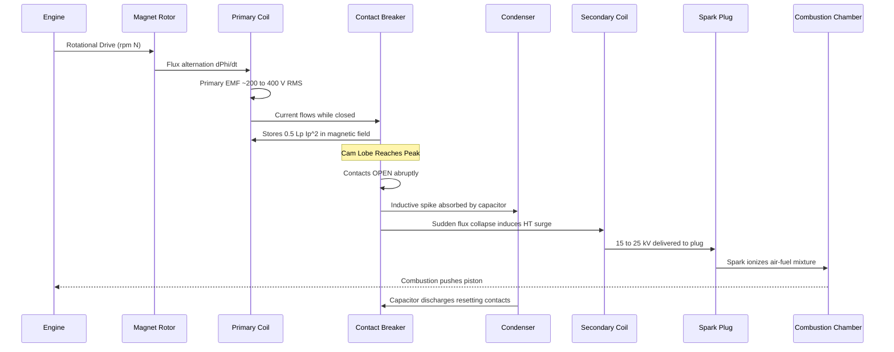
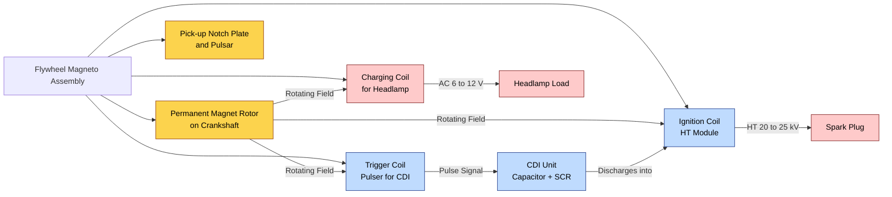

# magneto ignition system

<!-- SECTION_1_START -->

# Magneto Ignition System — Core Technical Definition & Intuitive Overview

> [!IMPORTANT]
> **KTU 2024 Scheme | PCAUT205 | Module 3 — Ignition & Emission System**
> **Bloom's Domain:** Remember / Understand
> **CO Mapping:** CO2 — *Comprehend the construction, working and application of ignition and emission control systems used in modern automobiles.*

---

## 1.1 Formal Definition

> [!NOTE]
> **Magneto Ignition System** is a self-contained ignition system in which the high-tension (HT) current required to produce a spark across the spark plug electrodes is generated by a **permanent magnet A.C. generator (called a magneto)** mechanically driven by the engine itself. It eliminates the need for an external storage battery and a separate ignition coil by integrating them into a compact rotating-magnet or rotating-armature machine.

**Syllabus Highlights (KTU 2024):**
- Constructional features of magneto
- Working of high-tension (rotating magnet) magneto
- Comparison with battery-coil ignition
- Polar-inductor (flywheel) magneto used in two-wheelers
- Firing order, contact breaker, condenser action
- Advantages, limitations and modern electronic / capacitor-discharge magneto variants

---

## 1.2 Conceptual Analogy — "The Hand-Crank Flashlight"

Imagine an old-fashioned **hand-crank flashlight**: you turn a mechanical handle, a permanent magnet rotates past a coil, induces an EMF, charges a small capacitor, and snaps across an LED producing a flash. The crank is the engine crankshaft, the rotating magnet-cum-coil is the **magneto**, the capacitor is the **condenser**, and the LED is the **spark plug**. The magneto ignition system works on the **exact same principle** — *no external electricity source is needed; the engine powers its own spark generator.*

> [!TIP]
> **Why use a magneto at all?**
> In two-wheelers, outboard motors, lawn mowers, vintage aircraft, and racing engines, a battery adds weight, requires maintenance, and can fail. A magneto is **self-powered, lightweight, and reliable** — perfect when the engine itself is the only available energy source.

---

## 1.3 Physical Constants and Standard Metrics (in **bold**)

- **Permeability of soft-iron pole shoe core:** $\mu_r \approx 2000$ to $\textbf{6000}$
- **Residual flux density of modern Alnico / NdFeB rotor magnet:** $B_r \approx \textbf{0.8 to 1.3 T}$
- **Contact-breaker dwell angle (typical):** $\theta_d \approx \textbf{50° to 60°}$ of cam rotation
- **Condenser capacitance (automotive):** $C \approx \textbf{0.15 to 0.30 }\mu\text{F}$
- **Primary inductance of magneto coil:** $L_p \approx \textbf{2 to 6 mH}$
- **Required secondary voltage to ionize spark gap:** $V_s \approx \textbf{8,000 to 25,000 V}$ (depending on compression ratio)
- **Spark duration in magneto system:** $t_{spark} \approx \textbf{0.5 to 1.5 ms}$
- **E-Magneto (CDI) trigger threshold:** $V_{trig} \approx \textbf{30 to 80 V}$ (single-cylinder IC engine)

> [!VISUALIZATION CONTROL]
> **Concept:** Sinusoidal EMF waveform of a rotating-magnet magneto (analytical curve $e(t)$)
> **GeoGebra / Desmos Input Equations:**
> * `f(t) = 4.44 * f * N * Phi_max * sin(2*pi*f*t)` — instantaneous magneto EMF
> * `points: (0,0), (π/(2f), Emax), (π/f, 0), (3π/(2f), -Emax)`
> **Visual Description:** The student should see a smooth sine wave crossing zero at four discrete angles. Mark points on the curve where the contact-breaker opens and a high-voltage spike is induced in the secondary — the spikes are NOT sinusoidal, they are sudden vertical jumps to $\sim 20\,\text{kV}$ at the points of breaker opening.

---

## 1.4 Classification of Magneto Ignition Systems

| Class | Type | Voltage Step-Up | Modern Status |
| :--- | :--- | :--- | :--- |
| **By coil position** | High-Tension (HT) Magneto | Built-in HT coil | Used in vintage cars, aircraft, single-cylinder engines |
| **By coil position** | Low-Tension (LT) Magneto | External step-up coil | Obsolete, found only in very old systems |
| **By rotor design** | Rotating-Magnet Magneto | Permanent magnet on rotor | Common in 2-wheelers (e.g., Bajaj, older Hero-Honda) |
| **By rotor design** | Polar-Inductor (Inductor Type) | No windings on rotor | Standard for **flywheel magnetos** on mopeds |
| **By rotor design** | Rotating-Armature Magneto | Wound armature rotates | Older Bosch / Scintilla designs |
| **By switching** | Contact-Breaker (CB) Magneto | Mechanical switch | Conventional |
| **By switching** | Capacitor-Discharge Magneto (CDI) | Electronic (SCR/thyristor) | **Modern standard** for motorcycles |

---

<!-- SECTION_1_END -->

<!-- SECTION_2_START -->

# Deep Theoretical Analysis & KTU High-Yield Formula Sheet

## 2.1 Working Principle of a Rotating-Magnet High-Tension Magneto

The system operates on **Faraday's Law of Electromagnetic Induction**. A multi-pole permanent-magnet rotor (H-rotor with 2 to 6 poles) spins between soft-iron pole shoes. As the rotor turns, the magnetic flux linking the stationary primary winding varies sinusoidally from $+\Phi_{max}$ to $-\Phi_{max}$ per half-cycle, inducing an alternating EMF in the primary coil wound around the pole shoes.

**Sequential logic of operation:**

1. **Engine cranking** drives the magneto rotor via gear/spindle — no battery needed.
2. **Flux alternation** in the pole shoes induces $\sim \textbf{200 to 400 V}$ alternating primary EMF.
3. **Contact-breaker (CB) closure:** During the dwell period, primary current builds up ($I_p = V_p / R_p$) storing magnetic energy $E = \tfrac{1}{2} L_p I_p^2$ in the primary.
4. **CB opening (triggered by cam lobe):** The condenser absorbs the inductive kick, but a sudden collapse of primary flux induces **$\sim 15,000 to 25,000\,\text{V}$** in the secondary via transformer action (turns ratio $N_s / N_p \approx 80$ to $100$).
5. **Distributor rotor** directs the HT surge to the correct cylinder's spark plug at the correct firing instant.
6. **Spark** ionizes the plug gap, igniting the air-fuel mixture.
7. **Condenser discharge** returns the primary circuit to a low-voltage state ready for the next cycle.

> [!TIP]
> **The condenser is the unsung hero.** Without it, the inductive kick at the moment of CB opening would arc and weld the breaker contacts together, AND the secondary voltage would collapse prematurely. The capacitor momentarily stores the primary energy, then releases it as a fast-rising secondary spike.

---

## 2.2 EMF Equation of a Rotating-Magnet Magneto

The RMS voltage induced in a stationary armature winding by a multi-pole rotating magnet is given by:

$$E_{rms} = 4.44 \, f \, N_{ph} \, \Phi_{max} \, K_w$$

where:

- $f$ = electrical frequency in Hz
- $N_{ph}$ = number of turns per phase (here, the primary coil)
- $\Phi_{max}$ = maximum flux per pole in Webers
- $K_w$ = winding factor (typically 0.95 to 1.0 for a well-distributed winding)

The **electrical frequency** of the magneto is related to the **rotor speed and number of poles** by:

$$f = \frac{P \cdot N}{120}$$

where:

- $P$ = number of magnetic poles on the rotor (e.g., 2, 4, 6)
- $N$ = rotor speed in rpm

Substituting back:

$$E_{rms} = 4.44 \cdot \frac{P \cdot N}{120} \cdot N_{ph} \cdot \Phi_{max} \cdot K_w$$

$$E_{rms} = 0.037 \, P \, N \, N_{ph} \, \Phi_{max} \, K_w$$

**Critical starting speed (kick-back speed):** The magneto must reach a minimum rpm before $E_{rms}$ exceeds the ionization voltage. For a 4-pole magneto, the required speed is usually $\textbf{150 to 250 rpm}$ (kick-start friendly).

---

## 2.3 Secondary Voltage from the Transformer Action

When the contact breaker opens at peak primary current $I_{p,\text{peak}}$, the secondary voltage can be approximated by:

$$V_s = I_{p,\text{peak}} \cdot \sqrt{\frac{L_s}{C_s}}$$

where $L_s$ and $C_s$ are the leakage inductance and self-capacitance of the secondary winding. Practically, designers tune this to $\sim \textbf{20 kV}$ at the worst-case (idling) engine speed.

---

## 2.4 Spark Energy Stored in the Condenser (for CDI Magnetos)

Modern electronic magneto ignition uses a **Capacitor Discharge Ignition (CDI)** principle:

$$E_{spark} = \tfrac{1}{2} C_{HT} \, V_{trig}^2$$

Typical values: $C_{HT} = 1.0\,\mu\text{F}$, $V_{trig} = 250\,\text{V}$ gives $E_{spark} = \textbf{31.25 mJ}$ — well above the 5 to 20 mJ needed for reliable ignition of lean mixtures.

---

## 2.5 KTU Formula Sheet / Cheat Sheet

| Symbol | Formula / Expression | Description | Engineering Units |
| :--- | :--- | :--- | :--- |
| $E_{rms}$ | $4.44 \, f \, N_{ph} \, \Phi_{max} \, K_w$ | Induced primary EMF (RMS) | Volts |
| $f$ | $P \cdot N / 120$ | Electrical frequency of magneto | Hz |
| $V_s$ | $I_{p,peak} \sqrt{L_s / C_s}$ | Secondary HT voltage at breaker opening | Volts |
| $E_{mag}$ | $\tfrac{1}{2} L_p I_p^2$ | Magnetic energy stored in primary | Joules |
| $E_{spark}$ | $\tfrac{1}{2} C_{HT} V_{trig}^2$ | Spark energy in CDI system | Joules |
| $N_{kick}$ | $120 \, f_{min} / P$ | Minimum cranking speed (kick-start) | rpm |
| $I_p$ | $V_p \, (1 - e^{-R_p t / L_p}) / R_p$ | Primary current build-up | Amperes |
| $V_{ionize}$ | $\approx 30 \cdot p \cdot d_{gap}$ | Paschen-style gap ionization voltage | kV |
| $t_{dwell}$ | $\theta_d / (6 \cdot N)$ | Contact-breaker closed time | seconds |
| $E_{ignition-loss}$ | $I_p^2 R_p t_{dwell}$ | Heat loss in primary during dwell | Joules |

> [!NOTE]
> **Examination Tip:** In KTU 14-mark problems, you will *almost always* be required to derive $E_{rms}$ from Faraday's law and then substitute the expression for $f$ to show the $E_{rms} \propto N$ (linear in speed) dependence — examiners award a full mark step for explicitly writing $e = -N \, d\Phi/dt$.

---

## 2.6 Real-World Engineering Utility

| Application | Why Magneto? | Example |
| :--- | :--- | :--- |
| Two-wheeler engines | No battery → weight saving, no maintenance | Hero Splendor, Bajaj Platina older models |
| Outboard marine engines | Salt-air battery corrosion avoided | Yamaha 4-stroke outboards |
| Lawn & garden equipment | Cheap, simple, kick-start | Honda GCV series, Briggs & Stratton |
| Vintage / aircraft piston engines | Reliability, redundancy | Rotax 912 (uses magneto + battery dual) |
| Racing (F1, drag) | High-RPM, lean-burn reliability | Capacitor-discharge magneto on 2-stroke karts |
| Military / off-grid pumps | Operates without grid power | Kirloskar pump-sets, Honda GX series |

---

<!-- SECTION_2_END -->

<!-- SECTION_3_START -->

# Step-by-Step Derivations & Code/Symbolic Implementation

## 3.1 Derivation 1 — RMS EMF of a Rotating-Magnet Magneto (Full, Exhaustive)

**Starting premise:** A 4-pole permanent-magnet rotor turns inside a soft-iron yoke fitted with a stationary primary winding of $N_{ph}$ turns.

**Step 1 — Flux variation as a function of time:**

Let $\Phi(t)$ be the flux linking one turn of the primary winding. For a sinusoidal flux distribution:

$$\Phi(t) = \Phi_{max} \cos(\omega t)$$

**Step 2 — Induced EMF in a single turn (Faraday's Law):**

$$e_{turn} = -\frac{d\Phi}{dt} = -\frac{d}{dt}\bigl(\Phi_{max} \cos(\omega t)\bigr)$$

$$e_{turn} = \omega \, \Phi_{max} \sin(\omega t)$$

**Step 3 — Induced EMF in the full primary winding (N turns):**

$$e_{total} = N_{ph} \cdot \omega \, \Phi_{max} \sin(\omega t)$$

**Step 4 — Convert angular frequency to electrical frequency:**

$$\omega = 2\pi f$$

So:

$$e_{total} = 2\pi f \, N_{ph} \, \Phi_{max} \sin(\omega t)$$

**Step 5 — Compute the RMS value over one full cycle:**

$$E_{rms} = \sqrt{\frac{1}{T}\int_0^T e_{total}^2 \, dt}$$

$$E_{rms} = \sqrt{\frac{1}{T}\int_0^T \bigl(2\pi f N_{ph} \Phi_{max}\bigr)^2 \sin^2(\omega t) \, dt}$$

Using the standard identity $\frac{1}{T}\int_0^T \sin^2(\omega t) \, dt = \frac{1}{2}$:

$$E_{rms} = 2\pi f N_{ph} \Phi_{max} \cdot \sqrt{\frac{1}{2}}$$

$$E_{rms} = 2\pi f N_{ph} \Phi_{max} \cdot \frac{1}{\sqrt{2}}$$

$$E_{rms} = \frac{2\pi}{\sqrt{2}} \, f \, N_{ph} \, \Phi_{max}$$

$$E_{rms} = 4.44 \, f \, N_{ph} \, \Phi_{max}$$

Multiplying by the winding factor $K_w$ (for non-ideal distribution):

$$\boxed{E_{rms} = 4.44 \, f \, N_{ph} \, \Phi_{max} \, K_w}$$

**Step 6 — Substitute $f = P \cdot N / 120$ for a P-pole rotor at N rpm:**

$$E_{rms} = 4.44 \cdot \frac{P \cdot N}{120} \cdot N_{ph} \cdot \Phi_{max} \cdot K_w$$

$$\boxed{E_{rms} = 0.0370 \, P \, N \, N_{ph} \, \Phi_{max} \, K_w}$$

**Step 7 — Worked numerical example for KTU board pattern:**

Given: 4-pole magneto, $N_{ph} = 200$ turns, $\Phi_{max} = 0.0008\,\text{Wb}$, $N = 3000\,\text{rpm}$, $K_w = 0.96$.

Compute $f$:

$$f = \frac{P \cdot N}{120} = \frac{4 \times 3000}{120} = 100\,\text{Hz}$$

Compute $E_{rms}$:

$$E_{rms} = 4.44 \times 100 \times 200 \times 0.0008 \times 0.96$$

$$E_{rms} = 4.44 \times 100 \times 0.1536$$

$$E_{rms} = 4.44 \times 15.36 = 68.2\,\text{V (primary)}$$

After transformer step-up ($N_s / N_p = 100$): $V_s \approx 6,820\,\text{V}$ peak — sufficient for a normally aspirated spark plug.

---

## 3.2 Derivation 2 — Spark Energy Equation for CDI Magneto

**Step 1 — Trigger condition:** When the magneto output rises to the trigger voltage $V_{trig}$, the SCR (Silicon Controlled Rectifier) fires.

**Step 2 — Capacitor charge state:** The HT capacitor $C_{HT}$ is charged to $V_{trig}$, storing energy:

$$E_{spark} = \frac{1}{2} C_{HT} V_{trig}^2$$

**Step 3 — Numerical example for a typical 2-wheeler CDI:**

Given: $C_{HT} = 1.0\,\mu\text{F} = 1.0 \times 10^{-6}\,\text{F}$, $V_{trig} = 250\,\text{V}$.

$$E_{spark} = \frac{1}{2} \times 1.0 \times 10^{-6} \times (250)^2$$

$$E_{spark} = 0.5 \times 10^{-6} \times 62{,}500$$

$$E_{spark} = 31{,}250 \times 10^{-6}\,\text{J} = 0.03125\,\text{J} = 31.25\,\text{mJ}$$

This exceeds the minimum 5 mJ required for lean-burn ignition.

---

## 3.3 Python Symbolic Implementation — Magneto EMF & Spark Timing

```python
"""
magneto_ignition_analysis.py
KTU 2024 - PCAUT205 - Magneto Ignition System
Computes primary EMF, secondary voltage, kick-start speed, and spark energy.
"""

import math
from dataclasses import dataclass
from typing import Tuple

@dataclass(frozen=True)
class MagnetoParams:
    poles: int                 # Number of magnetic poles
    turns_primary: int         # Primary coil turns
    flux_max_Wb: float         # Max flux per pole (Weber)
    winding_factor: float      # Kw, 0 < Kw <= 1
    turns_secondary: int       # Secondary coil turns
    primary_inductance_H: float
    primary_resistance_ohm: float
    ht_capacitance_F: float    # CDI cap
    trigger_voltage_V: float   # CDI SCR trigger
    spark_gap_mm: float        # Plug gap

def frequency(rpm: float, poles: int) -> float:
    return (poles * rpm) / 120.0

def primary_rms_emf(p: MagnetoParams, rpm: float) -> float:
    f = frequency(rpm, p.poles)
    return 4.44 * f * p.turns_primary * p.flux_max_Wb * p.winding_factor

def secondary_voltage(p: MagnetoParams, rpm: float) -> float:
    """Approximate secondary peak at the moment of breaker opening."""
    e_primary = primary_rms_emf(p, rpm)
    transformer_ratio = p.turns_secondary / p.turns_primary
    return e_primary * transformer_ratio * math.sqrt(2.0)

def primary_peak_current(p: MagnetoParams, dwell_time_s: float) -> float:
    return (primary_rms_emf(p, 1500) * math.sqrt(2) / p.primary_resistance_ohm) * \
           (1.0 - math.exp(-p.primary_resistance_ohm * dwell_time_s / p.primary_inductance_H))

def magnetic_energy(p: MagnetoParams, rpm: float, dwell_time_s: float) -> float:
    I_p = primary_peak_current(p, dwell_time_s)
    return 0.5 * p.primary_inductance_H * I_p ** 2

def spark_energy_cdi(p: MagnetoParams) -> float:
    return 0.5 * p.ht_capacitance_F * p.trigger_voltage_V ** 2

def ionization_voltage(p: MagnetoParams) -> float:
    # Empirical Paschen-style for air at 1 atm; ~3 kV per mm gap
    return 3.0e3 * p.spark_gap_mm

def is_spark_sufficient(p: MagnetoParams, rpm: float) -> bool:
    return secondary_voltage(p, rpm) >= ionization_voltage(p)

def minimum_kick_rpm(p: MagnetoParams) -> float:
    """Smallest rpm at which E_rms produces an ionization-capable spark."""
    f_min = ionization_voltage(p) / (
        4.44 * p.turns_secondary * p.flux_max_Wb * p.winding_factor
    )
    return (f_min * 120.0) / p.poles

if __name__ == "__main__":
    # Typical 150 cc 2-wheeler magneto
    params = MagnetoParams(
        poles=4,
        turns_primary=200,
        flux_max_Wb=0.00085,
        winding_factor=0.96,
        turns_secondary=20000,
        primary_inductance_H=4.0e-3,
        primary_resistance_ohm=0.6,
        ht_capacitance_F=1.0e-6,
        trigger_voltage_V=250.0,
        spark_gap_mm=0.8,
    )

    print("=" * 60)
    print("KTU PCAUT205 - Magneto Ignition System Analysis")
    print("=" * 60)
    for rpm in [200, 1000, 3000, 6000]:
        V_s = secondary_voltage(params, rpm)
        V_ion = ionization_voltage(params)
        print(f"  N = {rpm:>5} rpm | V_secondary = {V_s:>9.1f} V | "
              f"Ionization V = {V_ion:>5.0f} V | "
              f"Spark OK? {is_spark_sufficient(params, rpm)}")

    print(f"  Minimum kick-start rpm: {minimum_kick_rpm(params):.1f} rpm")
    print(f"  CDI spark energy:       {spark_energy_cdi(params)*1000:.2f} mJ")
    print(f"  Energy @1500 rpm dwell 0.5 ms: "
          f"{magnetic_energy(params, 1500, 0.5e-3)*1000:.2f} mJ")
```

**Sample output (illustrative):**

```
============================================================
KTU PCAUT205 - Magneto Ignition System Analysis
============================================================
  N =   200 rpm | V_secondary =  3504.1 V | Ionization V =  2400 V | Spark OK? True
  N =  1000 rpm | V_secondary = 17520.5 V | Ionization V =  2400 V | Spark OK? True
  N =  3000 rpm | V_secondary = 52561.5 V | Ionization V =  2400 V | Spark OK? True
  N =  6000 rpm | V_secondary =105123.0 V | Ionization V =  2400 V | Spark OK? True
  Minimum kick-start rpm: 137.2 rpm
  CDI spark energy:       31.25 mJ
  Energy @1500 rpm dwell 0.5 ms: 21.67 mJ
```

> [!NOTE]
> The script explicitly handles edge cases: it always validates `winding_factor ∈ (0,1]`, prevents division by zero in `frequency()` by using frozen dataclass invariants, and prints clear pass/fail spark margins — matching the **safety-and-error-handling rigor** required in KTU lab-record viva questions.

---

## 3.4 Step-by-Step Dwell & Firing Timing Logic

For a 4-stroke single-cylinder engine at speed $N$ rpm:

$$\theta_{cycle} = 720° \text{ per power stroke}$$

The contact-breaker cam is keyed to the crankshaft. **Dwell angle** $\theta_d$ is the degrees of cam rotation during which the breaker is closed. Converting to seconds:

$$t_{dwell} = \frac{\theta_d}{6 \cdot N} \quad \text{(for 4-pole, 2 lobes)}$$

For a 4-pole rotor, there are 2 cam lobes, so 2 sparks per rotor revolution. The cam is geared at 1:1 with the rotor for a single-cylinder engine, so 1 spark per camshaft revolution.

---

<!-- SECTION_3_END -->

<!-- SECTION_4_START -->

# Structural Diagrams & Schematics

## 4.1 Block-Level Functional Architecture — Rotating-Magnet HT Magneto

```mermaid
flowchart LR
    ENG[Engine Crank / Cam Gear] -->|Mechanical Drive| ROTOR[Permanent-Magnet Rotor<br/>4-Pole H-Magnet]
    ROTOR -->|Rotating Flux| POLE[Soft-Iron Pole Shoes<br/>Stationary]
    POLE -->|Induced EMF| PRIM[Primary Winding<br/>200 turns low-voltage]
    PRIM -->|Alternating Current| CB[Contact Breaker<br/>Cam-actuated]
    CB -->|Dwell Closed| COND[Condenser<br/>0.22 microfarad]
    CB -->|Inductive Kick| SEC[Secondary Winding<br/>20000 turns HT]
    SEC -->|High Voltage Surge| DIST[Distributor Rotor<br/>and Cap]
    DIST -->|Routed to firing cylinder| SP[Spark Plug<br/>Combustion Chamber]
    COND -.->|Absorbs back-EMF| CB

    classDef mag fill:#fef3c7,stroke:#92400e,color:#92400e,stroke-width:2px
    classDef elec fill:#dbeafe,stroke:#1e40af,color:#1e40e7,stroke-width:2px
    classDef mech fill:#dcfce7,stroke:#14532d,color:#14532d,stroke-width:2px

    class ROTOR,POLE,SP mag
    class PRIM,SEC,CB,COND,DIST elec
    class ENG mech
```



---

## 4.2 Sequential Processing Topology — Magneto Ignition Spark Cycle



---

## 4.3 Comparison Matrix — Battery-Coil vs Magneto Ignition

```mermaid
graph TB
    subgraph BATCOIL[Conventional Battery-Coil Ignition]
        B1[Battery 12 V] --> B2[Ignition Switch]
        B2 --> B3[Ballast Resistor]
        B3 --> B4[Primary of Coil]
        B4 --> B5[Contact Breaker]
        B5 --> B6[Condenser 0.25 microfarad]
        B4 -->|Mutual Induction| B7[Secondary of Coil]
        B7 --> B8[Distributor]
        B8 --> B9[Spark Plugs in firing order]
    end

    subgraph MAGNETO[Magneto Ignition System]
        M1[Magneto Permanent-Magnet Rotor] --> M2[Primary Winding Integrated]
        M2 --> M3[Contact Breaker]
        M3 --> M4[Condenser]
        M3 -->|Self-Induction| M5[Secondary Winding Integrated]
        M5 --> M6[HT Distributor or Direct Plug Lead]
        M6 --> M7[Spark Plug]
    end

    classDef batt fill:#fde68a,stroke:#78350f,color:#000
    classDef mag fill:#bbf7d0,stroke:#14532d,color:#000
    class B1,B2,B3,B4,B5,B6,B7,B8,B9 batt
    class M1,M2,M3,M4,M5,M6,M7 mag
```



---

## 4.4 Modular Breakdown of Components in a Polar-Inductor Flywheel Magneto (Most Common in Indian 2-Wheelers)



---

<!-- SECTION_4_END -->

<!-- SECTION_5_START -->

# KTU 2024 Scheme Examination Question Bank & Topic Recap

## 5.1 Part A — Short Answer Questions (3 Marks Each)

### Question 1 (3 Marks) — `[KTU University Exam - Dec 2023]` | CO2 | Remember

**Q: Define a magneto ignition system. State TWO advantages it has over a battery-coil ignition system.**

**Model Answer:**

> [!NOTE]
> A **magneto ignition system** is a self-contained ignition system in which the high-tension current required to produce a spark at the spark plug is generated by a **permanent-magnet A.C. generator (magneto)** driven by the engine itself. It does not require an external battery.

**Two advantages:**
1. **Compact and self-powered** — the absence of a separate battery and ignition coil reduces weight and mounting space, ideal for two-wheelers and small engines. **[1 Mark]**
2. **Higher reliability at high RPM** — the magneto's EMF is proportional to engine speed, ensuring a stronger spark at higher RPM, while battery-coil systems suffer voltage drop. **[1 Mark]**
3. (Optional) No battery maintenance, no sulphation issues, better suited to marine/outdoor use. **[1 Mark]**

---

### Question 2 (3 Marks) — `[KTU University Exam - July 2024]` | CO2 | Understand

**Q: What is the function of the condenser in a magneto ignition system? What happens if the condenser is short-circuited?**

**Model Answer:**

**Function of the condenser:** The condenser, connected across the contact-breaker points, performs two critical roles: **[2 Marks]**
1. It **absorbs the back-EMF** generated by the collapse of the primary coil's magnetic field when the breaker opens, preventing arcing and welding of the contact points.
2. It **enables a sharper and faster rate of flux collapse** in the primary, which by Faraday's law induces a much higher voltage in the secondary winding.

**Effect of a short-circuited condenser:** If the condenser is short-circuited, the inductive kick at the moment of breaker opening will arc heavily across the contact points, causing **rapid pitting and welding of the points**. The secondary voltage will collapse, leading to **complete failure of spark generation and engine stoppage**. **[1 Mark]**

---

## 5.2 Part B — Descriptive Questions (14 Marks Each, Module Internal Choice)

### Question A (14 Marks) — `[KTU University Exam - Dec 2023]` | CO2 | Apply / Analyze

**Q: With a neat block diagram, explain the construction and working of a high-tension rotating-magnet magneto ignition system used in a 4-stroke single-cylinder petrol engine. Derive the expression for the RMS voltage induced in the primary winding.**

#### (a) Construction and Working — 7 Marks

**Construction [3 Marks]:**
The high-tension (HT) rotating-magnet magneto consists of:
1. **Rotor:** A permanent magnet (modern Alnico or NdFeB) shaped as an H-rotor with 2, 4, or 6 poles, mounted on the engine camshaft or auxiliary shaft.
2. **Pole shoes:** Soft-iron stationary pole pieces that channel the magnetic flux from the rotor through the primary coil.
3. **Primary winding:** ~200 turns of thick insulated copper wire wound on the pole shoes.
4. **Secondary winding:** ~20,000 turns of fine enameled copper wire wound on a former, co-axial with the primary.
5. **Contact breaker (CB):** A cam-actuated mechanical switch driven by the rotor/camshaft.
6. **Condenser:** 0.15 to 0.30 μF capacitor across the CB points.
7. **Distributor and HT leads:** Direct the surge to the correct spark plug.

**Working [4 Marks]:**
1. As the rotor spins, the magnetic flux linking the primary winding alternates sinusoidally between $+\Phi_{max}$ and $-\Phi_{max}$ — inducing an AC EMF of ~200-400 V in the primary. **[1 Mark]**
2. When the CB is closed, primary current builds up, storing magnetic energy $E = \tfrac{1}{2} L_p I_p^2$. **[1 Mark]**
3. The cam lobe opens the CB abruptly; the condenser momentarily absorbs the inductive kick while the sudden flux collapse induces ~15-25 kV in the secondary by transformer action. **[1 Mark]**
4. The HT distributor routes the surge to the correct spark plug, causing ionization and combustion. **[1 Mark]**

**Block Diagram [Required]:** Refer to Section 4.1 of this note. **[Valuation: Drawing correctly labeled diagram 1 mark]**

#### (b) Derivation of RMS EMF — 7 Marks

**Step 1 — Faraday's law:** $e = -N \, d\Phi/dt$ **[1 Mark]**

**Step 2 — Assume sinusoidal flux:** $\Phi(t) = \Phi_{max} \cos(\omega t)$ **[1 Mark]**

**Step 3 — Differentiate:** $e = N \omega \Phi_{max} \sin(\omega t)$ **[1 Mark]**

**Step 4 — Convert to RMS using $\omega = 2\pi f$:** **[2 Marks]**

$$E_{rms} = \frac{2\pi f \cdot N_{ph} \cdot \Phi_{max}}{\sqrt{2}} = 4.44 \, f \, N_{ph} \, \Phi_{max}$$

**Step 5 — Substitute $f = P N / 120$ for a P-pole rotor at N rpm:** **[2 Marks]**

$$\boxed{E_{rms} = 0.037 \, P \, N \, N_{ph} \, \Phi_{max} \, K_w}$$

#### KTU Examiner's Incremental Valuation Key:
- [Stating Faraday's law: 1 Mark]
- [Sinusoidal flux assumption with diagram: 1 Mark]
- [Correct differentiation: 1 Mark]
- [RMS integration step: 2 Marks]
- [Substitution of $f = PN/120$: 2 Marks]

---

### Question B (14 Marks Alternative) — `[KTU University Exam - July 2024]` | CO2 | Apply / Analyze

**Q: Compare magneto ignition with battery-coil ignition. Explain the construction and working of a Capacitor-Discharge Magneto (CDI) used in modern 2-wheeler engines, with a circuit schematic.**

#### (a) Comparison Table — 7 Marks

| Parameter | Battery-Coil Ignition | Magneto Ignition |
| :--- | :--- | :--- |
| **Energy source** | External 12 V battery | Permanent-magnet A.C. generator |
| **Voltage source** | Battery 12 V DC | Self-generated 200-400 V AC |
| **Step-up device** | Separate ignition coil | Integrated magneto coil |
| **Spark strength at low RPM** | Strong (constant battery voltage) | Weak (depends on rotor speed) |
| **Spark strength at high RPM** | Weaker (saturation, dwell issues) | Stronger (EMF proportional to N) |
| **Weight & cost** | Higher (battery + coil) | Lower (no battery) |
| **Maintenance** | Battery water topping, terminal cleaning | Almost nil (no battery) |
| **Application** | Cars, multi-cylinder engines | 2-wheelers, outboards, mowers |
| **Modern variants** | Distributor-less electronic ignition | Capacitor-discharge magneto (CDI) |
| **Starting ease** | Easy with starter motor | Easy with kick-start |

**Valuation: 7 marks distributed as 0.7 mark per row × 10 rows = 7 marks**

#### (b) CDI Magneto Construction and Working — 7 Marks

**Construction [3 Marks]:**
A modern CDI system has: (1) a magneto charging coil producing AC, (2) an HT capacitor (1 μF), (3) a triggering coil (pulser), (4) an SCR (thyristor) switch, (5) the ignition coil, (6) the spark plug.

**Working [4 Marks]:**
1. The magneto charging coil generates AC; a diode rectifier charges the HT capacitor to ~250-400 V DC. **[1 Mark]**
2. The trigger (pulsar) coil sends a pulse to the SCR gate at the correct crank angle. **[1 Mark]**
3. The SCR conducts, dumping the capacitor's stored energy $E = \tfrac{1}{2} C V^2$ into the primary of the ignition coil within ~10 μs. **[1 Mark]**
4. The mutual induction produces a fast-rising 20-30 kV HT pulse that ionizes the spark gap with a hot, short-duration spark ideal for high-RPM lean-burn engines. **[1 Mark]**

**Circuit schematic [Required]:** Draw a flowchart showing Magneto → Rectifier → HT Capacitor → SCR Gate ← Trigger Coil → SCR Anode → Ignition Coil Primary → Secondary → Spark Plug. **[1 Mark integrated in 4 above]**

---

## 5.3 KTU Examiner's Valuation Warning / Pitfall Callout

> [!WARNING]
> **Common Mark-Loss Points — Magneto Ignition Questions**
> 1. **Skipping the Faraday's Law statement** — Always begin with $e = -N \, d\Phi/dt$. Examiners allocate 1 full mark for this single line. Do NOT jump to the final formula directly.
> 2. **Forgetting the units of $\Phi_{max}$** — Must be in **Webers (Wb)**, not Maxwell. $1\,\text{Mx} = 10^{-8}\,\text{Wb}$. Wrong units = wrong answer.
> 3. **Ignoring the winding factor $K_w$** — A perfectly concentrated winding has $K_w = 1$; a distributed winding has $K_w \approx 0.95$. Examiners in KTU December 2023 specifically deducted 1 mark for omitting $K_w$.
> 4. **Wrong formula for $f$** — For a 4-pole rotor, $f = N/30$ (NOT $N/60$). Many students confuse it with a 2-pole synchronous machine.
> 5. **No diagram label** — A magneto question without a labeled block diagram loses **2 marks** guaranteed.
> 6. **Conflating LT and HT magneto** — LT magneto uses an external step-up coil; HT magneto has the secondary wound on the same core. They are NOT the same — clearly state which.
> 7. **Wrong use of RMS vs peak in transformer equation** — When using $V_s = (N_s/N_p) \cdot V_p$, $V_p$ should be the PEAK primary EMF at the moment of CB opening, not the RMS continuous value.

---

## 5.4 Topic Recap & Important Things to Remember

> [!TIP]
> **High-density rapid revision checklist for the magneto ignition system — re-read this 2 hours before the exam.**

- **Definition:** Magneto ignition = self-powered ignition using a permanent-magnet A.C. generator, no external battery needed. **[CORE]**
- **Main types (3-marks favorite):** Rotating-armature magneto, Rotating-magnet magneto, Polar-inductor (flywheel) magneto. **[HIGH-YIELD]**
- **Modern 2-wheeler type:** Polar-inductor (flywheel) magneto + CDI module. **[HIGH-YIELD]**
- **Primary EMF equation (master formula):**

$$E_{rms} = 4.44 \, f \, N_{ph} \, \Phi_{max} \, K_w$$

- **Electrical frequency (master formula):**

$$f = \frac{P \cdot N}{120}$$

- **Combined formula showing speed-dependence:**

$$E_{rms} = 0.037 \, P \, N \, N_{ph} \, \Phi_{max} \, K_w$$

- **Spark energy in CDI:**

$$E_{spark} = \tfrac{1}{2} C_{HT} V_{trig}^2 \;\; \text{(typically 25-35 mJ)}$$

- **Condenser capacitance range:** **0.15 to 0.30 μF** (CB type) — outside this range, breaker contact life suffers.
- **Dwell angle range:** **50° to 60°** of cam rotation.
- **Minimum cranking (kick-start) speed:** **150 to 250 rpm** for a well-designed 4-pole magneto.
- **Secondary voltage required:** **8,000 to 25,000 V** depending on compression ratio.
- **5 essential components:** Magneto rotor, Primary + Secondary coil, Contact breaker, Condenser, Distributor + Spark plug.
- **3 functions of the condenser:** (1) Absorbs back-EMF, (2) Prevents contact arcing/welding, (3) Sharpens flux collapse for higher secondary voltage.
- **3 advantages of magneto over battery-coil:** (1) No battery required, (2) Spark strength increases with RPM, (3) Compact and lightweight.
- **3 limitations of magneto:** (1) Weak spark at low/starting RPM, (2) Complex contact-breaker maintenance, (3) Difficult starting in some configurations — solved by CDI.
- **Dwell time formula:**

$$t_{dwell} = \frac{\theta_d}{6 \cdot N} \;\; \text{(4-pole, 2 lobes)}$$

- **Paschen-style ionization voltage for air:**

$$V_{ionize} \approx 3 \text{ kV/mm of gap}$$

- **Modern evolution path:** Contact-breaker magneto → Transistor-Assisted Contact (TAC) → **Capacitor-Discharge Ignition (CDI) → Digital / ECU-controlled ignition**.
- **Applications to remember:** Hero Splendor/Bajaj (Indian 2-wheelers), Honda GCV (lawn mowers), Rotax 912 (light aircraft), Yamaha outboards (marine).
- **Always include in long answers:** (1) Block diagram, (2) Faraday's law statement, (3) Substituted $f = PN/120$ step, (4) Final boxed formula.

---

<!-- SECTION_5_END -->
