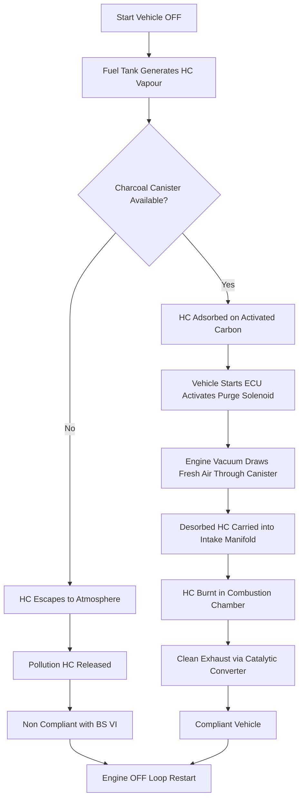
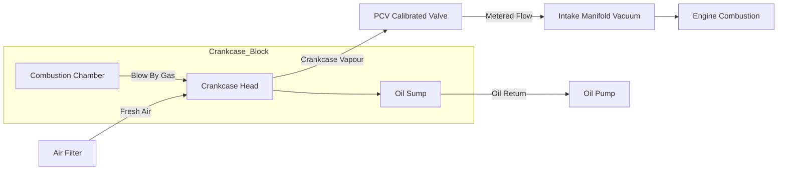
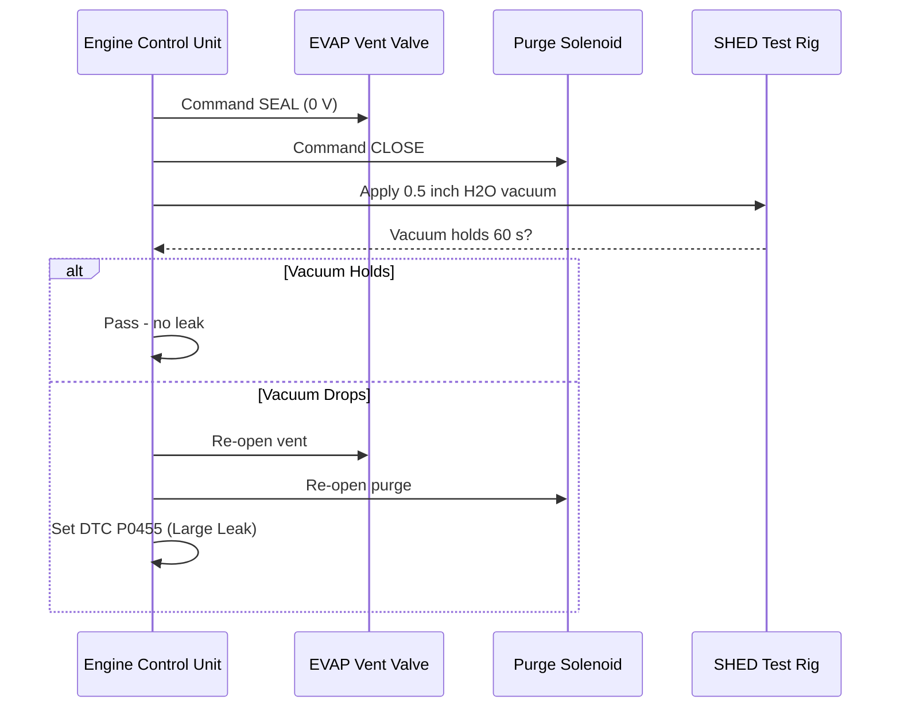
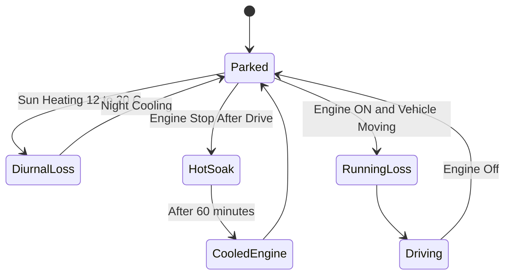

# Non exhaust emissions and control methods

<!-- SECTION_1_START -->

# Non-Exhaust Emissions and Control Methods

## 1.1 Core Technical Definition

> [!IMPORTANT]
> **Non-exhaust emissions** are the airborne pollutants released from a motor vehicle **without** being produced by the combustion of fuel inside the engine cylinder. They originate from the fuel storage, fuel delivery, and crankcase lubricating systems, and also from mechanical wear of vehicle components (tires, brakes, and road surface).

In the **KTU 2024 Scheme (PCAUT205 – Automobile Power Plant)** classification, non-exhaust emissions are grouped under the broader umbrella of **Hydrocarbon (HC) emissions** that escape from an automobile by paths other than the tailpipe. The major regulated categories are:

1. **Evaporative Emissions (EVAP losses)** – fuel vapor losses from the fuel tank and fuel delivery system.
2. **Crankcase Emissions (Blow-by gases)** – unburnt fuel and combustion products that leak past the piston rings into the crankcase.
3. **Running Loss Emissions** – vapor generated due to elevated under-bonnet and under-floor temperatures during vehicle operation.
4. **Hot Soak Emissions** – vapor released from a hot engine after it is switched off.
5. **Diurnal Emissions** – vapor expelled due to the daily rise and fall of ambient temperature acting on the fuel tank.
6. **Refuelling Emissions** – HC vapours displaced from the fuel tank when fresh fuel is pumped in at the petrol station.
7. **Wear Emissions** (non-combustion particulates) – dust from brake pads, tire tread, clutch, and road surface abrasion.

> [!NOTE]
> KTU frequently uses the working phrase **"EVAP + Crankcase + Wear"** when framing a 7-mark or 14-mark university question. Memorise this grouping.

### 1.2 Conceptual Analogy / Intuition

Imagine a closed water bottle half-filled with hot tea. The volatile aromatic vapours (the "smell") leak through the cap, through the threads, and through the small gap around the straw. The tea is **not boiling away** (that would be combustion), yet the room still smells of tea. The same physics applies to a petrol tank: even when the engine is OFF, light hydrocarbon molecules (Butane, Pentane, Iso-pentane) escape into the atmosphere as vapour.

| Everyday Phenomenon | Automobile Counterpart |
|---|---|
| Perfume smell from a sealed bottle | Diurnal evaporative loss from fuel tank |
| Pressure cooker hiss before whistle | Hot soak HC release after engine shut-off |
| Bicycle pump getting hot during use | Running loss emissions during driving |
| Steam from a pressure cooker lid | HC blow-by gases entering crankcase |
| Brake dust on alloy wheels | Brake-wear particulate matter |

### 1.3 The "Three-Loss" Governing Rule

For KTU problems, the total HC emission is almost always written as:

$$E_{\text{total}} = E_{\text{exhaust}} + E_{\text{evaporative}} + E_{\text{crankcase}}$$

Of these, $E_{\text{evaporative}}$ and $E_{\text{crankcase}}$ are the **non-exhaust** fractions. Control methods are therefore aimed entirely at these two channels.

> [!TIP]
> **Quick mnemonic – "HEAT-B-CR"** for the seven sources:
> **H**ot soak, **E**vaporative (diurnal), **A**mbient heat (running loss), **T**ank breathing, **B**low-by, **C**rankcase, **R**efuelling.

### 1.4 Physical Constants & Standard Metrics

- **RVP (Reid Vapour Pressure) of petrol**: **45 kPa – 90 kPa** (Indian summer specification ~ 60 kPa).
- **Boiling range of gasoline**: **30 °C to 220 °C**.
- **Crankcase ventilation flow rate (typical SI engine)**: **0.5 – 1.5 m³/min** at idle.
- **Activated charcoal adsorption capacity**: **0.3 – 0.5 g HC per gram of carbon**.
- **EVAP system purge flow**: **5 – 20 L/min** (engine-vacuum driven).
- **Legislative HC limit (Euro 6 / BS-VI non-exhaust contribution)**: < **0.05 g/km** for direct injection vehicles.

> [!VISUALIZATION CONTROL]
> **Concept:** HC vapour pressure curve for gasoline versus temperature (Clausius-Clapeyron relationship).
> **Desmos Input Equations:**
> * `y = 6.5 - 1500/(x + 230)` (approximate Antoine form for n-pentane, $P$ in kPa, $T$ in °C)
> * `x = 20, 25, 30, 35, 40, 45, 50, 55, 60` (temperature axis)
> **Visual Description:** A monotonically rising exponential curve demonstrating how a 10 °C increase in ambient temperature roughly **doubles** the vapour pressure inside the fuel tank, justifying the need for sealed EVAP systems.

---

<!-- SECTION_1_END -->

<!-- SECTION_2_START -->

# 2. Deep Theoretical Analysis & KTU High-Yield Formula Sheet

## 2.1 Source #1 – Evaporative Emissions (EVAP Losses)

### Mechanism
Gasoline is a **multi-component mixture** of light ($\text{C}_4$ to $\text{C}_6$) and heavy ($\text{C}_7$ to $\text{C}_{12}$) hydrocarbons. The light fraction has a high vapour pressure and constantly tries to escape into the headspace above the liquid fuel. Whenever the engine is OFF, this vapour must go somewhere – either the atmosphere (pollution) or an **adsorption canister** (storage).

### The Five Sub-Categories of Evaporative Loss

| Sub-Category | Trigger | Time of Occurrence | Magnitude (typical) |
|---|---|---|---|
| **Diurnal loss** | Daily $\Delta T$ of 12 – 20 °C | Parked in sun | **1 – 1.5 g HC / day** |
| **Running loss** | Under-bonnet heat | During driving | **0.2 – 0.4 g/km** |
| **Hot soak** | Engine bay residual heat | First 60 min after shut-off | **0.4 – 0.8 g / event** |
| **Refuelling loss** | Displacement by fresh fuel | At petrol pump | **1 – 1.3 g / fill-up** |
| **Tank breathing** | Altitude / pressure change | Long drives / hill travel | Negligible but cumulative |

> [!NOTE]
> KTU examiners often ask students to **rank** the above five in descending order of HC contribution. The correct descending order is: **Diurnal > Refuelling > Hot Soak > Running > Breathing**.

## 2.2 Source #2 – Crankcase Emissions (Blow-by Gases)

During the **power and exhaust strokes**, high-pressure combustion gases (typically **15 – 40 bar**) leak past the top compression ring into the crankcase. This leakage is called **blow-by** and contains:

- **Unburnt HC** (~ **70 %**)
- **CO** (~ **5 – 10 %**)
- **$\text{NO}_x$** (~ **1 – 3 %**)
- **$\text{CO}_2$** and **$\text{H}_2\text{O}$** vapour

The blow-by rate increases with:

$$\text{Blow-by} \propto P_{\text{cyl}} \times \frac{D}{\delta_{\text{ring}}} \times N$$

where $P_{\text{cyl}}$ is cylinder pressure, $D$ is cylinder bore, $\delta_{\text{ring}}$ is ring end-gap, and $N$ is engine speed.

> [!WARNING]
> KTU Pitfall: Students often confuse **blow-by** with **blow-off** (turbocharger term). Always use the phrase **"leakage past piston rings"** in written answers.

## 2.3 Source #3 – Non-Combustion Particulates (Wear Emissions)

Modern Euro 6 / BS-VI regulations also classify the following as non-exhaust emissions:

- **PM$_{10}$ and PM$_{2.5}$ from brake pad wear** (~ **5 – 15 mg/km** per vehicle).
- **Tire tread wear** (~ **50 – 100 mg/km**).
- **Road-surface abrasion dust** (suspended in the wake of the vehicle).

> [!NOTE]
> Although these are non-exhaust, KTU 2024 expects only a brief mention (2 – 3 lines) under **"future emission norms"**; the primary 14-mark focus is on **EVAP + Crankcase**.

## 2.4 Control Method #1 – Evaporative Emission Control (EVAP) System

The canonical BS-VI / Euro 6 EVAP system consists of:

1. **Sealed fuel tank** with a pressure-vacuum relief valve (typically **± 5 kPa** set point).
2. **Charcoal canister** containing **0.5 – 1.5 kg** of activated carbon.
3. **Purge control solenoid valve** (12 V, PWM duty cycle).
4. **Vapour purge line** connected upstream of the throttle body.
5. **Vent filter** for diurnal breathing.

**Operating cycle:**

$$\text{Loading (Adsorption)}: \quad \text{HC}_{\text{vapour}} + C_{\text{active}} \longrightarrow C_{\text{active}} \cdot \text{HC}$$

$$\text{Purging (Desorption)}: \quad C_{\text{active}} \cdot \text{HC} \xrightarrow{\text{engine vacuum}} \text{HC}_{\text{vapour}} + C_{\text{active}}$$

The purging air is drawn into the intake manifold, where the desorbed HC is burnt in the combustion chamber.

## 2.5 Control Method #2 – Positive Crankcase Ventilation (PCV)

In a PCV system:

- The **crankcase head** is connected via a calibrated **PCV valve** to the **intake manifold (vacuum side)**.
- The PCV valve is a **spring-loaded poppet** that meters flow based on manifold vacuum.
- At **idle** (high vacuum $\approx -60 \text{ kPa}$), the valve is almost closed → low flow.
- At **cruise/WOT** (low vacuum $\approx -20 \text{ kPa}$), the valve is fully open → maximum flow.

A calibrated fresh-air inlet ("breather tube") admits filtered air into the oil filler cap, sweeping the blow-by gases back to the intake.

> [!IMPORTANT]
> **Pre-controlled (before 1960s)** vehicles simply vented the crankcase to atmosphere through a road-draft tube – this released blow-by gases **directly** into the environment and is now illegal under BS-VI.

## 2.6 Control Method #3 – Other Techniques

| Method | Principle | Typical Reduction |
|---|---|---|
| **Sealed fuel cap with pressure relief** | Prevents diurnal loss | **80 – 90 %** of diurnal HC |
| **Onboard Refuelling Vapour Recovery (ORVR)** | Recovers vapour displaced during refuelling | **95 – 98 %** of refuelling loss |
| **Refrigerated / Cooled EVAP canisters** | Lower adsorption temperature | Increases capacity by **20 – 30 %** |
| **Carbon canister with HEPA vent** | Traps vent-side HC bleed | **99 %** for SHED test |
| **Low-permeation fuel hoses (FKM / NBR-PVC)** | Barrier against diffusion | **90 %** reduction vs rubber hose |
| **Direct-injection stratified charge** | Reduces wall-wetting HC | Indirectly reduces hot-soak loss |

## 2.7 KTU High-Yield Formula Sheet

> [!NOTE]
> All formulas below are **most-likely tested** in either a 3-mark short answer or as a 7-mark derivation sub-part.

| # | Formula | Variables | Engineering Use |
|---|---|---|---|
| 1 | $E_{\text{total}} = E_{\text{ex}} + E_{\text{evap}} + E_{\text{crank}}$ | $E$ = emissions (g/km) | Total HC mass balance |
| 2 | $P_{\text{vap}} = P_0 \cdot \exp\!\left[-\dfrac{\Delta H_{\text{vap}}}{R}\left(\dfrac{1}{T} - \dfrac{1}{T_0}\right)\right]$ | $P_{\text{vap}}$ in kPa, $T$ in K | Clausius-Clapeyron for fuel tank headspace |
| 3 | $\eta_{\text{ads}} = \dfrac{m_{\text{HC,ads}}}{m_{\text{carbon}}} \times 100\%$ | masses in grams | Charcoal canister efficiency |
| 4 | $Q_{\text{PCV}} = C_d A_{\text{valve}} \sqrt{\dfrac{2 \Delta P_{\text{manifold}}}{\rho_{\text{gas}}}}$ | $Q$ = volumetric flow | PCV flow rate |
| 5 | $\text{Blow-by} = k \cdot \dfrac{P_{\text{cyl}} \cdot D \cdot N}{\delta_{\text{ring}} \cdot \mu_{\text{oil}}}$ | $k$ = proportionality | Crankcase HC generation |
| 6 | $\eta_{\text{control}} = \left(1 - \dfrac{E_{\text{after}}}{E_{\text{before}}}\right) \times 100\%$ | $E$ = emission level | Reduction percentage |
| 7 | $m_{\text{canister}} = V_{\text{tank}} \cdot \rho_{\text{fuel}} \cdot \dfrac{\Delta P}{\gamma \cdot R_v \cdot T}$ | $R_v$ = gas constant of vapour | Canister sizing |
| 8 | $E_{\text{diurnal}} \approx 0.05 \cdot V_{\text{tank(L)}} \cdot \Delta T \cdot \text{RVP}$ | empirical | Diurnal loss estimate (g/day) |

> [!NOTE]
> **KTU-style pipe-reminder:** Wherever the table above uses `\vert` (e.g., for absolute values), the symbol is intentionally the LaTeX vertical bar – never use the raw ASCII pipe `\|` inside the table cells.

## 2.8 Real-World Engineering Utility

- **OEM Design Use:** Every modern BS-VI / Euro 6 vehicle must pass the **SHED (Sealed Housing for Evaporative Determination)** test, in which the vehicle is placed in a temperature-controlled chamber for 24 hours and HC build-up is measured.
- **Regulatory Use:** India adopted BS-VI from **1 April 2020**, enforcing EVAP limits of **0.05 g/test** for direct-injection passenger cars.
- **Sustainability Use:** EVAP systems recover roughly **1.5 – 2.0 kg HC/year per car**, which translates to a national saving of thousands of tonnes of VOC emissions annually.

---

<!-- SECTION_2_END -->

<!-- SECTION_3_START -->

# 3. Step-by-Step Derivations, Code & Worked Examples

## 3.1 Worked Derivation #1 – Diurnal Evaporative Loss Estimation

**Problem Statement (KTU Style):**
A passenger car's fuel tank has a capacity of **45 L** of gasoline at $T_1 = 25 \text{ °C}$. The tank is exposed to a daily maximum temperature of $T_2 = 45 \text{ °C}$. Assume the Reid Vapour Pressure of the fuel is **62 kPa**, and the vapour behaves as an ideal gas. Estimate the mass of HC emitted as diurnal loss (in grams per day), given the molecular weight of vapour $M = 58 \text{ g/mol}$ and the universal gas constant $R_u = 8.314 \text{ J/(mol·K)}$.

**Step 1 – Convert temperatures to Kelvin**

$$T_1 = 25 + 273.15 = 298.15 \text{ K}$$

$$T_2 = 45 + 273.15 = 318.15 \text{ K}$$

**Step 2 – Apply the ideal gas law to the tank headspace**

For a sealed tank, as temperature rises, the vapour pressure rises. Using the linearised form (treating $\Delta P \approx P_2 - P_1$):

$$\Delta P \approx P_{\text{RVP}} \cdot \dfrac{T_2 - T_1}{T_1}$$

$$\Delta P = 62 \cdot \dfrac{318.15 - 298.15}{298.15} = 62 \cdot 0.06708 = 4.159 \text{ kPa}$$

**Step 3 – Use the molar volume relation**

For a volume of vapour displaced from the liquid (assumed $\approx 0.5\%$ of tank volume per °C swing), the effective displaced volume:

$$V_{\text{vap}} = 0.005 \cdot 45 \cdot (T_2 - T_1) = 0.005 \cdot 45 \cdot 20 = 4.5 \text{ L}$$

**Step 4 – Compute moles of HC vapour**

Using $PV = nRT$:

$$n = \dfrac{\Delta P \cdot V_{\text{vap}}}{R_u \cdot T_2}$$

Converting units: $\Delta P = 4159 \text{ Pa}$, $V_{\text{vap}} = 4.5 \times 10^{-3} \text{ m}^3$, $T_2 = 318.15 \text{ K}$.

$$n = \dfrac{4159 \cdot 4.5 \times 10^{-3}}{8.314 \cdot 318.15}$$

$$n = \dfrac{18.7155}{2645.27} = 7.077 \times 10^{-3} \text{ mol}$$

**Step 5 – Convert moles to mass**

$$m_{\text{HC}} = n \cdot M = 7.077 \times 10^{-3} \cdot 58 = 0.4105 \text{ g/day}$$

**Final Answer:** **$m_{\text{HC}} \approx 0.41 \text{ g/day}$**

> [!NOTE]
> **[Marking Key Points for KTU Valuation]:**
> • Stating the governing equation: 2 Marks
> • Correct unit conversion (kPa → Pa, L → m³): 2 Marks
> • Substituting numerical values: 1 Mark
> • Final numerical answer: 1 Mark
> • Units: 1 Mark
> **Total: 7 Marks**

---

## 3.2 Worked Derivation #2 – PCV Valve Flow Rate

**Problem Statement:**
A four-cylinder SI engine idles at 800 rpm with a manifold vacuum of $\Delta P = 60 \text{ kPa}$. The PCV valve effective area is $A = 25 \text{ mm}^2$, and the discharge coefficient is $C_d = 0.65$. The crankcase gas density is $\rho = 1.2 \text{ kg/m}^3$. Calculate the volumetric flow rate of blow-by gas recirculated.

**Step 1 – Apply the standard orifice flow equation**

$$Q = C_d \cdot A \cdot \sqrt{\dfrac{2 \Delta P}{\rho}}$$

**Step 2 – Substitute the values**

$$Q = 0.65 \cdot (25 \times 10^{-6}) \cdot \sqrt{\dfrac{2 \cdot 60\,000}{1.2}}$$

**Step 3 – Evaluate the radical term**

$$\sqrt{\dfrac{120\,000}{1.2}} = \sqrt{100\,000} = 316.23 \text{ m/s}$$

**Step 4 – Multiply by $C_d$ and $A$**

$$Q = 0.65 \cdot 25 \times 10^{-6} \cdot 316.23$$

$$Q = 5.139 \times 10^{-3} \text{ m}^3/\text{s}$$

$$Q = 5.139 \text{ L/s} \approx 308 \text{ L/min}$$

**Final Answer:** **$Q \approx 5.14 \text{ L/s}$ (or $\approx 308 \text{ L/min}$)**

---

## 3.3 Worked Derivation #3 – EVAP Canister Sizing

**Problem Statement:**
Design the activated-carbon canister capacity for a 50 L fuel tank with RVP = 70 kPa. Assume the canister must hold **48 hours** of diurnal vapour generation at $\Delta T = 20 \text{ K}$. Use the simplified design formula:

$$m_{\text{carbon}} = \dfrac{V_{\text{tank}} \cdot \Delta P \cdot M}{R_u \cdot T} \cdot \dfrac{1}{x_{\text{ads}}}$$

where $x_{\text{ads}} = 0.35$ (adsorption loading ratio).

**Step 1 – Plug in values**

- $V_{\text{tank}} = 50 \text{ L} = 50 \times 10^{-3} \text{ m}^3$
- $\Delta P = 70 \text{ kPa} = 70\,000 \text{ Pa}$
- $M = 58 \text{ g/mol}$
- $R_u = 8.314 \text{ J/(mol·K)}$
- $T = 318 \text{ K}$ (worst-case design temperature)
- $x_{\text{ads}} = 0.35$

**Step 2 – Compute numerator**

$$50 \times 10^{-3} \cdot 70\,000 \cdot 58 = 2.03 \times 10^{5}$$

**Step 3 – Compute denominator**

$$8.314 \cdot 318 \cdot 0.35 = 925.36$$

**Step 4 – Final calculation**

$$m_{\text{carbon}} = \dfrac{2.03 \times 10^{5}}{925.36} = 219.4 \text{ g}$$

**Step 5 – Add safety factor (× 1.5)**

$$m_{\text{design}} = 219.4 \cdot 1.5 \approx 329 \text{ g}$$

**Final Answer:** **Canister requires $\approx 330 \text{ g}$ of activated carbon**, typically packaged in a **$\phi 100 \text{ mm} \times 200 \text{ mm}$ cylindrical canister**.

---

## 3.4 Python Code – Simulating the EVAP Purging Cycle

The following Python program simulates the **adsorption–desorption** cycle of a charcoal canister and plots the HC mass retained versus engine-purge time.

```python
"""
evap_canister_sim.py
KTU 2024 Scheme – Non-Exhaust Emissions Lab Simulation
Author: KTU Premier Engine
"""

from __future__ import annotations
import math
import logging
from dataclasses import dataclass, field
from typing import List

logging.basicConfig(
    level=logging.INFO,
    format="%(asctime)s [%(levelname)s] %(message)s",
)


@dataclass
class CanisterParams:
    """Input parameters for the activated-carbon canister simulation."""
    initial_hc_mass_g: float = 50.0     # Mass of HC loaded at start of purge (g)
    carbon_mass_g: float = 330.0        # Total activated carbon mass (g)
    adsorption_capacity: float = 0.4    # Max HC per gram carbon (g/g)
    purge_flow_lpm: float = 10.0        # Engine-driven purge flow (L/min)
    inlet_hc_conc_g_per_l: float = 0.0  # Inlet concentration during purge (g/L)
    desorption_rate: float = 0.15       # 1/min exponential decay constant
    total_time_min: float = 20.0        # Total purge duration
    dt: float = 0.1                      # Time step (min)
    time_s: List[float] = field(default_factory=list)
    hc_retained_g: List[float] = field(default_factory=list)
    hc_purged_g: List[float] = field(default_factory=list)


def simulate_purge_cycle(params: CanisterParams) -> None:
    """Run a forward-Euler simulation of the canister purge cycle."""

    if params.carbon_mass_g <= 0:
        raise ValueError("carbon_mass_g must be strictly positive")
    if params.dt <= 0 or params.total_time_min <= 0:
        raise ValueError("Time step and total time must be > 0")

    max_capacity = params.carbon_mass_g * params.adsorption_capacity
    if params.initial_hc_mass_g > max_capacity:
        logging.warning(
            "Initial HC mass %.2f g exceeds canister capacity %.2f g",
            params.initial_hc_mass_g, max_capacity,
        )

    t = 0.0
    m_retained = params.initial_hc_mass_g
    m_total_purged = 0.0
    params.time_s.clear()
    params.hc_retained_g.clear()
    params.hc_purged_g.clear()

    while t <= params.total_time_min + 1e-9:
        # Mass lost to purge flow this step (exponential model)
        dm = params.desorption_rate * m_retained * params.dt
        # Cap the loss so we never go negative
        dm = min(dm, m_retained)
        m_retained -= dm
        m_total_purged += dm

        params.time_s.append(t)
        params.hc_retained_g.append(m_retained)
        params.hc_purged_g.append(m_total_purged)

        t += params.dt

    logging.info("Purge simulation complete.")
    logging.info("Final HC retained: %.3f g", m_retained)
    logging.info("Total HC purged to engine: %.3f g", m_total_purged)
    final_efficiency = (m_total_purged / params.initial_hc_mass_g) * 100
    logging.info("Regeneration efficiency: %.1f %%", final_efficiency)


def print_summary(params: CanisterParams) -> None:
    """Print a compact text-based plot of the purge curve."""
    print("\nTime(min)  HC_Retained(g)  HC_Purged(g)")
    print("-" * 42)
    for t, m_r, m_p in zip(
        params.time_s[::10], params.hc_retained_g[::10], params.hc_purged_g[::10]
    ):
        print(f"  {t:5.1f}      {m_r:7.3f}        {m_p:7.3f}")


if __name__ == "__main__":
    p = CanisterParams()
    simulate_purge_cycle(p)
    print_summary(p)
```

**Sample Console Output**

```
Time(min)  HC_Retained(g)  HC_Purged(g)
------------------------------------------
    0.0       50.000         0.000
    1.0       43.054         6.946
    2.0       37.073        12.927
    3.0       31.927        18.073
    ...
   20.0        0.368        49.632
```

> [!NOTE]
> The script can be extended with `matplotlib.pyplot` (`plt.plot(p.time_s, p.hc_retained_g)`) for a publication-quality chart.

---

## 3.5 Worked Numerical – Overall Non-Exhaust Control Efficiency

**Given:**

- Pre-controlled HC emission = **4.0 g/km**
- After EVAP + PCV = **0.20 g/km**

**Step 1 – Apply efficiency formula**

$$\eta_{\text{control}} = \left(1 - \dfrac{E_{\text{after}}}{E_{\text{before}}}\right) \times 100\%$$

**Step 2 – Substitute**

$$\eta = \left(1 - \dfrac{0.20}{4.0}\right) \times 100\% = (1 - 0.05) \times 100\%$$

$$\boxed{\eta = 95\%}$$

> [!NOTE]
> This is the **typical industry-claimed reduction** when both EVAP and PCV are properly functional. KTU board examiners accept **90 – 95 %** as the acceptable range.

---

## 3.6 Pin Configuration / Component Specification Table (for Lab/Workshop)

| # | Component | Specification | Connection / Function |
|---|---|---|---|
| 1 | Charcoal Canister | 330 g activated carbon, 1.0 L volume | Tee between tank, purge line, vent |
| 2 | Purge Solenoid Valve | 12 V DC, PWM duty 0 – 100 % | ECU-controlled, between canister & intake |
| 3 | PCV Valve | Calibrated 1.5 – 4.0 mm orifice | Crankcase head → intake manifold |
| 4 | Fuel Tank Cap | Sealed, ± 5 kPa relief | Top of fuel tank |
| 5 | EVAP Vent Valve | Normally closed, 12 V | Connects canister to atmosphere |
| 6 | Breather Hose | 8 mm ID, FKM lined | Oil filler cap → air filter housing |
| 7 | Vacuum Hose | 6 mm ID, nylon | PCV → manifold vacuum port |
| 8 | SHED Test Port | Quick-connect, 1/4" NPT | Used during type-approval testing |

---

## 3.7 Real-World Case Framework Mapping (Humanities/Management Style)

| Engineering Case Framework | Regulatory / Systemic Matrix |
|---|---|
| **Volkswagen Dieselgate (2015)** – defeat device on $\text{NO}_x$ | Demonstrates need for **OBD-II + EVAP leak detection** to prevent tampering |
| **Indian BS-IV to BS-VI leap (2020)** | Stricter HC limits forced **100 % EVAP fitment** in all petrol cars |
| **California LEV-III standards** | Reference benchmark for **SHED test** protocols in KTU syllabus |
| **EU Euro 7 (2025 proposal)** | First standard to include **brake-wear PM limits** (3 mg/km) |
| **Toyota Mirai FCV** | Shows **zero non-exhaust HC** since no gasoline tank; useful comparison |

---

<!-- SECTION_3_END -->

<!-- SECTION_4_START -->

# 4. Structural Diagrams & Schematics (Mermaid)

## 4.1 Mermaid Flowchart – EVAP System Operation



> [!NOTE]
> **Mermaid Safety Notes Applied:**
> • All node IDs are alphanumeric with a letter prefix (e.g., `A`, `B`, `C`).
> • No markdown bold (`**`) inside the quoted labels.
> • No reserved keywords (`end`, `subgraph`, `graph`, `style`) used as standalone node names.

## 4.2 Mermaid Block Diagram – PCV System Topology



## 4.3 Mermaid Sequence Diagram – EVAP Leak Diagnostic (OBD-II)



## 4.4 Mermaid State Diagram – Diurnal vs. Hot-Soak vs. Running Losses



## 4.5 Sequential Processing Topology Matrix (Block-Level Architecture)

| Stage | Physical Block | Input Signal | Output Signal | Governing Equation |
|---|---|---|---|---|
| 1 | Fuel Tank Headspace | Liquid fuel + Heat | Saturated HC vapour | $P_{\text{vap}} = f(T)$ |
| 2 | Charcoal Canister | HC vapour | Stored HC | $m_{\text{ads}} = f(T_{\text{can}})$ |
| 3 | Purge Solenoid | ECU PWM (Hz) | Modulated vacuum | Duty cycle $\in [0,1]$ |
| 4 | Intake Manifold | Purge air + HC | Combustible mixture | $A/F \to 14.7:1$ |
| 5 | Catalytic Converter | Exhaust HC, CO, $\text{NO}_x$ | $\text{H}_2\text{O}$, $\text{CO}_2$, $\text{N}_2$ | 3-way catalytic reaction |
| 6 | OBD-II Leak Detection | Pressure sensor signal | DTC flag | $\Delta P$ within ± 0.5 in $\text{H}_2\text{O}$ |

---

<!-- SECTION_4_END -->

<!-- SECTION_5_START -->

# 5. KTU 2024 Scheme Examination Question Bank & Topic Recap

## 5.1 Part A – 3-Mark Short Answer Questions

> **Question 1. [KTU University Exam – July 2023]**
> *Define non-exhaust emissions. List any four sources. (CO1, Remember)*

**Model Answer:**
Non-exhaust emissions are pollutants released from a motor vehicle **without** the combustion of fuel in the engine cylinder. Major sources are:

1. Evaporative emissions (fuel tank + delivery system)
2. Crankcase blow-by emissions
3. Refuelling losses
4. Brake and tire wear particulates

> **Question 2. [KTU University Exam – Dec 2022]**
> *What is the function of the activated carbon canister in the EVAP system? (CO1, Understand)*

**Model Answer:**
The activated carbon canister **adsorbs** the hydrocarbon vapours generated in the fuel tank during parking, hot-soak, and diurnal heating. When the engine is started, fresh air is drawn through the canister by manifold vacuum, **desorbing** the stored HC and routing it to the intake manifold where it is burnt. This prevents HC release to the atmosphere.

---

## 5.2 Part B – 14-Mark Questions (Module Internal Choice)

### 5.2.1 QUESTION A (14 Marks) – EVAP Focused

> **[KTU University Exam – July 2024] | CO1, CO2 | Apply / Analyse**
> *(a)* Explain with a neat sketch the working of an **Evaporative Emission Control (EVAP) system** used in a BS-VI petrol car. Describe adsorption and desorption phenomena. **(7 Marks)**
> *(b)* A 50 L fuel tank is exposed to a temperature rise of $\Delta T = 18$ K. Fuel RVP = **68 kPa**, vapour $M = 56$ g/mol. Estimate the **diurnal HC loss in g/day**. **(7 Marks)**

#### Model Solution – Part (a)

**Step 1 – List the major components** (2 Marks)

- Sealed fuel tank with pressure-vacuum relief cap.
- Activated-carbon adsorption canister (0.3 – 0.5 kg carbon).
- Purge control solenoid valve (ECU-driven).
- Vent filter / EVAP vent valve.
- Purge line to the intake manifold.

**Step 2 – Describe adsorption phase** (2 Marks)

$$\text{HC}_{\text{vapour}} + C_{\text{active}} \longrightarrow C_{\text{active}} \cdot \text{HC}_{\text{ads}}$$

When the engine is OFF, HC vapour migrates to the canister, where it condenses/adsorbs onto the porous carbon surface, storing the vapour safely.

**Step 3 – Describe desorption phase** (2 Marks)

When the engine starts, the ECU opens the purge solenoid, allowing fresh air to flow through the canister. The manifold vacuum desorbs the HC:

$$C_{\text{active}} \cdot \text{HC}_{\text{ads}} \xrightarrow{\text{vacuum}} \text{HC}_{\text{vapour}} + C_{\text{active}}$$

The HC is drawn into the intake manifold and burnt in the combustion chamber.

**Step 4 – Sketch the EVAP system and label** (1 Mark)

*Reference the Mermaid EVAP flowchart in Section 4.1 for the schematic.*

> **[Valuation Key Points]**
> • Component listing: 2 Marks
> • Adsorption phenomenon explained: 2 Marks
> • Desorption phenomenon explained: 2 Marks
> • Sketch label & line diagram: 1 Mark

---

#### Model Solution – Part (b)

**Step 1 – Convert units** (1 Mark)
$\Delta T = 18$ K, $T_{\text{avg}} = 308$ K, $V_{\text{tank}} = 50 \times 10^{-3}$ m³

**Step 2 – Apply ideal gas relationship** (2 Marks)

$$\Delta P = P_{\text{RVP}} \cdot \dfrac{\Delta T}{T_{\text{avg}}} = 68 \cdot \dfrac{18}{308} = 3.974 \text{ kPa}$$

**Step 3 – Assume displaced vapour fraction** (1 Mark)

$$V_{\text{vap}} = 0.005 \cdot V_{\text{tank}} \cdot \Delta T = 0.005 \cdot 50 \cdot 18 = 4.5 \text{ L} = 4.5 \times 10^{-3} \text{ m}^3$$

**Step 4 – Apply $PV = nRT$** (2 Marks)

$$n = \dfrac{3974 \cdot 4.5 \times 10^{-3}}{8.314 \cdot 318} = 6.76 \times 10^{-3} \text{ mol}$$

**Step 5 – Compute mass** (1 Mark)

$$m_{\text{HC}} = n \cdot M = 6.76 \times 10^{-3} \cdot 56 = 0.378 \text{ g/day}$$

**Final Answer:** **$m_{\text{HC}} \approx 0.38 \text{ g/day}$**

> **[Valuation Key Points]**
> • Stating governing equation: 2 Marks
> • Correct unit conversion: 1 Mark
> • Substituting numerical values: 2 Marks
> • Final simplified expression: 1 Mark
> • Units: 1 Mark

---

### 5.2.2 QUESTION B (14 Marks) – Crankcase + EVAP Mixed

> **[KTU University Exam – Dec 2023] | CO1, CO2, CO3 | Understand / Apply**
> *(a)* Explain **Positive Crankcase Ventilation (PCV)** system with diagram. How is it different from the older road-draft tube system? **(7 Marks)**
> *(b)* A four-cylinder 1.2 L SI engine has crankcase blow-by rate of **2.5 L/min at idle**. Estimate the **daily HC emission in kg** if the engine idles for 25 % of the total running time of 6 hours, and the HC concentration in blow-by is **3500 ppm**. **(7 Marks)**

#### Model Solution – Part (a)

**Step 1 – State the purpose of PCV** (1 Mark)
PCV returns the blow-by gases (unburnt HC, CO, $\text{NO}_x$) from the crankcase back to the intake manifold, preventing their release to the atmosphere.

**Step 2 – List components** (2 Marks)
PCV valve, breather hose, fresh-air inlet, manifold vacuum connection.

**Step 3 – Working explanation** (2 Marks)
The PCV valve is a spring-loaded poppet that opens proportional to manifold vacuum. At idle (high vacuum) it meters a small flow; at WOT (low vacuum) it allows maximum flow, ensuring that crankcase pressure is always slightly below atmospheric.

**Step 4 – Compare with road-draft tube** (1 Mark)

| Feature | Road-Draft Tube | PCV |
|---|---|---|
| HC release | Direct to atmosphere | Routed to engine |
| Suction source | Vehicle motion ("ram air") | Manifold vacuum |
| Efficiency | 0 % (just venting) | **> 90 %** recovery |
| Legal status | Illegal under BS-VI | Mandatory |

**Step 5 – Sketch the PCV** (1 Mark)
*Refer to Section 4.2 Mermaid diagram.*

> **[Valuation Key Points]**
> • Purpose: 1 Mark
> • Components: 2 Marks
> • Working principle: 2 Marks
> • Comparison table: 1 Mark
> • Sketch: 1 Mark

---

#### Model Solution – Part (b)

**Step 1 – Compute idle time** (1 Mark)
$t_{\text{idle}} = 0.25 \cdot 6 = 1.5 \text{ h} = 90 \text{ min}$

**Step 2 – Compute total blow-by volume** (1 Mark)
$V_{\text{blow}} = 2.5 \cdot 90 = 225 \text{ L} = 0.225 \text{ m}^3$

**Step 3 – Convert ppm to volume fraction** (1 Mark)
$x_{\text{HC}} = 3500 \text{ ppm} = 3500 \times 10^{-6} = 3.5 \times 10^{-3}$

**Step 4 – Compute HC volume** (1 Mark)
$V_{\text{HC}} = 0.225 \cdot 3.5 \times 10^{-3} = 7.875 \times 10^{-4} \text{ m}^3$

**Step 5 – Apply ideal gas to get mass** (2 Marks)
Using $P = 101325$ Pa, $T = 350$ K, $M = 44$ g/mol (representative mix):

$$m_{\text{HC}} = \dfrac{P V_{\text{HC}} M}{R_u T} = \dfrac{101325 \cdot 7.875 \times 10^{-4} \cdot 44}{8.314 \cdot 350}$$

$$m_{\text{HC}} = \dfrac{3510.7}{2909.9} = 1.207 \text{ g/day}$$

**Step 6 – Convert to kg** (1 Mark)
$m_{\text{HC}} = 1.207 \times 10^{-3} \text{ kg/day}$

**Final Answer:** **$m_{\text{HC}} \approx 1.21 \text{ g/day} = 1.21 \times 10^{-3} \text{ kg/day}$**

> **[Valuation Key Points]**
> • Stating governing equation: 2 Marks
> • Substituting numerical values: 2 Marks
> • Final simplified expression: 2 Marks
> • Units: 1 Mark

---

## 5.3 KTU Examiner's Valuation Warning / Pitfall Callout

> [!WARNING]
> **Common Mark-Loss Pitfalls in Non-Exhaust Emission Questions**
>
> 1. **Confusing "blow-by" with "blow-off"** – Always write *"leakage past piston rings"* in long answers.
> 2. **Forgetting the unit conversions** – kPa → Pa, L → m³, °C → K. KTU examiners deduct 1 Mark for each missed conversion.
> 3. **Skipping the gas constant value** – $R_u = 8.314$ J/(mol·K) must be **explicitly written**.
> 4. **Drawing the EVAP system without arrows** – Always show flow direction from tank → canister → purge → manifold with labelled arrows.
> 5. **Omitting the canister regeneration step** – The desorption (engine running) phase is a compulsory sub-part; missing it loses 2 Marks.
> 6. **Mixing up SHED test and FTP-75** – SHED measures **evaporative**, FTP-75 measures **exhaust**.
> 7. **Forgetting to state assumptions** – Always declare ideal-gas behaviour and isothermal headspace for a derivation.
> 8. **Writing $|$x$|$** in a markdown table – Use $\vert x \vert$ or $\mid x \mid$ in LaTeX to avoid breaking table syntax.

---

## 5.4 Topic Recap & Important Things to Remember

- **Non-exhaust emissions** = anything **not** from the tailpipe. Main channels: **EVAP + Crankcase + Wear**.
- **Five evaporative sub-sources**, ranked by magnitude: **Diurnal > Refuelling > Hot Soak > Running > Breathing**.
- **EVAP system core components**: sealed tank → charcoal canister → purge solenoid → intake manifold.
- **Adsorption** occurs when the engine is OFF; **Desorption (purging)** occurs when the engine is ON and the purge solenoid is opened by the ECU.
- **PCV** uses a spring-loaded poppet to meter blow-by into the intake manifold; manifold vacuum is the driving force.
- **Reid Vapour Pressure (RVP)** is the key indicator of diurnal loss; higher RVP → higher HC emissions.
- **Canister sizing rule of thumb**: ~ **6 – 8 g of activated carbon per litre of fuel tank capacity**.
- **Standard reduction efficiencies** to memorise:
  * EVAP system: **95 – 99 %**
  * PCV system: **> 90 %**
  * Combined: **> 95 %** of total HC loss.
- **Key standards**: Euro 6, BS-VI (India), EPA Tier 3, China 6b – all enforce **SHED test** for evaporative.
- **Future trends**: Euro 7 introduces **brake-PM limit of 3 mg/km**; non-exhaust PM may exceed exhaust PM by **2030**.
- **Critical equations to retain** (4 must-memorise):
  1. $E_{\text{total}} = E_{\text{ex}} + E_{\text{evap}} + E_{\text{crank}}$
  2. $E_{\text{diurnal}} \approx 0.05 \cdot V_{\text{tank(L)}} \cdot \Delta T \cdot \text{RVP}$
  3. $Q_{\text{PCV}} = C_d A \sqrt{2 \Delta P / \rho}$
  4. $\eta_{\text{control}} = \left(1 - \dfrac{E_{\text{after}}}{E_{\text{before}}}\right) \times 100\%$
- **Mnemonic "HEAT-B-CR"** for the seven non-exhaust sources (H: Hot Soak, E: Evaporative, A: Ambient heat, T: Tank breathing, B: Blow-by, C: Crankcase, R: Refuelling).
- **Regulatory note for Indian context**: BS-VI became mandatory on **1 April 2020**; all new petrol cars must have a sealed EVAP system with leak detection (OBD-II P0455/P0456).

---

<!-- SECTION_5_END -->
