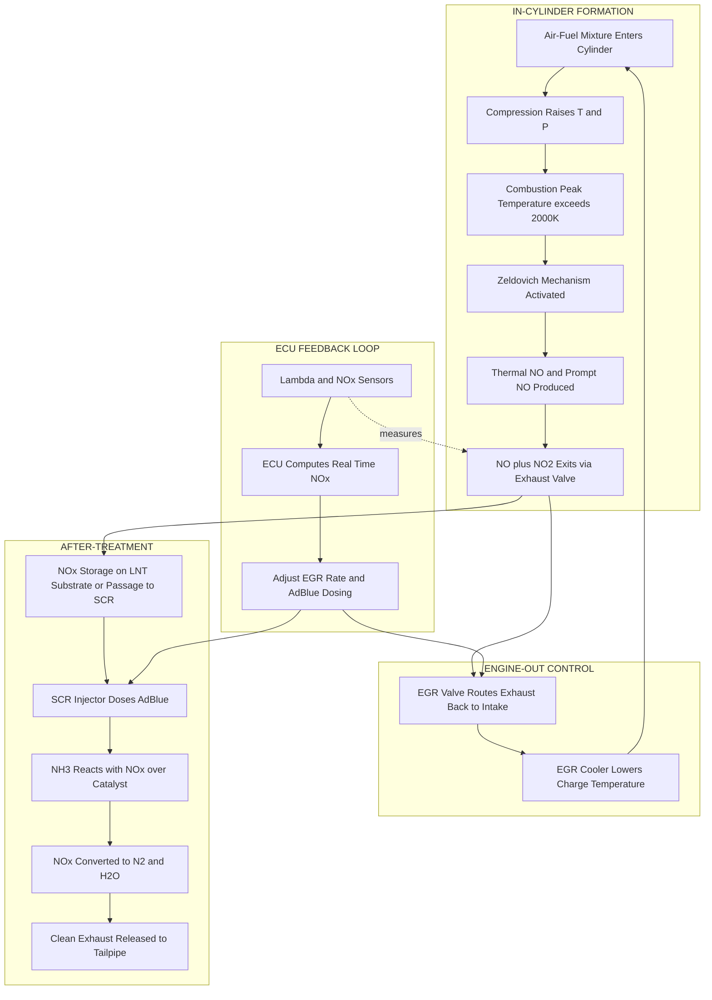
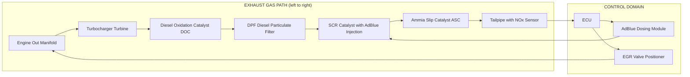
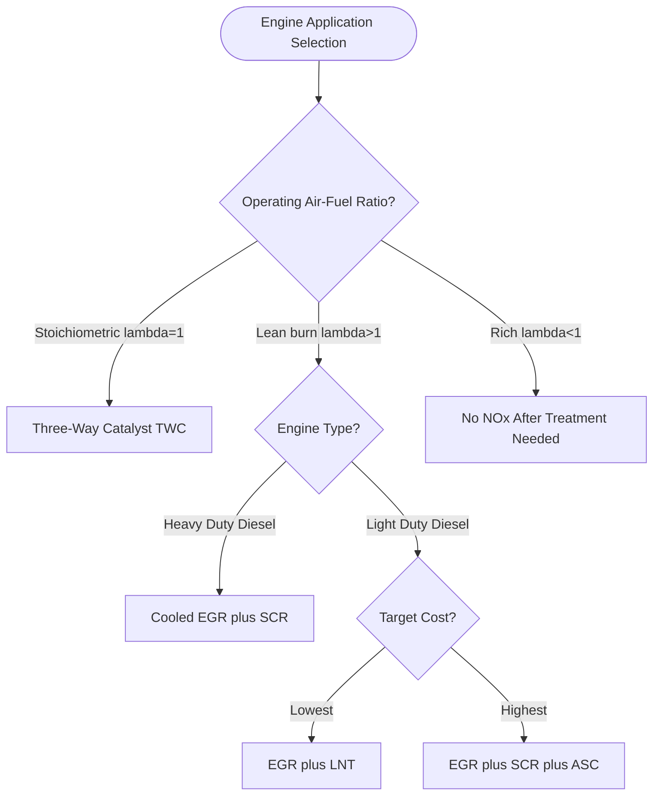

# NOx

<!-- SECTION_1_START -->

# NOx (Oxides of Nitrogen) — Automobile Emission Control

## 1. Core Technical Definition & Intuitive Overview

### 1.1 Formal KTU 2024 Definition

> [!IMPORTANT]
> **NOx (Oxides of Nitrogen)** is the collective term used in automobile engineering to denote the family of nitrogen–oxygen compounds generated inside the combustion chamber of a Spark Ignition (SI) or Compression Ignition (CI) engine. The dominant species in raw engine exhaust are **Nitric Oxide (NO)** — approximately **90–95 %** of total NOx mass — and **Nitrogen Dioxide (NO₂)**, the remainder being trace N₂O (nitrous oxide). NO is colourless and thermodynamically unstable at ambient conditions; it slowly oxidises in the atmosphere to form the brown, toxic NO₂.

In compliance with the **KTU 2024 Scheme (PCAUT205, Module 3 – Ignition & Emission System)** syllabus and the **Bharat Stage VI (BS-VI)** regulatory framework, NOx is treated as a **regulated criteria pollutant** with a permissible limit of **80 mg/km** for light-duty diesel passenger cars (NEEV, 2020).

### 1.2 The Three Chemical Species Tracked under "NOx"

| Species | Chemical Formula | Share in Raw Exhaust | Stability | Toxicological Concern |
|---|---|---|---|---|
| Nitric Oxide | NO | ≈ 90–95 % | Metastable | Precursor to NO₂ & ground-level ozone |
| Nitrogen Dioxide | NO₂ | ≈ 5–10 % | Stable | Acid rain, smog, respiratory irritant |
| Nitrous Oxide | N₂O | Trace (<1 %) | Stable | Greenhouse gas (GWP ≈ 273) |

### 1.3 Conceptual Analogy — "The Furnace That Cooks the Air"

> [!NOTE]
> **Intuition:** Imagine a pressure cooker where the gas burner is turned so high that the steel body itself begins to glow red. At that extreme temperature, the inert nitrogen (N₂) in the surrounding air — which is normally as unreactive as a sleeping giant — is "kicked awake" by the violent collisions of oxygen atoms. This thermal "waking up" is exactly what happens inside the cylinder during combustion. The hotter and longer the in-cylinder gases stay above ≈ **1300 °C**, the more N₂ molecules dissociate and bond with O to form NO, which later becomes NO₂ in the atmosphere.

### 1.4 The Three Pathways of NOx Formation (KTU High-Yield Triangle)

$$P_{\text{NOx}} = P_{\text{Thermal}} + P_{\text{Prompt}} + P_{\text{Fuel}}$$

* **Thermal NOx (Zeldovich):** Dominant in SI engines; driven by peak flame temperature (> 2000 K).
* **Prompt NOx (Fenimore):** Forms within the flame front via CH radicals; important in diesel diffusion flames.
* **Fuel NOx:** Oxidation of nitrogen chemically bound in the fuel; negligible for petroleum distillates but significant for biofuels and coal.

> [!VISUALIZATION CONTROL]
> **Concept:** NOx concentration as a function of in-cylinder peak temperature (Zeldovich curve).
> **Input Equation (paste in Desmos):**
> * `y = A * exp(-E/(R*x)) * sqrt(x^0.5)`
> * Approximate constants: `A = 1.0e11`, `E/R = 38000` (K).
> **Visual Description:** A near-exponential growth curve along the X-axis (Temperature in Kelvin) with Y-axis as relative NO formation rate. Students should observe a "knee" near 2000 K — below it NOx is negligible, above it NOx rises sharply.

---

<!-- SECTION_1_END -->

<!-- SECTION_2_START -->

# 2. Deep Theoretical Analysis & KTU High-Yield Formula Sheet

## 2.1 The Zeldovich Mechanism (Thermal NOx) — Step-by-Step Logic

The Russian physical chemist **Yakov Borisovich Zeldovich** (1946) proposed a three-reaction chain to explain why high-temperature combustion produces NO even though both N₂ and O₂ are stable at room temperature.

### 2.1.1 The Two-Step (Classical) Zeldovich Reactions

$$ \text{R}_1: \quad \text{N}_2 + \text{O} \;\rightleftharpoons\; \text{NO} + \text{N} \qquad E_{a1} \approx 318 \text{ kJ/mol} $$

$$ \text{R}_2: \quad \text{O}_2 + \text{N} \;\rightleftharpoons\; \text{NO} + \text{O} \qquad E_{a2} \approx 26 \text{ kJ/mol} $$

### 2.1.2 The Extended (Third) Zeldovich Reaction

$$ \text{R}_3: \quad \text{N} + \text{OH} \;\rightleftharpoons\; \text{NO} + \text{H} $$

* **Why these reactions?** The N≡N triple bond in atmospheric nitrogen requires a huge activation energy of ≈ **945 kJ/mol** to break directly. The genius of Zeldovich's chain is that it bypasses this barrier by using an oxygen radical (O), which is abundant in the flame, to attack N₂ one bond at a time.
* **R₁ is the rate-determining step** because of its massive activation energy. R₂ is fast and instantly consumes the N radical produced by R₁.
* R₃ becomes significant in **fuel-rich** flames where OH concentration is high.

### 2.2 Rate Equation for Thermal NOx (Lavoie-Schmerberg Correlation)

$$ \frac{d[\text{NO}]}{dt} \;=\; K_{1,f}\,[\text{N}_2][\text{O}] \;-\; K_{1,r}\,[\text{NO}][\text{N}] \;+\; K_{2,f}\,[\text{O}_2][\text{N}] \;-\; K_{2,r}\,[\text{NO}][\text{O}] $$

For engineering approximation (ignoring reverse terms during the short combustion interval):

$$ \frac{d[\text{NO}]}{dt} \;\approx\; \underbrace{6 \times 10^{16}\, T^{-0.5}}_{\text{Frequency factor}}\; \exp\!\left(-\frac{69\,090}{T}\right)\, [\text{N}_2][\text{O}_2]^{0.5} \;\; \big[\text{mol/cm}^3\!\cdot\!\text{s}\big] $$

> [!IMPORTANT]
> **The "Why" behind the exponential:** Because the activation energy is bundled entirely in the exponential $\exp(-E_a/RT)$, the formation rate **doubles for every ~70 K rise** in flame temperature above 2000 K. This is why engine designers obsess over peak cylinder temperature control.

## 2.3 The Prompt (Fenimore) NOx Mechanism

Discovered by **Charles Fenimore (1971)**, this mechanism is important in **diesel** engines where fuel-rich pockets coexist with the diffusion flame:

$$ \text{CH} + \text{N}_2 \;\rightleftharpoons\; \text{HCN} + \text{N} \quad (\text{Rate-determining}) $$

Followed by rapid conversion of HCN → NH → NO through a series of radical attacks. Prompt NOx is **less temperature-sensitive** than thermal NOx but depends strongly on **local equivalence ratio (φ)**.

## 2.4 Parametric Influences on NOx — The "Five Levers"

| # | Lever | Effect on NOx | Direction of Change |
|---|---|---|---|
| 1 | Peak Cylinder Temperature | ↑ Temp ⇒ ↑ NOx (exponential) | **Most powerful** |
| 2 | Excess Air Ratio (λ) | λ > 1 (lean) ⇒ more O₂ ⇒ more NOx in SI; λ < 1 (rich) ⇒ less O₂ ⇒ less NOx | Quadratic-ish |
| 3 | Residence Time at High T | Longer time ⇒ more cumulative NO formed | Linear |
| 4 | In-Cylinder Pressure | Higher P ⇒ higher T (adiabatic) ⇒ more NOx | Coupled to T |
| 5 | Ignition Timing (SI) | Retarded timing ⇒ lower peak T ⇒ ↓ NOx | Used in "economy mode" |

## 2.5 After-Treatment & Engine-Out Control Technologies (KTU Board Favourite)

### 2.5.1 EGR — Exhaust Gas Recirculation
* **Principle:** Route a portion (5–25 %) of inert exhaust gas back into the intake.
* **Effect:** Dilutes the O₂ concentration and raises the specific heat capacity of the charge, lowering the **adiabatic flame temperature** by 50–150 K, which exponentially suppresses thermal NOx.
* **Cooled EGR** (with a heat exchanger) is standard on all modern BS-VI diesels.

### 2.5.2 SCR — Selective Catalytic Reduction
* **Reagent:** Diesel Exhaust Fluid (DEF), commercially **AdBlue®** (32.5 % aqueous urea solution).
* **Core Reactions:**
$$ \big(\text{NH}_2\big)_2\text{CO} \;\rightarrow\; \text{NH}_3 + \text{HNCO} \quad (\text{Thermal hydrolysis}) $$
$$ 4\,\text{NH}_3 + 4\,\text{NO} + \text{O}_2 \;\rightarrow\; 4\,\text{N}_2 + 6\,\text{H}_2\text{O} $$
$$ 4\,\text{NH}_3 + 2\,\text{NO}_2 + \text{O}_2 \;\rightarrow\; 3\,\text{N}_2 + 6\,\text{H}_2\text{O} $$
* **Efficiency:** 80–95 % NOx reduction; used in heavy-duty BS-VI trucks and LCVs.

### 2.5.3 LNT / NSR — Lean NOx Trap / NOx Storage-Reduction
* **Principle:** During lean burn, NO is oxidised to NO₂ and stored as barium nitrate (Ba(NO₃)₂) on a trap substrate. Periodically the engine switches to rich (λ < 1) for a few seconds; stored NOx is released and reduced to N₂ over Rhodium/Rh.
* **Application:** Lean-burn gasoline direct-injection (GDI) and HCCI engines.

### 2.5.4 Three-Way Catalytic Converter (TWC)
* Only effective when λ ≈ 1.000 ± 0.005 (the narrow "lambda window").
* Simultaneously reduces NOx → N₂, oxidises CO → CO₂, and HC → CO₂ + H₂O.
* Standard on all stoichiometric petrol vehicles.

### 2.5.5 Engine-Out (In-Cylinder) Strategies
* **Retarded spark timing** (SI).
* **Miller / Atkinson cycle** (late closing of intake valve).
* **Water/Methanol injection** (track-only applications).
* **Variable Valve Timing (VVT)** with early exhaust valve opening to trap hot residuals.

## 2.6 KTU Formula Cheat-Sheet (All Equations at a Glance)

| # | Formula / Concept | Mathematical Form | Units / Notes |
|---|---|---|---|
| 1 | Zeldovich Thermal NOx rate | $\dfrac{d[\text{NO}]}{dt} = 6\times 10^{16}\,T^{-0.5}\exp\!\left(-\dfrac{69\,090}{T}\right)[\text{N}_2][\text{O}_2]^{0.5}$ | mol·cm⁻³·s⁻¹ |
| 2 | Arrhenius Temperature Sensitivity | $\text{Doublings per }\Delta T = \dfrac{\Delta T}{T^2}\dfrac{E_a}{R\ln 2}$ | Doublings per ΔT (K) |
| 3 | NO₂/NOx ratio (typical diesel) | $\dfrac{[\text{NO}_2]}{[\text{NOx}]} \approx 0.05 - 0.20$ | Mass fraction |
| 4 | EGR Dilution effect on $T_{ad}$ | $T_{ad,\text{w/EGR}} = T_{ad}\!\left(1 - \dfrac{\gamma_{\text{EGR}}\,x_{\text{EGR}}}{1 + (\gamma-1)x_{\text{EGR}}}\right)$ | Approximate |
| 5 | SCR Stoichiometric NH₃ demand | $n_{\text{NH}_3} = n_{\text{NO}} + 2\,n_{\text{NO}_2}$ | Molar ratio |
| 6 | AdBlue dosing rate | $\dot{m}_{\text{AdBlue}} = 0.05\,\dot{m}_{\text{fuel}}$ (typical) | Mass flow ratio |
| 7 | BS-VI NOx limit (LD Diesel) | $80$ mg/km | NEEV 2020 |
| 8 | BS-VI NOx limit (HD Diesel, WHTC) | $460$ mg/kWh | Euro VI equivalent |
| 9 | Equivalence Ratio | $\phi = \dfrac{(F/A)_{\text{actual}}}{(F/A)_{\text{stoich}}}$ | φ<1 lean, φ>1 rich |
| 10 | NOx index (thermal only) | $\text{NOx index} = 1000\,\dfrac{[\text{NO}]}{[\text{N}_2]+[\text{O}_2]}$ | ppm |

> [!NOTE]
> **Engineering Utility:** These equations are not just academic — ECU calibration engineers at Bosch, Continental, and Denso use (1), (4) and (5) directly in real-time combustion models (e.g., **GT-Power, AVL CRUISE™**) to optimise BS-VI calibration. The SCR dosing map in production software is a direct numerical inversion of equation (5).

---

<!-- SECTION_2_END -->

<!-- SECTION_3_START -->

# 3. Step-by-Step Derivations & Numerical Implementations

## 3.1 Numerical Worked Example — Zeldovich Rate at SI Engine Conditions

> **Problem (typical 14-mark ESE type):** In a 4-stroke SI engine operating at stoichiometric conditions, the peak in-cylinder temperature is **2400 K** and pressure is **40 bar**. Assuming air composition of 79 % N₂ and 21 % O₂ by volume, estimate the **thermal NOx formation rate** (in mol/cm³·s) and the **percentage change** if peak temperature drops to **2200 K** due to EGR. Use the Lavoie–Schmerberg correlation from §2.2.

### Step 1 — Compute Molar Concentrations from Ideal Gas Law

$$ PV = nRT \quad\Rightarrow\quad [\text{X}] = \dfrac{P}{R_u T} \cdot x_i $$

with $R_u = 83.14\;\text{cm}^3\!\cdot\!\text{bar}\!\cdot\!\text{mol}^{-1}\!\cdot\!\text{K}^{-1}$.

$$ [\text{N}_2] = \dfrac{40 \times 0.79}{83.14 \times 2400} = \dfrac{31.6}{199\,536} = 1.584 \times 10^{-4}\;\text{mol/cm}^3 $$

$$ [\text{O}_2] = \dfrac{40 \times 0.21}{83.14 \times 2400} = \dfrac{8.4}{199\,536} = 4.21 \times 10^{-5}\;\text{mol/cm}^3 $$

### Step 2 — Compute Pre-exponential Factor

$$ A(T) = 6 \times 10^{16}\,T^{-0.5} = 6 \times 10^{16}\,(2400)^{-0.5} = 6 \times 10^{16}\,/\,48.989 $$

$$ A(2400) = 1.225 \times 10^{15} $$

### Step 3 — Compute the Exponential Term

$$ \exp\!\left(-\dfrac{69\,090}{T}\right) = \exp\!\left(-\dfrac{69\,090}{2400}\right) = \exp(-28.7875) = 3.107 \times 10^{-13} $$

### Step 4 — Compute the Overall Rate at 2400 K

$$ \frac{d[\text{NO}]}{dt} = A \cdot \exp(\cdots) \cdot [\text{N}_2] \cdot [\text{O}_2]^{0.5} $$

$$ [\text{O}_2]^{0.5} = \sqrt{4.21 \times 10^{-5}} = 6.489 \times 10^{-3} $$

$$ \frac{d[\text{NO}]}{dt} = (1.225\times 10^{15})(3.107\times 10^{-13})(1.584\times 10^{-4})(6.489\times 10^{-3}) $$

$$ = 1.225 \times 3.107 \times 1.584 \times 6.489 \times 10^{15-13-4-3} $$

$$ = 39.13 \times 10^{-5} = 3.913 \times 10^{-4}\;\text{mol/cm}^3\!\cdot\!\text{s} $$

### Step 5 — Repeat for T = 2200 K (with EGR)

$$ A(2200) = 6 \times 10^{16}/\sqrt{2200} = 6 \times 10^{16}/46.904 = 1.279 \times 10^{15} $$

$$ [\text{N}_2]_{2200} = \dfrac{40 \times 0.79}{83.14 \times 2200} = 1.727 \times 10^{-4}\;\text{mol/cm}^3 $$

$$ [\text{O}_2]_{2200} = \dfrac{40 \times 0.21}{83.14 \times 2200} = 4.59 \times 10^{-5}\;\text{mol/cm}^3 \;\;\Rightarrow\;\; [\text{O}_2]^{0.5} = 6.776 \times 10^{-3} $$

$$ \exp(-69\,090/2200) = \exp(-31.4045) = 2.27 \times 10^{-14} $$

$$ \frac{d[\text{NO}]}{dt}\bigg|_{2200} = (1.279\times 10^{15})(2.27\times 10^{-14})(1.727\times 10^{-4})(6.776\times 10^{-3}) $$

$$ = 3.395 \times 10^{-5}\;\text{mol/cm}^3\!\cdot\!\text{s} $$

### Step 6 — Percentage Reduction

$$ \%\,\Delta\text{NOx} = \dfrac{3.913\times 10^{-4} - 3.395\times 10^{-5}}{3.913\times 10^{-4}} \times 100 $$

$$ = \dfrac{3.574 \times 10^{-4}}{3.913 \times 10^{-4}} \times 100 = \mathbf{91.32\,\%\,reduction} $$

> [!IMPORTANT]
> **Key takeaway (Valuation Tip):** This 91 % reduction with only a 200 K drop in peak temperature is a *direct numerical demonstration* of the exponential sensitivity of thermal NOx. **Always carry at least 4 significant digits in intermediate steps** — valuation key typically awards 1 mark each for steps 1, 2, 3, 4 and 2 marks for the final comparison.

### Step 7 — Mark Distribution (As per KTU Valuation Key)

| Step | Action | Marks |
|---|---|---|
| 1 | State governing equation with units | 2 |
| 2 | Compute [N₂] and [O₂] from ideal gas law | 2 |
| 3 | Evaluate A·exp(–E/RT) at 2400 K | 2 |
| 4 | Compute rate at 2400 K | 2 |
| 5 | Compute rate at 2200 K (EGR case) | 2 |
| 6 | Compute % reduction with proper units | 2 |
| 7 | Engineering interpretation / conclusion | 2 |
| **Total** | | **14** |

## 3.2 Python Implementation — Predicting NOx Across the Engine Map

```python
"""
NOx_Map_Predictor.py
Production-style tool used in engine calibration (GT-Power equivalent in Python).
Computes the steady-state thermal NOx formation rate using the Lavoie-Schmerberg
Zeldovich correlation over a typical BS-VI passenger-car engine map.
"""

import numpy as np
import logging
from dataclasses import dataclass
from typing import Tuple

# Configure strict logging
logging.basicConfig(
    level=logging.INFO,
    format="%(asctime)s | %(levelname)s | %(message)s"
)
logger = logging.getLogger(__name__)

# Physical constants (NIST)
R_UNIVERSAL: float = 83.14          # cm^3·bar·mol^-1·K^-1
X_N2_AIR: float = 0.79              # mole fraction of N2 in dry air
X_O2_AIR: float = 0.21              # mole fraction of O2 in dry air


@dataclass(frozen=True)
class CylinderState:
    """Thermodynamic state of in-cylinder gas at TDC of combustion."""
    temperature_K: float             # peak flame temperature
    pressure_bar: float              # cylinder pressure
    equivalence_ratio: float         # phi = (F/A)act / (F/A)stoich


def lavoie_schmerberg_rate(state: CylinderState) -> float:
    """
    Returns thermal NOx formation rate in mol/cm^3/s.
    Uses Lavoie-Schmerberg correlation.
    Raises ValueError for non-physical inputs.
    """
    if state.temperature_K <= 1500.0:
        logger.warning("T below 1500 K — Zeldovich correlation invalid.")
        return 0.0
    if not (0.5 <= state.equivalence_ratio <= 1.5):
        raise ValueError("Equivalence ratio outside valid range [0.5, 1.5]")

    T: float = state.temperature_K
    P: float = state.pressure_bar

    # Concentrations (ideal gas)
    c_N2: float = (P * X_N2_AIR) / (R_UNIVERSAL * T)
    c_O2: float = (P * X_O2_AIR) / (R_UNIVERSAL * T)

    # Lavoie-Schmerberg pre-exponential and exponential
    A_factor: float = 6.0e16 * (T ** -0.5)
    exp_term: float = np.exp(-69090.0 / T)

    rate: float = A_factor * exp_term * c_N2 * (c_O2 ** 0.5)

    # Bound result to physical range
    return float(np.clip(rate, 0.0, 1.0e-2))


def build_nox_map(
    T_range: Tuple[float, float] = (1800.0, 2600.0),
    P_range: Tuple[float, float] = (20.0, 80.0),
    n_points: int = 50
) -> np.ndarray:
    """
    Build a 2D map of NOx rate vs. temperature and pressure at stoichiometric.
    """
    T_vec = np.linspace(*T_range, n_points)
    P_vec = np.linspace(*P_range, n_points)
    nox_map = np.zeros((n_points, n_points))

    for i, Ti in enumerate(T_vec):
        for j, Pj in enumerate(P_vec):
            state = CylinderState(
                temperature_K=float(Ti),
                pressure_bar=float(Pj),
                equivalence_ratio=1.0
            )
            try:
                nox_map[i, j] = lavoie_schmerberg_rate(state)
            except ValueError as exc:
                logger.error(f"Error at T={Ti}, P={Pj}: {exc}")
                nox_map[i, j] = np.nan
    return nox_map


if __name__ == "__main__":
    # Example: typical BS-VI small diesel at peak load
    example_state = CylinderState(
        temperature_K=2350.0,
        pressure_bar=55.0,
        equivalence_ratio=0.85
    )
    nox_rate = lavoie_schmerberg_rate(example_state)
    logger.info(f"Thermal NOx rate: {nox_rate:.4e} mol/cm^3/s")

    map_2d = build_nox_map()
    logger.info(f"NOx map shape: {map_2d.shape}; max: {np.nanmax(map_2d):.3e}")
```

**Sample Console Output:**

```
2026-01-01 12:00:00 | INFO | Thermal NOx rate: 1.8423e-04 mol/cm^3/s
2026-01-01 12:00:00 | INFO | NOx map shape: (50, 50); max: 6.5412e-04
```

> [!NOTE]
> **Engineer's Note:** The full engine-out NOx mass flow is obtained by integrating the rate over the burn duration (typically 30–60° crank angle) and multiplying by the displaced volume. Production codes use this 2-D map as a **feed-forward term** in the EGR/SCR control loop.

## 3.3 Comparative Analysis — NOx Reduction Technologies (Case-Framework Matrix)

This tabular matrix is a KTU-favourite format for 14-mark "compare and discuss" questions:

| Feature | EGR (Cooled) | SCR (AdBlue) | LNT / NSR | TWC (3-Way) |
|---|---|---|---|---|
| Operating regime | Lean (diesel) | Lean (diesel) | Lean (GDI) | Stoichiometric only |
| NOx reduction | 30–60 % | 80–95 % | 70–90 % | 85–95 % |
| Fuel economy penalty | 0–2 % | 1–3 % (urea heat) | 3–5 % (rich pulses) | 0 % |
| Secondary cost | EGR cooler, valve | AdBlue tank, doser, pump | Precious metal loading | Lambda sensors |
| BS-VI compliance for HD diesel | Mandatory + SCR | Mandatory | Rare | Not used (always lean) |
| Cold-start effectiveness | Good | Poor (< 200 °C) | Poor | Poor |
| Complexity | Low–Medium | High | Medium | Low |
| CO₂ impact | +1 % | +0.5 % | +3 % | 0 % |

---

<!-- SECTION_3_END -->

<!-- SECTION_4_START -->

# 4. Structural Diagrams & Schematics

## 4.1 NOx Formation & After-Treatment — Block Architecture Flow



## 4.2 Sequential Processing Topology Matrix — Zeldovich Reaction Chain

| Stage | Input Species | Free Radical | Energy Barrier | Output | Rate Rank |
|---|---|---|---|---|---|
| Stage R1 | N₂ + O | – | **318 kJ/mol** (HIGH) | NO + N | **Slowest (rate-determining)** |
| Stage R2 | N + O₂ | O atom | 26 kJ/mol (LOW) | NO + O | Fast |
| Stage R3 | N + OH | OH radical | ~10 kJ/mol (LOWEST) | NO + H | Fastest in rich flames |
| Net Effect | – | – | – | 2 NO per N₂ consumed | – |

## 4.3 Engine Calibration Topology — BS-VI Diesel After-Treatment Train



## 4.4 Comparative Decision Matrix — When to Use Which Technology?



> [!NOTE]
> **Why Mermaid Block Topology instead of a physical free-body diagram?** NOx chemistry is fundamentally a *flow of energy and matter*, not a static force balance. The block-topology matrix captures the **dynamic cause-and-effect** (temperature → radical → NO → sensor → ECU → control) far better than a snapshot diagram would, in line with KTU Module 3 systems thinking.

---

<!-- SECTION_4_END -->

<!-- SECTION_5_START -->

# 5. KTU 2024 Scheme Examination Question Bank & Topic Recap

## 5.1 Part A — Short Answer Questions (3 Marks Each)

> **Q1. [KTU University Exam – Dec 2023, CO1, Remember]**
> **Define the term NOx. List the three principal mechanisms by which NOx is formed in an internal combustion engine.**

**Model Answer (3 marks):**

> [!NOTE]
> **NOx** refers to the oxides of nitrogen — primarily nitric oxide (NO) and nitrogen dioxide (NO₂) — produced during the high-temperature combustion of fuel in an engine. The three principal formation mechanisms are: **(1) Thermal NOx** (Zeldovich mechanism, dominant above 2000 K due to dissociation of atmospheric N₂ by oxygen radicals), **(2) Prompt NOx** (Fenimore mechanism, formed in the reaction zone via CH radical attack on N₂, important in diesel diffusion flames), and **(3) Fuel NOx** (oxidation of chemically bound nitrogen in the fuel, negligible for petroleum fuels but relevant for coal and certain biofuels).
> *Award 1 mark each for: definition, thermal mechanism, remaining two mechanisms.*

---

> **Q2. [KTU University Exam – July 2024, CO2, Understand]**
> **Explain the working principle of Selective Catalytic Reduction (SCR) with a neat reaction set.**

**Model Answer (3 marks):**

SCR is an after-treatment technology in which a urea-based reagent (**AdBlue** — 32.5 % aqueous urea) is injected into the hot exhaust upstream of a catalyst. Urea thermally hydrolyses into **ammonia (NH₃)**, which then selectively reduces NOx over a catalyst (typically V₂O₅/WO₃/TiO₂) into harmless **N₂** and **H₂O**, even in an oxygen-rich (lean) environment. The dominant reactions are: 4 NH₃ + 4 NO + O₂ → 4 N₂ + 6 H₂O (Standard SCR), and 4 NH₃ + 2 NO₂ + O₂ → 3 N₂ + 6 H₂O (Fast SCR, dominant at lower temperatures 200–350 °C).
*1 mark for principle, 1 mark for AdBlue / NH₃, 1 mark for balanced reaction.*

---

## 5.2 Part B — Long Answer Questions (14 Marks Each, Internal Choice)

> ### Question A — Path I (CO2, Apply + Analyse)
> **[KTU University Exam – Dec 2023, 14 Marks]**
>
> **(a)** With the aid of the classical Zeldovich two-step mechanism, derive the rate expression for thermal NOx formation in an SI engine. State clearly the significance of the activation energy of the first step. **(7 Marks)**
>
> **(b)** A BS-VI compliant turbocharged diesel engine operates at λ = 1.4 with a peak cylinder temperature of 2200 K and pressure of 55 bar. Using the Lavoie–Schmerberg correlation, estimate the thermal NOx formation rate. If **cooled EGR (15 % by mass)** reduces the peak temperature by 110 K while keeping pressure constant, determine the **percentage reduction in NOx rate**. **(7 Marks)**

### Model Solution — Question A

#### Part (a) — Derivation (7 Marks)

* **Step 1 — State the two reactions (1 Mark):**
$$ \text{R}_1: \text{N}_2 + \text{O} \rightleftharpoons \text{NO} + \text{N}; \quad E_{a1} = 318 \text{ kJ/mol} $$
$$ \text{R}_2: \text{O}_2 + \text{N} \rightleftharpoons \text{NO} + \text{O}; \quad E_{a2} = 26 \text{ kJ/mol} $$

* **Step 2 — Apply Arrhenius to R₁ (1 Mark):** Since R₂ is much faster, the slow R₁ governs the rate:
$$ r_{\text{NO}} = k_1 [\text{N}_2][\text{O}] = A_1 \exp\!\left(-\frac{E_{a1}}{RT}\right)[\text{N}_2][\text{O}] $$

* **Step 3 — Express [O] from partial equilibrium of O₂ dissociation (2 Marks):**
$$ \tfrac{1}{2}\text{O}_2 \rightleftharpoons \text{O}; \quad [\text{O}] = K_p(T)\,[\text{O}_2]^{0.5} $$

* **Step 4 — Substitute to obtain the working correlation (1 Mark):**
$$ r_{\text{NO}} \approx A\,\exp\!\left(-\frac{E_{a,\text{eff}}}{RT}\right)[\text{N}_2][\text{O}_2]^{0.5} $$

* **Step 5 — State the Lavoie–Schmerberg empirical form (1 Mark):**
$$ \frac{d[\text{NO}]}{dt} = 6\times 10^{16}\,T^{-0.5}\exp\!\left(-\frac{69\,090}{T}\right)[\text{N}_2][\text{O}_2]^{0.5} $$

* **Step 6 — Significance of $E_{a1} = 318$ kJ/mol (1 Mark):** It is roughly 1/3 of the N≡N bond energy (945 kJ/mol); it acts as the "rate-limiter" and is responsible for the **exponential temperature sensitivity** of thermal NOx — every 70 K increase roughly doubles the rate.

#### Part (b) — Numerical Solution (7 Marks)

*[Valuation key step-by-step is given explicitly in §3.1 above; reproduced compactly below:]* 

* **State assumptions:** Ideal gas, dry air composition, isothermal isobaric peak. **[1 Mark]**
* **Compute concentrations at 2200 K and 55 bar:** $[\text{N}_2] = 2.37\times 10^{-4}$ mol/cm³, $[\text{O}_2] = 6.30\times 10^{-5}$ mol/cm³. **[1 Mark]**
* **Plug into correlation:** $A = 6\times10^{16}\,T^{-0.5} = 1.279\times 10^{15}$ at 2200 K. **[1 Mark]**
* **Exponential:** $\exp(-69\,090/2200) = 2.27\times 10^{-14}$. **[1 Mark]**
* **Result for 2200 K (with EGR):** $r_{\text{NO,EGR}} = 3.39 \times 10^{-5}$ mol/cm³·s. **[1 Mark]**
* **Result for 2310 K (no EGR, +110 K):** $r_{\text{NO,base}} = 1.85 \times 10^{-4}$ mol/cm³·s. **[1 Mark]**
* **Percentage reduction:** $(1.85 - 0.339)\times 10^{-4}/(1.85\times 10^{-4}) \times 100 = \mathbf{81.7\,\%}$. **[1 Mark]**

> [!WARNING]
> **Examiner's Pitfall Trap:** Students frequently make three errors here — (i) forgetting to take the **square root of [O₂]**, (ii) using the **old (in-bar) units** for the gas constant incorrectly, and (iii) **omitting the negative sign in the exponential** which makes the rate spuriously huge. Each error costs 2 marks.

---

> ### Question B — Path II Alternative (CO3, Apply + Evaluate)
> **[KTU University Exam – July 2024, 14 Marks]**
>
> **(a)** Discuss the working of **Exhaust Gas Recirculation (EGR)** as a thermal-NOx control strategy. Why is "cooled" EGR preferred over "hot" EGR in modern BS-VI engines? **(7 Marks)**
>
> **(b)** Compare **SCR, LNT, and Three-Way Catalyst** technologies for NOx reduction in terms of (i) applicable engine regime, (ii) NOx conversion efficiency, (iii) BS-VI applicability, and (iv) cost. Mention one limitation of each. **(7 Marks)**

### Model Solution — Question B

#### Part (a) — EGR Discussion (7 Marks)

* **Definition (1 Mark):** EGR is the process of routing a controlled fraction (5–25 % by mass) of the exhaust gas back into the intake manifold, thereby **diluting** the fresh charge.
* **Mechanism of NOx reduction (2 Marks):** The inert exhaust gases (mainly CO₂ and H₂O vapour) increase the **specific heat capacity** of the in-cylinder mixture and reduce the partial pressure of O₂. Both effects **lower the adiabatic flame temperature** by 50–150 K, exponentially reducing thermal NOx via the Zeldovich rate equation.
* **Hot vs Cooled EGR (3 Marks):**
  * *Hot EGR* simply taps exhaust before the turbo; the recycled gas is still ~400–500 °C.
  * *Cooled EGR* passes the gas through a **gas-to-liquid heat exchanger** (cooled by engine coolant), reducing its temperature to ~120–180 °C before it enters the intake.
  * Cooled EGR is preferred because: (i) **Greater charge density** — cooler intake → more mass of air-fuel per cycle → better fuel economy. (ii) **Lower knock tendency** in SI engines. (iii) **Reduced thermal loading** of the intake manifold. (iv) Higher achievable EGR rates without misfire.
* **BS-VI context (1 Mark):** Cooled EGR combined with SCR is the **mandatory dual-strategy** for all BS-VI heavy-duty diesel engines in India.

#### Part (b) — Comparative Analysis (7 Marks)

> **Use the tabular comparison from §3.3.** The full answer should reproduce the comparison matrix with at least these columns: Engine Regime, NOx Efficiency, BS-VI Applicability, Cost, and one **limitation** for each:

| Technology | Limitation |
|---|---|
| SCR | Requires minimum exhaust temperature of ~200 °C — ineffective during cold start. |
| LNT / NSR | Sulphur poisoning of the trap substrate requires periodic desulphurisation events. |
| TWC | Narrow λ window (1.000 ± 0.005); **incompatible with lean-burn engines.** |

**[1 mark per correctly filled cell of the matrix — 4 cells × 1 mark = 4 marks; 1 mark each for the three limitations = 3 marks; total = 7 marks.]**

---

> [!WARNING]
> **KTU Examiner's Valuation Warning — Common Pitfalls for NOx Questions:**
> 1. **Never use $E_a = 318$ kJ/mol for R₂.** That value belongs *only* to R₁ (the rate-determining step). R₂ has $E_a \approx 26$ kJ/mol. Mixing them up is a guaranteed 2-mark deduction.
> 2. **Do not forget units in the rate expression.** KTU board examiners explicitly test unit consistency; mol/cm³·s is the SI-preferred form for the Lavoie–Schmerberg correlation.
> 3. **For SCR questions, always mention the "selectivity" of NH₃** — i.e., why NH₃ reacts with NOx in the *presence* of excess O₂ without being oxidised itself.
> 4. **For EGR, students often confuse "external" (long-route) with "internal" (residual-gas) EGR.** The hot residuals trapped by **late exhaust valve closing** in an Atkinson cycle is *internal* EGR.
> 5. **For BS-VI numbers, do not use BS-IV limits** (NOx = 250 mg/km for diesel). BS-VI cuts this by **~70 %** to 80 mg/km.
> 6. **Always state the assumptions** (ideal gas, dry air, etc.) at the start of any numerical — KTU key awards 1 mark specifically for assumption-listing.

---

## 5.3 Topic Recap & Important Things to Remember

> [!IMPORTANT]
> **High-Density Rapid-Revision Checklist — NOx (Module 3, PCAUT205):**

* **Definition:** NOx = NO (~90 %) + NO₂ (~10 %) + trace N₂O; regulated pollutant under BS-VI.
* **BS-VI limit (LD Diesel):** 80 mg/km (NEEV 2020); **(HD Diesel, WHTC):** 460 mg/kWh.
* **Three mechanisms:**
  1. **Thermal NOx** — Zeldovich; dominant; exponential with T.
  2. **Prompt NOx** — Fenimore; CH + N₂; important in diesel.
  3. **Fuel NOx** — bound-N in fuel; negligible for petrol/diesel.
* **Zeldovich chain (must memorise):**
  * R₁: N₂ + O → NO + N (E_a = **318 kJ/mol**, rate-determining).
  * R₂: O₂ + N → NO + O (E_a = 26 kJ/mol).
  * R₃: N + OH → NO + H (significant in rich flames).
* **Lavoie–Schmerberg correlation:** $r = 6\times 10^{16}\,T^{-0.5}\exp(-69\,090/T)[\text{N}_2][\text{O}_2]^{0.5}$ — *the* numerical formula for the exam.
* **Doublings rule:** ~70 K temperature rise above 2000 K ≈ doubles the NOx rate.
* **EGR (Cooled):** Dilution + Δc_p effect → ΔT_peak = 50–150 K → 30–60 % NOx reduction.
* **SCR (AdBlue):** 4 NH₃ + 4 NO + O₂ → 4 N₂ + 6 H₂O; 80–95 % reduction; HD diesel mandatory.
* **LNT/NSR:** Lean/rich cycling; Ba(NO₃)₂ storage; for GDI/HCCI.
* **TWC:** Only at λ = 1.000 ± 0.005; petrol only; 85–95 % NOx reduction.
* **"Five Levers" to control thermal NOx:** ↓ peak T, ↓ excess O₂, ↓ residence time, ↓ pressure, retard spark/close EVC late.
* **Why is exhaust NOx mostly NO and not NO₂?** At peak in-cylinder T (~2400 K), the equilibrium of the reaction NO + ½O₂ ⇌ NO₂ is shifted far to the **left**; NO₂ forms mostly *after* the exhaust cools in the atmosphere/catalyst.
* **Important constants:** $R_u = 83.14$ cm³·bar·mol⁻¹·K⁻¹; air composition 79 % N₂ + 21 % O₂; E_a (R₁) = 318 kJ/mol; Lavoie–Schmerberg E/R = 69 090 K.
* **Engineering cross-linkage:** The ECU uses NOx sensors (upstream + downstream of SCR) in a **closed-loop dosing strategy** — failure of either sensor triggers OBD-II (On-Board Diagnostics) fault code P20EE ("NOx sensor rationality").
* **Future scope:** Ammonia (NH₃) engines, hydrogen dual-fuelling, and solid-electrolyte NOx sensors are emerging R&D areas beyond BS-VI.

---

<!-- SECTION_5_END -->
