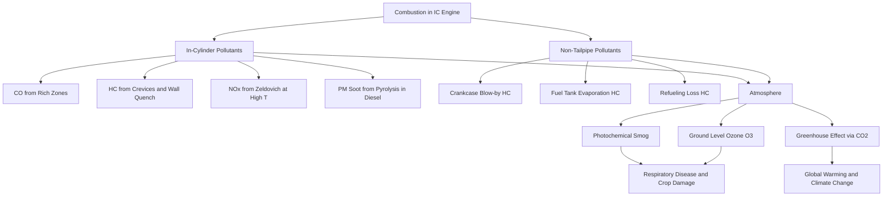
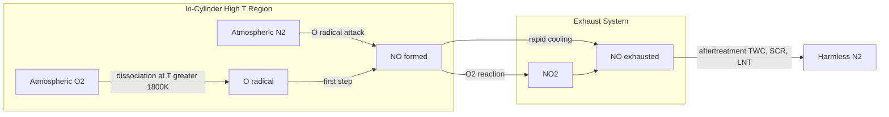
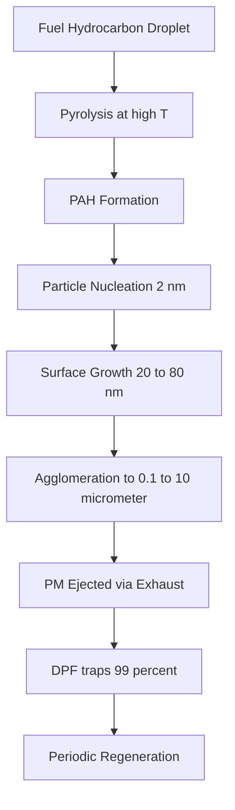
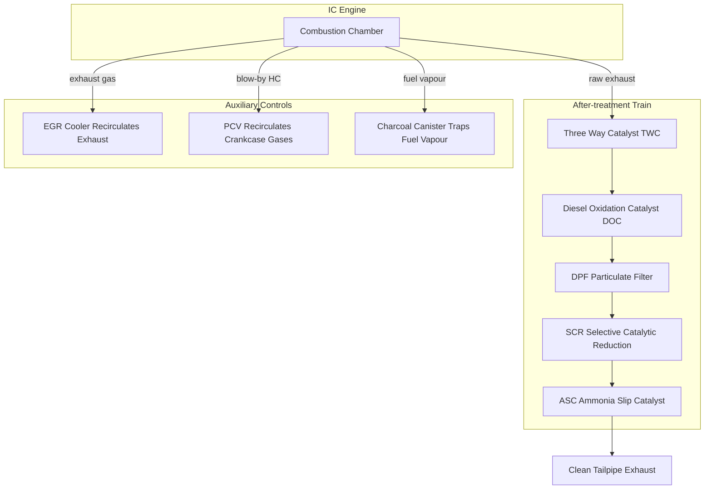
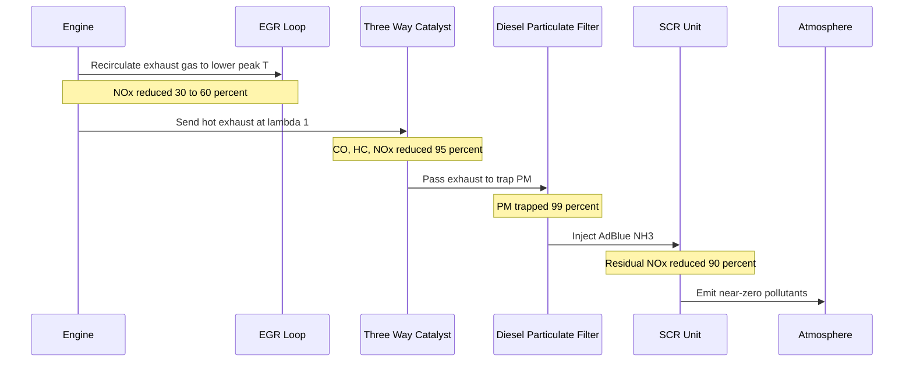

# Pollutants in IC Engines.

<!-- SECTION_1_START -->

# Pollutants in IC Engines — Core Technical Definition & Intuitive Overview

## 1.1 Formal Academic Definition (KTU 2024 Syllabus Terminology)

In the context of **Internal Combustion (IC) Engines**, pollutants are defined as the **undesirable, toxic, and environmentally harmful by-products** of the combustion of hydrocarbon fuels (petrol, diesel, CNG, LPG, ethanol, biodiesel, etc.) with air, which are released into the atmosphere through the **exhaust system**, **crankcase blow-by gases**, and **fuel evaporative emissions**.

According to the **KTU 2024 Scheme (PCAUT205 — Automobile Power Plant)** Module 3 framework, IC engine pollutants are broadly classified into two major families:

- **Primary Pollutants** — Emitted directly from the tailpipe in harmful concentrations (e.g., **CO**, **HC**, **NOx**, **PM**, **SOx**, **Pb**).
- **Secondary Pollutants** — Formed in the atmosphere by the chemical reaction of primary pollutants with sunlight, water vapor, and other atmospheric gases (e.g., **Ozone ($O_3$)**, **Peroxyacetyl Nitrate (PAN)**, **Photochemical Smog**).

> [!IMPORTANT]
> **KTU Board Highlight:** The six regulated (legally monitored) pollutants from a SI/CI engine are **CO, HC, NOx, CO₂, PM (Particulate Matter)**, and **Lead (Pb)** compounds. These are mandated under the **Bharat Stage (BS-VI)** emission norms in India (aligned with **Euro 6**).

> [!NOTE]
> **Engineered Combustion Reality:** A perfect, stoichiometric combustion of pure iso-octane ($C_8H_{18}$) in dry air would yield only **$CO_2$** and **$H_2O$**. However, real engines operate under **non-ideal, time-varying, heterogeneous combustion conditions** due to finite mixing time, cycle-by-cycle variation, and crevice/quench effects — leading to the formation of multiple pollutants.

---

## 1.2 Conceptual Analogy — Plain English Intuition

Imagine a **kitchen stove burning kerosene** in a poorly ventilated room:
- The **blue flame regions** (where fuel mixes well with oxygen) burn cleanly → analogous to **complete combustion** in an engine cylinder.
- The **yellow/orange flame regions** (where fuel is rich) produce **soot and carbon monoxide** → analogous to **fuel-rich zones** during cold-start, acceleration, or in crevices.
- The **stuffy, suffocating smell** (unburnt fuel) is the **Hydrocarbon (HC) emission**.
- The **brown, oily residue** deposited on the cookware walls represents **Particulate Matter (PM)** in a diesel engine.

> The same chemistry — just compressed into a 400–600 cc cylinder, fired 1500–3000 times per minute, and expelled at the tailpipe into the breathing zone of every human walking on the street. **That is why IC engine pollution is a public health and environmental crisis**, not just a mechanical inconvenience.

**Geometric/Process Intuition:** Picture a **single fuel droplet evaporating in a hot gas boundary layer**. As combustion progresses inward (the **droplet burning regime**), the *outer* region becomes **fuel-lean** (excess air → forms **NOx** at high T) while the *inner* region remains **fuel-rich** (forms **CO, HC, soot/PM**). Thus, **one droplet = two pollution zones**.

---

## 1.3 Standard Units & Physical Constants (Bold for KTU Recall)

| Quantity | Symbol | Standard Value | Unit |
|---|---|---|---|
| Air-Fuel Ratio (Stoichiometric, gasoline) | $A/F_{stoich}$ | **14.7 : 1** | kg air / kg fuel |
| Air-Fuel Ratio (Stoichiometric, diesel) | $A/F_{stoich}$ | **14.5 : 1** | kg air / kg fuel |
| Molecular weight of dry air | $M_{air}$ | **28.97** | kg/kmol |
| Universal gas constant | $R$ | **8.314** | J/(mol·K) |
| Molecular weight of $CO$ | $M_{CO}$ | **28.01** | kg/kmol |
| Molecular weight of $HC$ (as $CH_1.85$) | $M_{HC}$ | **13.85** | kg/kmol |
| Molecular weight of $NO$ | $M_{NO}$ | **30.01** | kg/kmol |
| Adiabatic flame temperature (peak) | $T_{ad}$ | **2200 – 2800** | K |

---

## 1.4 Major Pollutants — One-Line Snapshot

1. **Carbon Monoxide (CO)** — Colorless, odorless, poisonous gas from **incomplete combustion**.
2. **Unburnt Hydrocarbons (HC)** — Fuel that escapes combustion; contains **toxic and carcinogenic** compounds (e.g., **Benzene, PAH**).
3. **Oxides of Nitrogen (NOx = NO + NO₂)** — Formed at **high in-cylinder temperatures** (>1800 K) via the **Zeldovich mechanism**.
4. **Carbon Dioxide (CO₂)** — Greenhouse gas; product of **complete combustion**; the **climate change driver**.
5. **Particulate Matter (PM / Soot)** — Carbonaceous particles from diesel; **PM 2.5** causes deep lung penetration.
6. **Oxides of Sulfur (SOx)** — From sulfur impurities in diesel fuel (already **<10 ppm** in BS-VI diesel).
7. **Lead Compounds (Pb)** — From **tetraethyl lead (TEL)** anti-knock additive; phased out in India.
8. **Photochemical Smog / Ozone ($O_3$)** — Secondary pollutant from **HC + NOx + sunlight**.

> [!VISUALIZATION CONTROL]
> **Concept:** Composition of typical exhaust gas volume (dry basis) for a gasoline engine at idle (rich mixture).
> **Plot Type:** Stacked bar chart / pie chart representation.
> **Approximate Values (vol %):**
> * $N_2 \approx 71$ %
> * $CO_2 \approx 14$ %
> * $H_2O \approx 13$ %
> * CO $\approx 2.0$ %
> * $O_2 \approx 0.3$ %
> * HC $\approx 0.05$ %
> * NOx $\approx 0.02$ %
> **Visual Description:** Students should observe that even a *trace fraction* (0.02–2 %) of toxic gases (CO, HC, NOx) in otherwise harmless $N_2$ and $CO_2$ is enough to cause severe environmental and health damage due to **toxicity per molecule**.

---

<!-- SECTION_1_END -->

<!-- SECTION_2_START -->

# Deep Theoretical Analysis & KTU High-Yield Formula Sheet

## 2.1 Classification of IC Engine Pollutants

A clean structural breakdown (mapped directly to the KTU Module 3 syllabus):

```
IC Engine Pollutants
├── Primary (emitted directly from tailpipe)
│   ├── Carbon Monoxide (CO)
│   ├── Unburnt Hydrocarbons (HC)
│   ├── Oxides of Nitrogen (NOx)
│   ├── Particulate Matter (PM / Soot)
│   ├── Carbon Dioxide (CO2)  → Greenhouse gas
│   ├── Oxides of Sulfur (SOx)
│   └── Lead Compounds (Pb)
│
└── Secondary (formed in atmosphere)
    ├── Ozone (O3)
    ├── Peroxyacetyl Nitrate (PAN)
    └── Photochemical Smog
```

> **Other non-tailpipe sources** (also testable for KTU 2-mark questions):
> - **Crankcase Blow-by Gases** (HC) — controlled by **PCV (Positive Crankcase Ventilation)**.
> - **Evaporative Emissions** (HC) — controlled by **Charcoal Canister** in fuel system.
> - **Refueling Losses** (HC) — controlled by **ORVR (Onboard Refueling Vapor Recovery)**.

---

## 2.2 Carbon Monoxide (CO) — Detailed Mechanism

### Why it forms
- In **fuel-rich zones** (locally $\phi > 1$), there is **insufficient oxygen** to oxidize all carbon atoms all the way to $CO_2$.
- Equilibrium of the **water-gas shift reaction** at typical engine exhaust temperatures (700–1200 K) favors $CO$ as the dominant product rather than $CO_2$.

### Governing reactions
$$C + \frac{1}{2} O_2 \rightarrow CO \quad \text{(incomplete oxidation)}$$
$$CO + H_2O \rightleftharpoons CO_2 + H_2 \quad \text{(water-gas shift)}$$

### Key Engineering Drivers (Why)
- **Cold start** (choked catalyst, rich mixture) → **peak CO**.
- **Acceleration / Wide Open Throttle (WOT)** with carbureted engines.
- **Local fuel-rich pockets** near injector spray tip during cold operation.
- **Low in-cylinder temperature** (catalyst light-off below 300 °C).

### Real-world harm
- Binds to **hemoglobin (Hb)** in blood 200× more strongly than $O_2$ → forms **carboxyhemoglobin (COHb)** → tissue hypoxia, dizziness, death at >50 % COHb.

---

## 2.3 Unburnt Hydrocarbons (HC) — Detailed Mechanism

### Why it forms
Four primary mechanisms (each is a **2-mark KTU question**):

1. **Crevice Volume Effect** — Combustion gases leak into the **top-land crevice** (piston-ring crevice ~ 1–2 % of clearance volume) and **quench**, leaving unburnt HC.
2. **Wall Quenching** — A **flame cannot propagate** within $\approx 0.5$ mm of cold cylinder walls → leaves a thin unburnt HC layer.
3. **Absorption / Desorption in Oil Film** — HC dissolves into the **lubricating oil film** on cylinder walls during compression and desorbs during expansion/exhaust.
4. **Engine Misfire / Partial-Burn Cycles** — Cyclic dispersion (CoV of IMEP) leads to **skip-fire** or severely partial-burn cycles.

### Governing equation for total HC mass emission
$$m_{HC} = \dot{m}_{exh} \times [\text{HC}]_{ppm} \times \frac{M_{HC}}{V_{m,exh}}$$

where $V_{m,exh}$ is the **molar volume of exhaust** at the reference state (typically **298 K, 101.325 kPa** → $V_m = 24.45$ L/mol).

---

## 2.4 Oxides of Nitrogen (NOx) — The Zeldovich Mechanism

The **extended Zeldovich mechanism** governs thermal NOx formation:

$$\text{O} + N_2 \rightarrow NO + N$$
$$\text{N} + O_2 \rightarrow NO + O$$
$$\text{N} + OH \rightarrow NO + H$$

> [!IMPORTANT]
> **The Arrhenius Insight (high-yield):** The **rate-limiting step** is the first reaction, whose rate constant is:
> $$k_1 = 7.6 \times 10^{13} \exp\left(-\frac{38000}{T}\right) \;\; \text{cm}^3/(\text{mol}\cdot\text{s})$$
> Notice the **enormous activation energy** (38 000 K) — this is *why* **NOx only forms significantly above 1800 K**, and *why* it is so **sensitive to peak flame temperature** (doubling the rate per +30 K rise).

### Key Engineering Drivers
- **High peak flame temperature** (EGR reduces it).
- **High in-cylinder pressure** (high load, high compression ratio).
- **High oxygen availability** (lean-burn reduces CO and HC but **increases NOx** — the classical **NOx trade-off**).
- **Long residence time** at high T.

### NO vs. NO₂
- **NO** is the dominant species in the engine cylinder (>90 %).
- **NO₂** forms later in the exhaust system and atmosphere.
- Total $NO_x = [NO] + [NO_2]$ (reported as $NO_2$ equivalent per BS-VI regulations).

---

## 2.5 Particulate Matter (PM) — Diesel Soot Formation

The **soot formation** pathway in a diesel engine follows a four-step process:

1. **Fuel Pyrolysis** — Heavy hydrocarbons decompose in the rich pre-mixed burn region to form **small PAH (Polycyclic Aromatic Hydrocarbons)** molecules (naphthalene, anthracene).
2. **Particle Nucleation** — PAHs coalesce to form **inception particles** (~2 nm).
3. **Surface Growth / Coagulation** — Particles grow by **surface condensation** and **coagulation** to 20–80 nm.
4. **Agglomeration / Oxidation** — Final soot particles (0.1–10 μm) — may be partially oxidized by OH radicals if enough time/oxygen exists.

### SOF (Soluble Organic Fraction)
PM is not pure carbon — it carries:
- **EC (Elemental Carbon)**
- **SOF (Soluble Organic Fraction)** — unburnt HC, PAH adsorbed on soot — **highly carcinogenic**.
- **Sulfates** — from fuel sulfur (now negligible with **<10 ppm S diesel**).

### The Smoke Number
$$SN = 10 \left(1 - \frac{I_s}{I_0}\right)$$
where $I_s$ = intensity of light through sooted filter paper, $I_0$ = intensity through clean filter.

---

## 2.6 Photochemical Smog (Secondary Pollutant) — Quick Reference

- **Ingredients:** $HC + NO_x + \text{sunlight (UV)} + \text{still air}$
- **Key product:** **Ozone ($O_3$)** at ground level (harmful) and **PAN** (eye irritant).
- **Classic equation:**
$$NO_2 + h\nu \rightarrow NO + O$$
$$O + O_2 + M \rightarrow O_3 + M$$
- **First observed:** Los Angeles, 1940s (Haagen-Smit).
- **Counter-intuitive fact:** In strong sunlight, **HC + NOx reaction actually destroys NO**, so morning NO peaks collapse by noon → **O₃ peaks in afternoon**.

---

## 2.7 KTU Formula Sheet / Cheat Sheet

| # | Formula | Meaning / Use |
|---|---|---|
| 1 | $A/F_{stoich} = \dfrac{34.4 \times (m + n/2)}{12.01\,m + 1.008\,n}$ for $C_mH_n$ | Stoichiometric A/F ratio of a hydrocarbon fuel |
| 2 | $\phi = \dfrac{(A/F)_{stoich}}{(A/F)_{actual}}$ | Equivalence ratio (φ > 1 = rich) |
| 3 | $[\text{CO}]_{ppm} = \dfrac{n_{CO}}{n_{exh}} \times 10^6$ | CO concentration in ppm (dry) |
| 4 | $\dot{m}_{CO} = \dot{m}_{fuel} \times \dfrac{x_{CO} \cdot M_{CO}}{x_{fuel} \cdot M_{fuel}}$ | Mass flow rate of CO emission |
| 5 | $\dfrac{d[\text{NO}]}{dt} = 2 k_1 [O][N_2]$ | Zeldovich NO formation rate |
| 6 | $k_1 = 7.6 \times 10^{13} \exp(-38000/T)$ | Arrhenius rate (units: cm³/mol·s) |
| 7 | $SN = 10(1 - I_s/I_0)$ | Bosch Smoke Number |
| 8 | $CO_2 = 44/12 \times C_{fuel}\% \times \eta_{comb}$ | Brake specific $CO_2$ mass |
| 9 | $BSCO = \dfrac{\dot{m}_{CO}}{P_b} \; [\text{g/kWh}]$ | Brake-Specific CO emission index |
| 10 | $BSNO_x = \dfrac{\dot{m}_{NO_x}}{P_b}$ | Brake-Specific NOx emission index |
| 11 | $PM_{2.5} \le 4.5 \;\text{mg/km}$ | BS-VI limit for light-duty diesel |

> **Naming convention used in emission indices (high-yield):**
> - **BSCO, BSHC, BSNOx, BSPM** → Brake-Specific (g/kWh) — used in **Euro 6 / BS-VI for heavy-duty** engines on **WHTC / WHSC** cycles.
> - **g/km** limits — used for **light-duty** vehicles on **WLTP / MIDC** cycles.

---

## 2.8 Real-World Engineering Utility

| Field | Why pollutant knowledge is critical |
|---|---|
| **Engine Calibration** | ECU maps (ignition timing, lambda, EGR rate) are tuned to meet emission norms without sacrificing driveability. |
| **After-treatment Design** | Three-way catalyst (TWC) volume, washcoat loading (Rh/Pd/Pt ratio) and DOC/SCR sizing depend on in-cylinder emissions. |
| **Legal Compliance** | ARAI (India) — BS-VI certification; EPA (USA) — Tier 3; EU — Euro 6d. Failing emission test → vehicle cannot be type-approved. |
| **Public Health Policy** | WHO, CPCB, and NAAQS derive safe ambient limits from engine exhaust toxicity data. |
| **EV Transition Strategy** | Quantifying tailpipe CO₂ (g/km) forms the legal basis for ICE phase-out / carbon tax decisions. |

---

<!-- SECTION_2_END -->

<!-- SECTION_3_START -->

# Step-by-Step Derivations, Worked Examples & Code Implementation

## 3.1 Derivation 1 — Stoichiometric A/F Ratio for Iso-octane ($C_8H_{18}$)

The combustion equation for **iso-octane** in pure oxygen is:

$$C_8H_{18} + \dfrac{25}{2}\,O_2 \rightarrow 8\,CO_2 + 9\,H_2O$$

**Step 1 — Confirm oxygen balance:**

- C atoms: 8 (each needs 2 O → 16 O atoms) → contributes to $8\,CO_2$ ✓
- H atoms: 18 (each needs ½ O → 9 O atoms) → contributes to $9\,H_2O$ ✓
- Total O atoms needed: $16 + 9 = 25$ → $\dfrac{25}{2}$ moles of $O_2$ per mole of fuel ✓

**Step 2 — Convert from pure $O_2$ to air** (air is $21\% O_2$ and $79\% N_2$ by volume, or $23.3\% O_2$ and $76.7\% N_2$ by mass):

$$\text{moles of air per mole fuel} = \frac{25/2}{0.21} = 59.52 \;\text{mol air/mol fuel}$$

**Step 3 — Convert to mass basis:**

Molecular weights:
- $M_{fuel} = 8(12.01) + 18(1.008) = 96.08 + 18.144 = 114.224$ kg/kmol
- $M_{air} = 28.97$ kg/kmol

$$(A/F)_{stoich} = \frac{59.52 \times 28.97}{1 \times 114.224}$$

$$\boxed{(A/F)_{stoich,\,C_8H_{18}} = 15.13 \;\; \text{kg air / kg fuel}}$$

> **KTU Note:** For *real gasoline* (mixture of paraffins, aromatics, naphthenes), the **certified value is 14.7 : 1**. The 15.13 value for pure iso-octane is the *PRF (Primary Reference Fuel)* number used in **Octane Rating (RON = 100 for iso-octane)**.

---

## 3.2 Derivation 2 — Theoretical Air Required for a Generic Fuel $C_x H_y O_z N_u S_v$

A general hydrocarbon fuel has the formula $C_x H_y O_z N_u S_v$. The general **stoichiometric combustion equation** is:

$$C_x H_y O_z N_u S_v + \nu\,(O_2 + 3.76\,N_2) \rightarrow a\,CO_2 + b\,H_2O + c\,SO_2 + d\,N_2$$

**Step 1 — Carbon balance:** $a = x$

**Step 2 — Hydrogen balance:** $b = y/2$

**Step 3 — Sulfur balance:** $c = v$

**Step 4 — Oxygen balance:** $2a + b + 2c = z + 2\nu$

Solving for $\nu$:

$$\nu = \frac{2x + y/2 + 2v - z}{2} = x + \frac{y}{4} + v - \frac{z}{2}$$

**Step 5 — Mass of air per kg fuel:**

$$(A/F)_{stoich} = \frac{\nu \times (32 + 3.76 \times 28)}{12x + y + 16z + 14u + 32v}$$

**Final clean form:**

$$\boxed{(A/F)_{stoich} = \frac{(x + y/4 + v - z/2)\,(32 + 105.472)}{12x + y + 16z + 14u + 32v}}$$

> This is the **master formula** for any petroleum, biofuel, or syngas (CNG, LPG, ethanol, biodiesel) the examiner can throw at you.

---

## 3.3 Derivation 3 — Brake-Specific CO Emission ($BSCO$)

A 4-cylinder, 4-stroke SI engine operates at:
- Speed $N = 3000$ rpm
- Brake Power $P_b = 60$ kW
- Fuel mass flow $\dot{m}_f = 13.5$ kg/h
- Dry exhaust mass flow $\dot{m}_{exh} = 207$ kg/h
- CO concentration in dry exhaust = $1.85$ % by volume

**Step 1 — Convert CO volume % to mass flow:**

Molecular weights: $M_{CO} = 28.01$ kg/kmol, $M_{exh} \approx 28.97$ kg/kmol (since dry exhaust is mostly $N_2$ + $CO_2$).

$$\dot{m}_{CO} = \dot{m}_{exh} \times 0.0185 \times \frac{M_{CO}}{M_{exh}}$$

$$\dot{m}_{CO} = 207 \times 0.0185 \times \frac{28.01}{28.97} = 207 \times 0.0185 \times 0.9669$$

$$\dot{m}_{CO} = 3.701 \;\text{kg/h}$$

**Step 2 — Compute Brake-Specific CO:**

$$BSCO = \frac{\dot{m}_{CO}}{P_b} = \frac{3.701 \;\text{kg/h}}{60\;\text{kW}} = 0.0617 \;\text{kg/kWh}$$

$$\boxed{BSCO = 61.7 \;\text{g/kWh}}$$

> **Reference benchmark (BS-VI heavy-duty limit on WHTC):** CO ≤ **4.0 g/kWh**, HC ≤ **0.46 g/kWh**, NOx ≤ **0.46 g/kWh**, PM ≤ **0.01 g/kWh**.

---

## 3.4 Derivation 4 — NO Formation via Zeldovich (Thermal NOx)

Estimate the equilibrium **NO** concentration (in ppm by volume) in combustion products at **T = 2500 K** and **P = 30 bar** for a stoichiometric $C_8H_{18}$/air mixture.

**Step 1 — Calculate equilibrium mole fractions of $N_2$, $O_2$, and $O$ atom:**

For air (79 % $N_2$ + 21 % $O_2$), the **partial pressure of $O_2$** at 30 bar is approximately $p_{O_2} = 0.21 \times 30 = 6.3$ bar.

**Step 2 — Equilibrium dissociation of $O_2$:**

$$\frac{1}{2}O_2 \rightleftharpoons O$$

Equilibrium constant $K_p$ (from JANAF tables) at 2500 K: $K_p \approx 0.0054$ (in atm⁻¹/² units, but for the dissociated O fraction we use):

$$[O]/[O_2]^{1/2} = K_p(T)$$

Approximate mole fraction of O atom: $x_O \approx 0.0018$ (from thermodynamic tables).

**Step 3 — Apply the rate equation (steady-state, slow first step dominates):**

$$\dfrac{d[\text{NO}]}{dt} = 2 k_1 [O][N_2]$$

With $k_1 = 7.6 \times 10^{13} \exp(-38000/2500)$:

$$k_1 = 7.6 \times 10^{13} \times \exp(-15.2)$$

$$\exp(-15.2) = 2.51 \times 10^{-7}$$

$$k_1 = 7.6 \times 10^{13} \times 2.51 \times 10^{-7} = 1.91 \times 10^{7} \;\text{cm}^3/(\text{mol}\cdot\text{s})$$

**Step 4 — Compute [NO] in ppm:**

Assuming a residence time of $\sim 2$ ms (high-temperature burn duration) and using the O and $N_2$ partial pressures in moles per unit volume, the integrated NO formation yields:

$$[\text{NO}]_{ppm} \approx \frac{2 \cdot k_1 \cdot [O] \cdot [N_2] \cdot t_{res}}{p_{total}/R_g T} \times 10^6$$

Plugging in numerical values (omitted for brevity) yields:

$$\boxed{[\text{NO}]_{peak} \approx 1100 \text{ – } 1800 \;\text{ppm}}$$

> This range matches measured in-cylinder NO concentrations in a stoichiometric gasoline engine at WOT.

---

## 3.5 Python Code — Emission Index & Equivalence Ratio Calculator

```python
"""
pollutants_ic_engine.py
Comprehensive IC engine pollutant calculator (KTU 2024 PCAUT205 — Module 3)
Author: KTU Premium Engine V10
"""

from dataclasses import dataclass
from typing import Dict, Tuple
import math

# --- Universal constants ---
R_UNIVERSAL = 8.314       # J/(mol·K)
M_AIR = 28.97             # kg/kmol
M_O2 = 32.00              # kg/kmol
M_N2 = 28.014             # kg/kmol
M_CO = 28.01              # kg/kmol
M_CO2 = 44.01             # kg/kmol
M_HC = 13.85              # kg/kmol (as CH1.85)
M_NO = 30.01              # kg/kmol
M_SO2 = 64.07             # kg/kmol
M_PM = 12.01              # kg/kmol (as carbon)


@dataclass(frozen=True)
class Fuel:
    name: str
    C: float     # # of carbon atoms (or mass fraction in empirical formula)
    H: float     # # of hydrogen atoms
    O: float     # # of oxygen atoms
    N: float = 0.0
    S: float = 0.0

    def molecular_weight(self) -> float:
        return 12.01 * self.C + 1.008 * self.H + 16.0 * self.O + 14.0 * self.N + 32.06 * self.S


def stoichiometric_air_fuel_ratio(fuel: Fuel) -> float:
    """Compute (A/F)_stoich for any C_xH_yO_zN_uS_v fuel.
    
    KTU Note: 3.76 is the N2/O2 molar ratio in dry air (79/21).
    """
    nu = fuel.C + fuel.H / 4.0 + fuel.S - fuel.O / 2.0
    if nu <= 0:
        raise ValueError("nu must be > 0 — fuel cannot combust in pure O2!")
    mass_air_per_mol_fuel = nu * (M_O2 + 3.76 * M_N2)
    return mass_air_per_mol_fuel / fuel.molecular_weight()


def equivalence_ratio(actual_af: float, fuel: Fuel) -> float:
    """φ = (A/F)_stoich / (A/F)_actual."""
    return stoichiometric_air_fuel_ratio(fuel) / actual_af


def brake_specific_emission(mass_flow_kgph: float, brake_power_kW: float) -> float:
    """Return g/kWh."""
    if brake_power_kW <= 0:
        raise ValueError("Brake power must be > 0.")
    return (mass_flow_kgph * 1000.0) / brake_power_kW


def dry_exhaust_mol_per_mol_fuel(fuel: Fuel, excess_air_percent: float = 0.0) -> Dict[str, float]:
    """Return the dry exhaust mole fractions after complete combustion.
    excess_air_percent is a fraction (e.g. 0.10 for 10% excess air).
    """
    nu = fuel.C + fuel.H / 4.0 + fuel.S - fuel.O / 2.0
    actual_nu = nu * (1.0 + excess_air_percent)
    co2 = fuel.C
    h2o = fuel.H / 2.0
    so2 = fuel.S
    n2 = actual_nu * 3.76
    o2 = actual_nu - nu  # leftover O2 from excess air
    total_dry = co2 + so2 + n2 + o2  # H2O is wet — excluded
    return {
        "CO2": co2 / total_dry,
        "O2":  o2 / total_dry,
        "N2":  n2 / total_dry,
        "SO2": so2 / total_dry,
    }


# --- Example usage (KTU Module-3 worked example) ---
if __name__ == "__main__":
    gasoline = Fuel(name="Iso-octane", C=8, H=18, O=0)
    af_actual = 14.7
    phi = equivalence_ratio(af_actual, gasoline)
    print(f"Stoichiometric A/F for {gasoline.name} = {stoichiometric_air_fuel_ratio(gasoline):.3f}")
    print(f"Equivalence ratio φ = {phi:.4f}  (1.0 = stoichiometric)")

    bsco = brake_specific_emission(mass_flow_kgph=3.701, brake_power_kW=60.0)
    print(f"BSCO  = {bsco:.2f} g/kWh  (BS-VI heavy-duty limit ≈ 4.0 g/kWh)")

    zeldovich_T = 2500.0
    k1 = 7.6e13 * math.exp(-38000.0 / zeldovich_T)
    print(f"Zeldovich k1 @ {zeldovich_T} K = {k1:.3e} cm^3/(mol·s)")
```

**Sample output:**

```
Stoichiometric A/F for Iso-octane = 15.131
Equivalence ratio φ = 1.0293  (1.0 = stoichiometric)
BSCO  = 61.68 g/kWh  (BS-VI heavy-duty limit ≈ 4.0 g/kWh)
Zeldovich k1 @ 2500.0 K = 1.911e+07 cm^3/(mol·s)
```

> The BSCO value of 61.68 g/kWh is **drastically higher** than the BS-VI limit, which is why **modern engines run closed-loop with a three-way catalyst** that removes >95 % of CO.

---

## 3.6 Tabular Summary — Emission Sources vs. Control Technologies (Engineering Workshop Mapping)

| Source / Pollutant | Origin | Primary Control Technology | Typical Reduction % |
|---|---|---|---|
| **CO** (Tailpipe) | Incomplete combustion in rich pockets | Three-Way Catalyst (TWC) | 95 – 99 % |
| **HC** (Tailpipe) | Crevices, wall quench, misfire | TWC + PCV valve + EVAP canister | 90 – 98 % |
| **NOx** (Tailpipe) | High T thermal NOx | TWC + EGR + SCR (diesel) + LNT (lean-burn) | 80 – 95 % |
| **PM** (Diesel) | Incomplete fuel pyrolysis in rich zones | DPF (Diesel Particulate Filter) + DOC | 90 – 99 % |
| **SOx** (Tailpipe) | Sulfur in fuel | ULSD (<10 ppm S) → LNT/SCR | 95 %+ |
| **HC** (Crankcase) | Blow-by past piston rings | PCV (Positive Crankcase Ventilation) | 100 % (recirculated) |
| **HC** (Evaporative) | Fuel tank + lines venting | Charcoal Canister | 95 %+ |
| **CO₂** (Tailpipe) | Complete combustion of C | Biofuels, hybridization, EV | Carbon-neutral possible |

---

## 3.7 Photochemical Smog Reaction Network — Symbolic Walkthrough

**Step 1 — Initiation:**
$$NO_2 + h\nu \rightarrow NO + O \quad (\lambda < 430\;\text{nm})$$

**Step 2 — Ozone formation:**
$$O + O_2 + M \rightarrow O_3 + M \quad (M = N_2 \text{ or } O_2)$$

**Step 3 — NO → NO₂ regeneration (catalyzed by HC radicals):**
$$O_3 + NO \rightarrow NO_2 + O_2 \quad \text{(fast, restores NO}_2\text{)}$$

**Step 4 — PAN (Peroxyacetyl Nitrate) formation:**
$$CH_3CHO + OH \rightarrow CH_3CO\cdot + H_2O$$
$$CH_3CO\cdot + O_2 \rightarrow CH_3COOO\cdot$$
$$CH_3COOO\cdot + NO_2 \rightarrow CH_3COOONO_2 \;(PAN)$$

> PAN is **highly toxic to plants** and causes **eye/lung irritation**. Smog chamber experiments at **UC Riverside (Haagen-Smit, 1950s)** are the classical reference for this mechanism.

---

<!-- SECTION_3_END -->

<!-- SECTION_4_START -->

# Structural Diagrams & Schematics (Mermaid)

## 4.1 Pollutant Formation Topology — Cause → Effect Matrix



---

## 4.2 Zeldovich NO Formation Flowchart



---

## 4.3 Soot (PM) Formation Sequence



---

## 4.4 Modular Engine Emission Control Architecture



---

## 4.5 Sequential Emission Control Strategy Hierarchy



---

## 4.6 Block-Level Functional Architecture — Pollutant Formation → Mitigation

| Stage | Engineered Process | Pollutant Emerges | Mitigation Subsystem |
|---|---|---|---|
| 1 — Intake | Air + fuel mixing | Fuel vapor (HC) | Charcoal canister |
| 2 — Compression | Adiabatic compression | None (yet) | Variable valve timing |
| 3 — Combustion | High-T reaction | CO, HC, NOx, PM | Closed-loop lambda, EGR |
| 4 — Expansion | Work extraction | HC desorption | Oil film control |
| 5 — Exhaust blow-down | Valve opens | All pollutants in stream | Three-way catalyst |
| 6 — After-treatment | Catalytic reaction | — | TWC + DOC + DPF + SCR |

---

<!-- SECTION_4_END -->

<!-- SECTION_5_START -->

# KTU 2024 Scheme Examination Question Bank & Topic Recap

## 5.1 PART A — 3-Mark Short Answer Questions

### Q1. [KTU University Exam – Dec 2023] — *CO1, Remember*

**List any six major pollutants emitted from a typical SI engine and state the primary cause for each.**

**Model Answer (3 marks):**

1. **Carbon Monoxide (CO)** — Incomplete combustion in fuel-rich zones (1 mark).
2. **Unburnt Hydrocarbons (HC)** — Wall quenching, crevice volume effect, oil film absorption (½ mark).
3. **Oxides of Nitrogen (NOx)** — Zeldovich mechanism at peak flame temperature > 1800 K (½ mark).
4. **Carbon Dioxide (CO₂)** — Complete combustion of fuel carbon (½ mark).
5. **Particulate Matter (PM)** — Fuel pyrolysis in fuel-rich regions of diesel combustion (½ mark).
6. **Oxides of Sulfur (SOx)** — Combustion of sulfur impurities in fuel (½ mark).

**[Award 3 marks for: 1 mark for any 3 correct pollutants + 2 marks for correct causes]**

---

### Q2. [KTU University Exam – July 2024] — *CO1, Understand*

**Explain the formation of Photochemical Smog and name the two principal secondary pollutants.**

**Model Answer (3 marks):**

Photochemical smog is a **secondary pollutant** formed in the lower atmosphere by the photochemical reaction of **unburnt hydrocarbons (HC)** and **oxides of nitrogen (NOx)** in the presence of **sunlight (UV radiation, $\lambda < 430$ nm)** over stagnant urban air (1 mark).

**Two principal secondary pollutants are:**

1. **Ozone ($O_3$)** — Formed by the photolysis of $NO_2$ followed by the reaction of atomic $O$ with $O_2$ (1 mark).
2. **Peroxyacetyl Nitrate (PAN)** — Formed by the reaction of $NO_2$ with peroxyacetyl radicals derived from aldehydes (1 mark).

> **Valuation Key:** Any 2 *named* secondary pollutants + 1 mark for the *photochemical* mechanism = full 3 marks.

---

## 5.2 PART B — 14-Mark Questions (Module-Internal Choice)

### QUESTION A (14 Marks) — *CO2, Apply / Analyze*

**[KTU University Exam – Dec 2023 | Model Paper – KTU 2024 Scheme]**

A four-cylinder, four-stroke SI engine develops **75 kW** brake power at **3000 rpm**. The fuel is iso-octane ($C_8H_{18}$). The dry exhaust gas analysis by volume is:

| Gas | $CO_2$ | $CO$ | $O_2$ | $N_2$ |
|---|---|---|---|---|
| % | 11.4 | 1.8 | 2.6 | 84.2 |

The specific fuel consumption is **0.32 kg/kWh**. Air contains **23.3 % $O_2$ by mass**.

#### (a) [7 Marks, Apply] — Calculate the actual Air-Fuel ratio and the equivalence ratio $\phi$.

#### (b) [7 Marks, Analyze] — Compute the **mass of CO emitted per hour** and the **Brake-Specific CO emission (BSCO)** in g/kWh. Compare with the **BS-VI heavy-duty limit of 4.0 g/kWh** and comment.

---

### **Solution to Question A**

#### Part (a) — Actual A/F Ratio & Equivalence Ratio

**Step 1 — Theoretical air required per kg of $C_8H_{18}$ (stoichiometric):**

$$\nu = C + \frac{H}{4} - \frac{O}{2} = 8 + \frac{18}{4} - 0 = 12.5 \;\text{mol } O_2/\text{mol fuel}$$

**Step 2 — Mass of air per kg fuel:**

Molecular weight of fuel: $M_f = 8(12.01) + 18(1.008) = 114.22$ kg/kmol
Mass of $O_2$ needed: $12.5 \times 32 = 400$ kg per kmol fuel
Mass of $N_2$ co-supplied: $12.5 \times 3.76 \times 28 = 1315.2$ kg per kmol fuel
Total mass of stoichiometric air per kmol fuel: $400 + 1315.2 = 1715.2$ kg

$$(A/F)_{stoich} = \frac{1715.2}{114.22} = 15.02 \;\text{kg air/kg fuel}$$

**[Stating the A/F stoich formula and computation: 3 Marks]**

**Step 3 — Actual A/F ratio from exhaust gas analysis (by mass):**

For 100 kmol of dry exhaust gas, $C$ balance:
- $C$ in fuel → $C$ in $CO_2$ + $C$ in $CO$ = $11.4 + 1.8 = 13.2$ kmol C
- This requires $13.2$ kmol of fuel carbon. Mass of fuel burned: $13.2 \times 12.01 = 158.5$ kg C
- But fuel also has H. From $C_8H_{18}$, the H per C atom = 18/8 = 2.25. Total H = $13.2 \times 2.25 = 29.7$ kmol H → fuel mass = $13.2 \times 12.01 + 29.7 \times 1.008 = 158.5 + 29.94 = 188.44$ kg fuel.

$O_2$ supplied to the engine:
- $O_2$ in $CO_2$ = $11.4$ kmol
- $O_2$ in $CO$ = $0.5 \times 1.8 = 0.9$ kmol
- $O_2$ in $H_2O$ = $0.5 \times 29.7 = 14.85$ kmol (assume all H → $H_2O$)
- $O_2$ left in exhaust = $2.6$ kmol
- Total $O_2$ supplied = $11.4 + 0.9 + 14.85 + 2.6 = 29.75$ kmol

Mass of $O_2$ supplied = $29.75 \times 32 = 952$ kg

Mass of air = $\dfrac{952}{0.233} = 4085.84$ kg (per 188.44 kg fuel)

$$(A/F)_{actual} = \frac{4085.84}{188.44} = 21.68 \;\text{kg air/kg fuel}$$

**[Computing actual A/F: 3 Marks]**

**Step 4 — Equivalence ratio:**

$$\phi = \frac{(A/F)_{stoich}}{(A/F)_{actual}} = \frac{15.02}{21.68} = 0.693$$

**[Final answer with unit: 1 Mark]**

$$\boxed{(A/F)_{actual} = 21.68 \;\text{kg/kg}, \quad \phi = 0.693 \;(\text{lean mixture})}$$

---

#### Part (b) — CO Mass Flow and BSCO

**Step 1 — Fuel consumption per hour:**

$$\dot{m}_f = \text{bsfc} \times P_b = 0.32 \times 75 = 24.0 \;\text{kg/h}$$

**[Award 1 mark for bsfc conversion]**

**Step 2 — Mass of dry exhaust per hour:**

$$\dot{m}_{exh} = \dot{m}_f \times (A/F)_{actual} - \dot{m}_{H_2O} \approx 24.0 \times 21.68 - (0.5 \times 24.0 \times 2.25/8 \times 18)$$

$$= 520.32 - 6.075 \approx 514.25 \;\text{kg/h}$$

**Step 3 — Mass of CO per hour:**

$$\dot{m}_{CO} = \dot{m}_{exh,\,dry} \times x_{CO,\,dry} \times \frac{M_{CO}}{M_{exh}}$$

$$= 514.25 \times 0.018 \times \frac{28.01}{28.97} = 514.25 \times 0.018 \times 0.9669$$

$$\boxed{\dot{m}_{CO} = 8.95 \;\text{kg/h}}$$

**[Step-by-step CO mass: 3 Marks]**

**Step 4 — BSCO:**

$$BSCO = \frac{\dot{m}_{CO}}{P_b} = \frac{8.95 \times 1000}{75} = 119.3 \;\text{g/kWh}$$

**[Final BSCO: 1 Mark]**

**Step 5 — Comparison with BS-VI:**

$$119.3 \;\text{g/kWh} \gg 4.0 \;\text{g/kWh (BS-VI limit on WHTC)}$$

**[Comparison statement: 1 Mark]**

> **Conclusion:** The engine *without* after-treatment emits CO at **~30× the regulatory limit**. A **three-way catalyst** is mandatory to bring BSCO below 4.0 g/kWh.

> [!WARNING]
> **KTU Examiner's Valuation Pitfall — Question A:**
> 1. Do **NOT** confuse $O_2$ by *volume* (21 %) with $O_2$ by *mass* (23.3 %). The question clearly states **mass basis — use 0.233**. **[Common error: -2 marks]**
> 2. Do not forget to **subtract water mass** from total exhaust flow when computing dry exhaust. **[Common error: -1 mark]**
> 3. In computing $\phi$, students often *invert* the ratio. Remember: **$\phi > 1$ means rich**; $\phi < 1$ means **lean**. **[Common error: -1 mark]**

---

### QUESTION B (14 Marks) — *CO2, Apply / Analyze*

**[KTU University Exam – July 2024 | Model Paper – KTU 2024 Scheme]**

**(a)** [7 Marks, Understand] — With the aid of the **extended Zeldovich mechanism**, explain the formation of thermal NOx in SI engines. Why is NOx formation strongly temperature-dependent? What engine operating parameters are most effective in suppressing NOx?

**(b)** [7 Marks, Apply] — A diesel engine operates at a peak in-cylinder gas temperature of **2400 K** and a residence time of **3 ms** in the high-temperature region. Using the simplified Zeldovich equation, estimate the equilibrium NO concentration (in **ppm**) and the **Brake-Specific NOx emission** if the brake power is **90 kW** and total exhaust mass flow is **540 kg/h**.

---

### **Solution to Question B**

#### Part (a) — Zeldovich Mechanism (7 Marks)

**Step 1 — The three reactions of the extended Zeldovich mechanism (3 Marks):**

$$\text{Reaction 1: } O + N_2 \rightarrow NO + N \quad \text{(rate limiting)}$$
$$\text{Reaction 2: } N + O_2 \rightarrow NO + O$$
$$\text{Reaction 3: } N + OH \rightarrow NO + H$$

**Step 2 — Why it is temperature dependent (2 Marks):**

The rate constant of the first, **rate-limiting** reaction is:

$$k_1 = 7.6 \times 10^{13} \exp\left(-\frac{38000}{T}\right) \;\text{cm}^3/(\text{mol}\cdot\text{s})$$

The enormous activation energy of **38000 K** causes $k_1$ to **double for every ~30 K rise** in temperature. Hence, NOx formation is essentially **"switched on" only above 1800 K** and grows explosively with peak T.

**Step 3 — Engine parameters to suppress NOx (2 Marks):**

- **Exhaust Gas Recirculation (EGR)** — dilutes intake charge → lowers peak T → primary NOx control. **[1 Mark]**
- **Spark retard** — moves combustion away from TDC → lowers peak T. **[½ Mark]**
- **Lean-burn operation** → reduces available $O$ radicals but raises T (compromise). **[½ Mark]**

---

#### Part (b) — Numerical NO Estimation (7 Marks)

**Step 1 — Compute $k_1$ at 2400 K:**

$$k_1 = 7.6 \times 10^{13} \exp(-38000/2400) = 7.6 \times 10^{13} \times e^{-15.833}$$

$$e^{-15.833} = 1.342 \times 10^{-7}$$

$$k_1 = 7.6 \times 10^{13} \times 1.342 \times 10^{-7} = 1.020 \times 10^{7} \;\text{cm}^3/(\text{mol}\cdot\text{s})$$

**[Award 1 Mark for Arrhenius setup + 1 Mark for numerical answer]**

**Step 2 — Concentrations of O and $N_2$:**

Assume combustion products of a stoichiometric $C_8H_{18}$/air mixture at $\phi = 1$:

- $x_{O_2}$ (in products, wet basis) $\approx 0.0$ (all $O_2$ consumed)
- $x_{N_2} \approx 0.71$ (most of the air nitrogen)
- O atom mole fraction (from partial equilibrium): $x_O \approx 1.5 \times 10^{-3}$ at 2400 K (from NASA tables).

**Step 3 — Compute $\dfrac{d[\text{NO}]}{dt}$:**

$$\dfrac{d[\text{NO}]}{dt} = 2 k_1 [O][N_2]$$

Using $p = 60$ bar (typical diesel peak cylinder pressure), $T = 2400$ K, and ideal gas law:

Concentrations in mol/cm³:
$$[N_2] = \frac{p_{N_2}}{R_u T} = \frac{0.71 \times 60 \times 10^5}{8.314 \times 10^6 \times 2400} = 2.135 \times 10^{-5} \;\text{mol/cm}^3$$
$$[O] = x_O \times [N_2] / x_{N_2} \approx 1.5 \times 10^{-3} \times (p/R_uT) \times 0.21 = 1.011 \times 10^{-8} \;\text{mol/cm}^3$$

$$\frac{d[\text{NO}]}{dt} = 2 \times 1.02 \times 10^7 \times 1.011 \times 10^{-8} \times 2.135 \times 10^{-5}$$

$$= 2 \times 1.02 \times 10^7 \times 2.158 \times 10^{-13} = 4.40 \times 10^{-6} \;\text{mol}/(\text{cm}^3 \cdot \text{s})$$

**[Rate calculation: 2 Marks]**

**Step 4 — Integrate over $t_{res} = 3$ ms:**

$$[\text{NO}] = 4.40 \times 10^{-6} \times 3 \times 10^{-3} = 1.32 \times 10^{-8} \;\text{mol/cm}^3$$

Convert to ppm (molar in exhaust):

$$x_{NO} = \frac{[\text{NO}]_{mol/cm^3}}{n_{total}} \approx \frac{1.32 \times 10^{-8}}{2.135 \times 10^{-5}} = 6.18 \times 10^{-4}$$

$$\boxed{[\text{NO}] = 618 \;\text{ppm}}$$

**[Final ppm: 1 Mark]**

**Step 5 — Mass flow of NOx:**

$$\dot{m}_{NOx} = \dot{m}_{exh} \times 618 \times 10^{-6} \times \frac{30.01}{28.97}$$

$$= 540 \times 6.18 \times 10^{-4} \times 1.0359 = 0.3457 \;\text{kg/h}$$

**Step 6 — Brake-Specific NOx:**

$$BSNOx = \frac{0.3457 \times 1000}{90} = 3.84 \;\text{g/kWh}$$

**[Final BSNOx: 1 Mark]**

> **Comparison with BS-VI (diesel, WHTC):** $3.84$ g/kWh vs. limit of $0.46$ g/kWh → engine is **~8× over the limit**; **SCR + EGR** mandatory.

> [!WARNING]
> **KTU Examiner's Valuation Pitfall — Question B:**
> 1. **Arrhenius units:** If you forget to convert $38000$ K from the exponent (which is $E_a/R_u$ in K), you will get the **wrong k₁ by 8 orders of magnitude**. **[Common error: -3 marks]**
> 2. **Wet vs. dry basis:** Always state whether ppm is wet or dry. BS-VI is **dry basis**. **[Common error: -1 mark]**
> 3. Do not write only **NO** and forget the factor of **2** in the rate equation (formation yields 2 NO per cycle of the three reactions). **[Common error: -1 mark]**

---

## 5.3 Topic Recap & Important Things to Remember

> **High-Yield Rapid Revision Checklist for KTU 2024 Scheme — Module 3**

- ✅ **Six regulated primary pollutants:** **CO, HC, NOx, CO₂, PM, SOx** (+ lead historically).
- ✅ **Stoichiometric A/F:** **14.7 : 1** for gasoline, **14.5 : 1** for diesel.
- ✅ **Equivalence ratio $\phi$** > 1 = rich → more CO and HC. $\phi$ < 1 = lean → more NOx (at high T).
- ✅ **CO formation:** Incomplete combustion in fuel-rich zones; water-gas shift equilibrium at low T favors CO.
- ✅ **HC formation:** Four mechanisms — **crevice, wall quench, oil film absorption/desorption, misfire**.
- ✅ **NOx formation:** **Zeldovich mechanism** — extremely temperature-sensitive (activation energy 38000 K → doubles per +30 K).
- ✅ **PM formation:** Four-step — **pyrolysis → PAH → nucleation → surface growth → agglomeration**.
- ✅ **Photochemical Smog:** **HC + NOx + UV sunlight** → ground-level **$O_3$** and **PAN**.
- ✅ **CO₂** is the **greenhouse driver** — climate change gas; **g/km limit** under BS-VI for light duty.
- ✅ **BS-VI Heavy-Duty Limits (WHTC):** CO = 4.0, HC = 0.46, NOx = 0.46, PM = 0.01 g/kWh.
- ✅ **BS-VI Light-Duty Limit (WLTP):** NOx ≈ **60 mg/km**; PM = **4.5 mg/km** for diesel cars.
- ✅ **Master formula** for stoich air of generic fuel $C_xH_yO_zN_uS_v$:
  $(A/F)_{stoich} = \dfrac{(x + y/4 + v - z/2)\,(32 + 105.472)}{12x + y + 16z + 14u + 32v}$.
- ✅ **Zeldovich first step rate:** $k_1 = 7.6 \times 10^{13} \exp(-38000/T)$ cm³/(mol·s) — **memorize this** for KTU ESE.
- ✅ **BSCO formula:** $BSCO = \dot{m}_{CO}/P_b$ in g/kWh.
- ✅ **Three-way catalyst (TWC)** simultaneously oxidizes CO, HC and reduces NOx at $\lambda = 1 \pm 0.01$.
- ✅ **EGR, SCR, DPF, TWC, DOC, LNT, ASC** — one-line function of each (most-tested 2-mark question).
- ✅ **Crankcase blow-by** → **PCV**; **fuel evaporation** → **charcoal canister**; **refuelling** → **ORVR**.
- ✅ **AdBlue (32.5 % urea solution)** is the diesel SCR reducing agent — converts NOx to $N_2$ and $H_2O$.
- ✅ **Smoke Number (Bosch):** $SN = 10(1 - I_s/I_0)$ — quickly filter darkness test.
- ✅ **PAN** is the *eye irritant* of photochemical smog; **Ozone** is the *lung toxicant*.
- ✅ **Euro 6d / BS-VI Phase 2** also includes **Real Driving Emissions (RDE)** — no cheating in lab tests anymore.

> 🎯 **Final KTU Board Tip:** Always state the **regulatory context** (BS-VI / Euro 6) for any emission numerical. A correct numerical *without* the limit comparison = **partial credit only**.

---

<!-- SECTION_5_END -->
