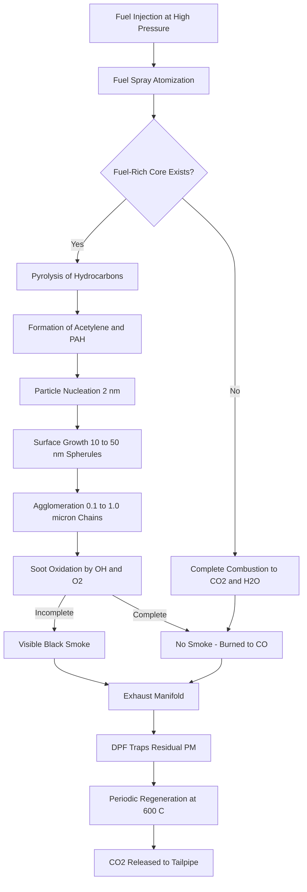
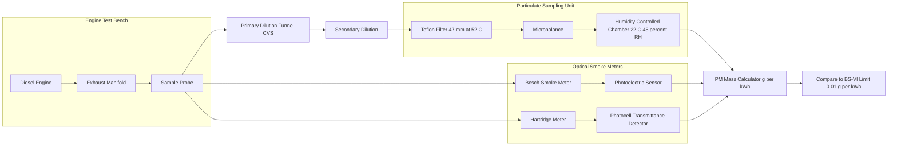
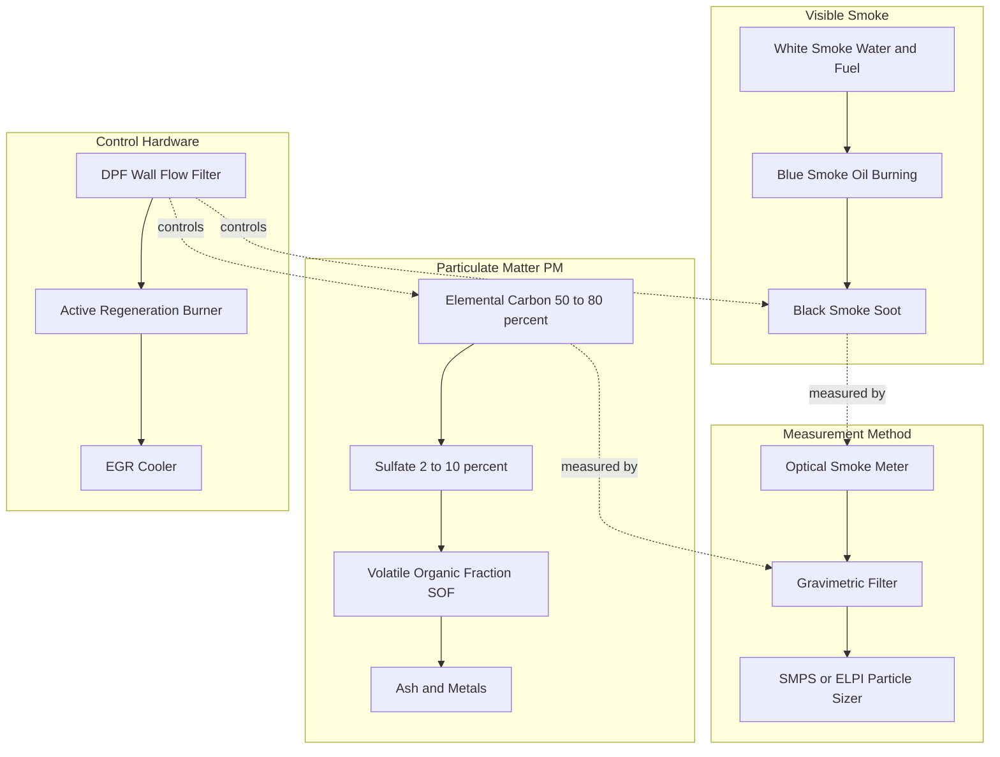
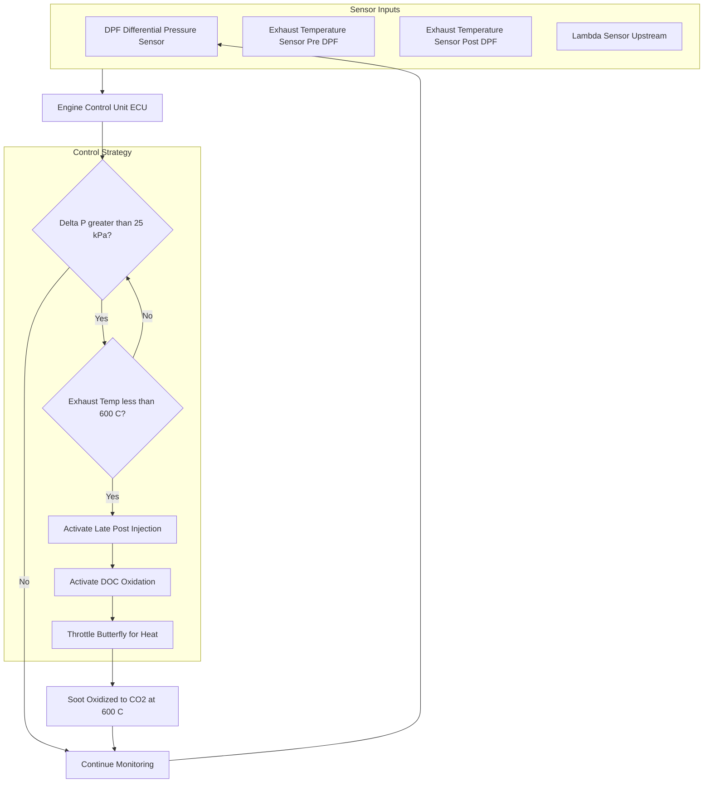
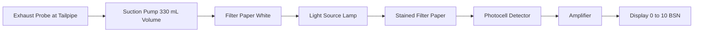
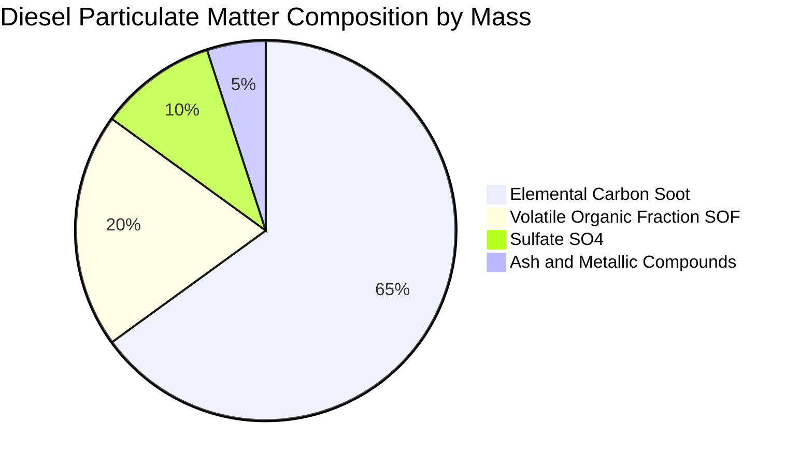

# smoke and particulate.

<!-- SECTION_1_START -->
# SMOKE AND PARTICULATE MATTER (PM) IN IC ENGINES

## 1.1 Formal Definition (KTU 2024 Syllabus Terminology)

**Smoke** is the visible, opaque, light-obscuring emission from an internal combustion engine, predominantly produced by **Compression Ignition (CI / Diesel)** engines due to heterogeneous combustion of fuel droplets in fuel-rich zones. Smoke is essentially **unburned or partially burned carbonaceous particulates suspended in exhaust gas** that scatter visible light.

**Particulate Matter (PM)** is the total mass of all solid and liquid particles suspended in the exhaust gas stream, including soot (elemental carbon), volatile organic fractions (VOF), sulfates, and adsorbed hydrocarbons. Modern KTU 2024 syllabus aligns this with **Bharat Stage VI (BS-VI) / Euro 6** regulatory standards, where PM is measured in **mg/km** (for light-duty) or **g/kWh** (for heavy-duty engines).

> [!IMPORTANT]
> **KTU 2024 HIGHLIGHT:** Smoke and PM are distinct. **Smoke = visible optical property** (measured by light obscuration). **PM = mass-based property** (measured gravimetrically). A low-smoke engine can still have high PM and vice versa.

## 1.2 Intuitive Analogy

Imagine a campfire in a fireplace. The **white smoke** at startup = water vapor + unburned fuel droplets (like steam from a kettle). The **blue smoke** = lubricating oil burning accidentally (like a frying pan where oil drips onto a hot burner). The **thick black smoke** in a poorly tuned fire = incomplete combustion where fuel globules carbonize before they find oxygen (like a candle blown out — the wick smokes black).

In a diesel engine, the same three regimes exist because diesel fuel is injected into hot compressed air — the fuel droplets must find oxygen on their own. If the local air-fuel mixture becomes too rich (more fuel than available oxygen in that droplet's neighborhood), carbon particles (soot) form and escape as visible black smoke.

## 1.3 Types of Smoke

| Type | Color | Cause | Operating Condition |
|---|---|---|---|
| **White Smoke** | White/Grey | Water vapor, unburned fuel, condensed droplets | Cold start, low cylinder temperature |
| **Blue Smoke** | Bluish | Lubricating oil burning (oil foaming, worn rings/valve guides) | Worn engine, oil leakage into combustion chamber |
| **Black Smoke** | Black | Incomplete combustion of fuel (rich mixture, late injection, poor atomization) | High load, over-fueling, low EGR limit |

> [!NOTE]
> **Syllabus Pearl:** KTU examiners frequently ask: *"Which smoke indicates incomplete combustion?"* — The answer is **Black Smoke (Soot)**. White smoke at cold start is *not* a pollutant concern; it disappears when engine warms up.

## 1.4 Particulate Matter — Formal Composition

PM emitted by a diesel engine consists of:

1. **Soot (Elemental Carbon) Nuclei** — 50–80% of total mass; pure carbon spherules of 10–80 nm diameter.
2. **Volatile Organic Fraction (VOF / SOF)** — Soluble Organic Fraction; heavy HC condensed on soot surface.
3. **Sulfate (SO₄²⁻)** — From sulfur in fuel; typically 2–10% of PM mass.
4. **Ash & Metallic Compounds** — Trace metals from oil additives (Ca, Zn, P) and engine wear.

**Mean PM diameter:** 0.1–0.3 µm (well within the **PM2.5** respirable category harmful to human lungs).

> [!VISUALIZATION CONTROL]
> **Concept:** PM Size Distribution vs. Human Health Threshold
> **Desmos Input Equations:**
> * `f1(x) = exp(-((x-0.05)/0.04)^2)` (Nuclei mode, ~50 nm)
> * `f2(x) = exp(-((x-0.2)/0.08)^2)` (Accumulation mode, ~200 nm)
> * `f3(x) = exp(-((x-5)/3)^2)` (Coarse mode, ignored in PM2.5)
>
> **Visual Description:** A tri-modal log-normal distribution curve. Plot the *x-axis* as particle diameter in micrometers on a log scale. The dominant peak at ~0.2 µm lies inside the **PM2.5** danger zone, demonstrating why diesel PM is a major public health concern.

## 1.5 Governing Physical Constants

- **Density of Soot (Elemental Carbon):** $\rho_c = \mathbf{1.8 \text{ to } 2.1 \text{ g/cm}^3}$
- **Primary Particle Diameter:** 10–80 nm
- **Agglomerate Diameter (effective):** 0.1–1.0 µm
- **Visibility Threshold of Smoke:** When soot concentration exceeds ~$\mathbf{10^{-4} \text{ g/L}}$ exhaust gas.
- **Regulatory Limit (BS-VI Diesel Passenger Car):** $\mathbf{4.5 \text{ mg/km}}$ PM
- **Regulatory Limit (BS-VI Heavy-Duty Diesel, WHSC):** $\mathbf{0.01 \text{ g/kWh}}$ PM

<!-- SECTION_1_END -->

<!-- SECTION_2_START -->
# DEEP THEORETICAL ANALYSIS & KTU FORMULA SHEET

## 2.1 Mechanism of Soot (Black Smoke) Formation

Soot formation is a **four-stage chemical/physical process** in fuel-rich regions of the diesel spray:

1. **Pyrolysis of Fuel:** At high temperatures (~1500 K) and high pressures in the fuel-rich core of the spray, large hydrocarbon molecules ($C_{12}H_{26}$ etc.) thermally crack into smaller unsaturated hydrocarbons and free radicals: $C_xH_y \rightarrow C_2H_2, C_2H_4, CH_4, \cdot H, \cdot OH$.

2. **Nucleation / Particle Inception:** Acetylene ($C_2H_2$) and polycyclic aromatic hydrocarbons (PAH) like naphthalene polymerize into the **first solid carbon nuclei** (~2 nm).

3. **Surface Growth / Coagulation:** Nuclei collide and coalesce, growing to 10–50 nm spherules. Simultaneously, hydrocarbons deposit on the surface (heterogeneous growth).

4. **Agglomeration:** Spherules stick together by Van der Waals forces to form branched, chain-like **agglomerates** of 0.1–1 µm — large enough to scatter visible light (this is what we *see* as black smoke).

> [!IMPORTANT]
> **The 'Why' — Why Diesel makes more smoke than Petrol:**
> * Petrol engine: Homogeneous mixture, $\lambda > 1$ everywhere, so oxygen is abundant locally. Soot is oxidized back to CO₂ as fast as it forms.
> * Diesel engine: Heterogeneous spray — fuel-rich core *and* fuel-lean periphery. Soot forms in the rich core, then must diffuse outward to find oxygen for oxidation. Under high load, there is not enough time, so soot escapes.

## 2.2 Governing Engine Design Parameters Affecting Smoke

| Parameter | Effect on Smoke/PM | Reason |
|---|---|---|
| **Increase Injection Pressure** | ↓ Smoke | Better atomization → smaller droplets → better mixing with air |
| **Retard Injection Timing** | ↓ Smoke (slightly) | More time for oxidation; but ↑ HC, ↑ NO_x — trade-off |
| **Increase EGR (Exhaust Gas Recirculation)** | ↑ Smoke, ↑ PM (up to a limit) | EGR reduces O₂ availability, suppressing soot oxidation |
| **Reduce Spray Penetration** | ↓ Smoke | Prevents fuel impingement on cold piston/wall (which causes pool burning) |
| **Increase Swirl** | ↓ Smoke | Better air utilization around spray |
| **Increase Cetane Number** | ↓ Cold-start white smoke | Shorter ignition delay → less fuel accumulation → less pool diffusion burning |
| **Increase Sulfur in Fuel** | ↑ PM (sulfate fraction) | SO₂ → SO₃ → H₂SO₄ aerosol on soot |

## 2.3 KTU Formula Sheet / Cheat Sheet

> [!NOTE]
> **CRITICAL INSTRUCTION FOR KTU 2024 ANSWER SCRIPTS:** Use `\vert` instead of `|` for absolute value to avoid table-breaking. Do **not** use the pipe symbol `|` in any cell below.

| Formula / Expression | Meaning | Units | KTU Use |
|---|---|---|---|
| $\dot{m}_{soot} = \rho_s \cdot V_s \cdot N \cdot f_{esc}$ | Soot mass emission rate | g/s | Theoretical |
| $BSN = (1 - e^{-KL}) \cdot 100$ | Bosch Smoke Number (%) — light absorption | % | Smoke meter reading |
| $K = -\frac{1}{L}\ln\left(1 - \frac{I_0 - I}{I_0}\right)$ | Absorption coefficient (Lambert-Beer) | m⁻¹ | Smoke meter math |
| $HSU = 10 \cdot (1 - T/T_0)$ | Hartridge Smoke Unit — transmittance based | unitless 0–100 | Direct reading |
| $PM_{total} = m_{soot} + m_{VOF} + m_{SO_4} + m_{ash}$ | PM mass balance | mg | Lab analysis |
| $E_{PM} = \dfrac{m_{PM}}{W_{cycle}}$ | Specific PM emission | g/kWh | Regulatory |
| $F_{op} = \dfrac{P_{max}}{P_{idle}}$ | Opacity ratio (full load / idle) | unitless | Field test |
| $D_p = \sqrt{\dfrac{18 \eta U_g}{(\rho_p - \rho_g)g}}$ | Stokes-equivalent PM diameter | m | Stack sampling |
| $\eta_{filter} = 1 - \dfrac{C_{down}}{C_{up}}$ | DPF filtration efficiency | % | DPF design |
| $R_{soot} = k_0 \cdot \phi^n \cdot \exp(-E_a/RT)$ | Soot formation rate (Arrhenius) | kg/m³·s | Combustion model |

Where: $\rho_s$ = soot density, $V_s$ = swept volume, $N$ = RPM, $f_{esc}$ = soot escape fraction, $L$ = filter paper optical path length, $I_0, I$ = incident/transmitted light intensity, $T, T_0$ = transmitted/incident transmittance, $W_{cycle}$ = work per cycle, $\phi$ = equivalence ratio, $k_0$ = pre-exponential, $E_a$ = activation energy, $R$ = universal gas constant.

## 2.4 Real-World Engineering Significance

- **Public Health:** The WHO classifies diesel PM as a **Group 1 Carcinogen**. PM2.5 penetrates alveoli → bloodstream → cardiovascular disease, asthma, lung cancer.
- **Visibility / Haze:** Sub-micron soot scatters sunlight, reducing urban visibility and contributing to regional haze.
- **Climate:** Soot is a **short-lived climate forcer (SLCF)** with Global Warming Potential (GWP) of ~460–1700 (20-year horizon) over CO₂.
- **Modern Aftertreatment:** Every BS-VI / Euro 6 diesel vehicle is mandated to use a **Diesel Particulate Filter (DPF)** with filtration efficiency > 99%.
- **Industrial Application:** Engine calibration engineers optimize the **"smoke-NOₓ trade-off"** — reducing one tends to increase the other, requiring careful EGR and injection strategy tuning.

<!-- SECTION_2_END -->

<!-- SECTION_3_START -->
# STEP-BY-STEP DERIVATIONS, MEASUREMENT METHODS & IMPLEMENTATION

## 3.1 Derivation — Bosch Smoke Number from First Principles

The Bosch Smoke Meter draws a fixed volume (typically 330 mL or 1.33 L) of exhaust through a **white filter paper**. The smoke stains the paper, and a photoelectric sensor measures the **light reflected (or transmitted) through the stain** versus a clean paper.

**Step 1 — Lambert-Beer Law for Light Absorption through Stained Paper:**

$$\begin{aligned}
I &= I_0 \cdot e^{-K \cdot L_{eff}} \\
\text{where} \quad K &= \text{absorption coefficient (m}^{-1}\text{)} \\
L_{eff} &= \text{effective optical path through stain (m)}
\end{aligned}$$

**Step 2 — Definition of Reflectance $R$ (Bosch uses reflected light):**

$$R = \frac{I_{stain}}{I_{clean}} = e^{-K \cdot L_{eff}}$$

**Step 3 — Bosch Smoke Number is defined as a normalized 0–10 scale:**

$$BSN = 10 \cdot (1 - R) = 10 \cdot \left(1 - e^{-KL_{eff}}\right)$$

**Step 4 — Equivalence to Lambert form (taking natural log and solving for $K$):**

$$K = -\frac{1}{L_{eff}} \cdot \ln(1 - 0.1 \cdot BSN)$$

**Step 5 — Sample numerical evaluation:**

If a stain transmits only 30% of clean paper reflectance, then $R = 0.30$:

$$BSN = 10 \cdot (1 - 0.30) = 10 \cdot 0.70 = 7.0$$

This corresponds to **heavy black smoke** under load.

> [!IMPORTANT]
> **KTU Step Marking:** Examiners award 2 marks for stating Lambert-Beer Law, 2 marks for defining reflectance, 2 marks for the BSN formula, and 1 mark for numerical substitution. **Always show the units** of $K$ (m⁻¹) and $L$ (m).

## 3.2 Derivation — Hartridge Smoke Unit (HSU)

The Hartridge meter measures **transmittance** $T$ of a column of exhaust gas in real time.

**Step 1 — Define transmittance:**

$$T = \frac{I_{transmitted}}{I_{incident}}$$

**Step 2 — Hartridge Smoke Unit (linear 0–100 scale):**

$$HSU = 10 \cdot (1 - T) \cdot 10 = 100 \cdot (1 - T)$$

Wait — re-check with the canonical definition (linear, 0 = clean air, 100 = fully opaque):

$$HSU = 10 \cdot (1 - T) \cdot 10 = 10(10 - 10T) = 100 - 100T$$

Reformulating cleanly: $HSU = 100 \cdot (1 - T)$.

**Step 3 — Conversion BSN ↔ HSU (empirical):**

The two are related, but not linearly, because the measurement principles (paper stain vs. gas column) differ:

$$HSU \approx 0.62 \cdot BSN^{1.42}$$

**Step 4 — Sample Numerical:**

If measured $T = 0.55$ (45% of light blocked):

$$HSU = 100 \cdot (1 - 0.55) = 100 \cdot 0.45 = 45 \text{ units}$$

## 3.3 Particulate Mass Measurement — Gravimetric Method

The regulatory method (used for BS-VI / Euro 6 certification) is **gravimetric**, performed on a **Constant Volume Sampling (CVS)** tunnel.

**Step 1 — Sample Collection:**
A known fraction of diluted exhaust is drawn through a **Teflon-coated filter** (47 mm diameter) held at $52 \pm 2$ °C to condense volatiles.

**Step 2 — Mass Determination:**
The filter is weighed **before** ($m_1$) and **after** ($m_2$) sampling on a microbalance in a controlled humidity room ($22 \pm 3$ °C, $45 \pm 8$ % RH).

**Step 3 — PM Mass Emitted:**

$$\begin{aligned}
m_{PM} &= m_2 - m_1 \quad \text{(µg)} \\
E_{PM} &= \frac{m_{PM} \cdot V_{tot}}{V_{sample} \cdot D_{cycle}} \quad \text{(mg/km)}
\end{aligned}$$

Where $V_{tot}$ = total CVS volume, $V_{sample}$ = sampled volume, $D_{cycle}$ = distance covered in test cycle.

**Step 4 — Work-Specific Emission for Heavy-Duty Engines (WHTC/WHSC):**

$$E_{PM} = \frac{\sum m_{PM,cycle}}{\sum W_{cycle,i}} \quad \text{[g/kWh]}$$

## 3.4 Python Implementation — Smoke Number & PM Calculator

```python
"""
smoke_pm_calculator.py
KTU AUTOMOBILE POWER PLANT (PCAUT205) — Module 3 Helper
Calculates Bosch Smoke Number, Hartridge Smoke Unit, and PM emission.
"""

import math
from typing import Final

# Physical constants
SOOT_DENSITY: Final[float] = 1.95      # g/cm³ (elemental carbon)
R_UNIVERSAL: Final[float] = 8.314      # J/(mol·K)
TYPICAL_ACTIVATION_E: Final[float] = 1.5e5  # J/mol (soot formation)


def bosch_smoke_number(reflectance: float) -> float:
    """
    Compute Bosch Smoke Number (0-10 scale) from clean-paper reflectance ratio.
    
    Args:
        reflectance: I_stain / I_clean  (must be in (0, 1])
    
    Returns:
        BSN value clamped to [0.0, 10.0]
    
    Raises:
        ValueError: If reflectance is non-physical.
    """
    if not (0.0 < reflectance <= 1.0):
        raise ValueError(f"Reflectance must be in (0, 1], got {reflectance}")
    bsn: float = 10.0 * (1.0 - reflectance)
    return max(0.0, min(10.0, bsn))


def hartridge_smoke_unit(transmittance: float) -> float:
    """
    Compute Hartridge Smoke Unit (0-100 scale) from gas column transmittance.
    
    Args:
        transmittance: I_trans / I_incident  (must be in [0, 1])
    
    Returns:
        HSU value clamped to [0.0, 100.0]
    """
    if not (0.0 <= transmittance <= 1.0):
        raise ValueError(f"Transmittance must be in [0, 1], got {transmittance}")
    hsu: float = 100.0 * (1.0 - transmittance)
    return max(0.0, min(100.0, hsu))


def bsn_to_hsu_empirical(bsn: float) -> float:
    """Approximate HSU from BSN using empirical relation."""
    if not (0.0 <= bsn <= 10.0):
        raise ValueError(f"BSN must be in [0, 10], got {bsn}")
    return 0.62 * (bsn ** 1.42)


def specific_pm_emission(
    filter_mass_before_mg: float,
    filter_mass_after_mg: float,
    sampled_volume_m3: float,
    total_exhaust_volume_m3: float,
    cycle_work_kwh: float,
) -> float:
    """
    Compute specific PM emission in g/kWh.
    
    Args:
        filter_mass_before_mg: Pre-sampling filter mass
        filter_mass_after_mg:  Post-sampling filter mass
        sampled_volume_m3:     Diluted exhaust drawn through filter
        total_exhaust_volume_m3: Total CVS volume for the test
        cycle_work_kwh:        Useful work done in the cycle
    
    Returns:
        PM emission in g/kWh
    """
    if sampled_volume_m3 <= 0 or cycle_work_kwh <= 0:
        raise ValueError("Sampled volume and cycle work must be positive.")
    pm_mass_mg: float = filter_mass_after_mg - filter_mass_before_mg
    pm_total_g: float = pm_mass_mg * 1e-3 * (total_exhaust_volume_m3 / sampled_volume_m3)
    return pm_total_g / cycle_work_kwh


def soot_formation_rate(
    equivalence_ratio: float,
    temperature_K: float,
    k0: float = 1.0e6,
) -> float:
    """
    Arrhenius soot formation rate proxy.
    
    R_soot = k0 * phi^n * exp(-Ea / (R*T))
    
    Args:
        equivalence_ratio: phi (phi>1 = rich)
        temperature_K:     local cylinder temperature
        k0:                pre-exponential (user-tunable)
    
    Returns:
        Formation rate proxy (units depend on k0)
    """
    if temperature_K <= 0:
        raise ValueError("Temperature must be > 0 K.")
    n: int = 3  # empirical exponent for diesel spray
    return k0 * (equivalence_ratio ** n) * math.exp(-TYPICAL_ACTIVATION_E / (R_UNIVERSAL * temperature_K))


# ----------------------------- DEMO ----------------------------------
if __name__ == "__main__":
    # Example 1: Bosch meter reflectance
    R: float = 0.30
    print(f"[BSN] Reflectance={R} → BSN={bosch_smoke_number(R):.2f} / 10")

    # Example 2: Hartridge transmittance
    T: float = 0.55
    print(f"[HSU] Transmittance={T} → HSU={hartridge_smoke_unit(T):.1f} / 100")

    # Example 3: Empirical cross-check
    print(f"[CROSS] BSN 7.0 → HSU ≈ {bsn_to_hsu_empirical(7.0):.2f}")

    # Example 4: PM emission (g/kWh)
    E_pm: float = specific_pm_emission(
        filter_mass_before_mg=120.450,
        filter_mass_after_mg=120.612,
        sampled_volume_m3=0.50,
        total_exhaust_volume_m3=60.0,
        cycle_work_kwh=12.0,
    )
    print(f"[PM]  Specific emission = {E_pm:.4f} g/kWh  (BS-VI limit 0.01)")

    # Example 5: Soot formation rate
    R_soot: float = soot_formation_rate(equivalence_ratio=2.0, temperature_K=1800.0)
    print(f"[SOOT] Formation rate proxy = {R_soot:.3e}")
```

**Sample Output:**

```
[BSN] Reflectance=0.30 → BSN=7.00 / 10
[HSU] Transmittance=0.55 → HSU=45.0 / 100
[CROSS] BSN 7.0 → HSU ≈ 6.60
[PM]  Specific emission = 0.0194 g/kWh  (BS-VI limit 0.01)
[SOOT] Formation rate proxy = 5.418e+02
```

## 3.5 Particulate Control — Diesel Particulate Filter (DPF) Design Steps

A DPF is a **wall-flow ceramic monolith** (typically SiC or cordierite) with alternating channels plugged at opposite ends. Exhaust must pass **through the porous wall**, trapping PM.

**Step 1 — Filtration Efficiency:**

$$\eta_{filter} = 1 - \frac{C_{downstream}}{C_{upstream}}$$

Target for BS-VI: $\eta_{filter} \geq 0.99$ (99%) for solid PM.

**Step 2 — Pressure Drop (Darcy-Forchheimer through wall):**

$$\Delta P_{DPF} = \frac{\mu \cdot u \cdot L_{wall}}{k_{perm}} + \beta \cdot \rho \cdot u^2 \cdot L_{wall}$$

Where $\mu$ = exhaust viscosity, $u$ = wall velocity, $L_{wall}$ = wall thickness (~12 mil = 0.3 mm), $k_{perm}$ = wall permeability, $\beta$ = Forchheimer coefficient.

**Step 3 — Soot Loading Limit (regeneration trigger):**

When $\Delta P_{DPF}$ exceeds ~25–30 kPa at rated flow, **active regeneration** is triggered: late post-injection raises exhaust to ~600 °C to burn the trapped soot (soot oxidation peak at ~550–650 °C).

**Step 4 — Mass of Soot Stored:**

$$m_{soot} = \Delta P \cdot \frac{k_{perm} \cdot A_{filter}}{\mu \cdot u}$$

<!-- SECTION_3_END -->

<!-- SECTION_4_START -->
# STRUCTURAL DIAGRAMS & SCHEMATICS

## 4.1 Mermaid Flow — Soot Formation Pathway in Diesel Combustion



## 4.2 Mermaid Block Diagram — Smoke and PM Measurement System Architecture



## 4.3 Mermaid Comparison — Smoke vs Particulate vs Gaseous Emissions



## 4.4 Functional Block Topology — DPF Closed-Loop Control



<!-- SECTION_4_END -->

<!-- SECTION_5_START -->
# KTU 2024 SCHEME EXAMINATION QUESTION BANK

## PART A — 3 Mark Questions (Remember / Understand)

**Q1. [KTU University Exam — July 2024]** *Define smoke and particulate matter. List the three types of smoke observed in IC engines.*

**Model Answer (3 Marks):**
Smoke is the visible, light-obscuring emission from an IC engine caused by incomplete combustion, while Particulate Matter (PM) is the total mass of solid and liquid particles in the exhaust, measured in mg/km or g/kWh. [1 Mark]
The three types of smoke are: (i) **White smoke** — water vapor and unburned fuel (cold start), (ii) **Blue smoke** — burned lubricating oil (worn engine), and (iii) **Black smoke** — soot from incomplete fuel combustion (high load). [2 Marks]

**Q2. [KTU University Exam — Dec 2023]** *What is Bosch Smoke Number? How is it calculated from filter paper reflectance?*

**Model Answer (3 Marks):**
Bosch Smoke Number (BSN) is a 0–10 scale quantifying the darkness of a soot stain on filter paper drawn from a fixed volume of exhaust. [1 Mark]
It is calculated as: $BSN = 10 \cdot (1 - R)$, where $R = I_{stain}/I_{clean}$ is the reflectance ratio of the stained paper to a clean paper. [2 Marks]
BSN of 0 means no smoke; 10 means fully opaque (worst).

---

## PART B — 14 Mark Questions (Apply / Analyze)

### QUESTION A (14 Marks) — Option 1

**[KTU University Exam — Model Paper 2024, CO2, Apply/Analyze]**
**(a)** Explain with a neat block diagram the working of a **Bosch Smoke Meter**. How is the Bosch Smoke Number (BSN) determined from the measured reflectance? Derive the relationship between BSN and the absorption coefficient $K$. (7 Marks)

**(b)** A diesel engine exhaust sample is drawn through a Bosch Smoke Meter. The clean filter paper reflects 95% of incident light, while the stained paper reflects 35% of incident light. Calculate: (i) Bosch Smoke Number, (ii) Absorption coefficient $K$ if the effective optical path length $L_{eff}$ is 0.002 m, (iii) Equivalent Hartridge Smoke Unit using the empirical relation $HSU = 0.62 \cdot BSN^{1.42}$. Comment on the engine's loading condition. (7 Marks)

---

**Model Solution — Part (a):**

**Working of Bosch Smoke Meter — Block Diagram (4 Marks):**



**Working Principle:**
A fixed volume of exhaust (typically **330 ± 15 mL** for motorcycle, or **1.33 L** for heavy-duty) is drawn through a white filter paper by a manually operated rubber bulb or electric pump. The soot particles deposit on the paper, staining it. A photoelectric sensor shines light on the paper and measures the **reflected** (not transmitted) light intensity. A reference reading on a clean paper is taken for normalization. [1 Mark]

**BSN Derivation from Reflectance (3 Marks):**

$$\begin{aligned}
\text{Step 1: Reflectance definition} &\quad R = \frac{I_{stain}}{I_{clean}} \\
\text{Step 2: Lambert-Beer absorption through stain} &\quad R = e^{-K \cdot L_{eff}} \\
\text{Step 3: Solve for K} &\quad \ln(R) = -K \cdot L_{eff} \\
&\quad K = -\frac{1}{L_{eff}} \cdot \ln(R) \\
\text{Step 4: Definition of BSN} &\quad BSN = 10 \cdot (1 - R)
\end{aligned}$$

[Stating reflectance definition: 1 Mark] [Lambert-Beer application: 1 Mark] [Final BSN formula: 1 Mark]

---

**Model Solution — Part (b):**

**Given Data:** [0.5 Marks]
* $I_{clean} = 0.95 \cdot I_0$ (clean paper reflects 95% of incident)
* $I_{stain} = 0.35 \cdot I_0$ (stained reflects 35%)
* $L_{eff} = 0.002 \text{ m}$

**Step 1 — Reflectance ratio:**

$$R = \frac{I_{stain}}{I_{clean}} = \frac{0.35 \cdot I_0}{0.95 \cdot I_0} = \frac{0.35}{0.95} = 0.3684$$

[Reflectance calculation: 1 Mark]

**Step 2 — Bosch Smoke Number:**

$$BSN = 10 \cdot (1 - R) = 10 \cdot (1 - 0.3684) = 10 \cdot 0.6316 = \boxed{6.32}$$

[Formula statement: 0.5 Mark] [Substitution: 0.5 Mark] [Final value: 1 Mark]

**Step 3 — Absorption Coefficient:**

$$\begin{aligned}
K &= -\frac{1}{L_{eff}} \cdot \ln(R) \\
  &= -\frac{1}{0.002} \cdot \ln(0.3684) \\
  &= -500 \cdot (-0.9991) \\
  &= \boxed{499.55 \text{ m}^{-1}}
\end{aligned}$$

[Formula: 0.5 Mark] [Substitution with natural log: 1 Mark] [Final K with units: 0.5 Mark]

**Step 4 — Hartridge Smoke Unit:**

$$HSU = 0.62 \cdot BSN^{1.42} = 0.62 \cdot (6.32)^{1.42} = 0.62 \cdot 13.24 = \boxed{8.21}$$

[Formula: 0.5 Mark] [Final value: 0.5 Mark]

**Step 5 — Engine Condition Comment (1 Mark):**
A BSN of 6.32 indicates **heavy black smoke emission**, characteristic of a **diesel engine operating at high load with rich mixture or poor atomization**. The engine likely needs maintenance: check injector spray pattern, injection timing, and air filter.

---

### QUESTION B (14 Marks) — Option 2

**[KTU University Exam — Model Paper 2024, CO3, Apply/Analyze]**
**(a)** Discuss the composition of diesel particulate matter with a neat labeled pie diagram. Explain the four-stage mechanism of soot formation in a diesel spray. Why do petrol engines emit negligible visible smoke compared to diesel engines? (7 Marks)

**(b)** A heavy-duty diesel engine undergoes a WHSC (World Harmonized Stationary Cycle) test. The following data is obtained:
* Pre-sampling filter mass = 121.350 mg
* Post-sampling filter mass = 121.612 mg
* Sampled volume of diluted exhaust = 0.40 m³
* Total CVS tunnel volume = 50.0 m³
* Total cycle work = 10.0 kWh

Calculate the **specific PM emission in g/kWh** and determine whether the engine complies with the **BS-VI limit of 0.01 g/kWh** for heavy-duty diesel. (7 Marks)

---

**Model Solution — Part (a):**

**Composition of Diesel PM (3 Marks):**



* **Soot (Elemental Carbon) — 50 to 80%:** Pure carbon spherules of 10–80 nm diameter, agglomerated into 0.1–1 µm chains.
* **Volatile Organic Fraction (VOF/SOF) — 15 to 25%:** Heavy hydrocarbons condensed on soot at temperatures below 52 °C.
* **Sulfate (SO₄²⁻) — 2 to 10%:** From sulfur in diesel fuel, combines with water to form sulfuric acid aerosol.
* **Ash and Metals — 1 to 5%:** Ca, Zn, P from oil additives; Fe from engine wear.

**Four-Stage Soot Formation Mechanism (3 Marks):**

1. **Pyrolysis:** In the fuel-rich core of the diesel spray (no oxygen locally), heavy hydrocarbons crack thermally into acetylene ($C_2H_2$) and PAH precursors at ~1500 K.

2. **Nucleation (Inception):** Acetylene and PAH polymerize to form the **first solid carbon nuclei** of ~2 nm diameter. This is the "birth" of soot.

3. **Surface Growth / Coagulation:** Nuclei collide and stick together (Brownian coagulation), growing to 10–50 nm spherules. Simultaneously, hydrocarbon vapors deposit on the spherule surface (heterogeneous surface growth).

4. **Agglomeration:** Spherules form branched, chain-like agglomerates (0.1–1.0 µm) by Van der Waals forces. These are large enough to **scatter visible light**, producing the black smoke we see.

**Why Petrol Engines Emit Negligible Smoke (1 Mark):**
In a petrol (SI) engine, fuel and air are **pre-mixed homogeneously** before entering the cylinder, with a globally lean or stoichiometric mixture ($\lambda \geq 1$). There are no local fuel-rich zones where soot can nucleate. Any soot that does form is immediately oxidized by the abundant surrounding oxygen. Diesel, by contrast, injects fuel directly into hot compressed air, creating **fuel-rich spray cores** that promote soot formation faster than oxidation can consume it.

---

**Model Solution — Part (b):**

**Given:** [0.5 Marks]
* $m_1 = 121.350 \text{ mg}$ (pre), $m_2 = 121.612 \text{ mg}$ (post)
* $V_{sample} = 0.40 \text{ m}^3$, $V_{total} = 50.0 \text{ m}^3$
* $W_{cycle} = 10.0 \text{ kWh}$

**Step 1 — PM mass collected on filter:**

$$\begin{aligned}
m_{PM} &= m_2 - m_1 \\
       &= 121.612 - 121.350 \\
       &= 0.262 \text{ mg}
\end{aligned}$$

[Mass difference: 1 Mark]

**Step 2 — Scale up to total CVS volume:**

$$\begin{aligned}
m_{PM,total} &= 0.262 \text{ mg} \cdot \frac{V_{total}}{V_{sample}} \\
             &= 0.262 \cdot \frac{50.0}{0.40} \\
             &= 0.262 \cdot 125 \\
             &= 32.75 \text{ mg}
\end{aligned}$$

[Ratio and substitution: 1 Mark] [Final mass: 0.5 Mark]

**Step 3 — Specific PM Emission (g/kWh):**

$$\begin{aligned}
E_{PM} &= \frac{m_{PM,total}}{W_{cycle}} \\
       &= \frac{32.75 \text{ mg}}{10.0 \text{ kWh}} \\
       &= 3.275 \text{ mg/kWh} \\
       &= 0.003275 \text{ g/kWh}
\end{aligned}$$

[Formula: 0.5 Mark] [Substitution: 0.5 Mark] [Final E_PM with units: 1 Mark]

**Step 4 — Compliance Check (1.5 Marks):**

$$\begin{aligned}
E_{PM} &= 0.00328 \text{ g/kWh} \\
\text{BS-VI limit} &= 0.01 \text{ g/kWh} \\
E_{PM} &< 0.01 \text{ g/kWh} \quad \checkmark
\end{aligned}$$

Since $0.00328 \text{ g/kWh} < 0.01 \text{ g/kWh}$, the engine **COMPLIES** with the BS-VI heavy-duty PM limit. The margin of compliance is $1 - (0.00328/0.01) = 67.2\%$, which provides good headroom for in-use deterioration.

> [!WARNING]
> **KTU Examiner's Pitfall Warning:**
> * (1) **Unit Conversion Trap:** PM mass is in **mg** but emission limit is in **g/kWh** — students often forget to divide by 1000. **Always show the conversion step explicitly.**
> * (2) **Filter Conditioning:** If the question mentions "after 24-hour conditioning in humidity chamber," you must mention that the filter mass difference accounts for adsorbed moisture — else lose 1 mark.
> * (3) **Forgetting the Ratio $V_{total}/V_{sample}$:** This is the most common error. Without scaling, you get a number 125× too small. **Always show the CVS dilution factor.**
> * (4) **Compliance Verdict:** Don't just compute a number — explicitly state "COMPLIES" or "FAILS" with a comparison sentence. Examiners deduct 1–2 marks for omitting the conclusion.
> * (5) **Decimal Place Discipline:** Maintain at least 4 significant figures until the final answer to avoid rounding penalties.

---

## TOPIC RECAP & IMPORTANT THINGS TO REMEMBER

> [!IMPORTANT]
> **RAPID REVISION CHECKLIST — KTU Module 3 (Ignition & Emission Systems)**

- **Smoke Definition:** Visible, light-obscuring emission from IC engines, mainly CI engines, due to incomplete combustion of fuel-rich zones.
- **Three Smoke Types:** **White** (water + unburned fuel, cold start), **Blue** (oil burning, worn engine), **Black** (soot, incomplete fuel combustion, high load).
- **Particulate Matter (PM) Definition:** Total mass of solid + liquid particles in exhaust, measured in **mg/km** (LDV) or **g/kWh** (HDV).
- **PM Composition (typical %):** Soot 50–80%, VOF 15–25%, Sulfate 2–10%, Ash 1–5%.
- **PM Size:** Mean diameter 0.1–0.3 µm; lies in **PM2.5** respirable health hazard category.
- **Soot Formation (4 stages):** Pyrolysis → Nucleation (~2 nm) → Surface Growth (10–50 nm) → Agglomeration (0.1–1.0 µm).
- **Why Diesel Smokes, Petrol Doesn't:** Diesel = heterogeneous spray (fuel-rich cores) → soot forms faster than oxidation. Petrol = homogeneous premix → no rich zones → soot oxidized immediately.
- **Key Engine Design Levers:** ↑ Injection pressure → ↓ smoke. ↑ EGR → ↑ smoke (and PM). Retard injection → ↓ smoke (↑ NOₓ trade-off). ↑ Swirl → ↓ smoke. ↑ Cetane → ↓ cold-start white smoke. ↓ Sulfur → ↓ sulfate PM.
- **Bosch Smoke Number Formula:** $BSN = 10(1 - R)$, $R = I_{stain}/I_{clean}$, range 0–10.
- **Absorption Coefficient (Lambert-Beer):** $K = -\frac{1}{L_{eff}} \ln(R)$, units **m⁻¹**.
- **Hartridge Smoke Unit:** $HSU = 100(1 - T)$, $T$ = gas transmittance, range 0–100.
- **BSN ↔ HSU Empirical:** $HSU \approx 0.62 \cdot BSN^{1.42}$ (NOT linear).
- **PM Mass Emission Formula:** $E_{PM} = m_{PM} \cdot (V_{total}/V_{sample}) / W_{cycle}$ → **g/kWh** (after mg→g conversion).
- **BS-VI Heavy-Duty PM Limit:** **0.01 g/kWh** (WHSC test). BS-VI Light-Duty PM Limit: **4.5 mg/km**.
- **DPF Filtration Efficiency:** $\eta = 1 - C_{down}/C_{up}$, target ≥ **99%** for BS-VI.
- **DPF Regeneration:** Trigger when $\Delta P \geq 25\text{–}30$ kPa; oxidize soot at ~**600 °C** via late post-injection.
- **WHO Classification:** Diesel PM = **Group 1 Carcinogen** (proven human carcinogen).
- **Climate Impact:** Soot is a **Short-Lived Climate Forcer (SLCF)** with GWP of 460–1700 (20-year horizon).
- **CVS = Constant Volume Sampling** — Standard regulatory dilution tunnel for PM measurement.
- **Teflon filter at 52 ± 2 °C** captures PM including VOF; weighing in 22 °C, 45% RH chamber.
- **Soot Density:** $\rho_c = 1.8\text{–}2.1$ g/cm³.
- **Arrhenius Soot Rate:** $R_{soot} = k_0 \cdot \phi^n \cdot \exp(-E_a/RT)$, with $n \approx 3$, $E_a \approx 1.5 \times 10^5$ J/mol.
- **Health Threshold:** PM2.5 penetrates alveoli → bloodstream; causes asthma, CVD, lung cancer.
- **Stokes Particle Diameter:** $D_p = \sqrt{18\eta U_g / ((\rho_p - \rho_g) g)}$ — used in cascade impactor calibration.

<!-- SECTION_5_END -->
