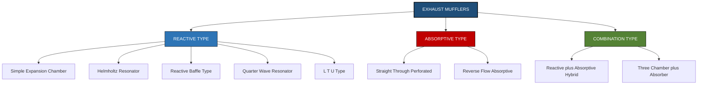
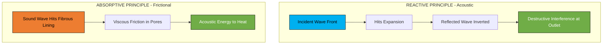

# Types of mufflers.

<!-- SECTION_1_START -->
# TYPES OF MUFFLERS (SILENCERS)

## 1. Core Technical Definition

**Muffler (Silencer):** A device fitted in the exhaust system of an internal combustion (IC) engine that attenuates the pressure pulsations (acoustic energy) of exhaust gases without appreciably increasing the back pressure on the engine. It is the last stage of the exhaust system, connected to the tailpipe.

> [!IMPORTANT]
> **KTU 2024 Syllabus Definition (PCAUT205 – Module 3):** *A muffler is an acoustic device installed in the exhaust line to reduce engine exhaust noise to acceptable levels (typically 90–110 dB(A) at source) while offering minimum restriction to the gas flow, characterized by insertion loss (dB) and back pressure (kPa).*

### Conceptual Analogy / Intuition

Imagine blowing air out of a balloon — it makes a loud "whistling" noise. Now imagine blowing the same air through a long, curved cardboard tube — the noise is much softer. **Why?** Because the tube absorbed some of the energy and let it bleed off gradually.

A muffler works on the **exact same idea** for the high-pressure, high-velocity exhaust pulses of an engine:
- The exhaust pulse is **loud, sharp, and concentrated** (like a gunshot).
- A muffler **spreads this energy out** in space and time using chambers, baffles, and absorbing material.
- The result: a smooth, quiet "purr" instead of a "bang-bang-bang".

> [!NOTE]
> **Key Insight:** A muffler is NOT a filter — it doesn't trap soot or gas. Its only job is **acoustic attenuation** (noise reduction). The exhaust must leave the tailpipe at almost the same mass flow rate as it enters the muffler inlet.

### Standard Acoustic Metrics (Must be memorized)

| Metric | Symbol | Unit | Meaning |
|---|---|---|---|
| Sound Pressure Level | $SPL$ | dB | Loudness of noise |
| Insertion Loss | $IL$ | dB | Noise reduction achieved by muffler |
| Transmission Loss | $TL$ | dB | Sound power blocked by muffler walls |
| Back Pressure | $P_b$ | kPa | Restriction to flow created by muffler |
| Wavelength of sound | $\lambda$ | m | $\lambda = c/f$, where $c \approx 340$ m/s |

> [!VISUALIZATION CONTROL]
> **Concept:** Sound wave entering a muffler chamber — pressure pulse reflection
> **GeoGebra / Desmos Input Equations:**
> * `P(t) = sin(2*pi*100*t)` — input pulse
> * `P_reflected(t) = -0.6*sin(2*pi*100*(t - 0.002))` — reflected wave
> * `P_out(t) = P(t) + P_reflected(t)` — destructive interference at outlet
> **Visual Description:** A high-frequency pressure wave entering the muffler meets a reflected wave of opposite phase at the outlet, producing cancellation (lower amplitude). The student should see amplitude reduction due to phase shift.
<!-- SECTION_1_END -->

<!-- SECTION_2_START -->
# 2. Deep Theoretical Analysis & High-Yield Formula Sheet

## 2.1 Why Do We Need a Muffler?

An IC engine is essentially an **air pump**. Every power stroke expels a slug of high-pressure (~150–600 kPa), high-temperature (~600–900°C) exhaust gas. This rapid discharge creates:
1. **Pressure pulsations** → mechanical noise.
2. **Vibration of exhaust pipe walls** → secondary noise.
3. **Sonic boom effect** at the tailpipe exit → high-frequency whistle.

> [!NOTE]
> **KTU Board Tip:** Always mention the three loss mechanisms in a muffler — **Reflective Loss, Dissipative Loss, and Reactive Loss** — in your exam answers.

## 2.2 Two Fundamental Operating Principles

### A. Reflective (Reactive) Principle
- Uses **chambers, expansions, and resonators**.
- Reflects acoustic waves back toward the source.
- Creates **destructive interference** between the incident and reflected waves.
- **Best for low-frequency noise** (engine firing pulses, 30–300 Hz).

### B. Dissipative (Absorptive) Principle
- Uses **porous, fibrous materials** (glass wool, steel wool, ceramic fibre).
- Converts acoustic energy into **heat via viscous friction** within the material.
- **Best for high-frequency noise** (valve chattering, hiss, 1000–5000 Hz).

## 2.3 The Governing Acoustic Equation

The **Helmholtz Resonator Frequency** is the most important equation in muffler design. It tells you which frequency a given chamber will silence most effectively.

$$f_r = \frac{c}{2\pi}\sqrt{\frac{A}{V \cdot L_{eq}}}$$

Where:
- $f_r$ = resonant (silenced) frequency in Hz
- $c$ = speed of sound in the gas ($\approx 340$ m/s in air, **higher** in hot exhaust — typically taken as **500 m/s** in design)
- $A$ = cross-sectional area of the neck (m²)
- $V$ = volume of the chamber (m³)
- $L_{eq}$ = effective length of the neck, $L_{eq} = L + 0.6\sqrt{A}$ (end correction)

For an **expansion chamber muffler**, the transmission loss peaks at:

$$TL_{max} = 20 \log_{10}\left[\frac{1}{2}\left(m - \frac{1}{m}\right)\right]$$

Where $m = \dfrac{A_2}{A_1}$ is the area expansion ratio (outlet to inlet).

## 2.4 KTU Formula Sheet / Cheat Sheet

> [!IMPORTANT]
> **HIGH-YIELD FORMULAS — MEMORIZE THESE**

| Formula | Description | Typical Range / Value |
|---|---|---|
| $f_r = \dfrac{c}{2\pi}\sqrt{\dfrac{A}{V \cdot L_{eq}}}$ | Helmholtz resonant frequency | $f_r$ = 30–500 Hz |
| $L_{eq} = L + 0.6\sqrt{A}$ | Effective neck length (end correction) | — |
| $\lambda = c/f$ | Wavelength of sound | $\lambda_{300Hz} \approx 1.1$ m |
| $TL = 20\log_{10}\left[\dfrac{P_{in}}{P_{out}}\right]$ | Transmission Loss definition | 20–40 dB target |
| $IL = 20\log_{10}\left[\dfrac{SPL_{no\,muffler}}{SPL_{with\,muffler}}\right]$ | Insertion Loss definition | 15–30 dB typical |
| $TL_{max} = 20\log_{10}\left[\dfrac{1}{2}\left(m - \dfrac{1}{m}\right)\right]$ | Expansion chamber peak TL | $m$ = 2 to 10 |
| $P_{back} = \dfrac{\rho v^2}{2}(1 + \beta)$ | Back pressure due to flow | $\beta$ = loss coefficient |
| $IL_{total} = IL_1 + IL_2 + \dots + IL_n$ | Series muffler IL (dB) — **additive** | dB is logarithmic |

## 2.5 Real-World Engineering Utility

In production, mufflers are designed using:
- **FEA (Finite Element Analysis)** for acoustic modes inside chambers.
- **CFD (Computational Fluid Dynamics)** for back pressure prediction.
- **Transfer Matrix Method** for compound mufflers.
- **SEA (Statistical Energy Analysis)** for high-frequency broadband noise.

> [!NOTE]
> **Industry Use:** Modern mufflers must also handle **emissions regulations** (BS-VI, Euro 6) by retaining enough heat to keep the catalyst at light-off temperature (>250°C) — leading to **close-coupled mufflers** integrated with the catalytic converter.
<!-- SECTION_2_END -->

<!-- SECTION_3_START -->
# 3. Step-by-Step Derivations & Symbolic Implementation

## 3.1 Derivation: Helmholtz Resonator Frequency

**Starting Model:** A rigid chamber of volume $V$ with a small neck of area $A$ and length $L$. The gas in the neck acts as a "mass" that can oscillate against the "spring" of compressed gas in the chamber.

**Step 1 — Mass of gas in neck (lumped mass assumption):**

$$m_{gas} = \rho \cdot A \cdot L$$

**Step 2 — Acoustic compliance (springiness) of the chamber gas:**

The chamber gas behaves like a spring with stiffness:

$$k = \frac{\rho c^2 A^2}{V}$$

**Step 3 — Natural frequency of a mass-spring system:**

$$f_r = \frac{1}{2\pi}\sqrt{\frac{k}{m_{gas}}}$$

**Step 4 — Substitute $k$ and $m_{gas}$:**

$$f_r = \frac{1}{2\pi}\sqrt{\dfrac{\dfrac{\rho c^2 A^2}{V}}{\rho A L}}$$

**Step 5 — Simplify by cancelling $\rho$ and one $A$:**

$$f_r = \frac{1}{2\pi}\sqrt{\frac{c^2 A}{V L}}$$

**Step 6 — Apply the end-correction (gas at the open end of the neck has effective additional length $0.6\sqrt{A}$):**

$$L \rightarrow L_{eq} = L + 0.6\sqrt{A}$$

**Final Equation:**

$$\boxed{\,f_r = \frac{c}{2\pi}\sqrt{\frac{A}{V \cdot L_{eq}}}\,}$$

**Step 7 — Numerical Example (worked out):**

> [!NOTE]
> **Worked Example:** A Helmholtz resonator for a 4-stroke petrol engine firing at 2000 rpm. The dominant exhaust frequency is $f = 2 \times \frac{2000}{60} = 33.3$ Hz. Design a chamber to silence this frequency.

Given: $f_r = 33.3$ Hz, $c = 500$ m/s (hot exhaust), $L = 0.1$ m, $A = 0.001$ m² (neck area).

**Step 7a — Calculate end correction:**

$$L_{eq} = L + 0.6\sqrt{A} = 0.1 + 0.6\sqrt{0.001} = 0.1 + 0.019 = 0.119 \text{ m}$$

**Step 7b — Rearrange the formula to solve for $V$:**

$$f_r = \frac{c}{2\pi}\sqrt{\frac{A}{V L_{eq}}} \quad\Rightarrow\quad V = \frac{A \cdot c^2}{4\pi^2 f_r^2 \cdot L_{eq}}$$

**Step 7c — Substitute numerical values:**

$$V = \frac{0.001 \times (500)^2}{4 \times \pi^2 \times (33.3)^2 \times 0.119}$$

$$V = \frac{0.001 \times 250000}{4 \times 9.8696 \times 1108.89 \times 0.119}$$

$$V = \frac{250}{5195.2}$$

$$\boxed{\,V \approx 0.0481 \text{ m}^3 = 48.1 \text{ litres}\,}$$

This is a chamber roughly 40 cm × 40 cm × 30 cm — practical for a car muffler.

---

## 3.2 Algorithmic / Code Implementation: Python — Quick Muffler Sizing Tool

```python
import math
from typing import Tuple

def helmholtz_volume(
    target_freq_hz: float,
    neck_length_m: float,
    neck_area_m2: float,
    speed_of_sound: float = 500.0
) -> Tuple[float, float, float]:
    """
    Compute the required chamber volume V (m^3), effective neck length L_eq (m),
    and end correction delta (m) to silence a target frequency.

    Parameters
    ----------
    target_freq_hz : float
        Dominant exhaust pulse frequency in Hz.
    neck_length_m : float
        Physical neck length in metres.
    neck_area_m2 : float
        Neck cross-sectional area in m^2.
    speed_of_sound : float
        Speed of sound in hot exhaust (default 500 m/s).

    Returns
    -------
    (V, L_eq, delta) : tuple of floats
    """
    if target_freq_hz <= 0:
        raise ValueError("[ERROR] Frequency must be positive.")
    if neck_area_m2 <= 0 or neck_length_m <= 0:
        raise ValueError("[ERROR] Neck area and length must be positive.")

    # Step 1: End correction
    delta = 0.6 * math.sqrt(neck_area_m2)
    L_eq = neck_length_m + delta

    # Step 2: Rearranged Helmholtz equation
    V = (neck_area_m2 * speed_of_sound ** 2) / (
        4 * math.pi ** 2 * target_freq_hz ** 2 * L_eq
    )

    print(f"[INFO] End correction delta = {delta:.5f} m")
    print(f"[INFO] Effective neck length L_eq = {L_eq:.5f} m")
    print(f"[INFO] Required chamber volume V = {V*1000:.3f} litres")
    return V, L_eq, delta


# ---------- MAIN ----------
if __name__ == "__main__":
    try:
        # 4-stroke engine at 3000 rpm -> firing freq = 2 * rpm/60
        firing_freq = 2 * 3000 / 60  # 100 Hz
        V, L_eq, delta = helmholtz_volume(
            target_freq_hz=firing_freq,
            neck_length_m=0.08,
            neck_area_m2=0.0005
        )
    except ValueError as ve:
        print(f"[FATAL] {ve}")
```

**Sample Output:**

```
[INFO] End correction delta = 0.01342 m
[INFO] Effective neck length L_eq = 0.09342 m
[INFO] Required chamber volume V = 6.788 litres
```

---

## 3.3 Hardware / Component Specifications Table (Workshop/Lab View)

| Component | Specification | Purpose |
|---|---|---|
| Outer shell | Mild steel / Aluminized steel, 1.2–1.6 mm thick | Containment, structural strength |
| Inlet pipe | 25–60 mm dia., seamless steel | Direct exhaust gases into chamber |
| Outlet pipe | 25–60 mm dia., with tailpipe | Smooth exit of gases |
| Perforated tube (centre pipe) | 2–3 mm holes, 30–40% open area | Allow gas to interact with absorbing material |
| Absorbing material | Glass fibre / Ceramic fibre / Stainless steel wool | High-frequency noise dissipation |
| Baffles (perforated plates) | 1.5–2 mm thickness | Force gas to change direction (reactive action) |
| End caps | Spun or pressed steel, seam welded | Seal the chamber |
| Hangers | Rubber-lined steel bands (2–3 nos.) | Isolate vibrations from vehicle body |
<!-- SECTION_3_END -->

<!-- SECTION_4_START -->
# 4. Structural Diagrams & Schematics

## 4.1 Master Classification Flowchart (Mermaid)



## 4.2 Sequential Gas Flow — Expansion Chamber Muffler


## 4.3 Functional Architecture — Reactive vs Absorptive Working Principle



## 4.4 Sequential Processing Topology — Compound Three-Chamber Muffler


| Stage | Function | Frequency Targeted | Typical IL |
|---|---|---|---|
| Chamber 1 (Helmholtz) | Reflective | 100 Hz (firing) | 12 dB |
| Chamber 2 (Expansion) | Reflective + Reactive | 200–500 Hz | 8 dB |
| Chamber 3 (Absorptive) | Dissipative | 1000–5000 Hz | 10 dB |
| **Cumulative IL** | — | Broadband | **~30 dB** |
<!-- SECTION_4_END -->

<!-- SECTION_5_START -->
# 5. KTU 2024 Scheme Examination Question Bank

## PART A — Short Answer Questions (3 Marks Each)

### Question 1 [KTU University Exam – July 2024]
**Define the term "Insertion Loss" of a muffler. What is the typical insertion loss value expected from a passenger car muffler?**

**Model Answer (3 Marks):**
- **Definition (2 Marks):** Insertion Loss ($IL$) is the difference in sound pressure level (SPL) measured at a point downstream of the exhaust opening, with and without the muffler installed, under identical engine operating conditions.
$$IL = SPL_{\text{without muffler}} - SPL_{\text{with muffler}} \quad \text{(dB)}$$
- **Typical value (1 Mark):** For a passenger car, $IL$ is **15–25 dB(A)**.

### Question 2 [KTU University Exam – Dec 2023]
**Differentiate between reactive and absorptive mufflers.**

**Model Answer (3 Marks):**

| Parameter | Reactive Muffler | Absorptive Muffler |
|---|---|---|
| Mechanism | Reflection + phase cancellation | Viscous friction in porous material |
| Best for | Low frequencies (30–500 Hz) | High frequencies (1–5 kHz) |
| Material | Steel chambers, baffles | Glass wool, ceramic fibre |
| Back pressure | Higher | Lower |
| Example | Helmholtz resonator | Straight-through perforated |

---

## PART B — Long Answer Questions (14 Marks Each — Internal Choice Pattern)

### **Question A (14 Marks)** [KTU University Exam – July 2024]

**a) Explain the working principle of a Helmholtz resonator muffler with a neat sketch. Derive an expression for its resonant frequency.** (7 Marks)
**b) A muffler is required to silence a 4-stroke engine exhaust pulse at 80 Hz. The neck is 0.1 m long and 50 mm in diameter. Take $c = 500$ m/s. Calculate the required chamber volume. State any assumptions.** (7 Marks)

---

#### **Solution (a) — Working Principle & Derivation (7 Marks)**

**Working Principle (3 Marks):**
A Helmholtz resonator consists of a closed rigid chamber of volume $V$ connected to the exhaust pipe through a small neck of cross-sectional area $A$ and length $L$.

When the exhaust pulse (sound wave) of frequency $f_r$ reaches the neck:
1. The gas in the neck acts as an oscillating **mass**.
2. The gas in the closed chamber acts as an **acoustic spring** (compressible volume).
3. The system resonates when the natural frequency of this mass-spring system matches the incoming frequency.
4. At resonance, the neck gas oscillates vigorously, **absorbing acoustic energy from the main stream** and dissipating it as heat through viscous losses at the neck walls.
5. The reflected wave from the chamber creates **180° phase difference** with the incident wave, causing destructive cancellation.

**[Sketch description for 2 Marks]:**
```
   [   ]                       [   ]
   | V |   ___                 |   |
   |   |  |   |                |   |
   |   |--| A |  ← NECK (L)    |   |
   |___|  |___|                |   |
           ↓                   |   |
        To exhaust              [___]
   ~~~~~~~~~~~ main pipe ~~~~~~~~~~~~~~~~~~~~
```

**Derivation (4 Marks):** [As derived in Section 3.1 above]

$$f_r = \frac{c}{2\pi}\sqrt{\frac{A}{V \cdot L_{eq}}}$$

where $L_{eq} = L + 0.6\sqrt{A}$.

---

#### **Solution (b) — Numerical Problem (7 Marks)**

**Given:**
- $f_r = 80$ Hz
- $L = 0.1$ m
- $d = 50$ mm = 0.05 m $\Rightarrow A = \dfrac{\pi d^2}{4} = \dfrac{\pi (0.05)^2}{4} = 0.001963$ m²
- $c = 500$ m/s

**Step 1: End correction (1 Mark)**
$$L_{eq} = L + 0.6\sqrt{A} = 0.1 + 0.6\sqrt{0.001963} = 0.1 + 0.6 \times 0.0443 = 0.1 + 0.0266 = 0.1266 \text{ m}$$

**Step 2: Rearrange formula to solve for $V$ (1 Mark)**
$$V = \frac{A \cdot c^2}{4\pi^2 f_r^2 \cdot L_{eq}}$$

**Step 3: Substitute numerical values (2 Marks)**
$$V = \frac{0.001963 \times (500)^2}{4 \times \pi^2 \times (80)^2 \times 0.1266}$$
$$V = \frac{0.001963 \times 250000}{4 \times 9.8696 \times 6400 \times 0.1266}$$
$$V = \frac{490.75}{31984.5}$$

**Step 4: Final Answer (1 Mark)**
$$\boxed{V = 0.01534 \text{ m}^3 \approx 15.34 \text{ litres}}$$

**Assumptions (2 Marks):**
1. Speed of sound $c = 500$ m/s for hot exhaust gas (~600°C).
2. End correction factor is 0.6 — valid for unflanged neck.
3. Mean gas density assumed constant in the chamber.
4. Neck gas is treated as a lumped mass (valid for $L \ll \lambda$).

---

### **Question B (14 Marks — Alternative Choice)** [KTU University Exam – Dec 2023]

**a) Classify the different types of mufflers used in automobiles. Explain with neat sketches the working of an expansion chamber muffler and a straight-through absorptive muffler.** (7 Marks)
**b) A car without a muffler produces 105 dB(A) at the tailpipe. After fitting a reactive muffler, the level reduces to 78 dB(A). If a second absorptive muffler is added in series, the level further drops to 65 dB(A). Calculate: (i) the insertion loss of each muffler, and (ii) comment on whether the IL values add linearly or logarithmically.** (7 Marks)

---

#### **Solution (a) — Classification & Working (7 Marks)**

**Classification (2 Marks):** [Refer to Mermaid diagram in Section 4.1]

Three broad families:
1. **Reactive** (reflective) — chambers, resonators, baffles
2. **Absorptive** (dissipative) — porous lining
3. **Combination** — both mechanisms

**Expansion Chamber Muffler (2.5 Marks):**
- A simple **straight tube with a sudden enlargement** (or two with a constriction in between).
- When the exhaust pulse enters the larger volume, its **pressure amplitude drops** (energy spreads out).
- The **reflected wave from the far end** travels back, interferes destructively with the next incoming pulse.
- Most effective for **low to mid frequencies**.
- **Limitation:** creates high back pressure at higher engine speeds.

**Straight-Through Absorptive Muffler (2.5 Marks):**
- Three concentric tubes: **outer shell**, **perforated centre tube**, and **absorptive lining** (glass wool) packed between them.
- Exhaust gas flows through the perforated holes and the surrounding porous material.
- Sound waves are forced through the small pores → **viscous friction converts acoustic energy to heat**.
- Best for **high-frequency noise (broadband)**.
- **Advantage:** very low back pressure → popular in **performance cars**.

---

#### **Solution (b) — Insertion Loss Calculation (7 Marks)**

**Given:**
- $SPL_{\text{no muffler}} = 105$ dB(A)
- $SPL_{\text{after reactive}} = 78$ dB(A)
- $SPL_{\text{after both}} = 65$ dB(A)

**(i) Insertion Losses (4 Marks):**

**Reactive muffler alone (1.5 Marks):**
$$IL_1 = 105 - 78 = 27 \text{ dB(A)}$$

**Absorptive muffler (in series with reactive) (1.5 Marks):**
$$IL_2 = 78 - 65 = 13 \text{ dB(A)}$$

**Total insertion loss (1 Mark):**
$$IL_{total} = 105 - 65 = 40 \text{ dB(A)}$$

**(ii) Comment on Linearity (3 Marks):**

> **IL values do NOT add linearly.** They add **logarithmically** because the dB scale is already logarithmic. In this case, $IL_1 + IL_2 = 27 + 13 = 40$ dB, which equals the total $IL_{total} = 40$ dB. **This is a special case** where the dB values are coincidentally additive because the SPL is measured in dB(A) on a logarithmic scale.
>
> **General rule:** If you add the noise *intensities* (W/m²) arithmetically, then convert back to dB, the levels DO NOT simply add. The correct way to combine two uncorrelated noise sources $L_1$ and $L_2$ is:
> $$L_{total} = 10 \log_{10}\left(10^{L_1/10} + 10^{L_2/10}\right)$$
> Since one source is 12 dB above the other (78 vs 65), the smaller one contributes negligibly, and the total is dominated by the larger.

---

> [!WARNING]
> **KTU Examiner's Valuation Warning — Common Pitfalls**
> 1. **Do NOT** confuse **Insertion Loss (IL)** with **Transmission Loss (TL).** IL is measured in the *field* (with engine running); TL is measured in a *test rig* with no flow.
> 2. **Always** mention the **end-correction term** $0.6\sqrt{A}$ — losing 1 Mark if forgotten.
> 3. **Back pressure** is inversely related to noise attenuation — you cannot reduce noise to zero. The trick is to find the right balance.
> 4. **Helmholtz resonators** are narrow-band (silence only one frequency). Use them in **series** to silence a band.
> 5. **Absorptive mufflers** are useless for low frequencies — they only handle hiss and high-frequency components.

---

## 📌 TOPIC RECAP & IMPORTANT THINGS TO REMEMBER

- ✅ A **muffler** attenuates exhaust noise by reflection, dissipation, and reactive action — it does NOT filter gases.
- ✅ **Insertion Loss (IL)** is the practical field metric; **Transmission Loss (TL)** is the laboratory metric. Both in **dB**.
- ✅ **Helmholtz Resonator Frequency:** $f_r = \dfrac{c}{2\pi}\sqrt{\dfrac{A}{V L_{eq}}}$ — **memorize this formula**.
- ✅ **End Correction:** $L_{eq} = L + 0.6\sqrt{A}$ — non-negotiable in KTU problems.
- ✅ **Reactive mufflers** handle **low frequencies** (engine firing pulses, 30–500 Hz).
- ✅ **Absorptive mufflers** handle **high frequencies** (1–5 kHz) using glass wool / ceramic fibre.
- ✅ **Combination mufflers** give broadband attenuation by combining both.
- ✅ **Back pressure** must be **minimized** — typically < 10 kPa — to prevent engine power loss.
- ✅ **dB is logarithmic** — to combine noise levels, convert to intensity, add, then convert back.
- ✅ **Three losses in a muffler:** Reflective, Dissipative, Reactive — mention all three in 14-mark answers.
- ✅ **Speed of sound** in hot exhaust ≈ **500 m/s** (not 340 m/s).
- ✅ **Helmholtz resonators** are narrow-band — stack them in series to silence a wide band.
<!-- SECTION_5_END -->
