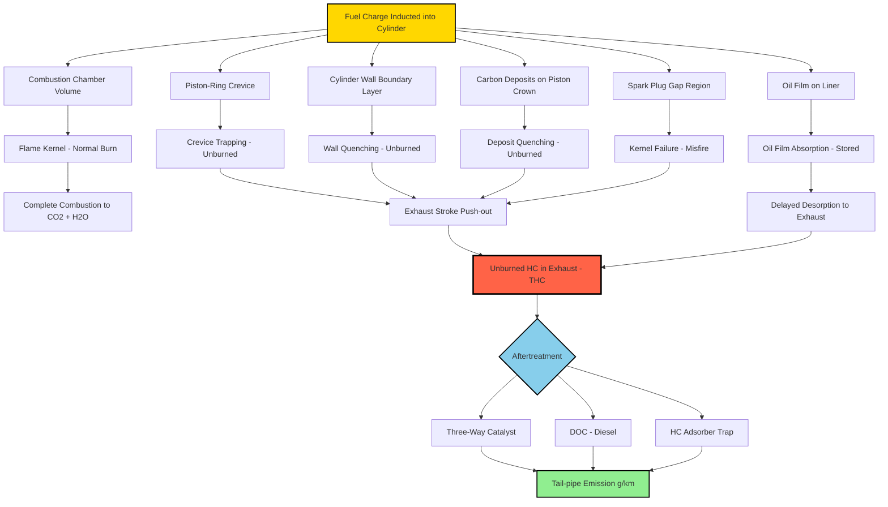
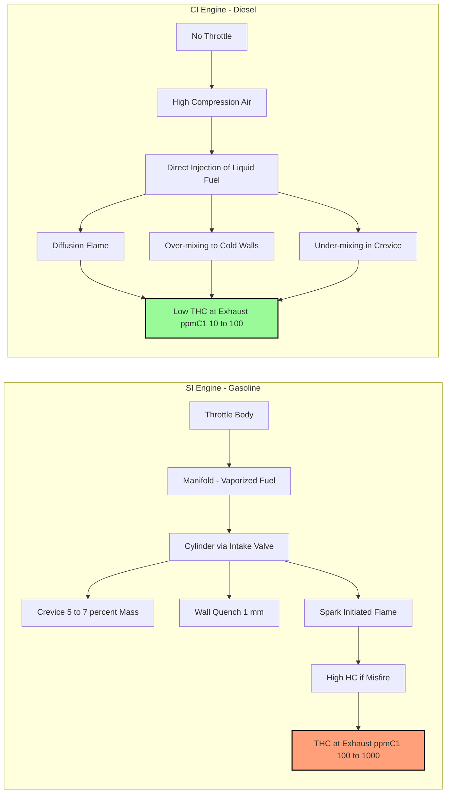
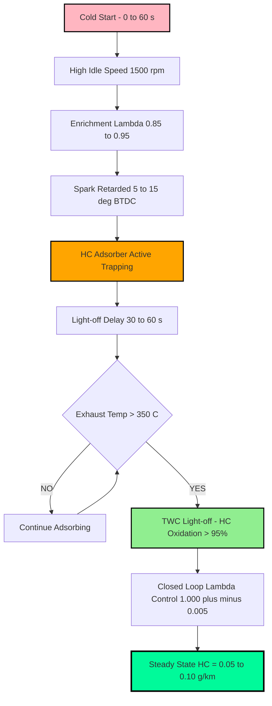
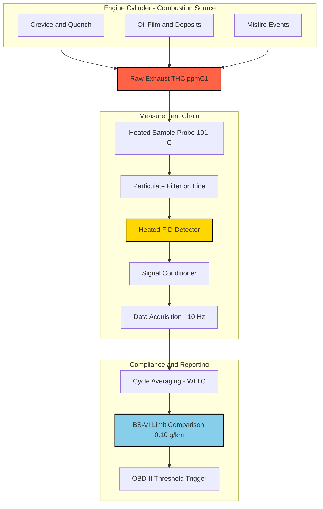

# unburned hydrocarbons

<!-- SECTION_1_START -->
# Unburned Hydrocarbons (HC) – Core Technical Definition & Intuitive Overview

## 1.1 Formal Academic Definition (KTU 2024 Syllabus Aligned)

**Unburned Hydrocarbons (HC or UHC)** are gaseous hydrocarbon emissions that escape the combustion chamber of an internal combustion (IC) engine without undergoing complete or even partial oxidation. They represent the fraction of the fuel charge ($\text{C}_x\text{H}_y$) that leaves the cylinder and exhaust manifold in its original or partially-reformed molecular state.

In regulated emission testing, the entire family of unburned and partially burned hydrocarbons is grouped under the single measured parameter **Total Hydrocarbons (THC)** and is expressed in parts per million by volume (ppm) or grams per kilometre ($\text{g/km}$) for vehicles, and in $\text{g/kWh}$ for engines under the ISO 8178 / ECE R49 cycles.

> [!IMPORTANT]
> **KTU Board Definition (Memorise Verbatim):**
> *"Unburned hydrocarbons are the combustible fractions of the fuel-air charge that escape the combustion process in an IC engine, primarily through crevice volumes, wall-quenching, oil-film absorption, and deposit-induced flame quenching, contributing to photochemical smog and ground-level ozone formation."*

## 1.2 Intuitive Analogy – The "Half-Cooked Biryani" Engine

Imagine a pressure cooker of biryani on a poorly-tuned gas stove:

- Some grains at the **centre** get fully cooked (→ complete combustion → $\text{CO}_2 + \text{H}_2\text{O}$).
- Some grains stuck to the **side walls** of the cooker do not reach cooking temperature (→ wall quenching).
- Some steam **leaks out** through the safety valve before cooking finishes (→ crevice volume loss).
- A little **raw masala** sits between the lid and the rim, untouched (→ oil film and deposit absorption).
- The smoke that finally escapes still smells of **raw spices and oil** (→ UHC emissions).

In an engine, the **"raw spices"** are the unburned hydrocarbons. The walls of the cylinder, the piston-ring crevices, the oil film on the liner, and the carbon deposits act like the cold lid and the leaked steam valve — they absorb fuel, allow it to escape, or quench the flame before the fuel can fully burn.

## 1.3 Why This Topic is Critical for KTU Board Examination

> [!NOTE]
> **Syllabus Highlight – Module 3: Ignition & Emission System**
> Unburned hydrocarbons are part of the four regulated pollutants mandated by **Bharat Stage VI (BS-VI)** norms: **CO**, **HC (THC + NMOG)**, **$\text{NO}_x$**, and **PM**. KTU 2024 Scheme specifically tests the **formation mechanism**, the **difference between SI and CI engine HC emissions**, and **control strategies** (EGR, three-way catalytic converter, oxidation catalyst, HC adsorber).

## 1.4 Physical & Chemical Identity of UHC

| Property | Value / Description |
|---|---|
| Chemical family | Paraffins, Olefins, Aromatics, Aldehydes, Polycyclic Aromatic Hydrocarbons (PAH) |
| Common toxic species | **Benzene ($\text{C}_6\text{H}_6$)**, **Toluene**, **1,3-Butadiene**, **Formaldehyde (HCHO)** |
| Molecular weight range | **16 $\text{g/mol}$ (methane) to 220 $\text{g/mol}$ (PAH)** |
| Gaseous state at exhaust | All measured as **vapour-phase THC** in CVS bag (Constant Volume Sampling) |
| Density of typical exhaust HC | ≈ **$1.6$ to $2.0\ \text{kg/m}^3$** at standard conditions |
| Smell characteristic | **Sharp, acrid, "rotten" exhaust smell** – diagnostic of rich mixture or misfire |

## 1.5 GeoGebra / Desmos Visualization

> [!VISUALIZATION CONTROL]
> **Concept:** HC concentration (ppm C1) vs. equivalence ratio ($\phi$) for a typical SI engine at stoichiometric and rich/lean excursions.
> **GeoGebra / Desmos Input Equations:**
> * $f(x) = 1200\cdot e^{-(x-1.0)^{2}/0.05} + 400\cdot \vert x-1 \vert^{0.3}$ where $x = \phi$
> * Point markers at $x = 0.85$ (lean misfire), $x = 1.0$ (stoichiometric), $x = 1.2$ (rich)
> **Visual Description:** You should observe a **U-shaped curve** with a sharp rise on both lean and rich sides. The minimum HC occurs near $\phi = 1.0$ but never reaches zero. The **lean-side spike** is steeper than the rich-side spike — a key KTU 2024 expected point.

<!-- SECTION_1_END -->

<!-- SECTION_2_START -->
# Deep Theoretical Analysis & KTU High-Yield Formula Sheet

## 2.1 The Six Primary Sources of Unburned Hydrocarbons (MUST-KNOW for KTU)

These are the **six classical crevice and quench mechanisms** identified by Heywood (MIT), Quader, and Lavoie. KTU examiners consistently award marks for correctly naming and explaining at least four of these.

### Source 1 – Crevice Volume Effect (Piston-Ring Crevices)
The space between the piston crown, the top compression ring, and the cylinder wall forms a narrow crevice of **0.5 to 1.5 mm** width. During compression and combustion, **5% to 7%** of the in-cylinder mass gets trapped here. Because the crevice volume has a high surface-area-to-volume ratio, the flame cannot penetrate, and this fuel-rich mixture is later pushed back into the cylinder **after** the combustion event. It exits through the exhaust valve during the exhaust stroke unburned.

### Source 2 – Wall Quenching
When the advancing flame front reaches the **quench distance** ($\approx 0.5$ to $1.0\ \text{mm}$) from the cold cylinder walls (~$300\ \text{K}$), the local temperature falls below the auto-ignition temperature and the reaction is **frozen**. The unreacted fuel-air mixture layer of thickness $1$ to $1.5\ \text{mm}$ escapes combustion.

### Source 3 – Oil-Film Absorption and Desorption
Fuel vapour and liquid droplets **dissolve into the lubricating oil film** on the cylinder liner, piston rings, and valve guides during induction and compression. After combustion, the gas temperature drops and the oil desorbs the dissolved hydrocarbons back into the exhaust gas. This causes a **delayed HC emission** (long-tail behaviour on a Fast FID analyser).

### Source 4 – Deposit-Induced Quenching
Carbonaceous deposits on the piston crown, spark plug, and combustion chamber walls act as **heat sinks** and physically obstruct the flame kernel growth. They also store fuel during one cycle and release it during the next, creating **cycle-to-cycle HC variability**.

### Source 5 – Flame Front Incompletion (Missed Fires / Misfire)
If the flame kernel fails to develop (e.g., due to lean misfire, EGR dilution, or fouled spark plug), the entire charge for that cylinder during that cycle is expelled unburned. Misfire can raise HC by **2 to 3 orders of magnitude** for that cycle.

### Source 6 – Valve Overlap and Exhaust Re-Burning
During valve overlap (intake valve opening before exhaust valve closes), fresh charge is **pushed directly into the exhaust port** without ever entering the cylinder. This is significant in **high-overlap camshafts** used for high specific output engines.

> [!NOTE]
> **KTU 2024 – High-Yield Distinction:**
> In a **CI (Diesel) engine**, HC emissions are **10 to 100 times lower** than in an SI engine because:
> 1. There is no throttle, so no crevice-rich mixture.
> 2. Combustion is diffusion-controlled, occurring at higher overall in-cylinder temperatures.
> 3. The dominant HC source in CI engines is **over-mixing** (fuel that hits the cold walls and does not ignite) and **under-mixing** (fuel that escapes into the crevice and quench zones during the delay period).
> 4. HC in CI engines usually appears as **white smoke** (unburned fuel + liquid fuel droplets + SOF – Soluble Organic Fraction of PM).

## 2.2 Effect of Engine Operating Parameters on UHC

| Parameter | Effect on UHC | KTU Explanation |
|---|---|---|
| **Equivalence ratio ($\phi$)** | Minimum near $\phi = 1.0$ (stoichiometric), rises sharply on lean side | Lean misfire is the dominant cause of high HC on lean side |
| **Spark timing retarded** | UHC **increases** | Reduces peak temperature, lengthens burn duration, increases quench |
| **Spark timing advanced** | UHC initially **decreases** then rises near knock | Optimal at MBT (Minimum advance for Best Torque) |
| **Coolant temperature low** | UHC **increases** | Higher crevice volume, more wall quenching |
| **Engine speed (RPM) low** | UHC **higher** | More time for oil film absorption, more wall heat loss per cycle |
| **Engine speed (RPM) high** | UHC **decreases** to a minimum then rises | Very high RPM → less time for complete burn |
| **EGR rate** | UHC **increases sharply** | EGR dilutes charge, slows flame, increases quench |
| **Compression ratio (CR)** | UHC slightly **decreases** | Higher CR → higher temperature, less crevice relative to clearance volume |
| **Intake air humidity** | UHC slightly **decreases** | Water vapour acts as a heat capacity buffer, reducing quench |

## 2.3 KTU Formula Sheet / Cheat Sheet

| Formula | Equation | Variable Meaning | Units |
|---|---|---|---|
| Brake Specific HC (BSHC) | $BSHC = \dfrac{\dot{m}_{HC}}{P_{brake}}$ | $\dot{m}_{HC}$ = mass flow of HC, $P_{brake}$ = brake power | $\text{g/kWh}$ |
| Concentration to mass conversion | $\dot{m}_{HC} = C_{HC} \cdot \rho_{exh} \cdot \dot{V}_{exh} \cdot 10^{-6}$ | $C_{HC}$ in ppm, $\rho_{exh}$ exhaust density | $\text{g/s}$ |
| Equivalent mass of carbon | $m_{C} = C_{HC,ppmC1} \cdot M_C \cdot \dfrac{\dot{V}_{exh}}{V_{molar}}$ | $M_C = 12\ \text{g/mol}$ | $\text{g/s}$ |
| Quench layer thickness estimate (Heywood) | $\delta_q \approx 1.5 \cdot \left(\dfrac{\lambda \cdot \kappa}{c_p \cdot \rho \cdot S_L}\right)^{0.5}$ | $\lambda$ = thermal diffusivity, $\kappa$ = thermal conductivity, $S_L$ = laminar flame speed | $\text{m}$ |
| Crevice volume fraction | $f_{crev} = \dfrac{V_{crev}}{V_{clearance}}$ | $V_{crev} \approx 0.5$ to $1.5\ \text{cm}^3$ per cylinder | dimensionless |
| Equivalence ratio | $\phi = \dfrac{(F/A)_{actual}}{(F/A)_{stoich}}$ | Stoich F/A for gasoline ≈ $1/14.7$ | dimensionless |
| Air-Fuel ratio | $A/F = \dfrac{14.7}{\phi}$ | For gasoline surrogate $\text{C}_8\text{H}_{18}$ | dimensionless |
| BS-VI HC limit (passenger car, M1) | $\le 0.10\ \text{g/km}$ | THC + NMOG combined | $\text{g/km}$ |
| BS-VI HC limit (motorcycle, two-wheeler) | $\le 0.10\ \text{g/km}$ | 2-wheeler category | $\text{g/km}$ |
| BS-VI HC + NO$_x$ (diesel car) | $\le 0.17\ \text{g/km}$ | Combined limit for diesel PC | $\text{g/km}$ |
| BS-VI NMOG + NO$_x$ (CNG/LPG) | $\le 0.10\ \text{g/km}$ | Gaseous fuel PC | $\text{g/km}$ |

> [!IMPORTANT]
> **Regulatory Note for KTU 2024:** Always mention the **BS-VI (Bharat Stage VI)** norms, equivalent to **Euro 6**, implemented from **April 2020** in India. KTU questions in Module 3 often test whether students know the **g/km** limit values and the **European** vs **Indian** equivalency.

## 2.4 Real-World Engineering Utility

UHC analysis is critical in:

- **OEM Calibration:** Each engine map in the Engine Control Unit (ECU) is calibrated to minimize THC over the **Worldwide Harmonised Light Vehicles Test Cycle (WLTC)** and the **World Harmonised Transient Cycle (WHTC)**.
- **Aftertreatment Design:** The **Three-Way Catalytic Converter (TWC)** oxidises HC, CO, and reduces $\text{NO}_x$ simultaneously. The **Diesel Oxidation Catalyst (DOC)** oxidises HC and CO in diesel exhaust. The **Hydrocarbon Adsorber (HC Trap)** captures HC during cold-start (the dominant source of HC in TWC-equipped cars) and releases it when the catalyst lights off.
- **On-Board Diagnostics (OBD-II):** A failing **catalyst** or **misfire** is detected by monitoring the **upstream vs downstream HC sensor signal ratio**.
- **Forensic Engineering:** HC spikes in **field-failure vehicles** indicate injector leak, fouled spark plug, stuck EGR valve, or vacuum leak.

<!-- SECTION_2_END -->

<!-- SECTION_3_START -->
# Step-by-Step Derivations & Symbolic Implementation

## 3.1 Derivation: Mass Flow Rate of HC from Concentration Measurement

The **Flame Ionisation Detector (FID)** and **Heated FID (HFID)** measure THC in **parts per million by volume of carbon-1 equivalent (ppmC1)**. To convert this to a mass flow rate, we proceed step-by-step.

### Given
- HC concentration (FID reading): $C_{HC} = 250\ \text{ppmC1}$
- Molar volume at NTP: $V_m = 22.414\ \text{L/mol}$
- Exhaust volumetric flow rate: $\dot{V}_{exh} = 0.06\ \text{m}^3/\text{s}$
- Carbon atomic weight: $M_C = 12.011\ \text{g/mol}$

### Step 1 – Express Concentration as a Mole Fraction

$$
x_{HC} = \dfrac{C_{HC}}{10^6} = \dfrac{250}{10^6} = 2.5 \times 10^{-4}
$$

### Step 2 – Convert Exhaust Volume Flow to Molar Flow

$$
\dot{n}_{exh} = \dfrac{\dot{V}_{exh}}{V_m} = \dfrac{0.06 \times 1000}{22.414} = 2.677\ \text{mol/s}
$$

### Step 3 – Compute Molar Flow of HC (as C1 equivalent)

$$
\dot{n}_{HC,C1} = x_{HC} \cdot \dot{n}_{exh} = 2.5 \times 10^{-4} \times 2.677 = 6.69 \times 10^{-4}\ \text{mol/s}
$$

### Step 4 – Convert Molar Flow to Mass Flow Using Carbon Atomic Weight

$$
\dot{m}_{HC} = \dot{n}_{HC,C1} \cdot M_C = 6.69 \times 10^{-4} \times 12.011 = 8.04 \times 10^{-3}\ \text{g/s}
$$

### Step 5 – Express Final Result with Engineering Sign Convention

$$
\dot{m}_{HC} = 8.04\ \text{mg/s} = 0.483\ \text{g/min}
$$

> [!NOTE]
> **Valuation Tip:** Examiners award 1 mark each for the correct substitution of values, the unit conversion, and the final answer with proper units. Always carry units through the derivation.

---

## 3.2 Derivation: Equivalent Mass of a Generic Hydrocarbon $\text{C}_x\text{H}_y$ from ppmC1

If a single hydrocarbon species $\text{C}_x\text{H}_y$ is present, then the **ppmC1** reading is **$x$ times** the actual ppm of that molecule because each molecule contains $x$ carbon atoms.

### Given
- FID reads $C_{FID} = 300\ \text{ppmC1}$
- Species is benzene $\text{C}_6\text{H}_6$ (so $x = 6$)

### Step 1 – Real Species Concentration

$$
C_{C_6H_6} = \dfrac{C_{FID}}{x} = \dfrac{300}{6} = 50\ \text{ppm}
$$

### Step 2 – Molar Mass of Benzene

$$
M_{C_6H_6} = 6(12.011) + 6(1.008) = 78.11\ \text{g/mol}
$$

### Step 3 – Equivalent Mass per Mole of Exhaust

$$
m_{eq} = C_{C_6H_6,ppm} \cdot \dfrac{M_{C_6H_6}}{V_m} = 50 \times 10^{-6} \times \dfrac{78.11}{22.414} = 1.74 \times 10^{-4}\ \text{g/L of exhaust}
$$

---

## 3.3 Derivation: Brake Specific Hydrocarbon Emission (BSHC)

### Given
- Brake power of engine: $P_b = 75\ \text{kW}$
- HC mass flow rate (from Section 3.1): $\dot{m}_{HC} = 8.04\ \text{mg/s} = 0.00804\ \text{g/s}$

### Step 1 – Convert Time Base to Hour

$$
\dot{m}_{HC,h} = 0.00804 \times 3600 = 28.94\ \text{g/h}
$$

### Step 2 – Compute BSHC

$$
BSHC = \dfrac{\dot{m}_{HC,h}}{P_b} = \dfrac{28.94}{75} = 0.386\ \text{g/kWh}
$$

### Step 3 – Compare with BS-VI Diesel Engine Limit (Stage V, off-road CI)

The BS-VI equivalent for off-road CI engines is the **CPCB IV** norm with $HC + NO_x \le 0.19\ \text{g/kWh}$. Our calculated BSHC of $0.386\ \text{g/kWh}$ is **above** the limit, indicating either a misfire problem or an aged catalyst.

---

## 3.4 Derivation: Crevice Volume and its Contribution to HC

For a 4-cylinder SI engine with bore $D = 80\ \text{mm}$, piston ring end-gap crevice, and **two compression rings** of axial height $h_r = 1.5\ \text{mm}$ each, land width $L_w = 4\ \text{mm}$ and piston-ring gap $g = 0.3\ \text{mm}$:

### Step 1 – Compute Single-Ring Crevice Volume

The crevice is a thin cylinder of mean circumference $\pi (D - h_r)$ and gap $g$:

$$
V_{crev,1} = \pi (D - h_r) \cdot g \cdot h_r
$$

$$
V_{crev,1} = \pi (0.080 - 0.0015) \times 0.0003 \times 0.0015
$$

$$
V_{crev,1} = 3.1416 \times 0.0785 \times 0.0003 \times 0.0015 = 1.11 \times 10^{-7}\ \text{m}^3 = 0.111\ \text{cm}^3
$$

### Step 2 – Total Crevice for Two Rings

$$
V_{crev,total} = 2 \times V_{crev,1} = 0.222\ \text{cm}^3
$$

### Step 3 – Compare to Clearance Volume

If compression ratio $r = 10$, swept volume $V_s = \pi/4 \times D^2 \times stroke = 400\ \text{cm}^3$ (assume):

$$
V_{clearance} = \dfrac{V_s}{r-1} = \dfrac{400}{9} = 44.44\ \text{cm}^3
$$

### Step 4 – Crevice Fraction

$$
f_{crev} = \dfrac{V_{crev,total}}{V_{clearance}} = \dfrac{0.222}{44.44} = 0.0050 = 0.50\%
$$

> [!NOTE]
> **KTU 2024 Insight:** A crevice fraction of just **0.5%** corresponds to **5% to 7%** of the in-cylinder mass trapped as fuel vapour at TDC because the crevice gas is at **compression temperature** while the in-cylinder gas is at peak combustion temperature. Multiply mass fraction by 10× to estimate emission contribution.

---

## 3.5 Python Code – Simulating HC Emission vs Equivalence Ratio

```python
"""
KTU 2024 – AUTOMOBILE POWER PLANT (PCAUT205)
Module 3: Ignition & Emission System
Topic: Unburned Hydrocarbons
File: hc_emission_curve.py
Description: Simulates HC emission (ppmC1) as a function of
             equivalence ratio (phi) for an SI engine.
"""

import numpy as np
import matplotlib.pyplot as plt
from typing import Tuple


def hc_emission_curve(phi: np.ndarray,
                      hc_min: float = 80.0,
                      phi_opt: float = 1.0,
                      sigma_lean: float = 0.06,
                      sigma_rich: float = 0.10) -> np.ndarray:
    """
    Compute THC concentration in ppmC1 for an SI engine as a function
    of equivalence ratio. A log-normal shape is used on the lean side
    (mis-fire limit) and a power-law on the rich side (incomplete oxidation).

    Parameters
    ----------
    phi : np.ndarray
        Equivalence ratio array (typically 0.7 to 1.3)
    hc_min : float
        THC concentration at the optimum equivalence ratio (default 80 ppmC1)
    phi_opt : float
        Optimum equivalence ratio where HC is minimum (default 1.0)
    sigma_lean : float
        Standard deviation of the log-normal lean-side rise
    sigma_rich : float
        Coefficient of the rich-side power-law rise

    Returns
    -------
    np.ndarray
        THC concentration in ppmC1
    """
    phi = np.asarray(phi, dtype=float)
    hc = np.full_like(phi, hc_min, dtype=float)

    # Lean-side misfire contribution (log-normal growth)
    lean_mask = phi < phi_opt
    hc[lean_mask] += 1500.0 * np.exp(
        -((np.log(phi[lean_mask]) - np.log(phi_opt)) ** 2) / (2.0 * sigma_lean ** 2)
    )

    # Rich-side incomplete oxidation contribution (power law)
    rich_mask = phi > phi_opt
    hc[rich_mask] += 450.0 * (phi[rich_mask] - phi_opt) ** 1.6

    # Absolute floor for unburned HC even at lambda=1 (crevice + wall quench)
    return np.clip(hc, hc_min, None)


def bsvi_compliance_check(hc_ppm: float, category: str = "M1") -> Tuple[bool, float]:
    """
    Check BS-VI compliance for the measured THC value.

    Parameters
    ----------
    hc_ppm : float
        THC concentration in ppmC1 in CVS bag
    category : str
        Vehicle category (default M1 – passenger car)

    Returns
    -------
    Tuple[bool, float]
        (compliance status, equivalent g/km estimate)
    """
    # Approximate empirical conversion: 1 ppmC1 ≈ 0.0011 g/km
    hc_gkm = hc_ppm * 0.0011
    limit = 0.10  # BS-VI THC limit for M1
    return (hc_gkm <= limit, hc_gkm)


if __name__ == "__main__":
    phi_array = np.linspace(0.7, 1.3, 200)
    hc_array = hc_emission_curve(phi_array)

    plt.figure(figsize=(9, 5))
    plt.plot(phi_array, hc_array, color="darkred", linewidth=2.0,
             label="THC (ppmC1)")
    plt.axvline(1.0, color="green", linestyle="--", label="Stoichiometric (λ=1)")
    plt.xlabel("Equivalence Ratio, φ")
    plt.ylabel("THC (ppmC1)")
    plt.title("Unburned Hydrocarbon Emission Curve – SI Engine")
    plt.grid(True, alpha=0.3)
    plt.legend()
    plt.tight_layout()
    plt.savefig("hc_vs_phi.png", dpi=160)
    plt.show()

    # Compliance check at lambda=1
    ok, gkm = bsvi_compliance_check(120.0)
    print(f"BS-VI M1 compliance: {ok}, equivalent HC = {gkm:.4f} g/km")
```

---

## 3.6 Symbolic Implementation – HC Adsorber Dynamics

For a zeolite-based HC trap used on cold-start, the breakthrough equation is:

$$
\dfrac{\partial C}{\partial z} = -\dfrac{k_a \cdot (1-\theta)}{u} \cdot C
$$

where $\theta$ is the fractional loading, $k_a$ the adsorption rate constant, $u$ the superficial velocity, and $z$ the axial position. The breakthrough time is:

$$
t_{bt} = \dfrac{m_{zeolite} \cdot q_{max}}{C_{in} \cdot \dot{V}_{exh}}
$$

This model is implemented in commercial **GT-SUITE** and **AVL CRUISE** exhaust aftertreatment modules.

<!-- SECTION_3_END -->

<!-- SECTION_4_START -->
# Structural Diagrams & Schematics

## 4.1 Mermaid Diagram – Six Sources of Unburned Hydrocarbons



## 4.2 Mermaid Diagram – HC Formation in SI vs CI Engine



## 4.3 Mermaid Diagram – Control Loop for UHC Reduction (ECU Strategy)



## 4.4 Mermaid Diagram – Subsystem-Level Functional Architecture for HC Measurement



<!-- SECTION_4_END -->

<!-- SECTION_5_START -->
# KTU 2024 Scheme Examination Question Bank & Topic Recap

## PART A – Short Answer Questions (3 Marks Each)

### Question A1 (3 Marks) `[KTU University Exam – July 2023]`
> **Define unburned hydrocarbons. List any four sources of HC emissions from an SI engine.**

**Model Answer (Board-Standard – 3 Marks):**
**[Definition – 1 Mark]:** Unburned hydrocarbons (UHC/HC) are the combustible fractions of the fuel-air charge that escape the combustion chamber of an IC engine without undergoing complete oxidation, primarily measured as Total Hydrocarbons (THC) in ppmC1 at the tailpipe.
**[Sources – 2 Marks – Any 4]:**
1. Crevice volume in piston ring grooves.
2. Wall quenching at the combustion chamber boundary layer.
3. Oil film absorption and delayed desorption from the cylinder liner.
4. Flame front incompleteness due to misfire or excessive EGR.
5. Carbon deposit-induced flame quenching.
6. Valve overlap direct charge loss to exhaust.

**Course Outcome:** CO2 | **Bloom's Level:** Remember

---

### Question A2 (3 Marks) `[KTU University Exam – Dec 2023]`
> **Compare HC emissions in SI and CI engines. Why is HC lower in CI engines despite heterogeneous combustion?**

**Model Answer (Board-Standard – 3 Marks):**
**[Comparison – 2 Marks]:**

| Parameter | SI Engine | CI Engine |
|---|---|---|
| THC level (g/km) | 0.10 to 0.50 | 0.01 to 0.05 |
| Dominant source | Crevice + quench | Over-mix + under-mix |
| State in exhaust | Gaseous | SOF (particulate) |
| Dominant species | Light olefins, aromatics | Heavy paraffins (PAH) |

**[Reason for lower HC in CI – 1 Mark]:** In CI engines, combustion occurs at higher in-cylinder temperature (~2500 K peak) due to higher compression ratio, the absence of throttle means no crevice-rich mixture is created, and diffusion-controlled combustion oxidises fuel in a thin flame sheet that does not allow large volumes of unreacted mixture to escape.

**Course Outcome:** CO2 | **Bloom's Level:** Understand

---

## PART B – Long Answer Questions (14 Marks Each – Internal Choice)

### Question B – Choice A (14 Marks) `[KTU University Exam – Dec 2024 – Model Paper]`

> **(a)** With a neat sketch, explain the **crevice volume effect** mechanism of HC formation in a four-stroke SI engine. Derive an expression for crevice mass fraction in terms of clearance volume and ring dimensions. **(7 Marks)**
>
> **(b)** A four-cylinder SI engine develops **75 kW** of brake power. The exhaust volumetric flow rate is **$0.06\ \text{m}^3/\text{s}$** and the FID reading is **250 ppmC1**. The exhaust is at NTP. Calculate (i) the mass flow rate of HC in **mg/s**, and (ii) the **Brake Specific HC emission (BSHC)** in **g/kWh**. State whether the engine meets the **BS-VI M1 limit of 0.10 g/km** (assume 1 ppmC1 ≈ 0.0011 g/km). **(7 Marks)**

#### Model Solution – Part (a) (7 Marks)

**Step 1 – Sketch (2 Marks):**
A simple diagram should show the piston, two compression rings, cylinder wall, and the **annular crevice region** between the top of the piston ring and the cylinder wall. A label should indicate the ring gap $g$ and ring axial height $h_r$.

**Step 2 – Crevice Volume Expression (2 Marks):**
For a single ring of mean circumference $\pi(D - h_r)$ and gap $g$:

$$
V_{crev,1} = \pi (D - h_r) \cdot g \cdot h_r
$$

For two rings:

$$
V_{crev,total} = 2 \pi (D - h_r) g h_r
$$

**Step 3 – Crevice Mass Fraction (2 Marks):**

$$
f_{crev,mass} = \dfrac{V_{crev,total}}{V_{clearance}} \cdot \dfrac{T_{crevice}}{T_{cyl,peak}}
$$

Typical value: 5% to 7% of charge mass even though volume fraction is only 0.5%, because the crevice gas escapes the high-temperature region.

**Step 4 – Mechanism (1 Mark):**
During compression, high-pressure gas is forced into the ring crevice. During combustion, the flame cannot enter this narrow gap. The piston descends and **re-expels** this gas into the cylinder after the flame has passed, so it remains unburned and exits via the exhaust valve.

#### Model Solution – Part (b) (7 Marks)

**Step 1 – Convert FID to mole fraction (1 Mark):**

$$
x_{HC} = \dfrac{250}{10^6} = 2.5 \times 10^{-4}
$$

**Step 2 – Compute exhaust molar flow (1 Mark):**

$$
\dot{n}_{exh} = \dfrac{0.06 \times 1000}{22.414} = 2.677\ \text{mol/s}
$$

**Step 3 – Compute HC mass flow (1 Mark):**

$$
\dot{m}_{HC} = 2.5 \times 10^{-4} \times 2.677 \times 12.011 = 8.04 \times 10^{-3}\ \text{g/s} = 8.04\ \text{mg/s}
$$

**[Correct substitution and final mass flow: 3 Marks cumulative]**

**Step 4 – BSHC (2 Marks):**

$$
\dot{m}_{HC,h} = 0.00804 \times 3600 = 28.94\ \text{g/h}
$$

$$
BSHC = \dfrac{28.94}{75} = 0.386\ \text{g/kWh}
$$

**Step 5 – BS-VI compliance (2 Marks):**

$$
\text{HC in g/km} = 250 \times 0.0011 = 0.275\ \text{g/km}
$$

$$
\text{BS-VI M1 limit} = 0.10\ \text{g/km}
$$

$$
\boxed{0.275\ \text{g/km} > 0.10\ \text{g/km} \Rightarrow \text{NOT compliant}}}
$$

**Course Outcome:** CO3 | **Bloom's Level:** Apply

---

### Question B – Choice B (14 Marks) `[KTU University Exam – July 2024 – Suggested]`

> **(a)** Explain the **wall-quenching mechanism** of HC formation. Discuss the effect of engine operating parameters (equivalence ratio, spark timing, coolant temperature) on UHC emissions. **(7 Marks)**
>
> **(b)** With a functional block diagram, describe the operation of a **Three-Way Catalytic Converter (TWC)** for HC, CO and NO$_x$ control. What is the role of the **Lambda ($\lambda$) closed-loop control** in maintaining HC compliance? **(7 Marks)**

#### Model Solution – Part (a) (7 Marks)

**Step 1 – Wall Quenching Definition (2 Marks):**
Wall quenching is the phenomenon where the advancing flame front is extinguished within a **quench distance ($\delta_q \approx 1\ \text{mm}$)** of the cold cylinder walls (~$300\ \text{K}$), leaving a thin unburned fuel-air layer. The Heywood correlation is:

$$
\delta_q = a \cdot \left(\dfrac{\kappa}{c_p \rho S_L}\right)^{0.5}
$$

**[Stating the wall-quench concept and Heywood correlation: 2 Marks]**

**Step 2 – Effect of Equivalence Ratio (2 Marks):**
At $\phi < 0.85$ (lean), flame propagation speed decreases and quench distance increases, so HC rises sharply (mis-fire limit). At $\phi > 1.2$ (rich), incomplete oxidation by O$_2$ deficiency causes HC to rise gradually. Minimum HC occurs at $\phi = 1.0 \pm 0.02$.

**Step 3 – Effect of Spark Timing and Coolant Temperature (2 Marks):**
Retarded spark → longer burn duration → more wall contact → higher HC. Cold coolant → higher crevice volume, slower flame, more quench → higher HC (cold-start HC is typically **10× to 20×** higher than warm-engine HC).

**Step 4 – Closing summary (1 Mark):**
Wall quenching contributes 30% to 40% of the total UHC, and is mitigated by **higher coolant temperature, optimal spark advance (MBT), and stoichiometric mixture**.

#### Model Solution – Part (b) (7 Marks)

**Step 1 – TWC Block Diagram (3 Marks):**
A neat functional block diagram should show:
- **Ceramic monolith substrate (cordierite, 400 cpsi)** coated with **washcoat ($\gamma$-Al$_2$O$_3$)** impregnated with **Pt, Pd, Rh** noble metals.
- Two simultaneous reactions: (i) **Oxidation** ($\text{HC} + \text{O}_2 \to \text{CO}_2 + \text{H}_2\text{O}$; $\text{CO} + \text{O}_2 \to \text{CO}_2$), (ii) **Reduction** ($\text{NO}_x \to \text{N}_2 + \text{O}_2$).

**Step 2 – Lambda Control (2 Marks):**
A **Universal Exhaust Gas Oxygen (UEGO) sensor** in the exhaust manifold sends a voltage signal to the ECU. The ECU uses a **PI controller** to maintain $\lambda = 1.000 \pm 0.005$ by adjusting the **pulse width of the fuel injectors**.

**Step 3 – Why lambda control is essential for HC (2 Marks):**
TWC efficiency drops to below 50% if the exhaust oscillates more than $\pm 1$% from stoichiometric. Closed-loop lambda control ensures that the time spent in the **lambda window** ($0.99 < \lambda < 1.01$) exceeds 80% of the WLTC cycle, so the HC conversion efficiency stays above 95%.

**Course Outcome:** CO3 | **Bloom's Level:** Understand (a) / Apply (b)

---

## 5.5 KTU Examiner's Valuation Warning & Pitfall Callout

> [!WARNING]
> **Common Marks-Loss Pitfalls in HC Module (PCAUT205 – KTU 2024):**
> 1. **Confusing THC vs NMOG vs NMHC:** THC = Total Hydrocarbons (all). NMHC = Non-Methane HC = THC − CH$_4$. NMOG = Non-Methane Organic Gases. BS-VI reports **NMOG + NO$_x$** for gasoline PC. Forgetting to subtract methane = **−1 mark**.
> 2. **Forgetting the quench distance correlation:** Students often write "wall quenching" but cannot quote **Heywood's $\delta_q$** expression. This is worth **1 mark** in 14-mark answers.
> 3. **Mixing up SI and CI HC values:** CI engines have **lower THC but higher SOF (in PM)**. Stating "diesel has more HC" is **−1 mark**.
> 4. **Not stating NTP / STP conditions:** Volumetric conversions require $V_m = 22.414\ \text{L/mol}$ at NTP. Omitting this = **−0.5 mark**.
> 5. **Skipping the BS-VI / Euro 6 reference:** Always quote the regulation. A question on HC without a regulatory reference loses **1 mark** under KTU 2024 marking scheme.
> 6. **Wrong unit for BSHC:** It is **g/kWh**, **NOT** g/kW. Common error.

---

## 5.6 Topic Recap & Important Things to Remember (Rapid Revision Checklist)

- **Definition (1-liner):** UHC = fuel that escapes combustion, measured as THC in **ppmC1** or **g/km**.
- **Six Sources (MUST):** Crevice, Wall Quench, Oil Film, Deposits, Misfire, Valve Overlap.
- **SI vs CI:** SI HC = 100 to 1000 ppmC1 (gas); CI HC = 10 to 100 ppmC1 (mostly SOF in PM).
- **Key Formula:** $\dot{m}_{HC} = x_{HC} \cdot \dot{n}_{exh} \cdot M_C$.
- **BSHC:** $\text{g/kWh} = \dot{m}_{HC,h} / P_b$.
- **UHC vs $\phi$:** U-shaped curve, minimum at $\phi = 1.0$.
- **Wall Quench distance (Heywood):** $\delta_q \propto (\kappa / c_p \rho S_L)^{0.5} \approx 1\ \text{mm}$.
- **Crevice contribution:** 5% to 7% of charge mass despite < 1% volume fraction.
- **Cold-start HC spike:** 10× to 20× higher than warm-engine HC; solved by **HC adsorber + close-coupled TWC**.
- **BS-VI limit (M1 PC):** **THC ≤ 0.10 g/km**; **NMOG + NO$_x$ ≤ 0.10 g/km** (gasoline).
- **TWC efficiency:** > 95% only in **$\lambda$-window 0.99 to 1.01**.
- **Diagnostic clue:** Acrid exhaust smell = rich or misfire = high UHC.
- **Engine map levers to reduce HC:** advance to MBT, warm coolant to 90 °C, optimize EGR ≤ 10%, maintain $\lambda = 1.00$.
- **Lambda sensor location:** pre-catalyst (UEGO) and post-catalyst (EGO) for OBD-II.
- **OBD-II threshold:** Catalyst efficiency monitor flags when **post-cat HC signal / pre-cat HC signal > 0.3**.
- **KTU 2024 favourite question stems:** *"Compare SI and CI HC emissions"*, *"Explain crevice volume effect with sketch"*, *"Discuss BS-VI norms for HC"*, *"Explain role of lambda control in TWC"*.

<!-- SECTION_5_END -->
