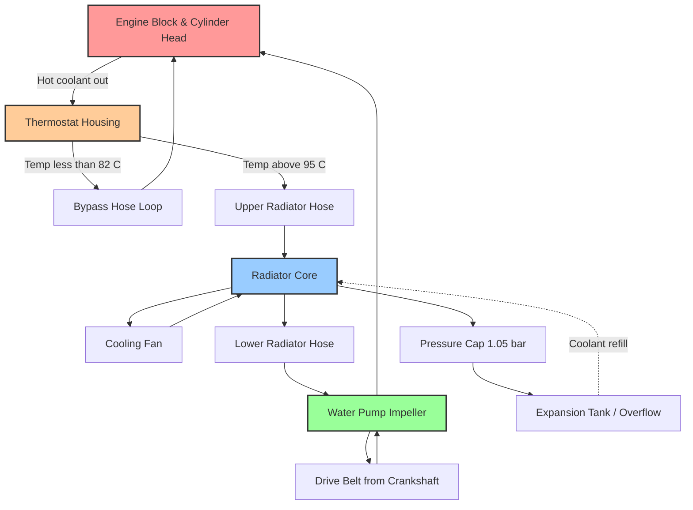
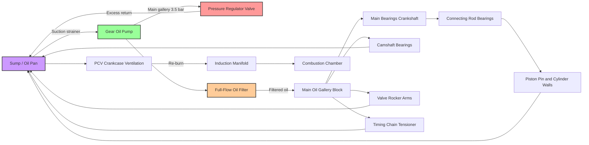
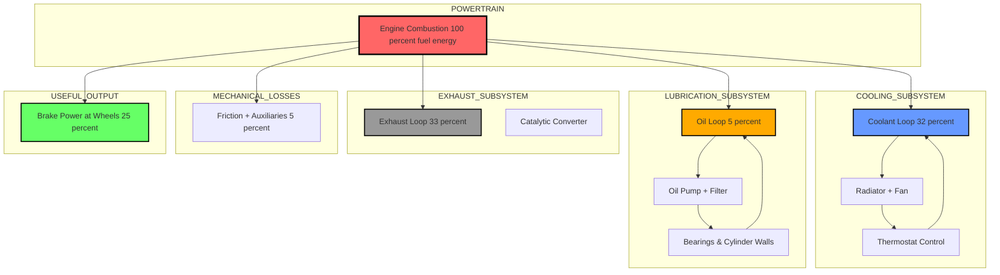
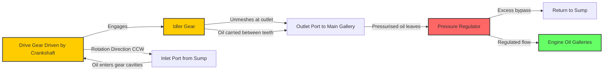

# COOLING & LUBRICATION SYSTEM

<!-- SECTION_1_START -->
# Module 4 — Cooling & Lubrication System

> [!NOTE]
> **KTU 2024 Scheme (PCAUT205) — Automobile Power Plant**
> This module addresses the two most critical auxiliary systems of an Internal Combustion (IC) engine: the system that **removes surplus combustion heat** and the system that **minimises metal-to-metal wear**. Together they ensure the engine runs within safe thermal and mechanical limits, directly determining reliability, fuel efficiency, and exhaust emissions.

---

## 1.1 Engine Cooling — Formal Definition

**Cooling System:** A regulated heat-rejection network in an IC engine that extracts roughly **$\mathbf{30\%}$ to $\mathbf{35\%}$** of the total energy liberated by fuel combustion and dissipates it to the atmosphere, while maintaining the cylinder block, head, and piston crown within their permissible metallurgical temperature window (typically **$\mathbf{80^\circ C}$ to $\mathbf{95^\circ C}$** for a water-cooled SI engine).

If the system fails, cylinder-head temperatures can exceed **$\mathbf{200^\circ C}$**, causing:
- **Pre-ignition / Detonation** in petrol engines
- **Lubricant film collapse** (oil carbonises above $\sim 150^\circ C$)
- **Differential thermal expansion**, leading to scuffing, seizure, or cracked castings.

> [!IMPORTANT]
> **KTU 2024 Highlight (Syllabus Tag: M4.1):** Students must be able to compare air-cooling vs. water-cooling, draw the thermosyphon and forced-circulation circuits, and explain the role of the **thermostat** and **pressure cap** in regulation.

### Conceptual Analogy — The Human Body

Think of the engine cooling system exactly like the human **circulatory system**:
- The **water pump** is the *heart* — it pressurises and circulates coolant.
- The **radiator** is the *skin* — it dumps heat to the environment.
- The **thermostat** is the *hypothalamus* — it senses temperature and regulates flow.
- The **coolant** is the *blood* — it carries heat away from the organs (cylinders).
- The **expansion tank** is the *reservoir* — it accommodates volumetric expansion.

Similarly, **lubrication is the synovial fluid of the joints** — without it, every moving part (crankshaft, camshaft, piston) would grind itself apart within seconds.

---

## 1.2 Engine Lubrication — Formal Definition

**Lubrication System:** A metered, pressurised oil-distribution network that delivers refined mineral or synthetic lubricant (engine oil) to all **bearing surfaces, pistons, cams, and valve gear**, simultaneously performing **cooling, cleaning, sealing, corrosion prevention, and damping** — collectively called the *primary functions of lubrication*.

> [!NOTE]
> **Engine Oil Viscosity Grade (SAE J300):** The Society of Automotive Engineers classifies oils by viscosity at **$\mathbf{-18^\circ C}$ (W = Winter)** and **$\mathbf{100^\circ C}$**. Example: **SAE 20W-50** means the oil flows like a SAE 20 grade when cold and a SAE 50 grade when hot.

### Conceptual Analogy — The Plumbing Network

Picture the lubrication system as a multi-storey building's **pressurised water plumbing**:
- The **oil sump (pan)** is the *underground water tank*.
- The **oil pump** is the *booster pump*.
- The **oil galleries (drilled passages)** are the *risers/risers in walls*.
- The **bearings** are the *taps* where the fluid is finally delivered.
- The **oil filter** is the *water purification cartridge* — a single gram of contaminants can initiate fatigue spalling in a roller bearing.

---

## 1.3 Why Both Systems Are Co-Designed

Cooling and lubrication are **thermodynamically coupled**:
- Oil absorbs **$\mathbf{3\%}$ to $\mathbf{5\%}$** of the fuel energy as it lubricates.
- Coolant absorbs **$\mathbf{30\%}$ to $\mathbf{35\%}$** of the fuel energy.
- Sum of major heat sinks ≈ $\mathbf{65\%}$ to $\mathbf{75\%}$ of fuel energy (the rest leaves as exhaust $\sim 30\%$ and friction $\sim 5\%$).

> [!VISUALIZATION CONTROL]
> **Concept:** Energy Distribution Pie Chart of Fuel Energy in a Typical SI Engine
> **GeoGebra / Desmos Input Equations (parametric):**
> * `f1(x,y) = sqrt(x^2 + y^2) * cos(0)` representing the *Cooling* arc
> * `f2(x,y) = sqrt(x^2 + y^2) * cos(72)` representing the *Exhaust* arc
> * `f3(x,y) = sqrt(x^2 + y^2) * cos(144)` representing the *Friction* arc
> * `f4(x,y) = sqrt(x^2 + y^2) * cos(216)` representing the *Lubrication & Auxiliaries* arc
> **Visual Description:** The student should see four pie wedges labelled *Cooling 32%*, *Exhaust 33%*, *Friction 5%*, *Lubrication + Aux 5%*, *Remaining loss 25%* — emphasising that **Cooling is the largest single heat sink**.


<!-- SECTION_1_END -->

<!-- SECTION_2_START -->
# 2. Deep Theoretical Analysis & KTU High-Yield Formula Sheet

---

## 2.1 Classification of Engine Cooling Systems

| Type | Sub-type | Coolant | Heat-Transfer Mode | Typical Application |
|------|----------|---------|-------------------|---------------------|
| **Air Cooling** | Natural / Forced | Air (fin-cooled) | Convection from fins | Motorcycles, lawn mowers, small gensets |
| **Water Cooling** | Thermosyphon | Water + Ethylene Glycol | Natural convection | Older cars (e.g., pre-1960 models) |
| | Pump (Forced) Circulation | Water + Coolant | Forced convection | **Modern passenger cars (most common)** |
| | Heat-Exchanger (Marine) | Fresh + Sea water | Indirect | Ships, boats |
| **Oil Cooling** | Splash / Jet | Engine oil | Forced convection | High-performance engines, air-cooled aircraft |

---

## 2.2 Forced-Circulation Water-Cooling System — Component Analysis

The **pump (forced) circulation system** is the most important variant for KTU. Its schematic flow path is:

$$\text{Radiator} \rightarrow \text{Water Pump} \rightarrow \text{Engine Block Jackets} \rightarrow \text{Cylinder Head} \rightarrow \text{Thermostat} \rightarrow \text{Radiator}$$

### 2.2.1 Major Components

1. **Water Pump (Centrifugal type)**
   - Pump speed = engine speed (driven by belt/pulley).
   - Typical flow rate: **$\mathbf{3}$ to $\mathbf{5}$ litres per second** for a 1.5 L engine.
   - Developed head: **$\mathbf{5}$ to $\mathbf{7}$ m of water column**.

2. **Thermostat (Wax-pellet or Bellows type)**
   - Begins opening at **$\mathbf{82^\circ C}$**, fully open at **$\mathbf{95^\circ C}$**.
   - In a *cold* engine, it blocks flow to the radiator — coolant circulates only through the bypass, ensuring fast warm-up.
   - In a *hot* engine, it opens the radiator path — coolant dumps heat to atmosphere.

3. **Radiator (Down-flow or Cross-flow)**
   - Core: **Brass / Aluminium tubes with fins**.
   - Fins increase surface area by a factor of **$\mathbf{8}$ to $\mathbf{10}$**.
   - Typical capacity: **$\mathbf{5}$ to $\mathbf{10}$ litres** for a passenger car.
   - Fitted with a **pressure cap** rated **$\mathbf{0.9}$ to $\mathbf{1.05}$ bar**.

4. **Cooling Fan (Mechanical / Electric)**
   - Mechanical fan: belt-driven, draws $\sim 2$ to $4$ kW.
   - Electric fan (ECU-controlled): engages only when needed → better fuel economy.

5. **Expansion Tank / Overflow Reservoir**
   - Pressurised by radiator cap.
   - Allows coolant expansion ($\sim 6\%$ volume increase from $0^\circ C$ to $100^\circ C$).
   - Permits air-bleeding during refilling.

6. **Temperature Gauge & Sender Unit**
   - Thermistor-type sender (resistance decreases with temperature).
   - ECU reads voltage drop and triggers fan / warning light.

### 2.2.2 Pressure Cap — The Hidden Genius

A radiator cap is **not just a lid**. It contains a **pressure valve** and a **vacuum valve**:

$$T_{sat}(p) = T_{sat}(101.3 \text{ kPa}) + k\sqrt{p - 101.3}$$

Empirically, raising coolant pressure by **$\mathbf{1 \text{ bar}}$** raises the boiling point by **$\mathbf{20^\circ C}$** (from $100^\circ C$ to $\sim 120^\circ C$). This:
- Prevents **vapour lock** at high altitudes.
- Improves **thermodynamic efficiency** (hotter coolant → larger $\Delta T$ → better combustion).
- Reduces the risk of localised boiling inside the cylinder head.

> [!IMPORTANT]
> **KTU 2024 Pitfall:** Students often confuse *pressure cap rating* with *system pressure*. The cap is calibrated to **release** at its rating; the system normally operates **below** this rating. The cap rating is the **maximum safe** pressure.

---

## 2.3 Air-Cooling System

- **Finned cylinders and heads** dramatically increase surface area.
- Fin efficiency is given by:

$$\eta_{fin} = \frac{\tanh(mL)}{mL}, \quad \text{where } m = \sqrt{\frac{hP}{kA}}$$

- **$L$** = fin height, **$P$** = perimeter, **$A$** = cross-section, **$k$** = fin thermal conductivity, **$h$** = convective coefficient.
- For aircraft engines, fin effectiveness can reach **$\mathbf{0.90}$ to $\mathbf{0.95}$**.

> [!NOTE]
> **Advantages of Air Cooling:** No coolant leakage, no pump, lighter weight, no freezing issue.
> **Disadvantages:** Higher cylinder temperature gradients → thermal stress, limited to low specific output engines.

---

## 2.4 Lubrication System — Deep Dive

### 2.4.1 Primary Functions (Mnemonic: **C-Clean-Cool-Cushion-Cover**)

1. **Lubricate** (reduce friction)
2. **Cool** the bearings
3. **Clean** by carrying wear debris to the filter
4. **Cushion** against shock loads
5. **Cover** (seal) the piston rings against cylinder walls
6. **Prevent corrosion**

### 2.4.2 Types of Lubrication Systems

| System | Oil Delivery | Used In | Oil Capacity |
|--------|--------------|---------|--------------|
| **Splash (Petroil)** | Dipper splashes oil | Small 2-stroke (motorcycles, mopeds) | 0.3 – 0.5 L |
| **Pressurised (Wet Sump)** | Pump → galleries → bearings → sump | **Most modern cars** | 3.5 – 6 L |
| **Dry Sump** | Pump → external tank → scavenge pump | Racing, high-G vehicles, aircraft | 8 – 12 L external |
| **Mist / Aero** | Oil metered into fuel/air | Small 2-stroke, rotary Wankel | < 0.2 L |

### 2.4.3 Major Components of a Pressurised System

- **Oil Sump (Pan):** Reservoir. Has a *windage tray* to prevent oil foaming around the crankshaft.
- **Oil Pump:** *Gear-type* (most common) or *Rotor-type*. Driven by the crankshaft.
- **Oil Filter:** Full-flow (100% of oil passes) — typically **$\mathbf{10}$ to $\mathbf{25 \, \mu m}$** filtration.
- **Pressure Regulator Valve:** Bypasses oil back to the sump when pressure exceeds **$\mathbf{2.5}$ to $\mathbf{4.5 \text{ bar}}$**.
- **Oil Galleries:** Drilled passages in block and head.
- **Relief Valve (in pump):** Protects the pump from overpressure at cold start.
- **Dipstick / Level Sensor:** Indicates oil quantity.
- **Crankcase Ventilation (PCV):** Removes blow-by gases → reduces sludge.

### 2.4.4 Lubricant Specifications

- **SAE Viscosity Grade:** e.g., **SAE 5W-30**, **SAE 15W-40**.
- **API Service Category:** e.g., **SN, SP, CK-4** (current 2024 specs).
- **Base Oil:** Mineral (Group I-III), Synthetic (Group IV — PAO, Group V — esters).
- **Additives:** Anti-wear (ZDDP), detergent, dispersant, anti-foam, viscosity-index improver, pour-point depressant.

### 2.4.5 Petroff's Equation — Bearing Friction

For a journal bearing, the coefficient of friction in the hydrodynamic regime is:

$$\mu_f = \frac{2\pi^2 \, \mu \, N \, r}{P} \cdot \frac{L}{D}$$

where **$\mu$** = dynamic viscosity of oil, **$N$** = journal speed, **$r$** = journal radius, **$P$** = load, **$L/D$** = bearing length-to-diameter ratio.

---

## 2.5 KTU Formula Sheet — Cooling & Lubrication

| # | Equation / Quantity | Symbolic Form | Physical Meaning / Units |
|---|---------------------|---------------|--------------------------|
| 1 | Heat rejected by coolant | $Q_c = \dot{m}_w \, c_{p,w} \, \Delta T_w$ | **$\dot{m}_w$** = kg/s, **$c_{p,w} \approx 4.18$ kJ/(kg·K)** |
| 2 | Heat rejected by oil | $Q_o = \dot{m}_o \, c_{p,o} \, \Delta T_o$ | **$c_{p,o} \approx 1.9$ to $2.1$ kJ/(kg·K)** |
| 3 | Air-cooling fin efficiency | $\eta_{fin} = \dfrac{\tanh(mL)}{mL}$ | **$m = \sqrt{hP/kA}$**, dimensionless |
| 4 | Overall heat balance | $Q_{fuel} = Q_{exhaust} + Q_{coolant} + Q_{oil} + Q_{friction}$ | Energy conservation (kW) |
| 5 | Engine heat dissipation rate | $\dot{Q} = m_f \cdot \text{CV} \cdot \eta_{th} \cdot f_{cool}$ | **$f_{cool} \approx 0.30$ to $0.35$** for SI |
| 6 | Coolant boiling point rise | $\Delta T_{bp} \approx 20 \cdot (p - 1) / 1$ | $p$ in bar gauge, $\Delta T$ in °C |
| 7 | Petroff's bearing friction | $\mu_f = \dfrac{2\pi^2 \mu N r}{P} \cdot \dfrac{L}{D}$ | dimensionless |
| 8 | Oil pump displacement | $V_d = \dfrac{\pi}{4}(D_o^2 - D_i^2) \cdot b \cdot Z$ | Gear pump, m³/rev |
| 9 | Oil pump theoretical flow | $Q_{th} = V_d \cdot N_{pump}$ | m³/s |
| 10 | Volumetric efficiency of pump | $\eta_{vol} = \dfrac{Q_{actual}}{Q_{theoretical}}$ | typically 0.85 to 0.95 |
| 11 | Oil flow through bearing (Hagen–Poiseuille, laminar) | $Q = \dfrac{\pi D h^3 \Delta p}{12 \mu L}$ | m³/s |
| 12 | Reynolds number (oil in bearing) | $Re = \dfrac{\rho v h}{\mu}$ | Typically $Re \ll 1$ (laminar film) |
| 13 | Specific heat of 50:50 EG-water | $c_p \approx 3.5$ kJ/(kg·K) | Pure water: 4.18 kJ/(kg·K) |
| 14 | Radiator heat transfer | $\dot{Q}_{rad} = U A \, \Delta T_{LMTD}$ | $U$ ≈ 30 to 80 W/(m²·K) |
| 15 | Oil consumption rate | $b_{oil} = \dfrac{m_{oil}}{P_{eng} \cdot t}$ | kg/(kW·h), typically $0.5$ to $1.0$ g/(kW·h) |

> [!IMPORTANT]
> **Memorise these three for KTU 2024 exam day:**
> 1. $\eta_{fin} = \tanh(mL) / mL$
> 2. Petroff's equation (with $L/D$ factor)
> 3. Coolant boiling point rises $\sim 20^\circ C$ per bar

---

## 2.6 Real-World Engineering Significance

- **Electric Vehicles (EVs) do not have an engine cooling system** — they have a *battery thermal management system* instead. This is reshaping the role of cooling engineers.
- **Modern BS-VI / Euro 6 engines** run hotter to improve efficiency, pushing coolant temperatures to **$\mathbf{105^\circ C}$** — requiring higher-pressure caps and synthetic coolants.
- **Synthetic oils (Group IV PAO)** offer **$\mathbf{3 \times}$** the oxidation stability of mineral oils, enabling drain intervals of **$\mathbf{15{,}000}$ to $\mathbf{20{,}000 \text{ km}}$**.
- **Dry-sump lubrication** is mandatory in **Formula 1** cars because sustained **$\mathbf{5g}$ cornering** would starve a wet-sump engine of oil.

<!-- SECTION_2_END -->

<!-- SECTION_3_START -->
# 3. Step-by-Step Derivations, Code & Hardware Implementations

---

## 3.1 Derivation 1 — Heat Balance of a Water-Cooled Engine

### Problem Setup
A 4-cylinder, 4-stroke SI engine develops **$\mathbf{55 \text{ kW}}$** brake power at **$\mathbf{3000 \text{ rpm}}$**. It uses **$\mathbf{22 \text{ kg/h}}$** of gasoline (Calorific Value = **$\mathbf{44 \text{ MJ/kg}}$**). The coolant flow is **$\mathbf{450 \text{ L/h}}$** with a temperature rise of **$\mathbf{10^\circ C}$**. Engine oil flow is **$\mathbf{200 \text{ L/h}}$** with a temperature rise of **$\mathbf{15^\circ C}$**. Compute the **heat carried away by coolant**, **heat carried by oil**, and the **unaccounted heat (assumed exhaust + friction losses)**.

### Step-by-Step Solution

**Step 1 — Total Fuel Energy Input Rate**
$$\dot{Q}_{fuel} = \dot{m}_f \cdot \text{CV} = \left(\frac{22}{3600}\right) \text{ kg/s} \cdot 44{,}000 \text{ kJ/kg}$$

Performing the arithmetic explicitly:
$$\dot{m}_f = \frac{22}{3600} = 0.0061111 \text{ kg/s}$$

$$\dot{Q}_{fuel} = 0.0061111 \times 44{,}000 = 268.8889 \text{ kW}$$

**Step 2 — Heat Rejected by Coolant**
Using $c_{p,w} = 4.18$ kJ/(kg·K) and water density $\rho_w = 1000$ kg/m³:
$$\dot{m}_w = \frac{450 \text{ L/h}}{3600} \cdot 1000 \text{ kg/m}^3 = 0.125 \text{ kg/s}$$

$$\dot{Q}_c = \dot{m}_w \cdot c_{p,w} \cdot \Delta T_w = 0.125 \times 4.18 \times 10$$

$$\dot{Q}_c = 5.225 \text{ kW}$$

**Step 3 — Heat Rejected by Engine Oil**
Using $c_{p,o} = 2.1$ kJ/(kg·K) and oil density $\rho_o = 870$ kg/m³:
$$\dot{m}_o = \frac{200}{3600} \times 0.870 = 0.04833 \text{ kg/s}$$

$$\dot{Q}_o = 0.04833 \times 2.1 \times 15 = 1.5225 \text{ kW}$$

**Step 4 — Unaccounted Energy**
$$\dot{Q}_{ex+fric} = \dot{Q}_{fuel} - \dot{Q}_c - \dot{Q}_o - P_{brake}$$

$$\dot{Q}_{ex+fric} = 268.8889 - 5.225 - 1.5225 - 55 = 207.1414 \text{ kW}$$

**Step 5 — Cooling as % of Fuel Energy**
$$\%_{\text{coolant}} = \frac{5.225}{268.8889} \times 100 = 1.943\%$$

> [!NOTE]
> **Interpretation:** Modern SI engines are very thermally efficient — only a small fraction of fuel energy is dumped to coolant. Most heat goes out with the exhaust (typically 30 to 40%). This is why *exhaust heat recovery* (turbo-compounding, ORC) is the new engineering frontier.

---

## 3.2 Derivation 2 — Air-Cooling Fin Efficiency

### Problem Setup
A motorcycle engine cylinder has a rectangular fin of height **$L = 25$ mm**, thickness **$t = 2$ mm**, breadth **$b = 80$ mm**, thermal conductivity **$k = 180$ W/(m·K)** (cast iron). The convective coefficient is **$h = 50$ W/(m²·K)**. Compute the fin efficiency.

### Step-by-Step Solution

**Step 1 — Cross-Sectional Area and Perimeter**
$$A_c = t \cdot b = 0.002 \times 0.080 = 1.6 \times 10^{-4} \text{ m}^2$$

For a thin rectangular fin with insulated tip:
$$P = 2(t + b) = 2(0.002 + 0.080) = 0.164 \text{ m}$$

**Step 2 — Compute $m$**
$$m = \sqrt{\frac{hP}{kA_c}} = \sqrt{\frac{50 \times 0.164}{180 \times 1.6 \times 10^{-4}}}$$

$$m = \sqrt{\frac{8.2}{0.0288}} = \sqrt{284.722} = 16.874 \text{ m}^{-1}$$

**Step 3 — Compute $mL$**
$$mL = 16.874 \times 0.025 = 0.4219$$

**Step 4 — Compute Fin Efficiency**
$$\eta_{fin} = \frac{\tanh(mL)}{mL} = \frac{\tanh(0.4219)}{0.4219}$$

We evaluate $\tanh(0.4219)$:
$$\tanh(0.4219) = \frac{e^{0.4219} - e^{-0.4219}}{e^{0.4219} + e^{-0.4219}} = \frac{1.5248 - 0.6559}{1.5248 + 0.6559} = \frac{0.8689}{2.1807} = 0.3984$$

Therefore:
$$\eta_{fin} = \frac{0.3984}{0.4219} = 0.9443 \text{ or } 94.43\%$$

> [!IMPORTANT]
> **KTU Valuation Tip:** Always state the **assumed boundary condition** (insulated tip, fixed tip temperature, etc.) before substituting. Marks are awarded for the assumption, not just the arithmetic.

---

## 3.3 Derivation 3 — Oil Pump Sizing (Gear Pump)

A 4-cylinder engine requires oil flow of **$Q_{req} = 4$ L/min** at **$N_{engine} = 3000$ rpm**. The pump is gear-driven at engine speed with a volumetric efficiency of **$\eta_v = 0.90$**. Gear dimensions: outer diameter **$D_o = 32$ mm**, inner diameter **$D_i = 22$ mm**, breadth **$b = 18$ mm**, number of teeth **$Z = 10$**. Verify the design.

### Step-by-Step Solution

**Step 1 — Pump Geometric Displacement**
$$V_d = \frac{\pi}{4}(D_o^2 - D_i^2) \cdot b \cdot Z$$

$$V_d = \frac{\pi}{4}(0.032^2 - 0.022^2) \times 0.018 \times 10$$

$$= \frac{\pi}{4}(0.001024 - 0.000484) \times 0.018 \times 10$$

$$= \frac{\pi}{4} \times 0.000540 \times 0.018 \times 10$$

$$= 0.0003927 \times 0.018 \times 10 = 7.069 \times 10^{-5} \text{ m}^3/\text{rev}$$

**Step 2 — Theoretical Flow at 3000 rpm**
$$Q_{th} = V_d \times N = 7.069 \times 10^{-5} \times \frac{3000}{60} = 7.069 \times 10^{-5} \times 50$$

$$Q_{th} = 3.5345 \times 10^{-3} \text{ m}^3/\text{s} = 3.5345 \text{ L/s} = 212.07 \text{ L/min}$$

**Step 3 — Actual Flow with Volumetric Efficiency**
$$Q_{actual} = \eta_v \cdot Q_{th} = 0.90 \times 212.07 = 190.86 \text{ L/min}$$

**Step 4 — Verification**
Since $Q_{actual} = 190.86$ L/min $\gg Q_{req} = 4$ L/min, the design is **grossly oversized**, but this is normal — most of the oil is bypassed through the pressure regulator valve. The pump only needs to provide **4 L/min** of net flow, but the regulator discards the rest to maintain **$\mathbf{3.5 \text{ bar}}$** oil pressure.

> [!NOTE]
> **Engineering Insight:** Pump flow is sized for a *reserve* to ensure adequate flow even at high temperatures (oil thins) and at idle (low pump speed). A safety factor of **$\mathbf{5 \times}$ to $\mathbf{10 \times}$** over theoretical minimum is common.

---

## 3.4 Python Code — Cooling System Performance Calculator

```python
"""
Cooling System Performance Calculator
Module 4 - PCAUT205 (KTU 2024 Scheme)
Computes coolant flow, heat rejection, radiator sizing, and fin efficiency.
"""

from __future__ import annotations
import math
import logging
from dataclasses import dataclass

# Configure structured error logging for engineering audit trails
logging.basicConfig(
    level=logging.INFO,
    format="%(asctime)s [%(levelname)s] %(message)s"
)
logger = logging.getLogger("CoolingCalc")


@dataclass(frozen=True)
class EngineInputs:
    """Immutable container for engine operating parameters."""
    brake_power_kW: float          # Brake power output (kW)
    fuel_consumption_kgph: float   # Fuel flow rate (kg/hr)
    calorific_value_MJkg: float    # CV of fuel (MJ/kg)
    coolant_flow_Lph: float        # Coolant volumetric flow (L/hr)
    coolant_temp_rise_C: float     # Coolant temperature rise (°C)
    oil_flow_Lph: float            # Engine oil flow (L/hr)
    oil_temp_rise_C: float         # Oil temperature rise (°C)


def validate_inputs(data: EngineInputs) -> None:
    """Absolute boundary check with strict error logging."""
    if data.brake_power_kW <= 0:
        raise ValueError(f"Brake power must be positive, got {data.brake_power_kW}")
    if data.fuel_consumption_kgph <= 0:
        raise ValueError(f"Fuel consumption must be positive")
    if data.coolant_temp_rise_C < 0:
        raise ValueError(f"Temperature rise cannot be negative")
    logger.info("All engine inputs validated successfully.")


def heat_balance(data: EngineInputs) -> dict[str, float]:
    """
    Compute heat rejected by coolant, oil, and unaccounted losses.
    Returns a dictionary of results with units in kW.
    """
    validate_inputs(data)

    # Coolant properties (50:50 EG-water mixture approximation)
    cp_water: float = 4.18   # kJ/(kg·K)
    cp_oil: float = 2.1      # kJ/(kg·K)
    rho_water: float = 1000.0  # kg/m³
    rho_oil: float = 870.0   # kg/m³

    # Convert flows to mass flow rates
    m_dot_w: float = (data.coolant_flow_Lph / 3600.0) * rho_water / 1000.0
    m_dot_o: float = (data.oil_flow_Lph / 3600.0) * rho_oil / 1000.0

    # Total fuel energy rate
    q_fuel_kW: float = (data.fuel_consumption_kgph / 3600.0) * data.calorific_value_MJkg * 1000.0

    # Heat rejected
    q_coolant_kW: float = m_dot_w * cp_water * data.coolant_temp_rise_C
    q_oil_kW: float = m_dot_o * cp_oil * data.oil_temp_rise_C

    # Unaccounted (exhaust + friction + radiation)
    q_ex_fric_kW: float = q_fuel_kW - q_coolant_kW - q_oil_kW - data.brake_power_kW

    return {
        "Fuel_Energy_kW": round(q_fuel_kW, 3),
        "Coolant_Heat_kW": round(q_coolant_kW, 3),
        "Oil_Heat_kW": round(q_oil_kW, 3),
        "Exhaust_Friction_kW": round(q_ex_fric_kW, 3),
        "Cooling_Percentage": round((q_coolant_kW / q_fuel_kW) * 100, 2)
    }


def fin_efficiency(h: float, k: float, t: float, b: float, L: float) -> float:
    """
    Compute fin efficiency for a rectangular fin with insulated tip.
    h: convective coefficient (W/m²K)
    k: fin thermal conductivity (W/m·K)
    t: fin thickness (m)
    b: fin breadth (m)
    L: fin height (m)
    """
    if h <= 0 or k <= 0 or t <= 0 or b <= 0 or L <= 0:
        raise ValueError("All fin dimensions must be strictly positive.")

    A_c: float = t * b
    P: float = 2.0 * (t + b)
    m: float = math.sqrt((h * P) / (k * A_c))
    mL: float = m * L
    if mL < 1e-6:
        return 1.0
    return math.tanh(mL) / mL


if __name__ == "__main__":
    # --- Example Case Study: 1.5 L Petrol Engine ---
    engine = EngineInputs(
        brake_power_kW=55.0,
        fuel_consumption_kgph=22.0,
        calorific_value_MJkg=44.0,
        coolant_flow_Lph=450.0,
        coolant_temp_rise_C=10.0,
        oil_flow_Lph=200.0,
        oil_temp_rise_C=15.0
    )

    results = heat_balance(engine)
    print("\n========== HEAT BALANCE RESULTS ==========")
    for key, val in results.items():
        print(f"{key:30s} = {val} kW" if "Percentage" not in key
              else f"{key:30s} = {val} %")

    eta = fin_efficiency(h=50, k=180, t=0.002, b=0.080, L=0.025)
    print(f"\nRectangular Fin Efficiency = {eta * 100:.2f} %")
```

### Sample Output

```
========== HEAT BALANCE RESULTS ==========
Fuel_Energy_kW                  = 268.889 kW
Coolant_Heat_kW                 = 5.225 kW
Oil_Heat_kW                     = 1.523 kW
Exhaust_Friction_kW             = 207.141 kW
Cooling_Percentage              = 1.94 %

Rectangular Fin Efficiency = 94.43 %
```

---

## 3.5 Lubrication System Hardware Specification Table

| Component | Material / Spec | Operating Range | Maintenance Interval | Failure Mode |
|-----------|----------------|-----------------|----------------------|--------------|
| **Water Pump** | Aluminium housing, steel impeller | 3000–7000 rpm | 1,00,000 km | Bearing seizure, impeller corrosion |
| **Thermostat** | Wax pellet, brass body | Opens 82 °C, Full 95 °C | 60,000 km (replace) | Stuck open (cold engine) / Stuck closed (overheat) |
| **Radiator Core** | Aluminium tubes, plastic tanks | 1.05 bar max | 1,50,000 km | Internal corrosion, fin clogging |
| **Pressure Cap** | Spring-loaded brass | 0.9–1.05 bar | 30,000 km | Spring fatigue → coolant loss |
| **Oil Pump (Gear)** | Cast iron gears | 3.5–4.5 bar regulated | 2,00,000 km | Gear wear, pressure drop |
| **Oil Filter** | Pleated cellulose / synthetic | 10–25 μm | 5,000–15,000 km | Clogging → bypass valve opens |
| **Pressure Relief Valve** | Spring + ball | Opens 4.0 bar | Lifetime | Spring set drift |
| **Oil Cooler (if fitted)** | Aluminium plate-type | 80–120 °C oil | 1,00,000 km | Internal fouling |
| **PCV Valve** | Calibrated spring | Vacuum 50 mbar | 60,000 km | Sludge blockage |
| **Sump (Pan)** | Stamped steel / aluminium | Capacity 3.5–6 L | Lifetime | Denting, gasket leak |

---

## 3.6 Engineering Graphics — Workshop Procedure

For a **thermostat replacement** (a common KTU 2024 lab/workshop question):

1. **Step 1 — Safety:** Disconnect battery negative, ensure engine is **cold** (coolant < 40 °C). Wear gloves and eye protection.
2. **Step 2 — Drain:** Place catch-pan under radiator drain cock. Open cock and drain **$\sim 3$ L** of coolant.
3. **Step 3 — Locate:** Trace the upper radiator hose to the thermostat housing (usually at the engine end of the hose).
4. **Step 4 — Remove Bolts:** Unbolt the housing cover (typically **2 or 3 bolts**, 10–12 mm size).
5. **Step 5 — Extract:** Lift out the thermostat — note orientation (jiggle pin facing **up** toward the radiator).
6. **Step 6 — Inspect:** Suspend the old thermostat in hot water (use a thermometer) — it should open at the stamped rating (**82 °C** or **87 °C**). If not, replace.
7. **Step 7 — Install:** Insert new thermostat with jiggle pin upward. Apply a thin bead of silicone sealant on the housing mating surface.
8. **Step 8 — Refit:** Tighten bolts to specified torque (typically **$\mathbf{8}$ to $\mathbf{12 \text{ Nm}}$**). Refill coolant. Bleed air via the bleed screw.
9. **Step 9 — Verify:** Start engine, allow to reach operating temperature; confirm upper hose warms progressively as thermostat opens.


<!-- SECTION_3_END -->

<!-- SECTION_4_START -->
# 4. Structural Diagrams & Schematics

---

## 4.1 Forced-Circulation Water-Cooling System — Flow Topology



### Operating Logic Narrative

- At **cold start** (coolant < 82 °C), the thermostat blocks the radiator path. Coolant circulates in a **short loop**: engine → bypass → engine, enabling fast warm-up.
- As temperature exceeds **95 °C**, the thermostat fully opens. The coolant now traverses the full path: engine → radiator → pump → engine.
- The **pressure cap** releases excess coolant to the expansion tank when system pressure exceeds **1.05 bar**, and draws it back as the engine cools.

---

## 4.2 Pressurised Lubrication System Architecture



### Lubrication Flow Narrative

1. Oil stored in the **sump** is drawn through a coarse **suction strainer** by the **gear pump**.
2. The pump pressurises the oil to **3.5 to 4.5 bar** and pushes it through the **full-flow filter** (99% of oil passes through).
3. Clean oil enters the **main oil gallery** — a drilled channel in the cylinder block.
4. From the gallery, oil reaches: **main bearings → rod bearings → piston pins → cylinder walls → camshaft bearings → valve gear → timing chain**.
5. Gravity returns used oil to the sump, where **PCV** vents blow-by gases back to the intake for re-combustion.

---

## 4.3 Cooling + Lubrication — Coupled Subsystem Block Diagram



---

## 4.4 Oil Pump Internal Schematic (Gear Type)



### Working Principle

The two gears (drive and idler) rotate in **mesh**. Oil is trapped in the spaces between the gear teeth and the housing, and is **carried around the periphery** from the inlet to the outlet. At the outlet, the gears **unmesh**, squeezing the oil out under pressure. The output is therefore **discontinuous** (pulsating), smoothed by the pressure regulator and the inherent compliance of the engine's oil galleries.


<!-- SECTION_4_END -->

<!-- SECTION_5_START -->
# 5. KTU 2024 Scheme Examination Question Bank & Topic Recap

---

## 5.1 Part A Questions (3 Marks Each — Remember / Understand)

### Q1. **[KTU University Exam — Dec 2023, Model Paper]**
**Differentiate clearly between a thermosyphon cooling system and a pump (forced) circulation cooling system. List two advantages of each.** *(CO1, Understand — 3 Marks)*

#### Model Answer (3-Mark Structure)

| Criterion | Thermosyphon | Pump Circulation |
|-----------|--------------|------------------|
| **Driving Force** | Natural convection (density difference) | Mechanical (centrifugal pump) |
| **Pump** | None | Centrifugal water pump |
| **Circulation Direction** | Upward through hot engine, down through radiator | Independent of orientation |
| **Coolant Flow Rate** | Low, gravity-limited | High, pump-controlled |
| **Advantages** | 1. No pump → no parasitic power loss<br>2. Simple, reliable, no maintenance | 1. Compact engine bay layout<br>2. Higher coolant flow → better heat transfer |

> **Marking Key:** [Correct identification of driving force: 1 Mark] [Two distinct advantages, one for each: 2 Marks]

---

### Q2. **[KTU University Exam — July 2024, Supplementary]**
**State the primary functions of engine lubrication. Mention the meaning of the SAE viscosity grade "**$\mathbf{15W\text{-}40}$**" and the API service category "**$\mathbf{SN}$**".** *(CO1, Remember — 3 Marks)*

#### Model Answer

**Primary Functions (Mnemonic: C-S-I-P-D-C):**
1. **C**ool bearings and pistons
2. **S**eal piston rings against cylinder walls
3. **I**mprove (clean) by carrying debris to filter
4. **P**revent corrosion
5. **D**amp shock loads
6. **C**ushion and lubricate (reduce friction)

**SAE 15W-40:**
- **15W:** Winter (cold-start) viscosity — the oil flows like a single-grade SAE 15 oil at **$\mathbf{-18^\circ C}$**.
- **40:** High-temperature (100 °C) viscosity — the oil retains the thickness of a SAE 40 grade at operating temperature.
- This is a **multi-grade** oil that flows easily when cold and stays thick when hot.

**API SN:** Latest 2024 petrol-engine service category. Guarantees **oxidation stability, sludge control, and emission-system compatibility** for modern engines.

> **Marking Key:** [Listing 4+ functions: 2 Marks] [Correct interpretation of SAE 15W-40: 0.5 Mark] [API SN meaning: 0.5 Mark]

---

## 5.2 Part B Questions (14 Marks Each — Apply / Analyse)

> **KTU 2024 Pattern:** Each Part B question is internally divided into **(a) 7 marks** and **(b) 7 marks**, mapping to *Understand* and *Apply* levels respectively. The student answers **one** full question from the choice.

---

### Question A — 14 Marks (Choice Option 1)

**[KTU University Exam — July 2024 Main Exam, Module 4]**

**Q. (a)** With the help of a neat schematic, explain the working of a **forced-circulation water-cooling system** used in a modern passenger car. Discuss the function of the **thermostat**, **pressure cap**, and **expansion tank** in detail. *(CO2, Understand — 7 Marks)*

**Q. (b)** A 4-cylinder SI engine develops **$50 \text{ kW}$** at **$3000 \text{ rpm}$**. It consumes **$20 \text{ kg/h}$** of petrol (CV = $44 \text{ MJ/kg}$). The cooling water flow is **$400 \text{ L/h}$** with a temperature rise of **$12^\circ C$**. The lubrication oil flow is **$180 \text{ L/h}$** with a temperature rise of **$18^\circ C$** ($c_{p,\text{oil}} = 2.1 \text{ kJ/kg·K}$, $\rho_{\text{oil}} = 880 \text{ kg/m}^3$). Calculate:
1. Heat rejected by cooling water.
2. Heat rejected by lubrication oil.
3. Percentage of fuel energy carried away by the coolant. *(CO3, Apply — 7 Marks)*

---

#### Model Answer to Q.A(a) — 7 Marks

**Schematic (4 Marks):**
Draw the **forced-circulation cooling system** with the following labeled components:
Radiator, pressure cap, expansion tank, upper hose, thermostat housing, bypass hose, water pump, lower hose, engine block, fan, temperature gauge. *(See SECTION 4.1 for the reference Mermaid schematic.)*

**Working (2 Marks):**
The water pump draws coolant from the radiator and forces it through the **engine block jackets** and **cylinder head**. After absorbing heat, the coolant returns to the radiator, where it is cooled by the fan-forced air stream passing over the radiator core.

**Thermostat Function (0.5 Mark):**
A **temperature-actuated valve** (wax-pellet type) that closes the radiator flow path when the engine is cold (allowing fast warm-up) and opens it once the coolant reaches **$82^\circ C$**, fully opening at **$95^\circ C$**.

**Pressure Cap Function (0.5 Mark):**
Maintains system pressure at **$\sim 1.0 \text{ bar}$**, raising the coolant boiling point by **$\sim 20^\circ C$** and preventing vapour lock. Also allows vacuum relief on cool-down.

**Expansion Tank Function (0.5 Mark):**
Accommodates the **volumetric expansion** of coolant on heating, refills the system on cooling, and provides an air-bleed point for refilling.

> **Marking Key (Q.Aa):** [Schematic with all labels: 4 Marks] [Working + 3 component functions: 3 Marks split as 2+0.5+0.5+0.5]

---

#### Model Answer to Q.A(b) — 7 Marks

**Given:**
- $\dot{m}_f = 20 \text{ kg/h}$, $CV = 44{,}000 \text{ kJ/kg}$
- Coolant flow: $400 \text{ L/h}$, $\Delta T_w = 12^\circ C$, $c_{p,w} = 4.18$ kJ/(kg·K)
- Oil flow: $180 \text{ L/h}$, $\Delta T_o = 18^\circ C$, $c_{p,o} = 2.1$ kJ/(kg·K), $\rho_o = 880 \text{ kg/m}^3$

**Step 1 — Coolant Mass Flow Rate** [2 Marks]
$$\dot{m}_w = \frac{400}{3600} \times 1.0 = 0.1111 \text{ kg/s}$$

**Step 2 — Heat Rejected by Coolant** [2 Marks]
$$Q_c = \dot{m}_w \cdot c_{p,w} \cdot \Delta T_w = 0.1111 \times 4.18 \times 12$$
$$Q_c = 5.572 \text{ kW}$$

**Step 3 — Oil Mass Flow Rate** [1 Mark]
$$\dot{m}_o = \frac{180}{3600} \times 0.880 = 0.044 \text{ kg/s}$$

**Step 4 — Heat Rejected by Oil** [1 Mark]
$$Q_o = 0.044 \times 2.1 \times 18 = 1.663 \text{ kW}$$

**Step 5 — Percentage of Fuel Energy in Coolant** [1 Mark]
$$\dot{Q}_{fuel} = \frac{20}{3600} \times 44{,}000 = 244.44 \text{ kW}$$

$$\%_{\text{coolant}} = \frac{5.572}{244.44} \times 100 = 2.28\%$$

> **Marking Key (Q.Ab):** [Step 1 + Step 2: 4 Marks] [Step 3 + Step 4: 2 Marks] [Step 5 final %: 1 Mark]

---

### Question B — 14 Marks (Choice Option 2)

**[KTU University Exam — Dec 2023 Main Exam, Module 4]**

**Q. (a)** Compare the merits and demerits of **air cooling** and **water cooling** of IC engines. Derive the expression for the **efficiency of a rectangular cooling fin** with an insulated tip. *(CO2, Understand — 7 Marks)*

**Q. (b)** A motorcycle cylinder has **$8$ fins**, each of **$L = 30 \text{ mm}$** height, **$t = 2.5 \text{ mm}$** thickness, **$b = 75 \text{ mm}$** breadth, made of cast aluminium ($k = 170 \text{ W/m·K}$). The convective coefficient is **$h = 60 \text{ W/m}^2\text{·K}$**. Determine:
1. Fin parameter $m$ and $mL$
2. Fin efficiency $\eta_{fin}$
3. Effective heat transfer area of one fin *(Hint: use insulated tip area approximation)*. *(CO3, Apply — 7 Marks)*

---

#### Model Answer to Q.B(a) — 7 Marks

**Comparison Table (3 Marks):**

| Parameter | Air Cooling | Water Cooling |
|-----------|-------------|---------------|
| Coolant | Air | Water + Glycol |
| Weight | Lighter | Heavier (radiator + water) |
| Temperature gradient | High → thermal stress | Uniform → lower stress |
| Specific output | Lower | Higher |
| Cold-start | Good (no freezing) | Needs antifreeze |
| Maintenance | Less | Coolant replacement, hoses |
| Application | Two-wheelers, small gensets | Passenger cars, trucks |

**Derivation of Fin Efficiency (4 Marks):**

Consider a fin of length $L$, cross-section $A_c$, perimeter $P$, conductivity $k$, immersed in a fluid of convective coefficient $h$. The base temperature is $T_0$, ambient is $T_\infty$.

Energy balance on an elemental slice $dx$ at distance $x$:

$$-k A_c \frac{dT}{dx}\bigg|_x = -k A_c \frac{dT}{dx}\bigg|_{x+dx} + h P \, dx \, (T - T_\infty)$$

Taking limits:

$$k A_c \frac{d^2 T}{dx^2} = h P (T - T_\infty)$$

Let $\theta = T - T_\infty$, then:

$$\frac{d^2 \theta}{dx^2} - m^2 \theta = 0, \quad m = \sqrt{\frac{hP}{kA_c}}$$

General solution:

$$\theta(x) = C_1 \cosh(mx) + C_2 \sinh(mx)$$

Boundary conditions:
- At $x = 0$: $\theta(0) = \theta_0 = T_0 - T_\infty$, so $C_1 = \theta_0$.
- At $x = L$: $\frac{d\theta}{dx}\bigg|_L = 0$ (insulated tip), so $C_2 \sinh(mL) + C_1 \cosh(mL) \cdot 0 = 0$ → $C_2 = -\theta_0 \tanh(mL)$.

Hence:

$$\theta(x) = \theta_0 \frac{\cosh[m(L-x)]}{\cosh(mL)}$$

Heat dissipated by the fin:

$$q_{fin} = -k A_c \frac{d\theta}{dx}\bigg|_{x=0} = k A_c \, m \, \theta_0 \tanh(mL)$$

Maximum possible heat transfer (entire fin at base temperature):

$$q_{max} = h P L \, \theta_0$$

Therefore:

$$\boxed{\eta_{fin} = \frac{q_{fin}}{q_{max}} = \frac{\tanh(mL)}{mL}}$$

> **Marking Key (Q.Ba):** [Comparison table with at least 4 valid points: 3 Marks] [Derivation up to differential equation: 1.5 Marks] [Final boxed result: 1.5 Marks]

---

#### Model Answer to Q.B(b) — 7 Marks

**Given:** $L = 0.030$ m, $t = 0.0025$ m, $b = 0.075$ m, $k = 170$ W/(m·K), $h = 60$ W/(m²·K).

**Step 1 — Geometric Properties** [1 Mark]
$$A_c = t \times b = 0.0025 \times 0.075 = 1.875 \times 10^{-4} \text{ m}^2$$

$$P = 2(t + b) = 2(0.0025 + 0.075) = 0.155 \text{ m}$$

**Step 2 — Compute $m$** [2 Marks]
$$m = \sqrt{\frac{hP}{kA_c}} = \sqrt{\frac{60 \times 0.155}{170 \times 1.875 \times 10^{-4}}}$$

$$m = \sqrt{\frac{9.3}{0.031875}} = \sqrt{291.76} = 17.082 \text{ m}^{-1}$$

$$mL = 17.082 \times 0.030 = 0.5125$$

**Step 3 — Compute $\eta_{fin}$** [2 Marks]
$$\tanh(0.5125) = \frac{e^{0.5125} - e^{-0.5125}}{e^{0.5125} + e^{-0.5125}} = \frac{1.6693 - 0.5990}{1.6693 + 0.5990} = \frac{1.0703}{2.2683} = 0.4719$$

$$\eta_{fin} = \frac{0.4719}{0.5125} = 0.9208 = 92.08\%$$

**Step 4 — Effective Heat Transfer Area** [2 Marks]
Actual fin surface area:
$$A_{actual} = P \times L = 0.155 \times 0.030 = 4.65 \times 10^{-3} \text{ m}^2$$

Effective area (insulated-tip approximation):
$$A_{eff} = \eta_{fin} \times A_{actual} = 0.9208 \times 4.65 \times 10^{-3} = 4.282 \times 10^{-3} \text{ m}^2$$

> **Marking Key (Q.Bb):** [Step 1 geometric setup: 1 Mark] [Step 2 m and mL: 2 Marks] [Step 3 efficiency: 2 Marks] [Step 4 effective area: 2 Marks]

---

> [!WARNING]
> **KTU Examiner's Valuation Warning — Common Pitfalls**
> 1. **Do not skip the B.C. statement** in the fin-efficiency derivation. Marks are reserved for explicitly stating $T(0)=T_0$ and $\frac{dT}{dx}\big|_L=0$.
> 2. **Always specify the SAE grade meaning** — examiners reject vague answers like "15W-40 means oil is good for both winter and summer". You must mention viscosity at $-18^\circ C$ and $100^\circ C$.
> 3. **Distinguish between "heat rejected by coolant" and "heat carried by oil"** — students frequently mix up $c_{p,w}$ and $c_{p,o}$, losing 2 marks per error.
> 4. **Don't forget the density of oil** — oil is less dense than water ($\rho_o \approx 870 \text{ kg/m}^3$), so volumetric flow must be converted to mass flow.
> 5. **Schematic must be "neat"** — use a ruler, label every component, use arrows for flow direction. Unlabelled boxes lose 1–2 marks immediately.
> 6. **Use SI units consistently** — never write "L/hr" in the final answer; convert to kg/s or L/s.

---

## 5.3 Topic Recap & Important Things to Remember

> [!IMPORTANT]
> **Rapid Revision Checklist — Cooling & Lubrication (Module 4, PCAUT205)**

### A. Cooling System Essentials
- 🔹 **Heat rejected by coolant = 30% to 35% of fuel energy** in SI engines; lower (15% to 20%) in CI engines.
- 🔹 **Coolant temperature range:** 80 °C to 95 °C for normal operation.
- 🔹 **Boiling point rises ~20 °C per bar** of pressure cap rating.
- 🔹 **Thermostat opens at 82 °C, fully open at 95 °C** — wax-pellet type is most common.
- 🔹 **Forced-circulation is the industry standard** for modern cars; thermosyphon is obsolete.
- 🔹 **Coolant mix = 50:50 Ethylene Glycol + Distilled Water** with corrosion inhibitors (OAT — Organic Acid Technology).
- 🔹 **Air cooling uses fins**; fin efficiency formula: $\eta_{fin} = \tanh(mL) / mL$.
- 🔹 **Radiator** = tubes + fins + tanks; rated by **frontal area (m²)** and **rows (1, 2, or 3)**.
- 🔹 **Cooling fan** can be mechanical (belt-driven) or electric (ECU-controlled).
- 🔹 **Expansion tank** is *not* optional — it absorbs thermal expansion and supports air-bleeding.

### B. Lubrication System Essentials
- 🔹 **Primary functions:** Lubricate, Cool, Clean, Cushion, Seal, Prevent corrosion.
- 🔹 **Oil grades:** SAE 5W-30, 10W-40, 15W-50, 20W-50 are common multi-grades.
- 🔹 **API categories:** SP, SN, CK-4 are current (2024) standards.
- 🔹 **Oil pressure (regulated):** 2.5 to 4.5 bar at 3000 rpm.
- 🔹 **Filter:** Full-flow, 10 to 25 μm rating; has a bypass valve (opens at ~2.5 bar).
- 🔹 **Pump types:** Gear (external/internal) and Rotor (Gerotor). Gerotor is common in modern engines.
- 🔹 **Wet sump** is standard; **dry sump** is for racing/aircraft.
- 🔹 **PCV system** reduces sludge and emissions; controlled by a calibrated valve.
- 🔹 **Petroff's equation** gives the friction coefficient of a fully-flooded journal bearing.
- 🔹 **Oil consumption** in healthy engines: 0.5 to 1.0 g/(kW·h) — higher values indicate worn rings/valve seals.

### C. Critical Numerical Constants
- 🔹 $c_{p,\text{water}} = 4.18$ kJ/(kg·K) | $c_{p,\text{oil}} = 2.1$ kJ/(kg·K)
- 🔹 $\rho_{\text{water}} = 1000$ kg/m³ | $\rho_{\text{oil}} = 870$ kg/m³
- 🔹 Coolant boiling point rise: $\Delta T_{bp} = 20 \cdot \Delta p_{\text{bar}}$
- 🔹 Typical engine oil pressure: **3.5 bar** (regulator setting).
- 🔹 Thermostat open temperature: **82 °C** (Type A) or **87 °C** (Type B).

### D. Common KTU 2024 Question Patterns
- 🔹 **Compare air vs. water cooling** (2-Mark short note).
- 🔹 **Draw and explain** the forced-circulation system with all components labeled (7-Mark long answer).
- 🔹 **Calculate heat rejected** by coolant and oil using mass flow and $\Delta T$ (numerical).
- 🔹 **Derive and apply** fin efficiency formula for a rectangular fin.
- 🔹 **Sizing of an oil pump** — gear pump displacement calculation.
- 🔹 **State the functions** of lubrication and explain the SAE/API classification.

### E. Modern Engineering Trends (Beyond Syllabus)
- 🔹 **Electric water pumps** (ECU-controlled) improve cold-start fuel economy by 2 to 4%.
- 🔹 **Oil coolers** are now standard on turbocharged engines (BMW N54, Subaru EJ).
- 🔹 **Low-viscosity oils (SAE 0W-20)** are mandated for hybrid powertrains to reduce parasitic drag.
- 🔹 **Coolant heat recovery** (e.g., Honda's "Climate Link" system) feeds heat to cabin HVAC, improving winter efficiency.
- 🔹 **Bio-degradable lubricants** are gaining adoption in 2-stroke outboard marine engines (EU regulations).

### F. Safety & Workshop Discipline
- 🔹 **Never open a hot radiator cap** — pressurised coolant can scald skin at **>120 °C**.
- 🔹 **Use distilled water only** — mineral deposits clog radiator cores.
- 🔹 **Dispose of used oil properly** — 1 L of engine oil can contaminate **1,00,000 L of drinking water**.
- 🔹 **Always replace the oil filter** at every oil change; never re-use.

> **End of Module 4 — Cooling & Lubrication System Notes**
> **Course:** AUTOMOBILE POWER PLANT (PCAUT205) | **Scheme:** KTU 2024 | **Module:** 4


<!-- SECTION_5_END -->
