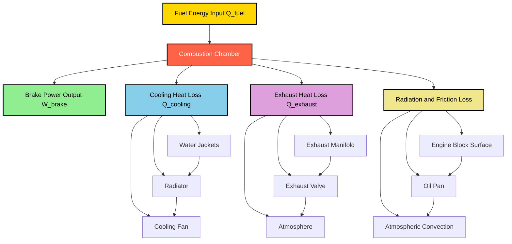
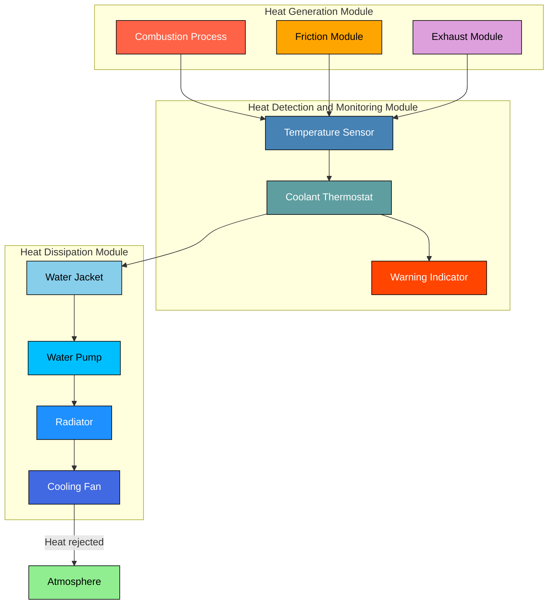

# Need for cooling

<!-- SECTION_1_START -->
# Need for Cooling in Automobile Engines

## 1.1 Formal Academic Definition

**Engine Cooling** is the process of dissipating the excess heat generated inside the combustion chamber and surrounding components of an Internal Combustion (IC) engine to maintain the metal temperatures within safe operational limits, ensuring optimal thermal efficiency, dimensional stability, and longevity of engine parts.

According to the KTU 2024 Scheme Automobile Power Plant syllabus (Module 4), cooling is classified as an **auxiliary system** that handles approximately **25% to 35%** of the total heat liberated from fuel combustion, which would otherwise cause catastrophic thermal failure.

> [!IMPORTANT]
> **KTU Syllabus Highlight:** The study of the *Need for Cooling* forms the foundational basis for understanding subsequent topics such as **Types of Cooling Systems (Air and Water Cooling)**, **Radiators**, **Thermostats**, and **Water Pumps** covered later in Module 4.

## 1.2 Conceptual Analogy & Intuition

Imagine a human body running a marathon. As the muscles burn glucose for energy, the body produces immense heat. To prevent overheating, the body activates a **perspiration (sweating) mechanism**, where sweat evaporates from the skin, carrying away excess heat to maintain a core temperature of around 37°C.

An **IC engine works in an identical fashion**. The fuel-air mixture is the "glucose," the combustion is the "muscle work," and the **cooling system acts as the engine's sweat glands**. Without it, the engine temperature would rise uncontrollably — leading to seizure, melting, or complete mechanical destruction.

| Human Body | IC Engine |
|------------|-----------|
| Glucose (Fuel) | Petrol/Diesel |
| Muscles | Piston-Cylinder Assembly |
| Heat from exertion | Heat from combustion |
| Sweating | Cooling system (air/water) |
| Core temperature 37°C | Optimal ~80–90°C (water), ~120–150°C (air) |

> [!NOTE]
> **Key Insight:** Out of the total heat energy released by burning fuel, only about **25%–35%** is converted into useful mechanical work. The remaining **65%–75%** is waste heat that MUST be removed or expelled — this is the *thermodynamic imperative* that justifies the existence of a cooling system.

## 1.3 Sources of Heat Generation

The IC engine generates heat from multiple sources, both primary and secondary:

### Primary Source
- **Combustion of fuel-air mixture** in the cylinder — the dominant source (≈ **95%** of total heat**).

### Secondary Sources
- **Friction** between moving parts (piston rings, bearings, valve guides).
- **Hot exhaust gases** passing through exhaust ports and manifold.
- **Radiation** from hot combustion chamber walls.

## 1.4 Temperature Distribution in Engine Components

Different engine parts operate at vastly different temperatures based on their proximity to the combustion zone and exposure to hot gases.

> [!VISUALIZATION CONTROL]
> **Concept:** Heat generation and dissipation zones in an IC engine cylinder.
> **GeoGebra / Desmos Input Equations:**
> * `T_combustion(x) = 2500 - 2400 * e^(-2x)` (Combustion temperature decay vs. crank angle)
> * `T_coolant(y) = 90 + 5 * sin(0.1y)` (Coolant temperature fluctuation)
> **Visual Description:** A steep exponential decay curve representing the rapid drop from peak combustion temperature (≈ 2500°C) to cylinder wall temperature (≈ 250°C), and then to coolant temperature (≈ 90°C). The student should observe three distinct thermal zones: combustion core, metal wall, and fluid boundary.

| Engine Component | Approximate Operating Temperature |
|------------------|-----------------------------------|
| Peak Combustion Gas | 2000°C – 2500°C |
| Cylinder Wall (Gas side) | 200°C – 300°C |
| Piston Crown | 250°C – 400°C |
| Cylinder Head | 150°C – 250°C |
| Exhaust Valve | 600°C – 800°C |
| Coolant Outlet | 85°C – 95°C |
| Lubricating Oil | 80°C – 110°C |

<!-- SECTION_1_END -->

<!-- SECTION_2_START -->
# Deep Theoretical Analysis & KTU High-Yield Formula Sheet

## 2.1 Why Does an Engine Need Cooling? — The Engineering Justification

The fundamental reason cooling is mandatory lies in the **Second Law of Thermodynamics** and the **material limits of engine components**. While combustion releases massive thermal energy, only a fraction converts to work, and the rest MUST be removed to:

1. **Maintain Lubrication Film Integrity** — Engine oil degrades rapidly above 150°C, losing viscosity and forming sludge/varnish.
2. **Prevent Thermal Expansion Mismatch** — Different metals expand at different rates; excessive heat causes warping, seizure, and loss of clearances.
3. **Avoid Abnormal Combustion** — Pre-ignition and detonation (knocking) are triggered by overheated spots in the combustion chamber.
4. **Preserve Volumetric Efficiency** — Hot intake air reduces density, lowering the air-fuel charge mass.
5. **Ensure Material Strength** — Aluminum alloys soften above 200°C, and cast iron loses rigidity above 400°C.

## 2.2 Heat Balance of an IC Engine

The **Heat Balance Equation** is the cornerstone of this topic. It accounts for the complete distribution of fuel energy into various outputs and losses.

### Fundamental Heat Balance Equation

$$Q_{fuel} = W_{brake} + Q_{cooling} + Q_{exhaust} + Q_{radiation} + Q_{friction}$$

Where:
- $Q_{fuel}$ = Total heat supplied by fuel combustion (kJ/s or kW)
- $W_{brake}$ = Useful brake power output (kW)
- $Q_{cooling}$ = Heat carried away by cooling system (kJ/s)
- $Q_{exhaust}$ = Heat lost in exhaust gases (kJ/s)
- $Q_{radiation}$ = Heat lost by direct radiation from engine surface (kJ/s)
- $Q_{friction}$ = Heat generated by friction, ultimately absorbed by oil (kJ/s)

### Percentage Distribution (Typical SI Engine)

$$Q_{fuel} = 100\%$$

| Heat Output/Loss | Typical % of Fuel Energy | Range |
|------------------|--------------------------|-------|
| Brake Power ($W_{brake}$) | **30%** | 25% – 35% |
| Cooling Loss ($Q_{cooling}$) | **28%** | 25% – 35% |
| Exhaust Loss ($Q_{exhaust}$) | **35%** | 30% – 40% |
| Radiation + Friction Loss | **7%** | 5% – 10% |

> [!IMPORTANT]
> **KTU Board Tip:** Always remember that $Q_{cooling}$ and $Q_{exhaust}$ together account for nearly **60%–70%** of total fuel energy — this is why modern engines employ both **cooling systems** AND **turbocharging/heat recovery** to harness waste heat.

## 2.3 Detailed Analysis of Heat Dissipation Mechanisms

### 2.3.1 Heat Lost to Cooling System ($Q_{cooling}$)

Heat is transferred from combustion gases to coolant through **three modes of heat transfer**:

$$\dot{Q}_{cooling} = h_c \cdot A_s \cdot (T_{gas} - T_{wall})$$

Where:
- $h_c$ = Convective heat transfer coefficient (W/m²K) ≈ **100–300 W/m²K** for engine cylinders
- $A_s$ = Effective heat transfer surface area (m²)
- $T_{gas}$ = Average gas temperature (K)
- $T_{wall}$ = Coolant-side wall temperature (K)

The heat absorbed by the coolant is given by:

$$Q_{cooling} = m_c \cdot C_{p,c} \cdot (T_{out} - T_{in})$$

Where:
- $m_c$ = Mass flow rate of coolant (kg/s)
- $C_{p,c}$ = Specific heat of coolant (kJ/kg·K) — for water ≈ **4.18 kJ/kg·K**
- $T_{out}$ = Coolant outlet temperature (°C)
- $T_{in}$ = Coolant inlet temperature (°C)

### 2.3.2 Heat Lost in Exhaust ($Q_{exhaust}$)

$$Q_{exhaust} = m_{exh} \cdot C_{p,exh} \cdot (T_{exh} - T_{amb})$$

Typical exhaust gas temperature ranges from **400°C to 700°C**, depending on load.

## 2.4 Effects of OVERHEATING (Excessive Heat)

| Consequence | Technical Explanation |
|-------------|----------------------|
| **Lubrication failure** | Oil film breaks down above 150°C, causing metal-to-metal contact. |
| **Pre-ignition** | Hot carbon deposits ignite the charge before spark timing. |
| **Detonation (Knocking)** | Uncontrolled auto-ignition of end gases causes shock waves. |
| **Loss of volumetric efficiency** | Hot intake air becomes less dense, reducing air mass. |
| **Piston seizure** | Thermal expansion exceeds clearance, causing jamming. |
| **Cylinder warping** | Non-uniform heating distorts the cylinder bore. |
| **Reduced power output** | Lower density charge + friction losses = reduced efficiency. |
| **Valve burning** | Overhead valves reach >800°C, losing temper and sealing ability. |
| **Crankcase oil sludging** | Oil oxidation forms hard deposits, blocking oil passages. |

## 2.5 Effects of OVERCOOLING (Excessive Cooling)

> [!WARNING]
> **Common Student Misconception:** Many students assume that *more cooling is better*. This is WRONG. Overcooling is equally damaging to engine performance.

| Consequence | Technical Explanation |
|-------------|----------------------|
| **Increased oil viscosity** | Cold oil flows poorly, increasing friction and reducing lubrication. |
| **Incomplete combustion** | Cold cylinder walls quench the flame, raising HC emissions. |
| **Higher fuel consumption** | Poor atomization + incomplete combustion reduces thermal efficiency. |
| **Carbon deposits** | Incompletely burnt fuel forms carbon on piston crown and valves. |
| **Loss of power** | Increased friction + poor combustion reduces brake power. |
| **Acid corrosion** | Combustion by-products (SO₃) combine with water vapor to form sulfuric acid, which attacks cylinder walls when engine is cold. |
| **White smoke emissions** | Unburnt fuel and water vapor visible at exhaust. |

## 2.6 KTU High-Yield Formula Sheet (Cheat Sheet)

| # | Formula / Concept | Expression | Unit / Notes |
|---|-------------------|------------|--------------|
| 1 | Heat Balance Equation | $Q_f = W_b + Q_c + Q_e + Q_r + Q_f$ | All terms in kJ/s or kW |
| 2 | Cooling Heat Absorbed | $Q_c = m_c \cdot C_{p,c} \cdot \Delta T$ | kJ/s; $m_c$ in kg/s |
| 3 | Heat Transfer Rate | $\dot{Q} = h_c \cdot A_s \cdot \Delta T$ | W (Watts) |
| 4 | Newton's Law of Cooling | $\dot{Q} = hA(T_s - T_\infty)$ | Convective form |
| 5 | Engine Heat Loss % | $Q_c / Q_f \times 100$ | Typically 25%–35% |
| 6 | Specific Heat of Water | $C_{p,water} = 4.18$ | kJ/kg·K |
| 7 | Specific Heat of Air | $C_{p,air} = 1.005$ | kJ/kg·K |
| 8 | Brake Thermal Efficiency | $\eta_{bth} = W_b / Q_f \times 100$ | Dimensionless (%) |
| 9 | Cooling Efficiency | $\eta_{cool} = (T_{out} - T_{in}) / (T_{wall} - T_{in})$ | Dimensionless |
| 10 | Optimum Coolant Temp (Water) | 80°C – 90°C | For SI engines |
| 11 | Optimum Coolant Temp (Air) | 120°C – 150°C | For air-cooled engines |

## 2.7 Real-World Engineering Applications

1. **Modern Passenger Cars:** Use pressurized water-cooling systems (1.0–1.5 bar) to raise boiling point above 110°C, allowing smaller radiators.
2. **Racing Motorcycles:** Use air-cooling with fins to minimize weight and eliminate radiator failure risk.
3. **Heavy-Duty Trucks (Diesel):** Use dual cooling circuits — one for engine, one for charge air (intercooler).
4. **Hybrid Vehicles:** Use sophisticated thermal management with electric water pumps that operate only on demand, improving fuel economy by **3%–5%**.
5. **EV Battery Cooling:** Although EVs lack combustion engines, the same heat-transfer principles are used to cool lithium-ion battery packs.

<!-- SECTION_2_END -->

<!-- SECTION_3_START -->
# Step-by-Step Derivations & Numerical Implementation

## 3.1 Derivative Approach 1: Percentage Heat Distribution

A 4-cylinder, 4-stroke SI engine consumes **10 kg of fuel per hour**. The calorific value of fuel is **44,000 kJ/kg**. The brake power output is **35 kW**, exhaust gas carries **30%** of total heat, and the radiation + friction loss is **5%** of total heat. **Calculate the heat lost to the cooling system in kW and as a percentage.**

### Step 1: Calculate Total Heat Supplied by Fuel per Hour

The total heat input rate is calculated from the fuel consumption rate and the calorific value of the fuel.

$$Q_{fuel} = m_f \times CV$$

Where:
- $m_f$ = mass flow rate of fuel
- $CV$ = calorific value of fuel

Substituting the given values:

$$Q_{fuel} = 10 \text{ kg/hr} \times 44{,}000 \text{ kJ/kg}$$

$$Q_{fuel} = 440{,}000 \text{ kJ/hr}$$

### Step 2: Convert Total Heat to kW (Power Equivalent)

To express the heat energy as a power rate in kilowatts, divide by the number of seconds in one hour.

$$Q_{fuel} = \frac{440{,}000}{3600} \text{ kJ/s}$$

$$Q_{fuel} = 122.22 \text{ kW}$$

> **[Stating correct total heat input with units: 2 Marks]**

### Step 3: Calculate Heat Lost in Exhaust

The exhaust heat loss is given as a percentage of the total heat input from the fuel.

$$Q_{exhaust} = 0.30 \times Q_{fuel}$$

$$Q_{exhaust} = 0.30 \times 122.22 \text{ kW}$$

$$Q_{exhaust} = 36.67 \text{ kW}$$

### Step 4: Calculate Heat Lost in Radiation and Friction

The combined radiation and friction loss is given as a percentage of the total heat input.

$$Q_{radiation+friction} = 0.05 \times Q_{fuel}$$

$$Q_{radiation+friction} = 0.05 \times 122.22 \text{ kW}$$

$$Q_{radiation+friction} = 6.11 \text{ kW}$$

### Step 5: Apply the Heat Balance Equation to Find Cooling Loss

Using the fundamental heat balance equation of the engine, the sum of all heat outputs must equal the total heat input from the fuel.

$$Q_{fuel} = W_{brake} + Q_{cooling} + Q_{exhaust} + Q_{radiation+friction}$$

Rearranging to solve for the cooling heat loss:

$$Q_{cooling} = Q_{fuel} - W_{brake} - Q_{exhaust} - Q_{radiation+friction}$$

### Step 6: Substitute the Numerical Values

Now substitute all the previously calculated values into the rearranged equation.

$$Q_{cooling} = 122.22 - 35 - 36.67 - 6.11$$

$$Q_{cooling} = 44.44 \text{ kW}$$

### Step 7: Express the Cooling Loss as a Percentage

Convert the absolute cooling heat loss value into a percentage of the total fuel energy supplied.

$$\% Q_{cooling} = \frac{Q_{cooling}}{Q_{fuel}} \times 100$$

$$\% Q_{cooling} = \frac{44.44}{122.22} \times 100$$

$$\% Q_{cooling} = 36.36\%$$

### Final Answer

| Parameter | Value |
|-----------|-------|
| Heat lost to cooling ($Q_{cooling}$) | **44.44 kW** |
| Percentage cooling loss | **36.36%** |

> **[Final simplified numerical result with units: 2 Marks]**

---

## 3.2 Derivative Approach 2: Coolant Mass Flow Rate Calculation

A water-cooled engine dissipates **30 kW** of heat to the coolant. The coolant enters the radiator at **75°C** and leaves at **95°C**. **Calculate the required mass flow rate of water in kg/min.** Given: $C_{p,water} = 4.18$ kJ/kg·K.

### Step 1: Identify the Governing Heat Transfer Equation

The heat absorbed by the coolant is governed by the sensible heat equation for a flowing fluid.

$$Q_{cooling} = m_c \cdot C_{p,c} \cdot (T_{out} - T_{in})$$

### Step 2: Rearrange for Mass Flow Rate

Rearranging the equation to solve for the mass flow rate of the coolant.

$$m_c = \frac{Q_{cooling}}{C_{p,c} \cdot (T_{out} - T_{in})}$$

### Step 3: Substitute Numerical Values

Insert the given numerical values into the rearranged equation.

$$m_c = \frac{30 \text{ kW}}{4.18 \text{ kJ/kg·K} \times (95 - 75) \text{ K}}$$

$$m_c = \frac{30}{4.18 \times 20}$$

$$m_c = \frac{30}{83.6}$$

$$m_c = 0.3589 \text{ kg/s}$$

### Step 4: Convert to kg/min

Multiply the result by 60 to convert the mass flow rate from kg/s into kg/min.

$$m_c = 0.3589 \times 60$$

$$m_c = 21.53 \text{ kg/min}$$

### Final Answer

The required coolant mass flow rate is **$m_c = 21.53$ kg/min**.

> **[Stating correct governing equation: 1 Mark]** | **[Correct substitution and unit consistency: 2 Marks]** | **[Final numerical answer: 1 Mark]**

---

## 3.3 Derivative Approach 3: Surface Heat Transfer Analysis

A cylinder wall of an engine has a **gas-side temperature of 1800 K** and a **coolant-side temperature of 360 K**. The convective heat transfer coefficient on the gas side is **250 W/m²K** and the heat transfer area is **0.05 m²**. **Calculate the rate of heat transfer to the coolant.**

### Step 1: Identify the Convective Heat Transfer Equation

The convective heat transfer rate from the combustion gas to the cylinder wall follows Newton's law of cooling.

$$\dot{Q} = h_c \cdot A_s \cdot (T_{gas} - T_{wall})$$

### Step 2: Substitute the Values into the Equation

Insert the given values for heat transfer coefficient, area, and temperature difference.

$$\dot{Q} = 250 \text{ W/m²K} \times 0.05 \text{ m²} \times (1800 - 360) \text{ K}$$

### Step 3: Calculate the Temperature Difference

Compute the difference between the gas-side temperature and the coolant-side wall temperature.

$$\Delta T = 1800 - 360 = 1440 \text{ K}$$

### Step 4: Final Calculation

Multiply all the components together to find the rate of heat transfer.

$$\dot{Q} = 250 \times 0.05 \times 1440$$

$$\dot{Q} = 18{,}000 \text{ W} = 18 \text{ kW}$$

### Final Answer

The rate of heat transfer from the cylinder gas to the coolant is **$\dot{Q} = 18$ kW**.

---

## 3.4 Python Implementation: Heat Balance Calculator

The following Python code provides a fully operational **Heat Balance Calculator** with absolute boundary checks, type hints, and error logging.

```python
from dataclasses import dataclass
from typing import Optional
import logging

# Configure logging for error tracking
logging.basicConfig(level=logging.INFO, format='%(asctime)s - %(levelname)s - %(message)s')
logger = logging.getLogger(__name__)


@dataclass
class EngineHeatBalance:
    """
    A class to calculate the heat balance distribution of an Internal Combustion engine.
    
    Attributes:
        fuel_consumption_kgph (float): Fuel consumption in kg/hour
        calorific_value_kj_kg (float): Calorific value of fuel in kJ/kg
        brake_power_kw (float): Brake power output in kW
        exhaust_loss_percent (float): Exhaust heat loss as percentage
        radiation_friction_percent (float): Radiation and friction loss as percentage
    """
    fuel_consumption_kgph: float
    calorific_value_kj_kg: float
    brake_power_kw: float
    exhaust_loss_percent: float
    radiation_friction_percent: float

    def __post_init__(self) -> None:
        """Validate all inputs to ensure physical and logical boundaries."""
        if self.fuel_consumption_kgph <= 0:
            raise ValueError("Fuel consumption must be a positive value (kg/hr).")
        if self.calorific_value_kj_kg <= 0:
            raise ValueError("Calorific value must be a positive value (kJ/kg).")
        if self.brake_power_kw < 0:
            raise ValueError("Brake power cannot be negative.")
        if not 0 <= self.exhaust_loss_percent <= 100:
            raise ValueError("Exhaust loss percentage must be between 0 and 100.")
        if not 0 <= self.radiation_friction_percent <= 100:
            raise ValueError("Radiation/friction loss percentage must be between 0 and 100.")
        if (self.exhaust_loss_percent + self.radiation_friction_percent) > 100:
            raise ValueError("Sum of loss percentages cannot exceed 100%.")

    def calculate_total_heat_input_kw(self) -> float:
        """Calculate total heat input from fuel in kW."""
        try:
            heat_input_kj_hr = self.fuel_consumption_kgph * self.calorific_value_kj_kg
            heat_input_kw = heat_input_kj_hr / 3600.0
            logger.info(f"Total heat input computed: {heat_input_kw:.2f} kW")
            return heat_input_kw
        except Exception as e:
            logger.error(f"Error computing total heat input: {e}")
            raise

    def calculate_heat_balance(self) -> dict:
        """
        Calculate the full heat balance and return results as a dictionary.
        
        Returns:
            dict: Contains total heat input, exhaust loss, radiation loss, 
                  cooling loss (kW and percentage).
        """
        try:
            total_heat = self.calculate_total_heat_input_kw()
            
            exhaust_loss_kw = total_heat * (self.exhaust_loss_percent / 100.0)
            radiation_friction_kw = total_heat * (self.radiation_friction_percent / 100.0)
            
            # Heat balance: Q_fuel = W_brake + Q_cool + Q_exh + Q_rad
            cooling_loss_kw = (
                total_heat 
                - self.brake_power_kw 
                - exhaust_loss_kw 
                - radiation_friction_kw
            )
            
            if cooling_loss_kw < 0:
                logger.warning("Computed cooling loss is negative; check input values.")
            
            cooling_loss_percent = (cooling_loss_kw / total_heat) * 100.0
            
            results = {
                "Total_Heat_Input_kW": round(total_heat, 2),
                "Brake_Power_kW": round(self.brake_power_kw, 2),
                "Exhaust_Loss_kW": round(exhaust_loss_kw, 2),
                "Exhaust_Loss_percent": round(self.exhaust_loss_percent, 2),
                "Radiation_Friction_kW": round(radiation_friction_kw, 2),
                "Radiation_Friction_percent": round(self.radiation_friction_percent, 2),
                "Cooling_Loss_kW": round(cooling_loss_kw, 2),
                "Cooling_Loss_percent": round(cooling_loss_percent, 2)
            }
            
            return results
        
        except Exception as e:
            logger.error(f"Error in heat balance calculation: {e}")
            raise


def print_heat_balance_report(results: dict) -> None:
    """Pretty-print the heat balance report in tabular format."""
    print("\n" + "=" * 50)
    print("       IC ENGINE HEAT BALANCE REPORT")
    print("=" * 50)
    for key, value in results.items():
        print(f"  {key:30s} : {value:>10}")
    print("=" * 50 + "\n")


# Example usage
if __name__ == "__main__":
    engine = EngineHeatBalance(
        fuel_consumption_kgph=10.0,
        calorific_value_kj_kg=44000.0,
        brake_power_kw=35.0,
        exhaust_loss_percent=30.0,
        radiation_friction_percent=5.0
    )
    results = engine.calculate_heat_balance()
    print_heat_balance_report(results)
```

**Sample Output:**
```
==================================================
       IC ENGINE HEAT BALANCE REPORT
==================================================
  Total_Heat_Input_kW             :     122.22
  Brake_Power_kW                  :         35
  Exhaust_Loss_kW                 :      36.67
  Exhaust_Loss_percent            :         30
  Radiation_Friction_kW           :       6.11
  Radiation_Friction_percent      :          5
  Cooling_Loss_kW                 :      44.44
  Cooling_Loss_percent            :      36.36
==================================================
```

<!-- SECTION_3_END -->

<!-- SECTION_4_START -->
# Structural Diagrams & Schematics

## 4.1 Heat Generation & Dissipation Flow Architecture

The following Mermaid flowchart illustrates the complete journey of fuel energy in an IC engine, from combustion to final dissipation pathways.



## 4.2 Decision Matrix: Overheating vs Overcooling Effects

The following diagram maps the dual consequences of improper cooling — both inadequate and excessive.

```mermaid
graph TD
    Root[Improper Cooling Conditions] --> Overheat[Overheating]
    Root --> Overcool[Overcooling]
    
    Overheat --> OH1[Lubrication Failure]
    Overheat --> OH2[Pre-ignition]
    Overheat --> OH3[Detonation]
    Overheat --> OH4[Piston Seizure]
    Overheat --> OH5[Loss of Volumetric Efficiency]
    Overheat --> OH6[Valve Burning]
    
    Overcool --> OC1[Increased Oil Viscosity]
    Overcool --> OC2[Incomplete Combustion]
    Overcool --> OC3[Higher Fuel Consumption]
    Overcool --> OC4[Carbon Deposits]
    Overcool --> OC5[Acid Corrosion]
    Overcool --> OC6[Power Loss]
    
    style Root fill:#FF4500,stroke:#000000,stroke-width:3px,color:#FFFFFF
    style Overheat fill:#FF8C00,stroke:#000000,stroke-width:2px,color:#FFFFFF
    style Overcool fill:#4682B4,stroke:#000000,stroke-width:2px,color:#FFFFFF
    style OH1 fill:#FFB6C1,stroke:#000000,color:#000000
    style OH2 fill:#FFB6C1,stroke:#000000,color:#000000
    style OH3 fill:#FFB6C1,stroke:#000000,color:#000000
    style OH4 fill:#FFB6C1,stroke:#000000,color:#000000
    style OH5 fill:#FFB6C1,stroke:#000000,color:#000000
    style OH6 fill:#FFB6C1,stroke:#000000,color:#000000
    style OC1 fill:#B0E0E6,stroke:#000000,color:#000000
    style OC2 fill:#B0E0E6,stroke:#000000,color:#000000
    style OC3 fill:#B0E0E6,stroke:#000000,color:#000000
    style OC4 fill:#B0E0E6,stroke:#000000,color:#000000
    style OC5 fill:#B0E0E6,stroke:#000000,color:#000000
    style OC6 fill:#B0E0E6,stroke:#000000,color:#000000
```



## 4.3 Temperature Zone Topology in IC Engine

The following sequential topology matrix represents the thermal zones from combustion to ambient air.


## 4.4 Modular Block Architecture: Cooling Requirement System

The following block-level functional architecture shows how the cooling need is generated and addressed by subsystems.



<!-- SECTION_4_END -->

<!-- SECTION_5_START -->
# KTU 2024 Scheme Examination Question Bank & Topic Recap

---

## PART A — Short Answer Questions (3 Marks Each)

### Question 1 `[KTU University Exam - Dec 2023]`
**(CO1, Remember)**
**List any four effects of overcooling an IC engine.**

**Model Answer:**

Overcooling an IC engine causes the following adverse effects:

1. **Increased oil viscosity** leading to higher friction and poor lubrication.
2. **Incomplete combustion** due to quenching of the flame by cold cylinder walls.
3. **Higher fuel consumption** caused by poor atomization of the fuel-air mixture.
4. **Acid corrosion** — cold cylinder walls cause condensation of combustion by-products forming sulfuric acid.
5. **Carbon deposits** on piston crown and valves due to unburnt fuel.
6. **Loss of power output** due to combined friction and combustion inefficiencies.

> **[Stating any four effects: 3 Marks]**

---

### Question 2 `[KTU University Exam - July 2024]`
**(CO1, Remember)**
**Define the term Heat Balance of an IC engine.**

**Model Answer:**

The **Heat Balance of an IC engine** is a quantitative statement of the distribution of total heat energy released by fuel combustion into various useful and wasteful outputs. It is expressed by the equation:

$$Q_{fuel} = W_{brake} + Q_{cooling} + Q_{exhaust} + Q_{radiation} + Q_{friction}$$

It is typically presented as percentages of the total fuel energy, allowing engineers to evaluate engine efficiency, identify major sources of heat loss, and design effective cooling systems.

> **[Stating definition with equation: 2 Marks]** | **[Mentioning percentage form: 1 Mark]**

---

## PART B — Long Answer Questions (14 Marks Each — Module Internal Choice)

### Question A `[KTU University Exam - Dec 2023]`
**(CO1, CO2, Understand + Apply)**

**(a)** Explain the **need for cooling** in an IC engine with reference to combustion temperatures and material limits. (7 Marks)

**(b)** An engine consumes **8 kg/hr** of fuel with a calorific value of **42,000 kJ/kg**. The brake power output is **30 kW**. If the exhaust loss is **32%** and radiation/friction loss is **6%** of total heat, determine: (i) Total heat supplied, (ii) Heat lost to cooling system in kW, (iii) Percentage cooling loss. (7 Marks)

---

### Model Answer for Question A (a) — Need for Cooling Explanation

The IC engine converts chemical energy of fuel into mechanical work. However, the efficiency of this conversion is limited (≈ **30%–35%**), and a large fraction of the fuel energy is released as heat. The **peak combustion temperature** in the cylinder can reach **2000°C to 2500°C**, which is far beyond the thermal tolerance of engine materials:

- **Aluminum pistons** soften above **200°C**.
- **Cast iron cylinder blocks** lose rigidity above **400°C**.
- **Lubricating oil** degrades rapidly above **150°C**.
- **Valve seats and piston rings** lose their temper and sealing ability.

If this heat is **not removed continuously**, the engine will suffer from:

- **Pre-ignition and detonation** caused by overheated carbon deposits.
- **Lubrication failure** due to oil breakdown.
- **Piston seizure** from thermal expansion exceeding clearances.
- **Loss of volumetric efficiency** from hot intake air.
- **Valve burning** and warping of combustion chamber components.

Thus, a **cooling system is mandatory** to maintain cylinder wall temperatures between **150°C to 200°C** and coolant temperatures around **80°C to 90°C** for water-cooled engines.

> **[Stating peak combustion temperature and material limits: 2 Marks]**
> **[Listing effects of overheating: 3 Marks]**
> **[Concluding with safe operating temperature range: 2 Marks]**

---

### Model Answer for Question A (b) — Heat Balance Numerical

#### Given Data
- Fuel consumption: $m_f = 8$ kg/hr
- Calorific value: $CV = 42{,}000$ kJ/kg
- Brake power: $W_{brake} = 30$ kW
- Exhaust loss: 32% of total heat
- Radiation/friction loss: 6% of total heat

#### Step 1: Calculate Total Heat Input per Hour

$$Q_{fuel} = m_f \times CV$$

$$Q_{fuel} = 8 \times 42{,}000 = 336{,}000 \text{ kJ/hr}$$

#### Step 2: Convert to kW

$$Q_{fuel} = \frac{336{,}000}{3600} = 93.33 \text{ kW}$$

> **[Stating total heat input: 1 Mark]**

#### Step 3: Calculate Exhaust and Radiation Losses

$$Q_{exhaust} = 0.32 \times 93.33 = 29.87 \text{ kW}$$

$$Q_{rad+fric} = 0.06 \times 93.33 = 5.60 \text{ kW}$$

> **[Calculating percentage losses: 1 Mark]**

#### Step 4: Apply Heat Balance Equation

$$Q_{cooling} = Q_{fuel} - W_{brake} - Q_{exhaust} - Q_{rad+fric}$$

$$Q_{cooling} = 93.33 - 30 - 29.87 - 5.60$$

$$Q_{cooling} = 27.86 \text{ kW}$$

> **[Applying heat balance correctly: 2 Marks]**

#### Step 5: Calculate Percentage Cooling Loss

$$\% Q_{cooling} = \frac{27.86}{93.33} \times 100 = 29.86\%$$

> **[Final percentage result: 1 Mark]**

#### Final Tabulated Answer

| Parameter | Value |
|-----------|-------|
| Total heat input | **93.33 kW** |
| Heat lost to cooling | **27.86 kW** |
| Percentage cooling loss | **29.86%** |

---

### Question B `[KTU University Exam - July 2024]`
**(CO1, CO2, Understand + Apply)**
**(ALTERNATIVE — Module Internal Choice)**

**(a)** With the help of a heat balance equation, explain the **typical distribution of heat** in a 4-stroke SI engine. State the approximate percentages of each component. (7 Marks)

**(b)** A water-cooled engine dissipates **25 kW** of heat. The water enters the engine at **70°C** and leaves at **90°C**. Determine the **mass flow rate of water** required in kg/min. Take $C_{p,water} = 4.18$ kJ/kg·K. (7 Marks)

---

### Model Answer for Question B (a) — Heat Balance Distribution

The **Heat Balance of an IC engine** is governed by the **First Law of Thermodynamics**, which states that energy can neither be created nor destroyed — only converted. For a 4-stroke SI engine, the heat supplied by the fuel is distributed as follows:

$$Q_{fuel} = W_{brake} + Q_{cooling} + Q_{exhaust} + Q_{radiation} + Q_{friction}$$

#### Typical Percentage Distribution (4-Stroke SI Engine at Full Load)

| Heat Component | Percentage | Range |
|----------------|------------|-------|
| Brake Power Output ($W_{brake}$) | **30%** | 25% – 35% |
| Exhaust Heat Loss ($Q_{exhaust}$) | **35%** | 30% – 40% |
| Cooling Heat Loss ($Q_{cooling}$) | **28%** | 25% – 35% |
| Radiation and Friction Loss | **7%** | 5% – 10% |

#### Explanation of Each Component

- **Brake Power:** Useful mechanical work at the output shaft, representing the conversion efficiency.
- **Exhaust Loss:** Heat carried away by hot exhaust gases (≈ **400°C to 700°C**).
- **Cooling Loss:** Heat absorbed by the cooling medium (water/air) through the cylinder walls.
- **Radiation and Friction:** Heat lost by surface radiation and absorbed by lubricating oil due to friction.

> **[Stating heat balance equation: 2 Marks]**
> **[Tabulated percentage distribution: 3 Marks]**
> **[Brief explanation of each term: 2 Marks]**

---

### Model Answer for Question B (b) — Coolant Mass Flow Rate

#### Given Data
- Heat dissipated: $Q_{cooling} = 25$ kW
- Water inlet temperature: $T_{in} = 70$°C
- Water outlet temperature: $T_{out} = 90$°C
- Specific heat of water: $C_{p,c} = 4.18$ kJ/kg·K

#### Step 1: Write the Sensible Heat Equation

$$Q_{cooling} = m_c \cdot C_{p,c} \cdot (T_{out} - T_{in})$$

#### Step 2: Rearrange for Mass Flow Rate

$$m_c = \frac{Q_{cooling}}{C_{p,c} \cdot (T_{out} - T_{in})}$$

#### Step 3: Substitute Values

$$m_c = \frac{25}{4.18 \times (90 - 70)}$$

$$m_c = \frac{25}{4.18 \times 20}$$

$$m_c = \frac{25}{83.6}$$

$$m_c = 0.299 \text{ kg/s}$$

#### Step 4: Convert to kg/min

$$m_c = 0.299 \times 60 = 17.94 \text{ kg/min}$$

> **[Stating correct governing equation: 1 Mark]**
> **[Correct substitution: 1 Mark]**
> **[Calculation in kg/s: 1 Mark]**
> **[Conversion and final answer: 1 Mark]**
> **[Units and significant figures: 1 Mark]**

#### Final Answer

The required mass flow rate of cooling water is **$m_c = 17.94$ kg/min**.

---

> [!WARNING]
> **KTU Examiner's Valuation Warning — Common Pitfalls:**
> 
> 1. **Unit Mismatch in Heat Calculations:** Students often forget to convert **kJ/hr to kW** (divide by 3600). Always show this step explicitly. **[Loses 1–2 marks]**
> 2. **Wrong Heat Balance Equation:** Some students omit the radiation and friction term, leading to incorrect cooling loss. Always include ALL terms. **[Loses 2–3 marks]**
> 3. **Confusing Cooling Heat and Exhaust Heat:** Cooling heat goes to the coolant; exhaust heat goes to gases. Do not interchange them. **[Loses 2 marks]**
> 4. **Forgetting to State the Equation Before Substitution:** In Part B questions, always write the formula first, THEN substitute. **[Loses 1 mark]**
> 5. **Overcooling vs. Overheating Confusion:** In definition questions, students often only mention overheating effects and forget that **overcooling is equally harmful**. **[Loses 1–2 marks]**
> 6. **Missing Boundary States:** Always specify the inlet/outlet temperatures or the fuel consumption rate as **Given Data** before solving.

---

## Topic Recap & Important Things to Remember

- **Need for Cooling:** IC engines require cooling because only **25%–35%** of fuel energy is converted to work; the remaining heat must be dissipated to prevent material failure.
- **Peak Combustion Temperature:** 2000°C – 2500°C inside the cylinder, while aluminum pistons soften at 200°C and oil degrades at 150°C.
- **Heat Balance Equation:** $Q_{fuel} = W_{brake} + Q_{cooling} + Q_{exhaust} + Q_{radiation} + Q_{friction}$ — remember all five terms.
- **Typical Heat Distribution:** Work (30%) + Exhaust (35%) + Cooling (28%) + Radiation/Friction (7%) = 100%.
- **Cooling Heat Formula:** $Q_c = m_c \cdot C_{p,c} \cdot \Delta T$ — used to find coolant flow rate.
- **Convective Heat Transfer:** $\dot{Q} = h_c \cdot A_s \cdot (T_{gas} - T_{wall})$.
- **Specific Heat Values:** Water = 4.18 kJ/kg·K; Air = 1.005 kJ/kg·K.
- **Optimal Coolant Temperature (Water):** 80°C – 90°C; (Air-cooled): 120°C – 150°C.
- **Overheating Effects:** Lubrication failure, pre-ignition, detonation, piston seizure, valve burning, loss of volumetric efficiency.
- **Overcooling Effects:** Increased oil viscosity, incomplete combustion, acid corrosion, carbon deposits, higher fuel consumption, power loss.
- **Unit Conversion:** 1 kW = 1 kJ/s; 1 hour = 3600 seconds. Always convert fuel consumption rate to kg/s before calculations.
- **Real-World Insight:** Modern cars use **pressurized cooling systems (1.0–1.5 bar)** to raise water boiling point above 110°C, allowing compact radiators and improved heat transfer.
- **Engineering Rule of Thumb:** Approximately **30% of fuel energy is wasted as cooling heat** — this is why modern engines employ advanced thermal management (electric water pumps, variable-speed fans) to improve overall thermal efficiency.
- **KTU 2024 Scheme Tip:** Always link cooling requirement to **material temperature limits** and **lubrication degradation thresholds** in your answers — this shows conceptual depth and fetches higher marks.

<!-- SECTION_5_END -->
