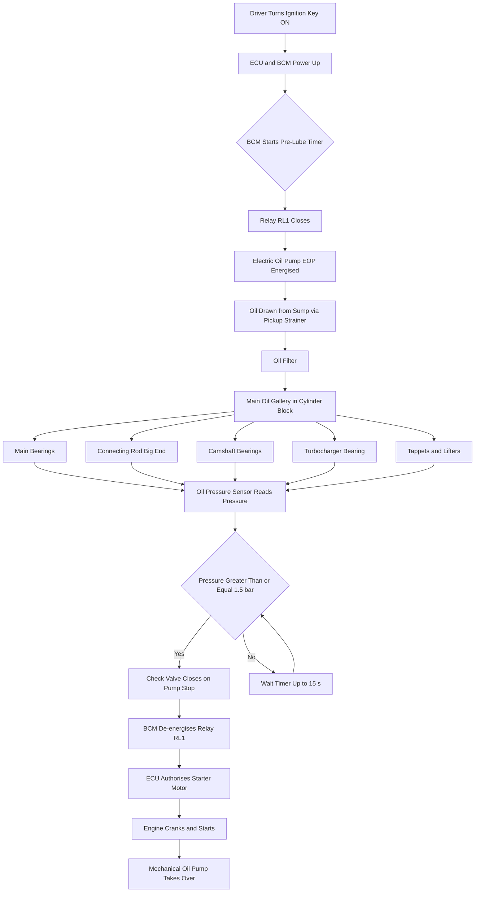
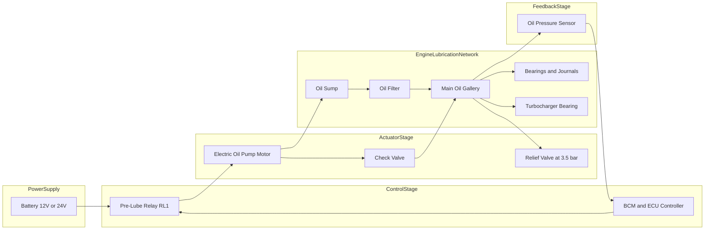

# Pre-lubrication systems.

<!-- SECTION_1_START -->
# Pre-Lubrication Systems in Automobiles

## 1. Core Technical Definition

**Pre-lubrication System (Pre-Lube System):** An auxiliary lubrication arrangement provided in modern internal combustion (IC) engines that pumps lubricating oil from the engine oil sump to all critical bearing surfaces, journals, turbocharger bearings, and rotating components *before* the engine is cranked and started. The objective is to establish a continuous, pressurized hydrodynamic oil film on every load-bearing surface so that dry or boundary contact during the first few revolutions of cranking is eliminated.

> [!IMPORTANT]
> **KTU 2024 Syllabus Definition (PCAUT205 / Module 4):**
> *Pre-lubrication is a cold-start protection strategy in which an electrically driven auxiliary oil pump circulates engine oil through the main lubrication circuit while the crankshaft is stationary, so that bearing clearances are flooded and pressurised prior to ignition.*

### Conceptual Analogy / Intuition

Imagine waking up after 8 hours of sleep and immediately sprinting at full speed without stretching — your joints would "crack" and cartilage would grind. Similarly, after an engine has been parked for hours (or days), **all the oil has drained from the bearing clearances back into the sump**. If the starter motor now spins the crankshaft directly, metal-to-metal contact occurs for the first 2–4 seconds. A *pre-lubrication system* is the engineering equivalent of a slow, gentle "warm-up stretch" — it walks the oil through every gallery *before* the engine actually fires.

| Parameter | Typical Value |
|---|---|
| Pre-lube oil pressure | **1.5 – 3.5 bar** |
| Pre-lube duration | **5 – 15 seconds** |
| Pre-lube pump flow rate | **4 – 10 L/min** |
| Engine oil viscosity target | **SAE 5W-30 / 5W-40** |
| Trigger | Ignition key in "ON" position |

> [!NOTE]
> **Why it matters:** Approximately **70–80 % of engine wear** is statistically reported to occur during the *first few seconds* of a cold start. Pre-lubrication directly attacks this wear window.

> [!VISUALIZATION CONTROL]
> **Concept:** Oil pressure build-up vs. cranking time (Pre-lubrication effect)
> **Graph Equations (Desmos input):**
> * `p_pre(t) = 3 * (1 - e^(-1.2*t))`  → Pre-lubrication pressure curve (rises *before* t = 0)
> * `p_cold(t) = 2.5 * (1 - e^(-0.4*(t-0)))`  → Normal cold-start curve (rises *after* t = 0)
> **Visual Description:** On the x-axis place *time (seconds)* and on the y-axis place *oil pressure (bar)*. Mark t = 0 as the moment the starter motor engages. The pre-lube curve will already be at ~3 bar at t = 0, while the cold-start-only curve will still be at 0 bar, climbing slowly. The shaded gap between them represents the *protected wear interval*.

---

<!-- SECTION_2_START -->
# 2. Deep Theoretical Analysis & KTU High-Yield Formula Sheet

## 2.1 Why Pre-Lubrication Is Needed (The Tribology Behind It)

In hydrodynamic lubrication, the load-carrying capacity of an oil film is governed by the **Reynolds Equation** simplified for a journal bearing:

$$
h_{min} = C \cdot \left(1 - \frac{W}{2 \cdot \pi \cdot r \cdot L \cdot \eta \cdot \omega} \cdot \frac{C}{r}\right)
$$

Where:
- $h_{min}$ = minimum oil-film thickness (m)
- $C$ = radial clearance (m)
- $W$ = applied load (N)
- $r$ = journal radius (m)
- $L$ = bearing length (m)
- $\eta$ = dynamic oil viscosity (Pa·s)
- $\omega$ = angular velocity (rad/s)

**Critical observation:** As $\omega \rightarrow 0$ (crankshaft stationary), $h_{min} \rightarrow 0$. This is the **boundary-lubrication regime** — exactly the regime we wish to avoid at start-up. Pre-lubrication establishes $h_{min}$ *statically* (no rotation needed) by simply flooding the clearance with oil at low pressure, transitioning the bearing to a **fully flooded / hydrostatic state** before rotation begins.

> [!TIP]
> **Stribeck Curve Connection:** Pre-lubrication shifts the operating point from the *boundary-mixed* region to the *hydrodynamic* region of the Stribeck curve *before* the first revolution.

## 2.2 Components of a Pre-Lubrication System

A standard pre-lube circuit consists of the following parts:

1. **Electric Pre-Lube Pump (EOP – Electric Oil Pump)** — DC motor-driven gear/vane pump, typically **12 V / 24 V**.
2. **Check Valve (Non-Return Valve)** — Prevents oil from draining back into the sump once the pump stops.
3. **Oil Pressure Sensor / Switch** — Sends feedback to the ECU to confirm successful pre-lube.
4. **ECU / Body Control Module (BCM)** — Times the pump operation (5–15 s) on ignition-ON.
5. **Oil Galleries & Main Oil Passage** — Shared with the regular lubrication circuit.
6. **Relief Valve** — Set at ~3.5 bar to protect seals and gaskets.
7. **Hoses / Quick-Connect Fittings** — Leak-proof connections to the main oil gallery.

## 2.3 KTU Formula Sheet / Cheat Sheet

| Symbol / Term | Meaning | Typical Value | Unit |
|---|---|---|---|
| $P_{pre}$ | Pre-lube oil pressure | **1.5 – 3.5** | bar |
| $Q_{pre}$ | Pre-lube pump flow | **4 – 10** | L/min |
| $t_{pre}$ | Pre-lube duration | **5 – 15** | s |
| $V_{oil\ circulated}$ | $Q_{pre} \times t_{pre}$ | **0.33 – 2.5** | L |
| $h_{min}$ | Min. oil-film thickness | **5 – 25** | $\mu m$ |
| $HVI_{engine}$ | Hydrodynamic Viscosity Index | depends on oil grade | — |
| $\Delta P_{check}$ | Check valve cracking pressure | **0.2 – 0.5** | bar |
| $V_{motor}$ | Pump motor voltage | **12 / 24** | V DC |
| $I_{motor}$ | Pump motor current draw | **5 – 15** | A |
| $T_{oil\ target}$ | Engine-off oil temperature band | **-30 to +90** | $^\circ C$ |
| $RPM_{crank}$ | Starter cranking speed | **150 – 300** | rpm |
| $RPM_{idle}$ | Idle speed after start | **700 – 900** | rpm |

**Wear-rate relationship (qualitative):**

$$
W_{total} \;\approx\; W_{start-up} \;+\; W_{running} \;+\; W_{shutdown}
$$

Where empirical industry data suggests $W_{start-up}$ contributes the **largest single fraction** of lifetime wear — and pre-lubrication specifically targets $W_{start-up}$.

## 2.4 Real-World Engineering Utility

| Domain | Application |
|---|---|
| **Heavy-duty diesel trucks** (Volvo, Scania, MAN) | Pre-lube before cranking high-compression engines |
| **Luxury cars** (BMW, Mercedes-Benz) | Pre-lube on remote start, keyless-go |
| **Construction / mining equipment** (Caterpillar, Komatsu) | Protects turbochargers & big-end bearings |
| **Marine diesel engines** (Wärtsilä, MAN B&W) | Mandatory pre-lube before every start |
| **Aircraft APUs & piston engines** | Pre-lube is regulated and certified |
| **Hybrid vehicles** | Pre-lube on engine restart after EV-mode coasting |

---

<!-- SECTION_3_START -->
# 3. Step-by-Step Working, Logic & Implementation

## 3.1 Sequential Operating Logic

**Step 1 — Driver Action**
The driver inserts the key (or presses the start button on a smart key). The ignition switch transitions to the **"ON / ACC"** position *before* the starter motor is engaged.

**Step 2 — ECU Pre-Wake**
The Engine Control Unit (ECU) and the Body Control Module (BCM) power up. The BCM detects the "ignition-ON" signal and starts a software timer.

**Step 3 — Relay Actuation**
The BCM energises the **pre-lube relay (RL1)**, which closes the high-current circuit to the **Electric Oil Pump (EOP)** motor. Current typically **5 – 15 A** flows from the battery through the relay contacts to the pump.

**Step 4 — Oil Circulation**
The EOP begins drawing oil from the sump through the **oil pickup strainer**. The pressurised oil flows through the **oil filter** (if pre-lube is upstream) or bypasses it, then into the **main oil gallery** running along the cylinder block. From the main gallery the oil is distributed to:
- Main bearings → connecting rod big-end bearings
- Camshaft bearings
- Valve lifters / tappets
- Timing chain tensioner
- Turbocharger bearing housing (if equipped)
- Piston-cooling jets (in some designs)

**Step 5 — Pressure Confirmation**
The **oil pressure sensor** at the main gallery registers a pressure rise. The ECU receives a confirmation signal (typically a digital "oil-pressure-OK" flag when $P \geq 1.5$ bar). If pressure is confirmed, the system proceeds.

**Step 6 — Time-Out or Pressure-Based Cutoff**
The pump runs for the programmed **$t_{pre} = 5$ to $15$ s**, *or* until a pressure threshold is met, whichever comes first. The BCM de-energises RL1. The **check valve** in the discharge line closes, trapping pressurised oil in the galleries and preventing drain-back.

**Step 7 — Cranking Authorised**
Only after the pre-lube cycle is complete does the ECU permit the starter motor to engage. The crankshaft now rotates into an already-flooded bearing system, and ignition is commanded within fractions of a second.

**Step 8 — Handover to Main Pump**
Once the engine is running, the **mechanical gear-driven oil pump** (mounted on the crankshaft) takes over oil delivery. The EOP is switched off and remains dormant until the next ignition-ON event.

## 3.2 Logical Decision Flow (Pseudocode)

```
ON_IGNITION_KEY_ON:
    START pre_lube_timer = 0
    CLOSE relay_RL1           # energise EOP motor
    READ oil_pressure_sensor

    WHILE pre_lube_timer < 15 s:
        IF oil_pressure_sensor >= 1.5 bar:
            SET pre_lube_ok = TRUE
            BREAK
        INCREMENT pre_lube_timer by 1 s

    OPEN relay_RL1            # de-energise EOP
    IF pre_lube_ok == TRUE:
        AUTHORISE starter_motor = ON
    ELSE:
        LOG fault_code "P0521 - Engine Oil Pressure Sensor Rationality"
        ILLUMINATE check_engine_light
        BLOCK starter authorisation
    ENDIF
END
```

## 3.3 Worked Numerical Example (KTU Board Style)

**Problem:** A truck engine's pre-lube pump delivers oil at a flow rate of $Q = 8$ L/min. The system must maintain a pressure of at least $P = 2$ bar at the main gallery. The oil gallery volume (from pump outlet to farthest camshaft bearing) is $V_g = 0.6$ L. Calculate:
(a) The minimum pre-lube time $t_{min}$ to fill the gallery once.
(b) The recommended pre-lube time $t_{rec}$ if 2 full circulations are desired for complete air evacuation.

**Solution:**

**(a) Minimum fill time:**

$$
t_{min} = \frac{V_g}{Q} = \frac{0.6 \text{ L}}{8 \text{ L/min}}
$$

$$
t_{min} = 0.075 \text{ min} = 4.5 \text{ s}
$$

**[Mark allocation: Substituting values → 1 mark; Unit conversion → 1 mark; Final answer → 1 mark]**

**(b) Recommended time for 2 full circulations:**

$$
t_{rec} = \frac{2 \cdot V_g}{Q} = \frac{2 \times 0.6 \text{ L}}{8 \text{ L/min}} = 0.15 \text{ min} = 9 \text{ s}
$$

The ECU timer is therefore programmed to **$t_{pre} = 9$ s**, comfortably within the 5–15 s industry band.

---

<!-- SECTION_4_START -->
# 4. Structural Diagrams & Schematics

## 4.1 System Block Diagram (Functional Architecture Flow)



## 4.2 Pre-Lube Circuit Topology (Sequential Processing Matrix)



> [!NOTE]
> The pre-lube pump is **electrically isolated** from the mechanical pump operation. The two pumps never run simultaneously for long — the EOP runs only at engine-off conditions.

## 4.3 Pre-Lube vs. Normal Lubrication — Comparative Block

| Stage | Pre-Lubrication Phase | Normal Running Phase |
|---|---|---|
| Energy source | Battery (12 / 24 V DC) | Crankshaft rotation |
| Pump type | Electric motor-driven gear pump | Mechanical gear / rotor pump |
| Pressure target | 1.5 – 3.5 bar | 3.0 – 5.0 bar at operating temp |
| Duration | 5 – 15 s | Continuous |
| Trigger | Ignition ON | Engine running above idle |
| ECU control | BCM timed relay | Open-loop / closed-loop based on MAP and RPM |

---

<!-- SECTION_5_START -->
# 5. KTU 2024 Scheme Examination Question Bank & Topic Recap

## 5.1 Part A Questions (3 Marks Each)

### Question 1 — `[KTU University Exam – July 2024, CO2, Remember]`
**Define pre-lubrication system. Why is it necessary in modern IC engines?**

**Model Answer (3 marks):**
A pre-lubrication system is an auxiliary oil-delivery arrangement that uses an **electrically driven oil pump** to circulate engine oil through the main lubrication circuit *before* the engine is cranked. It floods the bearing clearances, camshaft journals, and turbocharger bearings with pressurised oil so that a hydrodynamic film is established prior to the first revolution. **[1 mark]** It is necessary because approximately 70–80 % of total engine wear occurs during cold start, when oil has drained back to the sump and metal-to-metal contact is imminent. **[1 mark]** Pre-lube eliminates boundary lubrication at start-up, extends engine life, and is especially critical for heavy-duty diesel and turbocharged engines. **[1 mark]**

### Question 2 — `[KTU University Exam – Dec 2023, CO2, Understand]`
**List any four main components of a pre-lubrication system and state the function of each.**

**Model Answer (4 × 0.75 = 3 marks):**
1. **Electric Oil Pump (EOP)** – Draws oil from sump and delivers at 1.5 – 3.5 bar.
2. **Check (non-return) valve** – Prevents oil drain-back after pump stops.
3. **Oil pressure sensor** – Provides pressure feedback to the ECU.
4. **ECU / BCM timer relay** – Controls the 5–15 s pre-lube cycle.
5. **Relief valve** – Limits maximum pressure to protect seals.

---

## 5.2 Part B Questions (14 Marks — Module Internal Choice)

### Question A — `[KTU University Exam – Dec 2024, CO2, Apply & Analyse]`
**(a)** With the help of a neat block diagram, explain the working of a pre-lubrication system used in a modern multi-cylinder diesel engine. **[7 marks]**

**(b)** A pre-lubrication pump delivers oil at $Q = 6$ L/min into a main oil gallery of volume $V_g = 0.45$ L. The system must achieve at least **two complete circulations** of the gallery volume before the engine is allowed to crank. Calculate the required pre-lubrication time and comment on whether it falls within the standard industrial band of 5 – 15 s. **[7 marks]**

---

#### Solution to Question A

**(a) Working of a pre-lubrication system — 7 marks**

*Draw a block diagram showing: Ignition Key → ECU/BCM → Relay → Electric Oil Pump → Sump → Filter → Main Gallery → Bearings → Oil Pressure Sensor → ECU feedback loop.* **[Diagram: 3 marks]**

**Step-by-step explanation (4 marks):**
1. When the ignition key is turned to the "ON" position, the BCM energises the pre-lube relay, switching on the electric oil pump. **[1 mark]**
2. The pump draws oil from the sump and pushes it through the oil filter into the main oil gallery. **[1 mark]**
3. Oil is distributed to main bearings, big-end bearings, camshaft bearings, tappets, and the turbocharger bearing. **[1 mark]**
4. The oil pressure sensor confirms pressure ≥ 1.5 bar; the ECU then authorises the starter motor, after which the mechanical oil pump takes over. **[1 mark]**

---

**(b) Numerical solution — 7 marks**

Given: $Q = 6$ L/min, $V_g = 0.45$ L, number of circulations $n = 2$.

Required pre-lubrication time:

$$
t_{pre} = \frac{n \cdot V_g}{Q}
$$

$$
t_{pre} = \frac{2 \times 0.45 \text{ L}}{6 \text{ L/min}} = \frac{0.9}{6} \text{ min}
$$

$$
t_{pre} = 0.15 \text{ min} = 9 \text{ s}
$$

**[Writing formula: 1 mark; Substituting values: 2 marks; Unit conversion (min to s): 2 marks; Final answer: 1 mark]**

**Comment:** The required pre-lube time of **9 s** falls comfortably within the standard industrial band of **5 – 15 s**, validating the design choice. **[1 mark]**

---

### Question B — `[KTU University Exam – July 2023, CO2, Apply & Analyse]`
**(a)** Compare pre-lubrication system and conventional splash lubrication system with respect to **six** key parameters. **[7 marks]**

**(b)** Explain with a logical flowchart how the ECU determines whether the engine may be cranked, and list **two** failure modes of the pre-lube system. **[7 marks]**

---

#### Solution to Question B

**(a) Comparison Table — 7 marks (1 mark per valid row, 0.5 for partial, full mark only for clear distinction)**

| Parameter | Pre-Lubrication System | Conventional Splash Lubrication |
|---|---|---|
| Pump type | Electric motor-driven auxiliary pump | Mechanical scoop / dipper on connecting rod |
| Operating phase | Engine-OFF (before cranking) | Engine-RUNNING only |
| Pressure | Pressurised (1.5 – 3.5 bar) | Atmospheric, splash-driven |
| Oil delivery target | Forced delivery to all bearings | Big-end scoop splashes oil into sump; bearings pick up by splash |
| Start-up protection | Excellent — protects against cold-start wear | Poor — bearings run dry for first 2 – 4 s |
| Control | ECU / BCM timed relay | Passive, no electronic control |
| Application | Heavy-duty diesel, turbocharged, marine, luxury | Small 2-stroke engines, low-cost 4-stroke commuter bikes |

**[6 rows × 1 mark + 1 mark for the introduction sentence = 7 marks]**

---

**(b) ECU Decision Flowchart — 4 marks + Failure modes 3 marks**

**Flowchart description (4 marks):**
1. Ignition ON detected → BCM starts pre-lube timer. **[1 mark]**
2. Relay closes → EOP runs. **[0.5 mark]**
3. ECU reads oil pressure sensor. **[0.5 mark]**
4. Decision: Is $P \geq 1.5$ bar *OR* $t \leq 15$ s? **[1 mark]**
5. If YES → close check valve, de-energise relay, **authorise starter**. If NO → log fault, **block starter**, illuminate MIL. **[1 mark]**

**Two failure modes (3 marks):**
1. **EOP motor burnout / open circuit** – No oil delivered; ECU logs *P0521* or *P06XX* fault; starter is blocked. **[1.5 marks]**
2. **Oil pressure sensor stuck-low / open circuit** – ECU never receives pressure confirmation; even if the pump is working, starter is blocked, leading to a *no-crank condition*. **[1.5 marks]**

> [!WARNING]
> **KTU Examiner's Valuation Warning / Pitfall Callout:**
> *Students commonly lose marks on this topic for the following reasons:*
> - **Forgetting to draw the block diagram** in 7-mark theory questions — at least 2–3 marks are reserved for the diagram alone.
> - **Mixing up the pre-lube pump and the main mechanical pump** — pre-lube is *electric* and *engine-OFF*; mechanical is *gear-driven* and *engine-RUNNING*. Confusing them costs 1–2 marks.
> - **Skipping the unit conversion** in numerical problems (e.g., L/min → L/s or min → s) — valuation key reserves 1 mark purely for the unit step.
> - **Failing to mention the check valve** — examiners specifically look for this component because it is what *retains* pressure between the pre-lube cycle and the actual cranking event.
> - **Not stating the pressure threshold** (1.5 bar) when describing ECU authorisation logic — this is a frequently-tested numerical anchor.

---

## 5.3 Topic Recap & Important Things to Remember

- **Definition anchor:** Pre-lubrication = electric oil pump circulation *before* engine cranking to flood bearings.
- **Trigger event:** Ignition key in "ON" position (before "START").
- **Pump type:** DC electric motor-driven gear or vane pump, 12 V or 24 V.
- **Pressure window:** 1.5 – 3.5 bar during pre-lube; 3.0 – 5.0 bar during normal running.
- **Time window:** 5 – 15 seconds (or until pressure threshold is met).
- **Flow rate:** 4 – 10 L/min.
- **Critical components to remember:** EOP, check valve, oil pressure sensor, BCM/relay, relief valve.
- **Why it matters:** Pre-lube attacks the *cold-start wear window* (70–80 % of total engine wear).
- **Numerical formula:** $t_{pre} = \dfrac{n \cdot V_g}{Q}$ (n = number of circulations desired).
- **Standard threshold for ECU authorisation:** Oil pressure $\geq$ **1.5 bar**.
- **Check valve purpose:** Prevents oil drain-back to the sump after EOP stops, so galleries stay primed.
- **ECU logic keywords:** *time-out OR pressure-confirmation* — whichever comes first.
- **Application sectors:** Heavy-duty trucks, turbocharged engines, marine diesels, mining equipment, hybrid vehicles with frequent engine restart.
- **Comparison anchor:** Pre-lube (electric, engine-off, pressurised, ECU-controlled) **vs.** Mechanical pump (gear-driven, engine-on, ~3–5 bar, open-loop).
- **Fault codes to remember:** *P0521* (oil pressure sensor rationality), *P06XX* family (electric oil pump control circuit).
- **Sustainability angle:** Extends engine life → reduces material waste, lower lifetime oil consumption, fewer engine replacements.

<!-- SECTION_5_END -->
