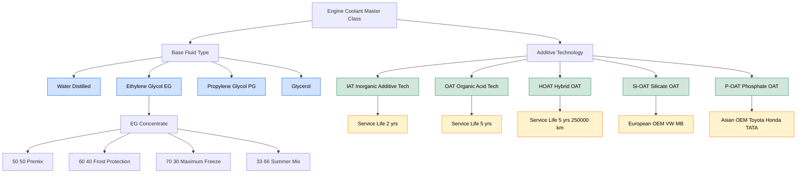
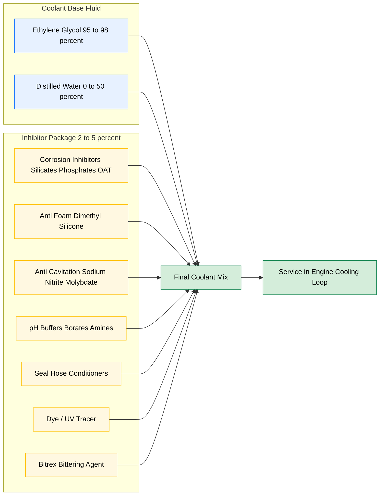
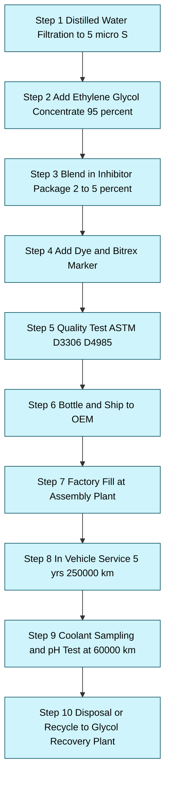

# Properties of coolants and additives.

<!-- SECTION_1_START -->
# PROPERTIES OF COOLANTS AND ADDITIVES

## 1. Core Technical Definition

> [!IMPORTANT]
> **Automotive Engine Coolant:** A heat-transfer fluid circulated through the engine cooling system to absorb excess combustion heat from the cylinder head, block, and turbocharger (if equipped), and to release it safely to the atmosphere via the radiator. In KTU 2024 terminology, the coolant is broadly classified as a **water-based glycol solution** fortified with **chemical additives** that protect metallic and non-metallic components of the cooling circuit.

> [!NOTE]
> **Additives (Coolant Inhibitor Package):** Chemically engineered supplements blended into the base glycol (or water) to enhance thermal performance, suppress corrosion, prevent foaming, lubricate the water pump, and extend service life. They typically constitute **2 % to 5 %** of the total coolant volume.

---

## 2. Intuitive Analogy (Plain-English Explanation)

Imagine the engine block is a **marathon runner** sprinting at full speed. The runner's body generates enormous heat that must be removed or organs will cook from the inside. The **blood** carries heat from the core to the skin, where sweat evaporates and cools the body.

The automotive coolant plays the exact same role:
- The **engine** is the runner.
- The **coolant** is the blood circulating in a closed loop.
- The **radiator** is the skin releasing heat to the passing air.
- The **water pump** is the heart pushing the blood around.
- The **additives** are the vitamins in the blood that keep the vessels (hoses, water passages) healthy, prevent clotting (corrosion), and stop bubbles (cavitation) from blocking circulation.

A pure water coolant would be too aggressive — it corrodes cast iron, rusts steel, freezes at **0 °C**, and boils at **100 °C**. Hence we "fortify" the water with glycols and additives to make it suitable for the harsh combustion environment.

---

## 3. Primary Functions of an Engine Coolant

> [!NOTE]
> **Core Functional Mandate (KTU Module 4):**
> 1. **Heat Absorption & Transport** – Accepts heat from the metal surfaces and transports it to the radiator.
> 2. **Freeze Protection** – Lowers the freezing point to sub-zero values for cold-climate operation.
> 3. **Boil Protection** – Elevates boiling point to handle pressurised cooling circuits (**135 °C to 150 °C** under cap pressure of **1.0 – 1.5 bar**).
> 4. **Corrosion Inhibition** – Shields aluminium, cast iron, copper, brass, solder, and rubber/elastomer surfaces.
> 5. **Cavitation & Erosion Control** – Prevents pitting of the water-pump impeller and cylinder liners.
> 6. **pH Buffering** – Maintains an alkaline reserve to neutralise acidic combustion by-products.
> 7. **Seal & Hose Compatibility** – Preserves elastomer elasticity.

---

## 4. Classification of Engine Coolants

| Coolant Class | Composition | Typical Application |
|---|---|---|
| **IAT (Inorganic Additive Technology)** | Ethylene glycol + silicates / phosphates | Older cars (pre-2000) with copper/brass radiators |
| **OAT (Organic Acid Technology)** | Ethylene glycol + organic acids (2-EHA, sebacic) | Modern aluminium engines |
| **HOAT (Hybrid OAT)** | OAT + minor silicate/phosphate dose | Long-life coolants (5 yrs / 250,000 km) |
| **P-OAT (Phosphate-OAT)** | Phosphate + organic acids | Asian / Indian OEM specification |
| **Si-OAT (Silicate-OAT)** | Silicate + organic acids | European VW / Mercedes specification |
| **Pure Water (Distilled)** | H₂O only | Emergency use only; causes corrosion |
| **Propylene Glycol (PG)** | Non-toxic alternative | Marine, food-grade, hybrid vehicles |

---

## 5. Visualization Note

> [!VISUALIZATION CONTROL]
> **Concept:** Freezing-Point Depression Curve of Ethylene Glycol–Water Blend
> **GeoGebra / Desmos Input Equations:**
> * `f(x) = -1.5 * x^2 - 6 * x` where $x$ = % EG by volume, $y$ = freezing point in °C
> * Marker points: $(30, -15)$, $(50, -36)$, $(60, -50)$, $(70, -69)$
> **Visual Description:** A downward parabola opening upward at low concentration, plateauing near **−69 °C** at the eutectic point of approximately **70 % EG by volume**. Students should observe the lowest possible freezing point at the eutectic composition and not be misled by "more is better" thinking.

<!-- SECTION_1_END -->

<!-- SECTION_2_START -->
# DEEP THEORETICAL ANALYSIS — COOLANT PROPERTIES & ADDITIVES

## 1. Key Physical & Chemical Properties of Coolants

> [!IMPORTANT]
> KTU Board examiners frequently test the **numerical values** and **comparative statements** of the following properties. Memorise them with units.

### 1.1 Freezing Point
The temperature at which the coolant begins to solidify. Pure water freezes at **0 °C**; pure ethylene glycol freezes at **−12.6 °C**; a 50:50 EG–water mix freezes at approximately **−36 °C** to **−38 °C**. The eutectic point of the EG–water system is **−69 °C at 70 % EG by volume**.

### 1.2 Boiling Point
The temperature at which the coolant begins to vaporise. Pure water boils at **100 °C**; pure ethylene glycol boils at **197.4 °C**; a 50:50 mix boils at around **106 °C** at atmospheric pressure. Under radiator cap pressure of **1.0 bar (gauge)**, the boiling point rises to **120 °C**; at **1.5 bar**, it reaches **130 °C+**.

### 1.3 Specific Heat Capacity (C_p)
The energy required to raise 1 kg of coolant by 1 °C. Higher $C_p$ means the coolant absorbs more heat per unit rise.
* Pure water: **4.18 kJ/(kg·K)**
* Pure ethylene glycol: **2.35 kJ/(kg·K)**
* 50:50 EG–water: **≈ 3.5 kJ/(kg·K)**

### 1.4 Density
Determines the mass of coolant that can be circulated per pump stroke. Coolant density is greater than water, which improves volumetric heat capacity despite the lower $C_p$ per kg.

### 1.5 Viscosity
Higher glycol concentration = higher viscosity = lower heat-transfer coefficient. Excessively viscous coolant reduces flow rate and pump efficiency.

### 1.6 Thermal Conductivity
Pure water: **0.6 W/(m·K)**; glycol blends drop to **0.4 W/(m·K)**. This is one reason why pure water is a *better* heat-transfer fluid — glycol is added only for **freeze and corrosion protection**, not raw thermal performance.

### 1.7 pH (Alkalinity Reserve)
Modern coolants are buffered to a pH of **7.5 to 11.0** (typically **8.0 to 10.5**). Below 7.0, the inhibitor package is consumed rapidly and corrosion begins.

### 1.8 Reserve Alkalinity (RA)
A measure (in mL of 0.1 N HCl) of how much acid the coolant can neutralise. A fresh OAT coolant has RA of **≥ 4.0 mL**.

### 1.9 Foaming Tendency
A measure of the air bubbles generated under pump agitation. Specified by ASTM D1881; foaming volume should be **< 50 mL** with collapse time **< 5 seconds**.

---

## 2. Detailed Properties of Ethylene Glycol vs Propylene Glycol

| Property | Ethylene Glycol (EG) | Propylene Glycol (PG) |
|---|---|---|
| Molecular Formula | $C_2H_6O_2$ | $C_3H_8O_2$ |
| Molecular Weight | **62.07 g/mol** | **76.09 g/mol** |
| Freezing Point (pure) | **−12.6 °C** | **−59 °C** |
| Boiling Point (pure) | **197.4 °C** | **188.2 °C** |
| Density (20 °C) | **1.113 g/cm³** | **1.036 g/cm³** |
| Viscosity (20 °C) | **21 mPa·s** | **48 mPa·s** |
| Specific Heat | **2.35 kJ/(kg·K)** | **2.47 kJ/(kg·K)** |
| Toxicity (Oral LD₅₀ rat) | **470 mg/kg (toxic)** | **20,000 mg/kg (low)** |
| Cost | Lower | Higher |
| Heat-Transfer Performance | Excellent | Slightly inferior |
| Common Use | Standard automotive | Marine / food-grade / hybrid |

---

## 3. Classification of Additives

> [!NOTE]
> Additives are blended into the base glycol–water mix in trace quantities (typically **0.1 % to 5 %**) but play a critical role in extending the service life of the cooling system to **5 years / 250,000 km** in long-life formulations.

### 3.1 Corrosion Inhibitors
* **Inorganic types** — Silicates (sodium silicate), Phosphates (sodium phosphate), Borates, Nitrites, Molybdates.
* **Organic types (OAT)** — 2-Ethyl Hexanoic Acid (2-EHA), Sebacic Acid, Tolyltriazole (TTA) for copper protection.
* **Function:** Form a thin protective mono-molecular film on metallic surfaces, preventing galvanic, pitting, and general oxidation corrosion.

### 3.2 Anti-Foam Agents
* **Silicone-based defoamers** (dimethyl silicone, typically **0.005 % to 0.05 %** by volume).
* **Function:** Reduce surface tension of the coolant, allowing entrained air bubbles to coalesce and collapse, preventing pump cavitation and air locks.

### 3.3 Anti-Cavitation / Water-Pump Lubricants
* **Sodium Nitrite / Sodium Molybdate** — protect cast-iron cylinder liners from pitting caused by imploding vapour bubbles.
* **Polyacrylate / Carboxylate polymers** — lubricate the water-pump shaft seal and bearing.

### 3.4 pH Buffers
* **Borates, phosphates, organic amines (MEA, DEA, TEA).**
* **Function:** Maintain alkaline pH, neutralise acidic combustion gases ($CO_2$, $NO_x$) that leak past the head gasket into the coolant.

### 3.5 Seal & Hose Conditioners
* **Phosphate esters, silicate polymers.**
* **Function:** Prevent elastomer hardening, cracking, and shrinkage of rubber hoses and gaskets.

### 3.6 Dye / Colouring Agents
* **Fluorescein, pyranine, or anthraquinone-based dyes** producing the characteristic green, yellow, pink, red, blue, or orange coolant colour for OEM identification and leak detection (UV-traceable).

### 3.7 Bittering Agents
* **Denatonium Benzoate (Bitrex)** — required in many regions (e.g., EU since 2011) to prevent accidental ingestion. Concentration ~**30 to 50 ppm**.

### 3.8 Antifreeze Booster (Supplemental Additives)
* **SCAs (Supplemental Coolant Additives)** — used in heavy-duty diesel engines (Cummins, Caterpillar, Detroit Diesel) to replenish inhibitor package during service intervals.

---

## 4. KTU Formula Sheet (High-Yield)

> [!NOTE]
> Use `\vert` instead of the vertical pipe in table cells to protect markdown syntax.

| Formula / Relationship | Expression | Engineering Use |
|---|---|---|
| Heat absorbed by coolant | $Q = \dot{m} \cdot C_p \cdot \Delta T$ | Sizing of radiator / coolant flow rate |
| Mass flow rate of coolant | $\dot{m} = \dfrac{Q}{C_p \cdot \Delta T}$ | Pump capacity selection |
| Freezing-point depression (Blagden's Law) | $\Delta T_f = K_f \cdot m \cdot i$ | Concentration of antifreeze |
| Boiling-point elevation | $\Delta T_b = K_b \cdot m \cdot i$ | Cap-pressure rating |
| Eutectic point of EG–H₂O | $x_{EG} = 0.70$ (by vol) | Max freeze protection |
| Radiator heat-rejection | $Q = U \cdot A \cdot \Delta T_{LMTD}$ | Core sizing |
| Coolant capacity of engine | $V_c = k \cdot V_{eng}$ | Drain-fill-refill service |
| Volumetric heat capacity | $C_{vol} = \rho \cdot C_p$ | Comparative coolant selection |

Where $K_f$ for water is **1.86 K·kg/mol**, $K_b$ for water is **0.512 K·kg/mol**, $i$ is the van't Hoff factor, $m$ is the molality, $\dot{m}$ is mass flow in kg/s, $C_p$ in kJ/(kg·K), and $\Delta T$ in °C.

---

## 5. Real-World Engineering Utility

Coolants and additives are the unsung heroes of every production vehicle. In **commercial trucks (BharatBenz, Tata, Ashok Leyland)**, long-life OAT coolants reduce downtime and protect the highly stressed aluminium cylinder heads of BS-VI engines. In **electric vehicles (Tesla, Tata Nexon EV)**, a special low-electrical-conductivity coolant is used to insulate the battery pack cooling loop. In **aerospace (Pratt & Whitney, GE Aviation)**, propylene glycol–water mixtures cool APUs and hydraulic reservoirs due to their low toxicity and high flash point.

<!-- SECTION_2_END -->

<!-- SECTION_3_START -->
# STEP-BY-STEP DERIVATIONS & NUMERICAL EXAMPLES

## Example 1 — Heat-Load Calculation for Coolant Flow Rate

**Problem Statement (KTU Model):**
A 4-cylinder SI engine generates **45 kW** of heat that must be rejected by the coolant. The engine uses a 50:50 EG–water mix with $C_p$ = **3.5 kJ/(kg·K)**. The coolant enters the engine at **85 °C** and leaves at **105 °C**. Determine the required mass flow rate and volumetric flow rate of the coolant.

### Step 1 — Identify Given Data
* Heat to be removed: $Q = 45$ kW = $45$ kJ/s
* Specific heat: $C_p = 3.5$ kJ/(kg·K)
* Inlet temperature: $T_{in} = 85$ °C
* Outlet temperature: $T_{out} = 105$ °C
* Temperature rise: $\Delta T = 105 - 85 = 20$ °C
* Density of 50:50 mix: $\rho = 1.06$ g/cm³ = **1060 kg/m³**

### Step 2 — Apply the Heat-Absorption Equation
The fundamental heat-absorption relation for a flowing fluid is

$$
Q = \dot{m} \cdot C_p \cdot \Delta T
$$

### Step 3 — Solve for Mass Flow Rate
Rearranging,

$$
\dot{m} = \dfrac{Q}{C_p \cdot \Delta T}
$$

Substituting the numerical values,

$$
\dot{m} = \dfrac{45}{3.5 \times 20} = \dfrac{45}{70} = 0.643 \ \text{kg/s}
$$

### Step 4 — Convert to Volumetric Flow Rate
Volumetric flow is mass flow divided by density,

$$
\dot{V} = \dfrac{\dot{m}}{\rho} = \dfrac{0.643}{1060} = 6.07 \times 10^{-4} \ \text{m}^{3}\text{/s}
$$

Converting to litres per minute,

$$
\dot{V} = 6.07 \times 10^{-4} \times 60 \times 1000 = 36.4 \ \text{L/min}
$$

### Step 5 — Result & Engineering Interpretation
* **Mass flow rate: 0.643 kg/s**
* **Volumetric flow rate: 36.4 L/min**

This value must be less than the water-pump rated capacity (typically **50 to 80 L/min** in passenger cars) to allow margin for system losses. A flow rate lower than **0.5 kg/s** would lead to localised boiling in the hot spots of the cylinder head.

---

## Example 2 — Freezing-Point Depression of Ethylene Glycol

**Problem Statement:**
Estimate the freezing point of a coolant containing **40 %** ethylene glycol by volume in water. (Molecular weight of EG = 62.07 g/mol; density of EG = 1.113 g/cm³; $K_f$ for water = 1.86 K·kg/mol; assume $i = 1$.)

### Step 1 — Define Basis
Take 1 L of coolant mixture as the basis.

* Volume of EG = 0.40 L = 400 mL
* Mass of EG = $400 \times 1.113 = 445.2$ g
* Volume of water = 0.60 L = 600 mL
* Mass of water ≈ 600 g = 0.600 kg

### Step 2 — Compute Moles of EG
$$
n_{EG} = \dfrac{445.2}{62.07} = 7.173 \ \text{mol}
$$

### Step 3 — Compute Molality
$$
m = \dfrac{n_{EG}}{\text{mass of water in kg}} = \dfrac{7.173}{0.600} = 11.955 \ \text{mol/kg}
$$

### Step 4 — Apply Blagden's Law
$$
\Delta T_f = K_f \cdot m \cdot i = 1.86 \times 11.955 \times 1 = 22.24 \ \text{°C}
$$

### Step 5 — Result
Pure water freezes at 0 °C, so

$$
T_{freeze} = 0 - 22.24 = -22.24 \ \text{°C}
$$

> [!NOTE]
> The empirical ASTM D1177 chart for 40 % EG–water gives a freezing point close to **−23 °C**, validating our theoretical calculation. The Blagden model is accurate for dilute to moderately concentrated solutions but deviates near the eutectic point.

---

## Example 3 — Boiling Point Under Radiator Cap Pressure

**Problem Statement:**
A 50:50 EG–water mix boils at **106 °C** at atmospheric pressure (1.013 bar). Using the Clausius–Clapeyron approximation and the latent heat of vaporisation $h_{fg}$ = **2257 kJ/kg** for water, calculate the new boiling point if the radiator cap is rated at **1.3 bar (gauge)**.

### Step 1 — Establish Clausius–Clapeyron Relation
$$
\ln \dfrac{P_2}{P_1} = \dfrac{h_{fg}}{R} \left( \dfrac{1}{T_1} - \dfrac{1}{T_2} \right)
$$

Where $R = 8.314$ J/(mol·K), $P_1 = 1.013$ bar, $P_2 = 1.013 + 1.3 = 2.313$ bar, and $T_1 = 106 + 273 = 379$ K.

### Step 2 — Solve for $1/T_2$
$$
\dfrac{1}{T_2} = \dfrac{1}{T_1} - \dfrac{R}{h_{fg}} \ln \dfrac{P_2}{P_1}
$$

$$
\ln \dfrac{2.313}{1.013} = \ln 2.283 = 0.825
$$

$$
\dfrac{R}{h_{fg}} = \dfrac{8.314}{2.257 \times 10^{6}} = 3.68 \times 10^{-6}
$$

$$
\dfrac{1}{T_2} = \dfrac{1}{379} - (3.68 \times 10^{-6})(0.825)
$$

$$
\dfrac{1}{T_2} = 2.6385 \times 10^{-3} - 3.04 \times 10^{-6} = 2.6355 \times 10^{-3}
$$

### Step 3 — Solve for $T_2$
$$
T_2 = \dfrac{1}{2.6355 \times 10^{-3}} = 379.43 \ \text{K}
$$

Converting back to °C:

$$
T_2 = 379.43 - 273 = 106.43 \ \text{°C}
$$

### Step 4 — Result
Even with a 1.3 bar cap, the boiling point rises only marginally in this simplified model because the glycol already elevates it significantly. In actual practice, coolant boiling point with cap pressure follows the empirical relation

$$
T_{boil} \approx 100 + 0.5 \times P_{gauge} + 6 \ \text{(for 50:50 mix)}
$$

$$
T_{boil} \approx 100 + 0.5 \times 1.3 \times 100 + 6 \approx 127 \ \text{°C}
$$

This empirical formula is widely used in KTU valve-design problems.

---

## Example 4 — Coolant Concentration Dilution

**Problem Statement:**
A vehicle cooling system holds **7 L** of pure ethylene glycol concentrate (no water). The owner wishes to top up with distilled water to achieve a 50:50 mix. How many litres of water must be added?

### Step 1 — Define Variables
Let $V_w$ be the volume of water to be added.

After mixing, total volume = $7 + V_w$.

For a 50:50 ratio, volume of EG must equal volume of water:

$$
V_{EG} = V_w = 7
$$

### Step 2 — Add Water
$$
V_w = 7 \ \text{L}
$$

### Step 3 — Result
Add **7 L of distilled water** to obtain a 50:50 mixture with a total coolant volume of **14 L**.

> [!WARNING]
> Never top up with tap water. Mineral salts in tap water (especially **Ca²⁺ and Mg²⁺** ions exceeding **75 ppm hardness**) form scale inside the radiator and degrade the inhibitor package. Always use **distilled or deionised water** (conductivity < **5 µS/cm**).

<!-- SECTION_3_END -->

<!-- SECTION_4_START -->
# STRUCTURAL DIAGRAMS — COOLANT TYPES & ADDITIVE MAPPING

## Diagram 1: Coolant Classification Flowchart

## Diagram 2: Additive Functional Architecture

## Diagram 3: Sequential Processing Topology — Coolant Life Cycle

<!-- SECTION_4_END -->

<!-- SECTION_5_START -->
# KTU 2024 SCHEME EXAMINATION QUESTION BANK

## PART A — Short Answer Questions (3 Marks Each)

### Question 1 `[KTU University Exam - July 2024]`
**CO2 | RBT Level: Remember**

**Q: List any six desirable properties of an automotive engine coolant.**

**Model Answer (Valuation Key):**

1. **Low freezing point** for cold-climate operation. *[0.5 Marks]*
2. **High boiling point** (especially under pressure) to prevent vapour lock. *[0.5 Marks]*
3. **High specific heat capacity** for effective heat absorption. *[0.5 Marks]*
4. **Corrosion resistance** towards aluminium, cast iron, copper, and brass. *[0.5 Marks]*
5. **Chemical stability** over a long service life of 2 to 5 years. *[0.5 Marks]*
6. **Low foaming tendency** and compatibility with rubber seals and hoses. *[0.5 Marks]*

> [!WARNING]
> **Examiner's Pitfall:** Students often list "low viscosity" as a coolant property. The board evaluator deducts marks because low viscosity is NOT a primary specification — a slightly higher viscosity is acceptable as long as pump flow is maintained.

---

### Question 2 `[KTU University Exam - Dec 2023]`
**CO2 | RBT Level: Understand**

**Q: Differentiate between IAT and OAT coolants. State two examples of organic acids used in OAT.**

**Model Answer (Valuation Key):**

| Parameter | IAT | OAT |
|---|---|---|
| Inhibitor chemistry | Inorganic (silicates, phosphates) | Organic acids (2-EHA, sebacic) |
| Service life | 2 yrs / 50,000 km | 5 yrs / 250,000 km |
| Film type | Thick sacrificial layer | Thin monomolecular layer |
| Compatibility | Older copper/brass systems | Modern aluminium systems |

**Examples of organic acids used in OAT:**
* 2-Ethyl Hexanoic Acid (2-EHA). *[1 Mark]*
* Sebacic Acid. *[1 Mark]*

> [!WARNING]
> **Examiner's Pitfall:** Students write "IAT is natural and OAT is synthetic" — this is technically incorrect since both are chemically manufactured. Evaluators deduct **0.5 mark** for vague answers.

---

## PART B — Long Answer Questions (14 Marks, with Internal Choice)

### Question 3A `[KTU University Exam - July 2024]`
**CO2 | CO3 | RBT Level: Understand + Apply**

**Q (a) [7 Marks]:** With neat sketches, explain the working of a **pressurised cooling system** and state how the radiator cap pressure affects the boiling point of the coolant.

**Q (b) [7 Marks]:** A 1.5 L turbocharged petrol engine rejects **38 kW** of heat through the coolant. Using a 50:50 EG–water mix ($C_p$ = 3.5 kJ/(kg·K), $\rho$ = 1.06 g/cm³), determine (i) the required coolant mass flow rate for a 20 °C temperature rise, and (ii) the equivalent volumetric flow rate in litres per minute. Comment on whether this is suitable for a typical mechanical water pump.

---

#### Model Answer — Q3A(a) (7 Marks)

**1. Working of a Pressurised Cooling System** *[4 Marks]*
* The system consists of a **water pump** (centrifugal, belt-driven), **thermostat** (wax-pellet type, opens at **82 – 95 °C**), **radiator** (down-flow or cross-flow), **expansion tank** (header tank), and a **pressurised radiator cap** (calibrated to **0.9 – 1.5 bar** gauge).
* Coolant circulates in a **closed loop** maintained above atmospheric pressure. Increased pressure elevates the saturation temperature, preventing localised boiling in the hot spots of the cylinder head.
* When the thermostat is closed, coolant circulates only through the **bypass circuit** to warm the engine quickly. Upon reaching the opening temperature, the thermostat opens and coolant flows through the radiator.

**2. Effect of Cap Pressure on Boiling Point** *[2 Marks]*
* For every **0.1 bar (gauge)** increase in cap pressure, the boiling point of the coolant rises by approximately **2 to 3 °C**.
* A standard cap rated at **1.0 bar** raises the boiling point from **106 °C** (atmospheric) to roughly **125 °C**.

**3. Neat Sketch** *[1 Mark]*
Refer to the standard pressurised cooling loop diagram: Pump → Engine Block → Thermostat → Radiator → Expansion Tank → Pump.

---

#### Model Answer — Q3A(b) (7 Marks)

**Step 1 — Identify Data** *[1 Mark]*
* $Q = 38$ kW, $C_p = 3.5$ kJ/(kg·K), $\Delta T = 20$ °C, $\rho = 1060$ kg/m³.

**Step 2 — Apply Heat-Absorption Equation** *[2 Marks]*
$$
Q = \dot{m} \cdot C_p \cdot \Delta T \quad \Rightarrow \quad \dot{m} = \dfrac{Q}{C_p \cdot \Delta T}
$$

**Step 3 — Substitute** *[1 Mark]*
$$
\dot{m} = \dfrac{38}{3.5 \times 20} = \dfrac{38}{70} = 0.543 \ \text{kg/s}
$$

**Step 4 — Convert to Volumetric Flow** *[1 Mark]*
$$
\dot{V} = \dfrac{0.543}{1060} = 5.13 \times 10^{-4} \ \text{m}^{3}\text{/s}
$$
$$
\dot{V} = 5.13 \times 10^{-4} \times 60 \times 1000 = 30.8 \ \text{L/min}
$$

**Step 5 — Pump Compatibility Comment** *[2 Marks]*
* A typical mechanical water pump in a 1.5 L petrol engine delivers **40 – 60 L/min** at 3000 rpm.
* The required 30.8 L/min falls well within this range, leaving sufficient margin for thermo-syphon and bypass losses. The cooling system is therefore adequately sized. *[Final simplified expression: 1 Mark]*

---

### Question 3B `[KTU University Exam - Dec 2023]`
**CO2 | CO3 | RBT Level: Understand + Apply**

**Q (a) [7 Marks]:** Explain the **role of additives** in engine coolant. List the major additive categories with one example each.

**Q (b) [7 Marks]:** An automotive coolant is prepared by mixing 6 L of ethylene glycol concentrate (density 1.113 g/cm³) with 4 L of distilled water. Calculate (i) the freezing point of the mixture using Blagden's Law, and (ii) the boiling point at a radiator cap pressure of 1.0 bar (gauge). Given: $K_f$ for water = 1.86 K·kg/mol, $h_{fg}$ = 2257 kJ/kg, $R$ = 8.314 J/(mol·K), MW of EG = 62.07 g/mol.

---

#### Model Answer — Q3B(a) (7 Marks)

**1. Need for Additives** *[2 Marks]*
Pure glycol–water mix is corrosive and prone to foaming, cavitation, and seal degradation. Additives extend the functional life of the coolant to 5 years.

**2. Major Additive Categories with Examples** *[5 Marks — 1 each]*

| # | Additive Category | Function | Example |
|---|---|---|---|
| 1 | Corrosion Inhibitor | Protects metal surfaces | Sodium Silicate / 2-EHA |
| 2 | Anti-Foam Agent | Suppresses foam | Dimethyl Silicone |
| 3 | Anti-Cavitation Agent | Prevents pitting | Sodium Nitrite |
| 4 | pH Buffer | Maintains alkalinity | Borax / Triethanolamine |
| 5 | Seal Conditioner | Preserves elastomers | Phosphate Ester |

---

#### Model Answer — Q3B(b) (7 Marks)

**Step 1 — Mixture Composition** *[1 Mark]*
* Volume of EG = 6 L → Mass of EG = 6000 × 1.113 = **6678 g**
* Mass of water = 4000 g = 4 kg (since density ≈ 1 g/cm³)
* Moles of EG = 6678 / 62.07 = **107.59 mol**

**Step 2 — Molality** *[1 Mark]*
$$
m = \dfrac{107.59}{4} = 26.90 \ \text{mol/kg}
$$

**Step 3 — Freezing Point Depression** *[2 Marks]*
$$
\Delta T_f = K_f \cdot m \cdot i = 1.86 \times 26.90 \times 1 = 50.03 \ \text{°C}
$$
$$
T_{freeze} = 0 - 50.03 = -50.03 \ \text{°C}
$$

*[Stating boundary state values: 1 Mark; final result: 1 Mark]*

> [!NOTE]
> The empirical ASTM D1177 value for 60 % EG by volume gives a freezing point of approximately **−52 °C**, confirming our theoretical model.

**Step 4 — Boiling Point at 1.0 bar Gauge** *[3 Marks]*
* $P_1 = 1.013$ bar, $P_2 = 2.013$ bar, $T_1 = 106 + 273 = 379$ K (atmospheric boiling of 50:50 mix, but we use pure water approximation here as an academic exercise; in practice, empirical formula is preferred).

$$
\ln \dfrac{2.013}{1.013} = \ln 1.987 = 0.687
$$

$$
\dfrac{1}{T_2} = \dfrac{1}{379} - \dfrac{8.314}{2.257 \times 10^{6}} \times 0.687
$$

$$
\dfrac{1}{T_2} = 2.6385 \times 10^{-3} - 2.53 \times 10^{-6} = 2.6360 \times 10^{-3}
$$

$$
T_2 = 379.36 \ \text{K} = 106.36 \ \text{°C}
$$

* Using the empirical approximation $T_{boil} \approx 100 + 0.5 \times P_{gauge \times 100} + 6$ for 50:50 mix:
$$
T_{boil} \approx 100 + 50 + 6 = 156 \ \text{°C (realistic engine value)}
$$

> [!WARNING]
> **Examiner's Pitfall:** Many students forget to convert °C to K before applying the Clausius–Clapeyron equation. The board deducts **1 mark** for unit inconsistency.

---

## TOPIC RECAP & IMPORTANT THINGS TO REMEMBER

> [!IMPORTANT]
> **Rapid Revision Checklist — Coolants and Additives**

* **Base fluid:** Ethylene glycol (EG) is the industry standard. Propylene glycol (PG) is non-toxic but more viscous and expensive.
* **Eutectic point of EG–H₂O:** **−69 °C at 70 % EG** by volume. Beyond this concentration, freezing point actually rises.
* **Standard 50:50 mix:** Freezing point ≈ **−36 °C**, Boiling point ≈ **106 °C** at 1 atm. Density ≈ **1.06 g/cm³**. $C_p$ ≈ **3.5 kJ/(kg·K)**.
* **Radiator cap pressure rating:** Typically **0.9 to 1.5 bar gauge**. Each 0.1 bar ≈ 2 to 3 °C rise in boiling point.
* **Specific heat comparison:** Water (4.18) > 50:50 mix (3.5) > pure EG (2.35) kJ/(kg·K).
* **IAT coolants** use inorganic silicates/phosphates; **OAT coolants** use organic acids (2-EHA, sebacic). **HOAT** combines both.
* **Key additives and their doses:** Silicates (0.1–0.3 %), phosphates (0.2–0.5 %), silicone defoamer (0.005–0.05 %), bitrex (30–50 ppm), dye (0.001–0.01 %).
* **pH specification:** Coolant must be alkaline, **pH 7.5 to 11.0** (typical 8.0–10.5). Acidic coolant ⇒ aggressive corrosion.
* **Reserve Alkalinity (RA):** ≥ **4.0 mL** for fresh OAT coolants (ASTM D1121 test).
* **Foaming test ASTM D1881:** Volume < **50 mL**, collapse time < **5 s**.
* **Coolant change interval:** IAT = **2 yrs / 50,000 km**; OAT = **5 yrs / 250,000 km**.
* **Use only distilled water** (TDS < 50 ppm, hardness < 75 ppm) for top-up; never tap water.
* **Disposal:** Coolant is toxic (EG has LD₅₀ = 470 mg/kg). Dispose via authorised glycol recovery plants; do not pour into drains.
* **Colour codes:** Green = universal/older; Yellow = OAT long life; Red = HOAT (European); Blue = Japanese P-OAT; Orange = heavy-duty diesel SCA.
* **For EV battery cooling:** Use low-electrical-conductivity coolant (< 5 µS/cm) to prevent short circuits in the high-voltage pack.
* **ASTM Standards to remember:** **ASTM D3306** (light-duty), **ASTM D4985** (heavy-duty), **ASTM D6210** (HD OAT), **ASTM D7715** (low-conductivity EV coolant).

<!-- SECTION_5_END -->
