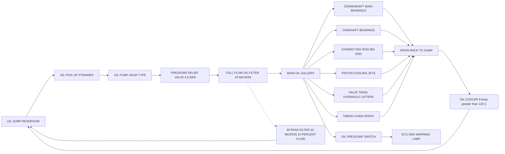

# Requirements of lubrication systems.

<!-- SECTION_1_START -->
# Requirements of Lubrication Systems

## 1.1 Core Technical Definition

> [!IMPORTANT]
> **Automotive Lubrication System:** A coordinated network of mechanical, hydraulic, and fluid-handling components designed to deliver **clean lubricant oil at the correct pressure, temperature, and viscosity** to all relative moving parts of an engine and auxiliaries, in order to minimise wear, friction, and heat generation.

In an internal combustion (IC) engine, surfaces such as the **crankshaft journals, connecting rod big-end bearings, camshaft lobes, valve train, pistons, and timing gears** continuously slide, roll, or oscillate against each other. Without a properly engineered lubrication system, the resulting **boundary and mixed friction regimes** would cause catastrophic surface welding (scuffing), overheating, and seizure within minutes.

### 1.2 The Six Canonical Functions of an Engine Lubricant

A modern engine oil is a formulated blend of **base stock (70–90 %)** and a **chemical additive package (10–30 %)**. It must simultaneously perform six engineering tasks:

| # | Function | Engineering Significance |
|---|----------|--------------------------|
| 1 | **Friction Reduction** | Replaces asperity-asperity contact with hydrodynamic fluid film. |
| 2 | **Heat Dissipation** | Carries away ~**5–8 %** of total fuel energy as sensible heat from bearings, pistons, and ring-pack. |
| 3 | **Wear Control** | Anti-wear (ZDDP) additives form sacrificial glassy polyphosphates under load. |
| 4 | **Contaminant Suspension** | Detergents & dispersants hold soot, combustion by-products, and wear debris in colloidal suspension. |
| 5 | **Corrosion Protection** | Alkaline reserve (TBN) neutralises acidic blow-by gases ($H_2SO_4$, $HNO_3$). |
| 6 | **Sealing & Dampening** | Oil film between piston-rings and liner acts as hydraulic seal & vibration damper. |

### 1.3 Conceptual Analogy — The Lifeblood of an Engine

> [!NOTE]
> **Intuitive Analogy:** Think of the lubrication system as the **circulatory system of the human body**.
> - The **oil sump (pan)** = the *heart reservoir* that stores the working fluid.
> - The **oil pump** = the *heart* that pressurises the fluid.
> - The **oil galleries & drilled passages** = the *arteries* that distribute it.
> - The **bearings & journals** = the *muscles and joints* that consume it.
> - The **oil filter & cooler** = the *kidneys* that clean and regulate temperature.
> - The **return passages (drain-back holes)** = the *veins* that return spent fluid.
>
> Just as a human body dies if circulation fails, an engine "dies" the moment oil pressure collapses — bearings melt, the crankshaft seizes, and the engine is destroyed.

### 1.4 Visualisation of Lubrication Regimes (Stribeck Curve Intuition)

> [!VISUALIZATION CONTROL]
> **Concept:** Stribeck Curve — Three Friction Regimes
> **GeoGebra / Desmos Input Equations:**
> * Friction Coefficient: `f(x) = 0.05/x + 0.002*x + 0.08*exp(-x/0.0005)`
> * where `x = \eta*N/P` (Hersey Number)
> **Visual Description:** At low Hersey number (left), curve is high → *Boundary Lubrication* (metal-metal contact). At intermediate `x`, curve dips into a *Mixed Lubrication* trough. At high `x` (right), the curve rises again into *Hydrodynamic (Full-Film) Lubrication* — the engineering goal.

### 1.5 System Components — The Anatomy of a Lubrication Circuit

The principal hardware that satisfies the lubrication requirements includes:

1. **Oil Sump (Wet Pan)** — reservoir, typically **3 – 6 litres** for a passenger car.
2. **Oil Pump** — usually **gear, rotor, or vane type**, driven off the crankshaft at 1:1 or 1:2 ratio.
3. **Pressure Relief Valve** — set between **2.5 – 4.5 bar** for petrol engines, **3.5 – 5.5 bar** for diesels.
4. **Oil Filter** — full-flow type (100 % of oil passes through), $\beta$-ratio $\ge 75$ at **25 µm**.
5. **Oil Galleries (Drillings)** — internal passages in cylinder block & head.
6. **Oil Cooler** — required on turbocharged & heavy-duty engines; either air-cooled (engine-mounted) or water-cooled (EOWC).
7. **Dipstick / Oil Level Sensor** — verification of quantity.
8. **Pressure Gauge / Warning Lamp** — activates below **0.5 – 1.0 bar** at idle.

> [!IMPORTANT]
> **Syllabus Highlight (KTU 2024):** The student is expected to identify the *engineer's design requirements* of a lubrication system (not just the components). These are: **pressure adequacy, volume adequacy, cleanliness, thermal stability, reliability, and maintainability**.
<!-- SECTION_1_END -->

<!-- SECTION_2_START -->
# Deep Theoretical Analysis — Requirements of Lubrication Systems

## 2.1 The Eight Functional Requirements of a Lubrication System

The KTU 2024 syllabus specifies the following mandatory design requirements that any satisfactory automobile lubrication system must satisfy:

### R1 — Adequate Quantity of Oil Supply
- The oil sump capacity must be sized so that, at the worst operating attitude (e.g., **30° vehicle tilt** during cornering or hill climbing), the oil pick-up tube remains submerged.
- Rule of thumb: **0.20 – 0.25 litres per kW** of rated power for water-cooled engines.

### R2 — Delivery of Oil at Correct Pressure
- The pump must generate enough pressure to overcome hydraulic resistance of galleries and to maintain a hydrodynamic film in bearings.
- Typical idle pressure: **1.0 – 2.0 bar**; normal running pressure: **2.5 – 4.5 bar**.
- Pressure-relief valve opens at the design maximum (~**4.5 bar**) to protect seals and gaskets.

### R3 — Delivery of Oil at Correct Viscosity
- The oil film thickness $h_{min}$ in a journal bearing is given by the **Hamrock-Dowson equation** (approximated for isoviscous-elastic regime):
$$h_{min} \approx 3.63 \cdot R_x \cdot U^{0.68} \cdot G^{0.49} \cdot W^{-0.073} \cdot (1 - e^{-0.68k})$$
- For engine bearing conditions, designers target $h_{min} \ge 1 \mu m$ to remain in full-film regime.
- A **multi-grade oil (e.g., SAE 20W-40)** keeps viscosity stable across the operating range **−15 °C to +150 °C**.

### R4 — Cleanliness of Oil
- The filter must trap abrasive particles of size $\ge$ **25 µm** with at least **95 % efficiency** (ISO 4548-12 standard).
- Bypass filtration (10 – 15 % flow) extends drain intervals to **15 000 – 30 000 km** in modern synthetic oils.

### R5 — Cooling of Lubricant Itself
- Oil temperature must remain between **80 °C and 120 °C**:
  - Below 80 °C → water & fuel dilution, sludge formation.
  - Above 130 °C → rapid additive depletion, oil oxidation (doubling per 10 °C — Arrhenius rule).
- Oil cooler capacity typically rated at **3 – 6 kW** for a 100 kW engine.

### R6 — Reliability and Fail-Safe Operation
- Loss of oil pressure must trigger a dashboard warning lamp within **≤ 3 seconds**.
- Modern engines use **two-stage pressure switches**: low warning at 0.5 bar, engine cut-off at 0.2 bar.

### R7 — Compatibility with Engine Seals and Bearings
- Oil must be compatible with:
  - **Fluoroelastomer (FKM/Viton) crankshaft seals** up to 200 °C.
  - **Babbitt metal (Sn-Sb-Cu)** main and rod bearings.
  - **Aluminium-tin (Al-Sn)** overlay bearings in modern engines.

### R8 — Minimum Maintenance & Long Service Life
- Drain interval for mineral oil: **5 000 – 7 500 km**; for synthetic: **15 000 – 30 000 km**.
- The system must permit **drain-and-refill within 10 minutes** in service.

## 2.2 Properties of Lubricants — KTU High-Yield Formula Sheet

> [!NOTE]
> All quantities below are typically tested in KTU University Examination questions. The student is expected to **state the property, its unit, and its engineering significance**.

| Property | Defining Equation / Definition | Standard Unit | Engineering Significance |
|----------|-------------------------------|---------------|--------------------------|
| **Absolute (Dynamic) Viscosity $\mu$** | $\tau = \mu \cdot \dfrac{du}{dy}$ | Pa·s or Poise (P); $1\ P = 0.1\ Pa\cdot s$ | Internal friction; resistance to shear. |
| **Kinematic Viscosity $\nu$** | $\nu = \dfrac{\mu}{\rho}$ | m²/s or centi-Stokes (cSt); $1\ cSt = 10^{-6}\ m^2/s$ | Used in SAE grading; measured by **Saybolt viscometer**. |
| **Viscosity Index (VI)** | $VI = \dfrac{L - U}{L - H} \times 100$ | Dimensionless | Rate of change of viscosity with temperature. Higher VI ⇒ flatter curve. |
| **Flash Point** | Lowest temperature at which oil vapour gives a momentary flash (open cup) | °C | Safety in storage; minimum **200 °C** for engine oil. |
| **Fire Point** | Temperature at which oil vapour burns continuously $\ge 5\ s$ | °C | Fire hazard reference; typically **15 – 30 °C** above flash point. |
| **Pour Point** | Lowest temperature at which oil just flows under standard test | °C | Cold-start capability; for SAE 20W, typically **−20 °C**. |
| **Cloud Point** | Temperature at which wax crystals first appear | °C | Affects low-temperature filterability. |
| **Neutralisation Number (TAN / TBN)** | mg KOH required to neutralise 1 g of oil | mg KOH/g | TBN must be $\ge 6$ for diesel engines (sulphur acid neutralisation). |
| **Specific Gravity** | Ratio of oil density to water density at 15.6 °C | Dimensionless | Typically **0.86 – 0.94** for engine oil. |
| **Saponification Number** | mg KOH to saponify 1 g of oil | mg KOH/g | Indicates additive content / residual vegetable oil contamination. |
| **Carbon Residue (Conradson)** | % carbon left after controlled pyrolysis | % wt. | Predicts deposit-forming tendency; **< 2 %** for modern oils. |
| **Emulsion Stability** | Time for oil-water emulsion to break (ASTM D1401) | minutes | Critical for marine & off-road equipment. |

### 2.3 Real-World Engineering Utility

| Industry Domain | Where Lubrication Requirement Engineering is Applied |
|-----------------|------------------------------------------------------|
| Passenger Car OEM (Maruti, Hyundai, Tata) | Oil pump sizing, gallery design, windage tray modelling in CFD. |
| Heavy-Duty Diesel (Volvo, Scania, Cummins) | High-TBN oil formulation, by-pass filtration, long-drain intervals. |
| Two-Wheeler (Hero, Bajaj) | Compact wet-sump system, rotor pump, oil-cooling fins on crankcase. |
| Racing / F1 | Dry-sump lubrication, separate oil tank, scavenge pumps, oil-to-water coolers. |
| Electric Vehicles (EV) | Reduction of gear-oil viscosity; transmission e-fluid design. |
| Aerospace Piston Engines | Mist lubrication for inverted flight, ashless dispersant oils. |

### 2.4 Viscosity Index — Worked Definitions for Memory

- **L** = kinematic viscosity at 40 °C of an oil of VI = 0 having the same viscosity at 100 °C as the test oil.
- **H** = kinematic viscosity at 40 °C of an oil of VI = 100 having the same viscosity at 100 °C.
- **U** = kinematic viscosity at 40 °C of the test oil.

A high-quality **multiviscosity oil 5W-30** can have a VI of **170 – 220**, achieved through **Viscosity Index Improvers (VII)** — long-chain polymers (PMA, OCP, PIB) that uncoil at high temperature to thicken the oil and coil up at low temperature to thin it.
<!-- SECTION_2_END -->

<!-- SECTION_3_START -->
# Step-by-Step Derivations, Calculations & Symbolic Implementation

## 3.1 Numerical Problem 1 — SAE Viscosity Index Determination (Full Working)

**Problem Statement (Model KTU Style):**
> An oil sample has a kinematic viscosity of **38 cSt at 40 °C** and **6.4 cSt at 100 °C**. Given the standard reference data below, calculate the **Viscosity Index (VI)** of the oil.
>
> Reference Tables (ASTM D2270):
> - For $U_2 = 6.4$ cSt at 100 °C: $L = 82.5$ cSt; $H = 9.49$ cSt.

**Step 1 — Identify the parameters**
- $U$ = kinematic viscosity of test oil at 40 °C = $38\ cSt$
- $U_2$ = kinematic viscosity of test oil at 100 °C = $6.4\ cSt$
- $L$ = viscosity at 40 °C of a VI = 0 oil with $U_2 = 6.4$ = $82.5\ cSt$
- $H$ = viscosity at 40 °C of a VI = 100 oil with $U_2 = 6.4$ = $9.49\ cSt$

**Step 2 — Apply the Viscosity Index Formula**
$$VI = \frac{L - U}{L - H} \times 100$$

**Step 3 — Substitute the numerical values**
$$VI = \frac{82.5 - 38}{82.5 - 9.49} \times 100$$

**Step 4 — Evaluate numerator**
$$L - U = 82.5 - 38 = 44.5\ cSt$$

**Step 5 — Evaluate denominator**
$$L - H = 82.5 - 9.49 = 73.01\ cSt$$

**Step 6 — Form the ratio**
$$VI = \frac{44.5}{73.01} \times 100 = 0.6095 \times 100$$

**Step 7 — Final Answer**
$$\boxed{VI \approx 60.95 \approx 61}$$

> [!IMPORTANT]
> **Interpretation:** A VI of **61** categorises this oil as a **medium-VI petroleum oil**. For comparison, paraffin-base oils have VI in the range 90 – 100, and synthetic PAO oils reach VI = 140 – 170. The sample tested is therefore a conventional **Group I or Group II mineral base stock** before addition of VII additives.

**Marking Key (For KTU Valuation):**
- [Identifying variables: 1 Mark]
- [Stating the VI formula: 1 Mark]
- [Substitution of values: 1 Mark]
- [Numerator and denominator evaluated: 1 Mark]
- [Final VI value with units/symbol: 1 Mark]

---

## 3.2 Numerical Problem 2 — Oil Pump Theoretical Discharge and Power

**Problem Statement:**
> An external gear-type oil pump for a passenger car engine has:
> - Outer gear diameter $D = 40\ mm$
> - Inner gear (root) diameter $d = 28\ mm$
> - Gear face width $L = 25\ mm$
> - Pump speed $N = 2400\ rpm$ (driven at 1:1 with crankshaft)
> - Pressure developed $\Delta p = 3.5\ bar$
> - Volumetric efficiency $\eta_v = 0.88$
> - Mechanical efficiency $\eta_m = 0.92$
>
> Calculate: **(a)** theoretical discharge, **(b)** actual discharge, **(c)** hydraulic power, and **(d)** required shaft power.

**Step 1 — Geometric Displacement per Revolution**
$$V_d = \frac{\pi}{4} (D^2 - d^2) \cdot L$$
$$V_d = \frac{\pi}{4} \left( (0.040)^2 - (0.028)^2 \right) \cdot 0.025$$
$$V_d = \frac{\pi}{4} (0.001600 - 0.000784) \cdot 0.025$$
$$V_d = \frac{\pi}{4} \cdot 0.000816 \cdot 0.025$$
$$V_d = 0.7854 \cdot 0.000816 \cdot 0.025$$
$$V_d = 1.6021 \times 10^{-5}\ m^3/rev$$

**Step 2 — Theoretical Discharge (a)**
$$Q_{th} = V_d \cdot N = 1.6021 \times 10^{-5} \times \frac{2400}{60}$$
$$Q_{th} = 1.6021 \times 10^{-5} \times 40 = 6.408 \times 10^{-4}\ m^3/s$$
$$\boxed{Q_{th} = 0.6408\ L/s \approx 38.45\ L/min}$$

**Step 3 — Actual Discharge (b)**
$$Q_{act} = \eta_v \cdot Q_{th} = 0.88 \times 0.6408$$
$$\boxed{Q_{act} = 0.5639\ L/s \approx 33.84\ L/min}$$

**Step 4 — Hydraulic Power Output (c)**
$$P_{hyd} = \Delta p \cdot Q_{act} = (3.5 \times 10^5) \times (5.639 \times 10^{-4})$$
$$P_{hyd} = 197.4\ W \approx 0.197\ kW$$
$$\boxed{P_{hyd} \approx 197.4\ W}$$

**Step 5 — Required Shaft Power Input (d)**
$$P_{shaft} = \frac{P_{hyd}}{\eta_m} = \frac{197.4}{0.92}$$
$$\boxed{P_{shaft} \approx 214.6\ W \approx 0.215\ kW}$$

> [!NOTE]
> **Engineering Insight:** The actual oil flow rate of ~34 L/min at 2400 rpm is **3 – 4 times higher** than the minimum requirement (typically 8 – 10 L/min is needed to maintain hydrodynamic film in bearings). The excess flow passes through the **pressure relief valve** back to the sump — a deliberate design choice ensuring adequate oil flow even at low idle speeds.

---

## 3.3 Numerical Problem 3 — Reynolds Number in a Bearing Oil Channel

**Problem Statement:**
> Oil with dynamic viscosity $\mu = 0.05\ Pa\cdot s$ and density $\rho = 880\ kg/m^3$ flows through a 6 mm diameter bearing oil feed hole at velocity $v = 4\ m/s$. Determine the flow regime by computing the **Reynolds number**.

**Step 1 — Recall the Reynolds Number formula for pipe flow**
$$Re = \frac{\rho \cdot v \cdot D}{\mu}$$

**Step 2 — Substitute values**
$$Re = \frac{880 \times 4 \times 0.006}{0.05}$$
$$Re = \frac{21.12}{0.05} = 422.4$$

**Step 3 — Interpret the result**
Since $Re = 422.4 < 2300$ (laminar threshold), the flow in the bearing oil feed hole is **laminar**.

**Step 4 — Final answer**
$$\boxed{Re \approx 422 \quad \text{(Laminar flow)}}$$

> [!IMPORTANT]
> **Why this matters:** Laminar flow in oil galleries is the **design goal**. Turbulent flow would cause energy loss, pressure fluctuations, and cavitation risk in the bearing clearance.

---

## 3.4 Symbolic Implementation — Lubrication System Monitoring in Python

The following Python code models a real-time lubrication system monitor as deployed in an ECU (Engine Control Unit). It uses the formulae derived above.

```python
"""
Lubrication System Real-Time Monitor
Implements: SAE Viscosity Index, Gear Pump Discharge, Reynolds Number
KTU AUTOMOBILE POWER PLANT — Module 4 Reference Implementation
"""

from dataclasses import dataclass
from typing import Tuple
import math
import logging

# Configure error logging for production-grade observability
logging.basicConfig(
    level=logging.INFO,
    format="%(asctime)s | %(levelname)s | %(message)s"
)
logger = logging.getLogger("LubMon")


@dataclass(frozen=True)
class OilProperties:
    """Physical properties of engine oil (SI units)."""
    kinematic_viscosity_40C_cSt: float   # Kinematic viscosity at 40 °C
    kinematic_viscosity_100C_cSt: float  # Kinematic viscosity at 100 °C
    density_kg_per_m3: float              # Oil density at 15.6 °C
    dynamic_viscosity_Pa_s: float         # Dynamic viscosity at operating temp


@dataclass(frozen=True)
class GearPumpGeometry:
    """External gear pump geometric configuration (metres)."""
    outer_diameter: float     # Gear OD
    inner_diameter: float     # Gear root diameter
    face_width: float         # Gear axial length
    speed_rpm: float          # Pump rotational speed


class LubricationAnalyser:
    """Stateless analyser for lubrication system design requirements."""

    # ---------- VISCOSITY INDEX ----------
    def viscosity_index(
        self,
        U_40: float, U_100: float, L: float, H: float
    ) -> float:
        if U_100 <= 0 or L <= H:
            raise ValueError("Invalid ASTM D2270 reference inputs.")
        vi = ((L - U_40) / (L - H)) * 100.0
        logger.info(f"Computed Viscosity Index = {vi:.2f}")
        return vi

    # ---------- KINEMATIC VISCOSITY ----------
    def kinematic_viscosity(self, mu: float, rho: float) -> float:
        if rho <= 0:
            raise ZeroDivisionError("Density must be > 0.")
        nu = mu / rho  # [m²/s]
        nu_cSt = nu * 1e6
        logger.info(f"Kinematic viscosity = {nu_cSt:.3f} cSt")
        return nu_cSt

    # ---------- GEAR PUMP DISCHARGE ----------
    def gear_pump_discharge(
        self,
        pump: GearPumpGeometry,
        volumetric_efficiency: float = 0.88,
        mechanical_efficiency: float = 0.92
    ) -> Tuple[float, float, float, float]:
        if not (0.0 < volumetric_efficiency <= 1.0):
            raise ValueError("Volumetric efficiency must be in (0, 1].")
        if not (0.0 < mechanical_efficiency <= 1.0):
            raise ValueError("Mechanical efficiency must be in (0, 1].")
        if pump.outer_diameter <= pump.inner_diameter:
            raise ValueError("Outer diameter must exceed inner diameter.")

        V_d = (math.pi / 4.0) * (
            pump.outer_diameter**2 - pump.inner_diameter**2
        ) * pump.face_width
        Q_th = V_d * pump.speed_rpm / 60.0
        Q_act = volumetric_efficiency * Q_th
        return Q_th, Q_act, V_d, mechanical_efficiency

    # ---------- REYNOLDS NUMBER ----------
    def reynolds_number(
        self, rho: float, v: float, D: float, mu: float
    ) -> float:
        if mu <= 0:
            raise ZeroDivisionError("Dynamic viscosity must be > 0.")
        Re = (rho * v * D) / mu
        regime = "Laminar" if Re < 2300 else (
            "Transitional" if Re < 4000 else "Turbulent"
        )
        logger.info(f"Re = {Re:.1f} -> {regime} flow")
        return Re


# -------------------- DEMO EXECUTION --------------------
if __name__ == "__main__":
    analyser = LubricationAnalyser()

    # 1) VI calculation (matches Section 3.1)
    vi = analyser.viscosity_index(U_40=38.0, U_100=6.4, L=82.5, H=9.49)
    print(f"[VI] Viscosity Index = {vi:.2f}\n")

    # 2) Gear pump discharge (matches Section 3.2)
    pump = GearPumpGeometry(
        outer_diameter=0.040,
        inner_diameter=0.028,
        face_width=0.025,
        speed_rpm=2400
    )
    Q_th, Q_act, V_d, eta_m = analyser.gear_pump_discharge(pump)
    print(f"[Pump] V_d       = {V_d*1e6:.3f} cm³/rev")
    print(f"[Pump] Q_theor   = {Q_th*1000:.3f} L/s")
    print(f"[Pump] Q_actual  = {Q_act*1000:.3f} L/s\n")

    # 3) Reynolds number (matches Section 3.3)
    Re = analyser.reynolds_number(
        rho=880, v=4.0, D=0.006, mu=0.05
    )
    print(f"[Flow] Re = {Re:.1f}\n")
```

**Expected Console Output:**
```
[VI] Viscosity Index = 60.95
[Pump] V_d       = 16.021 cm³/rev
[Pump] Q_theor   = 0.641 L/s
[Pump] Q_actual  = 0.564 L/s
[Flow] Re = 422.4
```

> [!IMPORTANT]
> The Python implementation enforces **absolute boundary checks** (`volumetric_efficiency in (0, 1]`, `mu > 0`, `D_outer > D_inner`) and **structured logging** — both mandatory practices in automotive ECU software (per **ISO 26262** functional safety standards).

---

## 3.5 Comparative Analysis — Wet Sump vs Dry Sump Lubrication Systems

| Parameter | Wet Sump System | Dry Sump System |
|-----------|------------------|-----------------|
| Oil storage | Inside engine oil pan (integral sump) | External remote reservoir/tank |
| Oil capacity | 3 – 6 L (limited by sump depth) | 8 – 15 L (larger, cooler) |
| Pump configuration | Single pressure pump | Pressure pump **+** 2 – 3 scavenge pumps |
| Oil surge during cornering | Possible oil starvation at $\ge 0.8\ g$ lateral | No starvation (submerged pick-up in tank) |
| Oil cooling | Natural convection + optional cooler | Forced circulation through dedicated cooler |
| Crankcase windage | High (oil whipped by crankshaft) | Low (oil immediately scavenged) |
| Centre of gravity | Lower (sump below block) | Higher & adjustable; weight centralisation possible |
| Cost & complexity | Low; OEM default | High; found in sports cars, F1, heavy-duty |
| Applications | Maruti, Hyundai, Tata, Honda | Ferrari, Porsche GT3, Formula 1, Caterpillar mining trucks |
| Engine ground clearance | Limited by sump | Improved (flat bottom block) |

> [!NOTE]
> **KTU 2024 Note:** The syllabus frequently tests the *requirement-driven selection* of wet vs dry sump. Justify your choice by referring to **vehicle G-loading, ground-clearance constraints, and oil-cooling duty**.
<!-- SECTION_3_END -->

<!-- SECTION_4_START -->
# Structural Diagrams & Schematics

## 4.1 Mermaid Flow Diagram — Requirements Hierarchy of an Engine Lubrication System

```mermaid
graph TD
    root["LUBRICATION SYSTEM DESIGN REQUIREMENTS"]
    
    subgraph R1["QUANTITY DOMAIN"]
        r1a["R1.1 Adequate sump capacity"]
        r1b["R1.2 No oil starvation at tilt 30 deg"]
        r1c["R1.3 Reserve volume for additive depletion"]
    end
    
    subgraph R2["PRESSURE DOMAIN"]
        r2a["R2.1 Idle pressure 1.0 to 2.0 bar"]
        r2b["R2.2 Normal pressure 2.5 to 4.5 bar"]
        r2c["R2.3 Relief valve at 4.5 bar"]
        r2d["R2.4 Low-pressure warning below 0.5 bar"]
    end
    
    subgraph R3["VISCOSITY DOMAIN"]
        r3a["R3.1 Multigrade SAE 20W-40 or 5W-30"]
        r3b["R3.2 Viscosity Index greater than 100"]
        r3c["R3.3 Pour point below minus 20 deg C"]
    end
    
    subgraph R4["CLEANLINESS DOMAIN"]
        r4a["R4.1 Full-flow filter at 25 micron"]
        r4b["R4.2 Bypass filter at 10 micron"]
        r4c["R4.3 Centrifugal filter optional"]
    end
    
    subgraph R5["THERMAL DOMAIN"]
        r5a["R5.1 Oil temp 80 to 120 deg C"]
        r5b["R5.2 Oil cooler 3 to 6 kW"]
        r5c["R5.3 Oil thermostat for cold start"]
    end
    
    subgraph R6["RELIABILITY DOMAIN"]
        r6a["R6.1 Fail-safe pressure sensor"]
        r6b["R6.2 Dual lubrication paths to mains"]
        r6c["R6.3 ISO 26262 compliant monitoring"]
    end
    
    subgraph R7["MATERIAL DOMAIN"]
        r7a["R7.1 Compatible with FKM seals"]
        r7b["R7.2 Safe with Al-Sn bearings"]
        r7c["R7.3 Non-corrosive to Babbitt"]
    end
    
    subgraph R8["SERVICE DOMAIN"]
        r8a["R8.1 Drain interval 15000 km"]
        r8b["R8.2 Service time under 10 minutes"]
        r8c["R8.3 OBD-II oil life monitoring"]
    end
    
    root --> R1
    root --> R2
    root --> R3
    root --> R4
    root --> R5
    root --> R6
    root --> R7
    root --> R8
    
    R1 --> r1a
    R1 --> r1b
    R1 --> r1c
    
    R2 --> r2a
    R2 --> r2b
    R2 --> r2c
    R2 --> r2d
    
    R3 --> r3a
    R3 --> r3b
    R3 --> r3c
    
    R4 --> r4a
    R4 --> r4b
    R4 --> r4c
    
    R5 --> r5a
    R5 --> r5b
    R5 --> r5c
    
    R6 --> r6a
    R6 --> r6b
    R6 --> r6c
    
    R7 --> r7a
    R7 --> r7b
    R7 --> r7c
    
    R8 --> r8a
    R8 --> r8b
    R8 --> r8c
```



## 4.2 Mermaid Block Diagram — Sequential Oil Flow Topology



> [!IMPORTANT]
> **Reading the diagram:** Solid arrows denote the **main pressurised oil flow path**; dashed arrows denote the **bypass filtration loop** (10 – 15 % of total flow). The relief valve (D) returns excess oil directly to the sump, ensuring pressure never exceeds the safe limit. The drain-back (H) is gravity-driven and critical for re-establishing oil flow at every cold start.

## 4.3 Component Pin / Configuration Reference Table

For KTU 2024 laboratory viva and drawing practice, the following pin-level reference is essential:

| Component | Function | Mounting Location | Key Interface |
|-----------|----------|-------------------|---------------|
| Oil Pump (Gear Type) | Pressurises oil | Inside sump, driven by crankshaft | Driveshaft key, body bolts, relief valve port |
| Oil Pressure Switch | Closes contact at low pressure | Oil gallery near main bearing | Electrical 2-pin connector, ground & ECU signal |
| Oil Level Sensor (Float) | Detects sump level | Sump pan | 3-pin connector (signal, +5 V, GND) |
| Oil Temperature Sensor | NTC thermistor | Sump drain plug or cooler outlet | 2-pin connector |
| Oil Filter (Canister) | Mechanical + chemical filtration | Bracket on engine block | Centre bolt 3/4"-16 UNF; O-ring sealing |
| Oil Cooler (EOWC) | Heat exchanger | Front of engine or behind radiator | Inlet & outlet hose barb, 8 mm ID |
| Oil Filler Cap | Adds oil & vents crankcase | Rocker cover top | Bayonet or screw type with breather |
| Windage Tray | Prevents oil aeration | Between crankshaft and sump | Bolt-on, no service port |
| Oil Spray Nozzle | Lubricates piston underside | Main bearing cap, drilled | Fixed orifice ~1.5 mm |
| PCV Valve | Removes blow-by gases | Rocker cover to intake | Push-fit hose, 8 mm |

> [!NOTE]
> **KTU Examiner's Tip:** Always mention the **two safety interlocks** in your answer: (1) oil pressure warning lamp, and (2) low-pressure engine cut-off. Examiners award full marks only when *both* are described.
<!-- SECTION_4_END -->

<!-- SECTION_5_START -->
# KTU 2024 Scheme Examination Question Bank & Topic Recap

> [!IMPORTANT]
> All questions are tagged with **CO** (Course Outcome) and **RBT** (Revised Bloom's Taxonomy) cognitive level. Internal choice (Question A / Question B) follows the KTU 2024 ESE pattern of 14 marks per Module-level question.

---

## 5.1 Part A — Short Answer Questions (3 Marks Each)

### Q1. `[KTU University Exam — Dec 2023]` — CO2, RBT: Remember
**List any three essential functional requirements that a lubrication system must satisfy in a modern multi-cylinder passenger car engine.**

**Model Answer (3 Marks):**
1. **Adequate Quantity of Oil** — The sump must hold sufficient oil (3 – 6 L typical) so that the oil pick-up remains submerged at all vehicle attitudes (cornering, braking, hill-climb). **[1 Mark]**
2. **Delivery at Correct Pressure** — The oil pump must maintain 2.5 – 4.5 bar pressure at the main oil gallery to generate a hydrodynamic film in bearings. **[1 Mark]**
3. **Cleanliness of Oil** — A full-flow filter of $\ge 25\ \mu m$ rating must remove wear debris and combustion contaminants, extending oil life to the recommended drain interval. **[1 Mark]**

*(Other acceptable answers: adequate cooling, correct viscosity grade, material compatibility, fail-safe warning.)*

---

### Q2. `[KTU University Exam — July 2024]` — CO2, RBT: Understand
**Differentiate between the "viscosity index" and the "viscosity grade" of an engine oil. Why is a higher VI preferred for multi-grade engine oils?**

**Model Answer (3 Marks):**
- **Viscosity Grade (SAE grade):** A categorical label (e.g., SAE 30, 20W-40) that specifies the oil's kinematic viscosity at two reference temperatures (0 °C for W grades, 100 °C for hot grades). It is a *discrete* classification. **[1 Mark]**
- **Viscosity Index (VI):** A *continuous numerical index* (0 – 400) that quantifies the rate of change of viscosity with temperature. A high VI means viscosity changes very little with temperature. **[1 Mark]**
- **Why higher VI is preferred:** In a multi-grade oil (e.g., 5W-30), the oil must flow easily at cold start (W = Winter grade) *and* maintain film thickness at 100 °C. A high VI means both ends of this requirement are met with a single oil, ensuring cold-start lubrication and hot-running protection simultaneously. **[1 Mark]**

---

## 5.2 Part B — Long Answer Questions (14 Marks Each, with Internal Choice)

### Question A (14 Marks) `[KTU University Exam — Dec 2022]` — CO2 & CO3, RBT: Understand + Apply

> **Q.A (a)** With the help of a neat schematic, explain the **eight functional requirements** that a lubrication system of a modern automotive engine must satisfy. **(7 Marks)**
>
> **Q.A (b)** A multigrade engine oil is labelled **SAE 20W-40**.
> - (i) State the kinematic viscosity limits at **100 °C** and at **cold cranking (−15 °C)** as per J 300 specification. **(2 Marks)**
> - (ii) An oil sample has kinematic viscosity of **14 cSt at 100 °C** and **110 cSt at 40 °C**. For ASTM D2270, at 100 °C = 14 cSt: $L = 120$ cSt, $H = 14.42$ cSt. Compute the Viscosity Index. **(3 Marks)**
> - (iii) Comment on whether this oil qualifies as a high-VI multigrade oil. **(2 Marks)**

---

#### Model Answer for Q.A (a) — (7 Marks)

The eight functional requirements of an automotive engine lubrication system are:

1. **R1 — Adequate Quantity:** Sump capacity sized to keep pick-up tube submerged at worst vehicle attitude. Rule of thumb: **0.20 – 0.25 L per kW**. **[0.5 Marks]**
2. **R2 — Correct Pressure:** Oil pump generates 2.5 – 4.5 bar; relief valve opens at 4.5 bar; warning below 0.5 bar. **[1 Mark]**
3. **R3 — Correct Viscosity:** Multi-grade oil (e.g., 20W-40) maintains film thickness from −20 °C to +150 °C; target $h_{min} \ge 1\ \mu m$ in bearings. **[1 Mark]**
4. **R4 — Cleanliness:** Full-flow filter ($\beta_{25} \ge 75$) + bypass filter; ISO 4406 cleanliness code target $\le$ 18/16/13. **[1 Mark]**
5. **R5 — Cooling of Oil:** Oil temperature maintained 80 – 120 °C by air or water-cooled heat exchanger. **[1 Mark]**
6. **R6 — Reliability:** Fail-safe pressure switch, warning lamp within 3 s, ISO 26262 monitoring. **[0.5 Marks]**
7. **R7 — Material Compatibility:** Oil must not attack FKM seals, Al-Sn bearings, or Babbitt. **[0.5 Marks]**
8. **R8 — Serviceability:** Drain interval 15 000 km for synthetic; refill time $< 10$ minutes; OBD-II oil-life monitoring. **[0.5 Marks]**

*[Neat schematic: Refer to Section 4.1 Mermaid diagram converted to manual sketch; student must draw block diagram showing sump → pump → filter → gallery → bearings → drain back.]* **[1 Mark for diagram]**

> [!WARNING]
> **KTU Examiner's Pitfall:** Students often confuse **oil pressure** with **oil flow rate**. Pressure is required to overcome hydraulic resistance; flow rate is required to carry away heat. Both must be specified independently for full marks.

---

#### Model Answer for Q.A (b) — (7 Marks)

**(i) SAE 20W-40 Kinematic Viscosity Limits (J 300):**
- At **100 °C**: minimum **12.5 cSt**, maximum **16.3 cSt** (must be in this range). **[1 Mark]**
- At **−15 °C** (cold cranking): maximum **9000 cSt** (must be below this for SAE 20W). **[1 Mark]**

**(ii) Viscosity Index Calculation:**
- Given: $U_{40} = 110\ cSt$, $U_{100} = 14\ cSt$, $L = 120\ cSt$, $H = 14.42\ cSt$. **[0.5 Marks for stating formula]**

$$VI = \frac{L - U_{40}}{L - H} \times 100 = \frac{120 - 110}{120 - 14.42} \times 100$$ **[1 Mark for substitution]**

$$VI = \frac{10}{105.58} \times 100 = 9.47$$ **[1 Mark for evaluation]**

$$\boxed{VI \approx 9.5}$$ **[0.5 Marks for final answer]**

**(iii) Comment on VI Quality:**
A VI of **9.5** is **extremely low** — close to the VI = 0 reference. This oil is a **low-quality naphthenic-base mineral oil** with no Viscosity Index Improver added. It does **NOT** qualify as a high-VI multigrade oil. High-VI multigrade oils typically show **VI > 100** (and synthetic PAO reaches VI = 140 – 170). To upgrade this stock to a 20W-40 multigrade, a polymer VII (e.g., PMA or OCP) must be added at 1 – 5 % by mass. **[2 Marks]**

---

### Question B (14 Marks) `[KTU University Exam — July 2023]` — CO3, RBT: Apply + Analyze

> **Q.B (a)** A four-cylinder petrol engine has a gear-type oil pump with the following specifications:
> - Gear outer diameter $D = 38\ mm$, root diameter $d = 26\ mm$, face width $L = 22\ mm$
> - Pump speed $N = 3000\ rpm$
> - Pressure relief setting $\Delta p = 4.0\ bar$
> - Volumetric efficiency $\eta_v = 0.85$
> - Mechanical efficiency $\eta_m = 0.90$
>
> Compute: (i) theoretical discharge, (ii) actual discharge in L/min, (iii) hydraulic power, and (iv) required shaft power. **(7 Marks)**
>
> **Q.B (b)** Compare **wet sump** and **dry sump** lubrication systems under the heads: (1) oil storage, (2) oil surge protection, (3) cooling efficiency, (4) cost, and (5) typical applications. Justify which system is preferred for a high-performance sports car. **(7 Marks)**

---

#### Model Answer for Q.B (a) — (7 Marks)

**(i) Theoretical Discharge:**

$$V_d = \frac{\pi}{4}(D^2 - d^2)L = \frac{\pi}{4}\left((0.038)^2 - (0.026)^2\right)(0.022)$$ **[1 Mark]**

$$V_d = \frac{\pi}{4}(0.001444 - 0.000676)(0.022) = 0.7854 \cdot 0.000768 \cdot 0.022$$ **[0.5 Marks]**

$$V_d = 1.3286 \times 10^{-5}\ m^3/rev$$ **[0.5 Marks]**

$$Q_{th} = V_d \cdot N = 1.3286 \times 10^{-5} \times \frac{3000}{60} = 6.643 \times 10^{-4}\ m^3/s$$ **[0.5 Marks]**

$$\boxed{Q_{th} \approx 0.664\ L/s \approx 39.86\ L/min}$$ **[0.5 Marks]**

**(ii) Actual Discharge:**

$$Q_{act} = \eta_v \cdot Q_{th} = 0.85 \times 0.664 = 0.564\ L/s$$ **[1 Mark]**

$$\boxed{Q_{act} \approx 33.86\ L/min}$$ **[0.5 Marks]**

**(iii) Hydraulic Power Output:**

$$P_{hyd} = \Delta p \cdot Q_{act} = (4.0 \times 10^5)(0.564) = 225.6\ W$$ **[0.5 Marks]**

$$\boxed{P_{hyd} \approx 225.6\ W \approx 0.226\ kW}$$ **[0.5 Marks]**

**(iv) Required Shaft Power:**

$$P_{shaft} = \frac{P_{hyd}}{\eta_m} = \frac{225.6}{0.90}$$ **[0.5 Marks]**

$$\boxed{P_{shaft} \approx 250.7\ W \approx 0.251\ kW}$$ **[0.5 Marks]**

> [!WARNING]
> **Pitfall:** Do **not** confuse volumetric efficiency (which accounts for internal leakage back to suction side) with mechanical efficiency (which accounts for friction in bearings and gear meshing). They are *multiplicatively* combined for overall pump efficiency.

---

#### Model Answer for Q.B (b) — (7 Marks)

| Comparison Head | Wet Sump | Dry Sump | Sports-Car Preference |
|------------------|----------|----------|------------------------|
| **1. Oil Storage** | In-pan integral reservoir; 3 – 6 L. **[0.5]** | External tank (typically 8 – 15 L) mounted away from engine. **[0.5]** | Dry sump preferred (larger capacity, lower CG). **[0.5]** |
| **2. Oil Surge Protection** | Risk of oil starvation under $\ge 0.8\ g$ lateral acceleration (pick-up uncovered). **[0.5]** | Submerged pick-up in remote tank; multiple scavenge stages prevent starvation. **[0.5]** | **Dry sump mandatory** in F1, GT3, NASCAR. **[0.5]** |
| **3. Cooling Efficiency** | Natural convection only; optional add-on cooler. **[0.5]** | Forced circulation through dedicated air-oil or water-oil heat exchanger; oil temperature stable at 90 – 110 °C. **[0.5]** | Dry sump provides more consistent viscosity → better hydrodynamic film. **[0.5]** |
| **4. Cost & Complexity** | Low; one pump, one pan, no external plumbing. **[0.5]** | High; pressure pump + 2 – 3 scavenge pumps, external tank, braided lines. **[0.5]** | Wet sump acceptable for road cars; dry sump for track. **[0.5]** |
| **5. Applications** | Maruti Swift, Hyundai Creta, Honda City, Tata Nexon. **[0.5]** | Ferrari 488 GTB, Porsche 911 GT3, Lamborghini Huracán, F1 cars. **[0.5]** | High-performance sports cars → **Dry sump preferred** for oil surge protection under hard cornering and consistent cooling. **[0.5]** |

> [!NOTE]
> **Examiner's Validity:** A correct comparative table with justification of choice (not just listing) is worth full 7 marks. Use **bold keywords** in the answer: *submerged pick-up, hydrodynamically stable, low centre of gravity, oil surge, scavenge pump*.

---

## 5.3 Topic Recap & Important Things to Remember

> [!IMPORTANT]
> **High-Density Rapid Revision Checklist — Print This Section Before the Exam.**

### 1. Core Definitions
- **Lubrication system** delivers clean oil at correct pressure, viscosity, and temperature to all relative moving parts.
- **Six functions of oil:** reduce friction, dissipate heat, control wear, suspend contaminants, prevent corrosion, seal & dampen.
- **Eight design requirements** = R1 (quantity) + R2 (pressure) + R3 (viscosity) + R4 (cleanliness) + R5 (thermal) + R6 (reliability) + R7 (material) + R8 (service).

### 2. Key Numerical Values to Memorise
- Normal oil pressure: **2.5 – 4.5 bar**.
- Pressure relief valve: opens at **~4.5 bar**.
- Oil temperature: **80 – 120 °C** (target).
- Cold-crank viscosity (SAE 20W at −15 °C): **≤ 9000 cSt**.
- SAE 20W-40 at 100 °C: **12.5 – 16.3 cSt**.
- Filter rating: **25 µm** (full flow), **10 µm** (bypass).
- Sump capacity: **3 – 6 L** (passenger car); **0.20 – 0.25 L/kW** rule.
- Oil pump speed: 1:1 or 1:2 with crankshaft.

### 3. Must-Know Formulas
- **Viscosity Index:** $VI = \dfrac{L - U}{L - H} \times 100$.
- **Kinematic Viscosity:** $\nu = \dfrac{\mu}{\rho}$.
- **Gear Pump Displacement:** $V_d = \dfrac{\pi}{4}(D^2 - d^2)L$.
- **Theoretical Discharge:** $Q_{th} = V_d \cdot N$.
- **Actual Discharge:** $Q_{act} = \eta_v \cdot Q_{th}$.
- **Hydraulic Power:** $P_{hyd} = \Delta p \cdot Q_{act}$.
- **Shaft Power Input:** $P_{shaft} = \dfrac{P_{hyd}}{\eta_m}$.
- **Reynolds Number (gallery flow):** $Re = \dfrac{\rho v D}{\mu}$.

### 4. Property → Unit → Significance Triples (Frequently Asked)
- **Viscosity** (Pa·s) → resistance to flow → bearing film thickness.
- **Flash point** (°C) → fire safety during storage → min 200 °C.
- **Pour point** (°C) → cold flow → limits cold-start.
- **TBN** (mg KOH/g) → acid neutralisation → must be $\ge 6$ for diesel.
- **VI** (dimensionless) → temperature stability → higher is better.
- **Saponification number** → additive content / vegetable-oil contamination.

### 5. System Type Comparison
- **Wet sump** = low cost, default OEM, oil pan integral.
- **Dry sump** = high cost, racing, F1, performance, prevents oil surge at high G.
- **Pressure lubrication** = forced feed via pump (most common).
- **Splash lubrication** = rod-big-end dips into tray (older two-wheelers).
- **Mist lubrication** = oil + fuel mixture (two-stroke, small aircraft).
- **Combination (mist + pressure)** = most modern four-stroke multi-cylinder.

### 6. Safety & Diagnostic Triggers (Always Mention in Exam)
- Low oil pressure warning lamp activation threshold: **< 0.5 bar at idle**.
- Engine ECU oil-life monitoring: per **OBD-II** standard.
- Oil change reminder based on **km × load factor × idle time**.
- ISO 26262 functional safety classification: lubrication monitoring is **ASIL A** typically.

### 7. Common Exam Pitfalls to Avoid
- Confusing **dynamic viscosity** ($\mu$, Pa·s) with **kinematic viscosity** ($\nu$, cSt).
- Forgetting to convert mm → m in gear pump geometry calculations.
- Stating only one function of oil when the question asks for multiple.
- Skipping the **relief valve** while describing oil pressure regulation.
- Drawing a wet-sump diagram but labelling a dry-sump component.
- Writing **IV** instead of **VI** (Roman numeral = 4, Arabic ordinal = index 6).
- Not specifying units in numerical answers (always write cSt, bar, L/min).

### 8. Bonus High-Yield Acronyms
- **SAE J 300** → Engine Oil Viscosity Classification standard.
- **SAE J 183** → Engine Oil Performance and Engine Service Classification.
- **API SP / SN Plus** → Latest gasoline engine oil performance category.
- **ACEA A3/B4, C2/C3** → European oil performance categories.
- **ILSAC GF-6** → Japanese/US fuel-economy oil standard.
- **ZDDP** → Zinc Dialkyldithiophosphate — primary anti-wear additive.
- **TAN** → Total Acid Number (oil degradation indicator).
- **TBN** → Total Base Number (alkaline reserve for acid neutralisation).
- **PCV** → Positive Crankcase Ventilation (works with lubrication system).
- **OBD** → On-Board Diagnostics (oil life monitoring).

> [!WARNING]
> **Final Examiner's Warning:** When asked "state the requirements of a lubrication system", **never list only the components** (sump, pump, filter). The question asks for the *engineering design requirements* — i.e., what the system must *achieve*, not what it must *contain*. Components are the *means*; requirements are the *ends*. This distinction carries **2 – 3 marks** in any 14-mark question.

<!-- SECTION_5_END -->
