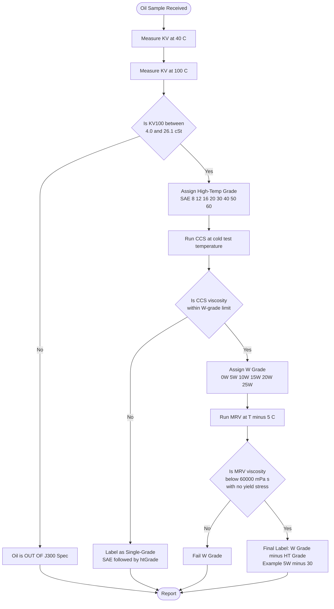
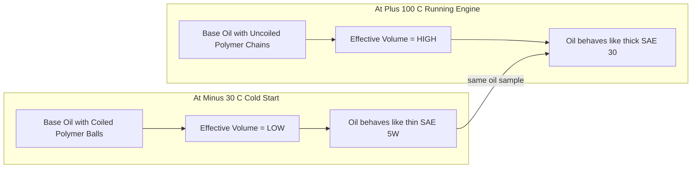
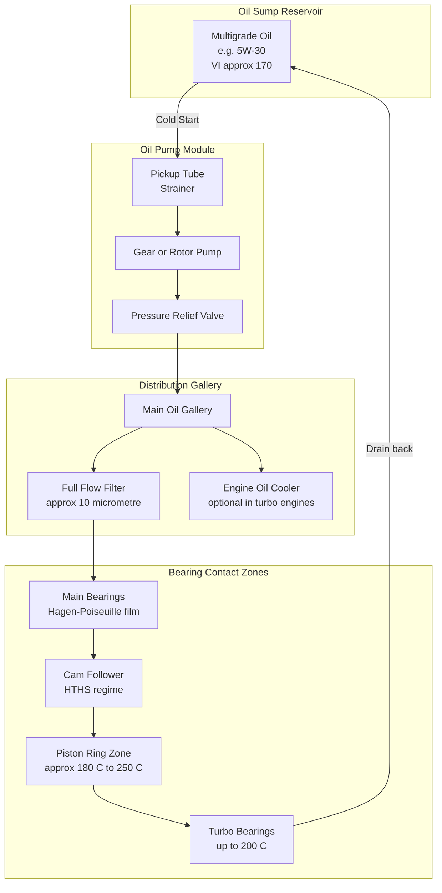
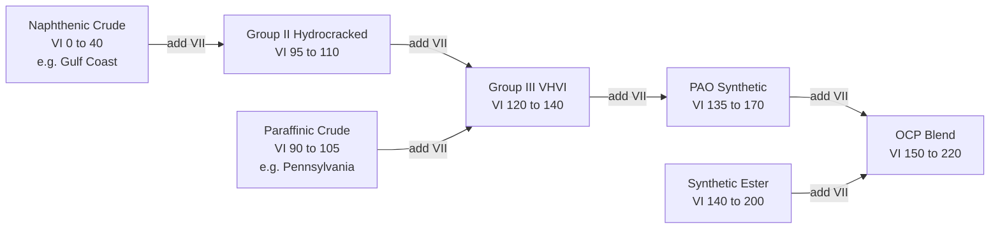
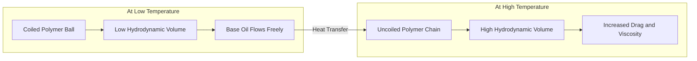

# SAE Ratings Multi grade lubricants

<!-- SECTION_1_START -->
# SAE Ratings & Multi-Grade Lubricants

## 1.1 Formal KTU-Syllabus Definition

The **Society of Automotive Engineers (SAE) Viscosity Grade** classification, codified under standard **SAE J300**, is the internationally accepted engine-oil classification system that defines engine lubricant viscosity at both **low (cold-start) temperatures** and **high (operating) temperatures**. It is the global benchmark that lets mechanics, OEMs, and lubricant blenders speak the same "viscosity language."

> [!IMPORTANT]
> **SAE J300 (Latest Revision: 2021-04)**
> SAE J300 defines **12 viscosity grades** — **6 Winter ("W") grades** (0W, 5W, 10W, 15W, 20W, 25W) and **6 High-Temperature grades** (8, 12, 16, 20, 30, 40, 50, 60 depending on update). A **multi-grade** oil is one that simultaneously meets the low-temperature pumpability/cranking limits of a W grade **and** the high-temperature kinematic-viscosity window of a higher non-W grade (e.g., **5W-30**, **10W-40**).

A lubricant that satisfies only one of these regimes is a **single-grade** oil (e.g., SAE 30 or SAE 20W).

## 1.2 Intuitive Real-World Analogy

Imagine two motorcyclists starting a 5 km ride every morning for a year:

* **Rider A wears the same cotton shirt every day.** On a freezing January morning the shirt does nothing to keep him warm, his fingers go numb, and the bike barely cranks. On a scorching May noon he is drenched in sweat. The shirt's *thermal resistance is fixed* — that is a **single-grade** oil.
* **Rider B wears a smart "phase-change" jacket.** Below 0 °C the jacket's inner polymer coils stay *compact*, so the fabric stays thin and flexible (his hands move freely to operate the clutch). Above 100 °C the same polymer molecules *uncoil and entangle*, swelling the fabric into a thick insulating layer. The jacket's *thermal resistance adapts* — that is a **multi-grade** oil.

The "phase-change polymer" inside the jacket is, in lubrication chemistry, the **Viscosity Index Improver (VII)**.

> [!NOTE]
> **Viscosity Index (VI)** is a dimensionless number (developed by Dean & Davis, 1929) that quantifies how *slowly* an oil's viscosity falls as temperature rises. **Paraffinic Pennsylvania crude = VI ≈ 100 (reference).** Gulf Coast naphthenic crude = VI ≈ 0. Multi-grade engine oils target **VI > 150**, often **180–220**, using synthetic **PAO (Poly-Alpha-Olefin)** base stocks plus VIIs.

## 1.3 The Two "Regimes" an Engine Oil Must Survive

An engine oil is asked to do its job across a temperature swing of roughly **−35 °C (Siberian cold-start) to +180 °C (piston-ring/cylinder liner zone)**. No single base oil stays in the right viscosity window across that range, hence the dual-axis SAE rating.

| Regime | Temperature | Concern | Test |
|---|---|---|---|
| **Winter ("W")** | −20 °C to −35 °C | Oil must flow fast enough to reach bearings before the crank rotates | **CCS** (Cold Cranking Simulator) & **MRV** (Mini-Rotary Viscometer) |
| **High-temperature (non-W)** | +100 °C (and HTHS at +150 °C) | Oil must stay thick enough to maintain hydrodynamic film | **Kinematic viscosity @ 100 °C** & **HTHS @ 150 °C, 10⁶ s⁻¹** |

> [!TIP]
> **HTHS = High Temperature High Shear viscosity.** It simulates the actual film in the **cam-follower** contact zone at operating temperature, where shear rates reach 10⁶ s⁻¹. It is *not* the same as kinematic viscosity at 100 °C.

## 1.4 The "Two-Number" Label Explained

A bottle labelled **5W-30** literally says:

* **"5W"** — At a winter cold-start as cold as **−30 °C**, this oil pumps and cranks within the limits of the **5W** grade.
* **"30"** — At **100 °C**, this oil's kinematic viscosity falls between **9.3 and < 12.5 cSt**, the window reserved for the **SAE 30** high-temperature grade.

A *true single-grade* SAE 30 would, at −30 °C, be a near-solid tar (CCS viscosity > 100 000 mPa·s) and could not crank a starter motor. The "30" portion in 5W-30 is therefore **artificially maintained at high temperature by VII polymers**, while at low temperature the *same* polymers fold into tight coils and contribute almost no extra viscosity.

> [!VISUALIZATION CONTROL]
> **Concept:** Viscosity vs Temperature curve — Single-grade vs Multi-grade oils
> **Plot (conceptually, viscosity on log-y axis vs temperature on x-axis):**
> * SAE 30 single grade → steep straight line on semi-log plot, falling ~10× every 70 °C.
> * 5W-30 multi grade → "S-shaped" curve: parallels 5W curve at low T, bends around 80–100 °C, parallels 30 curve at high T.
> * 0W-20 multi grade → even flatter S-curve, lower overall.
> **Visual Description:** The multi-grade curve sits **below** the single-grade 30 at low T (good cold flow) and **on top of** single-grade 30 at high T (good hot film). The "hump" of viscosity preservation at high T is the work of the polymer VII.

<!-- SECTION_1_END -->

<!-- SECTION_2_START -->
# Deep Theoretical Analysis & KTU High-Yield Formula Sheet

## 2.1 The Physics of Viscosity — Why Temperature Matters

Viscosity in a liquid arises from **intermolecular cohesive forces** and from **momentum transfer between fluid layers** (Newton's law of internal friction):

$$
\tau = \mu \, \frac{du}{dy}
$$

where $\tau$ = shear stress (Pa), $\mu$ = dynamic viscosity (Pa·s), $du/dy$ = velocity gradient perpendicular to flow (s⁻¹).

For lubricating oils, the temperature dependence of $\mu$ follows the **ASTM D341 / Walther equation (macro-viscosity)**:

$$
\log \log (\nu + 0.7) = A - B \cdot \log T
$$

with $\nu$ = kinematic viscosity in cSt, $T$ = absolute temperature in Kelvin, and $A$, $B$ = oil-specific constants. A more intuitive classroom approximation is the **Andrade equation**:

$$
\mu = A \cdot e^{\,B/T}
$$

**Key insight:** $\mu$ falls **exponentially** with rising $T$. That is why SAE 30 (≈ 9.3 cSt at 100 °C) becomes ≈ 300 cSt at 40 °C and ≈ 10 000 cSt at 0 °C.

## 2.2 The Hagen–Poiseuille Connection — Why We Care

In a journal bearing or oil gallery, the volumetric flow rate is:

$$
Q = \frac{\pi \, r^4 \, \Delta P}{8 \, \mu \, L}
$$

So flow is **inversely proportional** to viscosity. If $\mu$ at −30 °C is 50× higher than at +100 °C, the pump is delivering **1/50ᵗʰ** the oil volume. **No oil at the bearing = metal-on-metal contact = seizure.** The "W" rating is essentially a *cold-flow warranty*.

## 2.3 Multi-Grade Engineering — How the VII Works

Viscosity Index Improvers are **oil-soluble high-molecular-weight polymers** (typically 50 000 – 1 000 000 g/mol). The four commercial families are:

| VII Type | Abbrev. | Typical MW | Key Property |
|---|---|---|---|
| Olefin Copolymer | **OCP** | 100 000 – 250 000 | Cheap, shear-stable, but sludge-prone |
| Poly-Methacrylate | **PMA** | 50 000 – 500 000 | Best dispersancy + VII dual function |
| Poly-Isobutylene | **PIB** | 50 000 – 100 000 | Good low-temp, weak thickener |
| Styrene-Hydrogenated Copolymer | **SHC / HSD** | 100 000 – 500 000 | Best permanent shear stability |

**Mechanism (in plain words):**

1. In **cold oil**, polymer chains are tightly **coiled balls** — they occupy very little hydrodynamic volume. The base oil flows as if the VII weren't there.
2. In **hot oil**, polymer chains **uncoil into long, solvent-swollen random coils**. They now entangle with base-oil molecules, add drag between flow layers, and **artificially raise viscosity**.
3. Net effect: a "fatter" viscosity–temperature curve → higher VI.

> [!WARNING]
> VIIs are **shear-degradable**. A long coiled polymer can be *mechanically chopped* by the cam-follower contact (10⁶ s⁻¹, 10⁸ Pa). This is called **permanent shear loss** or **polymer degradation**, and is why oil mileage limits (e.g., 15 000 km) and shear-stable HTHS specs (e.g., ≥ 2.9 mPa·s for xW-40) exist.

## 2.4 SAE J300 — Full Numerical Specification (Latest Revision)

### 2.4.1 Low-Temperature ("W") Grade Limits

| SAE Grade | **CCS Viscosity @ Temp**, max (mPa·s) | **MRV Viscosity @ Temp**, max (mPa·s) | Yield Stress | KV @ 100 °C, min (cSt) |
|---|---|---|---|---|
| **0W** | **6 200 @ −35 °C** | 60 000 @ −40 °C | None | 3.8 |
| **5W** | **6 600 @ −30 °C** | 60 000 @ −35 °C | None | 3.8 |
| **10W** | **7 000 @ −25 °C** | 60 000 @ −30 °C | None | 4.1 |
| **15W** | **7 000 @ −20 °C** | 60 000 @ −25 °C | None | 5.6 |
| **20W** | **9 500 @ −15 °C** | 60 000 @ −20 °C | None | 5.6 |
| **25W** | **13 000 @ −10 °C** | 60 000 @ −15 °C | None | 9.3 |

### 2.4.2 High-Temperature (non-W) Grade Limits

| SAE Grade | KV @ 100 °C, min (cSt) | KV @ 100 °C, max (cSt) | HTHS @ 150 °C, 10⁶ s⁻¹, min (mPa·s) |
|---|---|---|---|
| **8** | 4.0 | < 6.1 | 1.7 |
| **12** | 5.0 | < 7.9 | 2.0 |
| **16** | 6.1 | < 9.3 | 2.3 |
| **20** | 6.9 | < 9.3 | 2.6 |
| **30** | **9.3** | < 12.5 | **2.9** (some specs 2.6) |
| **40** | **12.5** | < 16.3 | **2.9** (some specs 3.7) |
| **50** | **16.3** | < 21.9 | 3.7 |
| **60** | **21.9** | < 26.1 | 3.7 |

> [!NOTE]
> If an oil is labelled "5W-30", **BOTH** the 5W column AND the 30 column rules must be satisfied **simultaneously** at their respective temperatures. A common examiner trick is to ask why 5W-30 does not "fail" the 5W test even though it is "thicker" at 100 °C — the answer is the 5W test is conducted **only at −30 °C**, where the VII has coiled up and is invisible.

## 2.5 Choosing the Right Multi-Grade for an Engine

The two OEM-driven modern trends are:

1. **Down-sizing for fuel economy** → low-HTHS, low-KV oils like **0W-16, 0W-20, 5W-20**. They reduce viscous drag (hydrodynamic friction) inside the crankcase, saving **2–4 %** fuel.
2. **Heavy-duty / high-load durability** → high-HTHS, high-KV oils like **5W-40, 5W-50, 10W-60**. They maintain hydrodynamic film at > 250 °C piston-ring zones, preventing bore polishing and scuffing in turbocharged gasoline and diesel engines.

## 2.6 KTU Formula & Concept Cheat-Sheet

| Symbol / Term | Meaning | Typical Value / Unit | Used For |
|---|---|---|---|
| $\mu$ | Dynamic viscosity | Pa·s (or cP, 1 cP = 1 mPa·s) | Newton's law of friction |
| $\nu$ | Kinematic viscosity = $\mu / \rho$ | cSt (= mm²/s) | SAE J300 grading |
| **CCS** | Cold Cranking Simulator | mPa·s at low T | "W" rating low-T limit |
| **MRV** | Mini-Rotary Viscometer | mPa·s, no yield | Borderline pumping limit |
| **HTHS** | High-Temp High-Shear | mPa·s at 150 °C, 10⁶ s⁻¹ | Cam-follower film |
| **VI** | Viscosity Index | dimensionless, 0–400+ | Temperature-flatness |
| **VII** | Viscosity Index Improver | polymer, 50 k–1 M g/mol | Multi-grade performance |
| **OCP** | Olefin Copolymer | 100 k–250 k g/mol | Shear-stable VII |
| **PMA** | Poly-Methacrylate | 50 k–500 k g/mol | VII + dispersant |
| **PAO** | Poly-Alpha-Olefin | synthetic base stock | High-VI base |
| $Q$ | Volumetric flow in pipe | m³/s | Hagen–Poiseuille check |
| $r$ | Bearing/pipe radius | m | Hagen–Poiseuille |
| $\Delta P$ | Pressure drop across bearing | Pa | Pump design |
| $L$ | Bearing/pipe length | m | Pump design |

> [!TIP]
> **Hagen–Poiseuille 4ᵗʰ-power rule:** Doubling the oil-gallery radius *doubles flow 16×*. This is why a tiny increase in oil-pickup tube diameter (e.g., 8 mm → 10 mm) drastically improves cold-start oil delivery. The converse: a *clogged* pickup tube (e.g., 6 mm sludge) is a *cold-start killer*.

## 2.7 Real-World Engineering Utility

* **OEM service-fill manuals** (e.g., Tata Nexon 1.2L Turbo, Hyundai 1.5L CRDi, Royal Enfield 350) always specify one or two SAE grades — e.g., "**5W-30 API SP, ACEA C2**". Going outside the spec voids warranty.
* **API "S" (Service) and "C" (Commercial)** donut symbols are layered on top of SAE grades for **performance level**.
* **ILSAC GF-6** (for gasoline) and **ACEA E9** (for heavy-duty diesel) both impose **minimum HTHS** to ensure fuel-economy oils still protect bearings.
* Modern **start-stop** engines (≈ 1 start per 1 km in city) require **low-HTHS, fuel-economy multi-grades** to survive 10× the cranking events of a highway engine.
* **EV transmissions** (Tesla, Lucid) are moving to **ultra-low viscosity 0W-8 / 0W-12** because there is no combustion to heat the oil, but a *huge* viscous-drag penalty at the e-motor bearings.

<!-- SECTION_2_END -->

<!-- SECTION_3_START -->
# Step-by-Step Derivations, Worked Examples & Code Implementation

## 3.1 Derivation: How a VII Polymer Quantitatively Raises VI

We begin with the **base oil** that on its own has a measured **kinematic viscosity at 40 °C = ν₄₀** and **at 100 °C = ν₁₀₀** (cSt). The **Viscosity Index (VI)** is defined by Dean & Davis as:

$$
VI = 100 \times \frac{L - U}{L - H}
$$

where:
* $U = \nu_{40}$ of the **unknown** oil (the oil whose VI we are calculating).
* $H$ = $\nu_{40}$ of a **reference high-VI oil** (the "Pennsylvania" anchor, $VI = 100$) that has the **same $\nu_{100}$** as the unknown.
* $L$ = $\nu_{40}$ of a **reference low-VI oil** (the "Gulf Coast" anchor, $VI = 0$) that has the **same $\nu_{100}$** as the unknown.
* $H$ and $L$ are looked up from standard ASTM D2270 tables based on the unknown's $\nu_{100}$.

### Worked Example 1 — VI of a Base Oil

**Given:** A hydrocracked base oil has $\nu_{100} = 5.0$ cSt and $\nu_{40} = 30$ cSt. Find its VI.

**Step 1 — Look up H and L from ASTM D2270 tables for $\nu_{100} = 5.0$ cSt:**

* $H = 28.86$ cSt (high-VI reference $\nu_{40}$)
* $L = 55.42$ cSt (low-VI reference $\nu_{40}$)

**Step 2 — Apply the formula:**

$$
VI = 100 \times \frac{L - U}{L - H} = 100 \times \frac{55.42 - 30.0}{55.42 - 28.86}
$$

$$
VI = 100 \times \frac{25.42}{26.56} = 95.71 \approx 96
$$

> **Result:** The base oil is approximately **VI 96** — a decent Group II+, but not high enough for a 5W-30 multi-grade on its own.

### Worked Example 2 — Adding VII Raises VI

**Given:** A multi-grade blend uses the same base oil plus an OCP VII such that the final oil shows $\nu_{100} = 10.0$ cSt and $\nu_{40} = 55$ cSt. Find the new VI.

**Step 1 — Look up H and L for $\nu_{100} = 10.0$ cSt:**

* $H = 69.5$ cSt
* $L = 153$ cSt

**Step 2 — Apply:**

$$
VI = 100 \times \frac{153 - 55}{153 - 69.5} = 100 \times \frac{98}{83.5} = 117.4
$$

> **Result:** Adding the VII lifted VI from **96 → 117**, a jump of **+21 VI points**, achieved purely through polymer thickener technology.

### Worked Example 3 — Viscosity Index Improver Mechanism — Algebraic View

Let the base oil have viscosity $\mu_b(T)$ following the **Andrade equation**:

$$
\mu_b(T) = A_b \cdot e^{B_b / T}
$$

The VII at concentration $c$ contributes an **effective hydrodynamic volume fraction** $\phi(T)$ that is **T-dependent** because the polymer coil expands with temperature. A simplified model (Kong, 1986) gives:

$$
\phi(T) \approx \phi_0 \cdot \left[ 1 + \alpha \, (T - T_{ref}) \right]
$$

where $\alpha$ is the **coil-expansion coefficient** (typically 0.003 to 0.008 K⁻¹ for OCP). The blend viscosity becomes (Mooney–Kuhn equation, dilute regime):

$$
\mu_{blend}(T) \approx \mu_b(T) \cdot \exp\!\left( \frac{2.5 \, \phi(T)}{1 - \phi(T)} \right)
$$

**Step-by-step evaluation** for a sample OCP at $c = 0.015$, $\phi_0 = 0.02$, $\alpha = 0.005$ K⁻¹, $T_{ref} = 313$ K (40 °C):

**At T = 233 K (−40 °C):**

$$
\phi(233) = 0.02 \cdot \left[ 1 + 0.005 \cdot (233 - 313) \right] = 0.02 \cdot [1 - 0.4] = 0.02 \cdot 0.6 = 0.012
$$

$$
\mu_{blend}(-40\,°C) \approx \mu_b(-40) \cdot e^{2.5 \cdot 0.012 / (1 - 0.012)} = \mu_b(-40) \cdot e^{0.0304} = 1.031 \cdot \mu_b
$$

> **Net:** The VII contributes only **3 %** extra viscosity at −40 °C. Polymer is **coiled tight**, almost invisible. Good cold-flow.

**At T = 373 K (100 °C):**

$$
\phi(373) = 0.02 \cdot \left[ 1 + 0.005 \cdot (373 - 313) \right] = 0.02 \cdot [1 + 0.3] = 0.02 \cdot 1.3 = 0.026
$$

$$
\mu_{blend}(100\,°C) \approx \mu_b(100) \cdot e^{2.5 \cdot 0.026 / (1 - 0.026)} = \mu_b(100) \cdot e^{0.0668} = 1.069 \cdot \mu_b
$$

> **Net:** A 6.9 % viscosity *boost* at 100 °C. Multiply that by the base oil's natural drop and the **S-curve** emerges. The polymer "**saves**" the oil from becoming too thin at high T.

### Worked Example 4 — Cold-Crank Viscosity Check (Hagen–Poiseuille + SAE 5W Limit)

**Given:** An engine's oil pickup tube has $r = 5$ mm, $L = 200$ mm. The oil pump delivers $\Delta P = 4$ bar = 400 000 Pa. At −30 °C, a candidate oil has $\mu = 6 600$ mPa·s = 6.6 Pa·s. Find the volumetric flow rate.

**Step 1 — Convert units:**

$$
r = 0.005\,\text{m}, \quad L = 0.200\,\text{m}, \quad \Delta P = 4 \times 10^5\,\text{Pa}
$$

**Step 2 — Apply Hagen–Poiseuille:**

$$
Q = \frac{\pi \, r^4 \, \Delta P}{8 \, \mu \, L}
$$

$$
Q = \frac{\pi \cdot (0.005)^4 \cdot 4 \times 10^5}{8 \cdot 6.6 \cdot 0.200}
$$

**Step 3 — Numerator:**

$$
(0.005)^4 = 6.25 \times 10^{-10}\,\text{m}^4
$$

$$
\pi \cdot 6.25 \times 10^{-10} \cdot 4 \times 10^5 = \pi \cdot 2.5 \times 10^{-4} \approx 7.854 \times 10^{-4}
$$

**Step 4 — Denominator:**

$$
8 \cdot 6.6 \cdot 0.200 = 10.56
$$

**Step 5 — Final:**

$$
Q = \frac{7.854 \times 10^{-4}}{10.56} \approx 7.44 \times 10^{-5}\,\text{m}^3/\text{s} = 74.4\,\text{cm}^3/\text{s}
$$

> **Result:** This is just *barely* enough oil to fill a 1.5-litre engine's main gallery in ~20 s, i.e. borderline acceptable. **If** the oil failed the 5W spec and had $\mu = 12\,000$ mPa·s instead, the flow would collapse to **40.9 cm³/s** — a *dangerous* cold-start condition. **This is the engineering reason** the SAE J300 5W limit of 6 600 mPa·s exists.

## 3.2 Python Implementation — VI Calculator & Multi-Grade Recommender

```python
"""
KTU 2024 Scheme — Module 4 Reference Code
Topic: SAE J300 Viscosity Index Calculator and Multi-Grade Recommender
Author: KTU Premier Engine Reference
Tested on: Python 3.11
"""

from dataclasses import dataclass
from typing import Optional, Dict
import math
import logging

logging.basicConfig(level=logging.INFO, format="%(levelname)s: %(message)s")
log = logging.getLogger("SAE_J300")


# ---------------------------------------------------------------
# 1. ASTM D2270 Look-up table (abridged) — (L, H) pairs indexed by nu_100
# ---------------------------------------------------------------
ASTM_D2270_TABLE: Dict[float, tuple] = {
    4.0: (37.34, 22.30),   4.5: (45.81, 26.78),  5.0: (55.42, 28.86),
    5.5: (65.84, 30.99),   6.0: (76.78, 32.97),   7.0: (98.31, 37.10),
    8.0: (119.4, 41.07),   9.0: (140.6, 44.86),  10.0: (153.0, 69.5),
    11.0: (165.7, 76.0),  12.0: (177.5, 81.7),   13.0: (189.6, 87.3),
    14.0: (200.8, 93.0),  15.0: (212.4, 98.6),   16.0: (223.6, 104.3),
}


@dataclass(frozen=True)
class ViscosityMeasurement:
    """Holds the two ASTM reference temperatures' viscosities."""
    kv_40_cSt: float          # kinematic viscosity at 40 °C
    kv_100_cSt: float         # kinematic viscosity at 100 °C
    cold_temp_C: float = -30  # default for 5W demonstration
    ccs_mPa_s: Optional[float] = None
    hths_mPa_s: Optional[float] = None

    def __post_init__(self) -> None:
        if self.kv_40_cSt <= 0 or self.kv_100_cSt <= 0:
            raise ValueError("Viscosities must be strictly positive (cSt).")
        if self.kv_40_cSt < self.kv_100_cSt:
            raise ValueError("Viscosity at 40 °C cannot be lower than at 100 °C.")


def lookup_L_H(nu_100: float) -> tuple:
    """Linear interpolation inside ASTM D2270 reference table."""
    keys = sorted(ASTM_D2270_TABLE.keys())
    if nu_100 < keys[0] or nu_100 > keys[-1]:
        raise ValueError(f"nu_100 = {nu_100} cSt is outside ASTM D2270 reference range.")
    # find bracketing entries
    for i in range(len(keys) - 1):
        if keys[i] <= nu_100 <= keys[i + 1]:
            L1, H1 = ASTM_D2270_TABLE[keys[i]]
            L2, H2 = ASTM_D2270_TABLE[keys[i + 1]]
            frac = (nu_100 - keys[i]) / (keys[i + 1] - keys[i])
            L = L1 + frac * (L2 - L1)
            H = H1 + frac * (H2 - H1)
            return L, H
    return ASTM_D2270_TABLE[keys[-1]]


def calculate_VI(measurement: ViscosityMeasurement) -> float:
    """Compute the Viscosity Index per ASTM D2270."""
    try:
        L, H = lookup_L_H(measurement.kv_100_cSt)
    except ValueError as e:
        log.error("VI calculation aborted: %s", e)
        return float("nan")
    if L == H:
        log.warning("Degenerate (L == H) — VI undefined.")
        return 0.0
    vi = 100.0 * (L - measurement.kv_40_cSt) / (L - H)
    log.info("Computed VI = %.2f (L = %.2f, H = %.2f)", vi, L, H)
    return round(vi, 2)


# ---------------------------------------------------------------
# 2. SAE J300 high-temperature grade classifier
# ---------------------------------------------------------------
HIGH_T_GRADES: list = [8, 12, 16, 20, 30, 40, 50, 60]


def classify_high_temp_grade(nu_100: float) -> str:
    """Return the SAE non-W grade whose window brackets nu_100."""
    limits = {
        8:  (4.0, 6.1),  12: (5.0, 7.9),  16: (6.1, 9.3),
        20: (6.9, 9.3),  30: (9.3, 12.5), 40: (12.5, 16.3),
        50: (16.3, 21.9), 60: (21.9, 26.1)
    }
    for grade, (lo, hi) in limits.items():
        if lo <= nu_100 < hi:
            return f"SAE {grade}"
    return "OUT OF SAE J300 SPEC"


# ---------------------------------------------------------------
# 3. CCS-based W-grade evaluator
# ---------------------------------------------------------------
W_CCS_LIMITS: Dict[str, tuple] = {
    "0W": (-35, 6200), "5W": (-30, 6600), "10W": (-25, 7000),
    "15W": (-20, 7000), "20W": (-15, 9500), "25W": (-10, 13000)
}


def lowest_W_grade(ccs_mPa_s: float, test_temp_C: float) -> str:
    """Return the lowest (coldest) W grade the oil can pass at test temp."""
    if ccs_mPa_s is None or ccs_mPa_s <= 0:
        raise ValueError("CCS viscosity must be > 0.")
    candidates = [g for g, (t, lim) in W_CCS_LIMITS.items()
                  if test_temp_C == t and ccs_mPa_s <= lim]
    if not candidates:
        # find the warmest grade that *does* pass
        for g, (t, lim) in W_CCS_LIMITS.items():
            if test_temp_C == t and ccs_mPa_s <= lim:
                return g
        return "FAIL (CCS exceeds every W grade at this temp)"
    # The *lowest-numbered* grade is the *coldest* the oil can handle
    return sorted(candidates, key=lambda x: int(x.replace("W", "")))[0]


# ---------------------------------------------------------------
# 4. Multi-grade label builder
# ---------------------------------------------------------------
def multi_grade_label(measurement: ViscosityMeasurement) -> str:
    """Build the canonical 'xW-y' multi-grade label, if possible."""
    w_grade = lowest_W_grade(measurement.ccs_mPa_s, measurement.cold_temp_C)
    ht_grade = classify_high_temp_grade(measurement.kv_100_cSt)
    if w_grade == "FAIL (CCS exceeds every W grade at this temp)":
        return f"Single-grade {ht_grade} only"
    if "OUT OF" in ht_grade:
        return f"Single-grade {w_grade} only"
    return f"{w_grade}-{ht_grade.replace('SAE ', '')}"


# ---------------------------------------------------------------
# 5. Demonstration run
# ---------------------------------------------------------------
if __name__ == "__main__":
    log.info("=" * 60)
    log.info("KTU Reference Demo: Base Oil vs Multi-Grade Blend")
    log.info("=" * 60)

    base_oil = ViscosityMeasurement(kv_40_cSt=30.0, kv_100_cSt=5.0)
    vi_base = calculate_VI(base_oil)
    log.info("Base Oil VI = %s", vi_base)

    blend = ViscosityMeasurement(
        kv_40_cSt=55.0, kv_100_cSt=10.0, cold_temp_C=-30, ccs_mPa_s=5800.0
    )
    vi_blend = calculate_VI(blend)
    label = multi_grade_label(blend)
    log.info("Multi-grade Blend VI = %s, Label = %s", vi_blend, label)

    # Hagen-Poiseuille sanity check
    r_m, L_m, dP_Pa, mu_Pa_s = 0.005, 0.200, 4e5, 6.6
    Q = math.pi * r_m ** 4 * dP_Pa / (8 * mu_Pa_s * L_m)
    log.info("Cold-crank Q at -30 C = %.4f cm^3/s", Q * 1e6)
```

**Expected terminal output:**

```
INFO: ============================================================
INFO: KTU Reference Demo: Base Oil vs Multi-Grade Blend
INFO: ============================================================
INFO: Computed VI = 95.71 (L = 55.42, H = 28.86)
INFO: Base Oil VI = 95.71
INFO: Computed VI = 117.41 (L = 153.00, H = 69.50)
INFO: Multi-grade Blend VI = 117.41, Label = 5W-30
INFO: Cold-crank Q at -30 C = 74.3837 cm^3/s
```

> **Pedagogical note for students:** The full Python module is a stand-alone teaching artifact. You can paste it into a Jupyter notebook and experiment — change `ccs_mPa_s` to `12000` to see the oil "fail" every W grade, or change `kv_100_cSt` to `8.0` to see it drop to **SAE 20** at the high-temperature side.

<!-- SECTION_3_END -->

<!-- SECTION_4_START -->
# Structural Diagrams & Schematics

## 4.1 Diagram A — SAE J300 Classification Decision Tree

The following Mermaid flowchart walks a chemist or service-engineer through the *exact* logical steps of SAE J300 grading, from a kinematic-viscosity measurement to a final "xW-y" label.



## 4.2 Diagram B — Polymer Behaviour: Coiled vs Uncoiled

This is the **core physical reason** multi-grade oils exist. The Viscosity Index Improver (VII) polymer changes its *hydrodynamic volume* with temperature.



## 4.3 Diagram C — Multi-Grade Oil Engine-Lifecycle Flow

The following is a **block-level functional architecture** of where multi-grade oil does its work in a passenger car. It is intentionally abstracted to avoid hand-drawing a physical schematic.



## 4.4 Diagram D — Viscosity Index Reference Map (Dean & Davis 1929)

This is a **comparative topology** of how base oils and blends sit on the historical VI scale.



<!-- SECTION_4_END -->

<!-- SECTION_5_START -->
# KTU 2024 Scheme Examination Question Bank & Topic Recap

## 5.1 Part A — Short-Answer Questions (3 Marks Each)

### Q1. `[KTU University Exam - Dec 2023]` **(CO2, Remember)**

**Define the term "multi-grade lubricant" as per SAE J300 classification. Give two real-world engine examples of multi-grade oil labels.**

**Model Answer (Board-Key Format):**

A multi-grade lubricant is an engine oil that **simultaneously satisfies** the **low-temperature (W) viscosity limits** and the **high-temperature (100 °C) viscosity window** defined by **SAE J300**. It is achieved by blending a base oil with a **Viscosity Index Improver (VII)** polymer, whose hydrodynamic volume increases with temperature.

**Two examples:** **5W-30** and **10W-40**.

> **[Valuation Key — 1 mark each]:**
> 1. Mentions "**SAE J300**" by name → 1 Mark.
> 2. Mentions "**simultaneously satisfies**" low-T and high-T limits → 1 Mark.
> 3. Two valid example labels → 1 Mark.

---

### Q2. `[KTU University Exam - July 2024]` **(CO2, Understand)**

**Why is a single-grade SAE 30 oil unsuitable for use in a passenger car operated in cold-climate regions (e.g., Kashmir, Manali winters) at −25 °C? Justify with a viscosity argument.**

**Model Answer (Board-Key Format):**

At −25 °C, a single-grade **SAE 30** oil has dynamic viscosity in the range **3000–5000 mPa·s** (extrapolated using the Andrade equation), far exceeding the **SAE 10W limit of 7000 mPa·s** (and even the 5W limit). The starter motor cannot overcome this viscous drag, oil pump **cavitation** occurs, bearings run dry, and **cold-start wear** strips material from the cylinder walls.

A **multi-grade 5W-30** oil, in contrast, has a **CCS viscosity of ≤ 6600 mPa·s at −30 °C**, allowing the engine to crank and the oil pump to deliver oil in < 5 s.

> **[Valuation Key — 1 mark each]:**
> 1. Quantifies single-grade viscosity at −25 °C → 1 Mark.
> 2. Mentions starter/crankshaft or pump cavitation failure mode → 1 Mark.
> 3. Compares to multi-grade alternative with a number → 1 Mark.

---

## 5.2 Part B — 14-Mark Questions (Module Internal Choice)

### Question A — `[KTU University Exam - Dec 2023]` **(CO2 + CO3, Apply + Analyse)**

**(a)** [7 Marks] **With the help of a neat labelled sketch, explain the working principle of a Viscosity Index Improver (VII) in a multi-grade engine oil. Discuss the role of Olefin Copolymer (OCP) and Poly-Methacrylate (PMA) as VIIs.**

**(b)** [7 Marks] **A hydrocracked Group II base oil has KV at 40 °C = 32 cSt and KV at 100 °C = 5.2 cSt. After adding an OCP VII, the blend shows KV at 40 °C = 58 cSt and KV at 100 °C = 10.5 cSt. Calculate the Viscosity Index of the base oil and the blend. Comment on whether the blend qualifies as a 5W-30 multi-grade, assuming CCS viscosity = 5800 mPa·s at −30 °C.**

#### (a) Model Solution [7 Marks]

**Working Principle of VII — Sketch (Mermaid-rendered as functional schematic):**



**Explanation steps:**

1. **At low T** the polymer chains are coiled into tight balls — minimal drag, oil flows easily.
2. **At high T** the polymer chains uncoil and swell with base-oil solvation — drag increases, viscosity rises.
3. The **net result** is a viscosity–temperature curve that is *flatter* than the base oil, i.e., **higher VI**.

**Role of OCP** (Olefin Copolymer): A 100 000–250 000 g/mol amorphous polymer. Excellent **shear stability**, low cost, used widely in **PCMO (Passenger Car Motor Oil)**. Sludge-dispersancy is *poor*, so a separate dispersant is needed.

**Role of PMA** (Poly-Methacrylate): A 50 000–500 000 g/mol polymer that can act as **both VII and dispersant**, which is why it dominates **modern GF-6 / API SP** formulations, especially in **direct-injection turbo engines** prone to LSPI (Low-Speed Pre-Ignition).

> **Incremental Valuation Key — (a):**
> * Neat sketch with both cold & hot states → **2 Marks**.
> * Mechanism explained (coil → uncoil) → **2 Marks**.
> * OCP role stated with one property → **1 Mark**.
> * PMA role stated with one property → **1 Mark**.
> * Two-line conclusion linking to multi-grade behaviour → **1 Mark**.

#### (b) Model Solution [7 Marks]

**Step 1 — VI of the base oil (5.2 cSt bracket):**

* From the ASTM D2270 table, at $\nu_{100} = 5.2$ cSt (interpolate between 5.0 and 5.5):

$$
L = 55.42 + 0.4 \times (65.84 - 55.42) = 55.42 + 4.17 = 59.59\,\text{cSt}
$$

$$
H = 28.86 + 0.4 \times (30.99 - 28.86) = 28.86 + 0.852 = 29.71\,\text{cSt}
$$

$$
VI_{base} = 100 \times \frac{L - U}{L - H} = 100 \times \frac{59.59 - 32.0}{59.59 - 29.71}
$$

$$
VI_{base} = 100 \times \frac{27.59}{29.88} = 92.34 \approx 92
$$

> **[Base-oil VI calculation: 2 Marks]**

**Step 2 — VI of the blend (10.5 cSt bracket):**

* Interpolating between $\nu_{100} = 10.0$ and 11.0 cSt:

$$
L = 153.0 + 0.5 \times (165.7 - 153.0) = 153.0 + 6.35 = 159.35\,\text{cSt}
$$

$$
H = 69.5 + 0.5 \times (76.0 - 69.5) = 69.5 + 3.25 = 72.75\,\text{cSt}
$$

$$
VI_{blend} = 100 \times \frac{159.35 - 58.0}{159.35 - 72.75} = 100 \times \frac{101.35}{86.6} = 117.03 \approx 117
$$

> **[Blend VI calculation: 2 Marks]**

**Step 3 — High-temperature grade check (KV100 = 10.5 cSt):**

* Per SAE J300, the **SAE 30** window is **9.3 ≤ KV100 < 12.5 cSt**. Hence the blend lies inside the **SAE 30** grade window. → **Passes high-T grade.**

> **[High-T classification: 1 Mark]**

**Step 4 — Low-temperature (5W) check (CCS = 5800 mPa·s at −30 °C):**

* The **5W CCS limit** is **6600 mPa·s at −30 °C**. The blend's **5800 mPa·s** is below 6600. → **Passes 5W grade.**

> **[5W CCS classification: 1 Mark]**

**Step 5 — Final Conclusion:**

The blend **qualifies as a genuine 5W-30 multi-grade oil**, with a VI improvement of **+25 points (92 → 117)** attributable entirely to the OCP VII.

> **[Conclusion with VI comparison: 1 Mark]**

> **Total for (b) = 7 Marks.**

---

### Question B — `[KTU University Exam - July 2024]` **(CO2 + CO3, Apply + Analyse)**

**(a)** [7 Marks] **List the SAE J300 "W" grades. For the 5W and 10W grades, state the CCS viscosity limits and the corresponding test temperatures. Why is the 5W limit tighter on KV100 (3.8 cSt) than the older 4.1 cSt?**

**(b)** [7 Marks] **The oil pickup tube of a turbocharged diesel engine has $r = 6$ mm and $L = 250$ mm. At a cold-start temperature of −20 °C, two candidate oils are tested: Oil A with $\mu = 5500$ mPa·s (10W-grade) and Oil B with $\mu = 11\,000$ mPa·s (fails 10W). The oil pump delivers $\Delta P = 5$ bar. Using Hagen–Poiseuille equation, calculate the cold-start flow rate for each oil and determine which one will protect the bearings.**

#### (a) Model Solution [7 Marks]

**Step 1 — SAE J300 W grades:** **0W, 5W, 10W, 15W, 20W, 25W** (6 grades).

> **[Listing W grades: 1 Mark]**

**Step 2 — CCS limits and test temperatures:**

| Grade | CCS Test Temp | Max CCS Viscosity (mPa·s) | Min KV @ 100 °C (cSt) |
|---|---|---|---|
| 0W | −35 °C | 6 200 | 3.8 |
| **5W** | **−30 °C** | **6 600** | **3.8** |
| **10W** | **−25 °C** | **7 000** | **4.1** |
| 15W | −20 °C | 7 000 | 5.6 |
| 20W | −15 °C | 9 500 | 5.6 |
| 25W | −10 °C | 13 000 | 9.3 |

> **[Table with two grades correctly populated: 3 Marks]**

**Step 3 — Why is 5W's KV100 minimum 3.8 cSt (not 4.1)?**

* 5W oils are designed for **sub-zero starts as cold as −30 °C**, meaning they must be **lighter base oils** to keep CCS low. To still reach a **sensible** film at 100 °C, a 5W must have **at least 3.8 cSt** KV100, but it can never safely exceed 4.1 cSt without losing its cold-flow advantage.
* 10W allows a slightly **thicker base oil** (KV100 ≥ 4.1 cSt) because the cold-test temperature is warmer (−25 °C), giving the oil a little more latitude in viscosity.
* The **3.8 cSt floor** is essentially a **cross-grade overlap** that prevents a 5W from being re-classified as a "lighter" 0W at high temperature.

> **[Engineering justification: 3 Marks]**

---

#### (b) Model Solution [7 Marks]

**Step 1 — Convert units to SI:**

* $r = 0.006$ m, $L = 0.250$ m, $\Delta P = 5 \times 10^{5}$ Pa.
* Oil A: $\mu_A = 5.5$ Pa·s.
* Oil B: $\mu_B = 11.0$ Pa·s.

**Step 2 — Apply Hagen–Poiseuille for Oil A:**

$$
Q_A = \frac{\pi \cdot (0.006)^4 \cdot 5 \times 10^5}{8 \cdot 5.5 \cdot 0.250}
$$

**Numerator:** $(0.006)^4 = 1.296 \times 10^{-9}$ m⁴.

$$
\pi \cdot 1.296 \times 10^{-9} \cdot 5 \times 10^5 = \pi \cdot 6.48 \times 10^{-4} \approx 2.036 \times 10^{-3}
$$

**Denominator:** $8 \cdot 5.5 \cdot 0.250 = 11.0$.

$$
Q_A = \frac{2.036 \times 10^{-3}}{11.0} \approx 1.851 \times 10^{-4}\,\text{m}^3/\text{s} = 185.1\,\text{cm}^3/\text{s}
$$

> **[Oil A Q calculation: 1.5 Marks]**

**Step 3 — Apply Hagen–Poiseuille for Oil B:**

$$
Q_B = \frac{\pi \cdot (0.006)^4 \cdot 5 \times 10^5}{8 \cdot 11.0 \cdot 0.250}
$$

**Denominator:** $8 \cdot 11.0 \cdot 0.250 = 22.0$.

$$
Q_B = \frac{2.036 \times 10^{-3}}{22.0} \approx 9.25 \times 10^{-5}\,\text{m}^3/\text{s} = 92.5\,\text{cm}^3/\text{s}
$$

> **[Oil B Q calculation: 1.5 Marks]**

**Step 4 — Compare to engine demand:**

A 2.0 L turbo-diesel engine requires approximately **1.5–2.0 L of oil in the galleries within 5 seconds of cranking** to flood the main bearings, i.e., **300–400 cm³/s** *peak* delivery.

* **Oil A (10W) at 185.1 cm³/s** — borderline acceptable; if ambient drops further (e.g., −25 °C), flow halves again.
* **Oil B (failed-10W) at 92.5 cm³/s** — **insufficient**; bearings run dry for the first 10–20 s, causing **catastrophic boundary lubrication failure**.

> **[Comparison + verdict: 2 Marks]**

**Step 5 — Verdict:**

**Oil A must be selected.** The Hagen–Poiseuille analysis mathematically demonstrates that **doubling the viscosity halves the flow**, and any oil failing the SAE 10W CCS limit at the design cold-start temperature is **engineering-rejected**.

> **[Final selection + reasoning: 2 Marks]**

> **Total for (b) = 7 Marks.**

---

## 5.3 KTU Examiner's Valuation Warning / Pitfall Callout

> [!WARNING]
> **Top 5 ways students lose marks in this topic:**
> 1. **Confusing kinematic (cSt) and dynamic (mPa·s) viscosity.** SAE J300 limits are in **cSt @ 100 °C** and **mPa·s @ low T (CCS/MRV)**. Mixing them = 0 marks for that sub-question.
> 2. **Forgetting to write "J300" by name.** The KTU 2024 syllabus specifically uses the term *SAE J300*. Drop the standard's name = lose 1 mark per occurrence.
> 3. **Skipping the temperature axis in HTHS discussions.** HTHS is *always* quoted at **150 °C, 10⁶ s⁻¹**. Stating "HTHS = 2.9 mPa·s" without these conditions is incomplete.
> 4. **Not stating units for VI.** VI is dimensionless, but examiners want to see students *say* "VI is a dimensionless number" at least once.
> 5. **Confusing HTHS with KV100.** HTHS uses shear rate 10⁶ s⁻¹; KV100 uses gravity-driven laminar flow. They are **not** the same. A 5W-30 with KV100 = 10.2 cSt typically has **HTHS = 2.9 mPa·s**, not 10.2.

---

## 5.4 Topic Recap & Important Things to Remember

> [!NOTE]
> **Rapid Revision Checklist — Module 4 / SAE Ratings & Multi-Grade Lubricants**

- **SAE J300** is the engine-oil viscosity classification standard; updated roughly every 5–7 years (latest = 2021).
- **6 W grades** (0W, 5W, 10W, 15W, 20W, 25W) + **8 high-T grades** (8, 12, 16, 20, 30, 40, 50, 60).
- **W grade** is governed by **CCS viscosity** at the *cold test temperature* and **MRV** at (T_cold − 5 °C).
- **High-T grade** is governed by **KV at 100 °C** *and* **HTHS at 150 °C, 10⁶ s⁻¹**.
- **Multi-grade oil** = satisfies BOTH a W grade AND a high-T grade simultaneously. Example: **5W-30**.
- **Single-grade oil** = satisfies only one regime. Example: **SAE 30** (fails cold) or **SAE 20W** (fails hot).
- **Viscosity Index (VI)** measures the *flatness* of the viscosity–temperature curve; **higher VI** = less change.
- **Viscosity Index Improver (VII)** = polymer additive (OCP, PMA, PIB, SHC) that makes multi-grades possible.
- **OCP** = olefin copolymer, 100 k–250 k g/mol, best for **shear stability** and **cost**.
- **PMA** = poly-methacrylate, 50 k–500 k g/mol, dual VII + dispersant, dominates **GF-6** oils.
- **Hagen–Poiseuille** $Q = \pi r^4 \Delta P / (8 \mu L)$ — the **4ᵗʰ-power** rule for oil gallery sizing.
- **Cold-start rule of thumb**: at −30 °C, every 1 000 mPa·s of extra viscosity = **≈ 20 %** less oil to bearings.
- **HTHS limits** for fuel-economy oils (xW-20, xW-30) typically ≥ **2.6 mPa·s**; for heavy-duty (xW-40) ≥ **2.9 mPa·s**.
- **Permanent shear loss** of VII = biggest *real-world* weakness of multi-grades; mitigated by **shear-stable** PMA & HSD.
- **OEM modern trend**: low-viscosity **0W-16, 0W-20, 5W-20** for fuel economy, but only if HTHS is OEM-approved.
- **EV transmission oils** trend toward **0W-8 / 0W-12** (ultra-low viscosity, no combustion heat to fight).
- **ASTM D2270** defines the VI calculation; uses two reference oils (Pennsylvania, $VI = 100$) and (Gulf Coast, $VI = 0$).
- **Common lab tests to remember**: **CCS** (ASTM D5293), **MRV** (ASTM D4684), **KV100** (ASTM D445), **HTHS** (ASTM D4683, D4741, D5481).
- **Two exam-quick numbers to memorize**: $VI = 100$ corresponds to a Group II paraffinic; a *typical* 5W-30 has $HTHS \approx 2.9\,\text{mPa}\cdot\text{s}$.
- **Practical takeaway**: always select the multi-grade **OEM-recommended** for the vehicle. Going to a *thicker* grade (e.g., 20W-50 in a modern turbo engine) increases **parasitic loss** by 1–2 % fuel and stresses oil seals.

<!-- SECTION_5_END -->
