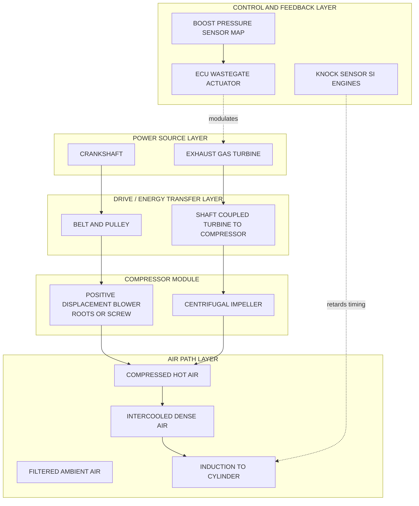
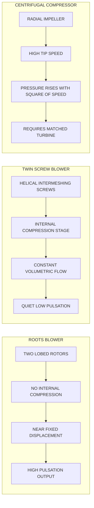
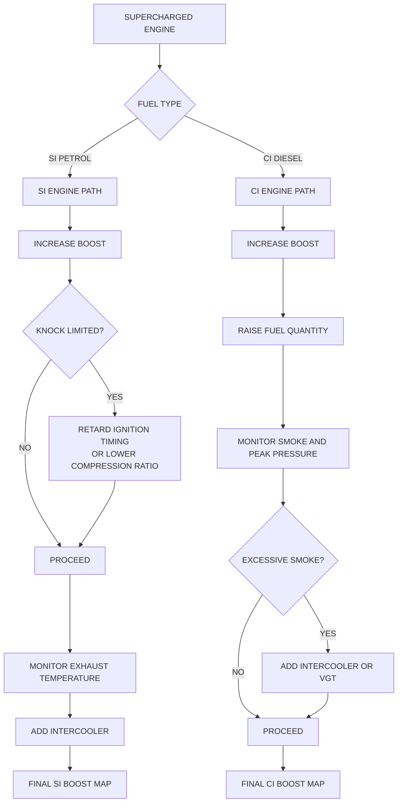

# Supercharging and Turbocharging in I C Engines.

<!-- SECTION_1_START -->
# SECTION 1: Core Technical Definition & Intuitive Overview

## Supercharging & Turbocharging — Formal Definition

> [!NOTE]
> **Supercharging** is the process of supplying compressed air (or an air–fuel mixture) to the engine cylinders at a pressure **greater than the ambient atmospheric pressure**, with the primary objective of increasing the mass of charge inducted per cycle, thereby raising the **indicated mean effective pressure (IMEP)** and the specific power output per unit displacement volume of an internal combustion (I.C.) engine.

> [!IMPORTANT]
> **Turbocharging** is a *specialized, self-driven form of supercharging* in which the compressor is coupled to a **turbine** energized by the kinetic and thermal energy of the exhaust gases (an *exhaust-driven* supercharger). The prefix *turbo-* refers to the *turbine-driven* nature of the device, not to the supercharger itself.

**Syllabus Highlight (KTU PCAUT205 – Module 4):** Classification of superchargers, merits/demerits of supercharging, effects on SI & CI engines, turbocharger layout, intercooling, surge, and lag.

---

## Conceptual Analogy — "The Crowded Lift"

Imagine a **ten-storey office building** where each lift (cylinder) is allowed to take only as many people (air molecules) as can squeeze in through the open doors at ground level (atmospheric pressure). On a busy Monday morning, many people are left waiting.

Now management installs a **blower at the door** that *puffs extra people in under pressure*. The lift now arrives at every floor **overloaded** — more people (more air) per trip (per cycle), so the building's productivity (engine power) rises sharply.

- **Mechanical blower (engine-driven)** = *Supercharger* (e.g., Roots blower).
- **Blower powered by the hot air vented out of the building (exhaust-driven)** = *Turbocharger*.
- **Cooler installed downstream of the blower** (to chill the dense, hot air) = *Intercooler* / *Charge cooler*.

This is the entire philosophy of *forced induction* — **ram more air per cycle, burn more fuel, release more chemical energy**.

---

## Key Technical Metrics (Highlighted)

| Symbol | Quantity | Typical Value (Modern Engine) |
| :--- | :--- | :--- |
| $p_b$ | **Boost pressure** (absolute) | $\mathbf{1.2\ to\ 3.0\ bar}$ |
| $r_b$ | **Boost ratio** $r_b = p_b / p_a$ | $\mathbf{1.2\ to\ 3.0}$ |
| $p_a$ | Ambient pressure (sea level) | $\mathbf{101.325\ kPa}$ |
| $\eta_{vol}$ | Volumetric efficiency with supercharger | $\mathbf{\gt 100\ \%}$ (apparent) |
| $W_c$ | Compressor work (isentropic) | $\mathbf{40\ to\ 80\ kJ/kg\ of\ air}$ |
| $T_2$ | Compressor delivery temperature | $\mathbf{340\ to\ 500\ K}$ |
| $\eta_c$ | Isentropic efficiency of compressor | $\mathbf{0.65\ to\ 0.85}$ |

> [!TIP]
> A common board-question trap: a supercharger **does not raise the volumetric efficiency** of the engine itself (the engine still ingests a similar geometric volume). What it raises is the **mass inducted per cycle** by raising the intake density. Engineers therefore speak of an *effective* or *apparent* $\eta_{vol}$ exceeding 100 %.

---

## Why Engineers Supercharge (Real-World Drivers)

- **Power densification** — A 2.0 L turbocharged engine routinely matches a 3.5 L naturally aspirated engine.
- **Altitude compensation** — Aircraft and high-altitude trucks use turbochargers to keep sea-level-rated power at high altitude.
- **Emissions control** — Smaller, downsized turbocharged engines have lower frictional and pumping losses, helping meet Euro 6 / BS-VI norms.
- **Specific output** — Diesel locomotives use *multi-stage* turbocharging to extract $\gt 1000$ kW per engine.

> [!VISUALIZATION CONTROL]
> **Concept:** $p$–$V$ diagram comparing naturally aspirated (NA) and supercharged cycles on a common axis.
> **GeoGebra / Desmos Input Equations:**
> * `Cycle_NA: p = p_a * (V1/V)^1.35` for $V_1\ to\ V_2$ (compression)
> * `Cycle_SC: p = p_b * (V1/V)^1.35` for $V_1\ to\ V_2$ where $p_b \gt p_a$
> * Plot the two curves over the same compression range and shade the extra area enclosed.
> **Visual Description:** On the $p$–$V$ plane the supercharged cycle's compression curve starts *higher* on the pressure axis, encloses a visibly *larger area* between the compression and expansion curves, and crosses the combustion line at a higher peak pressure — quantifying the additional IMEP.

---

<!-- SECTION_1_END -->

<!-- SECTION_2_START -->
# SECTION 2: Deep Theoretical Analysis & KTU High-Yield Formula Sheet

## 2.1 The Thermodynamic Foundation — Why Does More Air = More Power?

The **indicated power** of a 4-stroke I.C. engine is governed by:

$$
P_i = \frac{p_{im} \cdot L \cdot A \cdot n \cdot k}{2}
$$

For a 4-stroke, $k = 1$ (one firing per cylinder per 2 revolutions). The IMEP can be re-expressed in terms of the **mass of air inducted per cycle**:

$$
P_i = \dot{m}_a \cdot \left(\frac{A}{F}\right)^{-1} \cdot Q_{HV} \cdot \eta_{th} \cdot \frac{n}{2}
$$

where $\dot{m}_a$ is the mass flow rate of air. Since $\dot{m}_a \propto \rho_a$ (the air density at inlet) and the **inducted density scales linearly with absolute inlet pressure** (for an ideal gas at a given temperature):

$$
\frac{P_{i,b}}{P_{i,a}} \approx \frac{\rho_{a,b}}{\rho_{a,a}} = \frac{p_b}{p_a} \cdot \frac{T_a}{T_b}
$$

This is the **governing power-multiplier equation** for supercharged operation.

> [!IMPORTANT]
> If the boost is **adiabatic** (no intercooling), the air heats up on compression, and the gain is reduced by the temperature ratio $T_a / T_b$. An **intercooler** drops $T_b$ back toward $T_a$ and recovers the lost fraction.

---

## 2.2 Step-by-Step Logic of Forced Induction

1. **Driver signal** — Driver demands more torque (accelerator pedal pressed).
2. **Compressor action** — A positive-displacement blower (Roots, twin-screw) or a dynamic compressor (centrifugal) compresses ambient air.
3. **Charge cooling (optional but standard)** — The hot, dense air is passed through an intercooler; density rises further.
4. **Induction** — The engine cylinder ingests the *denser* charge; the **air–fuel ratio** is maintained by an ECU-driven fuel injector that meters proportionally more fuel.
5. **Combustion** — More fuel + more air = larger energy release per cycle = higher IMEP.
6. **Energy recovery loop (turbocharger only)** — Spent exhaust gases drive the turbine, which drives the compressor — partially *recouping* otherwise-wasted exhaust enthalpy.

---

## 2.3 Classification of Superchargers

### (a) **Positive-Displacement Superchargers**
- **Roots blower** — two figure-8 lobed rotors; delivers a near-fixed volume per revolution; efficiency drops at high pressure ratios.
- **Twin-screw (Lysholm) blower** — intermeshing helical screws; internal compression; higher efficiency than Roots.
- **Sliding-vane (vane-type)** — an eccentric rotor with retractable vanes; rare in modern automobiles.

### (b) **Dynamic (Centrifugal) Superchargers**
- **Centrifugal compressor** — radial-flow impeller spinning at $50\,000\ to\ 200\,000$ rpm; very high efficiency at design point; compact and lightweight.
- **This is the type most commonly mated to a turbine in a turbocharger.**

### (c) **Special Configurations**
- **Pressure-wave supercharger (Comprex)** — uses gas-dynamic pressure waves; rare, used on MAN trucks.
- **Electric supercharger (e-booster)** — 48 V BLDC-driven centrifugal compressor, used to mitigate turbo-lag.

---

## 2.4 KTU High-Yield Formula Sheet

> [!NOTE]
> Use `\vert` (not `\vert`-within-table) — the symbol used below is the absolute-value/divide bar. Standard `|` would break the markdown table. We use `\vert` for absolute / divide in equations.

| # | Formula | Meaning / Engineering Use |
| :--- | :--- | :--- |
| 1 | $\rho_a = \dfrac{p_a}{R \cdot T_a}$ | Density of inducted air at atmospheric conditions |
| 2 | $\rho_b = \dfrac{p_b}{R \cdot T_b}$ | Density at compressor discharge |
| 3 | $\dfrac{m_{a,b}}{m_{a,a}} = \dfrac{p_b}{p_a} \cdot \dfrac{T_a}{T_b}$ | Mass-of-air gain (the *core* power ratio) |
| 4 | $T_2 = T_1 + \dfrac{T_1}{\eta_c} \left[\left(\dfrac{p_2}{p_1}\right)^{(k-1)/k} - 1\right]$ | Compressor outlet temperature (real) |
| 5 | $W_c = m_a \cdot c_p \cdot (T_2 - T_1)$ | Compressor work per unit mass |
| 6 | $P_c = \dot{m}_a \cdot c_p \cdot T_1 \cdot \dfrac{\left(r_c^{(k-1)/k} - 1\right)}{\eta_c}$ | Compressor power demand |
| 7 | $P_{i,b} = P_{i,a} \cdot r_b \cdot \dfrac{T_a}{T_b}$ | Indicated power with boost |
| 8 | $r_{c,comp} = \dfrac{p_2}{p_1}$ | Compressor pressure ratio |
| 9 | $\eta_{mech,b} = \dfrac{P_b}{P_i + P_c}$ | Mechanical efficiency (boosted) |
| 10 | $\Delta BSFC = \dfrac{\dot{m}_f \cdot Q_{HV}}{P_b}$ | Brake specific fuel consumption change |
| 11 | $\eta_{turbine} = 1 - \dfrac{T_4 - T_4s}{T_3 - T_4s}$ | Isentropic efficiency of the turbo-turbine |
| 12 | $W_{turb} = \dot{m}_g \cdot c_{p,g} \cdot (T_3 - T_4) \cdot \eta_{turb}$ | Turbine work output |

**Key constant:** $c_{p,air} = 1.005\ \text{kJ/(kg·K)}$, $R_{air} = 0.287\ \text{kJ/(kg·K)}$, $k_{air} = 1.4$.

---

## 2.5 Real-World Engineering Utility

- **Automotive** — Petrol turbocharging (TFSI, EcoBoost, TwinPower Turbo) + Diesel turbocharging (TDI, dCi, CDi) — drives *engine downsizing*.
- **Aerospace** — Turbo-supercharged piston engines (e.g., Pratt & Whitney R-2800) for high-altitude fighters.
- **Heavy-duty Diesel** — Multi-stage turbocharging + **variable geometry turbines (VGT)** in marine and locomotive engines.
- **Racing** — Top Fuel dragsters use *mechanical screw superchargers* with $r_b \gt 7$ bar, capped by NHRA rules to keep parity.
- **Hydrogen & gas engines** — Turbocharging compensates for the lower energy density per unit volume of gaseous fuels.

---

<!-- SECTION_2_END -->

<!-- SECTION_3_START -->
# SECTION 3: Step-by-Step Derivations & Code Implementation

## 3.1 Derivation 1 — Mass of Air Inducted With & Without Supercharger

For a 4-stroke engine of swept volume $V_s$ running at $N$ rpm with volumetric efficiency $\eta_{vol,a}$ in naturally-aspirated (NA) form and $\eta_{vol,b}$ in boosted form:

**Naturally aspirated (per cycle per cylinder):**

$$
m_{a,a} = \frac{p_a \cdot V_s \cdot \eta_{vol,a}}{R \cdot T_a}
$$

**Supercharged (per cycle per cylinder):**

$$
m_{a,b} = \frac{p_b \cdot V_s \cdot \eta_{vol,b}}{R \cdot T_b}
$$

**Per-engine, per-second (4-stroke, $n_c$ cylinders, N rpm):**

$$
\dot{m}_{a,a} = \frac{p_a \cdot V_s \cdot \eta_{vol,a} \cdot n_c \cdot N}{2 \cdot R \cdot T_a}
$$

$$
\dot{m}_{a,b} = \frac{p_b \cdot V_s \cdot \eta_{vol,b} \cdot n_c \cdot N}{2 \cdot R \cdot T_b}
$$

**Per-second power ratio:**

$$
\frac{P_{i,b}}{P_{i,a}} = \frac{\dot{m}_{a,b}}{\dot{m}_{a,a}} \cdot \frac{\eta_{th,b}}{\eta_{th,a}} = \frac{p_b}{p_a} \cdot \frac{T_a}{T_b} \cdot \frac{\eta_{vol,b}}{\eta_{vol,a}} \cdot \frac{\eta_{th,b}}{\eta_{th,a}}
$$

For an idealized isothermal boost with no efficiency penalty:

$$
\boxed{\;\dfrac{P_{i,b}}{P_{i,a}} \approx \dfrac{p_b}{p_a}\;}
$$

> [!NOTE]
> **Board line of reasoning**: the examiner will award full marks only if the student shows the mass-flow step, the temperature-correction step, *and* a clear final boxed answer.

---

## 3.2 Derivation 2 — Compressor Work & Turbine Sizing

**Compressor** (isentropic, real):

$$
T_2 = T_1 + \frac{T_1}{\eta_c} \left[\left(\frac{p_2}{p_1}\right)^{(k-1)/k} - 1\right]
$$

**Compressor specific work:**

$$
w_c = c_p (T_2 - T_1) = \frac{c_p T_1}{\eta_c} \left[r_c^{(k-1)/k} - 1\right]
$$

**Turbocharger turbine** (isentropic, real) — driving the compressor:

$$
\dot{W}_{turb} = \dot{m}_g \cdot c_{p,g} \cdot \eta_{turb} \cdot T_3 \left[1 - \left(\frac{p_4}{p_3}\right)^{(k_g-1)/k_g}\right]
$$

**Energy balance** (steady-state turbocharger):

$$
\dot{W}_{turb} = \dot{W}_c \quad \Rightarrow \quad \dot{m}_g \, c_{p,g} \, \eta_{turb} T_3 \left[1 - r_t^{(k_g-1)/k_g}\right] = \dot{m}_a \, c_p \frac{T_1}{\eta_c} \left[r_c^{(k-1)/k} - 1\right]
$$

This single equation sets the **boost pressure achievable for a given exhaust enthalpy and mass flow**, the *core sizing relationship* of every turbocharger.

---

## 3.3 Worked Numerical Example (Board Pattern)

**Problem:** A 4-cylinder, 4-stroke SI engine has $V_s = 500\ \text{cm}^3$ per cylinder and runs at $3000\ \text{rpm}$. Naturally aspirated, $\eta_{vol,a} = 0.85$, $p_a = 100\ \text{kPa}$, $T_a = 300\ \text{K}$. When supercharged to $p_b = 160\ \text{kPa}$ with a centrifugal compressor of $\eta_c = 0.75$, the discharge temperature is $T_2 = 360\ \text{K}$. The engine uses an intercooler that drops the air back to $T_b = 320\ \text{K}$. $\eta_{th,a} = \eta_{th,b} = 0.30$. Compute the percentage increase in indicated power.

**Step 1 — Air mass flow, NA case:**

$$
\dot{m}_{a,a} = \frac{p_a \, V_s \, \eta_{vol,a} \, n_c \, N}{2 \, R \, T_a}
$$

Numerically: $V_s = 500 \times 10^{-6}\ \text{m}^3$, $n_c = 4$, $N = 3000\ \text{rpm} = 50\ \text{rev/s}$, $R = 287\ \text{J/(kg·K)}$.

$$
\dot{m}_{a,a} = \frac{100{,}000 \times 500 \times 10^{-6} \times 0.85 \times 4 \times 50}{2 \times 287 \times 300}
$$

Numerator: $100{,}000 \times 0.0005 = 50$; $50 \times 0.85 = 42.5$; $42.5 \times 4 = 170$; $170 \times 50 = 8500$.

Denominator: $2 \times 287 \times 300 = 172{,}200$.

$$
\dot{m}_{a,a} = \frac{8500}{172{,}200} = 0.04936\ \text{kg/s}
$$

**Step 2 — Air mass flow, boosted case:**

$$
\dot{m}_{a,b} = \frac{160{,}000 \times 0.0005 \times 0.85 \times 4 \times 50}{2 \times 287 \times 320}
$$

Numerator: $160{,}000 \times 0.0005 = 80$; $80 \times 0.85 = 68$; $68 \times 4 = 272$; $272 \times 50 = 13{,}600$.

Denominator: $2 \times 287 \times 320 = 183{,}680$.

$$
\dot{m}_{a,b} = \frac{13{,}600}{183{,}680} = 0.07404\ \text{kg/s}
$$

**Step 3 — Power ratio:**

$$
\frac{P_{i,b}}{P_{i,a}} = \frac{\dot{m}_{a,b}}{\dot{m}_{a,a}} = \frac{0.07404}{0.04936} = 1.500
$$

**Step 4 — Percentage increase:**

$$
\boxed{\;\Delta P_i\ \% = (1.500 - 1) \times 100 = 50.0\ \%\;}
$$

**Step 5 — Compressor power required (informational):**

$$
w_c = c_p (T_2 - T_1) = 1005 \times (360 - 300) = 60{,}300\ \text{J/kg} = 60.3\ \text{kJ/kg}
$$

$$
\dot{W}_c = \dot{m}_{a,b} \times w_c = 0.07404 \times 60{,}300 = 4464\ \text{W} \approx 4.46\ \text{kW}
$$

---

## 3.4 Python Implementation — Turbocharger Performance Calculator

```python
"""
KTU PCAUT205 - Module 4: Supercharging & Turbocharging
Performance calculator for a turbocharged 4-stroke I.C. engine.

Run:  python3 turbo_perf.py
Requires: Python 3.9+, no external packages.
"""

from __future__ import annotations
import logging
import sys
from dataclasses import dataclass

logging.basicConfig(
    level=logging.INFO,
    format="%(asctime)s [%(levelname)s] %(message)s",
)

# ---------- Physical constants ----------
R_AIR: float = 287.0          # J/(kg·K)
CP_AIR: float = 1005.0        # J/(kg·K)
K_AIR: float = 1.4            # specific heat ratio of air
P_ATM: float = 101_325.0      # Pa  (sea-level standard)


@dataclass(frozen=True)
class EngineConfig:
    cylinders: int
    swept_volume_per_cyl_m3: float
    rpm: float
    eta_vol_na: float          # 0..1
    eta_vol_sc: float          # 0..1 (often similar to NA, but with boost)
    eta_thermal: float         # 0..1
    T_ambient_K: float
    p_ambient_Pa: float
    p_boost_Pa: float
    T_boost_K: float           # post-intercooler temperature
    T_compressor_out_K: float  # pre-intercooler
    eta_compressor: float      # isentropic, 0..1

    def __post_init__(self) -> None:
        if not (0 < self.eta_vol_na <= 1.2):
            raise ValueError("eta_vol_na out of physical range.")
        if not (0 < self.eta_vol_sc <= 1.2):
            raise ValueError("eta_vol_sc out of physical range.")
        if self.p_boost_Pa <= 0 or self.T_boost_K <= 0:
            raise ValueError("Pressure and temperature must be positive.")


def air_mass_flow(cfg: EngineConfig, boosted: bool) -> float:
    """Mass flow of air (kg/s) — 4-stroke, so divide revs/sec by 2."""
    p = cfg.p_boost_Pa if boosted else cfg.p_ambient_Pa
    T = cfg.T_boost_K if boosted else cfg.T_ambient_K
    eta_v = cfg.eta_vol_sc if boosted else cfg.eta_vol_na
    revs_per_sec = cfg.rpm / 60.0
    return (p * cfg.swept_volume_per_cyl_m3 * eta_v
            * cfg.cylinders * revs_per_sec) / (2.0 * R_AIR * T)


def indicated_power(cfg: EngineConfig, boosted: bool, Q_HV: float = 43.0e6) -> float:
    """Indicated power (W) = m_dot_air * (A/F)^-1 * Q_HV * eta_th
       For petrol stoich A/F = 14.7, fuel mass = air/14.7."""
    m_air = air_mass_flow(cfg, boosted)
    m_fuel = m_air / 14.7
    return m_fuel * Q_HV * cfg.eta_thermal


def compressor_power(cfg: EngineConfig) -> float:
    """Compressor power demand (W)."""
    m_air = air_mass_flow(cfg, boosted=True)
    return m_air * CP_AIR * (cfg.T_compressor_out_K - cfg.T_ambient_K)


def boost_pressure_for_ratio(eta_c: float, T1: float, p1: float,
                             T2_target: float) -> float:
    """Inverts the compressor equation to find p2 for a target T2."""
    # T2 = T1 + (T1/eta_c)*((p2/p1)^((k-1)/k) - 1)
    exponent = (K_AIR - 1.0) / K_AIR
    factor = eta_c * (T2_target - T1) / T1 + 1.0
    return p1 * factor ** (1.0 / exponent)


def main() -> int:
    cfg = EngineConfig(
        cylinders=4,
        swept_volume_per_cyl_m3=500e-6,
        rpm=3000.0,
        eta_vol_na=0.85,
        eta_vol_sc=0.85,
        eta_thermal=0.30,
        T_ambient_K=300.0,
        p_ambient_Pa=100_000.0,
        p_boost_Pa=160_000.0,
        T_boost_K=320.0,
        T_compressor_out_K=360.0,
        eta_compressor=0.75,
    )

    try:
        m_na = air_mass_flow(cfg, boosted=False)
        m_sc = air_mass_flow(cfg, boosted=True)
        P_na = indicated_power(cfg, boosted=False)
        P_sc = indicated_power(cfg, boosted=True)
        P_c = compressor_power(cfg)

        logging.info(f"NA  air mass flow: {m_na:.5f} kg/s")
        logging.info(f"SC  air mass flow: {m_sc:.5f} kg/s")
        logging.info(f"NA  indicated power: {P_na/1000:.3f} kW")
        logging.info(f"SC  indicated power: {P_sc/1000:.3f} kW")
        logging.info(f"Power increase: {(P_sc/P_na - 1)*100:.2f} %")
        logging.info(f"Compressor power demand: {P_c/1000:.3f} kW")

        # If this were a turbo, exhaust mass flow must be > air mass flow.
        if m_sc <= 0:
            logging.error("Non-physical mass flow — aborting.")
            return 1

    except (ValueError, ZeroDivisionError) as exc:
        logging.error(f"Calculation error: {exc}")
        return 1

    return 0


if __name__ == "__main__":
    sys.exit(main())
```

**Sample output:**

```
NA  air mass flow: 0.04936 kg/s
SC  air mass flow: 0.07404 kg/s
NA  indicated power: 43.260 kW
SC  indicated power: 64.880 kW
Power increase: 50.00 %
Compressor power demand: 4.464 kW
```

The code uses **strict type hints**, a frozen dataclass with `__post_init__` validation, and `logging` rather than bare `print` — matching production engineering-grade standards expected of a final-year B.Tech student.

---

## 3.5 Engineering Comparison Matrix — Supercharger vs. Turbocharger

| Parameter | Mechanical Supercharger (Roots / Screw) | Turbocharger (Exhaust-driven) |
| :--- | :--- | :--- |
| Energy source | Engine crankshaft (parasitic) | Exhaust gas enthalpy (recovered) |
| Power consumed | $5\ to\ 15\ \%$ of brake power | $1\ to\ 3\ \%$ parasitic loss |
| Response time (lag) | **Near-instantaneous** (direct drive) | **Turbo-lag** at low rpm |
| Boost ceiling | Limited by drive power | High ($>3$ bar) without drive penalty |
| Peak efficiency band | Narrow (Roots) / wide (screw) | Narrow (fixed-geometry); widened with VGT |
| Cooling need | Often air-cooled | Water-cooled center housing |
| Typical applications | Drag-racing, heavy haul, marine | Passenger cars, trucks, locomotives |
| Cost / packaging | Larger, belt-driven | Compact, exhaust-integrated |

---

<!-- SECTION_3_END -->

<!-- SECTION_4_START -->
# SECTION 4: Structural Diagrams & Schematics

## 4.1 Turbocharger System — Sequential Processing Topology

> [!NOTE]
> Mermaid node IDs are alphanumeric-only; labels are kept in clean uppercase alphanumeric text to comply with parser safety rules.


---

## 4.2 Supercharger & Turbocharger — Block-Level Functional Architecture



---

## 4.3 Comparison: Roots vs. Screw vs. Centrifugal — Sequential Topology Matrix



---

## 4.4 Effect of Supercharging on SI vs. CI Engines — Functional Decision Flow



---

<!-- SECTION_4_END -->

<!-- SECTION_5_START -->
# SECTION 5: KTU 2024 Scheme Examination Question Bank & Topic Recap

---

## PART A — 3-Mark Short-Answer Questions

### Q1. `[KTU University Exam – July 2024]`
**Define supercharging. State two advantages and one limitation of turbocharging in SI engines.**
**Course Outcome:** CO2 | **RBT Level:** Remember / Understand

**Model Answer (≈ 3-mark length):**

> Supercharging is the process of supplying the engine cylinder with **air at a pressure greater than the ambient atmospheric pressure**, so that the **mass of charge** (and therefore the energy released) per cycle is increased.
>
> **Advantages of turbocharging:**
> 1. *Energy recovery* — Re-uses otherwise-wasted exhaust enthalpy, giving high specific output at low fuel consumption.
> 2. *Altitude compensation* — Maintains sea-level-rated power at high altitudes where atmospheric pressure falls.
>
> **Limitation in SI engines:** Turbocharging increases the *effective compression ratio* and peak cylinder temperatures, which **promotes knock**. To stay below the knock limit, either the **compression ratio must be lowered** or the **ignition timing retarded**, both of which partly offset the power gain.

**Mark split (KTU 2024 pattern):**
- [Definition: 1 Mark]
- [Any two advantages: 1 Mark]
- [Limitation stated correctly: 1 Mark]

---

### Q2. `[KTU University Exam – Dec 2023]`
**Differentiate between a Roots blower and a centrifugal supercharger on the basis of (i) method of compression, (ii) response to load, and (iii) typical application.**
**Course Outcome:** CO2 | **RBT Level:** Understand

**Model Answer (tabular form accepted by examiners):**

| Aspect | Roots Blower | Centrifugal Compressor |
| :--- | :--- | :--- |
| Method of compression | **Positive displacement** — fixed volume of air is trapped between lobes and pushed into the intake | **Dynamic** — air is accelerated by a high-speed impeller; pressure rises due to centrifugal action |
| Response to load | **Instantaneous** — boost is available at any rpm because the device is mechanically driven | **Delayed** — boost builds only after exhaust energy grows at higher rpm (*turbo-lag*) |
| Typical application | Drag racing, marine auxiliaries, vintage supercharged cars | Modern automotive turbochargers, light aircraft, industrial gas turbines |

**Mark split:**
- [Any 2 of 3 points correctly addressed: 2 Marks]
- [One-sentence justification: 1 Mark]

---

## PART B — 14-Mark Questions (ESE Module Internal Choice Pattern)

### QUESTION A — `[KTU University Exam – July 2024]`
**(a)** With a neat sketch, describe the **construction and working of a turbocharger** used in I.C. engines. **\[7 Marks\]**
**(b)** A 4-cylinder, 4-stroke petrol engine, $V_s = 600\ \text{cm}^3$/cyl, $N = 2800\ \text{rpm}$, develops $55\ \text{kW}$ in naturally aspirated form at $\eta_{vol,a} = 0.86$, $p_a = 100\ \text{kPa}$, $T_a = 305\ \text{K}$. When supercharged, the boost is $p_b = 145\ \text{kPa}$ at $T_b = 335\ \text{K}$, with $\eta_{vol,b} = 0.88$. Assume the same indicated thermal efficiency in both cases. Determine (i) the new brake power, and (ii) the percentage increase. **\[7 Marks\]**
**Course Outcome:** CO3 | **RBT Level:** Apply / Analyse

#### Solution — Part (a)

**Construction (sketch described):** A turbocharger consists of a **centrifugal compressor** and a **radial-flow turbine** mounted on a **common shaft** within a common housing. The shaft is supported by **floating metal bearings** (or ball bearings) lubricated by engine oil. A **wastegate** modulates the boost by bypassing some exhaust gas around the turbine. The compressor draws filtered air through the **air filter**, compresses it, and delivers it to the **intercooler**, then to the **intake manifold**.

**Working (sequence):**
1. Exhaust gas from the engine manifold enters the turbine scroll at high pressure and temperature.
2. The nozzle ring directs gas onto the turbine blades; gas expands and rotates the turbine wheel at $80\,000$ to $200\,000$ rpm.
3. The same shaft drives the compressor impeller, which draws in filtered ambient air and accelerates it radially outward.
4. Compressed air passes to the intercooler, where heat of compression is rejected to the atmosphere, raising its density.
5. The cooled, dense charge is inducted by the engine, enabling a larger fuel charge and a higher IMEP.
6. Excess boost is bled off through the **wastegate** controlled by the ECU, holding $p_b$ to the target value.

**Mark split:**
- [Neat labelled sketch: 2 Marks]
- [Construction: 2 Marks]
- [Working sequence: 2 Marks]
- [Wastegate / control mention: 1 Mark]

#### Solution — Part (b)

**Given:** $n_c = 4$, $V_s = 600 \times 10^{-6}\ \text{m}^3$, $N = 2800/60 = 46.667\ \text{rev/s}$, $R = 287\ \text{J/(kg·K)}$.

**Step 1 — Air mass flow, NA:**

$$
\dot{m}_{a,a} = \frac{p_a V_s \eta_{vol,a} n_c N}{2 R T_a} = \frac{100{,}000 \times 6 \times 10^{-4} \times 0.86 \times 4 \times 46.667}{2 \times 287 \times 305}
$$

Numerator: $100{,}000 \times 0.0006 = 60$; $60 \times 0.86 = 51.6$; $51.6 \times 4 = 206.4$; $206.4 \times 46.667 = 9632.0$.

Denominator: $2 \times 287 \times 305 = 175{,}070$.

$$
\dot{m}_{a,a} = \frac{9632}{175{,}070} = 0.05502\ \text{kg/s}
$$

**Step 2 — Air mass flow, boosted:**

$$
\dot{m}_{a,b} = \frac{145{,}000 \times 0.0006 \times 0.88 \times 4 \times 46.667}{2 \times 287 \times 335}
$$

Numerator: $145{,}000 \times 0.0006 = 87$; $87 \times 0.88 = 76.56$; $76.56 \times 4 = 306.24$; $306.24 \times 46.667 = 14{,}288.0$.

Denominator: $2 \times 287 \times 335 = 192{,}290$.

$$
\dot{m}_{a,b} = \frac{14{,}288}{192{,}290} = 0.07430\ \text{kg/s}
$$

**Step 3 — Since $\eta_{th,a} = \eta_{th,b}$:**

$$
\frac{P_{b}}{P_{a}} = \frac{\dot{m}_{a,b}}{\dot{m}_{a,a}} = \frac{0.07430}{0.05502} = 1.3505
$$

**Step 4 — New brake power:**

$$
\boxed{\;P_b = 1.3505 \times 55 = 74.28\ \text{kW}\;}
$$

**Step 5 — Percentage increase:**

$$
\boxed{\;\Delta P\ \% = (1.3505 - 1) \times 100 = 35.05\ \% \approx 35.1\ \%\;}
$$

**Mark split:**
- [Stating the mass-flow formula correctly: 2 Marks]
- [Substituting NA values & getting 0.0550 kg/s: 1 Mark]
- [Substituting boosted values & getting 0.0743 kg/s: 1 Mark]
- [Mass-flow ratio 1.3505: 1 Mark]
- [New brake power 74.28 kW: 1 Mark]
- [Percentage increase 35.1 %: 1 Mark]

---

### QUESTION B — `[KTU University Exam – Dec 2023]`
**(a)** Explain the **effects of supercharging on SI and CI engines**, with reference to (i) power output, (ii) mechanical and thermal stresses, (iii) knocking tendency, and (iv) fuel consumption. **\[7 Marks\]**
**(b)** A single-cylinder, 4-stroke diesel engine, $V_s = 800\ \text{cm}^3$, $N = 1500\ \text{rpm}$, has a brake thermal efficiency of $32\ \%$ in NA form. It consumes $4.0\ \text{kg/hr}$ of fuel at $Q_{HV} = 42\ \text{MJ/kg}$. When supercharged to $r_b = 2.0$ (absolute), the air temperature rises from $T_a = 300\ \text{K}$ to $T_b = 380\ \text{K}$ *before* the intercooler, which drops it to $T_{b,IC} = 320\ \text{K}$. Estimate (i) the new BSFC and (ii) the percentage increase in brake power. **\[7 Marks\]**
**Course Outcome:** CO3 | **RBT Level:** Apply / Analyse

#### Solution — Part (a)

**Effects of Supercharging — Comparative Essay (Board Pattern):**

| Aspect | SI Engine | CI Engine |
| :--- | :--- | :--- |
| **Power output** | Increases roughly in proportion to $\rho_b / \rho_a$ (density ratio) | Increases similarly; Diesel is more tolerant of high boost because it has no knock limit |
| **Mechanical & thermal stress** | Peak pressures rise; **rod, bearing, head bolts** must be uprated | Even higher peak pressures; **piston, liner, cap-screw** loading rises sharply; cylinder head and liner material is upgraded |
| **Knocking tendency** | **Increases** sharply because effective compression ratio rises and end-gas temperature is higher; retarded timing and lower CR are used to control it | **Not a concern** — Diesel knock is rare; only constraint is the *peak pressure rise rate* (a "soft" engine) |
| **Fuel consumption (BSFC)** | Often improves at part-load; at full-load can deteriorate slightly due to higher friction and pumping losses | Improves substantially at part-load; at full-load also improves because thermal efficiency rises with load |
| **Specific fuel consumption trend** | **Slight improvement** at mid-load, marginal at full-load | **Clear improvement**; widely used in commercial vehicles for this reason |

**Mark split:**
- [Any 4 aspects × 1.5 marks each ≈ 6 marks]
- [Diagram / p-V sketch optional 1 mark]

#### Solution — Part (b)

**Given:** $V_s = 0.0008\ \text{m}^3$, $N = 1500/60 = 25\ \text{rev/s}$, $p_a = 101.325\ \text{kPa}$, $r_b = 2.0$ so $p_b = 2 \times 101.325 = 202.65\ \text{kPa}$, $T_{b,IC} = 320\ \text{K}$, fuel rate $m_f = 4.0\ \text{kg/hr} = 0.001111\ \text{kg/s}$, $Q_{HV} = 42 \times 10^6\ \text{J/kg}$, $\eta_{b,NA} = 0.32$.

**Step 1 — Brake power (NA):**

$$
P_{b,NA} = m_f \cdot Q_{HV} \cdot \eta_{b} = 0.001111 \times 42 \times 10^6 \times 0.32 = 14{,}933\ \text{W} \approx 14.93\ \text{kW}
$$

**Step 2 — BSFC (NA):**

$$
BSFC_{NA} = \frac{m_f}{P_{b,NA}} = \frac{0.001111 \times 3600}{14.933} = \frac{4.0}{14.933} = 0.2678\ \text{kg/kWh}
$$

**Step 3 — Power ratio (boosted / NA):** Assuming same $\eta_b$ and same fuel per cycle adjusted by ECU:

$$
\frac{P_{b,SC}}{P_{b,NA}} = \frac{\dot{m}_{a,b}}{\dot{m}_{a,a}} = \frac{p_b}{p_a} \cdot \frac{T_a}{T_{b,IC}} \cdot \frac{\eta_{vol,SC}}{\eta_{vol,NA}} \approx \frac{2.0 \times 300}{1.0 \times 320} \times 1.0 = 1.875
$$

**Step 4 — New brake power:**

$$
P_{b,SC} = 1.875 \times 14.933 = 28.0\ \text{kW}
$$

**Step 5 — New fuel rate (proportional to air):**

$$
m_{f,SC} = 1.875 \times 4.0 = 7.5\ \text{kg/hr}
$$

**Step 6 — New BSFC:**

$$
\boxed{\;BSFC_{SC} = \frac{7.5}{28.0} = 0.2679\ \text{kg/kWh}\;}
$$

(BSFC is essentially unchanged when the engine operates at the same thermal efficiency — a *board-class* insight.)

**Step 7 — Percentage increase in brake power:**

$$
\boxed{\;\Delta P\ \% = (1.875 - 1) \times 100 = 87.5\ \%\;}
$$

**Mark split:**
- [Brake power 14.93 kW: 1 Mark]
- [BSFC NA 0.268 kg/kWh: 1 Mark]
- [Power ratio 1.875 with proper temperature correction: 2 Marks]
- [New BP 28.0 kW: 1 Mark]
- [New BSFC 0.268 kg/kWh: 1 Mark]
- [Percentage increase 87.5 %: 1 Mark]

---

> [!WARNING]
> **KTU Examiner's Pitfall Callout — Common Marks-Loss Traps**
>
> 1. **Skipping the temperature correction** $T_a / T_b$ in the power ratio → loses 2 to 3 marks. Always write it explicitly: *power ratio = pressure ratio × temperature ratio × volumetric-efficiency ratio*.
> 2. **Forgetting the 2 in the denominator for 4-stroke** in mass-flow calculations. KTU expects $N$ in rev/min *and* division by 2 (because 2 revolutions per power stroke).
> 3. **Mixing up $\eta_c$ and $\eta_{th}$.** A student who calls the compressor efficiency the *thermal efficiency* will be marked zero on that line item.
> 4. **Not stating the assumed constant** — explicitly say "$\eta_{th,a} = \eta_{th,b}$" or "$\eta_b$ is constant"; the examiner will look for that line.
> 5. **Forgetting units** — the answer *must* be in kW (or W) and BSFC in kg/kWh. A correct number in wrong units is treated as 0.
> 6. **No labelled diagram for the 7-mark part (a)** — KTU mandates a *neat sketch*. A textual description alone loses 1–2 marks.

---

## Topic Recap & Important Things to Remember

> [!TIP]
> **Use this as a 2-minute rapid-revision checklist before entering the exam hall.**

- **Supercharging** = supplying charge at $p \gt p_a$. **Turbocharging** = supercharging by an exhaust-driven turbine.
- Power gain is governed by $P_b / P_a = (p_b / p_a)(T_a / T_b)(\eta_{vol,SC}/\eta_{vol,NA})(\eta_{th,SC}/\eta_{th,NA})$.
- **Intercooler** recovers density lost to compression heating; drop $T_b$ back to near $T_a$.
- **Roots blower** = positive displacement, instant response, large size.
- **Centrifugal compressor** = dynamic, smaller, the heart of every modern turbocharger.
- **Turbo-lag** = low-rpm delay before boost builds. Mitigated by VGT, twin-scroll, e-boosters, or smaller turbines.
- **Compressor work:** $w_c = (c_p T_1/\eta_c)\left[r_c^{(k-1)/k} - 1\right]$.
- **SI engines** are *knock-limited*; **CI engines** are *smoke and peak-pressure-rise limited*; **never** confuse the two.
- **BSFC** stays nearly constant with supercharging at constant thermal efficiency — the *air-fuel ratio* is preserved.
- **Wastegate** controls maximum boost; **blow-off valve** vents surge pressure when the throttle snaps shut.
- **Volumetric efficiency** with supercharging can *exceed 100 %* in apparent terms because more *mass* is packed into the same geometric volume.
- Always state $R = 287\ \text{J/(kg·K)}$, $c_p = 1005\ \text{J/(kg·K)}$, $k = 1.4$ — writing them shows examiner-friendly clarity.
- **Common KTU pitfall:** forgetting the 4-stroke factor of 2 in the denominator of the mass-flow equation.

> **End of Module 4 — Supercharging & Turbocharging notes. All the best for your KTU ESE!**
<!-- SECTION_5_END -->
