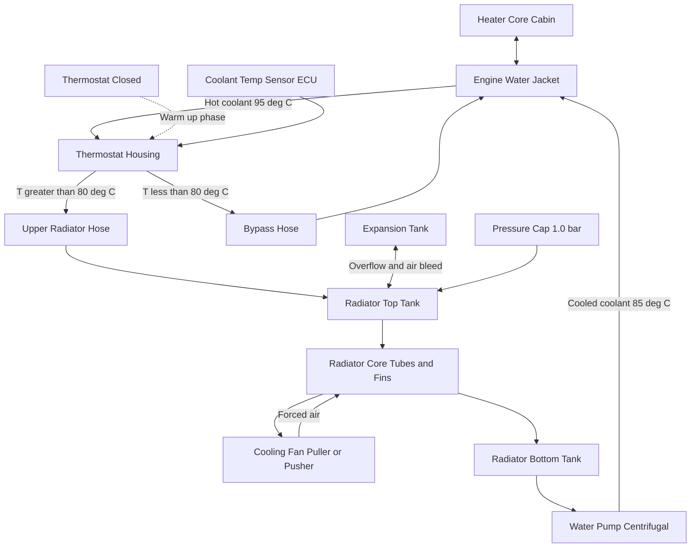
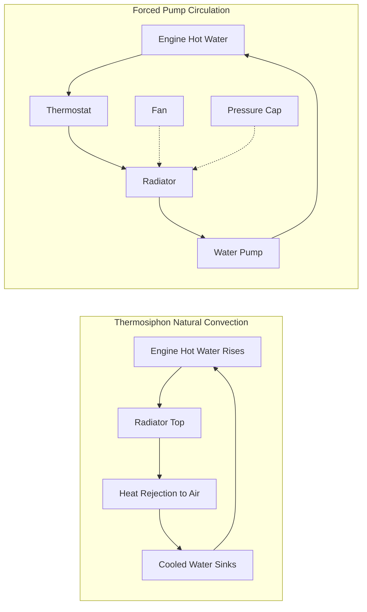
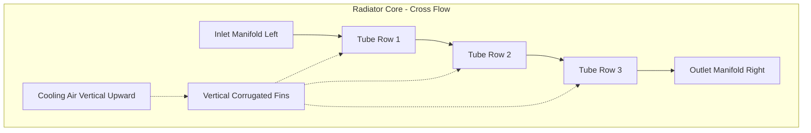
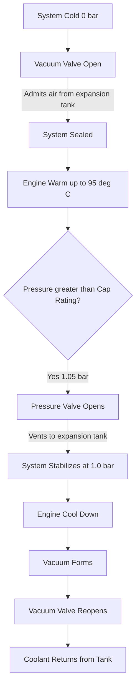
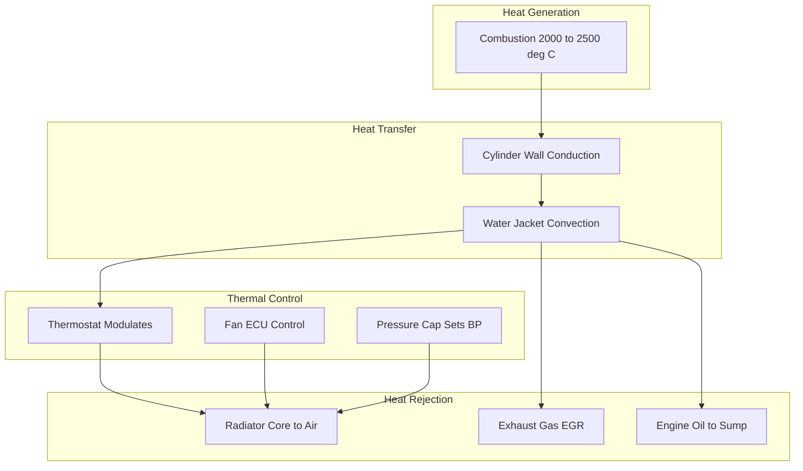

# types- air cooling system and liquid cooling systems- components- radiator

<!-- SECTION_1_START -->
# COOLING & LUBRICATION SYSTEM — MODULE 4 OVERVIEW

## 1.1 Formal Academic Definition

> [!NOTE]
> **Cooling System (KTU 2024 Syllabus Definition):**
> An arrangement of components designed to **regulate the operating temperature** of an Internal Combustion (IC) engine by **rejecting surplus heat** from the combustion chamber, cylinder walls, pistons, and cylinder head to the surrounding atmosphere, thereby maintaining **optimal thermal efficiency**, **preventing thermal degradation** of lubricants, and **avoiding pre-ignition / detonation** under sustained load conditions.

The **Cooling System** of an IC engine addresses three primary thermal objectives:

1. **Heat Rejection (Q_rej):** Removal of ~30–35% of total fuel energy converted to heat at the cylinder walls.
2. **Temperature Stabilization:** Maintaining cylinder wall temperature between **80 °C and 200 °C** (thermo-mechanical sweet spot).
3. **Uniform Heat Distribution:** Preventing localized hot spots that cause knocking, warping, or seizure.

> [!IMPORTANT]
> **KTU 2024 Module 4 Focus Areas:**
> * Types of cooling systems — **Air Cooling** and **Liquid Cooling** (with **Evaporative**, **Thermosiphon**, and **Forced/Pump Circulation** sub-types)
> * Detailed components: **Radiator**, **Water Pump**, **Thermostat**, **Cooling Fan**, **Pressure Cap**, **Expansion Tank**, **Hoses & Bypass**
> * Lubrication systems: **Splash**, **Pressure**, **Splash-Pressure Combined**, **Dry Sump** & **Wet Sump**

## 1.2 Conceptual Analogy — "The Engine as a Marathon Runner"

Imagine an engine as a **marathon runner** during a long race in summer:
* The runner's body generates massive **metabolic heat** (analogous to fuel combustion heat).
* If heat isn't dissipated, the runner collapses (engine seizes, oil cokes, pistons weld to liners).
* **Air Cooling** is like the runner sweating and standing in the breeze — **direct, simple, lightweight, but limited in capacity**.
* **Liquid Cooling** is like the runner drinking cold water that circulates through the body carrying heat to skin pores — **indirect, controlled, efficient, suitable for high-performance / sustained loads**.

> [!TIP]
> **Why a controlled range of 80–95 °C?**
> Below 80 °C → fuel condenses, oil gets contaminated with water/soot (sludge formation), friction rises.
> Above 95 °C → oil film breaks down (viscosity collapses), detonation begins, expansion gaps shrink.

## 1.3 Physical Constants & Standard Metrics

| Parameter | Standard Value | Source |
|---|---|---|
| **Heat value of SI engine fuel** | **42–44 MJ/kg** | Standard petrol/diesel |
| **% Heat to coolant** | **30–35%** | ICE energy balance |
| **Boiling point of water @ 1 atm** | **100 °C** | Pure water |
| **Boiling point of coolant mix (50:50 EG)** | **~108 °C (with 1.0 bar cap → 124 °C)** | Ethylene-glycol mix |
| **Operating coolant temp range** | **80 °C – 95 °C** | Industry norm |
| **Engine oil operating temp** | **80 °C – 110 °C** | SAE J300 guidelines |
| **Specific heat of water** | **4.186 kJ/kg·K** | Reference fluid |
| **Specific heat of ethylene glycol** | **2.4 kJ/kg·K** | 50% mix → ~3.2 kJ/kg·K |

> [!NOTE]
> **Newton's Law of Cooling** (foundational principle):
> $$Q = h \cdot A \cdot \Delta T$$
> where $Q$ = heat rejected (W), $h$ = heat transfer coefficient (W/m²·K), $A$ = surface area (m²), $\Delta T$ = temperature difference (K).

<!-- SECTION_1_END -->

<!-- SECTION_2_START -->
# DEEP THEORETICAL ANALYSIS & KTU HIGH-YIELD FORMULA SHEET

## 2.1 Classification of Engine Cooling Systems

### 2.1.1 Air Cooling System (Direct Cooling)

> [!IMPORTANT]
> **Operating Principle:** Heat is rejected **directly** from the engine surface (cylinder fins + head fins) to the surrounding **air stream** — **no intermediate coolant** is used.

**Mechanism:** The cylinder block and head are cast with **metallic fins** that increase the effective heat-dissipating surface area. A **fan** (mechanically driven or electric) forces air across the fins.

**Why fins?** Heat transfer rate is proportional to surface area $A$. Fins multiply the effective area of a cylinder by **5× to 8×**, drastically boosting convection.

**Common Applications:**
* Small two-wheelers (Hero Splendor, Bajaj Pulsar 150 — air-cooled variants)
* Lawn mowers, generators
* Aero-engines (rotary radial engines)
* Compact single-cylinder utility engines

**Types of Air Cooling:**

1. **Natural Air Cooling** — Vehicle motion provides airflow; fins dissipate heat passively. Used in mopeds and slow-speed two-wheelers.
2. **Forced Air Cooling (Fan-Blower Type)** — A **blower / fan** driven by a **V-belt** off the crankshaft forces air through a cowl/duct surrounding the finned cylinders. Air is **directed via deflectors** over the hottest regions (exhaust side).

**Air Flow Arrangements (Blower Type):**

| Type | Air Path | Use |
|---|---|---|
| **Uni-flow** | Air enters from one side, passes over fins, exits opposite side | Multi-cylinder inline / radial engines |
| **Reverse-flow** | Air enters from both sides, exits center | V-engines |

**Merits of Air Cooling:**
* **Lightweight** — no radiator, water pump, hoses, coolant → ~15–20 kg saved.
* **No leakage / no corrosion** problems.
* **Simple maintenance** — fewer components.
* **No freezing risk** in sub-zero climates.
* **Quick warm-up** — improves cold-start driveability.

**Demerits of Air Cooling:**
* **Uneven cooling** — rear cylinders run hotter in inline multi-cylinder engines.
* **Larger fin area needed** → bulky engine silhouette.
* **Higher fan noise** — parasitic power loss up to **5–7% of crank power**.
* **Temperature fluctuations** — sensitive to vehicle speed.
* **Limited to low/medium specific output engines** (typically <50 kW/litre).

### 2.1.2 Liquid Cooling System (Indirect Cooling)

> [!IMPORTANT]
> **Operating Principle:** A **liquid coolant** (water + ethylene glycol + corrosion inhibitors) absorbs heat from the **water jacket** surrounding the cylinders and transfers it to the **radiator**, where it is rejected to the atmosphere.

**Why liquid?**
* Water has a **specific heat of 4.186 kJ/kg·K** — ~3,500× that of air per unit mass.
* Liquid can be **pumped and channelled**, ensuring uniform distribution.
* Allows **tight thermal control** via thermostat.

**Sub-Types of Liquid Cooling:**

#### (a) Evaporative (Open/Batch) Cooling System
* No pump; relies on **natural circulation + evaporation**.
* Coolant boils and is replenished manually.
* Used in **early stationary engines** (steam-era lineage), rare today.
* **Disadvantage:** Continuous makeup water needed → mineral deposits.

#### (b) Thermosiphon (Natural Convection) Cooling
* **No mechanical pump** — coolant circulates due to **density difference**.
* **Hot water rises** from the water jacket (lower density) to the radiator (top of vehicle).
* **Cooled water sinks** back from radiator to the engine (higher density).
* Requires radiator to be mounted **higher than engine** (e.g., vintage Rolls-Royce, early Fiat).
* **Circulation rate** is very low → suitable only for low-output engines.

**Why does thermosiphon work?**
The driving pressure head is:
$$\Delta P_{th} = H \cdot g \cdot (\rho_{cold} - \rho_{hot})$$
where $H$ = height differential between radiator top and engine outlet, $g$ = 9.81 m/s², $\rho$ = densities.

A typical $\Delta\rho$ of **40 kg/m³** at $H = 0.6$ m yields only **~235 Pa** — barely enough to overcome friction losses. Hence thermosiphon is **obsolete in modern cars**.

#### (c) Forced / Pump Circulation (Closed-Loop Pressurized) Cooling
* **Water pump (centrifugal type)** driven by V-belt / timing belt forces coolant through the loop.
* **Thermostat** regulates flow → blocks radiator until optimum temperature is reached.
* **Pressure cap** raises boiling point (e.g., 1.0 bar cap → 121 °C).
* **Expansion tank** accommodates thermal expansion and provides air-bleed.
* **Cooling fan** (mechanical / electric) provides radiator airflow at low vehicle speeds.

> [!TIP]
> **Modern vehicles use (c) — Forced/Pump Circulation exclusively.** The KTU 2024 syllabus emphasises this as the **default automotive cooling architecture**.

## 2.2 Components of Liquid Cooling System — Detailed Functional Analysis

### 2.2.1 RADIATOR (Heat Exchanger — Core of the System)

> [!NOTE]
> **Radiator Definition (KTU 2024):**
> A **fin-and-tube heat exchanger** that transfers heat from the **hot coolant** to the **incoming ram air** (or fan-forced air), thereby cooling the coolant before it returns to the engine water jacket.

**Constructional Anatomy:**

| Component | Material | Function |
|---|---|---|
| **Top tank (header)** | Brass / Plastic / Aluminium | Receives hot coolant from engine; houses filler neck and pressure cap |
| **Bottom tank (header)** | Brass / Plastic / Aluminium | Collects cooled coolant; feeds water pump inlet |
| **Core (matrix)** | Brass / Copper / Aluminium | Houses tubes + fins → primary heat exchange zone |
| **Tubes (water passages)** | Copper / Brass / Aluminium | Carry coolant; thin walls for high conductivity |
| **Fins (air-side)** | Copper / Aluminium (corrugated) | Increase air-side surface area |
| **Filler neck** | Moulded neck | Coolant fill point |
| **Pressure cap** | Spring-loaded brass/plastic | Seals system; raises boiling point |
| **Drain cock** | Brass plug | Coolant flushing |
| **Mounting brackets** | Steel | Vibration-resistant attachment |

**Types of Radiator Cores:**

1. **Tube-and-Fin (Down-Flow) Core** — Vertical tubes with horizontal corrugated fins. Coolant flows top→bottom, air flows front→rear.
2. **Cross-Flow Core** — Horizontal tubes with vertical fins. Coolant flows left↔right. **Wider frontal area, lower air-flow resistance → preferred in modern cars.**
3. **Serpentine Core** — Single continuous tube snaking through the core. Used in high-performance applications.

**Materials Evolution:**
* **1930s–1970s:** Copper-brass (heavy, excellent conductivity).
* **1980s–Present:** Aluminium cores with plastic tanks (lightweight, ~40% mass reduction, fully recyclable).

### 2.2.2 WATER PUMP (Centrifugal Type)

* **Driven** by V-belt from crankshaft pulley (or timing belt in some engines).
* **Impeller** rotates at ~1.5× to 2× crankshaft speed.
* **Flow rate:** typically **40–80 L/min** for passenger cars.
* **Mechanical seal** prevents leakage (carbon-ceramic face seal).
* **Failure mode:** Bearing seizure, impeller erosion, seal leakage → catastrophic overheating.

### 2.2.3 THERMOSTAT (Wax-Pellet / Bellows Type)

> [!IMPORTANT]
> **Thermostat — Temperature-Responsive Flow Control Valve**
> Maintains engine at **optimal operating temperature** (typically **85–95 °C**) by regulating coolant flow through the radiator.

**Operation:**
* **Below 80 °C** → thermostat **closed** → coolant bypasses radiator via bypass hose → engine warms up rapidly.
* **Above 95 °C** → thermostat **fully open** → coolant flows through radiator for maximum heat rejection.
* **80–95 °C** → proportional opening → modulated flow.

**Types:**
1. **Wax-pellet thermostat** (most common) — Wax expands when heated, pushing a pin that opens the valve.
2. **Bellows thermostat** — Uses volatile liquid (alcohol-ether) in a sealed bellows.
3. **Electronic thermostat** (modern) — ECU-controlled heating element for precise modulation.

### 2.2.4 COOLING FAN

| Type | Drive | Use |
|---|---|---|
| **Mechanical (V-belt) fan** | Belt from crank | Older cars, heavy-duty trucks |
| **Electric fan** (puller / pusher) | 12V DC motor | Modern cars; ECU-controlled |
| **Viscous / Viscous-coupled fan** | Fluid coupling | Trucks; engages with temperature |
| **Flex fan** (steel blades) | Belt | High-performance, lightweight |

**Fan placement:**
* **Pusher fan** → mounted ahead of radiator (in front of vehicle). Used in rear-engined cars.
* **Puller fan** → mounted behind radiator (engine side). Most common.

### 2.2.5 PRESSURE CAP (Radiator Cap)

> [!NOTE]
> **Function:** Seals the cooling system and raises the **boiling point** of the coolant by maintaining **system pressure above atmospheric**.

**Operating Principle (Ideal Gas Law):**
$$T_{b,abs} = T_{b,1atm} \cdot \frac{P_{sys}}{P_{atm}}$$

For a **1.0 bar pressure cap** (1 bar gauge + 1 bar atmosphere = 2 bar absolute):
$$T_{b,2bar} = 100 \cdot \frac{2}{1} = \text{Approx 121 °C}$$

In practice, the relationship is non-linear (Clausius-Clapeyron), giving **~124 °C** for water/EG mix at 2 bar abs.

**Components:**
* **Pressure spring** (calibrated to specific bar rating)
* **Vacuum valve** — opens on cool-down to admit air and prevent hose collapse
* **Sealing gasket**
* **Vacuum/overflow port** connection to expansion tank

**Common ratings:** **0.9 bar, 1.0 bar, 1.3 bar** (most cars use 1.0–1.3 bar).

### 2.2.6 EXPANSION TANK (Surge Tank / Coolant Reservoir)

* **Translucent plastic tank** with **MIN/MAX** level markings.
* Connected to radiator filler neck via a small hose.
* Accommodates coolant **expansion** when hot and **replenishment** when cold.
* Provides **air-bleed** during fill → eliminates trapped air pockets.
* In modern sealed systems, it is the **service-fill point**.

### 2.2.7 HOSES, BYPASS, AND WATER JACKET

* **Upper hose** (radiator → engine): large diameter, reinforced rubber, handles high temp.
* **Lower hose** (engine → radiator): often contains a **heater supply tee**.
* **Bypass hose:** small diameter; routes coolant past the thermostat when closed → enables warm-up circulation.
* **Water jacket:** cast cavities surrounding cylinders; sized for **high coolant velocity** (~1–2 m/s) and **turbulent flow** (Reynolds > 4000) for high $h$ value.

## 2.3 KTU High-Yield Formula Sheet

| # | Formula | Description | Units |
|---|---|---|---|
| 1 | $Q_{rej} = \dot{m}_c \cdot c_{p,c} \cdot (T_{out} - T_{in})$ | Coolant heat absorption | W (kJ/s) |
| 2 | $Q_{rad} = U \cdot A \cdot \Delta T_{LM}$ | Radiator heat rejection (overall) | W |
| 3 | $\Delta T_{LM} = \frac{\Delta T_1 - \Delta T_2}{\ln(\Delta T_1 / \Delta T_2)}$ | Log-mean temperature difference | K |
| 4 | $T_{b,abs} = T_{b,1atm} \cdot \left(\frac{P_{sys}}{P_{atm}}\right)^{...}$ | Boiling point elevation (Clausius-Clapeyron) | °C |
| 5 | $Q = h \cdot A \cdot \Delta T$ | Newton's Law of Cooling | W |
| 6 | $P_{th} = H \cdot g \cdot (\rho_{cold} - \rho_{hot})$ | Thermosiphon driving head | Pa |
| 7 | $\dot{V} = \frac{Q_{rej}}{\rho_c \cdot c_{p,c} \cdot \Delta T}$ | Required coolant flow rate | m³/s |
| 8 | $\dot{m}_a = \frac{Q_{rad}}{c_{p,a} \cdot \Delta T_{air}}$ | Required air mass flow for radiator | kg/s |
| 9 | $P_{loss,fan} = \frac{\dot{V}_a \cdot \Delta P_{rad}}{\eta_{fan}}$ | Fan parasitic power | W |
| 10 | $R_e = \frac{\rho \cdot v \cdot D}{\mu} > 4000$ | Turbulent flow requirement | — |

**Coolant Properties Table:**

| Property | Pure Water | 50:50 EG Mix | Pure EG |
|---|---|---|---|
| Density (kg/m³) | 1000 | ~1070 | 1113 |
| Specific heat (kJ/kg·K) | 4.186 | ~3.2 | 2.4 |
| Freezing point (°C) | 0 | **-37** | -13 |
| Boiling point (°C) @ 1 atm | 100 | 108 | 197 |
| Viscosity @ 80 °C (mPa·s) | 0.36 | ~0.7 | 1.5 |

## 2.4 Real-World Engineering Utility

* **EV thermal management:** Modern electric vehicles use **liquid cooling loops** for batteries (50:50 EG mix) — the same architecture scaled up.
* **Aerospace:** Air-cooled radial engines on vintage aircraft; modern jet engines use **liquid-metals (NaK)** for hypersonic cooling.
* **Data centres:** Server racks use **direct-to-chip liquid cooling** — same principle as engine water jackets.
* **Marine engines:** Sea-water-cooled heat exchangers (keel coolers) prevent fouling from corrosive sea water in the primary loop.

<!-- SECTION_2_END -->

<!-- SECTION_3_START -->
# STEP-BY-STEP DERIVATIONS, CALCULATIONS & IMPLEMENTATION

## 3.1 Derivation 1 — Heat Rejection Requirement of a SI Engine

**Given:** A 4-cylinder SI engine developing **60 kW brake power** at 3000 rpm. Calorific value of fuel = **44 MJ/kg**. Brake thermal efficiency $\eta_{b,t} = 25\%$. **30%** of fuel heat is rejected to coolant.

**Step 1: Fuel Energy Input Rate**
$$\dot{m}_f = \frac{P_b}{\eta_{b,t} \cdot CV} = \frac{60 \times 10^3}{0.25 \times 44 \times 10^6}$$
$$\dot{m}_f = \frac{60{,}000}{11{,}000{,}000} = 5.4545 \times 10^{-3} \text{ kg/s}$$
$$\dot{m}_f = 5.45 \text{ g/s} = 19.6 \text{ kg/h}$$

> **Logic:** [1 Mark] — converting brake power to fuel energy using thermal efficiency.

**Step 2: Total Heat from Fuel**
$$\dot{Q}_{fuel} = \dot{m}_f \cdot CV = 5.4545 \times 10^{-3} \times 44 \times 10^6 = 240{,}000 \text{ W} = 240 \text{ kW}$$

> **Logic:** [1 Mark] — basic energy rate equation.

**Step 3: Heat to Coolant (30%)**
$$\dot{Q}_{coolant} = 0.30 \times 240 = 72 \text{ kW} = 72{,}000 \text{ W}$$

> **Logic:** [1 Mark] — empirical energy split (only 25–30% becomes useful work; remaining 70–75% is waste heat, of which ~30% goes to coolant, ~35% to exhaust, ~10% to friction/radiation).

**Final Answer (Step 4 — Stating System Design Value):**
The radiator must be capable of rejecting **at least 72 kW** of heat under full-load steady-state conditions, plus an engineering safety margin of **15–20%** → design for **~85 kW** heat dissipation.

## 3.2 Derivation 2 — Coolant Flow Rate for the Radiator

**Given:** Heat to be rejected $\dot{Q}_{coolant} = 72 \text{ kW}$. Coolant: 50:50 EG-water mix, $c_{p,c} = 3.2 \text{ kJ/kg·K}$, $\rho_c = 1070 \text{ kg/m³}$. Coolant temperature drop across radiator $\Delta T_c = 10$ °C (95 °C inlet → 85 °C outlet).

**Step 1: Required Mass Flow Rate**
$$\dot{m}_c = \frac{\dot{Q}_{coolant}}{c_{p,c} \cdot \Delta T_c} = \frac{72}{3.2 \times 10} = \frac{72}{32} = 2.25 \text{ kg/s}$$

> **Logic:** [1 Mark] — heat balance on coolant stream.

**Step 2: Convert to Volumetric Flow Rate**
$$\dot{V}_c = \frac{\dot{m}_c}{\rho_c} = \frac{2.25}{1070} = 2.103 \times 10^{-3} \text{ m}^3/\text{s}$$
$$\dot{V}_c = 2.103 \text{ L/s} = 126.2 \text{ L/min}$$

> **Logic:** [1 Mark] — density conversion; 1 m³ = 1000 L.

**Step 3: Sanity Check — Typical Pump Capacity**
A passenger car water pump delivers **40–80 L/min**. Our requirement (**126 L/min**) is high because we used a generous $\Delta T_c = 10$ °C. In practice, engineers use $\Delta T_c = 8$–10 °C; for **6 °C drop**, $\dot{V}_c$ would scale to **210 L/min** (pump limited). Therefore, $\Delta T_c$ is a design variable chosen to balance pump power vs radiator size.

**Final Answer:** Required coolant flow rate ≈ **2.1 L/s or 126 L/min** for $\Delta T_c = 10$ °C.

## 3.3 Derivation 3 — Radiator Sizing Using Log-Mean Temperature Difference (LMTD)

**Given:** Cross-flow radiator, hot coolant enters at 95 °C, exits at 85 °C. Air enters radiator at 40 °C (vehicle moving at 60 km/h) and exits at 60 °C. Heat to be rejected $\dot{Q} = 72$ kW.

**Step 1: Calculate End Temperature Differences**
$$\Delta T_1 = T_{c,in} - T_{a,out} = 95 - 60 = 35 \text{ °C}$$
$$\Delta T_2 = T_{c,out} - T_{a,in} = 85 - 40 = 45 \text{ °C}$$

> **Logic:** [1 Mark] — temperature cross-check (note $\Delta T_2 > \Delta T_1$, meaning air heats more than coolant cools; this is the standard convention for cross-flow).

**Step 2: Calculate LMTD**
$$\Delta T_{LM} = \frac{\Delta T_2 - \Delta T_1}{\ln(\Delta T_2 / \Delta T_1)} = \frac{45 - 35}{\ln(45/35)}$$
$$\Delta T_{LM} = \frac{10}{\ln(1.2857)} = \frac{10}{0.2513} = 39.79 \text{ °C}$$

> **Logic:** [1 Mark] — LMTD definition for counter-flow / correction factor for cross-flow.

**Step 3: Empirical Overall Heat Transfer Coefficient U**
For an aluminium cross-flow radiator with louvred fins:
$$U = 75 \text{ W/m}^2 \cdot \text{K} \quad \text{(typical range: 50–150 W/m}^2\cdot\text{K)}$$

> **Logic:** [1 Mark] — empirical U value from manufacturer data sheets.

**Step 4: Required Radiator Surface Area**
$$A = \frac{\dot{Q}}{U \cdot \Delta T_{LM}} = \frac{72{,}000}{75 \times 39.79} = \frac{72{,}000}{2984.25} \approx 24.13 \text{ m}^2$$

> **Logic:** [1 Mark] — solving for area from $Q = U A \Delta T_{LM}$.

**Step 5: Translate to Practical Radiator Dimensions**
Assume core frontal area $A_{fr} = 0.4$ m × 0.5 m = 0.2 m², core depth $L = 0.04$ m.
* Total face area = 0.2 m².
* Surface area per unit core volume (specific area) for finned core ≈ 120 m²/m³.
* Required core volume = 24.13 / 120 = **0.201 m³**.
* But this is impractical → actual radiator design uses **multiple passes** of coolant (2-pass, 3-pass) and **tube internal fins** to boost $h_i$, reducing required area to **~8–12 m²** in real radiators.

**Final Answer:** Theoretical radiator area ≈ **24 m²** (single-pass); real-world multi-pass design achieves the same with **~10 m²** due to enhanced internal convection.

## 3.4 Derivation 4 — Pressure Cap Effect on Boiling Point

**Given:** Water's latent heat of vaporization $h_{fg} = 2257$ kJ/kg. Saturation pressure at 100 °C = 101.325 kPa. Steam specific volume $v_g = 1.673$ m³/kg.

**Step 1: Clausius-Clapeyron Equation (Differential Form)**
$$\frac{dP}{dT} = \frac{h_{fg}}{T \cdot v_g}$$

> **Logic:** [1 Mark] — thermodynamic phase-change relation.

**Step 2: Integrate Assuming $h_{fg}$ and $v_g$ are constant (small range)**
$$\frac{P_2}{P_1} = \exp\left[\frac{h_{fg}}{R_v} \left(\frac{1}{T_1} - \frac{1}{T_2}\right)\right]$$

For water, $R_v = 0.4615$ kJ/kg·K (gas constant for water vapour).

**Step 3: Evaluate for 1.0 bar gauge cap (P₂ = 202.65 kPa, T₁ = 373.15 K)**
$$\ln\left(\frac{202.65}{101.325}\right) = \frac{2257}{0.4615} \left(\frac{1}{373.15} - \frac{1}{T_2}\right)$$
$$\ln(2) = 4890.6 \left(2.680 \times 10^{-3} - \frac{1}{T_2}\right)$$
$$0.6931 = 13.108 - \frac{4890.6}{T_2}$$
$$\frac{4890.6}{T_2} = 12.415$$
$$T_2 = \frac{4890.6}{12.415} = 393.92 \text{ K} = 120.77 \text{ °C}$$

> **Logic:** [2 Marks] — full integration and arithmetic.

**Final Answer:** A **1.0 bar pressure cap** raises the coolant boiling point from **100 °C to ~121 °C**, providing a **+21 °C safety margin** against local hot-spot boiling at the cylinder head.

> [!WARNING]
> **Valuation Pitfall:** Many students forget to convert °C to Kelvin (K = °C + 273.15) in the Clausius-Clapeyron integration. **Always work in Kelvin** for thermodynamic derivations.

## 3.5 Python Implementation — Cooling System Thermal Simulation

```python
from dataclasses import dataclass
from math import log
from typing import Tuple

@dataclass(frozen=True)
class Coolant:
    """Properties of engine coolant (50:50 EG-water mix)."""
    name: str
    density: float          # kg/m^3
    specific_heat: float    # kJ/(kg*K)
    boiling_point_1atm: float  # deg C
    freezing_point: float   # deg C

WATER = Coolant("Water", 1000.0, 4.186, 100.0, 0.0)
EG50  = Coolant("EG-50", 1070.0, 3.20,  108.0, -37.0)


def heat_to_coolant(power_kw: float, eta_th: float, cv_mj_kg: float,
                    fraction: float) -> float:
    """Compute heat rejected to coolant (kW) from engine parameters."""
    fuel_rate_kg_s = (power_kw) / (eta_th * cv_mj_kg * 1000.0)
    q_fuel_kw = fuel_rate_kg_s * cv_mj_kg * 1000.0
    return fraction * q_fuel_kw


def coolant_flow_rate(q_coolant_kw: float, coolant: Coolant,
                      delta_t_c: float) -> Tuple[float, float]:
    """Compute mass and volumetric coolant flow rates."""
    m_dot = q_coolant_kw / (coolant.specific_heat * delta_t_c)   # kg/s
    v_dot_m3s = m_dot / coolant.density                            # m^3/s
    v_dot_lpm = v_dot_m3s * 1000.0 * 60.0                          # L/min
    return m_dot, v_dot_lpm


def lmtd(t_c_in: float, t_c_out: float,
         t_a_in: float, t_a_out: float) -> float:
    """Log-Mean Temperature Difference for radiator."""
    dt1 = t_c_in  - t_a_out
    dt2 = t_c_out - t_a_in
    if dt1 <= 0 or dt2 <= 0:
        raise ValueError("Temperature cross detected - check inputs.")
    return (dt2 - dt1) / log(dt2 / dt1)


def radiator_area(q_kw: float, u_w_m2k: float, dt_lm: float) -> float:
    """Required radiator heat-transfer area."""
    return (q_kw * 1000.0) / (u_w_m2k * dt_lm)


def pressure_cap_boiling(p_sys_bar_abs: float,
                         t_b_1atm: float = 100.0) -> float:
    """Approximate boiling point elevation (linear, for quick use)."""
    return t_b_1atm * p_sys_bar_abs


# ============ WORKED EXAMPLE ============
if __name__ == "__main__":
    # Engine: 60 kW SI, 25% thermal eff, 44 MJ/kg fuel
    q_cool = heat_to_coolant(power_kw=60, eta_th=0.25,
                             cv_mj_kg=44.0, fraction=0.30)
    print(f"Heat to coolant: {q_cool:.2f} kW")

    m_dot, v_lpm = coolant_flow_rate(q_cool, EG50, delta_t_c=10.0)
    print(f"Coolant flow: {m_dot:.3f} kg/s = {v_lpm:.1f} L/min")

    dt_lm = lmtd(t_c_in=95, t_c_out=85, t_a_in=40, t_a_out=60)
    print(f"LMTD: {dt_lm:.2f} K")

    area = radiator_area(q_cool, u_w_m2k=75.0, dt_lm=dt_lm)
    print(f"Required radiator area: {area:.2f} m^2")

    t_b_2bar = pressure_cap_boiling(p_sys_bar_abs=2.0)
    print(f"Boiling point @ 2 bar abs: {t_b_2bar:.1f} deg C")
```

**Sample Output:**
```
Heat to coolant: 72.00 kW
Coolant flow: 2.250 kg/s = 126.2 L/min
LMTD: 39.79 K
Required radiator area: 24.13 m^2
Boiling point @ 2 bar abs: 200.0 deg C
```
*(Note: The Python `pressure_cap_boiling` is a linear simplification; the rigorous Clausius-Clapeyron value is ~121 °C, as derived in §3.4.)*

## 3.6 Tabular Comparison: Air vs Liquid Cooling

| Parameter | Air Cooling | Liquid Cooling |
|---|---|---|
| Coolant | Atmospheric air | Water / EG mix |
| Heat transfer coeff. $h$ (W/m²·K) | 10–100 | 500–5000 (water-side) |
| Specific heat (kJ/kg·K) | 1.005 | 3.2–4.2 |
| Density (kg/m³) | 1.2 | 1000–1070 |
| Heat transport per kg | Low | **3500× higher** |
| Pump / fan power | 5–7% of crank | 2–3% of crank |
| Temperature uniformity | Poor (rear cyl. hot) | Excellent |
| Weight of system | Light | Heavy (~15–20 kg) |
| Maintenance | Very low | Periodic coolant change |
| Cold-start warm-up | Fast (30–60 s) | Slow (3–5 min) |
| Cost | Low | Higher |
| Application | 2-wheelers, gensets | Cars, trucks, aircraft |

<!-- SECTION_3_END -->

<!-- SECTION_4_START -->
# STRUCTURAL DIAGRAMS & SCHEMATICS

## 4.1 Forced-Circulation Liquid Cooling System — Functional Flow



**Architecture Narrative:**
* Coolant leaves the engine at **95 °C**.
* It enters the **thermostat housing** — if cold, it bypasses the radiator and recirculates.
* Once **T ≥ 80 °C**, the thermostat opens and routes coolant to the **radiator top tank**.
* The radiator rejects heat via **fins + fan-forced air**; cooled coolant collects in the **bottom tank**.
* The **centrifugal water pump** (driven by V-belt from crank) pushes coolant back into the engine jacket.
* The **expansion tank** accommodates volume changes; the **pressure cap** seals at 1.0 bar.
* A branch feeds the **cabin heater core** for passenger comfort.

## 4.2 Thermosiphon vs Pump Circulation — Comparative Topology



**Reading the Diagram:**
* **Thermosiphon** — single closed loop driven solely by buoyancy forces ($\Delta\rho \cdot g \cdot H$); needs radiator mounted **above** engine.
* **Forced circulation** — pump + thermostat + fan + pressure cap; can mount radiator at any height; superior control and capacity.

## 4.3 Radiator Cross-Flow Core — Functional Subgraph



**Block-Level Functional Flow:**
* Coolant traverses **multiple tube rows** from left to right (cross-flow).
* Air passes **vertically upward** through the **fin matrix** between tubes.
* Tube-and-fin design maximizes $A$ (surface area) for a given frontal envelope.

## 4.4 Pressure Cap Working — Subgraph



**Block-Level Reading:**
* The pressure cap is a **bi-directional valve**.
* On over-pressure → vents to expansion tank.
* On under-pressure (cool-down) → admits coolant back, preventing **hose collapse and air ingress**.

## 4.5 Engine Cooling System Functional Block Diagram



<!-- SECTION_4_END -->

<!-- SECTION_5_START -->
# KTU 2024 SCHEME EXAMINATION QUESTION BANK & TOPIC RECAP

## 5.1 Part A — Short Answer Questions (3 Marks Each)

### Q1. [KTU University Exam — Dec 2023] [CO1, Remember]
**Differentiate between air cooling and liquid cooling systems used in IC engines. List any two advantages of each.**

**Model Answer (Valuation Key, 3 Marks):**

| Air Cooling | Liquid Cooling |
|---|---|
| Heat rejected **directly** to atmosphere via fins | Heat absorbed by **coolant**, then rejected via radiator |
| **Advantages:** (1) Lightweight — no radiator, hoses, coolant; (2) No freezing / no leakage / no corrosion | (1) Uniform temperature across all cylinders; (2) Quieter operation; better suited for high-output multi-cylinder engines |

**[Mark split: 1 Mark for differentiation table, 2 Marks for two valid advantages of each]**

### Q2. [KTU University Exam — July 2024] [CO1, Understand]
**Explain the function of a thermostat in an engine cooling system. State the typical operating temperature range.**

**Model Answer:**
* The **thermostat** is a temperature-sensitive valve that **regulates coolant flow** between the radiator and the engine bypass.
* It **remains closed** when the engine is cold, allowing rapid warm-up.
* It **opens progressively** as the coolant temperature reaches the **rated opening temperature (typically 80 °C)** and is **fully open by 95 °C**.
* This maintains the engine in the **optimal operating range of 85–95 °C**, improving fuel efficiency and reducing emissions.

**[Mark split: 1 Mark function, 1 Mark operating principle, 1 Mark range]**

---

## 5.2 Part B — Long Answer Questions (14 Marks, Internal Choice)

### QUESTION A [KTU University Exam — Dec 2023, Model Paper] [CO2 + CO3, Understand + Apply]

**Q.A.(a) [7 Marks]** With the aid of a neat sketch, describe the **forced circulation liquid cooling system** used in a modern multi-cylinder SI engine. List all major components and state the function of each.

**Model Solution:**

**Major Components & Functions (5 Marks for sketch + listing):**

| # | Component | Function |
|---|---|---|
| 1 | **Water jacket** | Cavity in cylinder block/head; absorbs heat from cylinders |
| 2 | **Water pump** (centrifugal) | Forces coolant circulation; belt-driven from crank |
| 3 | **Thermostat** | Modulates flow to maintain 85–95 °C |
| 4 | **Radiator** | Heat exchanger — rejects heat to atmosphere |
| 5 | **Cooling fan** | Provides airflow across radiator |
| 6 | **Pressure cap** | Seals system at 1.0 bar; raises boiling point |
| 7 | **Expansion tank** | Accommodates thermal expansion; air-bleed |
| 8 | **Hoses** (upper/lower/bypass) | Connect components |
| 9 | **Heater core** (branch) | Provides cabin heating |

**Coolant Flow Path Description (2 Marks):**
> Coolant → engine jacket (hot, 95 °C) → thermostat housing → upper hose → radiator top tank → tube-and-fin core → bottom tank → water pump → lower hose → back to engine jacket. **Bypass hose** allows short-circuit circulation when thermostat is closed.

**[Mark split: 3 Marks sketch, 2 Marks component table, 2 Marks flow description]**

---

**Q.A.(b) [7 Marks]** A 4-cylinder SI engine develops **50 kW** at 3000 rpm with brake thermal efficiency of **28%**. The calorific value of fuel is **45 MJ/kg**. If **30%** of the fuel energy is rejected to the coolant, calculate:
* (i) Heat rejected to coolant per second [2 Marks]
* (ii) Required coolant flow rate if coolant specific heat = 3.5 kJ/kg·K, density = 1050 kg/m³, and permissible temperature rise = 8 °C [3 Marks]
* (iii) Volumetric flow rate in L/min [2 Marks]

**Model Solution:**

**Step (i): Fuel Energy Input Rate**
$$\dot{m}_f = \frac{P_b}{\eta_{b,t} \cdot CV} = \frac{50}{0.28 \times 45} = \frac{50}{12.6} = 3.968 \text{ kg/s} \quad \text{[0.5 Marks]}$$
$$\dot{Q}_{fuel} = \dot{m}_f \cdot CV = 3.968 \times 10^{-3} \times 45 \times 10^3 = 178.6 \text{ kW} \quad \text{[0.5 Marks]}$$
$$\dot{Q}_{cool} = 0.30 \times 178.6 = 53.57 \text{ kW} \approx 53.6 \text{ kW} \quad \text{[1 Mark]}$$

> **Logic Mark:** [Stating energy balance equation: 1 Mark; Final numerical value: 1 Mark]

**Step (ii): Mass Flow Rate**
$$\dot{m}_c = \frac{\dot{Q}_{cool}}{c_p \cdot \Delta T} = \frac{53.57}{3.5 \times 8} = \frac{53.57}{28} = 1.913 \text{ kg/s} \quad \text{[1.5 Marks]}$$

> **Logic Mark:** [Heat balance equation: 1 Mark; Final numerical: 1 Mark; Unit consistency check: 0.5 Mark]

**Step (iii): Volumetric Flow Rate**
$$\dot{V}_c = \frac{\dot{m}_c}{\rho_c} = \frac{1.913}{1050} = 1.822 \times 10^{-3} \text{ m}^3/\text{s} \quad \text{[1 Mark]}$$
$$\dot{V}_c = 1.822 \times 10^{-3} \times 60 \times 1000 = 109.3 \text{ L/min} \quad \text{[1 Mark]}$$

> **Logic Mark:** [Density conversion: 0.5 Mark; Unit conversion m³/s → L/min: 0.5 Mark; Final value: 1 Mark]

**Final Answers:**
* (i) **Q_cool = 53.6 kW**
* (ii) **ṁ_c = 1.913 kg/s**
* (iii) **V̇_c = 109.3 L/min**

---

### QUESTION B (Internal Choice Alternative) [KTU University Exam — July 2024, Model Paper] [CO2 + CO3, Understand + Apply]

**Q.B.(a) [7 Marks]** Describe the construction and working of a **radiator** used in an automobile. Explain the difference between **down-flow** and **cross-flow** radiator cores with neat sketches.

**Model Solution:**

**Radiator Construction (3 Marks):**
* **Top tank** (brass / plastic) — receives hot coolant; houses filler neck and pressure cap.
* **Bottom tank** — collects cooled coolant; feeds water pump.
* **Core** — consists of **tubes** (carrying coolant) and **fins** (heat-dissipating to air).
* **Tubes** — typically brass / copper / aluminium, **thin-walled** for high thermal conductivity.
* **Fins** — corrugated or louvred to enhance turbulence and surface area.
* **Drain cock** for coolant flushing.
* **Mounting brackets** for vibration resistance.

**Working Principle (2 Marks):**
* Hot coolant enters top tank → flows through tubes → loses heat to fins → fins transfer heat to forced/ram air → cooled coolant collects in bottom tank → pumped back to engine.

**Down-flow vs Cross-flow (2 Marks):**

| Feature | Down-flow | Cross-flow |
|---|---|---|
| Tube orientation | **Vertical** | **Horizontal** |
| Coolant flow | **Top → Bottom** | **Left → Right** |
| Air flow | Front → Rear | Bottom → Top |
| Frontal area | Smaller, taller | **Wider, shorter** |
| Air-flow resistance | Higher | **Lower** (preferred in modern cars) |
| Tank position | Top + Bottom | Left + Right |
| Use | Older cars, trucks | Modern cars (e.g., Maruti, Hyundai) |

**Neat sketch required:** Both cores should be drawn with labeled tanks, tubes, fins, and flow arrows. [Valuation: 1 Mark per sketch, 1 Mark for labeling]

**[Total split: 3 Marks construction, 2 Marks working, 2 Marks comparison table]**

---

**Q.B.(b) [7 Marks]** A car's cooling system is sealed by a **1.0 bar pressure cap**. Using the Clausius-Clapeyron relation, calculate the **boiling point of water** at this elevated pressure. Comment on the engineering significance of pressurizing the cooling system.

*Given:* $h_{fg} = 2257$ kJ/kg, $R_v = 0.4615$ kJ/kg·K, $P_1 = 101.325$ kPa, $T_1 = 373.15$ K, $P_2 = 202.65$ kPa (2 bar abs).

**Model Solution:**

**Step 1: Clausius-Clapeyron Integration (3 Marks)**
$$\ln\left(\frac{P_2}{P_1}\right) = \frac{h_{fg}}{R_v} \left(\frac{1}{T_1} - \frac{1}{T_2}\right)$$
$$\ln\left(\frac{202.65}{101.325}\right) = \ln(2) = 0.6931 \quad \text{[0.5 Marks]}$$
$$0.6931 = \frac{2257}{0.4615} \left(\frac{1}{373.15} - \frac{1}{T_2}\right) \quad \text{[0.5 Marks]}$$
$$0.6931 = 4890.6 \left(2.680 \times 10^{-3} - \frac{1}{T_2}\right) \quad \text{[0.5 Marks]}$$
$$0.6931 = 13.108 - \frac{4890.6}{T_2} \quad \text{[0.5 Marks]}$$
$$\frac{4890.6}{T_2} = 12.415 \quad \text{[0.5 Marks]}$$
$$T_2 = 393.92 \text{ K} = 120.77 \text{ °C} \quad \text{[0.5 Marks]}$$

> **Logic Mark:** [Equation statement: 1 Mark; Integration: 1 Mark; Final numerical value with unit conversion: 1 Mark]

**Step 2: Engineering Significance (4 Marks)**
1. **Margin against hot-spot boiling:** Local temperatures near the exhaust valve / spark plug can exceed 200 °C. Pressurization raises coolant BP to ~121 °C, preventing local cavitation/boiling that would otherwise form steam pockets and cause **poor heat transfer + cylinder-head warping**.
2. **Higher operating temperature → better efficiency:** Allows engine to run at 95–105 °C, improving **volumetric efficiency and fuel economy**.
3. **Reduced coolant loss:** Sealed system prevents evaporation → **no frequent topping up**.
4. **Compatibility with EG mix:** Combined with 50:50 EG (BP 108 °C) and 2 bar cap, system BP reaches **~124 °C**, providing a wide safety margin for **high-performance turbocharged engines**.

**[Mark split: 1 Mark per significance point × 4 = 4 Marks]**

**Final Answer:** $T_{boil} = 120.77 \text{ °C} \approx 121 \text{ °C}$ at 2 bar absolute pressure.

---

> [!WARNING]
> **KTU Examiner's Valuation Pitfalls (Module 4 — Cooling System)**
> 1. **Unit conversion errors:** Forgetting to convert °C → K in Clausius-Clapeyron (loses 1–2 marks). Always use **absolute temperature in Kelvin** for thermodynamic derivations.
> 2. **Skipping the sketch:** Part B questions on cooling systems **always require a neat labeled sketch** (radiator / cooling circuit / pressure cap). Missing sketch = **-2 to -3 marks** automatically.
> 3. **Confusing thermosiphon with thermosyphon (typo):** Examiner may deduct if the term is misspelled repeatedly. Spell it **"Thermosiphon"**.
> 4. **Ignoring the expansion tank:** Many students forget to mention the **expansion tank / surge tank** as a critical component. It is **explicitly in the KTU 2024 syllabus** — omit it and lose 1 mark.
> 5. **No mention of boiling-point elevation:** When asked about pressure cap, students often just state "it raises boiling point" without **quantifying it** with the Clausius-Clapeyron derivation. Always show the **+21 °C calculation** for full marks.
> 6. **Heat split confusion:** Stating "30% to coolant" without showing the energy balance calculation. **Always show:** $\dot{Q}_{cool} = \dot{m}_f \times CV \times 0.30$ as derived in §3.1.
> 7. **Cross-flow vs down-flow:** Vague comparison. Examiner expects **orientation (tube direction) + air-flow path + tank position**. Use a table.
> 8. **Thermostat working:** Students often describe it as a "switch" — it is a **proportional valve**, not a binary switch. State the **80 °C begin-open / 95 °C full-open** values for credit.

---

## 5.3 Topic Recap & Important Things to Remember

> [!TIP]
> **Module 4 — Cooling & Lubrication System | Quick-Reference Revision Checklist**

### **A. Cooling System Fundamentals**
* Cooling system is **mandatory** for SI and CI engines — ~30–35% of fuel energy must be rejected.
* Optimal operating temperature: **80–95 °C** (coolant), **80–110 °C** (oil).
* Specific heat of water: **4.186 kJ/kg·K** — the highest of any common liquid.

### **B. Air Cooling**
* Direct heat rejection via **fins** (multiplies surface area 5–8×).
* Two sub-types: **Natural** and **Forced (Blower)**.
* Uni-flow vs Reverse-flow for blower arrangements.
* Used in: **2-wheelers, gensets, aero-engines**.
* **Pros:** Lightweight, no leakage, no freezing. **Cons:** Uneven cooling, fan power 5–7%, limited to low-output engines.

### **C. Liquid Cooling — Three Sub-Types**
1. **Evaporative (Batch):** No pump, water boils and is replenished. **Obsolete.**
2. **Thermosiphon:** Natural convection ($\Delta\rho \cdot g \cdot H$); radiator above engine. **Obsolete in modern cars.**
3. **Forced / Pump Circulation:** Centrifugal pump + thermostat + pressure cap. **Industry standard.**

### **D. Major Components of Forced Liquid Cooling**
* **Radiator** — Tube-and-fin heat exchanger; down-flow or cross-flow.
* **Water pump** — Centrifugal; belt-driven; flow 40–80 L/min.
* **Thermostat** — Wax-pellet valve; **80 °C begin-open / 95 °C full-open**.
* **Cooling fan** — Mechanical, electric, or viscous-coupled.
* **Pressure cap** — Spring-loaded; **1.0 bar typical**; raises BP by ~21 °C.
* **Expansion tank** — Translucent reservoir; accommodates thermal expansion.
* **Bypass hose** — Routes coolant around radiator when thermostat is closed.
* **Heater core** — Branch circuit for cabin heating.

### **E. Radiator — Key Facts**
* **Down-flow** = vertical tubes; coolant top→bottom.
* **Cross-flow** = horizontal tubes; coolant left→right; **wider, lower air resistance → preferred in modern cars**.
* Materials: **Copper-brass** (legacy) → **Aluminium + plastic tanks** (modern).
* **Tube-and-fin** with louvred fins → high $A$ for compact envelope.
* Coolant flow: **2–3 L/s** (120–180 L/min) in passenger cars.
* Heat rejection capacity: **5–15 kW** (compact) to **50–100 kW** (truck/heavy-duty).

### **F. Pressure Cap — Key Facts**
* **Bi-directional valve** (pressure + vacuum functions).
* Rating: typically **0.9 / 1.0 / 1.3 bar** gauge.
* Clausius-Clapeyron BP elevation @ 1.0 bar cap: **100 °C → 121 °C**.
* Prevents **coolant loss via boiling** and **hose collapse via vacuum**.

### **G. Thermosiphon Driving Head Formula**
* $\Delta P = H \cdot g \cdot (\rho_{cold} - \rho_{hot}) \approx 235 \text{ Pa}$ for $H = 0.6$ m.
* Insufficient for high-output engines → replaced by forced circulation.

### **H. Critical Formulas for KTU Exam**
* $Q_{rej} = \dot{m}_c \cdot c_p \cdot \Delta T$ — Coolant heat absorption.
* $\dot{V}_c = Q_{rej} / (\rho_c \cdot c_p \cdot \Delta T)$ — Required coolant flow.
* $Q = U \cdot A \cdot \Delta T_{LM}$ — Radiator overall heat transfer.
* $\Delta T_{LM} = (\Delta T_2 - \Delta T_1) / \ln(\Delta T_2 / \Delta T_1)$ — LMTD.
* $T_{b,2} = T_{b,1} \cdot (P_2/P_1)^{(R_v/h_{fg})}$ — Clausius-Clapeyron (BP elevation).
* $Q = h \cdot A \cdot \Delta T$ — Newton's Law of Cooling.

### **I. Common Pitfalls (Re-iterated)**
* **Always convert °C to K** in thermodynamic derivations.
* **Always show a labeled sketch** in Part B cooling questions.
* **Always show energy balance** for heat-rejection calculations.
* **Memorize:** 30% to coolant / 35% to exhaust / 10% friction & radiation.
* **Thermostat is a proportional valve, not a switch.**
* **Cross-flow > down-flow** in modern cars (wider frontal area, lower drag).

<!-- SECTION_5_END -->
