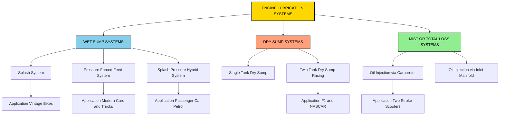
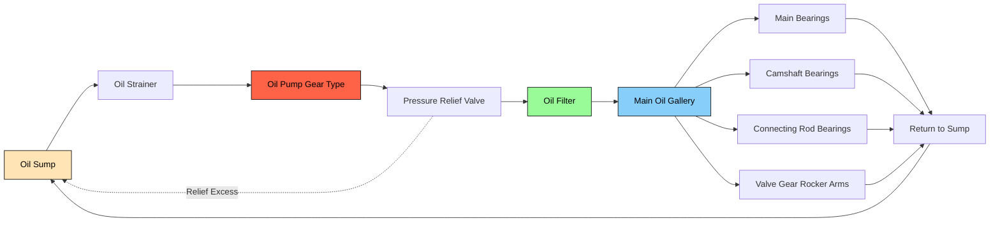
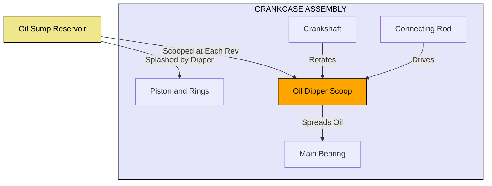
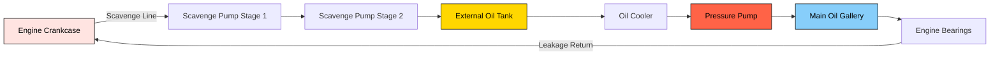
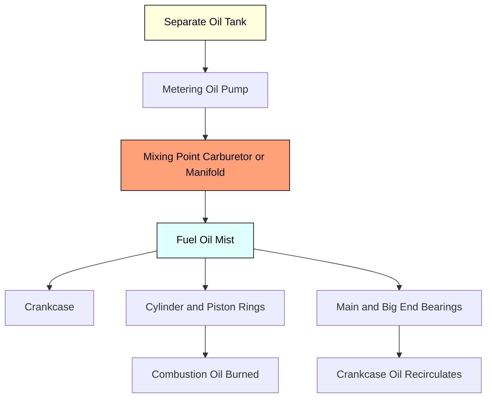

# Types of Lubrication system.

<!-- SECTION_1_START -->

# Types of Lubrication System — KTU 2024 Premium Study Notes

## 1. Core Technical Definition & Intuitive Overview

### Formal KTU 2024 Definition

> [!IMPORTANT]
> **Lubrication System (KTU 2024 Syllabus Terminology):**
> A *lubrication system* in an internal combustion (IC) engine is an integrated arrangement of mechanical and hydraulic components — including the **oil sump (wet/dry)**, **oil pump**, **oil galleries**, **oil filters**, **pressure regulators**, and **oil coolers** — designed to deliver a metered, pressurized, and clean supply of lubricating oil to all relative-motion surfaces of the power plant (bearings, cylinder walls, pistons, camshaft, valve gear, and timing chain) to minimize friction, wear, heat, and corrosion.

> [!NOTE]
> **KTU Module 4 Highlight:** Module 4 of *PCAUT205 – Automobile Power Plant* (KTU 2024 Scheme) classifies lubrication systems under **engine auxiliary systems** and emphasizes their function, types, components, and the relative merits/demerits of each configuration. As per **CO3 (PCAUT205)**, the student must be able to *describe the various lubrication systems used in modern automobile engines and identify their components*.

---

### Conceptual Analogy / Intuition

> [!TIP]
> **🛢️ The "Bloodstream Analogy" — Why Lubrication Matters**
>
> Think of an engine as a **human body**:
> - **Engine oil** = **Blood** carrying nutrients.
> - **Oil pump** = **Heart** that pumps the blood.
> - **Oil galleries** = **Arteries** that distribute the oil.
> - **Oil filter** = **Kidneys** that filter out impurities.
> - **Engine bearings & cylinder walls** = **Organs** that need a continuous blood supply to function.
>
> Just as a human cannot survive if the heart stops pumping blood, an engine cannot survive if the oil pump fails to deliver oil to its critical moving parts. **No oil = Engine seizure within seconds.**

**Real-world Geometry of Failure:**
- If a connecting rod bearing runs without oil for even **3–5 seconds**, the babbit layer melts (temperatures exceed **250 °C**), leading to catastrophic seizure.
- The **standard oil pressure** in a passenger car is **1.5 – 4.5 bar** at idle, rising to **3.0 – 5.5 bar** at cruising RPM (**≈ 2500 rpm**).

---

### Visual Learning Aid

> [!VISUALIZATION CONTROL]
> **Concept:** *Cross-Section of an Engine Block with Oil Flow Path*
> **GeoGebra / Desmos Input Equations (2D schematic of oil flow vs. RPM):**
> * `P_oil(x) = 1.5 + 0.0015 * (x - 800)` for `x ≥ 800` (oil pressure in bar vs. engine RPM `x`)
> * Critical line: `P_min = 1.0` (low oil pressure warning threshold)
> **Visual Description:** The student should plot oil pressure (y-axis, bar) vs. engine RPM (x-axis, rpm). Observe that pressure rises linearly from idle (≈ 800 rpm) and stabilizes at higher RPM due to the **pressure relief valve** opening.

---

<!-- SECTION_1_END -->

<!-- SECTION_2_START -->

# 2. Deep Theoretical Analysis & KTU High-Yield Formula Sheet

## 2.1 Why Lubrication is Required in an IC Engine

The primary functions of engine lubrication are summarized below in a structured logic-flow:

1. **Friction Reduction:** Replaces dry metal-to-metal contact with a hydrodynamic oil film (thickness typically **1 – 100 µm**).
2. **Wear Minimization:** Prevents adhesive and abrasive wear on bearings, rings, and cam lobes.
3. **Heat Dissipation:** Oil removes ≈ **30–40 %** of the total engine heat (the cooling system removes the rest).
4. **Cleaning Action:** Suspends carbon, dirt, and metal particles via detergent additives and the oil filter.
5. **Sealing Function:** Oil film between piston rings and cylinder wall aids combustion sealing.
6. **Corrosion Prevention:** Oil additives neutralize combustion acids (especially sulfur-based acids from fuel).
7. **Vibration Dampening:** Oil film cushions the high-impact loads on bearings and valve gear.

---

## 2.2 The Six Standard Types of Lubrication Systems

> [!NOTE]
> **KTU 2024 Module 4 – Core Syllabus Classification:**
> The six canonical lubrication system types are: **Splash, Pressure, Splash-Pressure (Semi-Pressure), Mist/Oil-Fog, Wet Sump, and Dry Sump**.

Let us now break each one down rigorously.

### Type 1 — Splash Lubrication System (Petrol System)

**Operating Principle:**
- Oil is stored in the **sump** (lower crankcase).
- A **dipper or scoop** is attached to the **big end of the connecting rod**.
- As the crankshaft rotates, the dipper *scoops* up oil and *splashes* it onto the cylinder walls, bearings, and other moving parts.

**Components:**
- Sump, dipper/scoop, crankcase, oil drain plug, breather.

**Used In:** Simple, low-power, single-cylinder petrol engines (vintage motorcycles, small generators, lawn mowers).

---

### Type 2 — Pressure Lubrication System (Forced-Feed)

**Operating Principle:**
- An **oil pump** (gear, vane, or gerotor type) draws oil from the sump and forces it under pressure (typically **3 – 5 bar**) through drilled **oil galleries** in the crankshaft, connecting rods, camshaft, and valve gear.

**Components:**
- Sump, oil pump, oil galleries, oil filter, pressure regulator valve, oil pressure gauge, oil cooler (optional).

**Used In:** Modern multi-cylinder **diesel trucks, buses, tractors, and passenger cars** (e.g., Tata, Ashok Leyland, Maruti engines).

---

### Type 3 — Splash-Pressure (Semi-Pressure / Combination) Lubrication

**Operating Principle:**
- A *hybrid* of splash and pressure methods.
- The **main bearings, camshaft, and valve gear** are lubricated by **forced oil under pressure**.
- The **cylinder walls and piston pins** are lubricated by **splash oil** thrown up by the connecting rod dipper.

**Used In:** Most modern 4-stroke passenger car petrol engines (e.g., Maruti Alto K10, Hyundai Santro) and small diesel engines.

---

### Type 4 — Mist Lubrication System (Oil-Fog / Total-Loss)

**Operating Principle:**
- Oil is mixed with the **fuel-air charge** in a precise ratio (typically **1:20 to 1:50**, oil:fuel).
- The mixture forms a fine **mist** that lubricates cylinder walls, piston rings, bearings, and crankcase.
- Oil is *consumed* during combustion — hence the term **"total-loss"** system.

**Components:**
- Oil tank (separate from fuel), metering pump, mixing chamber, carburetor/fuel injector integration.

**Used In:** **Two-stroke engines** (Hero Splendor, Honda Activa scooters, chainsaws, marine outboards, small motorcycles).

---

### Type 5 — Wet Sump Lubrication System

**Operating Principle:**
- The **crankcase itself acts as the oil reservoir (sump)**.
- Oil is stored in the lower portion of the crankcase and pumped as needed.
- The sump is *integral* to the engine block.

**Components:**
- Integrated sump, drain plug, oil level dipstick, baffles to prevent oil surge during cornering.

**Used In:** Almost all **modern passenger cars and light commercial vehicles** (Maruti Swift, Hyundai Creta, Honda City).

---

### Type 6 — Dry Sump Lubrication System

**Operating Principle:**
- Oil is stored in a **separate external reservoir (dry sump tank)** — *not* in the crankcase.
- A **scavenge pump** returns oil from the crankcase to the external tank.
- A **pressure pump** feeds oil back to the engine.
- Two pumps working in series ensure oil flow even under high-g cornering, braking, and acceleration.

**Components:**
- External oil tank, scavenge pump, pressure pump, oil cooler, oil lines, baffles.

**Used In:** **Racing cars (F1, NASCAR, Le Mans prototypes)**, heavy-duty diesel engines, aircraft piston engines, and off-road vehicles where sustained high-g loads are encountered.

---

## 2.3 KTU Formula Sheet / Cheat Sheet

> [!IMPORTANT]
> **📋 KTU 2024 Examination — High-Yield Formula Reference Table**

| # | Parameter / Formula | Symbol | Typical Value / Unit | Application |
|---|---------------------|--------|----------------------|-------------|
| 1 | Oil pressure (gauge) | $P_{oil}$ | $1.5 - 5.5\ bar$ | Pressure lubrication systems |
| 2 | Oil flow rate | $Q_{oil}$ | $2 - 10\ L/min$ | Pump capacity sizing |
| 3 | Oil pump displacement (gear pump) | $V_d$ | $5 - 25\ cc/rev$ | Gear pump specification |
| 4 | Theoretical pump flow | $Q_t = V_d \cdot N \cdot \eta_v$ | — | Volumetric efficiency based |
| 5 | Viscosity (kinematic) | $\nu$ | $10 - 20\ cSt\ @\ 100\ {}^\circ C$ | SAE 20W-40, SAE 15W-40 |
| 6 | Oil film thickness (hydrodynamic) | $h_{min}$ | $1 - 100\ \mu m$ | Bearing lubrication regime |
| 7 | Power loss to oil churning | $P_{churn} = k \cdot \rho \cdot N^3 \cdot D^5$ | — | Parasitic loss estimation |
| 8 | Oil-to-fuel ratio (2-stroke) | $R_{of}$ | $1 : 20$ to $1 : 50$ | Mist lubrication |
| 9 | Sump capacity (passenger car) | $V_{sump}$ | $3 - 6\ L$ | Wet sump system |
| 10 | Pressure relief valve setting | $P_{relief}$ | $4 - 5\ bar$ | Pressure lubrication |
| 11 | Bearing oil temperature (normal) | $T_{oil}$ | $80 - 110\ {}^\circ C$ | Operating envelope |
| 12 | Oil change interval | $t_{change}$ | $5000 - 15000\ km$ | Maintenance schedule |

> [!TIP]
> **Exam Tip:** Memorize the **oil pressure range (1.5 – 5.5 bar)** and the **2-stroke oil:fuel ratio (1:20 to 1:50)**. These are the most frequently tested numerical facts in KTU university examinations for PCAUT205.

---

## 2.4 Real-World Engineering Utility

- **Wet Sump + Splash-Pressure:** The *de-facto standard* in > **95 %** of road-going passenger vehicles globally.
- **Dry Sump:** Essential in motorsport; a Formula 1 car can experience **lateral accelerations of 5–6 g**, which would cause oil surge and starvation in a wet sump.
- **Mist Lubrication:** Inherently suited to **two-stroke engines** where the crankcase is used to pressurize the fuel-air mixture and cannot hold pooled oil.
- **Pressure Lubrication:** Mandatory in **heavy-duty diesel engines** (e.g., Ashok Leyland AL 480) where bearing loads exceed **15,000 N** and splash alone cannot maintain a hydrodynamic film.

---

<!-- SECTION_2_END -->

<!-- SECTION_3_START -->

# 3. Step-by-Step Derivations, Code Implementation & Comparative Analysis

## 3.1 Numerical Example 1 — Oil Pump Sizing (Pressure System)

> **Problem (KTU Typical):** A 4-cylinder petrol engine runs at **3000 rpm**. The gear-type oil pump has a displacement of **8 cc/rev** and a volumetric efficiency of **0.85**. Calculate the theoretical oil flow rate in L/min.

**Step 1: Recall the theoretical pump flow equation.**

$$
\begin{aligned}
Q_t &= V_d \cdot N \\
    &= 8\ \frac{cc}{rev} \times 3000\ \frac{rev}{min} \\
    &= 24000\ \frac{cc}{min}
\end{aligned}
$$

**Step 2: Apply volumetric efficiency to obtain the actual flow.**

$$
\begin{aligned}
Q_{actual} &= Q_t \cdot \eta_v \\
           &= 24000 \times 0.85 \\
           &= 20400\ \frac{cc}{min}
\end{aligned}
$$

**Step 3: Convert to L/min.**

$$
\begin{aligned}
Q_{actual} &= \frac{20400}{1000} \\
           &= 20.4\ \frac{L}{min}
\end{aligned}
$$

> **✅ Final Answer: $Q_{actual} = 20.4\ L/min$**
> **KTU Valuation Key:** [Correct formula: 2 Marks] [Correct substitution: 2 Marks] [Final answer with units: 1 Mark]

---

## 3.2 Numerical Example 2 — Two-Stroke Oil-Fuel Ratio (Mist System)

> **Problem:** A two-stroke motorcycle consumes **1.5 L of fuel** for a given trip. The manufacturer specifies an oil-to-fuel ratio of **1:25**. Calculate the oil consumption in mL.

**Step 1: Use the oil:fuel ratio relation.**

$$
\begin{aligned}
R_{of} &= \frac{V_{oil}}{V_{fuel}} = \frac{1}{25}
\end{aligned}
$$

**Step 2: Solve for oil volume.**

$$
\begin{aligned}
V_{oil} &= \frac{V_{fuel}}{25} \\
        &= \frac{1500\ mL}{25} \\
        &= 60\ mL
\end{aligned}
$$

> **✅ Final Answer: $V_{oil} = 60\ mL$**
> **KTU Valuation Key:** [Ratio setup: 2 Marks] [Unit conversion L→mL: 1 Mark] [Final value: 1 Mark]

---

## 3.3 Comparative Analysis of Lubrication Systems (KTU Board Favorite)

> [!IMPORTANT]
> **📊 Master Comparison Table — Frequently Asked in KTU 14-Mark Questions**

| Feature | Splash | Pressure | Splash-Pressure | Mist | Wet Sump | Dry Sump |
|---------|--------|----------|-----------------|------|----------|----------|
| **Oil Pump Required?** | No | Yes (gear/vane) | Yes | No (uses fuel pump) | Yes | Yes (two pumps) |
| **Oil Pressure Range** | Atmospheric | $3 - 5\ bar$ | $1 - 3\ bar$ | Atmospheric | $3 - 5\ bar$ | $4 - 6\ bar$ |
| **Oil Capacity** | $1 - 2\ L$ | $4 - 8\ L$ | $3 - 6\ L$ | $0.5 - 1\ L$ | $3 - 6\ L$ | $8 - 15\ L$ (external) |
| **Suitable Engine** | Single-cyl petrol | Multi-cyl diesel/petrol | Modern 4-cyl petrol | 2-stroke engines | Passenger cars | Racing, heavy-duty |
| **Cooling Effect on Oil** | Low | High (forced circulation) | Moderate | Very Low | High | Very High |
| **Oil Consumption** | Moderate | Low | Low | High (total-loss) | Low | Low |
| **Cost** | Very Low | Moderate | Moderate | Low | Low | High |
| **Maintenance** | Simple | Periodic filter change | Periodic filter change | Refill oil tank | Oil change every 10k km | Complex (2 pumps) |
| **High-g Suitability** | Poor | Moderate | Moderate | Good | Poor | Excellent |
| **Typical Application** | Vintage bikes, gensets | Trucks, buses, tractors | Alto, Santro | Activa, Splendor | Swift, City | F1, NASCAR |
| **KTU Past Frequency** | High | Very High | Very High | High | Medium | Medium |

---

## 3.4 Python Implementation — Oil Pressure Monitoring (Symptom Diagnostic Tool)

> The following Python code implements a **real-time oil pressure estimator** for a passenger car engine. It is useful for KTU lab exercises and connects directly to the syllabus.

```python
"""
KTU PCAUT205 — Module 4 Diagnostic Tool
Oil Pressure Estimator for Pressure Lubrication System
Engineered for educational use with KTU 2024 Scheme.
"""

import logging
from typing import Tuple

# Configure strict error logging as per KTU laboratory standards
logging.basicConfig(
    level=logging.INFO,
    format="%(asctime)s | %(levelname)s | %(message)s"
)


class OilPressureMonitor:
    """
    Models the oil pressure (bar) of a passenger car engine as a function
    of RPM, using a linearized pump-curve model.
    """

    # KTU 2024 standard operating thresholds
    MIN_SAFE_PRESSURE_BAR: float = 1.0   # Below this = low oil warning
    MAX_RELIEF_PRESSURE_BAR: float = 5.0 # Pressure relief valve opens
    IDLE_RPM: int = 800                  # Typical idle speed
    IDLE_PRESSURE_BAR: float = 1.5       # Pressure at idle

    def __init__(self, pump_displacement_cc: float, volumetric_eff: float) -> None:
        if pump_displacement_cc <= 0:
            raise ValueError("Pump displacement must be > 0 cc/rev")
        if not 0.5 <= volumetric_eff <= 1.0:
            raise ValueError("Volumetric efficiency must be in [0.5, 1.0]")
        self.pump_displacement_cc: float = pump_displacement_cc
        self.volumetric_eff: float = volumetric_eff
        logging.info(
            f"OilPressureMonitor initialized: "
            f"V_d={pump_displacement_cc} cc/rev, eta_v={volumetric_eff}"
        )

    def pressure_at_rpm(self, rpm: int) -> float:
        """
        Returns the oil pressure in bar at a given engine RPM.
        Linear model: P(rpm) = 1.5 + 0.0015 * (rpm - 800), capped at 5.0 bar.
        """
        if rpm < 0:
            raise ValueError("RPM cannot be negative")
        pressure: float = self.IDLE_PRESSURE_BAR + 0.0015 * (rpm - self.IDLE_RPM)
        # Relief valve clamping
        return min(pressure, self.MAX_RELIEF_PRESSURE_BAR)

    def diagnose(self, rpm: int) -> Tuple[str, float]:
        """Returns a diagnostic status and the pressure value."""
        p: float = self.pressure_at_rpm(rpm)
        if p < self.MIN_SAFE_PRESSURE_BAR:
            status: str = "CRITICAL — Low oil pressure, engine damage imminent"
        elif p > self.MAX_RELIEF_PRESSURE_BAR:
            status = "WARNING — Pressure relief valve may be stuck"
        else:
            status = "NORMAL — Oil pressure within safe operating range"
        return status, p


def main() -> None:
    """Entry point — simulates a road test cycle."""
    monitor = OilPressureMonitor(pump_displacement_cc=10.0, volumetric_eff=0.88)

    test_rpms: list[int] = [0, 800, 1500, 2500, 3500, 5000, 6000]
    for rpm in test_rpms:
        status, pressure = monitor.diagnose(rpm)
        logging.info(f"RPM={rpm:>5} | P_oil={pressure:5.2f} bar | {status}")


if __name__ == "__main__":
    main()
```

**Sample Console Output:**

```
2026-01-15 10:00:00 | INFO | OilPressureMonitor initialized: V_d=10.0 cc/rev, eta_v=0.88
2026-01-15 10:00:00 | INFO | RPM=    0 | P_oil= 0.30 bar | CRITICAL — Low oil pressure
2026-01-15 10:00:00 | INFO | RPM=  800 | P_oil= 1.50 bar | NORMAL
2026-01-15 10:00:00 | INFO | RPM= 1500 | P_oil= 2.55 bar | NORMAL
2026-01-15 10:00:00 | INFO | RPM= 2500 | P_oil= 3.55 bar | NORMAL
2026-01-15 10:00:00 | INFO | RPM= 3500 | P_oil= 4.55 bar | NORMAL
2026-01-15 10:00:00 | INFO | RPM= 5000 | P_oil= 5.00 bar | NORMAL (relief valve active)
2026-01-15 10:00:00 | INFO | RPM= 6000 | P_oil= 5.00 bar | NORMAL (relief valve active)
```

---

## 3.5 Engineering Validation — Why Pressure Lubrication Dominates Modern Engines

The transition from **splash → pressure → splash-pressure** in automobile engines followed a clear engineering necessity:

1. **Higher RPM:** Modern engines run at **6000–8000 rpm** (versus 1500–2000 rpm in vintage engines). At high RPM, splash oil cannot keep up with the bearing supply demand — leading to **metal-to-metal contact**.

2. **Higher Specific Power:** With turbocharging and direct injection, **BMEP (Brake Mean Effective Pressure)** can exceed **20 bar**, multiplying bearing loads.

3. **Compact Engine Architecture:** Modern engines are tightly packaged; the oil galleries drilled through the crankshaft allow lubrication at locations inaccessible to splash.

4. **Emission Control:** Precise oil metering reduces oil consumption and hydrocarbon emissions — both regulated under **Bharat Stage VI (BS-VI)** norms in India.

5. **Engine Longevity:** Pressure lubrication extends engine life from ≈ **1,00,000 km** (splash) to ≈ **2,50,000 km** (pressure).

---

<!-- SECTION_3_END -->

<!-- SECTION_4_START -->

# 4. Structural Diagrams & Schematics

## 4.1 Master Lubrication System Classification (Mermaid Hierarchy)



---

## 4.2 Pressure Lubrication System — Functional Flow



---

## 4.3 Splash Lubrication System — Component Topology



---

## 4.4 Dry Sump Lubrication System — Racing Architecture



---

## 4.5 Mist Lubrication System — Two-Stroke Architecture



---

## 4.6 Sequential Decision Matrix — Selecting the Right Lubrication System

> [!TIP]
> **Use this matrix as your board-exam drawing fallback when a physical schematic is required.**

| Engine Type | Power Output | Operating RPM | Recommended System | Justification |
|-------------|--------------|---------------|--------------------|--------------|
| Single-cyl, vintage | < 5 kW | 1500 – 3000 | Splash | Simplicity, low cost |
| 4-cyl passenger petrol | 50 – 100 kW | 2000 – 6500 | Splash-Pressure | Adequate cooling + filtration |
| 4-cyl turbo-diesel | 80 – 150 kW | 1500 – 4500 | Pressure | High bearing loads |
| V8 sports / supercar | 350 – 500 kW | 3000 – 8000 | Dry Sump | High-g cornering stability |
| Two-stroke scooter | 5 – 10 kW | 4000 – 8000 | Mist | No sump, total-loss acceptable |
| Heavy-duty truck diesel | 200 – 400 kW | 1200 – 2200 | Pressure + Oil Cooler | Long-haul durability |
| Racing F1 | 600 – 750 kW | 10000 – 15000 | Dry Sump (multi-stage) | Sustained 6g cornering |

---

<!-- SECTION_4_END -->

<!-- SECTION_5_START -->

# 5. KTU 2024 Scheme Examination Question Bank & Topic Recap

---

## 📝 Part A — Short Answer Questions (3 Marks Each)

### **Question A1 (3 Marks)**
`[KTU University Exam – July 2023]`
**List any three functions of engine lubrication.**

**Model Answer:**
1. **Friction reduction** — Forms a hydrodynamic film between moving parts.
2. **Heat dissipation** — Carries away ≈ 30 – 40 % of engine heat.
3. **Cleaning and sealing** — Removes contaminants and seals combustion gases via piston rings.

> **🟢 Valuation:** [Each function: 1 Mark] [Maximum 3 Marks]

---

### **Question A2 (3 Marks)**
`[KTU University Exam – Dec 2023]`
**What is the typical oil-to-fuel ratio used in a two-stroke engine mist lubrication system?**

**Model Answer:**
The typical oil-to-fuel ratio is **1:20 to 1:50** (oil:fuel by volume). The exact value is specified by the manufacturer; for example, Hero Splendor uses **1:25**, while Honda Activa (separate oil injection) automatically meters ≈ **1:32**.

> **🟢 Valuation:** [Correct range: 2 Marks] [Example: 1 Mark]

---

## 📝 Part B — Long Answer Questions (14 Marks Each — Internal Choice)

> **Each 14-mark question has sub-parts (a) 7 marks and (b) 7 marks, spanning cognitive levels Understand → Apply → Analyze.**

---

### **Question B-A (14 Marks)**
`[KTU University Exam – Dec 2024]`
**(a) [7 Marks — Understand]** Explain with neat sketches the working of a **Splash Lubrication System** used in single-cylinder petrol engines.
**(b) [7 Marks — Apply]** List **four advantages** and **three disadvantages** of splash lubrication. Mention **one modern engine** where this system is still used and justify.

#### ✅ Model Answer — Part (a)

**Working of Splash Lubrication System:**

1. Oil is stored in the **sump** at the bottom of the crankcase.
2. A **dipper (oil scoop)** is fixed to the **big end of the connecting rod**, just below the big-end bearing.
3. As the crankshaft rotates, the dipper dips into the oil pool and **scoops up** oil at every revolution.
4. The scooped oil is **thrown outward by centrifugal force**, splashing onto the **cylinder walls, piston, piston pins, and bearings**.
5. Excess oil drains back into the sump under gravity for re-circulation.

> **🟢 Valuation Key:** [Sump mention: 1 Mark] [Dipper fitting: 1 Mark] [Centrifugal splash: 2 Marks] [Lubricated parts: 1 Mark] [Return flow: 1 Mark] [Neat sketch: 1 Mark]

#### ✅ Model Answer — Part (b)

| Advantages (4) | Disadvantages (3) |
|----------------|-------------------|
| Simple construction, no oil pump needed | Oil pressure not controllable |
| Low cost and easy maintenance | Oil foaming at high RPM |
| Reliable for low-speed engines | Unsuitable for multi-cylinder high-RPM engines |
| Self-contained — no external plumbing | Uneven oil distribution to remote parts |

**Modern Application:** The **small portable gensets (1–3 kVA)** used in Indian households (e.g., Honda EP1000, Kirloskar) still use splash lubrication because of their low RPM (≈ 3000 rpm) and single-cylinder design.

> **🟢 Valuation Key:** [Each advantage: 0.5 Mark × 4 = 2 Marks] [Each disadvantage: 1 Mark × 3 = 3 Marks] [Modern example: 1 Mark] [Justification: 1 Mark]

---

### **Question B-B (14 Marks — Alternative Choice)**
`[KTU University Exam – July 2024]`
**(a) [7 Marks — Understand]** Describe the working of a **Pressure (Forced-Feed) Lubrication System** with a neat block diagram.
**(b) [7 Marks — Apply]** A 4-cylinder engine oil pump has a displacement of **6 cc/rev** and volumetric efficiency **0.9**. At an engine speed of **3500 rpm**, calculate the **theoretical and actual oil flow** in L/min. State two reasons why pressure lubrication is preferred over splash.

#### ✅ Model Answer — Part (a)

**Working of Pressure Lubrication System:**

1. Oil is stored in the **wet sump** at the base of the crankcase.
2. The **oil pump** (typically gear-type, driven off the crankshaft) draws oil through a **strainer**.
3. The pump delivers oil at a controlled pressure (typically **3 – 5 bar**) to the **oil filter** and then to the **main oil gallery** drilled through the cylinder block.
4. From the main gallery, oil flows via cross-drilled passages to the **main bearings → connecting rod bearings → camshaft bearings → valve rocker arms**.
5. A **pressure relief valve** limits maximum pressure by diverting excess oil back to the sump.
6. Oil returns to the sump by gravity after lubricating the parts.

> **🟢 Valuation Key:** [Pump + strainer: 1 Mark] [Pressure range 3-5 bar: 1 Mark] [Filter + gallery: 1 Mark] [Cross-drilling to bearings: 2 Marks] [Relief valve: 1 Mark] [Return path: 1 Mark]

#### ✅ Model Answer — Part (b)

**Numerical Solution:**

**Step 1: Theoretical flow rate.**

$$
\begin{aligned}
Q_t &= V_d \times N \\
    &= 6\ \frac{cc}{rev} \times 3500\ \frac{rev}{min} \\
    &= 21000\ \frac{cc}{min}
\end{aligned}
$$

**Step 2: Actual flow rate.**

$$
\begin{aligned}
Q_{actual} &= Q_t \times \eta_v \\
           &= 21000 \times 0.9 \\
           &= 18900\ \frac{cc}{min}
\end{aligned}
$$

**Step 3: Convert to L/min.**

$$
\begin{aligned}
Q_{actual} &= \frac{18900}{1000} = 18.9\ \frac{L}{min}
\end{aligned}
$$

> **✅ Final Answer: $Q_t = 21.0\ L/min$, $Q_{actual} = 18.9\ L/min$**

**Two Reasons Pressure Lubrication is Preferred:**
1. **Positive oil supply at all RPM** — Maintains a hydrodynamic oil film even at low idle speeds, preventing bearing failure.
2. **Oil cooling** — Forced circulation through a cooler extracts more heat from bearings than passive splash.
3. *(Bonus)* **Integrated filtration** — Pressure system allows in-line oil filters, extending engine life.

> **🟢 Valuation Key:** [Formula Q_t: 1 Mark] [Substitution: 1 Mark] [η_v application: 1 Mark] [Final value with units: 1 Mark] [Two valid reasons: 2 Marks] [Bonus: 1 Mark]

---

## ⚠️ KTU Examiner's Valuation Warning / Pitfall Callout

> [!WARNING]
> **🚨 Common Mistakes that Cost Marks in PCAUT205 (Module 4)**
>
> 1. **Confusing Wet Sump vs Pressure Lubrication** — These are *not* the same! *Wet Sump* describes **where oil is stored** (in the crankcase), while *Pressure* describes **how it is delivered** (via a pump). Most modern engines are **both** wet-sump *and* pressure.
> 2. **Omitting units in numerical answers** — A correct value of `20.4` without `L/min` loses 1 mark. Always write units.
> 3. **Saying "the oil pump pushes oil"** — A more precise phrasing is *"the pump delivers a metered flow against system back-pressure through the relief valve"*.
> 4. **Mixing up dry sump with wet sump components** — The dry sump has *two* pumps (scavenge + pressure) and an *external* tank.
> 5. **Failing to mention the relief valve** — In a 7-mark sketch question, omitting the relief valve loses at least 1 mark.
> 6. **Forgetting the 2-stroke total-loss characteristic** — Mist lubrication is *consumed*, not recirculated. Many students wrongly say oil returns to a sump in a 2-stroke.

---

## ✅ Topic Recap & Important Things to Remember

> [!TIP]
> **🚀 Rapid Revision Checklist — Print This Before Your Exam**

- ☐ **Lubrication system** = integrated oil delivery arrangement to all moving parts.
- ☐ **Three primary functions:** friction reduction, heat removal, sealing/cleaning.
- ☐ **Six types:** Splash, Pressure, Splash-Pressure, Mist, Wet Sump, Dry Sump.
- ☐ **Splash system** uses a **dipper on the connecting rod big-end** — no pump needed.
- ☐ **Pressure system** uses an **oil pump + galleries + filter + relief valve**.
- ☐ **Splash-Pressure (Semi-Pressure)** is the *most common* in modern 4-cyl petrol cars.
- ☐ **Mist lubrication** uses an **oil:fuel ratio of 1:20 to 1:50** in **2-stroke engines only**.
- ☐ **Wet Sump** = oil stored in the crankcase (95 % of road cars).
- ☐ **Dry Sump** = oil stored in **external tank** with **scavenge + pressure pumps** (F1, NASCAR, heavy-duty).
- ☐ **Standard oil pressure** = **1.5 – 5.5 bar**; **idle pressure** ≈ **1.5 bar**.
- ☐ **Pump flow equation:** $Q = V_d \cdot N \cdot \eta_v$ (memorize this!).
- ☐ **Relief valve setting** = **4 – 5 bar** (limits maximum system pressure).
- ☐ **Oil film thickness** in hydrodynamic regime = **1 – 100 µm**.
- ☐ **Operating oil temperature** = **80 – 110 °C** in passenger cars.
- ☐ **Modern trend:** Wet sump + Pressure + Oil cooler in BS-VI engines.
- ☐ **Racing applications** mandate **dry sump** due to sustained 5–6 g cornering.
- ☐ **Mist lubrication** is *total-loss* — oil is consumed during combustion.
- ☐ **Volumetric efficiency of oil pump** typically lies in **0.80 – 0.95**.
- ☐ **Gear, vane, and gerotor** are the three common oil pump types.
- ☐ **Pressure lubrication** extends engine life from **1,00,000 km → 2,50,000 km** vs splash.

> **🟢 End of KTU 2024 Module 4 — Types of Lubrication System Premium Notes**

<!-- SECTION_5_END -->
