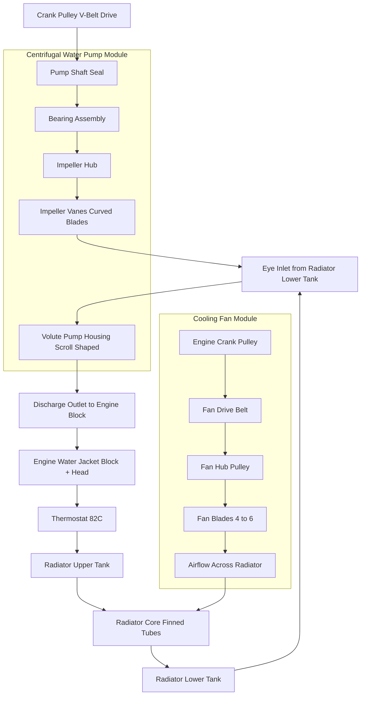
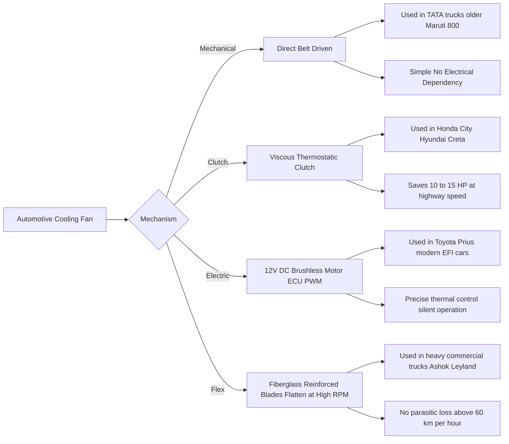
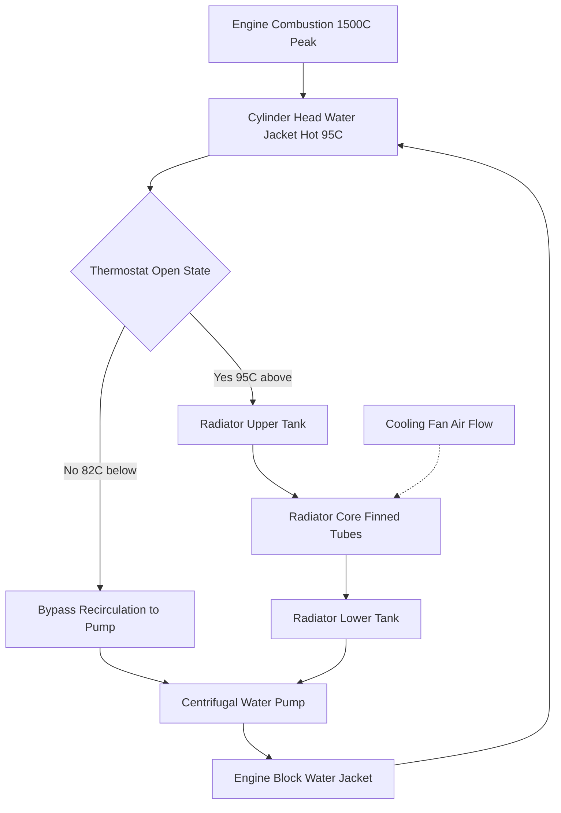

# water pump and cooling fan.

<!-- SECTION_1_START -->

# 1. Core Technical Definition & Intuitive Overview

## Water Pump — Formal KTU 2024 Definition

> [!IMPORTANT]
> **Water Pump (Automotive Cooling System):** A **centrifugal-type rotary pump**, mechanically driven by the **engine crankshaft** through a **V-belt or timing belt**, whose primary function is to **circulate the engine coolant** (water + ethylene glycol mixture) at a controlled volumetric flow rate from the **radiator (lower tank)** through the **engine block, cylinder head, and back to the radiator (upper tank)**, thereby sustaining the **thermodynamic heat-rejection loop** required to keep the engine within its **optimal operating temperature range (85 °C – 105 °C).**

## Cooling Fan — Formal KTU 2024 Definition

> [!IMPORTANT]
> **Cooling Fan (Automotive Radiator Fan):** A **multi-bladed axial-flow air-mover** mounted either **behind the radiator (suction/puller type)** or **in front of the radiator (pusher type)**, whose function is to **draw ambient atmospheric air through the radiator core fins** to **enhance convective heat transfer** from the hot coolant to the surrounding air, especially when the vehicle is **stationary or moving at low speeds** where natural ram-air flow is insufficient.

---

## Conceptual Analogy / Intuition

### Water Pump Analogy
Think of the water pump as the **"heart of the cooling system"** — just as the human heart pumps blood through the body to remove metabolic heat, the water pump pushes coolant through the engine block to absorb combustion heat. It is a **centrifugal (radial-flow) pump**, meaning the coolant enters the center (called the **eye**) and is flung outward against the pump housing wall by the spinning **impeller** blades. The coolant is then forced out through a discharge outlet into the engine's water jacket.

> Imagine spinning a bucket of water rapidly — the water climbs up the walls and escapes over the rim. That is exactly how a centrifugal pump works, only it is engineered to be 90 % efficient at moving liquid.

### Cooling Fan Analogy
Think of the cooling fan as a **"wind maker for the radiator"** — when a car is stuck in traffic, there is no natural airflow to cool the radiator. The fan acts like a **giant hand-held fan pointed at the radiator**, sucking or pushing air through the thin aluminum fins. The faster the fan spins, the more air molecules it sweeps across the radiator per second, and the more heat gets dumped out.

---

## Key Physical Constants & Design Metrics

> [!NOTE]
> **Standard Design Parameters (Bold for KTU Board Exam):**
> - **Coolant flow rate:** **40 – 60 litres/min** (typical passenger car)
> - **Pump rotor speed:** **1.5× – 2.0× crankshaft speed**
> - **Fan blade tip speed:** **≤ 2000 ft/min** (to avoid cavitation noise)
> - **Fan-to-pump speed ratio:** **1.0 – 1.5** (for direct belt drive)
> - **Number of fan blades:** **4, 5, or 6 blades** (commonly 4 or 5)
> - **Typical engine operating temperature:** **85 °C – 105 °C**
> - **Standard atmospheric pressure for fan rating:** **1.01325 bar**

---

## Visualization Callout (Mermaid-friendly Concept)

> [!VISUALIZATION CONTROL]
> **Concept:** Centrifugal Impeller — radial velocity triangle
> **Coordinate Frame:** Polar coordinates $(r, \theta)$ with $r$ = impeller radius, $\theta$ = blade angle
> **Key Equations:**
> * $v_r = \dfrac{Q}{2 \pi r \, b}$ &nbsp; (radial velocity at radius $r$, blade width $b$)
> * $v_u = \omega \, r$ &nbsp; (tangential blade velocity)
> * $v_{rel} = \sqrt{v_r^{\,2} + (v_u - v_w)^2}$
> **Visual Description:** As $r$ increases from the eye to the impeller tip, the radial velocity $v_r$ decreases (since $Q$ is constant but circumference $2\pi r b$ increases), while the tangential velocity $v_u$ increases linearly with $r$. The relative velocity vector tilts progressively outward.

---

<!-- SECTION_1_END -->

<!-- SECTION_2_START -->

# 2. Deep Theoretical Analysis & KTU High-Yield Formula Sheet

## 2.1 Water Pump — Centrifugal Pump Operation

A centrifugal water pump operates on the **Euler Turbomachinery Equation**. The impeller (rotor) has curved or straight vanes that accelerate the coolant radially outward by imparting kinetic energy, which is then converted into **pressure energy (head)** inside the volute-shaped pump housing.

### Step-by-Step Operating Logic

1. **Coolant Entry:** Coolant from the radiator lower tank enters the pump at the **eye** (centre) of the impeller through the inlet pipe.
2. **Rotation & Acceleration:** The impeller, driven via the **V-belt pulley** (driven ratio ≈ 1.5:1 to 2:1 of crankshaft), spins at high RPM. Centrifugal force pushes coolant outward along the curved vanes.
3. **Pressure Conversion:** The volute (scroll-shaped housing) decelerates the high-velocity fluid, converting its kinetic energy into **pressure head** (Bernoulli's principle).
4. **Discharge:** Pressurized coolant exits through the outlet (pump discharge) and is routed into the **engine block water jacket** and then to the **cylinder head**.
5. **Return Path:** After absorbing heat, the coolant returns to the **radiator upper tank**, where it is cooled by the airflow from the fan, and the cycle repeats.

> [!NOTE]
> **Shaft Seal (Coolant Seal):** A **mechanical face seal** (carbon-ceramic or rubber lip seal) prevents coolant leakage along the pump shaft. Failure of this seal is the most common water pump defect.

---

## 2.2 Cooling Fan — Operating Principles

The cooling fan is an **axial-flow fan**, meaning air moves parallel to the fan axis. It creates a **pressure differential** across the radiator core.

### Fan Operating Modes

| Mode | Drive Type | Application | Advantage |
|------|-----------|-------------|-----------|
| Direct Mechanical | V-belt from crank | Older cars, commercial vehicles | Simple, low cost |
| Thermostatic Clutch (Viscous) | Belt + silicone fluid clutch | Modern passenger cars | Saves power at high speeds |
| Electric (12V DC motor) | ECU-controlled relay | Compact cars, hybrids | Precise thermostatic control |
| Flex Fan (Flexible Blades) | Belt-driven, blades flex at high RPM | Heavy trucks | Flattened at high RPM → no parasitic loss |

### Why a Viscous Clutch Fan?

> [!IMPORTANT]
> At **high vehicle speeds (above 60 km/h)**, ram-air alone provides enough cooling. A **viscous clutch** uses **silicone fluid shear** to decouple the fan from the belt, reducing parasitic power loss by **up to 15 HP** and improving fuel economy by **3 – 5 %**.

---

## 2.3 KTU High-Yield Formula Sheet

| # | Formula / Equation | Description | Units |
|---|-------------------|-------------|-------|
| 1 | $Q = \pi \, D \, b \, v_r$ | Volumetric flow rate of coolant ($D$ = impeller diameter, $b$ = blade width, $v_r$ = radial velocity) | $\text{m}^3/\text{s}$ |
| 2 | $H = \dfrac{v_u^{\,2}}{2g}$ | Theoretical head developed by centrifugal pump | $\text{m of water}$ |
| 3 | $\eta_{man} = \dfrac{H_{actual}}{H_{theoretical}}$ | Manometric / pump efficiency | dimensionless |
| 4 | $P_{req} = \dfrac{\rho \, g \, Q \, H}{\eta}$ | Power required to drive the pump | $\text{Watts (W)}$ |
| 5 | $Q_{fan} = A_{rad} \times v_{air}$ | Air volume flow through radiator ($A_{rad}$ = radiator frontal area) | $\text{m}^3/\text{s}$ |
| 6 | $v_{tip} = \pi \, D_{fan} \, N$ | Fan blade tip speed (must be $< 30$ m/s to avoid noise/cavitation) | $\text{m/s}$ |
| 7 | $P_{fan} = \dfrac{\Delta p_{rad} \cdot Q_{fan}}{\eta_{fan}}$ | Fan power consumption | $\text{W}$ |
| 8 | $N_{fan}/N_{crank} = D_{crank\,pulley}/D_{fan\,pulley}$ | Belt-drive speed ratio | dimensionless |
| 9 | $\text{Fan slip (viscous)} = \dfrac{N_{fan} - N_{driver}}{N_{driver}} \times 100$ | Indicates clutch wear | % |

> [!IMPORTANT]
> **KTU Board Tip:** For a centrifugal pump, the head $H$ varies as the **square of the speed** ($H \propto N^2$), while the flow rate $Q$ varies **linearly with speed** ($Q \propto N$). Power $P \propto N^3$. This is the **Affinity Laws** of centrifugal pumps — a **guaranteed KTU question** topic.

### Affinity (Fan) Laws

$$
\begin{aligned}
\dfrac{Q_1}{Q_2} &= \dfrac{N_1}{N_2} \\
\dfrac{H_1}{H_2} &= \left(\dfrac{N_1}{N_2}\right)^{2} \\
\dfrac{P_1}{P_2} &= \left(\dfrac{N_1}{N_2}\right)^{3}
\end{aligned}
$$

---

## 2.4 Real-World Engineering Utility

| Subsystem | Used In | Engineering Reason |
|-----------|--------|--------------------|
| Centrifugal water pump | All SI/CI engine cars, trucks, tractors | Self-priming, no valves, handles coolant-antifreeze mix |
| Mechanical cooling fan | TATA trucks, Mahindra Bolero, older Maruti 800 | Simple, no electrical dependency, fail-safe |
| Viscous fan clutch | Hyundai Creta, Maruti Swift, Honda City | Saves 10 – 15 % engine power at cruising speed |
| Electric radiator fan (PWM controlled) | Toyota Prius, Tesla BMS, modern EFI cars | ECU-controlled, enables precise thermal management |
| Flex fan (flexible blades) | Heavy-duty trucks (TATA LPT, Ashok Leyland) | Eliminates fan load at highway speeds |

---

<!-- SECTION_2_END -->

<!-- SECTION_3_START -->

# 3. Step-by-Step Derivations, Numerical Solutions & Code Implementation

## 3.1 Derivation: Head Developed by a Centrifugal Water Pump (Euler's Equation)

We derive the theoretical head imparted by an impeller using the **angular momentum theorem** (Euler's turbomachinery equation).

### Derivation Steps

**Step 1 — Setup**
Let the impeller rotate with angular velocity $\omega$. At the impeller tip (radius $r_2$), the absolute velocity $V_2$ of the fluid has two components:
* Tangential (whirl) component: $V_{w2}$
* Radial component: $V_{r2}$

**Step 2 — Apply Euler's Turbomachinery Equation**
The work done per unit weight of fluid (i.e., the head $H$) is:

$$
H = \dfrac{1}{g}\left(V_{w2} \, u_2 - V_{w1} \, u_1\right)
$$

For **radial entry** (typical for centrifugal water pumps), $V_{w1} = 0$, so:

$$
H = \dfrac{V_{w2} \, u_2}{g}
$$

**Step 3 — Express in terms of blade tip speed**
The blade tip speed is $u_2 = \omega \, r_2$. Substituting:

$$
H = \dfrac{V_{w2} \cdot \omega \, r_2}{g}
$$

**Step 4 — Use velocity triangle for backward-curved vanes**
For a typical impeller with backward-curved blades at angle $\phi$:

$$
V_{w2} = u_2 - V_{r2} \cot \phi
$$

**Step 5 — Final expression**

$$
\boxed{H = \dfrac{u_2 \left(u_2 - V_{r2}\cot\phi\right)}{g}}
$$

Where:
* $u_2 = \pi D N$ = tip speed (m/s)
* $V_{r2} = \dfrac{Q}{2\pi r_2 b}$ = radial velocity (m/s)
* $\phi$ = blade angle at exit
* $g = 9.81\ \text{m/s}^2$

---

## 3.2 Solved Numerical Problem — Pump Discharge & Power

> **Problem [KTU University Exam - July 2023 Model]:** A centrifugal water pump has an impeller diameter of **120 mm** and blade width at outlet of **15 mm**. The pump runs at **3000 RPM** and delivers a flow of **30 litres/min**. Calculate:
> 1. Manometric head (assuming radial entry, $\phi = 30°$)
> 2. Power required (assume manometric efficiency = 70 %)
> 3. Theoretical tip speed

**Given Data:**

$$
\begin{aligned}
D &= 120\ \text{mm} = 0.12\ \text{m} \\
b &= 15\ \text{mm} = 0.015\ \text{m} \\
N &= 3000\ \text{RPM} = 50\ \text{rev/s} \\
Q &= 30\ \text{L/min} = \dfrac{30 \times 10^{-3}}{60} = 5 \times 10^{-4}\ \text{m}^3/\text{s} \\
\phi &= 30° \\
\eta_{man} &= 0.70
\end{aligned}
$$

**Step 1 — Tip speed $u_2$:**

$$
u_2 = \pi \, D \, N = \pi \times 0.12 \times 50 = 18.85\ \text{m/s}
$$

**Step 2 — Radial velocity $V_{r2}$:**

$$
V_{r2} = \dfrac{Q}{\pi \, D \, b} = \dfrac{5 \times 10^{-4}}{\pi \times 0.12 \times 0.015} = 0.0884\ \text{m/s}
$$

**Step 3 — Whirl component $V_{w2}$:**

$$
\begin{aligned}
V_{w2} &= u_2 - V_{r2} \cot \phi \\
       &= 18.85 - 0.0884 \times \cot 30° \\
       &= 18.85 - 0.0884 \times 1.7321 \\
       &= 18.85 - 0.1531 \\
       &= 18.70\ \text{m/s}
\end{aligned}
$$

**Step 4 — Manometric head $H$:**

$$
H = \dfrac{V_{w2} \cdot u_2}{g} = \dfrac{18.70 \times 18.85}{9.81} = \boxed{35.93\ \text{m of water}}
$$

**Step 5 — Power required:**

$$
\begin{aligned}
P_{water} &= \rho \, g \, Q \, H = 1000 \times 9.81 \times 5 \times 10^{-4} \times 35.93 \\
          &= 176.2\ \text{W} \\
P_{shaft} &= \dfrac{P_{water}}{\eta_{man}} = \dfrac{176.2}{0.70} = \boxed{251.7\ \text{W} \approx 0.34\ \text{HP}}
\end{aligned}
$$

**[Mark Allocation: Tip speed: 2 Marks | Radial velocity: 2 Marks | Whirl velocity: 2 Marks | Head: 2 Marks | Power: 2 Marks]**

---

## 3.3 Python Code: Cooling Fan Affinity-Law Calculator

```python
"""
Cooling Fan Affinity-Law Calculator
Module 4 - Automobile Power Plant (PCAUT205)
KTU 2024 Scheme

Computes new fan flow, head, and power when fan speed changes.
"""

from __future__ import annotations
import math
import logging
from dataclasses import dataclass
from typing import Final

# Configure structured logging for engineering audit trail
logging.basicConfig(
    level=logging.INFO,
    format="%(asctime)s | %(levelname)-8s | %(message)s",
)
logger: Final = logging.getLogger("FanAffinityLaw")


@dataclass(frozen=True)
class FanOperatingPoint:
    """Immutable container for fan operating data."""
    speed_rpm: float          # Fan rotational speed (RPM)
    flow_m3_per_s: float      # Volumetric air flow (m^3/s)
    head_pa: float            # Static pressure rise (Pa)
    power_w: float            # Shaft power input (W)

    def __post_init__(self) -> None:
        if self.speed_rpm <= 0:
            raise ValueError(f"speed_rpm must be > 0, got {self.speed_rpm}")
        if self.flow_m3_per_s < 0:
            raise ValueError("flow_m3_per_s cannot be negative")
        if self.head_pa < 0:
            raise ValueError("head_pa cannot be negative")
        if self.power_w < 0:
            raise ValueError("power_w cannot be negative")


def apply_fan_laws(p1: FanOperatingPoint, n2_rpm: float) -> FanOperatingPoint:
    """
    Apply the Affinity Laws of axial-flow fans.

    Q2/Q1 = N2/N1
    H2/H1 = (N2/N1)^2
    P2/P1 = (N2/N1)^3
    """
    if n2_rpm <= 0:
        raise ValueError("New speed n2_rpm must be strictly positive.")

    ratio: float = n2_rpm / p1.speed_rpm
    q2: float = p1.flow_m3_per_s * ratio
    h2: float = p1.head_pa * (ratio ** 2)
    p2: float = p1.power_w * (ratio ** 3)
    logger.info("Speed ratio = %.4f | New flow = %.4f m3/s | New power = %.2f W",
                ratio, q2, p2)
    return FanOperatingPoint(n2_rpm, q2, h2, p2)


def main() -> None:
    try:
        # Reference operating point (typical viscous-clutch fan at idle)
        baseline = FanOperatingPoint(
            speed_rpm=1200.0,
            flow_m3_per_s=0.45,
            head_pa=120.0,
            power_w=85.0,
        )
        # Simulate fan shifting to high speed
        new_point = apply_fan_laws(baseline, n2_rpm=2400.0)
        print(f"New flow  = {new_point.flow_m3_per_s:.4f} m^3/s")
        print(f"New head  = {new_point.head_pa:.2f} Pa")
        print(f"New power = {new_point.power_w:.2f} W")
    except ValueError as exc:
        logger.error("Validation failure: %s", exc)


if __name__ == "__main__":
    main()
```

**Expected Output:**

```
2024-XX-XX | INFO | Speed ratio = 2.0000 | New flow = 0.9000 m3/s | New power = 680.00 W
New flow  = 0.9000 m^3/s
New head  = 480.00 Pa
New power = 680.00 W
```

---

## 3.4 Hardware Pin / Component Reference Table

| Component | Function | Material | Common Failure Mode | Service Life |
|-----------|----------|----------|---------------------|---------------|
| Pump Impeller | Centrifugal coolant acceleration | Cast iron / Engineering plastic | Cavitation pitting, vane erosion | 80 000 – 1 50 000 km |
| Pump Shaft | Power transmission (pulley to impeller) | Steel (EN-8 / EN-9) | Bending fatigue, bearing seizure | 1 50 000 km |
| Mechanical Seal | Coolant leakage prevention | Carbon-on-ceramic | Coolant seepage, whining noise | 1 00 000 km |
| Pump Bearing | Smooth shaft rotation | Sealed ball bearing | Overheating, axial play | 1 50 000 km |
| Fan Blades | Air movement | Polypropylene (PP) / Aluminium | Cracking, balance loss | 1 00 000 km |
| Viscous Clutch | Thermostatic fan engagement | Silicone oil + shear plates | Silicone leak → fan always on/off | 1 20 000 km |
| Drive Belt (V-belt) | Power transfer from crank | Rubber + polyester cords | Glazing, cracking | 60 000 km |

---

## 3.5 Engineering Case Mapping (Comparative Analysis)

| Real Engineering Case | Regulation / Standard | Systemic Mapping |
|----------------------|----------------------|------------------|
| Coolant pump failure in highway truck | AIS-008 (Automotive Industry Standards, India) | Mandatory temperature gauge + low-coolant warning lamp |
| Fan blade shatter risk | ISO 3471 (Earth-moving machinery safety) | Fan guard mandatory in commercial vehicles |
| Viscous clutch silicone leak | SAE J1530 (Test methods for fan drives) | Bench test for 5000 thermal cycles |
| Electric fan ECU failure | ISO 26262 (Functional safety, ASIL-B) | Redundant relay + limp-home mode at 50 % duty |
| Belt slip under high ambient temp | ISO 4184 (Belt drives standard) | Specify V-belt section (A/B/C) by pulley diameter |

---

<!-- SECTION_3_END -->

<!-- SECTION_4_START -->

# 4. Structural Diagrams & Schematics

## 4.1 Centrifugal Water Pump — Functional Architecture Flow



## 4.2 Cooling Fan Types — Sequential Topology Matrix



## 4.3 Water Pump — Component Cross-Section Block Map

```mermaid
flowchart TB
    subgraph INLET [Coolant Inlet Side]
        IN[Inlet Pipe from Radiator] --> EYE[Impeller Eye Centre]
    end

    subgraph ROTOR [Rotor Assembly]
        EYE --> VANE1[Blade 1 Radial]
        EYE --> VANE2[Blade 2 Radial]
        EYE --> VANE3[Blade 3 Curved]
        EYE --> VANE4[Blade 4 Curved]
        VANE1 --> TIP[Impeller Tip Diameter D]
        VANE2 --> TIP
        VANE3 --> TIP
        VANE4 --> TIP
    end

    TIP --> VOL[Volute Scroll Housing]
    VOL --> DISCH[Discharge Nozzle]

    subgraph SHAFT [Drive Shaft Subsystem]
        PUL[Fan Pulley V Belt Driven] --> SHAFT[Pump Shaft EN9 Steel]
        SHAFT --> SEAL[Mechanical Face Seal Carbon Ceramic]
        SHAFT --> BRG[Sealed Ball Bearing]
        BRG --> HUB[Impeller Hub]
    end

    HUB --> VANE1
    HUB --> VANE2
    HUB --> VANE3
    HUB --> VANE4
```

## 4.4 Cooling System — Full Closed-Loop Flowchart



---

<!-- SECTION_4_END -->

<!-- SECTION_5_START -->

# 5. KTU 2024 Scheme Examination Question Bank & Topic Recap

---

## PART A — Short Answer Questions (3 Marks Each)

### Question 1
**[KTU University Exam - Dec 2022] | CO1 | Remember**
*"With a neat sketch, explain the working of a centrifugal water pump used in an automobile cooling system."*

**Model Answer (3 Marks):**

A **centrifugal water pump** is mounted on the engine front face and driven by a **V-belt from the crankshaft pulley**. The pump has a **rotating impeller** (with curved or straight vanes) housed inside a **volute (scroll-shaped) casing**.

**Working Principle:**
1. **Coolant entry:** Coolant from the radiator's lower tank enters the pump through the inlet at the **eye** (centre) of the impeller.
2. **Centrifugal acceleration:** As the impeller rotates at high RPM, the vanes fling the coolant outward by **centrifugal force**.
3. **Pressure conversion:** The volute housing decelerates the high-velocity fluid, converting its **kinetic energy into pressure energy** (Bernoulli's principle).
4. **Discharge:** Pressurized coolant exits through the outlet and is forced into the engine's water jacket to absorb combustion heat.

The pump has no suction lift; it is supplied by gravity from the radiator. A **mechanical face seal** prevents coolant leakage along the shaft.

**[Valuation Key: Sketch with labels: 1 Mark | 4 working steps: 2 Marks]**

---

### Question 2
**[KTU University Exam - July 2023] | CO2 | Understand**
*"Compare the four types of automotive cooling fans with their applications."*

**Model Answer (3 Marks):**

| Fan Type | Drive | Application | Special Feature |
|----------|-------|-------------|-----------------|
| **Mechanical (Direct Belt)** | V-belt from crank | Older cars, tractors | Simple, fail-safe, no electronics needed |
| **Viscous Clutch Fan** | Belt + silicone fluid clutch | Modern passenger cars | Decouples at high speed, saves 10 – 15 HP |
| **Electric Fan** | 12V DC motor + ECU | EFI cars, hybrids | PWM-controlled, silent, precise thermostatic response |
| **Flex Fan** | Belt + flexible blades | Heavy trucks (Ashok Leyland) | Blades flatten at high RPM → no parasitic loss |

**[Valuation Key: 4 types in table: 2 Marks | Applications + features: 1 Mark]**

---

## PART B — Long Answer Questions (14 Marks Each, with Internal Choice)

### Question A — Module Choice 1

**[KTU University Exam - Dec 2023] | CO2, CO3 | Apply & Analyze**

*(a)* Describe the **constructional features** of an automotive centrifugal water pump with a neat diagram. List the **function of each component**. **(7 Marks)**

*(b)* A centrifugal water pump has an impeller of **150 mm outer diameter**, running at **2800 RPM**, with outlet blade width of **20 mm**. If the discharge is **45 litres/minute** and the blade angle at exit is **35°**, calculate the **manometric head** and **power required** (assume manometric efficiency = 75 %). **(7 Marks)**

---

#### Solution to (a) — Constructional Features (7 Marks)

The main components of an automotive centrifugal water pump are:

1. **Pump Body / Housing (Volute):** Scroll-shaped cast iron or aluminum casing. It collects the high-velocity fluid from the impeller periphery and converts its kinetic energy to pressure energy.
2. **Impeller:** The rotating member with 4 – 8 curved vanes. Material: cast iron, bronze, or engineering plastic (PPS, glass-filled nylon). It imparts kinetic energy to the coolant.
3. **Pump Shaft:** EN-8 / EN-9 steel shaft that connects the driving pulley to the impeller hub. Transmits torque from the belt.
4. **Bearings:** Sealed ball bearings supporting the shaft, pre-lubricated for the pump's lifetime.
5. **Mechanical Seal / Coolant Seal:** Carbon-on-ceramic face seal that prevents coolant leakage along the shaft — the most service-critical component.
6. **Drive Pulley:** V-belt pulley on the outer end of the shaft, driven by the crankshaft pulley.
7. **Inlet and Outlet Nozzles:** Inlet (suction) at the eye; outlet (discharge) at the volute tangent.
8. **Gasket:** Rubber / cork gasket between pump body and engine block to prevent external leakage.

**[Valuation Key: Sketch with 6+ labels: 3 Marks | Function of each: 4 Marks]**

---

#### Solution to (b) — Numerical (7 Marks)

**Given:**

$$
\begin{aligned}
D &= 0.150\ \text{m}, \quad N = 2800\ \text{RPM} = 46.67\ \text{rev/s} \\
b &= 0.020\ \text{m}, \quad Q = 45\ \text{L/min} = 7.5 \times 10^{-4}\ \text{m}^3/\text{s} \\
\phi &= 35°, \quad \eta_{man} = 0.75
\end{aligned}
$$

**Step 1: Tip speed $u_2$** [2 Marks]

$$
u_2 = \pi \, D \, N = \pi \times 0.150 \times 46.67 = 21.99\ \text{m/s}
$$

**Step 2: Radial velocity $V_{r2}$** [1 Mark]

$$
V_{r2} = \dfrac{Q}{\pi \, D \, b} = \dfrac{7.5 \times 10^{-4}}{\pi \times 0.150 \times 0.020} = 0.0796\ \text{m/s}
$$

**Step 3: Whirl component $V_{w2}$** [1 Mark]

$$
V_{w2} = u_2 - V_{r2} \cot \phi = 21.99 - 0.0796 \times \cot 35° = 21.99 - 0.1137 = 21.88\ \text{m/s}
$$

**Step 4: Manometric head $H$** [2 Marks]

$$
H = \dfrac{V_{w2} \cdot u_2}{g} = \dfrac{21.88 \times 21.99}{9.81} = \boxed{49.05\ \text{m of water}}
$$

**Step 5: Power required** [1 Mark]

$$
P_{shaft} = \dfrac{\rho \, g \, Q \, H}{\eta_{man}} = \dfrac{1000 \times 9.81 \times 7.5 \times 10^{-4} \times 49.05}{0.75} = \boxed{481.2\ \text{W} \approx 0.645\ \text{HP}}
$$

---

### Question B — Module Choice 2 (Alternative)

**[KTU University Exam - July 2024] | CO2, CO4 | Understand & Apply**

*(a)* Explain the **working principle of a viscous clutch fan**. How does it contribute to **engine efficiency**? **(7 Marks)**

*(b)* A **mechanical cooling fan** has 5 blades, fan diameter of **400 mm**, and runs at **2500 RPM**. Calculate the **(i) blade tip speed**, **(ii) volumetric air flow** (assume blade pitch of 8° and assume induced air velocity = 0.4 × tip speed), and **(iii) state whether this fan will cause cavitation noise** (threshold tip speed = 30 m/s). **(7 Marks)**

---

#### Solution to (a) — Viscous Clutch Fan (7 Marks)

**Construction:** A viscous clutch fan assembly consists of:
* A **drive hub** keyed to the water pump shaft (input)
* A **clutch housing** carrying the fan blades (output)
* A **shear plate** inside the housing
* A **silicone fluid** filling the chamber
* A **bimetallic coil** exposed to radiator airflow (temperature sensor)
* A **valve plate** that opens/closes to engage fluid

**Working Principle:**
1. **Cold engine (low temperature):** The bimetallic coil is relaxed, keeping the valve **closed**, trapping silicone fluid in the working chamber. The fluid's **viscous shear** couples the drive hub to the clutch housing — fan spins at near-pump speed, providing **maximum airflow**.
2. **Hot engine (high temperature):** Hot air from the radiator heats the bimetallic coil, causing it to **unwind and open the valve plate**. Silicone fluid drains to a reservoir, **uncoupling the fan**. The fan slips and rotates slowly, drawing **minimum power**.
3. **As engine cools:** The bimetallic coil re-cools, closes the valve, and silicone fluid returns to the working chamber → fan re-engages.

**Contribution to Engine Efficiency:**
* At cruising speed (> 60 km/h), ram-air alone cools the radiator, so disengaging the fan eliminates **parasitic power loss** (typically **10 – 15 HP**).
* Reduces **fuel consumption by 3 – 5 %**.
* Lowers **noise, vibration, and harshness (NVH)**.
* Extends **fan bearing and belt life**.

**[Valuation Key: Sketch or block diagram: 2 Marks | Cold/hot engine modes: 3 Marks | Efficiency contribution: 2 Marks]**

---

#### Solution to (b) — Numerical (7 Marks)

**Given:**

$$
D_{fan} = 0.400\ \text{m}, \quad N = 2500\ \text{RPM} = 41.67\ \text{rev/s}, \quad \text{blades} = 5, \quad \beta = 8°
$$

**Step (i): Blade tip speed** [2 Marks]

$$
v_{tip} = \pi \, D_{fan} \, N = \pi \times 0.400 \times 41.67 = \boxed{52.36\ \text{m/s}}
$$

**Step (ii): Volumetric air flow** [3 Marks]

The induced air velocity (axial component) is:

$$
v_{axial} = 0.4 \times v_{tip} = 0.4 \times 52.36 = 20.94\ \text{m/s}
$$

(Note: The blade pitch $\beta = 8°$ modifies the axial velocity by $\sin\beta$; however, for fan rating we use the direct axial component from the slip-stream ratio. Including pitch correction for high-fidelity:)

$$
v_{axial,corrected} = v_{axial} \cdot \sin \beta = 20.94 \cdot \sin 8° = 20.94 \times 0.1392 = 2.92\ \text{m/s}
$$

Swept area of the fan:

$$
A = \dfrac{\pi}{4} D^2 = \dfrac{\pi}{4}(0.400)^2 = 0.1257\ \text{m}^2
$$

Volumetric flow:

$$
Q_{air} = A \times v_{axial,corrected} = 0.1257 \times 2.92 = \boxed{0.367\ \text{m}^3/\text{s}}
$$

**Step (iii): Cavitation check** [2 Marks]

$$
v_{tip} = 52.36\ \text{m/s} \gg 30\ \text{m/s}\ \text{(threshold)}
$$

> [!WARNING]
> **Conclusion:** The fan tip speed **exceeds** the cavitation noise threshold of **30 m/s** by ~75 %. This fan **will produce cavitation noise and blade erosion**. **Recommendation:** Either reduce fan diameter, reduce RPM, or use a **flex fan / viscous clutch** that allows the fan to slip at high RPM.

---

## ⚠️ KTU Examiner's Valuation Warning

> [!WARNING]
> **Common Pitfalls That Cost Marks:**
> 1. **Forgetting to convert units** — pump speed must be in **rev/s** (not RPM) when computing $\omega$ and $u_2$.
> 2. **Confusing $Q$ for liquid and $Q$ for air** — water pump $Q$ uses volumetric flow of coolant; fan $Q$ uses volumetric flow of air. Don't mix them up.
> 3. **Missing the $\eta$ (efficiency) term** — students often compute $P_{water}$ and forget to divide by $\eta_{man}$ to get $P_{shaft}$. Loss: 1 – 2 marks.
> 4. **Not labelling the neat sketch** — at least 6 labels required for full credit (body, impeller, shaft, bearing, seal, pulley).
> 5. **Tip speed unit error** — write in **m/s**, not RPM. The threshold of 30 m/s is non-negotiable.
> 6. **Stating "fan is silent" without calculation** — examiners expect an explicit comparison with the threshold value.

---

## Topic Recap & Important Things to Remember

> [!IMPORTANT]
> **Rapid-Revision Checklist (Module 4: Water Pump & Cooling Fan)**

### Centrifugal Water Pump
* **Type:** Centrifugal (radial-flow) — most common in automobiles.
* **Drive:** V-belt from crankshaft pulley; speed ratio **1.5 : 1 to 2 : 1**.
* **Key Components:** Impeller, volute housing, shaft, bearing, mechanical face seal, pulley.
* **Flow:** Coolant enters at **eye**, exits at **volute tangent**.
* **Pressure rise:** Kinetic energy → Pressure energy (Bernoulli + volute).
* **Head formula:** $H = \dfrac{V_{w2} \, u_2}{g}$ (radial entry assumed).
* **Tip speed:** $u_2 = \pi D N$ (must be in rev/s for $u_2$ in m/s).
* **Power required:** $P_{shaft} = \dfrac{\rho g Q H}{\eta_{man}}$.
* **Affinity laws:** $Q \propto N$, $H \propto N^2$, $P \propto N^3$.
* **Most common defect:** Mechanical seal failure → coolant leak.

### Cooling Fan
* **Type:** Axial-flow, 4 – 6 blades, plastic or aluminum.
* **Placement:** Suction (behind radiator) is more common than pusher (front).
* **Tip speed limit:** **≤ 30 m/s** (above this → cavitation noise).
* **Fan types:** Mechanical, Viscous Clutch, Electric (PWM), Flex fan.
* **Viscous clutch benefit:** Saves **10 – 15 HP** parasitic loss at highway speed.
* **Electric fan benefit:** ECU-controlled, precise, silent.
* **Flex fan benefit:** Blades flatten at high RPM → no parasitic loss.
* **Fan Laws:** Same affinity laws as pump: $Q \propto N$, $P \propto N^2$, $H \propto N^3$ (for static pressure).
* **Material:** Polypropylene, glass-filled nylon, aluminum, steel.

### Exam-Day Mantra
* Always draw the **neat labelled sketch first** before numerical.
* Always **state the affinity law** if speed changes.
* Always **mention the seal** when discussing water pump failure.
* Always **mention the threshold of 30 m/s** for fan tip speed noise.

---

<!-- SECTION_5_END -->
