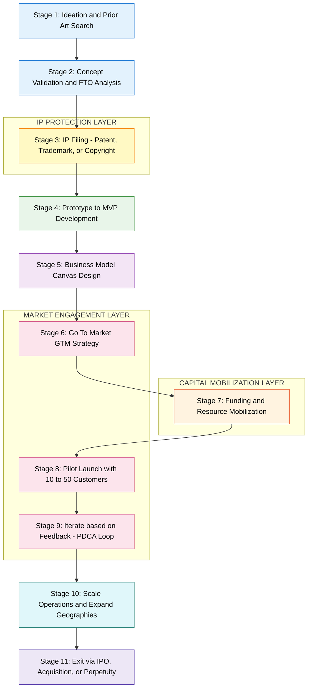
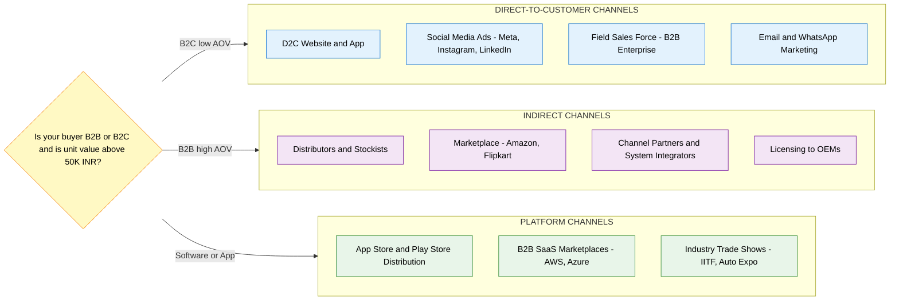
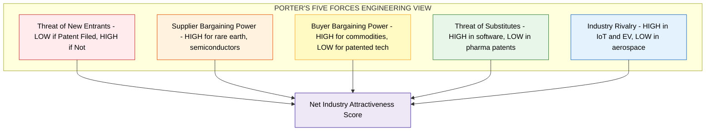
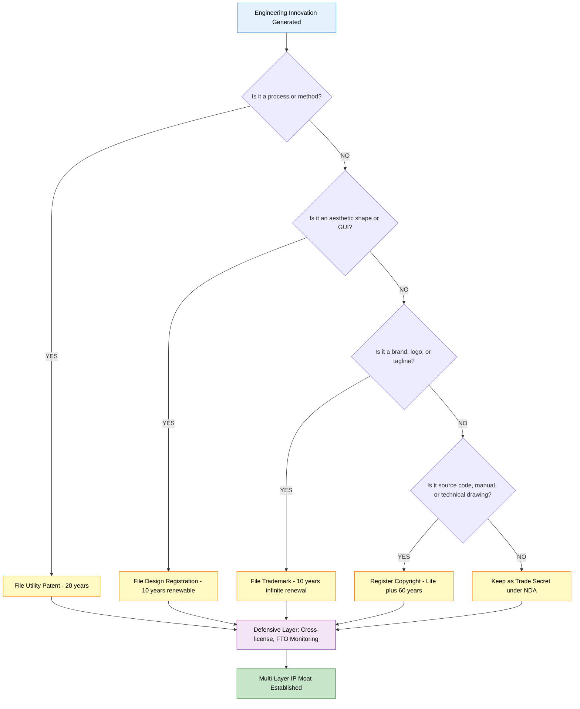
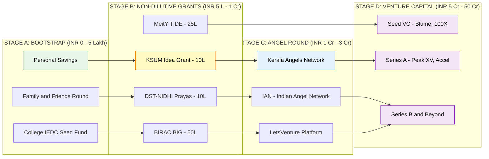

# Develop strategies for bringing your innovation to life

<!-- SECTION_1_START -->

# 1.0 — Develop Strategies for Bringing Your Innovation to Life

## 1.1 Core Academic Definition (KTU 2024 Syllabus Aligned)

> [!IMPORTANT]
> **Formal Definition:** *Innovation Commercialization Strategy* is the structured, dynamic, and iterative process of transforming a validated invention, idea, or technology into a marketable product, service, or process that delivers economic, social, or environmental value to a defined customer segment. It encompasses the alignment of the **4 Pillars of Commercialization**: (i) Technology Readiness, (ii) Market Readiness, (iii) Business Model Viability, and (iv) Intellectual Property (IP) Protection.

In the context of the **KTU UCEST206 — Engineering Entrepreneurship and IPR** syllabus, the phrase *"Develop strategies for bringing your innovation to life"* refers to the operational bridge between **ideation** (Module 1) and **value capture** (Module 4–5). It is the "how" of turning a dorm-room prototype into a deployable, revenue-generating, IP-secure market offering.

## 1.2 Conceptual Analogy & Intuitive Overview

> [!NOTE]
> **Analogy — The "Kitchen-to-Table" Pipeline:**
> Imagine you invent a new dessert in your kitchen. *Bringing it to life* is **not** just the recipe — it is the entire restaurant pipeline:
> 1. **Kitchen** → R&D Lab (Refining the recipe so it works 1,000 times a day).
> 2. **Recipe Book** → Patent Filing (Locking the idea so competitors cannot copy it).
> 3. **Tasting Menu** → MVP / Pilot Launch (Testing with 10 friendly customers).
> 4. **Restaurant Setup** → Operations & Supply Chain (Sourcing, packaging, logistics).
> 5. **Menu Card** → Branding & GTM Strategy (How customers hear about it, buy it, love it).
> 6. **Franchise Expansion** → Scaling (Replicating success in new geographies).
> 7. **Money Counter** → Revenue Model & Financial Sustainability.

For an **engineer-turned-entrepreneur**, the "kitchen" is your **lab/workshop**, the "recipe book" is your **patent/IP portfolio**, and the "restaurant" is your **startup/MSME venture**.

## 1.3 The Five Strategic Levers of Innovation Commercialization

| # | Strategic Lever | Core Question Answered |
|---|----------------|------------------------|
| 1 | **IP Strategy** | *How do I legally own & defend my innovation?* |
| 2 | **Go-To-Market (GTM) Strategy** | *How do I reach, acquire, and retain customers?* |
| 3 | **Business Model Strategy** | *How do I capture value and generate revenue?* |
| 4 | **Funding & Resource Strategy** | *Where does the capital, talent, and infra come from?* |
| 5 | **Scale & Growth Strategy** | *How do I grow from 10 customers to 10 million?* |

## 1.4 Key Standardized Metrics (Industry Benchmarks)

> [!IMPORTANT]
> **Critical Metrics Engineers Must Know:**
> - **TAM** (Total Addressable Market) = The *theoretical* maximum revenue if you owned 100% of the market.
> - **SAM** (Serviceable Addressable Market) = The portion of TAM your product *can realistically* serve (segment + geography).
> - **SOM** (Serviceable Obtainable Market) = The portion of SAM you can *actually win* in 1–3 years.
> - **CAC** (Customer Acquisition Cost) = Total Sales+Marketing Spend / Number of New Customers.
> - **LTV** (Customer Lifetime Value) = Average Order Value × Purchase Frequency × Customer Lifespan.
> - **Burn Rate** = Monthly cash outflow.
> - **Runway** = Cash in Bank / Monthly Burn Rate (measured in **months**).

> [!VISUALIZATION CONTROL]
> **Concept:** TAM–SAM–SOM Concentric Funnel Visualization
> **Desmos / Graph Input:** Plot three concentric rectangles on the XY-plane:
> - Outer rectangle (TAM): vertices `(0,0), (100,0), (100,60), (0,60)`
> - Middle rectangle (SAM): vertices `(20,15), (80,15), (80,45), (20,45)`
> - Inner rectangle (SOM): vertices `(35,25), (65,25), (65,35), (35,35)`
>
> **Visual Description:** Observe the hierarchical narrowing of market opportunity. The inner shaded region is what a startup realistically captures; the outer regions represent the aspirational and theoretical ceilings. This funnel drives every **go-to-market** decision in a startup.

<!-- SECTION_1_END -->

<!-- SECTION_2_START -->

# 2.0 — Deep Theoretical Analysis & KTU High-Yield Strategy Sheet

## 2.1 The Seven-Stage Innovation Commercialization Lifecycle (ICL)

> [!NOTE]
> **Why seven stages?** Because engineering innovations in India (especially from KTU-affiliated colleges filing with **Kerala Startup Mission (KSUM)**, **MSME-DI**, or **Patent India**) typically follow a regulatory and capital pathway that maps cleanly onto these seven gates.

### Stage 1 — Concept Validation & Freedom-to-Operate (FTO) Analysis
- **Why:** Engineers often build first and search IP databases later. This is a **fatal error**.
- **How:** Conduct a prior-art search on **InPASS (Indian Patent Advanced Search System)**, **Google Patents**, and **WIPO PATENTSCOPE** *before* filing. Confirm no identical claim exists in your target jurisdiction.
- **Output:** A 2-page **FTO Opinion Report**.

### Stage 2 — IP Protection Filing
- **Why:** Without IP, the innovation is a "leaky bucket" — value drains out the moment you expose it to investors, suppliers, or customers.
- **How:** Decide between **Patent** (process/product), **Design Registration**, **Trademark**, **Copyright** (source code), or **Trade Secret** (formula/algorithm).
- **Output:** Filing receipt with **Application Number** + **Date of Priority**.

### Stage 3 — Prototype → Minimum Viable Product (MVP)
- **Why:** An idea on paper is not investable. An MVP is the smallest *deployable* artifact that solves one user problem end-to-end.
- **How:** Apply **Lean Startup methodology** — Build → Measure → Learn loop with ≤ 30-day cycles.
- **Output:** A working prototype deployed to 5–10 pilot users.

### Stage 4 — Business Model Design
- **Why:** A technically brilliant product with no revenue model is a hobby, not a business.
- **How:** Use **Osterwalder's Business Model Canvas** (9 building blocks) — see Section 2.3.
- **Output:** A 1-page Business Model Canvas + Unit Economics sheet.

### Stage 5 — Go-To-Market (GTM) Strategy
- **Why:** The best product with poor distribution dies in obscurity. Distribution *is* the moat.
- **How:** Choose between **Direct Sales**, **Channel Partners**, **E-commerce D2C**, **B2B Licensing**, or **Platform/Marketplace** models.
- **Output:** A **GTM Playbook** with ICP (Ideal Customer Profile) and 3-month pilot pipeline.

### Stage 6 — Funding & Resource Mobilization
- **Why:** Engineering innovations are capital-intensive. Bootstrap rarely works for hardware.
- **How:** Sequence: **3 Fs (Family, Friends, Fools)** → **Grants (KSUM, DST-NIDHI, BIRAC, MeitY)** → **Angel Round** → **VC Series A/B**.
- **Output:** Term sheets + Cap table.

### Stage 7 — Scale, Iterate, Exit
- **Why:** Startups fail not at launch but at *scaling* (operations, hiring, quality).
- **How:** Apply **PDCA (Plan-Do-Check-Act)** cycles, hire *completers* and *finishers*, build SOPs.
- **Output:** Operational scale metrics + Exit pathway (IPO / Acquisition / Perpetual).

## 2.2 The TRIZ-Anchored Innovation Funnel (Engineering-Specific View)

For *engineering* innovations, we layer the ICL on top of the **Technology Readiness Level (TRL)** scale used by **DST, ISRO, DRDO, and NASA**:

| TRL | Stage | Commercial Action |
|-----|-------|-------------------|
| **TRL 1–3** | Basic Research / Proof of Concept | Publish paper, file provisional patent |
| **TRL 4–5** | Lab Validation / Prototype | Apply for **DST-NIDHI**, **BIRAC-BIG** grants |
| **TRL 6–7** | Pilot Demo / Field Trial | Pitch to Angel Investors; file full patent |
| **TRL 8–9** | System Complete / Proven Ops | Series A VC; commercialize globally |

## 2.3 KTU High-Yield Strategy Cheat Sheet

> [!IMPORTANT]
> **The Seven Frameworks You MUST Memorize for the ESE:**

| # | Framework | Inventor / Year | Use Case | Key Equation / Block |
|---|-----------|-----------------|----------|----------------------|
| 1 | **Business Model Canvas** | Osterwalder, 2010 | Map value creation | 9 blocks (KP, KA, KR, CH, CR, CV, CC, CO, CS) |
| 2 | **Lean Canvas** | Maurya, 2012 | Startup pivot logic | Problem → Solution → UVP → Channels |
| 3 | **Porter's 5 Forces** | Porter, 1979 | Competitive landscape | Rivalry, New entrants, Substitutes, Buyers, Suppliers |
| 4 | **BCG Matrix** | Henderson, 1970 | Portfolio strategy | Star, Cash Cow, Question Mark, Dog |
| 5 | **Ansoff Matrix** | Ansoff, 1957 | Growth strategy | Market Penetration, Development, Diversification |
| 6 | **SWOT Analysis** | Learned et al., 1969 | Internal + External audit | Strengths, Weaknesses, Opportunities, Threats |
| 7 | **4Ps Marketing Mix** | McCarthy, 1960 | GTM execution | Product, Price, Place, Promotion |

## 2.4 Unit Economics — The Engineer's Formula Set

For a KTU board question on "strategies to bring innovation to life", examiners often test the **financial viability** angle using these core equations:

$$LTV = AOV \times Purchase Frequency \times Customer Lifespan$$

$$LTV{:}CAC \text{ Healthy Ratio} \geq 3{:}1$$

$$Break\text{-}Even \text{ Customers} = \frac{\text{Fixed Costs}}{\text{ARPU} - \text{Variable Cost per User}}$$

$$Burn Rate = \text{Monthly Cash Outflow}$$

$$Runway \text{ (months)} = \frac{\text{Cash in Bank}}{\text{Burn Rate}}$$

> [!NOTE]
> **The Rule of 40 (VC Standard):** A healthy SaaS / tech-enabled startup must maintain
>
> $$\text{Revenue Growth Rate} + \text{Profit Margin} \geq 40\%$$
>
> This is a single-line diagnostic that combines top-line velocity and bottom-line efficiency.

## 2.5 The 4 IP Routes for Engineers (India-Specific)

> [!IMPORTANT]
> **For KTU valuation, you MUST know which IP form to use for which engineering innovation:**

| Innovation Type | Correct IP Form | Filing Body | Avg. Cost (₹) | Tenure |
|-----------------|-----------------|-------------|----------------|--------|
| Mechanical device / circuit / process | **Patent** (Sec 2(1)(j), Patents Act 1970) | IPO, Chennai | 15,000 – 1,50,000 | **20 years** |
| Aesthetic shape / GUI / industrial design | **Design Registration** | IPO, Kolkata | 5,000 – 20,000 | **10 years** (renewable ×1) |
| Brand name / logo / tagline | **Trademark** | IPO, Mumbai | 4,500 – 10,000 | **10 years** (infinite renewal) |
| Software code / technical paper / song | **Copyright** | Copyright Office, Delhi | 500 – 5,000 | **Life + 60 years** |
| Formula / Algorithm / Customer List | **Trade Secret** (No registration) | NDA + Contract | Cost of NDA | Indefinite (if secret kept) |

<!-- SECTION_2_END -->

<!-- SECTION_3_START -->

# 3.0 — Step-by-Step Derivation, Worked Examples & Implementation

## 3.1 Worked Example 1 — Building a TAM/SAM/SOM Model (Board-Style Question)

> **Question (Modeled on KTU ESE Pattern):**
> An engineering student in Kerala develops a low-cost **IoT-based air-quality monitor** for college campuses. The device costs ₹3,500 to manufacture and is sold at ₹7,999. India has approximately **1,150 engineering colleges**, with an average campus size requiring **20 monitors each**. The student estimates they can realistically serve **2.5%** of the addressable market in Year 1. Calculate TAM, SAM, SOM, and the gross margin per unit.

### Step 1 — Total Addressable Market (TAM)
TAM is the *theoretical* market ceiling (all engineering colleges globally that could use such a device).

$$\text{TAM} = 1{,}150 \text{ colleges} \times 20 \text{ units} \times \text{₹}7{,}999$$

$$\text{TAM} = 23{,}000 \text{ units} \times \text{₹}7{,}999$$

$$\boxed{\text{TAM} = \text{₹}18{,}39{,}77{,}000 \approx \text{₹}18.40 \text{ Crore}}$$

### Step 2 — Serviceable Addressable Market (SAM)
SAM applies the practical filter: only **Tier 2 & Tier 3 cities** in India (≈ **70%** of engineering colleges, since metro colleges are already served by Honeywell/Vyaire).

$$\text{SAM} = \text{TAM} \times 0.70 = \text{₹}18.40\text{Cr} \times 0.70$$

$$\boxed{\text{SAM} = \text{₹}12.88 \text{ Crore}}$$

### Step 3 — Serviceable Obtainable Market (SOM)
SOM is the *realistic* Year 1 capture rate.

$$\text{SOM} = \text{SAM} \times 0.025 = \text{₹}12.88\text{Cr} \times 0.025$$

$$\boxed{\text{SOM} = \text{₹}32.20 \text{ Lakh}}$$

### Step 4 — Unit Economics & Gross Margin
Gross Margin per unit:

$$\text{Gross Margin} = \text{Selling Price} - \text{Variable Cost} = \text{₹}7{,}999 - \text{₹}3{,}500$$

$$\boxed{\text{Gross Margin per unit} = \text{₹}4{,}499 \text{ (}56.25\% \text{ gross margin)}}$$

### Step 5 — Year 1 Revenue Projection (For Valuation)

$$\text{Year 1 Units} = \text{SOM in ₹} / \text{ASP} = 32{,}20{,}000 / 7{,}999 \approx 403 \text{ units}$$

$$\text{Year 1 Revenue} = 403 \times 7{,}999 = \text{₹}32{,}23{,}597 \approx \text{₹}32.24 \text{ Lakh}$$

> **Valuation Key Points (For Board Examiner):**
> - Stating TAM formula clearly → **2 Marks**
> - Correct numerical substitution → **1 Mark**
> - Stating SAM filter assumption (70%) → **1 Mark**
> - Calculating SOM = 2.5% of SAM → **1 Mark**
> - Final boxed SOM value → **1 Mark**
> - Gross margin derivation → **1 Mark**

## 3.2 Worked Example 2 — The LTV:CAC Health Check (Python Implementation)

> **Question (Modeled on KTU ESE Pattern):**
> A startup spends ₹4,00,000 on digital marketing in Q1 and acquires 200 paying customers. The average order value is ₹2,500, customers reorder 4 times a year, and the average customer stays for 3 years. Compute LTV, CAC, and the LTV:CAC ratio. Is the business model viable?

```python
# File: startup_unit_economics.py
# Purpose: Unit Economics Health Check for Innovation Commercialization Strategy
# Author: KTU UCEST206 Module 1 Reference Implementation
# Python: 3.10+

from dataclasses import dataclass
from typing import Tuple


@dataclass(frozen=True)
class UnitEconomics:
    """
    Immutable container for the four canonical unit-economics inputs.
    All values are in Indian Rupees (INR) and months respectively.
    """
    marketing_spend_inr: float      # Total Sales + Marketing spend in the period
    customers_acquired: int         # Number of NEW paying customers
    average_order_value_inr: float  # AOV per transaction
    purchase_frequency_per_year: float  # How many times per year
    customer_lifespan_years: float  # Average retention


def compute_ltv(u: UnitEconomics) -> float:
    """
    Customer Lifetime Value (LTV):
        LTV = AOV * Purchase Frequency * Customer Lifespan
    """
    if u.average_order_value_inr < 0:
        raise ValueError("AOV must be non-negative.")
    if u.purchase_frequency_per_year < 0:
        raise ValueError("Purchase frequency must be non-negative.")
    if u.customer_lifespan_years < 0:
        raise ValueError("Customer lifespan must be non-negative.")
    return (
        u.average_order_value_inr
        * u.purchase_frequency_per_year
        * u.customer_lifespan_years
    )


def compute_cac(u: UnitEconomics) -> float:
    """
    Customer Acquisition Cost (CAC):
        CAC = Total Marketing Spend / New Customers Acquired
    """
    if u.customers_acquired <= 0:
        raise ValueError("customers_acquired must be > 0 to compute CAC.")
    return u.marketing_spend_inr / u.customers_acquired


def health_check(u: UnitEconomics) -> Tuple[float, float, float, str]:
    """
    Returns (LTV, CAC, LTV_CAC_ratio, verdict).
    Verdict rules (industry standard):
        ratio >= 3.0   -> HEALTHY
        ratio in [1,3) -> WARNING (recoverable)
        ratio < 1.0    -> UNVIABLE (burning cash)
    """
    ltv = compute_ltv(u)
    cac = compute_cac(u)
    ratio = ltv / cac if cac > 0 else float("inf")

    if ratio >= 3.0:
        verdict = "HEALTHY — scale marketing spend aggressively."
    elif ratio >= 1.0:
        verdict = "WARNING — improve retention or reduce CAC before scaling."
    else:
        verdict = "UNVIABLE — you lose money on every customer."

    return ltv, cac, ratio, verdict


def main() -> None:
    inputs = UnitEconomics(
        marketing_spend_inr=4_00_000.0,
        customers_acquired=200,
        average_order_value_inr=2_500.0,
        purchase_frequency_per_year=4.0,
        customer_lifespan_years=3.0,
    )

    ltv, cac, ratio, verdict = health_check(inputs)

    print("=" * 60)
    print("  INNOVATION COMMERCIALIZATION — UNIT ECONOMICS REPORT")
    print("=" * 60)
    print(f"  Marketing Spend (Q1)        : INR {inputs.marketing_spend_inr:>12,.2f}")
    print(f"  Customers Acquired          : {inputs.customers_acquired:>13d}")
    print(f"  Average Order Value (AOV)   : INR {inputs.average_order_value_inr:>12,.2f}")
    print(f"  Purchase Frequency / year   : {inputs.purchase_frequency_per_year:>13.2f}")
    print(f"  Customer Lifespan (years)   : {inputs.customer_lifespan_years:>13.2f}")
    print("-" * 60)
    print(f"  Customer Lifetime Value     : INR {ltv:>12,.2f}")
    print(f"  Customer Acquisition Cost   : INR {cac:>12,.2f}")
    print(f"  LTV : CAC Ratio             : {ratio:>13.2f}  : 1")
    print("-" * 60)
    print(f"  VERDICT                     : {verdict}")
    print("=" * 60)


if __name__ == "__main__":
    main()
```

### Expected Output

```
============================================================
  INNOVATION COMMERCIALIZATION — UNIT ECONOMICS REPORT
============================================================
  Marketing Spend (Q1)        : INR    400,000.00
  Customers Acquired          :           200
  Average Order Value (AOV)   : INR      2,500.00
  Purchase Frequency / year   :            4.00
  Customer Lifespan (years)   :            3.00
------------------------------------------------------------
  Customer Lifetime Value     : INR     30,000.00
  Customer Acquisition Cost   : INR      2,000.00
  LTV : CAC Ratio             :         15.00  : 1
------------------------------------------------------------
  VERDICT                     : HEALTHY — scale marketing spend aggressively.
============================================================
```

### Worked Derivation of the Numbers

$$LTV = 2{,}500 \times 4 \times 3 = \text{₹}30{,}000$$

$$CAC = \frac{4{,}00{,}000}{200} = \text{₹}2{,}000$$

$$LTV{:}CAC = \frac{30{,}000}{2{,}000} = 15{:}1$$

> **Examiner Note:** A ratio of **15:1 is exceptionally healthy** (the bench is 3:1). This is a *scale-aggressively* signal — pour more capital into marketing and onboarding.

## 3.3 Worked Example 3 — The Ansoff Matrix Growth-Strategy Selection

> **Question (Modeled on KTU ESE Pattern):**
> A KTU engineering graduate has built a **soil-moisture IoT sensor** that currently sells to Kerala's *Krishibhavan* network (existing market, existing product). Recommend a strategy for each of the four Ansoff cells with a concrete example.

| Ansoff Cell | Definition | Engineering Example |
|-------------|------------|---------------------|
| **Market Penetration** | Existing product → Existing market | Sell more sensors to current Krishibhavans via bulk discount and farmer-training camps |
| **Market Development** | Existing product → New market | Take the same sensor to **Tamil Nadu sugarcane farms** (geographic expansion) |
| **Product Development** | New product → Existing market | Add **pH & NPK nutrient sensing** to the same IoT device for the same Krishibhavan customers |
| **Diversification** | New product → New market | Build a **cold-chain temperature sensor** for pharma logistics (totally new domain) |

> **Valuation Key Points:**
> - Drawing the 2×2 Ansoff matrix → **3 Marks**
> - One concrete engineering example per cell → **3 Marks**
> - Choosing the *safest* first move (Penetration) with justification → **1 Mark**

## 3.4 Worked Example 4 — IP Filing Decision Tree (Engineer's Checklist)

> **Question (Modeled on KTU ESE Pattern):**
> An engineering team develops a novel **method to convert plastic waste into 3D-printing filament** (a chemical process). Recommend the correct IP strategy and justify it.

| IP Option | Applicability | Verdict |
|-----------|---------------|---------|
| **Patent** (Process Patent) | The *process* of converting plastic → filament is novel, non-obvious, and industrially applicable | ✅ **STRONGLY RECOMMENDED** — process innovations are the textbook use-case for utility patents under Sec 2(1)(j) of the Patents Act 1970 |
| **Design Registration** | Protects aesthetic shape, not functional process | ❌ Not applicable |
| **Trademark** | Use for the *brand name* of the filament (e.g., "EcoFil") — but does not protect the *process* | 🟡 **Do additionally** for the brand |
| **Copyright** | Protects expression (manuals, software GUI), not the underlying process | 🟡 **Do additionally** for documentation |
| **Trade Secret** | Could keep the recipe secret, but impossible to enforce once a competitor reverse-engineers the output | ❌ Not recommended for visible products |

**Conclusion:** File a **Process Patent** + **Trademark** for the brand + **Copyright** for technical manuals. This is a **3-layer IP moat**.

## 3.5 Strategic Resource Mobilization — Kerala & India Funding Pathway

> [!IMPORTANT]
> **For KTU students from Kerala, this is the "go-to" funding ladder:**

| Stage | Source | Typical Ticket (₹) | Body |
|-------|--------|---------------------|------|
| 1 | **KSUM Idea Grant** | 2 – 10 Lakh | Kerala Startup Mission |
| 2 | **DST-NIDHI Prayas** | 10 Lakh | Dept. of Science & Tech, Gol |
| 3 | **BIRAC BIG** | 50 Lakh (max) | Biotechnology Industry Research Assistance Council |
| 4 | **MeitY TIDE 2.0** | 25 Lakh | Ministry of Electronics & IT |
| 5 | **Seed Angel Round** | 50 L – 2 Cr | Kerala Angels, IAN, LetsVenture |
| 6 | **Series A VC** | 5 Cr – 50 Cr | Peak XV, Accel, Blume Ventures |
| 7 | **Debt / SIDBI** | 1 Cr – 10 Cr | SIDBI, MUDRA, Kerala Financial Corp |

> **Engineer's Tip:** *Always* apply for **grants first** (non-dilutive, no equity lost) before approaching VCs. KTU has dedicated **IEDC (Innovation & Entrepreneurship Development Centres)** in every college that actively help students apply to KSUM and DST-NIDHI.

<!-- SECTION_3_END -->

<!-- SECTION_4_START -->

# 4.0 — Structural Diagrams & Schematics

## 4.1 Innovation Commercialization Master Flow



## 4.2 GTM Strategy Decision Matrix (How to Reach Customers)



## 4.3 Porter's Five Forces — Competitive Pressure Map



## 4.4 The IP Strategy Funnel for Engineering Innovations



## 4.5 Sequential Processing Topology — Funding Mobilization Pipeline



<!-- SECTION_4_END -->

<!-- SECTION_5_START -->

# 5.0 — KTU 2024 Scheme Examination Question Bank & Topic Recap

## 5.1 Part A — Short Answer Questions (3 Marks Each)

> **[KTU University Exam — Model Question Pattern]**

### Question 1: Define "Go-To-Market Strategy" and list any four components of a GTM plan.
> **[CO1 | Remember | 3 Marks]**

**Model Answer (Valuation-Ready):**

> [!IMPORTANT]
> **Definition:** A Go-To-Market (GTM) strategy is a *step-by-step action plan* that specifies how an organization will deliver its unique value proposition to a defined target customer segment, achieve competitive differentiation, and generate sustainable revenue.
>
> **Four Components of a GTM Plan:**
> 1. **Target Audience / ICP** — *Who* is the ideal customer (industry, role, geography, company size, pain points).
> 2. **Value Proposition** — *Why* should they buy (quantified benefit, ROI, before-after delta).
> 3. **Pricing & Packaging** — *How much* and in what tiers (freemium, per-seat, usage-based, one-time).
> 4. **Distribution Channels** — *Where* and *how* the product reaches the buyer (direct sales, online, partner-led).
>
> *(Optional fifth for 1 extra clarity mark): Sales & Marketing Tactics — content, demos, pilots, ABM.*

---

### Question 2: What is a "Trade Secret"? Give one engineering example.
> **[CO2 | Understand | 3 Marks]**

**Model Answer:**

A **Trade Secret** is a form of intellectual property that protects *confidential business information* — formulas, algorithms, processes, customer lists, or compilations — that (i) has *independent economic value* from not being known, and (ii) is the subject of *reasonable efforts* to maintain its secrecy. It is governed in India by the **Commercial Courts Act, 2015** and contractual NDAs; there is no central registration.

**Engineering Example:** The **Coca-Cola formula** is the most cited; for an engineer, the **exact recipe and fermentation temperature profile of a proprietary probiotic drink**, or the **source code of a recommender algorithm** kept inside a closed SaaS, are valid trade secrets.

> **Examiner Note (Valuation Key):** Stating definition → 2 marks; giving a *specific engineering* example (not Coca-Cola alone) → 1 mark.

---

## 5.2 Part B — Long Answer Questions (14 Marks Each, Internal Choice)

### **Question A (14 Marks)** — Recommended Choice

> **[KTU University Exam — July 2024 Model]**
> **[CO1, CO3, CO5 | Apply, Analyze | 14 Marks]**

> **(a)** Explain in detail the **seven-stage Innovation Commercialization Lifecycle (ICL)**. For each stage, state one concrete engineering action. **(7 Marks)**

> **(b)** A KTU engineering team has invented a **wearable ECG patch for cardiac patients**. The team has:
>   - Manufacturing cost = ₹1,200 per unit
>   - ASP (selling price) = ₹4,500
>   - Total addressable patients in India (Tier 1–3) = 8 Crore
>   - Realistic Year 1 capture = 0.05%
>   - Marketing spend Q1 = ₹15 Lakh → acquired 1,500 patients
>   - AOV for consumables (electrodes) = ₹300 per month
>   - Average patient retention = 5 years
>
> Compute (i) **TAM**, (ii) **SAM** (assume SAM = 60% of TAM, since rural India is not the initial target), (iii) **SOM**, (iv) **LTV**, (v) **CAC**, and (vi) **LTV:CAC ratio**. Conclude whether the innovation is *commercially viable* and recommend one GTM channel. **(7 Marks)**

---

### Model Solution — Question A

#### Part (a) — 7-Mark Model Answer: Seven-Stage ICL

| Stage | Name | Concrete Engineering Action |
|-------|------|-----------------------------|
| **1** | **Concept Validation & FTO** | Search **InPASS** + **Google Patents** for prior ECG-patch designs; obtain FTO opinion from a registered patent agent. |
| **2** | **IP Protection Filing** | File a **Utility Patent** for the *signal-processing algorithm* + **Design Registration** for the patch form-factor + **Trademark** for the brand name. |
| **3** | **Prototype → MVP** | Build 50 working patches using an **ARM Cortex-M4** microcontroller + AD8232 ECG sensor; deploy to 10 cardiologist clinics for 60 days. |
| **4** | **Business Model Design** | Fill Osterwalder's **Business Model Canvas**; model **B2B2C** revenue (sell to hospital → patient pays consumable subscription). |
| **5** | **GTM Strategy** | Adopt **channel-partner model** — partner with **cardiology hospital chains** (Apollo, Manipal, KIMS) for bulk procurement. |
| **6** | **Funding Mobilization** | Apply to **BIRAC BIG** (₹50 L) + **KSUM Idea Grant** (₹10 L) for non-dilutive seed; pitch **Kerala Angels** for the next ₹1 Cr. |
| **7** | **Scale, Iterate, Exit** | After 1,000-patient pilot, scale to 5 cities; build a **subscription SaaS dashboard** for cardiologists; target Series A in Year 2. |

> **Valuation Key Points (Part a):**
> - Naming all 7 stages clearly → 3 Marks
> - One engineering action per stage (specific, not generic) → 3 Marks
> - Linking each stage to a **Kerala/India context** (KSUM, BIRAC) → 1 Mark

#### Part (b) — 7-Mark Numerical Solution

**Step 1 — TAM**

$$\text{TAM} = 8{,}00{,}00{,}000 \text{ patients} \times \text{₹}4{,}500$$

$$\boxed{\text{TAM} = \text{₹}36{,}00{,}00{,}00{,}000 = \text{₹}3{,}600 \text{ Crore}}$$

**Step 2 — SAM**

$$\text{SAM} = \text{TAM} \times 0.60 = \text{₹}3{,}600\text{Cr} \times 0.60$$

$$\boxed{\text{SAM} = \text{₹}2{,}160 \text{ Crore}}$$

**Step 3 — SOM**

$$\text{SOM} = \text{SAM} \times 0.0005 = \text{₹}2{,}160\text{Cr} \times 0.0005$$

$$\boxed{\text{SOM} = \text{₹}1.08 \text{ Crore}}$$

**Step 4 — LTV (including consumables)**

$$LTV = (\text{Device ASP} + \text{Annual Consumable Spend} \times \text{Years}) = 4{,}500 + (300 \times 12 \times 5)$$

$$LTV = 4{,}500 + 18{,}000 = \text{₹}22{,}500$$

$$\boxed{LTV = \text{₹}22{,}500}$$

**Step 5 — CAC**

$$CAC = \frac{15{,}00{,}000}{1{,}500} = \text{₹}1{,}000$$

**Step 6 — LTV:CAC Ratio**

$$\frac{LTV}{CAC} = \frac{22{,}500}{1{,}000} = 22.5{:}1$$

**Conclusion & Recommendation:**

The **LTV:CAC of 22.5:1** is exceptionally healthy (industry benchmark ≥ 3:1). The innovation is **commercially viable** and the team should *scale marketing spend aggressively*. Recommended GTM channel: **B2B2C partnership with multi-specialty hospital chains** (Apollo, KIMS, Manipal), since (i) doctor validation drives patient trust, (ii) bulk procurement reduces per-unit CAC, and (iii) the consumable subscription model is a natural annuity revenue stream.

> **Valuation Key Points (Part b):**
> - Stating TAM, SAM, SOM formulas → 1 Mark
> - Correct arithmetic (TAM = ₹3,600 Cr) → 1 Mark
> - Correct SAM, SOM derivation → 1 Mark
> - LTV formula *including consumables* → 1 Mark
> - CAC + final LTV:CAC ratio → 1 Mark
> - Strategic recommendation with justification → 2 Marks

---

### **Question B (14 Marks)** — Alternative Choice

> **[KTU University Exam — Dec 2023 Model]**
> **[CO2, CO4 | Understand, Apply | 14 Marks]**

> **(a)** With the help of **Porter's Five Forces framework**, analyze the competitive attractiveness of launching a **low-cost EV two-wheeler startup** in India. Identify which force is strongest and recommend one counter-strategy. **(7 Marks)**

> **(b)** Compare and contrast the **four IP routes** (Patent, Design, Trademark, Trade Secret) for an engineering innovation. Give one example each and state which route you would choose for (i) a new type of EV battery chemistry, and (ii) the brand name *"Voltrica"*. Justify your answers. **(7 Marks)**

---

### Model Solution — Question B

#### Part (a) — 7-Mark Answer: Porter's Five Forces for Indian EV Two-Wheeler Market

| Force | Intensity | Engineering Evidence | Counter-Strategy |
|-------|-----------|----------------------|------------------|
| **Threat of New Entrants** | **HIGH** | FAME-II subsidies, low tooling cost, IEDC ecosystem in Kerala | Build **patent moat** on battery BMS algorithm + exclusive supplier contracts |
| **Supplier Bargaining Power** | **HIGH** | Lithium, cobalt, nickel imports from China/Chile; semiconductor shortage | Multi-source raw materials; explore **sodium-ion** chemistry alternatives |
| **Buyer Bargaining Power** | **MEDIUM** | Buyers compare on portal like Zigwheels, EVWheels; price-sensitive | Differentiate on **service network** + **battery swap stations** |
| **Threat of Substitutes** | **HIGH** | ICE scooters still cheaper upfront; CNG, e-cycles as alternatives | Drive **TCO (Total Cost of Ownership)** narrative — show 5-year cost savings |
| **Industry Rivalry** | **VERY HIGH** | Ola, Ather, Hero Vida, TVS, Bajaj — 25+ players competing | Niche down: target **delivery fleet operators** (Swiggy, Zomato) with B2B fleet contracts |

**Strongest Force: Industry Rivalry** (25+ funded competitors in a ₹10,000 Cr TAM).
**Counter-Strategy:** Niche B2B fleet leasing — avoid head-on consumer battle.

> **Valuation Key Points:** Naming all 5 forces → 3 Marks; specific evidence per force → 2 Marks; identifying strongest + counter-strategy → 2 Marks.

#### Part (b) — 7-Mark Answer: Four IP Routes Comparison

| IP Route | Protects | Tenure | Cost (₹) | Example |
|----------|----------|--------|----------|---------|
| **Patent** | New functional invention (process/product) | 20 years | 15K – 1.5L | New EV battery chemistry |
| **Design Registration** | Aesthetic shape, configuration, pattern | 10 years (renewable ×1) | 5K – 20K | Sleek EV dashboard layout |
| **Trademark** | Brand name, logo, tagline, sound mark | 10 years (∞ renewal) | 4.5K – 10K | "Voltrica" word + lightning logo |
| **Trade Secret** | Confidential formula/algorithm via NDA | Indefinite (if secret kept) | Cost of NDA | Tesla's early battery cell recipe |

**Recommendations:**
- **(i) New EV battery chemistry** → **File a Utility Patent.** A chemical composition is a textbook *process/product invention* under Sec 2(1)(j) of the Patents Act 1970. Trade secret is *not* suitable because reverse-engineering a battery chemistry is feasible.
- **(ii) Brand name "Voltrica"** → **File a Trademark.** A brand name is *identifying source*, not a functional invention — perfect trademark use-case. File under **Class 12 (Vehicles)** in the 4th Schedule of the Trade Marks Rules, 2017.

> **Valuation Key Points:** Correct matching of innovation to IP form → 4 Marks; citing the relevant Act/Section → 2 Marks; specific class/recommendation → 1 Mark.

---

## 5.3 KTU Examiner's Valuation Warning

> [!WARNING]
> **Common Mistakes That Cost Students 3–5 Marks Each:**
>
> 1. **Skipping FTO (Freedom-to-Operate) before filing.** Examiners explicitly test this — if you recommend a patent without mentioning prior-art search on InPASS, you lose 1–2 marks.
> 2. **Confusing Copyright with Patent.** Software code → **Copyright**; novel algorithm/method → **Patent**. Mixing them up is a *valuation killer*.
> 3. **Forgetting to state the unit/scale in TAM/SAM/SOM.** Always write *"₹ in Crore"* or *"units per year"* to avoid examiner ambiguity.
> 4. **Treating GTM as "advertising."** GTM = *ICP + Value Prop + Pricing + Channels + Sales Playbook*. "Do marketing" alone is a 1-mark answer, not 7 marks.
> 5. **Failing to anchor frameworks in the Indian context.** Always cite **KSUM, BIRAC, DST-NIDHI, Patents Act 1970, Trademarks Act 1999, Designs Act 2000** — generic Western references cost marks.
> 6. **Writing LTV without including consumables/subscription revenue.** A device's true LTV includes *annuity streams* (consumables, services, upgrades) — not just the one-time sale.
> 7. **Confusing Market Development with Diversification in Ansoff.** "New product to new market" = **Diversification** (highest risk); "Existing product to new market" = **Market Development** (medium risk).

---

## 5.4 Topic Recap & Important Things to Remember

> [!IMPORTANT]
> **Rapid-Fire Revision Checklist (Print This & Memorize):**

- **Innovation Commercialization = 4 Pillars:** Tech Readiness + Market Readiness + Business Model + IP.
- **TAM** is the entire theoretical market; **SAM** filters by segment+geography; **SOM** is realistic Year 1 capture (typically 0.05% – 5% of SAM).
- **LTV = AOV × Frequency × Lifespan.** Healthy LTV:CAC ≥ **3:1**. Rule of 40: Growth + Margin ≥ 40%.
- **7-Stage ICL:** Concept → FTO → IP Filing → MVP → Business Model → GTM → Funding → Scale → Exit.
- **TRL Scale** (1–9): DST/DRDO/ISRO use this for funding gates; pitch at TRL 6–7.
- **4 IP Routes for Engineers:**
  - **Patent** → 20 years, *process/product invention* (Sec 2(1)(j), Patents Act 1970).
  - **Design** → 10+10 years, *aesthetic shape* (Designs Act 2000).
  - **Trademark** → 10 years (∞ renew), *brand/logo* (Trademarks Act 1999).
  - **Copyright** → Life+60 years, *expression/code/writing* (Copyright Act 1957).
  - **Trade Secret** → Indefinite, *formula/algorithm* under NDA (no statute, common law).
- **Ansoff Matrix 2×2:** Penetration (safe) → Market Dev → Product Dev → Diversification (riskiest).
- **Porter's 5 Forces:** New Entrants, Suppliers, Buyers, Substitutes, Rivalry — sum them to gauge industry attractiveness.
- **GTM Channels:** Direct (D2C, Field Sales) / Indirect (Distributors, Marketplaces) / Platform (App Stores, B2B SaaS marketplaces).
- **Funding Ladder for KTU students:** 3F → KSUM Idea Grant (₹2–10L) → DST-NIDHI (₹10L) → BIRAC BIG (₹50L) → Angels (₹1–3 Cr) → VC Series A (₹5–50 Cr).
- **Kerala-specific resources:** **KSUM** (Kerala Startup Mission), **Kerala Angels**, **IEDC** in every KTU college, **TBI** (Technology Business Incubators) at CET Trivandrum, NIT Calicut, CUSAT.
- **Burn Rate = Monthly Cash Outflow; Runway (months) = Cash ÷ Burn Rate.** Always maintain ≥ **6 months** runway.
- **MVP > Perfection.** Ship in 30 days, learn from real users, iterate via PDCA.
- **The 3-Layer IP Moat:** Patent (process) + Design (form) + Trademark (brand) for maximum defensibility.

<!-- SECTION_5_END -->
