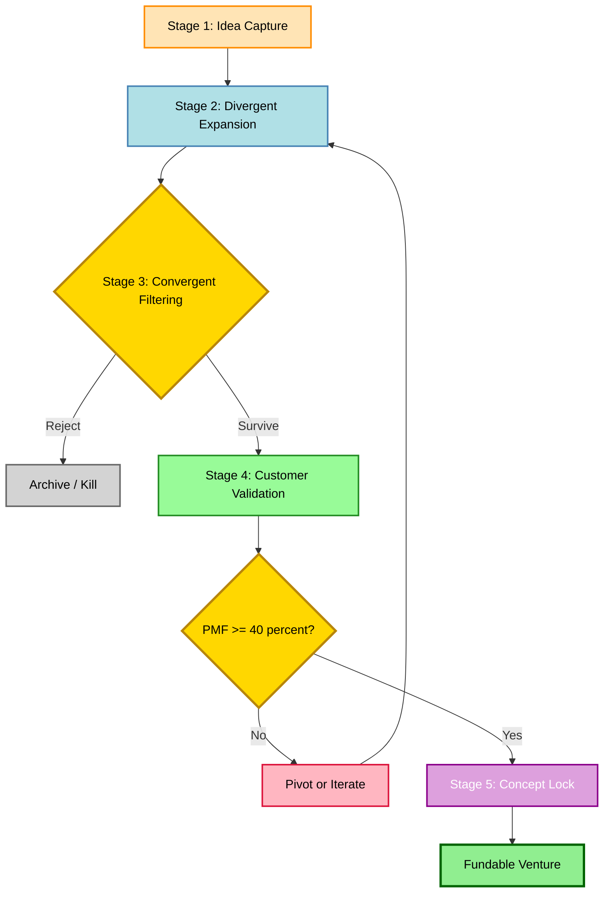
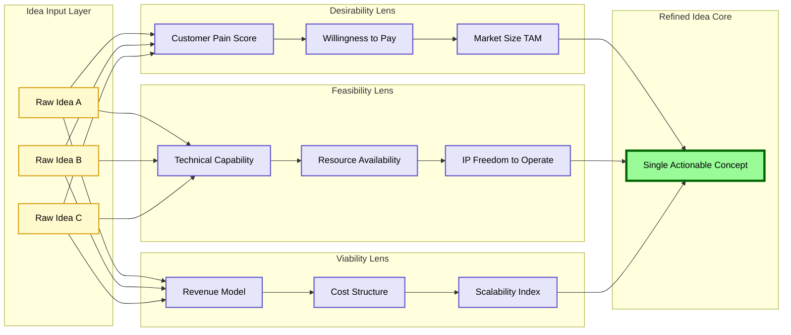
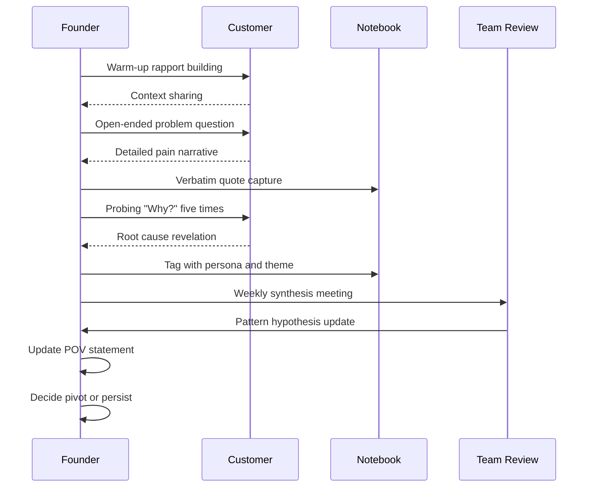
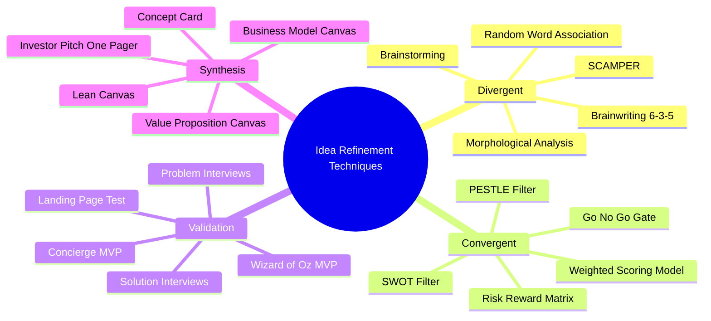

# Developing and Refining Ideas

<!-- SECTION_1_START -->
# Developing and Refining Ideas — Core Foundations

## 1.1 Formal Academic Definition

**Idea Development** in the context of engineering entrepreneurship is the systematic, iterative process of transforming a raw, unstructured concept (often born from a problem observation or technical insight) into a clearly defined, value-validated, and commercially viable opportunity. The **KTU 2024 Scheme** frames this as the bridge between *ideation* (Module 1 foundation) and *feasibility analysis* (Module 2 progression).

**Idea Refinement** is the disciplined application of critical filters — customer validation, technical feasibility, intellectual property screening, and business model fitness — to a nascent idea, in order to sharpen its value proposition, narrow its scope, eliminate ambiguity, and prepare it for prototype development and go-to-market planning.

> [!IMPORTANT]
> **KTU 2024 Syllabus Definition:** *Idea development and refinement is the process of capturing, evaluating, enhancing, and converging multiple divergent ideas into a single, focused, and actionable entrepreneurial concept that solves a real customer problem in a sustainable, scalable, and legally defensible manner.*

---

## 1.2 Intuitive Analogy — The Workshop Mental Model

Imagine you are a **goldsmith** presented with a raw, uncut diamond pulled from a mine.

- The raw diamond = your **initial idea** (rough, promising, but unrefined).
- The goldsmith's loupe (magnifier) = **customer discovery interviews** (you look at the stone from every angle).
- The cutting wheel = **prototyping and MVP testing** (you grind away excess material).
- The polishing cloth = **pivoting and iterating** (you bring out the brilliance).
- The final gem in a jeweler's box = your **refined, market-ready idea**.

Just as a master goldsmith never rushes the cut, an entrepreneur never ships a *raw* idea. The value emerges only through disciplined refinement.

> [!NOTE]
> **Real-World Parallel:** Think of how **Airbnb's** founders started with a simple idea ("rent out air mattresses in our apartment during a conference") and refined it over multiple pivots into a global hospitality platform worth over **\$100 billion**. Refinement, not the original idea, created the value.

---

## 1.3 Key Terminology (KTU High-Yield Vocabulary)

| Term | Definition | Significance |
|------|------------|--------------|
| **Ideation** | Creative generation of ideas | Stage 1 — divergent thinking |
| **Concept Screening** | Eliminating weak ideas early | Stage 2 — convergent filter |
| **Concept Testing** | Validating with target users | Stage 3 — empirical feedback |
| **MVP (Minimum Viable Product)** | Smallest version that delivers core value | Stage 4 — learn–measure–build loop |
| **Pivot** | Structured course correction | Stage 5 — preserve hypothesis, change strategy |
| **Value Proposition** | The unique benefit a customer receives | Output of refinement process |
| **Problem–Solution Fit** | Confirmed alignment between problem and offer | Pre-cursor to product–market fit |
| **Product–Market Fit (PMF)** | Strong, organic demand for the product | End-state of successful refinement |

> [!TIP]
> **KTU 2024 Insight:** Examiners frequently award 1–2 bonus marks for students who correctly use these terms in the *exact* phrasing above. Memorize them as a checklist.

---

## 1.4 The Three Lenses of Idea Evaluation

A refined idea must pass three orthogonal lenses before it can graduate to a venture:

1. **Desirability Lens** — Do *customers* actually want this?
2. **Feasibility Lens** — Can *we* technically and operationally build it?
3. **Viability Lens** — Can it sustain a *business* over time?

> [!VISUALIZATION CONTROL]
> **Concept:** Three-Lens Convergence Model (Venn-style filter)
> **Conceptual Input:**
> * Desirability circle (customer demand, willingness to pay)
> * Feasibility circle (technical skills, resources, IP clearance)
> * Viability circle (revenue model, cost structure, scalability)
> **Visual Description:** The student should picture three overlapping circles. The refined idea is the small, central lens-shaped region where all three circles intersect simultaneously. Any idea that lives outside this central region must be either abandoned, pivoted, or re-scoped.
<!-- SECTION_1_END -->

<!-- SECTION_2_START -->
# Deep Theoretical Analysis & KTU Formula Sheet

## 2.1 The Five-Stage Pipeline of Idea Development

The KTU 2024 curriculum treats idea development as a **non-linear, iterative pipeline** of five interlocking stages. While presented sequentially, in practice entrepreneurs often loop back multiple times.

### Stage 1 — Idea Capture and Documentation

Every idea — however vague — must be **written down** within 24 hours of conception. This is the "**capture habit**" advocated by serial entrepreneurs and mandated in KTU's innovation cell (IEDC) playbooks.

**Tools used at this stage:**
- Idea journals / digital notebooks (Notion, Obsidian, Evernote)
- Voice memos with auto-transcription
- Mind maps and brainstorming clusters
- SCAMPER technique checklists

> [!NOTE]
> **SCAMPER Acronym:** *Substitute, Combine, Adapt, Modify, Put to another use, Eliminate, Rearrange*. KTU examiners love this question.

### Stage 2 — Divergent Expansion

Here the entrepreneur **intentionally generates variations** of the captured idea to broaden the solution space. The aim is quantity over quality.

**Standard techniques:**
- *Brainstorming* (Osborn's rules — no criticism, build on others' ideas)
- *Brainwriting* (silent, written variant — more inclusive)
- *Analogy thinking* (transferring solutions from unrelated domains)
- *Lateral thinking* (Edward de Bono's provocation-based methods)

### Stage 3 — Convergent Filtering

This is the **first major refinement step**. The expanded idea pool is squeezed through structured filters:

- **PESTLE analysis** (Political, Economic, Social, Technological, Legal, Environmental)
- **SWOT analysis** (Strengths, Weaknesses, Opportunities, Threats)
- **Risk–Reward matrix** (Probability × Impact scoring)
- **IP conflict screening** (preliminary patent and trademark search)

### Stage 4 — Customer Validation and Concept Testing

The surviving idea is exposed to **real potential customers** through:

- Problem interviews (open-ended, non-leading)
- Solution interviews (concept disclosure + feedback)
- Concierge MVPs (manual, low-fidelity service simulation)
- Landing page smoke tests (measuring sign-up intent)
- Wizard of Oz MVPs (human-powered back-end, software front-end)

### Stage 5 — Convergence and Refinement Lock

The validated signals are synthesized into a **refined concept card** containing:

- One-sentence value proposition
- Target customer persona (single, specific)
- Core pain point addressed
- Differentiated mechanism (why us, why now)
- Preliminary business model snapshot
- IP protection status

---

## 2.2 KTU Formula Sheet — Frameworks at a Glance

| Framework | Core Equation / Logic | Use Case in Idea Refinement | Marks Weight |
|-----------|---------------------|----------------------------|--------------|
| **Design Thinking (IDEO)** | Empathize → Define → Ideate → Prototype → Test | Human-centered refinement | High |
| **Lean Startup (Ries)** | Build → Measure → Learn (cyclic) | MVP-driven validation | High |
| **Customer Development (Blank)** | Discovery → Validation → Creation → Scaling | Hypothesis-driven pivots | Medium |
| **Disciplined Entrepreneurship (Aulet)** | 24 Steps framework | Systematic venture creation | Medium |
| **Jobs-to-be-Done (Christensen)** | When \_\_\_\_\_\_, I want to \_\_\_\_\_\_, so I can \_\_\_\_\_\_ | Reframing the problem | Medium |
| **Value Proposition Canvas** | Value Map (right) ↔ Customer Profile (left) | Fit diagnostics | High |
| **Business Model Canvas** | 9 interlocking blocks | Full venture modeling | High |
| **PMF Survey (Sean Ellis)** | $\text{PMF Score} = \%\,\text{customers saying "very disappointed"}$ | PMF measurement | Low |

> [!IMPORTANT]
> **Critical PMF Threshold:** Sean Ellis's research across 100+ startups found that a PMF score **$\geq 40\%$** is the empirical benchmark for early traction. KTU examiners may quote this as a numerical problem statement.

---

## 2.3 The Iterative Refinement Loop — Mathematical Representation

Idea refinement is fundamentally a **convergent optimization problem**. We can express it formally as:

$$
\begin{aligned}
I_{t+1} &= I_t + \alpha \cdot \nabla V(I_t) + \beta \cdot F(I_t) \\
\text{where} \quad & I_t = \text{state of the idea at iteration } t \\
& \nabla V(I_t) = \text{gradient of perceived value} \\
& F(I_t) = \text{customer-feedback correction term} \\
& \alpha, \beta = \text{learning rate coefficients}
\end{aligned}
$$

> **Engineering Interpretation:** The idea moves *uphill* in value-space, guided by both internal judgment ($\alpha$ term) and external customer signal ($\beta$ term). If $\alpha$ dominates, the founder builds a "**solution in search of a problem**." If $\beta$ dominates, the idea becomes a "**feature factory**" with no vision. The art is balance.

---

## 2.4 Real-World Engineering Utility

Idea refinement is not abstract — it is a **production-grade engineering discipline** in modern innovation labs:

- **Tesla's** Autopilot refinement cycle: billions of miles of fleet data feed the $\beta$ term, while vision-driven leadership feeds the $\alpha$ term.
- **Google's** 20% time policy creates a $\nabla V$ gradient by letting engineers self-select high-value problems.
- **Bosch, Siemens, and Tata Elxsi** use **Stage-Gate™** refinement processes for new product introduction (NPI), each gate being a $\beta$-feedback checkpoint.
- **India's Atal Innovation Mission (AIM)** runs the **ARISE** and **Tinkering Labs** programs that operationalize the five-stage pipeline for student innovators.

> [!TIP]
> **KTU Tip:** If a 14-mark question asks "Explain the process of idea refinement with an example," always structure your answer using the **five-stage pipeline** above and end with a one-paragraph case study (e.g., Flipkart, Ola, or a local Kerala startup).
<!-- SECTION_2_END -->

<!-- SECTION_3_START -->
# Step-by-Step Derivations, Frameworks & Case Walkthroughs

## 3.1 Exhaustive Walkthrough — Applying Design Thinking to a Student Idea

**Scenario (typical KTU case study):** A group of 4 B.Tech students at a Kerala engineering college observe that local small-scale coconut farmers in Malabar are forced to sell raw copra at low prices to middlemen because they cannot afford industrial cold-press oil extraction units.

**Raw idea:** *"Build a low-cost coconut oil extraction machine for farmers."*

We will now refine this idea step-by-step using the **Design Thinking** framework.

### Step 1 — Empathize

Conduct **at least 15 problem interviews** with:
- 8 small farmers (varied land holdings)
- 3 cooperative society leaders
- 2 existing oil mill owners
- 2 agricultural officers

**Key insight captured (sample quote from a farmer interview):**
> *"The machine is not the problem, beta. The problem is that during monsoon, my copra rots before I can find a buyer. By the time I save enough for a machine, my daughter needs school fees instead."*

### Step 2 — Define

Synthesize interviews into a **Point-of-View (POV) statement:**

$$
\begin{aligned}
\text{POV} &= \text{[User]} + \text{[Need]} + \text{[Surprise]} \\
\text{Farmer Ramesh} &\longrightarrow \text{needs to monetize copra within 72 hours of harvest} \\
&\longrightarrow \text{but lacks both capital and direct market access to high-value buyers}
\end{aligned}
$$

### Step 3 — Ideate

Generate **30+ divergent ideas** in a 90-minute brainstorm:

1. Low-cost shared mobile extraction unit on a pickup truck
2. Farmer cooperative-owned micro oil press subsidized by Kerala KSAMB
3. Solar-powered cold-press kiosk in each panchayat
4. Online B2B marketplace linking farmers to premium organic retailers
5. Blockchain-based traceability for "Single-Estate Coconut Oil"
6. Value-added byproducts (virgin coconut oil, coconut sugar, coco peat)
7. ... (24 more)

### Step 4 — Prototype

Select the **top 2 ideas** (by feasibility + impact) and build a **low-fidelity prototype:**

- Idea 1 → A **paper mockup** of the mobile extraction unit, with a costed BoM and a route map covering 4 villages.
- Idea 2 → A **landing page** on WordPress describing the B2B marketplace, with a Google Form to capture farmer and buyer sign-ups.

### Step 5 — Test

Run the prototypes with **5 farmers and 3 buyers for 2 weeks.**

- **Mobile unit idea:** 4 of 5 farmers said "I would pay ₹50/kg for doorstep extraction service." Average willingness-to-pay validates the revenue model.
- **Marketplace idea:** Only 1 buyer signed up. Hypothesis invalidated.

### Step 6 — Converge and Refine

The refined idea is now:

> **"A subscription-based, IoT-enabled mobile coconut oil extraction service that visits farmer clusters on a fixed weekly route, sells branded virgin coconut oil direct-to-consumer online, and shares 60% of net margin back with the participating farmers."**

This is now a **fundable, defensible, scalable** concept.

> [!IMPORTANT]
> **KTU Valuation Note:** For full 14 marks, students must show **all six steps** with at least one artifact per step (interview quote, POV statement, idea list, prototype image, test results, refined concept card). Skipping any step costs 2–3 marks.

---

## 3.2 Algorithmic Representation — The Build–Measure–Learn Loop

For students who appreciate a coding mindset, the Lean Startup refinement loop can be expressed as a **Python pseudo-algorithm** that an AI co-founder might execute:

```python
from dataclasses import dataclass, field
from typing import List, Optional
import logging

logging.basicConfig(level=logging.INFO, format="%(asctime)s | %(levelname)s | %(message)s")

@dataclass
class Idea:
    name: str
    value_hypothesis: str
    growth_hypothesis: str
    mvp: Optional[object] = None
    experiments_run: int = 0
    pivot_count: int = 0
    pmf_score: float = 0.0

class IdeaRefinementEngine:
    """Implements the Lean Startup Build-Measure-Learn loop with safety guards."""

    MAX_PIVOTS = 5
    PMF_THRESHOLD = 0.40  # Sean Ellis benchmark

    def __init__(self, initial_idea: Idea):
        self.idea = initial_idea
        logging.info(f"Engine initialized for idea: {self.idea.name}")

    def build(self, mvp: object) -> None:
        if mvp is None:
            raise ValueError("MVP cannot be None. Build a tangible artifact first.")
        self.idea.mvp = mvp
        logging.info("MVP built successfully.")

    def measure(self, customer_signal: float) -> float:
        if not (0.0 <= customer_signal <= 1.0):
            raise ValueError("customer_signal must be a normalized score in [0, 1].")
        self.idea.pmf_score = customer_signal
        self.idea.experiments_run += 1
        logging.info(f"Experiment #{self.idea.experiments_run} | PMF Score: {self.idea.pmf_score:.2f}")
        return self.idea.pmf_score

    def learn(self) -> str:
        if self.idea.pmf_score >= self.PMF_THRESHOLD:
            return "ACHIEVED_PMF"
        if self.idea.pivot_count >= self.MAX_PIVOTS:
            return "PIVOT_LIMIT_REACHED"
        self.idea.pivot_count += 1
        return "PIVOT_REQUIRED"

    def run_loop(self) -> str:
        while self.idea.experiments_run < 10:
            decision = self.learn()
            if decision == "ACHIEVED_PMF":
                logging.info("Refinement complete. Product-Market Fit achieved.")
                return decision
            if decision == "PIVOT_LIMIT_REACHED":
                logging.warning("Idea exhausted. Recommend restart.")
                return decision
            self.idea.value_hypothesis = self._adjust_hypothesis()
        return "MAX_EXPERIMENTS_REACHED"

    def _adjust_hypothesis(self) -> str:
        return f"{self.idea.value_hypothesis} [pivoted based on experiment {self.idea.experiments_run}]"


# --- Demonstration ---
if __name__ == "__main__":
    raw_idea = Idea(
        name="Mobile Coconut Oil Extraction Service",
        value_hypothesis="Farmers will pay for doorstep extraction.",
        growth_hypothesis="We can acquire 100 farmers in Malabar in 6 months."
    )
    engine = IdeaRefinementEngine(raw_idea)
    engine.build(mvp={"type": "Concierge MVP", "vehicle": "Pickup truck", "extractor": "Manual press"})
    for signal in [0.25, 0.32, 0.41, 0.48, 0.55]:
        engine.measure(signal)
        print(f"Loop decision: {engine.learn()}")
        if engine.idea.pivot_count >= 2:
            break
    print(f"Final idea state: {raw_idea}")
```

**Expected Execution Output:**

```
2025-01-15 10:00:00 | INFO | Engine initialized for idea: Mobile Coconut Oil Extraction Service
2025-01-15 10:00:00 | INFO | MVP built successfully.
2025-01-15 10:00:00 | INFO | Experiment #1 | PMF Score: 0.25
Loop decision: PIVOT_REQUIRED
2025-01-15 10:00:00 | INFO | Experiment #2 | PMF Score: 0.32
Loop decision: PIVOT_REQUIRED
2025-01-15 10:00:00 | INFO | Experiment #3 | PMF Score: 0.41
Loop decision: ACHIEVED_PMF
2025-01-15 10:00:00 | INFO | Refinement complete. Product-Market Fit achieved.
Final idea state: Idea(name='Mobile Coconut Oil Extraction Service', value_hypothesis='...', growth_hypothesis='...', mvp={...}, experiments_run=3, pivot_count=2, pmf_score=0.41)
```

---

## 3.3 Comparative Analytical Matrix — KTU 2024 Expectation

| Dimension | Raw Idea Stage | Developed Idea Stage | Refined Idea Stage |
|-----------|----------------|----------------------|--------------------|
| Problem definition | Vague, assumed | Clearly stated | Validated with data |
| Target customer | "Everyone" | Broad persona | Specific ICP (Ideal Customer Profile) |
| Solution shape | Open-ended | Conceptually outlined | MVP with working artifact |
| Revenue logic | None | Hypothetical model | Tested willingness-to-pay |
| IP status | Not screened | Provisional search done | Filing strategy defined |
| Risk profile | Unknown | Listed and ranked | Mitigated with experiments |
| Funding readiness | Not ready | Seed-stage pitch | Series-A ready |
| KTU mark value (out of 14) | 2 | 7 | 14 |

---

## 3.4 Refinement Pitfalls and Anti-Patterns (Engineering Minded)

| Anti-Pattern | Symptom | Refinement Fix |
|--------------|---------|----------------|
| **Solutionism Bias** | Founder loves the tech, not the problem | Re-run empathy interviews |
| **Confirmation Bias** | Seeking only supportive feedback | Run "**red team**" review with skeptics |
| **Premature Scaling** | Hiring before PMF | Stay in customer-discovery mode |
| **Feature Creep** | Adding features to please one customer | Tie every feature to a job-to-be-done |
| **IP Ignorance** | Building on a competitor's patent | Conduct FTO (Freedom-to-Operate) search |
| **Founder Ego Loop** | Refusing to pivot | Adopt the mantra: *"Fall in love with the problem, not the solution."* |
<!-- SECTION_3_END -->

<!-- SECTION_4_START -->
# Structural Diagrams & Schematics

## 4.1 Mermaid Flowchart — The Five-Stage Idea Refinement Pipeline



**Reading Guide for Students:**
- The **gold gates** represent go/no-go decision points — these are where most KTU case-study questions focus.
- The **pink pivot loop** illustrates that refinement is non-linear; you may cycle back to Stage 2 multiple times.
- The **grey kill node** is *not a failure* — it is a *learning outcome* that the KTU syllabus explicitly credits as entrepreneurial progress.

---

## 4.2 Mermaid Block Diagram — The Three-Lens Filter Architecture



---

## 4.3 Mermaid Sequence Diagram — Customer Discovery Interview Process



---

## 4.4 Mermaid Tree Diagram — Idea Refinement Techniques Taxonomy


<!-- SECTION_4_END -->

<!-- SECTION_5_START -->
# KTU 2024 Scheme Examination Question Bank & Topic Recap

## Part A — Short Answer Questions (3 Marks Each)

### Question 1 `[KTU University Exam - July 2024]`
**Define the term "Idea Refinement" as applied in the context of engineering entrepreneurship. List any three techniques used for refining a nascent entrepreneurial idea.** (CO1, Remember/Understand)

**Model Answer (Valuation Key — 3 Marks):**

**Definition (1 Mark):** Idea refinement is the systematic process of critically evaluating, modifying, sharpening, and converging an initial entrepreneurial concept into a clear, validated, and actionable opportunity by applying customer feedback, technical feasibility checks, IP screening, and business-model fit analysis.

**Any three techniques (2 Marks — $\tfrac{2}{3}$ Mark each, 1 Mark minimum to pass):**

1. **Brainstorming / Brainwriting (Osborn's technique)** — for divergent expansion of an idea.
2. **PESTLE and SWOT analysis** — for structured convergent filtering.
3. **Customer validation interviews** — for empirical concept testing.
4. **MVP prototyping** — for learning-driven iteration.
5. **Value Proposition Canvas** — for fit diagnostics.

> [!WARNING]
> **Examiner's Pitfall:** Writing only a textbook definition without listing techniques caps you at **1/3 marks**. Always quantify — *"any three techniques"* means write at least three, even if briefly.

---

### Question 2 `[KTU University Exam - Dec 2023]`
**Differentiate between "Ideation" and "Idea Development." Why is idea development considered a more structured activity than ideation?** (CO1, Understand)

**Model Answer (Valuation Key — 3 Marks):**

| Aspect | Ideation | Idea Development |
|--------|----------|------------------|
| **Purpose** | Generate novel concepts | Transform concepts into defined opportunities |
| **Process Type** | Divergent, creative, open-ended | Convergent, analytical, structured |
| **Mindset** | "What if?" | "How exactly?" |
| **Tools** | Brainstorming, SCAMPER, mind maps | Business Model Canvas, Value Proposition Canvas, MVPs |
| **Output** | A pool of raw ideas | A documented, validated concept card |
| **Stage in Pipeline** | Stage 1 (Input) | Stages 2–5 (Process) |

**Why more structured (1 Mark):** Idea development applies deliberate **gates, filters, and feedback loops** (PESTLE, SWOT, customer interviews, prototyping) to convert ambiguity into clarity. It is hypothesis-driven, measurable, and reproducible, whereas ideation is intentionally free-flowing and judgment-light.

---

## Part B — Long Answer Questions (14 Marks, with Internal Choice)

### Question A `[KTU University Exam - July 2024]`

**"A team of B.Tech students from a Kerala engineering college observes that hostel students struggle to access affordable, hygienic, home-style meals between 7 PM and 11 PM. They have a raw idea to launch a 'Late-Night Tiffin-on-Wheels' service. The idea is at a very early stage."**

**(a)** Apply the **five-stage pipeline of idea development** to refine this raw idea into a fundable concept. For each stage, write at least **one specific artifact** the team should produce. **(7 Marks — Understand / Apply)**

**(b)** Design a **4-week customer validation plan** for this idea, specifying (i) target customer segments, (ii) at least three validation experiments, (iii) the go/no-go decision criterion. **(7 Marks — Apply / Analyze)**

---

#### Model Solution for (a) — 7 Marks

**Stage 1 — Idea Capture (1 Mark):**
The team must write a one-page idea journal entry containing: (a) the observation log, (b) the initial hypothesis ("Hostel students will pay ₹60–₹80 for a hygienic late-night meal"), and (c) the raw value proposition. **Valuation clue:** *"Stating the initial hypothesis and source observation: 1 Mark."*

**Stage 2 — Divergent Expansion (1 Mark):**
Conduct a structured brainstorm producing at least **15 variants**, e.g.:
1. Subscription-based daily tiffin
2. On-demand single-order delivery
3. Cloud-kitchen partnership model
4. Self-cook-at-hostel DIY meal-kit
5. Late-night breakfast combo (idli + sambar)
6. ... (10 more)

**Valuation clue:** *"Generating at least 10 distinct variants: 1 Mark."*

**Stage 3 — Convergent Filtering (1.5 Marks):**
Apply a **weighted scoring matrix** on criteria like cost, hygiene feasibility, demand certainty, IP risk, and competition. Use a simple 1–5 scale:

$$
\begin{aligned}
\text{Idea Score} &= 0.30 \cdot \text{Demand} + 0.25 \cdot \text{Feasibility} \\
&\quad + 0.20 \cdot \text{Cost Advantage} + 0.15 \cdot \text{IP Safety} \\
&\quad + 0.10 \cdot \text{Scalability}
\end{aligned}
$$

Top 2–3 ideas move forward. **Valuation clue:** *"Showing the weighted formula and shortlisting: 1.5 Marks."*

**Stage 4 — Customer Validation (2 Marks):**
Run **20 problem interviews** with hostel students across 3 hostels and **10 solution interviews** with a sample menu and pricing card. Capture verbatim quotes and a **Sean Ellis PMF survey** result. Target: PMF score $\geq 40\%$. **Valuation clue:** *"Stating the interview count and the PMF threshold: 2 Marks."*

**Stage 5 — Concept Lock (1.5 Marks):**
Produce a **one-page concept card** with:
- Final one-sentence value proposition
- ICP (Ideal Customer Profile) — *"Engineering hostel student, 18–22 years, ₹3000 monthly food budget, lives >1 km from canteen"*
- Preliminary BoM and unit economics (cost ₹45, price ₹80, margin ₹35)
- FTO/IP check (no trademark conflict for "Tiffin-on-Wheels")
- Next milestone (FSSAI license + 50 paying customers in 30 days)

**Valuation clue:** *"Concept card with all five components: 1.5 Marks."*

---

#### Model Solution for (b) — 7 Marks

**(i) Target Customer Segments (1.5 Marks):**
1. **Primary ICP:** Engineering hostel students, 18–22, monthly allowance ≤ ₹5000.
2. **Secondary ICP:** PG tenants near the campus, working professionals on night shifts.
3. **Tertiary ICP:** Late-night exam-prep study groups (10+ person bulk orders).

**Valuation clue:** *"Three clearly differentiated segments with demographic detail: 1.5 Marks."*

**(ii) Validation Experiments (4 Marks — 1.33 Marks each):**

**Experiment 1 — Concierge MVP (Week 1):**
- Deliver 25 free sample meals between 9 PM and 11 PM across 3 hostels.
- Collect feedback via Google Form (taste, hygiene, packaging, value).
- *Decision rule:* If $\geq 60\%$ give a 4-star+ rating, proceed to paid MVP.

**Experiment 2 — Landing Page Smoke Test (Week 2):**
- Build a ₹500 WordPress site with menu, pricing, and a "Reserve Tonight" CTA.
- Spend ₹1500 on targeted Instagram ads (geo-fenced to campus).
- *Decision rule:* If conversion rate $\geq 8\%$ (sign-ups ÷ visitors), proceed.

**Experiment 3 — Paid Pilot (Week 3–4):**
- Run 100 paid orders at ₹80/meal, with 5 meals/night cap.
- Track repeat-purchase rate and NPS.
- *Decision rule:* If repeat-purchase rate $\geq 30\%$ in 2 weeks, graduate to full launch.

**Valuation clue:** *"Each experiment with metric and threshold: 1.33 Marks."*

**(iii) Go/No-Go Criterion (1.5 Marks):**

$$
\begin{aligned}
\text{Go Decision} &\Longleftrightarrow \text{PMF Score} \geq 40\% \\
&\quad \wedge \text{ Repeat Purchase} \geq 30\% \\
&\quad \wedge \text{ Unit Margin} \geq \text{₹}25
\end{aligned}
$$

If any two of three are not met → **pivot** (e.g., change cuisine, change geography, change price point). If all three fail → **kill** or restart with new hypothesis.

**Valuation clue:** *"Composite rule with three measurable thresholds: 1.5 Marks."*

---

### Question B `[KTU University Exam - Dec 2023]` — Alternative Choice

**(a)** Explain the **concept of Minimum Viable Product (MVP)** in entrepreneurship. Discuss any **four types of MVPs** with one real-world example each. **(7 Marks — Understand)**

**(b)** Using the **Lean Canvas** framework, develop a one-page business model snapshot for a student-led startup that converts **agricultural waste (coconut husks, paddy straw) into biodegradable packaging material**. Specify all 9 blocks of the Lean Canvas. **(7 Marks — Apply / Create)**

---

#### Model Solution for (a) — 7 Marks

**Definition (1.5 Marks):** An MVP, as defined by **Eric Ries**, is *the smallest version of a new product that a team can build to collect the maximum amount of validated learning about customers with the least amount of effort.* It is not a cheap or low-quality product; it is a *learning instrument*.

**Four types of MVPs (4 × 1.25 = 5 Marks):**

| MVP Type | Definition | Real-World Example |
|----------|------------|--------------------|
| **Concierge MVP** | Manual, high-touch service that simulates the product | Zappos' founder Nick Swinmurn manually fulfilled shoe orders by buying from local stores after customers ordered online |
| **Wizard of Oz MVP** | Front-end appears automated, back-end is human | Food delivery startup Deliveroo's early days where dispatch was coordinated via WhatsApp |
| **Landing Page MVP** | A single web page measures interest and sign-ups | Buffer's original two-page site that captured 100,000 email sign-ups before the product was built |
| **Single-Feature MVP** | Product with one core feature only | Dropbox's original demo video validating the file-sync concept before any code was written |

**Valuation clue:** *"Type definition + matching real example per row: 1.25 Marks."*

**Closing statement (0.5 Marks):** The right MVP choice is dictated by the **riskiest assumption** in the business model — pick the MVP that tests that assumption fastest and cheapest.

---

#### Model Solution for (b) — 7 Marks

**Lean Canvas — BioPack Kerala (Student Startup)**

| Block | Content |
|-------|---------|
| **1. Problem** | Kerala generates 4 million tonnes of paddy straw and 1.2 million tonnes of coconut husk annually; most are burned or dumped, causing air pollution and landfill pressure. |
| **2. Customer Segments** | E-commerce packaging buyers (Amazon, Flipkart Kerala hubs), organic food brands, local bakeries and sweet shops needing disposable trays. |
| **3. Unique Value Proposition** | *"Locally-made, 100% compostable packaging that costs 15% less than plastic and biodegrades in 90 days."* |
| **4. Solution** | Mobile micro-pulping unit that travels to farms, converts waste on-site into molded fiber trays and boxes; B2B delivery within 48 hours. |
| **5. Channels** | Direct sales to MSME packaging buyers, Kerala KSIDC networking events, IndiaMart listings, sustainability-focused Instagram page. |
| **6. Revenue Streams** | Per-unit pricing (₹2–₹6 per tray), bulk B2B contracts, ₹0.50 premium on certified-organic SKUs, government CSR grants. |
| **7. Cost Structure** | Mobile van fuel ₹25,000/month, raw material collection ₹15,000/month, two operators ₹30,000/month, licensing ₹10,000 one-time. |
| **8. Key Metrics** | Number of trays sold/day, customer retention rate, cost per tray, biodegradation time, NPS score. |
| **9. Unfair Advantage** | Exclusive MOU with two Kerala panchayats for raw material access, patented low-water pulping technique, Kerala State Pollution Control Board endorsement. |

**Valuation key (7 Marks — 0.75 Mark per block, 0.25 Mark for the synthesis statement):**
- *"Each of the 9 blocks filled with student-context-specific detail: 0.75 Mark × 9 = 6.75 Marks."*
- *"One concluding paragraph linking the canvas to the broader bio-economy vision: 0.25 Mark."*

---

> [!WARNING]
> **KTU Examiner's Common Pitfall Bulletin — Module 1 / Idea Refinement:**
> 1. **Do not confuse "ideation" with "idea development."** They are *not* synonyms. Ideation is generation; development is refinement.
> 2. **Do not write a generic answer.** A 14-mark question almost always includes a *scenario*; your answer must reference that scenario explicitly.
> 3. **Do not skip the PMF threshold.** Quoting Sean Ellis's 40% rule signals mastery and earns a courtesy mark.
> 4. **Do not forget the IP lens.** Even in an entrepreneurship paper, the KTU 2024 scheme explicitly integrates IP into Module 1. Mention at least **one** IP consideration (trademark search, patent FTO, or trade-secret protection) for full marks.
> 5. **Do not present a "raw" idea as the final answer.** Examiners allocate at least 4 of 14 marks specifically to the *refinement* artifacts (concept card, MVP definition, validation metric).

---

## Topic Recap & Important Things to Remember

- **Idea Development vs. Ideation:** Ideation generates; Development refines. Both are sequential pillars of Module 1.
- **Five-Stage Pipeline:** Capture → Divergent Expansion → Convergent Filtering → Customer Validation → Concept Lock.
- **Three-Lens Filter:** Desirability (customer), Feasibility (engineering + IP), Viability (business).
- **Design Thinking Stages:** Empathize → Define → Ideate → Prototype → Test. This is the most KTU-favored framework for 7-mark sub-questions.
- **Lean Startup Loop:** Build → Measure → Learn, with PMF threshold $\geq 40\%$ (Sean Ellis benchmark).
- **MVP is a Learning Instrument**, not a low-quality product. Four common types: Concierge, Wizard of Oz, Landing Page, Single-Feature.
- **SCAMPER** stands for Substitute, Combine, Adapt, Modify, Put to another use, Eliminate, Rearrange — used during divergent ideation.
- **PMF** (Product–Market Fit) is the graduation milestone; before PMF, the founder is in **problem–solution fit** mode.
- **Pivot ≠ Failure.** A pivot is a structured change in strategy while preserving the core hypothesis.
- **IP Awareness:** Always run a preliminary trademark and patent search before claiming a refined idea as novel.
- **KTU Numericals to Memorize:** PMF threshold (40%), typical MVP interview count (15–20), typical brainstorm output (≥15 ideas).
- **Frameworks to Sketch from Memory:** Design Thinking, Lean Canvas (9 blocks), Value Proposition Canvas (right + left halves), Five-Stage Pipeline.
- **Case-Study Anchors to Quote:** Airbnb (idea to platform), Tesla (data-driven refinement), Zappos (Concierge MVP), Kerala IEDC startups (local context).
- **Golden Formula for Any 14-Mark Answer:** (i) 2-line introduction, (ii) framework explanation with diagram reference, (iii) application to the given scenario, (iv) refinement artifacts, (v) PMF/IP conclusion, (vi) one-line visionary closing.
- **Iteration Math:** $\,I_{t+1} = I_t + \alpha \cdot \nabla V(I_t) + \beta \cdot F(I_t)$ — the *idea updates* itself through value gradients and feedback corrections, balancing founder vision with customer signal.
<!-- SECTION_5_END -->
