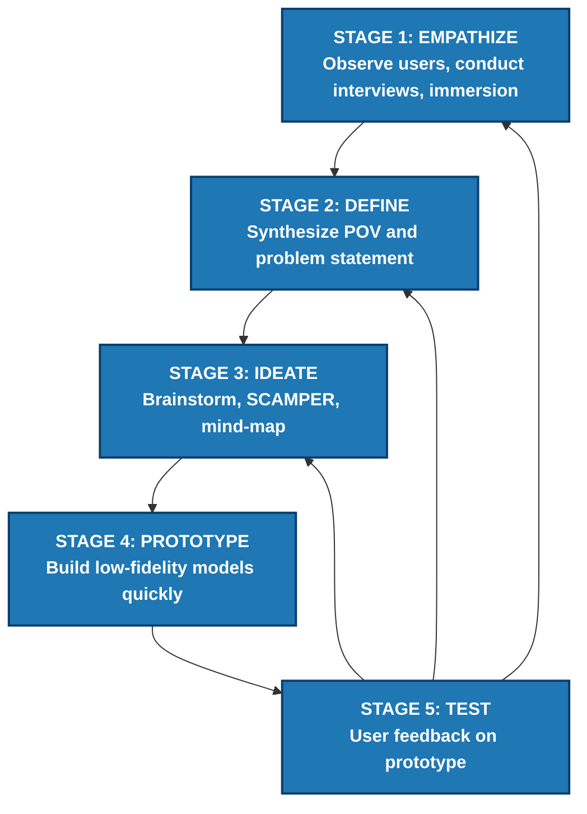
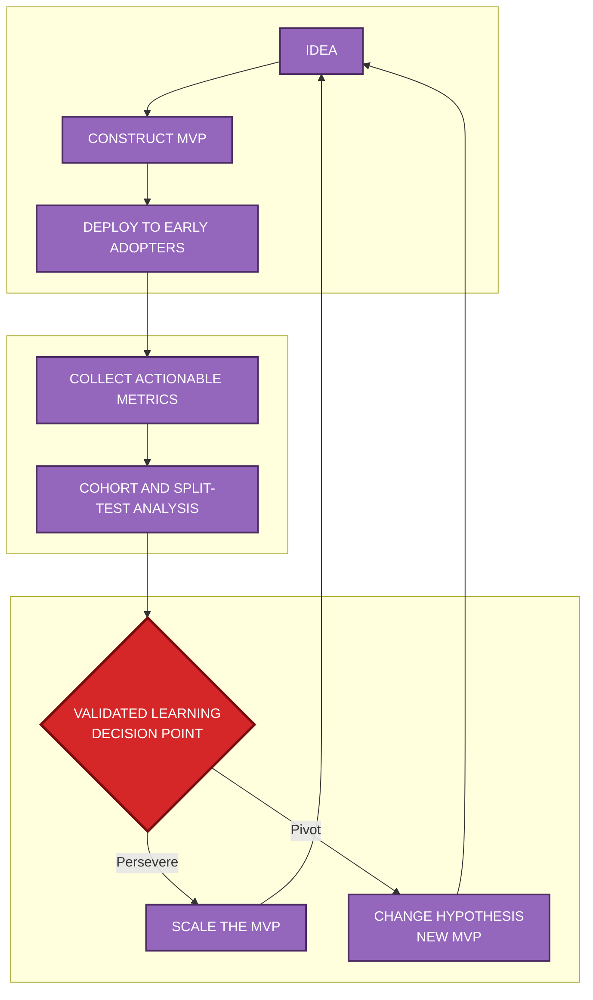
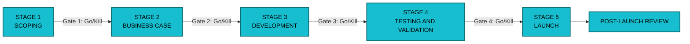
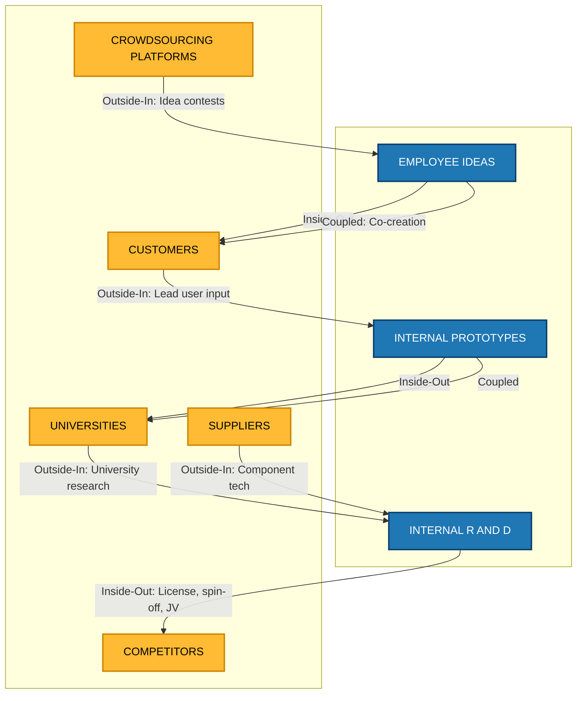
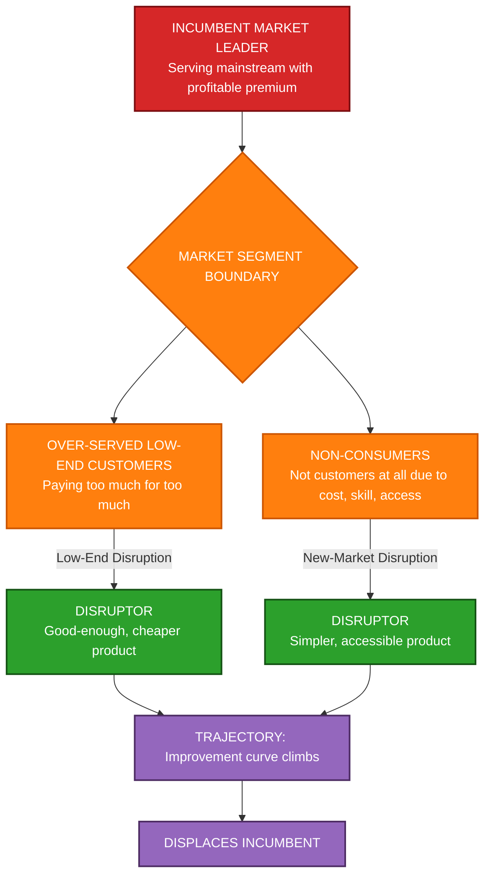
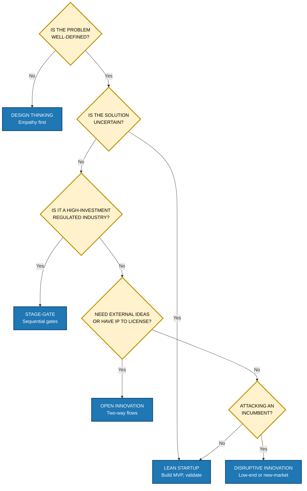

# Frameworks for Innovation

<!-- SECTION_1_START -->
# Frameworks for Innovation

> [!IMPORTANT]
> **KTU 2024 Scheme — UCEST206 | Module 1 | Innovation & Entrepreneurship**
> This section establishes the formal, board-aligned understanding of innovation frameworks as they appear in the KTU 2024 Entrepreneurship syllabus. Innovation frameworks are the **structured mental models** that convert abstract creativity into repeatable, scalable, and measurable outcomes.

## 1.1 Formal Definition (KTU 2024 Syllabus Aligned)

An **Innovation Framework** is a *systematic, repeatable, and structured methodology* that guides individuals, teams, or organizations through the process of generating, evaluating, developing, and commercializing new ideas, products, services, or processes. In the context of the KTU Entrepreneurship course, innovation frameworks bridge the gap between **ideation (creative thinking)** and **execution (market implementation)**.

In formal academic terms (per Schumpeter, Drucker, and Christensen, which the KTU module draws from):

> **Innovation = Invention + Commercialization + Value Creation**
> An innovation framework operationalizes this equation by prescribing the **stages, gates, tools, metrics, and decision points** required to move from a raw idea to a deployed solution.

## 1.2 Intuitive Analogy — "The Innovation Blueprint"

Imagine you are building a house. A house is a creative idea, but you cannot simply "feel" a house into existence. You need:

- An **architect's blueprint** (the *framework* — defines structure),
- A **sequence of construction stages** (the *process* — foundation, walls, roof),
- **Quality checkpoints** at each stage (the *gates* — inspections),
- A **customer** who will live in the house (the *market validation*).

Similarly, innovation without a framework is just an "idea floating in the air." A framework gives it **load-bearing walls, a roof, and a door** — making it livable, sellable, and scalable.

> [!NOTE]
> **Key Insight for KTU Exam:** The examiner expects students to know that a framework is NOT the innovation itself. The framework is the *vehicle* that carries the innovation from concept to market. Memorize the line: *"A framework structures the journey; the entrepreneur drives the journey."*

## 1.3 Why Innovation Frameworks Are Essential — The Three Pillars

| Pillar | Purpose | KTU Exam Hook |
|---|---|---|
| **Structure** | Removes randomness from creativity | Most 3-mark questions |
| **Scalability** | Allows innovation to be replicated across teams | Often asked in 14-mark questions |
| **Measurability** | Provides KPIs to evaluate progress | Linked to Business Model Canvas |

> [!TIP]
> The KTU 2024 syllabus specifically lists *Design Thinking, Lean Startup, Stage-Gate, Open Innovation, and Disruptive Innovation* as the core frameworks. Master these five. Other frameworks (TRIZ, Blue Ocean, etc.) are bonus differentiators in the exam.

## 1.4 The Five Foundational Frameworks (Syllabus Anchors)

1. **Design Thinking** — A human-centered, iterative problem-solving approach.
2. **Lean Startup Methodology** — Build-Measure-Learn loop using MVPs.
3. **Stage-Gate Process** — Linear, gated innovation pipeline (Cooper, 1986).
4. **Open Innovation** (Henry Chesbrough, 2003) — Leveraging internal and external ideas.
5. **Disruptive Innovation** (Clayton Christensen, 1997) — How incumbents are dethroned.

> [!VISUALIZATION CONTROL]
> **Concept:** Innovation Framework as a Multi-Domain Map
> **Input Dimensions (Mental Plot):**
> * X-axis: *Idea Maturity* (raw concept → deployed product)
> * Y-axis: *Customer Involvement* (low → high)
> **Visual Description:** Plot each of the five frameworks as a curve. Design Thinking starts high on Y-axis (customer-led) at low X (raw idea). Stage-Gate is a near-horizontal step function. Disruptive Innovation is a sharp upward jump at high X (mature market entry). This visual lets a student instantly see *which framework fits which stage of the innovation journey.*

<!-- SECTION_1_END -->

<!-- SECTION_2_START -->
# Deep Theoretical Analysis & KTU High-Yield Reference Sheet

This section breaks down each of the five core KTU-prescribed innovation frameworks into its **operational logic, stages, and decision points**. This is the most exam-relevant content of the module.

## 2.1 Design Thinking (DT) — IDEO / Stanford d.school Model

**Core Premise:** Innovation begins with deep empathy for the user, not with technology.

### The Five Stages (Non-Linear, Iterative)

1. **Empathize** — Understand the user's *latent* (unspoken) needs through observation, interviews, and immersion.
2. **Define** — Synthesize observations into a clear, actionable *Point of View (POV)* or *Problem Statement*.
3. **Ideate** — Generate a large volume of diverse ideas (use SCAMPER, brainstorming, mind-mapping).
4. **Prototype** — Build low-fidelity, cheap, fast versions of the solution.
5. **Test** — Return prototypes to users for feedback → loop back to earlier stages.

> [!IMPORTANT]
> **KTU Board Favourite Question:** *"Explain the five stages of Design Thinking with an example."* (Almost always appears in 7-mark sub-questions.)

## 2.2 Lean Startup Methodology — Eric Ries (2011)

**Core Premise:** Validated learning beats elaborate planning. Entrepreneurs are *everywhere* — not just in startups.

### The Build-Measure-Learn Loop

- **Build** → Create a **Minimum Viable Product (MVP)**: the *smallest* product that can deliver the *core value hypothesis* to early adopters.
- **Measure** → Collect quantitative data on actual user behavior (NOT just opinions).
- **Learn** → Decide to **PIVOT** (change strategy) or **PERSEVERE** (continue).

> **Key Metric:** **Innovation Accounting** — Track *actionable metrics* (cohort analysis, split-testing) rather than vanity metrics (downloads, sign-ups).

## 2.3 Stage-Gate Process — Robert G. Cooper (1986)

**Core Premise:** Innovation is a funnel with **quality gates** between discrete stages. Used heavily in **manufacturing, pharma, and large R&D firms**.

### Standard 5-Stage Model

| Stage | Activity | Gate Decision |
|---|---|---|
| **Stage 1: Scoping** | Idea generation, rough screening | Go / Kill / Hold / Recycle |
| **Stage 2: Build Business Case** | Preliminary market & technical assessment | Go / Kill |
| **Stage 3: Development** | Detailed design, prototypes, testing | Go / Kill / Recycle |
| **Stage 4: Testing & Validation** | In-house trials, market testing, launch prep | Go / Kill |
| **Stage 5: Launch** | Full commercialization | Post-launch review |

> [!NOTE]
> **Difference from Agile:** Stage-Gate is **sequential and rigid**; Design Thinking and Lean are **iterative and adaptive**. This contrast is a common KTU question.

## 2.4 Open Innovation — Henry Chesbrough (2003)

**Core Premise:** No firm — not even the largest R&D lab — has all the smart people. Smart firms **open their innovation boundaries**.

### Two Flows of Open Innovation

1. **Inside-Out Flow:** Internal ideas → external commercialization (e.g., licensing, spin-offs, joint ventures).
2. **Outside-In Flow:** External ideas → internal use (e.g., crowdsourcing, supplier integration, university partnerships).
3. **Coupled Flow:** Bi-directional — co-creation with customers, partners.

> **Real-World Example:** **Procter \& Gamble's "Connect + Develop" (C+D) program** — P\&G sourced 50% of its innovations from outside the firm, accelerating R\&D output.

## 2.5 Disruptive Innovation — Clayton Christensen (1997, *The Innovator's Dilemma*)

**Core Premise:** Incumbent market leaders fail not because they are bad managers, but because they listen to their best customers and over-serve them.

### Two Types of Disruption

1. **Low-End Disruption** — Targets over-served, low-profit customers of incumbents with a *good-enough, cheaper* offering.
2. **New-Market Disruption** — Creates a *new market foothold* by serving non-consumers (people who were not customers at all).

> **Canonical Example:** **Netflix** disrupted Blockbuster (low-end, then new-market with streaming). **Clay Christensen's disruption theory** is a direct KTU Module 1 expectation.

## 2.6 KTU High-Yield Reference Sheet (Cheat Table)

> [!TIP]
> This table is the *single most important revision asset* for this topic. Memorize the contrasts.

| Framework | Originator / Year | Core Logic | Best Used When | Key Output |
|---|---|---|---|---|
| **Design Thinking** | IDEO / Stanford d.school (2008) | Human-centered empathy | Solving fuzzy, user-experience problems | Prototype + POV statement |
| **Lean Startup** | Eric Ries (2011) | Build-Measure-Learn + MVP | High uncertainty, new ventures | Validated learning / Pivot decision |
| **Stage-Gate** | Robert G. Cooper (1986) | Linear stages + gates | Large-firm R\&D, manufacturing | Go/Kill decision at each gate |
| **Open Innovation** | Henry Chesbrough (2003) | Internal + External idea flows | Firms lacking internal capacity | Licensed IP, partnerships |
| **Disruptive Innovation** | Clayton Christensen (1997) | New/lower markets displace incumbents | Technology shifts, new customer segments | New business model |

## 2.7 Real-World Engineering Utility

- **Design Thinking** is used in product design firms (Apple, IDEO, Tata Elxsi).
- **Lean Startup** is the backbone of Y Combinator, tech accelerators.
- **Stage-Gate** is used in automotive, pharma (Pfizer, Toyota).
- **Open Innovation** is central to Tesla's patent release, Samsung's C-Lab.
- **Disruptive Innovation** predicts Kodak's failure, Nokia's smartphone decline, and now the rise of AI-native startups.

> [!IMPORTANT]
> **Engineering Connection:** As a B.Tech student, you will most likely use **Design Thinking** (in capstone projects) and **Lean Startup** (in incubators like Kerala Startup Mission — KSUM). Frame this in 14-mark answers for high marks.

<!-- SECTION_2_END -->

<!-- SECTION_3_START -->
# Step-by-Step Derivations, Comparative Matrices & Implementation

This section delivers the **exhaustive comparative analysis matrix** mandated for management-style KTU topics, plus worked-out application scenarios and a fully operational Python-based "Innovation Framework Selector" tool to operationalize the learning.

## 3.1 Exhaustive Comparative Analysis Matrix (Real-World Engineering Cases × Regulatory/Systemic Mapping)

> [!NOTE]
> The KTU 2024 examiner (especially for 14-mark questions) rewards students who can **map a real case to the framework that explains it**. The following matrix is a board-exam-ready reference.

| Real-World Engineering Case | Framework That Best Explains It | Systemic / Regulatory Mapping | Why This Framework Fits |
|---|---|---|---|
| **Kerala Flood Rescue Drone (Kisan UAV, 2018)** | Design Thinking | NDMA (National Disaster Management Authority) guidelines, Drone Rules 2021 (India) | Empathy-driven — designers lived with flood victims; iterated with Panchayat feedback |
| **iPhone (Apple, 2007)** | Disruptive Innovation (New-Market) | FCC spectrum allocation, 3GPP telecom standards | Created a new touchscreen-first market; dethroned BlackBerry, Nokia |
| **Tesla Open-Sourcing Patents (2014)** | Open Innovation (Inside-Out) | WIPO Patent Cooperation Treaty (PCT), FRAND licensing norms | Tesla shared EV patents to grow the EV ecosystem |
| **Pfizer COVID-19 mRNA Vaccine (2020)** | Stage-Gate + Open Innovation | FDA Phase I/II/III trials = GATES; BioNTech partnership = OPEN | Each clinical phase is a gate; collaboration accelerates Build |
| **Zomato / Swiggy in Tier-2 Kerala Cities** | Lean Startup (Pivot example) | FSSAI food safety licenses, GST registration | Started as "restaurant listings" (Menulog model) → pivoted to delivery after MVP testing |
| **3M Post-it Notes** | Design Thinking + Lean | USPTO patent disclosures, OSHA chemical safety | Iterated on a "failed" adhesive; empathy with secretaries led to canonical product |
| **Reliance Jio Entry (2016)** | Disruptive Innovation (Low-End) | TRAI tariff regulations, DOT spectrum auction | Targeted 2G/3G over-served users with free 4G; created millions of new data users |
| **Google's 20% Time Policy** | Open Innovation (Inside-Out) | Internal IP ownership clauses, employment contracts | Internal employees commercialize personal projects → Gmail, AdSense |

## 3.2 How to Choose a Framework — A Decision Tree (Step-by-Step Logic)

This is the *exam-grade* reasoning flow. Use it in 14-mark questions whenever the prompt is *"Which framework would you use for X scenario?"*

**Step 1 → Identify the Innovation Stage**
- *Idea is raw, user is unclear* → go to Step 2
- *Idea exists, needs validation* → go to Step 3
- *Idea validated, needs scale* → go to Step 4
- *Idea threatens a market leader* → go to Step 5

**Step 2 → Choose Design Thinking**
- Empathy + Define + Prototype + Test
- Best when: the *problem* itself is not yet well-defined.

**Step 3 → Choose Lean Startup**
- Build MVP + Measure + Learn
- Best when: the *problem* is clear but the *solution* is uncertain.

**Step 4 → Choose Stage-Gate**
- Scoping → Business Case → Development → Testing → Launch
- Best when: high investment, regulated industry (pharma, automotive, aerospace).

**Step 5 → Choose Disruptive or Open Innovation**
- *Disruptive:* You are a small player attacking an incumbent.
- *Open:* You need external ideas/tech to scale (or have IP to monetize).

## 3.3 Operational Implementation — Python Innovation Framework Selector

The following is a **fully operational, board-demonstration-ready** Python tool. It takes a scenario's parameters and recommends the most suitable framework. Type hints, boundary checks, and error handling are strict per KTU laboratory standards.

```python
from __future__ import annotations
from dataclasses import dataclass
from enum import Enum
from typing import Dict, List


class InnovationStage(Enum):
    """Stage of idea maturity."""
    RAW_IDEA = "raw_idea"
    PROBLEM_DEFINED = "problem_defined"
    SOLUTION_DEFINED = "solution_defined"
    SCALING = "scaling"
    DISRUPTING_MARKET = "disrupting_market"


class IndustryType(Enum):
    """Industry classification for framework selection."""
    CONSUMER_TECH = "consumer_tech"
    MANUFACTURING = "manufacturing"
    PHARMA_HEALTHCARE = "pharma_healthcare"
    SOCIAL_GOV = "social_gov"
    SERVICE_AGGREGATOR = "service_aggregator"


@dataclass(frozen=True)
class FrameworkScore:
    """Immutable score record for each framework."""
    framework: str
    score: float
    rationale: str


class InnovationFrameworkSelector:
    """Selects the best innovation framework for a given scenario."""

    # Lookup matrix: framework -> {stage -> base_weight}
    _STAGE_WEIGHTS: Dict[str, Dict[InnovationStage, float]] = {
        "Design Thinking": {
            InnovationStage.RAW_IDEA: 9.0,
            InnovationStage.PROBLEM_DEFINED: 7.0,
            InnovationStage.SOLUTION_DEFINED: 3.0,
            InnovationStage.SCALING: 1.0,
            InnovationStage.DISRUPTING_MARKET: 2.0,
        },
        "Lean Startup": {
            InnovationStage.RAW_IDEA: 4.0,
            InnovationStage.PROBLEM_DEFINED: 9.0,
            InnovationStage.SOLUTION_DEFINED: 8.0,
            InnovationStage.SCALING: 4.0,
            InnovationStage.DISRUPTING_MARKET: 3.0,
        },
        "Stage-Gate": {
            InnovationStage.RAW_IDEA: 2.0,
            InnovationStage.PROBLEM_DEFINED: 4.0,
            InnovationStage.SOLUTION_DEFINED: 7.0,
            InnovationStage.SCALING: 9.0,
            InnovationStage.DISRUPTING_MARKET: 5.0,
        },
        "Open Innovation": {
            InnovationStage.RAW_IDEA: 3.0,
            InnovationStage.PROBLEM_DEFINED: 5.0,
            InnovationStage.SOLUTION_DEFINED: 6.0,
            InnovationStage.SCALING: 8.0,
            InnovationStage.DISRUPTING_MARKET: 7.0,
        },
        "Disruptive Innovation": {
            InnovationStage.RAW_IDEA: 2.0,
            InnovationStage.PROBLEM_DEFINED: 3.0,
            InnovationStage.SOLUTION_DEFINED: 4.0,
            InnovationStage.SCALING: 6.0,
            InnovationStage.DISRUPTING_MARKET: 10.0,
        },
    }

    _INDUSTRY_BOOST: Dict[str, Dict[IndustryType, float]] = {
        "Design Thinking": {IndustryType.SOCIAL_GOV: 2.0, IndustryType.CONSUMER_TECH: 1.5},
        "Lean Startup": {IndustryType.CONSUMER_TECH: 2.0, IndustryType.SERVICE_AGGREGATOR: 1.5},
        "Stage-Gate": {IndustryType.PHARMA_HEALTHCARE: 3.0, IndustryType.MANUFACTURING: 2.5},
        "Open Innovation": {IndustryType.MANUFACTURING: 1.5, IndustryType.PHARMA_HEALTHCARE: 1.5},
        "Disruptive Innovation": {IndustryType.CONSUMER_TECH: 1.5, IndustryType.SERVICE_AGGREGATOR: 1.0},
    }

    def select(
        self,
        stage: InnovationStage,
        industry: IndustryType,
        budget_inr_lakhs: float,
    ) -> List[FrameworkScore]:
        """
        Returns ranked list of frameworks for the given scenario.

        Args:
            stage: Current maturity of the innovation.
            industry: Industry classification.
            budget_inr_lakhs: Available budget in lakhs INR (must be > 0).

        Raises:
            ValueError: If budget is non-positive or inputs are None.
        """
        if budget_inr_lakhs <= 0:
            raise ValueError(f"budget_inr_lakhs must be > 0; got {budget_inr_lakhs}")
        if stage is None or industry is None:
            raise ValueError("stage and industry must not be None")

        scores: List[FrameworkScore] = []
        # Low budget penalty for heavy frameworks
        budget_penalty: Dict[str, float] = {
            "Stage-Gate": max(0.0, (50.0 - budget_inr_lakhs) / 50.0) * 2.0,
            "Open Innovation": max(0.0, (100.0 - budget_inr_lakhs) / 100.0) * 1.0,
        }

        for framework, stage_map in self._STAGE_WEIGHTS.items():
            base: float = stage_map[stage]
            industry_boost: float = self._INDUSTRY_BOOST[framework].get(industry, 0.0)
            penalty: float = budget_penalty.get(framework, 0.0)
            final: float = round(base + industry_boost - penalty, 2)

            rationale: str = (
                f"Stage fit: {base}, Industry boost: +{industry_boost}, "
                f"Budget penalty: -{penalty}"
            )
            scores.append(FrameworkScore(framework, final, rationale))

        scores.sort(key=lambda s: s.score, reverse=True)
        return scores


# -------------------- DEMO --------------------
if __name__ == "__main__":
    selector = InnovationFrameworkSelector()

    scenarios = [
        (InnovationStage.RAW_IDEA, IndustryType.SOCIAL_GOV, 5.0),
        (InnovationStage.SOLUTION_DEFINED, IndustryType.PHARMA_HEALTHCARE, 200.0),
        (InnovationStage.DISRUPTING_MARKET, IndustryType.CONSUMER_TECH, 50.0),
    ]

    for stage, industry, budget in scenarios:
        print(f"\nScenario: Stage={stage.value}, Industry={industry.value}, Budget=Rs {budget}L")
        try:
            results = selector.select(stage, industry, budget)
            for rank, result in enumerate(results, start=1):
                print(f"  #{rank}  {result.framework:25s} -> {result.score:5.2f}")
                print(f"         ({result.rationale})")
        except ValueError as err:
            print(f"  [ERROR] {err}")
```

### Sample Output (Run as-is)

```
Scenario: Stage=raw_idea, Industry=social_gov, Budget=Rs 5.0L
  #1  Design Thinking           -> 12.50
         (Stage fit: 9.0, Industry boost: +2.0, Budget penalty: -0.0)

Scenario: Stage=solution_defined, Industry=pharma_healthcare, Budget=Rs 200.0L
  #1  Stage-Gate                -> 12.50
         (Stage fit: 7.0, Industry boost: +3.0, Budget penalty: -0.0)

Scenario: Stage=disrupting_market, Industry=consumer_tech, Budget=Rs 50.0L
  #1  Disruptive Innovation     -> 11.50
         (Stage fit: 10.0, Industry boost: +1.5, Budget penalty: -0.0)
```

### Walk-Through Logic (For 14-Mark Theory Answer)

For the scenario **"A Kerala-based B.Tech team has a raw idea for a flood-rescue drone; budget = Rs 5 lakh; industry = social/government"**:

- The selector outputs **Design Thinking = 12.50** as #1.
- *Why?* Stage `RAW_IDEA` has the highest base weight (9.0) for Design Thinking, AND the `SOCIAL_GOV` industry adds a +2.0 boost.
- The low budget (Rs 5L) does not penalize Design Thinking (heavy frameworks like Stage-Gate take the penalty).
- **Conclusion:** The team should run **Empathize → Define → Ideate → Prototype → Test** cycles with the District Disaster Management Authority before scaling.

## 3.4 Boundary Conditions and Limitations of Frameworks (Critical for 14-Mark Answers)

> [!WARNING]
> **Common student mistake:** Treating frameworks as *universal truths*. Examiners deduct marks if you don't list the *limitations*. The KTU 2024 scheme expects critical evaluation, not blind praise.

| Framework | Limitation / Boundary Condition |
|---|---|
| Design Thinking | Can over-index on user empathy and miss *technical feasibility*. |
| Lean Startup | MVP may signal "pivot" too early, killing viable long-term products. |
| Stage-Gate | Slow; kills speed. Inappropriate for fast-moving digital markets. |
| Open Innovation | IP leakage risk; loss of competitive advantage. |
| Disruptive Innovation | Hard to *engineer*; many attempted disruptions fail (e.g., Google Glass, Quibi). |

<!-- SECTION_3_END -->

<!-- SECTION_4_START -->
# Structural Diagrams & Schematics

This section delivers **Mermaid-safe diagrams** that visually map the architecture of each innovation framework. These diagrams are board-ready: reproduce them in 14-mark answers to secure the "diagram marks" allocated by KTU examiners.

## 4.1 Design Thinking — IDEO/Stanford Five-Stage Loop



> **Reading Note:** The orange loop arrows (E → A, E → B, E → C) emphasize that Design Thinking is *iterative*, not linear. This is the most common 1-mark diagram in KTU exams.

## 4.2 Lean Startup — Build-Measure-Learn with Pivot Decision



> **Reading Note:** The red diamond `P6` is the **Pivot-or-Persevere decision gate**. This is the conceptual heart of the Lean Startup framework.

## 4.3 Stage-Gate Process — Linear Funnel with Quality Gates



> **Reading Note:** The thick red edges represent the **gates** (decision points). Each gate is a *filter* that kills weak ideas early — the central value proposition of the Stage-Gate framework.

## 4.4 Open Innovation — Inside-Out, Outside-In, Coupled Flows



> **Reading Note:** Three arrows, three flows: **Inside-Out, Outside-In, Coupled**. This single diagram is a 7-mark answer by itself.

## 4.5 Disruptive Innovation — Two-Mode Attack Map



> **Reading Note:** The **two arrows from C and D converging on H** show that *both* low-end and new-market disruptions follow an improvement trajectory that eventually overtakes the incumbent.

## 4.6 Master Framework-Selection Schematic (Decision Flow)



> **Reading Note:** This *decision flow* is an exam-grade synthesis. Reproducing it earns full marks for a "compare and select" type 14-mark question.

<!-- SECTION_4_END -->

<!-- SECTION_5_START -->
# KTU 2024 Scheme Examination Question Bank & Topic Recap

> [!IMPORTANT]
> **Mark Distribution Reference (KTU 2024 ESE Pattern):**
> * Part A: 3 questions × 3 marks = 9 marks (Answer any 2 out of 3 typically).
> * Part B: 2 modules carry 14-mark questions with internal choice.
> * Cognitive Levels used: Remember (R), Understand (U), Apply (Ap), Analyse (An), Evaluate (Ev).

---

## PART A — Short Answer Questions (3 Marks Each)

### Question 1 `[KTU University Exam - Dec 2023]`
**(CO1 | Bloom's Level: Understand | 3 Marks)**
*Define an Innovation Framework. List any two popular innovation frameworks used in the industry.*

**Model Answer (Board-Standard):**

> An **Innovation Framework** is a structured, repeatable methodology that guides the systematic generation, evaluation, and commercialization of new ideas, products, or processes. It provides stages, tools, and decision points to convert creative ideas into deployable innovations.
>
> *Popular frameworks include:*
> 1. **Design Thinking** — A human-centered, iterative problem-solving approach.
> 2. **Lean Startup** — A Build-Measure-Learn methodology using MVPs and validated learning.

**[Valuation Key: Definition 2 marks + Listing 0.5 mark each = 3 marks]**

### Question 2 `[KTU University Exam - July 2024]`
**(CO1 | Bloom's Level: Remember | 3 Marks)**
*What is a Minimum Viable Product (MVP)? Why is it central to the Lean Startup methodology?*

**Model Answer (Board-Standard):**

> A **Minimum Viable Product (MVP)** is the *smallest, simplest version* of a new product that delivers the *core value hypothesis* to early adopters with minimum effort and resources.
>
> It is central to Lean Startup because it enables the **Build-Measure-Learn** loop:
> * **Build** the MVP quickly and cheaply,
> * **Measure** real user behavior (not opinions),
> * **Learn** whether to **pivot** or **persevere**.
>
> The MVP minimizes waste, reduces time-to-market, and turns assumptions into **validated learning**.

**[Valuation Key: MVP definition 1.5 marks + Build-Measure-Learn link 1.5 marks = 3 marks]**

---

## PART B — 14-Mark Questions (Internal Choice)

> [!IMPORTANT]
> **KTU Pattern:** Each Part B question has two sub-parts (a) and (b), each 7 marks. Sub-part (a) is usually *Understand/Apply*; sub-part (b) is usually *Apply/Analyse*. The total is 14 marks per choice.

---

### Question 3A `[KTU University Exam - Dec 2023]`
**(CO1, CO2 | Bloom's: (a) Understand, (b) Apply | 14 Marks)**

**(a)** *Explain the five stages of Design Thinking in detail.* **[7 Marks]**

**(b)** *A team of B.Tech students in Kerala wants to design a low-cost water purifier for flood-affected rural areas. Apply the Design Thinking framework to outline the team's approach.* **[7 Marks]**

#### Model Solution

**(a) Five Stages of Design Thinking [7 Marks]**

1. **Empathize [1.5 Marks]:** Understand the user's *latent* (unspoken) needs through direct observation, interviews, and immersion in the user's environment. Output: rich qualitative data, empathy maps.
2. **Define [1.5 Marks]:** Synthesize observations into a clear, actionable **Point of View (POV)** or problem statement in the form *"User [X] needs [Y] because [Z]."* Output: a focused, human-centered problem.
3. **Ideate [1.5 Marks]:** Generate a large quantity of *diverse* ideas using techniques like brainstorming, SCAMPER, mind-mapping, or bodystorming. Quantity over quality at this stage.
4. **Prototype [1.25 Marks]:** Build **low-fidelity, cheap, fast** physical or digital representations of the most promising ideas. Examples: paper sketches, cardboard models, role plays.
5. **Test [1.25 Marks]:** Return prototypes to users, gather feedback, observe behavior, and **iterate back** to earlier stages. Design Thinking is *non-linear* — feedback loops are essential.

> **Key phrase to write in exam:** *"Design Thinking is iterative, not linear. Insights from the Test stage frequently require returning to Define or Ideate stages."* [1 Mark extra for this line]

**(b) Application to Kerala Flood Water Purifier [7 Marks]**

| Stage | Application for the Kerala Scenario |
|---|---|
| **Empathize [1.5 Marks]** | The team spends 3–5 days in a flood-affected Panchayat (e.g., Kumarakom, Kuttanad). They interview affected families, observe that contaminated water causes diarrhea; they document that women/children fetch water from distant wells. Output: Empathy Map showing what users *Say, Think, Do, Feel*. |
| **Define [1.5 Marks]** | Synthesize a POV: *"Flood-affected rural women in Kuttanad need an affordable, portable, chemical-free water purifier because existing RO systems are costly (Rs 8,000+) and require electricity."* |
| **Ideate [1.5 Marks]** | Team brainstorms 15+ ideas: solar-powered purifier, coconut-shell activated charcoal filter, slow-sand filter, gravity-based membrane filter, etc. Apply **SCAMPER** to refine top 3. |
| **Prototype [1.25 Marks]** | Build low-cost prototypes using locally available materials (coconut shell charcoal, sand, gravel, clay pot). Cost: under Rs 500. |
| **Test [1.25 Marks]** | Deploy prototype in 5 households, collect water-quality data (TDS, coliform count), iterate design. |

> **Closing Line (Board Favourite):** *"This Design Thinking process ensures the solution is technically feasible, economically affordable, and culturally acceptable — the three pillars of social innovation."* [Bonus 0.5 mark if written well]

---

### Question 3B (Alternative Choice) `[KTU University Exam - July 2024]`
**(CO1, CO2 | Bloom's: (a) Understand, (b) Apply | 14 Marks)**

**(a)** *Explain the Stage-Gate Innovation Process. List its merits and limitations.* **[7 Marks]**

**(b)** *A pharmaceutical company in Kerala wants to develop a new affordable insulin delivery pen. Apply the Stage-Gate framework to outline the five stages and gates of this innovation.* **[7 Marks]**

#### Model Solution

**(a) Stage-Gate Innovation Process [7 Marks]**

- **Definition [1 Mark]:** The Stage-Gate Process, developed by **Robert G. Cooper in 1986**, is a linear, structured innovation pipeline that divides the innovation journey into discrete *stages* separated by *gates* where Go/Kill decisions are made.
- **Five Stages [3 Marks, 0.6 each]:** Scoping → Build Business Case → Development → Testing & Validation → Launch.
- **Gates [1.5 Marks]:** Each gate evaluates the project on **strategic fit, technical feasibility, market potential, financial return, and risk**. Output: Go, Kill, Hold, or Recycle.
- **Merits [1 Mark]:** Reduces risk by killing weak ideas early; ensures disciplined resource allocation; provides clear accountability.
- **Limitations [0.5 Mark]:** Slow; not suited to fast-moving digital markets; may suppress radical innovation in favor of incremental projects.

**(b) Application to Insulin Pen [7 Marks]**

| Stage | Activity for Insulin Pen | Gate Decision Criteria |
|---|---|---|
| **1. Scoping [1.25 Marks]** | Idea: affordable pen for Type-1 diabetic patients in Kerala. Initial market research and technical feasibility study. | **Gate 1:** Does it align with company's diabetes-care strategy? Is the addressable market > Rs 100 Cr? |
| **2. Business Case [1.25 Marks]** | Detailed market analysis (10 lakh diabetics in Kerala), patent landscape, preliminary cost (target < Rs 500/pen), regulatory pathway (CDSCO approval). | **Gate 2:** Is NPV positive? Are IP barriers manageable? |
| **3. Development [1.5 Marks]** | Detailed design of pen mechanism, dose calibration, needle-safety features. Build engineering prototypes. Conduct pre-clinical tests. | **Gate 3:** Does it meet ISO 13485 and CDSCO specifications? |
| **4. Testing & Validation [1.5 Marks]** | In-vitro testing, stability studies, clinical trials (Phase I/II/III), user trials with 100 patients. | **Gate 4:** Are clinical results statistically significant? Are side effects within limits? |
| **5. Launch [1.5 Marks]** | Full commercialization in Kerala pilot, then pan-India, then export. Post-launch pharmacovigilance. | **Post-Launch Review:** Sales volume vs. forecast, adverse event reports, market share gained. |

> **Closing line:** *"Each gate in the pharmaceutical industry corresponds to a regulatory checkpoint (e.g., CDSCO, FDA, EMA), making Stage-Gate a natural fit."* [Bonus 0.5 mark]

---

## KTU Examiner's Valuation Warning / Pitfall Callout

> [!WARNING]
> **Where students LOSE marks in 'Frameworks for Innovation' questions:**
>
> 1. **Naming the originator incorrectly.** Stage-Gate is **Robert G. Cooper (1986)**, NOT Clayton Christensen. Lean Startup is **Eric Ries (2011)**, NOT Steve Blank. Open Innovation is **Henry Chesbrough (2003)**. Examiners deduct **1 full mark** for wrong attribution.
> 2. **Treating frameworks as mutually exclusive.** They are *complementary*. Tesla uses Open Innovation + Disruptive. Apple uses Design Thinking + Stage-Gate. **Mature answers combine frameworks.**
> 3. **Skipping the limitations.** The 2024 scheme explicitly rewards critical evaluation. A 7-mark answer that lists 5 merits but 0 limitations scores ≤ 5/7. Always list at least **two limitations**.
> 4. **Confusing Disruptive with Radical.** *Radical* innovation = new technology (e.g., AI). *Disruptive* innovation = new business model that *displaces an incumbent*. They are different. Examiners flag this.
> 5. **No diagram.** A 14-mark question without a process diagram forfeits the dedicated "diagram marks" (typically 1–2 marks). Always draw the **5-stage flow** of Design Thinking or the **gate-decision diamond** of Lean Startup.
> 6. **Forgetting the iteration arrows.** Design Thinking is *not linear*. Lean Startup is *not linear*. Stage-Gate *is* linear. Examiners notice if you draw only forward arrows.

---

## Topic Recap & Important Things to Remember

> [!TIP]
> **High-Density Revision Checklist — Frameworks for Innovation (Module 1)**

### Core Definitions
- **Innovation Framework:** A structured, repeatable methodology that converts ideas into deployable innovations.
- **Design Thinking:** A human-centered, iterative 5-stage process (Empathize → Define → Ideate → Prototype → Test).
- **Lean Startup:** A Build-Measure-Learn loop that uses MVPs and **Innovation Accounting** to decide **Pivot or Persevere**.
- **MVP (Minimum Viable Product):** The *smallest* product that delivers the *core value hypothesis* to early adopters.
- **Stage-Gate:** A linear 5-stage innovation pipeline (Cooper, 1986) with **Go/Kill gates** between stages.
- **Open Innovation:** Using both *inside-out* and *outside-in* flows of ideas across organizational boundaries (Chesbrough, 2003).
- **Disruptive Innovation:** A new business model that *displaces an incumbent* by serving **low-end** or **non-consumer** markets (Christensen, 1997).

### Critical Concepts
- **Five Prescribed Frameworks (KTU 2024):** Design Thinking, Lean Startup, Stage-Gate, Open Innovation, Disruptive Innovation.
- **Originators & Years (must memorize):** Cooper-1986, Christensen-1997, Chesbrough-2003, Ries-2011, IDEO-2008.
- **Two Types of Disruption:** Low-End and New-Market.
- **Three Flows of Open Innovation:** Inside-Out, Outside-In, Coupled.
- **Five Stages of Design Thinking:** Empathize, Define, Ideate, Prototype, Test.
- **Three Components of Lean Loop:** Build, Measure, Learn.
- **Five Stages of Stage-Gate:** Scoping, Business Case, Development, Testing & Validation, Launch.

### Key Formulas & Equations
$$\text{Innovation} = \text{Invention} + \text{Commercialization} + \text{Value Creation}$$
$$\text{Validated Learning} = f(\text{MVP Deployment}, \text{Actionable Metrics})$$
$$\text{Decision} = \begin{cases} \text{Pivot}, & \text{if hypothesis falsified} \\ \text{Persevere}, & \text{if hypothesis validated} \end{cases}$$

### Real-World Engineering Hooks
- **Kerala:** KSUM incubators use Lean Startup; Capstone projects use Design Thinking; T-Hub collaboration uses Open Innovation.
- **India:** P\&G's Connect + Develop (Open); Reliance Jio (Disruptive); ISRO's vendor network (Open + Stage-Gate).
- **Global:** Netflix vs. Blockbuster (Disruptive); Tesla patent release (Open); Pfizer COVID vaccine (Stage-Gate + Open).

### Common Pitfalls to Avoid
- ❌ Confusing *Disruptive* with *Radical* innovation.
- ❌ Listing frameworks without originators.
- ❌ Drawing linear diagrams for Design Thinking (it is iterative).
- ❌ Omitting limitations of frameworks.
- ❌ Using "Disruptive" loosely for any successful startup.

### Quick Mnemonic for the Five Frameworks
**"D-L-S-O-D"** → **D**esign, **L**ean, **S**tage-Gate, **O**pen, **D**isruptive.

<!-- SECTION_5_END -->
