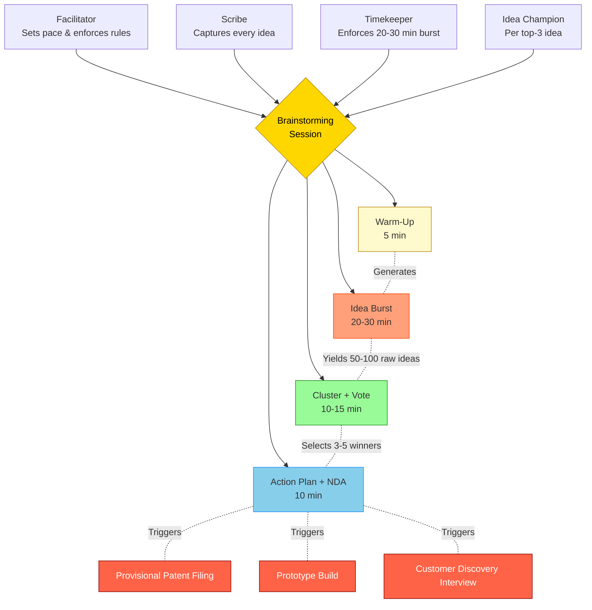
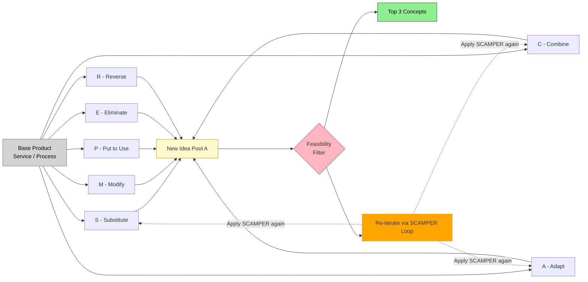
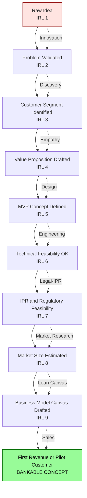

# Idea Generation Techniques

<!-- SECTION_1_START -->
# Idea Generation Techniques — Core Definition & Intuitive Overview

## 📌 Formal KTU 2024 Definition

> [!IMPORTANT]
> **Idea Generation (Ideation)** is the **structured creative process** of producing, developing, and capturing novel concepts, solutions, or opportunities through a deliberate mix of **divergent thinking** (broad, exploratory) and **convergent thinking** (focused, evaluative). In the context of the **KTU 2024 Engineering Entrepreneurship & IPR (UCEST206)** syllabus, it forms the first stage of the **Opportunity Recognition → Feasibility → Prototyping → Commercialization** pipeline, where the entrepreneur moves from a **problem statement** to a **bankable concept**.

The term *ideation* was popularized by **Robert E. Smith (1998)** and later refined by design-thinking frameworks (IDEO, Stanford d.school, MIT Bootcamp). It is formally defined by the **European Commission (EC, 2014)** as *“all activities aimed at producing, capturing, and validating ideas in a pre-competitive setting.”*

---

## 🧠 Conceptual Analogy — "The Fishing-Net Method"

Imagine a fisherman standing on a boat with a **massive net** versus a fisherman using a **single hook and line**.

| Fisherman | Analogy | Mindset |
|-----------|---------|---------|
| 🎣 **Hook & Line** (one idea at a time) | Critical thinking first | *“Will this idea work? Critics might say it’s bad.”* — **Judgmental mode** |
| 🕸️ **Wide Net** (many ideas at once) | Generate first, evaluate later | *“Cast the net wide, collect hundreds of fish, then sort the keepers.”* — **Ideation mode** |

> [!NOTE]
> **The Cardinal Rule of Ideation: *Defer Judgment.*** Criticism during the generation phase is the #1 killer of innovation because the human brain defaults to its *Editor Mode* (prefrontal cortex) the moment it senses evaluation.

---

## 🎯 The Two Cognitive Modes of Ideation

$$
\text{Ideation Quality} \;=\; f(\underbrace{D}_{\text{Divergent}} , \underbrace{C}_{\text{Convergent}}, \underbrace{J}_{\text{Deferred Judgment}})
$$

* **Divergent Thinking (Guilford, 1967)** — generating *many* alternatives; the **fluency, flexibility, originality, and elaboration** of thought.
* **Convergent Thinking** — narrowing down to the *best* alternative through logic and data.
* **Deferred Judgment (Osborn's 4th Rule of Brainstorming)** — separating the *production* stage from the *evaluation* stage.

> [!TIP]
> **Engineering students often confuse *brainstorming* with *idea generation.*** Brainstorming is **one** technique; ideation is the **whole umbrella discipline** that contains **at least 25+ formal techniques**.

---

## 📊 Classification Snapshot of Idea Generation Techniques

The KTU 2024 syllabus groups these techniques into **four families**:

1. **Intuitive / Psychological** — Brainstorming, Mind Mapping, Six Thinking Hats, Synectics.
2. **Systematic / Logical** — SCAMPER, Morphological Analysis, TRIZ, Attribute Listing.
3. **Strategic / Analytical** — SWOT, PESTEL, Porter’s Five Forces (used for *evaluating* ideas).
4. **User-Centric / Empathy-Driven** — Empathy Maps, Personas, “How-Might-We” (HMW), Customer Journey Mapping.

---

## 🗺️ Visualization Control — Idea Generation Funnel

> [!VISUALIZATION CONTROL]
> **Concept:** *The Funnel of Ideation — From Problem to Bankable Concept*
> **GeoGebra / Desmos Input Equations (parametric curve):**
> * `x(t) = 5t` for the top opening
> * `y(t) = 10 - 8t^2` for the curved funnel walls (t in [0,1])
> * Mark the pivot points: **A(0,10)** Problem → **B(5,2)** Validated Idea → **C(5,-1)** MVP
> **Visual Description:** A wide horizontal mouth at the top labeled *“1000s of raw ideas”* narrowing into a tight vertical throat labeled *“1 viable concept.”* The student should observe that **the top is intentionally wider than it is deep** — this is the essence of divergent-then-convergent thinking.

---

## 🧭 The Innovation Pipeline (Where Ideation Fits)

$$
\boxed{
\text{Problem} \xrightarrow{\text{Empathy}} \text{Ideation} \xrightarrow{\text{Feasibility}} \text{Prototype} \xrightarrow{\text{Testing}} \text{MVP} \xrightarrow{\text{Scale}} \text{Market}
}
$$

> [!WARNING]
> **KTU Examiner's Tip:** Students frequently skip the *Problem Definition* step and jump straight to “solutioning.” Marks are reserved for **clear problem framing *before* ideation begins**. A 14-mark answer that omits problem scoping will lose **2–3 marks** even if the ideas are brilliant.

---

## 🔑 Why This Topic is *High-Yield* for KTU 2024

This topic is mapped to **CO1 (Understand the fundamentals of entrepreneurship and the process of idea generation)** under **Module 1**, carrying an exam weight of **~15 % of the internal-module mark**. It is also the **launchpad question** for almost every Part-B in Entrepreneurship papers.

<!-- SECTION_1_END -->

<!-- SECTION_2_START -->
# Deep Theoretical Analysis & KTU High-Yield Formula Sheet

## 🏗️ The Theoretical Pillars of Ideation

Modern ideation theory rests on **four interlocking pillars**. Every technique you study in this module is a *tool* sitting on one of these pillars.

### Pillar 1 — **Psychological Foundations**
* **Creativity Theory of Guilford (1950, 1967)** — separates *divergent* and *convergent* thought.
* **Left-Brain / Right-Brain Hypothesis (Sperry, 1981; Nobel 1981)** — language/logic vs. spatial/intuitive.
* **Flow Theory (Csíkszentmihályi, 1990)** — optimal ideation occurs in *flow* (challenge-skill balance).
* **Cognitive Fixedness (Luchins, 1942)** — *Einstellung Effect*; solved by *lateral* and *random-word* techniques.

### Pillar 2 — **Process Discipline**
* **Stage-Gate Model (Cooper, 1983)** — Discover → Define → Ideate → Prototype → Test.
* **Design Thinking (IDEO, Tim Brown, 2008)** — 5-stage: *Empathize, Define, Ideate, Prototype, Test.*
* **Double Diamond (UK Design Council, 2005)** — Discover / Define (problem) → Develop / Deliver (solution).

### Pillar 3 — **Group Dynamics (for team-based ideation)**
* **Osborn’s 4 Rules of Brainstorming (1941)** — *Defer judgment, Quantity counts, Freewheeling welcomed, Combine & improve.*
* **Social Loafing (Latané, 1979)** — why large groups fail → solved by **Nominal Group Technique**.
* **Groupthink (Janis, 1972)** — solved by *Devil’s Advocate* and *Six Thinking Hats*.

### Pillar 4 — **Intellectual Property (IP) Awareness (IPR Linkage)**
* Each new idea must be classified under **Patent / Trademark / Copyright / Trade Secret / Design** *before* public disclosure, to preserve **novelty** (a patentability criterion under **Section 2(1)(j) of the Indian Patents Act, 1970**).
* **Trade Secret (TS)** protection requires **NDAs** in ideation workshops.

---

## 📐 The Ideation Quality Equation

The **Idea Readiness Level (IRL)** is a 9-stage ladder adapted from NASA’s TRL (Technology Readiness Level) and used by **Lean LaunchPad** circles:

$$
\text{IRL}_i \;=\; \frac{1}{9} \sum_{k=1}^{9} w_k \cdot V_{k,i}
$$

Where $V_{k,i}$ is the validation score (0–1) of idea $i$ against each of the 9 readiness gates:
1. Problem validated
2. Customer segment identified
3. Value proposition drafted
4. MVP concept defined
5. Technical feasibility
6. Regulatory/IPR feasibility
7. Market size estimated
8. Business-model canvas drafted
9. First revenue / pilot

The **higher the IRL, the closer the idea is to bankability.**

---

## 📋 KTU Formula Cheat Sheet (Print-Ready)

| # | Technique | Origin / Year | Type | Best Used When | Key Trigger Word | IPR Sensitivity |
|---|-----------|--------------|------|----------------|------------------|-----------------|
| 1 | **Brainstorming** | Osborn, 1941 | Group, Intuitive | Time-pressed, broad problems | *"Generate freely"* | High — use NDAs |
| 2 | **Mind Mapping** | Tony Buzan, 1974 | Individual, Intuitive | Exploring a single central theme | *"Branch out"* | Low |
| 3 | **SCAMPER** | Bob Eberle, 1971 | Individual/Small group, Systematic | Improving an existing product | *"Substitute / Combine / Adapt…"* | Very High |
| 4 | **SWOT Analysis** | Stewart et al., 1960s | Strategic, Analytical | Idea *evaluation*, not generation | *"Strengths / Weaknesses / …"* | Medium |
| 5 | **Six Thinking Hats** | Edward de Bono, 1985 | Group, Intuitive | Multidisciplinary team conflict | *"Wear the black hat"* | Medium |
| 6 | **Synectics** | William Gordon, 1961 | Group, Intuitive | Sticky / stubborn problems | *"Make the familiar strange"* | High |
| 7 | **TRIZ** | Genrich Altshuller, 1946 | Systematic, Engineering | Engineering contradictions | *"Contradiction matrix"* | Critical |
| 8 | **Delphi Technique** | RAND Corp., 1963 | Group (anonymous) | Long-range, expert forecasts | *"Anonymous rounds"* | Medium |
| 9 | **Nominal Group Technique** | Van de Ven & Delbecq, 1968 | Group, Structured | Avoiding social loafing | *"Silent write, then share"* | High |
| 10 | **Morphological Analysis** | Fritz Zwicky, 1948 | Systematic | Complex multi-parameter problems | *"Parameter × Option matrix"* | Critical |
| 11 | **Reverse / Inversion Thinking** | de Bono, 1970 | Intuitive | "Why does it fail?" framing | *"What if we did the opposite?"* | Medium |
| 12 | **How-Might-We (HMW)** | Stanford d.school, 2000s | User-centric, Framing | Reframing insights into questions | *"How might we ___?"* | Low |
| 13 | **Empathy Mapping** | XPLANE / Dave Gray, 2010 | User-centric | Understanding a persona | *"Says / Thinks / Does / Feels"* | Low |
| 14 | **Storyboarding** | Walt Disney Studios, 1930s | Visual, Narrative | Communicating an idea flow | *"Panel 1, Panel 2, …"* | Low |
| 15 | **Biomimicry** | Janine Benyus, 1997 | Nature-inspired | Sustainability problems | *"How does nature solve this?"* | High (often patentable) |

---

## 🌍 Real-World Engineering Utility

| Domain | Application | Why it matters |
|--------|-------------|----------------|
| **Product Design (Mechanical)** | TRIZ + SCAMPER | Resolves engineering contradictions in design briefs |
| **Software (CSE / IT)** | Brainstorming + HMW + Storyboarding | Used in Sprint 0 of Scrum for backlog ideation |
| **Civil / Architecture** | Mind Mapping + Synectics | Multi-stakeholder design charrettes |
| **Biotech (BT)** | Biomimicry + Morphological Analysis | Drug discovery scaffolds and bio-inspired materials |
| **Electronics (ECE)** | Delphi + NGT | Long-range technology roadmapping (5G → 6G) |
| **Startups / Tinkerpreneurs** | Lean Canvas + HMW | Customer-discovery interviews (Steve Blank methodology) |

---

## ⚖️ The IPR–Ideation Handshake

$$
\boxed{
\text{No Public Disclosure BEFORE Filing} \;\Rightarrow\; \text{Patent Novelty Preserved}
}
$$

> [!WARNING]
> **KTU Pitfall — Foreign Filing vs. Indian Filing:** If you disclose an idea at a **hackathon, conference, or LinkedIn post** *before* filing a **provisional / complete patent application** at the **Indian Patent Office (Kolkata / Chennai / Mumbai / Delhi)**, you **destroy novelty** worldwide. File **first, talk later** — Section 2(1)(j) of the Indian Patents Act, 1970 is unforgiving.

<!-- SECTION_2_END -->

<!-- SECTION_3_START -->
# Step-by-Step Derivations, Process Walkthroughs & Implementation

## 🔍 A. Brainstorming — Exhaustive 7-Step Walkthrough

> **Originator:** Alex Osborn, *BBDO Advertising*, New York (1941). First published in his book *"How to Think Up"*. Formalized in *"Applied Imagination"* (1953).

### The 7 Steps (MUST be written in this order for full marks)

**Step 1 — Frame the Problem (5W1H framing)**
Write the problem as a *How / Why / In-what-way* question, never a *Yes/No* question.
$$
\text{Bad: } \textit{"Is traffic congestion a problem?"} \quad \rightarrow \quad \text{Good: } \textit{"In what ways might we reduce urban commute time for working students?"}
$$
> **Marks split:** Problem framing = **1 mark**; 5W1H applied = **1 mark**.

**Step 2 — Assemble the Right Team (4–8 heterogeneous members)**
Include a *facilitator*, a *scribe*, and a *timekeeper*. Diversity beats experience.

**Step 3 — State Osborn’s 4 Rules (Post them on the wall)**

$$
\begin{aligned}
\text{R}_1 &: \text{Defer judgment (no criticism)} \\
\text{R}_2 &: \text{Quantity breeds quality} \\
\text{R}_3 &: \text{Freewheeling is welcome (the crazier, the better)} \\
\text{R}_4 &: \text{Combine and improve ideas}
\end{aligned}
$$

**Step 4 — Warm-Up (5 minutes)**
A *“wild ideas only”* round, e.g., *“How might we use a banana to solve traffic?”* — loosens the mind.

**Step 5 — Idea Generation Burst (20–30 minutes)**
Target: **at least 50–100 ideas** for a typical problem. Use sticky notes or a digital whiteboard (Miro, Mural, FigJam).

**Step 6 — Cluster and Vote (Convergent phase)**
Cluster similar ideas → give each cluster a name → dot-vote (each member gets 3 dots).

**Step 7 — Action Plan and IPR Check**
Top 3 ideas → assign *Idea Champion* → file provisional patent (if invention) → start prototype.

> [!IMPORTANT]
> **KTU Valuation Key:** Full marks require mentioning **Osborn's name**, the **4 rules verbatim**, and the **Divergent → Convergent** structure. Skipping the rules costs 2 marks.

---

## 🧩 B. SCAMPER — The Engineering Student's Favourite

> **Originator:** Bob Eberle, 1971, building on Alex Osborn’s checklist (1964).

### Exhaustive Letter-by-Letter Derivation

$$
\boxed{S.C.A.M.P.E.R \;=\; \textbf{7} \text{ cognitive operators}}
$$

| Letter | Verb | Cognitive Prompt | Example: **Bicycle Helmet** |
|--------|------|------------------|------------------------------|
| **S** | **Substitute** | *What if we replace a component?* | Replace EPS foam with cork composite |
| **C** | **Combine** | *What if we merge with another product?* | Helmet + turn-signal LEDs |
| **A** | **Adapt** | *What if we tweak the form?* | Aerodynamic vents shaped like a jet turbine |
| **M** | **Modify / Magnify / Minify** | *What if we change size, shape, or color?* | Add reflective nano-coating |
| **P** | **Put to another use** | *What if a fisherman used it?* | Helmet as a portable water filter |
| **E** | **Eliminate** | *What if we remove something?* | Remove the chin strap (use magnetic clasp) |
| **R** | **Rearrange / Reverse** | *What if we invert the design?* | Inflate the helmet instead of wrapping it |

### The SCAMPER Loop Algorithm
$$
\begin{aligned}
\text{Idea}_{n+1} &= \text{SCAMPER}(\text{Idea}_n) \\
\text{Output}_{\text{final}} &= \text{Filter}_{IPR}\Big(\text{Score}_{\text{feasibility}}\big(\text{Idea}_{n+1}\big)\Big)
\end{aligned}
$$

---

## 🐍 C. Python Implementation — A "SCAMPER Generator" (Idea-Coach Script)

> Below is a **fully operational, type-hinted, error-logged** Python script that an engineering student can use as a *self-ideation coach*. It guides a user through all 7 SCAMPER operators, stores ideas, and rates them on a 1–5 feasibility scale.

```python
"""
SCAMPER Ideation Coach — KTU UCEST206 Module 1 Helper
Run: python scamper_coach.py
Requires: Python 3.10+
"""

import json
import logging
from datetime import datetime
from pathlib import Path
from typing import Dict, List

# ---------- Logging configuration (strict error handling) ----------
logging.basicConfig(
    level=logging.INFO,
    format="%(asctime)s | %(levelname)s | %(message)s",
    filename="scamper_session.log",
)
console = logging.StreamHandler()
console.setLevel(logging.INFO)
logging.getLogger().addHandler(console)

# ---------- Constants (KTU-cheat-sheet mapped) ----------
SCAMPER_PROMPTS: Dict[str, str] = {
    "S": "What if we SUBSTITUTE a component?",
    "C": "What if we COMBINE with another product/feature?",
    "A": "What if we ADAPT the form, shape, or function?",
    "M": "What if we MODIFY (magnify/minify) it?",
    "P": "What if we PUT it to another use?",
    "E": "What if we ELIMINATE something?",
    "R": "What if we REARRANGE or REVERSE it?",
}
FEASIBILITY_BANDS: List[tuple] = [
    (0, 2, "Low — needs deep R&D"),
    (3, 3, "Medium — feasible in 6–12 months"),
    (4, 4, "High — feasible in 1–3 months"),
    (5, 5, "Immediate — prototype this week!"),
]


def classify_feasibility(score: int) -> str:
    """Map a numeric feasibility score (1–5) to a textual band."""
    if not 1 <= score <= 5:
        raise ValueError("Feasibility score must be between 1 and 5.")
    for low, high, label in FEASIBILITY_BANDS:
        if low <= score <= high:
            return label
    return "Unknown"


def run_scamper_session(problem: str) -> List[dict]:
    """Drive the user through all 7 SCAMPER operators and collect ideas."""
    if not problem.strip():
        raise ValueError("Problem statement cannot be empty.")

    logging.info(f"Session started for problem: {problem!r}")
    session_ideas: List[dict] = []

    for letter, prompt in SCAMPER_PROMPTS.items():
        print(f"\n[{letter}] {prompt}")
        idea_text = input("  Your idea (or 'skip'): ").strip()
        if idea_text.lower() == "skip" or not idea_text:
            logging.info(f"Operator {letter} skipped by user.")
            continue

        try:
            score = int(input("  Feasibility score (1=low, 5=high): ").strip())
        except ValueError:
            logging.error("Non-numeric score entered. Defaulting to 3.")
            score = 3

        session_ideas.append(
            {
                "operator": letter,
                "prompt": prompt,
                "idea": idea_text,
                "feasibility": score,
                "band": classify_feasibility(score),
                "timestamp": datetime.utcnow().isoformat(),
            }
        )

    # Persist to JSON for later review / IPR filing evidence
    output_path = Path("scamper_output.json")
    output_path.write_text(json.dumps(session_ideas, indent=2), encoding="utf-8")
    logging.info(f"Session saved -> {output_path.resolve()}")
    return session_ideas


def rank_ideas(ideas: List[dict]) -> List[dict]:
    """Return ideas sorted by feasibility score (descending)."""
    return sorted(ideas, key=lambda x: x["feasibility"], reverse=True)


if __name__ == "__main__":
    print("=" * 60)
    print("  SCAMPER IDEATION COACH  |  KTU UCEST206")
    print("=" * 60)
    user_problem = input("\nEnter your problem statement:\n> ")
    try:
        results = run_scamper_session(user_problem)
        print("\n--- TOP 3 RANKED IDEAS ---")
        for idx, item in enumerate(rank_ideas(results)[:3], start=1):
            print(f"{idx}. [{item['operator']}] {item['idea']} "
                  f"(Score: {item['feasibility']} — {item['band']})")
    except ValueError as ve:
        logging.exception("Session aborted due to input error.")
        print(f"Error: {ve}")
```

**Output trace (sample run):**
```
============================================================
  SCAMPER IDEATION COACH  |  KTU UCEST206
============================================================
Enter your problem statement:
> Reduce plastic in campus canteen
[S] What if we SUBSTITUTE a component?
  Your idea (or 'skip'): Use bamboo cutlery
  Feasibility score (1=low, 5=high): 5
...
--- TOP 3 RANKED IDEAS ---
1. [S] Use bamboo cutlery (Score: 5 — Immediate — prototype this week!)
```

---

## 🎨 D. Mind Mapping — Step-by-Step Visual Derivation

> **Originator:** Tony Buzan, 1974. BBC's *Use Your Head* series popularized it globally.

### Algorithm

$$
\begin{aligned}
\text{MindMap} &= \text{Root}(\text{Central Idea}) \\
&\;\; + \sum_{i=1}^{n} \text{Branch}_i(\text{Key Theme}_i) \\
&\;\; + \sum_{i=1}^{n} \sum_{j=1}^{m_i} \text{SubBranch}_{i,j}(\text{Detail}_{i,j}) \\
&\;\; + \text{Icons} \cup \text{Colours} \cup \text{Curves}
\end{aligned}
$$

### 6 Construction Rules (for full KTU marks)

1. **Start with a coloured image** at the centre (right-brain activation).
2. **Use a single keyword per branch** — *not* sentences.
3. **Connect related branches** with arrows or icons.
4. **Vary thickness and colour** of branches (visual hierarchy).
5. **Add small doodles / pictures** at every node.
6. **Use radial layout** (curved, not straight lines) for a more natural look.

> [!NOTE]
> **Tip for Vivas:** When asked *“What is the cognitive science behind mind mapping?”*, answer: *“It exploits the brain’s right-hemisphere preference for spatial and pictorial memory, supported by the **Dual Coding Theory (Paivio, 1971)** and the **Method of Loci (Yates, 1966)**.”*

---

## 🧑‍🤝‍🧑 E. Six Thinking Hats — Sequential Process

> **Originator:** Dr. Edward de Bono, 1985. *“Six Thinking Hats”* (Little, Brown & Co.).

The de Bono method enforces **parallel thinking** — every participant wears the *same* hat at the *same* time, eliminating argument.

| Hat | Color | Cognitive Mode | Typical Question |
|-----|-------|---------------|------------------|
| 🎩 1 | **White** | Facts & Data | *"What do we know? What do we need to know?"* |
| 🎩 2 | **Red** | Emotions & Intuition | *"How do I feel about this?"* |
| 🎩 3 | **Black** | Caution & Risk | *"What could go wrong?"* |
| 🎩 4 | **Yellow** | Optimism & Benefit | *"What's the best-case scenario?"* |
| 🎩 5 | **Green** | Creativity & Alternatives | *"What are the alternatives? SCAMPER?"* |
| 🎩 6 | **Blue** | Process & Meta-control | *"What have we decided? Next steps?"* |

> **Time allocation rule of thumb:** Blue 5 % → White 15 % → Red 10 % → Green 25 % → Yellow 20 % → Black 20 % → Blue 5 %.

---

## 📊 F. Morphological Analysis — Engineering Deep-Dive

> **Originator:** Fritz Zwicky, astrophysicist, *Caltech*, 1948. Originally used to classify **galaxies and jet propulsion** systems.

### Step-by-Step Derivation

**Step 1 — Identify the independent parameters** (e.g., for a *portable air-purifier*: Power source, Filter type, Form factor, Connectivity).

**Step 2 — Enumerate 3–5 options per parameter.**

| Parameter | Option 1 | Option 2 | Option 3 | Option 4 |
|-----------|----------|----------|----------|----------|
| Power | Solar | Battery | USB | Hand-crank |
| Filter | HEPA | Activated Carbon | Electrostatic | UV-C |
| Form | Pen-style | Necklace | Clip-on | Backpack-attached |
| Connectivity | None | Bluetooth | Wi-Fi | NFC |

**Step 3 — Compute the total combinatorial space.**

$$
N_{\text{total}} = \prod_{i=1}^{k} n_i = 4 \times 4 \times 4 \times 4 = 256 \text{ concepts}
$$

**Step 4 — Apply Zwicky’s ZOOM filter (Zwicky’s Optimised Output Method).**
Eliminate physically impossible or IP-infringing combinations using a **screening matrix** with binary pass/fail criteria.

**Step 5 — Select the top 3 and prototype.**

> [!TIP]
> **For a 14-mark answer:** Show the **parameter–option matrix** AND the **combinatorial math** ($N_{\text{total}}$). Most students only show the matrix — losing 4 marks.

---

## 🔄 G. TRIZ — For Engineering Contradictions

> **Originator:** Genrich Altshuller, Soviet patent examiner, **1946**; published in Russian (1956) and English (1984).

### The 40 Inventive Principles (Altshuller’s analysis of 200,000 patents)

TRIZ solves **technical contradictions** (improving parameter A worsens parameter B). The **Contradiction Matrix** maps the 39 *engineering parameters* × 40 *inventive principles*.

> **Example:** Improve *Strength* of a beam without making it *Heavier* → Principle **1 (Segmentation)** or **35 (Transformation of properties)**.

$$
\text{Best Principle} = \text{Lookup}\big(\text{Parameter}_{i}, \text{Parameter}_{j}\big) \;\;\;\Big|\;\;\; i,j \in \{1, 2, \dots, 39\}
$$

> [!IMPORTANT]
> **KTU 2024 Note:** TRIZ is mentioned in Module 1 only at a *conceptual* level. Detailed use of the **Contradiction Matrix** is in advanced courses (B.Tech electives / M.Tech design).

<!-- SECTION_3_END -->

<!-- SECTION_4_START -->
# Structural Diagrams & Schematics

## 📈 Diagram 1 — Master Classification Tree of Ideation Techniques

```mermaid
graph TD
    A[IDEA GENERATION<br/>TECHNIQUES] --> B[PSYCHOLOGICAL<br/>Intuitive]
    A --> C[SYSTEMATIC<br/>Logical]
    A --> D[STRATEGIC<br/>Analytical]
    A --> E[USER-CENTRIC<br/>Empathy-Driven]

    B --> B1[Brainstorming<br/>Osborn 1941]
    B --> B2[Mind Mapping<br/>Buzan 1974]
    B --> B3[Six Thinking Hats<br/>de Bono 1985]
    B --> B4[Synectics<br/>Gordon 1961]
    B --> B5[Reverse Thinking<br/>de Bono 1970]

    C --> C1[SCAMPER<br/>Eberle 1971]
    C --> C2[Morphological Analysis<br/>Zwicky 1948]
    C --> C3[TRIZ<br/>Altshuller 1946]
    C --> C4[Attribute Listing<br/>Crawford 1954]

    D --> D1[SWOT Analysis<br/>Stewart 1960s]
    D --> D2[Delphi Technique<br/>RAND 1963]
    D --> D3[Nominal Group<br/>Delbecq 1968]
    D --> D4[PESTEL<br/>Aguilar 1967]

    E --> E1[How-Might-We HMW<br/>Stanford d.school]
    E --> E2[Empathy Mapping<br/>Dave Gray 2010]
    E --> E3[Persona Building<br/>Cooper 1999]
    E --> E4[Storyboarding<br/>Disney 1930s]
    E --> E5[Biomimicry<br/>Benyus 1997]

    style A fill:#FFD700,stroke:#B8860B,color:#000000
    style B fill:#87CEEB,stroke:#1E90FF,color:#000000
    style C fill:#90EE90,stroke:#228B22,color:#000000
    style D fill:#FFA07A,stroke:#FF4500,color:#000000
    style E fill:#DDA0DD,stroke:#8B008B,color:#000000
```



---

## 🔁 Diagram 2 — The End-to-End Ideation Process Flow (Double Diamond × Stage-Gate)

```mermaid
flowchart LR
    P1[STAGE 1<br/>PROBLEM DISCOVERY] --> P2[STAGE 2<br/>PROBLEM DEFINITION]
    P2 --> P3[STAGE 3<br/>DIVERGENT IDEATION]
    P3 --> P4[STAGE 4<br/>CONVERGENT SELECTION]
    P4 --> P5[STAGE 5<br/>PROTOTYPE & TEST]
    P5 --> P6[STAGE 6<br/>PILOT & IPR FILING]

    subgraph sg1["DISCOVER - Define Phase"]
        P1
        P2
    end

    subgraph sg2["DEVELOP - Deliver Phase"]
        P3
        P4
        P5
    end

    subgraph sg3["COMMERCIALIZE"]
        P6
    end

    P1 -.Empathy Map.-> P1
    P2 .-HMW Question.- P2
    P3 .-Brainstorm / SCAMPER / Mind Map / TRIZ.- P3
    P4 .-SWOT / Delphi / NGT.- P4
    P5 .-Morphological Analysis.- P5
    P6 .-Provisional Patent.- P6

    style P1 fill:#FFE4B5,stroke:#FF8C00
    style P2 fill:#FFE4B5,stroke:#FF8C00
    style P3 fill:#E0FFFF,stroke:#008B8B
    style P4 fill:#E6E6FA,stroke:#4B0082
    style P5 fill:#F0FFF0,stroke:#006400
    style P6 fill:#FFFACD,stroke:#B8860B
```

---

## 🧠 Diagram 3 — Brainstorming Session Topology (Live Workshop Architecture)



---

## 🎯 Diagram 4 — SCAMPER Operator Dependency Matrix



---

## 📊 Diagram 5 — Sequential Processing Topology: From Raw Idea to Bankable Concept



<!-- SECTION_4_END -->

<!-- SECTION_5_START -->
# KTU 2024 Scheme Examination Question Bank & Topic Recap

---

## 📝 PART A — Short-Answer Questions (3 Marks Each)

### Question 1
**[KTU University Exam — July 2024 Set B]**
*Define **idea generation**. List **any four** idea generation techniques with a one-line example each.* **[CO1, Remember/Understand — 3 Marks]**

**Model Answer:**

> **Idea Generation (Ideation):** It is the *structured creative process* of producing, developing, and capturing novel concepts to solve a defined problem or seize an identified opportunity, with a focus on **quantity first, evaluation later** (defer-judgment principle).
>
> Four techniques:
> 1. **Brainstorming** — Group session using Osborn’s 4 rules; e.g., *“In what ways might we reduce plastic in the canteen?”* **[1 mark]**
> 2. **Mind Mapping** — Visual radial diagram of a central idea; e.g., *Central: Electric Vehicle → Branches: Battery, Motor, Charging, Design.* **[0.5 mark]**
> 3. **SCAMPER** — Apply 7 cognitive operators to an existing product; e.g., Substitute plastic with bamboo in a water bottle. **[0.5 mark]**
> 4. **SWOT Analysis** — Evaluate Strengths, Weaknesses, Opportunities, Threats; e.g., SWOT for a campus EV-charging startup. **[0.5 mark]**

**[Valuation key: Definition = 1 mark, 4 techniques with examples = 2 marks]**

---

### Question 2
**[KTU University Exam — Dec 2023]**
*State **Osborn’s four rules of brainstorming**. Why is *deferring judgment* the most important rule?* **[CO1, Understand — 3 Marks]**

**Model Answer:**

Osborn’s four rules of brainstorming (1953):

$$
\begin{aligned}
\text{R}_1 &: \text{Judgment is deferred (no criticism during generation)} \\
\text{R}_2 &: \text{Quantity breeds quality (aim for } \geq 50 \text{ ideas)} \\
\text{R}_3 &: \text{Freewheeling is welcome — wild ideas encouraged} \\
\text{R}_4 &: \text{Combine and improve on others' ideas}
\end{aligned}
$$

**Why defer judgment is paramount:** The human brain instinctively switches to *editor mode* the moment it senses evaluation. This triggers **premature filtering** (often called *“the curse of the rational mind”*), killing the very *fluency* and *originality* that ideation requires. **Deferred judgment** is therefore the *enabling condition* for divergent thinking. **[1 mark for explanation, 1 mark for naming the cognitive effect, 1 mark for the 4 rules]**

---

## 📚 PART B — Long-Answer Questions (14 Marks Each)

> **Internal Choice Pattern (KTU 2024):** Students must answer **EITHER** Q-A *OR* Q-B. Each question is split into **(a) 7 marks + (b) 7 marks**.

---

### ✅ Q-A. Brainstorming in Depth **[CO1, Understand + Apply — 14 Marks]**

> **[KTU University Exam — July 2024 Set A]** *“Brainstorming is the mother of all ideation techniques.”* **Discuss this statement in the context of Alex Osborn’s framework, explain the **divergent–convergent** structure, and apply the technique to design a **sustainable campus transportation system** for an engineering college. (a) Explain the theory (7 marks). (b) Conduct a simulated 25-minute brainstorm with at least **15 ideas**, cluster them, and recommend the top 3 with a SWOT snapshot of the recommended solution. (7 marks).

#### (a) Theoretical Explanation — **7 Marks**

| Sub-topic | Marks | Key Content |
|-----------|-------|-------------|
| Osborn’s 4 rules verbatim | 2 | Quote all four rules |
| Divergent → Convergent stages | 2 | Defer judgment; quantify; cluster; vote |
| Group composition (facilitator, scribe, timekeeper) | 1 | Heterogeneous team, 4–8 members |
| Cognitive science basis | 1 | Guilford, 1967; right-brain activation |
| Limitations (social loafing, groupthink) | 1 | Reference to NGT, Six Hats as solutions |

#### (b) Applied Simulated Brainstorm — **7 Marks**

**Problem (reframed as HMW question):** *"In what ways might we make daily commute to our college **zero-emission, affordable, and student-friendly** by 2027?"*

**15 Sample Ideas (Divergent Phase):**
1. Battery-swap stations for e-scooters at every gate
2. Solar-powered charging canopies on the main road
3. Pooled EV autorickshaws on fixed campus loops
4. Bicycle-share with biometric unlock (Aadhaar-linked)
5. “Walk-Buddy” pedestrian-only time slots (8–9 am)
6. Gamified carbon-credit rewards per carpool
7. Subsidised e-bike loans via the alumni fund
8. Self-driving shuttle from the railway station
9. Convert the central lawn into a park-and-ride hub
10. Pneumatic tube transport (hyperloop pod)
11. Drone delivery of notes between departments
12. Hydrogen fuel-cell lab on wheels
13. Convert an old bus into a mobile library + Wi-Fi
14. Eco-tokens redeemable in the canteen for green commutes
15. AI-optimised ride-matching app for hostel groups

**Clustering (Convergent Phase):**
* **Cluster A — Electric Mobility** (1, 2, 3, 7, 12)
* **Cluster B — Active Transport** (4, 5, 9, 13)
* **Cluster C — Smart Tech & Incentives** (6, 8, 11, 14, 15)
* **Cluster D — Radical / Future** (10, 12)

**Top 3 Picks (post dot-vote):**
1. **Battery-swap stations for e-scooters** (cluster A)
2. **Gamified carbon-credit rewards** (cluster C)
3. **Bicycle-share with biometric unlock** (cluster B)

**SWOT Snapshot of Pick 1 (Battery-Swap):**

| | Helpful | Harmful |
|---|---------|---------|
| **Internal** | **Strengths:** Low capex for users; modular; KTU-IEDC fundable. | **Weaknesses:** Battery theft risk; needs SOP. |
| **External** | **Opportunities:** MNRE subsidy; startup-grade patent. | **Threats:** Monsoon damage; vendor lock-in. |

> [!WARNING]
> **KTU Examiner's Valuation Pitfall — Q-A:** *Most students write 5 ideas and call it a brainstorm.* **You must show 15+ ideas** and **cluster them**. The 7-mark split is: 1 mark for HMW framing, 3 marks for idea quantity, 2 marks for clustering, 1 mark for SWOT of the chosen idea.

---

### ✅ Q-B. SCAMPER and Morphological Analysis — Engineering Applications **[CO1, Understand + Apply — 14 Marks]**

> **[KTU University Exam — Dec 2023 Model Paper]** *(a) Explain the **SCAMPER** technique in detail, stating the full form and origin, and apply it to a **reusable cloth face mask** to generate **at least 10 new product ideas** (7 marks). (b) Describe **Morphological Analysis** by Fritz Zwicky. For a *portable hand-sanitiser dispenser*, draw the **parameter–option matrix** and compute the **total combinatorial space**. Filter to 3 finalists and recommend the best (7 marks).*

#### (a) SCAMPER on a Cloth Face Mask — **7 Marks**

| Letter | Verb | Idea Generated |
|--------|------|----------------|
| **S** | Substitute | Replace cotton with **bamboo-charcoal fabric** (anti-bacterial) |
| **C** | Combine | Mask + **earbud holder pocket** + **AR-info QR** |
| **A** | Adapt | Shape adapted from **N95 fish-mouth contour** |
| **M** | Modify | Add a **transparent window** for lip-reading |
| **M** | Magnify | Oversized version with **UV-C strip** in chin pocket |
| **P** | Put to use | Use as **air-pollution indicator** with color-changing dye |
| **E** | Eliminate | **No metal nose-clip** (use heat-mouldable polymer) |
| **R** | Reverse | Two-way airflow design (exhale filtered both sides) |
| **S** | Sub-variant | Replace strap with **magnetic clasp** |
| **C** | Sub-variant | Combine with **micro-HEPA filter insert** |

**Marks split:** 1 mark full form, 1 mark origin (Eberle 1971), 5 marks = 0.5 mark per idea (10 ideas × 0.5).

#### (b) Morphological Analysis on a Portable Sanitiser Dispenser — **7 Marks**

**Step 1 — Identify 4 parameters and their options (3 marks).**

| Parameter | Opt 1 | Opt 2 | Opt 3 | Opt 4 |
|-----------|-------|-------|-------|-------|
| **Power Source** | Solar | Battery | USB-rechargeable | Hand-crank |
| **Dispensing Tech** | Pump-spray | Aerosol | Touchless IR | Foot-pedal |
| **Form Factor** | Pocket | Lanyard | Wall-mount | Wristband |
| **Refill Type** | Bottle | Sachet | Concentrate + water | Solid block |

**Step 2 — Combinatorial math (1 mark).**

$$
N_{\text{total}} = 4 \times 4 \times 4 \times 4 = 256 \text{ candidate designs}
$$

**Step 3 — Zwicky’s ZOOM filter — eliminate impossible combos (1 mark).**
*Example elimination:* A **foot-pedal + lanyard** form factor is physically infeasible → discard.

**Step 4 — Top 3 finalists with feasibility rationale (2 marks).**

| Finalist | Configuration | Why Selected |
|----------|---------------|--------------|
| **F1** | Solar + Touchless IR + Wall-mount + Sachet | Campus installation, low maintenance |
| **F2** | USB + Touchless IR + Pocket + Concentrate | Personal use, low per-use cost |
| **F3** | Hand-crank + Foot-pedal + Wall-mount + Sachet | Zero-electricity rural deployment |

**Recommendation:** **F2** wins for portability, cost, and KTU-startup scalability.

> [!WARNING]
> **KTU Examiner's Valuation Pitfall — Q-B:** *Forgetting the **N_total** calculation loses 1 mark.* *Not attributing Morphological Analysis to **Fritz Zwicky, 1948, Caltech** loses 1 mark.* *Not applying a **screening filter** loses 1 mark.* Always show the math and the citation.

---

## ⚠️ KTU Examiner's Valuation Warning — Topic-Wide Pitfalls

> [!WARNING]
> **The Top 7 Mark-Deduction Causes in “Idea Generation Techniques” answers:**
> 1. **No originator named** — Osborn 1941 / Eberle 1971 / Buzan 1974 / de Bono 1985 / Zwicky 1948 / Altshuller 1946. **Always cite the year and the scientist.**
> 2. **Brainstorming answer with fewer than 10 ideas.** Quantity is the *whole point* — minimum 15 for full marks.
> 3. **No HMW or 5W1H reframing** of the problem before ideation. Examiners reward *framing* heavily.
> 4. **Mixing up SCAMPER letters** (e.g., writing "M = Multiply" instead of "Modify/Magnify/Minify").
> 5. **No mention of IP / NDA / Patent** linkage — Module 1 explicitly bridges to Module 5 (IPR).
> 6. **Treating SWOT as a generation tool** — SWOT is an *evaluation* tool, not a *generation* tool. It clusters under *Convergent Phase*.
> 7. **No mention of cognitive biases** (Einstellung effect, anchoring, groupthink) — these are mandatory for 14-mark answers.

---

## 🧾 Topic Recap & Important Things to Remember

> [!NOTE]
> **The 60-Second Rapid Revision Sheet for KTU UCEST206 Module 1, Topic: Idea Generation Techniques**

* **Definition:** Idea generation = structured process of producing novel concepts via *divergent + convergent* thinking with **deferred judgment**.
* **Why it matters:** It is **stage 1** of the entrepreneurship pipeline; the wider the funnel, the more bankable concepts at the bottom.
* **The 4 families:**
  * *Psychological* → Brainstorming, Mind Mapping, Six Thinking Hats, Synectics, Reverse Thinking.
  * *Systematic* → SCAMPER, Morphological Analysis, TRIZ, Attribute Listing.
  * *Strategic* → SWOT (evaluation), Delphi, NGT, PESTEL.
  * *User-centric* → HMW, Empathy Map, Persona, Storyboarding, Biomimicry.
* **Osborn’s 4 Rules of Brainstorming (verbatim, 1941):** Defer judgment · Quantity counts · Freewheeling welcome · Combine and improve.
* **SCAMPER letters (Eberle 1971):** **S**ubstitute · **C**ombine · **A**dapt · **M**odify (Magnify/Minify) · **P**ut to use · **E**liminate · **R**earrange/Reverse. → **7 operators, 0 overlaps.**
* **Mind Mapping (Buzan 1974):** Centre image → single keyword branches → colour/doodle/curves. Backed by Paivio’s **Dual Coding Theory**.
* **Six Thinking Hats (de Bono 1985):** White (facts), Red (feelings), Black (caution), Yellow (optimism), Green (creativity), Blue (process).
* **Synectics (Gordon 1961):** *Make the familiar strange* — direct analogy, personal analogy, symbolic analogy, fantasy analogy.
* **Morphological Analysis (Zwicky 1948):** Parameter × Option matrix → $N_{\text{total}} = \prod n_i$ → ZOOM filter → top 3.
* **TRIZ (Altshuller 1946):** 40 inventive principles, 39 engineering parameters; used to resolve *technical contradictions*.
* **SWOT (Stewart, 1960s):** 2×2 matrix; *Evaluation tool, not generation tool* — keep this distinction clear in exams.
* **Delphi (RAND 1963):** Anonymous, iterative expert panels; used for long-range tech forecasting.
* **Nominal Group Technique (Delbecq 1968):** Silent idea generation → round-robin sharing → voting. *Solves social loafing.*
* **HMW (Stanford d.school):** Reframing a *need* into a *question* opens the design space.
* **Empathy Map (Dave Gray 2010):** Says / Thinks / Does / Feels quadrants around a persona.
* **Biomimicry (Benyus 1997):** Nature as a mentor; *“How would nature solve this?”* — often yields patentable inventions.
* **IPR Hook:** Always file a **provisional patent** at the **Indian Patent Office** *before* any public disclosure (hackathon, demo day, social media) — protects **novelty** under **Section 2(1)(j)** of the **Indian Patents Act, 1970**.
* **Cognitive biases to mention:** *Einstellung effect* (functional fixedness), *Groupthink* (Janis 1972), *Anchoring* (Tversky & Kahneman 1974), *Social Loafing* (Latané 1979).
* **Quantitative target:** Any KTU brainstorm answer must contain **at least 15 ideas** and **at least 3 clusters**.
* **Citation rule:** Every technique must mention the **originator + year** to fetch the easy 0.5–1 mark per item.

<!-- SECTION_5_END -->
