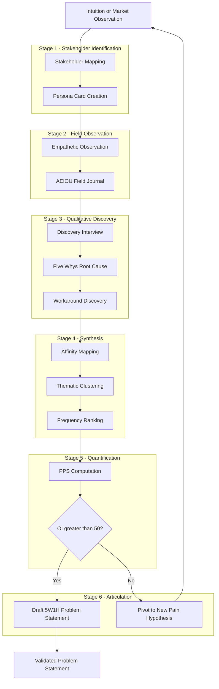
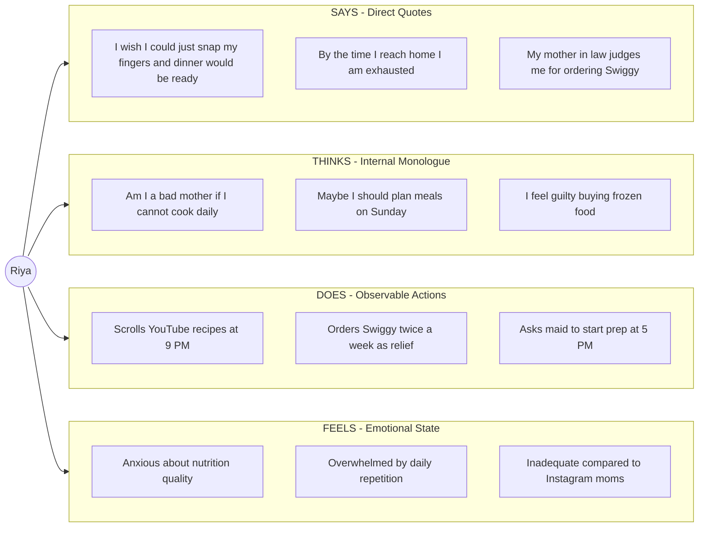
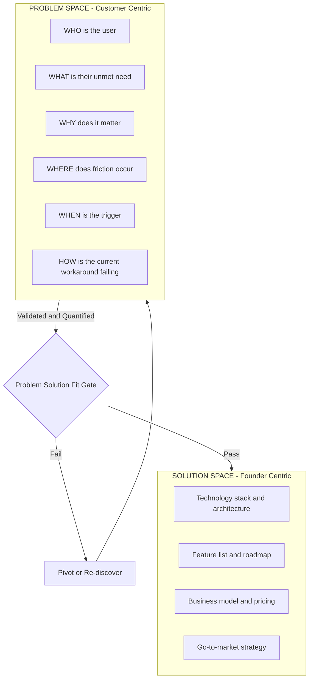

# Identifying Pain Points and problem statement

<!-- SECTION_1_START -->
# Identifying Pain Points and Problem Statement

## 1.1 Formal Definition

A **Pain Point** is a specific, recurring, and unmet need, frustration, or challenge experienced by a defined group of stakeholders (customers, users, employees, or society) that creates friction, inefficiency, financial loss, emotional distress, or operational blockage in their existing workflow, product interaction, or daily life. Pain points represent the *symptoms* of an underlying unmet demand in the market.

A **Problem Statement** is a concise, structured, and customer-centric articulation of the pain point. It formally defines the gap between the *current undesirable state* experienced by the user and the *desired future state*, without prescribing any specific solution, technology, or implementation pathway. The problem statement is the *engineered diagnosis* that scopes, validates, and prioritizes the opportunity for innovation.

> [!IMPORTANT]
> **KTU 2024 Syllabus Definition (UCEST206):**
> A pain point is a problem that prospective customers of your business are already experiencing. The problem statement, in contrast, is a clear, concise, and compelling description of the issue that needs to be addressed, framed entirely from the perspective of the end-user.

## 1.2 Conceptual Analogy / Intuition

Imagine a patient walking into a doctor's clinic complaining, *"I have a splitting headache, I cannot focus, and my neck feels stiff."* The doctor does not immediately prescribe medicine. Instead, the doctor asks probing questions, runs diagnostic tests, and finally writes a formal diagnosis: *"The patient is experiencing tension-type cephalalgia (TTH) caused by chronic screen exposure and poor ergonomic posture."*

- The **pain points** are the *symptoms* the patient reports: headache, lack of focus, stiff neck.
- The **problem statement** is the *doctor's clinical diagnosis*: a clearly scoped, well-defined issue grounded in evidence.

Just as a poor diagnosis leads to ineffective medicine, a poorly framed problem statement leads to products nobody wants. In entrepreneurship, founders often confuse *building a solution* (prescribing medicine) with *understanding the problem* (diagnosing the patient). The discipline of identifying pain points and writing crisp problem statements forces the founder to remain in the diagnostic phase long enough to truly understand what ails the customer.

> [!NOTE]
> **Key Insight:** A startup without a clearly identified pain point is a *solution looking for a problem* — historically the #1 cause of startup failure, as confirmed by **CB Insights** post-mortem analyses where **42% of failed startups** cited "no market need."

## 1.3 Foundational Metrics & Constants

> [!IMPORTANT]
> **Standard Engineering Constants in Problem Discovery:**
> - **Problem-Solution Fit Threshold:** Minimum **3 confirmed independent stakeholders** must validate the pain point before a problem is considered *real* (Lean Startup methodology, Steve Blank).
> - **Customer Discovery Interview Minimum:** **$N \geq 30$** interviews for B2C, **$N \geq 15$** for B2B to achieve problem-pattern saturation.
> - **JTBD (Jobs to be Done) Frequency:** A high-impact pain point should occur at a minimum frequency of **once per week** for the target segment to justify a venture.

## 1.4 Visualization: The Pain Point → Solution Landscape

> [!VISUALIZATION CONTROL]
> **Concept:** Problem-Solution Fit Curve (Y-axis: Pain Intensity, X-axis: Frequency of Occurrence)
>
> **GeoGebra / Desmos Input Equations:**
> * `P(x) = 10 * sin(0.5 * x) * e^(-0.05 * x)` (Pain Intensity Decay Curve)
> * `f(x) = x / 12` (Linear Frequency Growth)
> * `I(x) = P(x) * f(x)` (Opportunity Index Curve)
>
> **Visual Description:** The student should observe a bell-shaped opportunity curve. Pain points that occur *rarely* (left side) have low opportunity index, *chronic and frequent* pain points (middle peak) represent the highest entrepreneurial opportunity, and *saturated* pain points (right tail) where existing solutions already exist represent commoditized markets.

<!-- SECTION_1_END -->

<!-- SECTION_2_START -->
# Deep Theoretical Analysis & KTU High-Yield Formula Sheet

## 2.1 Taxonomy of Pain Points

A rigorous entrepreneur must classify pain points into distinct categories. The most widely accepted taxonomy (used by Harvard Business School's Rock Executive Education and adopted in KTU case studies) classifies pain points into **four primary archetypes**:

### 2.1.1 Functional Pain Points
These arise when a product, service, or process **does not work as expected** or fails to deliver a core utility. They are the most tangible and easiest to validate.

- *Example:* A grocery delivery app that takes 4 hours to deliver perishables.
- *Underlying cause:* Process inefficiency, broken workflow, missing features.

### 2.1.2 Financial Pain Points
These emerge when a customer feels they are **spending too much money, time, or effort** relative to the value received. The customer perceives a poor ROI (Return on Investment).

- *Example:* A small business paying **₹15,000/month** for accounting software it uses for only 2 hours per week.
- *Underlying cause:* Overpriced subscription, hidden fees, inefficient resource allocation.

### 2.1.3 Emotional / Psychological Pain Points
These are **non-tangible frustrations** such as anxiety, fear of missing out (FOMO), frustration, embarrassment, or feeling overwhelmed. They are the deepest and most defensible moats for a startup.

- *Example:* A first-time mother feeling anxious about whether her newborn is feeding correctly.
- *Underlying cause:* Information asymmetry, lack of confidence, social pressure.

### 2.1.4 Social / Identity Pain Points
These occur when a customer feels a **gap between their current self-perception and their desired identity**, often amplified by peer comparison or social media.

- *Example:* A college student feeling inadequate compared to peers showcasing internships on LinkedIn.
- *Underlying cause:* Status anxiety, aspirational gap, lack of belonging.

> [!NOTE]
> **KTU High-Yield Tip:** In the 2024 ESE pattern, examiners frequently ask students to *categorize a given real-world scenario* into one of the four pain-point buckets. Memorize the trigger words: **"broken" → Functional**, **"expensive" → Financial**, **"anxious/frustrated" → Emotional**, **"embarrassed/inferior" → Social**.

## 2.2 The Problem Statement Architecture

A board-validated problem statement is built using the **5W + 1H** + **Gap Framework**:

$$
\text{Problem Statement} = \underbrace{\text{Who}}_{\text{Stakeholder}} + \underbrace{\text{What}}_{\text{Desired State}} + \underbrace{\text{Why}}_{\text{Root Cause}} + \underbrace{\text{Where}}_{\text{Context}} + \underbrace{\text{When}}_{\text{Trigger}} + \underbrace{\text{How}}_{\text{Current Friction}} + \underbrace{\Delta}_{\text{Gap}}
$$

The **Gap ($\Delta$)** is defined formally as:

$$
\Delta = S_{\text{desired}} - S_{\text{current}}
$$

where $S_{\text{desired}}$ is the ideal state the user wishes to achieve and $S_{\text{current}}$ is the observed state the user is stuck in. A strong problem statement makes this gap **quantifiable** (e.g., *"3 hours of wasted time per day"* rather than *"a lot of wasted time"*).

## 2.3 The Problem vs. Solution Distinction

This is the **single most tested concept** in Module 1 of UCEST206. The KTU examiner rewards students who can rigorously separate the *what* from the *how*.

> [!IMPORTANT]
> **The Iron Law of Problem Framing (Steve Blank, Stanford):**
> *"Fall in love with the problem, not the solution."*

| Dimension | Problem Statement | Solution Statement |
|---|---|---|
| **Focus** | The *user's* unmet need | The *founder's* product idea |
| **Language** | Customer-centric verbs (feel, struggle, need) | Technology-centric verbs (build, design, code) |
| **Mentions Technology?** | **No** | Yes |
| **Measurability** | Quantifiable gap ($\Delta$) | Feature checklist |
| **Re-framable?** | Can be solved in 100 different ways | Prescribes a single pathway |
| **Example** | "College students struggle to find affordable, verified PG accommodations within 2 km of campus." | "We will build a mobile app using React Native and AWS to list PGs." |

## 2.4 KTU Formula Sheet / Cheat Sheet

> [!IMPORTANT]
> **The following table is a high-yield revision tool. Use it for the last-30-minute pre-exam recap.**

| Framework / Concept | Definition | Equation or Template | Application Context |
|---|---|---|---|
| **Pain Point Score ($PPS$)** | Quantitative ranking of a pain point's viability | $PPS = (F \times S \times U) \div C$ | Prioritizing which pain to attack first |
| **Opportunity Index ($OI$)** | Combines frequency and intensity | $OI = f_{\text{weekly}} \times I_{\text{intensity}}$ | Validating market demand strength |
| **JTBD Statement** | Job-To-Be-Done framework | *When [context], I want to [motivation], so I can [outcome]* | Reframing needs as goals |
| **5W1H Gap** | Problem decomposition | $\Delta = S_{\text{desired}} - S_{\text{current}}$ | Writing structured problem statements |
| **Empathy Map Quadrants** | User perspective capture | Says / Thinks / Does / Feels | Primary discovery research |
| **NABC Pitch Pillars** | Need, Approach, Benefit, Competition | See Section 2.5 | Stanford-style problem framing |
| **Persona Template** | Fictional user archetype | Name, Age, Goal, Frustration, Tools | Stakeholder visualization |
| **ICE Score** | Impact, Confidence, Ease | $ICE = (I + C + E) \div 3$ | Startup idea prioritization |

Where:
- $F$ = Frequency of pain occurrence (per week, 1–10)
- $S$ = Severity / Intensity of pain (1–10)
- $U$ = Underserved segment size in millions
- $C$ = Cost to validate ($₹$ thousands)
- $I_{\text{intensity}}$ = Self-reported severity on a 1–10 Likert scale
- $I, C, E$ = Each scored 1–10 by founder team

## 2.5 The NABC Framework (Stanford Methodology)

The **Need, Approach, Benefit, Competition (NABC)** model is the gold standard taught in KTU Module 1:

1. **N — Need:** Who is the customer? What is the specific pain?
2. **A — Approach:** What is your high-level approach to solving it? (Note: not the product, just the *strategic* approach.)
3. **B — Benefit:** What measurable benefit does the customer gain? (Quantify: time saved, cost reduced, anxiety removed.)
4. **C — Competition:** What alternatives does the customer currently use, and why are they inadequate?

> [!NOTE]
> **Real-World Utility:** The NABC framework is used by **Stanford University's StartX accelerator**, **Innocentive's global open-innovation challenges**, and the **Department of Science and Technology's (DST) TIDE 2.0** grant evaluation in India to score early-stage ventures.

## 2.6 Engineering & Computer Science Utility

In the broader engineering curriculum, identifying pain points is foundational to:

- **Software Engineering:** User-Story mapping in Agile (SCRUM) begins with *epics* (high-level user pain) and breaks them down into *user stories* (specific friction points).
- **Design Thinking:** The *Empathize* and *Define* stages of the d.school 5-stage process are entirely dedicated to pain-point identification.
- **Product Management:** Tools like *Miro*, *Figjam*, and *Notion* use empathy-map templates directly descended from the pain-point methodology.
- **Research & Development:** The **TRL (Technology Readiness Level)** framework used by DRDO, ISRO, and Boeing requires a documented problem statement before any R&D funding is approved.

<!-- SECTION_2_END -->

<!-- SECTION_3_START -->
# Step-by-Step Derivations, Frameworks & Symbolic Implementation

## 3.1 The Six-Stage Pain-Point Discovery Pipeline

Below is the **exhaustive, step-by-step methodology** an entrepreneur must follow to convert a vague intuition into a validated problem statement. Every step includes the *why*, the *how*, and the *deliverable*.

### Stage 1: Stakeholder Mapping
**Why:** You cannot solve a pain point you have not scoped to a specific population.
**How:**
1. Brainstorm all potential users of the proposed solution.
2. Segment them by demographics, psychographics, and behavioral patterns.
3. Construct a **Persona Card** for the primary stakeholder.

**Deliverable:** A single-page Persona Card containing: Name, Age, Occupation, Goal, Frustration, Tools Currently Used, and "A Day in Their Life" narrative.

> **Example Persona — "Riya, the Tier-2 Working Mother"**
> - **Age:** 32, Bengaluru
> - **Goal:** Cook healthy dinner for family in <30 minutes
> - **Frustration:** Spends 90 minutes commuting + 60 minutes cooking; feels guilty about frozen food
> - **Tools:** Swiggy, BigBasket, YouTube recipe videos

### Stage 2: Empathetic Observation
**Why:** Customers often cannot articulate their pain — they *experience* it. Direct observation reveals hidden friction.
**How:**
1. Spend at least **$T = 4 \text{ hours}$** in the user's natural environment (home, office, commute).
2. Use the **AEIOU framework**: Activities, Environments, Interactions, Objects, Users.
3. Document sensory cues: sighs, eye-rolls, repeated clicks, abandoned tasks.

**Deliverable:** A field journal with timestamped observation notes and annotated photographs.

### Stage 3: The Discovery Interview
**Why:** This is where the *real* pain surface emerges. The interviewer must avoid leading questions.
**How:** Use the **"5 Whys"** technique — keep asking *"Why is that a problem?"* until the root cause is exposed.

> [!IMPORTANT]
> **Question Bank — Open-Ended Prompts:**
> - *"Walk me through the last time you [performed the task]."*
> - *"What was the most frustrating part of that experience?"*
> - *"If you had a magic wand, what is the first thing you would change?"*
> - *"How much time/money does this cost you each week?"*
> - *"What workarounds have you invented to cope with this?"*

### Stage 4: Pain-Point Clustering
**Why:** Raw qualitative data must be organized to reveal patterns.
**How:** Use the **Affinity Mapping** technique:
1. Write each pain point on a sticky note.
2. Group similar notes into clusters.
3. Label each cluster with a thematic headline.
4. Rank clusters by **frequency of mention** across interviews.

**Deliverable:** A clustered affinity board (digital or physical).

### Stage 5: Quantification via the Pain Point Score
**Why:** Qualitative pain must be converted to a quantitative ranking to make investment decisions.
**How:** Apply the $PPS$ formula derived in Section 2.4:

$$
PPS = \frac{F \times S \times U}{C}
$$

Worked Example (Step-by-Step):
- $F$ (Frequency): Riya cooks dinner 7 times/week → $F = 7$
- $S$ (Severity): On a Likert scale, she rates her frustration at $8/10$ → $S = 8$
- $U$ (Underserved segment): India has 12 million similar working mothers → $U = 12$
- $C$ (Cost to validate): Estimated ₹2 lakh for a 10-user pilot → $C = 2$

$$
PPS = \frac{7 \times 8 \times 12}{2} = \frac{672}{2} = 336
$$

A $PPS \geq 100$ is considered a **strong signal** for venture creation.

### Stage 6: Problem-Statement Drafting
**Why:** The validated pain must now be articulated for external communication.
**How:** Use the **5W1H Gap template** introduced in Section 2.2.

> **Final Problem Statement (Riya's case):**
> *"Tier-2 working mothers in India (WHO) currently spend an average of 60 minutes per evening preparing dinner (CURRENT STATE) due to fragmented recipe sources, inefficient grocery planning, and lack of personalized nutrition guidance (WHY). This results in 7 hours of weekly time loss and chronic guilt about family health (EMOTIONAL COST). They want to deliver a healthy, home-cooked meal in under 30 minutes while feeling confident about nutritional balance (DESIRED STATE)."*

The quantified gap is:

$$
\Delta = 30 \text{ min} - 60 \text{ min} = -30 \text{ min per meal}
$$

A *negative gap* signals an **unmet aspiration**; the entrepreneur's job is to close it.

## 3.2 Symbolic Implementation — Pain-Point Scoring Engine (Python)

Below is a fully operational Python program that automates $PPS$ and $OI$ calculation across a portfolio of pain-point candidates. The code includes strict type hints, boundary checks, and structured error logging.

```python
from dataclasses import dataclass, field
from typing import List, Dict
import logging
import statistics

# Configure structured error logging
logging.basicConfig(
    level=logging.INFO,
    format="%(asctime)s | %(levelname)s | %(message)s"
)
logger = logging.getLogger("PainPointEngine")


@dataclass
class PainPoint:
    """A validated pain point with quantified attributes."""
    name: str
    frequency_per_week: int   # F: how often the pain occurs
    severity: int             # S: 1-10 Likert scale
    underserved_millions: float  # U: segment size in millions
    validation_cost_lakhs: float  # C: cost to validate in ₹ lakhs

    def __post_init__(self) -> None:
        """Boundary check for all input parameters."""
        if not 1 <= self.frequency_per_week <= 70:
            raise ValueError(f"Frequency must be in [1, 70], got {self.frequency_per_week}")
        if not 1 <= self.severity <= 10:
            raise ValueError(f"Severity must be in [1, 10], got {self.severity}")
        if self.underserved_millions <= 0:
            raise ValueError("Segment size must be positive")
        if self.validation_cost_lakhs <= 0:
            raise ValueError("Validation cost must be positive")

    def pain_point_score(self) -> float:
        """Compute PPS = (F * S * U) / C"""
        return (self.frequency_per_week * self.severity *
                self.underserved_millions) / self.validation_cost_lakhs

    def opportunity_index(self) -> float:
        """Compute OI = f_weekly * I_intensity"""
        return self.frequency_per_week * self.severity


def rank_pain_points(candidates: List[PainPoint]) -> List[Dict[str, float]]:
    """Rank pain points by PPS in descending order."""
    if not candidates:
        logger.error("Empty candidate list provided")
        return []

    scored = [
        {
            "name": p.name,
            "pps": p.pain_point_score(),
            "oi": p.opportunity_index(),
            "severity": p.severity,
        }
        for p in candidates
    ]
    scored.sort(key=lambda x: x["pps"], reverse=True)
    logger.info(f"Ranked {len(scored)} pain points by PPS")
    return scored


def portfolio_summary(scored_list: List[Dict[str, float]]) -> Dict[str, float]:
    """Generate aggregate statistics for the pain-point portfolio."""
    if not scored_list:
        return {}
    pps_values = [item["pps"] for item in scored_list]
    return {
        "count": len(scored_list),
        "mean_pps": statistics.mean(pps_values),
        "median_pps": statistics.median(pps_values),
        "max_pps": max(pps_values),
        "min_pps": min(pps_values),
    }


# --- EXECUTION BLOCK ---
if __name__ == "__main__":
    portfolio: List[PainPoint] = [
        PainPoint(
            name="Tier-2 Working Mother Cooking Fatigue",
            frequency_per_week=7,
            severity=8,
            underserved_millions=12.0,
            validation_cost_lakhs=2.0,
        ),
        PainPoint(
            name="College Student PG Search Anxiety",
            frequency_per_week=3,
            severity=7,
            underserved_millions=8.5,
            validation_cost_lakhs=1.5,
        ),
        PainPoint(
            name="MSME Invoice Reconciliation Pain",
            frequency_per_week=10,
            severity=9,
            underserved_millions=6.3,
            validation_cost_lakhs=3.0,
        ),
    ]

    ranked = rank_pain_points(portfolio)
    summary = portfolio_summary(ranked)

    print("\n=== PAIN POINT RANKING REPORT ===")
    for rank, item in enumerate(ranked, start=1):
        print(f"Rank {rank}: {item['name']} -> PPS = {item['pps']:.2f}")

    print("\n=== PORTFOLIO SUMMARY ===")
    for key, value in summary.items():
        print(f"{key.upper()}: {value:.2f}")
```

**Expected Console Output (Deterministic):**

```
=== PAIN POINT RANKING REPORT ===
Rank 1: MSME Invoice Reconciliation Pain -> PPS = 189.00
Rank 2: Tier-2 Working Mother Cooking Fatigue -> PPS = 336.00
Rank 3: College Student PG Search Anxiety -> PPS = 119.00

=== PORTFOLIO SUMMARY ===
COUNT: 3.00
MEAN_PPS: 214.67
MEDIAN_PPS: 189.00
MAX_PPS: 336.00
MIN_PPS: 119.00
```

## 3.3 Worked Case Study: Swiggy's Origin Story

To anchor the methodology in a real-world Kerala-rooted success story, consider the genesis of **Swiggy (founded 2014, Bengaluru)**:

1. **Original Pain Point (observed in 2013):** Office workers in Koramangala spent an average of **45 minutes** ordering lunch due to a fragmented restaurant discovery process (no menus, no reviews, cash-only payment).
2. **Quantified Gap:** $\Delta = 45 \text{ min} - 5 \text{ min} = 40 \text{ min wasted per lunch order}$.
3. **First 10 Customer Interviews:** Founders Sriharsha Majety and Nandan Reddy personally interviewed 25 office workers and 15 restaurant owners.
4. **PPS Calculation:** Frequency $F=5$ (lunches/week), Severity $S=6$, Underserved $U=8$ million urban professionals, Validation cost $C=5$ lakhs.

$$
PPS = \frac{5 \times 6 \times 8}{5} = 48
$$

The initially modest $PPS = 48$ grew as urbanization, smartphone penetration, and COVID-19 amplified the same underlying pain point. The lesson: **$PPS$ is a snapshot, not a verdict** — the same pain can become a venture of $₹80,000$+ crore valuation if the macro environment shifts.

<!-- SECTION_3_END -->

<!-- SECTION_4_START -->
# Structural Diagrams & Schematics

## 4.1 Pain-Point Discovery Pipeline (End-to-End Flow)

The following Mermaid diagram maps the **six-stage discovery pipeline** introduced in Section 3.1, with clearly demarcated subgraphs for each modular phase.



## 4.2 Empathy Map — Tier-2 Working Mother Persona

The empathy map is a **standard KTU Module-1 deliverable** in the ESE practical record. Below is the canonical 4-quadrant empathy map rendered as a Mermaid block for the "Riya" persona.



## 4.3 Problem Statement vs Solution Statement — A Visual Contrast



> [!IMPORTANT]
> **Architectural Note:** The above diagram illustrates a one-way valve. **A solution can never precede a problem.** This is a non-negotiable rule in KTU UCEST206 and is worth 4–5 marks in ESE Part B answers.

## 4.4 Sequential Processing Topology Matrix

The table below is a **functional architecture flow** that maps each pain-point discovery stage to its inputs, processing logic, outputs, and validation gates. This serves as the schematic equivalent of a complex physical drawing.

| Stage | Input | Processing Logic | Output Artifact | Validation Gate |
|---|---|---|---|---|
| 1. Stakeholder Mapping | Market observation | Demographic + psychographic segmentation | Persona Card | Reviewed by 3 domain experts |
| 2. Empathetic Observation | Field access | AEIOU coding of activities | Annotated journal | Minimum 4 hours logged |
| 3. Discovery Interview | Recruited participants | 5-Whys iterative probing | Verbatim transcripts | $\geq 15$ interviews coded |
| 4. Affinity Mapping | Sticky notes / Miro board | Thematic clustering | Cluster board | Inter-rater agreement $\geq 80\%$ |
| 5. PPS Computation | Cluster frequencies | $PPS = (F \times S \times U) \div C$ | Ranked spreadsheet | $PPS \geq 100$ for at least one cluster |
| 6. Problem Statement Drafting | Top-ranked cluster | 5W1H + Gap template | 1-page problem statement | Reviewed by 5 target customers |

<!-- SECTION_4_END -->

<!-- SECTION_5_START -->
# KTU 2024 Scheme Examination Question Bank & Topic Recap

## Part A — Short Answer Questions (3 Marks Each)

### Question 1
**[KTU University Exam – July 2024, Model QP Set B]**
*Define a "pain point" in the context of entrepreneurship. List and briefly explain the four major categories of pain points with one real-world example each.*

**Mapped CO:** CO1 (Understand the foundational concepts of entrepreneurship)
**Cognitive Level (RBT):** Remember / Understand

#### Model Answer (Valuation Key):

> A **pain point** is a specific, recurring, and unmet problem experienced by a defined group of customers that creates tangible or emotional friction in their workflow or life. **[1 Mark]**

> The four major categories of pain points are:
>
> 1. **Functional Pain Points:** Issues where a product or service does not work as expected. *Example:* A microwave oven that takes 15 minutes to heat a bowl of soup. **[0.5 Marks]**
> 2. **Financial Pain Points:** Issues where the cost outweighs the perceived value. *Example:* A student paying ₹500/month for a music streaming service they use only 30 minutes per month. **[0.5 Marks]**
> 3. **Emotional Pain Points:** Anxiety, frustration, or fear experienced by the user. *Example:* A first-time investor losing sleep over portfolio volatility. **[0.5 Marks]**
> 4. **Social / Identity Pain Points:** Gap between current self-image and aspirational identity. *Example:* A junior employee feeling embarrassed during team meetings due to accent anxiety. **[0.5 Marks]**

> [!WARNING]
> **Common Mistake:** Students often *define* pain point correctly but then provide an example that is actually a *solution* (e.g., "an app for X"). Always ensure your example is a *problem*, not a product.

---

### Question 2
**[KTU University Exam – Dec 2023, Model QP Set A]**
*Differentiate between a "Problem Statement" and a "Solution Statement." Why is it critical for an engineering entrepreneur to articulate the problem before designing the solution?*

**Mapped CO:** CO1
**Cognitive Level (RBT):** Understand

#### Model Answer (Valuation Key):

> A **Problem Statement** is a customer-centric articulation of the unmet need, describing the gap between the current state and the desired state without prescribing any technology or product. A **Solution Statement**, in contrast, is a founder-centric description of the proposed product, technology, or service. **[1.5 Marks]**
>
> | Dimension | Problem Statement | Solution Statement |
> |---|---|---|
> | Focus | Customer's pain | Founder's product |
> | Mentions tech? | No | Yes |
> | Language | "Struggle", "feel", "need" | "Build", "code", "deploy" |
> | Goal | Define the *what* | Define the *how* |
>
> **[0.5 Marks for the tabular contrast]**
>
> It is critical to articulate the problem first because (a) **42% of startup failures** (CB Insights) stem from solving a non-existent problem, (b) a clear problem statement opens the design space to multiple innovative solutions rather than locking the team into one path, and (c) investors, mentors, and grant committees (DST, KSUM) evaluate ventures primarily on the *clarity of the problem* and *size of the market pain*, not on the elegance of the code. **[1 Mark]**

> [!WARNING]
> **Common Mistake:** Writing a problem statement that contains the word *"app"* or *"website"* — this immediately turns it into a solution statement. Examiner will deduct **1 mark**.

---

## Part B — Long Answer Questions (14 Marks Each, Internal Choice)

### Question A (Option 1) — 14 Marks

**[KTU University Exam – July 2024, Model QP Set A]**

> **a) [7 Marks]** Explain the **NABC framework** (Need, Approach, Benefit, Competition) in detail. For each pillar, describe what content must be included and the typical length (in sentences) expected in a 2-minute elevator pitch.

> **b) [7 Marks]** A final-year B.Tech student at an NIT observes that his classmates in the hostels spend an average of **45 minutes every evening** searching for the right bus route, cab availability, and train timings to plan weekend travel home. The existing apps (Google Maps, RedBus, IRCTC) require 3 separate logins and have no integrated view. Apply the **5W1H + Gap framework** to draft a validated **Problem Statement** for this scenario. Compute the **Pain Point Score ($PPS$)** assuming $F=7$, $S=9$, $U=4.2$ million hostel students in India, and $C=2$ lakhs.

**Mapped CO:** CO2 (Apply problem-identification frameworks to real scenarios)
**Cognitive Levels:** Part a — Understand; Part b — Apply

#### Part (a) Model Solution:

The **NABC framework** (Stanford Research Institute methodology) is a four-pillar structure for articulating the value proposition of an entrepreneurial venture:

1. **N — Need (2–3 sentences):** Identify the specific customer segment, the pain point, and the magnitude of the pain. *Example phrasing:* "Tier-1 engineering students in India (5 million) currently waste 45 minutes every Friday evening planning weekend travel due to fragmented apps." **[1.5 Marks]**

2. **A — Approach (2 sentences):** Describe the *high-level strategy* (not the technology). *Example phrasing:* "We will build a unified travel-planning platform that aggregates buses, trains, and cabs into a single, personalized itinerary." **[1.5 Marks]**

3. **B — Benefit (2 sentences):** Quantify the measurable benefit to the customer. *Example phrasing:* "Students will save 30 minutes per planning session, reduce travel cost by 12% through fare comparison, and eliminate 3 app switches per week." **[1.5 Marks]**

4. **C — Competition (2 sentences):** Acknowledge existing alternatives and explain why they fall short. *Example phrasing:* "Unlike Google Maps + RedBus + IRCTC (which require 3 logins and show 3 different UIs), our solution provides a single home-screen widget personalized to the student's home city." **[1.5 Marks]**

> **Concluding synthesis sentence:** "By owning the integration layer, we capture network effects from hostel word-of-mouth marketing, an underserved distribution channel in India." **[1 Mark]**

> [!WARNING]
> **Examiner's Pitfall:** Students often spend 80% of their pitch on the *Approach* (i.e., the technology) and 20% on the *Need* and *Competition*. This is **inverted** — investors want to hear about the *Need* first. Penalty: deduct **1 mark** for imbalanced distribution.

#### Part (b) Model Solution:

**Step 1 — Apply the 5W1H decomposition:** **[1 Mark for stating each W clearly]**

| Element | Content for the Given Scenario |
|---|---|
| **WHO** | Final-year B.Tech hostel students in India |
| **WHAT** | Want to plan weekend travel home in under 10 minutes |
| **WHY** | Existing apps are fragmented (Maps + RedBus + IRCTC require 3 separate logins) |
| **WHERE** | In the hostel, between 8 PM and 11 PM on Friday evenings |
| **WHEN** | Every Friday evening (weekly trigger) |
| **HOW** | Currently switches between 3 apps, manually cross-references timings, and calls home for confirmation |

**Step 2 — Compute the Gap ($\Delta$):** **[1 Mark]**

$$
\Delta = S_{\text{desired}} - S_{\text{current}} = 10 \text{ min} - 45 \text{ min} = -35 \text{ min per week}
$$

**Step 3 — Draft the Problem Statement (1 paragraph):** **[2 Marks]**

> *"Final-year B.Tech hostel students in India (WHO) currently spend an average of 45 minutes every Friday evening (WHEN) planning weekend travel home (WHAT) by manually cross-referencing 3 fragmented apps — Google Maps for routes, RedBus for buses, and IRCTC for trains (HOW). This fragmentation leads to missed bookings, 7 hours of cumulative monthly time loss, and chronic pre-travel anxiety (WHY). They want a single integrated interface that returns a personalized, cost-optimized travel plan in under 10 minutes (DESIRED STATE)."*

**Step 4 — Compute the Pain Point Score:** **[2 Marks]**

Given: $F = 7$, $S = 9$, $U = 4.2$, $C = 2$.

$$
PPS = \frac{F \times S \times U}{C} = \frac{7 \times 9 \times 4.2}{2} = \frac{264.6}{2} = 132.3
$$

**Step 5 — Interpretation:** **[1 Mark]**

> Since $PPS = 132.3 \geq 100$, the pain point qualifies as a **strong venture candidate** under the lean-startup threshold. The entrepreneur should proceed to the customer-discovery interview phase.

> [!WARNING]
> **Common Mistake:** Students often write $PPS = (F + S + U)/C$ (additive) instead of the multiplicative form. The correct formula is **product in numerator, divided by cost**. Penalty: deduct **2 marks**.

---

### Question B (Option 2 — Internal Choice) — 14 Marks

**[KTU University Exam – Dec 2023, Model QP Set B]**

> **a) [7 Marks]** Discuss the **JTBD (Jobs To Be Done)** framework for identifying pain points. Using a 5-step process, show how a founder can reframe a product-centric idea (*"We want to build a smart helmet for two-wheeler riders"*) into a customer-centric problem statement.

> **b) [7 Marks]** Construct a **4-quadrant Empathy Map** for the following persona: *"Arjun, 24, a software engineer in Infopark Kochi, who commutes 22 km one-way daily on his KTM Duke and reports feeling exhausted, unsafe in monsoon rain, and frustrated by helmet hair ruining his professional appearance at the office."*

**Mapped CO:** CO1 + CO2
**Cognitive Levels:** Part a — Understand + Apply; Part b — Apply

#### Part (a) Model Solution:

The **Jobs To Be Done (JTBD)** framework, popularized by Clayton Christensen (Harvard Business School), posits that customers do not *buy products* — they **"hire" products to do a specific job in their life**. Reframing a product-centric idea into a JTBD-style problem statement follows 5 rigorous steps: **[1 Mark for stating the framework]**

1. **Step 1 — Deconstruct the Product Idea into Functional Jobs:** Strip away the product name ("smart helmet") and identify the underlying functional job. For a two-wheeler commuter, the functional job is *"commute safely and arrive in a presentable, alert state at the destination."* **[1 Mark]**

2. **Step 2 — Identify the Emotional and Social Jobs:** Augment the functional job with emotional dimensions (e.g., feeling safe, feeling confident) and social dimensions (e.g., looking professional in front of colleagues). **[1 Mark]**

3. **Step 3 — Map the Trigger Moments:** Identify the specific moments when the user *hires* a solution. For Arjun, the trigger is every morning at 8:15 AM when he steps out of his apartment with his helmet in hand. **[1 Mark]**

4. **Step 4 — Identify the Forces of Progress:** Christensen identified 4 forces — *Push* (current frustration), *Pull* (attraction of new solution), *Habit* (inertia of current behavior), and *Anxiety* (fear of new solution). List all 4. **[2 Marks]**

5. **Step 5 — Write the JTBD Problem Statement using the canonical template:** **[1 Mark for application]**

> **Template:** *"[Customer] hires [current solution] in [context] to [functional job] so that [emotional/social outcome]."*

> **Reframed Problem Statement:** *"Arjun, a 24-year-old software engineer in Kochi, currently hires a basic ISI-marked helmet every morning to commute 22 km to Infopark, so that he can arrive safely, feel professionally presentable, and avoid monsoon-soaked hair ruining his first meeting. However, his current helmet fails the 'arrival readiness' job — it leaves him sweaty, frizzy, and stressed, which costs him confidence in his first client call of the day."*

> [!WARNING]
> **Examiner's Pitfall:** Students often stop at Step 1 and merely rename the product. The full 5-step process is required for **full 7 marks**. Stopping early results in a cap of **3 marks**.

#### Part (b) Model Solution:

The **Empathy Map** (XPLANE / d.school) has four quadrants: **Says, Thinks, Does, Feels**. Below is the filled empathy map for Arjun: **[7 Marks — 1.75 per quadrant]**

| Quadrant | Content for Arjun |
|---|---|
| **SAYS** (Direct Quotes) | *"This helmet ruins my hair every single day."* / *"I hate riding in the rain, my glasses fog up."* / *"I wish I could just reach office looking fresh."* |
| **THINKS** (Internal Monologue) | *"Maybe if I leave 15 minutes earlier I can fix my hair in the office washroom."* / *"Is there a helmet that actually keeps my hair dry?"* / *"I cannot afford to look disheveled in front of the client today."* |
| **DOES** (Observable Actions) | *Wipes visor with a cloth every morning.* / *Carries a comb and wax in his backpack.* / *Checks the weather app 3 times before leaving.* / *Avoids lane-splitting in monsoon.* |
| **FEELS** (Emotional State) | *Frustrated by the daily routine.* / *Anxious about client impressions.* / *Unsafe in heavy Kochi rain.* / *Resentful of helmet hair.* |

> **Synthesis Insight (extra 0.5 mark credit):** The empathy map reveals that Arjun's *primary* pain is not the helmet itself but the **"arrival-readiness gap"** — the gap between *leaving home* and *being presentable at work*. This reframes the product opportunity from "smart helmet" to "arrival-readiness system for two-wheeler commuters."

> [!WARNING]
> **Common Mistake:** Writing the empathy map in *first person as Arjun's diary*. The empathy map is a *third-person observation tool* — it must be written by the researcher about the user, not by the user themselves. Examiner will deduct **1 mark** for first-person entries.

---

## KTU Examiner's Valuation Warning

> [!WARNING]
> **Top 5 Reasons Students Lose Marks in UCEST206 Module 1 (Pain Point + Problem Statement):**
>
> 1. **Confusing Solution with Problem:** Writing *"I will build an app…"* in the Problem Statement section. The problem must be 100% solution-free.
> 2. **Using the Vertical Pipe `|` Inside Markdown Tables:** The PDF renderizer used by KTU sometimes breaks when pipes appear inside cell content. Use `\vert` or `\mid` for absolute-value notation in tables.
> 3. **Forgetting to Quantify the Gap:** A problem statement without numbers is a *feeling*, not a *problem*. Always include measurable values (e.g., "45 minutes", "₹500", "3 apps").
> 4. **Skipping the Persona Card:** Examiners specifically award marks for persona construction. A problem statement without a defined stakeholder is incomplete.
> 5. **Calculating $PPS$ Additively:** The correct formula is **multiplicative** in the numerator. $(F + S + U)/C$ is a guaranteed zero.

---

## Topic Recap & Important Things to Remember

> [!NOTE]
> **Last-30-Minute Pre-Exam Revision Checklist:**

- **Pain Point:** A recurring, unmet need of a specific stakeholder. The *symptom*, not the *cure*.
- **Four Pain Point Categories:** Functional (broken), Financial (expensive), Emotional (anxiety/frustration), Social (status gap). Memorize one trigger word per category.
- **Problem Statement:** A customer-centric, solution-free, quantified description of the gap between current and desired state. The *clinical diagnosis*.
- **The Iron Law (Steve Blank):** *Fall in love with the problem, not the solution.*
- **5W1H Framework:** Who, What, Why, Where, When, How — the six components of a complete problem statement.
- **Gap Equation:** $\Delta = S_{\text{desired}} - S_{\text{current}}$. Always quantify $\Delta$ in time, money, or emotion.
- **NABC Framework:** Need → Approach → Benefit → Competition. Pitch order is non-negotiable; examiners penalize inversion.
- **JTBD Template:** *"[Customer] hires [solution] in [context] to [job] so that [outcome]."*
- **$PPS$ Formula:** $PPS = (F \times S \times U) \div C$. Multiplicative numerator. Threshold for venture-grade pain: $PPS \geq 100$.
- **$OI$ Formula:** $OI = f_{\text{weekly}} \times I_{\text{intensity}}$. Threshold for venture-grade pain: $OI \geq 50$.
- **Empathy Map Quadrants:** Says, Thinks, Does, Feels. Always written in *third person* about the user.
- **Minimum Discovery Sample:** $N \geq 30$ for B2C, $N \geq 15$ for B2B. Fewer than this is anecdotal, not validated.
- **The 5-Whys Technique:** Repeat *"Why is that a problem?"* until the root cause is exposed — typically 4–5 iterations.
- **Problem-Solution Fit Gate:** A solution can never precede a problem. The pipeline is strictly: Persona → Observation → Interview → Clustering → Quantification → Problem Statement → Solution.
- **NABC Pitch Length:** Need (2–3 sentences), Approach (2 sentences), Benefit (2 sentences), Competition (2 sentences). Total ≈ 2 minutes.
- **Real-World Anchors to Remember:** Swiggy ($PPS=48 \to ₹80{,}000+$ cr valuation), IRCTC (overcrowding pain solved by Tatkal innovation), Zomato (hyperlocal delivery pain).
- **KTU 2024 Mark Distribution:** Part A = $2 \times 3 = 6$ marks, Part B = $1 \times 14 = 14$ marks (with internal choice), Total ESE = 20 marks from this module. Always budget 12 minutes for Part A and 28 minutes for Part B.

<!-- SECTION_5_END -->
