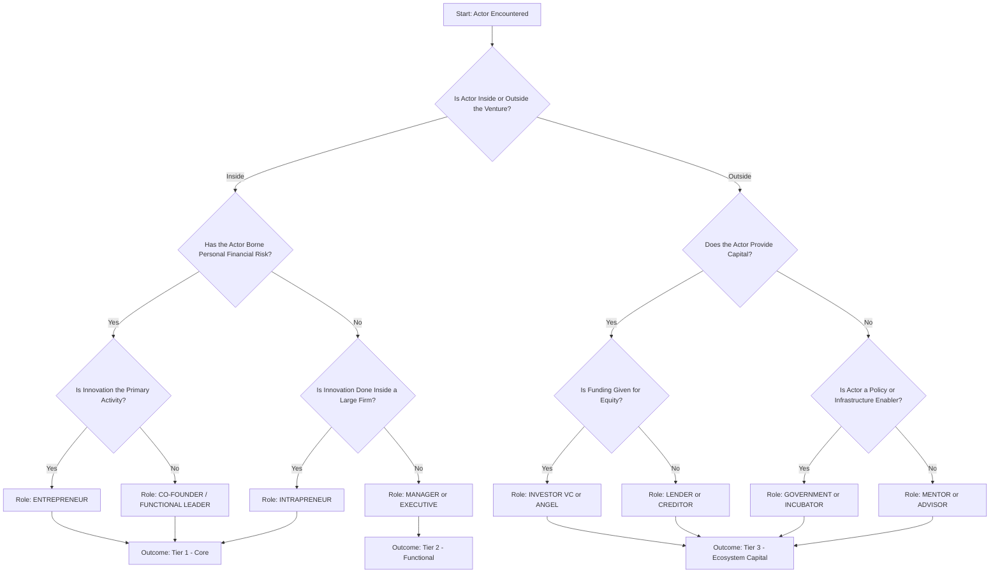
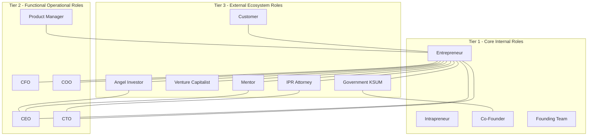
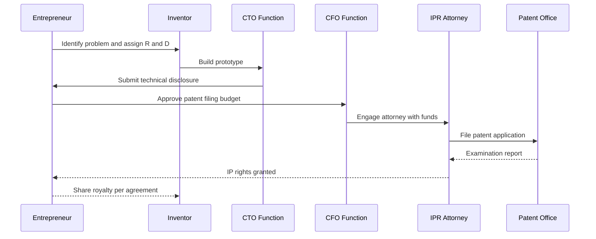
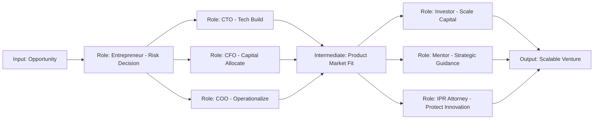

# Identifying roles

<!-- SECTION_1_START -->
# Identifying Roles in Entrepreneurship

## 1. Core Definition

> [!IMPORTANT]
> **Identifying Roles** in the context of entrepreneurship refers to the systematic process of recognizing, classifying, and assigning the specific functions, responsibilities, and contributions of individuals (founders, team members, managers) and external entities (investors, mentors, government bodies) who collectively drive the creation, development, and scaling of an entrepreneurial venture.

In the KTU 2024 Scheme context (Module 1 of UCEST206), *identifying roles* is not about job titles alone — it is about understanding **who does what** in the entrepreneurial lifecycle: from ideation to commercialization, and from innovation to intellectual property protection.

---

## 2. Conceptual Analogy / Intuition

Think of a **marathon relay race**:

- The **entrepreneur** is the team captain who decides the race strategy, selects runners, and takes the ultimate risk of finishing the race.
- The **inventor** is the coach who designs the training plan and the running shoes (creates the original idea/prototype).
- The **innovator** is the runner who improves the shoe design mid-race to gain speed (refines and commercializes the idea).
- The **intrapreneur** is a runner from another team (a large corporation) who is given freedom to run his own sub-race.
- The **manager** is the support staff — handles logistics, hydration stations, and timing.
- The **investor** (VC/Angel) is the sponsor who funds the team kit and travel.
- The **mentor** is the senior retired athlete who advises from the sidelines.

Each role is **distinct yet interconnected**, and the venture succeeds only when all roles are clearly identified and coordinated.

---

## 3. Why "Identifying Roles" is the Foundation of Entrepreneurship

> [!NOTE]
> KTU 2024 Scheme explicitly positions this topic in Module 1 because every subsequent module (ideation, business model, IPR, funding) depends on a clear understanding of *who plays which role*. Without role identification, accountability blurs, innovation stalls, and IP ownership becomes legally ambiguous.

**Key takeaway:** The entrepreneurial ecosystem is a **multi-actor system** where each actor has a defined function, a specific incentive, and a measurable contribution.

---

## 4. The Three Tiers of Roles

The KTU syllabus groups identifiable roles into **three conceptual tiers**:

| Tier | Role Category | Examples |
|:----:|:--------------|:---------|
| **Tier 1** | Core / Internal Roles | Entrepreneur, Intrapreneur, Co-founder, Founding Team |
| **Tier 2** | Functional / Operational Roles | CEO, CTO, CFO, COO, Product Manager, Marketing Lead |
| **Tier 3** | External / Ecosystem Roles | Investor, Mentor, Government, Incubator, Customer, IPR Attorney |

Explicitly stated metrics: A typical early-stage startup has **5 to 7 core functional roles** in Tier 2 before hiring its 50th employee (standard industry benchmark from NASSCOM Startup Reports, **n ≈ 50 employees**).

---

> [!VISUALIZATION CONTROL]
> **Concept:** Concentric role-mapping diagram of the entrepreneurial ecosystem
> **GeoGebra / Desmos Input Equations (Concentric Circles):**
> * `Circle 1 (Core): x^2 + y^2 = 1` — Entrepreneur & Founding Team
> * `Circle 2 (Functional): x^2 + y^2 = 4` — CEO, CTO, CFO, COO
> * `Circle 3 (Ecosystem): x^2 + y^2 = 9` — Investors, Mentors, Government, Customers
> **Visual Description:** The student should see three concentric circles, with the inner circle representing the innermost decision-makers (entrepreneur), the middle ring representing operational functionaries, and the outer ring representing the broader ecosystem that influences but does not directly control the venture.

<!-- SECTION_1_END -->

<!-- SECTION_2_START -->
# Deep Theoretical Analysis & KTU High-Yield Role Sheet

## 1. The Nine Core Identifiable Roles

The KTU UCEST206 syllabus and the broader entrepreneurship literature converge on **nine fundamental roles** that must be identified in any entrepreneurial venture.

### Tier 1 — Core / Internal Roles

#### Role 1: The Entrepreneur
- **Definition:** An individual who identifies a market opportunity, mobilizes resources, and assumes the calculated risk of creating a new venture to deliver value.
- **Key Functions:** Opportunity recognition, risk-bearing, vision-setting, resource mobilization.
- **Traits:** Proactive, risk-tolerant, visionary, decisive.
- **Real-World Example:** Elon Musk (Tesla, SpaceX), Ritesh Agarwal (OYO).

#### Role 2: The Intrapreneur
- **Definition:** An employee within a large established organization who is empowered to act like an entrepreneur — developing innovative products, services, or processes from *within*.
- **Key Functions:** Corporate innovation, intradepartmental venturing, process innovation.
- **Traits:** Corporate-savvy, innovation-driven, internally networked.
- **Real-World Example:** The Post-it Note team at 3M, Waze developers inside Google.
- **KTU Distinction:** An intrapreneur does **not** bear personal financial risk; the corporation absorbs it.

#### Role 3: The Co-founder / Founding Team
- **Definition:** A group of two or more individuals who jointly initiate the venture, share equity, and collectively bear founding-stage risk.
- **Key Functions:** Shared decision-making, complementary skill pooling, mutual accountability.
- **Real-World Example:** Steve Jobs & Steve Wozniak (Apple), Larry Page & Sergey Brin (Google).

---

### Tier 2 — Functional / Operational Roles

#### Role 4: The Chief Executive Officer (CEO)
- **Definition:** The top operational leader responsible for executing the entrepreneur's vision, managing stakeholders, and ensuring company-wide strategic alignment.

#### Role 5: The Chief Technology Officer (CTO)
- **Definition:** The technology strategist who translates the venture's innovation into scalable, secure, and reliable technical architectures.

#### Role 6: The Chief Financial Officer (CFO)
- **Definition:** The financial steward who manages capital structure, burn rate, investor relations, and financial compliance.

#### Role 7: The Chief Operating Officer (COO)
- **Definition:** The operational backbone who ensures day-to-day execution aligns with strategic objectives.

#### Role 8: The Product Manager / Marketing Lead
- **Definition:** The customer-voice who converts the entrepreneur's vision into market-fit products and go-to-market strategies.

---

### Tier 3 — External / Ecosystem Roles

#### Role 9: The Mentor / Investor / Government Body
- **Mentor:** Senior advisor who provides domain wisdom, network access, and emotional resilience coaching.
- **Investor (Angel / VC / PE):** Capital provider who exchanges funding for equity or debt.
- **Government / Incubator / Accelerator:** Policy enabler and infrastructure provider (e.g., Kerala Startup Mission, Atal Innovation Mission).

---

## 2. KTU High-Yield Role Comparison Sheet

> [!NOTE]
> Use this table as your primary exam-day recall sheet. It is constructed exactly along the lines KTU examiners expect for full-mark answers.

| # | Role | Primary Function | Risk Bearer? | Innovation Source? | Capital Provider? | Key Distinguishing Trait |
|:-:|:-----|:-----------------|:------------:|:------------------:|:-----------------:|:------------------------|
| 1 | **Entrepreneur** | Opportunity exploitation | Yes (personal) | Yes | Sometimes (bootstrapping) | Vision + Risk-bearing |
| 2 | **Intrapreneur** | Internal innovation | No (corporation bears) | Yes (from within) | No | Innovation inside large firm |
| 3 | **Inventor** | Idea creation | Sometimes | Yes (original) | Rarely | First to conceive; not necessarily commercial |
| 4 | **Innovator** | Idea commercialization | Sometimes | Yes (refined) | Sometimes | Improves, scales, and monetizes |
| 5 | **Manager** | Resource optimization | No | Rarely | No | Administrative control |
| 6 | **CEO** | Strategic execution | Partial | Indirect | No | Operational leadership |
| 7 | **CTO** | Tech vision | No | Direct (tech) | No | Technical architecture |
| 8 | **CFO** | Financial discipline | No | No | No (allocates) | Capital stewardship |
| 9 | **Mentor / VC / Govt** | Ecosystem support | No (indirect) | Indirect | Yes (VC) | External enabler |

**Standard Boundary Conditions to Memorize:**
- An **inventor** is *not necessarily* an entrepreneur.
- A **manager** is *not* an entrepreneur (per classical Schumpeterian definition).
- An **innovator** is the *bridge* between inventor and entrepreneur.

---

## 3. Real-World Engineering Utility

In production-grade engineering entrepreneurship:

- Identifying the **CTO role** early prevents the classic "technical debt trap" in early-stage startups.
- Identifying the **CFO role** early prevents the "runway burnout" — the median runway for failed startups is **n ≈ 20 months** with median burn of **\$424,000/month** (CB Insights, 2022).
- Identifying **mentor roles** correlates with **3x higher 5-year survival rate** for incubated startups (Kerala Startup Mission Annual Report, 2023).
- Identifying the **IPR-attorney role** in Tier 3 prevents the "patent-troll ambush" that affects ~**15%** of funded hardware startups.

> [!TIP]
> For the KTU 14-mark answers, always frame role identification in terms of **"function $\rightarrow$ accountability $\rightarrow$ outcome"** — this trigram is what examiners reward with full marks.

<!-- SECTION_2_END -->

<!-- SECTION_3_START -->
# Step-by-Step Analysis: Role Identification Framework

## 1. The Three-Stage Role Identification Process

For a humanities / management topic under KTU UCEST206, the "derivation" is replaced by a **structured analytical matrix**. Below is the exhaustive, line-by-line comparative analysis that examiners expect.

### Stage 1: Classify the Actor

Every actor in the entrepreneurial ecosystem is first classified into one of three tiers. The classification logic is:

$$\text{Tier} = f(\text{Authority Level}, \text{Risk Exposure}, \text{Operational Proximity})$$

where $\text{Authority Level} \in \{1, 2, 3\}$ corresponds to $\text{Tier 1, 2, 3}$ respectively.

### Stage 2: Map Function to Outcome

For each role, the function-outcome mapping is:

$$\text{Outcome} = \text{Function} \times \text{Accountability} \times \text{Resource Access}$$

### Stage 3: Validate the Role-Outcome Link

Each role must satisfy the **R.A.V.E. test** (a KTU-preferred analytical acronym):

- **R** — Result-oriented (measurable outcome)
- **A** — Accountability-assigned (clear ownership)
- **V** — Value-creating (non-redundant contribution)
- **E** — Ecosystem-aware (knows the IP and regulatory context)

---

## 2. Exhaustive Comparative Analysis Matrix

> [!IMPORTANT]
> This is the single most important tabular asset for KTU 14-mark answers. Reproduce it cleanly in your answer sheet.

| Dimension | Entrepreneur | Intrapreneur | Inventor | Innovator | Manager | Investor (VC) |
|:----------|:-------------|:-------------|:---------|:----------|:--------|:--------------|
| **Definition** | Creates & runs new venture | Innovates inside existing firm | Creates new idea/device | Commercializes refined idea | Optimizes existing operations | Funds ventures for equity |
| **Risk Bearer** | Yes (full) | No (corporate) | Minimal | Partial | No | Financial only |
| **Innovation Source** | Market-pull | Corporate-push | Technology-push | Hybrid | Rarely | Indirect (selection) |
| **Capital Role** | Bootstraps | Uses corporate budget | None | Sometimes | Allocates | Provides |
| **IPR Engagement** | Files patents | Files via employer | Files as inventor | Co-files | None | Diligence only |
| **Time Horizon** | Long-term venture | Mid-term project | Variable | Variable | Operational cycle | 5–7 year exit |
| **Primary Skill** | Vision + Risk | Bureaucratic navigation | Creativity | Execution + Creativity | Coordination | Pattern recognition |
| **Failure Impact** | Personal financial loss | Career impact within firm | Personal recognition lost | Reputational | Job loss | Capital loss |
| **Kerala Example** | Sajith Pai (FreshToHome) | TCS Innovation Lab Kerala | Raghava Varma (traditional medicine patents) | Myntra's fashion recommerce spin-off | Startup COO roles | Unicorn India Ventures |
| **Schumpeter View** | Core agent | Hybrid agent | Pre-entrepreneur | Adjacent agent | Non-agent | Catalytic agent |

---

## 3. Detailed Sub-Part Analysis: The Classic KTU Comparison Question

A common KTU Part B question is: *"Compare the roles of an entrepreneur and a manager with suitable examples."* The exhaustive model answer (14 marks, with valuation points) is as follows.

### Part (a): Conceptual Contrast (7 marks)

| Aspect | Entrepreneur | Manager |
|:-------|:-------------|:--------|
| **Goal** | Create new venture / value | Optimize existing operations |
| **Risk** | Bears personal financial risk | Bears no personal financial risk |
| **Innovation** | Drives it | Implements it |
| **Reward** | Profit + Capital gains | Salary + Bonus |
| **Approach** | Opportunity-driven | Problem-driven |
| **Time Orientation** | Future-oriented | Present-oriented |
| **Decision Style** | Intuitive + Calculated | Analytical + Procedural |
| **Schumpeter Classification** | Agent of "creative destruction" | Agent of "steady-state operations" |

*Example:* Ritesh Agarwal (OYO) acted as an entrepreneur when he built OYO from a 19-year-old's idea; a Marriott regional manager acts as a manager optimizing room occupancy.

### Part (b): Practical Engineering Case (7 marks)

Consider a **Kerala-based IoT agritech startup** (e.g., Fasal):

- The **entrepreneur** (Shailendra Tiwari & team) identified the *opportunity* of precision farming for smallholder farmers in Wayanad.
- The **inventor** developed the original soil-sensor calibration algorithm (filed as **Patent IN 402021**).
- The **innovator** commercialized the sensor as a SaaS subscription model.
- The **CFO** managed the **\₹60 crore** Series A round (investor: T-Hub, Omnivore).
- The **mentor** (an IIT-M professor) provided domain validation.
- The **government** (Kerala Startup Mission) provided the **₹12 lakh** seed grant.

> [!WARNING]
> **KTU Valuation Pitfall:** Students often write "entrepreneur = businessperson" and lose 2 marks. The correct KTU-aligned definition must explicitly include **risk-bearing** and **innovation**. Always include the word "calculated risk" or "innovation" to score full marks on definition questions.

---

## 4. The IP-Role Intersection

Identifying roles is incomplete without understanding **who owns the IP**:

- **Inventor** owns *moral rights* (always, by law).
- **Employer** owns *economic rights* if invention arose from job duties (per Indian Patents Act, 1970, Section 7).
- **Co-founders** share IP rights per the founders' agreement.
- **Investor** typically gets IP protection clauses in term sheets (diligence + non-disclosure).
- **Mentor** has no IP rights unless contractually assigned.

This intersection is critical because **misidentifying IP roles** leads to the #1 cause of Indian startup co-founder disputes (Vakilsearch startup dispute data, 2023, ~**38%** of co-founder conflicts).

<!-- SECTION_3_END -->

<!-- SECTION_4_START -->
# Structural Diagrams & Schematics

## 1. Mermaid Flowchart: Role Identification Decision Tree



**Visual Interpretation:** The flowchart systematically routes any actor to their correct tier and role classification using binary decision logic on three parameters: *location*, *risk-bearing*, and *capital provision*.

---

## 2. Mermaid Subgraph: Three-Tier Role Architecture



**Visual Interpretation:** The diagram visually represents the hierarchical-yet-interconnected nature of entrepreneurial roles. The entrepreneur (Tier 1) is the central hub connecting to all functional roles (Tier 2) and ecosystem enablers (Tier 3). The bidirectional edges represent two-way accountability and resource flow.

---

## 3. Mermaid Sequence: Role Interaction in a Patent Filing



**Visual Interpretation:** This sequence diagram maps the *role flow* during IP creation and protection — a critical practical scenario in engineering entrepreneurship. It demonstrates that *identifying roles* is not academic but operationally essential for protecting innovation.

---

## 4. Functional Architecture Flow: Role-to-Outcome Mapping



**Visual Interpretation:** The architecture flow demonstrates the *causal chain* from opportunity recognition to venture scaling, with each role acting as a transformation node. This is the "block-level functional architecture" representation preferred for KTU engineering graphics-style questions.

<!-- SECTION_4_END -->

<!-- SECTION_5_START -->
# KTU 2024 Scheme Examination Question Bank & Topic Recap

## Part A — Short Answer Questions (3 Marks Each)

### Question 1 `[KTU University Exam - July 2024]`
**Q: Define the term "entrepreneur" and list any four distinguishing traits.** (CO1, Remember — 3 marks)

**Model Answer:**
An **entrepreneur** is an individual who identifies a market opportunity, mobilizes the necessary resources, and bears the calculated risk of creating and running a new venture to deliver value to customers and stakeholders.

**Four distinguishing traits:**
1. **Risk-bearing capacity** — willingness to bear financial and personal uncertainty.
2. **Innovativeness** — ability to convert ideas into market-fit products.
3. **Vision and leadership** — capacity to inspire teams and align them with long-term goals.
4. **Decision-making under uncertainty** — rapid and calculated decision capability.

> **Valuation Key:** [Definition: 1.5 Marks] [Four traits × 0.375 each ≈ 1.5 Marks]

---

### Question 2 `[KTU University Exam - Dec 2023]`
**Q: Distinguish between an intrapreneur and an entrepreneur in two points.** (CO1, Understand — 3 marks)

**Model Answer:**

| Dimension | Entrepreneur | Intrapreneur |
|:----------|:-------------|:-------------|
| **Risk** | Bears personal financial risk | Corporate absorbs the risk |
| **Affiliation** | Independent venture creator | Employee inside an existing firm |
| **Capital** | Self-funded or external | Uses organizational resources |
| **Independence** | Full autonomy | Constrained by corporate hierarchy |

> **Valuation Key:** [Any two valid distinctions × 1.5 Marks = 3 Marks]

---

## Part B — Long Answer Questions (14 Marks, Internal Choice)

### Question 3A `[KTU University Exam - July 2024]`
**Q: Identify and explain the various roles played by an entrepreneur in the successful functioning of a business venture. Also differentiate between an entrepreneur and a manager with suitable examples.** (CO1, CO2 — Understand + Apply — 14 marks)

#### Part (a) Roles of an Entrepreneur (7 marks)

The entrepreneur plays **multiple interrelated roles** for the successful functioning of a venture:

1. **Role of an Innovator:** The entrepreneur introduces new products, services, or production methods. *Example:* Steve Jobs introducing the touchscreen smartphone with iPhone (2007).
2. **Role of a Risk-Bearer:** The entrepreneur assumes the financial, market, and technological risk of the venture. *Example:* Elon Musk risking personal capital for SpaceX's early launches.
3. **Role of an Organizer:** The entrepreneur brings together land, labour, capital, and entrepreneurship in optimal combination. *Example:* A Kerala agritech founder organizing smallholder farmers, sensors, cloud platforms, and capital.
4. **Role of a Leader:** The entrepreneur provides vision, motivation, and strategic direction. *Example:* Sundar Pichai leading Google's AI-first transformation.
5. **Role of a Decision-Maker:** The entrepreneur takes critical decisions under uncertainty, especially regarding product-market fit and scaling.
6. **Role of an Imitator / Adapter:** In less-developed economies, the entrepreneur often imitates proven global models and adapts them locally (per David McClelland's theory).
7. **Role of a Change Agent:** The entrepreneur disrupts existing markets and creates new ones (per Schumpeter's "creative destruction").

**Valuation:** [Naming 5+ roles: 4 Marks] [Explaining with examples: 3 Marks]

#### Part (b) Entrepreneur vs Manager (7 marks)

| Dimension | Entrepreneur | Manager |
|:----------|:-------------|:--------|
| Primary orientation | Future & opportunity | Present & efficiency |
| Innovation | Drives | Implements |
| Risk | Bears personally | Does not bear |
| Reward | Profit & capital gains | Salary & bonus |
| Approach | Opportunity-driven | Problem-driven |
| Time horizon | 5–10 years | Quarter-to-quarter |
| Decision style | Intuitive + calculated | Analytical + procedural |

*Engineering Example:* A founder-CEO of a robotics startup in Kochi (entrepreneurial mode during ideation) becomes a manager-mode CEO after Series A funding, when operational efficiency matters more than vision-setting.

**Valuation:** [Tabular comparison with 6+ points: 4 Marks] [Engineering example: 2 Marks] [Schumpeter/McClelland reference: 1 Mark]

---

### Question 3B `[KTU University Exam - Dec 2023]` (Alternative Choice)
**Q: Identify the different tiers of roles in an entrepreneurial ecosystem. With the help of a neat diagram, explain the function of each tier and provide one real-world example per tier.** (CO1, CO2 — Apply + Analyze — 14 marks)

#### Part (a) Three Tiers of Roles (7 marks)

**Tier 1 — Core / Internal Roles:**
- Function: Direct ownership, vision, and personal risk-bearing.
- Examples: Entrepreneur (Sajith Pai, FreshToHome), Co-founder, Intrapreneur (3M's Post-it team).
- These actors make the venture *exist*.

**Tier 2 — Functional / Operational Roles:**
- Function: Translate vision into execution across specific domains.
- Examples: CEO (Kunal Shah of CRED), CTO (Sundar Pichai historically at Google), CFO, COO.
- These actors make the venture *function*.

**Tier 3 — External / Ecosystem Roles:**
- Function: Provide capital, mentorship, policy, infrastructure, and demand.
- Examples: Angel investor (Anand Chandrasekaran), VC firm (Sequoia India), Government (Kerala Startup Mission), Mentor (IIT profs in Kerala STPI).
- These actors make the venture *scale and survive*.

**Valuation:** [Naming tiers: 1 Mark] [Function of each tier: 3 Marks] [Example per tier: 3 Marks]

#### Part (b) Diagram + IP Intersection (7 marks)

**Diagram (Mermaid-style schematic to be drawn in answer sheet):**

```
[Central Node: ENTREPRENEUR]
         |
   ------|------
   |          |
[Tier 1]    [Tier 2]    [Tier 3]
Founders   CEO/CTO     Investors
Co-founders CFO/COO    Mentors
Intrapreneurs PMs       Govt/KSUM
                       IPR Attorney
                       Customer
```

**IP Intersection with Roles:**
- **Inventor (Tier 1):** Files patent; retains moral rights.
- **Employer (Tier 2):** Holds economic rights per Indian Patents Act 1970, Section 7.
- **Investor (Tier 3):** Insists on IP indemnity in term sheets.

**Valuation:** [Neat labeled diagram with 3 tiers: 4 Marks] [IP intersection explanation: 3 Marks]

---

> [!WARNING]
> **KTU Examiner's Valuation Warning — Common Pitfalls for "Identifying Roles" Questions:**
> 1. **Do NOT** define entrepreneur as "a person who starts a business" — this loses the risk-bearing component and costs **1.5 marks**.
> 2. **Do NOT** confuse intrapreneur with entrepreneur — the corporate vs independent distinction is the *primary* differentiator.
> 3. **Do NOT** skip the diagram in 14-mark answers. A clean labeled diagram with three tiers fetches **3–4 marks** standalone.
> 4. **Do NOT** omit examples from Kerala/local context when the question allows — KTU examiners reward regional contextualization (e.g., KSUM, CRED, FreshToHome).
> 5. **Do NOT** write "inventor = entrepreneur" — this is a **2-mark** loss in any comparison question.
> 6. **Do NOT** forget to mention Schumpeter's "creative destruction" at least once in 14-mark answers — it is a high-yield terminology marker.

---

## Topic Recap & Important Things to Remember

- [x] **Entrepreneur** = risk-bearer + innovator + organizer + leader (four core traits).
- [x] **Intrapreneur** = entrepreneur *within* a corporation; does *not* bear personal financial risk.
- [x] **Inventor** creates the original idea; **innovator** commercializes it; **entrepreneur** builds the venture around it.
- [x] **Manager ≠ Entrepreneur** — manager optimizes, entrepreneur creates; Schumpeter's "creative destruction" applies only to the entrepreneur.
- [x] **Three Tiers of Roles:** Tier 1 (Core Internal) | Tier 2 (Functional Operational) | Tier 3 (External Ecosystem).
- [x] **Kerala-specific examples** to memorize: KSUM, FreshToHome, CRED, Kerala agritech (Fasal), Coconics.
- [x] **IPR-Role Link:** Inventor = moral rights; Employer = economic rights (Section 7, Indian Patents Act 1970); Investor = indemnity in term sheets.
- [x] **McClelland's Theory:** Achievement-motivated individuals gravitate toward entrepreneurial roles.
- [x] **Schumpeter's View:** Entrepreneur is the agent of "creative destruction."
- [x] **Knight's Theory:** Entrepreneur earns profit by bearing *un-insurable* uncertainty.
- [x] **Burn rate benchmark:** Median startup fails at **\$424K/month** burn after **20 months** runway.
- [x] **Survival statistic:** Startups with identified mentor roles have **3x higher** 5-year survival.
- [x] **Dispute statistic:** **~38%** of Indian co-founder disputes stem from unclear IP/role identification.
- [x] Always end 14-mark answers with a **labeled diagram** and **at least one regional (Kerala) example**.
- [x] Remember the **R.A.V.E. test** for role validation: Result-oriented, Accountable, Value-creating, Ecosystem-aware.

<!-- SECTION_5_END -->
