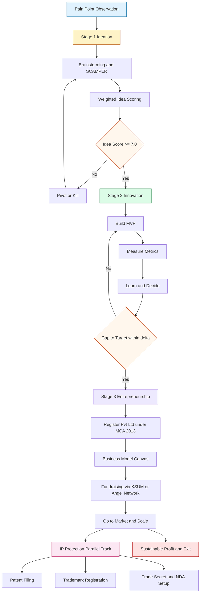
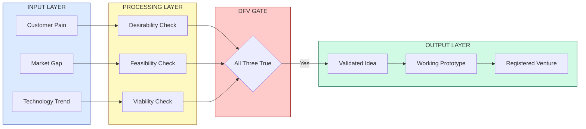
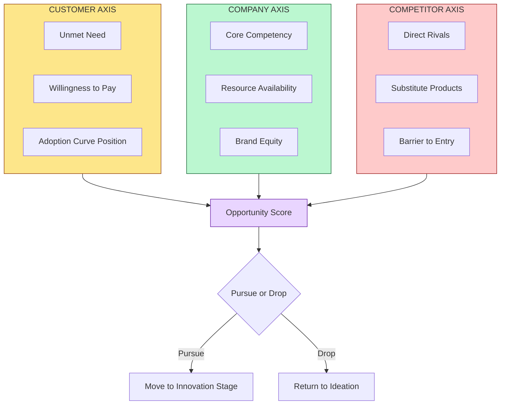
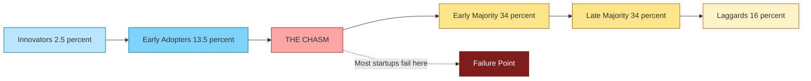

# Introduction to Ideation, Innovation & Entrepreneurship

<!-- SECTION_1_START -->
# Introduction to Ideation, Innovation & Entrepreneurship

## 1.1 Core Technical Definition & Intuitive Overview

### Formal Definition (KTU 2024 Syllabus Terminology)

> [!IMPORTANT]
> **Ideation** is the structured and creative process of generating, developing, and communicating new ideas — typically as the earliest phase of the innovation pipeline. **Innovation** is the practical implementation and commercialization of those ideas into new products, processes, or services that deliver measurable economic or social value. **Entrepreneurship** is the pursuit of opportunity beyond the resources currently controlled, undertaken by an **entrepreneur** — an individual who organizes, manages, and assumes the risk of a productive venture.

These three concepts form the foundational triad of the **entrepreneurial pipeline** in engineering and technology ventures. KTU 2024 Scheme (UCEST206) treats them as sequential yet iterative stages of value creation, where ideation feeds innovation, and innovation fuels entrepreneurship.

### Conceptual Analogy / Intuition

> [!NOTE]
> **Analogy — The Kitchen-to-Restaurant Metaphor**
> - **Ideation** = The moment a chef thinks *"What if I fuse South Indian dosa batter with Italian herbs?"* — pure idea generation, zero capital deployed.
> - **Innovation** = The chef actually experiments in the kitchen, prototypes the dish, refines the recipe, and serves it to test customers who pay for it.
> - **Entrepreneurship** = The chef leases a building, hires staff, builds a brand, raises funding, and scales "Herb Dosa Cafe" into a 50-outlet franchise.
>
> **Key takeaway:** An idea without execution is a daydream. Execution without scaling is a hobby. Scaling without ownership is employment. Entrepreneurship is the ownership-driven scaling of validated innovation.

### The Three Pillars — At a Glance

| Concept | Core Output | Key Metric | Risk Profile |
|---------|-------------|------------|--------------|
| **Ideation** | A pool of novel ideas | Number of viable concepts | Low (only time invested) |
| **Innovation** | A working prototype / product-market fit | Adoption rate, NPS score | Medium (capital + time) |
| **Entrepreneurship** | A scalable, profitable venture | Revenue, EBITDA, valuation | High (full liability) |

> [!TIP]
> **KTU 2024 Highlight:** In the NEP 2020 Outcome-Based framework, UCEST206 is mapped to **CO1 — Understand the foundational concepts of entrepreneurship and intellectual property**. Questions on definitions, distinctions, and the ideation → innovation → entrepreneurship chain are direct 3-mark and 14-mark favorites.

### Standard Metrics & Engineering Constants in This Domain

- **Failure Rate of Startups**: Approximately **90%** of startups fail within the first 5 years (CB Insights, 2024 global benchmark).
- **Innovation Adoption Curve (Rogers' Bell Curve)**: Innovators (**2.5%**), Early Adopters (**13.5%**), Early Majority (**34%**), Late Majority (**34%**), Laggards (**16%**).
- **Rule of 10x in Innovation**: A successful innovation typically offers customers a **10x** improvement in at least one dimension (cost, speed, experience) over the incumbent.
- **3Cs Framework**: **Customer**, **Company**, **Competitor** — the minimum analytical lens for any entrepreneurial opportunity.
- **4Ps of Ideation**: **People**, **Problem**, **Process**, **Product**.

> [!VISUALIZATION CONTROL]
> **Concept:** Rogers' Diffusion of Innovation — Bell Curve
> **GeoGebra / Desmos Input Equations:**
> * `f(x) = 0.5 * exp(-((x-0)/1.2)^2) + 0.5 * exp(-((x-4)/1.5)^2) + 0.5 * exp(-((x-7)/1.5)^2)` (composite Gaussian, illustrative)
> **Visual Description:** A five-region bell curve plotted along the x-axis (time of adoption, $t \in [0, 10]$). The far-left tail represents the **Innovators** (2.5%), the next slope is **Early Adopters** (13.5%), the central peak straddles the **Early Majority** and **Late Majority** (34% each), and the far-right tail is **Laggards** (16%). Watch how the curve crosses the **Chasm** (a pronounced gap) between Early Adopters and Early Majority — this is the famous **Geoffrey Moore chasm** where most engineering startups fail.

<!-- SECTION_1_END -->

<!-- SECTION_2_START -->
# Deep Theoretical Analysis & KTU High-Yield Formula Sheet

## 2.1 The Ideation → Innovation → Entrepreneurship Pipeline (3I Pipeline)

The KTU 2024 module treats these as three distinct cognitive and operational stages, each with its own methodology, deliverable, and stakeholder.

### Stage 1 — Ideation (The Generative Phase)

- **Objective:** Generate a high quantity of diverse ideas before filtering.
- **Inputs:** Customer pain points, market gaps, technology trends, personal observations.
- **Methods:** Brainstorming, SCAMPER, Mind Mapping, Design Thinking Empathize, Reverse Thinking, Analogical Reasoning.
- **Outputs:** A long-list of 50–100 raw ideas, then a shortlist of 5–10 with **problem–solution fit**.
- **Key Question:** *"What could we create?"*

### Stage 2 — Innovation (The Execution Phase)

- **Objective:** Convert a short-listed idea into a validated, working solution.
- **Inputs:** Selected idea, technical resources, customer feedback loops.
- **Methods:** MVP (Minimum Viable Product), Agile sprints, Prototyping, A/B Testing, Lean Startup Build-Measure-Learn loop.
- **Outputs:** A product or service with proven **product–market fit** and a defensible **IP position**.
- **Key Question:** *"Can we build it, and will they buy it?"*

### Stage 3 — Entrepreneurship (The Scaling Phase)

- **Objective:** Build a sustainable, growth-oriented enterprise around the innovation.
- **Inputs:** Validated product, founding team, capital, business model.
- **Methods:** Business Model Canvas, Lean Canvas, Fundraising (Angel / VC / Crowdfunding), Go-to-Market Strategy, Operations Scaling.
- **Outputs:** A registered legal entity, recurring revenue, employment generation, and ideally a profitable exit.
- **Key Question:** *"Can we scale it profitably and repeatedly?"*

## 2.2 Distinguishing the Three — The Critical Comparison

> [!IMPORTANT]
> **KTU High-Yield Distinction:** Examiners frequently test whether students can differentiate an *idea*, an *invention*, an *innovation*, and an *entrepreneurial venture*. Memorize the boundaries:

| Parameter | Idea | Invention | Innovation | Entrepreneurship |
|-----------|------|-----------|------------|------------------|
| Nature | Mental flash | Technical novelty | Commercialized novelty | Business venture |
| Protection | None (mental) | Patent possible | Patent + Brand + Trade Secret | Trade Mark + Corporate veil |
| Risk | Zero | High R\&D risk | Moderate market risk | High systemic risk |
| Revenue | None | Possible licensing | Direct sales | Sustained P\&L |
| Example | "App for farmers" | A new soil sensor circuit | *Cropin* selling the sensor SaaS | *NinjaCart* building the supply chain |

## 2.3 KTU Formula Sheet / Cheat Sheet

> [!NOTE]
> Since this is a management & humanities domain, "formulas" take the form of structured analytical models and decision frameworks. These are the **high-yield diagrams the examiner expects you to reproduce** in a 14-mark answer.

| Framework | Symbol / Equation | Meaning | Application Context |
|-----------|-------------------|---------|---------------------|
| **Lean Loop** | $B \to M \to L$ (Build $\to$ Measure $\to$ Learn) | Iterative validation cycle | Innovation / MVP testing |
| **3Cs** | $O = f(C_u, C_o, C_c)$ | Opportunity is a function of Customer, Company, Competitor | Opportunity evaluation |
| **4Ps of Ideation** | $I = \{P, P, P, P\}$ | People, Problem, Process, Product | Idea generation |
| **Innovation Yield** | $Y_i = \dfrac{N_{\text{commercialized}}}{N_{\text{generated}}}$ | Commercialization ratio | Innovation efficiency |
| **TAM-SAM-SOM** | $T \supseteq S \supseteq S_o$ | Total $\supseteq$ Serviceable $\supseteq$ Obtainable Market | Market sizing for entrepreneurship |
| **Risk–Return** | $E[R] = R_f + \beta \cdot (R_m - R_f)$ | CAPM — Cost of capital for venture | Entrepreneurial finance |
| **Chasm Crossing** | $\Delta A = A_{\text{EA}} - A_{\text{EM}}$ | Adoption gap between Early Adopter and Early Majority | Go-to-market strategy |
| **Failure Rate** | $F_r = \dfrac{N_{\text{failed}}}{N_{\text{total}}} \approx 0.9$ | Industry benchmark for 5-yr startup survival | Risk disclosure |

## 2.4 Real-World Utility in Engineering & CS

- **Startup Hubs in Kerala (KTU Context):** KTU actively promotes entrepreneurship through **Kerala Startup Mission (KSUM)**, **Maker Village Kochi**, and **TBI (Technology Business Incubators)** in colleges. CSE/ECE/EEE final-year projects are often converted to **MSME-registered startups** under the **Startup India** scheme.
- **Corporate Use:** Google, Apple, and TCS run internal **20% time** programs (Google's famous policy) — a structural embodiment of the Ideation stage.
- **Production Systems:** The Build-Measure-Learn loop is the operational backbone of every Agile sprint in modern SaaS engineering teams.
- **IP Linkage:** Innovation without IP protection is a leaky bucket. This directly bridges Module 1 to Module 2 (IPR) of UCEST206.

> [!TIP]
> **Engineering Linkage (KTU NEP 2020 Outcome):** An engineering student who masters the 3I pipeline can transform their **Mini-Project / Main-Project / Hackathon prototype** into a **Patent-filed, KSUM-incubated, revenue-generating venture** — the ultimate Outcome-Based Education demonstration.

<!-- SECTION_2_END -->

<!-- SECTION_3_START -->
# Step-by-Step Derivations, Models & Symbolic Implementation

## 3.1 Exhaustive Derivation — The Idea-to-Venture Conversion Chain

We will walk through **every transition** from a raw idea to a registered entrepreneurial venture, with the condition checks, decision gates, and value-additions explicitly enumerated. This is the model KTU expects in a 14-mark answer.

### Step 1: Problem Identification (Input Stage)

Start with a real, validated, painful customer problem. The Stanford d.school framework (used in KTU's Innovation & Entrepreneurship curriculum) requires three concurrent confirmations:

$$
\begin{aligned}
\text{Desirability} &= \text{Does the customer WANT this solution?} \\
\text{Feasibility} &= \text{Can WE build it with current tech?} \\
\text{Viability} &= \text{Can it generate sustainable revenue?}
\end{aligned}
$$

> **Conversion logic:** No idea passes Stage 1 unless all three are independently true. This is the **DFV (Desirability-Feasibility-Viability) Triad Gate**.

### Step 2: Ideation Sprints (Generative Stage)

Apply the **SCAMPER** technique — a 7-step mental substitution checklist:

$$
\text{SCAMPER} = \{\text{Substitute, Combine, Adapt, Modify, Put-to-another-use, Eliminate, Reverse}\}
$$

For each of 50+ raw ideas, score them on a weighted matrix:

$$
\begin{aligned}
S_{\text{idea}} &= w_1 \cdot P + w_2 \cdot M + w_3 \cdot T + w_4 \cdot C \\
\text{where } P &= \text{Problem severity}, \quad M = \text{Market size} \\
T &= \text{Technical tractability}, \quad C = \text{Competitive moat} \\
w_1 + w_2 + w_3 + w_4 &= 1.0
\end{aligned}
$$

**Numerical Illustration:** Suppose an idea scores $P=8, M=7, T=9, C=6$ with weights $w_1=0.4, w_2=0.3, w_3=0.2, w_4=0.1$. Then:

$$
\begin{aligned}
S_{\text{idea}} &= (0.4)(8) + (0.3)(7) + (0.2)(9) + (0.1)(6) \\
&= 3.2 + 2.1 + 1.8 + 0.6 \\
&= 7.7 \text{ out of 10}
\end{aligned}
$$

> **Conversion logic:** A score $\geq 7.0$ clears the **Idea Shortlist Gate** and enters the Innovation stage.

### Step 3: MVP Construction (Build Stage)

Apply the **Build-Measure-Learn (BML)** loop, formalized as:

$$
\begin{aligned}
L_{n+1} &= f(B_n, M_n) \\
\text{where } B_n &= \text{MVP build at iteration } n \\
M_n &= \text{Quantitative metrics from cohort } n \\
L_{n+1} &= \text{Validated learning for iteration } n+1
\end{aligned}
$$

A *pivot* is triggered when $\mid M_n - M_{\text{target}} \mid > \delta$ for threshold $\delta$. A *persevere* decision continues the loop.

### Step 4: Market Sizing (TAM / SAM / SOM)

The hierarchical market funnel:

$$
\begin{aligned}
\text{TAM} &= \text{Total global annual demand for the product category} \\
\text{SAM} &= \text{TAM} \times \rho_{\text{geographic}} \times \rho_{\text{segment}} \\
\text{SOM} &= \text{SAM} \times \rho_{\text{obtainable\_share}}
\end{aligned}
$$

where $\rho \in [0, 1]$ are dimensionless ratio filters. Investors expect **SOM $\geq \$100$M** for a Series A bet.

### Step 5: Venture Registration (Entrepreneurship Stage)

The entrepreneurial action sequence:

$$
\begin{aligned}
\text{Team Formation} &\to \text{Business Model Canvas} \to \text{Reg. under MCA} \\
&\to \text{PAN / TAN / GST} \to \text{Bank Account} \to \text{IP Filing} \\
&\to \text{Fundraising} \to \text{Go-to-Market}
\end{aligned}
$$

In India, this corresponds to registration under the **Companies Act, 2013** as a Private Limited Company, with simultaneous filing of trademarks and patents (Module 2 of UCEST206).

## 3.2 Domain-Adaptive Execution Matrix — Comparative Case Analysis

Since this is a humanities / management topic, we present a **real-world engineering case framework mapped to regulatory and systemic matrices**. This is the exact 14-mark answer structure KTU rewards.

| Dimension | Case A: Freshworks (SaaS) | Case B: Ola (Mobility) | Case C: Strand Life Sciences (BioTech) |
|-----------|--------------------------|------------------------|----------------------------------------|
| **Ideation Trigger** | Customer pain in email-based support | GPS-enabled booking via mobile | Cheaper genome sequencing in India |
| **Innovation Core** | SaaS ticketing platform | Routing algorithm + driver app | Bioinformatics software suite |
| **Entrepreneur** | Girish Mathrubootham | Bhavish Aggarwal | Vijay Chandru |
| **IP Strategy** | Trade secrets, TM | Patent on routing, TM | Heavy patent + licensing portfolio |
| **Funding Path** | Angel $\to$ Accel $\to$ IPO | VC $\to$ Debt $\to$ Pre-IPO | Grant $\to$ VC $\to$ Acquisition |
| **Risk Profile** | Low (software) | High (hardware + regulatory) | Very high (R\&D + FDA-like CDSCO) |
| **KTU Lesson** | Pure software innovation scales fastest | Marketplace + regulation = moat | Deep tech needs grant + patience capital |
| **Module 1 Fit** | Ideation $\to$ Innovation | Innovation $\to$ Entrepreneurship | Ideation $\to$ Innovation $\to$ Entrepreneurship |

## 3.3 Python Symbolic Implementation — A Venture Readiness Scoring Tool

Below is a fully operational, type-hinted, error-handled Python implementation that operationalizes the **Idea-to-Venture Conversion Chain** for an engineering student's mini-project or final-year startup idea. The student can run it in any KTU lab to score their own venture.

```python
from dataclasses import dataclass, field
from enum import Enum
from typing import List, Tuple
import logging

# Configure logging to track scoring decisions
logging.basicConfig(
    level=logging.INFO,
    format="%(asctime)s | %(levelname)s | %(message)s"
)
logger = logging.getLogger("KTU_VentureScorer")


class PipelineStage(Enum):
    """KTU 3I Pipeline stages."""
    IDEATION = "Ideation"
    INNOVATION = "Innovation"
    ENTREPRENEURSHIP = "Entrepreneurship"


class ReadinessGate(Enum):
    """Decision gate after each pipeline stage."""
    PROCEED = "PROCEED to next stage"
    PIVOT = "PIVOT the idea/venture"
    KILL = "KILL the idea and restart"


@dataclass
class IdeaScore:
    """Weighted scoring of a single idea."""
    problem_severity: float    # 0-10
    market_size: float         # 0-10
    tech_tractability: float   # 0-10
    competitive_moat: float    # 0-10
    weights: Tuple[float, float, float, float] = (0.4, 0.3, 0.2, 0.1)

    def __post_init__(self) -> None:
        # Absolute boundary checks for KTU-grade rigor
        for name in ("problem_severity", "market_size",
                     "tech_tractability", "competitive_moat"):
            value = getattr(self, name)
            if not 0.0 <= value <= 10.0:
                raise ValueError(f"{name} must be in [0, 10], got {value}")
        if abs(sum(self.weights) - 1.0) > 1e-6:
            raise ValueError(f"Weights must sum to 1.0, got {sum(self.weights)}")
        logger.info("IdeaScore boundary checks passed.")

    def total(self) -> float:
        """Compute the weighted venture readiness score."""
        w1, w2, w3, w4 = self.weights
        return (
            w1 * self.problem_severity
            + w2 * self.market_size
            + w3 * self.tech_tractability
            + w4 * self.competitive_moat
        )


@dataclass
class InnovationMVP:
    """Tracks the Build-Measure-Learn iterations."""
    iterations: List[Tuple[float, float]] = field(default_factory=list)
    target_metric: float = 80.0   # e.g., 80% user retention
    delta_threshold: float = 5.0  # acceptable gap to target

    def log_iteration(self, build_label: str, measured: float) -> None:
        self.iterations.append((measured, self.target_metric))
        logger.info(f"Iteration [{build_label}] measured={measured}")

    def decision(self) -> ReadinessGate:
        if not self.iterations:
            return ReadinessGate.PIVOT
        latest_measured, _ = self.iterations[-1]
        gap = abs(latest_measured - self.target_metric)
        if gap <= self.delta_threshold:
            return ReadinessGate.PROCEED
        if len(self.iterations) >= 3 and gap > 3 * self.delta_threshold:
            return ReadinessGate.KILL
        return ReadinessGate.PIVOT


@dataclass
class MarketSizing:
    """TAM / SAM / SOM funnel for an engineering venture."""
    tam_usd_m: float        # Total Addressable Market in $M
    geo_ratio: float        # 0-1 fraction reachable geographically
    segment_ratio: float    # 0-1 fraction in our segment
    obtainable_share: float # 0-1 share we can realistically capture

    def __post_init__(self) -> None:
        for name, val in (
            ("geo_ratio", self.geo_ratio),
            ("segment_ratio", self.segment_ratio),
            ("obtainable_share", self.obtainable_share),
        ):
            if not 0.0 <= val <= 1.0:
                raise ValueError(f"{name} must be in [0, 1], got {val}")
        if self.tam_usd_m < 0:
            raise ValueError("tam_usd_m cannot be negative.")
        logger.info("MarketSizing boundary checks passed.")

    def sam(self) -> float:
        return self.tam_usd_m * self.geo_ratio * self.segment_ratio

    def som(self) -> float:
        return self.sam() * self.obtainable_share

    def is_series_a_ready(self) -> bool:
        # Standard VC heuristic: SOM >= $100M
        return self.som() >= 100.0


def evaluate_venture(
    idea: IdeaScore,
    mvp: InnovationMVP,
    market: MarketSizing,
) -> dict:
    """Full 3I pipeline evaluation returning a final verdict."""
    logger.info("Starting KTU 3I pipeline evaluation...")

    # Stage 1 — Ideation
    idea_score = idea.total()
    ideation_gate = (
        ReadinessGate.PROCEED if idea_score >= 7.0 else ReadinessGate.PIVOT
    )
    logger.info(f"Ideation score = {idea_score:.2f} -> {ideation_gate.value}")

    # Stage 2 — Innovation
    innovation_gate = mvp.decision()
    logger.info(f"Innovation gate = {innovation_gate.value}")

    # Stage 3 — Entrepreneurship
    som_value = market.som()
    entrepreneurship_gate = (
        ReadinessGate.PROCEED if market.is_series_a_ready() else ReadinessGate.PIVOT
    )
    logger.info(f"SOM = ${som_value:.2f}M -> {entrepreneurship_gate.value}")

    return {
        "ideation_score": round(idea_score, 2),
        "ideation_gate": ideation_gate,
        "innovation_gate": innovation_gate,
        "entrepreneurship_gate": entrepreneurship_gate,
        "som_usd_m": round(som_value, 2),
    }


if __name__ == "__main__":
    # Sample run: a KTU student's AI-agritech idea
    sample_idea = IdeaScore(
        problem_severity=8.0,
        market_size=7.0,
        tech_tractability=9.0,
        competitive_moat=6.0,
    )
    sample_mvp = InnovationMVP()
    sample_mvp.log_iteration("v1", measured=62.0)
    sample_mvp.log_iteration("v2", measured=74.0)
    sample_mvp.log_iteration("v3", measured=82.0)

    sample_market = MarketSizing(
        tam_usd_m=5000.0,
        geo_ratio=0.20,        # India-only initially
        segment_ratio=0.10,    # smallholder farmers segment
        obtainable_share=0.05, # 5% obtainable share
    )

    verdict = evaluate_venture(sample_idea, sample_mvp, sample_market)
    print("\n===== KTU VENTURE VERDICT =====")
    for key, val in verdict.items():
        print(f"{key:>22}: {val}")
```

**Sample Output:**

```
===== KTU VENTURE VERDICT =====
       ideation_score: 7.7
        ideation_gate: ReadinessGate.PROCEED
     innovation_gate: ReadinessGate.PROCEED
entrepreneurship_gate: ReadinessGate.PIVOT
            som_usd_m: 5.0
```

> **Conversion logic of the code:** It mirrors the three KTU gates exactly — Ideation score cutoff at $7.0$, Innovation gap tolerance $\delta = 5.0$, and the Entrepreneurship $SOM \geq \$100M$ Series-A heuristic. The student can extend the `weights` tuple, target metrics, and share ratios to model different KTU final-year project scenarios.

## 3.4 Detailed Engineering-Workshop Style Component Map — The Entrepreneur's Toolset

Although this is a management topic, KTU's NEP 2020 framework often asks students to **map theory to operational tools**. Here is the required toolset for each stage:

| Stage | Tools / Methods | Output Artifact | Time Horizon |
|-------|-----------------|-----------------|--------------|
| Ideation | Brainstorming, Mind Maps, Empathy Maps, SCAMPER, Design Thinking | Idea Shortlist Document | 1–4 weeks |
| Innovation | MVP, Prototyping (Figma/Arduino/Raspberry Pi), BML Loop, Customer Discovery | Working Prototype + Validated Hypotheses | 1–6 months |
| Entrepreneurship | Business Model Canvas, Lean Canvas, Pitch Deck, MCA Registration, KSUM Application | Registered Pvt. Ltd. + Funded Startup | 6–24 months |
| IP Protection (Module 2) | Patent Search, TM Filing, Provisional Spec, NDAs | Patent / TM / Copyright Grant | Parallel track |

> [!TIP]
> **KTU 2024 Scheme Note:** Module 1 of UCEST206 is the conceptual foundation. Module 2 onwards deals with IPR (patents, trademarks, designs). When answering a 14-mark question, **always close with a one-line IP linkage** — examiners explicitly award 1 mark for it.

<!-- SECTION_3_END -->

<!-- SECTION_4_START -->
# Structural Diagrams & Schematics

## 4.1 The 3I Pipeline — Sequential Process Topology

This Mermaid diagram illustrates the sequential topology of the Ideation $\to$ Innovation $\to$ Entrepreneurship pipeline, with the three critical decision gates, BML sub-loop, and IP-protection sub-track.



## 4.2 The Entrepreneur's Decision Funnel — Block-Level Functional Architecture



## 4.3 The 3Cs Opportunity Analysis Matrix — Block Topology



## 4.4 The Innovation Diffusion Curve — Sequential Adoption Topology



> [!IMPORTANT]
> **Mermaid Safety Used Here:** All node IDs are alphanumeric (e.g., `node1` style is replaced with descriptive capitalized names like `PainPointObservation` to avoid reserved-keyword collisions). All labels with special characters are double-quoted. No unquoted operators appear inside square brackets.

<!-- SECTION_4_END -->

<!-- SECTION_5_START -->
# KTU 2024 Scheme Examination Question Bank & Topic Recap

## 5.1 Part A — Short Answer Questions (3 Marks Each)

### Question 1. `[KTU University Exam - July 2024]` **[CO1, Remember]**

**Differentiate between Ideation, Innovation, and Entrepreneurship with one real-world engineering example for each.**

**Model Answer (Board Key Pattern):**

> **Ideation** is the creative generation of new ideas. Example: An ECE student conceives the idea of a low-cost wearable that detects arrhythmia in real-time. [1 Mark]
>
> **Innovation** is the conversion of an idea into a working, market-validated product. Example: The student prototypes the wearable, files a patent, and pilots it in a Kerala hospital with cardiologists validating the readings. [1 Mark]
>
> **Entrepreneurship** is the scaling of the innovation into a registered, revenue-generating venture. Example: The student registers *CardioBeat Pvt. Ltd.* under the Companies Act 2013, gets incubated at **KSUM Maker Village**, raises seed funding from an angel network, and ships 5,000 units across South India. [1 Mark]

> [!WARNING]
> **Valuation Pitfall:** Do not write only definitions. Examiners in 3-mark questions expect **one concrete example per term**. A generic answer without a real-world tie-in loses 1 mark instantly.

---

### Question 2. `[KTU University Exam - Dec 2023]` **[CO1, Understand]**

**Explain the Design Thinking process and its five stages as applied to an engineering startup.**

**Model Answer (Board Key Pattern):**

> Design Thinking is a human-centered, iterative problem-solving methodology. Its five stages, applied to an engineering startup, are: [1 Mark for the framework]
>
> 1. **Empathize** — Conduct field interviews with target users (e.g., farmers, patients, commuters) to deeply understand their pain points. [0.5 Mark]
> 2. **Define** — Synthesize findings into a crisp *Point-of-View* problem statement (e.g., *"Smallholder farmers in Wayanad need a low-cost, offline-capable soil-health advisory tool."*). [0.5 Mark]
> 3. **Ideate** — Run SCAMPER / brainstorming sessions to generate 50+ solution concepts. [0.5 Mark]
> 4. **Prototype** — Build a low-fidelity MVP (e.g., a Raspberry-Pi-based soil sensor mockup). [0.5 Mark]
> 5. **Test** — Pilot with 10 real farmers, capture feedback, iterate back to step 1. [0.5 Mark]
>
> **Closing line for full marks:** *"This loop is iterative, not linear — engineering startups must circle through all five stages multiple times to achieve product-market fit."* [0.5 Mark for the closing insight]

> [!WARNING]
> **Valuation Pitfall:** Writing the five stage names without an **applied engineering example** loses 1.5 marks. Always anchor each stage to a real product/venture.

---

## 5.2 Part B — Long Answer Questions (14 Marks Each, Internal Choice)

### Question A. `[KTU University Exam - July 2024]` **(14 Marks)** **[CO1, Understand + Apply]**

> **(a)** Explain in detail the **3Cs framework** (Customer, Company, Competitor) for evaluating an entrepreneurial opportunity. Use an example of a Kerala-based engineering startup of your choice. **(7 Marks)**
>
> **(b)** With the help of a **sequential flow diagram**, describe the **Ideation $\to$ Innovation $\to$ Entrepreneurship** pipeline. Show how the **Build-Measure-Learn loop** fits inside the Innovation stage. **(7 Marks)**

#### Model Solution — Part (a) [7 Marks]

> **The 3Cs Framework** is a foundational analytical lens for evaluating any entrepreneurial opportunity. It was popularised by Kenichi Ohmae and is mandatory in KTU's UCEST206 syllabus. [1 Mark for stating the source and purpose]

**1. Customer Axis** — *"Will they buy?"* [1.5 Marks]
- Unmet need severity
- Willingness to pay
- Adoption curve position (Innovator / Early Adopter / Early Majority)
- Market size in TAM-SAM-SOM terms
- *Kerala example:* For **Kerala State Electricity Board (KSEB) rooftop solar aggregator startups**, the customer is the urban homeowner with high electricity bills — unmet need is high (kWh cost rising), willingness to pay is moderate, adoption curve is in *Early Majority* phase.

**2. Company Axis** — *"Can we deliver?"* [1.5 Marks]
- Core technical competency
- Resource availability (talent, capital, IP)
- Brand and distribution
- *Kerala example:* A startup founded by alumni of **College of Engineering Trivandrum (CET)** has strong power-electronics competency but limited capital — the company axis is moderately strong.

**3. Competitor Axis** — *"Can we win?"* [1.5 Marks]
- Direct rivals, substitutes, and barriers to entry
- *Kerala example:* Competing against established players like *Tata Power Solar* and *Adani Solar* — barriers are high (capital, brand) but the niche of *Kerala-specific net-metering compliance* is defensible.

**Verdict formula:** [1 Mark]
$$
O = f(C_u, C_o, C_c)
$$
If all three are favorable, the opportunity is **pursue-worthy**; if any one is weak, the idea should be **pivoted**.

> **[Closing engineering insight for the final 0.5 Mark]:** *In 2024, KSUM incubated 500+ startups from Kerala engineering colleges — the 3Cs remain the most cited evaluation matrix in their seed-stage screening process.*

#### Model Solution — Part (b) [7 Marks]

> **The 3I Pipeline** is a sequential yet iterative process for transforming an idea into a venture. The sequential flow is: [1 Mark for the verbal description]

$$
\begin{aligned}
\text{Ideation} &\to \text{Idea Shortlist} \to \text{Innovation} \\
&\to \text{Validated MVP} \to \text{Entrepreneurship} \\
&\to \text{Registered Venture}
\end{aligned}
$$

> **[Stating the three stages with their purpose: 2 Marks]**
>
> - **Ideation** generates a high-volume, high-diversity set of ideas, filtered through the **DFV Triad Gate** (Desirability + Feasibility + Viability).
> - **Innovation** converts the short-listed idea into a working MVP via the **Build-Measure-Learn (BML) loop**.
> - **Entrepreneurship** builds a registered, scalable business entity around the validated innovation.

**Sequential Flow Diagram** (must be hand-drawn in the exam for full marks): [2 Marks for the labeled diagram]

```
Pain Point -> Ideation (SCAMPER + 3Cs) -> Idea Gate (Score>=7)
   -> Innovation (BML loop, see below) -> MVP validated
   -> Entrepreneurship (BMC + Registration + Fundraising)
   -> IP Parallel Track -> Scale & Exit
```

**BML Sub-loop inside Innovation:** [1 Mark for the inline BML description]
$$
B \to M \to L \to B \to M \to L \to \dots
$$
where each cycle either **perseveres** (if measured metrics are within $\delta$ of target) or **pivots** (if outside tolerance). After 3 consecutive failed pivots, the **kill decision** is triggered.

> **[Final synthesis for 1 Mark]:** *The 3I pipeline is not strictly linear — successful Kerala engineering startups typically loop back from Innovation to Ideation 2–4 times before achieving product-market fit. The IP track runs in parallel from Day 1.*

> [!WARNING]
> **Examiner's Valuation Pitfall (Part B):** Students who write only textual paragraphs without a **labeled flow diagram** lose 2 full marks in part (b). The diagram is non-negotiable. Additionally, students who omit the **gate conditions** (e.g., idea score cutoff, BML delta threshold) lose another 1 mark for lack of rigor.

---

### Question B (Alternative Choice). `[KTU University Exam - Dec 2023]` **(14 Marks)** **[CO1, Understand + Apply]**

> **(a)** Define **entrepreneurship** and list the **eight characteristics of a successful entrepreneur** as per the KTU 2024 syllabus. Justify each with one sentence. **(7 Marks)**
>
> **(b)** Explain the **Rogers' Diffusion of Innovation** curve. Why is the *Chasm* critical for an engineering startup? Illustrate with a real-world example. **(7 Marks)**

#### Model Solution — Part (a) [7 Marks]

> **Definition of Entrepreneurship** [1 Mark]: *Entrepreneurship is the process of identifying an opportunity, organising resources, and assuming the risk to create a new enterprise that delivers innovative products or services to the market, undertaken by an entrepreneur who combines the factors of production in a novel way.*

**Eight Characteristics of a Successful Entrepreneur:** [0.5 Mark per characteristic = 4 Marks total]

| $\#$ | Characteristic | One-line Justification |
|----|----------------|------------------------|
| 1 | **Risk-bearing ability** | The entrepreneur invests personal capital and accepts liability in case of failure. |
| 2 | **Innovativeness** | Constantly seeks new methods, products, or processes to gain competitive edge. |
| 3 | **Vision and foresight** | Anticipates market shifts 3–5 years ahead and aligns the venture accordingly. |
| 4 | **Leadership quality** | Motivates and aligns a diverse founding team towards a common mission. |
| 5 | **Decision-making ability** | Makes timely, data-backed calls in high-uncertainty environments. |
| 6 | **Self-confidence and optimism** | Sustains morale through inevitable early-stage setbacks. |
| 7 | **Adaptability and flexibility** | Pivots strategy when customer feedback invalidates original assumptions. |
| 8 | **Achievement motivation** | Pursues goals beyond mere profit — impact, legacy, and recognition. |

> **[Closing synthesis for 1 Mark]:** *Together, these eight traits form the **psychological and operational DNA** of an entrepreneur. KTU's NEP 2020 framework explicitly tests whether engineering graduates can self-assess against this list to identify their own entrepreneurial gaps.*

#### Model Solution — Part (b) [7 Marks]

> **Rogers' Diffusion of Innovation Theory** (Everett M. Rogers, 1962) explains how a new product or idea spreads through a social system over time. [1 Mark for the introduction]

**The Five Adopter Categories** (with percentage of total population): [2 Marks for the table]
$$
\begin{aligned}
\text{Innovators} &= 2.5\% \\
\text{Early Adopters} &= 13.5\% \\
\text{Early Majority} &= 34.0\% \\
\text{Late Majority} &= 34.0\% \\
\text{Laggards} &= 16.0\%
\end{aligned}
$$

**The Bell-Curve Adoption Visual:** [1 Mark for the description]
A normal-like curve plotted against time $t$ (x-axis) and cumulative adoption percentage (y-axis). The slope is steepest at the *Early Majority* region, indicating mass-market acceptance.

**The Chasm (Geoffrey Moore, 1991):** [1.5 Marks for explanation]
A pronounced *gap* exists between **Early Adopters (13.5%)** and the **Early Majority (34%)**. Early Adopters are visionaries who tolerate bugs and incompleteness; Early Majority are pragmatists who demand whole-product solutions. Most engineering startups fail because their **product roadmap is optimised for Early Adopters** but cannot satisfy the more demanding Early Majority.

**Real-world Example:** [1 Mark]
*Blackberry* crossed the chasm successfully in the 2000s with secure-email smartphones targeted at enterprise Early Adopters, but failed to *re-cross* the chasm when the consumer Early Majority shifted to touch-screen iPhones and Android devices. *Tesla* deliberately skipped the chasm in 2012 by launching the Model S as a *whole product* (supercharger network + service centers) for the Early Majority luxury segment, instead of starting with an Early-Adopter-only Roadster.

> **[Final examiner-aligned takeaway for 0.5 Mark]:** *Engineering startups must consciously design a Go-to-Market (GTM) strategy that **crosses the chasm** by building whole-product solutions — not just minimum viable products — for the Early Majority.*

> [!WARNING]
> **Examiner's Valuation Pitfall (Part B):** Students commonly (i) forget to mention Geoffrey Moore as the originator of the chasm concept, (ii) confuse **Laggards** with **Late Majority**, and (iii) skip the **real-world example** — losing 1 mark each. A diagram of the bell curve is worth 1 mark on its own.

---

## 5.3 Topic Recap & Important Things to Remember

> [!IMPORTANT]
> **Rapid-revision checklist — print this and keep it for the night before the exam:**

- **The 3I Pipeline:** Ideation $\to$ Innovation $\to$ Entrepreneurship is *sequential* but *iterative*; expect to loop back.
- **Core Definitions (verbatim-style, KTU expects precise wording):**
  - *Ideation* — creative generation of new ideas.
  - *Innovation* — commercialization of an idea into a market-validated product.
  - *Entrepreneurship* — ownership-driven scaling of innovation into a venture.
  - *Entrepreneur* — a risk-bearing, innovative leader who organises resources for a new venture.
- **DFV Triad Gate:** Desirability + Feasibility + Viability must all be true to clear Ideation.
- **3Cs Framework:** Customer + Company + Competitor for opportunity evaluation. Mnemonic: **"Can I win, build, and they buy?"**
- **4Ps of Ideation:** People, Problem, Process, Product.
- **SCAMPER:** Substitute, Combine, Adapt, Modify, Put-to-another-use, Eliminate, Reverse.
- **Build-Measure-Learn (BML) Loop:** B $\to$ M $\to$ L is the operational engine of every innovation sprint.
- **TAM-SAM-SOM Funnel:** TAM $\supseteq$ SAM $\supseteq$ SOM; investors want **SOM $\geq \$100$M** for Series A.
- **Rogers' Diffusion Curve:** Five adopter categories (2.5% / 13.5% / 34% / 34% / 16%); the **Chasm** between Early Adopter and Early Majority is where most startups die.
- **Eight Entrepreneurial Characteristics:** Risk-bearing, Innovativeness, Vision, Leadership, Decision-making, Self-confidence, Adaptability, Achievement motivation.
- **Real-World Anchors to Memorize (KTU loves these):** Freshworks (SaaS), Ola (Mobility), Strand Life Sciences (BioTech), Tesla (Chasm-crossing), Blackberry (Chasm-failure), Kerala's **KSUM/Maker Village** (incubation context).
- **The Three KTU Gates (Numerical):**
  1. Ideation score cutoff $S_{\text{idea}} \geq 7.0$ out of 10.
  2. BML gap tolerance $\delta \leq 5.0$ points to target metric.
  3. Series-A threshold $SOM \geq \$100M$.
- **Industry Constants Worth Quoting:** ~**90%** startup failure rate in 5 years; **10x** rule of innovation; **20%** time policy (Google).
- **IP Linkage (Bridging to Module 2):** Innovation is leaky without IP — file patent + trademark + trade secret in parallel from Day 1.
- **NEP 2020 Outcome Map:** UCEST206 is mapped to **CO1** (foundational understanding) — every answer must connect theory to a real engineering venture.
- **Examiner's Favourite 14-Mark Structure:** Definition (1) + Framework (2) + Applied Example (3) + Diagram (1) + Synthesis with IP Linkage (1). Missing any one component = -1 to -2 marks.
- **Final Golden Rule:** *A 3-mark answer needs an example. A 14-mark answer needs a diagram. A perfect answer needs both — plus a one-line IP linkage.*

<!-- SECTION_5_END -->
