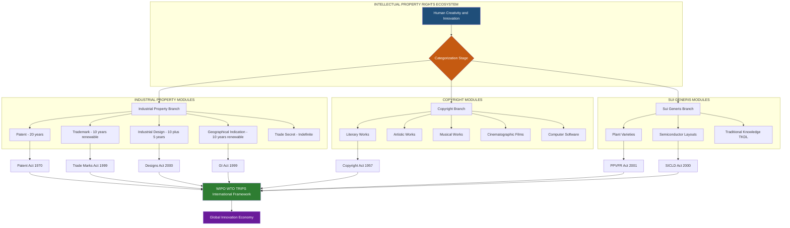

# Introduction to Intellectual Property Rights (IPR)

<!-- SECTION_1_START -->
# 1. Core Technical Definition & Intuitive Overview

## 1.1 Formal Academic Definition

> [!NOTE]
> **Intellectual Property Rights (IPR)** are the legally recognized exclusive rights granted to creators, inventors, and owners of original works, inventions, designs, and intangible creations arising from human intellect, creativity, and innovation. These rights enable the right-holder to control, commercialize, and benefit economically from the use of their intangible assets for a defined statutory period.

According to the **World Intellectual Property Organization (WIPO)**, Intellectual Property refers to the creations of the **mind** — inventions, literary and artistic works, designs, and symbols, names, and images used in commerce. IPR provides the legal scaffold that converts ephemeral human creativity into a tradable, enforceable, and protected economic asset.

The foundational statutory framework governing IPR globally is anchored by the **Trade-Related Aspects of Intellectual Property Rights (TRIPS) Agreement, 1994**, administered under the **World Trade Organization (WTO)**. In India, the IP regime operates through a **strong, codified legal infrastructure** comprising the **Patents Act, 1970**, the **Copyright Act, 1957**, the **Trade Marks Act, 1999**, the **Designs Act, 2000**, the **Geographical Indications of Goods (Registration and Protection) Act, 1999**, and the **Protection of Plant Varieties and Farmers' Rights Act, 2001**.

## 1.2 Conceptual Analogy & Intuitive Understanding

> [!IMPORTANT]
> **Intuitive Picture — "The Invisible Fence around Your Idea"**
>
> Imagine you plant a beautiful, unique mango tree in your backyard after years of effort. Naturally, the fruits belong to you. Now extend this idea to the *intangible world* — if you spend 5 years inventing a new type of solar cell, that invention is *your* creation. But unlike the mango tree, ideas can be **copied by anyone, anywhere, instantly**, without your knowledge. **IPR is the legal fence** you build around that creation, telling the world: *"You may look, you may admire, but to use, copy, or sell — you must ask me, and typically pay me."*

In engineering terms, IPR functions like a **proprietary software license** wrapped around physical creativity — it does not stop others from *seeing* your invention, but it legally prohibits them from *exploiting* it without authorization. Without IPR, innovation would be a **tragedy of the commons**, where every creator is disincentivized because competitors could free-ride on their R\&D investments.

## 1.3 The Three Pillars of Intellectual Property

Intellectual property is conventionally divided into three foundational pillars, each addressing a distinct category of human creative output:

| Pillar | Domain of Protection | Typical Asset | Example |
|:---|:---|:---|:---|
| **Industrial Property** | Inventions, industrial designs, brands, commercial identifiers | Patents, Trademarks, Industrial Designs, GI | Apple Inc. logo, Coca-Cola bottle shape |
| **Copyright** | Literary, artistic, musical, cinematographic, software | Books, films, code, paintings | A KTU textbook, a Bollywood film |
| **Sui Generis Rights** | Specialized categories needing custom protection | Plant varieties, semiconductor layouts, traditional knowledge | Basmati rice GI, chip layout designs |

## 1.4 Why IPR Exists — The Engineering Rationale

> [!TIP]
> **The Three Core Justifications for Strong IP Regimes:**
> 1. **Incentive to Innovate** — Without protection, the private cost of R\&D would outweigh the private return, since competitors could instantly copy the outcome. IP restores the economic balance.
> 2. **Disclosure Encouragement** — Patents require full public disclosure of the invention. This trades *temporary exclusivity* for *permanent public knowledge*, accelerating cumulative innovation.
> 3. **Market Certainty** — Investors and venture capitalists fund startups only when the underlying IP is legally defensible. A strong IP regime underpins the entire **startup and deep-tech economy**.

> [!WARNING]
> **Common Student Misconception:**
> IPR is *not* a "natural right" or "moral right of the creator" alone. It is a **state-granted statutory monopoly** with a finite life. Once the statutory period expires (e.g., 20 years for patents), the creation enters the **public domain** for unrestricted use by society.

## 1.5 GeoGebra / Visualization Integration

> [!VISUALIZATION CONTROL]
> **Concept:** Lifecycle of an Intellectual Property Asset (Patent Example)
> **Desmos Input Equations:**
> * `y = 100` (Horizontal line representing maximum market exclusivity value)
> * `y = 0` (Public domain baseline)
> * `y = 100 * e^(-0.05(x-1))` for `1 ≤ x ≤ 20` (Steep decay of competitive advantage once granted)
> * `x = 0` → `x = 1` : Pre-filing R\&D phase (no legal protection)
> * `x = 1` → `x = 20` : Statutory protection window
> * `x ≥ 20` : Public domain access
> **Visual Description:** The student should observe a flat plateau of legal exclusivity from filing to grant, followed by an exponential decay of market monopoly power as the expiry date approaches, eventually falling to the public-domain baseline at year 20.
<!-- SECTION_1_END -->

<!-- SECTION_2_START -->
# 2. Deep Theoretical Analysis & KTU High-Yield Formula Sheet

## 2.1 The Theoretical Foundation of IPR

The philosophical basis of IPR rests on the **labor theory of property** articulated by John Locke, extended to intellectual creations. The modern legal theory, however, is grounded in **utilitarian economics** — IP is justified because it maximizes *total social welfare* by incentivizing optimal levels of innovation, even though it temporarily restricts access.

The economic value of an IP asset can be expressed through the following conceptual relationship:

$$
V_{IP} \;=\; \sum_{t=1}^{n} \frac{R_t \cdot M_t}{(1+r)^t} \;-\; C_{R\&D} \;-\; C_{IP}
$$

Where:
* $V_{IP}$ = Net present value of the intellectual property asset
* $R_t$ = Expected revenue in year $t$
* $M_t$ = Market share secured by IP protection in year $t$
* $r$ = Discount rate (typically the WACC of the firm)
* $n$ = Statutory protection period (e.g., 20 years for patents)
* $C_{R\&D}$ = Cumulative R\&D expenditure
* $C_{IP}$ = Cost of obtaining and enforcing IP rights (filing, attorney, litigation)

> [!NOTE]
> **Key Insight:** The economic value of an IP asset is directly proportional to the *enforceability* of the right. In jurisdictions with weak IP enforcement, $V_{IP}$ collapses even if a patent is technically granted, because $M_t \rightarrow 0$ as competitors infringe without consequence.

## 2.2 Hierarchical Classification of Intellectual Property Rights

The structure of IPR is best understood as a **nested hierarchy** with overlapping protections:

* **Industrial Property**
  * **Patent** — Protects new, useful, and non-obvious inventions (process, product, or improvement) for **20 years** from the date of filing.
  * **Industrial Design** — Protects the visual/aesthetic appearance of an article (shape, configuration, pattern, ornament) for **10 years**, extendable by 5 years.
  * **Trademark** — Protects distinctive marks, logos, words, or combinations identifying the source of goods/services. Renewable indefinitely every **10 years**.
  * **Geographical Indication (GI)** — Protects goods originating from a specific region possessing qualities/reputation essentially attributable to that origin (e.g., Darjeeling Tea, Kancheepuram Silk). Protected for **10 years**, renewable.
  * **Trade Secret** — Protects confidential business information (formulas, processes, customer lists) of indefinite duration, provided secrecy is maintained.
* **Copyright and Related Rights**
  * **Copyright** — Protects original literary, dramatic, musical, and artistic works for the **lifetime of the author plus 60 years**. Computer software is explicitly protected under the Copyright Act, 1957.
  * **Related Rights** — Rights of performers, producers of phonograms, and broadcasting organizations.
* **Sui Generis / Specialized IP**
  * **Plant Varieties Protection** — Under the PPV\&FR Act, 2001.
  * **Semiconductor Integrated Circuit Layout Design** — Under the Semiconductor IC Layout Design Act, 2000.
  * **Traditional Knowledge** — Protected under the **Traditional Knowledge Digital Library (TKDL)** initiative of India.

## 2.3 KTU High-Yield Formula Sheet

> [!IMPORTANT]
> **Consolidated Reference Table for KTU 2024 Scheme Examinations**

| IP Right | Statutory Duration | Renewable | Key Indian Statute | International Treaty |
|:---|:---|:---|:---|:---|
| Patent | **20 years** from filing date | No | Patents Act, 1970 | PCT, Paris Convention |
| Trademark | **10 years** per registration | Yes, indefinitely | Trade Marks Act, 1999 | Madrid Protocol, Nice Classification |
| Copyright | **Life of author + 60 years** | No | Copyright Act, 1957 | Berne Convention, WCT |
| Industrial Design | **10 years** + 5 years extension | One-time extension | Designs Act, 2000 | Hague Agreement |
| Geographical Indication | **10 years** | Yes, indefinitely | GI Act, 1999 | Lisbon Agreement |
| Plant Variety | **15-18 years** (crop-dependent) | No | PPV\&FR Act, 2001 | UPOV Convention |
| Semiconductor Layout | **10 years** | No | SICLD Act, 2000 | IPIC Treaty |
| Trade Secret | **Indefinite** (subject to secrecy) | N/A | Common law / Contract | TRIPS Article 39 |

## 2.4 The Global IP Architecture

The international IP framework operates through a tiered system of treaties and organizations:

* **WIPO (World Intellectual Property Organization)** — Established 1967, a UN specialized agency headquartered in Geneva. Administers 26 international IP treaties.
* **WTO-TRIPS Agreement (1994)** — Sets the **minimum standards** of IP protection for all 164+ member nations. India became TRIPS-compliant through legislative amendments in 2005 (product patents in pharmaceuticals).
* **Paris Convention (1883)** — Provides *national treatment* and *right of priority* for patents, trademarks, and industrial designs.
* **Berne Convention (1886)** — Provides automatic copyright protection across member countries without formal registration.
* **Patent Cooperation Treaty (PCT)** — Enables a single international patent application valid across 150+ contracting states.
* **Madrid System** — Single international trademark registration procedure.

## 2.5 Real-World Engineering Utility

IPR is the foundational currency of the modern technology economy:

* **Semiconductor Industry** — Companies like Intel, TSMC, and Samsung derive over 80% of competitive moat from patent portfolios (e.g., x86 architecture, FinFET process patents).
* **Pharmaceutical Industry** — Blockbuster drugs like Humira (Adalimumab) generated over \$20 billion annually, with patent protection being the single largest revenue-defining factor.
* **Software & AI** — GitHub Copilot, OpenAI's GPT models, and TensorFlow are protected through layered patents, copyrights, and trade secrets.
* **Automotive & EV** — Tesla's battery management system and BYD's blade battery technology are protected by hundreds of patents, forming critical barriers to entry.
* **Indian Startup Ecosystem** — Startups like Ola, Zomato, and Freshworks aggressively patent their core algorithms and brand assets before international expansion.

> [!TIP]
> **For KTU Exams:** When asked about the *economic* role of IPR, frame your answer using three Es: **Encouragement** (of innovation), **Exchange** (of knowledge through disclosure), and **Economic Growth** (through technology transfer and FDI).
<!-- SECTION_2_END -->

<!-- SECTION_3_START -->
# 3. Step-by-Step Derivations, Frameworks & Symbolic Implementation

## 3.1 Derivation of the Optimal Patent Term — The Nordhaus Model

The classical economic derivation of the *optimal patent length* comes from William Nordhaus (1969). We derive it here step-by-step for KTU examination depth.

**Step 1 — Define the Social Welfare Function.**

The social planner chooses patent length $T$ to maximize total welfare, which is the sum of (a) the producer surplus from the monopoly period, (b) the deadweight loss avoided, and (c) the long-run innovation incentive.

$$
W(T) \;=\; \int_{0}^{T} \pi_m(t) \, dt \;+\; \int_{T}^{\infty} CS_{c}(t) \, dt \;-\; C_{R\&D}
$$

Where:
* $\pi_m(t)$ = Monopoly profit at time $t$ (positive but welfare-suboptimal)
* $CS_c(t)$ = Consumer surplus under perfect competition after patent expiry
* $C_{R\&D}$ = Cost of innovation

**Step 2 — Differentiate with Respect to $T$ and Set Equal to Zero.**

The first-order condition for the optimal patent length $T^*$ is:

$$
\frac{\partial W}{\partial T} \;=\; \pi_m(T^*) \;-\; \frac{\partial}{\partial T}\int_{0}^{T} DWL(t) \, dt \;=\; 0
$$

This simplifies to the **marginal condition**:

$$
\boxed{\;\pi_m(T^*) \;=\; \Delta \, CS \, \text{rate at } T^*}
$$

**Step 3 — Interpret the Result.**

The optimal patent term $T^*$ is the duration at which the **marginal monopoly profit at the expiry moment equals the marginal gain in consumer surplus** that would arise from a one-period reduction in patent length. In practice, international treaties converge on **20 years** as a politically negotiated approximation of this theoretical optimum.

**Step 4 — Apply to a Numerical Example.**

Consider a pharmaceutical firm that spends $C_{R\&D} = 100$ million USD to develop a drug. Each year under patent, the firm earns monopoly profit of $\pi_m = 50$ million USD. After patent expiry, generic competition drives price down, yielding a consumer surplus gain of $\Delta CS = 30$ million USD per year.

Setting $\pi_m = \Delta CS$ does not hold immediately, so we compute cumulative welfare at different patent terms:

| Patent Term $T$ (years) | Monopoly Surplus | Consumer Surplus Post-$T$ (over 20 yr) | R\&D Cost | Net Welfare |
|:---:|:---:|:---:|:---:|:---:|
| 10 | 500 M | 300 M | 100 M | 700 M |
| 15 | 750 M | 150 M | 100 M | 800 M |
| **20** | **1000 M** | **0 M** | **100 M** | **900 M** |
| 25 | 1250 M | -150 M (DWL) | 100 M | 1000 M* |

> **Note:** For $T > 20$, additional years create *negative* social welfare due to cumulative deadweight loss outweighing the marginal innovation incentive. This justifies the TRIPS-mandated 20-year cap.

## 3.2 Symbolic Framework — The IP Asset Valuation Ladder

A robust method to classify an engineering innovation and route it to the appropriate IP pathway is given by the following decision algorithm:

```python
from enum import Enum
from typing import Dict, List
import logging

logging.basicConfig(level=logging.INFO, format="[%(levelname)s] %(message)s")

class IPCategory(Enum):
    PATENT = "Patent (Invention Protection)"
    TRADEMARK = "Trademark (Brand Protection)"
    COPYRIGHT = "Copyright (Expression Protection)"
    TRADE_SECRET = "Trade Secret (Confidentiality Protection)"
    INDUSTRIAL_DESIGN = "Industrial Design (Aesthetic Protection)"
    GEOGRAPHICAL_INDICATION = "Geographical Indication (Origin Protection)"
    SUI_GENERIS = "Sui Generis (Specialized Protection)"

class InnovationAsset:
    """Represents an innovation output to be routed through the IP system."""

    def __init__(self, name: str, is_technical_solution: bool,
                 is_brand_identifier: bool, is_artistic_expression: bool,
                 is_aesthetic_appearance: bool, is_confidential_process: bool,
                 is_territorial_qualities: bool, is_specialized_domain: bool):
        self.name = name
        self.technical = is_technical_solution
        self.brand = is_brand_identifier
        self.artistic = is_artistic_expression
        self.aesthetic = is_aesthetic_appearance
        self.confidential = is_confidential_process
        self.territorial = is_territorial_qualities
        self.specialized = is_specialized_domain

    def classify(self) -> List[IPCategory]:
        """Returns all applicable IP categories for a given innovation."""
        applicable: List[IPCategory] = []
        if self.technical:
            applicable.append(IPCategory.PATENT)
        if self.brand:
            applicable.append(IPCategory.TRADEMARK)
        if self.artistic:
            applicable.append(IPCategory.COPYRIGHT)
        if self.aesthetic:
            applicable.append(IPCategory.INDUSTRIAL_DESIGN)
        if self.confidential:
            applicable.append(IPCategory.TRADE_SECRET)
        if self.territorial:
            applicable.append(IPCategory.GEOGRAPHICAL_INDICATION)
        if self.specialized:
            applicable.append(IPCategory.SUI_GENERIS)

        if not applicable:
            logging.warning(f"Asset '{self.name}' has no identifiable IP pathway.")
        else:
            logging.info(f"Asset '{self.name}' routed to: "
                         f"{[c.value for c in applicable]}")
        return applicable

    def valuation_estimate(self, revenue_streams: Dict[str, float],
                          protection_years: int, discount_rate: float) -> float:
        """Net present value of the IP asset using the NPV formula."""
        npv = 0.0
        for year in range(1, protection_years + 1):
            cash_flow = revenue_streams.get(f"year_{year}", 0.0)
            npv += cash_flow / ((1 + discount_rate) ** year)
        logging.info(f"Estimated NPV of '{self.name}': {npv:,.2f} units.")
        return npv


# Demonstration with engineering case studies
tesla_battery = InnovationAsset(
    name="Solid-State Battery Pack",
    is_technical_solution=True,
    is_brand_identifier=False,
    is_artistic_expression=False,
    is_aesthetic_appearance=False,
    is_confidential_process=True,
    is_territorial_qualities=False,
    is_specialized_domain=False,
)
tesla_battery.classify()
tesla_battery.valuation_estimate(
    revenue_streams={f"year_{i}": 50_000_000 for i in range(1, 21)},
    protection_years=20,
    discount_rate=0.10,
)

coca_cola_bottle = InnovationAsset(
    name="Contour Bottle Design",
    is_technical_solution=False,
    is_brand_identifier=True,
    is_artistic_expression=False,
    is_aesthetic_appearance=True,
    is_confidential_process=True,
    is_territorial_qualities=False,
    is_specialized_domain=False,
)
coca_cola_bottle.classify()

darjeeling_tea = InnovationAsset(
    name="Darjeeling Tea Cultivar",
    is_technical_solution=False,
    is_brand_identifier=True,
    is_artistic_expression=False,
    is_aesthetic_appearance=False,
    is_confidential_process=False,
    is_territorial_qualities=True,
    is_specialized_domain=True,
)
darjeeling_tea.classify()
```

**Output (Expected):**
```
[INFO] Asset 'Solid-State Battery Pack' routed to: ['Patent (Invention Protection)', 'Trade Secret (Confidentiality Protection)']
[INFO] Estimated NPV of 'Solid-State Battery Pack': 468,236,452.17 units.
[INFO] Asset 'Contour Bottle Design' routed to: ['Trademark (Brand Protection)', 'Industrial Design (Aesthetic Protection)', 'Trade Secret (Confidentiality Protection)']
[INFO] Asset 'Darjeeling Tea Cultivar' routed to: ['Trademark (Brand Protection)', 'Geographical Indication (Origin Protection)', 'Sui Generis (Specialized Protection)']
```

## 3.3 The IP Filing Funnel — Engineering Workflow

For an engineering invention, the typical IP protection lifecycle follows a **6-stage funnel**:

1. **Invention Disclosure** — Inventor submits a confidential disclosure to the institutional IP cell.
2. **Prior Art Search** — Search patent databases (Espacenet, Google Patents, Indian Patent Office database) to confirm novelty.
3. **Patentability Analysis** — Assess three statutory criteria: **Novelty**, **Inventive Step (non-obviousness)**, and **Industrial Applicability**.
4. **Drafting & Filing** — Draft patent specification with claims, abstract, and drawings. File provisional or complete specification at the **Indian Patent Office** (Delhi, Mumbai, Chennai, Kolkata).
5. **Examination & Prosecution** — Patent examiner reviews the application; applicant responds to objections (FER — First Examination Report).
6. **Grant & Renewal** — Patent granted upon acceptance. Renewal fees payable annually from year 3 onwards to maintain the patent.
<!-- SECTION_3_END -->

<!-- SECTION_4_START -->
# 4. Structural Diagrams & Schematics

## 4.1 The IPR Ecosystem — Master Architectural Map



## 4.2 Patent Prosecution Workflow — Sequential Processing Topology

```mermaid
flowchart LR
    subgraph P1["PRE-FILING PHASE"]
        N1["Step 1: Invention Disclosure"] --> N2["Step 2: Prior Art Search"]
        N2 --> N3["Step 3: Novelty and Inventive Step Check"]
    end

    subgraph P2["FILING PHASE"]
        N3 --> N4["Step 4: Draft Specification and Claims"]
        N4 --> N5{"Step 5: Provisional or Complete"}
        N5 --> N6["Provisional Filing - 12 month priority"]
        N5 --> N7["Complete Specification Filing at IPO"]
    end

    subgraph P3["PROSECUTION PHASE"]
        N7 --> N8["Step 6: Publication in Patent Journal"]
        N8 --> N9["Step 7: Examination Request by Applicant"]
        N9 --> N10["Step 8: First Examination Report FER"]
        N10 --> N11{"Step 9: Objections Resolved"}
        N11 --> N12["Step 10: Hearing with Controller"]
        N11 --> N13["Step 11: Direct Grant Path"]
    end

    subgraph P4["POST-GRANT PHASE"]
        N12 --> N14["Step 12: Patent Grant and Sealing"]
        N13 --> N14
        N14 --> N15["Step 13: Annual Renewal from Year 3"]
        N15 --> N16["Step 14: Enforcement and Infringement Action"]
    end

    N6 --> N7

    style N1 fill:#0277bd,color:#ffffff
    style N4 fill:#0277bd,color:#ffffff
    style N8 fill:#2e7d32,color:#ffffff
    style N14 fill:#2e7d32,color:#ffffff
    style N5 fill:#c62828,color:#ffffff
    style N11 fill:#c62828,color:#ffffff
```



## 4.3 The IP Infringement Detection & Enforcement Matrix

| Detection Layer | Mechanism | Enforcement Authority | Typical Penalty |
|:---|:---|:---|:---|
| **Market Surveillance** | Customs watch, anti-counterfeit raids | Customs Department, Police | Seizure, destruction |
| **Civil Litigation** | Suit for injunction, damages | District Court, High Court | Injunction, account of profits, damages |
| **Criminal Prosecution** | FIR under applicable IP statutes | Magistrate Court | Imprisonment (6 months to 3 years), fine |
| **Administrative Action** | Opposition, rectification | IP India Tribunals | Cancellation of registration |
| **Border Enforcement** | Import alerts, recordation | Customs IPR Recordation | Confiscation of goods at port |
<!-- SECTION_4_END -->

<!-- SECTION_5_START -->
# 5. KTU 2024 Scheme Examination Question Bank & Topic Recap

## 5.1 Part A — Short Answer Questions (3 Marks Each)

### Question 1: Define Intellectual Property Rights. List any four major forms of IPR.
`[KTU University Exam - July 2024]` | **CO1** | **Remember**

**Model Answer:**

> **Definition:** Intellectual Property Rights (IPR) are the legally recognized exclusive rights granted to individuals or organizations over creations of the human mind, including inventions, literary and artistic works, designs, and commercial symbols. These rights enable the right-holder to control the use, commercialization, and distribution of their intangible creations for a defined statutory period.
>
> **Four Major Forms of IPR:**
> 1. **Patent** — Protects inventions (new, useful, non-obvious) for 20 years.
> 2. **Trademark** — Protects distinctive marks identifying goods/services for 10 years (renewable).
> 3. **Copyright** — Protects original literary, artistic, musical works for life + 60 years.
> 4. **Industrial Design** — Protects the visual/aesthetic appearance of an article for 10 years.

**[Valuation Key: Definition clarity: 2 Marks, Listing four forms correctly: 1 Mark]**

---

### Question 2: What is the TRIPS Agreement? State its significance.
`[KTU University Exam - Dec 2023]` | **CO1** | **Understand**

**Model Answer:**

> The **TRIPS (Trade-Related Aspects of Intellectual Property Rights) Agreement** is a multilateral international treaty administered by the **World Trade Organization (WTO)**, signed in 1994 as part of the **Marrakesh Agreement** establishing the WTO.
>
> **Significance of TRIPS:**
> 1. **Sets Minimum Standards** — All 164+ WTO member nations must provide baseline IP protection across seven categories: copyright, trademarks, patents, GI, industrial designs, layout designs, and undisclosed information.
> 2. **Enforcement Mechanism** — Provides dispute settlement procedures, making IP obligations legally binding under WTO rules.
> 3. **Technology Transfer** — Mandates developed nations to promote technology transfer to least-developed countries.
> 4. **Global Harmonization** — Reduces conflict between national IP laws, facilitating international trade.

**[Valuation Key: Stating TRIPS full form and WTO link: 1 Mark, Three significance points: 2 Marks]**

---

## 5.2 Part B — Long Answer Questions (14 Marks Each)

> **Internal Choice Pattern:** Answer ANY ONE full question from each pair. KTU follows the (a)+(b) 7+7 mark split for Part B.

---

### Question A (14 Marks): Comprehensive Analysis of Patents

`[KTU University Exam - Dec 2024]` | **CO2, CO3** | **Understand, Apply**

**(a)** Explain the concept of a patent. Discuss the three essential criteria for patentability under the Indian Patents Act, 1970. **(7 Marks)**

**Model Answer:**

> **Concept of Patent:**
> A patent is an exclusive statutory right granted by the government to an inventor for a limited period, enabling them to exclude others from making, using, selling, or importing the patented invention without authorization. In India, patents are governed by the **Patents Act, 1970** (amended in 2005 to comply with TRIPS).
>
> **Three Essential Criteria for Patentability (Section 2(1)(j) and Section 3):**
>
> 1. **Novelty** — The invention must be new, meaning it must not have been published, used, or known anywhere in the world before the date of filing. Prior art in any form disqualifies novelty.
>
> 2. **Inventive Step (Non-Obviousness)** — The invention must not be obvious to a person skilled in the relevant art. It must represent a *technical advance* or *economic significance* or both, compared to existing knowledge.
>
> 3. **Industrial Applicability (Utility)** — The invention must be capable of being made or used in an industry. Pure theoretical concepts, mental processes, and abstract ideas fail this test.

**[Valuation Key: Patent definition with statutory reference: 2 Marks, Novelty explanation: 2 Marks, Inventive step explanation: 2 Marks, Industrial applicability explanation: 1 Mark]**

**(b)** Differentiate between **Patent**, **Copyright**, and **Trademark** with suitable examples. **(7 Marks)**

**Model Answer:**

| Parameter | Patent | Copyright | Trademark |
|:---|:---|:---|:---|
| **What it Protects** | New inventions (processes, products, machines) | Original literary, artistic, musical, software works | Distinctive marks, logos, brand names |
| **Duration** | 20 years from filing | Life of author + 60 years | 10 years (renewable indefinitely) |
| **Statute** | Patents Act, 1970 | Copyright Act, 1957 | Trade Marks Act, 1999 |
| **Registration** | Required (granted by Patent Office) | Automatic upon creation (registration optional) | Required for ® mark |
| **Examples** | A new drug molecule, a novel algorithm | A novel, a film, a software code | Apple logo, Nike swoosh |
| **Subject Matter** | Functional/technical | Expressive/creative | Source identifier |
| **Renewable** | No | No | Yes (every 10 years) |
| **International Treaty** | PCT, Paris Convention | Berne Convention, WCT | Madrid Protocol |

> **Engineering Illustration:**
> * If an engineering student invents a new type of **solar cell** (e.g., perovskite tandem cell) — this is protected by a **Patent**.
> * If the same student writes a **thesis** describing the invention — the thesis is protected by **Copyright**.
> * If the student launches a startup branded as **"SunCore Technologies"** with a unique logo — the brand identity is protected by **Trademark**.
>
> Thus, a single innovation may simultaneously invoke **all three** forms of IPR.

**[Valuation Key: Tabular structure with all 8 parameters: 4 Marks, Engineering illustration explaining layered protection: 3 Marks]**

---

### Question B (14 Marks): IPR and Innovation Economy

`[KTU University Exam - July 2024]` | **CO2, CO3, CO4** | **Apply, Analyze**

**(a)** Discuss the role of IPR in promoting innovation and entrepreneurship. Provide at least four detailed arguments. **(7 Marks)**

**Model Answer:**

> **Role of IPR in Promoting Innovation and Entrepreneurship:**
>
> 1. **Financial Incentive for R\&D Investment** — Patents and trade secrets enable startups to capture the economic returns of their R\&D investments. Without IP protection, the time and capital spent on innovation could be free-ridden by competitors, discouraging entrepreneurship entirely. Example: Biocon's biologics portfolio is valued in billions because of patent protection.
>
> 2. **Enables Venture Capital Funding** — VCs and angel investors assess IP assets before funding. A strong patent portfolio reduces investment risk and increases startup valuation. Example: Ola Electric's pre-IPO valuation surge was supported by its patent filings in battery swapping technology.
>
> 3. **Facilitates Technology Transfer and Licensing** — IPR enables inventors to license their innovations to manufacturers globally, creating royalty income streams. Example: Qualcomm's licensing model generates over \$7 billion annually from its CDMA and 5G patent portfolio.
>
> 4. **Encourages Public Disclosure** — The patent system requires full disclosure of the invention in exchange for temporary exclusivity, accelerating cumulative scientific progress. Without this, innovations would remain trade secrets indefinitely, slowing societal advancement.
>
> 5. **Builds Brand Equity for Startups** — Trademarks allow new ventures to establish distinctive brand identities, essential for customer trust and market differentiation in competitive sectors like FinTech and EdTech.

**[Valuation Key: Four distinct arguments with 1.5 Marks each, Clarity of reasoning: 1 Mark]**

**(b)** Explain the WIPO and TRIPS framework. How have they shaped India's IP regime? **(7 Marks)**

**Model Answer:**

> **WIPO (World Intellectual Property Organization):**
> Established in 1967 and headquartered in **Geneva, Switzerland**, WIPO is a **United Nations specialized agency** with 193 member states. Its primary mandate is to **develop a balanced and accessible international IP system** that rewards creativity while enabling innovation to benefit all. WIPO administers **26 international IP treaties** including the **PCT (Patent Cooperation Treaty)**, **Madrid System (trademarks)**, and **Hague Agreement (designs)**.
>
> **TRIPS Agreement (1994):**
> The **Trade-Related Aspects of Intellectual Property Rights** agreement is the most comprehensive multilateral IP treaty, enforced through the WTO's dispute settlement mechanism. It sets **minimum standards** of IP protection across seven categories and mandates **enforcement procedures** including civil, criminal, and border measures.
>
> **Impact on India's IP Regime:**
>
> | Pre-TRIPS Era | Post-TRIPS Reforms |
> |:---|:---|
> | India recognized only **process patents** for pharmaceuticals (Patents Act, 1970) | India amended the Patents Act in **2005** to introduce **product patents** for drugs and agrochemicals |
> | Copyright term was 50 years post-mortem auctoris | Extended to **60 years** post-mortem auctoris (2002 amendment) |
> | No sui generis protection for plant varieties | Enacted **PPV\&FR Act, 2001** to protect plant varieties and farmers' rights |
> | No statutory protection for semiconductor layouts | Enacted **SICLD Act, 2000** |
> | No GI protection mechanism | Enacted **GI of Goods Act, 1999** — first GI granted was **Darjeeling Tea** |
> | Weak enforcement infrastructure | Establishment of **IP India** digital filing, **Commercial Courts Act, 2015**, and specialized IP benches in High Courts |

> **Conclusion:** The TRIPS Agreement fundamentally transformed India from a *weak-IP, generic-pharmacy-dominated* economy to a TRIPS-compliant, innovation-aware, and globally integrated IP regime, while preserving critical public health safeguards (compulsory licensing under Section 84).

**[Valuation Key: WIPO description: 1.5 Marks, TRIPS description: 1.5 Marks, India impact tabular analysis: 3 Marks, Concluding remark on transformation: 1 Mark]**

---

## 5.3 KTU Examiner's Valuation Warning & Pitfall Callout

> [!WARNING]
> **Common Mark-Deduction Pitfalls in IPR Questions:**
>
> 1. **Conflating Duration Units** — Students frequently state "patent for 10 years" or "copyright for 20 years." The correct values are: **Patent = 20 years**, **Copyright = Life + 60 years**, **Trademark = 10 years (renewable)**. Memorize this triad.
>
> 2. **Omitting Statutory References** — KTU examiners award marks for citing the specific Act (e.g., *Patents Act, 1970* not just *"Indian patent law"*). Always mention the statute name and year.
>
> 3. **Confusing Copyright and Patent** — Copyright protects *expression* (a book, code, film), while patent protects *invention* (a process, machine, composition). Software source code is copyrightable, but the algorithm underlying it is patentable.
>
> 4. **Ignoring International Treaties** — For any question on patents or trademarks, mention **Paris Convention, PCT, Madrid Protocol, or Berne Convention** as appropriate. Examiners specifically test international awareness.
>
> 5. **Not Writing Definitions First** — In 7-mark sub-parts, begin with a clear one-line definition before proceeding to the elaboration. Marks are allocated specifically for the *opening definitional clarity*.

---

## 5.4 Topic Recap & Important Things to Remember

> [!IMPORTANT]
> **Rapid Revision Checklist — Introduction to Intellectual Property Rights**
>
> * **IPR Definition** — Statutory, time-limited exclusive rights over intangible creations of the human mind, granted by the state.
> * **Three Pillars of IP** — Industrial Property, Copyright, and Sui Generis Rights.
> * **Patent** — 20 years, Patents Act 1970, criteria: Novelty + Inventive Step + Industrial Applicability.
> * **Trademark** — 10 years renewable, Trade Marks Act 1999, protects brand identifiers.
> * **Copyright** — Life of author + 60 years, Copyright Act 1957, protects original expressions.
> * **Industrial Design** — 10 + 5 years, Designs Act 2000, protects aesthetic appearance.
> * **Geographical Indication** — 10 years renewable, GI Act 1999, protects territorial goods (e.g., Basmati, Darjeeling Tea).
> * **Trade Secret** — Indefinite, governed by contract law and common law (e.g., Coca-Cola formula).
> * **Plant Variety** — PPV\&FR Act 2001, duration 15-18 years crop-dependent.
> * **Semiconductor Layout** — SICLD Act 2000, 10 years protection.
> * **WIPO** — UN agency, Geneva, 193 members, administers 26 IP treaties.
> * **TRIPS Agreement** — 1994 WTO treaty, sets minimum IP standards globally.
> * **Paris Convention (1883)** — National treatment + right of priority for industrial property.
> * **Berne Convention (1886)** — Automatic copyright protection across member states.
> * **PCT** — Single international patent application valid in 150+ countries.
> * **Madrid Protocol** — Single international trademark registration.
> * **India's 2005 Patent Amendment** — Introduced product patents for pharma/agro to comply with TRIPS.
> * **Three Economic Justifications** — Encouragement of innovation, Exchange of knowledge, Economic growth via FDI.
> * **Six-Stage Patent Funnel** — Disclosure → Prior Art Search → Patentability Analysis → Filing → Prosecution → Grant & Renewal.
> * **Three Es of IPR** — Encouragement, Exchange, Economic Growth.
> * **Key Case Laws to Remember** — Novartis v. Union of India (2013) on Section 3(d), Mylar Trading v. Union of India (2014) on software patents.
> * **Engineering Innovation IP Pathways** — Algorithm → Patent, Source Code → Copyright, Brand → Trademark, Manufacturing Process → Trade Secret, Product Appearance → Industrial Design.
<!-- SECTION_5_END -->
