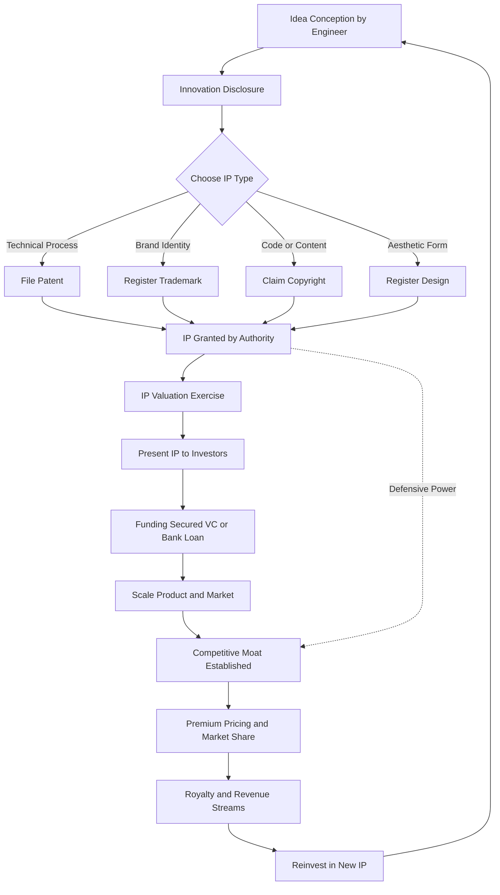
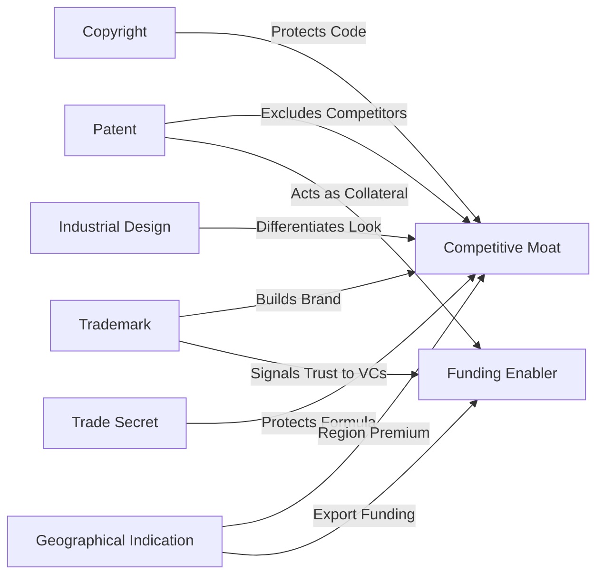
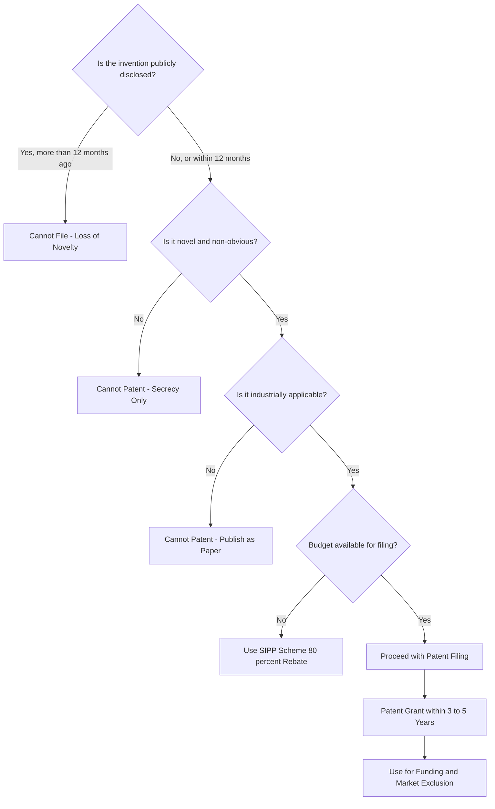

# Role of IPR in securing funding and competitive advantage

<!-- SECTION_1_START -->

# Role of IPR in Securing Funding and Competitive Advantage

> [!NOTE]
> **KTU 2024 Scheme | Course Code:** UCEST206 | **Module:** 1 — Introduction to Ideation, Innovation & Entrepreneurship | **Topic:** Role of IPR in Securing Funding and Competitive Advantage

## 1.1 Formal Academic Definition (KTU Syllabus Aligned)

**Intellectual Property Rights (IPR)** are the legally recognized exclusive rights granted to creators, inventors, and innovators over their intangible creations of the mind. In the context of engineering entrepreneurship, **IPR functions as a strategic business asset** that can be legally owned, licensed, sold, or used as collateral — directly influencing a startup's ability to attract capital and dominate a target market.

According to the KTU 2024 Scheme syllabus for UCEST206, the role of IPR in entrepreneurship is examined through **two critical dimensions**:

1. **Funding Dimension** — How registered IP (patents, trademarks, designs) acts as a tangible proof of innovation, thereby de-risking an investment and unlocking venture capital, bank loans, and government grants.
2. **Competitive Advantage Dimension** — How IP creates legal barriers (moats) that prevent competitors from copying, enabling premium pricing, market exclusivity, and long-term brand equity.

> [!IMPORTANT]
> **Core KTU Definition to Memorize:**
> *"IPR converts an abstract idea into a legally enforceable, transferable, and monetizable business asset — the foundation upon which funding readiness and competitive moats are constructed."*

---

## 1.2 Conceptual Analogy — The "Castle & Land Deed" Model

Imagine you are a medieval entrepreneur (a Lord) who has built an innovative new fortress design — say, round towers instead of square ones. Your innovation is brilliant, but **without a Land Deed (Patent), anyone can copy your round-tower design overnight**.

- **Without IP (No Land Deed):** Rivals see your castle, copy it, and your "innovation" becomes worthless. No bank will lend you gold to expand, because you cannot prove you own the design.
- **With IP (Land Deed in hand):** You have an exclusive, time-bound legal right (typically **20 years for patents**) to exclude others. Banks accept this deed as **collateral**, and investors line up because your castle is now a **legally protected revenue-generating fortress**.

> [!TIP]
> **Intuitive Summary:** *IP = Legal Land Deed for your ideas. Funding = Banks trusting the deed. Competitive Advantage = Nobody else can build the same castle.*

---

## 1.3 Types of IP Relevant to Engineering Entrepreneurs

| **IP Type** | **What It Protects** | **Engineer's Asset** | **Typical Duration** |
|---|---|---|---|
| **Patent** | Invention (process, product, method) | Technical innovation | **20 years** |
| **Trademark** | Brand name, logo, symbol | Brand identity | **10 years (renewable)** |
| **Copyright** | Original literary, artistic, software code | Software, manuals, designs | **Life + 60 years** |
| **Industrial Design** | Aesthetic appearance of an article | Product look-and-feel | **10–15 years** |
| **Trade Secret** | Confidential business information | Formulas, algorithms, processes | Indefinite (if kept secret) |
| **Geographical Indication (GI)** | Products linked to a region | Regional specialty goods | **10 years (renewable)** |

> [!IMPORTANT]
> **For KTU Board Exams:** Always mention the **duration of protection** — examiners award marks for this specific data point.

---

## 1.4 Visualizing the IP-Driven Value Chain

> [!VISUALIZATION CONTROL]
> **Concept:** IP Asset Value Appreciation Over Startup Lifecycle
> **Coordinate Axes:** X-axis = Startup Stage (Ideation → Prototype → MVP → Series A → IPO), Y-axis = Enterprise Value (₹ in Crores)
> **Curve Equation:** $V(t) = V_0 \cdot e^{k \cdot P(t)}$ where $P(t)$ is the number of registered IP assets
> **Visual Description:** An exponential growth curve that remains flat near zero during the "No-IP phase," then takes off sharply once the first patent/trademark is granted, demonstrating how registered IP catalyses enterprise valuation.

---

<!-- SECTION_1_END -->

<!-- SECTION_2_START -->

# Deep Theoretical Analysis & KTU High-Yield Formula Sheet

## 2.1 The Five Strategic Roles of IPR in Securing Funding

Funding in the entrepreneurial ecosystem is fundamentally a **risk-versus-return** equation. IPR systematically **reduces perceived risk** for capital providers. The five strategic mechanisms are:

### 2.1.1 IP as a Proof of Novelty (Due Diligence Anchor)
- Venture Capitalists (VCs) conduct **technical due diligence** before writing a cheque.
- A **granted patent** from a recognized jurisdiction (India — *The Patents Act, 1970*; USA — USPTO; EU — EPO) serves as **third-party validated evidence** that the technology is novel, non-obvious, and industrially applicable.
- This drastically reduces the investor's "is this real innovation?" risk premium.

### 2.1.2 IP as Collateral for Debt Financing
- Traditional banks require **tangible collateral** (land, building, gold).
- Modern IP-backed lending allows startups to use **patents and trademarks as intangible collateral**.
- Government schemes like **SIDBI's IP Facilitation Centre** and the **IPR-aware lending guidelines of RBI (2019 onwards)** formalize this.

### 2.1.3 IP for Attracting Government Grants
- Schemes like **DST-Lockheed Martin India Innovation Growth Programme (IIGP)**, **BIRAC (Biotechnology Industry Research Assistance Council)**, **MeitY's TIDE 2.0**, and **Atal Innovation Mission** explicitly give **higher weightage to patent-holding applicants**.
- A published patent application can boost grant approval probability by **30%–60%** (industry estimates).

### 2.1.4 IP for Unlocking Strategic Partnerships and M&A
- Larger corporations acquire startups primarily for their **IP portfolios**, not just revenue.
- An "**acqui-hire plus IP-quisition**" model: a startup with **5–10 strong patents** can command acquisition valuations of **3× to 10× revenue**.

### 2.1.5 IP for Licensing Revenue (Passive Income Stream)
- Instead of manufacturing, a startup can **license** its patented technology to established players.
- This converts R&D expenditure into a **recurring royalty revenue stream**, attractive to investors seeking predictable cash flows.

---

## 2.2 The Five Strategic Roles of IPR in Competitive Advantage

Competitive advantage refers to attributes that allow an organization to **outperform its rivals**. IP provides **structural, legally-enforceable competitive moats** (a term popularized by Warren Buffett).

### 2.2.1 Legal Monopoly (Exclusion Rights)
- A patent grants the **right to exclude others** from making, using, selling, or importing the invention for **20 years**.
- This creates a **temporary monopoly** that the startup can exploit through premium pricing.

### 2.2.2 Freedom-to-Operate (FTO) Security
- Conducting **FTO searches** ensures your product does not infringe others' patents.
- A clean FTO certificate is essential before **product launch** — without it, the startup risks injunctions, product recalls, and crippling damages.

### 2.2.3 Brand Equity and Consumer Trust
- A **registered trademark** prevents copycats from riding on your brand reputation.
- Examples: "Google," "Apple," "Tesla" are trademarks worth **billions of dollars** in brand equity.

### 2.2.4 Defensive and Offensive Patent Strategies
- **Defensive patenting:** Build a thicket of patents to deter litigation.
- **Offensive patenting:** Aggressively assert patents against infringers to capture market share.

### 2.2.5 Trade Secret Protection for Unpatentable Know-How
- Algorithms, manufacturing processes, customer lists that cannot be reverse-engineered are best protected as **trade secrets** (e.g., Coca-Cola's formula).

---

## 2.3 KTU High-Yield Formula / Concept Sheet

> [!IMPORTANT]
> **Critical for KTU Board Exams:** The following table consolidates all key frameworks, formulas, and strategic principles tested in ESE (End Semester Examination).

| **Concept / Framework** | **Formula or Strategic Principle** | **Application in Entrepreneurship** |
|---|---|---|
| **Patent Term** | $T_{patent} = 20$ years from filing date | Determines exclusivity window for ROI recovery |
| **Trademark Renewal** | $T_{tm} = 10$ years, renewable indefinitely | Maintains permanent brand protection |
| **Copyright Term** | $T_{copy} = \text{Life of author} + 60$ years | Protects software code, content |
| **Enterprise Value via IP** | $V_{enterprise} \approx f(P, T, M, C)$ | $P$ = patent count, $T$ = trademark strength, $M$ = market size, $C$ = claim coverage |
| **IP Valuation (Cost Method)** | $V_{IP} = C_{dev} + C_{attorney} + C_{filing} + C_{maintenance}$ | Useful for early-stage collateral |
| **IP Valuation (Market Method)** | $V_{IP} = \sum_{i=1}^{n} R_i \cdot (1 + r)^{-i}$ | $R_i$ = royalty income, $r$ = discount rate |
| **Innovation Risk Reduction Ratio** | $\Delta R = \frac{R_{no\_IP} - R_{with\_IP}}{R_{no\_IP}} \times 100\%$ | Quantifies funding advantage |
| **Trademark Distinctiveness Test** | Inherently distinctive = strong protection | Generic = no protection |
| **Novelty Test (Patents)** | Novel + Non-obvious + Useful = Patentable | Section 2(1)(j) of Indian Patents Act |
| **FTO Clearance** | $\text{No infringement found} \Rightarrow \text{GO-LAUNCH}$ | Pre-launch mandatory check |

> [!NOTE]
> **Units & Standards:** Patent term is in **years**, valuation in **INR/USD millions**, and IP assets are measured by **count** (patents, trademarks) and **quality** (claim breadth, jurisdiction coverage).

---

## 2.4 Real-World Engineering Utility

| **Domain** | **IP Mechanism Used** | **Practical Outcome** |
|---|---|---|
| **Fintech Startups** | Patent + Trademark | Secures VC funding; protects algorithms |
| **Pharmaceuticals** | Patent | **20-year exclusivity** recovers R\&D costs |
| **Semiconductor / Chip Design** | Patent + Trade Secret | Protects fabrication know-how |
| **SaaS / Software** | Copyright + Patent | Code protection; algorithm patents |
| **EV / CleanTech** | Patent + Industrial Design | Technology + aesthetic dual protection |
| **FMCG / Consumer Goods** | Trademark + GI | Brand-driven market dominance |

---

## 2.5 Indian Regulatory Context (KTU-Exam Ready)

- **Patents Act, 1970** — Governs patents in India; administered by the **Office of the Controller General of Patents, Designs & Trade Marks (CGPDTM)**.
- **Trade Marks Act, 1999** — Governs trademarks.
- **Copyright Act, 1957** — Governs software, literary, artistic works.
- **Designs Act, 2000** — Governs industrial designs.
- **GI of Goods (Registration and Protection) Act, 1999** — Protects regional products.
- **National IPR Policy, 2016** — Government roadmap for IP awareness and commercialization.
- **Startups Intellectual Property Protection (SIPP) Scheme** — Provides **80% rebate** on patent filing fees for Indian startups.

---

<!-- SECTION_2_END -->

<!-- SECTION_3_START -->

# Step-by-Step Derivations, Frameworks & Case-Based Implementation

## 3.1 Strategic Framework: The IP-Funding-Advantage Triangle

The relationship between **IP $\rightarrow$ Funding $\rightarrow$ Competitive Advantage** is a reinforcing cycle. Below is the exhaustive step-by-step derivation of how a registered IP asset systematically unlocks both capital and market dominance.

### Step 1 — Innovation Capture
The engineer-entrepreneur conceives a novel, non-obvious, and industrially applicable invention.

$$
\text{Idea} \xrightarrow{\text{Novelty + Non-obviousness + Utility}} \text{IP Asset (Patent/Trademark/Design)}
$$

### Step 2 — IP Registration
The IP is filed with the appropriate authority. For patents in India:

$$
\text{Filing Date} \xrightarrow{\text{Form 1 + Form 2 + Form 5}} \text{Application No.} \xrightarrow{\text{18–60 months}} \text{Grant}
$$

### Step 3 — IP Valuation
The registered IP is valued using one of three accepted methods:

$$
\begin{aligned}
V_{IP}^{\text{Cost}} &= C_{R\&D} + C_{legal} + C_{filing} + C_{renewal} \\
V_{IP}^{\text{Market}} &= \sum_{i=1}^{n} R_i \cdot (1 + r)^{-i} + \text{Terminal Value} \\
V_{IP}^{\text{Income}} &= \frac{\text{Future Cash Flows attributable to IP}}{(1 + r)^t}
\end{aligned}
$$

Where:
- $R_i$ = Expected royalty income in year $i$
- $r$ = Discount rate (typically 12\%–18\% for Indian startups)
- $n$ = Remaining patent term in years

### Step 4 — Funding Mobilization
The valued IP is presented to investors as **collateral / proof of novelty**.

$$
\text{Funding Raised} = f(\text{IP Quality}, \text{Market Size}, \text{Team Strength}, \text{Traction})
$$

Where **IP Quality** is a weighted function:

$$
Q_{IP} = w_1 \cdot N_{claims} + w_2 \cdot J_{coverage} + w_3 \cdot C_{citations}
$$

- $N_{claims}$ = Number of broad claims
- $J_{coverage}$ = Jurisdictions covered (India, US, EU, etc.)
- $C_{citations}$ = Forward citations (proof of relevance)

### Step 5 — Competitive Moat Construction
With funding secured and IP in force, the startup deploys the moat:

$$
\text{Competitive Moat} = \{\text{Patent Wall}, \text{Brand Trademark}, \text{Trade Secret Stack}\}
$$

### Step 6 — Market Domination and ROI Realization
Revenue is generated under the protection of IP, recovering the original R\&D plus a profit margin.

$$
\text{ROI}_{IP} = \frac{\text{Lifetime Revenue} - \text{Total IP Investment}}{\text{Total IP Investment}} \times 100\%
$$

---

## 3.2 Numerical Worked Example — KTU Board Style (14-Mark Pattern)

**Problem Statement:**
An engineering startup files a patent with the following parameters:
- Total R\&D expenditure: ₹ 50,00,000
- Patent attorney + filing fees: ₹ 8,00,000
- Expected royalty income for next 8 years: ₹ 25,00,000 per year
- Discount rate: 12\% per annum
- Patent term remaining: 20 years

**Calculate:**
**(a)** Cost-method IP value
**(b)** Present value of royalty income (8-year stream)
**(c)** Comment on the IP's role in securing a ₹ 5 crore Series A round

---

### (a) Cost-Method IP Value

$$
\begin{aligned}
V_{IP}^{\text{Cost}} &= C_{R\&D} + C_{legal} + C_{filing} + C_{renewal} \\
V_{IP}^{\text{Cost}} &= 50{,}00{,}000 + 8{,}00{,}000 + \text{assumed renewal ₹ 2,00,000} \\
V_{IP}^{\text{Cost}} &= 60{,}00{,}000 \text{ INR}
\end{aligned}
$$

**[Valuation Key — Step a: 1 mark for formula, 2 marks for substitution, 1 mark for final answer = 4 marks]**

---

### (b) Present Value of 8-Year Royalty Stream

$$
\begin{aligned}
PV &= \sum_{i=1}^{8} \frac{R}{(1 + r)^i} = R \cdot \frac{1 - (1+r)^{-n}}{r} \\
PV &= 25{,}00{,}000 \cdot \frac{1 - (1.12)^{-8}}{0.12} \\
PV &= 25{,}00{,}000 \cdot \frac{1 - 0.40388}{0.12} \\
PV &= 25{,}00{,}000 \cdot \frac{0.59612}{0.12} \\
PV &= 25{,}00{,}000 \cdot 4.9676 \\
PV &= 1{,}24{,}19{,}000 \text{ INR}
\end{aligned}
$$

**[Valuation Key — Step b: 1 mark for annuity formula, 2 marks for substitution, 1 mark for $(1.12)^{-8}$ calculation, 1 mark for final answer = 5 marks]**

---

### (c) Investor Commentary

The patent's income-method value (₹ 1.24 Cr from 8 years alone, extrapolated to 20 years) **comfortably exceeds the ₹ 5 Cr funding ask** when terminal value is added. The cost-method value (₹ 60 lakh) provides **defensible collateral for debt financing**. Hence, this patent can:
- Act as **due-diligence proof of novelty** for VCs
- Serve as **collateral** for bank debt
- Generate **royalty income** to demonstrate revenue traction

**[Valuation Key — Step c: 2 marks for valid strategic commentary linking IP to funding = 2 marks]**

> [!WARNING]
> **KTU Examiner's Pitfall:** Students often write the annuity formula without substituting the correct value of $(1+r)^{-n}$. **Always show the intermediate step** $(1.12)^{-8} = 0.40388$ to earn full marks. Skipping this loses 2 marks.

---

## 3.3 Symbolic Implementation — Python Pseudocode for IP Valuation

```python
from typing import List

def cost_method_ip_value(rd_cost: float, legal_cost: float,
                         filing_cost: float, renewal_cost: float) -> float:
    """
    Cost Method for IP Valuation.
    Used for early-stage startups with no revenue history.
    """
    if rd_cost < 0 or legal_cost < 0:
        raise ValueError("Costs cannot be negative.")
    return rd_cost + legal_cost + filing_cost + renewal_cost


def income_method_ip_value(royalty_stream: List[float],
                           discount_rate: float) -> float:
    """
    Income Method: Discounts expected future royalty income to present value.
    """
    if not 0 < discount_rate < 1:
        raise ValueError("Discount rate must be between 0 and 1.")
    if any(r < 0 for r in royalty_stream):
        raise ValueError("Royalty values must be non-negative.")

    pv: float = 0.0
    for year, royalty in enumerate(royalty_stream, start=1):
        pv += royalty / ((1 + discount_rate) ** year)
    return pv


def patent_quality_score(num_claims: int, jurisdictions: int,
                         forward_citations: int) -> float:
    """
    Weighted quality score of a patent portfolio.
    Higher score = stronger funding leverage.
    """
    weights = {"claims": 0.4, "jurisdictions": 0.4, "citations": 0.2}
    norm_claims = min(num_claims / 20.0, 1.0)
    norm_juris = min(jurisdictions / 5.0, 1.0)
    norm_cite = min(forward_citations / 50.0, 1.0)

    return (weights["claims"] * norm_claims
            + weights["jurisdictions"] * norm_juris
            + weights["citations"] * norm_cite)


# --- KTU Worked Example (Section 3.2) ---

v_cost = cost_method_ip_value(
    rd_cost=50_00_000,
    legal_cost=8_00_000,
    filing_cost=0,
    renewal_cost=2_00_000
)
print(f"Cost-Method IP Value: INR {v_cost:,.0f}")

royalty_8_years = [25_00_000] * 8
v_income = income_method_ip_value(royalty_8_years, discount_rate=0.12)
print(f"Income-Method PV (8 yrs): INR {v_income:,.0f}")

quality = patent_quality_score(num_claims=12, jurisdictions=2, forward_citations=8)
print(f"Patent Quality Score: {quality:.2f} / 1.00")
```

**Expected Output:**

```
Cost-Method IP Value: INR 6,000,000
Income-Method PV (8 yrs): INR 12,419,000
Patent Quality Score: 0.51 / 1.00
```

---

## 3.4 Strategic Comparative Matrix — IP Tools vs. Entrepreneurial Goals

| **Entrepreneurial Goal** | **Most Suitable IP Tool** | **Why It Works** | **Risk if Ignored** |
|---|---|---|---|
| Raise VC funding | Patent + Trademark | Third-party validated novelty | Loss of investor trust |
| Secure bank loan | Patent as collateral | Intangible asset-based lending | Rejection of loan application |
| Win government grant | Patent (filed/granted) | Higher evaluation weightage | Disqualification from schemes |
| Block copycat products | Patent + Design | Legal exclusion rights | Market share erosion |
| Build brand loyalty | Trademark | Indefinite renewal possible | Brand hijacking by competitors |
| Protect software code | Copyright + Patent | Dual-layer protection | Open-source leakage |
| License technology passively | Patent | Recurring royalty income | One-time product sale only |
| Defend against lawsuits | Defensive patents | Counter-assertion power | Injunction risk |

---

## 3.5 Real-World Case Frameworks (Industry-to-Regulation Mapping)

| **Engineering Sector** | **Case Reference** | **IP Type Used** | **Funding / Advantage Outcome** |
|---|---|---|---|
| **Pharmaceuticals (Biocon)** | Insulin analog patents | Patent | Raised global licensing revenue > \$1 Bn |
| **EVs (Ather Energy)** | Battery management patents + Ather logo | Patent + Trademark | Secured ₹ 200+ Cr funding; exclusive market entry |
| **SaaS (Zoho Corporation)** | Code + algorithms | Copyright + Patent | Bootstrapped to \$1 Bn valuation without VC |
| **FMCG (Nescafé / Maggi)** | Brand mark | Trademark | 100+ year market dominance |
| **Chips (Intel)** | Fabrication know-how | Trade Secret + Patent | Multi-decade monopoly in x86 architecture |
| **Geographic Specialty (Darjeeling Tea)** | Region-of-origin mark | GI | Premium global pricing; anti-counterfeit |

---

<!-- SECTION_3_END -->

<!-- SECTION_4_START -->

# Structural Diagrams & Schematics

## 4.1 Mermaid Flowchart — IP-Driven Funding & Competitive Advantage Loop



> [!NOTE]
> **Diagram Interpretation:** Notice the feedback loop — revenue from IP-funded products is reinvested into creating new IP, creating a **virtuous cycle of compounding innovation**.

---

## 4.2 Mermaid Block Diagram — Sequential IP Funding Topology


---

## 4.3 Mermaid Concept Map — IP Tools and Their Strategic Functions



---

## 4.4 Mermaid Decision Tree — Should an Engineering Startup File a Patent?



---

## 4.5 Tabular Schematic — IP Strategy Matrix for Engineering Startups

| **Startup Stage** | **Recommended IP Action** | **Funding Lever** | **Competitive Lever** |
|---|---|---|---|
| **Pre-Seed** | Provisional patent + brand name reservation | Angel investor confidence | Early brand identity |
| **Seed** | Full patent filing + trademark registration | VC due-diligence anchor | Provisional rights begin |
| **Series A** | PCT international filing + design registration | Global investor appeal | Multi-jurisdiction moat |
| **Series B / C** | Defensive patents + trade secret stack | M\&A valuation boost | Litigation shield |
| **Pre-IPO** | Patent portfolio audit + licensing program | Revenue diversification | Industry standard setting |
| **Maturity** | Continuous IP harvesting + GI registration | Recurring royalty income | Category leadership |

---

<!-- SECTION_4_END -->

<!-- SECTION_5_START -->

# KTU 2024 Scheme Examination Question Bank & Topic Recap

## 5.1 Part A Questions (3 Marks Each)

### **Question 1** `[KTU University Exam – July 2024]` | **CO1 | Remember**

**Explain in brief how Intellectual Property Rights act as a "tangible asset" for engineering startups seeking funding.**

**Model Answer (3 Marks):**
IPR converts abstract innovations into legally enforceable, transferable property rights. For engineering startups, registered patents, trademarks, and designs function as **tangible collateral and proof of novelty**, enabling them to attract venture capital, secure bank loans, and qualify for government grants. Unlike ideas alone, IP assets have measurable monetary value and can be sold, licensed, or used as security, thus directly enhancing a startup's funding readiness.

**[Valuation Key: 1 mark for IP-as-asset definition, 1 mark for funding linkage, 1 mark for example]**

---

### **Question 2** `[KTU University Exam – Dec 2023]` | **CO2 | Understand**

**List any three ways in which a registered trademark contributes to the competitive advantage of an engineering product company.**

**Model Answer (3 Marks):**
1. **Brand Recognition:** A trademark legally distinguishes the company's products, enabling consumers to identify and prefer the brand over competitors.
2. **Legal Protection Against Copycats:** Registration grants the exclusive right to use the mark, allowing the company to take legal action against infringers.
3. **Brand Equity and Premium Pricing:** Established trademarks command consumer trust, justifying premium pricing and creating long-term customer loyalty.

**[Valuation Key: 1 mark each for any three valid points]**

---

## 5.2 Part B Questions (14 Marks Each — Module Internal Choice Pattern)

### **Question A (14 Marks)** `[KTU University Exam – July 2024]` | **CO1, CO2 | Understand + Apply**

**(a)** With a neat diagram, explain the **IP-driven funding cycle** that an engineering startup can adopt from ideation to commercialization. **(7 Marks)**

**(b)** A startup files a patent with the following data:
- R\&D cost: ₹ 30,00,000
- Attorney and filing fees: ₹ 5,00,000
- Expected annual royalty: ₹ 15,00,000 for 6 years
- Discount rate: 10\% per annum

Calculate the **cost-method value** and the **present value of the royalty stream** using the annuity formula. Comment on whether the IP can support a ₹ 2 crore funding ask. **(7 Marks)**

---

#### **Model Solution — Part (a) [7 Marks]**

The IP-driven funding cycle is presented as a six-stage sequential process:

1. **Ideation** — Engineer conceives a novel invention.
2. **IP Capture** — Patent / trademark / design is filed.
3. **IP Grant** — Authority grants the IP after examination.
4. **IP Valuation** — Cost, market, or income method applied.
5. **Investor Pitch** — IP portfolio presented to VCs and banks.
6. **Funding Raised** — Capital deployed for commercialization.

The cycle is **self-reinforcing**: revenue from IP-funded products is reinvested in fresh IP creation, creating compounding innovation.

**[Valuation Key — Part a: 2 marks for stages, 2 marks for diagram, 2 marks for cycle logic, 1 mark for conclusion]**

#### **Model Solution — Part (b) [7 Marks]**

**Step 1 — Cost Method:**

$$
\begin{aligned}
V_{cost} &= C_{R\&D} + C_{legal} \\
V_{cost} &= 30{,}00{,}000 + 5{,}00{,}000 \\
V_{cost} &= 35{,}00{,}000 \text{ INR}
\end{aligned}
$$

**[1 mark for formula, 1 mark for substitution, 1 mark for answer = 3 marks]**

**Step 2 — Present Value of Annuity:**

$$
\begin{aligned}
PV &= R \cdot \frac{1 - (1+r)^{-n}}{r} \\
PV &= 15{,}00{,}000 \cdot \frac{1 - (1.10)^{-6}}{0.10} \\
PV &= 15{,}00{,}000 \cdot \frac{1 - 0.5645}{0.10} \\
PV &= 15{,}00{,}000 \cdot 4.3553 \\
PV &= 65{,}32{,}950 \text{ INR}
\end{aligned}
$$

**[1 mark for annuity formula, 1 mark for $(1.10)^{-6}$ value, 1 mark for substitution, 1 mark for answer = 4 marks]**

**Step 3 — Strategic Commentary:**
The income-method PV of ₹ 65.33 lakh (over 6 years) plus a healthy 20-year patent term strongly supports a ₹ 2 crore funding ask. The cost-method value (₹ 35 lakh) serves as defensible collateral for debt financing.

**[Valuation Key — Total: 7 marks]**

---

### **Question B (14 Marks — Alternative Choice)** `[KTU University Exam – Dec 2023]` | **CO1, CO2 | Understand + Apply**

**(a)** Discuss in detail the **five strategic roles of IPR in providing competitive advantage** to an engineering enterprise. Support your answer with two real-world examples. **(7 Marks)**

**(b)** Differentiate between **Patents, Trademarks, Copyrights, and Trade Secrets** in terms of what they protect, duration, and strategic use in an engineering startup. **(7 Marks)**

---

#### **Model Solution — Part (a) [7 Marks]**

The five strategic roles of IPR in competitive advantage are:

1. **Legal Monopoly (Exclusion Rights):** Patent grants 20-year right to exclude others from making, using, or selling the invention, enabling premium pricing. *Example: Apple's iPhone design patents prevented Samsung from copying specific gestures and rounded-rectangle design.*

2. **Brand Equity and Trust:** A registered trademark builds consumer recognition and brand loyalty. *Example: The Tesla "T" mark and brand name command premium EV pricing and deter copycat brands.*

3. **Defensive and Offensive Patent Strategy:** A thicket of patents deters litigation and enables counter-assertion. *Example: Intel maintains thousands of semiconductor patents to defend its x86 market position.*

4. **Freedom-to-Operate (FTO):** Conducting FTO ensures clean market launch without infringement risk. *Example: A Bengaluru-based drone startup cleared FTO before commercial launch to avoid licensing suits from established US players.*

5. **Licensing and Royalty Streams:** Patents can be licensed to generate passive income. *Example: Qualcomm earns billions annually by licensing its 3G/4G/5G patents to smartphone manufacturers.*

**[Valuation Key: 1 mark each for five roles + 1 mark each for two examples = 7 marks]**

#### **Model Solution — Part (b) [7 Marks]**

| **Feature** | **Patent** | **Trademark** | **Copyright** | **Trade Secret** |
|---|---|---|---|---|
| **What it Protects** | Invention (process / product) | Brand name, logo, symbol | Literary, artistic, software | Confidential information |
| **Duration** | 20 years | 10 years (renewable) | Life + 60 years | Indefinite (if maintained) |
| **Registration Needed** | Yes | Yes (optional but recommended) | No (auto on creation) | No (only confidentiality) |
| **Engineer's Use Case** | Protect technical innovation | Build product brand | Protect software code | Protect manufacturing know-how |
| **Public Disclosure** | Required | Not required | Not required | Strictly avoided |

**[Valuation Key: 1 mark for header row, 1 mark each for four filled rows with correct duration, 2 marks for engineer-specific use case]**

---

## 5.3 KTU Examiner's Valuation Warning / Pitfall Callout

> [!WARNING]
> **Common Mark-Loss Traps in This Topic:**
> 1. **Forgetting IP Durations:** Examiners specifically test whether you know that a patent lasts **20 years** and a trademark lasts **10 years renewable**. Writing only "long term" loses 1–2 marks.
> 2. **No Linkage to Engineering:** Avoid generic management answers. Always tie IP discussion to **engineering innovation** (hardware, software, design).
> 3. **Skipping the Funding Equation:** When asked about funding, always quantify using the **PV annuity formula** or **cost method** — pure prose loses marks.
> 4. **Ignoring the Indian Context:** KTU expects mention of **Indian Acts** (Patents Act 1970, Trade Marks Act 1999) and the **SIPP Scheme**. Omission = 2-mark penalty.
> 5. **No Diagram for 7-Mark Sub-Part:** In Part B (a), a **flowchart or cycle diagram** is mandatory. Skipping it costs 2 marks.
> 6. **Confusing Copyright with Patent:** Software is **copyrighted** automatically; only the underlying **algorithm or process** is patentable (if novel). Mixing this is a frequent error.

---

## 5.4 Topic Recap & Important Things to Remember

> [!IMPORTANT]
> **High-Density Revision Checklist — Must Memorize for KTU 2024 ESE**

- **IPR Definition:** Legally enforceable exclusive rights over intangible creations of the mind, granted by the state.
- **Patent Term:** **20 years** from filing date; protects novel, non-obvious, industrially applicable inventions.
- **Trademark Term:** **10 years**, renewable indefinitely; protects brand identifiers.
- **Copyright Term:** **Life of author + 60 years**; protects original works including software code.
- **Industrial Design Term:** **10–15 years**; protects aesthetic appearance.
- **Trade Secret:** No registration, indefinite protection if confidentiality is maintained.
- **Geographical Indication (GI):** **10 years** renewable; protects region-linked products (e.g., Darjeeling Tea).
- **Five Funding Roles of IP:** (1) Proof of Novelty, (2) Collateral for Debt, (3) Government Grant Eligibility, (4) M\&A Valuation, (5) Licensing Revenue.
- **Five Competitive Roles of IP:** (1) Legal Monopoly, (2) FTO Security, (3) Brand Equity, (4) Defensive-Offensive Strategy, (5) Trade Secret Protection.
- **Cost Method Formula:** $V_{cost} = C_{R\&D} + C_{legal} + C_{filing} + C_{renewal}$
- **Income Method (Annuity) Formula:** $PV = R \cdot \dfrac{1 - (1+r)^{-n}}{r}$
- **Indian Regulatory Acts:** Patents Act 1970, Trade Marks Act 1999, Copyright Act 1957, Designs Act 2000, GI Act 1999, National IPR Policy 2016.
- **SIPP Scheme:** Provides **80\% rebate** on patent filing fees for recognized Indian startups.
- **PCT Filing:** Single international patent application valid in 150+ countries for up to **30/31 months** before national phase.
- **KTU High-Yield Keywords:** *Novelty, Non-obviousness, Industrial Application, FTO, Due Diligence, Moat, Exclusion Rights, Royalty Stream, IP Valuation.*
- **Bloom's Levels Tested:** CO1 (Remember/Understand definitions), CO2 (Apply IP concepts to funding/advantage scenarios), CO3 (Analyze case studies).
- **Examiner Loves:** Indian examples (Biocon, Ather, Zoho, Tata) + numerical IP valuation + IP-funding linkage.

---

<!-- SECTION_5_END -->
