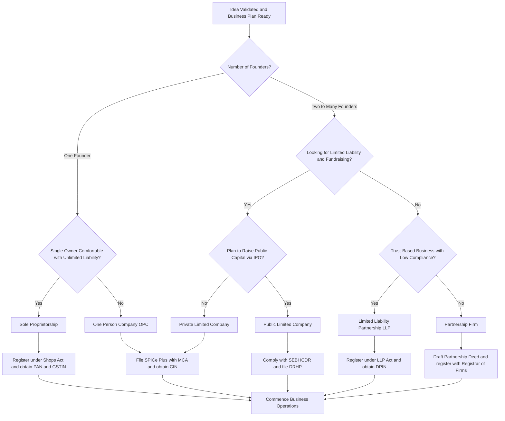
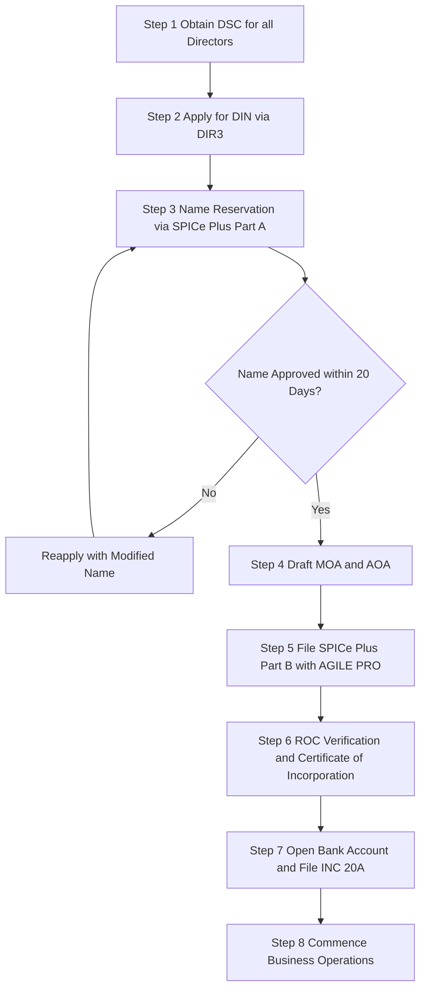

# Starting a Business, types formation statutory compliances.

<!-- SECTION_1_START -->
# Starting a Business: Types, Formation & Statutory Compliances

## 1. Core Technical Definition & Intuitive Overview

> [!NOTE]
> **Entrepreneurship** is the process of designing, launching, and running a new business venture to make a profit, typically involving risk, innovation, and the creation of value. **Business Formation** is the legal process of establishing a business entity, while **Statutory Compliances** are the mandatory legal obligations a business must fulfill under various laws.

### Conceptual Analogy / Intuition

Think of starting a business like building a house. Before you can move in, you must:

1. **Choose the blueprint** (type of business — flat, villa, apartment)
2. **Get the land registered** (business registration)
3. **Get permissions and utilities** (licenses, tax registrations)
4. **Follow building codes** (statutory compliances)

Just like a house cannot be legally occupied without a completion certificate, a business cannot legally operate without proper registration and licenses.

> [!IMPORTANT]
> **Key Statutory Metrics in India (As per KTU 2024 Syllabus):**
> - **Minimum number of directors (Private Ltd):** **2**
> - **Maximum number of members (Partnership):** **50**
> - **Minimum paid-up capital for Public Ltd:** **₹5,00,000**
> - **ROC (Registrar of Companies):** Governed by **Companies Act, 2013**

---

## 2. Types of Business Formation — Overview

A business can be organized in several legal forms. Each has its own **legal identity**, **liability structure**, and **compliance burden**.

| **Term** | **Definition** |
|---|---|
| Sole Proprietorship | A business owned and controlled by a single individual |
| Partnership Firm | An association of two or more persons carrying on a business |
| Limited Liability Partnership (LLP) | A hybrid form combining benefits of partnership and company |
| Private Limited Company | A privately held corporate entity with limited liability |
| Public Limited Company | A company that can offer shares to the general public |
| One Person Company (OPC) | A company with only one member/director |
| Hindu Undivided Family (HUF) | A family-owned business structure recognized under Hindu law |

> [!TIP]
> **Engineering Connection:** For tech start-ups (common among KTU engineering graduates), the most preferred structure is the **Private Limited Company** due to limited liability, easier fundraising, and scalability.

> [!VISUALIZATION CONTROL]
> **Concept:** Decision Tree for Choosing Business Type
> **Description:** Imagine a flowchart starting with "How many founders?" branching into "1 → OPC / Sole Proprietorship", "2-50 → LLP / Partnership / Pvt Ltd", "Want public funding? → Public Ltd".
> **Graph Axes:** Number of Owners (X-axis) vs. Compliance Complexity (Y-axis)

---

<!-- SECTION_1_END -->

<!-- SECTION_2_START -->
# Deep Theoretical Analysis & KTU High-Yield Formula Sheet

## 2.1 Steps in Starting a Business (Stage-Wise Framework)

The process of starting a business follows a structured sequence:

### Stage 1: Ideation & Validation
- Identify a problem and craft a value proposition
- Conduct **market research** and **feasibility analysis**
- Develop a **Business Model Canvas (BMC)**

### Stage 2: Business Planning
- Draft a **Business Plan** (Executive Summary, Market Analysis, Operations, Financials)
- Define **Mission, Vision, and Objectives**
- Estimate **initial capital requirement**

### Stage 3: Legal Formation
- Choose the appropriate business structure
- Register the business name and entity
- Obtain **PAN, TAN, GSTIN**, and bank account

### Stage 4: Statutory Compliance Setup
- Acquire necessary **licenses and permits**
- Register under **Shops & Establishments Act**
- Set up **accounting and tax systems**

### Stage 5: Launch & Operations
- Hire workforce, set up infrastructure
- Begin production/service delivery
- File periodic returns and renewals

---

## 2.2 KTU Formula Sheet — Business Types Comparison

> [!IMPORTANT]
> This table is **exam-critical**. Memorize the **minimum/maximum members**, **liability type**, and **governing Act** for each.

| **Parameter** | **Sole Proprietorship** | **Partnership Firm** | **LLP** | **Private Ltd** | **Public Ltd** | **OPC** |
|---|---|---|---|---|---|---|
| **Governing Act** | No specific Act | Indian Partnership Act, 1932 | LLP Act, 2008 | Companies Act, 2013 | Companies Act, 2013 | Companies Act, 2013 |
| **Min. Members** | 1 | 2 | 2 | 2 | 7 | 1 |
| **Max. Members** | 1 | 50 (as per Companies Act, 2013 — 10 for banking) | No limit | 200 | No limit | 1 |
| **Min. Capital** | No requirement | No requirement | No requirement | No requirement | ₹5,00,000 (now removed but symbolically retained) | No requirement |
| **Liability** | Unlimited | Unlimited (joint & several) | Limited | Limited | Limited | Limited |
| **Separate Legal Entity** | No | No | Yes | Yes | Yes | Yes |
| **Foreign Direct Investment (FDI)** | Not allowed | Not allowed | Allowed (100% automatic) | Allowed (100% automatic) | Allowed (100% automatic) | Not allowed |
| **Tax Structure** | Individual slab rate | Individual slab rate | 30% flat | 25% / 22% (with conditions) | 25% / 22% (with conditions) | 25% / 22% (with conditions) |
| **Compliance Burden** | Low | Low-Medium | Medium | High | Very High | Medium |
| **Audit Requirement** | Only if turnover threshold crossed | Only if turnover threshold crossed | Mandatory if turnover > ₹40L or capital > ₹25L | Mandatory | Mandatory | Mandatory if turnover > ₹2 Cr |
| **Transferability of Shares** | N/A | N/A | N/A | Restricted (not to public) | Free | Restricted |

> [!WARNING]
> **Common Mistake:** Students often confuse "members" with "directors". A Private Limited Company needs **minimum 2 directors** AND **minimum 2 shareholders** (these can be the same individuals).

---

## 2.3 Statutory Compliances — Mandatory Registrations

Every registered business in India must comply with the following baseline obligations:

### A. Tax Registrations
1. **PAN (Permanent Account Number)** — Issued by Income Tax Department; mandatory for all entities
2. **TAN (Tax Deduction Account Number)** — Required if the business deducts TDS on salaries/payments
3. **GSTIN (GST Identification Number)** — Mandatory if turnover exceeds ₹40 Lakhs (₹20 Lakhs for special category states) or for inter-state supply

### B. Business Registrations
4. **MSME/Udyam Registration** — For micro, small, and medium enterprises; offers benefits in loan, taxation, and government tenders
5. **Shops & Establishments Act Registration** — State-level; regulates working hours, wages, leave
6. **Professional Tax Registration** — State-level tax on professionals and employees
7. **Trade License** — From local municipal authority to legally conduct business

### C. Sector-Specific Licenses
8. **FSSAI License** — For food-related businesses
9. **Drug License** — For pharmaceutical businesses
10. **Factory License** — Under Factories Act, 1948, for manufacturing units
11. **Import Export Code (IEC)** — For businesses involved in international trade
12. **Trademark Registration** — To protect brand identity

### D. Post-Incorporation Compliances
13. **Annual Return Filing** (Form MGT-7, AOC-4 for companies)
14. **Income Tax Return (ITR) Filing**
15. **GST Return Filing** (Monthly/Quarterly)
16. **Board Meeting (Min. 4 per year for Pvt Ltd)**
17. **Maintenance of Statutory Registers & Books of Accounts**

---

## 2.4 Engineering & Real-World Utility

- **Tech Start-ups:** Most engineering graduates start as **Private Limited Companies** to attract venture capital and angel investors.
- **Consulting Engineers:** Often operate as **Sole Proprietorship** or **LLP** for simplicity and limited liability.
- **Manufacturing Units:** Require **Factory License**, **Pollution Control NOC**, and **MSME/Udyam Registration**.
- **Export-oriented Engineering Companies:** Need **IEC Code**, **RCMC**, and **GST LUT** for zero-rated supplies.

---

<!-- SECTION_2_END -->

<!-- SECTION_3_START -->
# Step-by-Step Implementation & Case-Based Analysis

## 3.1 Process Flow: Registering a Private Limited Company in India

Below is the exhaustive step-by-step procedure for incorporating a Private Limited Company under the **Companies Act, 2013**.

### Step 1: Obtain Digital Signature Certificate (DSC)
All proposed directors must obtain a **Class 3 Digital Signature Certificate** from a Certifying Authority (e.g., eMudhra, Sify, NCode). The DSC is required to sign electronic forms filed with the **MCA (Ministry of Corporate Affairs)**.

**Documents needed:** Aadhaar, PAN, Photograph, Mobile Number, Email

### Step 2: Apply for Director Identification Number (DIN)
Apply for **DIN** through **Form DIR-3** on the MCA portal. The DIN is a unique identifier for an individual who is a director or intends to become one in any company.

**Validity:** Lifetime (no renewal required)

### Step 3: Name Reservation (Form SPICe+ Part A)
Apply to the **Registrar of Companies (ROC)** for reservation of the proposed company name through **Form SPICe+ (Simplified Proforma for Incorporating Company Electronically)** Part A.

**Naming Guidelines (Rule 8 of Companies (Incorporation) Rules, 2014):**
- The name must be unique and not identical to an existing company/LLP
- Must end with the words **"Private Limited"** or **"Pvt. Ltd."**
- Must not be undesirable or violate **EMBLEM AND NAMES (Prevention of Improper Use) Act, 1950**
- Should not contain words like "National", "Bank", "Insurance" without prior approval

**Approval Validity:** **20 days** from date of approval

### Step 4: Drafting of Memorandum of Association (MOA) & Articles of Association (AOA)
- **MOA** defines the **objects, scope, and powers** of the company. Contains 6 clauses:
  1. Name Clause
  2. Registered Office Clause
  3. Object Clause (Main, Ancillary, Other Objects)
  4. Liability Clause
  5. Capital Clause
  6. Subscription Clause
- **AOA** contains the **rules and regulations** for internal management of the company (board meetings, voting rights, share transfer, etc.)

> [!NOTE]
> **Table F** of the Companies Act, 2013 provides a model AOA that can be adopted for a Private Limited Company.

### Step 5: Filing of Incorporation Application (Form SPICe+ Part B)
Submit **Form SPICe+** along with:
- **AGILE-PRO** (for GSTIN, EPFO, ESIC, and bank account)
- **DIR-2** (Consent of Directors)
- **INC-9** (Declaration by Subscribers)
- Address proof of registered office (utility bill + rent agreement or NOC from owner)

**Government Fees Structure (as of 2024):**
- For authorized capital up to ₹1 Lakh: Nominal fees
- For capital between ₹1 Lakh to ₹5 Lakhs: ₹3,000
- Above ₹5 Lakhs: Variable based on capital slabs

### Step 6: Certificate of Incorporation
Upon successful verification, the **ROC issues the Certificate of Incorporation** with the **Corporate Identification Number (CIN)**. This certificate is the **birth certificate of the company**.

> [!IMPORTANT]
> From the date of incorporation, the company becomes a **separate legal entity** distinct from its members (per **Salomon v. A Salomon & Co. Ltd, 1897**).

### Step 7: Post-Incorporation Compliances
- Open a **current bank account** in the name of the company
- Issue **share certificates** to subscribers within 2 months
- File **INC-20A (Declaration of Commencement of Business)** within 180 days
- Register under **GST, EPFO, ESIC, Professional Tax** as applicable

---

## 3.2 Comparative Case Analysis — Choosing the Right Business Type

> [!NOTE]
> **For Humanities/Management Topics:** This section maps real-world engineering case frameworks to regulatory matrices.

| **Real-World Engineering Case** | **Recommended Business Type** | **Reasoning & Regulatory Mapping** |
|---|---|---|
| **Case 1:** Two mechanical engineering students want to launch a custom drone manufacturing start-up with ₹15 Lakhs seed funding | **Private Limited Company** | Limited liability, eligibility for **Start-up India** recognition, easier to raise **venture capital**, ability to issue ESOPs to engineers |
| **Case 2:** A freelance software developer wants to offer coding services independently | **Sole Proprietorship** | Simple to set up, minimal compliance, lower tax rates in lower income slabs, no need for separate legal entity |
| **Case 3:** Three civil engineers form a consulting firm offering structural design services | **Limited Liability Partnership (LLP)** | Limited personal liability for professional negligence, no requirement of audit (if below threshold), flexible management structure, lower compliance than Pvt Ltd |
| **Case 4:** An IT company wants to go public through an IPO on NSE/BSE | **Public Limited Company** | Mandatory under **SEBI (ICDR) Regulations**, minimum 7 members, can raise capital from public, stringent disclosure norms |
| **Case 5:** A single biotech innovator develops a patented cancer detection kit | **One Person Company (OPC)** | Only one member, benefits of limited liability, can be converted to Pvt Ltd later when scaling up |
| **Case 6:** A family-owned electronics manufacturing business across 3 generations | **Hindu Undivided Family (HUF)** | Family members are co-parceners, ancestral property rights recognized, separate PAN for HUF, tax benefits on family income |
| **Case 7:** A team of 4 IoT engineers wants FDI from a Japanese tech firm | **Private Limited Company** | FDI not allowed in LLP for some sectors, Pvt Ltd is the most FDI-friendly structure under **automatic route** |

---

## 3.3 Statutory Compliance Timeline (Critical for KTU Exam)

| **Compliance Action** | **Applicable To** | **Due Date / Frequency** |
|---|---|---|
| Incorporation Filing (SPICe+) | New Companies | At time of registration |
| Declaration of Commencement (INC-20A) | Pvt Ltd / Public Ltd | Within **180 days** of incorporation |
| First Board Meeting | All Companies | Within **30 days** of incorporation |
| Annual General Meeting (AGM) | All Companies | Within **6 months** from end of financial year (i.e., by **30th September**) |
| Filing of Financial Statements (AOC-4) | All Companies | Within **30 days** of AGM |
| Filing of Annual Return (MGT-7) | All Companies | Within **60 days** of AGM |
| GST Return (GSTR-1, 3B) | GST-registered entities | **11th** and **20th** of next month |
| TDS Payment | Companies deducting TDS | **7th** of next month |
| Advance Tax | All taxpayers | 15% by June, 45% by Sept, 75% by Dec, 100% by March |
| ITR Filing | All registered businesses | **31st July** (non-audit); **31st October** (audit cases) |
| MSME/Udyam Renewal | MSME entities | Lifetime validity (no renewal needed now) |

---

<!-- SECTION_3_END -->

<!-- SECTION_4_START -->
# Structural Diagrams & Schematics

## 4.1 Business Formation Decision Tree

## 4.2 Statutory Compliance Framework — Functional Architecture

## 4.3 Process Flow: SPICe+ Incorporation Sequence

---

<!-- SECTION_4_END -->

<!-- SECTION_5_START -->
# KTU 2024 Scheme Examination Question Bank & Topic Recap

## PART A — 3 Mark Questions

### Question 1: [KTU University Exam – July 2024] — CO1, Remember

**Define the term "Sole Proprietorship" and list any two of its characteristics.**

**Model Answer:**

> [!NOTE]
> **Sole Proprietorship** is a form of business organization that is owned, controlled, and managed by a **single individual** who bears the entire risk and enjoys all the profits.

**Two characteristics:**
1. **Single Ownership:** The business is owned by one person who is the sole decision-maker.
2. **Unlimited Liability:** The proprietor is personally liable for all debts and obligations of the business; his personal assets can be used to settle business liabilities.

> **[Valuation Key: Definition 1 Mark, Any two characteristics 2 Marks = 3 Marks]**

---

### Question 2: [KTU University Exam – Dec 2023] — CO1, Understand

**Explain the meaning of statutory compliance in the context of a newly incorporated Private Limited Company.**

**Model Answer:**

> [!NOTE]
> **Statutory compliance** refers to the **mandatory legal obligations** that a company must fulfill as prescribed under various statutes, including the Companies Act, 2013, Income Tax Act, 1961, GST Act, 2017, and labour laws.

For a newly incorporated **Private Limited Company**, statutory compliance includes:
- Filing of **Form INC-20A (Declaration of Commencement of Business)** within **180 days** of incorporation
- Maintaining **statutory registers** of members, directors, and charges
- Holding a **minimum of 4 board meetings** per year with a **maximum gap of 120 days** between two meetings
- Filing of **Annual Return (MGT-7)** and **Financial Statements (AOC-4)** with the ROC

> **[Valuation Key: Meaning 1 Mark, Any three statutory obligations 2 Marks = 3 Marks]**

---

## PART B — 14 Mark Questions (ESE Module Internal Choice Pattern)

### Question A: [KTU University Exam – July 2024] — CO2, Understand + Apply

#### (a) Compare the features of a Partnership Firm and a Limited Liability Partnership (LLP). Highlight any **seven key differences**. [7 Marks, Understand]

**Model Answer:**

| **Parameter** | **Partnership Firm** | **Limited Liability Partnership (LLP)** |
|---|---|---|
| **Governing Act** | Indian Partnership Act, 1932 | LLP Act, 2008 |
| **Legal Status** | Not a separate legal entity | Separate legal entity |
| **Liability of Partners** | Unlimited and joint & several | Limited to the extent of capital contribution |
| **Min/Max Partners** | 2 to 50 | 2 to no upper limit |
| **Audit Requirement** | Only if turnover threshold crossed | Mandatory if turnover > ₹40L or capital contribution > ₹25L |
| **Mutual Agency** | Partners are agents of each other | Designated partners are agents, not all partners |
| **FDI Allowed** | Not allowed | Allowed (100% under automatic route) |
| **Registration Authority** | Registrar of Firms (optional) | Registrar of Companies (ROC) |
| **Name Requirement** | Not mandatory to use "Partnership" suffix | Must use "LLP" suffix |
| **Perpetual Succession** | No (dissolves on death/insolvency of partner) | Yes (continues despite changes in partners) |

> **[Valuation Key: Each valid difference 1 Mark × 7 = 7 Marks]**

#### (b) As an engineering graduate, you wish to start a robotics automation firm with two colleagues and plan to raise venture capital in the future. Recommend the most suitable form of business organization and justify your recommendation with **five reasons**. [7 Marks, Apply]

**Model Answer:**

**Recommended Form: Private Limited Company**

**Justification (Five Reasons):**

1. **Limited Liability:** All three founders (directors) will have liability limited to their shareholding. Personal assets of the founders will be protected from business debts and litigation.

2. **Easier Fundraising from Venture Capitalists:** Venture capitalists and angel investors prefer to invest in companies (not partnerships), as equity shares can be issued, and clear exit mechanisms exist. LLP cannot easily issue ESOPs.

3. **Separate Legal Entity:** A Private Limited Company has a distinct legal identity, allowing it to own property, enter into contracts, and sue or be sued in its own name. This is critical for signing corporate contracts with industrial clients.

4. **Perpetual Succession:** The company continues to exist even if one of the founders leaves, retires, or passes away, ensuring business continuity — vital for a long-gestation robotics R&D venture.

5. **Foreign Direct Investment (FDI) Friendly:** If the firm plans to collaborate with global robotics firms or attract foreign investors, FDI under the **automatic route** is permitted up to 100% in a Private Limited Company without prior government approval.

6. **Credibility and Branding:** A "Pvt. Ltd." tag enhances the firm's professional credibility in B2B contracts with large manufacturing clients.

7. **Tax Incentives:** A new manufacturing Private Limited Company can opt for a concessional **22% corporate tax rate** (Section 115BAA) if it forgoes certain deductions, reducing the overall tax burden.

> **[Valuation Key: Correct recommendation 1 Mark, Any five valid reasons 1.2 Marks each = 7 Marks]**

---

### Question B: [KTU University Exam – Dec 2023] — CO2, Understand + Apply

#### (a) List and briefly explain the **six clauses of the Memorandum of Association (MOA)** of a company as per the Companies Act, 2013. [7 Marks, Understand]

**Model Answer:**

The **Memorandum of Association (MOA)** is the **charter of the company** that defines its constitution, scope, and relationship with the outside world. As per **Section 4 of the Companies Act, 2013**, the MOA must contain the following six clauses:

1. **Name Clause:** Specifies the name of the company. For a Private Limited Company, the name must end with **"Private Limited"** or **"Pvt. Ltd."**

2. **Registered Office Clause:** States the State in which the registered office of the company is situated. The actual address must be filed with the ROC within 30 days of incorporation.

3. **Object Clause:** Defines the **objectives for which the company is formed**. Subdivided into:
   - **(a) Main Objects:** Primary business activities
   - **(b) Objects Incidental or Ancillary to Main Objects:** Activities that support main objects
   - **(c) Other Objects:** Activities not directly related but permitted

4. **Liability Clause:** Specifies the **nature of liability** of the members — whether limited by shares or by guarantee. For a Pvt Ltd, liability is limited to the unpaid amount on shares.

5. **Capital Clause:** States the **authorized share capital** of the company, the division into equity and preference shares, and the nominal value per share.

6. **Subscription Clause:** Contains a declaration by the subscribers confirming their intention to form the company and subscribe to the shares mentioned against their names.

> **[Valuation Key: Each clause with brief explanation 1.16 Marks × 6 = 7 Marks]**

#### (b) Mr. Arun, an electrical engineer, plans to start a lithium-ion battery manufacturing unit in Kerala. Identify the **five most critical statutory registrations/licenses** he must obtain before commencing operations, and explain the purpose of each. [7 Marks, Apply]

**Model Answer:**

**Five Critical Statutory Registrations/Licenses:**

1. **Factory License (under Factories Act, 1948)**
   - **Purpose:** Mandatory for any manufacturing premises employing 10+ workers (or 20+ with power). Ensures worker safety, health standards, and proper working conditions in the battery plant.

2. **Consent to Establish and Consent to Operate (under Water Act, 1974 and Air Act, 1981) from Kerala State Pollution Control Board (KSPCB)**
   - **Purpose:** Battery manufacturing involves hazardous chemicals (lithium, cobalt, electrolytes). KSPCB consent ensures environmental compliance before establishment and during operations.

3. **Udyam (MSME) Registration**
   - **Purpose:** If the investment in plant and machinery is within MSME limits, this registration provides benefits like **collateral-free loans, priority sector lending, GST concessions, and government tender preferences**.

4. **GST Registration (GSTIN)**
   - **Purpose:** Mandatory as the unit will deal with inter-state supply of batteries and exceed the basic exemption threshold. Enables input tax credit on machinery and raw materials.

5. **Fire and Safety Certificate (from Fire & Rescue Services Department, Kerala)**
   - **Purpose:** Lithium-ion batteries pose significant fire and explosion hazards. The certificate certifies that fire-fighting systems, emergency exits, and storage protocols comply with the **National Building Code and Kerala Fire Force Rules**.

6. **(Optional additional) Electricity License/HT Connection Approval from KSEB**
   - **Purpose:** A battery manufacturing unit requires high-tension power; the connection and tariff category must be approved by the Kerala State Electricity Board.

> **[Valuation Key: Correct identification of 5 licenses 0.5 Mark each = 2.5 Marks, Explanation of purpose 0.9 Mark each = 4.5 Marks = 7 Marks]**

---

## KTU Examiner's Valuation Warning / Pitfall Callout

> [!WARNING]
> **Common Mistakes That Cost Marks in KTU Exams:**
> 1. **Confusing "Members" with "Directors":** A Private Ltd needs minimum **2 members AND 2 directors** (who can be the same individuals, but the count must satisfy both). Students often say "1 director and 1 member" which loses marks.
> 2. **Writing "Memorandum of Understanding" instead of "Memorandum of Association":** This is a frequent slip — MoU is for agreements; MoA is the company charter.
> 3. **Forgetting the suffixes:** Writing "Pvt Ltd" without the word "Private" is a name-clause violation under the Companies Act, 2013.
> 4. **Skipping the "separate legal entity" concept:** Failing to mention the **Salomon v. Salomon** principle in answers on company formation is a common reason for losing **2–3 marks**.
> 5. **Confusing OPC and Sole Proprietorship:** OPC is incorporated under the Companies Act, while Sole Proprietorship has no separate registration. The exam asks you to "highlight differences" — students often write identical features.
> 6. **Wrong timelines:** Saying "Annual Return within 30 days of AGM" is wrong — it is **60 days** for MGT-7 and **30 days** for AOC-4 (financial statements).

---

## Topic Recap & Important Things to Remember

> [!IMPORTANT]
> **High-Density Revision Checklist for KTU 2024 Scheme — Module 1**

- **Five Stages of Business Start-up:** Ideation → Planning → Legal Formation → Compliance Setup → Launch
- **Six Clauses of MOA:** Name, Registered Office, Object, Liability, Capital, Subscription
- **Key Section Reference:** **Section 4 (MOA)**, **Section 5 (AOA)** of Companies Act, 2013
- **SPICe+** = Single form for DSC, DIN, Name Reservation, Incorporation, PAN, TAN, GSTIN, EPFO, ESIC
- **CIN (Corporate Identification Number)** is issued with the Certificate of Incorporation
- **INC-20A (Declaration of Commencement)** must be filed within **180 days** of incorporation
- **AGM** must be held within **6 months** of financial year-end (i.e., by **30 September**)
- **Board Meetings:** **Minimum 4 per year**, with a **maximum gap of 120 days** between two meetings
- **Key Minimum Numbers:** Pvt Ltd = 2 directors + 2 members; Public Ltd = 3 directors + 7 members; OPC = 1 director + 1 nominee + 1 member
- **Audit Threshold for LLP:** Capital > ₹25L OR Turnover > ₹40L → Mandatory audit
- **Authorised Capital vs Paid-up Capital:** Authorised = maximum; Paid-up = actually subscribed
- **Separate Legal Entity Principle:** Established by the landmark case **Salomon v. A Salomon & Co. Ltd (1897)**
- **Perpetual Succession:** Company continues to exist irrespective of changes in membership
- **Limited Liability:** Members are liable only to the extent of unpaid amount on their shares
- **FDI:** Allowed in LLP, Pvt Ltd, and Public Ltd under **automatic route** (100%); not allowed in Partnership and Sole Proprietorship
- **Critical Compliances to Memorize:** PAN, TAN, GSTIN, MSME/Udyam, Shops & Establishment, FSSAI (if food), Factory License (if manufacturing)
- **Annual Return:** MGT-7 (within 60 days of AGM) | **Financial Statements:** AOC-4 (within 30 days of AGM)
- **Engineering Connection:** Most engineering start-ups opt for **Private Limited Company** due to VC-friendliness, ESOPs, and limited liability protection.

---

<!-- SECTION_5_END -->
