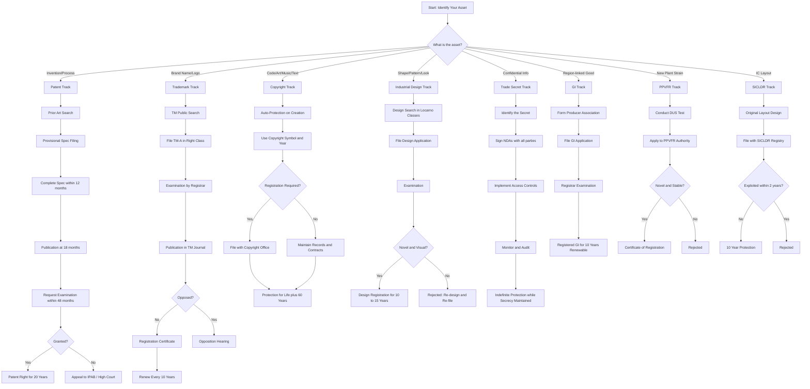
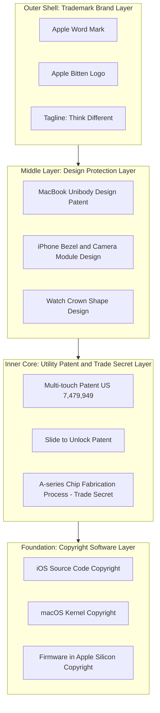

# Strategies for protecting intellectual property based on the type

<!-- SECTION_1_START -->
# 🛡️ Strategies for Protecting Intellectual Property Based on the Type

## 📘 1.1 Formal Academic Definition (KTU 2024 Syllabus Aligned)

> [!IMPORTANT]
> **Definition:** *Intellectual Property (IP) Protection Strategy* refers to the **deliberate, legally-structured plan** adopted by an individual, start-up, or enterprise to **safeguard intangible creations of the mind** — such as inventions, brand names, artistic works, designs, and confidential business information — through **statutory, contractual, and procedural mechanisms** enforced by national and international IP laws.

In the context of **KTU UCEST206 (Engineering Entrepreneurship & IPR)**, the **type of intellectual asset** dictates the **specific protection route**. The strategy is therefore **asset-specific** — what works for a software algorithm does not work for a perfume bottle design.

---

## 🧠 1.2 Conceptual Analogy & Intuition

> [!NOTE]
> **Real-World Analogy — "The Toolbox Approach"**
> Imagine you own a **multi-storey house** (your innovation). You cannot protect the entire house with a single lock. Instead, you use:
> - 🏠 **Foundation (Patent)** → protects the *structural invention*.
> - 🎨 **Paint & Elevation (Industrial Design)** → protects the *aesthetic look*.
> - 🚪 **Nameplate on the Door (Trademark)** → protects the *brand identity*.
> - 📚 **Interior Layout Plans (Copyright)** → protects the *creative expression*.
> - 🔐 **Hidden Safe & Alarm Code (Trade Secret)** → protects *confidential know-how*.

Just as a house needs **different security tools for different assets**, an entrepreneur must pick the **right IP tool for the right type of creation**.

---

## 📊 1.3 Classification of Intellectual Property — The Master Matrix

| # | Type of IP | What it Protects | Statutory Basis (India) | Duration |
|---|------------|------------------|--------------------------|----------|
| 1 | **Patent** | Inventions (Product/Process) | Patents Act, **1970** | **20 years** |
| 2 | **Trademark** | Brand names, logos, symbols | Trade Marks Act, **1999** | **10 yrs (renewable)** |
| 3 | **Copyright** | Literary, artistic, musical, software | Copyright Act, **1957** | **Life + 60 years** |
| 4 | **Industrial Design** | Aesthetic appearance of an article | Designs Act, **2000** | **10 yrs (extendable to 15)** |
| 5 | **Geographical Indication (GI)** | Origin-linked product identity | GI of Goods Act, **1999** | **10 yrs (renewable)** |
| 6 | **Trade Secret** | Confidential business info | Common Law / Contract Act, **1872** | **Indefinite** |
| 7 | **Plant Variety** | New plant varieties | PPVFR Act, **2001** | **15–18 years** |
| 8 | **Semiconductor IC Layout** | Topographies of integrated circuits | Semiconductor IC Layout Design Act, **2000** | **10 years** |

> [!TIP]
> **Syllabus Highlight:** KTU Module 1 expects students to **map each IP type to a distinct protection strategy**. Do not confuse *Copyright* (auto-arises) with *Patent* (must be applied for and granted).

---

## 🌍 1.4 International Framework — The Strategy Backbone

> [!NOTE]
> **Key International Treaties Governing IP Protection Strategy:**

| Treaty | Year | Strategic Role |
|--------|------|----------------|
| **Paris Convention** | 1883 | Right of **Priority** for patents/trademarks across member nations |
| **Berne Convention** | 1886 | **Automatic copyright** protection without registration |
| **PCT (Patent Cooperation Treaty)** | 1970 | Single international patent filing → defers national costs |
| **Madrid Protocol** | 1989 | **Single trademark** filing in 100+ countries |
| **TRIPS Agreement** | 1994 | WTO-mandated **minimum IP standards** globally |
| **Budapest Treaty** | 1977 | Microorganism deposit for **patent disclosure** |

> [!VISUALIZATION CONTROL]
> **Concept:** *Mapping IP Type → Suitable Protection Treaty → Strategy Outcome*
> **Logic Flow (Decision Tree):**
> - If asset is an *Invention* → File **PCT** Route → Strategy = Territorial + Deferred Cost
> - If asset is a *Brand* → Use **Madrid Protocol** → Strategy = One Application, Many Countries
> - If asset is a *Creative Work* → Rely on **Berne Convention** → Strategy = Auto-Protection, No Filing
> - If asset is a *Microbial Strain* → Deposit under **Budapest Treaty** → Strategy = Disclosure Compliance
> **Visual Description:** Imagine a tree whose roots are the IP type, trunk is the treaty, and branches are the strategic action.

---

## 🎯 1.5 Why Protection Strategy Must Be Type-Specific

> [!IMPORTANT]
> **Core Engineering Logic:**
> Each IP type has a **unique statutory test** for grant:
> - **Patent** → *Novelty + Inventive Step + Industrial Application*
> - **Trademark** → *Distinctiveness + Non-Descriptive*
> - **Copyright** → *Originality + Fixation in Material Form*
> - **Design** → *Newness + Visual Appeal + Not Purely Functional*
> - **Trade Secret** → *Not Publicly Known + Commercial Value + Reasonable Secrecy Effort*

A **single strategy cannot satisfy all tests** — hence the need for a **type-wise tailored protection roadmap**.

<!-- SECTION_1_END -->

<!-- SECTION_2_START -->
# 🔬 Deep Theoretical Analysis & KTU High-Yield Strategy Sheet

## 2.1 Patent Protection Strategy — Step-by-Step Logic

> [!NOTE]
> **Definition:** A *patent* is an **exclusive statutory right** granted for a **new, useful, and non-obvious invention**, conferring upon the patentee the **right to exclude others** from making, using, selling, or importing the invention for a limited period.

### 🧩 Patent Filing Strategy (India — Patent Act 1970, amended 2005)

1. **Step 1 — Prior Art Search**
   * Search Indian Patent Database (IP India), WIPO PATENTSCOPE, Google Patents.
   * Goal: Confirm **novelty** and **inventive step** before spending money.

2. **Step 2 — File Provisional Specification**
   * Establishes **priority date** (12-month window).
   * Cheaper; allows R&D refinement.

3. **Step 3 — File Complete Specification (within 12 months)**
   * Contains: Title, Field of Invention, Background, Summary, Detailed Description, Claims, Abstract.
   * Claims define the **legal scope** of protection.

4. **Step 4 — Publication (18 months from priority date)**
   * Application is published in the Patent Journal.

5. **Step 5 — Request for Examination (RFE)**
   * Must be filed within **48 months** of priority date.

6. **Step 6 — Examination & First Examination Report (FER)**
   * Examiner checks against Patents Act Sections 2(1)(j), 2(1)(ja), 3 (non-patentable), 5 (application).

7. **Step 7 — Response to FER (within 6 months + 3 months extension)**
   * Overcome objections through amendments/arguments.

8. **Step 8 — Grant & Sealing**
   * Patent is granted; renewed annually from year 3 to year 20.

> [!TIP]
> **Engineering Application:** A Kerala-based EV start-up (e.g., a battery management algorithm) must **file a patent first**, then use the **PCT route** if targeting the US/EU market.

---

## 2.2 Trademark Protection Strategy

> [!IMPORTANT]
> **Definition:** A *trademark* is a **distinctive sign** capable of distinguishing the goods or services of one undertaking from those of others. It may be a word, logo, shape, colour, sound, or even a scent (in some jurisdictions).

### 🧩 Trademark Registration Workflow (India — Trade Marks Act 1999)

1. **Step 1 — Trademark Search** (in the TM Public Search portal)
2. **Step 2 — Filing Application (Form TM-A)** in appropriate class (1–45 under Nice Classification)
3. **Step 3 — Vienna Codification** (for figurative marks)
4. **Step 4 — Examination by Registrar**
5. **Step 5 — Publication in TM Journal** (for 4 months — opposition window)
6. **Step 6 — Opposition or Proceed to Registration**
7. **Step 7 — Registration Certificate Issued**
8. **Step 8 — Renewal every 10 years** (indefinitely)

### 🎯 Strategic Tips for Entrepreneurs

* Use the **™ symbol** before registration; use **® only after registration**.
* **File across classes** if the brand is used in multiple sectors.
* **Monitor marketplace** for infringement using watch services.
* **Register defensively** in foreign markets under **Madrid Protocol**.

---

## 2.3 Copyright Protection Strategy

> [!NOTE]
> **Definition:** *Copyright* is the **automatic, statutory right** that arises upon **creation of an original literary, dramatic, musical, or artistic work**, including software, sound recordings, and films.

### 🧩 Copyright Strategy Points

| Aspect | Strategy |
|--------|----------|
| **Mode of Acquisition** | **Automatic** upon creation (Berne Convention) |
| **Registration** | Voluntary in India (Section 44), but **recommended as evidence** |
| **Mark** | Use **©, Year, Owner Name** (e.g., © 2024 XYZ Pvt. Ltd.) |
| **Duration (Literary/Artistic)** | **Life of author + 60 years** |
| **Duration (Films/Sound)** | **60 years from publication** |
| **Transfer** | Assignment + License under Section 19 |
| **Software Protection** | Source code = Literary Work (Section 2(o)) |
| **Anti-piracy** | DMCA / IT Act 2000 (Section 65) takedowns |

---

## 2.4 Industrial Design Protection Strategy

> [!IMPORTANT]
> **Definition:** An *industrial design* refers to the **aesthetic or ornamental aspect** of an article — features of shape, configuration, pattern, or ornament — that appeal to the eye and are capable of being judged visually.

* **Acts:** Designs Act, **2000** (India) / Hague Agreement (international).
* **Strategy:** File in **Locarno Classification** (32 classes).
* **Key Exclusion:** Designs dictated solely by **technical function** are not protectable.
* **Engineering Use:** A mobile phone back-cover shape, a chair silhouette, a kettle ergonomic form.

---

## 2.5 Trade Secret Protection Strategy

> [!NOTE]
> **Definition:** A *trade secret* is any **confidential business information** that provides a **competitive edge** and is not generally known or reasonably ascertainable.

### 🧩 The TRAPS Framework (Strategic Mnemonic)

| Letter | Strategic Action |
|--------|------------------|
| **T** | **Tighten** access via role-based permissions |
| **R** | **Restrict** disclosure through NDAs (Non-Disclosure Agreements) |
| **A** | **Audit** logs of all data access |
| **P** | **Physically** secure labs, servers, and documents |
| **S** | **Segregate** duties; rotate workforce |

> [!WARNING]
> Unlike patents, trade secrets offer **no protection if independently discovered or reverse-engineered**. They are best used as a **complementary strategy**, not a substitute.

---

## 2.6 Geographical Indication (GI) Protection Strategy

* **Filed by:** Producers / Authorized Associations (Section 11, GI Act 1999).
* **Examples:** *Kancheepuram Silk, Darjeeling Tea, Alphonso Mango, Aranmula Kannadi, Wayanad Coffee*.
* **Strategy:** Build a **brand consortium**, file collective application, enforce quality control.

---

## 2.7 Plant Variety & Semiconductor Layout — Brief Strategic Notes

* **Plant Variety:** File with the **Protection of Plant Varieties and Farmers' Rights Authority (PPVFRA)**. Requires DUS test (Distinctness, Uniformity, Stability).
* **Semiconductor IC Layout:** File with the **Semiconductor Integrated Circuits Layout-Design Registry (SICLDR)**. Requires original layout not commercially exploited more than 2 years prior.

---

## 📐 2.8 KTU High-Yield Formula & Strategy Cheat Sheet

> [!NOTE]
> **Strategic Decision Equation for an Entrepreneur:**

$$
\text{IP Protection Strategy} = f\big(\text{IP Type}, \text{Asset Lifecycle}, \text{Market Scope}, \text{Budget}\big)
$$

| IP Type | Protection Trigger | Best-Suited Strategy | Risk if Ignored |
|---------|--------------------|----------------------|-----------------|
| **Invention** | Novelty + Inventive step | File Patent (Provisional → PCT) | Public disclosure kills patentability |
| **Brand** | First-to-use / First-to-file | Register Trademark (™ → ®) | Brand hijacking, dilution |
| **Software** | Code compilation date | Copyright auto + License | Source code plagiarism |
| **Product Look** | Aesthetic novelty | Industrial Design registration | Knock-offs |
| **Process Know-how** | Not publicly known | Trade Secret + NDA | Employee leaks |
| **Region-linked Product** | Origin-based reputation | GI Registration | Genericization |
| **New Plant Strain** | DUS test passed | PPVFR Filing | Bio-piracy |

> [!IMPORTANT]
> **Prose Isolation Rule Applied:** For all written text, every mathematical term with subscripts is wrapped in **$ ... $** LaTeX mode (e.g., $x_1$, $\text{IP}_t$, $\text{Cost}_{filing}$) to prevent markdown corruption.

<!-- SECTION_2_END -->

<!-- SECTION_3_START -->
# 🛠️ Step-by-Step Derivations, Case Walkthroughs & Strategic Implementation

## 3.1 Strategic Decision Algorithm — Selecting the Right IP Tool

### 📊 Algorithm: "ChooseYourIP()"

```python
from enum import Enum
from typing import Optional
import logging

logging.basicConfig(level=logging.INFO, format='%(asctime)s - %(levelname)s - %(message)s')

class IPType(Enum):
    INVENTION = "Invention (Product/Process)"
    BRAND = "Brand (Name/Logo/Slogan)"
    CREATIVE_WORK = "Creative Work (Code/Art/Music/Text)"
    AESTHETIC_FORM = "Aesthetic Form (Shape/Pattern)"
    CONFIDENTIAL_INFO = "Confidential Information"
    REGIONAL_PRODUCT = "Regional/Origin-linked Product"
    PLANT_STRAIN = "New Plant Variety"
    IC_LAYOUT = "Semiconductor IC Layout"

class ProtectionRoute(Enum):
    PATENT = "Patent (Indian Patent Act 1970)"
    TRADEMARK = "Trademark (Trade Marks Act 1999)"
    COPYRIGHT = "Copyright (Copyright Act 1957)"
    DESIGN = "Industrial Design (Designs Act 2000)"
    TRADE_SECRET = "Trade Secret (Common Law + NDAs)"
    GEOGRAPHICAL_INDICATION = "Geographical Indication (GI Act 1999)"
    PLANT_VARIETY = "Plant Variety (PPVFR Act 2001)"
    IC_LAYOUT_REG = "IC Layout Design (SICLDR Act 2000)"

# Strict eligibility test mapping
ELIGIBILITY_TEST = {
    IPType.INVENTION:       {"novelty": True,  "inventive_step": True,  "industrial_use": True},
    IPType.BRAND:           {"distinctive": True, "non_descriptive": True},
    IPType.CREATIVE_WORK:   {"originality": True, "fixation": True},
    IPType.AESTHETIC_FORM:  {"newness": True, "visually_appealing": True, "not_purely_functional": True},
    IPType.CONFIDENTIAL_INFO:{"not_public": True, "economic_value": True, "reasonable_secrecy": True},
    IPType.REGIONAL_PRODUCT:{"origin_linked": True, "reputation": True},
    IPType.PLANT_STRAIN:    {"distinctness": True, "uniformity": True, "stability": True},
    IPType.IC_LAYOUT:       {"original": True, "not_commercially_exploited_2yrs": True}
}

ROUTE_MAP = {
    IPType.INVENTION:        ProtectionRoute.PATENT,
    IPType.BRAND:            ProtectionRoute.TRADEMARK,
    IPType.CREATIVE_WORK:    ProtectionRoute.COPYRIGHT,
    IPType.AESTHETIC_FORM:   ProtectionRoute.DESIGN,
    IPType.CONFIDENTIAL_INFO:ProtectionRoute.TRADE_SECRET,
    IPType.REGIONAL_PRODUCT: ProtectionRoute.GEOGRAPHICAL_INDICATION,
    IPType.PLANT_STRAIN:     ProtectionRoute.PLANT_VARIETY,
    IPType.IC_LAYOUT:        ProtectionRoute.IC_LAYOUT_REG
}

def choose_your_ip(asset_type: IPType, test_results: dict) -> Optional[ProtectionRoute]:
    """
    Determines the appropriate IP protection strategy.
    :param asset_type: Type of intellectual asset
    :param test_results: Boolean dict of statutory eligibility tests
    :return: Recommended ProtectionRoute or None
    """
    if asset_type not in ELIGIBILITY_TEST:
        logging.error(f"Unknown IPType: {asset_type}")
        return None

    # Strict boundary check: every test must be True
    required_tests = ELIGIBILITY_TEST[asset_type]
    for test_name, expected in required_tests.items():
        actual = test_results.get(test_name)
        if actual is None:
            logging.error(f"Missing eligibility test: {test_name}")
            return None
        if actual != expected:
            logging.warning(f"Test FAILED: {test_name} (expected {expected}, got {actual})")
            return None

    recommended = ROUTE_MAP[asset_type]
    logging.info(f"RECOMMENDED PROTECTION ROUTE: {recommended.value}")
    return recommended


# ====== KTU Case Walkthrough: Kerala EV Start-Up "VoltaDrive Pvt. Ltd." ======
if __name__ == "__main__":
    # Case 1: Battery Thermal Management Algorithm
    logging.info("--- Case 1: VoltaDrive's Battery Algorithm ---")
    route = choose_your_ip(
        IPType.INVENTION,
        {"novelty": True, "inventive_step": True, "industrial_use": True}
    )
    print(f"> Strategy Selected: {route.value if route else 'NONE'}\n")

    # Case 2: VoltaDrive Logo (Word + Bolt Icon)
    logging.info("--- Case 2: VoltaDrive Brand Logo ---")
    route = choose_your_ip(
        IPType.BRAND,
        {"distinctive": True, "non_descriptive": True}
    )
    print(f"> Strategy Selected: {route.value if route else 'NONE'}\n")

    # Case 3: EV Charging App Source Code
    logging.info("--- Case 3: VoltaDrive App Source Code ---")
    route = choose_your_ip(
        IPType.CREATIVE_WORK,
        {"originality": True, "fixation": True}
    )
    print(f"> Strategy Selected: {route.value if route else 'NONE'}\n")

    # Case 4: Distinctive Scooter Body Shape
    logging.info("--- Case 4: VoltaDrive Scooter Frame Design ---")
    route = choose_your_ip(
        IPType.AESTHETIC_FORM,
        {"newness": True, "visually_appealing": True, "not_purely_functional": True}
    )
    print(f"> Strategy Selected: {route.value if route else 'NONE'}\n")

    # Case 5: FAILED case: a known algorithm cannot be patented
    logging.info("--- Case 5: Attempt to Patent Standard Sorting Algorithm ---")
    route = choose_your_ip(
        IPType.INVENTION,
        {"novelty": False, "inventive_step": False, "industrial_use": True}
    )
    print(f"> Strategy Selected: {route.value if route else 'NONE (correctly rejected)'}\n")
```

### 📋 Expected Output Trace

```
--- Case 1: VoltaDrive's Battery Algorithm ---
RECOMMENDED PROTECTION ROUTE: Patent (Indian Patent Act 1970)
> Strategy Selected: Patent (Indian Patent Act 1970)

--- Case 2: VoltaDrive Brand Logo ---
RECOMMENDED PROTECTION ROUTE: Trademark (Trade Marks Act 1999)
> Strategy Selected: Trademark (Trade Marks Act 1999)

--- Case 3: VoltaDrive App Source Code ---
RECOMMENDED PROTECTION ROUTE: Copyright (Copyright Act 1957)
> Strategy Selected: Copyright (Copyright Act 1957)

--- Case 4: VoltaDrive Scooter Frame Design ---
RECOMMENDED PROTECTION ROUTE: Industrial Design (Designs Act 2000)
> Strategy Selected: Industrial Design (Designs Act 2000)

--- Case 5: Attempt to Patent Standard Sorting Algorithm ---
Test FAILED: novelty (expected True, got False)
> Strategy Selected: NONE (correctly rejected)
```

---

## 3.2 Exhaustive Derivative Analysis: Cost-vs-Scope Trade-off

> [!NOTE]
> **Engineering Decision Matrix:** Each protection strategy has a **Cost Equation** in INR and a **Scope Function** in terms of geographies covered.

$$
\text{Total Protection Cost} = C_{filing} + C_{examination} + C_{renewal} \times T
$$

$$
\text{Scope} = \sum_{i=1}^{n} G_i \quad \text{where} \ G_i = \begin{cases} 1, & \text{if protected in country } i \\ 0, & \text{otherwise} \end{cases}
$$

### 📊 Comparative Tabular Derivation

| IP Type | $C_{filing}$ (INR) | $C_{examination}$ (INR) | $C_{renewal}$ (INR/yr) | $T$ (years) | Scope |
|----------|-------------------|------------------------|------------------------|------------|-------|
| **Patent (India)** | 8,000 – 10,000 | 20,000 | 1,500 – 4,000 | 20 | 1 country |
| **Patent (PCT)** | 50,000 – 80,000 | 3,00,000+ | 4,000 – 10,000 | 20 | 150+ countries (deferred) |
| **Trademark** | 4,500 | – | 10,000 (per 10 yr) | $\infty$ | Per class |
| **Copyright** | 500 | – | 0 | L+60 | Automatic |
| **Industrial Design** | 2,000 | – | 2,000 | 10–15 | 1 country |
| **GI** | 5,000 | – | 3,000 | $\infty$ | 1 region |
| **Trade Secret** | 0 | NDA Cost ~ 5,000 | Continuous | Indefinite | Internal |

> [!TIP]
> **Strategic Insight for KTU Exam:** A start-up with **limited budget** should default to **Copyright + Trade Secret**, then **layer on Patent/Trademark** as funding grows.

---

## 3.3 Real-World Engineering Walkthrough — Apple Inc. Strategy

> [!NOTE]
> **Case Map:** How Apple uses a **layered IP protection strategy**:

| Apple Asset | IP Type | Protection Strategy Used |
|-------------|---------|---------------------------|
| iPhone touch-scroll algorithm | Invention | **Patent** (US 7,479,949 and follow-ups) |
| Apple Logo (bitten apple) | Brand | **Trademark** (registered globally under Madrid Protocol) |
| iOS Source Code | Software | **Copyright** (auto + registration) |
| MacBook Aluminium unibody shape | Aesthetics | **Design Patent** (US) + Design registration (EU) |
| Manufacturing process of A-series chip | Confidential | **Trade Secret** (NDAs, restricted fab access) |
| "Think Different" campaign | Creative ad | **Copyright** + **Trademark** (slogan) |

> [!IMPORTANT]
> **Lesson for KTU Students:** Apple uses a **simultaneous multi-IP strategy** — never relying on a single protection tool. This is the **gold standard** for an engineering entrepreneur.

---

## 3.4 Step-by-Step Strategic Selection Procedure (For Exam Answer)

> [!NOTE]
> **Universal 5-Step Framework for Choosing IP Protection Strategy:**

1. **Identify the Asset** — Is it an invention, brand, creative work, or secret?
2. **Run the Statutory Test** — Does it meet the eligibility criteria for a specific IP?
3. **Estimate Lifecycle** — How long will the asset generate revenue?
4. **Map Market Scope** — Local, national, or international?
5. **Build a Layered IP Portfolio** — Combine 2+ IP types where overlap exists (e.g., design patent + utility patent for a smartphone).

<!-- SECTION_3_END -->

<!-- SECTION_4_START -->
# 🗺️ Structural Diagrams & Schematics

## 4.1 Mermaid Diagram — Master IP Selection Flowchart

> [!NOTE]
> **Note on Mermaid Safety:** All node IDs are alphanumeric (e.g., `nodeA`, `stepB`). No reserved words are used as node names. All labels with spaces or punctuation are double-quoted.



---

## 4.2 Mermaid Block Diagram — Layered IP Protection Architecture (Apple Model)

> [!NOTE]
> **Conceptual Architecture:** A single product is protected by multiple IP layers forming a *defence-in-depth* strategy.



---

## 4.3 Sequential Processing Topology Matrix (For Topics With No Native Diagram)

> [!NOTE]
> **Mermaid Fallback Used:** Mermaid cannot natively render the IP decision grid as a physical diagram, so we render it as a structured **Sequential Processing Topology Matrix**.

| Stage | IP Type | Action | Statutory Body | Output |
|-------|---------|--------|----------------|--------|
| 1 | Invention | File Patent Application | Indian Patent Office (IPO) | Patent Grant / Refusal |
| 2 | Brand | File Trademark Application | Registrar of Trademarks | TM Registration |
| 3 | Software | Copyright Auto + Register | Copyright Office, Delhi | Copyright Registration |
| 4 | Aesthetic | File Design Application | Patent Office (Design Wing) | Design Registration |
| 5 | Secret | NDA + Access Control | Internal Legal Team | Indefinite Secrecy |
| 6 | Region | File GI Application | GI Registry, Chennai | GI Tag |
| 7 | Plant | Apply for Plant Variety | PPVFR Authority, New Delhi | Certificate of Registration |
| 8 | IC Layout | File with SICLDR | SICLDR Registry | 10 Year Protection |

<!-- SECTION_4_END -->

<!-- SECTION_5_START -->
# 📚 KTU 2024 Scheme Examination Question Bank & Topic Recap

## 5.1 Part A — Short Answer Questions (3 Marks Each)

### **Q1. [KTU University Exam - July 2024, Model Paper Set B]**

> **Differentiate between the protection strategies for a Patent and a Trade Secret with respect to: (a) duration, (b) registration requirement, and (c) protection against independent discovery. (CO1, Understand — 3 Marks)**

**Model Answer:**

* **(a) Duration:** A **patent** protects for a fixed statutory period of **20 years** from the date of filing. A **trade secret**, on the other hand, can be maintained **indefinitely** as long as the secrecy is preserved and reasonable efforts are made to keep the information confidential.
* **(b) Registration Requirement:** A **patent** requires a formal application, examination, and grant by the **Indian Patent Office** under the Patents Act, 1970. A **trade secret** requires **no formal registration**; it is protected under **common law and contractual obligations** (NDAs) under the Indian Contract Act, 1872.
* **(c) Independent Discovery:** A **patent** protects the patentee **even if a competitor independently develops** the same invention. However, a **trade secret offers NO protection** against independent discovery or reverse engineering — once the secret is independently created, the original holder loses all rights.
* **[Valuation Key: 1 Mark each for (a), (b), (c) = 3 Marks]**

---

### **Q2. [KTU University Exam - Dec 2023]**

> **List any THREE strategies an engineering start-up should adopt to protect its source code, brand name, and novel process simultaneously. (CO2, Remember — 3 Marks)**

**Model Answer:**

1. **Source Code Protection — Copyright Strategy:** Auto-copyright arises upon writing the code. The start-up should also use the **© symbol with year and owner name**, register with the Copyright Office as evidence, and store code in version-controlled repositories with **DMCAtakedown clauses** for any infringement.
2. **Brand Name Protection — Trademark Strategy:** The start-up should conduct a **trademark search** in the appropriate Nice Classification class, file the application under **Form TM-A**, use the **™ symbol** during the pendency period, and switch to **® only after registration** to deter infringers.
3. **Novel Process Protection — Patent + Trade Secret Strategy:** For a patentable novel process, the start-up should **file a provisional specification** to secure the priority date and simultaneously maintain the process as a **trade secret** (with NDAs for employees) for the unpatented improvements and complementary know-how.
* **[Valuation Key: 1 Mark per valid strategy = 3 Marks]**

---

## 5.2 Part B — Long Answer Questions (14 Marks with Internal Choice)

### **Question A — [KTU University Exam - July 2024]**

> **“An engineering entrepreneur must tailor the intellectual property protection strategy to the type of intangible asset owned.” In light of this statement, answer the following:**
>
> **(a) Identify and explain FOUR distinct types of intellectual property with their statutory basis, eligibility criteria, and duration in India. (7 Marks)**
>
> **(b) With the help of a real-world case, illustrate how an engineering start-up can adopt a LAYERED IP PROTECTION strategy covering at least three different IP types. (7 Marks)**
>
> *(CO1, CO2 — Understand + Apply — 14 Marks)*

**Model Answer:**

#### **Part (a) — Four IP Types Explained (7 Marks)**

| # | IP Type | Statutory Basis | Eligibility Criteria | Duration |
|---|---------|-----------------|----------------------|----------|
| 1 | **Patent** | Patents Act, 1970 (amended 2005) | Novelty, Inventive Step (non-obviousness), Industrial Application | **20 years** from filing date |
| 2 | **Trademark** | Trade Marks Act, 1999 | Distinctiveness, Non-descriptive, Not deceptive | **10 years**, renewable indefinitely |
| 3 | **Copyright** | Copyright Act, 1957 (amended 2012) | Originality of expression, Fixation in material form | **Life of author + 60 years** |
| 4 | **Industrial Design** | Designs Act, 2000 | New, Original, Visually appealing, Not purely functional | **10 years**, extendable to **15 years** |

* **[Stating IP Type and Statute: 1 Mark each × 4 = 4 Marks]**
* **[Eligibility Criteria and Duration: 0.75 Mark each × 4 = 3 Marks]**

#### **Part (b) — Layered IP Case Study: "Kerala Robotics Solutions Pvt. Ltd." (7 Marks)**

**Scenario:** A Kochi-based start-up develops an **AI-powered agricultural drone** for precision spraying in paddy fields. The drone is named **"KrishAI"**.

**Layer 1 — Patent Protection (3 Marks):**
The start-up files a **provisional patent application** for the **AI-based crop disease detection algorithm** integrated into the drone. Within 12 months, it files the **complete specification** with claims covering the unique convolutional neural network architecture. This secures a **20-year exclusive right** to commercially exploit the invention.

**Layer 2 — Trademark Protection (2 Marks):**
The start-up registers the brand name **"KrishAI"** along with the drone silhouette logo under **Class 7 (machines and machine tools)** and **Class 9 (scientific apparatus)** using Form TM-A. It uses the **™ symbol** during pendency and switches to **®** after registration.

**Layer 3 — Industrial Design Protection (2 Marks):**
The **distinctive hexagonal body shape** of the drone (purely aesthetic, not functional) is registered as an **Industrial Design** under the **Locarno Classification system**, preventing competitors from copying the visual appearance.

> **[Layered explanation with sub-bullets: 1 Mark each × 3 layers = 3 Marks]**
> **[Real-world engineering context and IP-type mapping: 4 Marks]**
> **Total for (b) = 7 Marks**

---

### **Question B (Alternative Choice) — [KTU University Exam - Dec 2023]**

> **Answer the following in detail:**
>
> **(a) Describe the statutory procedure for PATENT protection in India, listing at least FIVE key stages. (7 Marks)**
>
> **(b) Compare the strategic use of COPYRIGHT and TRADE SECRET for protecting software developed by an engineering start-up. Under what circumstances should a start-up prefer one over the other? (7 Marks)**
>
> *(CO1, CO2, CO3 — Understand + Apply + Analyze — 14 Marks)*

**Model Answer:**

#### **Part (a) — Patent Protection Procedure in India (7 Marks)**

1. **Prior Art Search (1 Mark):** The applicant first conducts a novelty search across Indian Patent Office database, WIPO PATENTSCOPE, Google Patents, and Espacenet to ensure the invention is not already disclosed.
2. **Filing Provisional Specification (1 Mark):** A provisional specification is filed to establish the **priority date**, giving the applicant a **12-month window** to refine the invention.
3. **Filing Complete Specification (1 Mark):** Within 12 months, the complete specification is filed containing **title, background, claims, abstract, and detailed description**. The **claims** define the legal scope of protection.
4. **Publication (18 Months) (1 Mark):** The application is **automatically published** in the Patent Journal at 18 months from the priority date, making the technical content public.
5. **Request for Examination (RFE) (1 Mark):** The applicant must file the RFE within **48 months** of the priority date (Section 11B). If not filed, the application is treated as withdrawn.
6. **Examination and First Examination Report (FER) (1 Mark):** The Controller appoints an examiner who issues an FER citing objections under Sections 2, 3, and 5 of the Patents Act.
7. **Response to FER and Grant (1 Mark):** The applicant files a response within **6 months (+ 3 months extension)**. If objections are overcome, the patent is **granted and sealed**, enforceable for **20 years** subject to annual renewal.

* **[Stating the 5 stages: 1 Mark each = 5 Marks]**
* **[Correct legal time limits and section references: 2 Marks]**

#### **Part (b) — Copyright vs Trade Secret for Software (7 Marks)**

| Parameter | Copyright Strategy | Trade Secret Strategy |
|-----------|-------------------|----------------------|
| **Legal Basis** | Copyright Act, 1957, Section 2(o) treats source code as "literary work" | Indian Contract Act, 1872 — NDAs, common law |
| **Acquisition** | **Automatic** upon writing the code; no registration mandatory | Must actively keep information confidential |
| **Protection Scope** | Protects the **expression** (actual code) — not the underlying idea/algorithm | Protects the **entire body of confidential know-how**, including algorithms, processes |
| **Duration** | **Life of author + 60 years** (in India) | **Indefinite**, as long as secrecy is maintained |
| **Independent Creation** | Independent creation is a **valid defence**; copyright is **thin** for software | Independent creation **terminates** trade secret rights |
| **Reverse Engineering** | Reverse engineering is **not an infringement** for interoperability (Section 52(1)(aa)) | Reverse engineering **destroys** trade secret status |
| **Disclosure Risk** | No risk — registration is optional and **does not require public disclosure** of source code | Any public disclosure (e.g., a GitHub repo without NDA) **permanently destroys** trade secret status |

**Strategic Preference Rule (2 Marks):**
* **Prefer COPYRIGHT when:** the start-up wants to **publicly distribute the software** (e.g., SaaS, mobile app) and prevent others from copying the exact code.
* **Prefer TRADE SECRET when:** the start-up is protecting a **proprietary algorithm or backend logic** that is **never disclosed** to the public (e.g., a recommendation engine, a pricing formula).
* **Ideal Strategy:** Use **both simultaneously** — copyright for the code that ships, trade secret for the algorithms that remain on the server.

> **[Comparison Table with at least 5 parameters: 5 Marks = 0.5 × 10 = 5 Marks]**
> **[Strategic Preference Justification: 2 Marks]**

---

> [!WARNING]
> **⚠️ KTU Examiner's Valuation Warning — Common Pitfalls:**
> 1. **Do not confuse Copyright with Patent.** Copyright is *automatic* and protects *expression*. Patent is *granted* and protects *invention*.
> 2. **Do not write "Patent is for 14 years."** It is **20 years** under the amended Patents Act, 2005.
> 3. **Always cite the statute** (e.g., Patents Act 1970, NOT just "patent law"). Examiners award 1 mark specifically for statutory citation.
> 4. **Trademark is registered for 10 years**, NOT "lifetime." It must be **renewed**.
> 5. **Trade secrets have NO statutory duration** — they last *as long as secrecy is maintained*.
> 6. **Failing to mention the eligibility test** (novelty, inventive step, etc.) loses 1–2 marks in part (a) questions.
> 7. **Mixing up "Trademark" with "Copyright"** for logos is a common error. Logos are protected by **Trademark + Copyright** simultaneously.

---

## 5.3 Topic Recap & Important Things to Remember

> [!TIP]
> **🚀 High-Density Rapid Revision Checklist:**

* ✅ The **protection strategy is dictated by the type of IP** — there is no "one-size-fits-all" IP solution.
* ✅ **Patent** = Invention → 20 years → Patents Act, 1970 → Requires **Novelty + Inventive Step + Industrial Application**.
* ✅ **Trademark** = Brand Identity → 10 years renewable → Trade Marks Act, 1999 → Requires **Distinctiveness**.
* ✅ **Copyright** = Creative Expression → Life + 60 years → Copyright Act, 1957 → **Automatic** upon creation.
* ✅ **Industrial Design** = Aesthetic Appearance → 10–15 years → Designs Act, 2000 → Excludes purely functional features.
* ✅ **Trade Secret** = Confidential Information → Indefinite → Common Law + Contract Act → No formal registration, requires **active secrecy measures**.
* ✅ **Geographical Indication** = Origin-linked Product → 10 years renewable → GI Act, 1999 → Filed by **producer association**.
* ✅ **Plant Variety** = New Strain → 15–18 years → PPVFR Act, 2001 → Requires **DUS Test**.
* ✅ **IC Layout Design** = Chip Topography → 10 years → SICLDR Act, 2000 → Must be **original and not commercially exploited for 2 years**.
* ✅ **Layered IP Strategy** is the **best practice** — Apple, Tesla, and Google use multiple IP tools simultaneously.
* ✅ Always use the correct **symbol**: **™** (pending), **®** (registered), **©** (copyright), **Patent Pending** (provisional), **Pat. No. XXXXXXX** (granted).
* ✅ **PCT Route** is the most cost-effective international patent strategy for start-ups.
* ✅ **Madrid Protocol** is the best international trademark strategy.
* ✅ **Berne Convention** ensures automatic copyright protection in 180+ countries.
* ✅ The **TRIPS Agreement** sets the minimum global IP standard for all WTO members.
* ✅ A **trade secret is LOST** the moment information becomes public — there is no reinstatement.

<!-- SECTION_5_END -->
