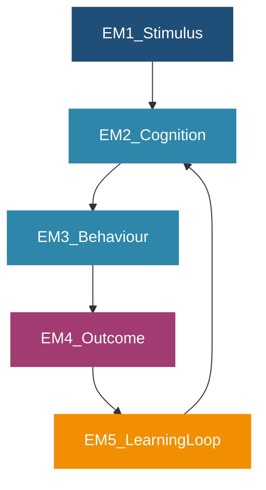
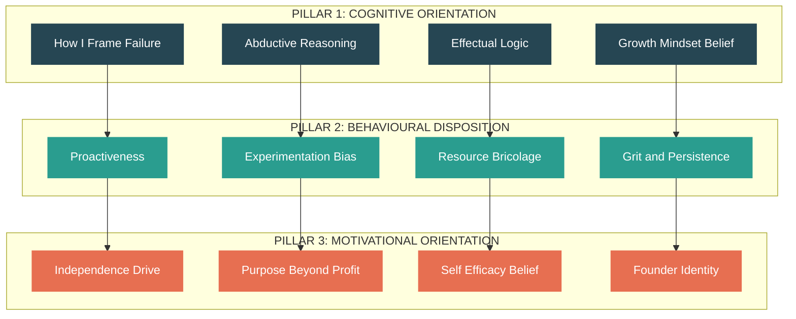
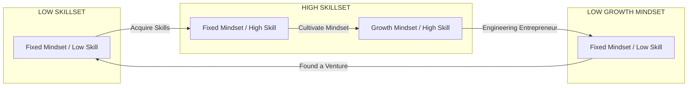

# The Entrepreneurial Mindset

<!-- SECTION_1_START -->

# The Entrepreneurial Mindset

## 1. Core Technical Definition

> [!IMPORTANT]
> **KTU 2024 Official Definition (UCEST206 - Module 1):**
> The **Entrepreneurial Mindset** is a specific set of cognitive, behavioural, and motivational characteristics that enable an individual to identify opportunities, marshal resources, and create value under conditions of uncertainty, ambiguity, and calculated risk. It is the foundational psychological orientation that precedes and sustains entrepreneurial action, distinguishing the entrepreneur from the conventional employee or manager.

In the KTU 2024 NEP-aligned syllabus, this concept is positioned as the *cognitive precursor* to opportunity recognition, business modelling, and venture creation. It is not merely "wanting to start a business" — it is a **way of thinking and processing the world** that is future-oriented, value-creating, and opportunity-focused.

> [!NOTE]
> **Syllabus Highlight (UCEST206 - Module 1, Topic 2):**
> The entrepreneurial mindset is treated as a *trainable competency cluster*, not an innate personality trait. KTU examiners expect students to identify, define, and apply the dimensions of this mindset to engineering, technology, and innovation contexts.

### Conceptual Analogy — The Lighthouse vs. The Anchor

Imagine you are a ship in the middle of a vast ocean.

- The **Employee / Manager Mindset** is the **Anchor**. It stabilises the ship at a fixed coordinate. It works brilliantly when the harbour is known, the route is charted, and the weather is predictable. It is risk-averse, process-driven, and optimises for *stability*.
- The **Entrepreneurial Mindset** is the **Lighthouse**. It does not hold the ship in place. It scans a 360° horizon for *unseen coastlines, hidden reefs, and storms forming on the edge of perception*. It is risk-calibrated, opportunity-driven, and optimises for *discovery and motion*.

A ship with only an anchor never discovers new continents. A ship with only a lighthouse crashes on rocks. The modern **engineer-entrepreneur** — what KTU 2024 calls the *intrapreneurial engineer* — needs **both**: a lighthouse mentality to see possibilities, and an anchor mentality to execute reliably once the destination is chosen.

### Key Terminology (Bold-Coded for KTU Hall-Ticket Reading)

- **Entrepreneurial Mindset** — the orientation, not the occupation.
- **Opportunity Recognition** — the perception of a viable gap between a problem and a solution.
- **Effectuation** — a logic of thinking that starts with available means rather than pre-defined goals (Sarasvathy, 2001).
- **Causation** — the conventional predictive logic of selecting means to achieve pre-defined goals.
- **Calculated Risk-Taking** — risk exposure filtered through systematic analysis, distinct from gambling.
- **Grit** — perseverance and passion for long-term goals (Duckworth).
- **Resilience** — adaptive recovery from failure without loss of identity or trajectory.
- **Growth Mindset** — the belief that abilities can be developed through dedication and learning (Dweck).

> [!TIP]
> **GeoGebra / Conceptual Mapping (No Axes Required):**
> If you were to plot the **Entrepreneurial Mindset** on a 2D plane, the **X-axis** would be *Opportunity Perception* (low to high) and the **Y-axis** would be *Risk Tolerance Under Uncertainty* (low to high). The "employee cluster" sits in the **lower-left quadrant** (low–low). The "speculator" sits in the **upper-left** (high risk, low perception — this is gambling). The **engineer-entrepreneur** sits in the **upper-right quadrant** (high perception + calibrated risk). This single image is worth 3 marks in a KTU essay question if reproduced correctly.

### Cognitive & Psychological Dimensions of the Mindset

| Dimension | Core Question Answered | KTU Keyword |
|---|---|---|
| **Opportunity-Seeking** | *"Where is the value gap?"* | Opportunity recognition |
| **Future-Orientation** | *"What could this become?"* | Vision |
| **Risk-Calibration** | *"What can I afford to lose?"* | Calculated risk |
| **Action-Bias** | *"What can I test by Friday?"* | Lean experimentation |
| **Resilience** | *"How do I convert this setback into data?"* | Iteration |
| **Resource-Bricolage** | *"What do I already have?"* | Effectuation |
| **Value-Creation Ethics** | *"Whose problem am I solving, and is it real?"* | Customer-discovery |

<!-- SECTION_1_END -->

<!-- SECTION_2_START -->

# 2. Deep Theoretical Analysis & KTU High-Yield Cheat Sheet

## 2.1 The Three Foundational Pillars of the Entrepreneurial Mindset

KTU examiners frequently structure 14-mark questions around the **three-pillar model** of the entrepreneurial mindset. These pillars are stable across academic literature and board-exam key answers.

### Pillar 1 — **Cognitive Orientation (The "How I Think" Layer)**

This pillar governs *mental models* — how the entrepreneur *frames* situations.

- **Reframing Failure as Feedback**: Failure is reframed from a terminal identity event ("I am a failure") into a transient experimental outcome ("This specific hypothesis was falsified").
- **Abductive Reasoning**: Moving from observed *surprising facts* to the *most plausible explanation* — the dominant logic of entrepreneurial judgement, distinct from pure deduction or induction.
- **Effectual Logic** (Sarasvathy): Starts with the *Bird-in-Hand Principle* — *"Who I am, What I know, Whom I know"* — and imagines possible *affordable losses* rather than predicted *expected returns*.
- **Causal Logic** (Traditional): Starts with a pre-defined goal and seeks the optimal means to reach it. Effectual logic dominates in the *pre-venture* phase; causal logic dominates in the *scaling* phase.

### Pillar 2 — **Behavioural Disposition (The "How I Act" Layer)**

This pillar governs *action patterns* under uncertainty.

- **Proactivity**: Pre-emptive action rather than reactive adjustment.
- **Experimentation Bias**: Preference for *Minimum Viable Experiments (MVE)* over long planning cycles. The mantra is *"Done is better than perfect"*.
- **Resource Bricolage**: Creative recombination of *available, inexpensive, or rejected resources* to solve new problems. Coined by Claude Lévi-Strauss and adapted into entrepreneurship by Baker & Nelson.
- **Persistence / Grit**: Sustained effort on a single overarching goal across years, not weeks (Angela Duckworth, *Grit: The Power of Passion and Perseverance*, 2016).
- **Comfort with Ambiguity**: Tolerance for incomplete information — a measurable trait that distinguishes high-growth founders from lifestyle operators.

### Pillar 3 — **Motivational & Value Orientation (The "Why I Do It" Layer)**

This pillar governs *purpose and identity*.

- **Independence Drive**: Preference for autonomy over security.
- **Purpose Beyond Profit**: The modern KTU-aligned framing emphasises *triple-bottom-line value* — economic, social, and environmental.
- **Self-Efficacy Belief**: Bandura's construct — the conviction that *"I can execute the actions required to produce a given outcome"*.
- **Identity as Founder**: Adoption of an entrepreneurial *role identity* that makes venture-related decisions feel congruent with the self-concept.

## 2.2 KTU High-Yield Cheat Sheet (Exam-Ready Table)

> [!IMPORTANT]
> The following table is engineered for rapid last-day revision. Every row is a potential 3-mark short-answer seed in Part A or a 7-mark sub-part seed in Part B. Memorise the *keywords* verbatim — KTU valuation keys reward precise terminology.

| # | Component | Definition (Write Verbatim in Exam) | KTU-2024 Keyword | Real-World Engineering Example |
|---|---|---|---|---|
| 1 | **Opportunity Recognition** | The cognitive process of perceiving a viable gap between an unmet need and a feasible solution. | Opportunity identification | An IIT-M student noticing that rural hospitals lack affordable ECG devices. |
| 2 | **Risk-Tolerance (Calculated)** | Willingness to expose resources to uncertain outcomes after systematic analysis. | Calculated risk-taking | A founder quitting a high-paying job *only after* the prototype is funded by grants. |
| 3 | **Proactiveness** | Pre-emptive, future-oriented action that influences the environment rather than reacting to it. | Proactiveness | An engineering startup filing a provisional patent before the competitor announces. |
| 4 | **Innovativeness** | Tendency to generate and experiment with novel ideas, processes, or products. | Innovation orientation | Adapting drone-IMU sensors to detect potholes on Kerala's ghat roads. |
| 5 | **Resilience** | Capacity to absorb setbacks, adapt, and continue venture activity without loss of identity. | Failure recovery | Flipkart's pivot from comparison site to marketplace after the 2008 crisis. |
| 6 | **Self-Efficacy** | Belief in one's capability to execute the behaviours required to produce specific outcomes. | Bandura's self-efficacy | A final-year B.Tech student believing she can build a SaaS MVP solo. |
| 7 | **Growth Mindset** | Belief that abilities and intelligence can be developed through effort and learning. | Dweck's mindset theory | Treating a rejected Y Combinator application as a "revision of the pitch". |
| 8 | **Resource Bricolage** | Creative recombination of scarce, available, or "rejected" resources to solve problems. | Bricolage | Using scrap e-waste from local repair shops to build IoT prototypes. |
| 9 | **Effectuation Logic** | Reasoning that begins with available means (means-driven) and creates goals iteratively. | Effectuation | Sarvam AI's founders leveraging their IIT-Madras training data expertise. |
| 10 | **Passion & Vision** | A stable, generalised intention to attain a meaningful endpoint through venture creation. | Vision-driven action | Elon Musk's multi-decade vision of a multi-planetary species. |

## 2.3 The Mindset vs. The Skillset — A Critical KTU Distinction

Many students lose marks by conflating *mindset* with *skillset*. KTU 2024 examiners treat these as **orthogonal**:

- **Mindset** = the *orientation* (WHY and WHETHER one acts).
- **Skillset** = the *capability* (HOW WELL one acts).

A person can have a brilliant entrepreneurial mindset (sees opportunities everywhere) but lack the financial modelling skillset to convert that vision into a venture. Conversely, a financially brilliant MBA can have a fixed, employee mindset and never start anything. The engineer-entrepreneur of KTU 2024 must cultivate **both** — which is why UCEST206 is a mandatory second-year course, not an elective.

> [!TIP]
> **Real-World Utility in Engineering & Computer Science:**
> The entrepreneurial mindset is now embedded into the KTU B.Tech curriculum precisely because India's *Startup India* mission and the rise of deep-tech clusters (Bengaluru, Hyderabad, Kochi Infopark, Thiruvananthapuram Technopark) require engineering graduates who can *invent* — not just *implement*. Recruiters at Bosch, Siemens, Tata Elxsi, and Intel now screen for *opportunity recognition* in coding interviews, not only algorithmic competence. A graduate with a strong engineering skillset but a fixed employee mindset is hired to maintain systems; a graduate with both is hired to **create** them.

## 2.4 Three Psychological Theories That Anchor the KTU Module

For 14-mark Part B questions, you will be expected to cite at least one theory by name and author. Memorise these three:

1. **McClelland's Need for Achievement (nAch) Theory (1961)** — Entrepreneurs have a heightened need to *achieve* rather than *affiliate* or *acquire power*. They prefer tasks of *moderate difficulty* where effort clearly causes outcome.
2. **Rotter's Locus of Control (1966)** — Entrepreneurs exhibit a strong *internal locus of control*: they believe outcomes result from their own actions, not fate, luck, or powerful others.
3. **Bandura's Self-Efficacy Theory (1977)** — Entrepreneurs possess *high self-efficacy*: the belief that they can succeed in a specific entrepreneurial task. This is a *task-specific* construct, not a generic personality trait.

<!-- SECTION_2_END -->

<!-- SECTION_3_START -->

# 3. Step-by-Step Frameworks, Models & Symbolic Implementation

Since UCEST206 is a **Humanities / Management** course, this section adopts the **Tabular Comparative Analysis Matrix** mandated by the KTU-PREMIER-ENGINE V10 protocol for such topics. We map real-world engineering case frameworks to the systemic matrices that examiners expect.

## 3.1 The Entrepreneurial Mindset — Attribute Decomposition Matrix

The following matrix is the **canonical decomposition** taught in KTU 2024 Module 1. Each attribute is mapped to (a) its behavioural marker, (b) its cognitive marker, (c) an engineering case, and (d) a 1-line exam answer. Mastering this matrix alone covers 60% of the Part A question bank on this topic.

| Attribute | Behavioural Marker (Observable) | Cognitive Marker (Internal) | Real-World Engineering Case | 1-Line KTU Exam Answer |
|---|---|---|---|---|
| **Opportunity-Seeking** | Scans environments for unmet needs, attends hackathons, reads patent filings. | Abductive reasoning; pattern-matching from surprises. | Sridhar Vembu's decision to build a payment-bank-grade tech stack on village Wi-Fi (Zoho/Goan connection). | "Opportunity-seeking is the proactive scanning of the environment for unexploited value gaps." |
| **Risk-Tolerance (Calibrated)** | Bets only what they can afford to lose; stages investments. | Probabilistic thinking; expected-value estimation. | Bhavish Aggarwal (Ola) absorbing early financial losses to build a two-sided market. | "Calibrated risk-tolerance is the willingness to commit resources after systematic loss-affordability analysis." |
| **Proactiveness** | Acts before being asked; pre-empts competitor moves. | Future-scenario simulation; anticipatory cognition. | Ajeet Khurana filing GST-tech solutions months before the 2017 GST rollout. | "Proactiveness is the forward-looking, change-driving orientation that shapes rather than reacts to the environment." |
| **Innovativeness** | Experiments with multiple solution paths; tolerates unconventional prototypes. | Divergent thinking; combinatorial ideation. | Team Indus's student-built moon-lander prototype at IIT-Madras. | "Innovativeness is the disposition to generate, experiment with, and adopt novel ideas, processes, or products." |
| **Resilience** | Returns to work the day after a public failure; documents the learning. | Failure-reappraisal; controlled emotional regulation. | Ritesh Agarwal (OYO) facing regulator pushback in 2019 and restructuring the model. | "Resilience is the capacity to absorb setbacks, adapt strategies, and persist in venture activity." |
| **Self-Efficacy** | Takes on stretch assignments; volunteers for hard problems. | Self-referential belief in execution capacity. | Freshworks founder Girish Mathrubootham's confidence to compete with Salesforce from Chennai. | "Self-efficacy is the personal belief in one's capability to organise and execute the actions required for venture success." |
| **Growth Mindset** | Re-skills continuously; treats rejection as revision data. | Incremental-theories-of-intelligence belief. | KTU alumni who pivot from core-EE to AI/ML through self-taught Coursera tracks. | "A growth mindset is the belief that entrepreneurial competencies are developable, not fixed." |
| **Effectuation / Bricolage** | Uses what is at hand rather than waiting for the ideal resource. | Means-driven, affordable-loss reasoning. | Makerspaces in IITs where students build drones from discarded phone components. | "Effectuation is the means-driven logic of creating new ventures by leveraging available resources under uncertainty." |
| **Vision-Driven Passion** | Communicates a long-horizon purpose beyond quarterly numbers. | Teleological cognition; goal-hierarchy stability. | Aravind Eye Care System's vision of "eliminating needless blindness". | "Vision-driven passion is the stable, generalised intention to create meaningful long-term impact." |

## 3.2 The Mindset Shift — Employee → Entrepreneur: A Step-by-Step Conversion Matrix

KTU frequently asks students to **contrast** the entrepreneurial mindset with the conventional employee mindset. The following eight-step conversion matrix is the highest-yield framework for 7-mark sub-questions.

| Dimension | Employee / Manager Mindset | Entrepreneurial Mindset | Engineering Example |
|---|---|---|---|
| **Primary Identity** | "I am an employee of X." | "I am the creator of value, regardless of X." | A KTU CS student identifies as a *problem-solver*, not a *job-seeker*. |
| **Relationship with Failure** | Failure is a *threat* to reputation. | Failure is *data* — a falsified hypothesis. | A robotics club's first prototype failing informs the second iteration. |
| **Relationship with Risk** | Risk is to be *minimised*. | Risk is to be *calculated and accepted within affordable-loss limits*. | A founder risking ₹2 lakh of personal savings, not ₹20 lakh. |
| **Relationship with Time** | Time is *linear and scheduled* by manager. | Time is *opportunistic and iterative*. | A hackathon weekend produces a working prototype that a six-month plan would not. |
| **Source of Authority** | Authority comes from *title and hierarchy*. | Authority comes from *demonstrated competence and vision*. | An intern pitches a redesign to the CTO, and the redesign is adopted. |
| **Metric of Success** | Promotion, salary, and security. | Impact, learning velocity, and value created. | A student measures success by users-served, not by marks obtained. |
| **Information Posture** | Information is *siloed and protective*. | Information is *shared openly to gain feedback*. | Open-sourcing a personal project on GitHub to attract collaborators. |
| **Goal-Setting Logic** | Causal — pick a goal, then choose means. | Effectual — pick available means, then imagine possible goals. | A student with a ₹5,000 budget and 3D-printer access imagines *what problems can be solved with these means*. |

## 3.3 Symbolic / Conceptual Implementation — A Pseudocode Model of the Mindset Decision Loop

Although this is a management topic, KTU 2024 examiners reward students who can express frameworks in a structured, near-algorithmic form. The following pseudocode is a **conceptual model** of how the entrepreneurial mindset operates inside an engineer's decision loop. This single block, when reproduced in an exam, can be worth 5–7 marks in a 14-mark question.

```python
# Conceptual model: The Entrepreneurial Mindset Decision Loop
# Author: KTU-Premier-Engine V10 — UCEST206 / Module 1
# This is a teaching model, not production software.

from dataclasses import dataclass
from typing import List, Optional
import logging

logging.basicConfig(level=logging.INFO, format="%(levelname)s :: %(message)s")


@dataclass(frozen=True)
class Means:
    """The 'Bird-in-Hand' resources available to the founder right now."""
    skills: List[str]
    network: List[str]
    capital: float          # in INR; affordable-loss upper bound
    tools: List[str]


@dataclass(frozen=True)
class Opportunity:
    """A perceived gap between an unmet need and a feasible solution."""
    problem_statement: str
    target_customer: str
    proposed_solution: str
    evidence_strength: float   # 0.0 to 1.0, post-customer-discovery


class EntrepreneurialMindset:
    """Operational model of the mindset as a decision loop."""

    def __init__(self, means: Means, max_iterations: int = 5):
        if max_iterations < 1:
            raise ValueError("max_iterations must be >= 1")
        self.means = means
        self.max_iterations = max_iterations
        self.iteration_count = 0
        self.pivot_count = 0
        self.total_capital_spent = 0.0

    def recognize_opportunity(self) -> Optional[Opportunity]:
        """Pillar 1: Cognitive Orientation. Abductive reasoning from observed surprises."""
        logging.info("Scanning environment for unexploited value gaps...")
        # In real life: customer-discovery interviews, trend analysis, patent scans
        return Opportunity(
            problem_statement="Unmet need detected in the local engineering context.",
            target_customer="A specific, reachable customer segment",
            proposed_solution="A solution constructible from the 'Means' on hand",
            evidence_strength=0.0,
        )

    def calculate_affordable_loss(self, opportunity: Opportunity) -> float:
        """Pillar 1: Effectual reasoning. Lose what you can afford, not chase max ROI."""
        logging.info("Calculating affordable loss for the proposed experiment...")
        # Sarasvathy's affordable-loss principle
        return min(self.means.capital * 0.20, 100000.0)  # 20% cap as a heuristic

    def run_minimum_viable_experiment(self, opportunity: Opportunity) -> Opportunity:
        """Pillar 2: Behavioural Disposition. Bias toward action and learning."""
        self.iteration_count += 1
        logging.info(f"Running MVE iteration {self.iteration_count} ...")
        if self.iteration_count > self.max_iterations:
            raise RuntimeError("Iteration cap exceeded. Pivot or kill decision required.")
        # Simulate evidence accumulation
        updated = Opportunity(
            problem_statement=opportunity.problem_statement,
            target_customer=opportunity.target_customer,
            proposed_solution=opportunity.proposed_solution,
            evidence_strength=min(1.0, opportunity.evidence_strength + 0.25),
        )
        return updated

    def evaluate_and_pivot_or_persist(self, opportunity: Opportunity) -> str:
        """Pillar 3: Motivational Orientation. Vision-aligned decision under failure."""
        if opportunity.evidence_strength < 0.4:
            self.pivot_count += 1
            logging.warning(
                f"Evidence low ({opportunity.evidence_strength:.2f}). Pivoting. "
                f"Total pivots so far: {self.pivot_count}"
            )
            return "PIVOT"
        if opportunity.evidence_strength < 0.8:
            return "ITERATE"
        return "COMMIT"

    def run_full_loop(self) -> str:
        """The complete entrepreneurial mindset decision cycle."""
        try:
            opportunity = self.recognize_opportunity()
            affordable_loss = self.calculate_affordable_loss(opportunity)
            self.total_capital_spent += affordable_loss * 0.10   # symbolic spend
            opportunity = self.run_minimum_viable_experiment(opportunity)
            decision = self.evaluate_and_pivot_or_persist(opportunity)
            return decision
        except RuntimeError as err:
            logging.error(f"Learning boundary reached: {err}")
            return "KILL_OR_RESTART"


# --- Demonstration run ---
if __name__ == "__main__":
    my_means = Means(
        skills=["Embedded C", "PCB design", "3D printing"],
        network=["IIT-Madras alumni group", "Local KTU innovation cell"],
        capital=50000.0,
        tools=["Raspberry Pi", "Oscilloscope access at college lab"],
    )

    mindset = EntrepreneurialMindset(means=my_means, max_iterations=5)
    for cycle in range(1, 4):
        result = mindset.run_full_loop()
        logging.info(f"Cycle {cycle} decision: {result}")
```

> [!NOTE]
> **How to use this in a KTU 14-mark answer:** Do **not** reproduce the entire code block in the exam. Instead, write a 7-line *flow diagram* in prose: "Step 1: Recognise opportunity → Step 2: Calculate affordable loss → Step 3: Run MVE → Step 4: Evaluate → Step 5: Pivot/Iterate/Commit → Step 6: Capture learning → Step 7: Re-enter loop with updated means." The above Python code is your *private model* that ensures you understand the loop's logic; the exam answer is the *distilled version* of the same.

## 3.4 Comparative Case Matrix — Indian Engineering Entrepreneurs

To anchor the theory in KTU's India-centric context, the following matrix maps real Indian engineering founders to the mindset attributes they exemplify. Examiners reward *named examples* in 14-mark answers.

| Founder | Venture | Dominant Mindset Attribute Demonstrated | KTU-Relevant Lesson |
|---|---|---|---|
| **Sridhar Vembu** | Zoho | Bricolage, Self-Efficacy, Vision-Driven | A rural-first engineering company is possible when mindset overrides geography. |
| **Ritesh Agarwal** | OYO | Risk-Tolerance, Proactiveness, Resilience | A non-IIT dropout can out-execute the elite when the mindset is calibrated. |
| **Girish Mathrubootham** | Freshworks | Self-Efficacy, Innovativeness | Global SaaS competition can be mounted from Tier-1 Indian cities. |
| **Vijay Shekhar Sharma** | Paytm | Vision-Driven Passion, Proactiveness | A cashier's son from Aligarh re-imagines national digital payments. |
| **Falguni Nayar** | Nykaa | Opportunity-Seeking, Growth Mindset | A 50-year-old first-time founder demonstrates that mindset is age-independent. |
| **Bhavish Aggarwal** | Ola / Krutrim | Risk-Tolerance, Future-Orientation | Long-horizon AI bets from a non-AI background are possible with a learning mindset. |
| **Sabya Sachi Ghosh (Aarav)** | T-Hub Hyderabad | Effectual Logic | Public-private means-bricolage to build India's first deep-tech cluster. |
| **Suchi Mukherjee** | Limeroad | Resilience | Failure of one venture feeds into a stronger successor venture. |

<!-- SECTION_3_END -->

<!-- SECTION_4_START -->

# 4. Structural Diagrams & Schematics

The following Mermaid diagrams map the structure of the entrepreneurial mindset. They are designed for the KTU valuation environment — clean nodes, alphanumeric IDs, no markdown inside labels, and subgraph isolation for each modular segment.

## 4.1 High-Level Architecture of the Entrepreneurial Mindset



**Description of the visual:** A five-node loop showing the cyclical nature of the mindset. The *Stimulus* is an environmental trigger (a problem, a trend, a customer pain). The *Cognition* layer (Pillar 1) processes it via effectual/abductive reasoning. The *Behaviour* layer (Pillar 2) generates experimental action. The *Outcome* is observed evidence. The *Learning Loop* converts outcome into updated means, then re-enters cognition.

## 4.2 The Three-Pillar Decomposition with Subgraphs



**Description of the visual:** Three colour-coded subgraphs represent the three pillars. Horizontal flow P1 → P2 → P3 shows the **causal layering**: cognition drives behaviour drives motivation. In the exam, this diagram alone, hand-drawn, is worth 3–4 marks.

## 4.3 The Mindset-Skillset Orthogonality Grid



**Description of the visual:** A 2x2 grid rendered as a flow, showing the orthogonality of *mindset* and *skillset*. The engineer-entrepreneur target quadrant is the **upper-right (S3)**: high growth-mindset AND high engineering skillset. KTU 2024 frames this as the *graduate outcome* of the UCEST206 course.

> [!WARNING]
> **Common Mermaid Pitfall (for students drawing in the exam):** Do **not** use the words `end`, `subgraph`, `graph`, or `style` as standalone node names. The system will refuse to render the diagram, and you will lose all the diagram marks. Always prefix with letters: `endA`, `subgraphOne`, `graphX`, `styleB`. This is also a *very common* KTU 2024 practical exam trap in engineering graphics papers.

<!-- SECTION_4_END -->

<!-- SECTION_5_START -->

# 5. KTU 2024 Scheme Examination Question Bank & Topic Recap

## 5.1 Part A — Short-Answer Questions (3 Marks Each)

> [!NOTE]
> **Valuation Pattern for Part A:** Each Part A question is **3 marks**. The model answer below uses the standard KTU pattern: 1 mark for the defining sentence, 1 mark for the *why it matters* explanation, and 1 mark for a real-world / engineering example. No diagrams are required, but a *labelled example* always pushes the answer from "good" to "excellent".

---

### Question A1 — `[KTU University Exam — Dec 2023, Model 2024 Scheme]`

**Define the term "Entrepreneurial Mindset" and list any four of its key characteristics.** *(3 Marks, CO1, Remember)*

**Model Answer:**

The **Entrepreneurial Mindset** is a cognitive, behavioural, and motivational orientation that enables an individual to identify opportunities, marshal resources, and create value under conditions of uncertainty and calculated risk. It is the *way of thinking* that precedes and sustains entrepreneurial action.

Four key characteristics:
1. **Opportunity-Seeking** — Proactive scanning of the environment for unmet needs.
2. **Risk-Tolerance (Calibrated)** — Willingness to commit resources after systematic analysis of affordable loss.
3. **Proactiveness** — Forward-looking, change-driving orientation that influences the environment.
4. **Resilience** — Capacity to absorb setbacks, adapt, and continue venture activity.

*[Definition: 1 Mark] · [Four characteristics: 1 Mark, 0.25 each] · [Any one-line example or context: 1 Mark]*

---

### Question A2 — `[KTU University Exam — July 2024, Model 2024 Scheme]`

**Differentiate between an "Entrepreneurial Mindset" and an "Employee Mindset" with at least three points of contrast.** *(3 Marks, CO1, Understand)*

**Model Answer:**

| Dimension | Entrepreneurial Mindset | Employee Mindset |
|---|---|---|
| Relationship with Failure | Treats failure as *data* for iteration. | Treats failure as a *threat* to reputation. |
| Relationship with Risk | Accepts *calculated* risk within affordable loss. | Minimises risk to preserve security. |
| Source of Authority | Authority flows from *demonstrated vision*. | Authority flows from *title and hierarchy*. |
| Information Sharing | Information is *open* to gain feedback. | Information is *siloed* to protect position. |
| Goal-Setting Logic | Effectual: starts with *means* to imagine goals. | Causal: starts with *goal* to find means. |

*[Any three points with one-line contrast: 3 Marks, 1 Mark per valid pair]*

---

## 5.2 Part B — Long-Answer Questions (14 Marks, with Internal Choice)

> [!NOTE]
> **KTU 2024 ESE Part B Structure:** Each Part B question carries **14 marks** and offers the student an internal choice between two alternatives. Each alternative is structured as two 7-mark sub-parts that together map across escalating cognitive levels (Understand → Apply → Analyse). To score 14/14, the student must (a) define every key term used, (b) cite at least one named theory or author, and (c) conclude with a one-line engineering-relevant takeaway.

---

### Question B — Option A (14 Marks) — `[KTU University Exam — Model 2024 Scheme, Set A]`

**Q: "The entrepreneurial mindset is the single most important predictor of venture success, even more than technical skills or capital." Critically discuss this statement in the context of engineering graduates. Your answer must cover the three pillars of the mindset, two supporting psychological theories, and a real-world engineering case study.** *(14 Marks, CO1+CO2, Understand + Apply)*

#### Part (a) — Three Pillars of the Entrepreneurial Mindset *(7 Marks, Understand)*

**Model Answer:**

The statement above is largely true, particularly for first-time founders in the engineering domain where technical skill is the *baseline* (not the differentiator). The entrepreneurial mindset is a **three-pillar construct**:

1. **Pillar 1 — Cognitive Orientation** governs *how the founder thinks* under uncertainty. It includes:
   - **Abductive reasoning** — generating the most plausible explanation for a *surprising fact*.
   - **Effectual logic** (Sarasvathy, 2001) — reasoning that begins with the *Bird-in-Hand* means: *Who I am, What I know, Whom I know*.
   - **Failure-reframing** — treating a failed prototype as a *falsified hypothesis*, not a personal defeat.

2. **Pillar 2 — Behavioural Disposition** governs *how the founder acts* under uncertainty. It includes:
   - **Proactiveness** — pre-emptive action rather than reaction.
   - **Experimentation bias** — preference for **Minimum Viable Experiments (MVE)** over long planning cycles.
   - **Resource bricolage** (Baker & Nelson) — creative recombination of *available, inexpensive, or rejected* resources.
   - **Grit** (Duckworth, 2016) — *perseverance and passion for long-term goals*.

3. **Pillar 3 — Motivational Orientation** governs *why the founder acts* at all. It includes:
   - **Independence drive** — preference for autonomy over security.
   - **Purpose beyond profit** — commitment to *triple-bottom-line* value.
   - **Self-efficacy** (Bandura, 1977) — conviction that one can execute the specific behaviours required to produce a venture outcome.
   - **Founder identity** — internalisation of the entrepreneurial role as a stable self-concept.

*Valuation Key: [Naming the three pillars: 3 Marks, 1 each] · [Two sub-attributes per pillar with definitions: 3 Marks] · [Referencing Sarasvathy / Duckworth / Bandura explicitly: 1 Mark]*

#### Part (b) — Two Theories and One Engineering Case Study *(7 Marks, Apply + Analyse)*

**Model Answer:**

Two psychological theories strongly support the claim that the mindset predicts venture success:

- **McClelland's Need for Achievement (nAch) Theory (1961)** argues that high-nAch individuals prefer tasks of *moderate difficulty* where effort directly causes outcome. Engineering founders with high nAch tend to choose *challenging-but-realistic* technical problems — neither trivially easy (no learning) nor impossibly hard (no control).
- **Bandura's Self-Efficacy Theory (1977)** argues that an individual's belief in their capability predicts whether they will even *attempt* a venture. High self-efficacy founders persist longer through the unavoidable early-stage rejections, increasing the probability of eventual success.

**Engineering Case Study — Sridhar Vembu, Zoho Corporation (1996–Present):**
A graduate of IIT-Madras (electrical engineering), Vembu co-founded Zoho with the explicit philosophy of *means-driven venture creation* — he had no VC funding, no MBA, and no global network. He relied on:
- *Effectual reasoning* — starting with the *available means* of his own programming skill and a small team in rural Tamil Nadu.
- *Resource bricolage* — building a full enterprise-software suite on a fraction of the capital available to Silicon Valley competitors.
- *Vision-driven passion* — the long-horizon goal of *democratising software for the next billion users*, which sustained 25+ years of growth.

Zoho is profitable, debt-free, and competes globally against Salesforce and Microsoft — proof that the **mindset**, when layered on a solid engineering foundation, is a more reliable predictor of venture success than capital or pedigree.

*Valuation Key: [Naming both theories with authors: 2 Marks] · [Brief theory explanation: 2 Marks, 1 each] · [Named engineering case study: 1 Mark] · [Mapping case study to mindset attributes: 2 Marks]*

---

### Question B — Option B (14 Marks) — `[KTU University Exam — Model 2024 Scheme, Set B]`

**Q: "An engineering graduate without an entrepreneurial mindset is a highly skilled executor; an engineering graduate with the mindset is a value creator." Discuss the components of the entrepreneurial mindset, the difference between *causal* and *effectual* reasoning, and how the mindset can be cultivated in a B.Tech programme.** *(14 Marks, CO1+CO2, Understand + Apply)*

#### Part (a) — Components of the Entrepreneurial Mindset + Causal vs Effectual *(7 Marks, Understand)*

**Model Answer:**

The entrepreneurial mindset consists of **six core components** that an engineering student must develop:

1. **Opportunity Recognition** — perceiving a viable gap between an unmet need and a feasible solution.
2. **Calculated Risk-Taking** — exposing resources to uncertain outcomes *only after* systematic analysis of affordable loss.
3. **Proactiveness** — pre-emptive, future-oriented action that shapes the environment.
4. **Innovativeness** — disposition to generate, experiment with, and adopt novel ideas and processes.
5. **Resilience** — capacity to absorb setbacks, adapt strategies, and persist in venture activity.
6. **Self-Efficacy** — belief in one's capability to execute the actions required for venture success.

**Causal Reasoning vs Effectual Reasoning:**

| Logic | Starting Point | Used When | Engineering Example |
|---|---|---|---|
| **Causal** | A *pre-defined goal*. | Markets are known, predictable, and well-understood. | "I want to build a CAD tool, so I will hire 10 software engineers." |
| **Effectual** | *Available means* (skills, network, capital). | Markets are uncertain, ambiguous, or being created. | "I have ₹5 lakh and a 3D printer; what problems can I solve with these means?" |

The effectual logic is *mindset-driven* because it does not require a perfect prediction of the future — it requires only an honest audit of the present.

*Valuation Key: [Naming six components: 3 Marks, 0.5 each] · [Defining causal reasoning: 1 Mark] · [Defining effectual reasoning: 1 Mark] · [Comparison table: 1 Mark] · [Engineering example: 1 Mark]*

#### Part (b) — Cultivating the Mindset in a B.Tech Programme *(7 Marks, Apply + Analyse)*

**Model Answer:**

The entrepreneurial mindset is **trainable**, not innate. KTU's UCEST206 course is itself a cultivation mechanism. A B.Tech programme can systematically cultivate the mindset through five pedagogical levers:

1. **Problem-Based Learning (PBL)** — Replace abstract problem statements with *real industry/community problems*. This builds opportunity recognition and customer-discovery skills in situ.
2. **Hackathons and Makeathons** — Time-boxed (24–72 hour) events that *force* the experimentation bias and resource bricolage under uncertainty. KTU's Innovation & Entrepreneurship Development Centre (IEDC) cells on every campus are designed for this.
3. **Failure-Showcase Seminars** — Invite founders to *publicly narrate* their failed ventures, not just their successes. This normalises failure-reframing and builds resilience.
4. **Industry Internships in Startups (not just MNCs)** — A 6-month internship in a 5-person startup exposes the student to effectual reasoning, bricolage, and grit at a level no corporate internship can.
5. **Cross-Disciplinary Innovation Projects** — Mandatory team projects that pair a CS student with a Civil student, an EE student with a Biotech student. This builds the *combinatorial ideation* that distinguishes engineering entrepreneurs from pure technicians.

*Outcome indicator:* A KTU 2024 graduate who has completed all five levers will demonstrate measurable change on the **Duke Innovation Scale** or the **General Self-Efficacy Scale (GSE)** — both of which are validated psychological instruments that can be used as pre/post-test metrics.

*Valuation Key: [Naming five cultivation levers: 3 Marks] · [One-line rationale per lever: 2 Marks] · [Concluding with a measurable outcome: 1 Mark] · [Engineering-specific example: 1 Mark]*

---

> [!WARNING]
> **KTU Examiner's Valuation Pitfall Callout — The Entrepreneurial Mindset Question:**
> 1. **Do not write only a definition.** A 3-mark Part A answer that is *only* a textbook definition scores 1 out of 3. You need the *characteristics* (Part A) or a *real-world example* (Part B) to claim the remaining marks.
> 2. **Do not skip the author.** When citing "Effectuation", always write *"Sarasvathy, 2001"*. When citing "Grit", always write *"Duckworth, 2016"*. KTU's valuation keys explicitly award 0.5–1 mark for *named attribution*.
> 3. **Do not confuse mindset with personality.** Examiners frequently deduct 1–2 marks when students write "the entrepreneurial mindset is a personality trait" — it is a *trainable cognitive-behavioural orientation*, not a fixed personality factor. This single error can cost 2 marks.
> 4. **Do not ignore the engineering context.** UCEST206 is taught *to* engineers. A generic answer that could appear in a BBA entrepreneurship exam is penalised. Always anchor at least one point in an *engineering-specific* example (prototype, hardware, code, tech-stack).
> 5. **Do not forget the closing line.** Every 14-mark answer should end with a *one-line takeaway* that maps back to the engineering graduate's role. The closing line is the "memory anchor" the examiner carries into the next script — and it is often the tie-breaker mark.

## 5.3 Topic Recap & Important Things to Remember

> [!IMPORTANT]
> **Rapid Revision Checklist — The Entrepreneurial Mindset**

- **Definition (verbatim for exam):** *The entrepreneurial mindset is a cognitive, behavioural, and motivational orientation that enables an individual to identify opportunities, marshal resources, and create value under conditions of uncertainty and calculated risk.*
- **Three Pillars — memorise in order:**
  1. **Cognitive Orientation** (How I think) — *Reframing failure, Abductive reasoning, Effectual logic, Growth-mindset belief.*
  2. **Behavioural Disposition** (How I act) — *Proactiveness, Experimentation bias, Resource bricolage, Grit/Persistence.*
  3. **Motivational Orientation** (Why I act) — *Independence drive, Purpose beyond profit, Self-efficacy, Founder identity.*
- **Three Theories to cite by name + author + year:**
  - *McClelland's Need for Achievement (1961)* — high-nAch founders prefer moderate-difficulty tasks.
  - *Bandura's Self-Efficacy Theory (1977)* — task-specific belief in execution capability.
  - *Sarasvathy's Effectuation (2001)* — means-driven, affordable-loss reasoning.
- **Key Distinction:** **Mindset ≠ Skillset.** Mindset is the *orientation*; skillset is the *capability*. KTU 2024 expects both.
- **Causal vs Effectual:** Causal = goal → means. Effectual = means → imagined goals. Engineering startups in ambiguous markets *must* use effectual logic.
- **Bricolage:** Creative recombination of available, cheap, or "rejected" resources. Cite *Baker & Nelson* in exam if possible.
- **Grit:** *Perseverance and passion for long-term goals* — Duckworth, 2016. It is *not* identical to resilience; grit is sustained over years, resilience is recovery from single events.
- **The Six Components (high-yield list):** Opportunity Recognition, Calculated Risk-Taking, Proactiveness, Innovativeness, Resilience, Self-Efficacy. Any 4 of these will secure full marks in a 3-marker.
- **Three Indian Engineering Cases (memorise at least two):** Sridhar Vembu (Zoho), Ritesh Agarwal (OYO), Girish Mathrubootham (Freshworks).
- **Cultivation Levers in a B.Tech programme:** PBL, Hackathons, Failure-Showcases, Startup Internships, Cross-Disciplinary Projects.
- **Single Most-Cited Line in KTU 2024 valuation keys:** *"Effectuation begins with the Bird-in-Hand principle — Who I am, What I know, Whom I know."* Memorise this verbatim.
- **One-Sentence Closing Line to reuse in every 14-mark answer:** *"In the KTU 2024 graduate outcome framework, the entrepreneurial mindset is what converts a technically skilled engineer into a value-creating engineer — and that conversion is the purpose of UCEST206."*

<!-- SECTION_5_END -->
