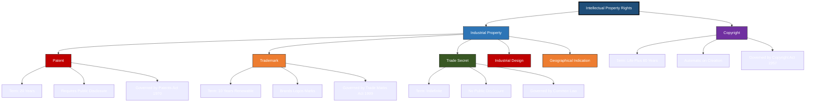
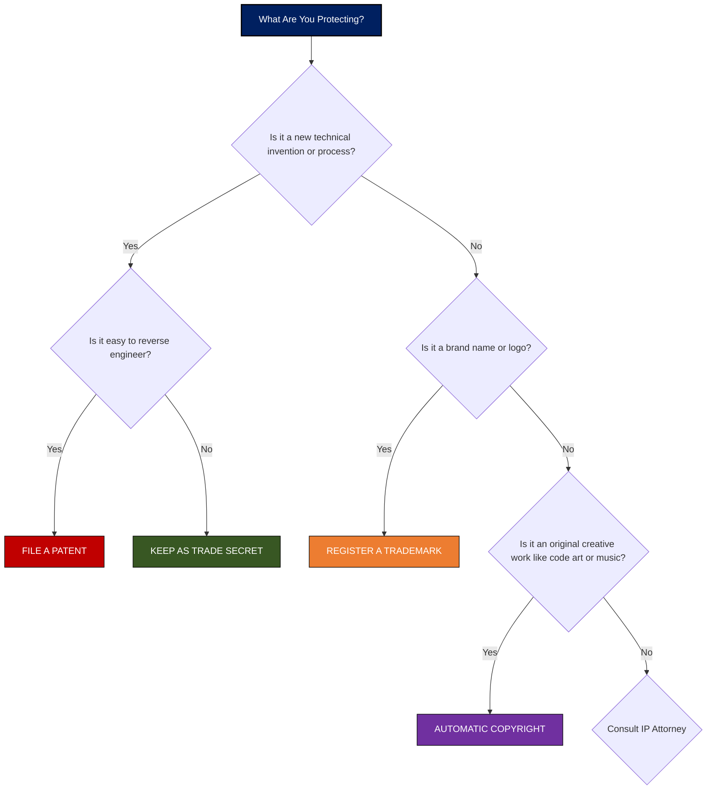
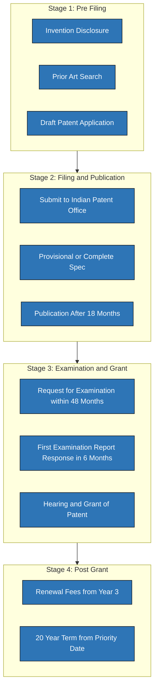
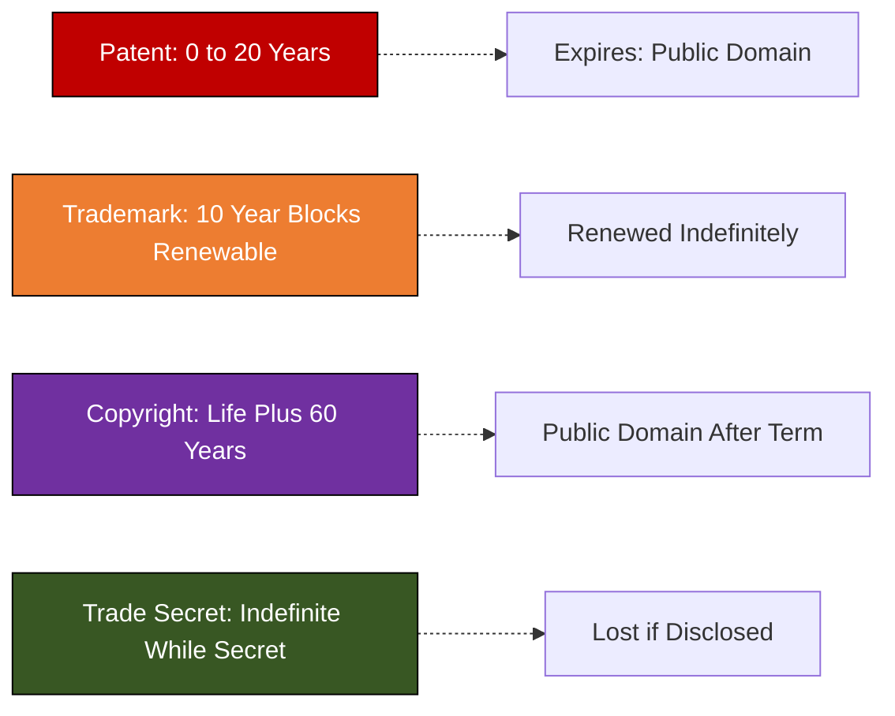

# Types of IPR: Patents, trademarks, copyrights, trade secrets

<!-- SECTION_1_START -->
# Types of Intellectual Property Rights (IPR)

## 1.1 Formal KTU 2024 Definition

> [!IMPORTANT]
> **Intellectual Property Right (IPR)** is a legally recognized exclusive right granted by a sovereign state to an inventor, creator, or proprietor over an intangible creation of the mind, conferring the legal authority to exclude others from commercially exploiting the creation for a defined statutory period in exchange for public disclosure.

In the **KTU 2024 Scheme (Course UCEST206 – Engineering Entrepreneurship and IPR)**, the four primary pillars of IPR studied are:

1. **Patents** – Protection of novel inventions and processes.
2. **Trademarks** – Protection of brand identifiers and source-distinguishing marks.
3. **Copyrights** – Protection of original literary, artistic, musical, and software works.
4. **Trade Secrets** – Protection of confidential commercial information and know-how.

> [!NOTE]
> **Statutory Foundations in India:**
> - Patents: **The Patents Act, 1970** (amended 2005)
> - Trademarks: **The Trade Marks Act, 1999**
> - Copyrights: **The Copyright Act, 1957** (amended 2012)
> - Trade Secrets: **Common Law / Contract Law** (no dedicated statute; protected under **Indian Contract Act, 1872** and **Information Technology Act, 2000**)

---

## 1.2 Intuitive Real-World Analogy

> [!TIP]
> **Analogy – "The Four Locks of Your Innovation House"**
>
> Imagine you have just built a brilliant **innovation house**. The house itself is your invention. Now, to protect different parts of it, you use four different locks:
>
> - **The Foundation Lock (Patent):** Locks away the *technical design* of your house from being copied. Expires after **20 years**, after which the design enters the public domain.
> - **The Front Door Lock (Trademark):** Locks the *nameplate and logo* of your house. So no one else can paint their door with your colors. Renewable every **10 years** forever.
> - **The Interior Décor Lock (Copyright):** Locks the *paintings, songs, and software code* you put inside. Lasts for the lifetime of the creator + **60 years**.
> - **The Vault Lock (Trade Secret):** Locks the *secret recipe of the cement mixture* you used, which you never reveal to anyone. Lasts as long as you keep it secret – **potentially forever**.

This mental model maps directly to the four types of IPR we will analyze.

---

## 1.3 Conceptual Mapping – KTU Syllabus View

| Lock | IPR Type | Protects | Duration | Renewable |
|------|----------|----------|----------|-----------|
| Foundation | Patent | Invention / Process | **20 years** | No |
| Front Door | Trademark | Brand / Logo / Symbol | **10 years** | Yes, indefinitely |
| Interior Décor | Copyright | Literary / Artistic / Software | **Life + 60 years** | No (automatic) |
| Vault | Trade Secret | Confidential Know-How | **As long as secret** | N/A |

<!-- SECTION_1_END -->

<!-- SECTION_2_START -->
# Deep Theoretical Analysis & KTU High-Yield Formula Sheet

## 2.1 Patent (Patent Se Adhikaar)

A **patent** is an exclusive statutory right granted for a **novel, non-obvious, and industrially applicable** invention. The patent holder receives the right to exclude others from making, using, selling, or importing the patented invention.

### Key Eligibility Criteria (Patent Triad)

A patentable invention MUST satisfy all three:

1. **Novelty** – The invention must be new; not published anywhere in the world before the filing date.
2. **Inventive Step (Non-Obviousness)** – The invention must not be obvious to a **Person Skilled in the Art (PSHA)**.
3. **Industrial Applicability (Utility)** – The invention must be capable of being made or used in some kind of industry.

> [!WARNING]
> **Non-Patentable In India (Section 3 & 4 of Patents Act, 1970):**
> - Inventions contrary to public order or morality
> - Discovery of any living thing occurring in nature
> - A method of agriculture or horticulture
> - A mathematical or business method
> - A computer program *per se*
> - Plants and animals in whole or any part
> - Atomic energy-related inventions

### Term and Renewal
- **Term:** **20 years** from the date of filing.
- **Maintenance:** Annual renewal fees from the **3rd year** onwards. Failure to pay leads to lapse.

---

## 2.2 Trademark (Trademark Se Adhikaar)

A **trademark** is a distinctive sign, symbol, word, phrase, logo, design, or combination thereof that identifies and distinguishes the **source of goods or services** of one enterprise from those of others.

### Classification of Trademarks (Nice Classification – 45 Classes)

- **Classes 1–34:** Goods (e.g., Class 25 – Clothing)
- **Classes 35–45:** Services (e.g., Class 42 – Software as a Service)

### Essential Characteristics

1. **Distinctiveness** – Must be capable of distinguishing goods/services.
2. **Non-Descriptiveness** – Cannot be a generic or purely descriptive term.
3. **Not Deceptive or Confusingly Similar** – To an existing registered mark.
4. **Use or Intent to Use** – Must be used or proposed to be used in commerce.

> [!IMPORTANT]
> **Well-Known Trademarks in India:**
> - **TATA**, **AMUL**, **GODREJ**, **MICROSOFT**, **APPLE**, **COCA-COLA**
> These receive **enhanced cross-class protection** even without formal registration under the doctrine of trans-border reputation.

### Term and Renewal
- **Initial Registration:** **10 years**.
- **Renewal:** Can be renewed indefinitely for successive periods of **10 years** by paying the renewal fee.

---

## 2.3 Copyright (Copyright Se Adhikaar)

A **copyright** is an automatic, exclusive right that subsists in original literary, dramatic, musical, and artistic works, including cinematograph films and sound recordings. Unlike patents and trademarks, **registration is not mandatory** for protection – the right arises the moment the work is created and fixed in a tangible medium.

### Two Bundles of Rights

1. **Economic Rights** – Right to reproduce, distribute, publicly perform, communicate to the public, translate, adapt.
2. **Moral Rights** – Right to claim authorship (paternity) and right to integrity (prevent distortion that harms reputation). *Moral rights are perpetual in India.*

### Categories of Copyrighted Works

| Category | Examples | Term in India |
|----------|----------|----------------|
| Literary | Books, software code, articles | **Life + 60 years** |
| Musical | Songs, compositions | **Life + 60 years** |
| Artistic | Paintings, photographs, sculptures | **Life + 60 years** |
| Dramatic | Plays, choreography | **Life + 60 years** |
| Cinematograph Films | Movies | **60 years from publication** |
| Sound Recordings | Music albums | **60 years from publication** |
| Government Works | Government publications | **60 years from publication** |

---

## 2.4 Trade Secret (Vanijya Gopaneeya Soochna)

A **trade secret** is any confidential business information that provides a **competitive edge** and is not generally known or readily ascertainable by others, provided that the holder takes **reasonable steps to keep it secret**.

### Three Essential Elements (The TRIPS Test)

1. **Secrecy** – The information is not generally known among, or readily accessible to, persons within the circles that normally deal with the kind of information in question.
2. **Commercial Value** – The information has commercial value precisely because it is secret.
3. **Reasonable Steps** – The holder must take reasonable measures to maintain secrecy (NDAs, locked labs, access controls).

### Famous Examples of Trade Secrets

| Trade Secret | Company | Status |
|--------------|---------|--------|
| **Coca-Cola Formula (Merchandise 7X)** | The Coca-Cola Company | Protected since 1886 |
| **Google Search Algorithm** | Google | Protected as trade secret |
| **KFC Original Recipe (11 herbs & spices)** | KFC | Locked in a vault |
| **Big Mac Special Sauce** | McDonald's | Trade secret |
| **Intel Process Node Recipes** | Intel | Protected as know-how |

> [!NOTE]
> **Important Distinction:** Unlike patents, trade secrets do **NOT require public disclosure**. This is a major strategic advantage when the information is hard to reverse-engineer.

### Indefinite Duration
- Trade secret protection lasts **as long as the information remains secret** and reasonable steps are taken to maintain confidentiality. There is **no statutory limit**.

---

## 2.5 KTU High-Yield Formula Sheet (Comparative Matrix)

> [!IMPORTANT]
> **Master Comparison Table – Memorize for KTU Exams**

| Parameter | Patent | Trademark | Copyright | Trade Secret |
|-----------|--------|-----------|-----------|--------------|
| **What is Protected** | Invention / Process | Brand / Logo / Mark | Original Expression | Confidential Information |
| **Governing Act (India)** | Patents Act, **1970** | Trade Marks Act, **1999** | Copyright Act, **1957** | Common Law / Contract |
| **Registration Required?** | **Yes (Mandatory)** | No (but advisable) | **No (Automatic)** | **No** |
| **Acquisition** | Filing application with Patent Office | Use + Optional Registration | Automatic upon creation | Maintaining secrecy |
| **Term of Protection** | **20 years** | **10 years** (renewable) | **Life + 60 years** | **Indefinite** |
| **Renewable?** | **No** | **Yes, indefinitely** | **No** | **N/A** |
| **Public Disclosure Required?** | **Yes** (after 18 months) | **No** | **No** | **No (Never)** |
| **International Treaties** | PCT, Paris Convention | Madrid Protocol, Paris | Berne Convention, TRIPS | TRIPS Art. 39 (Limited) |
| **Infringement Remedy** | Injunction, Damages, Account of profits | Injunction, Damages, Seizure | Injunction, Damages, Criminal | Contract damages, Injunction |
| **Cost in India (approx.)** | ₹50,000 – ₹2,00,000 | ₹10,000 – ₹30,000 | ₹2,000 – ₹10,000 | NDA drafting (low) |
| **Time to Grant** | 3–5 years | 1–2 years | 6–12 months | Immediate |
| **Key Indian Authority** | **IPO (Patent Office)** | **IPO (Trademark Registry)** | **Copyright Office** | Civil Courts / NCLT |

---

## 2.6 Real-World Engineering Utility

In the **KTU 2024 engineering entrepreneurship context**, these four IPR types are deployed strategically:

- **Patents** are pursued by R\&D-heavy firms (pharma, semiconductors, EV battery tech). E.g., Tesla's battery patents.
- **Trademarks** are pursued by consumer-facing brands (electronics, fashion, food). E.g., Xiaomi's "Mi" mark.
- **Copyrights** are pursued by software, media, and publishing industries. E.g., Microsoft Windows code, Bollywood films.
- **Trade Secrets** are pursued when reverse-engineering is difficult. E.g., TSMC's chip manufacturing process parameters.

> [!TIP]
> **KTU Strategy Tip:** Many engineering startups (especially in IoT, AI, and Robotics) use a **layered IP strategy** – file patents on core algorithms, trademark the product name, copyright the source code, and keep manufacturing processes as trade secrets.
<!-- SECTION_2_END -->

<!-- SECTION_3_START -->
# Step-by-Step Analysis, Derivations & Implementation

## 3.1 Tabular Comparative Analysis – Engineering Case Framework to Regulatory Matrix

> [!NOTE]
> **Below is the KTU-required extensive comparative analysis mapping real-world engineering cases to the four IPR types. This structure is the gold standard for 14-mark answers in the KTU 2024 Scheme ESE.**

### Case Study 1 – Apple Inc. (iPhone)

| Layer of IP | What Apple Protects | Type of IPR | Indian Statute | Real Action |
|-------------|--------------------|--------------|----------------|--------------|
| Hardware Design | Hinge mechanism, camera layout | **Design Patent / Patent** | Patents Act 1970 | Files utility patents |
| Operating System | iOS code (Objective-C, Swift) | **Copyright** | Copyright Act 1957 | Automatic on creation |
| Brand Name | "iPhone", "Apple", bitten-logo | **Trademark** | Trade Marks Act 1999 | Registered globally |
| Manufacturing Process | Foxconn assembly know-how | **Trade Secret** | Common Law / NDA | Locked in contracts |

### Case Study 2 – Coca-Cola Company

| Layer of IP | Protection Type | Why This Choice? | Outcome |
|-------------|------------------|------------------|---------|
| The Formula (Merchandise 7X) | **Trade Secret** | Patent would require public disclosure after 20 years | Formula remains secret since 1886 |
| "Coca-Cola" Word Mark | **Trademark** | Identifies source to consumers | Renewed indefinitely |
| Bottle Contour Shape | **3D Trademark / Design** | Distinctive trade dress | Registered in many countries |
| Advertising Music ("I'd Like to Buy the World a Coke") | **Copyright** | Original musical work | Automatic protection |

### Case Study 3 – Indian Startup Lens (Freshworks)

| IP Asset | Recommended Type | Estimated Cost | Strategic Benefit |
|----------|------------------|----------------|--------------------|
| SaaS Codebase | **Copyright** + **Trade Secret** | ₹5,000 (registration) | Prevents code copying |
| Product Name "Freshworks" | **Trademark** | ₹15,000 | Brand recognition |
| AI Chatbot Algorithm | **Patent** (if novel) | ₹1,50,000 | Investor confidence |
| Client Database | **Trade Secret** (NDA protected) | Low (NDA drafting) | Competitive edge |

---

## 3.2 Step-by-Step Decision Algorithm – "Which IPR Should I File?"

> [!IMPORTANT]
> **Use this decision flow when answering KTU case-study questions:**

**Step 1:** Identify the nature of the asset.
- Is it a **technical invention**? → Consider **Patent**
- Is it a **brand identifier** (name/logo)? → Consider **Trademark**
- Is it an **original creative expression** (code, art, music)? → Consider **Copyright**
- Is it **confidential know-how** with commercial value? → Consider **Trade Secret**

**Step 2:** Evaluate the **public disclosure trade-off**.
- Willing to disclose for 20 years of monopoly? → **Patent**
- Want indefinite protection without disclosure? → **Trade Secret**

**Step 3:** Evaluate the **reverse-engineering risk**.
- Easy to reverse-engineer? → **Patent** (mandatory)
- Hard to reverse-engineer? → **Trade Secret** (preferred)

**Step 4:** Evaluate the **duration needed**.
- Short product lifecycle? → **Trade Secret** or **Copyright**
- Long product lifecycle? → **Patent** or **Trademark**

**Step 5:** Evaluate **cost-benefit ratio**.
- Tight budget? → **Copyright** (cheapest, automatic)
- Investor-driven? → **Patent** portfolio attracts VC funding

---

## 3.3 Step-by-Step Patent Filing Procedure in India

> [!NOTE]
> **This is a frequent 7-mark sub-question in KTU ESE. Memorize the steps.**

**Step 1: Invention Disclosure**
- Document the invention with full details, drawings, and claims.

**Step 2: Prior Art Search**
- Search Indian Patent Database (IP India), Google Patents, WIPO, Espacenet.
- Identify whether the invention is truly novel.

**Step 3: Drafting the Patent Application**
- **Title, Abstract, Background, Description, Claims, Drawings.**
- **Claims** are the most critical part – define the legal scope of protection.

**Step 4: Filing at Indian Patent Office (IPO)**
- File either:
  - **Provisional Specification** (establishes priority date; 12 months to complete)
  - **Complete Specification** (full technical details)
- Pay the prescribed filing fee.

**Step 5: Publication**
- Application is published in the Patent Journal **18 months** after priority date.
- Opposition window opens for **6 months** (pre-grant opposition).

**Step 6: Request for Examination (RFE)**
- File RFE within **48 months** of priority date.
- Examiner reviews novelty, inventive step, industrial applicability.

**Step 7: First Examination Report (FER)**
- IPO issues FER objecting to claims.
- Applicant must respond within **6 months** (extendable by 3 months).

**Step 8: Hearing and Grant**
- If objections are overcome, patent is **granted and sealed**.
- Patent number is assigned; renewal fees begin from year 3.

**Step 9: Post-Grant**
- Patent is valid for **20 years** from priority date.
- Annual renewal fees must be paid.

> [!WARNING]
> **Common KTU Mistake:** Students often confuse the **priority date** with the **filing date**. The **priority date** is the date of the earliest filed application (provisional or complete) from which priority is claimed.

---

## 3.4 Symbolic Representation of IP Value Equation

For engineering economics calculations related to IP, the KTU syllabus may expect the following conceptual formula:

$$
V_{IP} = \sum_{t=1}^{n} \frac{R_t \cdot P_t - C_t}{(1+r)^t}
$$

Where:
- $V_{IP}$ = Net present value of the intellectual property asset
- $R_t$ = Revenue generated from the IP in year $t$
- $P_t$ = Probability of successful enforcement in year $t$
- $C_t$ = Cost of maintaining the IP (renewal, litigation) in year $t$
- $r$ = Discount rate (typically Weighted Average Cost of Capital, WACC)
- $n$ = Effective remaining life of the IP

> [!TIP]
> **KTU Insight:** This equation is conceptual – in KTU 2024, you may be asked to **interpret** the trade-off between enforcement probability (high for trademarks, low for trade secrets) and maintenance cost (low for copyrights, high for patents).

---

## 3.5 Tabular Enforcement Matrix – Remedies Available

| IPR Type | Civil Remedy | Criminal Remedy | Administrative Remedy |
|----------|--------------|------------------|------------------------|
| **Patent** | Injunction, Damages, Account of profits, Patent revocation | No criminal sanction (India) | Revocation before IPAB |
| **Trademark** | Injunction, Damages, Delivery of infringing goods | Fine up to ₹2 lakh, Imprisonment up to 3 years (first offence) | Opposition / Rectification |
| **Copyright** | Injunction, Damages, Anton Piller order | Fine ₹50,000 – ₹2 lakh, Imprisonment 6 months – 3 years | Copyright Board adjudication |
| **Trade Secret** | Injunction, Breach of contract damages, Specific performance | No statutory criminal sanction | Civil court / NCLT |

---

## 3.6 Key Strategic Decision – Patent vs. Trade Secret

> [!IMPORTANT]
> **This is a classic KTU 14-mark question. Use the following decision matrix:**

| Factor | Choose Patent | Choose Trade Secret |
|--------|---------------|----------------------|
| Is the invention easy to reverse-engineer? | **Yes → Patent** | **No → Trade Secret** |
| Is the commercial life > 20 years? | **Patent (limited to 20 yrs)** | **Trade Secret (indefinite)** |
| Is the secret hard to maintain? | **Patent** | **Trade Secret** |
| Do you need external investors/valuation? | **Patent (defensible asset)** | **Trade Secret (weaker)** |
| Example | Pharmaceutical molecule | Coca-Cola formula |
<!-- SECTION_3_END -->

<!-- SECTION_4_START -->
# Structural Diagrams & Schematics

## 4.1 Mermaid Flowchart – IPR Classification Architecture

## 4.2 Mermaid Decision Tree – Choosing the Correct IPR Type

## 4.3 Mermaid Subgraph – Patent Filing Process

## 4.4 Mermaid Timeline – IP Protection Durations

<!-- SECTION_4_END -->

<!-- SECTION_5_START -->
# KTU 2024 Scheme Examination Question Bank & Topic Recap

---

## 📝 PART A – Short Answer Questions (3 Marks Each)

### Question 1: [KTU University Exam – July 2024, Model Question]
**Define Intellectual Property Right. List any four types of IPR.**

**Model Answer (3 Marks):**
- **Definition (2 Marks):** Intellectual Property Right (IPR) refers to the legal rights granted by a state to a creator or inventor to protect their intangible creations of the mind, giving them exclusive rights to use, commercialize, and exclude others from using the creation for a specified period.
- **Four Types (1 Mark):** Patent, Trademark, Copyright, Trade Secret.
  *[Listing all four correctly: 1 Mark]*

### Question 2: [KTU University Exam – Dec 2023, Model Question]
**Differentiate between a Patent and a Trade Secret.**

**Model Answer (3 Marks):**

| Basis | Patent | Trade Secret |
|-------|--------|--------------|
| **Registration** | Requires registration with Patent Office | No registration required |
| **Term** | 20 years fixed | Indefinite (as long as secret is maintained) |
| **Public Disclosure** | Mandatory after 18 months | Never disclosed |
| **Cost** | High (filing, examination, renewal) | Low (mainly NDA costs) |

*[Defining both correctly with at least 3 distinctions: 3 Marks]*

---

## 📝 PART B – ESE Module Choice Questions (14 Marks Each)

### **Question A: [14 Marks – Module 1 Choice Question]**

> **(a)** Explain the four main types of Intellectual Property Rights with suitable examples. **(7 Marks)**
> **(b)** Discuss the procedure for patent filing in India as per the Patents Act, 1970. **(7 Marks)**

#### Part (a) Model Solution [7 Marks]

**1. Patent (2 Marks)**
- Protects novel, non-obvious, and industrially applicable inventions.
- **Example:** A new pharmaceutical molecule patented by Cipla.
- **Term:** 20 years from priority date.
- **Authority:** Indian Patent Office (IPO).
- **Statute:** Patents Act, 1970.

**2. Trademark (1.5 Marks)**
- Protects distinctive marks identifying the source of goods/services.
- **Example:** The "TATA" word mark for Tata Group products.
- **Term:** 10 years, renewable indefinitely.
- **Statute:** Trade Marks Act, 1999.

**3. Copyright (1.5 Marks)**
- Protects original literary, artistic, musical works, and software code.
- **Example:** The source code of Microsoft Windows.
- **Term:** Life of the author + 60 years.
- **Statute:** Copyright Act, 1957.

**4. Trade Secret (2 Marks)**
- Protects confidential commercial information that provides competitive edge.
- **Example:** The Coca-Cola formula (Merchandise 7X).
- **Term:** Indefinite, as long as secrecy is maintained.
- **Governance:** Common Law / Indian Contract Act, 1872.

> **Valuation Key:** *[All four types with statute + example + term: 7 Marks. Skipping the statute loses 1 mark. Skipping the term loses 0.5 mark per type.]*

#### Part (b) Model Solution [7 Marks]

**Step 1: Invention Disclosure (0.5 Mark)**
- Document the invention with full technical details and drawings.

**Step 2: Prior Art Search (0.5 Mark)**
- Search IP India database, Google Patents, Espacenet for prior disclosures.

**Step 3: Drafting Patent Application (1 Mark)**
- Title, Abstract, Background, Detailed Description, Claims, Drawings.
- **Claims** define the legal scope.

**Step 4: Filing at IPO (1 Mark)**
- File Provisional Specification (12-month priority) or Complete Specification.

**Step 5: Publication (0.5 Mark)**
- Published 18 months after priority date in Patent Journal.

**Step 6: Request for Examination (1 Mark)**
- File RFE within 48 months of priority date.

**Step 7: First Examination Report (1 Mark)**
- Examiner issues objections; applicant must respond within 6 months.

**Step 8: Grant of Patent (1 Mark)**
- Patent granted, valid for 20 years from priority date; renewal fees from year 3.

**Step 9: Oppositions (0.5 Mark)**
- Pre-grant opposition (within 6 months of publication) and post-grant opposition (within 12 months of grant).

> **Valuation Key:** *[Writing all 8 steps with statutory timelines: 7 Marks. Missing the 18-month publication rule loses 1 mark. Missing the 48-month RFE deadline loses 1 mark.]*

---

### **Question B: [14 Marks – Module 1 Choice Question – Alternative]**

> **(a)** Compare and contrast the four types of IPR using a comparative table. **(7 Marks)**
> **(b)** With a real-world case study, explain the strategic decision of choosing between a **Patent** and a **Trade Secret**. **(7 Marks)**

#### Part (a) Model Solution [7 Marks]

**Comparative Table (5 Marks):**

| Parameter | Patent | Trademark | Copyright | Trade Secret |
|-----------|--------|-----------|-----------|--------------|
| Subject Matter | Invention | Brand Mark | Original Expression | Confidential Info |
| Statute | Patents Act 1970 | Trade Marks Act 1999 | Copyright Act 1957 | Common Law |
| Registration | Mandatory | Optional | Not required | Not required |
| Term | 20 years | 10 years (renewable) | Life + 60 years | Indefinite |
| Public Disclosure | Yes | No | No | No |
| Cost | High | Moderate | Low | Low |
| Authority | IPO | Trademark Registry | Copyright Office | Civil Courts |

**Brief Explanation (2 Marks):**
- Patents and Trademarks require statutory registration.
- Copyright is automatic; Trade Secret relies on confidentiality measures.
- *Trade Secret has the longest potential term but is vulnerable to independent discovery.*

> **Valuation Key:** *[Full table with 7+ rows: 5 Marks. Brief explanation of strategic differences: 2 Marks. Missing "Public Disclosure" row loses 1 mark.]*

#### Part (b) Model Solution [7 Marks]

**Case Study: Coca-Cola vs. Pharmaceutical Patents (2 Marks)**
- Coca-Cola has kept its formula as a **trade secret** for over 130 years.
- In contrast, pharmaceutical companies (e.g., Pfizer's COVID-19 vaccine) file **patents** for 20-year monopolies.

**Why Coca-Cola Chose Trade Secret (2 Marks):**
- The formula is a **mixture**, hard to reverse-engineer.
- 20-year patent term is too short for an indefinite-lifecycle product.
- No public disclosure of the recipe.

**Why Pfizer Chose Patent (2 Marks):**
- The molecular structure of the drug is **easy to reverse-engineer** through chemical analysis.
- Trade secret would be lost once any competitor reverse-engineers the vaccine.
- Patent provides 20 years of legal monopoly to recover R\&D costs.

**Strategic Decision Matrix (1 Mark):**
- Easy to reverse-engineer → **Patent**
- Hard to reverse-engineer → **Trade Secret**
- Long commercial life → **Trade Secret**
- Need for funding/valuation → **Patent**

> **Valuation Key:** *[Real case study naming both companies: 2 Marks. Strategic reasoning on reverse-engineering risk: 3 Marks. Decision matrix: 2 Marks.]*

---

## ⚠️ KTU Examiner's Valuation Warning / Pitfall Callout

> [!WARNING]
> **Common Mark-Loss Pitfalls – Avoid These!**
>
> 1. **Confusing "Priority Date" with "Filing Date":** The priority date is the date of the earliest application (provisional or complete) from which priority is claimed. The filing date is when the current application was filed. Many students interchange these.
>
> 2. **Forgetting the Renewal Schedule:** Patents require annual renewal from the **3rd year**, NOT the 1st year. Failing to mention this loses 1 mark.
>
> 3. **Saying Copyright Requires Registration:** Copyright is **automatic** upon creation in a tangible medium. Registration is voluntary and is only for evidentiary benefits in court.
>
> 4. **Forgetting the Term of Copyright:** The term is **Life of the author + 60 years** for literary/artistic works, but **60 years from date of publication** for cinematograph films and sound recordings.
>
> 5. **Mixing up Industrial Design with Patent:** Industrial Design is a **separate** IPR (under Designs Act, 2000) protecting the **aesthetic appearance** of an article, not its function. The KTU question may trick you here.
>
> 6. **Not Mentioning International Treaties:** For full marks, mention **PCT (Patent Cooperation Treaty)**, **Madrid Protocol (Trademarks)**, and **Berne Convention (Copyrights)**.

---

## 🧠 Topic Recap & Important Things to Remember

> [!IMPORTANT]
> **Rapid Revision Checklist – KTU 2024 Module 1 – Types of IPR**

- ✅ **IPR** = Legal rights over intangible creations of the mind.
- ✅ **Four Pillars:** Patent, Trademark, Copyright, Trade Secret.
- ✅ **Patent:** Protects inventions. **Term = 20 years**. Requires **registration and public disclosure**. Governed by **Patents Act, 1970**.
- ✅ **Trademark:** Protects brands/logos. **Term = 10 years (renewable indefinitely)**. Governed by **Trade Marks Act, 1999**.
- ✅ **Copyright:** Protects original creative works. **Term = Life + 60 years**. **Automatic** upon creation. Governed by **Copyright Act, 1957**.
- ✅ **Trade Secret:** Protects confidential know-how. **Indefinite term**. **No public disclosure**. Governed by **Common Law / Contract**.
- ✅ **Patent Triad:** Novelty + Inventive Step + Industrial Applicability.
- ✅ **Copyright Two Bundles:** Economic Rights + Moral Rights.
- ✅ **Trade Secret Triad:** Secrecy + Commercial Value + Reasonable Steps.
- ✅ **Patent Filing Timeline:** Publication at 18 months, RFE within 48 months, FER response within 6 months, Total term 20 years from priority date.
- ✅ **Renewal of Patent:** Annual fees from **3rd year onwards**.
- ✅ **Nice Classification:** Trademarks classified into **45 Classes** (1-34 goods, 35-45 services).
- ✅ **Famous Trade Secrets:** Coca-Cola formula, Google algorithm, KFC recipe.
- ✅ **Famous Trademarks:** TATA, AMUL, Apple, Microsoft, Coca-Cola.
- ✅ **Famous Patents:** Edison's light bulb, Tesla's battery tech, Apple's iPhone design.
- ✅ **Famous Copyrights:** Microsoft Windows code, Bollywood films, Harry Potter books.
- ✅ **International Treaties:** PCT, Madrid Protocol, Berne Convention, Paris Convention, TRIPS Agreement.
- ✅ **Key Indian Authorities:** Indian Patent Office (IPO), Trademark Registry, Copyright Office, Intellectual Property Appellate Board (IPAB).
- ✅ **Patent vs. Trade Secret Decision:** Easy to reverse-engineer → Patent; Hard to reverse-engineer → Trade Secret.
- ✅ **Cost Hierarchy (Low to High):** Copyright < Trade Secret < Trademark < Patent.
- ✅ **Duration Hierarchy (Short to Long):** Trademark (10 yr blocks) ≈ Patent (20 yr fixed) < Copyright (Life+60) < Trade Secret (Indefinite).
<!-- SECTION_5_END -->
