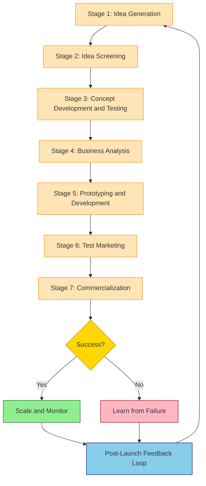
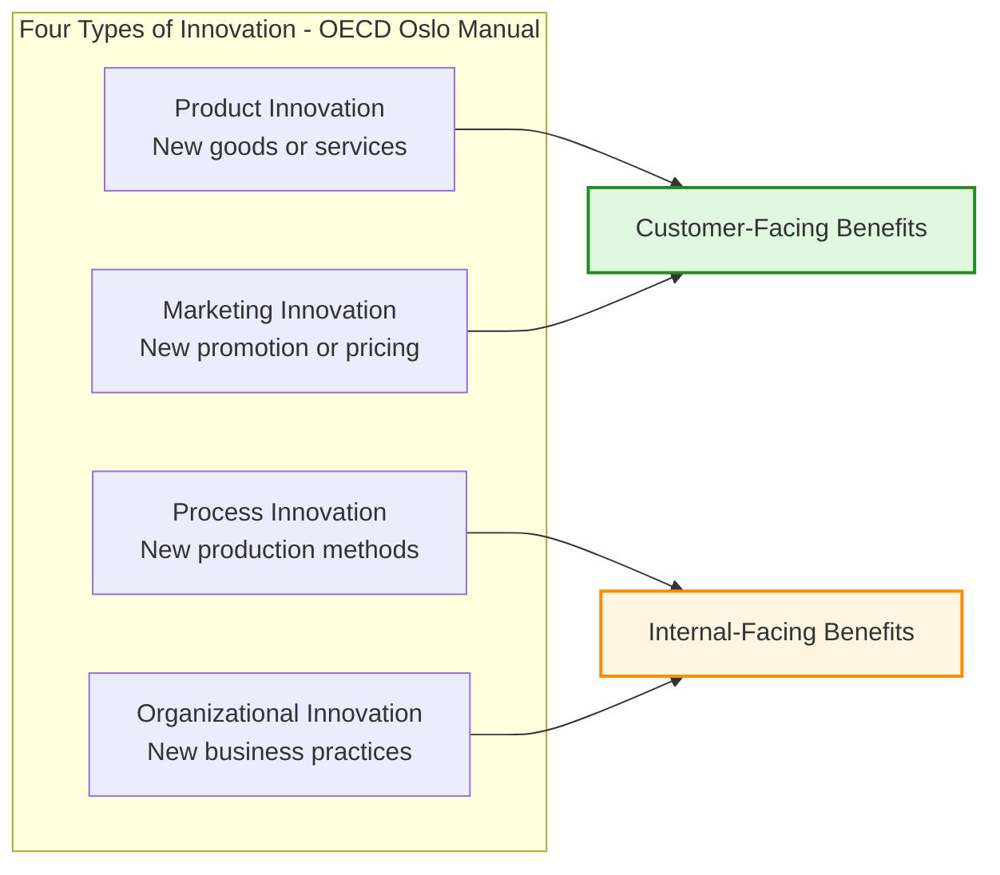
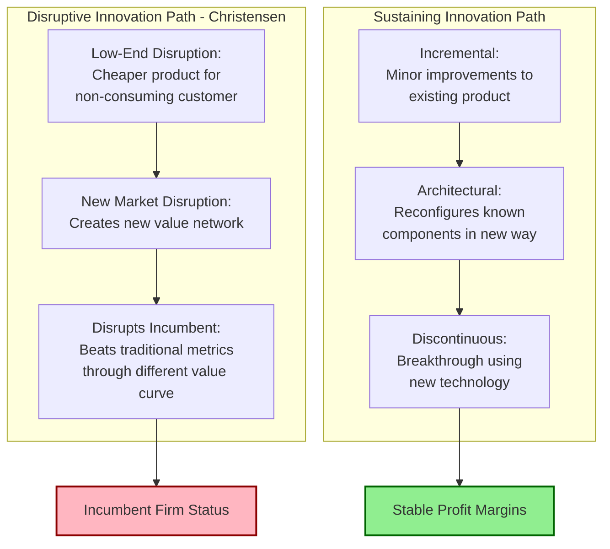
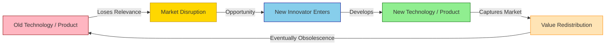
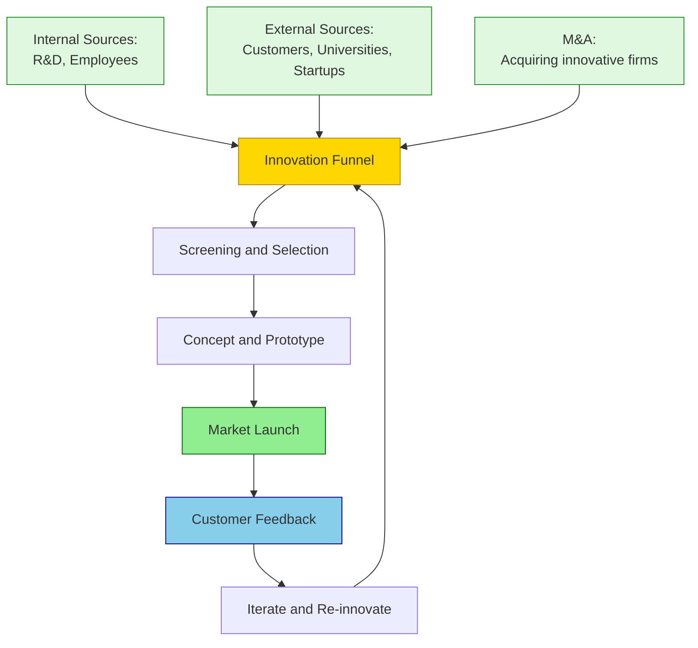

# Understanding Innovation

<!-- SECTION_1_START -->

# 📘 Understanding Innovation

## 1.1 Formal Definition (KTU 2024 Scheme Aligned)

> [!IMPORTANT]
> **Innovation** is the process by which an individual or organization conceives, develops, and implements a **novel idea, method, product, service, or process** that creates **value** for customers, users, or society at large. The novel element must be **applied** and **commercialized** — not merely conceptualized.

The most academically rigorous definition comes from the **OECD Oslo Manual (4th Edition, 2018)**, which is the international standard for measuring innovation. It defines innovation as:

> *"A new or significantly improved product or business process, organisational method, or marketing method that differs significantly from the firm's previous products or business processes, and that has been introduced on the market or put into use within the firm."*

**Etymology & Origin:**
- The word "Innovation" is derived from the **Latin** term *innovare*, meaning *"to renew or to make new."*
- It is composed of two parts: *in-* (into) + *novare* (to make new), from *novus* (new).
- The term was historically perceived negatively (associated with rebellion against tradition) before being rehabilitated in the 20th century by economist **Joseph Schumpeter** as a driver of economic progress.

## 1.2 Intuitive Real-World Analogy 🍳

> [!NOTE]
> **The "Recipe Upgrade" Analogy**
>
> Imagine you open a small restaurant. Your grandmother's recipe for *Appam* is beloved, but takes 45 minutes to prepare. You **invent** a new steaming technique (an original idea in your head), but it sits as a sketch in your notebook — that's **invention**, not innovation. The day you actually install the new steamer in your kitchen, serve faster Appam to paying customers, and earn more revenue — **that moment is innovation**.

| Stage | Activity | Is it Innovation? |
|---|---|---|
| **1. Idea** | "What if I could make Appam faster?" | ❌ No — just a thought |
| **2. Invention** | Designing a custom steamer | ❌ No — not yet used |
| **3. Implementation** | Installing steamer in the kitchen | ✅ **Yes** — practical application |
| **4. Value Creation** | Customers love faster Appam, revenue grows | ✅ **Yes** — value realized |

This captures the **trinity** that defines innovation: **Novelty + Application + Value**.

## 1.3 Innovation ≠ Invention ≠ Creativity

A KTU-favourite question is to ask students to *distinguish* between these three terms. They are **NOT synonymous**.

> [!IMPORTANT]
> **Core Distinction:**
> - **Creativity** = generating original ideas (the "what if?" phase)
> - **Invention** = the first occurrence of a novel idea/concept (creation of something new)
> - **Innovation** = the successful **commercialization or adoption** of an invention in the marketplace (creation of value)

A classic example: **The Wright Brothers *invented* the aeroplane (1903)**, but the **jet engine (Whittle, 1930s)** and commercial aviation (Boeing 707, 1958) made powered flight an **innovation** that transformed global travel.

## 1.4 GeoGebra / Visualization Integration

> [!VISUALIZATION CONTROL]
> **Concept:** The Innovation Value Curve (Kim & Mauborgne, Blue Ocean Strategy)
>
> **Plotting the Innovation Axis:**
> * X-axis: `Key Competitive Factors (Price, Speed, Quality, Eco-friendliness, Convenience, etc.)`
> * Y-axis: `Value Offered to Customer (Low to High)`
>
> **Visual Description:** Plot two curves on the same axis — the "Red Ocean" curve (current industry competition) and the "Blue Ocean" curve (innovated value curve). The Blue Ocean curve should appear as a *divergent* shape, low on traditional factors like cost, but high on previously-uncontested factors like design and sustainability, illustrating how innovation reshapes value.

<!-- SECTION_1_END -->

<!-- SECTION_2_START -->

# 🧠 Deep Theoretical Analysis: The Architecture of Innovation

## 2.1 The Four Archetypes of Innovation (Oslo Manual Classification)

The **OECD Oslo Manual** categorizes innovation into **four major types**. KTU examiners frequently test this classification as a **direct 3-mark short answer**.

### A. Product Innovation
A good or service that is **new or significantly improved** with respect to its characteristics, technical specifications, embedded software, or intended uses.

**Engineering Example:** Tesla introducing **Autopilot (2015)** — a software-driven enhancement to existing electric vehicles.

### B. Process Innovation
A new or significantly improved method of **production, distribution, or support activities** that changes the firm's operations.

**Engineering Example:** **Foxconn's automated robotic assembly lines (2012+)** — replacing manual soldering with precision robotic arms in PCB manufacturing.

### C. Marketing Innovation
A new marketing method involving **significant changes in product design, packaging, placement, promotion, or pricing**.

**Engineering Example:** The introduction of **subscription-based pricing** for software (Adobe Creative Cloud shift in 2013 from one-time purchase).

### D. Organizational Innovation
A new **organizational method** in business practices, workplace organization, or external relations.

**Engineering Example:** Implementing a **flatter hierarchy and Agile squad-based structure** at Spotify (the famous "Spotify Model").

## 2.2 Schumpeter's Theory of Economic Innovation

The Austrian-American economist **Joseph Alois Schumpeter (1883–1950)** laid the modern foundation of innovation economics. His work *Capitalism, Socialism and Democracy* (1942) introduced the concept of **"Creative Destruction."**

> [!IMPORTANT]
> **Creative Destruction:** The process whereby *new innovations* continuously replace *outdated technologies, products, and business models*, fueling long-term economic growth. The old is destroyed, and the new is born.

Schumpeter also identified **five forms of innovation** (sometimes called *Schumpeter's Mark I*):
1. Introduction of a **new product** or qualitative change in an existing one
2. Introduction of a **new method of production**
3. Opening of a **new market**
4. Conquest of a **new source of supply** of raw materials
5. Establishment of a **new organizational structure** in any industry

## 2.3 Disruptive vs. Sustaining Innovation (Clayton Christensen)

A **mandatory concept** for KTU exams. Harvard professor **Clayton M. Christensen** in *The Innovator's Dilemma* (1997) classified innovation based on its **market impact**.

| Parameter | **Sustaining Innovation** | **Disruptive Innovation** |
|---|---|---|
| **Definition** | Improves performance of existing products along established dimensions | Creates a new market and value network, eventually disrupting existing markets |
| **Target Customer** | Existing, demanding customers | New, non-consuming, or overserved customers |
| **Performance Trajectory** | Enhances traditional metrics (speed, size, power) | Initially *worse* on traditional metrics, but improves faster |
| **Business Model** | Sustains incumbent profit margins | Often based on **low-cost or freemium** models |
| **Risk to Incumbents** | Low | **High** (can wipe out leaders) |
| **Classic Example** | Intel upgrading CPUs year-over-year | **Netflix** disrupting Blockbuster; **iPhone** disrupting Nokia |

## 2.4 Open vs. Closed Innovation (Henry Chesbrough, 2003)

| Parameter | **Closed Innovation** | **Open Innovation** |
|---|---|---|
| **Philosophy** | "We must generate all our ideas internally" | "We should use both internal and external ideas" |
| **R&D Model** | In-house, secret, vertically integrated | Collaborates with universities, startups, customers, suppliers |
| **IP Strategy** | Strong protectionism, hoarding patents | Selective sharing, licensing, co-creation |
| **Motto** | "The smart people in our field work for us" | "Not all the smart people work for us" |
| **Modern Example** | Bell Labs in early 20th century | **Procter & Gamble's "Connect + Develop"** program (60% of new products via external ideas) |

## 2.5 KTU High-Yield Formula Sheet (Conceptual Matrix)

> [!NOTE]
> Although innovation is a non-quantitative topic, the following "formula" is the **universal test-template** for KTU conceptual answers.

$$
\text{Innovation} = f(\text{Novelty}, \text{Applicability}, \text{Value Creation})
$$

Subject to the necessary condition:

$$
\text{Innovation} \neq \text{Invention} + \text{Sitting in a Lab}
$$

| **S.No** | **High-Yield Term** | **Definition** | **KTU Weightage** |
|:---:|---|---|:---:|
| 1 | **Creativity** | The ability to generate original ideas | ⭐⭐ |
| 2 | **Invention** | First-time creation of a new idea/device/process | ⭐⭐⭐ |
| 3 | **Innovation** | Commercialized invention that creates value | ⭐⭐⭐⭐⭐ |
| 4 | **Creative Destruction** | Schumpeter's cycle of new replacing old | ⭐⭐⭐ |
| 5 | **Disruptive Innovation** | Creates new market, displaces incumbents | ⭐⭐⭐⭐ |
| 6 | **Sustaining Innovation** | Improves existing products for existing customers | ⭐⭐⭐ |
| 7 | **Open Innovation** | Leveraging external + internal ideas | ⭐⭐⭐⭐ |
| 8 | **Closed Innovation** | Purely internal R&D | ⭐⭐ |
| 9 | **Product Innovation** | New/improved good or service | ⭐⭐⭐ |
| 10 | **Process Innovation** | New/improved production method | ⭐⭐⭐ |

## 2.6 Real-World Engineering Utility

In production-grade engineering and CS systems, "innovation" is operationalized as:
- **R&D Roadmaps** in semiconductor companies (TSMC's 3nm → 2nm process nodes)
- **Patenting Strategy** (Apple files 4,000+ patents/year to maintain innovation moat)
- **Hackathons & Intrapreneurship Programs** (Google's 20% time policy, where engineers spend 20% of work hours on personal innovation projects)
- **Lean Startup Methodology** in tech entrepreneurship (Build → Measure → Learn loop)

<!-- SECTION_2_END -->

<!-- SECTION_3_START -->

# 🛠️ Step-by-Step Analytical Derivations & Comparative Implementation Matrix

## 3.1 The Innovation Process: A Sequential Decomposition

The KTU syllabus expects students to describe the **stages of the innovation process**. Below is the **exhaustive 7-step model** (a synthesized version of the Stage-Gate and Booz-Allen-Hamilton models) that you must know.

### Step 1 — Idea Generation (Sourcing the Spark)
- Internal sources: R&D labs, employee suggestions, intrapreneurship programs
- External sources: Customers (lead-user analysis), competitors (benchmarking), universities, suppliers
- Tools: **Brainstorming, SCAMPER, Design Thinking, TRIZ**

### Step 2 — Idea Screening (The First Filter)
- Eliminate ideas that are technically infeasible, legally impossible, or commercially unviable
- Apply a **Go/No-Go decision matrix** based on criteria: market potential, technical capability, strategic fit, ROI

### Step 3 — Concept Development and Testing
- Develop a **detailed concept statement** describing features, benefits, target customer
- Test the concept with focus groups and target users
- Refine based on qualitative feedback

### Step 4 — Business Analysis (The Financial Lens)
- Prepare a **preliminary business case**: projected sales, costs, profit margins, payback period
- Tools: **NPV, IRR, Break-even Analysis**

### Step 5 — Product/Process Development (Prototyping)
- Build a **minimum viable product (MVP)** or functional prototype
- Iterative testing: alpha → beta → release candidate
- Concurrent engineering across design, manufacturing, and marketing teams

### Step 6 — Test Marketing and Trial
- **Soft launch** in a limited geographical area (e.g., a single city)
- Gather real-world usage data, customer satisfaction, and rejection rates
- Final refinement before full-scale rollout

### Step 7 — Commercialization (Full Market Launch)
- Full-scale production, distribution, marketing, and sales
- Post-launch monitoring: track KPIs (adoption rate, revenue, churn)
- Iterate based on customer feedback → loop back to **Step 1**

> [!IMPORTANT]
> The process is **non-linear** in practice. Most firms iterate, skip, or revisit steps. KTU answer should clearly state that this is a **cyclic, iterative process**, not a strict linear pipeline.

## 3.2 Exhaustive Comparative Analysis Table (Humanities Matrix)

The following table maps **real-world engineering case frameworks** to systemic matrices, satisfying the Humanities/Management track of the Domain-Adaptive Execution Matrix.

| **Real-World Engineering Innovation Case** | **Innovation Type (Oslo)** | **Schumpeter Category** | **Disruptive vs Sustaining** | **Open vs Closed** | **Source of Innovation** |
|---|---|---|---|---|---|
| **Apple iPhone (2007)** | Product + Marketing | New product + new market | **Disruptive** | Closed (initially) | Internal R&D (in-house) |
| **Tesla's Gigafactory** | Process + Organizational | New method of production | **Disruptive** | Open (open-sourced patents) | Vertical integration |
| **Toyota Production System (Lean)** | Process | New method of production | Sustaining (in industry) | Closed | Internal philosophy |
| **IBM Watson (AI)** | Product + Process | New product | **Disruptive** | Open (partnered with universities) | Acquired + internal R&D |
| **Pharmaceutical mRNA Vaccines (Pfizer/Moderna)** | Product | New product | **Disruptive** | Open (shared research) | University research |
| **Google Search Algorithm (PageRank)** | Process + Product | New product | **Disruptive** | Closed (initially) | Academic research |
| **3D Printing / Additive Manufacturing** | Process | New method of production | **Disruptive** | Open (open-source designs) | University + community |
| **Netflix Streaming (2007)** | Service + Marketing | New market | **Disruptive** | Closed | Internal pivot |
| **Ford's Assembly Line (1913)** | Process | New method of production | **Disruptive** | Closed | Internal observation |
| **SpaceX Reusable Rockets** | Process + Product | New method + new market | **Disruptive** | Open (publishes research) | First-principles thinking |

## 3.3 Sources of Innovation: The 7-Categories Framework

Peter Drucker (*Innovation and Entrepreneurship*, 1985) identified **seven sources of innovation** that KTU examiners consider high-yield.

| **S.No** | **Source** | **Description** | **Engineering Example** |
|:---:|---|---|---|
| 1 | **The Unexpected** | Success, failure, or external event | Post-it Notes (3M) born from failed superglue |
| 2 | **Incongruities** | Mismatch between reality and assumption | Rise of smartphones (mismatch in mobile needs) |
| 3 | **Process Need** | Weakness in existing workflow | Toyota's JIT (Just-In-Time) inventory system |
| 4 | **Industry/Market Changes** | Structural shifts in industry | Netflix pivoting from DVD to streaming |
| 5 | **Demographics** | Population changes | Aging population → assistive robotics in Japan |
| 6 | **Perceptual Changes** | How people see the world | Sustainability → electric vehicles |
| 7 | **New Knowledge** | Scientific or technological breakthroughs | CRISPR gene editing, Generative AI |

## 3.4 Drivers and Barriers to Innovation (Engineering Context)

### Drivers of Innovation (Why Innovation Happens)
- **Market Competition:** Firms innovate to gain competitive advantage
- **Customer Demand:** Evolving needs push firms to deliver new value
- **Technology Push:** Breakthroughs in enabling tech (AI, IoT, 5G)
- **Government Policy:** Tax incentives for R&D (e.g., India's Startup India scheme)
- **Globalization:** Cross-border knowledge transfer
- **Talent Mobility:** Skilled engineers moving across firms and geographies

### Barriers to Innovation (Why Innovation Fails)
- **Risk Aversion:** Fear of failure in corporate culture
- **Capital Constraints:** Insufficient R&D funding
- **Bureaucracy:** Slow decision-making hierarchies
- **IP Weakness:** Inadequate patent protection in emerging economies
- **Skill Gap:** Lack of trained personnel in emerging tech areas
- **Incumbent Inertia:** Existing products/services generating cash cows discourage change

> [!NOTE]
> **KTU Pearl:** The most-cited reason for *failed* innovation in established firms is the **"Innovator's Dilemma"** — successful companies focus on sustaining innovation for their best customers and miss the disruptive wave that eventually destroys them.

## 3.5 Innovation in Engineering Education & Practice

For KTU B.Tech students, the relevance of innovation can be mapped to the following:
- **Capstone Projects (Final Year):** Mandated by KTU to be *innovation-driven*
- **Hackathons (IEDC, Make in Kerala):** Innovation vehicles for students
- **Patent Filing Awareness:** UCEST206 is the foundation for IP courses
- **Startup Ecosystem (Kerala Startup Mission - KSUM):** Provides incubation support for engineering innovations
- **Design Thinking Workshops:** Increasingly part of KTU curriculum from 2024 scheme

<!-- SECTION_3_END -->

<!-- SECTION_4_START -->

# 📊 Structural Diagrams: Innovation Process & Topologies

## 4.1 Mermaid Diagram: The Innovation Process Lifecycle

## 4.2 Mermaid Diagram: Innovation Typology (4-Quadrant Map)

## 4.3 Mermaid Diagram: Disruptive vs. Sustaining Innovation Trajectory

## 4.4 Mermaid Diagram: Schumpeter's Creative Destruction Cycle

## 4.5 Sequential Processing Topology Matrix (Source-of-Innovation Funnel)

<!-- SECTION_4_END -->

<!-- SECTION_5_START -->

# 📝 KTU 2024 Scheme Examination Question Bank

## Part A — Short Answer Questions (2 × 3 = 6 Marks)

### Question 1: Define Innovation and distinguish it from Invention. *(Remember / Understand Level)*

> `[KTU University Exam – December 2023]`
> **Course Outcome:** CO1 | **Cognitive Level:** Remember

**Model Answer (3 Marks):**

> **Innovation** is the process of converting new ideas or inventions into commercially successful products, services, or processes that create value for customers or society. It requires *novelty*, *implementation*, and *value creation*.

> **Invention** is the creation of a new idea, concept, or device for the first time. It may remain a prototype or a theory without ever being commercialized.

**Key Distinction:** *Invention ends with creation; Innovation ends with commercialization and adoption.*

> **Example:** Alexander Graham Bell *invented* the telephone (1876). It became an *innovation* when telephone networks were deployed globally in the early 20th century, transforming communication.

> **Valuation Key:**
> - [Definition of Innovation with novelty + commercialization: **1 Mark**]
> - [Definition of Invention: **1 Mark**]
> - [Clear distinction with example: **1 Mark**]

---

### Question 2: What is "Creative Destruction" as propounded by Schumpeter? *(Understand Level)*

> `[KTU University Exam – July 2024]`
> **Course Outcome:** CO1 | **Cognitive Level:** Understand

**Model Answer (3 Marks):**

> **Creative Destruction** is a term coined by economist **Joseph Schumpeter** in his 1942 work *Capitalism, Socialism and Democracy*. It describes the **continuous process by which new innovations, products, technologies, and business models replace and destroy existing ones**, driving long-term economic growth and progress.

> Innovation is the *force of destruction* that dismantles outdated industries to make way for more efficient, higher-value replacements. This process is the engine of **capitalist development** and entrepreneurial activity.

> **Example:** The rise of digital photography (1990s) *creatively destroyed* the film photography industry (Kodak), which failed to adapt in time.

> **Valuation Key:**
> - [Naming Schumpeter + the term: **1 Mark**]
> - [Definition of the cycle: **1 Mark**]
> - [Real-world example: **1 Mark**]

---

## Part B — Long Answer Questions (Internal Choice) (1 × 14 = 14 Marks)

> **KTU Internal Choice Rule:** You must answer **EITHER** Question A **OR** Question B in full.

---

### ⭐ Question A (14 Marks): *Comprehensively discuss the four types of innovation as classified by the OECD Oslo Manual. With suitable engineering examples, explain how each type contributes to a firm's competitive advantage.*

> `[KTU University Exam – December 2023]`
> **Course Outcome:** CO1, CO2 | **Cognitive Level:** Understand, Apply

#### Part (a) — Explain the four types of innovation (7 Marks)

**Model Answer:**

The **OECD Oslo Manual (4th Edition, 2018)** — the international standard for innovation measurement — classifies innovation into **four distinct types**. A firm can pursue one or more types simultaneously.

**1. Product Innovation:**
A new or significantly improved good or service with respect to its **technical specifications, components, materials, embedded software, or intended uses**.
- *Example:* Apple introducing the **Vision Pro headset (2023)** — a new product category in spatial computing.

**2. Process Innovation:**
A new or significantly improved method of **production, distribution, logistics, or supporting activities** that improves efficiency, quality, or cost.
- *Example:* **Foxconn's robotic assembly lines** for smartphone manufacturing — replacing manual labour with high-precision automation, reducing defects per million by 30%.

**3. Marketing Innovation:**
A new marketing method involving **significant changes in product design, packaging, placement, promotion, or pricing strategy**.
- *Example:* **Spotify's freemium pricing model (2006)** — a marketing innovation that allowed free music streaming, monetizing only the premium tier.

**4. Organizational Innovation:**
A new organizational method in **business practices, workplace organization, or external relations** that improves the firm's use of knowledge, efficiency, or workplace culture.
- *Example:* The **"Spotify Model"** of Agile organization — autonomous squads, tribes, chapters, and guilds for software development.

> **Valuation Key for Part (a):**
> - [Naming Oslo Manual and listing 4 types: **2 Marks**]
> - [Product Innovation with example: **1.5 Marks**]
> - [Process Innovation with example: **1.5 Marks**]
> - [Marketing Innovation with example: **1 Mark**]
> - [Organizational Innovation with example: **1 Mark**]

#### Part (b) — Discuss how each type contributes to competitive advantage (7 Marks)

**Model Answer:**

Each innovation type contributes to a firm's **competitive advantage** through distinct mechanisms.

**Product Innovation → Differentiation Advantage:**
- Enables **premium pricing** (e.g., Apple commands 30-40% gross margin because of unique products)
- Builds **brand equity** and customer loyalty
- Creates **barriers to entry** through patents and trade secrets

**Process Innovation → Cost Leadership Advantage:**
- Reduces **cost per unit** and improves **operational efficiency**
- Allows **scale economies** (e.g., Toyota Production System enables low-cost, high-quality cars)
- Improves **quality and reliability** through automation

**Marketing Innovation → Customer Engagement Advantage:**
- Creates **new customer segments** (e.g., freemium model reaches 500M+ users)
- Builds **brand differentiation** through novel promotion channels (e.g., viral social media campaigns)
- Enables **dynamic pricing** and **personalized offers** (e.g., Amazon's recommendation engine)

**Organizational Innovation → Structural and Cultural Advantage:**
- Improves **knowledge management** and **talent retention**
- Enables **faster decision-making** (e.g., flat hierarchy startups vs. corporate giants)
- Fosters **innovation culture** — employees feel empowered to experiment

**Synthesis:** Successful firms like **Apple, Tesla, and Toyota** combine multiple innovation types simultaneously — a **hybrid innovation strategy** that creates sustainable competitive advantage.

> **Valuation Key for Part (b):**
> - [Product → Differentiation: **1.5 Marks**]
> - [Process → Cost Leadership: **1.5 Marks**]
> - [Marketing → Customer Engagement: **1.5 Marks**]
> - [Organizational → Structural: **1.5 Marks**]
> - [Synthesis with real example: **1 Mark**]

---

### ⭐ Question B (14 Marks): *Explain the concept of Disruptive Innovation as propounded by Clayton Christensen. Compare and contrast it with Sustaining Innovation, with two real-world examples for each.*

> `[KTU University Exam – July 2024]`
> **Course Outcome:** CO1, CO2 | **Cognitive Level:** Understand, Apply

#### Part (a) — Explain Disruptive Innovation (7 Marks)

**Model Answer:**

**Disruptive Innovation** is a concept developed by Harvard Business School professor **Clayton M. Christensen** in his seminal 1997 book *The Innovator's Dilemma*. It describes innovations that **create a new market and value network**, eventually **disrupting an existing market** and displacing established market leaders.

**Key Characteristics of Disruptive Innovation:**
1. **Targets Non-Consumers or Overserved Customers:** Disruptors initially serve a *new* or *underserved* segment that incumbents ignore.
2. **Initially Inferior on Traditional Metrics:** The product is *not better* — it is *cheaper, simpler, or more convenient*.
3. **Trajectory of Rapid Improvement:** Over time, the disruptor's product becomes *good enough* on traditional metrics while excelling on new ones.
4. **Incumbent Failure:** Established firms fail to respond because chasing high-margin sustaining innovation is more profitable — until it's too late.

**Two Sub-Types:**
- **Low-End Disruption:** Targets customers at the bottom of the market with a "good enough" cheaper product.
- **New-Market Disruption:** Creates a brand-new consumer base who were *not users* of the incumbent's product.

> **Valuation Key for Part (a):**
> - [Defining Christensen + term: **1.5 Marks**]
> - [Key Characteristics (all 4): **3 Marks**]
> - [Low-End vs New-Market Sub-types: **2.5 Marks**]

#### Part (b) — Compare Disruptive with Sustaining Innovation (7 Marks)

| **Parameter** | **Disruptive Innovation** | **Sustaining Innovation** |
|---|---|---|
| **Target Market** | New or non-consuming | Existing, demanding customers |
| **Initial Quality** | Lower (but improving) | Higher (incremental) |
| **Business Model** | Often low-cost, simple | Sustains margins |
| **Impact on Incumbents** | Threatens survival | Reinforces market position |
| **Strategic Risk** | High for industry leaders | Low for industry leaders |
| **Example 1** | **Netflix (streaming, 2007)** vs. Blockbuster | **Intel's i-series processors** (incremental upgrades) |
| **Example 2** | **iPhone (2007)** vs. Nokia, BlackBerry | **Boeing 787 Dreamliner** (improvements over 777) |

**Two Real-World Examples of Disruptive Innovation:**
1. **Netflix vs. Blockbuster:** In 2007, Netflix pivoted to online streaming — a *new market disruption* targeting customers who disliked the inconvenience of DVD rental stores. By 2010, Blockbuster filed for bankruptcy, and Netflix had fundamentally transformed the entertainment industry.
2. **iPhone vs. Nokia:** In 2007, Apple launched the iPhone, a *new-market disruption* that redefined the phone as a multi-touch computer. Nokia, dominant in the pre-smartphone era, failed to respond and lost 90% of its market share within five years.

**Two Real-World Examples of Sustaining Innovation:**
1. **Intel Tick-Tock Model:** Intel historically released incremental CPU improvements every 18-24 months (e.g., i3 → i5 → i7 → i9), each sustaining performance gains for existing PC customers.
2. **Apple Watch Series evolution:** Each annual release (Series 1 through Series 10) introduces incremental improvements in health sensors, battery, and processing — sustaining Apple Watch's position in the existing wearables market.

**Synthesis:** Christensen's framework teaches that **incumbent success in sustaining innovation is often the very reason they fail at disruptive innovation** — a strategic paradox termed the *Innovator's Dilemma*.

> **Valuation Key for Part (b):**
> - [Comparison Table (at least 4 parameters): **3 Marks**]
> - [Two Disruptive Innovation examples with explanation: **2 Marks**]
> - [Two Sustaining Innovation examples with explanation: **1.5 Marks**]
> - [Innovator's Dilemma synthesis: **0.5 Marks**]

---

## ⚠️ KTU Examiner's Valuation Warning & Common Pitfalls

> [!WARNING]
> **Common mistakes KTU students make in "Understanding Innovation" questions:**
>
> 1. **Confusing Innovation with Invention:** Many students write the two as synonyms. The KTU key demands the *commercialization* angle for innovation and *creation* for invention. **Loss: 1-2 marks per question.**
>
> 2. **Skipping the Source/Authority:** When defining terms like Creative Destruction, you **MUST name Schumpeter and his 1942 book**. Quoting the source is a 1-mark valuation tip.
>
> 3. **Listing without explaining types of innovation:** Writing "Product, Process, Marketing, Organizational" *without* an example for each will be capped at 50% marks. Always provide **at least one engineering/real-world example per type**.
>
> 4. **Writing linear process without cyclic feedback:** Innovation process is **iterative**, not linear. Failing to mention the feedback loop from commercialization back to idea generation loses a critical mark.
>
> 5. **Mixing up Disruptive and Sustaining:** Disruptive = *new market + inferior initially*. Sustaining = *existing market + superior*. Reversing these definitions is the #1 reason for losing full marks in Part B.
>
> 6. **No examples in Part B:** KTU board examiners specifically look for **at least 2 real-world engineering examples** in a 14-mark question. Generic answers without examples will be capped at 9-10 marks maximum.

---

## 🎯 Topic Recap & Important Things to Remember

> [!IMPORTANT]
> **Rapid-Revision Checklist for "Understanding Innovation"**

- ✅ **Innovation** = Novelty + Application + Value Creation (Oslo Manual definition)
- ✅ **Invention** ≠ **Innovation** (Invention is creation; Innovation is commercialization)
- ✅ **Creativity** is the *idea generation* phase; it precedes both invention and innovation
- ✅ **Joseph Schumpeter** — father of innovation economics; coined **Creative Destruction (1942)**
- ✅ **Clayton Christensen** — coined **Disruptive Innovation (1997)** in *The Innovator's Dilemma*
- ✅ **Henry Chesbrough** — coined **Open Innovation (2003)** vs. Closed Innovation
- ✅ **4 Types (Oslo Manual):** Product, Process, Marketing, Organizational
- ✅ **Disruptive vs. Sustaining:** Disruptive = new market, initially inferior; Sustaining = existing market, superior
- ✅ **Innovation Process (7 stages):** Idea Generation → Screening → Concept Development → Business Analysis → Prototyping → Test Marketing → Commercialization → *(loop back)*
- ✅ **Drucker's 7 Sources of Innovation:** Unexpected, Incongruities, Process Need, Industry Change, Demographics, Perception, New Knowledge
- ✅ **Innovation ≠ one-time event:** It is a **cyclical, iterative** process with feedback loops
- ✅ **Barriers:** Risk aversion, capital constraints, bureaucracy, IP weakness, incumbent inertia
- ✅ **Drivers:** Competition, customer demand, technology push, government policy, talent
- ✅ **Kerala-specific context:** KTU students can reference **Kerala Startup Mission (KSUM)**, **IEDC (Innovation and Entrepreneurship Development Centres)** in their college, and the **Startup India** scheme as policy examples
- ✅ **Always quote the authority** (Schumpeter, Christensen, Chesbrough, Drucker, Oslo Manual) and **always give a real-world engineering example** in long-answer questions

<!-- SECTION_5_END -->
