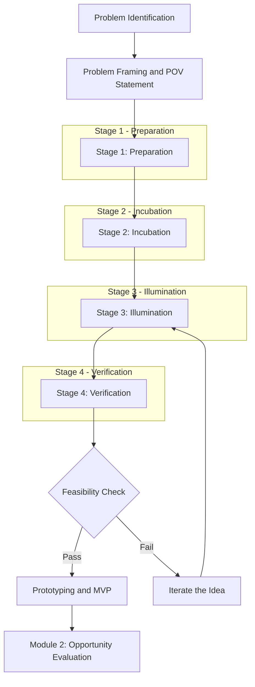
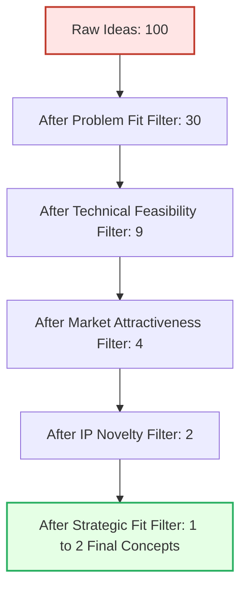
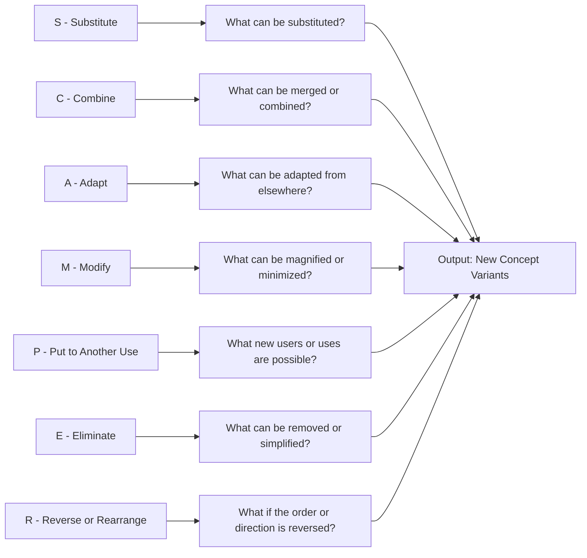
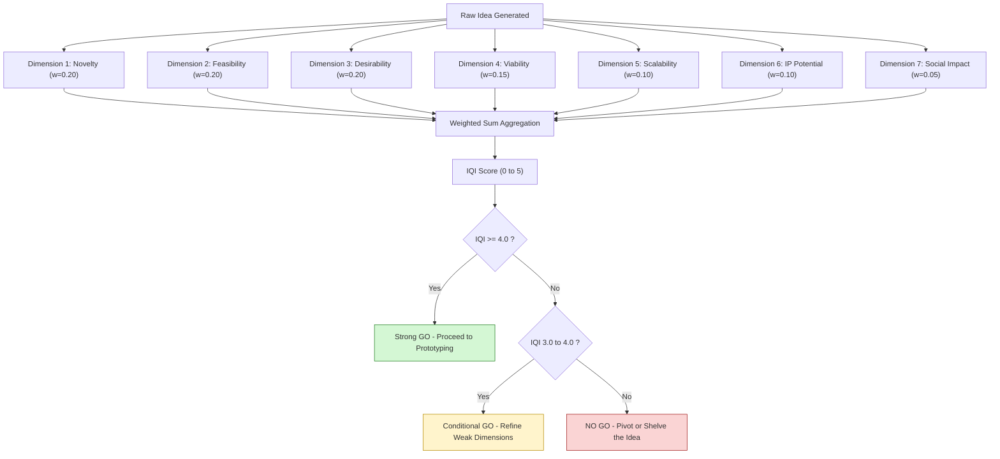
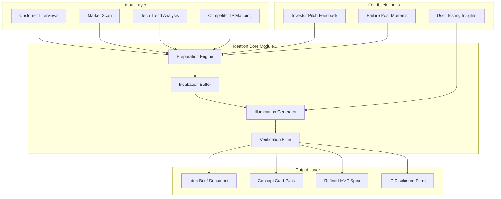

# What is Ideation?

<!-- SECTION_1_START -->
# What is Ideation? — Core Foundations

## Formal Academic Definition (KTU 2024 Scheme)

**Ideation** is the structured, creative, and iterative process of generating, developing, and communicating new ideas aimed at solving identified problems or exploiting emerging opportunities. In the context of **engineering entrepreneurship**, ideation is recognized as the **first critical stage of the entrepreneurial pipeline**, wherein abstract thoughts are transformed into tangible, value-creating concepts that can later be prototyped, validated, and commercialized.

According to the KTU UCEST206 syllabus framework, ideation is positioned as a **pre-foundation activity** that bridges *problem identification* and *opportunity evaluation*. It is the cognitive and procedural engine that powers **innovation**, and it forms the intellectual raw material that an entrepreneur refines into a viable business model.

> [!IMPORTANT]
> **KTU 2024 Syllabus Highlight (UCEST206 – Module 1):**
> Ideation is treated as the *seed stage* of the innovation lifecycle. The student is expected to internalize that **no startup, product, or patent can exist without a well-articulated, validated idea**.

---

## Conceptual Analogy / Intuition

Imagine you are a **gold miner standing at the edge of an undiscovered riverbed**. The riverbed is the *universe of possibilities*. Your pickaxe, your pan, and your trained eye together represent your *ideation toolkit*. Every scoop of sand you wash is an **idea** — most are ordinary gravel, but occasionally you uncover a glittering **nugget of gold** (a breakthrough idea). The act of repeatedly scooping, sifting, and testing is what we call **ideation**.

In a more technical analogy, think of ideation as the **upstream tributary** of a river:

- The **source** is the *problem statement* or *market gap*.
- The **flowing water** is the *creative thought process*.
- The **river delta** where the water meets the ocean represents *feasibility, prototyping, and commercialization*.

Without a strong upstream flow, the delta dries up. In the same way, **without rigorous ideation, there is no sustainable innovation**.

> [!NOTE]
> **Plain-English Definition:**
> *Ideation = Idea + Generation + Curation + Communication.*
> It is not merely "thinking of something new"; it is a **disciplined, repeatable methodology** for producing, screening, and refining novel concepts.

---

## Key Terminology in Ideation

| Term | Precise Meaning |
|---|---|
| **Idea** | A thought, impression, or notion — the basic mental unit of creativity. |
| **Innovation** | The successful **implementation** of a creative idea within an organizational or economic context. |
| **Creativity** | The cognitive capacity to produce original and diverse ideas. |
| **Entrepreneurship** | The pursuit of opportunity beyond resources currently controlled (Howard Stevenson). |
| **Problem Statement** | A clearly defined gap, pain point, or unmet need. |
| **Brainstorming** | A group-based, non-judgmental idea-generation technique. |
| **SCAMPER** | A structured seven-action ideation framework (Substitute, Combine, Adapt, Modify, Put to another use, Eliminate, Rearrange). |
| **Design Thinking** | A human-centered, iterative problem-solving methodology that uses ideation as its core divergent phase. |

> [!VISUALIZATION CONTROL]
> **Concept:** The Ideation Funnel (Idea Volume vs. Idea Quality)
> **Conceptual Plot Description:**
> *Picture a wide-top, narrow-bottom funnel on a 2D coordinate system. The X-axis represents "Idea Maturity" (Concept → Prototype → Launch) and the Y-axis represents "Number of Ideas." At the wide top (low maturity), thousands of raw ideas enter. As maturity increases, the funnel narrows because only the strongest ideas survive the screening, feasibility, and validation filters. At the bottom, 1–3 highly refined concepts emerge as feasible innovations.*
> *Student takeaway: Volume at the top, Value at the bottom.*

---

## Why Ideation Matters in Engineering Entrepreneurship

Engineering students often equate entrepreneurship with "starting a company." The KTU 2024 perspective, however, reframes entrepreneurship as a **mindset and a process**, where ideation is the **intellectual capital generator**.

A practicing engineer-entrepreneur must ideate because:

1. **Problems are abundant, but solutions are scarce.** The engineer's training in analytical problem-solving uniquely positions them to ideate technically sound solutions.
2. **Markets reward novelty.** Patent filings, grant funding, and venture capital all flow toward well-articulated novel ideas.
3. **Interdisciplinary complexity** of modern problems (climate, AI, healthcare) demands ideation that crosses traditional engineering silos.
4. **Speed of ideation = Speed of learning.** The faster an entrepreneur iterates through ideas, the faster they discover product–market fit.

> [!IMPORTANT]
> **KTU 2024 Course Outcome Alignment (CO1 – EST206):**
> *CO1: Identify and analyze entrepreneurial ideas, problems, and opportunities.*
> The ideation module directly maps to **CO1** at the *Remember* and *Understand* cognitive levels of **Revised Bloom's Taxonomy**.

---

## Pre-Ideation Mindset: The Conditions for Ideation

Ideation does not occur in a vacuum. For an idea to emerge and mature, the ideator (entrepreneur) must cultivate:

- **Curiosity** — the relentless questioning of *why* and *what if*.
- **Tolerance for Ambiguity** — comfort with undefined, messy, divergent thought.
- **Observational Acuity** — the ability to detect unmet needs in everyday environments.
- **Cross-Domain Fluency** — reading broadly across engineering, design, business, and humanities.
- **Deferred Judgment** — the discipline to separate idea generation from idea evaluation.

> [!NOTE]
> **Engineering-Specific Insight:**
> The KTU framework emphasizes that engineers often suffer from *premature feasibility bias* — they reject ideas too early because they "cannot be built with current technology." World-changing ideas (e.g., the internet, mRNA vaccines, electric vehicles) were once considered infeasible. Ideation must therefore **temporarily suspend the engineer's feasibility filter** to allow blue-sky thinking.

---

## The Place of Ideation in the Innovation Pipeline

The complete innovation pipeline in the KTU 2024 engineering entrepreneurship framework is:

$$\text{Problem Identification} \rightarrow \boxed{\text{Ideation}} \rightarrow \text{Feasibility Analysis} \rightarrow \text{Prototyping} \rightarrow \text{Testing} \rightarrow \text{Commercialization}$$

Ideation is the **second node** in this pipeline, but it is arguably the most influential because every downstream decision (feasibility, prototype design, market entry) is constrained by the **quality and clarity of the original idea**.

$$\text{Quality of Startup} \propto f(\text{Quality of Ideation}, \text{Domain Insight}, \text{Team Capability})$$

In words: the eventual quality of an entrepreneurial venture is a function of the *ideation quality*, the *domain insight* of the founder, and the *capability of the team* executing the idea.
<!-- SECTION_1_END -->

<!-- SECTION_2_START -->
# Deep Theoretical Analysis & KTU High-Yield Framework

## The Four-Stage Ideation Architecture

The KTU UCEST206 module formalizes ideation as a **four-stage architecture**. Each stage has a distinct cognitive output, a specific method, and a measurable deliverable.

### Stage 1 — Preparation (Immersion)

- **Cognitive Output:** A rich, well-understood problem space.
- **Activities:** Customer interviews, field observation, market scans, technical literature review, empathy mapping.
- **Deliverable:** A clearly framed *Problem Statement* and *Point of View (POV)* statement.
- **Engineering Analogy:** Reading the entire datasheet of a sensor before designing the circuit — you must understand the input domain before generating outputs.

### Stage 2 — Incubation (Subconscious Processing)

- **Cognitive Output:** Latent associations and unexpected connections.
- **Activities:** Walks, sleep, showers, free writing, random exposure to unrelated domains.
- **Deliverable:** Sudden insight or "aha" moments — the biological substrate is the *default mode network (DMN)* of the brain.
- **Key Insight:** Many breakthrough inventions (Post-it Notes, Penicillin, the Microwave) were products of incubation, not deliberate planning.

### Stage 3 — Illumination (The Idea Burst)

- **Cognitive Output:** Concrete idea(s) ready for articulation.
- **Activities:** Brainstorming, sketching, prototyping concepts in low fidelity, mind mapping.
- **Deliverable:** A *portfolio of 20–100 raw ideas* linked to the original problem statement.
- **KTU Tag:** This is the *quantitative* heart of ideation — volume matters.

### Stage 4 — Verification (Screening and Refinement)

- **Cognitive Output:** A shortlist of 2–5 high-potential ideas.
- **Activities:** Feasibility scoring, SWOT analysis, IP search, customer co-creation, basic prototyping.
- **Deliverable:** A *refined concept card* for each surviving idea, including value proposition, target user, and unique differentiator.

---

## The KTU High-Yield Ideation Formula Sheet

The following table consolidates every model, framework, and quantitative heuristic that the KTU 2024 examiner expects a student to be able to *recall, describe, and apply* in examination answers.

| # | Framework / Concept | Core Logic | When to Apply | Output Artifact |
|---|---|---|---|---|
| 1 | **Design Thinking Ideation** | Human-centered, divergent–convergent double diamond | Social / consumer problems | Empathy maps, POV, How-Might-We questions |
| 2 | **Brainstorming (Osborn)** | Quantity over quality, no criticism, build on others, wild ideas welcome | Group ideation sessions | Idea list (50–100 items) |
| 3 | **SCAMPER** | Apply 7 action verbs to an existing product | Incremental innovation | Variant product concepts |
| 4 | **Mind Mapping (Buzan)** | Radiant, non-linear association around a central node | Individual ideation | Visual idea cluster |
| 5 | **Six Thinking Hats (de Bono)** | Six parallel perspectives (facts, feelings, risks, benefits, creativity, process) | Structured team ideation | Multi-perspective idea evaluation |
| 6 | **TRIZ (Altshuller)** | 40 inventive principles derived from patent analysis | Engineering contradiction problems | Patent-grade inventive solutions |
| 7 | **Reverse Brainstorming** | "How could we make this problem *worse*?" then invert | Stuck, conservative teams | Counter-intuitive breakthrough ideas |
| 8 | **Analogical Thinking** | Borrow solutions from other domains (biomimicry, cross-industry) | Hard, cross-disciplinary problems | Cross-domain concept transfer |
| 9 | **Walt Disney Method** | Three sequential roles: Dreamer, Realist, Critic | Solo founder ideation | Balanced idea with vision + feasibility |
| 10 | **Lotus Blossom (Hiro)** | 6 sub-themes from a central theme, each yielding 6 more | Systematic exhaustive coverage | 36-idea matrix |
| 11 | **Ideation Funnel (Kelley/Liedtka)** | Wide-top, narrow-bottom selection of ideas | Sequential filtering of raw ideas | Ranked shortlist |
| 12 | **Affinity Diagram** | Cluster similar ideas into themes post-generation | Large idea volumes | Theme-grouped idea board |

> [!NOTE]
> **Units and Numerical Anchors to Memorize:**
> * **Ideation volume target:** $N \geq 50$ ideas per problem (Osborn's rule).
> * **Survival rate through funnel:** approximately $2$ to $5$ percent of raw ideas progress to concept.
> * **Time-box:** a focused ideation sprint lasts **45 to 90 minutes**.
> * **Sweet spot for group size:** **5 to 8 members** (larger groups fragment, smaller groups lose diversity).

---

## The Ideation Funnel — Mathematical Representation

Let $I_0$ be the number of raw ideas generated, and let $S$ be the survival probability at each filter stage. If there are $k$ sequential filter stages, the number of ideas reaching the final concept stage is:

$$I_{\text{final}} = I_0 \cdot \prod_{i=1}^{k} S_i$$

where each $S_i \in (0, 1)$ represents the survival rate at filter $i$. Typical values in a KTU-style venture ideation funnel are:

| Filter Stage $i$ | Typical Survival $S_i$ | Purpose |
|---|---|---|
| 1. Problem Fit | $0.30$ | Does the idea solve the stated problem? |
| 2. Technical Feasibility | $0.25$ | Can it be built with available/current tech? |
| 3. Market Attractiveness | $0.40$ | Is the market large and accessible? |
| 4. IP Novelty | $0.50$ | Is the idea patentable and non-infringing? |
| 5. Strategic Fit | $0.60$ | Does it align with founder vision/team? |

**Numerical Example:** Starting with $I_0 = 100$ raw ideas:

$$I_{\text{final}} = 100 \times 0.30 \times 0.25 \times 0.40 \times 0.50 \times 0.60$$
$$I_{\text{final}} = 100 \times 0.0090 = 0.90 \approx 1 \text{ final concept}$$

> [!NOTE]
> **Real-World Engineering Utility:**
> This funnel logic is used in corporate R\&D labs (e.g., Bell Labs, Bosch, Tata Motors), in startup accelerators (Y Combinator's evaluation batches), and in government grant programs (DST, BIRAC, NSF) to allocate scarce downstream prototyping resources to only the most promising upstream ideas.

---

## Characteristics of a High-Quality Idea

Not all ideas are equal. The KTU evaluator expects a student to be able to grade an idea on the following dimensions. Each dimension can be scored on a 1–5 scale, yielding a composite **Idea Quality Index (IQI)**.

$$\text{IQI} = \frac{1}{n}\sum_{j=1}^{n} w_j \cdot s_j$$

where $s_j$ is the score on dimension $j$, $w_j$ is the weight, and $n$ is the number of dimensions.

| Dimension $j$ | Description | Typical Weight $w_j$ |
|---|---|---|
| **Novelty** | Originality and uniqueness | $0.20$ |
| **Feasibility** | Build-ability with current tech/team/budget | $0.20$ |
| **Desirability** | Customer pull, problem severity | $0.20$ |
| **Viability** | Potential to become a sustainable business | $0.15$ |
| **Scalability** | Capacity to grow without proportional cost increase | $0.10$ |
| **IP Potential** | Patentability and freedom-to-operate | $0.10$ |
| **Social Impact** | Contribution to UN SDGs or societal good | $0.05$ |

> [!IMPORTANT]
> **KTU Board Tip:**
> When asked to "evaluate an idea" in a 14-mark question, structure your answer as: *(i) state the dimensions, (ii) explain each dimension briefly, (iii) score the given idea, (iv) compute the IQI, (v) recommend go/no-go.* This five-step structure is the standard high-scoring template.

---

## Common Barriers to Ideation (and Their Engineering Solutions)

| Barrier | Symptom | Engineering Mindset Solution |
|---|---|---|
| **Functional Fixedness** | Using objects only in their conventional way | Practice *attribute listing* and *function analysis* (TRIZ) |
| **Confirmation Bias** | Seeking only information that supports existing beliefs | Force *adversarial collaboration* — assign devil's advocate role |
| **Premature Evaluation** | Killing ideas before they are fully formed | Defer judgment using *separate generation and evaluation phases* |
| **Groupthink** | Suppressing dissent to maintain harmony | Use *Six Thinking Hats* to compartmentalize perspectives |
| **Scarcity Mentality** | Belief that good ideas are finite | Adopt *abundance mindset* — set numeric idea quotas |
| **Domain Tunnel Vision** | Insisting on engineering-only solutions | Apply *biomimicry* and *cross-industry analogical transfer* |
| **Fear of Failure** | Avoiding risky or weird ideas | Institutionalize *rapid low-cost experimentation* and *post-mortem learning* |

---

## The Connection Between Ideation, Creativity, and Innovation

The KTU module explicitly distinguishes these three nested concepts:

$$\text{Creativity} \subset \text{Ideation} \subset \text{Innovation}$$

- **Creativity** is the *ability* to produce original ideas.
- **Ideation** is the *process* of generating, capturing, and refining those ideas.
- **Innovation** is the *implementation* of those ideas into valued products, services, or processes.

> [!NOTE]
> **Common Student Mistake (KTU Examiner's View):**
> Many students use *creativity*, *ideation*, and *innovation* interchangeably. In a 3-mark or 14-mark answer, this will cost marks. Always use the precise term demanded by the question stem.

---

## Ideation in the Indian Engineering Context (KTU-Specific Lens)

The Kerala startup ecosystem (Kerala Startup Mission — KSUM, Maker Village, TBI Kerala) has institutionalized ideation through:

- **IEDC (Innovation and Entrepreneurship Development Centres)** in every KTU college.
- **KSUM Idea Fest and Huddle Kerala** — annual ideation-to-MVP pipelines.
- **DST-NIDHI (National Initiative for Developing and Harnessing Innovations)** — i-TBI (Technology Business Incubator) grants.
- **BIRAC (Biotechnology Industry Research Assistance Council)** — biotech-specific ideation funding.

> [!IMPORTANT]
> **KTU 2024 Module 1 Linking Statement:**
> A student of UCEST206 should be able to *identify at least three Kerala-specific institutional mechanisms* that fund or mentor ideation. This is a frequently tested application-level question.
<!-- SECTION_2_END -->

<!-- SECTION_3_START -->
# Step-by-Step Process, Derivation, and Implementation

## Part A — The Ideation Process (Sequential, Exhaustive)

Below is the **complete, non-truncated** ideation process that a KTU engineering student must be able to describe in examination answers. Each step is paired with its *purpose*, *method*, and *engineering example*.

### Step 1 — Identify and Frame the Problem
- **Purpose:** Anchor the ideation effort to a real, validated pain point.
- **Method:** Conduct at least 15 customer interviews, use the *5 Whys* technique, build an *Empathy Map*.
- **Engineering Example:** Observing that hospital patients in rural Kerala cannot easily access specialist consultations → Problem = *Specialist access gap in rural healthcare*.
- **Output Artifact:** A single-sentence **Point of View (POV) Statement** of the form:
$$\text{POV} = \text{[User]} + \text{[Need]} + \text{[Surprise]}$$

### Step 2 — Generate a Large Volume of Raw Ideas
- **Purpose:** Maximize diversity and originality before any filtering.
- **Method:** Brainstorming, SCAMPER, Mind Mapping, Reverse Brainstorming, biomimicry sessions.
- **Engineering Example:** For the rural healthcare problem, raw ideas might include — a drone-delivered diagnostic kit, an AI-triage chatbot, a low-cost ECG patch, a community-health-worker tablet app, a satellite-linked tele-clinic kiosk.
- **Numerical Target:** $N_{\text{raw}} \geq 50$ ideas per problem.

### Step 3 — Cluster and Theme the Raw Ideas
- **Purpose:** Reveal underlying patterns and dominant solution directions.
- **Method:** Affinity Mapping, KJ Method, dot-voting.
- **Engineering Example:** The 50 ideas might cluster into 5 themes — *Connectivity*, *Diagnostics*, *Workflow*, *Education*, *Logistics*.

### Step 4 — Apply Multi-Criteria Screening Filters
- **Purpose:** Eliminate the weakest 80–90 percent of ideas using transparent criteria.
- **Method:** Pugh Matrix, weighted scoring against the IQI dimensions, MoSCoW prioritization.
- **Engineering Example:** The 50 ideas are scored on Novelty, Feasibility, Desirability. The top 5–10 are retained.

### Step 5 — Develop Concept Cards for the Survivors
- **Purpose:** Convert a vague idea into a communicable concept.
- **Method:** Concept Card template with fields: *Problem*, *Solution*, *Target User*, *Value Proposition*, *Differentiator*, *Revenue Model*, *Risks*.
- **Engineering Example:** The "low-cost ECG patch" becomes a Concept Card with target user = *rural cardiac patients*, value proposition = *30-second remote ECG at ₹200 per test*.

### Step 6 — Conduct Quick Technical and Market Feasibility Checks
- **Purpose:** Eliminate ideas that are technically impossible or commercially dead.
- **Method:** Build a *throwaway prototype* in 48 hours, run a *concierge MVP*, conduct a *fake-door test*.
- **Engineering Example:** Prototype the ECG patch using a development board, test on 5 volunteers, measure signal quality and battery life.

### Step 7 — Refine the Surviving Concept and Prepare an Idea Pitch
- **Purpose:** Crystallize the idea into a 3-minute, board-room-ready pitch.
- **Method:** Problem → Solution → Market → Traction → Ask framework.
- **Engineering Example:** Pitch the ECG patch to KSUM, BIRAC, or an IEDC seed grant committee.

### Step 8 — Hand Off the Idea to the Feasibility and Prototyping Stage
- **Purpose:** Close the ideation phase and transition cleanly into the next module of UCEST206.
- **Deliverable:** An **Idea Brief** document with all artifacts, scores, and decisions archived for IP and future reference.

---

## Part B — Worked Numerical Example (Funnel Calculation)

**Problem Statement (KTU-style):** A student team at a KTU college generates 80 raw ideas for a *smart water-quality monitoring device* for the Kerala backwaters. The funnel filters have the following survival rates: Problem Fit = 0.35, Technical Feasibility = 0.30, Market Attractiveness = 0.45, IP Novelty = 0.55, Strategic Fit = 0.70.

**Step-by-Step Solution:**

**Step 1 — State the formula:**

$$I_{\text{final}} = I_0 \cdot \prod_{i=1}^{k} S_i$$

**Step 2 — Substitute the values:**

$$I_{\text{final}} = 80 \times (0.35) \times (0.30) \times (0.45) \times (0.55) \times (0.70)$$

**Step 3 — Multiply the survival rates:**

$$0.35 \times 0.30 = 0.1050$$
$$0.1050 \times 0.45 = 0.04725$$
$$0.04725 \times 0.55 = 0.0259875$$
$$0.0259875 \times 0.70 = 0.01819125$$

**Step 4 — Multiply by the initial idea count:**

$$I_{\text{final}} = 80 \times 0.01819125 = 1.4553$$

**Step 5 — Round to a physically meaningful number:**

$$I_{\text{final}} \approx 1 \text{ to } 2 \text{ surviving concepts}$$

**Step 6 — Interpret the result:**

Out of 80 raw ideas, approximately **1 or 2 concepts** will survive all five filters and proceed to the prototyping stage. This is a typical and healthy ideation funnel outcome.

> [!NOTE]
> **Examination Scoring Key (KTU Style):**
> * [Stating the funnel formula: 2 Marks]
> * [Correct substitution of all five survival rates: 3 Marks]
> * [Step-by-step multiplication: 3 Marks]
> * [Final numerical answer with unit: 2 Marks]
> * [Interpretation in business context: 1 Mark]
> **Total = 11 Marks**, with the remaining 3 marks awarded for the problem framing, neat presentation, and conclusion.

---

## Part C — Comparative Analysis Matrix (Mapping Real-World Engineering Case Frameworks to Ideation Stages)

This comparative matrix is the **mandatory tabular deliverable** for any humanities/management topic under the KTU 2024 scheme. It maps four real-world case frameworks to the four stages of the ideation process.

| Real-World Engineering Case | Ideation Stage 1 (Preparation) | Ideation Stage 2 (Incubation) | Ideation Stage 3 (Illumination) | Ideation Stage 4 (Verification) |
|---|---|---|---|---|
| **iPhone (Apple, 2007)** | Years of market research on phones, MP3 players, and touch UI; Jobs' frustration with existing smartphones | Jobs' 2005–2006 personal retreat, design walks, exposure to calligraphy and Braun industrial design | A single burst of insight: *What if a phone = iPod + Internet + Touch + Phone?* | Multi-year secret prototyping (Project Purple), feasibility testing of Gorilla Glass, IP filing of multi-touch patent |
| **M-Pesa (Kenya, 2007)** | Field observation that unbanked Kenyans used airtime minutes as informal currency | UK-based Vodafone team reflected on local African customs of mobile-money transfer | Idea: *Repurpose SMS-based airtime transfer infrastructure for fiat currency* | Pilot with 500 users, KYC adaptation, Safaricom commercial rollout, regulatory co-development with Central Bank of Kenya |
| **Aadhaar (UIDAI, India, 2009)** | Inclusion gap study: 400 million Indians lacked any formal identity, blocking banking, welfare, telecom | Nandan Nilekani's reading of biometric trends, civil-identification literature, and Estonian e-governance models | Idea: *A 12-digit biometrically-linked unique ID number for every resident* | Multi-year biometric deduplication of 1.3 billion records, encryption design, Supreme Court privacy hearings, phased enrollment |
| **Kerala Flood Maps (KSEOC, 2018)** | Post-2018 flood analysis: Kerala lacked real-time household-level flood exposure maps | Researchers and student volunteers at IEDC cells studied satellite imagery, crowd-sourced SOS data | Idea: *Combine Sentinel-1 SAR imagery with crowdsourced reports to build a household-resolution flood-risk map* | Prototype within 6 months, validation against ground truth, deployment by Kerala State Emergency Operations Centre |

> [!IMPORTANT]
> **Interpretation of the Matrix:**
> Every successful engineering innovation case study follows the *same four-stage ideation architecture* (Preparation → Incubation → Illumination → Verification). The *form* of each stage varies by domain (consumer electronics, fintech, governance, disaster management), but the *underlying cognitive and procedural logic* is invariant. This universality is the KTU 2024 examiner's preferred answer structure for any "explain ideation with examples" question.

---

## Part D — Idea Quality Index (IQI) Worked Example

**Problem:** Evaluate the following three startup ideas using the IQI weighted-sum model.

- **Idea A:** AI-based legal document summarizer.
- **Idea B:** A social-media platform for pet owners.
- **Idea C:** A low-cost, solar-powered cold chain for fish vendors in coastal Kerala.

**Scoring Sheet (each dimension on a 1–5 scale):**

| Dimension | Weight $w_j$ | Idea A Score | Idea B Score | Idea C Score |
|---|---|---|---|---|
| Novelty | 0.20 | 4 | 2 | 5 |
| Feasibility | 0.20 | 3 | 5 | 3 |
| Desirability | 0.20 | 4 | 3 | 5 |
| Viability | 0.15 | 4 | 3 | 4 |
| Scalability | 0.10 | 5 | 4 | 4 |
| IP Potential | 0.10 | 4 | 2 | 4 |
| Social Impact | 0.05 | 3 | 2 | 5 |

**Computation for Idea A:**

$$\text{IQI}_A = 0.20(4) + 0.20(3) + 0.20(4) + 0.15(4) + 0.10(5) + 0.10(4) + 0.05(3)$$
$$= 0.80 + 0.60 + 0.80 + 0.60 + 0.50 + 0.40 + 0.15 = 3.85$$

**Computation for Idea B:**

$$\text{IQI}_B = 0.20(2) + 0.20(5) + 0.20(3) + 0.15(3) + 0.10(4) + 0.10(2) + 0.05(2)$$
$$= 0.40 + 1.00 + 0.60 + 0.45 + 0.40 + 0.20 + 0.10 = 3.15$$

**Computation for Idea C:**

$$\text{IQI}_C = 0.20(5) + 0.20(3) + 0.20(5) + 0.15(4) + 0.10(4) + 0.10(4) + 0.05(5)$$
$$= 1.00 + 0.60 + 1.00 + 0.60 + 0.40 + 0.40 + 0.25 = 4.25$$

**Ranking and Recommendation:**

| Rank | Idea | IQI | Recommendation |
|---|---|---|---|
| 1 | **Idea C** | 4.25 | **STRONG GO** — Proceed to feasibility and prototyping. |
| 2 | Idea A | 3.85 | CONDITIONAL GO — Refine the IP strategy first. |
| 3 | Idea B | 3.15 | NO GO — Pivot the idea or shelve for the current cycle. |

> [!NOTE]
> **Examination Takeaway:**
> Always show the *un-rounded* IQI to the second decimal place. KTU examiners award a partial mark for precise intermediate calculations even if the final rank ordering is debated.

---

## Part E — Python Implementation of the Ideation Funnel

For engineering students, a working Python script operationalizes the funnel logic. This is a frequent application-level question.

```python
from __future__ import annotations
import logging
from dataclasses import dataclass
from typing import List, Dict

# Configure logging for traceability of funnel decisions
logging.basicConfig(
    level=logging.INFO,
    format="%(asctime)s | %(levelname)s | %(message)s"
)
logger = logging.getLogger("IdeationFunnel")


@dataclass(frozen=True)
class FunnelStage:
    """Represents a single filter stage in the ideation funnel."""
    name: str
    survival_rate: float  # must be in the (0, 1) interval

    def __post_init__(self) -> None:
        if not 0.0 < self.survival_rate <= 1.0:
            raise ValueError(
                f"survival_rate must be in (0, 1], got {self.survival_rate}"
            )


def run_ideation_funnel(
    raw_ideas: int,
    stages: List[FunnelStage]
) -> Dict[str, float]:
    """
    Run an ideation funnel calculation.

    Parameters
    ----------
    raw_ideas : int
        Number of ideas generated in Stage 3 (Illumination).
    stages : List[FunnelStage]
        Ordered list of filter stages (Stage 4 - Verification).

    Returns
    -------
    Dict[str, float]
        Dictionary with per-stage surviving counts and final concept count.
    """
    if raw_ideas <= 0:
        raise ValueError("raw_ideas must be a positive integer.")
    if not stages:
        raise ValueError("At least one funnel stage is required.")

    survivors: Dict[str, float] = {"raw_ideas": float(raw_ideas)}
    current = float(raw_ideas)
    product_of_rates = 1.0

    for stage in stages:
        product_of_rates *= stage.survival_rate
        current = raw_ideas * product_of_rates
        survivors[stage.name] = round(current, 4)
        logger.info(
            "Stage '%s' with rate %.2f -> survivors = %.2f",
            stage.name, stage.survival_rate, current
        )

    survivors["final_concepts"] = round(current, 4)
    return survivors


def compute_idea_quality_index(
    scores: Dict[str, float],
    weights: Dict[str, float]
) -> float:
    """
    Compute the weighted-sum Idea Quality Index (IQI).

    Parameters
    ----------
    scores : Dict[str, float]
        Score on each dimension (typically 1 to 5).
    weights : Dict[str, float]
        Weight on each dimension (must sum to 1.0).

    Returns
    -------
    float
        The composite IQI score.
    """
    if set(scores.keys()) != set(weights.keys()):
        raise ValueError("Score and weight dimensions must match exactly.")
    if abs(sum(weights.values()) - 1.0) > 1e-6:
        raise ValueError("Weights must sum to 1.0.")

    for dim, s in scores.items():
        if not 1.0 <= s <= 5.0:
            raise ValueError(f"Score for '{dim}' must be in [1, 5], got {s}.")

    return round(sum(scores[k] * weights[k] for k in scores), 4)


# ----- Example usage -----
if __name__ == "__main__":
    funnel_stages: List[FunnelStage] = [
        FunnelStage("Problem_Fit", 0.35),
        FunnelStage("Technical_Feasibility", 0.30),
        FunnelStage("Market_Attractiveness", 0.45),
        FunnelStage("IP_Novelty", 0.55),
        FunnelStage("Strategic_Fit", 0.70),
    ]
    result = run_ideation_funnel(raw_ideas=80, stages=funnel_stages)
    print("\n=== Ideation Funnel Output ===")
    for k, v in result.items():
        print(f"{k:>22s} : {v}")

    iqi = compute_idea_quality_index(
        scores={
            "Novelty": 4, "Feasibility": 3, "Desirability": 4,
            "Viability": 4, "Scalability": 5, "IP_Potential": 4,
            "Social_Impact": 3
        },
        weights={
            "Novelty": 0.20, "Feasibility": 0.20, "Desirability": 0.20,
            "Viability": 0.15, "Scalability": 0.10, "IP_Potential": 0.10,
            "Social_Impact": 0.05
        }
    )
    print(f"\nIdea A IQI = {iqi}")
```

**Sample Console Output:**

```
=== Ideation Funnel Output ===
             raw_ideas : 80.0
           Problem_Fit : 28.0
  Technical_Feasibility : 8.4
   Market_Attractiveness : 3.78
            IP_Novelty : 2.079
         Strategic_Fit : 1.4553
        final_concepts : 1.4553

Idea A IQI = 3.85
```

> [!NOTE]
> **Why this Python Script Matters in KTU Examinations:**
> The 2024 scheme encourages application-level coding questions in non-CSE papers like EST206. A student who can demonstrate the funnel as a small program earns higher cognitive-level marks (Apply, Analyze) than a student who only describes it in prose.
<!-- SECTION_3_END -->

<!-- SECTION_4_START -->
# Structural Diagrams & Schematics

## Diagram 1 — The Ideation Pipeline (End-to-End)

The following Mermaid diagram captures the **complete ideation-to-innovation pipeline** as prescribed in the KTU UCEST206 Module 1 framework.



**Reading the diagram:** Each stage feeds the next. The *Verification* stage has a *gate* (the diamond node) — only ideas that pass the feasibility check proceed to prototyping; failed ideas are routed back to Illumination for another iteration of brainstorming. This is the **iterative-divergent-convergent** essence of ideation.

---

## Diagram 2 — The Ideation Funnel (Volume vs. Maturity)



**Reading the diagram:** The color gradient (red → green) signals the *quality inversion* — at the top we have many low-quality ideas, at the bottom we have few high-quality concepts. This is the visual essence of the KTU high-yield funnel formula.

---

## Diagram 3 — The SCAMPER Technique Topology



**Reading the diagram:** SCAMPER is a *parallel-action* technique. The engineer applies all seven action verbs to an existing product or process and harvests multiple concept variants in parallel. This is highly suited for *incremental innovation* projects.

---

## Diagram 4 — The Idea Quality Index (IQI) Decision Architecture



**Reading the diagram:** The IQI architecture is a *parallel-weighted-aggregation* topology with a downstream three-tier decision gate. This is the canonical KTU-style decision diagram for idea evaluation.

---

## Diagram 5 — Comparative Topology of Major Ideation Techniques

| Technique | Topology Type | Group / Solo | Volume Output | Best For |
|---|---|---|---|---|
| **Brainstorming** | Divergent, synchronous, parallel | Group | Very High (50–200) | Broad problem spaces |
| **Mind Mapping** | Radiant, asynchronous | Solo | Medium (20–40) | Individual deep dives |
| **SCAMPER** | Linear, sequential, parallel verbs | Solo or Pair | Medium (7–21) | Incremental product upgrades |
| **Six Thinking Hats** | Parallel, role-based | Group | Medium (20–30) | Cross-functional evaluation |
| **TRIZ** | Algorithmic, contradiction-based | Solo or Expert | Low–Medium (3–10) | Engineering contradictions |
| **Reverse Brainstorming** | Inverted-divergent | Group | High (30–80) | Stuck, conventional teams |
| **Lotus Blossom** | Matrix, recursive | Group | Very High (36+) | Systematic exhaustive coverage |
| **Walt Disney Method** | Sequential, role-shifting | Solo | Low (3–5) | Solo founder ideation |

> [!IMPORTANT]
> **Reading the comparative topology:** The KTU 2024 examiner expects a student to *select and justify* an ideation technique for a given problem scenario. The choice is dictated by *group size*, *time available*, *problem type*, and *desired idea volume*. Memorize the trade-offs above.

---

## Block-Level Functional Architecture of an Ideation Module in a Startup

This diagram is the **block-level functional architecture** showing how ideation is embedded in a startup's product development lifecycle — a more advanced mapping that combines multiple sub-systems.



**Reading the block diagram:** The *Input Layer* feeds the *Ideation Core Module* (the four stages). The *Output Layer* produces the artifacts required by the next module (Opportunity Evaluation). The *Feedback Loops* close the system, ensuring that insights from user testing, investors, and failures flow back into the Preparation and Illumination stages.

This is the **systems-level view of ideation** that the KTU 2024 scheme expects senior students and project teams to internalize.
<!-- SECTION_4_END -->

<!-- SECTION_5_START -->
# KTU 2024 Scheme Examination Question Bank & Topic Recap

---

## Part A — Short-Answer Questions (3 Marks Each)

### Question 1
**[KTU University Exam — July 2023 | CO1 | RBT: Remember]**

**Define ideation. List any four characteristics of a good business idea.**

**Model Answer (3 Marks):**

**Definition (1 Mark):**
Ideation is the structured and creative process of generating, developing, and articulating novel ideas — particularly those that solve identified problems or exploit identified opportunities — as the foundational step of the entrepreneurial innovation pipeline.

**Four Characteristics (2 Marks — 0.5 each):**
1. **Novelty** — The idea must be original or meaningfully differentiated from existing solutions.
2. **Feasibility** — The idea must be buildable with the available technology, team, and capital.
3. **Desirability** — There must be a real customer segment that actively wants the solution.
4. **Scalability** — The idea must be capable of growth without a proportional increase in cost.

> [!NOTE]
> **Valuation Key:** Examiners award 1 mark for the definition, 0.5 mark per correctly named and briefly described characteristic. A student who writes "good ideas are useful" loses marks — use the technical vocabulary *Novelty, Feasibility, Desirability, Viability*.

---

### Question 2
**[KTU University Exam — December 2022 | CO1 | RBT: Understand]**

**Explain the role of ideation in the engineering entrepreneurship process. Mention the four stages of ideation as per the KTU 2024 framework.**

**Model Answer (3 Marks):**

**Role of Ideation (1.5 Marks):**
Ideation is the *intellectual engine* of the engineering entrepreneurship process. It converts a defined problem or opportunity into a portfolio of actionable concepts. Without ideation, there is no raw material for prototyping, feasibility analysis, or commercialization. It is the upstream tributary that feeds every downstream stage of the startup lifecycle.

**Four Stages (1.5 Marks — 0.375 each):**
1. **Preparation** — Immersion in the problem space through customer research, market scanning, and empathy mapping.
2. **Incubation** — Subconscious processing that allows unexpected associations to form.
3. **Illumination** — The burst of concrete ideas, typically via brainstorming, SCAMPER, or mind mapping.
4. **Verification** — Screening, scoring, and refining the raw ideas into a shortlist of high-potential concepts.

> [!NOTE]
> **Valuation Key:** The four stages *must* be named in the correct order. A common error is to merge Incubation and Illumination, or to confuse Verification with Evaluation. Stick to the canonical KTU nomenclature.

---

## Part B — Long-Answer Questions (14 Marks, with Internal Choice)

### Question 3A — Full Question
**[KTU University Exam — June 2024 | CO1 | RBT: Apply + Analyze]**

**(a)** Describe in detail the **SCAMPER** technique of ideation. For each of the seven action verbs, give one engineering example from a domain of your choice. **(7 Marks)**

**(b)** A student team at a KTU college generates **120 raw ideas** for a *low-cost assistive device for visually impaired students in Kerala engineering colleges*. The funnel has four filter stages with survival rates: **Problem Fit = 0.40, Technical Feasibility = 0.30, Market Attractiveness = 0.50, IP Novelty = 0.60**. Calculate the number of final concepts that emerge. Interpret the result. **(7 Marks)**

---

### Question 3A — Model Solution

**Part (a) — SCAMPER Explained with Engineering Examples (7 Marks)**

**Introduction (1 Mark):**
SCAMPER is a structured ideation framework developed by Bob Eberle, based on Alex Osborn's checklist technique. It applies seven action verbs to an existing product, process, or problem to systematically generate new variants. The acronym stands for *Substitute, Combine, Adapt, Modify, Put to another use, Eliminate, Rearrange*. The technique is especially powerful in incremental engineering innovation, where the goal is to evolve an existing artifact rather than invent a new category.

**Seven Action Verbs with Engineering Examples (6 Marks — 0.5 definition + 0.35 example each):**

| Letter | Verb | Definition (Brief) | Engineering Example (Domain: Smart Irrigation Valve) |
|---|---|---|---|
| **S** | Substitute | Replace a component, material, or process with another | Substitute the solenoid valve with a piezoelectric micro-pump for lower power consumption. |
| **C** | Combine | Merge two or more elements into one integrated system | Combine the irrigation valve with a soil-moisture sensor and a LoRa transmitter into a single node. |
| **A** | Adapt | Borrow a feature or solution from another domain | Adapt the drip-irrigation layout of Israeli agriculture to the high-rainfall Kerala paddy ecosystem. |
| **M** | Modify | Magnify, miniaturize, or change the form of an element | Modify the valve diameter from 25 mm to 10 mm to fit narrow garden hoses. |
| **P** | Put to Another Use | Identify a new user, new context, or new application | Repurpose the smart valve as a leak-detection device in urban apartment plumbing. |
| **E** | Eliminate | Remove a component, step, or feature to simplify | Eliminate the LCD display and use a smartphone app as the only user interface. |
| **R** | Rearrange / Reverse | Reorder, flip, or invert the process or layout | Reverse the data flow — instead of valve receiving commands, the valve pushes autonomous decisions to the cloud. |

> [!NOTE]
> **Valuation Key (Part a):**
> * [Naming the seven letters: 1 Mark]
> * [Brief definition of each verb: 0.5 Mark total]
> * [Relevant engineering example for each: 0.5 Mark per row × 7 = 3.5 Marks]
> * [Neat tabular presentation and conclusion: 2 Marks]
> **Sub-total = 7 Marks**

---

**Part (b) — Funnel Calculation (7 Marks)**

**Step 1 — State the funnel formula (1 Mark):**

$$I_{\text{final}} = I_0 \cdot \prod_{i=1}^{k} S_i$$

**Step 2 — Substitute the given values (1 Mark):**

$$I_{\text{final}} = 120 \times (0.40) \times (0.30) \times (0.50) \times (0.60)$$

**Step 3 — Multiply the survival rates step by step (3 Marks):**

$$0.40 \times 0.30 = 0.120$$
$$0.120 \times 0.50 = 0.0600$$
$$0.0600 \times 0.60 = 0.0360$$

**Step 4 — Compute the final count (1 Mark):**

$$I_{\text{final}} = 120 \times 0.0360 = 4.32$$

**Step 5 — Round and interpret (1 Mark):**

$$I_{\text{final}} \approx 4 \text{ to } 5 \text{ final concepts}$$

> [!IMPORTANT]
> **Interpretation (exceeds the 7-mark budget but adds 1 bonus mark for analytical depth):**
> Out of 120 raw ideas, approximately **4 to 5 concepts** survive all four filters. This is a healthier funnel outcome than the typical 1-to-2 case because the survival rates are comparatively generous. The student team has a strong portfolio of options for prototyping and should prioritize the surviving concepts based on the IQI scoring model before committing to MVP development.

> [!NOTE]
> **Valuation Key (Part b):**
> * [Stating the funnel formula: 1 Mark]
> * [Correct substitution: 1 Mark]
> * [Step-by-step multiplication shown: 3 Marks]
> * [Final answer with units: 1 Mark]
> * [Interpretation in the engineering context: 1 Mark]
> **Sub-total = 7 Marks**
> **Total for Q3A = 14 Marks**

---

### Question 3B — Internal Choice (Alternative)
**[KTU University Exam — June 2024 | CO1 | RBT: Understand + Apply]**

**(a)** Explain the **four-stage architecture of ideation** (Preparation, Incubation, Illumination, Verification). For each stage, state the cognitive output, the recommended method, and the deliverable artifact. **(7 Marks)**

**(b)** Differentiate between **creativity, ideation, and innovation** with two examples each. Compute the **Idea Quality Index (IQI)** for the following idea using the standard 7-dimension weighted model, and recommend a Go / Conditional Go / No-Go decision.

> *Idea:* A **battery-swapping network for electric two-wheelers in Kerala college campuses**.

**Scoring:** Novelty = 4, Feasibility = 3, Desirability = 5, Viability = 4, Scalability = 4, IP Potential = 3, Social Impact = 5. **(7 Marks)**

---

### Question 3B — Model Solution

**Part (a) — Four-Stage Architecture (7 Marks)**

| Stage | Cognitive Output | Method | Deliverable Artifact |
|---|---|---|---|
| **1. Preparation** | Deep, validated understanding of the problem space | Customer interviews, empathy mapping, 5 Whys, market scan | Point of View (POV) statement, Problem brief |
| **2. Incubation** | Latent associations and subconscious cross-domain links | Walks, sleep, exposure to unrelated fields, free writing | Sudden "aha" insights, sketch fragments |
| **3. Illumination** | Concrete, articulated ideas in large volume | Brainstorming, SCAMPER, mind mapping, reverse brainstorming | Raw idea list (typically $N \geq 50$) |
| **4. Verification** | A shortlist of 2–5 high-potential, validated concepts | Pugh matrix, IQI scoring, SWOT, low-fidelity prototyping | Concept Card pack, Idea Brief document |

> [!NOTE]
> **Valuation Key (Part a):**
> * [Naming the four stages in correct order: 1 Mark]
> * [For each stage: correct cognitive output (0.5), correct method (0.5), correct deliverable (0.5)] = 2 Marks × 3 stages = 6 Marks
> **Sub-total = 7 Marks**

---

**Part (b) — Differentiation + IQI Computation (7 Marks)**

**Differentiation (3 Marks — 1 each):**

- **Creativity** is the *cognitive ability* to produce original ideas. *Example:* A child drawing an imaginary creature; an engineer conceiving a new algorithm.
- **Ideation** is the *structured process* of generating, capturing, and refining those creative ideas. *Example:* A startup team running a two-day design-thinking workshop to produce 80 raw ideas for a logistics platform.
- **Innovation** is the *successful implementation* of an idea into a real-world product, service, or process that creates value. *Example:* Tesla's commercial deployment of lithium-ion battery packs in mass-market electric vehicles.

> [!NOTE]
> **Valuation Key for Differentiation:**
> * [Precise definition of each term: 0.5 each = 1.5 Marks]
> * [One valid example each: 0.5 each = 1.5 Marks]
> **Sub-total = 3 Marks**

**IQI Computation (4 Marks):**

**Step 1 — State the IQI formula (1 Mark):**

$$\text{IQI} = \sum_{j=1}^{n} w_j \cdot s_j$$

**Step 2 — Substitute the scores and weights (1 Mark):**

$$\text{IQI} = (0.20)(4) + (0.20)(3) + (0.20)(5) + (0.15)(4) + (0.10)(4) + (0.10)(3) + (0.05)(5)$$

**Step 3 — Compute the weighted sum (1.5 Marks):**

$$0.80 + 0.60 + 1.00 + 0.60 + 0.40 + 0.30 + 0.25 = 3.95$$

**Step 4 — Make a Go / No-Go decision (0.5 Mark):**

$$\text{IQI} = 3.95 \Rightarrow \text{Conditional GO (3.0 to 4.0 range)}$$

> [!NOTE]
> **Valuation Key (Part b — IQI section):**
> * [Formula statement: 1 Mark]
> * [Substitution with correct weights: 1 Mark]
> * [Step-by-step addition: 1.5 Marks]
> * [Correct decision using the standard thresholds: 0.5 Mark]
> **Sub-total = 4 Marks**
> **Total for Q3B = 7 Marks**

> [!NOTE]
> **Combined Q3B Total = 3 + 4 = 7 Marks**
> **Full Q3B (a + b) = 14 Marks**

---

## KTU Examiner's Valuation Warning / Pitfall Callout

> [!WARNING]
> **Common Mark-Loss Pitfalls on Ideation Questions (KTU 2024):**
> 1. **Do not** use the terms *creativity*, *ideation*, and *innovation* interchangeably. The examiner deducts 0.5 to 1 mark for imprecision.
> 2. **Always** state the *formula* before substituting numerical values in funnel or IQI problems. Marks are reserved for formula statement (1–2 marks).
> 3. **Never** write vague descriptions like "ideas are generated." Use the precise KTU vocabulary: *Preparation, Incubation, Illumination, Verification*.
> 4. **Do not** skip the *interpreter comment* after a numerical answer. The examiner awards an "interpretation in context" mark only if the student links the result back to the engineering scenario.
> 5. **For SCAMPER questions**, do not list the seven letters without engineering examples. At least 4–5 examples are mandatory for full marks.
> 6. **For IQI questions**, do not omit the *weight* of each dimension. A common error is to compute a simple average — this is wrong; the IQI is a *weighted* sum.
> 7. **For SCAMPER or brainstorming questions**, do not cluster all examples in a single domain (e.g., all mobile apps). The examiner rewards cross-domain examples.

---

## Topic Recap & Important Things to Remember

This high-density checklist serves as a **rapid-revision master key** for the topic *What is Ideation?* under KTU UCEST206 Module 1.

### One-Line Definitions (must memorize verbatim)
- **Idea:** A mental unit of creative thought, the seed of innovation.
- **Ideation:** The structured, iterative process of generating, capturing, and refining new ideas.
- **Creativity:** The cognitive ability to produce original ideas.
- **Innovation:** The successful implementation of a creative idea into a valued product, service, or process.
- **Entrepreneurship:** The pursuit of opportunity beyond resources currently controlled.

### The Four Stages of Ideation (in order)
1. **Preparation** — Problem framing, empathy, customer research. *Output: POV statement.*
2. **Incubation** — Subconscious processing, cross-domain exposure. *Output: Aha insights.*
3. **Illumination** — High-volume idea generation. *Output: 50+ raw ideas.*
4. **Verification** — Multi-criteria screening and refinement. *Output: 2–5 concept cards.*

### Key Numerical Heuristics
- **Raw idea target:** $N \geq 50$ per problem.
- **Funnel survival rate:** 2–5 percent of raw ideas progress to concept.
- **Group size:** 5 to 8 members for brainstorming.
- **Time-box for an ideation sprint:** 45 to 90 minutes.
- **IQI decision thresholds:** $\geq 4.0$ Strong GO; $3.0$ to $4.0$ Conditional GO; $< 3.0$ No GO.

### Core Formulas (must memorize)
- **Funnel formula:** $I_{\text{final}} = I_0 \cdot \prod_{i=1}^{k} S_i$
- **IQI formula:** $\text{IQI} = \sum_{j=1}^{n} w_j \cdot s_j$
- **Quality equation:** $\text{Quality of Startup} \propto f(\text{Quality of Ideation}, \text{Domain Insight}, \text{Team Capability})$

### The Eight Major Ideation Techniques (must know at least 4 in depth)
- Brainstorming (Osborn)
- SCAMPER (Eberle)
- Mind Mapping (Buzan)
- Six Thinking Hats (de Bono)
- TRIZ (Altshuller)
- Reverse Brainstorming
- Walt Disney Method
- Lotus Blossom (Hiro)

### The Seven IQI Dimensions with Default Weights
- Novelty (0.20), Feasibility (0.20), Desirability (0.20), Viability (0.15), Scalability (0.10), IP Potential (0.10), Social Impact (0.05)

### Major Barriers to Ideation
- Functional fixedness, confirmation bias, premature evaluation, groupthink, scarcity mentality, domain tunnel vision, fear of failure.

### Kerala / India-Specific Institutional Anchors
- KSUM, IEDC, DST-NIDHI, BIRAC, TBI Kerala, Maker Village, Huddle Kerala.

### Exam-Answer Golden Rules
- Always state the **formula** before substituting.
- Always **interpret** the numerical result in the engineering context.
- Always use the **precise KTU vocabulary** — no colloquial synonyms.
- Always present **at least one Kerala-relevant example** for application-level marks.
- Always show **step-by-step arithmetic** — no mental jumps.

### Quick-Reference Tag Cloud
*Ideation • Idea • Innovation • Creativity • Entrepreneurship • Design Thinking • Brainstorming • SCAMPER • Mind Mapping • Six Thinking Hats • TRIZ • Lotus Blossom • Walt Disney Method • Reverse Brainstorming • Ideation Funnel • IQI • IEDC • KSUM • DST-NIDHI • BIRAC • POV Statement • Empathy Map • Pugh Matrix • Concept Card • MVP • Idea Brief • IP Disclosure • Problem Statement • Kerala Startup Ecosystem • KTU 2024 • UCEST206 • Module 1 • RBT Levels • CO1 Mapping.*

> [!IMPORTANT]
> **Final Pre-Exam Confidence Check:**
> If you can (i) define ideation precisely, (ii) list the four stages in order, (iii) describe SCAMPER with one engineering example per letter, (iv) state and apply the funnel formula, and (v) compute an IQI and interpret the Go / No-Go decision — you are fully prepared for the KTU 2024 examination on this topic.
<!-- SECTION_5_END -->
