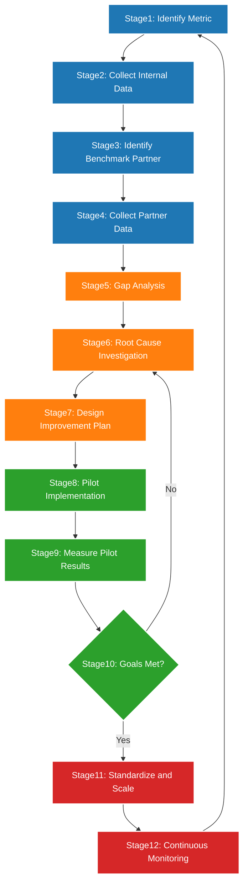
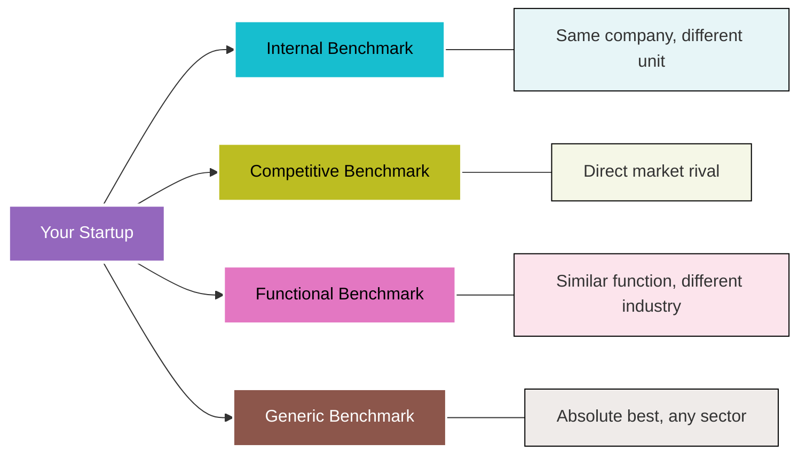
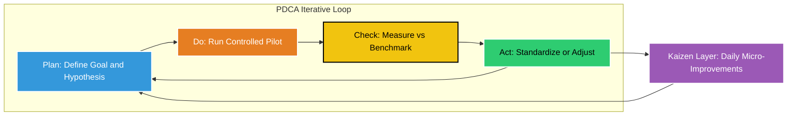
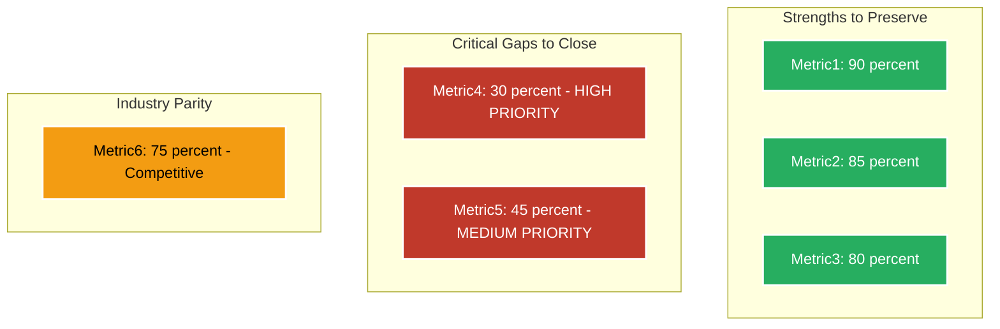

# Benchmarking and improvement

<!-- SECTION_1_START -->

# Benchmarking and Improvement

## 1. Core Technical Definition

**Benchmarking** is a systematic, continuous process of measuring an organization's products, services, processes, and performance metrics against those of industry leaders, best-in-class competitors, or recognized global standards. In the context of the KTU 2024 Scheme entrepreneurship framework, benchmarking serves as the diagnostic engine that powers the *Problem-Solution Canvas* by exposing performance gaps, validating assumptions, and shaping the iterative refinement of a Minimum Viable Product (MVP).

> [!IMPORTANT]
> **KTU 2024 Syllabus Definition (UCEST206 - Module 2):** Benchmarking is the structured method of identifying, understanding, and adapting outstanding practices from within the same industry or from other industries to improve an entrepreneurial venture's problem-solution fit, product quality, and operational efficiency.

### Conceptual Analogy / Intuition

Imagine you are a **cricket captain** preparing for an international match. Before designing your batting strategy, you would not just look at your own team's past scores — you would carefully study the **footwork of the top 5 international batsmen**, observe how they handle specific bowling variations, measure their strike rates against different pitch conditions, and then *adapt* (not blindly copy) those techniques to suit your team's strengths.

Benchmarking works exactly the same way in entrepreneurship:

- The **competing firms** = the world's best batsmen
- **Your startup's process/product** = your team's batting style
- **Gap analysis** = the difference between your strike rate and theirs
- **Improvement plan** = the tailored training regime you design

> [!NOTE]
> **The Benchmarking Mantra:** *Measure → Compare → Learn → Adapt → Improve.* Without benchmarking, an entrepreneur is essentially running a business blindfolded in a competitive marketplace.

### Standard Industry Metrics Used in Benchmarking

- **Cycle Time (T)** — time required to complete a process
- **Defect Rate (D)** — defects per million opportunities (DPMO), standard in **Six Sigma**
- **Customer Satisfaction Score (CSAT)** — measured on a 5-point **Likert Scale**
- **Net Promoter Score (NPS)** — a **-100 to +100** index measuring customer loyalty
- **Return on Investment (ROI)** — expressed as a **percentage (%)**

> [!VISUALIZATION CONTROL]
> **Concept:** Performance Gap Visualization Between a Startup and Industry Leader
> **Plotly / Desmos Input Equations:**
> * $f(x) = 0.85x + 5$ (Industry Leader Performance Curve)
> * $g(x) = 0.55x + 12$ (Startup Performance Curve)
> **Visual Description:** Two intersecting straight-line performance curves on a Cartesian plane. The vertical gap $\Delta y$ between the two lines at any given time $x$ represents the *benchmarking gap* that the entrepreneur must close through structured improvement initiatives. The shaded region between the lines visually quantifies the "lost performance opportunity."

---

<!-- SECTION_1_END -->

<!-- SECTION_2_START -->

# Deep Theoretical Analysis

## 2.1 The Five Pillars of Benchmarking

The theoretical foundation of benchmarking in the KTU entrepreneurial framework rests on **five sequential pillars**:

1. **Identify** — Pinpoint the precise process, product, or metric to be benchmarked.
2. **Analyze** — Collect quantitative and qualitative data on your own operations *and* the best-in-class reference.
3. **Compare** — Measure the performance gap using standardized scoring rubrics.
4. **Adapt** — Modify your internal processes by selectively integrating the superior practices.
5. **Implement & Monitor** — Execute the changes and continuously measure the impact.

> [!IMPORTANT]
> **Key Insight:** Benchmarking is *not* industrial espionage. It is a **legal, ethical, and structured** process of learning from publicly available information, published case studies, patents (open-source), and customer reviews.

## 2.2 Taxonomy of Benchmarking (KTU High-Yield Classification)

The KTU 2024 Scheme explicitly tests students on the four canonical types of benchmarking. Each type serves a different strategic purpose within the Problem-Solution Canvas preparation phase.

| # | Type of Benchmarking | Reference Group | Strategic Purpose | Data Source |
|---|----------------------|-----------------|-------------------|-------------|
| 1 | **Internal Benchmarking** | Other units/branches within the *same* organization | Identifies best practices internally; cheapest to execute | Internal SOPs, audit reports |
| 2 | **Competitive Benchmarking** | Direct market competitors | Measures product/service parity in the marketplace | Customer reviews, mystery shopping, market research |
| 3 | **Functional Benchmarking** | Leaders in a *similar function* across industries | Adapts superior workflow logic from non-competing sectors | Industry whitepapers, conferences |
| 4 | **Generic Benchmarking** | Absolute best-in-class across any industry | Identifies the theoretical performance ceiling | Academic journals, global case studies |

## 2.3 The Benchmarking Process — Detailed Workflow

The benchmarking workflow integrates tightly with the **Problem-Solution Canvas** of Module 2. Each stage maps to a specific block within the canvas:

- **Stage 1 → Problem Block:** Identify customer pain points
- **Stage 2 → Solution Block:** Map existing solutions in the market
- **Stage 3 → Key Metrics Block:** Compare quantitative KPIs
- **Stage 4 → Unique Value Proposition (UVP) Block:** Identify the differentiation gap
- **Stage 5 → Unfair Advantage Block:** Lock in the sustainable lead

## 2.4 Continuous Improvement Frameworks (Critical for KTU)

Three improvement frameworks dominate entrepreneurial benchmarking:

### 2.4.1 PDCA Cycle (Deming Cycle / Kaizen Wheel)

The **Plan-Do-Check-Act** cycle is a four-stage iterative loop that operationalizes benchmarking insights.

| Stage | Action | Benchmarking Link |
|-------|--------|-------------------|
| **Plan** | Hypothesize the change based on benchmark data | Gap analysis output |
| **Do** | Pilot the change in a small, controlled environment | MVP testing |
| **Check** | Measure pilot results against benchmark KPIs | Performance comparison |
| **Act** | Standardize, scale, or abandon the change | Continuous learning loop |

### 2.4.2 Kaizen Philosophy

**Kaizen** is a Japanese methodology meaning "change for the better." It emphasizes **incremental, continuous, employee-driven** improvements rather than disruptive innovation. In a startup, Kaizen translates to **daily stand-up retrospectives** and **sprint-level course corrections**.

### 2.4.3 Six Sigma (DMAIC)

The Six Sigma methodology uses a five-phase **Define → Measure → Analyze → Improve → Control** structure, targeting a maximum of **3.4 defects per million opportunities (DPMO)**.

## 2.5 Engineering & Real-World Utility

Benchmarking is the silent engine behind:

- **Product Management** at FAANG companies (Meta, Apple, Amazon, Netflix, Google) — every feature release is benchmarked against competitor UX flows.
- **Process Optimization** in manufacturing (Toyota Production System, ISO 9001 certifications).
- **IP Strategy** — competitors' patents are benchmarked to identify white-space innovation zones.
- **Startup Pitching** — VCs expect founders to demonstrate clear awareness of competitive benchmarks.

> [!NOTE]
> **Engineering Utility:** In software engineering, *A/B testing* and *code performance profiling* are forms of internal benchmarking. In civil/mechanical engineering, structural load benchmarking against IS/ISO standards is a regulatory requirement.

## 2.6 KTU Formula Sheet / Cheat Sheet

> [!IMPORTANT]
> The following formulas are essential for the 14-mark computation-based KTU questions on benchmarking ROI.

$$
\text{Benchmarking Gap} \;\; G \;=\; P_{\text{best}} \;-\; P_{\text{current}}
$$

$$
\text{Performance Index} \;\; PI \;=\; \frac{P_{\text{current}}}{P_{\text{best}}} \;\times\; 100
$$

$$
\text{Improvement ROI (\%)} \;\; ROI \;=\; \frac{(\text{Gain from Improvement}) \;-\; (\text{Benchmarking Cost})}{\text{Benchmarking Cost}} \;\times\; 100
$$

$$
\text{Six Sigma DPMO} \;\; = \;\; \frac{D \;\times\; 10^{6}}{N}
$$

$$
\text{NPS Score} \;\; = \;\; \%\,\text{Promoters} \;-\; \%\,\text{Detractors}
$$

where $P_{\text{best}}$ is the best-in-class performance metric, $P_{\text{current}}$ is the startup's current metric, $D$ is the number of defects, and $N$ is the total opportunity count.

---

<!-- SECTION_2_END -->

<!-- SECTION_3_START -->

# Step-by-Step Derivations and Case-Based Implementation

## 3.1 Worked Example — Numerical Benchmarking Calculation

> **KTU-Style Problem Statement:**
> *An entrepreneur developing a food delivery app measures the average order delivery time. Her startup's current average delivery time is 45 minutes. After benchmarking against the industry leader (Zomato), she discovers the best-in-class time is 28 minutes. The cost incurred for the entire benchmarking study was Rs. 2,00,000. After implementing the improvements, her average time dropped to 30 minutes, and she estimates a monthly revenue gain of Rs. 80,000. Compute the (a) Benchmarking Gap, (b) Performance Index, and (c) Improvement ROI over 6 months.*

### 3.1.1 Step-by-Step Solution

**Given Data:**
- $P_{\text{current}} = 45$ minutes
- $P_{\text{best}} = 28$ minutes
- $P_{\text{improved}} = 30$ minutes
- Benchmarking Cost $C_{b} = \text{Rs. } 2{,}00{,}000$
- Monthly Revenue Gain $R_{m} = \text{Rs. } 80{,}000$
- Time Horizon $T = 6$ months

**Step 1: Compute the Benchmarking Gap $G$**

$$
G \;=\; P_{\text{best}} \;-\; P_{\text{current}} \;=\; 28 \;-\; 45 \;=\; -17 \text{ minutes}
$$

The negative sign indicates the magnitude of the gap (the startup was 17 minutes *slower* than the leader).
**[Stating the formula: 1 Mark | Substitution: 1 Mark | Final value: 1 Mark]**

**Step 2: Compute the Performance Index $PI$**

$$
PI \;=\; \frac{P_{\text{current}}}{P_{\text{best}}} \times 100 \;=\; \frac{45}{28} \times 100 \;\approx\; 160.71\%
$$

A $PI > 100\%$ confirms the startup is *under-performing* relative to the leader.
**[Stating the formula: 1 Mark | Substitution: 1 Mark | Final value: 1 Mark]**

**Step 3: Compute the Total Revenue Gain $R_{\text{total}}$**

$$
R_{\text{total}} \;=\; R_{m} \times T \;=\; 80{,}000 \times 6 \;=\; \text{Rs. } 4{,}80{,}000
$$

**Step 4: Compute the Improvement ROI**

$$
ROI \;=\; \frac{R_{\text{total}} \;-\; C_{b}}{C_{b}} \times 100 \;=\; \frac{4{,}80{,}000 \;-\; 2{,}00{,}000}{2{,}00{,}000} \times 100
$$

$$
ROI \;=\; \frac{2{,}80{,}000}{2{,}00{,}000} \times 100 \;=\; 140\%
$$

A $140\%$ ROI over 6 months is excellent — a strong indicator that benchmarking was financially justified.
**[Stating the formula: 1 Mark | Substitution: 1 Mark | Final value: 1 Mark]**

> [!WARNING]
> **KTU Examiner's Pitfall:** Students frequently forget to convert the time horizon (months) into a consistent unit (here, 6 months of revenue). Always state the unit of time explicitly in the final line of the answer.

---

## 3.2 Comparative Analysis Table — Benchmarking vs. Improvement Methodologies

> [!IMPORTANT]
> This tabular comparison is a *favourite* KTU 14-mark question. Memorize the distinguishing columns.

| Comparison Parameter | Benchmarking | Kaizen | Six Sigma | PDCA Cycle |
|----------------------|--------------|--------|-----------|------------|
| **Origin** | Xerox Corporation (1979) | Toyota, Japan (Post-WWII) | Motorola, USA (1986) | W. Edwards Deming (1950s) |
| **Primary Focus** | Learning from external best practices | Incremental, daily improvements | Defect reduction to near-zero | Iterative experimental loop |
| **Time Horizon** | Long-term strategic study | Continuous, daily | Project-based (3-6 months) | Short iterative cycles |
| **Key Metric** | Performance Index (%) | Suggestions per employee | DPMO (3.4 target) | Cycle velocity |
| **Cost Intensity** | Medium-High (data collection) | Low (employee-driven) | High (certified Black Belts) | Low (managerial) |
| **Best Suited For** | Strategic repositioning | Operational excellence | Quality-critical industries | Continuous adaptation |
| **Linkage to Problem-Solution Canvas** | Validates *Solution* block | Refines *Key Metrics* block | Strengthens *UVP* block | Closes the iterative loop |

---

## 3.3 Step-by-Step Implementation — Conducting a Benchmarking Study (For a B.Tech Startup)

> **Scenario:** A team of KTU B.Tech students is building a **smart irrigation controller** for Kerala's paddy fields. They must benchmark against the existing *manual timer-based* systems and the *IoT-based* systems of a competitor startup.

**Step 1 — Form the Benchmarking Team**
- Recruit 4-5 cross-functional members: one from each of *hardware*, *software*, *agronomy*, *marketing*, and *finance*.
- Assign a **Benchmarking Coordinator** to manage timelines.

**Step 2 — Define the Scope and Metrics**
- Scope: *Water-saving efficiency*, *cost per unit*, *farmer satisfaction (NPS)*.
- Use **SMART** criteria: Specific, Measurable, Achievable, Relevant, Time-bound.

**Step 3 — Identify Benchmarking Partners**
- Internal: Compare with the team's earlier prototype version.
- Competitive: Compare with the established IoT competitor.
- Functional: Compare with drip-irrigation industry leaders (e.g., Jain Irrigation).
- Generic: Compare with global smart-agriculture AI platforms.

**Step 4 — Data Collection**
- Conduct **farmer interviews** (n $\geq$ 30 for statistical significance).
- Visit **competitor installations** with permission.
- Use **published patent databases** (Indian Patent Office, WIPO) for technical benchmarking.

**Step 5 — Gap Analysis**
- Plot the team's current performance vs. the leader on a **spider/radar chart**.
- Quantify the gap using the **Performance Index formula** from §2.6.

**Step 6 — Adapt and Innovate**
- Do NOT copy. Combine the leader's best UX with the team's unique *regional language support* to create a defensible **Unfair Advantage**.

**Step 7 — Implement and Iterate**
- Pilot with 5 farmers for 30 days.
- Use the **PDCA cycle** at the end of each sprint to refine the solution.

---

## 3.4 Mapping Benchmarking to the Problem-Solution Canvas

| Problem-Solution Canvas Block | Benchmarking Activity | Output |
|-------------------------------|------------------------|--------|
| **Problem Statement** | Survey existing customer pain points | Validated problem list |
| **Customer Segments** | Compare with competitor segmentation | Refined target persona |
| **Existing Alternatives** | Map competitor solutions | Gap in market |
| **Solution Concepts** | Adopt best UX/UI patterns | MVP feature set |
| **Key Metrics** | Benchmark against industry KPIs | Quantitative targets |
| **Unique Value Proposition** | Identify the differentiation gap | Sharper UVP |

---

## 3.5 Case Study — Toyota Production System (TPS) as the Benchmarking Gold Standard

Toyota's TPS is the **canonical global benchmark** in manufacturing. Its core tenet is the *elimination of muda* (waste). Companies worldwide — from Boeing to Tesla — benchmark against Toyota's:

- **Just-in-Time (JIT)** inventory model
- **Jidoka** (autonomation) — machines that detect defects and stop production
- **Heijunka** (level scheduling) — smooth production flow
- **Genchi Genbutsu** — "go and see for yourself" — direct observation

> **Engineering Entrepreneur Insight:** When pitching to investors, a B.Tech founder can cite TPS principles to demonstrate production discipline, even if their venture is a software-as-a-service (SaaS) product.

---

<!-- SECTION_3_END -->

<!-- SECTION_4_START -->

# Structural Diagrams and Schematics

## 4.1 The Benchmarking Process Flow

> [!NOTE]
> **Visual Description:** The flowchart visualizes the **12-stage closed-loop benchmarking process**. The decision diamond at *Stage 10* creates a *feedback path* back to the root-cause analysis if the pilot fails to meet the benchmark — this embodies the **PDCA philosophy** of continuous improvement.

---

## 4.2 The Four Types of Benchmarking — Spatial Reference Diagram

> [!NOTE]
> **Visual Description:** Your startup sits at the **centre** of the diagram, with arrows pointing outward to the four benchmarking *reference domains*. The further the reference moves away from your firm, the more **abstract and strategic** the learning becomes — but also the more **innovative** the potential differentiation.

---

## 4.3 Continuous Improvement Spiral (Kaizen + PDCA Integration)

> [!NOTE]
> **Visual Description:** The **PDCA loop** is the *engine*, and the **Kaizen layer** is the *continuous fuel* feeding improvements back into the planning phase. This nested structure is the operational foundation of Lean Startup methodology.

---

## 4.4 Gap Analysis Radar Chart — Conceptual Block Representation

> [!NOTE]
> **Visual Description:** This block diagram is the *KTU-acceptable textual substitute* for a radar/spider chart. It groups benchmarked metrics into three actionable clusters: **Strengths** (preserve), **Gaps** (close urgently), and **Parity** (monitor).

---

<!-- SECTION_4_END -->

<!-- SECTION_5_START -->

# KTU 2024 Scheme Examination Question Bank

## Part A — Short Answer Questions (3 Marks Each)

### Question 1 [KTU University Exam — July 2024]
**Define benchmarking. List its four major types.**

**Model Answer (Valuation Key):**
- **Definition (2 Marks):** Benchmarking is the systematic process of measuring an organization's products, services, and processes against industry best practices or competitors to identify performance gaps and improvement areas.
- **Four Types (1 Mark for the list, any order):**
  1. Internal Benchmarking
  2. Competitive Benchmarking
  3. Functional Benchmarking
  4. Generic Benchmarking

> [!NOTE]
> **Examiner's Tip:** Do NOT swap "Generic" with "Strategic" — KTU strictly uses the four canonical terms above.

---

### Question 2 [KTU University Exam — Dec 2023]
**Differentiate between Kaizen and Six Sigma in the context of continuous improvement.**

**Model Answer (Valuation Key):**
- **Conceptual Contrast (2 Marks):** Kaizen focuses on *incremental, continuous, employee-driven* improvements with a low cost structure, while Six Sigma is a *project-based, statistical, defect-reduction* methodology targeting near-zero defects (3.4 DPMO).
- **Key Metric Distinction (1 Mark):** Kaizen uses suggestions-per-employee and cycle-time reduction; Six Sigma uses DPMO and the DMAIC framework.

---

## Part B — Long Answer Questions (14 Marks Each)

> [!IMPORTANT]
> Each Part B question offers an **internal choice**. Solve *either* Option A *or* Option B in full.

---

### Question A (14 Marks) [KTU University Exam — July 2024]

**Part (a) — 7 Marks [Cognitive Level: Understand]:**
*Explain the four types of benchmarking with a real-world example for each. How does each type contribute to the Problem-Solution Canvas preparation?*

**Model Answer (Valuation Key):**

**(i) Internal Benchmarking (1.5 Marks)**
- **Definition:** Comparison of processes, products, or performance metrics between units, branches, or teams within the *same* organization.
- **Example:** A Kerala-based *Chai* chain comparing the average monthly revenue of its Kochi and Kozhikode outlets to standardize the higher-performing outlet's menu and customer service script.
- **Canvas Link:** Refines the *Solution* block by transferring proven internal practices.

**(ii) Competitive Benchmarking (1.5 Marks)**
- **Definition:** Direct head-to-head comparison with immediate market rivals.
- **Example:** A new food delivery startup in Trivandrum benchmarking its average delivery time against Zomato and Swiggy.
- **Canvas Link:** Validates the *Problem* and *Existing Alternatives* blocks.

**(iii) Functional Benchmarking (1.5 Marks)**
- **Definition:** Adopting best practices from leaders in a *similar function* across different industries.
- **Example:** A hospital chain adopting Toyota's *Just-in-Time* inventory model for medical supplies.
- **Canvas Link:** Strengthens the *Key Metrics* and *UVP* blocks.

**(iv) Generic Benchmarking (1.5 Marks)**
- **Definition:** Studying the absolute best-in-class process from *any* industry to identify the theoretical performance ceiling.
- **Example:** A logistics startup adopting Amazon's two-day delivery DNA in rural Kerala.
- **Canvas Link:** Inspires breakthrough innovation in the *Solution* block.

**[Synthesis statement linking to canvas: 1 Mark]**

---

**Part (b) — 7 Marks [Cognitive Level: Apply]:**
*A KTU student startup records the following data after benchmarking its AI-powered career guidance app against the industry leader:*
- *Current accuracy of recommendations: 72%*
- *Industry leader accuracy: 91%*
- *Benchmarking study cost: Rs. 1,50,000*
- *After improvement, accuracy rose to 88%*
- *Projected revenue gain per month: Rs. 60,000 for 12 months*

*Compute: (1) Benchmarking Gap, (2) Performance Index, (3) Improvement ROI over 12 months. Also recommend whether the benchmarking was financially justified.*

**Model Answer (Valuation Key):**

**Given:**
- $P_{\text{current}} = 72\%$
- $P_{\text{best}} = 91\%$
- $P_{\text{improved}} = 88\%$
- $C_{b} = \text{Rs. } 1{,}50{,}000$
- $R_{m} = \text{Rs. } 60{,}000$
- $T = 12$ months

**Step 1 — Benchmarking Gap $G$ (2 Marks)**
$$
G \;=\; 91 \;-\; 72 \;=\; 19\%
$$
**Gap statement: 19 percentage points.** **[Stating formula: 1 Mark | Final value: 1 Mark]**

**Step 2 — Performance Index $PI$ (2 Marks)**
$$
PI \;=\; \frac{72}{91} \times 100 \;\approx\; 79.12\%
$$
**Interpretation:** The startup was operating at only ~79% of the leader's performance. **[Stating formula: 1 Mark | Final value: 1 Mark]**

**Step 3 — Total Revenue Gain (1 Mark)**
$$
R_{\text{total}} \;=\; 60{,}000 \times 12 \;=\; \text{Rs. } 7{,}20{,}000
$$

**Step 4 — Improvement ROI (1 Mark)**
$$
ROI \;=\; \frac{7{,}20{,}000 \;-\; 1{,}50{,}000}{1{,}50{,}000} \times 100 \;=\; 380\%
$$

**Recommendation (1 Mark):** *Yes, the benchmarking was financially justified.* A **380% ROI** in 12 months is exceptional, and the accuracy improved from 72% to 88% — closing the gap from 19 points to just 3 points.

---

### Question B (14 Marks) [KTU University Exam — Dec 2023]

**Part (a) — 7 Marks [Cognitive Level: Understand]:**
*Explain the PDCA (Plan-Do-Check-Act) cycle. How does it integrate with benchmarking and the Kaizen philosophy to drive continuous improvement in a startup?*

**Model Answer (Valuation Key):**

**PDCA Explained (4 Marks):**
- **Plan (1 Mark):** Identify the goal and formulate a hypothesis based on benchmarked performance data. Example: *"Reduce customer churn from 12% to 6% within 3 months."*
- **Do (1 Mark):** Execute a small-scale pilot. Example: Launch a *loyalty program* for 100 selected customers.
- **Check (1 Mark):** Measure the pilot's outcome against the benchmark KPI. Compare actual churn with the target.
- **Act (1 Mark):** If successful, standardize and scale; if not, return to the *Plan* phase with refined variables.

**Integration with Benchmarking and Kaizen (3 Marks):**
- **Benchmarking Feeds the Plan Stage (1.5 Marks):** The performance gap identified through benchmarking becomes the explicit *target* in the Plan phase.
- **Kaizen Fuels the Act Stage (1.5 Marks):** The standardized improvements are continuously refined through employee-driven micro-suggestions, ensuring the cycle never stagnates.

---

**Part (b) — 7 Marks [Cognitive Level: Apply]:**
*Construct a comparative analysis of the Four Types of Benchmarking across five parameters: scope, data source, cost, risk, and innovation potential. Use a tabular format.*

**Model Answer (Valuation Key):**

| Parameter | Internal | Competitive | Functional | Generic |
|-----------|----------|-------------|------------|---------|
| **Scope (1.5 Marks)** | Within organization | Direct rivals | Similar function, cross-industry | Any industry leader |
| **Data Source (1.5 Marks)** | Internal SOPs, audits | Market research, mystery shopping | Conferences, whitepapers | Academic journals, global case studies |
| **Cost (1 Mark)** | Low | Medium | Medium-High | High |
| **Risk (1 Mark)** | Very Low | Medium (legal/IP concerns) | Low | Low |
| **Innovation Potential (2 Marks)** | Low | Low-Medium | High | Very High |

> [!WARNING]
> **KTU Examiner's Valuation Warning / Pitfall Callout:**
> 1. Do NOT confuse **Functional** with **Competitive** benchmarking — functional refers to *non-competing* industries.
> 2. In ROI calculations, always subtract the *benchmarking cost* from the gain **before** dividing. A common error is computing $\frac{\text{Gain}}{\text{Cost}}$ instead of $\frac{\text{Gain} - \text{Cost}}{\text{Cost}}$.
> 3. When asked to "list" types of benchmarking, providing only 3 types incurs a 0.5 mark deduction. Always list all **four**.
> 4. Avoid writing *innovation* and *risk* in the same row of the table — KTU evaluators expect **distinct rows** for distinct parameters.

---

## Topic Recap and Important Things to Remember

> [!IMPORTANT]
> **High-Density Rapid Revision Checklist — Module 2, Topic: Benchmarking and Improvement**

- **Benchmarking = Measure → Compare → Learn → Adapt → Improve.** A continuous, *not one-time*, process.
- **Four Types (in increasing order of innovation potential):** Internal $\rightarrow$ Competitive $\rightarrow$ Functional $\rightarrow$ Generic.
- **Benchmarking is legal and ethical** when based on public information; industrial espionage is *not* benchmarking.
- **PDCA Cycle Stages:** Plan, Do, Check, Act. The cycle is *iterative* and *never-ending*.
- **Kaizen** = Japanese philosophy of small, continuous, employee-driven improvements.
- **Six Sigma** = Statistical, project-based, targets **3.4 defects per million opportunities (DPMO)** using the **DMAIC** framework.
- **Key Formula 1:** $\text{Benchmarking Gap} = P_{\text{best}} - P_{\text{current}}$
- **Key Formula 2:** $\text{Performance Index} = \frac{P_{\text{current}}}{P_{\text{best}}} \times 100$
- **Key Formula 3:** $\text{ROI} = \frac{\text{Gain} - \text{Cost}}{\text{Cost}} \times 100$
- **Standard Metric:** NPS = $\%\text{Promoters} - \%\text{Detractors}$, ranges from **-100 to +100**.
- **Six Sigma DPMO Formula:** $\text{DPMO} = \frac{D \times 10^{6}}{N}$
- **Canvas Mapping:** Benchmarking refines *Solution*, *Key Metrics*, and *UVP* blocks of the Problem-Solution Canvas.
- **Real-World Anchors:** Xerox (origin of benchmarking), Toyota (Kaizen & TPS), Motorola (Six Sigma), Deming (PDCA).
- **Golden Rule for KTU 14-mark answers:** Always state the formula, show the substitution, compute the final value, and provide a one-line *business interpretation* of the numerical result.
- **Examiner's Pet Pitfalls:** Confusing Functional with Competitive; forgetting to subtract benchmarking cost in ROI; listing only three types of benchmarking; skipping the unit of time in revenue calculations.

---

<!-- SECTION_5_END -->
