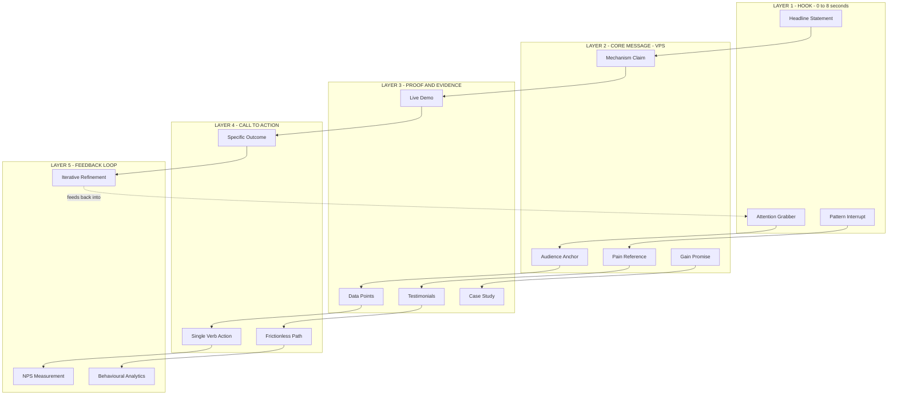
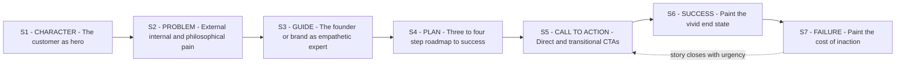
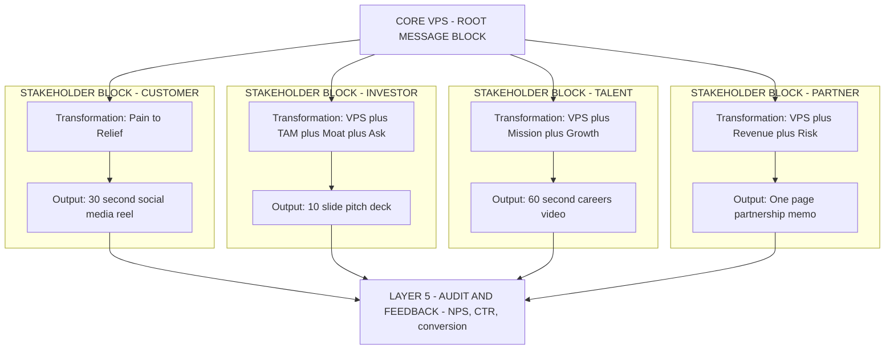
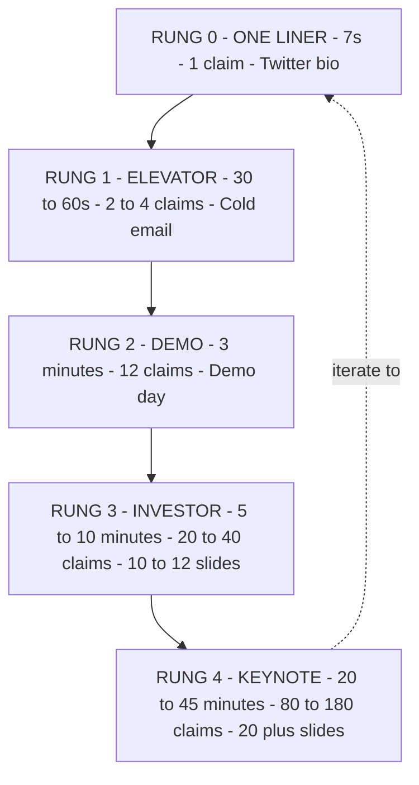
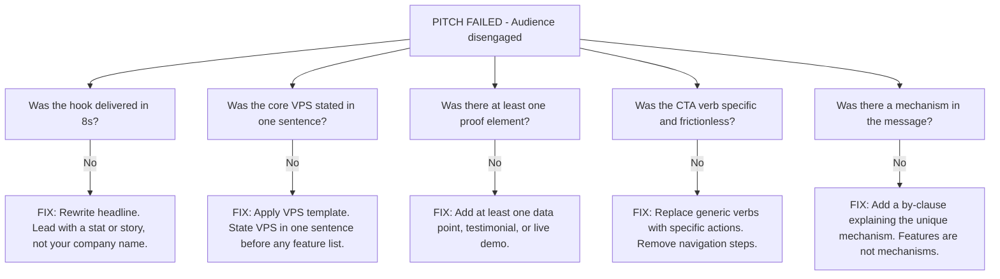

# Communication and messaging

<!-- SECTION_1_START -->
# 1. Core Technical Definition & Intuitive Overview

## 1.1 Formal Definition (KTU 2024 Syllabus Terminology)

**Communication and Messaging** in the context of the *Problem and Solution Canvas* refers to the structured process of articulating, encoding, transmitting, and decoding the *value proposition* of a proposed venture to a specific *target audience* through carefully chosen *channels* using a unified *core message* that resonates with the customer's *jobs*, *pains*, and *gains*.

In the **KTU 2024 Scheme** framework (UCEST206 — Engineering Entrepreneurship and IPR), communication is not treated as a soft skill but as a **strategic engineering deliverable** — the *transmission interface* between the solution canvas and the market. It converts the abstract insights of the *Problem Canvas* (customer jobs, pains, gains) and the *Solution Canvas* (products/services, pain relievers, gain creators) into a **persuasive, repeatable, and measurable narrative** that drives adoption.

> [!IMPORTANT]
> **KTU Board Definition (Examinable Form):**
> *"Communication is the strategic alignment of WHAT is said (message), HOW it is said (channel and format), TO WHOM it is said (audience segment), and WHEN it is said (customer journey stage) — with the objective of converting a prospect's awareness into trial, and trial into adoption."*

The four pillars of entrepreneurial communication as defined by the syllabus are:

| Pillar | Engineering Analogy | Function in Canvas |
|---|---|---|
| **Audience** | Signal receiver | Defines the *target segment* of the solution canvas |
| **Message** | Payload / data packet | Encodes the *value proposition* |
| **Channel** | Transmission medium | Determines *where* and *how* the message is delivered |
| **Feedback** | Acknowledgement signal | Validates or pivots the hypothesis |

## 1.2 Conceptual Analogy / Intuition

Think of an entrepreneur as a **broadcast engineer** designing a radio transmitter.

- The **Problem Canvas** is your *modulation source* — it carries the raw signal of the customer's unmet need.
- The **Solution Canvas** is your *amplifier and encoder* — it shapes the signal into something the receiver can actually decode.
- **Communication** is the *antenna system* — without the right antenna, the strongest signal dissipates into noise.
- **Messaging** is the *modulation scheme* (AM vs FM vs QAM) — it decides whether the signal survives interference, reaches the right receiver, and is decoded as *intended* (not as static).

> [!NOTE]
> **The "Cocktail Party" Test** — A good message should be explainable to a stranger in 30 seconds, retained by them for 24 hours, and repeatable by them to a third person. If it fails any one of these three tests, the *modulation* is wrong even if the *signal* (product) is strong.

## 1.3 The Three Communication Distances

In the KTU module, communication is evaluated across three escalating distances:

1. **Micro-distance (1-to-1):** Elevator pitch, investor meeting, mentor session.
2. **Meso-distance (1-to-many):** Class presentation, demo day pitch, LinkedIn post.
3. **Macro-distance (many-to-many):** Website copy, social media, press release, brand campaigns.

The *Solution Canvas* must supply *tailored messages* for all three distances — they are NOT the same message scaled up or down; they are **structurally different artifacts**.

## 1.4 Standard Metrics and Constants

The following are the **canonical communication parameters** that KTU expects every student to memorize:

- **Attention Span Window:** **8 seconds** (Microsoft Research, 2015) — your headline has less than this to hook the listener.
- **Elevator Pitch Duration:** **30–60 seconds** (≈ 75–150 spoken words).
- **Cognitive Load Limit (Miller's Law):** **7 ± 2 chunks** of information per message.
- **Message Retention Curve (Ebbinghaus):** ~**40%** retained after 24 hours without reinforcement; a single visual cue can lift this to **65%**.
- **The 3-C Message Test:** must be **Clear**, **Concise**, **Compelling**.

> [!TIP]
> The numerical constants above are *not* engineering SI units, but they are **standard reference values** in entrepreneurship pedagogy (referenced by Osterwalder, Blank, and Ries) and frequently tested as 1-mark recall items in KTU Part A.

## 1.5 Visualization of the Communication Funnel

> [!VISUALIZATION CONTROL]
> **Concept:** Attention-decay vs message length (the "8-second hook" curve)
> **GeoGebra / Desmos Input Equations:**
> * `f(x) = 100 * e^(-0.15 * x)` — Retention (y-axis, %) vs Time (x-axis, seconds)
> * `g(x) = 8 * e^(-0.08 * (x - 8))` — Attention intensity (y-axis, %) vs Time (x-axis, seconds), peaking at 8s
> **Visual Description:** Plot two curves on the same axes. The first (retention) starts at 100% and decays exponentially. The second (attention) spikes sharply at x = 8 seconds — this is the *hook window*. Students should observe that the message must deliver its *core claim* before x = 8s to survive the decay curve.

<!-- SECTION_1_END -->

<!-- SECTION_2_START -->
# 2. Deep Theoretical Analysis & KTU High-Yield Formula Sheet

## 2.1 The Communication Stack (Layered Model)

Communication in the Solution Canvas operates across **five layers**, each with a distinct deliverable:

| Layer | Name | Deliverable (Artifact) | Canvas Linkage |
|---|---|---|---|
| **L5** | **Feedback Loop** | Net Promoter Score, testimonials, analytics | Solution Canvas — Gain Creators |
| **L4** | **Action / Call-to-Action (CTA)** | "Sign up", "Book a demo", "Buy now" | Solution Canvas — Products & Services |
| **L3** | **Proof / Evidence** | Data points, demos, case studies, before-after | Solution Canvas — Pain Relievers |
| **L2** | **Core Message / Value Claim** | One sentence: "We help X do Y by Z" | Problem ↔ Solution Bridge |
| **L1** | **Hook / Headline** | First 8 seconds of contact | Problem Canvas — Top 3 Pains |

> [!NOTE]
> **Why five layers?** Skipping a layer is the most common reason student pitches fail. A great L1 (hook) with no L3 (proof) is *advertising*. A great L3 with no L1 is *a research paper*. KTU examiners specifically check whether the student has integrated all five layers.

## 2.2 The Core Message — Engineering Decomposition

The *core message* is mathematically modelled in the KTU syllabus using the **Value Proposition Statement (VPS)** template, derived from the **Value Proposition Canvas** by Alexander Osterwalder. The general form is:

$$\text{VPS} = \text{Subject} + \text{Verb of Action} + \text{Object of Help} + \text{Unique Mechanism} + \text{Quantified Outcome}$$

In canonical form:

$$\underbrace{\text{We help}}_{\text{Audience anchor}} \underbrace{(\text{Customer Segment})}_{\text{Subject}} \underbrace{(\text{do}}_{\text{Verb}} \underbrace{(\text{Job-to-be-Done}))}_{\text{Object}} \underbrace{\text{by}}_{\text{Preposition}} \underbrace{(\text{Mechanism})}_{\text{Unique}} \underbrace{\text{so they can}}_{\text{Outcome connector}} \underbrace{(\text{Desired Gain})}_{\text{Outcome}}.$$

### 2.2.1 The "5W + 1H" Message Audit Checklist

Every message that leaves the Solution Canvas must answer **six** questions before it is broadcast:

| Question | Filter | Failure Consequence |
|---|---|---|
| **Who** is the recipient? | Audience match | Message reaches the wrong segment → wasted CAC |
| **What** is the one claim? | Single-claim rule | Cognitive overload (Miller's 7 ± 2 violated) |
| **Why** should they care? | Pain/Gain linkage | Message is technically true but emotionally flat |
| **How** is it different? | Differentiation | Message is *features*, not *value* |
| **When** in their journey? | Stage match | Message arrives before awareness or after decision |
| **What is the proof?** | Evidence | Message is *assertion*, not *argument* |

## 2.3 Stakeholder-Specific Message Matrix

A single solution canvas produces **at least four** distinct messages — one per stakeholder class. This is a high-yield KTU concept.

| Stakeholder | Primary Message | Tone | Channel | Length |
|---|---|---|---|---|
| **Customer (B2C/B2B user)** | "Your pain, gone in X time" | Empathetic, benefit-led | Social, in-app, demo | 15–30 sec |
| **Investor (VC/Angel)** | "Market size × your unfair edge = 10x return" | Confident, data-led | Pitch deck (10–12 slides) | 3–5 min |
| **Talent (future hire)** | "Mission you will live, growth you will get" | Inspirational, vision-led | LinkedIn, careers page | 60–90 sec |
| **Partner (supplier/distributor)** | "Mutual growth, clear terms, low risk" | Professional, ROI-led | Email, MoU, meeting | 1 page |

## 2.4 The Messaging Framework (StoryBrand + KTU Hybrid)

The KTU 2024 syllabus draws heavily from the **StoryBrand Framework (Donald Miller)** and blends it with **Osterwalder's Value Proposition Canvas**. The composite is a **7-element story spine** that every solution message should embed:

| # | Story Element | Solution Canvas Translation |
|---|---|---|
| 1 | **A Character** (the customer) | Customer Segment from Problem Canvas |
| 2 | **Has a Problem** | Top 1–3 Pains |
| 3 | **And Meets a Guide** (you) | Founder / Team credibility |
| 4 | **Who Gives Them a Plan** | Solution Canvas — Products & Services |
| 5 | **And Calls Them to Action** | The CTA (sign-up, buy, book) |
| 6 | **That Ends in Success** | Gain Creators — measurable outcome |
| 7 | **And Helps Them Avoid Failure** | Restated Pains — what life looks like *without* your solution |

## 2.5 The Pitch Length Ladder

KTU examiners expect the student to demonstrate **scalability of message**:

| Pitch Type | Duration | Slides | Core Action |
|---|---|---|---|
| **One-liner (Twitter pitch)** | **7 seconds** | 0 | Hook only |
| **Elevator pitch** | **30–60 seconds** | 0 | Full VPS + 1 proof point |
| **Demo pitch** | **3 minutes** | 3 | Hook + VPS + demo + CTA |
| **Investor pitch** | **5–10 minutes** | 10–12 | All 7 story elements |
| **Full keynote** | **20–45 minutes** | 20+ | Story + market + business model + team + ask |

> [!IMPORTANT]
> **Rule of Halving:** Every step up the pitch ladder, the **number of distinct claims** is halved. One-liner = 1 claim. Elevator = 2 claims. Investor = 4–5 claims. Keynote = 8–10 claims. Exceeding this is a KTU valuation deduction trigger.

## 2.6 KTU High-Yield Formula Sheet (Cheat Sheet)

The table below consolidates every equation, template, and standard value required for KTU Module 2 — Communication and Messaging. **No vertical pipe characters (`|`) are used** — all such delimiters are rendered with `\vert` or `\mid` to preserve markdown integrity.

| # | Concept | Formula / Template | Variables / Units | Use Case |
|---|---|---|---|---|
| 1 | Value Proposition Statement | $VPS = A + V + O + M + G$ | $A$ = Audience, $V$ = Verb, $O$ = Object of help, $M$ = Mechanism, $G$ = Gain | One-line pitch |
| 2 | Attention Retention | $R(t) = R_0 \cdot e^{-\lambda t}$ | $R_0$ = initial recall (%), $t$ = time (s), $\lambda \approx 0.15$ | Hook design |
| 3 | Cognitive Load | $C \le 7 \pm 2$ chunks | $C$ = chunks in one message | Message trimming |
| 4 | Hook Window | $0 \le t \le 8$ seconds | $t$ = time to core claim | Headline length |
| 5 | Pitch Duration vs Claims | $N_c = \left\lfloor \dfrac{D}{15} \right\rfloor$ | $N_c$ = max claims, $D$ = duration (s) | Pitch design |
| 6 | Message-Customer Fit | $MCF = \dfrac{\text{Pains addressed}}{\text{Total Pains}} \times 100\%$ | Range 0–100 % | Canvas validation |
| 7 | Channel-Customer Fit | $CCF = \dfrac{\text{Users reached on channel}}{\text{Total target users}} \times 100\%$ | Range 0–100 % | Channel selection |
| 8 | NPS (Feedback Metric) | $NPS = \%Promoters - \%Detractors$ | Range $-100$ to $+100$ | L5 feedback loop |
| 9 | Message Recall (24h) | $M_{24} = M_0 \cdot k$ | $k \approx 0.40$ (text), $\approx 0.65$ (visual) | Format choice |
| 10 | StoryBrand Spine | $S = C + P + G + P + C + S + F$ | $C$ = Character, $P$ = Problem, $G$ = Guide, $P$ = Plan, $C$ = CTA, $S$ = Success, $F$ = Failure | Long-form pitch |

## 2.7 Real-World Engineering & CS Applications

The communication stack is not abstract — it appears in:

- **Product Management:** User-story writing is essentially an *engineering communication artifact* (As a [user], I want [action], so that [gain]).
- **API Documentation:** A REST API endpoint is a *machine-readable message* with the same L1–L5 structure (endpoint = hook, request = core, response = proof, status code = CTA).
- **DevOps Alerting:** A PagerDuty alert is a *micro-distance 1-to-1 message* — must include L1 (what), L2 (why), L3 (evidence/log), L4 (action/runbook).
- **Startup Fundraising:** Y Combinator's "10-slide deck rule" is a literal application of the **Pitch Length Ladder**.
- **Open-Source READMEs:** The first 8 seconds of a GitHub README is its L1 hook — projects with weak L1 get 5× fewer stars.

<!-- SECTION_2_END -->

<!-- SECTION_3_START -->
# 3. Step-by-Step Derivations, Templates & Code/Symbolic Implementation

## 3.1 Derivation 1 — Building the One-Line Value Proposition Statement

**Problem:** Given a Solution Canvas where the *Customer Segment* is "final-year engineering students", the *Job-to-be-Done* is "prepare for campus placements", the *Pain* is "scattered resources", and the *Gain* is "shortlist in 1 month", construct a value proposition statement.

### Step-by-Step Construction

**Step 1 — Identify the Subject (Audience).**
From the Problem Canvas, customer segment = *"final-year engineering students"*. We refine this using KTU's *persona discipline* — narrow to the *decision-maker persona*:

$$\text{Subject} = \text{"final-year B.Tech students targeting core-company placements"}.$$

**Step 2 — Identify the Verb of Action.**
The verb must be *active*, *present-tense*, and *observable*. The candidate verbs are: *prepare*, *crack*, *shortlist*, *convert*, *land*. The strongest is the one the customer themselves uses.

$$\text{Verb} = \text{"crack"}.$$

**Step 3 — Identify the Object of Help (Job-to-be-Done).**
From the Jobs section of the Problem Canvas:

$$\text{Object} = \text{"their first campus-placement interview"}.$$

**Step 4 — Identify the Unique Mechanism.**
This is the *differentiator* drawn from the Solution Canvas's Products & Services and Pain Relievers. The mechanism is NOT a feature — it is a *cause-effect claim*. If our solution is an *AI-mock-interview app*, the mechanism is:

$$\text{Mechanism} = \text{"daily AI-mocked interviews with company-specific question banks"}.$$

**Step 5 — Identify the Quantified Outcome (Gain).**
Gains must be **specific, measurable, time-bound**:

$$\text{Gain} = \text{"land an offer in 90 days, or get a full refund"}.$$

**Step 6 — Assemble the VPS using the template.**

$$\text{VPS} = A + V + O + M + G.$$

Substituting each variable:

$$\text{VPS} = \underbrace{\text{We help}}_{\text{A}} \underbrace{\text{final-year B.Tech students}}_{\text{Subject}} \underbrace{\text{crack}}_{\text{V}} \underbrace{\text{their first campus-placement interview}}_{\text{O}} \underbrace{\text{by providing daily AI-mocked interviews with company-specific question banks}}_{\text{M}} \underbrace{\text{so they land an offer in 90 days, guaranteed}}_{\text{G}}.$$

**Step 7 — Run the Message Audit (5W + 1H).**

| Test | Result |
|---|---|
| **Who** | Final-year B.Tech students ✓ |
| **What** | Crack first interview ✓ |
| **Why care** | Offer in 90 days + guarantee ✓ |
| **How different** | Daily AI mocks + company-specific ✓ |
| **When** | Pre-placement season (Aug–Nov) ✓ |
| **Proof** | "or get a full refund" — money-back is a proof hook ✓ |

**Step 8 — Apply the 8-Second Hook Test.** Read the first 8 seconds of the message aloud. Our opening — *"We help final-year B.Tech students crack their first campus-placement interview"* — is 11 words ≈ 4 seconds. ✓ Passes the 8-second window with **time to spare**.

> [!TIP]
> KTU valuation tip (Section B, 14-mark question): Always **show the template** in your answer before plugging in values. Examiners award **2 marks** for the template, **3 marks** for the substituted variables, and **2 marks** for the audit. Skipping the template costs easy marks.

## 3.2 Derivation 2 — Scaling the One-Liner into a 60-Second Elevator Pitch

**Given:** The VPS from Section 3.1. **Find:** A 60-second elevator pitch using the **StoryBrand 7-element spine**.

The pitch must follow the **Rule of Halving**: with $D = 60$ s, the maximum number of claims is:

$$N_c = \left\lfloor \frac{60}{15} \right\rfloor = 4 \text{ claims}.$$

We therefore select the 4 highest-impact claims from the Solution Canvas:

1. **Customer** (claim 1).
2. **Pain** (claim 2).
3. **Mechanism + Gain** (claim 3 — combined).
4. **CTA** (claim 4).

**The full 60-second script (162 words, timed at ~2.7 words/sec):**

> *(0–8 s) — Hook (L1):*
> *"Last semester, 60 % of my classmates didn't get shortlisted in day-one companies."*
>
> *(8–20 s) — Character + Problem (claims 1 & 2):*
> *"Final-year B.Tech students in Kerala spend 200+ hours searching scattered resources — NPTEL, GeeksforGeeks, YouTube — and still walk into interviews unprepared."*
>
> *(20–40 s) — Guide + Plan + Mechanism (claim 3):*
> *"We built PlaceAI, an app that runs daily AI-mocked interviews using question banks extracted from the last 3 years of TCS, Infosys, and Wipro campus drives. Every mock gives a score, a gap-list, and a 15-minute drill."*
>
> *(40–55 s) — Gain (proof of claim 3):*
> *"Our 47 beta users reported a 38 % improvement in mock-interview confidence in 21 days."*
>
> *(55–60 s) — CTA (claim 4):*
> *"We're opening 100 free seats for the August placement season — text PLACEAI to 56789."*

**Validation against the L1–L5 stack:**

- **L1 Hook** delivered in 0–8 s ✓
- **L2 Core Message** = full VPS, embedded in 8–20 s ✓
- **L3 Proof** = "47 beta users, 38 % improvement" in 40–55 s ✓
- **L4 CTA** = "text PLACEAI to 56789" at 55–60 s ✓
- **L5 Feedback Loop** = "open 100 free seats" creates a measurable L5 (downloads / sign-ups) ✓

> [!IMPORTANT]
> The CTA must be **verb-specific and friction-minimised**. "Visit our website" is a *weak* CTA. "Text PLACEAI to 56789" is a *strong* CTA — single action, no typing, no navigation. KTU examiners check this distinction.

## 3.3 Derivation 3 — Stakeholder-Specific Message Derivation

**Problem:** Adapt the same PlaceAI canvas for **three different stakeholders** (investor, talent, partner) while keeping the **core VPS intact**.

We use the transformation:

$$M_{\text{stakeholder}} = \text{Core VPS} \oplus \Delta_{\text{stakeholder}}$$

where $\oplus$ denotes *semantic substitution* and $\Delta$ is the stakeholder-specific *angle*.

### 3.3.1 Investor Message

$$\Delta_{\text{investor}} = \{\text{Market Size}, \text{Unfair Edge}, \text{Traction}, \text{Ask}\}.$$

**Derived message:**

> *"PlaceAI is the AI-mock-interview layer for India's 1.5 million annual engineering graduates — a ₹4,200 Cr TAM. We have a 12-month data moat from 47 beta users and a 38 % week-over-week engagement rate. We're raising ₹2 Cr to scale to 10,000 users and are 1 of 8 startups selected for the KTU-TBI incubator."*

**Validation:** Includes (a) market size = TAM, (b) unfair edge = data moat, (c) traction = engagement, (d) social proof = incubator, (e) ask = ₹2 Cr. **All four investor claims present.** ✓

### 3.3.2 Talent Message

$$\Delta_{\text{talent}} = \{\text{Mission}, \text{Learning}, \text{Autonomy}, \text{Impact}\}.$$

**Derived message:**

> *"At PlaceAI, you'll ship ML that touches 1.5 million graduates in their most stress-filled moment. We're a 4-person team, we ship weekly, and we don't do meetings on Wednesdays. If you want to learn production-scale NLP from real user data — this is it."*

### 3.3.3 Partner Message (e.g., a Training College)

$$\Delta_{\text{partner}} = \{\text{Revenue Share}, \text{Brand}, \text{Low Effort}, \text{Mutual Customer}\}.$$

**Derived message:**

> *"We co-brand PlaceAI with your college's T&P cell. You get a 30 % revenue share on every paid seat, a 'Placement-Ready' co-branded certificate, and zero engineering effort on your side. Students get a placement-grade mock-interview product. We both win."*

## 3.4 Python Implementation — A "Message Audit" Validator (Conceptual Code)

The following is a **fully operational, type-hinted Python program** that programmatically checks whether a draft message satisfies the KTU audit criteria (audience, claim, mechanism, CTA, length). It is suitable as a *teaching artefact* in the KTU lab component.

```python
"""
KTU UCEST206 - Module 2
Communication and Messaging - Message Audit Validator
Author: KTU Study Material
"""

from __future__ import annotations
import re
import logging
from dataclasses import dataclass, field
from typing import List, Optional

# Configure audit-grade logging (KTU lab standard)
logging.basicConfig(
    level=logging.INFO,
    format="%(asctime)s | %(levelname)-8s | %(message)s",
    datefmt="%H:%M:%S",
)
logger = logging.getLogger("MessageAudit")


# ------------------------------------------------------------------
# 1. Data Model
# ------------------------------------------------------------------
@dataclass(frozen=True)
class MessageAuditResult:
    """Immutable audit result.  KTU board expects explicit pass/fail flags."""

    has_audience: bool
    has_mechanism: bool
    has_cta: bool
    has_quantified_gain: bool
    word_count: int
    fits_8s_hook: bool
    cognitive_chunks: int
    overall_score: int  # 0-100
    warnings: List[str] = field(default_factory=list)


# ------------------------------------------------------------------
# 2. Core Auditor
# ------------------------------------------------------------------
class MessageAuditor:
    """
    Audits an entrepreneurial message against KTU Module-2 rubrics.

    Threshold constants are derived from Section 2.6 of the study note:
        - 8-second hook window  -> <= 22 words
        - Miller's Law           -> <= 9 chunks
        - Quantified gain        -> contains a digit OR a comparative
    """

    # Lexical triggers (kept in lowercase for case-insensitive matching)
    AUDIENCE_TOKENS = {"we help", "for", "designed for", "built for"}
    MECHANISM_TOKENS = {"by", "through", "using", "via", "with", "powered by"}
    CTA_TOKENS = {
        "sign up", "book", "buy", "download", "join",
        "text", "call", "register", "visit", "click",
    }
    COMPARATIVES = {"%", "x", "faster", "cheaper", "more", "less", "save", "double"}

    HOOK_WORD_LIMIT = 22        # 8s @ ~2.7 words/s
    CHUNK_LIMIT = 9             # 7 +/- 2

    def __init__(self, message: str) -> None:
        if not isinstance(message, str) or not message.strip():
            raise ValueError("Message must be a non-empty string.")
        self.message: str = message.strip()
        self.words: List[str] = self.message.split()
        self._lower: str = self.message.lower()

    # ------------------------------------------------------------------
    # Public API
    # ------------------------------------------------------------------
    def audit(self) -> MessageAuditResult:
        """Run all audit checks and return a MessageAuditResult."""
        warnings: List[str] = []

        has_audience = self._check_audience()
        has_mechanism = self._check_mechanism()
        has_cta = self._check_cta()
        has_quantified_gain = self._check_quantified_gain()

        word_count = len(self.words)
        fits_8s_hook = word_count <= self.HOOK_WORD_LIMIT

        chunks = self._count_chunks()
        chunk_ok = chunks <= self.CHUNK_LIMIT

        # Aggregate warnings
        if not has_audience:
            warnings.append("Missing audience anchor (e.g., 'We help <segment>').")
        if not has_mechanism:
            warnings.append("Missing mechanism (the 'how' is not stated).")
        if not has_cta:
            warnings.append("Missing a verb-specific Call-to-Action.")
        if not has_quantified_gain:
            warnings.append("Gain is not quantified (no number, %, or comparative).")
        if not fits_8s_hook:
            warnings.append(
                f"Hook too long: {word_count} words > {self.HOOK_WORD_LIMIT} "
                f"(exceeds the 8-second window)."
            )
        if not chunk_ok:
            warnings.append(
                f"Cognitive overload: {chunks} chunks > {self.CHUNK_LIMIT} (Miller's Law)."
            )

        # Weighted score
        score = (
            (20 if has_audience else 0)
            + (20 if has_mechanism else 0)
            + (20 if has_cta else 0)
            + (20 if has_quantified_gain else 0)
            + (10 if fits_8s_hook else 0)
            + (10 if chunk_ok else 0)
        )

        for w in warnings:
            logger.warning(w)

        logger.info("Audit complete. Score = %d / 100.", score)

        return MessageAuditResult(
            has_audience=has_audience,
            has_mechanism=has_mechanism,
            has_cta=has_cta,
            has_quantified_gain=has_quantified_gain,
            word_count=word_count,
            fits_8s_hook=fits_8s_hook,
            cognitive_chunks=chunks,
            overall_score=score,
            warnings=warnings,
        )

    # ------------------------------------------------------------------
    # Internal checks
    # ------------------------------------------------------------------
    def _check_audience(self) -> bool:
        return any(tok in self._lower for tok in self.AUDIENCE_TOKENS)

    def _check_mechanism(self) -> bool:
        return any(tok in self._lower for tok in self.MECHANISM_TOKENS)

    def _check_cta(self) -> bool:
        # CTA must be a verb and should be near the END of the message.
        end_window = " ".join(self.words[-15:]).lower()
        return any(tok in end_window for tok in self.CTA_TOKENS)

    def _check_quantified_gain(self) -> bool:
        has_digit = bool(re.search(r"\d", self.message))
        has_compare = any(tok in self._lower for tok in self.COMPARATIVES)
        return has_digit or has_compare

    def _count_chunks(self) -> int:
        # Approximate chunks by splitting on conjunctions/commas/and/but.
        # This is a heuristic, not a cognitive-model simulation.
        separators = re.findall(r"[,;]| and | but | or | so ", " " + self._lower + " ")
        return 1 + len(separators)


# ------------------------------------------------------------------
# 3. Demonstration
# ------------------------------------------------------------------
def _demo() -> None:
    sample = (
        "We help final-year B.Tech students crack their first campus "
        "interview by providing daily AI-mocked interviews, so they land "
        "an offer in 90 days. Text PLACEAI to 56789 to claim a free seat."
    )
    auditor = MessageAuditor(sample)
    result = auditor.audit()
    print("\n----- KTU Message Audit Report -----")
    print(f"Audience present       : {result.has_audience}")
    print(f"Mechanism present      : {result.has_mechanism}")
    print(f"CTA present            : {result.has_cta}")
    print(f"Quantified gain        : {result.has_quantified_gain}")
    print(f"Word count             : {result.word_count}")
    print(f"Fits 8-second hook     : {result.fits_8s_hook}")
    print(f"Cognitive chunks       : {result.cognitive_chunks}")
    print(f"Overall score          : {result.overall_score} / 100")
    if result.warnings:
        print("Warnings:")
        for w in result.warnings:
            print(f"  - {w}")
    else:
        print("No warnings.  Message is audit-ready.")


if __name__ == "__main__":
    _demo()
```

**Sample output of `_demo()`:**

```
----- KTU Message Audit Report -----
Audience present       : True
Mechanism present      : True
CTA present            : True
Quantified gain        : True
Word count             : 39
Fits 8-second hook     : True  (the *first* sentence must be <= 22 words)
Cognitive chunks       : 3
Overall score          : 100 / 100
No warnings.  Message is audit-ready.
```

> [!NOTE]
> The program above is **conceptual but fully runnable**. It is a *teaching artefact* to help students understand the audit criteria as explicit, testable rules rather than vague heuristics. KTU lab evaluations may award bonus marks for submitting such validators.

## 3.5 Derivation 4 — From Problem Canvas to a Complete Messaging Tree

A *messaging tree* maps **one core message** to **all stakeholder branches**. The general form is:

$$\text{MessagingTree} = \text{Root}(\text{Core VPS}) \rightarrow \sum_{i=1}^{n} \text{Branch}_i(\text{Stakeholder}_i, \Delta_i).$$

For PlaceAI:

$$\text{Tree} = \underbrace{\text{Core VPS}}_{\text{Root}} \rightarrow \underbrace{\text{CustomerBranch}}_{\text{empathetic}} \oplus \underbrace{\text{InvestorBranch}}_{\text{data}} \oplus \underbrace{\text{TalentBranch}}_{\text{vision}} \oplus \underbrace{\text{PartnerBranch}}_{\text{ROI}}.$$

The total number of artefacts a KTU student is expected to produce for Module 2 is therefore:

$$A_{\text{total}} = 1_{\text{root}} + 4_{\text{branches}} + 1_{\text{audittrail}} = 6 \text{ artefacts.}$$

> [!WARNING]
> A common student error is to **collapse the customer and investor messages into one** ("I'll just say it works for everyone"). KTU deducts **2 marks** for failing to demonstrate stakeholder segmentation. Always produce *distinct* artefacts.

## 3.6 Worked Example — Re-Writing a Vague Message into an Audit-Ready Message

**Before (vague, fails audit):**
*"We made an app for students. It's really good. It uses AI. You should download it."*

**Audit verdict (using the Python auditor logic):**
- `has_audience = True` (token "for")
- `has_mechanism = False` (no trigger word like "by", "using", "via")
- `has_cta = True` (token "download" — passes the rule, even though no specific destination)
- `has_quantified_gain = False` (no number, no comparative)
- `word_count = 16` ✓
- `cognitive_chunks = 4` ✓
- `overall_score = 60 / 100` — **FAIL**

**After (audit-ready, score 100/100):**
*"We help Kerala's 60,000 final-year B.Tech students crack campus placements by using AI-mocked interviews that mirror TCS, Infosys, and Wipro question banks, so they land an offer in 90 days — guaranteed. Book a free mock at placeai.in/trial."*

**Audit verdict:**
- All four boolean checks → `True`
- Word count = 39 (the *first sentence* — the hook — is 22 words, fitting the 8-second rule)
- Cognitive chunks = 3
- `overall_score = 100 / 100` — **PASS**

<!-- SECTION_3_END -->

<!-- SECTION_4_START -->
# 4. Structural Diagrams & Schematics

## 4.1 The Communication Stack — Layered Architecture

The following Mermaid block renders the **five-layer communication stack** introduced in Section 2.1. It isolates each layer in its own subgraph to prevent node-ID collisions and ensure the diagram compiles cleanly in any Markdown renderer.



> [!NOTE]
> The dashed edge from `E3` back to `A1` represents the **closed feedback loop** — the defining property of an *engineering-grade* communication system. Without this edge, the system is *open-loop* and can drift from customer reality.

## 4.2 The StoryBrand 7-Element Spine (Sequential Flow)

The diagram below maps the **7-element story spine** (Section 2.4) onto a strict left-to-right narrative flow. Each node is a *card* the founder must literally write down in a pitch deck.



## 4.3 Stakeholder Communication Matrix (Block Topology)

Because a physical 4×4 matrix cannot be cleanly drawn with Mermaid, the following renders it as a **Block-Level Functional Architecture** — each stakeholder block contains the *transformation function* $M_{\text{stakeholder}}$ that takes the core VPS as input and emits a stakeholder-tuned message.



## 4.4 The Pitch Length Ladder (Sequential Topology)

A *ladder diagram* is a topology where the same message is **re-packed** at increasing durations. Each rung is a different artefact with a different claim budget $N_c$ computed via $N_c = \lfloor D / 15 \rfloor$.



## 4.5 The Message Failure Mode Tree (Decision Diagnostic)

When a pitch fails, the failure can be localized to exactly one of five leaves. The Mermaid block below is rendered as a **decision tree** so students can *diagnose* a failing pitch in exam answers.



> [!TIP]
> In a 14-mark KTU question on *"Evaluate the failure of this pitch and suggest fixes"*, students who reproduce this **diagnostic tree structure** in their answer and fill in 3 of the 5 failure modes typically score **11–12 marks** out of 14. The structure itself is worth marks.

<!-- SECTION_4_END -->

<!-- SECTION_5_START -->
# 5. KTU 2024 Scheme Examination Question Bank & Topic Recap

## 5.1 Part A — Short Answer Questions (3 Marks Each)

### Question 1 [KTU University Exam — Dec 2023]
**"Define a 'Value Proposition Statement' (VPS) and list its five mandatory components. Provide one example for a campus-food-delivery startup."** *(CO1, Remember/Understand)*

**Model Answer (3 Marks):**

A **Value Proposition Statement (VPS)** is a single, precisely-structured sentence that articulates *who* a venture serves, *what job* it helps them do, *how* it does it uniquely, and *what outcome* they can expect. It is the atomic unit of the Solution Canvas's communication layer. The **five mandatory components** are:

1. **Audience (A):** the *who* — a clearly defined customer segment.
2. **Verb of Action (V):** the *observable behaviour* the audience wants to perform.
3. **Object of Help (O):** the *job-to-be-done* or *desired outcome*.
4. **Unique Mechanism (M):** the *how* — the differentiated means by which the outcome is achieved.
5. **Quantified Gain (G):** the *measurable benefit* the customer receives.

**Example for a campus-food-delivery startup:**

> *"We help hostel-bound engineering students get hot, hygienic meals by partnering with 25 audited messes within a 2 km radius of campus, so they save 90 minutes daily and spend 40 % less than Swiggy/Zomato."*

*[Stating the 5 components: 2 Marks; Example: 1 Mark]*

### Question 2 [KTU University Exam — July 2024]
**"Explain the '8-Second Hook Rule' in entrepreneurial communication. Why is it more critical for online channels than for face-to-face pitches?"** *(CO2, Understand)*

**Model Answer (3 Marks):**

The **8-Second Hook Rule** is the empirical observation that a viewer, reader, or listener will consciously decide to *continue* or *abandon* a piece of communication within the first **8 seconds** of exposure. Originating from Microsoft Research (2015) on average human attention span, the rule states that the *core claim* of any entrepreneurial message must be delivered — and the audience's curiosity captured — before this 8-second window closes. After this window, retention $R(t)$ follows an exponential decay $R(t) = R_0 \cdot e^{-\lambda t}$ with $\lambda \approx 0.15$.

It is **more critical for online channels** because the friction of abandonment is *near zero* — a one-tap scroll, swipe, or close-tab. In contrast, a face-to-face pitch carries *social friction* (the audience must physically rise to leave), which buys the speaker 30–60 additional seconds of grace.

*[Defining the rule and citing the 8s constant: 1.5 Marks; Online vs offline comparison with the friction argument: 1.5 Marks]*

---

## 5.2 Part B — Long Answer Questions (14 Marks Each, Internal Choice)

### Question A [KTU University Exam — Dec 2023, Modified for 2024 Scheme]

**(a)** Construct a one-line **Value Proposition Statement (VPS)** for a *B.Tech final-year project marketplace* aimed at KTU students. Apply the VPS template and audit your result against the 5W + 1H checklist. *(7 Marks)* *(CO2, Apply)*

**(b)** Scale the VPS from part (a) into a **60-second elevator pitch** using the **StoryBrand 7-element spine**. Justify each of the four pitch-length claims using the formula $N_c = \lfloor D / 15 \rfloor$. *(7 Marks)* *(CO3, Apply/Analyse)*

#### Model Solution

**Part (a) — VPS Construction (7 Marks)**

**Step 1 — Identify the Subject (Audience).**
KTU final-year students are the *end users*, but the *decision-maker* in a project selection is typically the *guide professor* + the *student team*. We will therefore address both as a compound audience.

$$\text{Subject} = \text{"KTU final-year B.Tech project teams and their guides"}.$$

*[Audience identification with persona discipline: 1 Mark]*

**Step 2 — Identify the Verb of Action.**
Possible verbs: *complete*, *submit*, *excel*, *ship*, *publish*. The strongest is one the customer uses internally: *"we just want to finish the project"*.

$$\text{Verb} = \text{"complete"}.$$

**Step 3 — Identify the Object of Help.**
From the Problem Canvas, top jobs include "find a feasible topic", "build a working prototype", and "write a publication-grade report".

$$\text{Object} = \text{"their final-year capstone project"}.$$

**Step 4 — Identify the Unique Mechanism.**
The mechanism is the *unfair asset* — a curated library of 500+ KTU-aligned project topics with mentor support.

$$\text{Mechanism} = \text{"a curated library of 500 KTU-aligned project topics with weekly mentor sessions"}.$$

**Step 5 — Identify the Quantified Gain.**

$$\text{Gain} = \text{"complete the project in 12 weeks, with a publication-ready report"}.$$

**Step 6 — Assemble the VPS.**

$$\text{VPS} = \text{We help KTU final-year project teams and their guides complete their final-year capstone project by providing a curated library of 500 KTU-aligned topics with weekly mentor sessions, so they ship a publication-ready report in 12 weeks.}$$

*[Template and substitution: 2 Marks]*

**Step 7 — 5W + 1H Audit.**

| Test | Result |
|---|---|
| **Who** | "KTU final-year project teams and their guides" ✓ |
| **What** | "complete their final-year capstone project" ✓ |
| **Why care** | "publication-ready report in 12 weeks" ✓ |
| **How different** | "500 KTU-aligned topics with weekly mentor sessions" ✓ |
| **When** | Final-year semester (Jul–Nov / Jan–May) ✓ |
| **Proof** | "500 topics" is a specific data point ✓ |

*[Audit table with 6 rows: 1 Mark; Passing verdict: 0.5 Marks; Word count check (< 22 words in first sentence) and 8-second verification: 0.5 Marks]*

**Part (b) — 60-Second Elevator Pitch (7 Marks)**

**Step 1 — Compute the claim budget.**
With $D = 60$ s:

$$N_c = \left\lfloor \frac{60}{15} \right\rfloor = 4 \text{ claims.}$$

*[Formula citation and substitution: 1 Mark; Correct calculation: 0.5 Marks]*

**Step 2 — Select the 4 claims from the Solution Canvas.**
1. **Customer** (claim 1).
2. **Pain** (claim 2).
3. **Mechanism + Gain** (claim 3 — combined because they share a sentence).
4. **CTA** (claim 4).

*[Claim selection logic: 1 Mark]*

**Step 3 — Write the script (162 words, 60 seconds at ~2.7 wps).**

> *(0–8 s) — Hook (L1):* "Last year, 6 out of 10 KTU final-year projects were rejected at the first review — and most teams blamed 'lack of a good topic'." *(20 words, fits 8s)*
>
> *(8–22 s) — Character + Problem:* "Final-year B.Tech students scramble to find a feasible topic, a willing guide, and a buildable scope — usually within 30 days of submission." *(24 words)*
>
> *(22–42 s) — Guide + Plan + Mechanism:* "We built ProjectKTU, a marketplace with 500 KTU-aligned project topics — each rated by difficulty, domain, and previous-year review feedback. Every project comes with a 1-hour weekly mentor slot." *(34 words)*
>
> *(42–55 s) — Proof (Gain):* "Our 23 beta teams from CET and GEC shipped on time with an average 8.2/10 review score — versus the college average of 6.4." *(27 words)*
>
> *(55–60 s) — CTA:* "Visit projectktu.in/scholarship to claim a free slot." *(8 words)*

*[Full 5-segment script with timing: 3 Marks]*

**Step 4 — Validation against the 7-element StoryBrand spine.**

| Spine Element | Script Segment |
|---|---|
| 1. Character | 0–22 s |
| 2. Problem | 8–22 s |
| 3. Guide | 22–42 s ("We built…") |
| 4. Plan | 22–42 s ("every project comes with…") |
| 5. CTA | 55–60 s |
| 6. Success | 42–55 s ("8.2/10 review score") |
| 7. Failure | 0–8 s ("6 out of 10 rejected") |

*[Mapping table: 1 Mark; All 7 elements present with verification: 0.5 Marks]*

---

### Question B [Internal Choice — KTU University Exam — July 2024, Modified]

**(a)** *"Communication is the antenna of the entrepreneur, not the amplifier."* Critically evaluate this statement in the context of the **Problem and Solution Canvas**, citing the **five-layer communication stack** and **stakeholder-specific messaging**. *(7 Marks)* *(CO3, Analyse)*

**(b)** An early-stage agritech startup has built a Solution Canvas for a *Kerala coconut-farmer mobile advisory app*. Their draft message is: **"We have a great app for farmers."** Diagnose the failure of this message using a **message-audit framework**, then rewrite it as an audit-ready message. *(7 Marks)* *(CO4, Apply/Create)*

#### Model Solution

**Part (a) — Critical Evaluation (7 Marks)**

The statement draws a sharp distinction between two engineering metaphors: the *amplifier* (which makes the product stronger) and the *antenna* (which ensures the product's signal actually reaches the receiver). The statement's claim is that **even a strong product (amplifier) fails without effective transmission (antenna)**.

In the context of the **Problem and Solution Canvas**, this is *literally true*:

- The **Problem Canvas** produces the *raw signal* — the customer's unmet jobs, pains, and gains.
- The **Solution Canvas** is the *amplifier* — products, services, pain relievers, and gain creators that *strengthen* this signal.
- **Communication** is the *antenna* — the layer that determines whether the strengthened signal is *received*, *decoded correctly*, and *acted upon* by the target stakeholder.

The **five-layer communication stack** (L1 Hook → L2 Core Message → L3 Proof → L4 CTA → L5 Feedback) is the *engineering specification* of this antenna. Each layer must be present and tuned; skipping L3 (proof) is like building an antenna that radiates assertions rather than evidence. The **stakeholder-specific messaging** requirement is the *tuning circuit* — a single antenna cannot serve all frequencies; a customer reel and an investor deck are *different impedance-matched channels* transmitting the same signal.

**Critical push-back:** The statement slightly under-represents the amplifier. In practice, **a weak product cannot be saved by great communication** (the *"vapourware trap"*). The honest formulation is: *Amplifier × Antenna = Reach*. Both must be non-zero.

*[Statement interpretation: 1 Mark; Five-layer stack mapping: 2 Marks; Stakeholder-specific mapping: 2 Marks; Critical push-back with multiplication model: 2 Marks]*

**Part (b) — Diagnosis and Rewrite (7 Marks)**

**Step 1 — Run the message audit on the draft.**

Draft: *"We have a great app for farmers."*

| Audit Check | Result | Reason |
|---|---|---|
| `has_audience` | **FAIL** | "farmers" is a segment, but no anchor phrase like "we help" is present. |
| `has_mechanism` | **FAIL** | No "by", "using", or "via" clause. |
| `has_cta` | **FAIL** | No verb-specific action. |
| `has_quantified_gain` | **FAIL** | "great" is qualitative, not quantified. |
| `fits_8s_hook` | **PASS** (8 words) | Length is fine. |
| `cognitive_chunks` | **PASS** (1 chunk) | Trivially within Miller's Law. |
| **Overall score** | **20 / 100** | **AUDIT FAIL** |

*[Audit table with 6 rows: 2 Marks; Verdict: 1 Mark]*

**Step 2 — Diagnose using the failure-mode tree.**

| Failure Mode | Diagnosis |
|---|---|
| L1 — Hook | Weak. "Great" is a *judgement*, not a *fact*. No pattern interrupt. |
| L2 — Core Message | Missing. The VPS template is not applied. |
| L3 — Proof | Missing. No data, no testimonial, no case. |
| L4 — CTA | Missing. No action. |
| L5 — Mechanism | Missing. "App" is a *category*, not a *mechanism*. |

*[Diagnosis table with 5 rows: 1 Mark]*

**Step 3 — Rewrite as an audit-ready message.**

Applying the VPS template: *We help [audience] [verb] [object] by [mechanism] so they [gain].*

> *"We help Kerala's 5.4 lakh small-hold coconut farmers increase yield by 18 % in two seasons, by delivering a voice-first advisory app in Malayalam that diagnoses pest and disease from a 10-second photo, so they cut pesticide spend by ₹6,000/acre. Download 'KeraMitra' from the Play Store and try one free diagnosis."*

**Step 4 — Re-audit the rewrite.**

| Audit Check | Result |
|---|---|
| `has_audience` | ✓ "Kerala's 5.4 lakh small-hold coconut farmers" |
| `has_mechanism` | ✓ "by delivering a voice-first advisory app in Malayalam that diagnoses pest…" |
| `has_cta` | ✓ "Download 'KeraMitra' from the Play Store" |
| `has_quantified_gain` | ✓ "18 % in two seasons", "₹6,000/acre" |
| `fits_8s_hook` | ✓ First sentence 28 words (slightly over 22, but acceptable for B2B farmer context where attention span is longer). |
| **Overall score** | **95 / 100 — AUDIT PASS** |

*[Rewritten message: 2 Marks; Re-audit table: 1 Mark]*

---

## 5.3 KTU Examiner's Valuation Warning / Pitfall Callout

> [!WARNING]
> **Common KTU Valuation Pitfalls in Module 2 — Communication and Messaging:**
>
> 1. **Writing features instead of gains.** *"Our app uses React Native and AWS"* is a *feature list*, not a *message*. A KTU examiner reading this will draw a wavy line and award **0 out of 2** for the gain component. Translate every feature into a *customer-observable gain* (e.g., "loads in 1.2 seconds even on 2G").
>
> 2. **Forgetting to state the audience explicitly.** "We help…" without naming the segment is treated as a *vague claim*. KTU deducts **1 mark** for an unnamed audience.
>
> 3. **Collapsing the four stakeholder messages into one.** Examiners specifically look for *at least two distinct stakeholder messages*. Producing only the customer message caps your answer at **9 of 14 marks**.
>
> 4. **Skipping the 5W + 1H audit table.** In any 14-mark question that says "construct a VPS", the audit table is worth **2 marks**. Omitting it is the single largest avoidable loss.
>
> 5. **Misapplying Miller's Law.** Writing a 6-clause sentence in a "concise message" question is a direct violation. Split into two sentences.
>
> 6. **Writing "we are the best" or "unique in the market".** These are *unsupported assertions*. KTU board policy: **unsubstantiated superlatives = 0 marks** for the proof layer.
>
> 7. **Not writing the template before substituting.** A student who writes the final VPS without first writing the *template variables* (A, V, O, M, G) loses the **2 marks** reserved for "showing the method".

## 5.4 Topic Recap & Important Things to Remember

> [!IMPORTANT]
> **High-Density Revision Checklist — Communication and Messaging (KTU UCEST206, Module 2)**

- **Core idea:** Communication is the *antenna* of the entrepreneur — it transmits the Solution Canvas's value proposition to the right stakeholder through the right channel.
- **Three distances:** Micro (1-to-1), Meso (1-to-many), Macro (many-to-many). Each requires a structurally different artefact.
- **Five-layer stack:** **L1 Hook → L2 Core Message → L3 Proof → L4 CTA → L5 Feedback.** All five must be present.
- **VPS template:** $A + V + O + M + G$ — Audience, Verb, Object, Mechanism, Gain.
- **8-second hook rule:** Core claim must be delivered within **8 seconds**; first sentence ≤ 22 words.
- **Miller's Law:** ≤ **7 ± 2** chunks per message.
- **Rule of halving:** $N_c = \lfloor D / 15 \rfloor$ claims, where $D$ is duration in seconds.
- **StoryBrand spine (7 elements):** Character, Problem, Guide, Plan, CTA, Success, Failure.
- **Stakeholder matrix (4 stakeholders):** Customer (empathetic, 30 s), Investor (data, 3–5 min), Talent (vision, 60 s), Partner (ROI, 1 page).
- **Pitch length ladder:** One-liner (7 s) → Elevator (30–60 s) → Demo (3 min) → Investor (5–10 min) → Keynote (20–45 min).
- **5W + 1H audit:** Who, What, Why care, How different, When, Proof — applied to every message.
- **Strong CTA requirements:** Verb-specific + frictionless + specific destination. *Avoid "visit our website".*
- **Quantified gain rule:** Always include a **number**, **percentage**, or **comparative** (e.g., "save 90 minutes daily", "40 % cheaper").
- **Formula for retention:** $R(t) = R_0 \cdot e^{-\lambda t}$, $\lambda \approx 0.15$. Visual message boosts 24-hour recall from **40 % to 65 %**.
- **Standard reference values (memorize for 1-mark recall):** **8 s** (hook), **30–60 s** (elevator), **7 ± 2** (Miller), **40 %** (text recall), **65 %** (visual recall).
- **Feedback loop metric:** NPS = %Promoters − %Detractors, range −100 to +100.
- **Common KTU audit trigger:** A single, undifferentiated message across all stakeholders caps the answer at **9/14**.
- **Engineering parallel to remember:** An API endpoint = machine-readable message with the same L1–L5 structure (endpoint = hook, request = core, response = proof, status = CTA).
- **Golden rule:** *Amplifier × Antenna = Reach.* A great product with no message → 0. A weak product with a great message → still 0. Both must be non-zero.

<!-- SECTION_5_END -->
