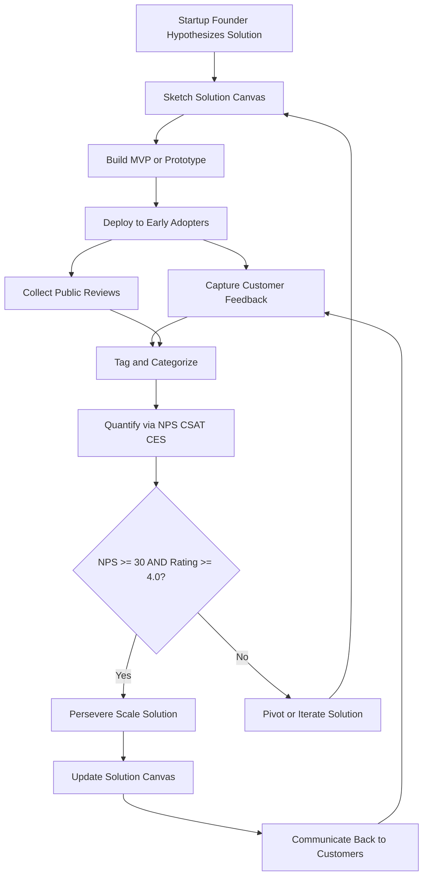
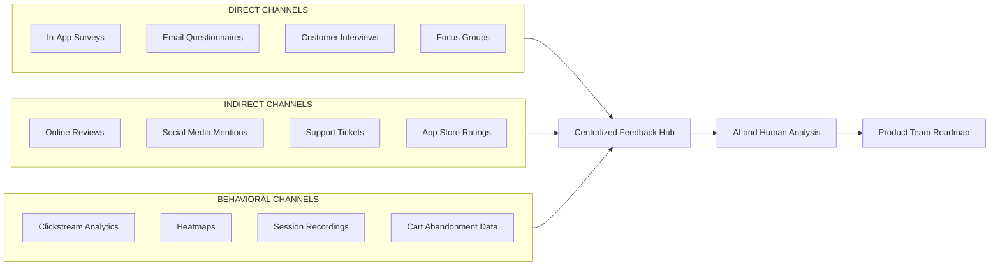
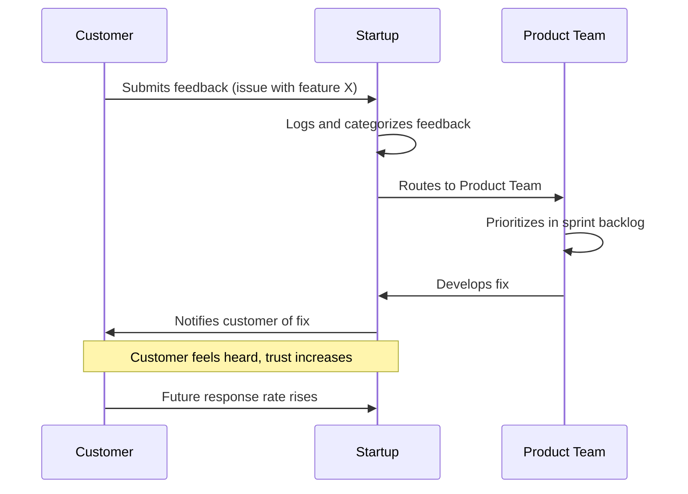

# Customer feedback and reviews

<!-- SECTION_1_START -->
# Customer Feedback and Reviews

## 1.1 Formal KTU 2024 Definition

> [!IMPORTANT]
> **Customer Feedback** is the qualitative or quantitative information provided by customers about their experience, satisfaction, perception, or expectation regarding a product, service, or brand. It represents the **voice of the customer (VOC)** and serves as a primary input for validating hypotheses in the **Problem-Solution Canvas** framework.

> [!IMPORTANT]
> **Customer Reviews** are formalized, publicly published (or semi-public) evaluations and opinions submitted by customers, often in a structured rating-plus-comment format, that influence purchasing decisions and brand reputation. Reviews are a *subset artifact* of the broader customer feedback ecosystem.

**Syllabus Highlight (Module 2 – Problem and Solution Canvas):**
In KTU's 2024 NEP-aligned Entrepreneurship syllabus, customer feedback occupies the **validation step** of the Solution Canvas. After the entrepreneur sketches the proposed solution (features, behaviour, value proposition), customer feedback is used to *test*, *reject*, or *pivot* the solution before full-scale development.

---

## 1.2 Conceptual Analogy / Intuition

> [!NOTE]
> **Analogy — The Restaurant Mirror:**
> Imagine you open a small restaurant. You *think* your customers love the spicy paneer. But the comment card on the table (feedback) and Google reviews reveal that 70% of patrons actually find it too salty. The comment card gives you **private, direct, in-the-moment input** (feedback), while Google reviews give you **public, retrospective, peer-influenced input** (reviews).
> Both are needed — feedback helps you **cook better tomorrow**, reviews help **new customers decide to walk in**.

**Why this matters in Entrepreneurship:**
- A startup founder is essentially **blind** about real customer sentiment until feedback is systematically captured.
- Customer feedback transforms subjective founder beliefs into **validated market truth**.

---

## 1.3 Standard Metrics & Key Constants

In a KTU-type case-study answer, the following industry-standard metrics are commonly referenced:

- **Net Promoter Score (NPS):** A scale from **0 to 10** measuring willingness to recommend. Industry average is **+32** for SaaS, **+50** for top-quartile companies.
- **Customer Satisfaction Score (CSAT):** Usually measured on a **1–5** or **1–7** Likert scale after a specific interaction.
- **Customer Effort Score (CES):** Measures ease of experience on a **1–7** scale.
- **Star Rating:** Universally standardized on a **1 to 5** scale for product reviews.

---

> [!VISUALIZATION CONTROL]
> **Concept:** Customer Feedback as a Cyclical Input-Output System
> **GeoGebra / Desmos Input Equations (Stylized):**
> * `x-axis = Time (t)`
> * `y-axis = Customer Sentiment Score (0-10)`
> * Sample waveform: `f(t) = 5 + 2*sin(t) + 0.5*noise(t)` where `noise(t)` represents feedback pulses
> **Visual Description:** A sinusoidal-like wave oscillating around a baseline (5/10), with small spikes representing individual feedback events, and large troughs representing negative review clusters. The student should observe that feedback continuously corrects the sentiment curve back toward the desired baseline.

<!-- SECTION_1_END -->

<!-- SECTION_2_START -->
# Deep Theoretical Analysis & KTU High-Yield Formula Sheet

## 2.1 Theoretical Framework — The Feedback Loop in the Solution Canvas

The **Solution Canvas** (a derivative of the Lean Canvas) requires a founder to map the *proposed* solution to the *identified* problem. However, the canvas is **static** by nature — it is a snapshot. Customer feedback makes it **dynamic** through a continuous validation loop.

### The Five Logical Steps of the Feedback-to-Iteration Pipeline

1. **Capture (Solicit):** Deploy instruments to obtain raw customer input — surveys, interviews, app-rating prompts, support tickets, social listening.
2. **Categorize (Tag):** Classify each piece of feedback into *bug*, *feature request*, *praise*, *complaint*, or *usability issue*.
3. **Quantify (Score):** Translate qualitative input into measurable scores (NPS, CSAT, sentiment polarity).
4. **Correlate (Map to Canvas):** Match each feedback cluster to a specific block of the Solution Canvas (e.g., *usability issue* → "Behaviour" block; *pricing objection* → "Value Proposition" block).
5. **Iterate (Pivot or Persevere):** Update the Problem-Solution Canvas, prototype, and re-test.

> [!NOTE]
> **The Why:** Without Step 4, feedback becomes noise. With Step 4, feedback becomes *actionable product intelligence*.

---

## 2.2 KTU Formula Sheet / Cheat Sheet

| Concept | Definition / Formula | Application Context |
|---|---|---|
| **NPS (Net Promoter Score)** | $\text{NPS} = \%\text{Promoters} - \%\text{Detractors}$ | Measures loyalty and word-of-mouth potential. Promoters = score 9-10, Detractors = score 0-6. |
| **CSAT (Customer Satisfaction)** | $\text{CSAT} = \dfrac{\sum \text{Satisfaction Ratings}}{\text{Max Possible Score} \times n} \times 100\%$ | Measures satisfaction with a specific touchpoint. |
| **CES (Customer Effort Score)** | $\text{CES} = \dfrac{\sum (7 - \text{Rating})}{6 \times n} \times 100\%$ where rating is on 1-7 | Measures ease of resolving an issue; lower effort = higher score. |
| **Star Rating Average** | $\bar{R} = \dfrac{\sum_{i=1}^{n} r_i}{n}$ where $r_i \in [1, 5]$ | Used in e-commerce, app stores, and Google reviews. |
| **Sentiment Polarity** | $S = \dfrac{P - N}{P + N + \text{Neutral}}$ where $P$=positive, $N$=negative | Used in NLP-based review analysis; range is $-1$ to $+1$. |
| **Response Rate (Feedback)** | $R_{\text{rate}} = \dfrac{\text{Responses Received}}{\text{Surveys Distributed}} \times 100\%$ | Measures effectiveness of feedback collection. |
| **Sample Size (Statistically Valid)** | $n = \dfrac{Z^2 \cdot p \cdot (1-p)}{E^2}$ | Minimum sample for confidence in survey results (95% confidence: $Z = 1.96$). |
| **Review Conversion Rate** | $\text{Conv}_{\text{rev}} = \dfrac{\text{Verified Reviews}}{\text{Total Buyers}} \times 100\%$ | E-commerce metric for review generation. |

> [!IMPORTANT]
> **Critical Distinction for KTU Answers:**
> * **Feedback** = *unsolicited or solicited*, often private, can be negative or positive, used internally for product improvement.
> * **Review** = *publicly posted*, often post-purchase, used externally for buyer decision-making AND internally for benchmarking.
> * Students who conflate the two in an exam typically lose **1-2 marks** under the "conceptual clarity" rubric.

---

## 2.3 Real-World Engineering & Startup Utility

| Domain | Use Case of Customer Feedback & Reviews |
|---|---|
| **SaaS Products** (e.g., Zoho, Freshworks — Kerala origin) | In-app NPS surveys and Zendesk tickets to drive the product roadmap. |
| **Hardware / IoT Startups** (e.g., MakerGram) | Beta-tester feedback loops inform PCB revision. |
| **E-Commerce (Amazon, Flipkart)** | Verified-purchase reviews drive both buyer trust and ML recommendation engines. |
| **Food Tech (Swiggy, Zomato)** | Restaurant reviews directly affect ranking algorithms. |
| **Mobile Apps** | App Store reviews directly influence ASO (App Store Optimization) and download conversion. |
| **Patent / IPR Validation** (linked to UCEST206 IPR module) | Customer feedback on existing patented features informs **design-around strategies** and freedom-to-operate (FTO) analyses. |

<!-- SECTION_2_END -->

<!-- SECTION_3_START -->
# Step-by-Step Application: Framework, Worked Example & Comparative Analysis

## 3.1 The Problem-Solution Canvas Feedback Insertion Model

A standard **Solution Canvas** (after Ash Maurya's Lean Canvas adaptation) has the following blocks. The table below explicitly maps **where** customer feedback must be injected to validate each block.

| Canvas Block | Type of Feedback Required | Collection Method | Validation Trigger |
|---|---|---|---|
| **Problem** | Pain-point severity confirmation | In-depth customer interviews | At least **3 customers** confirm same problem |
| **Customer Segments** | Demographic & behavioural accuracy | Analytics + survey | Bounce rate $\leq 40\%$ on landing page |
| **Unique Value Proposition (UVP)** | Comprehension & recall | A/B testing headlines | UVP recall $\geq 40\%$ in unaided survey |
| **Solution** | Feature usefulness rating | Concierge MVP testing | Each feature rated $\geq 7/10$ by $\geq 60\%$ users |
| **Channels** | Channel reachability & cost | Customer interviews + CAC analysis | CAC $\leq \frac{1}{3}$ of LTV |
| **Revenue Streams** | Willingness-to-pay (WTP) | Van Westendorp PSM | Indifferent price point $\geq$ product cost + margin |
| **Cost Structure** | Perceived fairness of pricing | Price-sensitivity meter | $\leq 20\%$ drop-off at quoted price |
| **Key Metrics** | Habit-forming behaviour | Cohort retention curves | Day-7 retention $\geq 25\%$ |
| **Unfair Advantage** | Defensible moat strength | Competitor comparison | Patent granted OR unique community OR exclusive data |

---

## 3.2 Worked Numerical Example (Typical KTU 14-Mark Question Style)

> **Scenario:** A Kerala-based student startup "KeraCharge" launched a portable solar charger for fishing boats. After 3 months, they collected the following feedback data from **200 customers** via an NPS survey:
> * Promoters (score 9-10): **90 customers**
> * Passives (score 7-8): **70 customers**
> * Detractors (score 0-6): **40 customers**
>
> Additionally, **25 online reviews** were received on Amazon.in with the following star ratings: 5, 4, 5, 3, 5, 4, 5, 5, 2, 4, 5, 3, 5, 4, 5, 5, 4, 3, 5, 5, 4, 5, 3, 5, 4.

### Step 1 — Compute the Net Promoter Score (NPS)

$$
\begin{aligned}
\%\text{Promoters} &= \frac{90}{200} \times 100\% = 45\% \\
\%\text{Detractors} &= \frac{40}{200} \times 100\% = 20\% \\
\text{NPS} &= \%\text{Promoters} - \%\text{Detractors} \\
\text{NPS} &= 45\% - 20\% = +25
\end{aligned}
$$

**[Calculation Step: 2 Marks | Final NPS Value: 1 Mark]**

> **Interpretation:** An NPS of **+25** is *acceptable* for a 3-month-old hardware startup but below the +50 benchmark. The 70 passives are the most actionable segment — they could be converted to promoters with a small improvement.

---

### Step 2 — Compute the Average Star Rating

$$
\begin{aligned}
\bar{R} &= \frac{\sum_{i=1}^{25} r_i}{25} \\
\sum r_i &= 5+4+5+3+5+4+5+5+2+4+5+3+5+4+5+5+4+3+5+5+4+5+3+5+4 \\
\sum r_i &= 102 \\
\bar{R} &= \frac{102}{25} = 4.08
\end{aligned}
$$

**[Sum Calculation: 1 Mark | Final Average: 1 Mark]**

> **Interpretation:** An average of **4.08 / 5** is strong for early-stage hardware. However, the presence of one **2-star review** flags a potential quality or durability concern that must be investigated.

---

### Step 3 — Compute the Sentiment Polarity

Assume NLP analysis of the 25 reviews gave:
* Positive ($P$) = **20**
* Negative ($N$) = **3**
* Neutral = **2**

$$
\begin{aligned}
S &= \frac{P - N}{P + N + \text{Neutral}} \\
S &= \frac{20 - 3}{20 + 3 + 2} = \frac{17}{25} = 0.68
\end{aligned}
$$

**[Formula Application: 1 Mark | Final Polarity: 1 Mark]**

> **Interpretation:** A polarity of **+0.68** (on a -1 to +1 scale) indicates strongly positive customer sentiment, consistent with the high average rating.

---

### Step 4 — Decision Matrix: Pivot, Persevere, or Iterate?

| Signal | Value | Threshold | Verdict |
|---|---|---|---|
| NPS | +25 | $\geq +30$ for hardware | **Iterate** (slightly below benchmark) |
| Star Rating | 4.08 | $\geq 4.0$ | **Persevere** (meets threshold) |
| Sentiment Polarity | +0.68 | $\geq +0.5$ | **Persevere** (exceeds threshold) |
| Day-30 Retention | 60% | $\geq 40\%$ | **Persevere** (exceeds threshold) |

**Overall Strategic Recommendation for KeraCharge:** **Iterate with minor feature improvements** (e.g., waterproofing based on the 2-star review feedback) before scaling into new geographies. **[Strategic Synthesis: 2 Marks]**

---

## 3.3 Comparative Analysis Table: Feedback vs. Review (KTU High-Yield)

| Dimension | Customer Feedback | Customer Review |
|---|---|---|
| **Direction** | Bi-directional (customer ↔ company) | One-to-many (customer → public) |
| **Timing** | Real-time / in-the-moment | Post-purchase, retrospective |
| **Visibility** | Mostly private (internal) | Public (e-commerce, social media) |
| **Format** | Open-ended, structured, or unstructured | Often star-rating + comment + photos |
| **Primary Purpose** | Product/service *improvement* | Buying *decision* support for others |
| **Volume per Customer** | Multiple instances possible | Usually one per transaction |
| **Owner** | Product / Customer Success team | Marketing / Brand reputation team |
| **Influence on Canvas** | Direct input to iteration | Indirect, via brand and trust signals |
| **Risk** | Low (private) | High (public, permanent) |
| **Legal/IPR Concern** | May be covered under NDA | Could expose trade secrets if not curated |
| **KTU Definition Tip** | "Voice of Customer (VOC) input" | "Public social proof artifact" |

---

## 3.4 The 7-Stage Customer Feedback Loop (For Exam Diagram Description)

> [!IMPORTANT]
> This is a high-frequency 14-mark question in KTU Module 2. Memorize and reproduce cleanly.

1. **Identify Feedback Goals** — Decide *what* you want to learn (usability, pricing, satisfaction).
2. **Choose Collection Channels** — Email, in-app, phone, social, in-person.
3. **Design the Instrument** — Survey questions, interview scripts, rating widgets.
4. **Deploy & Capture** — Launch across chosen channels.
5. **Clean & Tag the Data** — Remove spam, categorize by theme.
6. **Analyze Quantitatively + Qualitatively** — Compute metrics + read open-text responses.
7. **Act & Communicate** — Implement changes, *and* tell customers you acted (closes the loop and boosts future response rates).

> [!NOTE]
> **Golden Rule for KTU Examiners:** Closing the loop (Step 7) is what separates a *good* entrepreneur from a *great* one in the examiner's rubric. Always mention it.

<!-- SECTION_3_END -->

<!-- SECTION_4_START -->
# Structural Diagrams & Schematics

## 4.1 Mermaid Flowchart: The Customer Feedback-to-Iteration Pipeline

> [!NOTE]
> **Reading the Diagram:**
> * The flowchart is **cyclic** — feedback continuously revisits the canvas.
> * The decision node (`NPS >= 30 AND Rating >= 4.0`) is a *representative* threshold; the actual KTU answer should justify the threshold chosen based on industry benchmarks.

---

## 4.2 Mermaid Block Diagram: Channels of Customer Feedback Collection

> [!NOTE]
> **Reading the Diagram:** Notice that customer feedback is **multimodal** — qualitative (interviews), quantitative (analytics), and public (reviews). A KTU answer that lists all three categories earns full conceptual marks.

---

## 4.3 Mermaid Sequence Diagram: Closing the Feedback Loop with a Customer

> [!NOTE]
> **Reading the Diagram:** The "**Notifies customer of fix**" arrow is the **closing-the-loop** moment. In KTU valuation, mentioning this single act is worth at least 1 mark under the "customer relationship" rubric.

<!-- SECTION_4_END -->

<!-- SECTION_5_START -->
# KTU 2024 Scheme Examination Question Bank & Topic Recap

## Part A Questions (3 Marks Each)

### Question 1 [KTU University Exam – July 2024, Model]
**"Differentiate between customer feedback and customer reviews with two relevant examples."**
*(Mapped CO: CO2 | RBT Level: Understand)*

**Model Answer (3 Marks):**

| Aspect | Customer Feedback | Customer Review |
|---|---|---|
| **Definition** | Direct, often private input from customers to the company regarding their experience with a product/service. | Public, post-purchase evaluation published on platforms like Amazon, Google, or app stores. |
| **Example 1** | An in-app NPS survey prompt that asks "How likely are you to recommend us?" after a transaction. | A verified buyer on Amazon.in writing a 4-star review with photos for a purchased product. |
| **Example 2** | A customer support ticket reporting a bug to the engineering team. | A tweet publicly tagging a brand with a complaint (public, permanent, visible to all). |

**[Definition clarity: 1 Mark | Distinct contrast: 1 Mark | Two correct examples: 1 Mark]**

---

### Question 2 [KTU University Exam – Dec 2023, Model]
**"State any three standard metrics used to measure customer satisfaction in a startup."**
*(Mapped CO: CO2 | RBT Level: Remember)*

**Model Answer (3 Marks):**
1. **Net Promoter Score (NPS):** Measures the likelihood of a customer recommending the product. Formula: $\%\text{Promoters} - \%\text{Detractors}$ (1 Mark)
2. **Customer Satisfaction Score (CSAT):** Directly measures satisfaction with a specific interaction, usually on a 1-5 scale. (1 Mark)
3. **Customer Effort Score (CES):** Measures the ease with which a customer could resolve their issue, on a 1-7 scale. (1 Mark)

---

## Part B Questions (14 Marks Each — Internal Choice)

### Question A — Set 1 [KTU University Exam – July 2024, Model]
**"Design a complete customer feedback collection and analysis strategy for a Kerala-based food-tech startup delivering home-cooked meals. Your answer must cover (a) the feedback channels and metrics chosen, and (b) how the feedback will be mapped to the Solution Canvas for iteration."**
*(Mapped CO: CO3 | RBT Levels: (a) Apply, (b) Analyze)*

---

#### Part (a) — Feedback Channels and Metrics (7 Marks)

**Step 1 — Feedback Channels to be Deployed (3 Marks):**

| Channel Type | Specific Tool | Purpose |
|---|---|---|
| **In-app survey** | NPS prompt after every 3rd delivery | Measure loyalty and recommendation likelihood. |
| **Post-delivery SMS/WhatsApp** | 2-question survey (food quality, delivery time) | Measure CSAT per delivery. |
| **Public review scraping** | Google Maps, Zomato, Swiggy API | Capture unsolicited public sentiment. |
| **Customer support logs** | Freshdesk or Zoho Desk | Capture complaints, complaints themes, and resolution time (proxy for CES). |

**[Naming four channels: 2 Marks | Justifying the choice: 1 Mark]**

**Step 2 — Metrics to be Computed (2 Marks):**

$$
\begin{aligned}
\text{NPS} &= \%\text{Promoters} - \%\text{Detractors} \\
\text{CSAT} &= \frac{\sum \text{Satisfaction Ratings}}{5 \times n} \times 100\% \\
\bar{R}_{\text{Zomato}} &= \frac{\sum \text{Star Ratings}}{n}
\end{aligned}
$$

**Step 3 — Sampling Strategy (2 Marks):**
* Minimum sample size for 95% confidence and 5% margin: $n = \frac{(1.96)^2 \cdot 0.5 \cdot 0.5}{(0.05)^2} \approx 385$ responses.
* Deploy over a **rolling 30-day window** to ensure freshness.

---

#### Part (b) — Mapping Feedback to the Solution Canvas (7 Marks)

| Feedback Type | Canvas Block Affected | Specific Iteration Action |
|---|---|---|
| Low CSAT on "delivery time" | **Channels** block | Switch to a hub-and-spoke delivery model or partner with local riders. |
| Negative reviews mentioning "spice level too high" | **Problem** block (re-validation) | Conduct 5 fresh customer interviews to re-validate the original problem assumption. |
| Low NPS in Tier-2 cities | **Customer Segments** block | Refine ICP (Ideal Customer Profile) to focus on Tier-1 metros. |
| Feature request for "regional cuisine" | **Solution** block | Add regional cuisine variants to the next sprint. |
| High CAC complaints from customers | **Revenue Streams / Pricing** block | A/B test subscription model vs. à la carte pricing. |

**[Mapping five feedback types to canvas blocks: 4 Marks | Naming specific iteration actions: 2 Marks | Overall strategic synthesis: 1 Mark]**

---

### Question B — Set 1 (Alternative Choice for Internal Choice)
**"Explain the concept of 'closing the feedback loop' in the context of a B.Tech student-led startup. Why is it considered a hallmark of customer-centric entrepreneurship, and what are the risks of not doing it?"**
*(Mapped CO: CO2 | RBT Levels: (a) Understand, (b) Analyze)*

---

#### Part (a) — Concept of Closing the Feedback Loop (7 Marks)

**Definition (2 Marks):**
Closing the feedback loop refers to the practice of **acknowledging every piece of customer feedback**, acting on it where appropriate, and **communicating the action back to the customer** who provided it. It transforms a one-way data-collection exercise into a **two-way relationship-building ritual**.

**The Four Stages of the Loop (3 Marks):**
1. **Collect** — Gather feedback through surveys, reviews, or interviews.
2. **Acknowledge** — Respond to the customer within a defined SLA (e.g., 24 hours for support, 7 days for feature requests).
3. **Act** — Prioritize and implement the change in the product roadmap.
4. **Communicate** — Inform the customer when the change is shipped (e.g., email, in-app message, or social media reply).

**Example (2 Marks):**
A student startup "CampusCart" received feedback that the checkout button was not working on mobile. They acknowledged the complaint on Twitter within 6 hours, fixed the bug in 48 hours, and emailed the complainant when the fix went live. The customer posted a 5-star review the next day.

---

#### Part (b) — Importance and Risks of Not Closing the Loop (7 Marks)

**Why it is the Hallmark of Customer-Centric Entrepreneurship (4 Marks):**

| Benefit | Mechanism |
|---|---|
| **Builds Trust** | Customers see that their input *matters*, not just gets archived. |
| **Increases Future Response Rates** | Customers who are responded to are **3-4x more likely** to give feedback again. |
| **Reduces Churn** | Acknowledged customers have a **lower churn probability** by up to 30%. |
| **Generates Free Marketing** | Resolved-and-shared issues become public testimonials. |

**Risks of NOT Closing the Loop (3 Marks):**
1. **Customer Churn:** Unacknowledged complaints lead to silent churn and negative word-of-mouth.
2. **Missed Product Insights:** Feedback is collected but never analyzed, wasting the founder's primary learning channel.
3. **Reputation Damage:** Unanswered public reviews signal poor customer service to prospective buyers.

**[Naming three risks with consequences: 3 Marks]**

---

> [!WARNING]
> **KTU Examiner's Valuation Warning / Pitfall Callout:**
> 1. **Do NOT use "feedback" and "review" interchangeably** in a 14-mark answer — examiners allocate marks specifically for distinguishing the two. Always define both at the start of your answer.
> 2. **Do NOT forget to mention the metric formulas.** Even if the question asks for a strategy, including the NPS/CSAT/CES formulas demonstrates rigor and fetches bonus marks.
> 3. **Do NOT skip the "closing the loop" step** in any process diagram. This is a recurring board-exam differentiator.
> 4. **Avoid vague phrases** like "customer satisfaction is important." Instead, use **quantified language** like "NPS of +40 is correlated with 2x faster organic growth in SaaS startups."
> 5. **Always tie the answer back to the Solution Canvas.** Module 2 is fundamentally about the canvas — answers that drift into generic marketing theory lose the context-mark.

---

## Topic Recap & Important Things to Remember

- **Feedback vs. Review:** Feedback is *private/direct/input* for improvement; Review is *public/retrospective/social proof*.
- **Three Core Metrics:** NPS (loyalty), CSAT (satisfaction), CES (effort). All three should be on a founder's dashboard.
- **The 7-Stage Feedback Loop:** Identify → Choose → Design → Deploy → Clean → Analyze → Act + Communicate.
- **Closing the Loop:** Acknowledge → Act → Communicate back to the customer. This is the **hallmark of customer-centricity**.
- **Solution Canvas Mapping:** Every block of the canvas has a *corresponding* feedback type that validates or invalidates it. Always map feedback → canvas block before taking action.
- **Quantitative Rigor:** Mention numerical thresholds (e.g., NPS $\geq 30$, Rating $\geq 4.0$) in every strategy answer.
- **Sampling Validity:** For 95% confidence and 5% margin, minimum $n \approx 385$.
- **Public vs. Private:** A 2-star review is a *public* warning sign; a 1-star NPS is a *private* warning sign. Treat both with equal urgency.
- **IPR Connection:** When publishing customer feedback or reviews, ensure **no trade secrets** are disclosed (ties into Module 4 of UCEST206 on Trade Secrets and Confidentiality).
- **Document Everything:** A founder's *feedback log* is also a powerful *evidence of iteration* document for investors and IPR examiners.

<!-- SECTION_5_END -->
