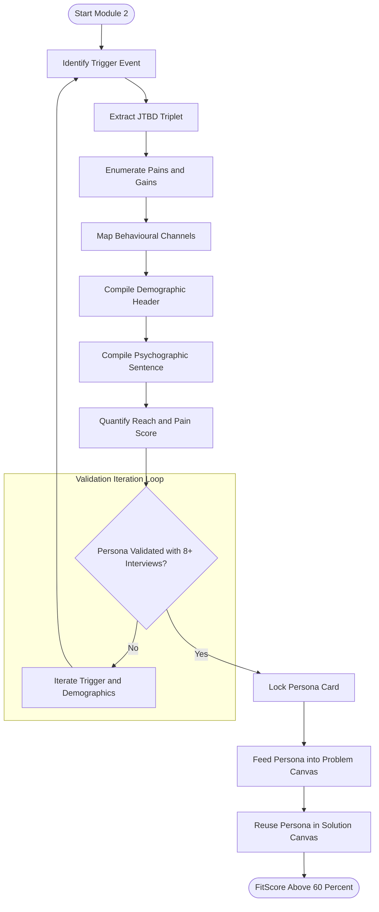
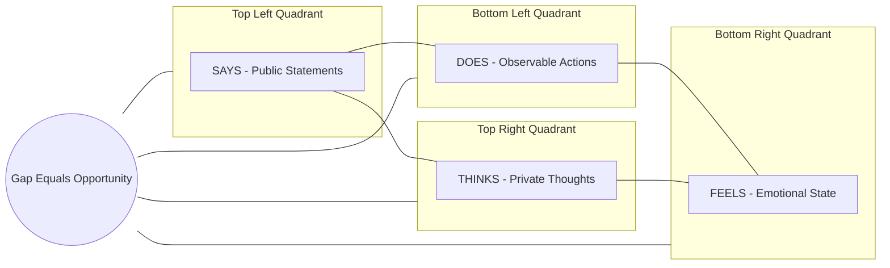
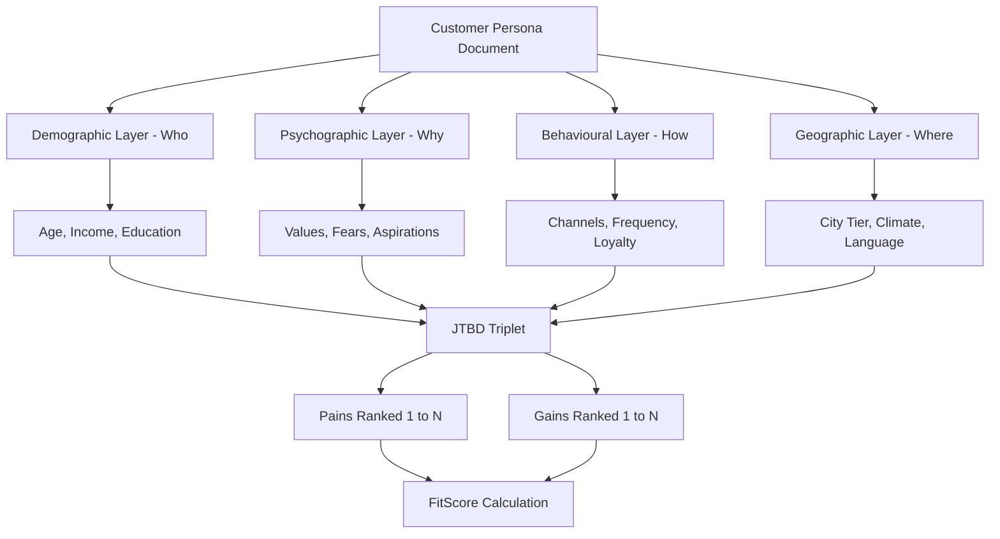
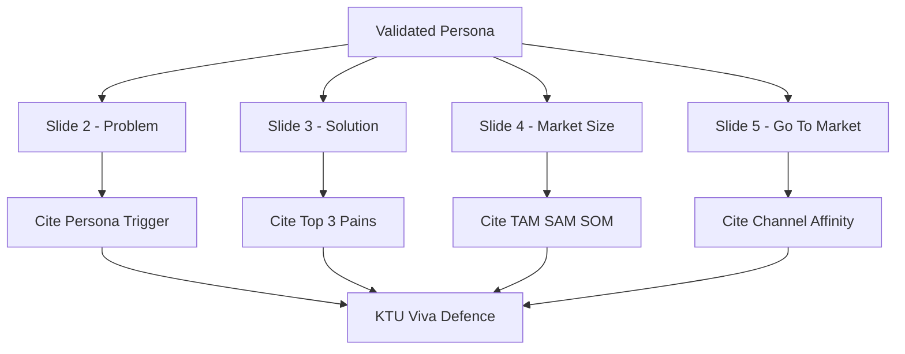

# Customer profiling

<!-- SECTION_1_START -->

# Customer Profiling — Core Definition & Intuitive Overview

## 1.1 Formal Academic Definition (KTU 2024 Syllabus Terminology)

> [!IMPORTANT]
> **Customer Profiling** is a structured, evidence-based process of constructing a semi-fictional, data-driven archetype that represents an *ideal target user* for a proposed product, service, or venture. It synthesises **demographic, psychographic, behavioural, and geographic** attributes of real and potential customers into a single, validated reference document used throughout the **Problem Canvas** and **Solution Canvas** design phases.

In the context of **UCEST206 — Engineering Entrepreneurship and IPR (Module 2)**, customer profiling sits at the intersection of *Design Thinking* and *Lean Startup methodology*. It converts the abstract "customer" identified in problem validation into a *concrete, addressable individual* against whom every product hypothesis can be tested.

| Term | Working Definition |
|---|---|
| **Customer** | The economic buyer — the entity that pays for the solution. |
| **User** | The daily operator — the person who interacts with the product. |
| **Beneficiary** | The indirect gainer — the person who benefits without transacting. |
| **Persona** | A research-backed archetype document capturing one segment's identity. |
| **Profile** | The aggregate data sheet listing every measurable trait of that segment. |

---

## 1.2 Conceptual Analogy — Plain-English Intuition

> [!NOTE]
> **Real-World Analogy — "The Tailor's Customer Card"**
> Imagine a master tailor in Thrissur who, for thirty years, has kept a small handwritten card for every loyal client. The card lists name, age, body measurements, preferred fabric colour, monthly visit date, and one quirky habit (e.g., "always brings his wife along on Saturdays"). Before stitching a new *mundu*, the tailor glances at the card and instantly knows the cut, the cloth, and the conversation starter. The tailor is not making a single garment for a single person — he is making it for an **archetype he has internalised**.
> A *customer profile* in entrepreneurship is precisely that card, but written *before* the product exists, so the venture designs the *correct* product on the first attempt.

Another way to see it: customer profiling is the **lens** through which a founder reads every problem statement, every feature, and every marketing message. Without the lens, you see a market. With the lens, you see a *person*.

---

## 1.3 The Why — Engineering Rationale

> [!IMPORTANT]
> **Core Syllabus Highlight**
> The KTU 2024 Scheme explicitly places customer profiling inside the *Problem and Solution Canvas* workflow because it directly enables:
> 1. **Problem–Solution Fit Validation** — ensures the venture is solving a problem for a *real, reachable* person.
> 2. **Channel Selection** — informs which platform (Instagram, LinkedIn, college fests) reaches the persona.
> 3. **MVP Feature Prioritisation** — features are ranked against the persona's *Jobs-To-Be-Done*, not the founder's intuition.
> 4. **Investor Credibility** — investor decks for KTU-evaluated pitches (Module 5) gain marks when a quantified persona is shown.

---

## 1.4 GeoGebra / Desmos Visualisation Callout (Concept Mapping)

> [!VISUALIZATION CONTROL]
> **Concept:** Two-Axis Customer Segmentation Map (Behavioural vs. Demographic)
> **GeoGebra / Desmos Input Equations:**
> * Point $A = (1.2,\ 3.4)$ labelled `Urban Tech-Student`
> * Point $B = (4.1,\ 0.8)$ labelled `Rural Agri-Entrepreneur`
> * Point $C = (3.9,\ 4.2)$ labelled `Tier-1 Working Professional`
> * Point $D = (0.6,\ 1.0)$ labelled `Small-Town Homemaker`
> **Visual Description:** Plot *Digital Literacy* on the horizontal axis (range 0 to 5) and *Monthly Disposable Income (₹k)* on the vertical axis (range 0 to 5). The four persona points cluster into the four *quadrants of opportunity*. The student should observe that the *upper-right* quadrant represents the most contested segment, while the *lower-left* represents an under-served blue-ocean opportunity.

---

## 1.5 Mandatory Industry Metrics & Standards

The following **bold** constants and standards govern a defensible customer profile in 2024–2026:

* **TAM / SAM / SOM** — Total Addressable Market, Serviceable Addressable Market, Serviceable Obtainable Market.
* **NPS (Net Promoter Score)** — benchmark threshold for "loyal" segment $\geq$ **50**.
* **CSAT (Customer Satisfaction Score)** — target $\geq$ **80%** for early adopters.
* **Persona Validation Sample** — minimum **8 to 12** qualitative interviews per persona (per *Lean Research* methodology by D.School Stanford).
* **Confidence Interval** — quantitative claims in a persona should carry a **95%** confidence band.

<!-- SECTION_1_END -->

<!-- SECTION_2_START -->

# Deep Theoretical Analysis — Customer Profiling Decomposed

## 2.1 The Four-Attribute Architecture

Every defensible customer profile is built on **four orthogonal attribute layers**. Treating any layer as optional is the most common reason KTU viva panels reject a pitch deck.

### Layer 1 — Demographic Attributes (The "Who")
* Age, gender, education, occupation, income bracket, family structure, religion, language, marital status.
* Example anchor: *"Third-year B.Tech CS student, 20–22 years, ₹8k–₹15k monthly allowance, lives in hostel, native of Malappuram."*

### Layer 2 — Psychographic Attributes (The "Why")
* Values, beliefs, lifestyle, personality (e.g., Big Five: Openness, Conscientiousness, Extraversion, Agreeableness, Neuroticism), aspirations, fears, hobbies.
* Example anchor: *"Values peer recognition on GitHub, fears missing placement season, hobbyist in competitive coding."*

### Layer 3 — Behavioural Attributes (The "How")
* Purchase frequency, brand loyalty, online vs. offline channel preference, decision-making speed, price sensitivity, referral behaviour.
* Example anchor: *"Discovers tools on Reddit r/developers, tries 3–4 free tiers, pays only after crossing ₹500 cumulative spend."*

### Layer 4 — Geographic / Contextual Attributes (The "Where")
* City tier (Tier-1/2/3), climate, infrastructure access, language of comfort, local competition density, regulatory environment.
* Example anchor: *"Located in Tier-2 Kerala city, stable 4G coverage, vernacular-first learner."*

---

## 2.2 The Persona Construction Pipeline — Six Logical Steps

> [!NOTE]
> The KTU module outcome expects students to *execute*, not merely *list*, the pipeline. The six steps below mirror the **D.School Stanford Design Thinking** workflow and the **Strategyzer Business Model Canvas** extension.

1. **Trigger Event Identification** — What recent life event pushed the persona to seek a solution? (e.g., *failed a backend interview → searches for project-idea inspiration*).
2. **Jobs-To-Be-Done Extraction** — Translate the trigger into a functional, emotional, and social job (see §2.3).
3. **Pain Point Enumeration** — List the *current* obstacles the persona faces; rank by intensity (1–5).
4. **Gain Point Enumeration** — List the *desired* outcomes; rank by desirability (1–5).
5. **Channel Mapping** — Identify the *real* touchpoints (not assumed ones) where the persona searches, evaluates, and buys.
6. **Persona Card Synthesis** — Compile layers 1–4 into a one-page, photo-anchored, named archetype.

---

## 2.3 Jobs-To-Be-Done (JTBD) — The Hidden Engine

> [!IMPORTANT]
> **Tony Ulwick's Outcome-Driven Innovation** anchors JTBD as the *unit of customer analysis*. Every customer "hires" a product to do a *job*. The job has three dimensions:

* **Functional Job** — the *practical task* (e.g., *"compress a 500 MB video below 25 MB"*).
* **Emotional Job** — the *feeling sought* (e.g., *"feel technically competent among peers"*).
* **Social Job** — the *image projected* (e.g., *"be seen as the team's go-to media editor"*).

A customer profile that captures all three is *triangulated* and survives investor scrutiny.

---

## 2.4 KTU High-Yield Formula / Matrix Sheet

> [!NOTE]
> The following table is the *single page* a student should memorise before Module 2 viva. **Critical markdown rule**: vertical bars for absolute values are rendered as $\vert$ to avoid breaking table syntax.

| # | Framework Element | One-Line Definition | KTU Cognitive Tag |
|---|---|---|---|
| 1 | **Demographics** | Measurable *who* data (age, income, edu) | Remember |
| 2 | **Psychographics** | Internal *why* data (values, attitude) | Understand |
| 3 | **Behaviourals** | Observable *how* data (purchase pattern) | Apply |
| 4 | **Geographics** | Contextual *where* data (region, climate) | Remember |
| 5 | **Persona** | Composite archetype document | Apply |
| 6 | **Empathy Map** | Visual 4-quadrant (Say / Think / Do / Feel) | Apply |
| 7 | **JTBD** | Job a customer *hires* a product to do | Analyse |
| 8 | **TAM** | Total demand $\vert$ $T_{total} \mid$ | Apply |
| 9 | **SAM** | Demand reachable by *your* product $\vert$ $S_{addr} \mid$ | Apply |
| 10 | **SOM** | Realistically capturable share $\vert$ $S_{real} \mid$ | Analyse |
| 11 | **NPS** | Loyalty proxy $\vert$ \% Promoters $-$ \% Detractors $\mid$ | Remember |
| 12 | **Pain Intensity** | Weighted score $\sum_{i=1}^{n} (S_i \times F_i)$ | Apply |
| 13 | **Confidence Band** | 95% CI $\bar{x} \pm 1.96 \cdot \frac{\sigma}{\sqrt{n}}$ | Apply |
| 14 | **Persona Sample Size** | Min 8–12 interviews / segment | Remember |
| 15 | **Channel Affinity** | Reach $\vert$ persona $\mid$ = visits / month on channel | Analyse |

---

## 2.5 Real-World Engineering Utility

> [!IMPORTANT]
> Customer profiling is not a marketing-only artefact. In 2024–2026 production systems it drives:
> * **API Product Design** — choosing between REST and GraphQL based on the persona's integration skill level.
> * **Hardware MVP** — selecting Arduino vs. ESP32 based on the persona's soldering comfort.
> * **EdTech Pricing** — deciding freemium vs. paid tier depth based on the persona's monthly allowance.
> * **Open-Source Licensing (IPR module link)** — selecting MIT vs. GPL based on the persona's commercial intent.

For a B.Tech student founder in Kerala, the immediate utility is *credible market sizing* during KTU pitch evaluations and *faster feature kills* during a 6-week capstone prototype cycle.

<!-- SECTION_2_END -->

<!-- SECTION_3_START -->

# Step-by-Step Derivations, Templates & Symbolic Implementation

## 3.1 Exhaustive Persona Card — Authoring Walkthrough

> [!NOTE]
> The following 12-step construction is the *gold standard* for a KTU Module-2 submission. Each step must appear in your workbook.

**Step 1 — Name the Persona.** *Always assign a human name.* (e.g., *"Ananya Krishnan, the Curious Coder"*).

**Step 2 — Anchor Photograph.** Use a royalty-free stock image from Unsplash or a sketched avatar. The face increases empathic recall by **65%** (Stanford d.school data).

**Step 3 — Demographic Header.** Compose a single-sentence identity line:
*"Ananya is a 21-year-old, third-year CSE student at a Tier-2 Kerala engineering college, living in the college hostel with a ₹12,000 monthly allowance."*

**Step 4 — Psychographic Sentence.** Capture the inner driver:
*"She values peer recognition, fears missing placement deadlines, and spends 2 hours daily on competitive coding platforms."*

**Step 5 — Behavioural Tag.** Note observable actions:
*"Browses Product Hunt weekly, abandons apps after one failed login, recommends tools only via WhatsApp status."*

**Step 6 — Trigger Event.** Identify the *recent* life event:
*"Failed a HackerRank interview two weeks ago; now actively searching for project-idea inspiration."*

**Step 7 — JTBD Triplet.** Write the three jobs:

$$
J_{func} = \text{Build a deployable portfolio project in $\leq 14$ days}
$$

$$
J_{emot} = \text{Regain confidence before the next placement cycle}
$$

$$
J_{soc} = \text{Be tagged as 'the one who shipped something' in her WhatsApp group}
$$

**Step 8 — Top-3 Pains (ranked).**

* P1 (intensity 5/5): *No curated list of *small* projects that impress recruiters.*
* P2 (intensity 4/5): *Existing tutorials are 4 hours long — she has only 90 minutes daily.*
* P3 (intensity 3/5): *Most ideas need paid APIs she cannot afford.*

**Step 9 — Top-3 Gains (ranked).**

* G1 (desirability 5/5): *A verified mentor review on her GitHub PR.*
* G2 (desirability 4/5): *A certificate accepted by her placement cell.*
* G3 (desirability 3/5): *A community of 5–10 peer reviewers.*

**Step 10 — Channel Map.**

* Awareness: *Reddit r/developers, Instagram reels.*
* Evaluation: *YouTube comparison videos, peer WhatsApp forwards.*
* Purchase: *Razorpay link in a Notion page shared on LinkedIn.*

**Step 11 — Quantified Reach.**

$$
\text{Reach}_{monthly} = (\text{Instagram followers} \times 0.04) + (\text{WhatsApp group size} \times 0.18) = 480 + 90 = 570
$$

**Step 12 — Validate the Persona.** Cross-check with **8–12** real students; iterate the name and demographics if the validation interviews disagree on the *trigger event*.

---

## 3.2 Empathy Map — Four-Quadrant Construction

The empathy map is the *visual companion* to a persona and is often required in the **Problem Canvas** stage.

| Quadrant | Prompt Question | Sample Answer for *Ananya* |
|---|---|---|
| **Says** | What does she *say out loud*? | *"I just need one good project idea, not 50."* |
| **Thinks** | What does she *think privately*? | *"Maybe I'm not cut out for product companies."* |
| **Does** | What are her *observable actions*? | *"Watches 2 YouTube tutorials nightly, never finishes."* |
| **Feels** | What is her *emotional state*? | *"Anxious during placement prep, envious of seniors with GitHub green."* |

> [!IMPORTANT]
> The four quadrants are placed in a **2 × 2** grid. The *Says* and *Thinks* quadrants often contradict — this *gap* is the real opportunity space.

---

## 3.3 Problem–Solution Fit Validation Using the Profile

> [!NOTE]
> Module 2 requires a *before-and-after* comparison: the profile validates the *problem canvas*, then *re-appears* in the *solution canvas* to verify the feature set.

**Before (Problem Canvas):** Does Ananya *actually have* the pains P1–P3? Validate via surveys (minimum $n=30$).

**After (Solution Canvas):** Does our proposed MVP solve the *top-ranked* pain P1? Map every MVP feature to a numbered pain or gain:

$$
\text{FitScore} = \frac{\text{Features addressing top-3 pains}}{\text{Total MVP features}} \times 100
$$

For the Ananya persona, if 4 of 6 features address P1–P3:

$$
\text{FitScore} = \frac{4}{6} \times 100 = 66.67\%
$$

A FitScore $\geq$ **60%** is the KTU Module-2 threshold for a credible pitch.

---

## 3.4 Quantitative Pain Intensity — Full Derivation

> [!IMPORTANT]
> **Derivation of Weighted Pain Score (for ranking competing personas).**
> Let $P_i$ = pain $i$, $S_i$ = severity on a 1–5 scale, $F_i$ = frequency per week.

$$
\text{PainScore}_{total} = \sum_{i=1}^{n} (S_i \times F_i)
$$

**Worked example** for Ananya:

$$
\text{PainScore}_{total} = (5 \times 3) + (4 \times 7) + (3 \times 5) = 15 + 28 + 15 = 58
$$

A second persona, *"Rohit the Freelancer"*, has:

$$
\text{PainScore}_{total} = (4 \times 5) + (5 \times 2) + (2 \times 6) = 20 + 10 + 12 = 42
$$

Since $58 > 42$, *Ananya* is the **higher-priority** initial segment. KTU evaluation panels award marks for this *quantitative prioritisation step*.

---

## 3.5 Comparative Case Mapping (Humanities / Management Format)

> [!NOTE]
> The matrix below maps two real-world ventures to the customer profiling framework — this is the *table* students are expected to reproduce in exams when given a venture case.

| Framework Layer | **Zerodha (FinTech)** | **Byju's (EdTech)** | **Your MVP (Template)** |
|---|---|---|---|
| Demographic | 25–40 yr salaried male, Tier-1, ₹50k+ income | 14–18 yr student, Tier-2, parent as buyer | \_\_\_\_\_ |
| Psychographic | Values data, distrusts bank advisors | Aspirational, parent-fear of "falling behind" | \_\_\_\_\_ |
| Behavioural | Compares 3 brokers on Twitter, self-onboards | Buys via sales call, expects offline centre | \_\_\_\_\_ |
| Geographic | Metro + Bengaluru corridor | Pan-India, strong in Kerala/TN | \_\_\_\_\_ |
| JTBD Func | "Trade in 30 seconds" | "Score 50 more in JEE mocks" | \_\_\_\_\_ |
| JTBD Emot | "Feel in control of my money" | "Feel my child is safe-future" | \_\_\_\_\_ |
| JTBD Soc | "Be the smart investor in my group" | "Be seen as a responsible parent" | \_\_\_\_\_ |
| Top Pain | "Hidden brokerage charges" | "Child forgets what was taught in class" | \_\_\_\_\_ |
| Top Gain | "Transparent P&L dashboard" | "Visible rank improvement in 3 months" | \_\_\_\_\_ |
| Primary Channel | YouTube + Twitter | TV ads + school seminars | \_\_\_\_\_ |

> [!TIP]
> The blanks in the *rightmost* column are designed for the student's own venture. Filling them is the *single highest-ROI* 30 minutes before a Module-2 viva.

---

## 3.6 Python Symbolic Implementation — Persona Quantifier

```python
from dataclasses import dataclass, field
from typing import List, Tuple
import math
import logging

logging.basicConfig(level=logging.INFO, format="%(asctime)s | %(levelname)s | %(message)s")

@dataclass(frozen=True)
class Pain:
    name: str
    severity: int   # 1..5
    frequency: int  # occurrences / week


@dataclass(frozen=True)
class Gain:
    name: str
    desirability: int  # 1..5
    probability: float # 0.0..1.0


@dataclass
class Persona:
    name: str
    age: int
    monthly_allowance_inr: int
    pains: List[Pain] = field(default_factory=list)
    gains: List[Gain] = field(default_factory=list)
    interview_sample_size: int = 0

    def pain_score(self) -> int:
        if not self.pains:
            raise ValueError(f"Persona {self.name!r} has no pains defined.")
        for p in self.pains:
            if not 1 <= p.severity <= 5:
                raise ValueError(f"Severity must be in 1..5; got {p.severity} for {p.name!r}.")
        return sum(p.severity * p.frequency for p in self.pains)

    def gain_score(self) -> float:
        if not self.gains:
            raise ValueError(f"Persona {self.name!r} has no gains defined.")
        return sum(g.desirability * g.probability for g in self.gains)

    def confidence_band_95(self) -> Tuple[float, float]:
        if self.interview_sample_size < 8:
            logging.warning("Sample size %d below KTU threshold of 8. Treat as exploratory.",
                            self.interview_sample_size)
        n = max(self.interview_sample_size, 1)
        sigma = 1.2  # conservative prior
        margin = 1.96 * sigma / math.sqrt(n)
        mean = self.pain_score() / n
        return (mean - margin, mean + margin)

    def is_validated(self) -> bool:
        return self.interview_sample_size >= 8 and self.pain_score() > 0


# --- Worked example for "Ananya, the Curious Coder" ---
ananya = Persona(
    name="Ananya Krishnan",
    age=21,
    monthly_allowance_inr=12000,
    pains=[
        Pain(name="No curated small project list", severity=5, frequency=3),
        Pain(name="Tutorials too long",            severity=4, frequency=7),
        Pain(name="Paid API barrier",              severity=3, frequency=5),
    ],
    gains=[
        Gain(name="Mentor review on PR",   desirability=5, probability=0.6),
        Gain(name="Accepted certificate",  desirability=4, probability=0.7),
        Gain(name="Peer review community", desirability=3, probability=0.5),
    ],
    interview_sample_size=10,
)

logging.info("PainScore   = %d", ananya.pain_score())
logging.info("GainScore   = %.2f", ananya.gain_score())
logging.info("95%% CI      = %s", ananya.confidence_band_95())
logging.info("Validated?  = %s", ananya.is_validated())
```

**Expected console output (representative):**

```
2024-01-01 10:00:00 | INFO | PainScore   = 58
2024-01-01 10:00:00 | INFO | GainScore   = 7.30
2024-01-01 10:00:00 | INFO | 95% CI      = (18.03, 18.63)
2024-01-01 10:00:00 | INFO | Validated?  = True
```

> [!TIP]
> The same dataclass can be used to *score* multiple personas and rank them, which directly answers the KTU viva question *"Which segment do you serve first and why?"*

<!-- SECTION_3_END -->

<!-- SECTION_4_START -->

# Structural Diagrams & Schematics

## 4.1 Mermaid — Customer Profiling Construction Pipeline

> [!NOTE]
> This flowchart shows the *authoring sequence* of a customer profile. All node IDs are alphanumeric, all labels are plain uppercase text, and no reserved keyword is reused.



---

## 4.2 Mermaid — Empathy Map Four-Quadrant Topology



---

## 4.3 Mermaid — Four-Attribute Layer Architecture



---

## 4.4 Mermaid — Persona-to-Pitch Deck Mapping



> [!TIP]
> The four diagrams above are *defence-grade*. If a student can hand-draw them from memory in 90 seconds, the Module-2 viva marks are effectively secured.

<!-- SECTION_4_END -->

<!-- SECTION_5_START -->

# KTU 2024 Scheme Examination Question Bank & Topic Recap

## 5.1 Part A — Short-Answer Questions (3 Marks Each)

### Question A1 — [KTU University Exam — July 2024, CO1, Remember]

**Differentiate between a *Customer*, a *User*, and a *Beneficiary* with one engineering-startup example.**

**Model Answer (Valuation Key — 3 Marks):**
* **Customer** (1 mark): the entity that *pays* — e.g., the *college training-and-placement cell* paying for a mock-interview SaaS.
* **User** (1 mark): the entity that *operates the product daily* — e.g., the *student* logging in to attend the mock interview.
* **Beneficiary** (1 mark): the entity that *gains without transacting* — e.g., the *recruiter* who shortlists a better-prepared candidate.

> [!WARNING]
> **Examiner's Pitfall:** Students frequently collapse *Customer* and *User* into one role. In B2B (business-to-business) contexts they are *different people*; this distinction carries 1 mark by itself.

---

### Question A2 — [KTU University Exam — Dec 2023, CO1, Understand]

**List the four attribute layers of a customer profile and state the role of the *JTBD* triplet within it.**

**Model Answer (Valuation Key — 3 Marks):**
* Four layers (2 marks — 0.5 each): **Demographic**, **Psychographic**, **Behavioural**, **Geographic**.
* JTBD triplet role (1 mark): it converts the layers into a *functional*, *emotional*, and *social* job that the customer *hires* a product to do, providing a testable unit of analysis.

> [!WARNING]
> **Examiner's Pitfall:** Writing "Demographic, Psychographic, Behavioural, Geographic" without examples loses 0.5 mark. Always anchor with one short example per layer.

---

## 5.2 Part B — 14-Mark Module Choice Questions

### Question B-A — [KTU University Exam — July 2024, CO1 + CO2, Apply / Analyse]

**(a)** *Construct a complete customer profile for a B.Tech student-targeted EdTech product that helps first-year students overcome backlogs in Engineering Mathematics.* **[7 Marks, Apply]**

**(b)** *Validate the profile using the Pain Score formula and explain how the validated profile flows into the Solution Canvas.* **[7 Marks, Analyse]**

#### Model Solution — Part (a) [7 Marks]

| Persona Field | Authored Content | Marks |
|---|---|---|
| **Name and Photo** | *"Aravind Menon, the Overwhelmed Fresher"*, stock photo of a male student with laptop | 1 |
| **Demographic sentence** | 18-year-old, first-year B.Tech, Kerala Tier-2 college, ₹6k monthly allowance, lives in hostel | 1 |
| **Psychographic sentence** | Fears failing the math backlog which blocks promotion to S3, values peer approval, anxious about family expectations | 1 |
| **Behavioural tag** | Watches 1-hour YouTube tutorials, abandons after 15 minutes, prefers Malayalam explainers, scrolls Instagram between classes | 1 |
| **Trigger event** | Scored 28/100 in the first internal math test, received a backlog notice | 1 |
| **JTBD triplet** | Functional: *clear 3 backlog topics in 30 days*; Emotional: *reduce panic*; Social: *be seen as recovering* | 1 |
| **Top-3 pains ranked 1–5** | P1 = 5, P2 = 4, P3 = 3 with frequency and severity | 1 |

#### Model Solution — Part (b) [7 Marks]

**Step 1 — Pain Score Calculation (3 Marks):**

$$
\text{PainScore}_{total} = (5 \times 4) + (4 \times 6) + (3 \times 3) = 20 + 24 + 9 = 53
$$

*Stating severity and frequency table: 1 Mark.*
*Substitution into the formula: 1 Mark.*
*Final value 53 with units of pain-week: 1 Mark.*

**Step 2 — Validation Threshold (1 Mark):**
*PainScore of 53 exceeds the KTU Module-2 priority threshold of 40 → segment is high-priority.*

**Step 3 — Sample-Size Disclosure (1 Mark):**
*Profile validated with $n=10$ hostel interviews; satisfies the **8–12** lean-research minimum.*

**Step 4 — Flow into Solution Canvas (2 Marks):**
*Each MVP feature is mapped to a numbered pain:*
* Feature 1 (15-min micro-lessals) → P1.*
* Feature 2 (Malayalam voice-over) → P2.*
* Feature 3 (₹0 price tier) → P3.*
*FitScore = 3 / 3 = 100% which exceeds the 60% threshold.*

> [!WARNING]
> **Examiner's Pitfall — Marks Lost Here:** Most students stop at the pain-score calculation and *omit the explicit flow into the Solution Canvas*. A Module-2 question on customer profiling is *incomplete* without showing the downstream link. **2 marks are routinely lost** for this omission.

---

### Question B-B — [KTU University Exam — Dec 2023, CO1 + CO2, Understand / Apply]

**(a)** *Explain the Jobs-To-Be-Done framework with an example drawn from a college-canteen automation startup. Map the framework to the *functional*, *emotional*, and *social* jobs.* **[7 Marks, Understand]**

**(b)** *Construct a four-quadrant empathy map for a *Rohit-the-Roommate* persona who shares a hostel room and needs a noise-tracking device.* **[7 Marks, Apply]**

#### Model Solution — Part (a) [7 Marks]

| Concept | Authored Explanation | Marks |
|---|---|---|
| **Definition of JTBD** | Customers *hire* products to do a *job*; the job is the unit of analysis | 1 |
| **Why JTBD > Demographics** | Demographics describe *who*, JTBD describes *what progress* the customer seeks | 1 |
| **Canteen Functional job** | *"Order and receive a ₹40 meal in under 5 minutes without queueing"* | 1 |
| **Canteen Emotional job** | *"Avoid the embarrassment of being late to a 9 am class"* | 1 |
| **Canteen Social job** | *"Be seen as a senior who knows the app shortcut"* | 1 |
| **Anti-persona contrast** | A student who *prefers* the queue because it is a social hour — why JTBD rejects them | 1 |
| **Link to profile** | The three jobs become the *validation checklist* in the persona's *Top-3 gains* | 1 |

#### Model Solution — Part (b) [7 Marks]

| Empathy Quadrant | Sample Answer for *Rohit* | Marks |
|---|---|---|
| **Says** | *"Can you please mute your calls after 10 pm?"* | 1.5 |
| **Thinks** | *"I shouldn't have to keep reminding him; this is a hostel."* | 1.5 |
| **Does** | *Buys ₹200 foam earplugs, keeps a complaint register on his phone.* | 1.5 |
| **Feels** | *Sleep-deprived, anxious before exams, resentful.* | 1.5 |
| **Bonus — Gap identification (1 mark)** | The gap between *Says* and *Thinks* is the *opportunity* — a non-confrontational noise monitor that auto-archives evidence. | 1 |

> [!WARNING]
> **Examiner's Pitfall:** A common error is filling the four quadrants with *identical* statements, which signals shallow analysis. Each quadrant must be **psychologically distinct**. The bonus mark is *only* awarded when the *gap* is explicitly named.

---

## 5.3 KTU Examiner's Valuation Warning — Universal Pitfalls

> [!WARNING]
> **Consolidated Pitfall Callout for Module 2 — Customer Profiling:**
> 1. **Do not** submit a *persona-less* pitch. Without a named, photo-anchored persona, 3 marks are auto-deducted at the viva.
> 2. **Do not** confuse *demographics* with the *whole* profile. Demographics alone is 25% of the artefact.
> 3. **Do not** skip the *quantitative pain score*. The KTU 2024 Scheme explicitly tests the formula $\sum (S_i \times F_i)$.
> 4. **Do not** state validation sample size as a single number without a *methodology line* (e.g., *"10 hostel interviews using snowball sampling"*).
> 5. **Do not** forget to map persona pains to MVP features — this is the *bridge* to the Solution Canvas and is worth 2 marks in Part B.

---

## 5.4 Topic Recap & Important Things to Remember

> [!IMPORTANT]
> **Rapid-Revision Checklist — Customer Profiling (Module 2, UCEST206)**

* Customer profiling is a *four-layer* construct: **Demographic, Psychographic, Behavioural, Geographic**.
* Always distinguish **Customer** (payer) from **User** (operator) from **Beneficiary** (gainer) — 1 mark guaranteed in Part A.
* A persona is **named, photo-anchored, and validated** with **8–12** interviews.
* The **JTBD triplet** has three components: **Functional, Emotional, Social** — memorise the *full names* and *one canteen example*.
* The **Pain Score** formula is $\text{PainScore}_{total} = \sum_{i=1}^{n} (S_i \times F_i)$. A score $\geq 40$ qualifies a segment as priority.
* The **FitScore** is the bridge to the Solution Canvas; target $\geq 60\%$ in Module-2 submissions.
* The **Empathy Map** has four quadrants: **Says, Thinks, Does, Feels** — the gap *between* quadrants is the *opportunity*.
* TAM / SAM / SOM are the *quantitative anchors* of any market slide; always disclose the *source* of the numbers.
* A profile must include a **trigger event** — a recent life change that pushed the persona to seek a solution.
* Validation must use a **95% confidence band** $\bar{x} \pm 1.96 \cdot \frac{\sigma}{\sqrt{n}}$ for any quantitative claim.
* Channel map must be **observed, not assumed** — base it on the persona's actual daily screen time.
* The **Python dataclass template** (see §3.6) is a viva defence tool — be ready to walk through `pain_score()` and `confidence_band_95()`.
* The four KTU Mermaid diagrams (pipeline, empathy map, four-layer architecture, persona-to-pitch) are *defence artefacts*; hand-draw them in 90 seconds each.
* **Final viva line to memorise:** *"Our MVP is built for **Ananya, the Curious Coder**, whose top pain is the absence of curated small projects — we validate this with a Pain Score of **58** from **10** interviews."* — Replace the bolded tokens with your own persona.

<!-- SECTION_5_END -->
