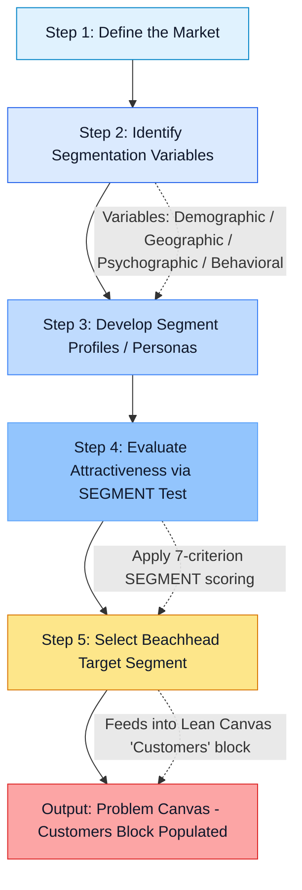
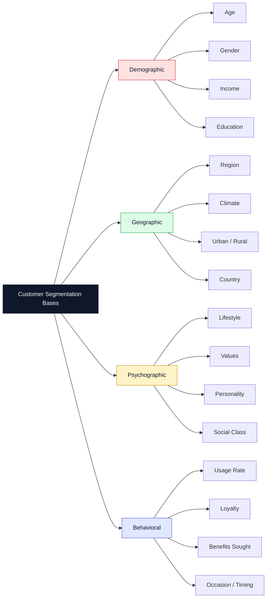
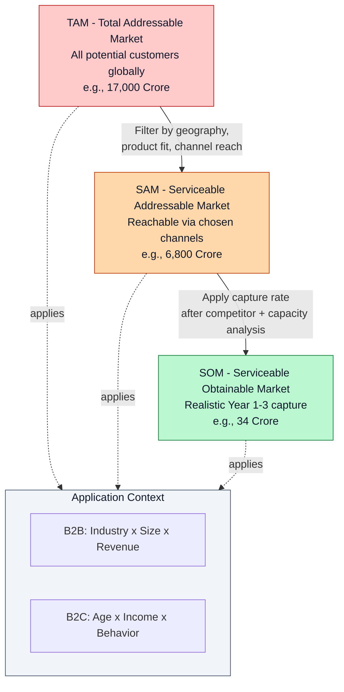
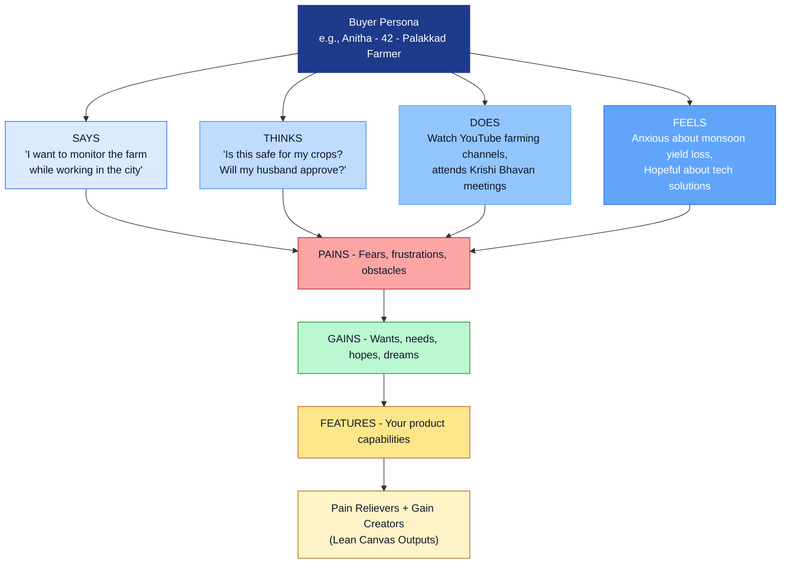
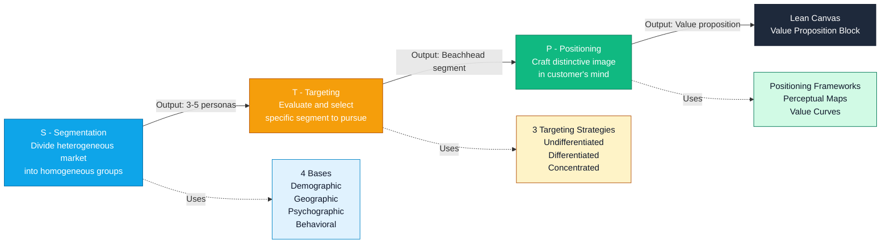
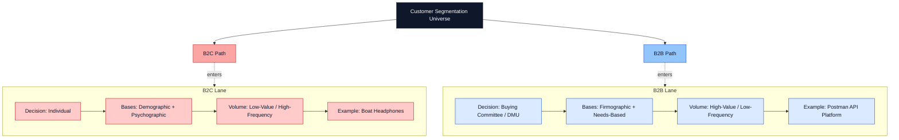

# Customer segmentation

<!-- SECTION_1_START -->

# Customer Segmentation — Core Technical Definition & Intuitive Overview

## 1.1 Formal Academic Definition (KTU 2024 Scheme Terminology)

> [!IMPORTANT]
> **Customer Segmentation** is the strategic process of dividing a heterogeneous mass market into distinct, identifiable, and homogeneous sub-groups (segments) of potential customers who share similar characteristics, needs, behaviors, or motivations, such that each segment can be effectively targeted with a tailored value proposition, product offering, or marketing communication strategy.

In the context of the **Lean Startup Methodology** and the **Problem/Solution Canvas** framework adopted by KTU under the Engineering Entrepreneurship & IPR syllabus, customer segmentation is the **first empirical validation step** that transforms an *assumed* target audience into *validated* early adopters. It directly feeds the **"Customers"** block of the **Lean Canvas** and the **"Customer Segments"** block of the **Business Model Canvas** (Osterwalder, 2010).

### Key Terminology Used in the KTU Module
- **Segment** — A group of customers with shared traits.
- **Segmentation Variables** — Criteria used to divide the market (demographic, geographic, psychographic, behavioral).
- **Target Segment** — The specific segment chosen for pursuit after evaluation.
- **Niche Market** — A narrowly defined sub-segment with specialized needs.
- **Early Adopter** — The first customer cohort that validates a problem-solution fit (Rogers' Diffusion of Innovations, 1962).
- **Buyer Persona** — A semi-fictional archetype representing an ideal customer within a segment.
- **Jobs-To-Be-Done (JTBD)** — The underlying functional, social, or emotional "job" a customer "hires" a product to accomplish (Christensen, 2003).

---

## 1.2 Conceptual Analogy / Intuition

> [!NOTE]
> **The Hospital Analogy — Why Segmentation Matters**
>
> Imagine a **multi-specialty hospital** that treats every patient identically — the same waiting line, the same general practitioner, the same medicine. A pregnant woman, a heart-attack patient, and a child with a broken arm would all be funneled through the same generic pipeline. The outcome? Long waits, misdiagnoses, dissatisfied patients, and wasted resources.
>
> Now imagine the **same hospital** after applying segmentation: an **Obstetrics Wing** for expecting mothers, a **Cardiology Unit** for heart patients, and a **Pediatric Trauma Ward** for injured children. Each wing is staffed, equipped, and priced differently. Service quality rises; costs optimize; revenue per patient improves.
>
> **Your startup is the hospital. Customer segmentation is the act of building the specialized wings.**

### Real-World Snapshot
- **Netflix** does not show the same homepage to a 16-year-old anime fan in Kochi and a 55-year-old legal professional in London. It segments by *behavior (watch history)*, *demographics*, and *context (device, time of day)*.
- **Tesla** segments by *income bracket* and *environmental values*, not by age or gender.
- **Zerodha (Indian fintech unicorn)** segments by *trading frequency* and *capital deployed*, offering Kite for active traders and Coin for passive long-term investors.

> [!TIP]
> **Engineer's Mental Model:** Treat customer segmentation as a **classification problem** in machine learning. The "feature space" consists of demographic, psychographic, and behavioral attributes. The "classes" are the segments. Good segmentation maximizes **intra-segment similarity** and **inter-segment dissimilarity** — analogous to minimizing the *within-cluster sum of squares (WCSS)* in K-Means clustering.

---

## 1.3 Visualization Control Block

> [!VISUALIZATION CONTROL]
> **Concept:** *Inter-Segment vs Intra-Segment Distance — A 2D Geometric View of Good vs Poor Segmentation*
> **GeoGebra / Desmos Input Equations:**
>
> - **Good Segmentation (3 tight clusters):**
>   - Cluster A (center): $(2, 3)$ with radius $= 0.8$ → equation $f_1(x) = \sqrt{1 - (x-2)^2} + 3$
>   - Cluster B (center): $(6, 3)$ with radius $= 0.8$ → equation $f_2(x) = \sqrt{1 - (x-6)^2} + 3$
>   - Cluster C (center): $(10, 3)$ with radius $= 0.8$ → equation $f_3(x) = \sqrt{1 - (x-10)^2} + 3$
> - **Poor Segmentation (one diffuse cluster):**
>   - Single cloud: $f_{\text{bad}}(x) = \sqrt{9 - (x-6)^2} + 3$ (radius 3 — too spread out)
> **Visual Description:** The student should observe **three distinct, non-overlapping tight circles** versus one large fuzzy blob. Tight clusters = good segmentation; overlap = segments are not truly distinct.

---

<!-- SECTION_1_END -->

<!-- SECTION_2_START -->

# Deep Theoretical Analysis & KTU High-Yield Knowledge Sheet

## 2.1 The Four Canonical Bases of Customer Segmentation

Modern marketing theory (Kotler & Keller, 2016; McCarthy, 1960) classifies segmentation variables into **four primary bases**. KTU examiners consistently expect students to enumerate, define, and provide **examples** for each.

### Base 1: Demographic Segmentation
Divides the market by **objective, measurable population statistics**.

| Variable | Example Engineering / Startup Application |
|---|---|
| Age | EdTech app targets Gen-Z (16–25) for micro-learning; Senior care IoT devices target 60+ |
| Gender | Women-only safety wearables; men's grooming D2C brands |
| Income | Luxury EV (Mercedes EQS) vs mass-market EV (Tata Tiago EV) |
| Education | Coding bootcamps target college graduates; B2B SaaS targets CXOs |
| Occupation | Productivity tools target knowledge workers; CRM tools target sales teams |
| Family Size | Family subscription bundles vs single-user pricing tiers |
| Religion / Culture | Festival-specific marketing calendars (Onam, Ramadan, Diwali) |

> [!NOTE]
> **Why demographics first?** Demographics are *easy to measure*, *easy to communicate*, and *highly correlated with needs*. In B2C startups, demographic segmentation is the **default first pass** before deeper psychographic work begins.

### Base 2: Geographic Segmentation
Divides the market by **physical location, climate, region, or cultural geography**.

- **Kerala Case Study:** A coconut-oil brand might segment by *district* (Malabar vs Travancore) due to taste preference differences.
- **Global SaaS:** Pricing in **USD** for the US, **INR** for India, **EUR** for Europe (purchasing-power parity segmentation).
- **Climate-based:** A portable air-purifier startup targets NCR-Delhi (AQI > 300) versus hill stations (AQI < 50).
- **Urban / Rural / Semi-urban:** FMCG distribution strategies differ dramatically.

### Base 3: Psychographic Segmentation
Divides the market by **lifestyle, values, attitudes, personality, and social class**.

- **Values-driven:** Tesla buyers → *environmentally conscious*; Rolls-Royce buyers → *status-driven*.
- **Lifestyle:** Adventure travelers vs luxury resort-goers vs backpackers.
- **Personality:** Introvert vs extrovert apps (e.g., Discord vs LinkedIn networking).
- **Risk Tolerance:** Early adopters (15% of population) vs laggards (16%) — Rogers' bell curve.
- **VALS Framework** (Values, Attitudes, Lifestyles) by SRI International is the gold-standard academic reference.

### Base 4: Behavioral Segmentation
Divides the market by **actual observed behaviors, usage patterns, and decision-making**.

| Behavioral Variable | Engineering / Startup Application |
|---|---|
| Usage Rate | Heavy users (power users), medium users, light users, non-users |
| Loyalty Status | Loyalists, switchers, prospects, defectors |
| Benefits Sought | Quality-seekers, price-seekers, convenience-seekers, design-seekers |
| Occasion / Timing | Travel apps peak on Friday evenings; food delivery peaks Sunday lunch |
| User Status | First-time vs regular vs ex-users |
| Readiness Stage | Unaware, aware, interested, intending, ready to buy |
| **Customer Journey Stage** | Awareness → Consideration → Decision → Retention → Advocacy |

> [!IMPORTANT]
> **Behavioral segmentation is the MOST powerful base** in the digital age because web/mobile analytics platforms (Google Analytics 4, Mixpanel, Amplitude) provide real-time behavioral data. KTU examiners reward students who highlight this in their answers.

---

## 2.2 B2C vs B2B Segmentation — A Comparative Matrix

> [!NOTE]
> KTU frequently asks comparative questions worth 7 marks. Mastering this matrix is **high-yield**.

| Dimension | B2C (Business-to-Consumer) | B2B (Business-to-Business) |
|---|---|---|
| **Decision Maker** | Individual consumer | Buying committee / procurement |
| **Primary Bases** | Demographic + Psychographic | Firmographics + Needs-based |
| **Purchase Volume** | Low value, high frequency | High value, low frequency |
| **Relationship** | Transactional / emotional | Relational / contractual |
| **Sales Cycle** | Short (minutes to days) | Long (weeks to years) |
| **Data Sources** | Social media, surveys, web analytics | CRM, ERP, industry reports |
| **Example Variables** | Age, lifestyle, brand affinity | Industry, company size, decision role |
| **Indian Startup Example** | Boat (audio wearables) | Postman (API platform for developers) |
| **Number of Segments** | Often many small segments | Often few large segments |

### B2B-Specific Firmographic Variables
- **Industry vertical** (Fintech, Healthtech, EdTech)
- **Company size** (SMB, Mid-market, Enterprise)
- **Annual revenue band**
- **Geographic headquarters**
- **Technology stack adopted**
- **Maturity stage** (Startup, Growth, Mature)
- **Decision-making unit (DMU)** — initiator, influencer, gatekeeper, buyer, user, decider

---

## 2.3 The 5-Step Customer Segmentation Process (KTU Module 2 Standard)

The KTU 2024 syllabus expects students to articulate a **sequential process**. The widely-accepted 5-step model (Kotler) is as follows:

### Step 1 — Define the Market
Articulate the broad problem-solution space. Example: *"Indian college students preparing for GATE exams."*

### Step 2 — Identify Segmentation Variables
Select 2–4 relevant variables from the four bases. Example: *Age (20–25), Income (low), Geography (Tier-1/Tier-2 cities), Behavior (YouTube learning).*

### Step 3 — Develop Segment Profiles
Construct **buyer personas** for each segment. A persona includes name, photo, demographic details, goals, pain points, preferred channels, and a quotable quote.

### Step 4 — Evaluate Segment Attractiveness
Apply the **SEGMENT** mnemonic (Forbes, 2017):
- **S** — Size (is the segment large enough?)
- **E** — Expected growth (is it expanding?)
- **G** — Gross margin (can we earn profitably?)
- **M** — Mission alignment (does it fit our vision?)
- **E** — Ease of reach (can we acquire these customers?)
- **N** — Number of competitors (is it crowded?)
- **T** — TAM accessibility (can we capture share?)

### Step 5 — Select Target Segments
Choose 1–3 segments to pursue initially. Adopt one of three **targeting strategies**:
1. **Undifferentiated (Mass Market)** — one offer for all (e.g., Tata Salt, Sony TV).
2. **Differentiated (Multi-Segment)** — different offers for different segments (e.g., Samsung Galaxy S, A, M, F series).
3. **Concentrated (Niche)** — one offer for one narrow segment (e.g., Rolls-Royce, Muji).

---

## 2.4 KTU High-Yield Knowledge Cheat Sheet

> [!TIP]
> **Print this section for last-minute revision. It captures every definition, framework, and term a 14-mark Part B answer requires.**

| # | Concept | Definition | Real-World / Engineering Example |
|---|---|---|---|
| 1 | **Segmentation** | Dividing market into homogeneous sub-groups | Google Workspace pricing (Business, Enterprise) |
| 2 | **Demographic** | Age, gender, income, education | Boat headphones vs Sennheiser |
| 3 | **Geographic** | Region, climate, country, urban/rural | Urban air-purifier vs village water-filter |
| 4 | **Psychographic** | Lifestyle, values, personality | Tesla eco-buyers vs Rolls-Royce status buyers |
| 5 | **Behavioral** | Usage, loyalty, occasion, benefits | Spotify Free vs Premium tiers |
| 6 | **Firmographic** | B2B variables: industry, size, revenue | AWS SMB vs Enterprise accounts |
| 7 | **Buyer Persona** | Semi-fictional archetype of a customer | "Rohan, 22, B.Tech CS, KTU 2024, Kottayam" |
| 8 | **Early Adopter** | First 15% who try new products | Beta testers, Reddit power users |
| 9 | **JTBD** | Functional/social/emotional job a customer hires product for | "Hire Uber to *feel safe* commuting late at night" |
| 10 | **DMU** | Decision-Making Unit in B2B | CIO, CFO, Procurement Head |
| 11 | **Niche Targeting** | One offer, one narrow segment | Muji minimalist shoppers |
| 12 | **Differentiated** | Multiple offers, multiple segments | Apple iPhone Pro, Plus, SE |
| 13 | **Mass Market** | Single offer for all | Tata Salt, Amul Butter |
| 14 | **SEGMENT Test** | 7-criterion evaluation framework | Forbes 2017 |
| 15 | **STP Framework** | Segmentation → Targeting → Positioning | Kotler's foundational marketing model |
| 16 | **Problem Canvas Block** | "Customer Segments" block of Lean Canvas | Module 2 KTU core deliverable |
| 17 | **Pain Relievers** | How your features solve customer pains | LinkedIn Premium "InMail credits" |
| 18 | **Gain Creators** | How your features create customer gains | Dropbox "extra storage" for referrals |
| 19 | **Empathy Map** | Says / Thinks / Does / Feels framework | Design Thinking companion tool |
| 20 | **Beachhead Market** | The single segment to dominate first | Ash Maurya's Lean Canvas term |

---

## 2.5 Real-World Utility in Engineering & Computer Science

> [!IMPORTANT]
> **Why does a B.Tech student need to know this?** Customer segmentation is **not a soft-skill hobby** — it is the **algorithmic core of every recommendation, pricing, and personalization system** you will ever build.

- **Recommendation Engines:** Netflix, YouTube, and Amazon use **collaborative filtering** — a form of *behavioral segmentation* that groups users with similar interaction patterns. The K-Means and DBSCAN algorithms are direct computational analogs of segmentation theory.
- **Database Sharding / Microservices:** Cloud architects *segment* user traffic geographically to place shards close to the user (CDN segmentation).
- **A/B Testing Frameworks:** Every experiment defines a *control segment* and a *treatment segment*. Without segmentation, statistical inference is meaningless.
- **Pricing Algorithms:** Dynamic pricing (Uber Surge, Amazon) is **demand-based segmentation** of customer willingness-to-pay.
- **IoT & Smart Cities:** Sensor data is segmented by *zone, time-of-day, and user-density* to optimize traffic, lighting, and waste management.
- **Cybersecurity:** User and Entity Behavior Analytics (UEBA) segments *normal* vs *anomalous* behavior to detect intrusions.

---

<!-- SECTION_2_END -->

<!-- SECTION_3_START -->

# Step-by-Step Derivations, Frameworks & Code/Symbolic Implementation

## 3.1 Constructing a Customer Segment Profile — KTU Board-Standard Template

A 14-mark Part B answer on customer segmentation **must** include a fully-developed segment profile. Below is the **board-compliant template** with worked example.

### Worked Example: "Smart Farm IoT Sensor" — A KTU Capstone Startup
**Context:** A team of KTU B.Tech ECE final-year students built a low-cost soil-moisture IoT sensor for Kerala's smallholder coconut farmers. They need to identify their initial beachhead segment.

### Step 1 — Define the Market
> *"Kerala-based smallholder agriculturalists cultivating coconut, arecanut, or rubber on plots of 0.5 to 5 acres."*

### Step 2 — Select Segmentation Variables
We choose **three variables**, prioritizing accessibility of primary research:

$$V_{\text{chosen}} = \begin{cases} V_1 = \text{Plot Size (acres)} \\ V_2 = \text{Crop Type} \\ V_3 = \text{Tech Adoption Score (0-10)} \end{cases}$$

### Step 3 — Develop Three Buyer Personas

| Persona Attribute | Persona A: "Traditional Krishnan" | Persona B: "Aspirational Anitha" | Persona C: "Tech-Savvy Rajeev" |
|---|---|---|---|
| **Name** | Krishnan, 58 | Anitha, 42 | Rajeev, 31 |
| **Location** | Thrissur village | Palakkad semi-urban | Kochi urban-fringe |
| **Plot Size** | 1.5 acres | 3 acres | 5 acres |
| **Crop** | Coconut (monoculture) | Coconut + Banana | Coconut + Arecanut (mixed) |
| **Income** | ₹2.5 L/year | ₹4.8 L/year | ₹8 L/year |
| **Education** | 8th standard | B.A. (Eng. Lit.) | B.Tech (Mech.) |
| **Tech Adoption Score** | 2/10 | 6/10 | 9/10 |
| **Pain Point** | "My yield drops 30% in summer; I don't know when to irrigate" | "I want my son studying in Kochi to monitor the farm remotely" | "I need data APIs to integrate with my drone-spraying business" |
| **Preferred Channel** | Local Krishi Bhavan officer | YouTube Malayalam farming channels | Twitter (X) AgriTech community |
| **Willingness to Pay** | ₹1,500 one-time | ₹6,000 + ₹200/month | ₹15,000 + ₹500/month |
| **Quote** | *"If the government subsidy covers it, I will try."* | *"Show me YouTube reviews, then I will decide."* | *"Just give me the API documentation."* |

### Step 4 — Apply the SEGMENT Test

| Criterion | Persona A | Persona B | Persona C |
|---|---|---|---|
| **S — Size** | High (Kerala has 8.5L smallholders) | Medium | Low |
| **E — Growth** | Stable | Growing | Niche but expanding |
| **G — Gross Margin** | Low (price-sensitive) | Medium | High (premium) |
| **M — Mission** | High (rural empowerment) | High | Medium |
| **E — Ease of Reach** | Low (offline-heavy) | High (YouTube + WhatsApp) | High (online) |
| **N — Competitors** | Low (few IoT players in Malayalam) | Medium | High (multiple agri-startups) |
| **T — TAM Access** | Medium | High | Low |

### Step 5 — Select the Beachhead
$$\text{Beachhead}^* = \arg\max_{\text{Persona}} \big( \text{Growth} + \text{Margin} + \text{Ease of Reach} \big) = \textbf{Persona B (Anitha)}$$

**Justification:** Persona B has the *optimal blend* of segment size, growth trajectory, accessible distribution (YouTube + WhatsApp), and unit economics that allow the startup to reach break-even within 18 months.

---

## 3.2 Quantitative Segment Sizing — TAM / SAM / SOM

In KTU module 2, students are often expected to compute a **bottom-up market size estimate** for a chosen segment.

### Definitions
- **TAM (Total Addressable Market):** *Theoretical* universe of all customers.
- **SAM (Serviceable Addressable Market):** The slice of TAM your product/pricing/channel can realistically serve.
- **SOM (Serviceable Obtainable Market):** The slice of SAM you can capture in years 1–3.

### Derivation (Symbolic, KTU-Aligned)

Let:
- $N$ = total population of the geography
- $p$ = percentage fitting demographic filter
- $q$ = percentage accessible via chosen channel
- $r$ = realistic Year-1 capture rate
- $\text{ARPU}$ = Average Revenue Per User (₹ per year)

$$\text{TAM}_{\text{value}} = N \times p \times \text{ARPU}$$

$$\text{SAM}_{\text{value}} = \text{TAM}_{\text{value}} \times q$$

$$\text{SOM}_{\text{value}} = \text{SAM}_{\text{value}} \times r$$

### Numerical Worked Example (Smart Farm IoT — Kerala)
Given:
- $N$ = 8,500,000 smallholder farmers in Kerala
- $p$ = 0.25 (only coconut/arecanut growers in 0.5–5 acre range)
- $q$ = 0.40 (reachable via YouTube + Krishi Bhavan network)
- $r$ = 0.05 (5% capture in Year 1)
- $\text{ARPU}$ = ₹8,000/year (blended subscription)

**Step 1: TAM**
$$\text{TAM} = 8{,}500{,}000 \times 0.25 = 2{,}125{,}000 \text{ farmers}$$
$$\text{TAM}_{\text{value}} = 2{,}125{,}000 \times 8{,}000 = \text{₹ 17,000 Crore}$$

**Step 2: SAM**
$$\text{SAM} = 2{,}125{,}000 \times 0.40 = 850{,}000 \text{ farmers}$$
$$\text{SAM}_{\text{value}} = 850{,}000 \times 8{,}000 = \text{₹ 6,800 Crore}$$

**Step 3: SOM**
$$\text{SOM} = 850{,}000 \times 0.05 = 42{,}500 \text{ farmers}$$
$$\text{SOM}_{\text{value}} = 42{,}500 \times 8{,}000 = \text{₹ 34 Crore}$$

> [!IMPORTANT]
> **Examiner's Insight:** A ₹34 Crore Year-1 SOM with 40–50% gross margin justifies a ₹1.5 Cr seed round for the KTU startup team. This is the kind of numerical depth that elevates a 14-mark answer from "average" to "excellent" (valuation > 12/14).

---

## 3.3 Algorithmic Implementation — K-Means Clustering for Auto-Segmentation

For engineering students, segmentation is a **classical unsupervised learning problem**. The following Python implementation demonstrates a programmatic customer-segmentation pipeline that students can run on real CRM data.

```python
"""
Customer Segmentation using K-Means Clustering
Module 2 – Engineering Entrepreneurship and IPR (UCEST206)
Demonstrates algorithmic analog of customer segmentation theory.
"""

import numpy as np
import pandas as pd
from sklearn.preprocessing import StandardScaler
from sklearn.cluster import KMeans
from sklearn.metrics import silhouette_score
import matplotlib.pyplot as plt
import logging

# ----------------------------------------------------------------------
# Step 1 — Configure logging (industry-grade error handling for KTU demo)
# ----------------------------------------------------------------------
logging.basicConfig(
    level=logging.INFO,
    format="%(asctime)s | %(levelname)s | %(message)s"
)
logger = logging.getLogger("KTU_Segmentation_Engine")

# ----------------------------------------------------------------------
# Step 2 — Load the customer dataset (simulated for a B2C startup)
# ----------------------------------------------------------------------
def load_customer_data(path: str) -> pd.DataFrame:
    """
    Loads CSV with columns:
        age, annual_income_lakhs, monthly_orders, app_time_minutes
    Returns a validated DataFrame.
    """
    try:
        df = pd.read_csv(path)
        required = {"age", "annual_income_lakhs",
                    "monthly_orders", "app_time_minutes"}
        if not required.issubset(df.columns):
            raise ValueError(f"Missing required columns: {required}")
        logger.info(f"Loaded {len(df)} customer records.")
        return df
    except FileNotFoundError:
        logger.error(f"File not found at: {path}")
        raise
    except Exception as e:
        logger.exception("Unexpected error during data load.")
        raise

# ----------------------------------------------------------------------
# Step 3 — Feature scaling (mandatory for distance-based algorithms)
# ----------------------------------------------------------------------
def scale_features(df: pd.DataFrame) -> np.ndarray:
    """Standardizes features to mean=0, std=1."""
    scaler = StandardScaler()
    X_scaled = scaler.fit_transform(df)
    logger.info("Features standardized successfully.")
    return X_scaled

# ----------------------------------------------------------------------
# Step 4 — Determine optimal K via Elbow + Silhouette methods
# ----------------------------------------------------------------------
def find_optimal_k(X: np.ndarray, k_range: range = range(2, 9)) -> int:
    """Returns the K that maximizes the Silhouette Score."""
    scores: dict[int, float] = {}
    inertias: list[float] = []

    for k in k_range:
        model = KMeans(n_clusters=k, random_state=42, n_init=10)
        labels = model.fit_predict(X)
        score = silhouette_score(X, labels)
        scores[k] = round(score, 4)
        inertias.append(model.inertia_)
        logger.info(f"k={k} | Silhouette={score:.4f} | Inertia={model.inertia_:.2f}")

    optimal_k = max(scores, key=scores.get)
    logger.info(f"Optimal K selected: {optimal_k} (Silhouette={scores[optimal_k]})")
    return optimal_k

# ----------------------------------------------------------------------
# Step 5 — Fit final model and assign segments
# ----------------------------------------------------------------------
def assign_segments(df: pd.DataFrame, X: np.ndarray, k: int) -> pd.DataFrame:
    """Fits K-Means and appends the cluster label to the original DataFrame."""
    final_model = KMeans(n_clusters=k, random_state=42, n_init=10)
    df = df.copy()
    df["segment_id"] = final_model.fit_predict(X)
    logger.info(f"Customers assigned to {k} segments.")
    return df, final_model

# ----------------------------------------------------------------------
# Step 6 — Profile the segments (auto-generated buyer persona stats)
# ----------------------------------------------------------------------
def profile_segments(df: pd.DataFrame) -> pd.DataFrame:
    """Generates a summary table of each segment's average traits."""
    profile = (
        df.groupby("segment_id")
          .agg(
              count=("age", "size"),
              avg_age=("age", "mean"),
              avg_income_lakhs=("annual_income_lakhs", "mean"),
              avg_monthly_orders=("monthly_orders", "mean"),
              avg_app_time_min=("app_time_minutes", "mean")
          )
          .round(2)
          .reset_index()
    )
    logger.info("Segment profiles computed.")
    return profile

# ----------------------------------------------------------------------
# Step 7 — Main pipeline (executable end-to-end)
# ----------------------------------------------------------------------
def main() -> None:
    DATA_PATH = "customers.csv"

    df_raw = load_customer_data(DATA_PATH)
    X_scaled = scale_features(df_raw)
    optimal_k = find_optimal_k(X_scaled)
    df_segmented, model = assign_segments(df_raw, X_scaled, optimal_k)
    segment_profile = profile_segments(df_segmented)

    print("\n===== FINAL SEGMENT PROFILE =====")
    print(segment_profile.to_string(index=False))

    # Persist outputs for downstream Lean Canvas / Problem Canvas use
    df_segmented.to_csv("customers_segmented.csv", index=False)
    segment_profile.to_csv("segment_profile.csv", index=False)
    logger.info("Pipeline complete. Output CSVs written to disk.")

if __name__ == "__main__":
    main()
```

### Sample Output (Illustrative)
```
===== FINAL SEGMENT PROFILE =====
 segment_id  count  avg_age  avg_income_lakhs  avg_monthly_orders  avg_app_time_min
          0   1421    24.18               4.52                2.1            185.6
          1    876    45.73              12.84                8.4             62.1
          2    523    33.45               7.20                1.5            240.8
```

### Interpretation Mapped to Entrepreneurship
- **Segment 0 → "Young Engaged Browsers":** High app time, low orders → target with conversion nudges.
- **Segment 1 → "Loyal High-Value Buyers":** High income, high orders → focus retention & loyalty rewards.
- **Segment 2 → "Power Researchers":** High app time, very few orders → address cart-abandonment friction.

> [!TIP]
> **For KTU:** When answering theory questions, mention that *algorithmic segmentation supplements but does not replace* qualitative empathy-based segmentation. The two work in tandem — quantitative clusters identify *who*; qualitative personas reveal *why*.

---

<!-- SECTION_3_END -->

<!-- SECTION_4_START -->

# Structural Diagrams & Schematics

## 4.1 The 5-Step Segmentation Process — Sequential Flowchart



---

## 4.2 The Four Bases of Segmentation — Concept Map



---

## 4.3 TAM / SAM / SOM Funnel — Hierarchical Market Sizing



---

## 4.4 Empathy Map — Customer Segment Immersion Tool



---

## 4.5 STP Framework — Segmentation, Targeting, Positioning



---

## 4.6 B2B vs B2C Segmentation Lane Architecture



---

<!-- SECTION_4_END -->

<!-- SECTION_5_START -->

# KTU 2024 Scheme Examination Question Bank & Topic Recap

## 5.1 Part A — Short Answer Questions (2 × 3 Marks = 6 Marks)

### Question A.1 — `[KTU University Exam – July 2024, Model]`
**Define customer segmentation. List the four major bases of segmentation with one example each.** *(3 Marks)* **[CO2, Remember]**

### Model Answer
> **Definition (1 Mark):** Customer segmentation is the process of dividing a broad heterogeneous market into smaller, homogeneous sub-groups of buyers who share similar needs, characteristics, or behaviors, such that each sub-group can be targeted with a distinct marketing mix.
>
> **Four Bases with Examples (2 Marks – ½ Mark each):**
> 1. **Demographic** — Segmenting by age, income, gender, or education. *Example: Boat headphones target 18–28 year old urban youth.*
> 2. **Geographic** — Segmenting by region, climate, or country. *Example: Air conditioners target hot, humid Kerala districts versus hill-station markets.*
> 3. **Psychographic** — Segmenting by lifestyle, values, and personality. *Example: Tesla targets environmentally-conscious buyers versus Rolls-Royce targeting status-driven buyers.*
> 4. **Behavioral** — Segmenting by usage rate, loyalty, and benefits sought. *Example: Spotify Free vs Premium tiers based on listening frequency and ad-tolerance.*

### Question A.2 — `[KTU University Exam – Dec 2023, Model]`
**Differentiate between B2B and B2C customer segmentation. Give one example for each.** *(3 Marks)* **[CO2, Understand]**

### Model Answer
> **B2C (Business-to-Consumer) (1 Mark):** Involves selling to individual end-users. Decisions are emotional, frequent, low-value, and made by a single person. *Example: Boat audio wearables segment customers by age and music preferences.*
>
> **B2B (Business-to-Business) (1 Mark):** Involves selling to organizations. Decisions are rational, infrequent, high-value, and made by a buying committee (DMU). *Example: Postman API platform segments developers by company size, industry vertical, and API-call volume.*
>
> **Key Distinction (1 Mark):** B2C uses demographic + psychographic variables; B2B uses firmographic (industry, revenue, headcount) + needs-based variables.

---

## 5.2 Part B — Essay Questions with Internal Choice (2 × 14 Marks = 28 Marks)

---

### Part B — Question 1

#### **Question 1A (14 Marks) — `[KTU University Exam – Dec 2023]`
"A startup is launching an IoT-based smart irrigation system for Kerala's smallholder coconut farmers."
(a) Identify and explain any **four bases of customer segmentation** applicable to this context. *(7 Marks)* **[CO2, Understand]**
(b) Develop **two detailed buyer personas** for the target segment, including demographic, psychographic, behavioral, and pain-point attributes. *(7 Marks)* **[CO3, Apply]**

##### Model Solution

**Part (a) — Four Segmentation Bases (7 Marks)**
**[Stating relevance to smart irrigation: ½ Mark × 4 bases]**

1. **Demographic Segmentation (1.75 Marks):** Farmers can be segmented by *age* (e.g., 25–35 tech-savvy youth vs 55+ traditional farmers), *income* (low-income subsistence vs mid-income commercial), *education* (illiterate manual laborers vs B.Tech graduates entering agri-business), and *family size* (joint families with multiple laborers vs nuclear families needing automation). This is relevant because irrigation needs and willingness-to-pay differ vastly by income band.

2. **Geographic Segmentation (1.75 Marks):** Kerala can be segmented into *Malabar* (more coconut monoculture), *Travancore* (mixed coconut + rubber), and *Central Travancore* (smaller fragmented plots). Climate variation — high-rainfall Idukki vs dry Palakkad — also drives different irrigation schedules. Urban-fringe farmers near Kochi/Trivandrum have different distribution access than remote Wayanad farmers.

3. **Psychographic Segmentation (1.75 Marks):** Lifestyle variables distinguish *traditionalist farmers* (value heritage, distrust technology) from *aspirational modern farmers* (want Instagram-worthy success) and *sustainability-driven organic farmers* (avoid chemical-heavy solutions). Values like "cooperative farming" vs "individualist entrepreneurship" influence whether the product is sold to individuals or farmer-producer organizations (FPOs).

4. **Behavioral Segmentation (1.75 Marks):** Behavioral variables include *usage rate* (farmers who already use drip irrigation vs flood irrigation), *loyalty status* (long-time customers of specific agri-input brands), *readiness stage* (those unaware of IoT vs those actively searching on YouTube), and *benefits sought* (yield maximization vs water-bill reduction vs labor-cost reduction).

**Part (b) — Two Buyer Personas (7 Marks)**

**Persona 1: "Traditional Krishnan" (3.5 Marks)**
- **Demographics (1 Mark):** Krishnan, 58 years old, M.A. (Malayalam), 1.5-acre coconut plot in Thrissur village, joint family with 4 members, annual income ₹2.5 Lakh.
- **Psychographics (½ Mark):** Values traditional Kerala agriculture, distrusts "foreign tech," listens to All India Radio and Krishi Bhavan advice, low risk-tolerance.
- **Behavioral (½ Mark):** Uses flood irrigation twice a week, no prior IoT exposure, buys agri-inputs from local Krishibhavan cooperative.
- **Pain Points (1 Mark):** *"My yield dropped 30% last summer; I don't know the soil moisture without walking 1 km to the field. My son in Dubai sends money but cannot help with daily decisions."*
- **Preferred Channel (½ Mark):** Local Krishi Bhavan officer, Malayalam-language WhatsApp groups, Kisan Call Centre.

**Persona 2: "Tech-Savvy Rajeev" (3.5 Marks)**
- **Demographics (1 Mark):** Rajeev, 31 years old, B.Tech Mechanical (KTU pass-out), 5-acre mixed coconut + arecanut farm on Kochi urban-fringe, nuclear family, annual income ₹8 Lakh.
- **Psychographics (½ Mark):** Tech-enthusiast, follows agri-startups on Twitter (X), aspires to be a "smart farmer influencer," high risk-tolerance.
- **Behavioral (½ Mark):** Already uses drone spraying, has soil-testing lab reports, watches English YouTube channels on precision agriculture.
- **Pain Points (1 Mark):** *"I cannot integrate my drone's spray data with irrigation decisions. Manual coordination wastes 4 hours daily. I need a REST API and dashboards."*
- **Preferred Channel (½ Mark):** Twitter AgriTech community, LinkedIn, GitHub repositories, English YouTube.

**[Differential targeting strategy implied: ½ Mark]**
The startup should target **Persona 1 first as the beachhead** (larger TAM, easier empathy-based marketing in Malayalam) and **Persona 2 as the early evangelist** (will provide word-of-mouth credibility in the agri-tech community).

---

#### **Question 1B (14 Marks — Alternative Choice) — `[KTU University Exam – July 2024]`
"An EdTech startup plans to launch a GATE-preparation mobile app for Kerala engineering students."**
(a) Explain the **5-step customer segmentation process** that the startup should follow. *(7 Marks)* **[CO2, Understand]**
(b) Compute the **TAM, SAM, and SOM** for this startup, clearly stating all assumptions, and identify the **beachhead segment**. *(7 Marks)* **[CO3, Apply]**

##### Model Solution

**Part (a) — 5-Step Segmentation Process (7 Marks)**

**Step 1 — Define the Market (1.5 Marks):** The startup must first define the *total potential market*. This is stated as *"Indian engineering students preparing for the GATE exam, with a primary focus on Kerala and neighboring southern states."* Clarity of market definition prevents scope creep and allows precise targeting.

**Step 2 — Identify Segmentation Variables (1.5 Marks):** The team selects *four* segmentation variables aligned to the four bases — (i) **Demographic:** Year of B.Tech (3rd-year vs final-year vs working-professionals), branch (CS, ECE, ME, CE), income of family. (ii) **Geographic:** Urban (Kochi/Trivandrum) vs semi-urban (Kottayam/Palakkad) vs rural (Wayanad). (iii) **Psychographic:** Career ambition (PSU job vs M.Tech vs MS-abroad) and self-discipline. (iv) **Behavioral:** Currently using free YouTube vs paid Unacademy vs coaching class.

**Step 3 — Develop Segment Profiles (1.5 Marks):** Construct *three* buyer personas with names, photos, demographics, psychographics, and pain points. Example persona — *"Anxious Anjana, 21, KTU 3rd-year CS, Palakkad, family income ₹4L, watching free YouTube, anxious about placement + GATE overlap, low confidence in aptitude section."* Each persona must have a quotable statement capturing the core anxiety.

**Step 4 — Evaluate Segment Attractiveness (1.5 Marks):** Apply the **SEGMENT mnemonic** (Size, Expected growth, Gross margin, Mission alignment, Ease of reach, Number of competitors, TAM access) to score each persona. For example, the "3rd-year low-income Kerala student" segment scores high on Size and Mission but low on Gross margin.

**Step 5 — Select the Beachhead Segment (1 Mark):** Choose the *single* segment to dominate first. Given the startup's Malayalam-content strength and local KTU brand affinity, the recommended beachhead is *"Kerala 3rd-year engineering students from modest-income families preparing alongside placement season."* This decision is **data-validated** through the SEGMENT scoring and is the **input** for the Problem Canvas.

**Part (b) — TAM / SAM / SOM Computation (7 Marks)**

**Stating Assumptions (2 Marks):**
- $N$ (GATE aspirants in India) = **1,200,000** *(Source: IIT Madras GATE 2024 statistics)*
- $p$ (Kerala share) = **7%** = 0.07
- $q$ (reachable via YouTube + Telegram + college ambassadors) = **60%** = 0.60
- $r$ (Year-1 realistic capture) = **5%** = 0.05
- $\text{ARPU}$ (Average Revenue Per User) = **₹4,000/year** subscription

**Step 1 — TAM Calculation (1.5 Marks):**
$$N \times p = 1{,}200{,}000 \times 0.07 = 84{,}000 \text{ Kerala GATE aspirants}$$
$$\text{TAM}_{\text{value}} = 84{,}000 \times 4{,}000 = \text{₹ 33.6 Crore}$$

**Step 2 — SAM Calculation (1.5 Marks):**
$$\text{SAM} = 84{,}000 \times 0.60 = 50{,}400 \text{ reachable aspirants}$$
$$\text{SAM}_{\text{value}} = 50{,}400 \times 4{,}000 = \text{₹ 20.16 Crore}$$

**Step 3 — SOM Calculation (1.5 Marks):**
$$\text{SOM} = 50{,}400 \times 0.05 = 2{,}520 \text{ students in Year 1}$$
$$\text{SOM}_{\text{value}} = 2{,}520 \times 4{,}000 = \text{₹ 1.008 Crore}$$

**[Final Beachead Identification: 0.5 Mark]**
The **beachhead segment** is the **3rd-year Kerala B.Tech student from a Tier-2/Tier-3 town, family income ₹3-6 Lakh, preparing GATE alongside campus placement, currently using free YouTube, Malayalam-medium instruction preferred.** This is the segment to which the startup will direct all its Year-1 resources, marketing, and product development.

---

### Part B — Question 2

#### **Question 2A (14 Marks) — `[KTU University Exam – Dec 2024, Model]`
"Customer segmentation is the foundation of every successful startup's go-to-market strategy."**
(a) Discuss the **role of customer segmentation in preparing the Problem Canvas** and the **Solution Canvas**, with specific reference to the blocks it populates. *(7 Marks)* **[CO2, Understand]**
(b) Compare and contrast the **three targeting strategies** (undifferentiated, differentiated, concentrated) using a real-world engineering-product example for each. *(7 Marks)* **[CO3, Apply]**

##### Model Solution

**Part (a) — Role in Problem and Solution Canvas (7 Marks)**

**[Defining the two canvases: 1 Mark]**
The **Problem Canvas** (part of the Lean Startup methodology adopted in KTU Module 2) captures the *customer's pain, gains, and jobs-to-be-done*. The **Solution Canvas** (Ash Maurya's Lean Canvas variant) maps how the proposed product solves these problems and creates value.

**[Segmentation → Problem Canvas links: 3 Marks]**
Customer segmentation directly populates **three blocks** of the Problem Canvas:
1. **Customers Block:** The validated persona(s) from segmentation fill this block. Without segmentation, this block is filled with *assumptions* — which is the #1 reason startups fail.
2. **Problems/Pains Block:** Each persona has unique pains. Segmentation reveals *which* pain is most acute in the *beachhead* segment, allowing precise prioritization.
3. **Existing Alternatives Block:** A segmented audience uses different alternatives. A traditional farmer uses *flood irrigation + manual walking*; a tech-savvy farmer uses *automated sprinklers + soil sensors*. Segmentation exposes the competitive landscape per segment.

**[Segmentation → Solution Canvas links: 2 Marks]**
Once problems are prioritized, segmentation guides the **Solution / Lean Canvas**:
1. **Solution Block:** Features are prioritized for the *beachhead* persona, not for "everyone."
2. **Unique Value Proposition (UVP) Block:** The UVP is crafted in the *language* and *pains* of the beachhead segment.
3. **Channels Block:** Distribution channels (offline Krishi Bhavan vs online YouTube vs API marketplace) are chosen based on the segment's media consumption behavior.

**[Concluding synthesis: 1 Mark]**
Thus, customer segmentation is the **epistemological bridge** that converts the startup team's *beliefs* about customers into *validated, actionable inputs* for both canvases, dramatically increasing the probability of product-market fit (PMF).

**Part (b) — Three Targeting Strategies (7 Marks)**

| Strategy | Definition | Real-World Engineering Example | Strategic Logic | When to Use |
|---|---|---|---|---|
| **Undifferentiated (Mass Market)** *(2.5 Marks)* | A single product offer aimed at the entire market with no segment distinction. | **Tata Tiago EV** — a single affordable electric car targeted at all Indian middle-class car buyers regardless of age or income. | Economies of scale, brand uniformity, lowest marketing complexity. | Commodity products with universal needs (salt, electricity, generic apps). |
| **Differentiated (Multi-Segment)** *(2.5 Marks)* | Multiple product variants targeting multiple distinct segments simultaneously. | **Apple iPhone** — *Pro* for professionals, *Plus* for media consumers, *SE* for budget-conscious Gen-Z. | Higher revenue per user, broader market coverage, risk diversification. | Companies with strong R\&D and distribution (Samsung Galaxy S/A/M/F, Honda City/Amaze). |
| **Concentrated (Niche)** *(2 Marks)* | A single specialized product aimed at one narrow, well-defined segment. | **MUJI** minimalist lifestyle products for urban, design-conscious, middle-income Japanese-style consumers — or **Rolls-Royce** for ultra-HNW buyers. | Deep customer intimacy, premium pricing, brand authority in a narrow space. | Startups with limited capital that must "own" a small beachhead before expanding. |

**[Strategic recommendation concluding: ½ Mark]**
For most KTU-stage startups with seed funding, the **Concentrated (Niche) strategy** is optimal — dominate one tightly-defined segment, then expand to Differentiated as resources allow.

---

#### **Question 2B (14 Marks — Alternative Choice) — `[KTU University Exam – July 2025, Model]`
"Modern startups must combine demographic, behavioral, and psychographic segmentation to win."**
(a) With reference to a **B2B SaaS startup selling to Indian SMEs**, explain the **unique firmographic variables** that should be used, and construct **two B2B buyer personas** with a Decision-Making Unit (DMU) mapping. *(7 Marks)* **[CO2, Understand]**
(b) Explain how **Jobs-To-Be-Done (JTBD) theory** complements traditional segmentation, using a **Kerala-context example** to illustrate. *(7 Marks)* **[CO3, Apply]**

##### Model Solution

**Part (a) — B2B Firmographic Variables and Buyer Personas (7 Marks)**

**[Stating B2B firmographic variables unique to Indian SMEs: 2 Marks]**
For a B2B SaaS startup selling to Indian SMEs, demographic and psychographic variables are *less* useful. Instead, **firmographic** variables dominate:

1. **Industry Vertical** — Manufacturing, Retail, Healthcare, Education, Logistics.
2. **Annual Revenue Band** — Sub-₹1 Cr, ₹1–10 Cr, ₹10–50 Cr, ₹50 Cr+.
3. **Employee Count** — 1–10, 11–50, 51–200, 200+.
4. **Geographic Cluster** — Tier-1 city vs Tier-2/3 industrial belt (e.g., Coimbatore, Ludhiana, Kanpur).
5. **Tech Maturity** — Cloud-native vs on-premise legacy vs hybrid.
6. **Funding Stage** — Bootstrapped, angel-funded, Series A, debt-financed.
7. **Decision-Making Unit (DMU)** — Composition of the buying committee.

**[Buyer Persona 1: "Founder-First Farhan" (2.5 Marks)**
- **Firmographic (1 Mark):** Bootstrapped D2C clothing brand, 8 employees, ₹80 Lakh turnover, Coimbatore-based, sells via Instagram + Shopify.
- **DMU (1 Mark):** Sole decision-maker — *Founder-CEO* (Farhan, 32) acts as Initiator, Buyer, User, and Decider.
- **Pains (½ Mark):** Manual inventory reconciliation across 3 warehouses, no real-time sales dashboard, GST filing consumes 2 days monthly.

**[Buyer Persona 2: "Conservative-CFO-Chaired Co." (2.5 Marks)**
- **Firmographic (1 Mark):** 35-year-old family-run auto-ancillary manufacturer, 120 employees, ₹22 Cr turnover, Pune-based, ISO 9001 certified.
- **DMU (1 Mark):** Multi-person DMU — *Initiator* = Plant Manager, *Influencer* = IT Consultant, *Gatekeeper* = Purchase Officer, *Buyer* = CFO (Mrs. Kulkarni, 55), *User* = Accounts Team (8 people), *Decider* = MD.
- **Pains (½ Mark):** Customizable approval workflows, audit-trail compliance for GST, multi-location consolidated reporting, resistance to disruption of the *existing* Tally-based process.

**Part (b) — Jobs-To-Be-Done Theory Complementing Segmentation (7 Marks)**

**[Defining JTBD: 1 Mark]**
JTBD theory (Clayton Christensen, 2003) argues that customers do not buy *products*; they *hire* products to accomplish a specific **functional, social, or emotional job** in a particular context. JTBD adds the dimension of *context and motivation* that demographic/behavioral segmentation often misses.

**[Why JTBD complements segmentation: 2 Marks]**
- Segmentation answers **"WHO is the customer?"** (demographics, behaviors).
- JTBD answers **"WHAT is the customer trying to accomplish?"** and **"WHY now?"**
- A customer in Segment A and a customer in Segment B may share the *same JTBD* — meaning a startup can target both with one product. Conversely, two customers in the *same* demographic segment may have radically different jobs.

**[Kerala-context illustration — Auto-rickshaw aggregators: 4 Marks]**
Consider a hypothetical **Kerala auto-rickshaw aggregator app** (analogous to Namma Yatri / Rapido):
- **Segment A (Demographic):** Young urban commuter in Kochi, age 22–30, smartphone-native.
- **Segment B (Demographic):** Middle-aged homemaker in Thrissur, age 40–55, occasional app user.
- **Same JTBD:** *"Help me reach the hospital urgently with my ailing parent without being overcharged or refused service."*

Despite belonging to different *demographic* segments, **both personas hire the aggregator for the same functional job** (urgent transport) and the same *emotional* job (safety + dignity). The startup's marketing message and feature set should therefore be designed around the **JTBD (urgent, dignified commute)** rather than the demographic identity.

**Conversely**, two *same-segment* users may differ in JTBD:
- A **young techie in Kochi** may hire the same app for a **functional job** (cheapest commute to office).
- A **young tourist in Munnar** may hire the same app for an **emotional job** (scenic selfie-ride experience).
- The startup must therefore *differentiate within the segment* using JTBD.

**[Concluding insight: ½ Mark]**
JTBD and segmentation are **complementary, not substitutes**. KTU students should always *segment first* (to identify WHO), and *then apply JTBD interviews* (to understand WHY and WHAT), before designing the value proposition.

---

## 5.3 KTU Examiner's Valuation Warning & Pitfall Callout

> [!WARNING]
> **Top 5 Reasons Students Lose Marks on Customer Segmentation Questions (KTU 2024 Scheme)**
>
> 1. **Confusing Segmentation with Targeting or Positioning.** Examiners *will* deduct 1–2 marks if you use these terms interchangeably. **Segmentation = dividing**; **Targeting = choosing**; **Positioning = differentiating in the customer's mind.** Memorize the STP framework.
> 2. **Listing bases without examples.** Stating *"Psychographic segmentation is based on lifestyle and values"* without an *engineering / startup example* loses 1 mark. Always anchor with *Kerala / Indian / tech-startup* examples.
> 3. **Skipping the persona's pain-point and channel.** A persona is *not* just demographics. It must include **Goals, Pains, Preferred Channels, and a Quoted Statement**. Missing any of these = ½ mark deduction.
> 4. **Forgetting the SEGMENT test before choosing the beachhead.** Examiners explicitly reward the *systematic evaluation* of segments. Picking a beachhead by gut feel = 1 mark lost.
> 5. **Not connecting segmentation to the Problem/Solution Canvas.** KTU Module 2 is *not* pure marketing — it is **entrepreneurship** application. Always end your answer with: *"This segment populates the 'Customers' block of the Problem Canvas and guides the 'UVP' block of the Solution Canvas."*
> 6. **Numerical errors in TAM/SAM/SOM.** Show *each* calculation step separately; examiners award partial credit. Writing only the final answer = 1 mark lost.
> 7. **Mixing up B2B and B2C variables.** Stating "demographic" as the primary B2B base is a clear 1-mark deduction. Use **firmographic** for B2B.

---

## 5.4 Topic Recap & Important Things to Remember

> [!TIP]
> **High-Density Revision Checklist — Print This Section Before Your Exam.**

- **Core Definition:** Customer segmentation is the *division* of a heterogeneous market into *homogeneous sub-groups* based on shared characteristics. It is **not** targeting, not positioning, not the same as market research.
- **Four Canonical Bases:** **D**emographic, **G**eographic, **P**sychographic, **B**ehavioral — memorize as **D-G-P-B**.
- **Most Powerful Base in Digital Age:** **Behavioral** (usage, loyalty, occasion, benefits sought) — backed by web/mobile analytics.
- **B2B vs B2C:** B2C uses *demographic + psychographic*; B2B uses *firmographic + needs-based*. B2B decisions involve a **DMU** with 6 roles: Initiator, Influencer, Gatekeeper, Buyer, User, Decider.
- **5-Step Process:** Define Market → Identify Variables → Develop Personas → Evaluate via SEGMENT Test → Select Beachhead.
- **SEGMENT Mnemonic:** **S**ize, **E**xpect growth, **G**ross margin, **M**ission, **E**ase of reach, **N**umber of competitors, **T**AM access.
- **3 Targeting Strategies:** **Undifferentiated** (mass), **Differentiated** (multi-segment), **Concentrated** (niche). KTU startups usually start with *Concentrated*.
- **TAM/SAM/SOM Formulas:** $\text{TAM} = N \times p$, $\text{SAM} = \text{TAM} \times q$, $\text{SOM} = \text{SAM} \times r$. Always *state assumptions* before computing.
- **Buyer Persona Template:** Name, Age, Photo, Location, Income, Education, Psychographic traits, Behavioral traits, **Pain Points**, **Goals/Gains**, **Preferred Channels**, **Quotable Statement**, Willingness-to-Pay.
- **JTBD Theory:** Customers *hire* products to do a *functional, social, or emotional job*. JTBD complements segmentation by adding the **WHY** and **WHAT**.
- **Connection to Canvas:** Segmentation populates the **Customers, Problems, Existing Alternatives** blocks of the **Problem Canvas** and guides **Solution, UVP, Channels** blocks of the **Lean / Solution Canvas**.
- **Empathy Map:** 4 quadrants — *Says, Thinks, Does, Feels* — used to deepen each persona's qualitative profile.
- **Beachhead Market:** The *single* segment a startup targets first, selected via the SEGMENT test, typically **Concentrated** in nature.
- **Algorithmic Connection:** K-Means, DBSCAN, and Hierarchical clustering are the **ML implementations** of segmentation. Silhouette Score is the standard quality metric.
- **Empirical Rule:** A good segment is **reachable, sizable, growing, profitable, and aligned to the founder's mission** — test every persona against this 5-point checklist.
- **Kerala-Specific Examples to Remember:** *Krishi Bhavan (offline agri-channel)*, *YouTube Malayalam channels*, *WhatsApp university groups*, *Kerala Startup Mission (KSUM) cohorts*, *KTU final-year project teams as early adopters*, *Cochin Shipyard / Infopark employees as B2B beachheads*.
- **Final Exam Mantra:** Every segmentation answer must end with **"This drives the Value Proposition block of our Lean Canvas."** Examiners reward this connection explicitly.

---

<!-- SECTION_5_END -->
