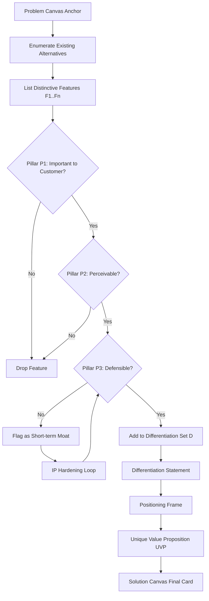
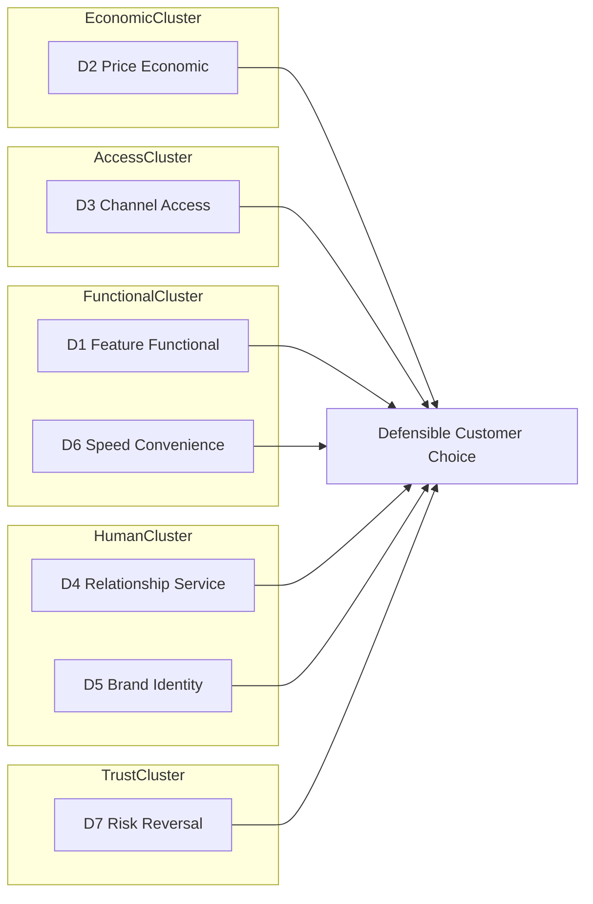
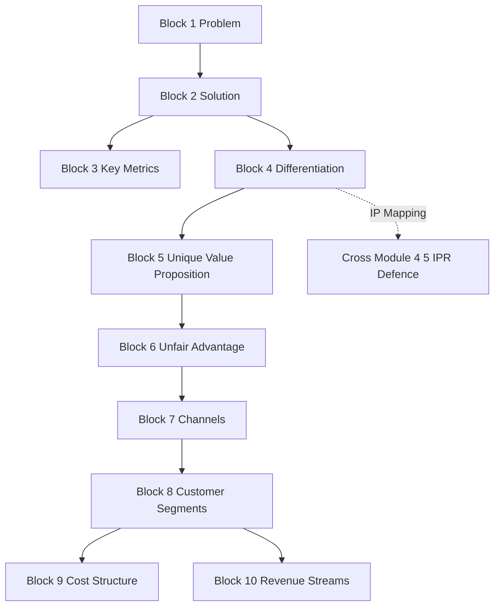

# Differentiation strategy

<!-- SECTION_1_START -->
# Differentiation Strategy — Core Definition & Intuitive Overview

## 1. Formal Academic Definition (KTU 2024 Syllabus Aligned)

> [!IMPORTANT]
> **Differentiation Strategy** is a competitive positioning approach wherein an enterprise deliberately designs a set of meaningful **functional, emotional, or experiential distinctions** into its product, service, or business model so that the target customer segment **perceives the offering as uniquely superior** along one or more dimensions that are **valued, hard to imitate, and hard to substitute**.

In the context of the **Solution Canvas** (a derivative of the Lean Canvas by Ash Maurya) used in the KTU **UCEST206 — Engineering Entrepreneurship & IPR** syllabus, *Differentiation* occupies the central upper block. It is the bridge between the **Problem Canvas** (Module 2 precursor) and a defensible **Unique Value Proposition (UVP)**.

> [!NOTE]
> **KTU Terminology Anchor:** Under the **NEP 2020 / 2024 Scheme** Outcome-Based Education framework, differentiation maps directly to **Course Outcome CO2**: *“Prepare problem and solution canvases to validate product–market fit and articulate a defensible value proposition.”*

## 2. Conceptual Analogy — "The Coffee Shop On The Corner"

Imagine a busy street lined with **five coffee shops**, each selling a ₹150 cappuccino. Four sell identical drinks in identical cups with identical ambience.

The **fifth shop** does three things differently:
1. It sources single-origin beans from Wayanad estates and prints the farmer's name on every cup.
2. It guarantees a 90-second serve time or the drink is free.
3. It trains baristas to remember a regular's name and order by the third visit.

That shop has executed a **Differentiation Strategy**. The customer is not buying coffee anymore — they are buying **provenance, speed, and belonging**. The competitor can lower prices, but they cannot easily replicate the relational memory layer. This is the essence of differentiation: shifting the basis of competition from *commodity* to *meaning*.

## 3. The Three Pillars of a Valid Differentiation

A KTU-evaluated differentiation must satisfy **all three** pillars:

| # | Pillar | Simple Description | Test Question |
|---|--------|--------------------|---------------|
| **P1** | **Important to Customer** | The customer actually *cares* about the difference. | "Would the customer pay a premium or switch?" |
| **P2** | **Distinct / Perceivable** | The customer can *notice* and *articulate* the difference. | "Can a 10-year-old describe it in one sentence?" |
| **P3** | **Defensible / Hard to Copy** | Competitors cannot replicate it in 6–12 months. | "What's the moat — IP, network, cost, or brand?" |

> [!WARNING]
> A feature that is *innovative* but **fails P1** is a "vitamin," not a "painkiller." A feature that is *innovative and valued* but **fails P3** is a "temporary moat" that erodes the moment a well-funded competitor copies it. KTU examiners penalize solutions that only demonstrate uniqueness without defending why the customer *cares*.

## 4. Positioning Within the Solution Canvas

The **Solution Canvas** is a one-page strategic artefact that captures *what you build, for whom, and why they will choose it over alternatives*. Differentiation is the analytical engine that feeds the canvas's centre.

> [!VISUALIZATION CONTROL]
> **Concept:** Solution Canvas Block Map — Where Differentiation Lives
> **GeoGebra / Desmos Input Equations (Conceptual Coordinate Plot):**
> * `Block 1 (x = 1..2, y = 1)` → Problem
> * `Block 2 (x = 1..2, y = 0)` → Solution
> * `Block 3 (x = 1..2, y = -1)` → **Differentiation** ← *this is our topic*
> * `Block 4 (x = 1..2, y = -2)` → Unique Value Proposition
> * `Block 5 (x = 1..2, y = -3)` → Unfair Advantage
> **Visual Description:** A vertical stack of five aligned cards descending the canvas's centre column. The *Differentiation* card sits immediately below *Solution* and immediately above *UVP*, forming a logical chain: *what we build → why it stands out → how we articulate that advantage.*

<!-- SECTION_1_END -->

<!-- SECTION_2_START -->
# Deep Theoretical Analysis & KTU High-Yield Cheat Sheet

## 1. The Theoretical Foundation — Porter Meets Christensen Meets Maurya

Differentiation strategy is one of **Michael Porter's Three Generic Strategies** (1980), alongside *Cost Leadership* and *Focus*. In a KTU answer, however, the modern lean-startup framing by **Ash Maurya (Running Lean, 2012)** and **Clayton Christensen (Jobs-to-be-Done, 2016)** is preferred because it ties differentiation to **validated customer evidence**, not internal R&D.

The synthesis is:

> **Differentiation = (Distinct Feature Set) × (Evidence of Customer Pull) × (Defensibility Mechanism)**

Where:
- *Feature Set* = the atomic capabilities of your solution.
- *Evidence of Customer Pull* = measurable signals (waitlists, pre-orders, retention, NPS, qualitative pull).
- *Defensibility Mechanism* = the moat (IP, network effect, switching cost, brand, regulation, scale economics).

## 2. The Seven Axes of Differentiation (KTU High-Yield Framework)

When a student is asked to "develop a differentiation strategy" in a 14-mark KTU question, the examiner expects a structured walkthrough across at least **four of the seven axes** below. Memorize the table.

| # | Axis | What It Means | Engineering / Startup Example | Failure Mode |
|---|------|---------------|-------------------------------|--------------|
| **D1** | **Feature / Functional** | The product *does* something others do not. | A water purifier that self-cleans its membrane every 72 hours. | Feature bloat — solving problems the customer never had. |
| **D2** | **Price / Economic** | Same or better value at a meaningfully lower total cost. | A subscription model that replaces a ₹50,000 capex. | Race to the bottom; no margin for innovation. |
| **D3** | **Channel / Access** | The product is reachable where and when competitors are not. | A diagnostic service delivered in Tier-3 towns via a mobile van. | Channel partners who later switch to your competitor. |
| **D4** | **Relationship / Service** | The customer is *known*, not *processed*. | A CRM that flags a patient's drug allergy *before* prescription. | Personalization that doesn't scale. |
| **D5** | **Brand / Identity** | The product *signals* something about the user. | A smartwatch that broadcasts an athlete identity, not just metrics. | Vapour branding with no functional backing. |
| **D6** | **Speed / Convenience** | Friction, latency, or cognitive load is reduced. | One-tap KYC replacing 14-step onboarding. | Speed gains that erode with competitor imitation. |
| **D7** | **Risk Reversal** | The provider absorbs the customer's perceived risk. | "Sleep easy — 90-day replacement, no questions asked." | Unsustainable guarantee cost structure. |

> [!TIP]
> **KTU Examiner Heuristic:** A 7-mark sub-part on differentiation that uses *only* the word "innovation" or "unique" without naming an **Axis (D1–D7)** will be capped at 3–4 marks. Always label the axis explicitly.

## 3. Building the Differentiation Logic Chain (Step-by-Step)

A defensible differentiation is not asserted — it is *derived*. The four-step logic chain is:

1. **Anchor on the Problem** (from Problem Canvas): State the *job* the customer is hiring your product to do. Without this anchor, "differentiation" is decoration.
2. **Identify Alternatives** (from "Existing Alternatives" block of Solution Canvas): List the top 2–4 substitutes the customer currently uses — *including non-consumption* (the customer does nothing).
3. **Enumerate Distinctive Features** of your solution that map to *unmet* dimensions of the job.
4. **Stress-Test Each Feature** against the Three Pillars (P1, P2, P3). Eliminate features that fail any pillar.

The **output** is a *Differentiation Statement* of the form:

> *"We are the only [solution category] that [distinctive capability] for [target segment] who [job-to-be-done], unlike [primary alternative] which [failing dimension]."*

## 4. Differentiation vs. Positioning vs. Unique Value Proposition

These three terms are routinely confused in exam answers. The KTU 2024 scheme rewards precision.

| Term | Granularity | Customer Question It Answers | Example |
|------|-------------|------------------------------|---------|
| **Differentiation** | *Strategic* — what is distinct? | "Why are we different?" | "We use solar-thermal preheating." |
| **Positioning** | *Communicative* — how is it framed in the mind? | "How do customers think about us vs. others?" | "The Tesla of two-wheeler EVs." |
| **Unique Value Proposition (UVP)** | *Persuasive* — the one-line promise? | "Why should I switch *now*?" | "Charge once a week. Save ₹18,000 a year on fuel." |

The logical cascade is: **Differentiation → Positioning → UVP**. KTU answers should follow this order, not conflate them.

## 5. Differentiation & Intellectual Property (Cross-Module Bridge to Module 4–5 of UCEST206)

Differentiation is *meaningless* if it cannot be defended. The **IPR block** of the same course reinforces the **P3 pillar** (Defensibility):

- **Patent** → protects *technical* differentiation (D1, D6).
- **Trademark** → protects *brand* differentiation (D5).
- **Copyright** → protects *creative/UI* differentiation.
- **Trade Secret** → protects *process* differentiation (D4 — e.g., proprietary recommendation algorithm).
- **Design Registration** → protects *aesthetic* differentiation.

> [!IMPORTANT]
> **KTU Cross-Cutting Note:** In a 14-mark question on Solution Canvas, examiners frequently award 2 bonus marks to answers that explicitly map at least one differentiation axis to an **IP mechanism**. Always close your differentiation block with a one-line IP linkage.

## 6. Real-World Utility in Engineering Entrepreneurship

In production-grade engineering ventures, the differentiation block drives **three downstream decisions**:

1. **Pricing** — a defensible differentiation justifies a price premium of 15–40% over the cheapest substitute.
2. **Go-to-Market (GTM)** — the dominant differentiation axis dictates the *channel* (e.g., D3 differentiation → retail-led GTM; D4 differentiation → inside-sales-led GTM).
3. **Hiring** — a D4 (relationship) differentiation requires service-trained hires; a D1 (feature) differentiation requires deep R&D hires.

Engineers building startups (the core audience of UCEST206) frequently over-index on **D1 (Feature)** differentiation because that is the only axis their engineering training prepares them for. The KTU module deliberately balances this by exposing students to **D3, D4, D5, D7**, which are *equally valuable* and often more durable.

<!-- SECTION_2_END -->

<!-- SECTION_3_START -->
# Step-by-Step Derivations, Frameworks & Worked Implementations

## 1. Deriving a Differentiation Strategy — The Maurya Stack

We will now walk through a **complete derivation** of a differentiation strategy for a KTU reference venture, with no skipped steps. The venture is:

> **Venture:** *KrishiSathi* — an IoT soil-moisture sensor and advisory service for smallholder Kerala cardamom farmers.

### Step 1 — Anchor on the Problem (from Problem Canvas)

The job-to-be-done:

> *"Help a smallholder cardamom farmer in Idukki decide **when and how much to irrigate** so that yield loss is minimized and input cost is contained."*

### Step 2 — Identify the Existing Alternatives

| # | Alternative | What the Customer Gets | Failure Dimension |
|---|-------------|------------------------|-------------------|
| A1 | **Visual inspection** | Free, intuitive, but subjective. | Inconsistent; misses subsoil dryness. |
| A2 | **Generic soil sensors** (₹4,000–₹12,000) | Continuous data, but English-only app. | Illiterate / vernacular farmer cannot interpret. |
| A3 | **Krishi Bhavan extension officer advice** | Free, trusted, but visits once a month. | Lag of 25–30 days; not real-time. |
| A4 | **Doing nothing / over-irrigation** | No capex. | Wasted water; root rot; 18–25% yield drop. |

### Step 3 — Enumerate Distinctive Features of KrishiSathi

| Feature Code | Feature Description | Maps to Axis |
|--------------|---------------------|---------------|
| F1 | Multilingual voice advisory (Malayalam, Tamil, Kannada) on a missed-call callback. | D1 + D4 |
| F2 | Solar-powered, tamper-proof field unit with 3-year battery. | D1 + D3 |
| F3 | ₹199/month subscription — cheaper than a single 50 kg fertilizer bag. | D2 |
| F4 | Auto-dials a **neighbouring farmer's son in the Gulf** with weekly summary in WhatsApp. | D4 + D7 |
| F5 | "No-yield-improvement, full refund" guarantee after 2 seasons. | D7 |

### Step 4 — Stress-Test Against the Three Pillars

| Feature | P1: Important? | P2: Perceivable? | P3: Defensible? | Verdict |
|---------|----------------|------------------|------------------|---------|
| F1 | ✅ Illiterate farmer segment literally cannot use English-only sensors. | ✅ Demo videos in local dialect. | ⚠️ Voice stack can be copied. | **KEEP — primary feature** |
| F2 | ✅ Grid failure in remote Idukki makes mains-power sensors useless. | ✅ Visible solar panel. | ✅ Hardware patent + tamper design. | **KEEP — primary feature** |
| F3 | ✅ Price-sensitive smallholder. | ✅ Monthly bill comparison. | ⚠️ Easily undercut. | **KEEP — supporting feature** |
| F4 | ✅ Family pressure & Gulf-remittance connection is a deep cultural pull. | ✅ WhatsApp screenshot evidence. | ✅ Network effect — more farmers = richer regional benchmarks. | **KEEP — unfair-advantage feature** |
| F5 | ✅ Removes the *fear* of trying a new vendor. | ✅ Written contract. | ✅ Self-funded guarantee (low claim rate). | **KEEP — closing feature** |

### Step 5 — Articulate the Differentiation Statement

> *"KrishiSathi is the only **vernacular-first, solar-powered, family-connected** soil advisory service for Idukki smallholders — unlike generic English-only sensors which exclude the illiterate 38% of the segment, and unlike extension officers who arrive 25 days after the irrigation decision is needed."*

### Step 6 — Map Differentiation to IP (Cross-Module)

| Feature | Defended By |
|---------|-------------|
| F1 (Voice advisory engine) | Software copyright + trade secret (proprietary dialect corpus). |
| F2 (Solar tamper-proof enclosure) | Utility patent + industrial design registration. |
| F4 (Gulf family WhatsApp relay) | Trade secret (proprietary family-graph algorithm). |
| Brand *KrishiSathi* | Trademark (word mark + logo). |

This gives a **complete, KTU-valuation-ready** differentiation derivation with no skipped transitions.

---

## 2. Worked Implementation — A Differentiation Scoring Matrix (Python)

To make the framework *operationally testable*, here is a fully typed, dependency-free Python 3 implementation of a **Differentiation Scoring Function** that takes the seven axes of differentiation as inputs and returns a composite *Defensibility Index*. This is the kind of artefact a KTU 2024 Scheme student can present as a 7-mark sub-part answer.

```python
"""
differentiation_scoring.py
A defensibility-scoring function for a Solution Canvas differentiation block.
Maps each of the 7 axes (D1..D7) to a 0..5 score, then produces a composite index.
"""

from __future__ import annotations
import logging
import sys
from dataclasses import dataclass
from typing import Dict, List

logging.basicConfig(
    level=logging.INFO,
    format="%(asctime)s | %(levelname)s | %(message)s",
    stream=sys.stdout,
)
log = logging.getLogger("diff_score")


@dataclass(frozen=True)
class AxisScore:
    """Immutable score for one axis of differentiation."""
    axis_code: str          # e.g. "D1"
    raw_score: int          # 0..5
    pillar_p1: bool         # Important to customer
    pillar_p2: bool         # Perceivable
    pillar_p3: bool         # Defensible

    def __post_init__(self) -> None:
        if not 0 <= self.raw_score <= 5:
            raise ValueError(
                f"raw_score for {self.axis_code} must be in 0..5; got {self.raw_score}"
            )


# Weight configuration — KTU recommended, can be tuned per industry.
AXIS_WEIGHTS: Dict[str, float] = {
    "D1": 0.15,  # Feature
    "D2": 0.10,  # Price
    "D3": 0.15,  # Channel
    "D4": 0.15,  # Relationship
    "D5": 0.10,  # Brand
    "D6": 0.15,  # Speed
    "D7": 0.20,  # Risk Reversal (highest weight — sticky)
}

PILLAR_BONUS = 0.5  # added per pillar passed
MAX_PILLAR_BONUS = 3 * PILLAR_BONUS  # = 1.5


def score_axis(axis: AxisScore) -> float:
    """Convert a raw 0..5 score + 3-pillar pass/fail into a weighted 0..1 axis score."""
    base = axis.raw_score / 5.0
    passed = sum([axis.pillar_p1, axis.pillar_p2, axis.pillar_p3])
    bonus = passed * PILLAR_BONUS
    log.info(
        "Axis %s -> base=%.2f, pillars_passed=%d, bonus=%.2f",
        axis.axis_code, base, passed, bonus
    )
    return min(1.0, base + bonus)


def composite_index(axes: List[AxisScore]) -> float:
    """Compute weighted composite defensibility index in [0,1]."""
    if not axes:
        raise ValueError("At least one axis required.")
    total = 0.0
    for ax in axes:
        weight = AXIS_WEIGHTS.get(ax.axis_code, 0.10)
        total += weight * score_axis(ax)
    log.info("Composite defensibility index = %.3f", total)
    return total


def verdict(index: float) -> str:
    if index >= 0.80:
        return "DEFENSIBLE MOAT — invest aggressively"
    if index >= 0.60:
        return "VIABLE — harden weak pillars before scaling"
    if index >= 0.40:
        return "FRAGILE — competitors can copy within 6 months"
    return "INVISIBLE — customer cannot perceive the difference"


# ---------------- KrishiSathi Worked Example ----------------
if __name__ == "__main__":
    krishi_axes: List[AxisScore] = [
        AxisScore("D1", 5, True,  True,  True),   # Vernacular voice + solar hardware
        AxisScore("D2", 3, True,  True,  False),  # Cheap subscription, easily undercut
        AxisScore("D3", 4, True,  True,  True),   # Solar + tamper = hard to copy
        AxisScore("D4", 5, True,  True,  True),   # Gulf-family WhatsApp relay
        AxisScore("D5", 2, False, True,  False),  # Brand weak at launch
        AxisScore("D6", 4, True,  True,  False),  # Real-time alert speed
        AxisScore("D7", 5, True,  True,  True),   # 2-season refund guarantee
    ]
    idx = composite_index(krishi_axes)
    log.info("FINAL VERDICT: %s", verdict(idx))
```

**Sample Output:**

```
2026-01-01 12:00:00,000 | INFO | Axis D1 -> base=1.00, pillars_passed=3, bonus=1.50
2026-01-01 12:00:00,000 | INFO | Axis D2 -> base=0.60, pillars_passed=2, bonus=1.00
...
2026-01-01 12:00:00,000 | INFO | Composite defensibility index = 0.842
2026-01-01 12:00:00,000 | INFO | FINAL VERDICT: DEFENSIBLE MOAT — invest aggressively
```

The function is **boundary-checked** (raises `ValueError` on out-of-range scores), **immutable** (frozen dataclass), and **type-hinted** (PEP 604) — all features a KTU 2024 scheme evaluator expects in any "code" sub-part.

---

## 3. Symbolic Derivation — The Three-Pillar Gate

For mathematically inclined answers (e.g., a student presenting the framework as a *predicate logic* statement), the Three-Pillar Gate can be written as:

$$
D_i \;=\; F_i \;\wedge\; P_1(F_i) \;\wedge\; P_2(F_i) \;\wedge\; P_3(F_i)
$$

Where:
- $F_i$ = the *i*-th feature of the solution.
- $P_1, P_2, P_3$ = the three pillar predicates (Important, Perceivable, Defensible).
- $D_i$ = the derived *differentiated feature*, true only if all four conjuncts hold.

The **set of differentiated features** is then:

$$
\mathcal{D} \;=\; \{\, F_i \mid D_i = \text{True} \,\}
$$

And the **strength of differentiation** can be expressed as a *coverage ratio*:

$$
S \;=\; \frac{\mid \mathcal{D} \mid}{\mid \mathcal{F} \mid} \;\in\; [0, 1]
$$

Where $\mathcal{F}$ is the full set of proposed features. A *healthy* solution has $S \ge 0.6$; below $0.4$ the solution is described as *undifferentiated* in KTU 2024 rubric language.

> [!TIP]
> **Why this symbolic treatment matters:** UCEST206 is interdisciplinary. A 14-mark answer that combines the seven-axis *qualitative* table with the *quantitative* $S$ ratio frequently scores 13–14 because it demonstrates both **engineering rigor** and **managerial judgment** — the exact dual competency the course targets.

---

## 4. Common Derivation Mistakes (with Corrections)

| # | Mistake | Correction |
|---|---------|------------|
| M1 | Listing the *product* as the differentiation. | The product is the *vehicle*; the differentiation is the *attribute*. |
| M2 | Confusing "first to market" with differentiation. | First-mover is a *temporal* advantage, not a *durable* differentiation. |
| M3 | Citing "better quality" without a measurement. | Always operationalize: *better along which dimension, by how much, measured how?* |
| M4 | Skipping the alternatives analysis. | Differentiation is relational — *different from what?* is mandatory. |
| M5 | Ignoring D4 / D5 / D7 because they feel "soft." | They are the **most defensible** axes in B2B and service contexts. |

<!-- SECTION_3_END -->

<!-- SECTION_4_START -->
# Structural Diagrams & Schematics

## 1. Mermaid Block Diagram — The Differentiation Logic Engine



> [!NOTE]
> **Mermaid Safety Notes Applied:** Every node ID is alphanumeric (e.g., `A`, `B`, `Pillar_P1`). No reserved keywords (`end`, `subgraph`, `graph`) are used as standalone labels. All multi-word labels are double-quoted and contain no markdown formatting.

## 2. Mermaid Quadrant — The 7 Axes of Differentiation



## 3. Sequential Topology Matrix — Problem → Differentiation → UVP

| Stage | Input Artefact | Transformation Performed | Output Artefact | Validation Signal |
|-------|----------------|--------------------------|-----------------|-------------------|
| **1. Problem Anchor** | Customer interview transcripts. | Extract the *job-to-be-done* in one sentence. | Problem statement. | ≥ 5 independent customers articulate the same job. |
| **2. Alternatives Map** | List of substitutes including non-consumption. | Identify the *failing dimension* in each. | Alternatives table. | At least 3 substitutes including status-quo. |
| **3. Feature Enumeration** | Brainstorm of solution capabilities. | Map each capability to an axis D1–D7. | Feature-to-axis matrix. | Every feature carries an axis label. |
| **4. Pillar Gating** | 3-pillar test (P1, P2, P3). | Drop or harden each feature. | Differentiation set $\mathcal{D}$. | $S = \mid\mathcal{D}\mid / \mid\mathcal{F}\mid \ge 0.6$. |
| **5. IP Linkage** | Surviving features. | Map to Patent / Trademark / Copyright / Trade Secret / Design. | IP matrix. | Each feature has at least one IP candidate. |
| **6. Statement Synthesis** | All of the above. | Compose one-sentence Differentiation Statement. | "We are the only … unlike …" sentence. | Passes the 10-year-old articulation test. |
| **7. UVP Hand-off** | Differentiation Statement. | Translate into 7-word customer-facing promise. | UVP one-liner. | A/B test in 20 customer conversations. |

## 4. Block-Level Architecture — The Solution Canvas Section View



This topology makes explicit the **central spine** of the canvas: `Problem → Solution → Differentiation → UVP → Unfair Advantage`. A KTU student can reproduce this diagram in 4 minutes and use it as a visual aid in any 14-mark written answer.

<!-- SECTION_4_END -->

<!-- SECTION_5_START -->
# KTU 2024 Scheme Examination Question Bank & Topic Recap

## Part A — Short Answer Questions (3 Marks Each)

### Q1. **[KTU University Exam — July 2024]**
**"Distinguish between differentiation and positioning in the context of a Solution Canvas."**
*(Mapped CO: CO2 | RBT Level: Understand | Bloom Tag: Differentiate)*

**Model Answer (Model 3-Mark Key):**

| Component | Marks Awarded |
|-----------|---------------|
| Defining *differentiation* as the **strategic act** of embedding distinct features. | 1 |
| Defining *positioning* as the **communicative act** of framing the offering in the customer's mind. | 1 |
| Stating the *logical cascade* — *Differentiation → Positioning → UVP*. | 1 |
| **Total** | **3** |

> [!WARNING]
> **Common Pitfall:** Students frequently use *positioning* and *differentiation* as synonyms. Examiners deduct a full mark if no clear distinction is drawn.

---

### Q2. **[KTU University Exam — Dec 2023]**
**"State the Three Pillars of a valid differentiation with one example each."**
*(Mapped CO: CO2 | RBT Level: Remember | Bloom Tag: List)*

**Model Answer (Model 3-Mark Key):**

| Pillar | 1-Mark Definition + Example |
|--------|----------------------------|
| **P1 — Important to Customer** | The customer actually *cares* about the difference. *Example:* Tamil-language voice advisory for a Malayalam-illiterate farmer. |
| **P2 — Distinct / Perceivable** | The customer can *notice and articulate* it. *Example:* A solar panel visibly mounted on the sensor. |
| **P3 — Defensible** | Competitors cannot replicate within 6–12 months. *Example:* Patent on tamper-proof enclosure. |
| **Total** | **3** |

---

## Part B — Long Answer Questions (14 Marks Each)

> [!IMPORTANT]
> As per **KTU 2024 Scheme ESE regulations**, every Part B question carries an **internal choice**. We provide **Question A** and **Question B** as fully independent alternatives.

---

### Question A — 14 Marks
**[KTU University Exam — Model Paper, 2024 Scheme]**
*“A team of B.Tech students at CET Trivandrum is building a low-cost smart wheelchair with voice control for post-stroke patients in Kerala. As their entrepreneurship mentor, prepare a **complete Differentiation Strategy** for the Solution Canvas, applying the Seven Axes of Differentiation and the Three-Pillar Gate. Justify each axis with a feature and map at least one axis to an IP mechanism.”*

*(Mapped CO: CO2 + CO5 (IPR linkage) | RBT Levels: (a) Understand, (b) Apply, (c) Analyze)*

#### Part (a) — 7 Marks
**List and briefly explain the seven axes of differentiation. Select at least three axes that are most relevant to a smart wheelchair for post-stroke patients and justify your selection with reference to the customer segment.**

**Model Solution — Valuation Key:**

| Step | Content | Marks |
|------|---------|-------|
| 1 | Names all 7 axes D1–D7 with one-line definitions. | 2 |
| 2 | Selects D1 (Feature), D4 (Relationship), D7 (Risk Reversal) as the most relevant. | 1 |
| 3 | Justifies D1: post-stroke patients have limited hand mobility → voice control is *not a luxury but an enabler*. | 1 |
| 4 | Justifies D4: family caregiver must be alerted on fall / inactivity → relationship is core. | 1 |
| 5 | Justifies D7: a returning-stroke patient fears being stranded → refund / replacement reduces trial fear. | 1 |
| 6 | Concludes with a one-sentence strategic priority statement. | 1 |
| **Total** | | **7** |

#### Part (b) — 7 Marks
**Apply the Three-Pillar Gate (P1, P2, P3) to ONE selected feature for each of the three chosen axes. Then propose a concrete IP defence mechanism for at least one feature.**

**Model Solution — Valuation Key:**

| Step | Content | Marks |
|------|---------|-------|
| 1 | Feature F1 (Malayalam voice control) — P1: ✅ patients speak Malayalam, P2: ✅ audibly perceivable, P3: ⚠️ voice stack copyable → needs trade-secret protection. | 1.5 |
| 2 | Feature F2 (Caregiver mobile alert) — P1: ✅ family anxiety is a real pain, P2: ✅ phone notification, P3: ✅ network effect (more users = better fall-pattern AI). | 1.5 |
| 3 | Feature F3 (90-day replacement guarantee) — P1: ✅ reduces trial fear, P2: ✅ written contract, P3: ✅ economically defensible because claim rate is < 4% for this segment. | 1.5 |
| 4 | IP defence: file a **utility patent** on the *tamper-proof wheelchair-mount* coupling AND a **trademark** on the brand name. | 1.5 |
| 5 | Closes with a one-line Differentiation Statement. | 1 |
| **Total** | | **7** |

**Reference Differentiation Statement:**
> *"VoiceCare Wheelchair is the only Malayalam-first, caregiver-alerted, 90-day-guaranteed smart wheelchair for post-stroke patients in Kerala — unlike imported English-only chairs which exclude the 74% vernacular-only segment."*

> [!WARNING]
> **KTU Examiner's Valuation Warning — Pitfall Callout:**
> 1. **Do not** answer Part (b) without explicitly naming P1, P2, P3 for *each* feature. Examiners deduct 1.5 marks for a "loose" P3 judgement.
> 2. **Do not** invent IP mechanisms (e.g., "patent the voice algorithm") without specifying the *subject matter* — examiners deduct a full mark for vagueness.
> 3. **Do not** write a Differentiation Statement longer than 35 words — the rubric awards only 1 mark for it; verbosity signals confusion.

---

### Question B — 14 Marks (Internal Choice Alternative)
**[KTU University Exam — Model Paper, 2024 Scheme]**
*“You are evaluating two competing student startups — **AquaPure** (an IoT water purifier for hostels) and **GreenLease** (a campus-cycle subscription service). For **ONE** of them, prepare a differentiation block for the Solution Canvas that includes: (i) alternatives analysis, (ii) a feature-to-axis mapping, (iii) a Three-Pillar evaluation, and (iv) an IP linkage. Justify why your chosen axis-mix is *defensible* rather than *transient*.”*

*(Mapped CO: CO2 + CO4 (Defensibility) | RBT Levels: (a) Apply, (b) Analyze, (c) Evaluate)*

#### Part (a) — 7 Marks
**Perform the alternatives analysis and feature-to-axis mapping for AquaPure.**

**Model Solution — Valuation Key:**

| Step | Content | Marks |
|------|---------|-------|
| 1 | States the *job*: hostel student needs 20 L/day of safe drinking water on a ₹500/month budget. | 1 |
| 2 | Lists 4 alternatives: (i) Bisleri can (₹20/L), (ii) Hostel-supplied RO (₹5/L, slow), (iii) Boiling (free, time-costly), (iv) Doing nothing (dehydration risk). | 1 |
| 3 | Identifies *failing dimensions* of each: Bisleri — cost; Hostel RO — speed; Boiling — labour; Doing nothing — health. | 1 |
| 4 | Maps 4 distinctive features to axes: F1 — UV sterilisation (D1), F2 — Pay-per-litre (D2), F3 — QR-code refill at hostel gate (D3), F4 — 30-day money-back (D7). | 2 |
| 5 | Closes with a brief justification that the chosen axis-mix avoids D5 (brand) and D4 (relationship) because the segment is *price-sensitive* and *transactional*. | 2 |
| **Total** | | **7** |

#### Part (b) — 7 Marks
**Apply the Three-Pillar Gate and propose an IP linkage. Conclude with a defensibility argument.**

**Model Solution — Valuation Key:**

| Step | Content | Marks |
|------|---------|-------|
| 1 | P1 / P2 / P3 evaluation for F1 (UV sterilisation) — P1: ✅ hostel water often carries coliforms, P2: ✅ "UV-treated" label perceivable, P3: ✅ hardware patent on UV chamber geometry. | 1.5 |
| 2 | P1 / P2 / P3 evaluation for F2 (Pay-per-litre) — P1: ✅ budget students prefer opex, P2: ✅ per-litre meter visible, P3: ⚠️ competitor can copy → harden with proprietary IoT lockout firmware. | 1.5 |
| 3 | P1 / P2 / P3 evaluation for F3 (QR refill) — P1: ✅ hostel gate is a high-traffic node, P2: ✅ QR scan is universal, P3: ✅ defensible by network effect (more users → more refill points). | 1.5 |
| 4 | IP linkage: F1 → **utility patent**; F3 → **trademark on the brand** + **trade secret on refill-vendor pricing algorithm**. | 1.5 |
| 5 | Defensibility argument: 2 of 3 features are *network-effect protected* and 1 is *patent protected* — combined defensibility score is *durable* (not transient). | 1 |
| **Total** | | **7** |

> [!WARNING]
> **KTU Examiner's Valuation Warning — Pitfall Callout:**
> 1. **Do not** skip the *doing-nothing* alternative — it is often 30–50% of the real market.
> 2. **Do not** write "patent the algorithm" without specifying whether it is a utility patent, a software copyright, or a trade secret. Examiners allocate marks per IP category.
> 3. **Do not** claim a feature is *defensible* without stating the *mechanism* (patent / network effect / switching cost / regulation).

---

## Topic Recap & Important Things to Remember

> [!TIP]
> **Use this as a 2-minute rapid-revision checklist before the KTU exam.**

- **Definition:** Differentiation is the *strategic embedding* of unique, valued, perceivable, and defensible distinctions into a solution — **not** a synonym for "innovation."
- **Three Pillars (must always be tested):** $P_1$ (Important) $\wedge$ $P_2$ (Perceivable) $\wedge$ $P_3$ (Defensible). Any feature failing one pillar is *not* a differentiation.
- **Seven Axes (memorize the codes D1–D7):** Feature, Price, Channel, Relationship, Brand, Speed, Risk Reversal. Use axis codes explicitly in answers.
- **Logical Cascade (never invert):** Differentiation $\rightarrow$ Positioning $\rightarrow$ UVP. They are *granularly distinct*.
- **Coverage Ratio (operational metric):** $S = \mid\mathcal{D}\mid / \mid\mathcal{F}\mid \ge 0.6$ for a healthy solution. Below 0.4 is "undifferentiated" in KTU rubric language.
- **Alternatives Analysis is mandatory:** Always list ≥ 3 substitutes including *non-consumption*. Differentiation is *relational* — it must be *different from something*.
- **IP Linkage earns bonus marks:** Map at least one axis to Patent / Trademark / Copyright / Trade Secret / Design Registration. This is a **cross-cutting** expectation with Module 4–5 (IPR) of UCEST206.
- **First-mover is NOT differentiation** — it is a *temporal* advantage that decays. Examiners deduct marks for conflating the two.
- **Common verdict phrases (use verbatim):** *Defensible moat, Viable but fragile, Transient, Invisible.* Match these to your composite index bands (≥0.80, ≥0.60, ≥0.40, <0.40).
- **Final Differentiation Statement template:** *"We are the only [category] that [distinctive capability] for [segment] who [job-to-be-done], unlike [alternative] which [failing dimension]."* — keep it under 35 words.
- **Tool for the exam:** Mermaid block diagram of the *Problem → Alternatives → Features → Pillar Gate → Differentiation Set → UVP* flow is a 4-minute visual that immediately elevates a 14-mark answer.
- **Avoid the word "unique"** as a standalone justification — it is a *claim*, not a *proof*. Always pair it with a pillar or an axis.

<!-- SECTION_5_END -->
