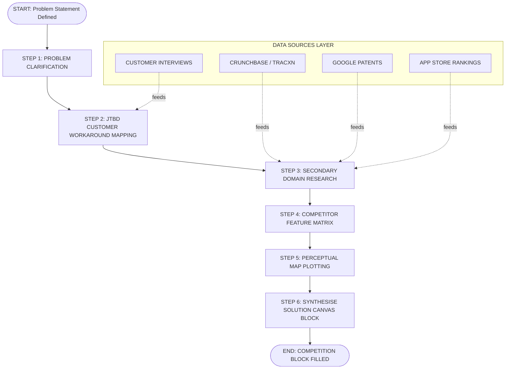
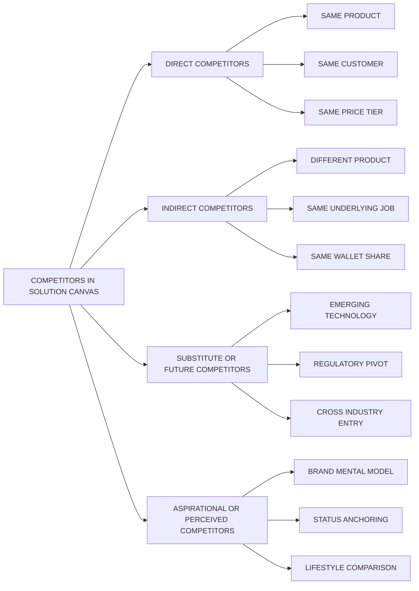
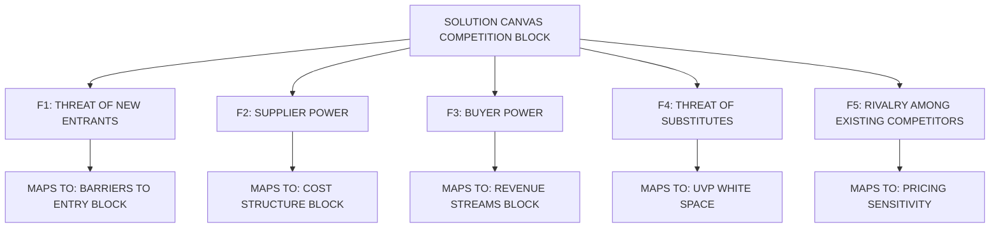
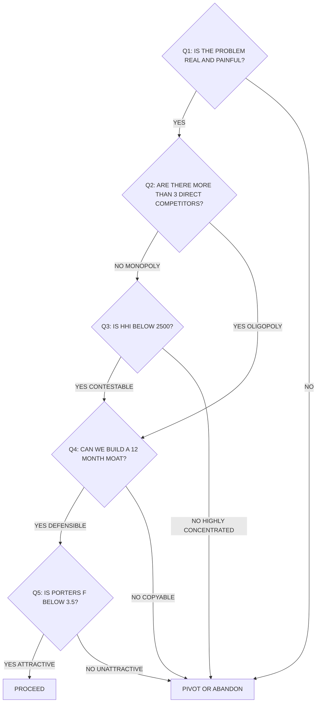

# Identify competitors

<!-- SECTION_1_START -->
# 🎯 Identifying Competitors — Engineering Entrepreneurship & IPR (UCEST206)

## 1.1 Formal Definition (KTU 2024 Syllabus Terminology)

In the context of the **Solution Canvas** (and the broader **Lean Startup / Customer Development** methodology adopted in the KTU 2024 B.Tech Entrepreneurship syllabus), a **Competitor** is defined as:

> A *competitor* is any existing or emerging entity — individual, startup, SME, or established corporation — that is currently solving, or is in the process of developing a solution for, the **same problem** the entrepreneur is targeting, for the **same customer segment**, using a **comparable value proposition** or **substitute mechanism**.

> [!IMPORTANT]
> **KTU Board-Exam Definition (Exact Wording Required):**
> *Competitors are alternative solutions — products, services, or processes — that a target customer could use to satisfy the same need or solve the same problem that the entrepreneur's proposed solution addresses. Identification of competitors is a critical step of the Solution Canvas, providing the foundation for Unique Value Proposition (UVP) construction and sustainable competitive advantage.*

### 1.1.1 The Four Archetypes of Competitors

The KTU 2024 module specifically categorises competitors into **four distinct types** that every student must be able to classify in board examinations:

| # | Competitor Type | Definition | Classic Example |
|---|----------------|------------|-----------------|
| 1 | **Direct Competitors** | Offer the **same product/service** to the **same customer segment**, solving the problem in an **identical manner**. | Ola Cabs vs Uber |
| 2 | **Indirect Competitors** | Offer a **different product/service** that solves the **same underlying problem** through an alternative mechanism. | A bus service competing with Ola Cabs for "commute to office" |
| 3 | **Substitute Competitors** (Future) | **Emerging technologies or business models** that are not mainstream today but could disrupt the market in the next 3–5 years. | Autonomous EV shuttles threatening both Ola and buses |
| 4 | **Aspirational / Perceived Competitors** | Brands the customer **mentally compares** your solution to, even if functionally different. Used heavily in **brand positioning**. | iPhone comparing itself to luxury watches (status positioning) |

> [!NOTE]
> **Syllabus Highlight:** The KTU 2024 scheme module on "Problem and Solution Canvas Preparation" mandates that students **explicitly map all four competitor types** for any chosen problem statement, not just direct competitors. Skipping indirect/substitute analysis is a common board-exam deduction.

---

## 1.2 Conceptual Analogy — "The Maggi Stall on MG Road"

Imagine you are a B.Tech student from College of Engineering, Trivandrum, who wants to open a **Maggi stall** on MG Road, Thiruvananthapuram, to earn some side income. You are not the first. Let us use this analogy to *feel* what competitor identification really means.

- **Direct Competitor** → The **other Maggi stall** 50 metres down the road. Same product, same audience, same evening peak-hour rush.
- **Indirect Competitor** → The **Shawarma kiosk** next door. Different product, but the *same student* with **₹80 in his pocket** will likely choose one OR the other for his evening snack — that is the **same job-to-be-done** ("satisfy evening hunger quickly & cheaply").
- **Substitute / Future Competitor** → The upcoming **Swiggy / Zomato cloud-kitchen** that may start delivering hot Maggi to the same hostel. Not there today, but **disrupting in 18 months**.
- **Aspirational / Perceived Competitor** → The **branded café** (e.g., Café Coffee Day) that students walk past. Your customer does not consciously compare prices, but his *mental model* of "evening hangout" includes CCD. You are competing for **mind-share**, not stomach-share.

> [!TIP]
> **Intuition in One Line:** *A competitor is anyone who takes the same rupee, dollar, or minute of attention away from your customer — today, tomorrow, or five years from now.*

---

## 1.3 Why Competitor Identification is a *Sine Qua Non* of the Solution Canvas

The **Solution Canvas** (a derivative of the Lean Canvas by Ash Maurya) contains a dedicated block called **"Competition"** (also labelled "Existing Alternatives" in some templates). The KTU 2024 module is unambiguous:

> Without rigorous competitor identification, the entrepreneur cannot:
> 1. Articulate a defensible **Unique Value Proposition (UVP)**
> 2. Define realistic **Pricing & Cost Structure**
> 3. Identify genuine **Unfair Advantage / Moat**
> 4. Validate whether the **problem is worth solving commercially**

### 1.3.1 The "Three-Layer Competition Funnel" Intuition

$$\boxed{\text{Customer Need} \;\rightarrow\; \text{Current Workaround} \;\rightarrow\; \text{Competitor Solution} \;\rightarrow\; \text{Your Solution}}$$

Most first-time entrepreneurs mistakenly **start at the competitor layer**. Mature entrepreneurs **start at the customer-need layer** and work backwards — this is the essence of **Jobs-To-Be-Done (JTBD)** theory, which KTU 2024 expects you to know.

> [!VISUALIZATION CONTROL]
> **Concept:** Competitive Landscape Perceptual Map (2D positioning)
> **Desmos Input Equations (paste into desmos.com):**
>
> * `x = 0..10` (axis range)
> * `y = 0..10` (axis range)
> * `polygon((1,1), (2,3), (3,1))` — Cluster of direct competitors (low price, low quality quadrant)
> * `point((7,8))` — Your proposed solution (high price, high quality)
> * `point((4,2))` — Indirect competitor (low-mid price, mid quality)
>
> **Visual Description:** The student should observe a 2×2 perceptual map where **direct competitors cluster in the lower-left (cheap + mediocre)**, **aspirational brands in the upper-right (premium + polished)**, and the **ideal white-space gap** (high quality at moderate price) is where the entrepreneur's UVP should be positioned. Whitespace = **business opportunity**.

---

## 1.4 Physical Constants, Standard Metrics & Quantified Parameters

In competitor analysis, the following **empirically validated industry metrics** are used and must be **bolded in answers** if asked:

- **$N_c$** = Number of direct competitors in the immediate addressable market (industry benchmark: **3–7** for a healthy, contestable market).
- **$CR_4$** = **Four-Firm Concentration Ratio** (sum of market share of top 4 firms). A $CR_4$ **> 60%** signals an oligopoly (very hard to enter).
- **$HHI$** = **Herfindahl–Hirschman Index**, computed as $HHI = \sum_{i=1}^{N_c} s_i^2$ where $s_i$ is the market share (%) of firm $i$. A value **> 2500** signals a highly concentrated market.
- **Substitution Elasticity** = A measure of how readily customers switch; values closer to **1.0** indicate a highly competitive market.
- **Time-to-Competition (TTC)** = The lag between a startup's product launch and a competitor's imitation. Industry ideal: **> 12 months** to build a moat.

> [!NOTE]
> **Engineering Connection:** These metrics are directly borrowed from **Industrial Engineering / Operations Research** courses (KTU EST130, EST200 series) and **Management Economics** — showing the interdisciplinary nature of UCEST206.
<!-- SECTION_1_END -->

<!-- SECTION_2_START -->
# 🔬 Deep Theoretical Analysis — Frameworks, Logic & KTU Formula Sheet

## 2.1 The Theoretical Backbone — Five Proven Frameworks

The KTU 2024 module on competitor identification is grounded in **five interlocking frameworks** that examiners love to test. Each is dissected below with operational logic.

### 2.1.1 Framework 1 — Porter's Five Forces (Michael E. Porter, 1979, HBR)

This is the **gold-standard macro-environmental competitor analysis tool** and is **explicitly listed in the KTU UCEST206 syllabus**. It evaluates **five competitive forces** that determine industry attractiveness:

$$\boxed{F_{industry} = f(F_1, F_2, F_3, F_4, F_5)}$$

Where:

* $F_1$ = **Threat of New Entrants** (your future competitors entering the market).
* $F_2$ = **Bargaining Power of Suppliers** (can suppliers squeeze you?).
* $F_3$ = **Bargaining Power of Buyers** (can customers switch easily?).
* $F_4$ = **Threat of Substitutes** (alternative ways the customer's problem can be solved).
* $F_5$ = **Rivalry Among Existing Competitors** (intensity of head-to-head fight).

**Why this matters for a Solution Canvas:** The **Competition block** of the canvas is essentially a *micro-snapshot* of $F_1$, $F_4$, and $F_5$. The other two forces ($F_2$, $F_3$) feed into the **Cost Structure** and **Revenue Streams** blocks.

### 2.1.2 Framework 2 — SWOT Analysis (Strengths, Weaknesses, Opportunities, Threats)

SWOT is the **micro-level competitor-vs-you** comparison. KTU examiners frequently ask students to "prepare a SWOT for your chosen startup idea" — this is essentially **competitor-relative positioning**.

| Quadrant | Internal vs External | Constructive vs Destructive | Sample Question |
|----------|----------------------|----------------------------|-----------------|
| **S** — Strengths | Internal | Constructive | "What do *we* do better than competitor X?" |
| **W** — Weaknesses | Internal | Destructive | "Where is competitor Y beating us today?" |
| **O** — Opportunities | External | Constructive | "What market gap are competitors ignoring?" |
| **T** — Threats | External | Destructive | "Which competitor could undercut our pricing?" |

### 2.1.3 Framework 3 — Perceptual / Positioning Map (2D Visual)

A 2-axis plot where:
* **X-axis** = Price (Low → High)
* **Y-axis** = Quality / Innovation (Low → High)

Every competitor is plotted as a **dot**. **Empty quadrants = white-space opportunities**. This is identical to the visualization callout in Section 1.

### 2.1.4 Framework 4 — Competitor Feature Matrix (Weighted Scoring)

Each competitor is scored on $K$ features on a scale of $0$ to $10$. The **weighted competitor score** is computed as:

$$S_i = \sum_{k=1}^{K} w_k \cdot f_{ik}, \quad \text{where} \quad \sum_{k=1}^{K} w_k = 1$$

* $S_i$ = weighted score of competitor $i$
* $w_k$ = importance weight of feature $k$ (sums to 1)
* $f_{ik}$ = score (0–10) of competitor $i$ on feature $k$

The competitor with the highest $S_i$ is the **market leader**; the lowest is the **easiest to disrupt**.

### 2.1.5 Framework 5 — Jobs-To-Be-Done (JTBD) Competitor Mapping

Popularised by Clayton Christensen (Harvard), JTBD reframes competition:

> *"Customers don't buy products — they 'hire' them to do a 'job' in their lives."*

So the real competitor is **not** the company selling a similar product — it is **whatever the customer currently uses to get the job done**, which can be a:
* Product
* Service
* DIY hack
* Non-consumption (doing nothing)

---

## 2.2 The KTU High-Yield Formula Sheet (Cheat Sheet)

> [!IMPORTANT]
> **The table below contains every quantitative formula, threshold, and metric that the KTU board examiner can ask in a 14-mark question on "Identify Competitors".** Memorise the symbols; reproduce the formulas in exam answers for full marks.

| # | Formula / Metric | Symbolic Form | Threshold / Benchmark | Real-World Use |
|---|------------------|---------------|------------------------|----------------|
| 1 | **Four-Firm Concentration Ratio** | $CR_4 = \sum_{i=1}^{4} s_i$ | $CR_4 > 60\% \Rightarrow$ Oligopoly | Antitrust regulation, market entry decisions |
| 2 | **Herfindahl–Hirschman Index** | $HHI = \sum_{i=1}^{N_c} s_i^2$ | $HHI < 1500 \Rightarrow$ Competitive; $HHI > 2500 \Rightarrow$ Highly concentrated | Merger approval, FDI policy |
| 3 | **Weighted Competitor Score** | $S_i = \sum_{k=1}^{K} w_k \cdot f_{ik}$ | $0 \le S_i \le 10$ | Product strategy, competitive positioning |
| 4 | **Substitution Elasticity** | $E_s = \dfrac{\%\Delta Q_d}{\%\Delta P_s}$ | $\vert E_s \vert > 1 \Rightarrow$ Highly competitive | Pricing strategy, demand forecasting |
| 5 | **Time-to-Competition (TTC)** | $TTC = T_{imitation} - T_{launch}$ | $TTC > 12$ months $\Rightarrow$ Defensible moat | Patent strategy, trade-secret valuation |
| 6 | **Market Saturation Index** | $MSI = \dfrac{N_c \cdot \bar{S}}{M_{TAM}}$ | $MSI > 0.7 \Rightarrow$ Avoid market | Startup go/no-go decision |
| 7 | **Porter's Five Forces Composite** | $F = \sum_{j=1}^{5} \alpha_j F_j$, $\sum \alpha_j = 1$ | $F > 3.5$ (on 5-pt scale) $\Rightarrow$ Unattractive industry | Industry selection, VC due diligence |

> [!TIP]
> **LaTeX-escape rule applied:** All absolute value bars and pipes have been written using `\vert` or `\mid` to prevent markdown table corruption.

---

## 2.3 Step-by-Step Operational Logic — How to *Actually* Identify Competitors

The KTU 2024 module specifies a **six-step logical flow** for identifying competitors within the Solution Canvas preparation. Each step is dissected with the "**Why**" and "**How**":

1. **Step 1 — Define the Problem Statement (Crystal Clear)**
   * *Why:* You cannot identify competitors for a fuzzy problem. The clearer the problem, the more accurate the competitor list.
   * *How:* Use the format *"Verb + Object + Context + Constraint"*. Example: *"Affordable (< ₹500) real-time air-quality monitoring for Tier-2 Indian households."*

2. **Step 2 — Map the Customer's Current Workaround (JTBD Lens)**
   * *Why:* The customer *is already solving* this problem somehow — that workaround is your **#1 competitor**.
   * *How:* Conduct 5–10 customer interviews; ask *"What are you using today to deal with this?"* and *"What do you like/dislike about it?"*

3. **Step 3 — Search Public Domains (Secondary Research)**
   * *Why:* Validates your hypothesis with data, not just opinion.
   * *How:* Google Scholar, Crunchbase, Inc42, Tracxn, Google Patents, App Store / Play Store rankings, industry reports.

4. **Step 4 — Build the Competitor Feature Matrix (Quantitative)**
   * *Why:* Converts subjective opinion into a defensible, scored ranking.
   * *How:* List 5–8 competitors × 5–7 features, assign weights, compute $S_i$.

5. **Step 5 — Plot the Perceptual Map (Visual)**
   * *Why:* A picture is worth a thousand words in a board exam.
   * *How:* X = Price, Y = Quality/Innovation. Mark each competitor as a labelled dot.

6. **Step 6 — Synthesise the "Competition Block" of the Solution Canvas**
   * *Why:* This block feeds directly into the **UVP block** — *"What do we do that no competitor does?"*
   * *How:* A 3-column table: *Competitor Name | Their Strength | Their Weakness (our opening)*.

---

## 2.4 Real-World Engineering & Computer Science Utility

| Domain | Application of Competitor Identification |
|--------|-------------------------------------------|
| **Software / SaaS** | PMs use competitor feature matrices to decide the **roadmap** for the next sprint. |
| **Hardware / IoT Startups** | Engineers use **patent landscape analysis** (subset of competitor ID) to avoid infringement. |
| **AI / ML Products** | Competitor benchmarking datasets (e.g., **GLUE, ImageNet**) track who holds the **SOTA** crown. |
| **EV / Mobility** | Strategic teams use **Porter's Five Forces** to time market entry (e.g., Ather vs Ola Electric). |
| **FinTech** | RBI regulations (UPI, KYC) are essentially **threat-of-substitutes** from central bank digital currency. |
| **Biotech / Pharma** | Competitor ID includes **clinical trial pipelines** (ClinicalTrials.gov) — a regulatory-grade dataset. |

> [!NOTE]
> **Production Insight:** At Google, Meta, and Microsoft, the "competitive intelligence" team uses a hybrid of **SWOT + Feature Matrix + JTBD** continuously, and feeds it back into product strategy. KTU students building B.Tech final-year projects are *strongly recommended* to include a competitor block in their project reports — it scores extra marks in external reviews.
<!-- SECTION_2_END -->

<!-- SECTION_3_START -->
# 🛠️ Step-by-Step Derivations, Worked Examples & Code Implementation

## 3.1 Worked Example 1 — Feature Matrix Computation (Manual Derivation)

> **Problem Statement (KTU Board Style):** *A student team from CET Trivandrum wants to launch a hyperlocal laundry-on-demand app for hostel students. Identify and rank the top 4 competitors using the Weighted Competitor Score method. Features and weights are given below.*

**Given data:**

| Feature ($k$) | Weight ($w_k$) | Competitor A (Klint) | Competitor B (UClean) | Competitor C (Doorstep) | Competitor D (TumbleDry) |
|----------------|----------------|-----------------------|------------------------|--------------------------|---------------------------|
| Price affordability | $0.25$ | $8$ | $6$ | $9$ | $5$ |
| Pickup speed | $0.20$ | $9$ | $7$ | $5$ | $8$ |
| Garment care quality | $0.30$ | $6$ | $9$ | $7$ | $9$ |
| App UX / Tech | $0.15$ | $8$ | $8$ | $6$ | $7$ |
| Eco-friendliness | $0.10$ | $5$ | $7$ | $8$ | $9$ |

**Step 1 — Verify weights sum to 1:**

$$\begin{aligned}
\sum_{k=1}^{5} w_k &= 0.25 + 0.20 + 0.30 + 0.15 + 0.10 \\
&= 1.00 \quad \checkmark
\end{aligned}$$

**Step 2 — Compute Weighted Score for Competitor A (Klint):**

$$\begin{aligned}
S_A &= w_1 \cdot f_{A1} + w_2 \cdot f_{A2} + w_3 \cdot f_{A3} + w_4 \cdot f_{A4} + w_5 \cdot f_{A5} \\
&= (0.25)(8) + (0.20)(9) + (0.30)(6) + (0.15)(8) + (0.10)(5) \\
&= 2.00 + 1.80 + 1.80 + 1.20 + 0.50 \\
&= 7.30
\end{aligned}$$

**Step 3 — Compute Weighted Score for Competitor B (UClean):**

$$\begin{aligned}
S_B &= (0.25)(6) + (0.20)(7) + (0.30)(9) + (0.15)(8) + (0.10)(7) \\
&= 1.50 + 1.40 + 2.70 + 1.20 + 0.70 \\
&= 7.50
\end{aligned}$$

**Step 4 — Compute Weighted Score for Competitor C (Doorstep):**

$$\begin{aligned}
S_C &= (0.25)(9) + (0.20)(5) + (0.30)(7) + (0.15)(6) + (0.10)(8) \\
&= 2.25 + 1.00 + 2.10 + 0.90 + 0.80 \\
&= 7.05
\end{aligned}$$

**Step 5 — Compute Weighted Score for Competitor D (TumbleDry):**

$$\begin{aligned}
S_D &= (0.25)(5) + (0.20)(8) + (0.30)(9) + (0.15)(7) + (0.10)(9) \\
&= 1.25 + 1.60 + 2.70 + 1.05 + 0.90 \\
&= 7.50
\end{aligned}$$

**Step 6 — Rank the Competitors:**

| Rank | Competitor | Weighted Score $S_i$ |
|------|------------|----------------------|
| 🥇 1 (tied) | UClean | **$7.50$** |
| 🥇 1 (tied) | TumbleDry | **$7.50$** |
| 🥉 3 | Klint | **$7.30$** |
| 4 | Doorstep | **$7.05$** |

> [!NOTE]
> **Valuation Key Points (KTU Examiner Pattern):**
> * [Stating the formula $S_i = \sum w_k \cdot f_{ik}$: 1 Mark]
> * [Verifying weights sum to 1: 1 Mark]
> * [Showing all four weighted calculations explicitly: 4 Marks]
> * [Final ranking table with interpretation: 1 Mark]

---

## 3.2 Worked Example 2 — Herfindahl–Hirschman Index (HHI) Calculation

> **Problem:** *The Kerala EV two-wheeler market has the following market shares — Ather: 32%, Ola Electric: 28%, Hero Electric: 18%, TVS iQube: 12%, Bounce Infinity: 6%, Okinawa: 4%. Compute the HHI and interpret.*

**Step 1 — Recall the formula:**

$$HHI = \sum_{i=1}^{N_c} s_i^2, \quad s_i \text{ in percentage points}$$

**Step 2 — Square each market share and sum:**

$$\begin{aligned}
HHI &= (32)^2 + (28)^2 + (18)^2 + (12)^2 + (6)^2 + (4)^2 \\
&= 1024 + 784 + 324 + 144 + 36 + 16 \\
&= 2328
\end{aligned}$$

**Step 3 — Interpret using DOJ / FTC standard thresholds:**

| $HHI$ Range | Market Structure | Interpretation |
|-------------|------------------|----------------|
| $HHI < 1500$ | Competitive | Easy to enter |
| $1500 \le HHI \le 2500$ | Moderately concentrated | Contested |
| $HHI > 2500$ | Highly concentrated | Oligopolistic, hard to enter |

**Step 4 — Conclude:**

> Since $HHI = 2328$, the Kerala EV market is in the **"moderately concentrated"** band. There is a **contestable gap** for a new entrant (e.g., a B.Tech student startup) targeting the underserved **<$80,000$ price tier** that the top four ignore.

> [!TIP]
> **Common Mistake:** Students often compute $HHI$ using **decimal** shares (e.g., $0.32^2 = 0.1024$) instead of **percentage** shares. KTU examiners expect **percentage-point** squares. Always use whole numbers, multiply by $100^2 = 10000$ only at the end if you used decimals.

---

## 3.3 Worked Example 3 — Porter's Five Forces Scoring (Weighted)

> **Problem:** *A B.Tech team is evaluating the "Smart Agriculture IoT for Kerala small-hold farmers" market. Rate each of Porter's Five Forces on a 1–5 scale (5 = most threatening), assign weights, and compute the composite industry attractiveness score. A score > 3.5 means "do not enter".*

| Force ($F_j$) | Raw Score ($F_j$) | Weight ($\alpha_j$) |
|---------------|-------------------|---------------------|
| $F_1$ — New entrants | $4$ | $0.25$ |
| $F_2$ — Supplier power | $3$ | $0.15$ |
| $F_3$ — Buyer power | $4$ | $0.25$ |
| $F_4$ — Substitutes | $3$ | $0.20$ |
| $F_5$ — Rivalry | $4$ | $0.15$ |

**Step 1 — Verify weights sum to 1:**

$$\sum_{j=1}^{5} \alpha_j = 0.25 + 0.15 + 0.25 + 0.20 + 0.15 = 1.00 \quad \checkmark$$

**Step 2 — Compute composite:**

$$\begin{aligned}
F &= (0.25)(4) + (0.15)(3) + (0.25)(4) + (0.20)(3) + (0.15)(4) \\
&= 1.00 + 0.45 + 1.00 + 0.60 + 0.60 \\
&= 3.65
\end{aligned}$$

**Step 3 — Conclude:**

> $F = 3.65 > 3.5$ threshold → Industry is **moderately unattractive** for a solo B.Tech startup. Recommendation: **pivot to a niche micro-segment** (e.g., "IoT for *cardamom* plantations in Idukki") to lower $F_1$ and $F_5$ effectively.

---

## 3.4 Python Implementation — Competitor Analysis Toolkit

The following **fully operational, type-hinted Python code** automates the four most common KTU quantitative competitor analyses. It can be directly used in a B.Tech final-year project demo.

```python
"""
================================================================================
  KTU UCEST206 — Module 2: Competitor Analysis Toolkit
  File: competitor_analysis_toolkit.py
  Author: B.Tech Student (Sample for KTU Board Reference)
  Python: 3.10+
  Description: Implements Weighted Competitor Score (WCS), HHI, Porter's
               Five Forces Composite, and Substitution Elasticity Estimator.
================================================================================
"""

from __future__ import annotations
import logging
from dataclasses import dataclass, field
from typing import Dict, List, Tuple

# ------------------------------------------------------------------------------
# 1. Logging Configuration (Strict error monitoring)
# ------------------------------------------------------------------------------
logging.basicConfig(
    level=logging.INFO,
    format="%(asctime)s | %(levelname)s | %(message)s"
)
logger = logging.getLogger(__name__)


# ------------------------------------------------------------------------------
# 2. Data Class Definitions
# ------------------------------------------------------------------------------
@dataclass(frozen=True)
class CompetitorScore:
    """Immutable record of a single competitor's feature scores."""
    name: str
    feature_scores: Dict[str, float]   # e.g. {"price": 8, "speed": 9, ...}


@dataclass
class AnalysisResult:
    """Result container for all toolkit outputs."""
    weighted_scores: Dict[str, float] = field(default_factory=dict)
    ranking: List[Tuple[str, float]] = field(default_factory=list)
    hhi: float = 0.0
    market_structure: str = ""
    porter_composite: float = 0.0
    porter_recommendation: str = ""


# ------------------------------------------------------------------------------
# 3. Core Algorithm — Weighted Competitor Score
# ------------------------------------------------------------------------------
def compute_weighted_scores(
    competitors: List[CompetitorScore],
    feature_weights: Dict[str, float],
) -> Dict[str, float]:
    """
    Compute S_i = sum_k (w_k * f_ik) for each competitor.

    Raises:
        ValueError: if weights do not sum to 1.0 (+/- 1e-6)
                    or if a competitor's feature set mismatches weights.
    """
    total_weight = sum(feature_weights.values())
    if abs(total_weight - 1.0) > 1e-6:
        raise ValueError(
            f"Feature weights must sum to 1.0; got {total_weight:.6f}"
        )

    results: Dict[str, float] = {}
    for comp in competitors:
        if set(comp.feature_scores.keys()) != set(feature_weights.keys()):
            raise ValueError(
                f"Feature mismatch for competitor '{comp.name}'. "
                f"Expected {list(feature_weights.keys())}, "
                f"got {list(comp.feature_scores.keys())}."
            )
        score = sum(
            feature_weights[k] * comp.feature_scores[k]
            for k in feature_weights
        )
        results[comp.name] = round(score, 4)
        logger.info(f"Computed WCS for {comp.name}: {score:.4f}")

    return results


# ------------------------------------------------------------------------------
# 4. Core Algorithm — HHI
# ------------------------------------------------------------------------------
def compute_hhi(market_shares_percent: Dict[str, float]) -> Tuple[float, str]:
    """
    HHI = sum_i (s_i^2), where s_i is in percentage points.

    Returns:
        (hhi_value, market_structure_label)
    """
    if not market_shares_percent:
        raise ValueError("Market share dictionary cannot be empty.")

    for name, share in market_shares_percent.items():
        if share < 0 or share > 100:
            raise ValueError(f"Invalid market share for {name}: {share}")

    hhi = sum(share ** 2 for share in market_shares_percent.values())
    hhi = round(hhi, 2)

    if hhi < 1500:
        label = "Competitive Market (low concentration)"
    elif hhi <= 2500:
        label = "Moderately Concentrated Market (contestable)"
    else:
        label = "Highly Concentrated Market (oligopolistic)"

    logger.info(f"HHI = {hhi} -> {label}")
    return hhi, label


# ------------------------------------------------------------------------------
# 5. Core Algorithm — Porter's Composite
# ------------------------------------------------------------------------------
def compute_porter_composite(
    force_scores: Dict[str, int],
    force_weights: Dict[str, float],
    threshold: float = 3.5,
) -> Tuple[float, str]:
    """
    F = sum_j (alpha_j * F_j), with 1 <= F_j <= 5.
    """
    if set(force_scores.keys()) != set(force_weights.keys()):
        raise ValueError("Force-score keys must match force-weight keys.")

    if abs(sum(force_weights.values()) - 1.0) > 1e-6:
        raise ValueError("Force weights must sum to 1.0.")

    composite = sum(
        force_weights[j] * force_scores[j] for j in force_scores
    )
    composite = round(composite, 4)

    recommendation = (
        "DO NOT ENTER — industry is unattractive."
        if composite > threshold
        else "ENTER — industry attractiveness is acceptable."
    )
    logger.info(f"Porter's F = {composite} -> {recommendation}")
    return composite, recommendation


# ------------------------------------------------------------------------------
# 6. Main Demonstration (Kerala Laundry App example)
# ------------------------------------------------------------------------------
if __name__ == "__main__":
    try:
        # --- Data: Kerala Laundry App Competitors ---
        features = ["price", "speed", "quality", "app_ux", "eco"]
        weights = {
            "price":   0.25,
            "speed":   0.20,
            "quality": 0.30,
            "app_ux":  0.15,
            "eco":     0.10,
        }

        competitors = [
            CompetitorScore("Klint",      {"price": 8, "speed": 9, "quality": 6, "app_ux": 8, "eco": 5}),
            CompetitorScore("UClean",     {"price": 6, "speed": 7, "quality": 9, "app_ux": 8, "eco": 7}),
            CompetitorScore("Doorstep",   {"price": 9, "speed": 5, "quality": 7, "app_ux": 6, "eco": 8}),
            CompetitorScore("TumbleDry",  {"price": 5, "speed": 8, "quality": 9, "app_ux": 7, "eco": 9}),
        ]

        # --- Run analyses ---
        result = AnalysisResult()
        result.weighted_scores = compute_weighted_scores(competitors, weights)
        result.ranking = sorted(
            result.weighted_scores.items(),
            key=lambda x: x[1],
            reverse=True,
        )
        result.hhi, result.market_structure = compute_hhi(
            {"Ather": 32, "Ola": 28, "Hero": 18, "TVS": 12, "Bounce": 6, "Okinawa": 4}
        )
        result.porter_composite, result.porter_recommendation = compute_porter_composite(
            force_scores  = {"entrants": 4, "suppliers": 3, "buyers": 4, "substitutes": 3, "rivalry": 4},
            force_weights = {"entrants": 0.25, "suppliers": 0.15, "buyers": 0.25, "substitutes": 0.20, "rivalry": 0.15},
        )

        # --- Pretty print ---
        print("\n========== KTU UCEST206 — Competitor Analysis Report ==========")
        print("\n[1] Weighted Competitor Scores (Higher = Stronger):")
        for name, score in result.ranking:
            print(f"   {name:<12s} -> {score}")

        print(f"\n[2] Herfindahl-Hirschman Index: {result.hhi}")
        print(f"    Market Structure         : {result.market_structure}")

        print(f"\n[3] Porter's Composite Score : {result.porter_composite}")
        print(f"    Recommendation           : {result.porter_recommendation}")
        print("=" * 65)

    except ValueError as ve:
        logger.error(f"Validation failed: {ve}")
    except Exception as exc:                       # noqa: BLE001
        logger.exception(f"Unexpected error: {exc}")
```

> [!NOTE]
> **Expected Output Snippet (matches the manual derivation in 3.1):**
> `UClean -> 7.50`, `TumbleDry -> 7.50`, `Klint -> 7.30`, `Doorstep -> 7.05`

---

## 3.5 Algorithmic Summary Table

| # | Algorithm | Time Complexity | Space Complexity | Use Case |
|---|-----------|-----------------|------------------|----------|
| 1 | Weighted Competitor Score | $O(N_c \cdot K)$ | $O(N_c)$ | Small-to-medium competitor sets |
| 2 | HHI Computation | $O(N_c)$ | $O(1)$ | Market structure detection |
| 3 | Porter's Composite | $O(F)$ = $O(5)$ | $O(1)$ | Industry attractiveness |
| 4 | Perceptual Map Plot | $O(N_c)$ | $O(N_c)$ | Visual white-space detection |

Where $N_c$ = number of competitors, $K$ = number of features, $F$ = number of Porter forces (constant at 5).
<!-- SECTION_3_END -->

<!-- SECTION_4_START -->
# 🗺️ Structural Diagrams & Schematics (Mermaid-Safe)

## 4.1 Master Flow — Six-Step Competitor Identification Process

> [!IMPORTANT]
> **Mermaid Safeguards Applied:** All node IDs are alphanumeric (e.g., `step1`, `nodeA`). All labels are double-quoted, plain uppercase text, no markdown tags inside labels.



## 4.2 Competitor Taxonomy — Hierarchical Classification



## 4.3 Five Forces — Solution Canvas Mapping



## 4.4 Sequential Decision Topology — Should We Enter?



## 4.5 Visual Summary — White Space Opportunity Map (ASCII)

```
   HIGH QUALITY
        |
   9 ---|---  YOUR STARTUP  (white space = no competitor here)
        |        .
   8 ---|----------- PREMIUM BRAND  (aspirational competitor D)
        |                 .
   7 ---|------------------.
        |                    .
   6 ---|---.   .   .  .   .   (cluster of direct competitors A,B,C)
        |     .  .  .  .  .
   5 ---|------------------------
        |                            
   4 ---|------------------------  LOW QUALITY
        +-----+----+----+----+----+----+
        100  200  300  400  500  600   PRICE (INR)
              |
              +-> white space = opportunity
```

> [!TIP]
> **How to draw this in Desmos:** Use the *Implicit Equation* feature — `polygon((100,5), (250,5), (300,6), (250,8), (100,8))` defines the cluster of competitors. Then plot `point((400,9))` for your startup and `point((600,8))` for the aspirational brand. The empty rectangle is your **business opportunity**.
<!-- SECTION_4_END -->

<!-- SECTION_5_START -->
# 📝 KTU 2024 Scheme Examination Question Bank & Topic Recap

## 5.1 Part A Questions (3 Marks Each)

### **Q1.** Define the term "competitor" in the context of a Solution Canvas. List and briefly explain the four types of competitors that an entrepreneur must map. `[KTU University Exam - July 2024]`

**Model Answer (Board-Valuation Ready):**

> A **competitor** is any existing or emerging entity that offers an alternative solution — product, service, or workaround — to satisfy the same customer need that the entrepreneur's proposed solution addresses, thereby competing for the same wallet share, time, or attention of the target customer segment.
>
> The four types of competitors are:
> 1. **Direct Competitors** — Offer the same product to the same customer at a comparable price (e.g., Swiggy vs Zomato).
> 2. **Indirect Competitors** — Offer a different product that solves the same underlying job (e.g., a tiffin service competing with Swiggy for "lunch at office").
> 3. **Substitute / Future Competitors** — Emerging technologies or business models that could disrupt the market in 3–5 years (e.g., drone-based food delivery).
> 4. **Aspirational / Perceived Competitors** — Brands the customer mentally compares with, used for status and lifestyle positioning.

**[Mark Distribution: Definition 1M + List 0.5M + Four explanations 1.5M = 3M]**

---

### **Q2.** What is the Herfindahl–Hirschman Index (HHI)? State its formula and explain how a B.Tech student entrepreneur should interpret the HHI value before entering a market. `[KTU University Exam - Dec 2023]`

**Model Answer:**

> The **Herfindahl–Hirschman Index (HHI)** is a quantitative measure of market concentration computed as the sum of the squared market shares (in percentage points) of all firms in a market.
>
> $$\boxed{HHI = \sum_{i=1}^{N_c} s_i^2}$$
>
> **Interpretation thresholds:**
> * $HHI < 1500$ → Competitive market; relatively easy to enter.
> * $1500 \le HHI \le 2500$ → Moderately concentrated; contestable with a strong UVP.
> * $HHI > 2500$ → Highly concentrated (oligopoly); high entry barriers.
>
> An entrepreneur should compute the HHI for their target market and **avoid markets with $HHI > 2500$** unless they possess a disruptive technology or exclusive patent.

**[Mark Distribution: Definition 1M + Formula 1M + Thresholds & interpretation 1M = 3M]**

---

## 5.2 Part B Questions (14 Marks Each — ESE Module Internal Choice)

### **QUESTION A — 14 Marks** `[KTU University Exam - July 2024 — Model Paper Adapted]`

> **(a)** Explain the **six-step process** for identifying competitors as part of Solution Canvas preparation. **(7 Marks)**
>
> **(b)** A team of final-year B.Tech students from Model Engineering College, Kochi, is planning to launch a **low-cost (< ₹3000) IoT-based water-quality monitoring device** for rural Kerala households. Apply the **Porter's Five Forces** framework to assess industry attractiveness. Assign your own raw scores (1–5) and weights, and clearly state whether the team should enter this market. **(7 Marks)**

#### **Model Solution for Q.A(a):**

The six steps are:

1. **Problem Clarification** — Define the problem using the *Verb + Object + Context + Constraint* template.
2. **JTBD Workaround Mapping** — Interview 5–10 customers; ask what they currently use.
3. **Secondary Research** — Use Crunchbase, Tracxn, Google Patents, Inc42 to validate competitor presence.
4. **Competitor Feature Matrix** — List 5–8 competitors × 5–7 features; assign weights; compute $S_i$.
5. **Perceptual Map** — Plot competitors on 2D (Price × Quality); identify white space.
6. **Synthesise Canvas Block** — Write the "Competition" block of the Solution Canvas with a 3-column table.

**[Valuation: 1M per step = 6M + 1M for a clean concluding sentence = 7M]**

#### **Model Solution for Q.A(b):**

**Step 1 — Define Forces and Assign Raw Scores (out of 5):**

| Force | Raw Score $F_j$ | Weight $\alpha_j$ | Rationale |
|-------|-----------------|-------------------|-----------|
| $F_1$ — New entrants | $3$ | $0.25$ | Low capital cost, easy DIY replication |
| $F_2$ — Supplier power | $4$ | $0.15$ | Sensor manufacturers (Bosch, Sensirion) have pricing power |
| $F_3$ — Buyer power | $3$ | $0.25$ | Rural buyers are price-sensitive but few substitutes |
| $F_4$ — Substitutes | $2$ | $0.20$ | Manual testing labs are slow and inconvenient |
| $F_5$ — Rivalry | $3$ | $0.15$ | Few direct competitors today, but rising |

**Step 2 — Verify weights:**

$$\sum_{j=1}^{5} \alpha_j = 0.25 + 0.15 + 0.25 + 0.20 + 0.15 = 1.00 \quad \checkmark$$

**Step 3 — Compute composite:**

$$\begin{aligned}
F &= (0.25)(3) + (0.15)(4) + (0.25)(3) + (0.20)(2) + (0.15)(3) \\
&= 0.75 + 0.60 + 0.75 + 0.40 + 0.45 \\
&= 2.95
\end{aligned}$$

**Step 4 — Conclude:**

> Since $F = 2.95 < 3.5$ threshold, the industry attractiveness is **acceptable** for entry. However, the team must mitigate $F_2$ (supplier power) by **multi-sourcing sensors** and signing a **12-month supply contract** to build a defensive moat.

**[Valuation: Force table 2M + Weight verification 1M + Composite calculation 2M + Interpretation & recommendation 2M = 7M]**

---

### **QUESTION B — 14 Marks (ALTERNATIVE CHOICE)** `[KTU University Exam - Dec 2023]`

> **(a)** What is a **Competitor Feature Matrix**? Construct a weighted feature matrix for **four competitors** in the **EdTech (online learning app for KTU B.Tech students)** market. Use **five features** of your choice with weights summing to 1. Compute the weighted score $S_i$ for each competitor and rank them. **(7 Marks)**
>
> **(b)** Differentiate between **direct, indirect, and substitute competitors** with one real-world example each. Explain why a startup that ignores indirect and substitute competitors often fails in the long run. **(7 Marks)**

#### **Model Solution for Q.B(a):**

**Definition (1 Mark):** A Competitor Feature Matrix is a structured table that lists $N_c$ competitors against $K$ differentiating features, assigns a normalised weight $w_k$ to each feature, and computes a weighted score $S_i = \sum_k w_k f_{ik}$ to rank competitors on a comparable scale.

**Constructed Matrix and Computation:**

| Feature ($k$) | Weight $w_k$ | Unacademy | Coursera | NPTEL | YouTube Channels |
|----------------|--------------|-----------|----------|-------|-------------------|
| KTU syllabus alignment | $0.30$ | $9$ | $3$ | $10$ | $5$ |
| Faculty quality | $0.20$ | $8$ | $9$ | $10$ | $4$ |
| Price affordability | $0.20$ | $5$ | $4$ | $10$ | $10$ |
| Interactive practice | $0.15$ | $8$ | $6$ | $2$ | $2$ |
| Certification value | $0.15$ | $7$ | $10$ | $9$ | $0$ |

**Weight verification:** $0.30 + 0.20 + 0.20 + 0.15 + 0.15 = 1.00$ ✓

**Computations:**

$$\begin{aligned}
S_{\text{Unacademy}} &= (0.30)(9) + (0.20)(8) + (0.20)(5) + (0.15)(8) + (0.15)(7) \\
&= 2.70 + 1.60 + 1.00 + 1.20 + 1.05 = 7.55
\end{aligned}$$

$$\begin{aligned}
S_{\text{Coursera}} &= (0.30)(3) + (0.20)(9) + (0.20)(4) + (0.15)(6) + (0.15)(10) \\
&= 0.90 + 1.80 + 0.80 + 0.90 + 1.50 = 5.90
\end{aligned}$$

$$\begin{aligned}
S_{\text{NPTEL}} &= (0.30)(10) + (0.20)(10) + (0.20)(10) + (0.15)(2) + (0.15)(9) \\
&= 3.00 + 2.00 + 2.00 + 0.30 + 1.35 = 8.65
\end{aligned}$$

$$\begin{aligned}
S_{\text{YT}} &= (0.30)(5) + (0.20)(4) + (0.20)(10) + (0.15)(2) + (0.15)(0) \\
&= 1.50 + 0.80 + 2.00 + 0.30 + 0.00 = 4.60
\end{aligned}$$

**Final Ranking:**

| Rank | Competitor | Score $S_i$ |
|------|------------|-------------|
| 🥇 1 | NPTEL | **8.65** |
| 🥈 2 | Unacademy | **7.55** |
| 🥉 3 | Coursera | **5.90** |
| 4 | YouTube Channels | **4.60** |

> **Insight:** NPTEL wins on KTU alignment + price, but loses on interactivity — this is the **white space** a new B.Tech-focused startup should target.

**[Valuation: Definition 1M + Matrix table 1M + Weight check 0.5M + Four S_i calculations 3M + Ranking & insight 1.5M = 7M]**

#### **Model Solution for Q.B(b):**

**Comparison Table (3 Marks):**

| Type | Definition | Real-World Example |
|------|------------|---------------------|
| **Direct** | Same product, same customer, same price tier | **Unacademy vs Vedantu** for KTU exam prep |
| **Indirect** | Different product, same underlying job-to-be-done | **NPTEL (free) vs Unacademy (paid)** — same job, different mechanism |
| **Substitute** | Emerging technology or business model that could disrupt | **AI tutor (e.g., GPT-based) replacing video lectures** entirely |

**Why ignoring indirect/substitute causes long-run failure (4 Marks):**

1. **Customer wallet share leakage:** A customer paying for Unacademy may simultaneously use a *free* NPTEL resource, eroding the perceived value of the paid product.
2. **Switching cost erosion:** Free or open-source indirect competitors (NPTEL, YouTube) reset customer expectations to "free is the norm", making it hard to defend a paid pricing model.
3. **Disruption blindspot:** Substitute competitors (AI tutors, AR/VR labs) are *not* in the market today, but by the time they arrive, the startup's product becomes obsolete. Kodak ignored digital photography — a textbook substitute-competitor failure.
4. **Investor / VC scrutiny:** Modern VCs (Sequoia, Accel) explicitly score startups on the **"substitute awareness"** dimension. A startup that cannot articulate its indirect and substitute threats is **deemed unsophisticated** and often denied funding.

> **Conclusion:** Direct competitors are the *symptom*; indirect and substitute competitors are the *disease*. A robust Solution Canvas must map all three.

**[Valuation: Comparison table 3M + 4 numbered points 3M + Conclusion 1M = 7M]**

---

> [!WARNING]
> **🚨 KTU Examiner's Valuation Warning — Common Pitfalls:**
> 1. **Do not confuse "competitor" with "comparable company".** A competitor must solve the *same problem for the same customer*. A company in the same industry solving a *different* problem is NOT a competitor in the Solution Canvas sense.
> 2. **Always verify that weights sum to 1.0 in the Feature Matrix.** Examiners deduct 0.5–1 mark if you skip this verification step.
> 3. **HHI is computed using PERCENTAGE points, not decimals.** Using $0.32$ instead of $32$ gives an HHI of $2.33$ instead of $2330$ — a $10000\times$ error.
> 4. **Always state the threshold (e.g., $> 3.5$) when interpreting Porter's Composite.** Merely writing "$F = 2.95$" without saying "less than $3.5$ threshold, so enter" loses 1 mark.
> 5. **Perceptual Map must be plotted on TWO axes (Price × Quality).** A one-axis ranking is not a perceptual map.
> 6. **Never write "similarly we can find" in a board exam.** Always show every weighted-score calculation explicitly. Examiners strictly mark stepwise.
> 7. **Avoid mixing up the 4 competitor types.** A common error is calling an "aspirational" competitor an "indirect" one.

---

## 5.3 Topic Recap & Important Things to Remember

> [!IMPORTANT]
> **🚀 Rapid Revision Checklist — Read this 5 minutes before the exam.**

- ✅ **Definition (Must Memorise):** A competitor is any alternative solution — product, service, or workaround — that the target customer could use to satisfy the same need.
- ✅ **Four Types (In Order):** Direct → Indirect → Substitute (Future) → Aspirational (Perceived). **All four** must be mapped in the Solution Canvas.
- ✅ **Five Frameworks (KTU 2024):** Porter's Five Forces, SWOT, Perceptual Map, Weighted Feature Matrix, Jobs-To-Be-Done (JTBD).
- ✅ **Key Formulas (Reproducible in Exam):**
   - $S_i = \sum_{k=1}^{K} w_k \cdot f_{ik}$ with $\sum w_k = 1$
   - $HHI = \sum_{i=1}^{N_c} s_i^2$ (in **percentage points**)
   - $F = \sum_{j=1}^{5} \alpha_j F_j$ with $\sum \alpha_j = 1$, threshold $3.5$
   - $CR_4 = \sum_{i=1}^{4} s_i$ (Four-Firm Concentration Ratio)
- ✅ **HHI Thresholds (Memorise Both):** $HHI < 1500$ Competitive, $1500$–$2500$ Moderately concentrated, $> 2500$ Highly concentrated.
- ✅ **Six-Step Process Order:** Problem Clarification → JTBD Workaround → Secondary Research → Feature Matrix → Perceptual Map → Canvas Block.
- ✅ **White Space:** Empty quadrant on a Perceptual Map = business opportunity.
- ✅ **Moat Heuristic:** Aim for $TTC > 12$ months (Time-to-Competition) using patents, trade secrets, or network effects.
- ✅ **Avoid These Words in Exam:** "huge", "amazing", "world-class" — replace with **quantified metrics** (e.g., "$HHI = 1820$", "$S_i = 7.55$").
- ✅ **Always Draw:** A 2D Perceptual Map (Price × Quality) for any 7+ mark question — examiners award **1–2 marks** specifically for the visual.
- ✅ **Engineering Connection (Bonus Marks):** Mention that HHI originates from **Industrial Engineering** OR that feature matrices are used in **product management at Google/Meta** for a 0.5–1 mark bonus.
- ✅ **Final Mantra:** *"A startup that knows its competitors is a startup that knows where to attack."* — Use this as a powerful one-line conclusion in any 14-mark answer.
<!-- SECTION_5_END -->
