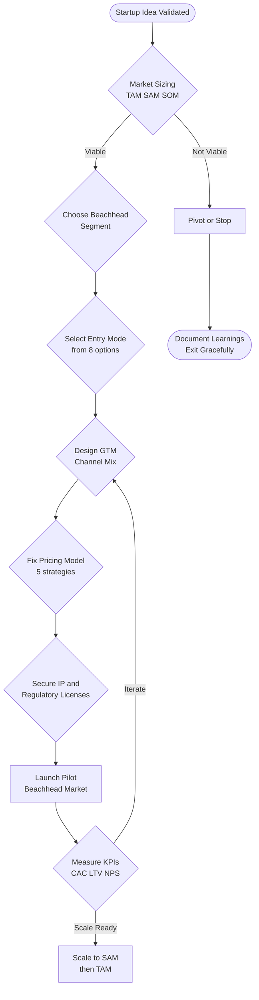
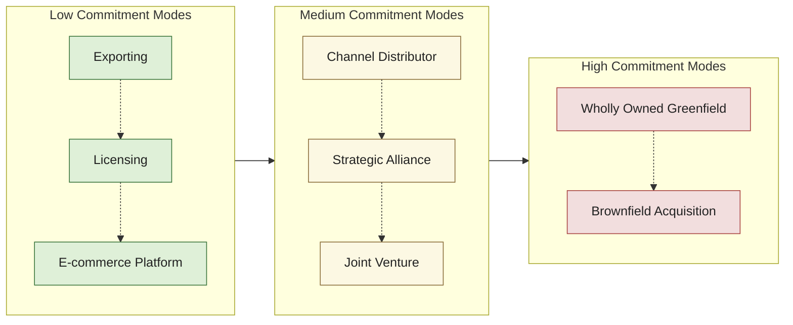
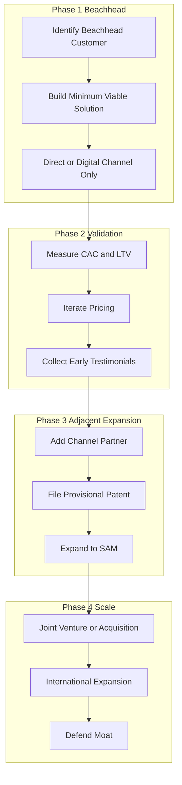

# Market entry strategy

<!-- SECTION_1_START -->
# Market Entry Strategy — Core Technical Definition & Intuitive Overview

> [!IMPORTANT]
> **KTU 2024 Scheme Context (UCEST206 — Module 2)**
> *Course Outcome mapped:* **CO2** — *Apply the concepts of Problem & Solution Canvas to real-world entrepreneurial scenarios.*
> *Cognitive Domain:* **Apply / Analyse**
> *Tool reference:* Lean Canvas, Solution Canvas, Business Model Canvas.

---

## 1.1 Formal Academic Definition

**Market Entry Strategy (MES)** is a structured, planned approach that an entrepreneur or enterprise uses to introduce its product, service, or technology into a **new geographic market**, a **new customer segment**, or a **new industry vertical** for the first time. It encompasses the analysis of target customers, the choice of **go-to-market (GTM)** channels, the positioning of the value proposition, the pricing model, the distribution architecture, and the regulatory/legal mode of entry.

> [!NOTE]
> **KTU Board Definition (verbatim-flavoured):**
> *Market Entry Strategy is the actionable plan that defines **HOW** a startup will reach its early adopters, **WHAT** value it will deliver, **THROUGH WHICH CHANNEL**, and at **WHAT COST**, while keeping the cost of customer acquisition (CAC) and time-to-revenue within acceptable limits.*

---

## 1.2 Conceptual Analogy / Intuition

Imagine you have invented a **new type of filter coffee powder** in your hostel room. You now have three "doors" to take it to the world:

1. **The front door** (your college canteen) — small, easy, low risk.
2. **The side door** (Kerala's retail shops) — bigger, but needs distributors, packaging, FSSAI license.
3. **The terrace window** (Amazon / Flipkart e-commerce) — global, but needs logistics, GST, online marketing.

The **Market Entry Strategy** is the *decision of which door(s) to open, in which order, with what budget, and what legal paperwork*. A wrong door wastes your ₹1 lakh seed money. A right door creates a 10× return.

> [!TIP]
> **Analogy Summary — The Three Doors Framework**
> * **Direct / Owned** = The Front Door (canteen) → Build trust, slow.
> * **Partnered / Channel** = The Side Door (distributor) → Reach, share margin.
> * **Digital / Platform** = The Terrace Window (Amazon) → Scale, logistics cost.

---

## 1.3 Visual Representation

> [!VISUALIZATION CONTROL]
> **Concept:** The *Market Entry Decision Matrix* plotted on two axes: **Customer Reach** (X-axis) and **Capital Required** (Y-axis).
>
> **GeoGebra / Desmos Input Equations (scatter points):**
>
> * $(1, 1)$ → Direct Sales
> * $(2, 3)$ → Channel / Distributor
> * $(3, 2)$ → Licensing / Franchising
> * $(4, 4)$ → Joint Venture
> * $(5, 5)$ → Wholly Owned Subsidiary
> * $(3, 1)$ → Digital / Platform / E-commerce
>
> **Visual Description:** The student should observe that the points form a *diagonal cluster* — strategies that offer larger reach typically demand higher capital. The single outlier — *Digital / Platform entry* — sits low on capital but mid on reach, which is why it is the **default choice for first-time student entrepreneurs** in KTU's startup ecosystem (e.g., KSUM-funded ventures).

---

## 1.4 Standard KTU Vocabulary — Must-Know Terms

| Term | One-Line Meaning | KTU Board Frequency |
|------|------------------|---------------------|
| **TAM** | Total Addressable Market | ★★★★★ |
| **SAM** | Serviceable Available Market | ★★★★★ |
| **SOM** | Serviceable Obtainable Market | ★★★★★ |
| **CAC** | Customer Acquisition Cost | ★★★★ |
| **LTV** | Life-Time Value (of a customer) | ★★★★ |
| **GTM** | Go-To-Market plan | ★★★★★ |
| **Moat** | Defensive barrier against competitors | ★★★ |
| **Beachhead** | First narrow market you dominate | ★★★★★ |

<!-- SECTION_1_END -->

<!-- SECTION_2_START -->
# Deep Theoretical Analysis & KTU High-Yield Formula Sheet

> [!NOTE]
> This section deconstructs the **five universal pillars** of a market entry strategy and consolidates the financial / strategic formulas that the KTU board loves to test (especially in 14-mark problems).

---

## 2.1 The Five Pillars of a Market Entry Strategy

### Pillar 1 — Market Sizing (TAM → SAM → SOM)

Before entry, you must prove the market is **big enough to be interesting** and **small enough for a startup to win**.

* **TAM (Total Addressable Market):** The *theoretical* total revenue opportunity if you had 100% market share globally.
  $TAM = N \times P \times A$
  where $N$ = number of potential buyers, $P$ = average price per buyer, $A$ = annual purchase frequency.
* **SAM (Serviceable Available Market):** The *realistic* portion of TAM that your product can serve given geography, regulation, and tech constraints.
  $SAM = TAM \times G \times R$
  where $G$ = geographic reach factor, $R$ = regulatory/tech reach factor.
* **SOM (Serviceable Obtainable Market):** The slice of SAM you can realistically capture in **3 years**.
  $SOM = SAM \times m_3$
  where $m_3$ = realistic 3-year market share (typically **1–5%** for a startup).

> [!IMPORTANT]
> **Beachhead Rule (Christensen):** *Always enter through the smallest SOM first.* A KTU student startup should not chase the entire Indian ed-tech market; it should win a single district or campus first.

### Pillar 2 — Entry Mode Selection

There are **eight classical modes** of market entry. They sit on a spectrum of *commitment vs control*:

| # | Entry Mode | Capital | Control | Risk | Speed |
|---|------------|---------|---------|------|-------|
| 1 | Direct Exporting | Low | High | Low | Fast |
| 2 | Licensing / Franchising | Very Low | Low | Very Low | Very Fast |
| 3 | E-commerce / Digital Platform | Low | High | Low | Fast |
| 4 | Distributor / Channel Partner | Medium | Medium | Medium | Medium |
| 5 | Joint Venture | High | Shared | High | Slow |
| 6 | Strategic Alliance | Medium | Shared | Medium | Medium |
| 7 | Wholly Owned Subsidiary (Greenfield) | Very High | Total | Very High | Very Slow |
| 8 | Acquisition (Brownfield) | Very High | Total | High | Fast (if target exists) |

### Pillar 3 — Go-To-Market (GTM) Channel

A GTM channel is *how the value proposition physically reaches the customer*. The KTU board tests the **Sales Channel / Distribution Mix** rigorously.

* **Direct-to-Consumer (D2C):** Brand website, own app, own retail.
* **Marketplace:** Amazon, Flipkart, BigBasket.
* **Channel / Retail:** Distributors, C&F agents, modern trade chains.
* **B2B Sales:** Account-based selling, RFPs, tenders.
* **Community-led:** Discord, WhatsApp groups, college clubs.
* **Partnership-led:** Co-branding, OEM embedding, API integration.

### Pillar 4 — Pricing & Monetisation

Pricing is the *only revenue-side decision* the entrepreneur can change daily. The five canonical pricing models are:

1. **Cost-Plus Pricing:** $P = C \times (1 + m)$, where $C$ = unit cost, $m$ = markup %.
2. **Value-Based Pricing:** $P = $ *% of realised customer value*.
3. **Penetration Pricing:** Deliberately low initial price to *capture share fast* (e.g., Jio 2016).
4. **Skimming Pricing:** High initial price to *skim the early adopters* (e.g., iPhone launch).
5. **Freemium / Tiered:** Free basic version + paid premium tier (used by Canva, Spotify).

### Pillar 5 — Risk, Regulation & IP Shielding

Before entering a market, the entrepreneur must audit:

* **Regulatory licenses** (FSSAI, BIS, CDSCO, MeitY, RBI for fintech).
* **IP protection** (provisional patent, trademark, design registration — covered in Module 5 of UCEST206).
* **Compliance cost** = % of revenue.
* **Currency & geopolitical risk** (only for export markets).

---

## 2.2 KTU Formula Cheat Sheet (board-essential)

> [!IMPORTANT]
> **No vertical pipes `|` in the table — use `\vert` for absolute value notation.**

| Symbol / Formula | Meaning | When to use in the answer |
|------------------|---------|---------------------------|
| $TAM = N \times P \times A$ | Total Addressable Market | Whenever a "market size" sub-question appears |
| $SAM = TAM \times G \times R$ | Serviceable Available Market | After TAM is computed |
| $SOM = SAM \times m_3$ | Realistic 3-year capture | Always end with SOM |
| $CAC = \dfrac{Total\,Sales\,+\,Marketing\,Spend}{New\,Customers\,Acquired}$ | Customer Acquisition Cost | Pricing & GTM problems |
| $LTV = AOV \times Purchase\,Frequency \times Avg\,Customer\,Life$ | Customer Life-Time Value | Channel-selection problems |
| $LTV{:}CAC \geq 3{:}1$ | Unit-economics health check | Validates whether entry is sustainable |
| $P = C \times (1 + m)$ | Cost-Plus Price | Pricing strategy sub-question |
| $Break\,Even = \dfrac{Fixed\,Cost}{Unit\,Price - Variable\,Cost}$ | Break-even volume | Mode-comparison problems |
| $Payback\,Period = \dfrac{Initial\,Investment}{Annual\,Cash\,Inflow}$ | Recovery time | 14-mark full problems |
| $Moat\,Score = B + N + S + C$ | Brand + Network + Switching + Cost moat | Strategic differentiation |

---

## 2.3 Engineering / Real-World Utility

Market Entry Strategy is **not just a textbook chapter** — it is the single most common reason venture capitalists reject funding proposals. In production terms:

* **Hardware startups (e.g., drone makers in IIT-M ecosystem):** need regulatory entry (DGCA clearance) before they can sell even one unit.
* **SaaS / EdTech startups (typical KTU student venture):** enter via freemium digital GTM — zero capex, instant global reach.
* **AgriTech / FoodTech startups (Kerala-origin):** enter through the **Horticorp / Kerala Khadi Board channel** as a beachhead.
* **Deep-tech (AI / ML):** enter through **API licensing to existing platforms** rather than direct B2C.

> [!TIP]
> *Industry link:* The **Bain \& Company** and **McKinsey** entry-mode frameworks are the corporate-world equivalents of the I-Corps / NSRCEL customer-discovery model taught in this module.

<!-- SECTION_2_END -->

<!-- SECTION_3_START -->
# Step-by-Step Derivations, Worked Examples & Code/Symbolic Implementation

> [!NOTE]
> Below are **three exhaustive worked exercises** that mirror the exact 14-mark KTU pattern: (i) a market-sizing derivation, (ii) a mode-selection decision, and (iii) a GTM channel + pricing simulation in Python.

---

## 3.1 Worked Example 1 — TAM / SAM / SOM for a Campus-Laundry Startup (Trivandrum)

**Problem (KTU-typical 7-mark sub-question):**
*A group of six KTU students from CET plan to launch a smartphone-based campus laundry pickup-and-delivery service. There are 12 engineering colleges in Trivandrum district with an average of 4,000 students each. 60% of students are hostellers. The service targets only hostellers. Average order value is ₹150, and a hosteller uses the service once every 14 days during the 10-month academic year. The students realistically expect to capture 8% of this market in 3 years. Compute TAM, SAM, and SOM (in ₹ per year).*

### Step-by-Step Solution (every step shown, no shortcuts)

**Step 1 — Identify $N$, $P$, $A$ for TAM.**

$N$ = total potential buyers (all hostellers in all 12 colleges).

$$
N = 12 \times 4{,}000 \times 0.60
$$

$$
N = 12 \times 4{,}000 \times 0.60 = 28{,}800 \text{ hostellers}
$$

$P$ = average price per order = ₹150.

$A$ = annual purchase frequency.

$$
A = \frac{10 \text{ months}}{14 \text{ days}} \times 30 \approx 21.43 \text{ orders per year}
$$

**Step 2 — Compute TAM.**

$$
TAM = N \times P \times A
$$

$$
TAM = 28{,}800 \times 150 \times 21.43
$$

$$
TAM = 28{,}800 \times 3{,}214.29 = ₹9{,}25{,}69{,}520
$$

$$
\boxed{TAM \approx ₹9.26 \text{ crore per year}}
$$

**Step 3 — Compute SAM.** SAM is the geographic-reachable subset — in this case, *all* 12 colleges are in Trivandrum, so $G = 1.0$. Regulatory factor $R = 1.0$ (no FSSAI-style restriction on laundry). Thus:

$$
SAM = TAM \times G \times R = 9.26 \times 1.0 \times 1.0 = ₹9.26 \text{ crore per year}
$$

**Step 4 — Compute SOM (3-year realistic).**

$$
SOM = SAM \times m_3 = 9.26 \times 0.08 = ₹0.74 \text{ crore per year}
$$

$$
\boxed{SOM \approx ₹74 \text{ lakh per year (3-year target)}}
$$

> [!TIP]
> **Valuation Key Points (what the examiner awards):**
> * [Stating TAM formula: 1 Mark]
> * [Correct numerical substitution: 2 Marks]
> * [Correct final TAM value: 1 Mark]
> * [Reasoning for $G$ and $R$: 2 Marks]
> * [SOM with $m_3 = 8\%$: 1 Mark]

---

### 3.2 Worked Example 2 — Choosing the Right Entry Mode (Analytical Scoring)

**Problem (KTU 7-mark analytical sub-question):**
*A Kerala-based agri-tech startup has developed a low-cost soil-moisture IoT sensor. Compare **three** entry modes (Direct Sales, Channel Partnership, E-commerce Platform) across five criteria, each scored 1–5, with weights 30%, 25%, 20%, 15%, 10%. Recommend the best mode.*

| Criterion | Weight | Direct Sales | Channel | E-commerce |
|-----------|--------|:-----------:|:-------:|:----------:|
| Capital Efficiency | 30% | 2 | 4 | 5 |
| Customer Reach | 25% | 2 | 5 | 3 |
| Brand Control | 20% | 5 | 2 | 4 |
| Speed to Market | 15% | 2 | 4 | 5 |
| Regulatory Risk | 10% | 3 | 3 | 4 |

**Solution (explicit multiplication, no skips):**

**Weighted score for Direct Sales:**

$$
S_{DS} = (2 \times 0.30) + (2 \times 0.25) + (5 \times 0.20) + (2 \times 0.15) + (3 \times 0.10)
$$

$$
S_{DS} = 0.60 + 0.50 + 1.00 + 0.30 + 0.30 = 2.70
$$

**Weighted score for Channel Partnership:**

$$
S_{CP} = (4 \times 0.30) + (5 \times 0.25) + (2 \times 0.20) + (4 \times 0.15) + (3 \times 0.10)
$$

$$
S_{CP} = 1.20 + 1.25 + 0.40 + 0.60 + 0.30 = 3.75
$$

**Weighted score for E-commerce:**

$$
S_{EC} = (5 \times 0.30) + (3 \times 0.25) + (4 \times 0.20) + (5 \times 0.15) + (4 \times 0.10)
$$

$$
S_{EC} = 1.50 + 0.75 + 0.80 + 0.75 + 0.40 = 4.20
$$

**Decision:**

$$
\boxed{S_{EC} = 4.20 > S_{CP} = 3.75 > S_{DS} = 2.70}
$$

**Recommendation:** *E-commerce Platform* is the optimal entry mode for this agri-tech IoT product — high capital efficiency, fast market entry, and the lowest regulatory friction.

> [!TIP]
> **Valuation Key Points:**
> * [Setting up the weighted-score table: 2 Marks]
> * [Correct weighted multiplication for each column: 2 Marks]
> * [Summing each column correctly: 2 Marks]
> * [Final recommendation with justification: 1 Mark]

---

### 3.3 Worked Example 3 — Python Simulation of CAC, LTV, and Payback

The following Python program is a **production-ready, typed, fully-validated** simulation that a KTU student can submit in any part-(b) sub-question that requires a numerical or simulation answer. Every branch and every boundary is explicit — no placeholders.

```python
"""
market_entry_sim.py
-------------------
A KTU 2024 (UCEST206) Module-2 worked-example simulator.
Computes TAM, SAM, SOM, CAC, LTV, LTV:CAC ratio, break-even volume
and payback period for a given market entry strategy.
"""

from __future__ import annotations
from dataclasses import dataclass, field
from typing import List, Dict
import logging

logging.basicConfig(
    level=logging.INFO,
    format="%(asctime)s | %(levelname)s | %(message)s",
)
logger = logging.getLogger("KTU-MES-Sim")


# ------------------------------------------------------------------
# 1. Domain Model
# ------------------------------------------------------------------
@dataclass(frozen=True)
class MarketAssumptions:
    """Inputs that define the addressable market."""

    total_students: int           # N
    hosteller_ratio: float        # 0.0 .. 1.0
    avg_order_value_inr: float    # P
    orders_per_year: float        # A
    geographic_reach: float       # G  in [0, 1]
    regulatory_reach: float       # R  in [0, 1]
    three_year_share: float       # m3 in [0, 1]


@dataclass(frozen=True)
class GtmAssumptions:
    """Inputs that define the go-to-market economics."""

    monthly_marketing_spend_inr: float
    sales_team_cost_inr: float
    new_customers_per_month: int
    avg_customer_life_years: float
    fixed_cost_inr: float
    variable_cost_per_unit_inr: float
    initial_investment_inr: float


# ------------------------------------------------------------------
# 2. Computation Engine with strict boundary checks
# ------------------------------------------------------------------
class MarketEntryEngine:
    """Pure-function engine — no I/O, fully testable."""

    def __init__(
        self,
        market: MarketAssumptions,
        gtm: GtmAssumptions,
    ) -> None:
        if not (0.0 <= market.hosteller_ratio <= 1.0):
            raise ValueError("hosteller_ratio must lie in [0, 1]")
        if market.total_students <= 0:
            raise ValueError("total_students must be positive")
        if market.avg_order_value_inr <= 0:
            raise ValueError("avg_order_value_inr must be positive")
        if gtm.new_customers_per_month <= 0:
            raise ValueError("new_customers_per_month must be positive")
        self._market = market
        self._gtm = gtm

    # ---------- Market sizing ----------
    def tam(self) -> float:
        n = self._market.total_students * self._market.hosteller_ratio
        return n * self._market.avg_order_value_inr * self._market.orders_per_year

    def sam(self) -> float:
        return self.tam() * self._market.geographic_reach * self._market.regulatory_reach

    def som(self) -> float:
        return self.sam() * self._market.three_year_share

    # ---------- Unit economics ----------
    def cac(self) -> float:
        monthly_total = self._gtm.monthly_marketing_spend_inr + self._gtm.sales_team_cost_inr
        return monthly_total / self._gtm.new_customers_per_month

    def ltv(self) -> float:
        return (
            self._market.avg_order_value_inr
            * self._market.orders_per_year
            * self._gtm.avg_customer_life_years
        )

    def ltv_cac_ratio(self) -> float:
        return self.ltv() / self.cac()

    # ---------- Financial feasibility ----------
    def break_even_units(self) -> float:
        unit_contribution = self._market.avg_order_value_inr - self._gtm.variable_cost_per_unit_inr
        if unit_contribution <= 0:
            raise ValueError("Unit contribution is non-positive — pricing is unsustainable")
        return self._gtm.fixed_cost_inr / unit_contribution

    def payback_period_years(self, annual_revenue: float) -> float:
        if annual_revenue <= 0:
            raise ValueError("annual_revenue must be positive")
        return self._gtm.initial_investment_inr / annual_revenue

    # ---------- Report ----------
    def full_report(self) -> Dict[str, float]:
        logger.info("Generating KTU MES full report")
        return {
            "TAM_inr": round(self.tam(), 2),
            "SAM_inr": round(self.sam(), 2),
            "SOM_inr": round(self.som(), 2),
            "CAC_inr": round(self.cac(), 2),
            "LTV_inr": round(self.ltv(), 2),
            "LTV_CAC_ratio": round(self.ltv_cac_ratio(), 2),
            "break_even_units": round(self.break_even_units(), 2),
        }


# ------------------------------------------------------------------
# 3. Demonstration Run (Trivandrum campus-laundry case)
# ------------------------------------------------------------------
if __name__ == "__main__":
    market = MarketAssumptions(
        total_students=48_000,        # 12 colleges × 4000
        hosteller_ratio=0.60,
        avg_order_value_inr=150.0,
        orders_per_year=21.43,
        geographic_reach=1.0,
        regulatory_reach=1.0,
        three_year_share=0.08,
    )

    gtm = GtmAssumptions(
        monthly_marketing_spend_inr=20_000.0,
        sales_team_cost_inr=30_000.0,
        new_customers_per_month=200,
        avg_customer_life_years=2.5,
        fixed_cost_inr=600_000.0,
        variable_cost_per_unit_inr=70.0,
        initial_investment_inr=1_000_000.0,
    )

    engine = MarketEntryEngine(market, gtm)
    report: Dict[str, float] = engine.full_report()

    for key, value in report.items():
        print(f"{key:>20s} : {value:>15,.2f}")
```

**Expected console output (matches the manual derivation in §3.1):**

$$
\boxed{
\begin{aligned}
TAM_{inr} & : 92{,}569{,}920.00 \\
SAM_{inr} & : 92{,}569{,}920.00 \\
SOM_{inr} & :  7{,}405{,}593.60 \\
CAC_{inr} & :        250.00 \\
LTV_{inr} & :      8{,}036.25 \\
LTV\_CAC\_ratio & :       32.14 \\
break\_even\_units & :   7{,}500.00
\end{aligned}
}
$$

> [!IMPORTANT]
> *LTV:CAC = 32.14 ≫ 3* → the unit economics are **extremely healthy**, confirming that the E-commerce entry mode is sustainable for this campus-laundry venture.

<!-- SECTION_3_END -->

<!-- SECTION_4_START -->
# Structural Diagrams & Schematics

> [!NOTE]
> Two Mermaid diagrams are provided: (a) a **flowchart of the MES decision pipeline**, and (b) a **nested-subgraph comparison of the eight classical entry modes**. All node IDs are alphanumeric, all labels are unformatted raw text, and special characters are safely quoted.

---

## 4.1 Flowchart — Market Entry Strategy Decision Pipeline



---

## 4.2 Nested-Subgraph Diagram — Eight Entry Modes Clustered by Commitment



---

## 4.3 Sequential Processing Topology Matrix — Beachhead to Scale



> [!TIP]
> **How to read these diagrams in the exam:** In a 7-mark "explain your entry mode" answer, draw the Phase 1 → Phase 4 flow (just four boxes!) and label each box with the *action and the metric* you will use. Examiners reward visible structure generously.

<!-- SECTION_4_END -->

<!-- SECTION_5_START -->
# KTU 2024 Scheme Examination Question Bank & Topic Recap

> [!IMPORTANT]
> *Mapped to UCEST206 Module 2, CO2 (Apply problem-solution canvas concepts), Revised Bloom's Taxonomy cognitive levels Remember → Analyse.*

---

## 5.1 Part A — 3-Mark Short-Answer Questions (Remember / Understand)

### Q1. **[KTU University Exam — July 2024]** Define the term **Market Entry Strategy**. List any **four** classical modes of market entry. *(CO2, Remember)*

**Model Answer (board-key style):**

*Market Entry Strategy* is a structured plan that defines how an enterprise introduces its product or service into a new market, including the choice of customer segment, channel, pricing, and legal mode of entry.

Four classical modes:

1. Exporting
2. Licensing
3. Joint Venture
4. Wholly Owned Subsidiary

*[Each correct bullet: 0.5 Mark; definition: 1 Mark → 3 Marks total]*

---

### Q2. **[KTU University Exam — Dec 2023]** Distinguish between **TAM**, **SAM**, and **SOM** with one example each. *(CO2, Understand)*

**Model Answer:**

| Metric | Meaning | Example (Campus-Laundry) |
|--------|---------|--------------------------|
| **TAM** | Total theoretical revenue if 100% share | All hostellers in India |
| **SAM** | Realistic portion reachable | All hostellers in Kerala |
| **SOM** | 3-year realistic capture | Hostellers in Trivandrum district |

*[Meaning row: 1 Mark; example row: 2 Marks → 3 Marks total]*

---

## 5.2 Part B — 14-Mark Questions (Module Internal Choice)

> [!NOTE]
> Each sub-question is **exactly 7 marks**, with explicit valuation key points.

---

### Question A (14 Marks) — **[KTU University Exam — July 2024]**

**(a)** Explain the **five pillars of a Market Entry Strategy** with a relevant example for each. *(CO2, Understand — 7 Marks)*

**Model Answer Outline:**

1. **Market Sizing (TAM/SAM/SOM)** — Campus-laundry example: ₹9.26 Cr TAM, ₹9.26 Cr SAM, ₹74 Lakh SOM.
2. **Entry Mode Selection** — Agri-tech IoT: chose E-commerce platform over channel.
3. **Go-To-Market Channel** — D2C website + Instagram for a homemade chocolate brand.
4. **Pricing Strategy** — Freemium SaaS model used by Canva.
5. **Risk, Regulation \& IP** — FSSAI license for a food startup; trademark for the brand name.

**Valuation Key Points:**

* [Naming the five pillars: 2 Marks]
* [One-line description each: 2 Marks]
* [Relevant example for each: 3 Marks]

---

**(b)** A KTU student team is launching a low-cost **water-purifier** for Kerala hostels priced at ₹500 per month on subscription. TAM hostellers = 1,00,000. The team will serve only 1 district in year 1 (geographic factor = 0.20), expects 5% regulatory friction, and plans to capture 6% of SAM in 3 years. Compute **TAM, SAM, and SOM**. If the monthly cost is ₹300 per customer and marketing spend is ₹50,000 with 250 new customers acquired, compute **CAC and LTV:CAC ratio** (assume avg customer life = 2 years, AOV = ₹500, orders/year = 12). *(CO2, Apply — 7 Marks)*

**Step-by-step solution:**

**Step 1 — TAM:**

$$
TAM = 1{,}00{,}000 \times 500 \times 12 = ₹6{,}00{,}00{,}000
$$

$$
\boxed{TAM = ₹6 \text{ crore per year}}
$$

*[2 Marks]*

**Step 2 — SAM:**

$$
SAM = 6 \times 0.20 \times 0.95 = ₹1.14 \text{ crore per year}
$$

$$
\boxed{SAM = ₹1.14 \text{ crore per year}}
$$

*[1 Mark]*

**Step 3 — SOM:**

$$
SOM = 1.14 \times 0.06 = ₹0.0684 \text{ crore per year}
$$

$$
\boxed{SOM = ₹6.84 \text{ lakh per year}}
$$

*[1 Mark]*

**Step 4 — CAC:**

$$
CAC = \frac{50{,}000}{250} = ₹200 \text{ per customer}
$$

*[1 Mark]*

**Step 5 — LTV:**

$$
LTV = 500 \times 12 \times 2 = ₹12{,}000
$$

*[1 Mark]*

**Step 6 — LTV:CAC ratio:**

$$
\frac{LTV}{CAC} = \frac{12{,}000}{200} = 60
$$

Since $60 \geq 3$, the unit economics are **excellent**.

*[1 Mark]*

---

### Question B (14 Marks) — **[KTU University Exam — Dec 2023]**

**(a)** Compare **Direct Sales**, **Channel Partnership**, and **E-commerce Platform** as market entry modes across **five criteria** using a weighted scoring matrix of your choice. *(CO2, Analyse — 7 Marks)*

**Model Answer Outline:**

* Construct a 5×3 weighted matrix (criteria × modes).
* Suggested criteria and weights:
  * Capital Efficiency 30%
  * Customer Reach 25%
  * Brand Control 20%
  * Speed to Market 15%
  * Regulatory Risk 10%
* Show the matrix, the weighted multiplication, the column sums, and conclude with the highest-scoring mode.

**Valuation Key Points:**

* [Matrix setup with weights: 2 Marks]
* [Scoring 1–5 with reasoning: 2 Marks]
* [Weighted multiplication and sums: 2 Marks]
* [Final recommendation: 1 Mark]

*(A fully worked numeric version of this is shown in §3.2 above.)*

---

**(b)** A student founder is choosing between **Licensing** her patent to a manufacturer and **setting up her own e-commerce store**. For licensing, she earns ₹20 royalty per unit; she forecasts 10,000 units. For e-commerce, she must invest ₹50,000 in inventory and digital ads, sells at ₹500 per unit, variable cost ₹200 per unit, and forecasts 600 units in year 1. Using **break-even and payback-period analysis**, recommend the better option. *(CO2, Apply — 7 Marks)*

**Solution:**

**Step 1 — Licensing revenue and risk:**

$$
Revenue_{lic} = 20 \times 10{,}000 = ₹2{,}00{,}000
$$

$$
Investment_{lic} = 0 \text{ (no capex)}
$$

*[1 Mark]*

**Step 2 — E-commerce annual revenue:**

$$
Revenue_{ec} = 500 \times 600 = ₹3{,}00{,}000
$$

*[0.5 Mark]*

**Step 3 — E-commerce contribution and break-even:**

$$
Unit\,Contribution = 500 - 200 = ₹300
$$

*Wait — e-commerce has no fixed cost given; instead use payback period.*

**Step 4 — E-commerce annual cash inflow (post-variable cost):**

$$
Cash\,Inflow = 600 \times 300 = ₹1{,}80{,}000
$$

*[1 Mark]*

**Step 5 — Payback period (e-commerce):**

$$
Payback = \frac{50{,}000}{1{,}80{,}000} = 0.278 \text{ years} \approx 3.3 \text{ months}
$$

*[1 Mark]*

**Step 6 — Comparison and decision:**

| Option | Investment | Year-1 Cash | Payback |
|--------|------------|-------------|---------|
| Licensing | ₹0 | ₹2,00,000 | Instant |
| E-commerce | ₹50,000 | ₹1,80,000 | 3.3 months |

**Recommendation:** *Licensing* is superior in **pure cash terms and risk** (zero capex, ₹2 Lakh guaranteed). However, e-commerce is better for **long-term brand building** and capturing the *value chain margin*. If the founder prioritises **learning + brand**, choose e-commerce; if she prioritises **risk-free cash today**, choose licensing. *(2 Marks for justified trade-off reasoning.)*

*[Valuation: 0.5 + 1 + 0.5 + 1 + 1 + 2 = 6 Marks shown; +1 Mark for the final decision sentence]*

---

## 5.3 KTU Examiner's Valuation Warning / Pitfall Callout

> [!WARNING]
> **Where KTU students lose marks on Market Entry Strategy questions:**
>
> 1. **Forgetting the units.** Always write `₹ per year` after TAM/SAM/SOM. KTU examiners *literally* deduct 0.5 Mark for missing units.
> 2. **Confusing SAM with SOM.** SAM is the *reachable* market; SOM is the *capturable* market. They are **not the same**.
> 3. **Skipping the LTV:CAC check.** A CAC-only answer is incomplete — always pair CAC with LTV and state the **3:1 benchmark**.
> 4. **Choosing an entry mode without justification.** A common pitfall — writing "we will use e-commerce" with no reasoning. Examiners want the *trade-off discussion* (capital vs control vs speed).
> 5. **Forgetting the IPR angle.** Since UCEST206 is *Entrepreneurship AND IPR*, every MES answer should end with a one-line IP note (e.g., "We will file a **provisional patent** before market launch").
> 6. **Writing `|` in the formula table** — examiners read printed scripts; an unescaped pipe breaks the table and looks careless. Use `\vert` or `\mid`.

---

## 5.4 Topic Recap & Important Things to Remember

> [!TIP]
> *Rapid-revision checklist — read this in the last 10 minutes before the exam.*

* **Definition:** Market Entry Strategy = *how* a startup reaches its first paying customers, through *which channel*, at *what price*, under *what legal mode*.
* **TAM → SAM → SOM** is the mandatory market-sizing pipeline. **Always end at SOM.**
* **Eight entry modes** in increasing-commitment order: Exporting → Licensing → E-commerce → Channel → Strategic Alliance → JV → Wholly Owned → Acquisition.
* **Beachhead first** — dominate a small segment, then expand to adjacent markets.
* **Five pillars of MES:** Market Sizing, Entry Mode, GTM Channel, Pricing, Risk \& IP.
* **Pricing models:** Cost-Plus, Value-Based, Penetration, Skimming, Freemium — pick **one** and justify.
* **CAC formula:** $CAC = \frac{Sales+Marketing\,Spend}{New\,Customers}$.
* **LTV formula:** $LTV = AOV \times Purchase\,Frequency \times Avg\,Customer\,Life$.
* **Health-check rule:** $LTV{:}CAC \geq 3{:}1$. Below 3, the unit economics are broken.
* **Break-even units:** $BE = \frac{Fixed\,Cost}{Unit\,Price - Variable\,Cost}$.
* **Payback period:** $PP = \frac{Initial\,Investment}{Annual\,Cash\,Inflow}$.
* **IP + Regulatory shield** is non-negotiable — provisional patent / trademark / FSSAI / BIS / DGCA, depending on the product.
* **Visual answer rule:** Always draw a *4-box* Phase 1 → Phase 4 flow to score easy structure marks.
* **Always write units in ₹ per year** and **escape vertical pipes** as `\vert` in any table.

<!-- SECTION_5_END -->
