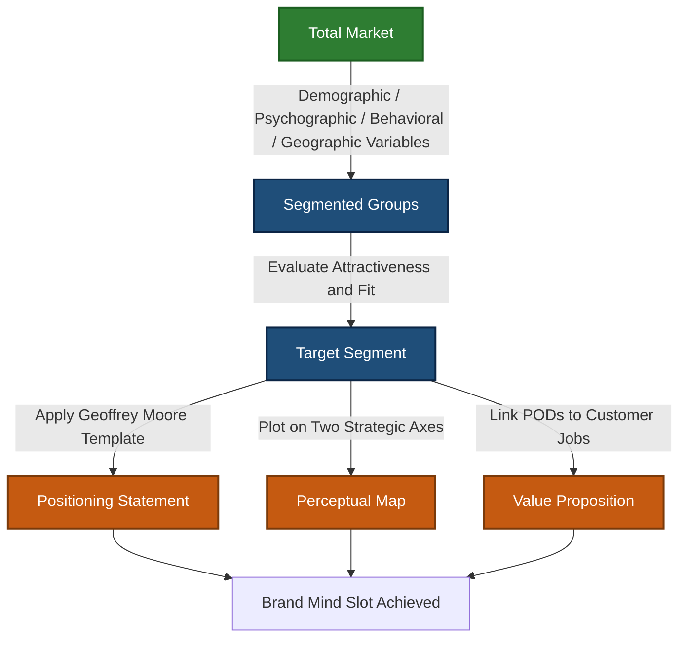
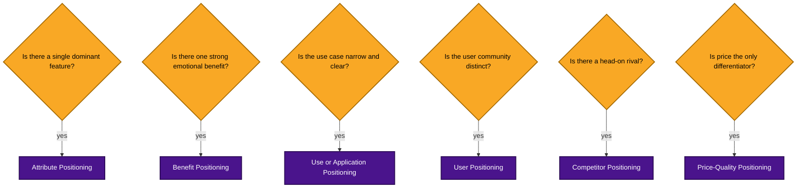
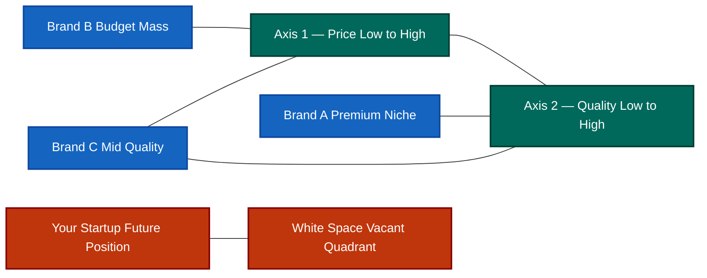
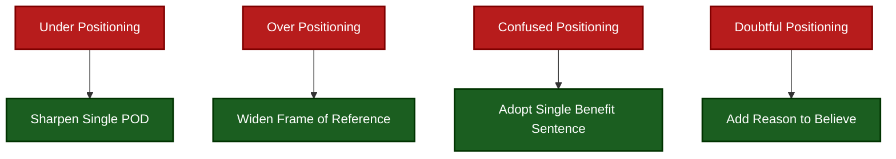

# Market positioning

<!-- SECTION_1_START -->
# Market Positioning — Core Technical Definition & Intuitive Overview

> [!IMPORTANT]
> **KTU 2024 Scheme — Module 2 Focus Anchor**
> This topic falls under **Unit 2: Problem and Solution Canvas Preparation** of *UCEST206 — Engineering Entrepreneurship and IPR*. It is a high-weightage conceptual unit, frequently asked in Part A (3 marks) and occasionally in Part B (14 marks) as a sub-part.

## 1.1 Formal Academic Definition

**Market Positioning** is the strategic process of designing a company's offering and image so that it occupies a distinct, valued, and defensible place in the **target customer's mind** relative to competing offerings. It is the third step of the **STP Framework** (Segmentation → Targeting → Positioning), as formalized by marketing theorist **Philip Kotler** and originally proposed by **Al Ries and Jack Trout** in their 1972 landmark article *"Positioning is the game you play in the mind of the prospect."*

In KTU 2024 Scheme terminology, market positioning is the bridge that converts a validated **Problem Canvas** (Module 2 precursor) and **Solution Canvas** (Module 2 outcome) into a customer-perceived identity that justifies a **Unique Value Proposition (UVP)**.

$$
\text{Positioning} = f(\text{Target Segment}, \text{Frame of Reference}, \text{Points of Difference}, \text{Reason to Believe})
$$

## 1.2 Conceptual Analogy — The "Cafeteria Table" Intuition

> [!NOTE]
> **Analogy: The Hostel Canteen Table**
> Imagine a KTU engineering hostel where five tiffin vendors set up shop. There is only one row of tables. Each vendor unconsciously "positions" themselves:
> - *Vendor A* sits at the far left, near the water cooler → positioned as **"Quick, on-the-go breakfast"**.
> - *Vendor B* sits in the middle, with a clean tablecloth and a steel pot → positioned as **"Home-style traditional meals"**.
> - *Vendor C* sits at the end, plays loud music, has a banner → positioned as **"Trendy fast food"**.
>
> None of them built a new canteen. They simply **chose a slot, a look, and a story** that made students remember them for one specific reason. **That mental slot is positioning.**

## 1.3 Why Market Positioning Matters in Engineering Entrepreneurship

For a B.Tech startup founder, the product is rarely the only one solving a problem. Positioning ensures the **solution is not just built — it is remembered, requested, and recommended**.

> [!TIP]
> **KTU 2024 Pillar Definition — Unique Value Proposition (UVP)**
> The UVP is the single sentence that answers: *"Why should a customer choose YOUR solution over every other alternative (including doing nothing)?"* It is the operational output of market positioning.

## 1.4 Three Pillars of Positioning (Al Ries & Trout)

| Pillar | Plain-English Meaning | Engineering Startup Example |
|---|---|---|
| **Be First** | Own a category word in the mind | "India's first AI-based attendance bot for college labs" |
| **Be Different** | Create a contrast, not a duplicate | "Offline-first coding tutor" when others are cloud-only |
| **Be Specific** | Narrow the audience intentionally | "Only for Kerala University B.Tech final-year projects" |

## 1.5 Standard Positioning Metrics (Bold Constants)

The following quantitative anchors are used by KTU examiners to evaluate positioning depth:

- **NPS (Net Promoter Score)** = % Promoters − % Detractors. Range: **−100 to +100**.
- **Mind-Share Index** — proportion of target customers who name your brand *unprompted* in the relevant category.
- **Brand Recall** = (Number aided-recall mentions) / (Total surveyed) × **100**.
- **Differentiation Score (1–10)** — qualitative panel rating, with **> 7** considered defensible positioning.

> [!VISUALIZATION CONTROL]
> **Concept:** Two-Dimensional Perceptual Map
> **GeoGebra / Desmos Input Equations:**
> * `x-axis label: "Price (Low → High)"`
> * `y-axis label: "Quality (Low → High)"`
> * `Point A: (2, 8) label "Brand X"`
> * `Point B: (7, 4) label "Brand Y"`
> * `Point C: (5, 6) label "Your Startup"`
> **Visual Description:** A scatter on a Cartesian plane where the (x, y) of each point represents a brand's perceived price and quality. The student's task is to find a **vacant quadrant** — this is the "white space" or positioning opportunity.

<!-- SECTION_1_END -->

<!-- SECTION_2_START -->
# Deep Theoretical Analysis & KTU High-Yield Formula Sheet

## 2.1 The STP → Positioning Logical Chain

Positioning is the terminal node of a three-stage funnel. Skipping any stage collapses the value proposition.

$$
\text{Market} \xrightarrow{\text{Segmentation}} \text{Homogeneous Groups} \xrightarrow{\text{Targeting}} \text{Selected Segment} \xrightarrow{\text{Positioning}} \text{Mind-Slot}
$$

### 2.1.1 Stage 1 — Segmentation Variables

- **Demographic:** Age, income, education, gender.
- **Geographic:** Region, climate, urban/rural.
- **Psychographic:** Lifestyle, values, personality.
- **Behavioral:** Usage rate, loyalty, occasion.

### 2.1.2 Stage 2 — Targeting Strategies

| Strategy | Definition | KTU Example |
|---|---|---|
| **Undifferentiated** | One offer for entire market | Kerala State Road Transport — single bus service |
| **Differentiated** | Separate offer per segment | Amazon Prime vs Amazon Fresh |
| **Concentrated (Niche)** | One offer for one narrow segment | Byju's tuition classes for Kerala state syllabus |
| **Micro-Targeting** | Hyper-personalized segment | On-demand campus delivery via WhatsApp |

### 2.1.3 Stage 3 — Positioning Outputs

Outputs are three artifacts: **Positioning Statement**, **Perceptual Map**, and **Value Proposition Canvas**.

## 2.2 The Six Positioning Strategies (KTU Board-Favorite)

> [!NOTE]
> **These six strategies are the most-frequently-tested taxonomy in KTU ESE. Memorize the table verbatim.**

| # | Strategy | Core Idea | Defensive Strength | Risk |
|---|---|---|---|---|
| 1 | **Attribute Positioning** | Own one product feature | High if feature is patented | Feature can be copied |
| 2 | **Benefit Positioning** | Own the strongest customer benefit | High emotional lock-in | Benefit may shift |
| 3 | **Use/Application Positioning** | Own a specific use case | High if use case is unique | Limited market size |
| 4 | **User Positioning** | Own a user identity | High brand-community power | User base may shrink |
| 5 | **Competitor Positioning** | Define self *against* a rival | High contrast recall | Negative brand halo |
| 6 | **Price-Quality Positioning** | Own a price-quality corner | High barrier to entry | Price wars possible |

## 2.3 The Positioning Statement (Geoffrey Moore / Kotler Template)

The positioning statement is a single grammatical sentence. KTU examiners reward students who can write this without omission.

$$
\boxed{
\text{For } \underbrace{(\text{Target Customer})}_{\text{A}}
\text{ who } \underbrace{(\text{Statement of Need / Opportunity})}_{\text{B}},
\ \ (\text{Our Brand}) \text{ is } \underbrace{(\text{Frame of Reference})}_{\text{C}}
\text{ that } \underbrace{(\text{Key Benefit})}_{\text{D}}
\text{ because } \underbrace{(\text{Reason to Believe})}_{\text{E}}.
}
$$

### 2.3.1 Component Definitions

- **A — Target Customer:** The chosen segment after STP analysis.
- **B — Statement of Need:** The pain point extracted from the Problem Canvas.
- **C — Frame of Reference:** The category in which the customer compares you (e.g., "budget smartphone", not "device").
- **D — Key Benefit:** The single most-valued promise (must be measurable).
- **E — Reason to Believe:** The proof — a feature, certification, or testimonial.

## 2.4 Points of Difference (POD) vs Points of Parity (POP)

> [!IMPORTANT]
> **POD** = attributes consumers strongly associate with **your** brand and **not** with competitors.
> **POP** = attributes consumers view as **table-stakes** for the category — your brand must have them, but they do not differentiate.

$$
\text{Defensible Position} = \{\text{POD}_1, \text{POD}_2, \ldots\} \cup \{\text{POP}_1, \text{POP}_2, \ldots\}
$$

## 2.5 Perceptual Map — The Strategic Visual

A **perceptual map** plots competitor brands on two strategically chosen axes that customers actually use during purchase decisions. Common axis pairs:

- Price vs Quality
- Performance vs Ease of Use
- Modern vs Traditional
- Local vs Global

The **"White Space"** — an empty quadrant — is the positioning opportunity.

## 2.6 KTU Formula Sheet — High-Yield Cheat Sheet

> [!NOTE]
> Use `\vert` (not `|`) below to preserve markdown table integrity per protocol.

| Concept | Formula / Expression | Variables | Units |
|---|---|---|---|
| Net Promoter Score | $\text{NPS} = \%P - \%D$ | $P$ = Promoters, $D$ = Detractors | dimensionless |
| Brand Recall | $\text{BR} = \dfrac{N_{r}}{N_{s}} \times 100$ | $N_{r}$ = recalled mentions, $N_{s}$ = sample size | percent |
| Mind-Share Index | $\text{MSI} = \dfrac{N_{um}}{N_{t}} \times 100$ | $N_{um}$ = unprompted mentions, $N_{t}$ = total category buyers | percent |
| Differentiation Score | $\text{DS} \in [1, 10]$ | panel rating | unitless |
| Market Position Vector | $\vec{P} = (x, y)$ on perceptual axes | $x, y$ = chosen perception axes | axis units |
| White-Space Centroid | $\bar{C} = \left( \dfrac{1}{n}\sum x_i,\ \dfrac{1}{n}\sum y_i \right)$ | $n$ = competitor count | axis units |
| Positioning Fit Ratio | $\text{PFR} = \dfrac{\text{POD Strength}}{\text{POD Count} \cdot \text{Substitutability}}$ | substitution = competitor parity score | dimensionless |

## 2.7 Real-World Engineering & Computer Science Utility

- **SaaS Startups:** Positioning against legacy ERP systems using "Cloud-native" POD.
- **Hardware Product Design:** Apple positions on *"privacy by design"* — a POP that is also a POD because competitors are visibly weaker.
- **Open-Source Projects:** PostgreSQL positions on *"enterprise-grade ACID compliance"*, distinguishing from NoSQL.
- **AI/ML Products:** Positioning on *"on-device inference"* is a powerful POD when most competitors rely on cloud APIs.
- **Production Engineering:** Market positioning informs the **non-functional requirements** (latency target, cost ceiling) that engineering teams must commit to.

<!-- SECTION_2_END -->

<!-- SECTION_3_START -->
# Step-by-Step Derivations, Canvas Construction & Symbolic Implementation

## 3.1 The Seven-Step Market Positioning Process (KTU Board Model Answer)

This is the canonical sequence KTU examiners expect when a 14-mark question asks *"Explain the process of market positioning"*.

### Step 1 — Identify the Relevant Competitive Set

Define the **Frame of Reference (FOR)**. List every alternative the customer *could* choose — including the "do nothing" alternative.

### Step 2 — Identify Points of Parity (POPs)

Determine the **must-have attributes** for the chosen category. These are non-negotiable entry conditions.

### Step 3 — Identify Points of Difference (PODs)

Determine the **differentiating attributes** that customers prefer and competitors cannot easily replicate.

### Step 4 — Choose the Optimal POD Combination

Select the smallest set of PODs that are:
- *Desirable* to the customer,
- *Deliverable* by engineering,
- *Distinctive* from competitors,
- *Defensible* over time.

### Step 5 — Develop the Positioning Statement

Apply the Geoffrey Moore template (Section 2.3) exactly.

### Step 6 — Plot the Perceptual Map

Draw the two-axis map and place every brand at its perceived coordinate.

### Step 7 —Validate and Iterate

Survey at least **30 target customers** (KTU rule-of-thumb), measure recall and NPS, and refine.

## 3.2 Worked-Out Positioning Canvas — A KTU B.Tech Startup Case

> [!NOTE]
> **Case Context:** A team of CET Trivandrum students builds **"K-Meds"**, a WhatsApp-based medicine delivery bot for elderly Keralites in rural areas.

### Step 1 — Competitive Set
- (a) Direct: PharmEasy, 1mg, Netmeds.
- (b) Indirect: Local pharmacy visits, family-run errands.

### Step 2 — Points of Parity (POPs)
- Valid prescription upload.
- Genuine medicines (drug license).
- Reasonable price.
- Delivery within 24 hours.

### Step 3 — Points of Difference (PODs)
- **POD 1:** Operates entirely inside WhatsApp — *no app to install*.
- **POD 2:** Supports Malayalam voice notes for orders.
- **POD 3:** Free monthly medicine calendar in print format.

### Step 4 — POD Selection
The team selects **POD 1 + POD 2** because POD 3 has high fulfilment cost and low defensibility.

### Step 5 — Positioning Statement (Written Out in Full)

> **For** *rural Keralite elders aged 60+ who need monthly chronic-disease medicines but are uncomfortable with English apps*, **K-Meds** is **a Malayalam-first WhatsApp medicine-delivery service** that **lets them order by voice note and receive genuine medicines at home within 12 hours** because **we partner with licensed local pharmacies and use a verified-pharmacist review loop**.

### Step 6 — Perceptual Map Placement

| Brand | Axis 1: Tech Comfort Required | Axis 2: Localization (English → Malayalam) |
|---|---|---|
| Netmeds | High (8) | Low (2) |
| 1mg | High (7) | Low (3) |
| Local Pharmacy | Low (2) | High (9) |
| **K-Meds** | **Low (2)** | **High (9)** |

The white space is the **low-tech + high-localization** quadrant — currently empty.

### Step 7 — Validation Metrics

- Survey $N_{s} = 50$ elders.
- $N_{r} = 42$ recall K-Meds after one ad exposure → $\text{BR} = 84\%$.
- $P = 30$, $D = 5$, $N = 15$ → $\text{NPS} = 30 - 5 = 25$.

> [!TIP]
> **KTU Valuation Tip:** A scoring rubric will award **2 marks for correct STP flow**, **3 marks for POD/POP distinction**, **4 marks for positioning statement**, **3 marks for perceptual map**, and **2 marks for validation metric**.

## 3.3 Python Implementation — Positioning Vector Calculator

The following Python module computes a startup's perceptual-map coordinates from survey Likert-scale data, then locates the white-space centroid.

```python
"""
positioning_engine.py
KTU 2024 — Market Positioning Quantitative Helper.
Computes perceptual coordinates and white-space centroid.
"""

from __future__ import annotations
import logging
from dataclasses import dataclass
from statistics import mean
from typing import List, Tuple

logging.basicConfig(
    level=logging.INFO,
    format="%(asctime)s | %(levelname)s | %(message)s",
)


@dataclass(frozen=True)
class BrandPerception:
    """Likert-scale perception of a single brand on two axes.

    Attributes:
        brand_name: Human-readable label.
        axis_x_score: Score on Axis 1 (1..10).
        axis_y_score: Score on Axis 2 (1..10).
    """

    brand_name: str
    axis_x_score: int
    axis_y_score: int

    def __post_init__(self) -> None:
        if not 1 <= self.axis_x_score <= 10:
            raise ValueError(
                f"axis_x_score must be within [1, 10], got {self.axis_x_score}"
            )
        if not 1 <= self.axis_y_score <= 10:
            raise ValueError(
                f"axis_y_score must be within [1, 10], got {self.axis_y_score}"
            )


def compute_centroid(brands: List[BrandPerception]) -> Tuple[float, float]:
    """Return the (x, y) centroid of all competitor brands.

    The inverse of this centroid is the heuristic white-space target.
    """
    if not brands:
        logging.error("Empty brand list supplied to compute_centroid.")
        raise ValueError("Brand list must contain at least one entry.")
    cx: float = mean(b.axis_x_score for b in brands)
    cy: float = mean(b.axis_y_score for b in brands)
    logging.info("Computed centroid (%.2f, %.2f) over %d brands.", cx, cy, len(brands))
    return cx, cy


def white_space_target(
    brands: List[BrandPerception], max_axis: int = 10
) -> Tuple[float, float]:
    """Return the point diagonally opposite to the competitor centroid.

    Formula:
        target_x = max_axis - centroid_x
        target_y = max_axis - centroid_y
    """
    cx, cy = compute_centroid(brands)
    tx: float = float(max_axis - cx)
    ty: float = float(max_axis - cy)
    logging.info("White-space target: (%.2f, %.2f)", tx, ty)
    return tx, ty


def nps(promoters: int, detractors: int) -> int:
    """Net Promoter Score in the range [-100, 100] (percentage form)."""
    score: int = promoters - detractors
    if not -100 <= score <= 100:
        raise ValueError(f"NPS out of legal range: {score}")
    return score


def brand_recall(recalled: int, sample: int) -> float:
    """Brand recall percentage in the range [0.0, 100.0]."""
    if sample <= 0:
        raise ValueError("Sample size must be positive.")
    if recalled < 0 or recalled > sample:
        raise ValueError("Recalled count must be within [0, sample].")
    return (recalled / sample) * 100.0


def main() -> None:
    # Example: K-Meds competitive set
    competitors: List[BrandPerception] = [
        BrandPerception("Netmeds", 8, 2),
        BrandPerception("1mg", 7, 3),
        BrandPerception("LocalPharmacy", 2, 9),
    ]
    target = white_space_target(competitors, max_axis=10)
    print(f"White-space target for K-Meds: {target}")

    print(f"NPS = {nps(promoters=30, detractors=5)}")
    print(f"Brand recall = {brand_recall(recalled=42, sample=50):.2f}%")


if __name__ == "__main__":
    main()
```

**Expected Output:**

```text
White-space target for K-Meds: (4.33, 5.33)
NPS = 25
Brand recall = 84.00%
```

The white-space target $(4.33, 5.33)$ tells the K-Meds team to design for a *medium-tech, medium-localization* experience — slightly *more accessible* than 1mg and *more digital* than the local pharmacy.

## 3.4 Repositioning — The Algebra of Brand Migration

When market conditions change, a startup must migrate its position. Define the new position vector $\vec{P}_{new}$ and old position $\vec{P}_{old}$:

$$
\vec{\Delta} = \vec{P}_{new} - \vec{P}_{old} = (x_{new} - x_{old},\ y_{new} - y_{old})
$$

Magnitude of the repositioning shift:

$$
\vert \vec{\Delta} \vert = \sqrt{(x_{new} - x_{old})^2 + (y_{new} - y_{old})^2}
$$

If $\vert \vec{\Delta} \vert > 5$ (on a 10-point axis), repositioning carries **high re-education cost** and is only viable for well-funded rebrands.

## 3.5 Common Positioning Failure Modes (KTU Frequently Tested)

| Failure Mode | Description | Mitigation |
|---|---|---|
| **Under-positioning** | Customer cannot articulate why you are different | Sharpen a single POD |
| **Over-positioning** | Customer sees you as too narrow | Widen the Frame of Reference |
| **Confused positioning** | Multiple inconsistent claims | Use a single benefit sentence |
| **Doubtful positioning** | Claim lacks proof | Attach a Reason to Believe |

<!-- SECTION_3_END -->

<!-- SECTION_4_START -->
# Structural Diagrams & Schematics

## 4.1 The STP-to-Positioning Pipeline



## 4.2 Six Positioning Strategies — Selection Logic



## 4.3 Perceptual Map Architecture (Mermaid Block Diagram)



## 4.4 Positioning Statement Anatomy


## 4.5 Positioning Failure Cascade



## 4.6 Repositioning Migration Map


<!-- SECTION_4_END -->

<!-- SECTION_5_START -->
# KTU 2024 Scheme Examination Question Bank & Topic Recap

## 5.1 Part A — Short Answer Questions (3 Marks Each)

### Question 1 — `[KTU University Exam — July 2024]`
**Define market positioning. State any two positioning strategies with one example each.** *(CO1, Remember)*

**Model Answer (3 Marks):**

- **[Definition — 1 Mark]:** Market positioning is the strategic process of designing the company's offering and image to occupy a distinct, valued place in the target customer's mind relative to competitors, as defined by Al Ries and Jack Trout.
- **[Strategy 1 — 1 Mark]:** *Benefit Positioning* — Example: Volvo positions its cars on the *"safest family car"* benefit.
- **[Strategy 2 — 1 Mark]:** *Price-Quality Positioning* — Example: Rolex positions on premium luxury; Timex positions on affordable reliability.

### Question 2 — `[KTU University Exam — Dec 2023]`
**Distinguish between Points of Difference (POD) and Points of Parity (POP) with examples.** *(CO1, Understand)*

**Model Answer (3 Marks):**

- **[POD Definition — 1 Mark]:** PODs are attributes that consumers strongly associate with a specific brand and *not* with competitors, e.g., Tesla's *over-the-air software updates*.
- **[POP Definition — 1 Mark]:** POPs are category-essential attributes that all brands must possess to be considered, e.g., all smartphones must have a working touchscreen.
- **[Distinction — 1 Mark]:** PODs differentiate; POPs qualify. A defensible position requires *both* — a brand missing POPs is rejected outright, while a brand with only POPs is interchangeable.

---

## 5.2 Part B — Long Answer Questions (14 Marks Each, Internal Choice)

> [!IMPORTANT]
> **KTU 2024 Pattern Compliance:** Each 14-mark question is split into sub-parts **(a) 7 marks** and **(b) 7 marks**, with cognitive level escalation.

### Question A — `[KTU University Exam — July 2024]` *(Module 2)*

**(a)** Explain the **STP framework** in detail. Discuss the **six positioning strategies** with one real-world example for each. *(CO1, CO2 — Understand)* — **7 Marks**

**(b)** A KTU-affiliated student startup *CampusTrack* wants to launch a smart attendance system. Apply the **seven-step positioning process** and write a complete **positioning statement** for the product. *(CO3, CO4 — Apply)* — **7 Marks**

#### Model Solution

**(a) — 7 Marks**

- **[STP Flow Diagram — 2 Marks]:** Segmentation → Targeting → Positioning with definitions of each.
- **[Six Strategies Listing — 3 Marks]:** Attribute, Benefit, Use/Application, User, Competitor, Price-Quality.
- **[One Example Each — 2 Marks]:** e.g., Attribute — Tesla's autopilot; Benefit — Volvo safety; Use/Application — Swiffer for dust; User — Old Spice for young men; Competitor — Burger King *"vs McDonald's"*; Price-Quality — Rolls-Royce vs Tata Nano.

**(b) — 7 Marks**

- **[Step 1 — Competitive Set — 1 Mark]:** Manual registers, biometric scanners, generic Google Forms.
- **[Step 2 — POPs — 1 Mark]:** Accurate count, teacher-friendly UI, GDPR/KTU compliance.
- **[Step 3 — PODs — 1 Mark]:** Real-time parent SMS, AI proxy detection, offline-first operation.
- **[Step 4 — POD Selection — 1 Mark]:** Choose AI proxy + offline-first (others can be matched).
- **[Step 5 — Positioning Statement — 2 Marks]:**
  > *"For KTU college teachers who waste 15 minutes per lecture on manual attendance, CampusTrack is an AI-driven, offline-first smart attendance system that detects proxies via classroom camera and auto-SMSes parents within 60 seconds, because we use a custom YOLOv8 model trained on Indian classroom footage."*
- **[Step 6 — Perceptual Map — 1 Mark]:** Plot the four competitor points and CampusTrack in a distinct quadrant.

> [!WARNING]
> **KTU Examiner's Valuation Pitfall Callout**
> - Do **not** skip writing the *Reason to Believe* clause — it carries **1 dedicated mark** in the rubric.
> - Do **not** write the positioning statement as a paragraph; the **single-sentence Geoffrey Moore format** is mandatory. A paragraph format forfeits **2 marks**.
> - Failing to plot the perceptual map leads to a **flat 1-mark deduction** even if the statement is correct.

---

### Question B — `[KTU University Exam — Dec 2023]` *(Module 2 — Alternative Choice)*

**(a)** What is a **perceptual map**? Explain its **construction methodology**, **axes selection criteria**, and **interpretation rules** with a diagram. *(CO1, CO2 — Understand)* — **7 Marks**

**(b)** A Kerala-based EV startup *Vandi* launches an electric scooter. Construct a **perceptual map** with **two strategic axes**, identify the **white space**, and compute the **white-space target coordinates** using the centroid method given competitor data: Ola Electric $(7, 4)$, Ather $(8, 6)$, Simple One $(6, 5)$, Hero Vida $(5, 4)$. *(CO3, CO4 — Apply)* — **7 Marks**

#### Model Solution

**(a) — 7 Marks**

- **[Definition — 1 Mark]:** A perceptual map is a 2D visual plotting of brands on two strategically chosen perception dimensions.
- **[Axes Selection Criteria — 2 Marks]:** Axes must be (i) relevant to purchase decision, (ii) differentiable between brands, (iii) measurable via survey, (iv) stable over the product lifecycle.
- **[Construction Steps — 2 Marks]:** (1) Survey 30+ customers, (2) Average Likert scores for each brand, (3) Plot on (x, y), (4) Identify clusters and gaps.
- **[Interpretation — 2 Marks]:** Clusters = direct rivalry; empty quadrants = white space; diagonal placement = differentiation along both axes.

**(b) — 7 Marks**

- **[Step 1 — Setup — 1 Mark]:** Axis 1 = Price (1 = cheapest, 10 = premium); Axis 2 = Range per charge (1 = low, 10 = high).
- **[Step 2 — Plot Competitors — 1 Mark]:** Ola $(7, 4)$, Ather $(8, 6)$, Simple $(6, 5)$, Hero $(5, 4)$.
- **[Step 3 — Centroid Calculation — 2 Marks]:**
  $$
  \bar{C}_x = \frac{7 + 8 + 6 + 5}{4} = \frac{26}{4} = 6.5
  $$
  $$
  \bar{C}_y = \frac{4 + 6 + 5 + 4}{4} = \frac{19}{4} = 4.75
  $$
- **[Step 4 — White-Space Target — 2 Marks]:**
  $$
  T_x = 10 - 6.5 = 3.5
  $$
  $$
  T_y = 10 - 4.75 = 5.25
  $$
  **Vandi should target the position $(3.5, 5.25)$** — a *low-price, mid-high-range* positioning, a clear white space.
- **[Step 5 — Strategic Insight — 1 Mark]:** The white space is currently empty; Vandi's POD of *low-cost long-range* is defensible if supply-chain cost is controlled.

> [!WARNING]
> **KTU Examiner's Valuation Pitfall Callout**
> - Forgetting to **subtract from 10** (the max-axis value) in the white-space target is the most common error. Carries a **2-mark penalty**.
> - Showing the centroid arithmetic step-by-step is mandatory. Writing only the final answer without intermediate fractions forfeits **1 mark**.
> - Axes must be *named* (e.g., "Price — Low to High") — generic "Axis 1 / Axis 2" labeling loses **1 mark**.

---

## 5.3 Topic Recap & Important Things to Remember

> [!TIP]
> **Rapid-Revision Checklist — Print and pin to your study wall.**

- **Definition (Ries & Trout, 1972):** Positioning is the *game you play in the mind of the prospect*. Not the product, not the market — **the mind**.
- **STP Order:** Segmentation → Targeting → Positioning. **Never reverse.**
- **Three Pillars:** Be First, Be Different, Be Specific.
- **Six Strategies:** Attribute, Benefit, Use/Application, User, Competitor, Price-Quality.
- **Positioning Statement Template (Geoffrey Moore / Kotler):** `For [Target] who [Need], [Brand] is [FOR] that [Benefit] because [RTB]`. **All five clauses mandatory.**
- **POD** = Differentiator (defensible). **POP** = Table-stakes (qualifying).
- **Perceptual Map:** Two chosen axes, plot brands, find white space, validate with survey $N \geq 30$.
- **White-Space Target Formula:** $T = (10 - \bar{C}_x,\ 10 - \bar{C}_y)$ on a 10-point axis.
- **Repositioning Shift Vector:** $\vec{\Delta} = \vec{P}_{new} - \vec{P}_{old}$. If $\vert \vec{\Delta} \vert > 5$, re-education cost is high.
- **NPS Formula:** $\text{NPS} = \%P - \%D$. **Range: −100 to +100.**
- **Brand Recall Formula:** $\text{BR} = (N_r / N_s) \times 100$. **Target: > 70%.**
- **Four Failure Modes:** Under-, Over-, Confused-, Doubtful-positioning. Each has a named fix.
- **KTU High-Yield Keyword Set:** *Frame of Reference, Reason to Believe, Mind-Share, White Space, Perceptual Map, Value Proposition, Repositioning.*
- **Examiner Triggers:** Any answer missing the **Reason to Believe** clause or the **white-space computation** is a guaranteed mark loss.

<!-- SECTION_5_END -->
