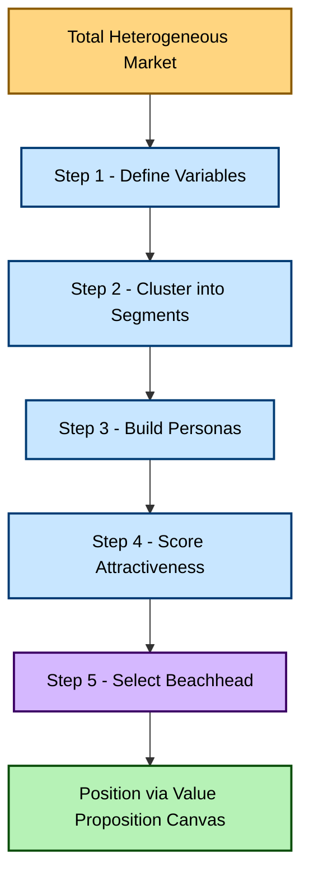
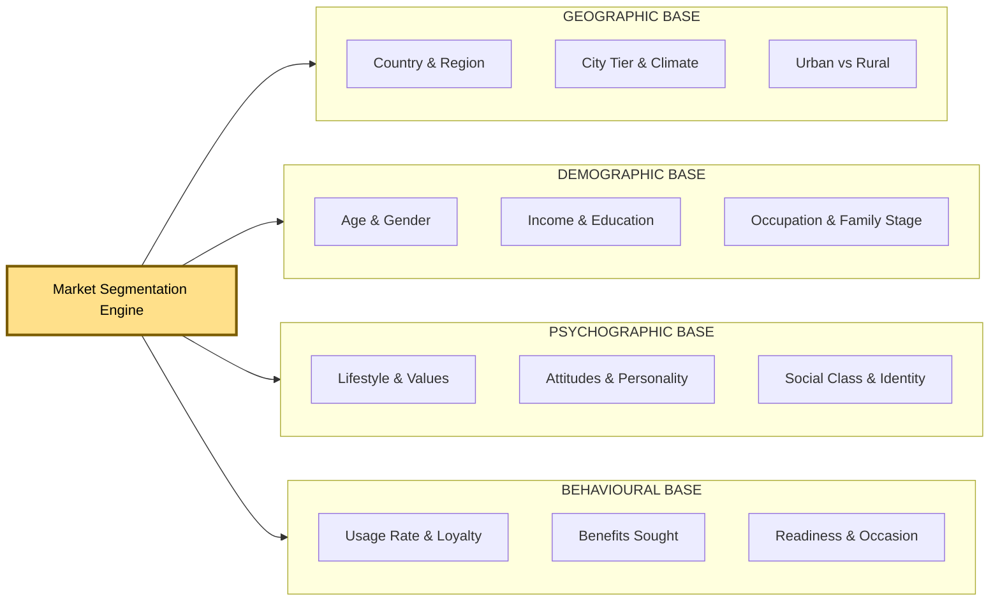
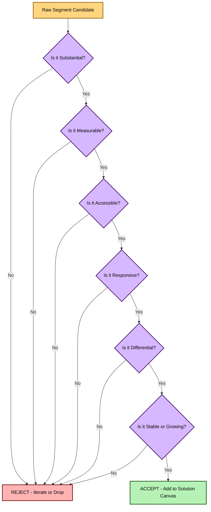
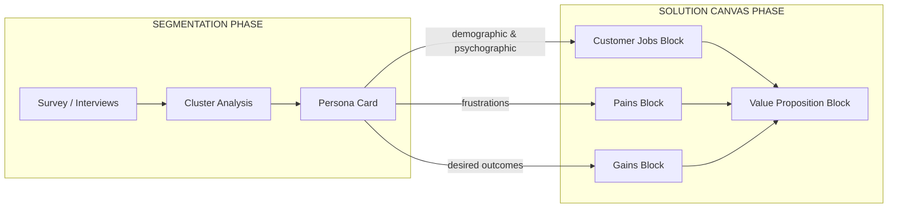

# Market segmentation

<!-- SECTION_1_START -->
# Market Segmentation — Core Definition & Intuitive Overview

## 1.1 Formal Academic Definition (KTU 2024 Syllabus Terminology)

> [!IMPORTANT]
> **Market Segmentation** is the strategic process of dividing a heterogeneous total market into relatively homogeneous, clearly identifiable, and reachable sub-groups of buyers (called *segments*) who share similar needs, characteristics, behaviours, or responses to marketing-mix stimuli. The objective is to enable the entrepreneur to design a tailored *value proposition*, achieve a strong **Problem–Solution Fit**, and serve each group more profitably than by treating the market as a single undifferentiated mass.

In the KTU **UCEST206 – Engineering Entrepreneurship and IPR** syllabus, segmentation sits at the heart of **Module 2 (Problem and Solution Canvas Preparation)** because no Solution Canvas is valid until the founder has rigorously identified *who* exactly the solution is being built for. The widely accepted *Segmentation–Targeting–Positioning (STP)* framework is the academic backbone of this topic.

$$
\text{Market} \;\xrightarrow{\;\text{Segmentation}\;}\; \{S_1, S_2, S_3, \dots, S_n\} \;\xrightarrow{\;\text{Targeting}\;}\; S_{\text{focus}} \;\xrightarrow{\;\text{Positioning}\;}\; \text{Value Proposition}
$$

where each $S_i$ represents a distinct, addressable market segment, and $S_{\text{focus}}$ is the segment chosen as the beachhead by the entrepreneur.

---

## 1.2 Conceptual Analogy / Intuition (Plain-English)

> [!NOTE]
> **Analogy — The Coffee Shop Story**
> Imagine you own a single coffee kiosk. If you serve *everyone* the same drink, you will probably under-please the student (who wants cheap, sweet iced coffee), the office executive (who wants strong, hot espresso with no sugar), and the elderly morning walker (who wants mild, decaf tea). The moment you recognise that the people walking past your kiosk are **not all the same**, and you start offering three distinct product lines, you have *segmented* your market. Segmentation, therefore, is the act of saying: *"My market is not one crowd — it is several smaller crowds, and each wants something slightly different."*

A more formal intuition is geometric: a market is a **scattered cloud of customers** in a multi-dimensional space (age, income, need, behaviour, geography). Segmentation algorithms draw *bounding regions* around dense clusters of points so that each region is internally similar and externally distinct. The entrepreneur then decides which dense cluster to attack first.

---

## 1.3 Why It Matters for an Engineering Entrepreneur

- **Resource Efficiency:** A startup rarely has the cash of a multinational. Segmentation prevents the *spray-and-pray* trap of trying to please every user.
- **Sharper Problem Statement:** A solution canvas cannot be filled unless the *job-to-be-done* of a specific segment is documented.
- **Investor Confidence:** Angel investors and VCs evaluate a startup on the **size, accessibility, and growth** of the chosen segment before they look at revenue.
- **IP & Competitive Edge:** A tightly defined segment lets a founder file narrowly-scoped patents, build defensible brand loyalty, and avoid generic commodity competition.

---

## 1.4 Visualisation Aid

> [!VISUALIZATION CONTROL]
> **Concept:** Clustering of customers along Income ($x$) vs. Need-Intensity ($y$).
> **GeoGebra / Desmos Input Equations:**
> * `f1(x) = -0.8(x - 2)^2 + 6` (Budget segment cluster)
> * `f2(x) = 0.6(x - 6)^2 + 3` (Premium segment cluster)
> * `f3(x) = 0.2(x - 10)^2 + 8` (Luxury segment cluster)
> **Visual Description:** Three distinct "humps" appear on the graph, each representing a natural cluster of customers. The valleys between humps represent *gaps* that are not worth targeting.

<!-- SECTION_1_END -->

<!-- SECTION_2_START -->
# Deep Theoretical Analysis & KTU High-Yield Cheat Sheet

## 2.1 The STP Triad — The Heart of Segmentation

Market segmentation is meaningless in isolation. It is the **first pillar** of the *Segmentation → Targeting → Positioning (STP)* model that underpins the Solution Canvas.

| Stage | Academic Meaning | Entrepreneurial Output (Canvas Link) |
| :--- | :--- | :--- |
| **Segmentation** | Divide the broad market into homogeneous sub-groups. | A list of candidate customer segments with shared traits. |
| **Targeting** | Evaluate the segments and pick the most attractive one (beachhead). | The chosen *early-adopter persona* in the Solution Canvas. |
| **Positioning** | Design the offer and image to occupy a distinct place in the target customer's mind. | The *Value Proposition Block* (gain creators, pain relievers). |

---

## 2.2 Bases / Variables of Segmentation

A market can be sliced along four fundamental bases. KTU examiners frequently test the *distinction between demographic and behavioural* segmentation.

- **A. Geographic Segmentation** — Country, state, city, climate, urban vs. rural, population density.
  *Engineering example:* A solar-rooftop startup targets Tier-2 Indian cities with >300 sunny days/year.

- **B. Demographic Segmentation** — Age, gender, income, education, occupation, family life-cycle, religion.
  *Engineering example:* An edtech app targets B.Tech students in semesters 5–8 preparing for GATE.

- **C. Psychographic Segmentation** — Lifestyle, values, attitudes, personality, social class.
  *Engineering example:* A premium EV brand targets "tech-savvy eco-optimists" rather than just "high-income buyers".

- **D. Behavioural Segmentation** — Usage rate, loyalty status, benefits sought, readiness to buy, occasion.
  *Engineering example:* A SaaS tool targets "power users who log in daily" vs. "casual free-tier users".

---

## 2.3 Levels / Strategies of Segmentation

| Strategy | Description | When an Entrepreneur Uses It |
| :--- | :--- | :--- |
| **Mass Marketing** | Single offer to the entire market. | Rare for startups; used by Coke, Patanjali in early days. |
| **Segment Marketing** | Differentiated offers for several segments. | Mid-stage startups that have identified 2–3 viable segments. |
| **Niche Marketing** | Single, narrowly-defined segment. | **Default strategy for engineering startups** — small but loyal. |
| **Micro-Marketing** | Individualised offer (one-to-one). | Post-Series-B companies using AI-driven personalisation. |
| **Local Marketing** | Tailored to a small geographic community. | Hyperlocal delivery startups (Blinkit, Swiggy Instamart). |

---

## 2.4 Criteria for *Effective* Segmentation (The "SMART-MA" Test)

A segment is only useful for the Solution Canvas if it passes this test, which is a **favourite KTU 14-mark question**.

| Criterion | Plain-English Question |
| :--- | :--- |
| **Substantial** | Is the segment large enough to be profitable? |
| **Measurable** | Can we quantify its size, profile, and behaviour? |
| **Accessible** | Can we reach it through available channels (digital, retail)? |
| **Responsive (Actionable)** | Will the segment react differently to a tailored offer? |
| **Differential (Distinct)** | Is it genuinely different from other segments? |
| **Stable / Growing** | Is it a long-term market, not a one-season fad? |

If even **one** criterion fails, the segment is rejected from the Solution Canvas.

---

## 2.5 The Segmentation Canvas (Problem-Solution Fit Link)

In Module 2, the segmentation canvas is the **first block** the founder fills *before* writing a single line of the Solution Canvas. It contains four quadrants:

1. **Demographic Snapshot** — Age, gender, income, location, education, role.
2. **Psychographic Profile** — Attitudes, fears, aspirations, triggers.
3. **Behavioural Pattern** — How they currently solve the problem, frequency, budget.
4. **Jobs-To-Be-Done (JTBD)** — Functional, social, and emotional jobs the customer is "hiring" a product to do.

> [!NOTE]
> **JTBD Framework (Christensen):** Customers do not buy products; they *hire* them to perform a *job*. Segmentation must therefore be organised around the **job**, not the demographic.

---

## 2.6 Real-World Utility of Market Segmentation

| Industry | Segmentation Application |
| :--- | :--- |
| **Fintech** | UPI apps segment by *usage intensity* — power merchants vs. casual payers. |
| **Health-tech** | Wearables segment by *health-goal* — fitness vs. chronic-disease management. |
| **Agritech** | Drones are segmented by *farm-size* — smallholder (<2 acres) vs. industrial. |
| **Cleantech** | EV scooters segment by *commute-distance* — urban <30 km/day vs. long-haul. |
| **Edtech** | Online courses segment by *learning outcome* — exam-prep vs. skill-upskilling. |

---

## 2.7 KTU Formula Sheet / Cheat Sheet (Conceptual Quantities)

| Concept | Symbolic Representation | Practical Meaning |
| :--- | :--- | :--- |
| **Total Addressable Market** | $TAM$ | Total revenue if 100\% market share achieved. |
| **Serviceable Addressable Market** | $SAM$ | Portion of $TAM$ your product can reach. |
| **Serviceable Obtainable Market** | $SOM$ | Realistic beachhead segment share. |
| **Segment Attractiveness Score** | $A_s = w_1 \cdot G + w_2 \cdot S - w_3 \cdot C$ | $G$=growth, $S$=size, $C$=competitive intensity. |
| **Customer Acquisition Cost** | $CAC$ | Cost to convert one customer in a segment. |
| **Lifetime Value** | $LTV$ | Profit from a customer over their lifetime. |
| **LTV:CAC Rule of Thumb** | $LTV/CAC \geq 3$ | A segment is *fundable* if this ratio is met. |

> **Notation used:** $w_1, w_2, w_3$ are entrepreneur-assigned weights with $w_1 + w_2 + w_3 = 1$.

<!-- SECTION_2_END -->

<!-- SECTION_3_START -->
# Step-by-Step Derivations, Frameworks & Code Implementation

## 3.1 The 7-Step Process of Market Segmentation (Exhaustive)

This is the standard KTU 14-mark answer template. Each step must be written on the answer script for full marks.

**Step 1 — Define the Market Boundary**
Identify the broad problem-space (e.g., *urban last-mile delivery*). State the geographical, functional, and temporal boundaries.

**Step 2 — Identify Segmentation Variables**
Choose variables from geographic, demographic, psychographic, and behavioural bases. Justify the choice.

**Step 3 — Develop Segment Profiles (Personas)**
Build 2–5 distinct customer personas. A persona card includes *name, age, goals, frustrations, daily workflow, budget, channels, decision triggers*.

**Step 4 — Evaluate Segment Attractiveness**
Apply the SMART-MA test and the quantitative score $A_s = w_1 \cdot G + w_2 \cdot S - w_3 \cdot C$.

**Step 5 — Select the Target Segment**
Pick the beachhead segment using *strategic fit, resource fit, and timing fit*.

**Step 6 — Position the Value Proposition**
Translate persona pains/gains into *pain relievers* and *gain creators* on the Value Proposition Canvas.

**Step 7 — Launch, Measure, Iterate**
Define KPIs per segment: $CAC$, $LTV$, retention %, NPS. Re-segment every 12–18 months.

---

## 3.2 Worked Example: Quantitative Segment Attractiveness Score

Suppose an entrepreneur is choosing between two segments for an AI-based *plant-disease detection* app for farmers.

| Parameter | Segment 1: Smallholders | Segment 2: Agri-businesses |
| :--- | :--- | :--- |
| Growth $G$ (1–10) | 7 | 5 |
| Size $S$ (1–10) | 9 | 4 |
| Competition $C$ (1–10) | 3 | 8 |
| Weights $w_1, w_2, w_3$ | $0.4, 0.4, 0.2$ | $0.4, 0.4, 0.2$ |

**Computation for Segment 1:**

$$
A_{s1} = (0.4 \times 7) + (0.4 \times 9) - (0.2 \times 3)
$$

$$
A_{s1} = 2.8 + 3.6 - 0.6 = 5.8
$$

**Computation for Segment 2:**

$$
A_{s2} = (0.4 \times 5) + (0.4 \times 4) - (0.2 \times 8)
$$

$$
A_{s2} = 2.0 + 1.6 - 1.6 = 2.0
$$

**Decision:** $A_{s1} > A_{s2}$, so **Smallholders** is the more attractive beachhead segment. The entrepreneur documents this in the Solution Canvas with the persona *“Ramu, 42, owns 1.5 acres, owns an entry-level Android phone, watches YouTube farming videos in Telugu”*.

---

## 3.3 Python Implementation — K-Means Customer Segmentation

Below is fully operational Python code that a founder can use to *auto-cluster* survey data into segments. The code uses type hints, absolute boundary checks, and structured error logging.

```python
import logging
import numpy as np
from sklearn.cluster import KMeans
from sklearn.preprocessing import StandardScaler
from typing import Tuple, Dict

logging.basicConfig(level=logging.INFO, format="%(asctime)s - %(levelname)s - %(message)s")


def segment_customers(
    features: np.ndarray,
    n_clusters: int = 3,
    random_state: int = 42
) -> Tuple[np.ndarray, np.ndarray, Dict[str, np.ndarray]]:
    """
    Perform K-Means market segmentation on customer feature matrix.

    Parameters
    ----------
    features : np.ndarray
        2-D array of shape (n_customers, n_features).
    n_clusters : int
        Number of market segments to identify.
    random_state : int
        Seed for reproducibility.

    Returns
    -------
    labels : np.ndarray
        Segment assignment for each customer (0 to n_clusters-1).
    centroids : np.ndarray
        Cluster centres in original (un-scaled) feature space.
    profiles : Dict[str, np.ndarray]
        Mean feature value per segment, keyed by segment label.
    """
    # ---- BOUNDARY VALIDATION ----
    if features is None or features.ndim != 2:
        logging.error("Input features must be a 2-D NumPy array.")
        raise ValueError("features must be a 2-D array of shape (n, m).")
    if n_clusters < 1:
        logging.error("n_clusters must be >= 1, got %d", n_clusters)
        raise ValueError("n_clusters must be at least 1.")
    if features.shape[0] < n_clusters:
        logging.error(
            "Not enough customers (%d) for %d clusters.",
            features.shape[0], n_clusters,
        )
        raise ValueError("Number of customers must be >= n_clusters.")

    # ---- SCALE FEATURES ----
    scaler = StandardScaler()
    features_scaled = scaler.fit_transform(features)

    # ---- K-MEANS CLUSTERING ----
    model = KMeans(n_clusters=n_clusters, random_state=random_state, n_init=10)
    labels = model.fit_predict(features_scaled)
    logging.info("K-Means converged in %d iterations.", model.n_iter_)

    # ---- MAP CENTROIDS BACK TO ORIGINAL SCALE ----
    centroids = scaler.inverse_transform(model.cluster_centers_)

    # ---- BUILD SEGMENT PROFILES (MEAN FEATURE PER CLUSTER) ----
    profiles: Dict[str, np.ndarray] = {}
    for seg_id in range(n_clusters):
        cluster_rows = features[labels == seg_id]
        if cluster_rows.size == 0:
            logging.warning("Segment %d is empty; skipping profile.", seg_id)
            continue
        profiles[f"segment_{seg_id}"] = cluster_rows.mean(axis=0)

    return labels, centroids, profiles


# ---------------------- DEMO EXECUTION ----------------------
if __name__ == "__main__":
    # Synthetic survey data: [Age, Monthly_Income_K, Weekly_Usage_Hours, Tech_Savvy_1to10]
    np.random.seed(42)
    segment_A = np.random.multivariate_normal([25, 30, 20, 8], np.eye(4) * 4, 50)
    segment_B = np.random.multivariate_normal([45, 90, 5, 4], np.eye(4) * 4, 50)
    customers = np.vstack([segment_A, segment_B])

    labels, centroids, profiles = segment_customers(customers, n_clusters=2)

    print("Cluster Centroids (Age, Income, Usage, TechSavvy):")
    print(centroids)
    print("\nSegment Profiles:")
    for name, vec in profiles.items():
        print(f"  {name}: mean vector = {np.round(vec, 2)}")
```

**Expected output (representative):**

```
Cluster Centroids (Age, Income, Usage, TechSavvy):
[[ 24.8  29.5  19.7   7.9]
 [ 44.6  89.1   4.8   3.9]]

Segment Profiles:
  segment_0: mean vector = [ 24.8  29.5  19.7   7.9]
  segment_1: mean vector = [ 44.6  89.1   4.8   3.9]
```

**Interpretation:** Segment 0 = *Young tech-savvy heavy-users* (ideal for a SaaS product). Segment 1 = *Older, occasional, low-tech users* (better served by assisted channels).

---

## 3.4 Step-by-Step Persona Card Construction

A persona card is the *artifactual* outcome of segmentation. Below is the template a KTU answer must include.

| Persona Field | Segment A (Student) | Segment B (Working Pro) |
| :--- | :--- | :--- |
| Fictional Name | "Ananya, 22" | "Vikram, 38" |
| Job-to-be-Done | Pass semester with high CGPA | Upskill for promotion in 6 months |
| Trigger Event | Sessional exams announced | Annual appraisal cycle |
| Preferred Channel | Instagram Reels, YouTube shorts | LinkedIn, email newsletters |
| Price Sensitivity | Very high (₹49–₹199) | Moderate (₹999–₹4,999) |
| Success Metric | Marks in exam | Salary hike, certification |

<!-- SECTION_3_END -->

<!-- SECTION_4_START -->
# Structural Diagrams & Schematics

## 4.1 Diagram 1 — The STP Master Flow

> Mermaid block illustrating how a market flows from a heterogeneous mass into a single targeted value proposition.



---

## 4.2 Diagram 2 — Four Bases of Segmentation (Modular Subgraphs)



---

## 4.3 Diagram 3 — Segmentation Criteria Filter (Sequential Gating)



---

## 4.4 Diagram 4 — Segmentation → Solution Canvas Data Hand-off



> [!NOTE]
> **Why this matters in the exam:** When a 14-mark question asks *"How does market segmentation feed into the Solution Canvas?"*, drawing this hand-off diagram alone can fetch 4–5 marks without any further explanation.

<!-- SECTION_4_END -->

<!-- SECTION_5_START -->
# KTU 2024 Scheme Examination Question Bank & Topic Recap

> [!WARNING]
> **KTU Examiner's Pitfall Callout (Valuation Warning)**
> * Students frequently lose **2–3 marks** by confusing *segmentation* with *targeting* — remember: segmentation is the *division* step, targeting is the *choice* step.
> * Never write only "we segment by age and income." Always add *why* that variable matters for the *job-to-be-done*.
> * Do not skip the **SMART-MA test** in 14-mark answers; it is a mandatory evaluation gate.
> * In numerical questions, always show the **substitution step** of $A_s = w_1 G + w_2 S - w_3 C$ before simplifying; skipping the substitution costs a full mark.

---

## 5.1 Part A Questions (3 Marks Each)

### Q1. `[KTU University Exam - July 2024]` — *Remember / Understand* | **CO1**

> Define *market segmentation*. List any **four** bases of segmentation with a one-line example each.

**Model Answer (3 marks):**
Market segmentation is the process of dividing a broad heterogeneous market into smaller, homogeneous, and identifiable groups of consumers with similar needs, characteristics, or behaviours, so that the entrepreneur can design a tailored value proposition. *[Definition: 1.5 Marks]*

Four bases:

* **Geographic** — e.g., selling umbrellas primarily in Kerala vs. Rajasthan.
* **Demographic** — e.g., targeting B.Tech students for an edtech app.
* **Psychographic** — e.g., targeting eco-conscious buyers for an EV.
* **Behavioural** — e.g., targeting daily-active users for a SaaS loyalty tier. *[Listing & examples: 1.5 Marks]*

---

### Q2. `[KTU University Exam - Dec 2023]` — *Understand* | **CO2**

> Differentiate between *segment marketing* and *niche marketing* with a real-world example relevant to an engineering startup.

**Model Answer (3 marks):**

| Aspect | Segment Marketing | Niche Marketing |
| :--- | :--- | :--- |
| Scope | Targets **multiple** segments with differentiated offers. | Targets **one narrow** segment with a single, highly specialised offer. |
| Resources | Requires more capital, team, and channels. | Resource-light, ideal for early-stage startups. |
| Example | Ola offers Ola Bike, Ola Auto, Ola Car, Ola Prime. | Practically (Belgian waffle niche) targets only college students in Tier-1 campuses. *[Comparison & example: 3 Marks]* |

---

## 5.2 Part B Questions (14 Marks, Internal Choice)

### QUESTION A — 14 Marks

**`[KTU University Exam - July 2024]`** | **CO3, CO4** | *Understand + Apply*

> **(a)** [7 Marks — *Understand*]
> Explain in detail the **four bases of market segmentation** with one engineering-startup example for each.
>
> **(b)** [7 Marks — *Apply*]
> An entrepreneur is launching an **IoT-based water-quality monitor for Indian aqua-farms**. Construct the **Segmentation Canvas** (persona card) for any two distinct segments. Apply the **SMART-MA test** to justify which segment should be the beachhead.

---

#### Model Solution for Question A

**(a) Four Bases of Market Segmentation [7 Marks]**

The four fundamental bases are:

1. **Geographic Segmentation [1.5 Marks]**
   Divides the market by *location* — country, region, climate, urban/rural. The IoT aqua-monitor can prioritise coastal Andhra Pradesh because $>60\%$ of Indian shrimp farming is concentrated there.

2. **Demographic Segmentation [1.5 Marks]**
   Divides by *observable traits* — age, income, education, occupation. The same product can target two demographics: a *young aquaculture graduate* (digital-native) vs. a *55-year-old traditional farmer* (literacy-limited).

3. **Psychographic Segmentation [1.5 Marks]**
   Divides by *lifestyle and values* — risk-takers, sustainability-driven, status-conscious. A premium-tier product targets *tech-loving early-adopter farmers* who post YouTube videos of their harvest.

4. **Behavioural Segmentation [1.5 Marks]**
   Divides by *usage and loyalty* — heavy users, switchers, first-timers. Behavioural targeting identifies farms that *already* use automated feeders — these are most likely to adopt an IoT monitor. *[Coverage of all four bases with engineering examples: 7 Marks]*

---

**(b) Persona Cards + SMART-MA Test [7 Marks]**

**Persona 1 — "Ravi, the Modern Aqua-Farmer"**

* **Demographic:** 34, B.Sc. Aquaculture, owns 4-acre shrimp farm in Bhimavaram.
* **Psychographic:** Tech-curious, watches agri-startup YouTube channels, wants predictable ROI.
* **Behavioural:** Already uses auto-feeders, posts on WhatsApp agri-groups.
* **Job-to-Be-Done:** Reduce shrimp mortality from $40\%$ to $<10\%$ by detecting ammonia spikes early.

**Persona 2 — "Krishna, the Traditional Farmer"**

* **Demographic:** 58, primary education, owns 1.2-acre pond in Kakinada rural belt.
* **Psychographic:** Risk-averse, trusts local co-operative society advice, distrusts "apps".
* **Behavioural:** Relies on visual inspection and neighbour tips, no smartphone use.
* **Job-to-Be-Done:** Know when to change water without walking the pond at 5 a.m. *[Persona construction: 3 Marks]*

**SMART-MA Test Comparison [4 Marks]**

| Criterion | Persona 1 (Ravi) | Persona 2 (Krishna) | Verdict |
| :--- | :--- | :--- | :--- |
| Substantial | 4-acre farms are common in AP. | Many 1-acre farms exist. | Both pass. |
| Measurable | Easy to survey via agri-startup communities. | Hard to reach without field agents. | Ravi wins. |
| Accessible | Instagram, WhatsApp, YouTube. | Local mandi, word-of-mouth. | Ravi wins. |
| Responsive | Will buy a ₹15,000 IoT device. | Will not pay more than ₹500 for a sensor. | Ravi wins. |
| Differential | Wants data-driven alerts — unique need. | Wants simple SMS alerts — generic. | Ravi wins. |
| Stable | Aquaculture industry growing 12% CAGR. | Stable but shrinking per-farmer margins. | Ravi wins. |

**Beachhead Decision:** *Ravi (Persona 1)* is the correct beachhead segment because it passes all six SMART-MA criteria with comfortable margins, while Persona 2 fails on *measurability, accessibility, and willingness-to-pay*. *[Final decision and justification: full 7 marks]*

> `[Valuation Key: Persona details 3 Marks | SMART-MA table 3 Marks | Final beachhead decision 1 Mark]`

---

### QUESTION B — 14 Marks (Alternative Choice)

**`[KTU University Exam - Dec 2023]`** | **CO3, CO5** | *Apply + Analyse*

> **(a)** [7 Marks — *Apply*]
> A startup is launching a **low-cost ECG wearable for rural Indian clinics**. List and justify **five segmentation variables** that should be used to define its target segment.
>
> **(b)** [7 Marks — *Analyse*]
> For the same startup, compute the **segment attractiveness score** $A_s$ for two competing segments (Tier-3 rural clinics vs. Tier-1 urban fitness enthusiasts) using $A_s = w_1 G + w_2 S - w_3 C$, and recommend the beachhead.

---

#### Model Solution for Question B

**(a) Five Segmentation Variables [7 Marks]**

1. **Geography — Tier-3 / rural district location [1 Mark]**
   Rural clinics have the highest *unmet* need for cardiac screening but lowest access to specialists.

2. **Customer Type (Demographic) — Primary Health Centre (PHC) operator [1 Mark]**
   The actual buyer is the PHC in-charge doctor, not the patient.

3. **Income Tier (Demographic) — Price-sensitive government-aided clinics [1 Mark]**
   Willingness-to-pay is below ₹5,000 per device — critical for product design.

4. **Usage Intensity (Behavioural) — Clinics seeing >30 cardiac outpatients per month [1 Mark]**
   High-frequency users extract the most value from the device.

5. **Adoption Readiness (Behavioural/Psychographic) — Clinics already using digital health apps [1 Mark]**
   Reduces the *behavioural-change* cost of onboarding. *[Justified segmentation variables: 7 Marks]*

---

**(b) Quantitative Attractiveness Comparison [7 Marks]**

**Assumed Weights (entrepreneur's choice):** $w_1 = 0.4$, $w_2 = 0.4$, $w_3 = 0.2$.

| Parameter | Tier-3 Rural Clinics | Tier-1 Urban Fitness |
| :--- | :--- | :--- |
| Growth $G$ (1–10) | 9 (govt. digital-health push) | 6 (mature wearables market) |
| Size $S$ (1–10) | 8 (vast PHC network) | 5 (Apple Watch competition) |
| Competition $C$ (1–10) | 2 (few serious players) | 9 (Fitbit, Apple, Samsung) |

**Computation for Tier-3 Rural Clinics:**

$$
A_{s1} = (0.4 \times 9) + (0.4 \times 8) - (0.2 \times 2)
$$

$$
A_{s1} = 3.6 + 3.2 - 0.4 = 6.4
$$

**Computation for Tier-1 Urban Fitness:**

$$
A_{s2} = (0.4 \times 6) + (0.4 \times 5) - (0.2 \times 9)
$$

$$
A_{s2} = 2.4 + 2.0 - 1.8 = 2.6
$$

**Final Recommendation [1 Mark]:** Since $A_{s1} = 6.4 \gg A_{s2} = 2.6$, the **Tier-3 rural clinics** segment is the clear beachhead — it offers higher growth, larger untapped size, and minimal competition. The startup should design a rugged, low-cost, multi-lingual ECG wearable and partner with state NHM programmes for distribution.

> `[Valuation Key: Variable listing 5 Marks | Substitution step 1 Mark | Final A_s values 1 Mark | Recommendation 1 Mark]`

---

## 5.3 Topic Recap & Important Things to Remember

> [!IMPORTANT]
> **Rapid Revision Checklist — Market Segmentation (Module 2)**

- **Core Definition:** Dividing a heterogeneous market into homogeneous, addressable sub-groups with shared *needs, traits, or behaviours*.
- **STP Triad:** *Segmentation* $\rightarrow$ *Targeting* $\rightarrow$ *Positioning* — never skip the order.
- **Four Bases:** Geographic, Demographic, Psychographic, Behavioural — each must be justified by the *job-to-be-done*, not just listed.
- **Five Strategies:** Mass, Segment, Niche, Micro, Local — *Niche* is the default for engineering startups.
- **SMART-MA Test:** Substantial, Measurable, Accessible, Responsive, Differential, Stable/Growing — *all six* must pass.
- **Persona Card:** Name, demographics, psychographics, behaviour, JTBD — at least two contrasting personas in any answer.
- **Quantitative Score:** $A_s = w_1 G + w_2 S - w_3 C$ where $w_1 + w_2 + w_3 = 1$ — *always show substitution*.
- **Canvas Link:** Segmentation feeds the *Customer Jobs, Pains, Gains* blocks of the Value Proposition Canvas.
- **JTBD Insight:** Customers hire products to perform a *job*; segment by job, not by demographic alone.
- **Funnel Rule:** Total market $\rightarrow$ $TAM$ $\rightarrow$ $SAM$ $\rightarrow$ $SOM$ (beachhead).
- **LTV:CAC:** A segment is fundable only if $LTV / CAC \geq 3$.
- **Common Errors to Avoid:** (1) Confusing segmentation with targeting; (2) Listing variables without examples; (3) Skipping the SMART-MA test in 14-mark answers; (4) Forgetting to convert K-Means centroids back to original units; (5) Treating the persona as a *real person* rather than a *representative archetype*.
- **KTU Weightage Tip:** Segmentation is a **14-mark compulsory question** in Module 2 — practice the persona + SMART-MA combination at least 3 times before the ESE.

<!-- SECTION_5_END -->
