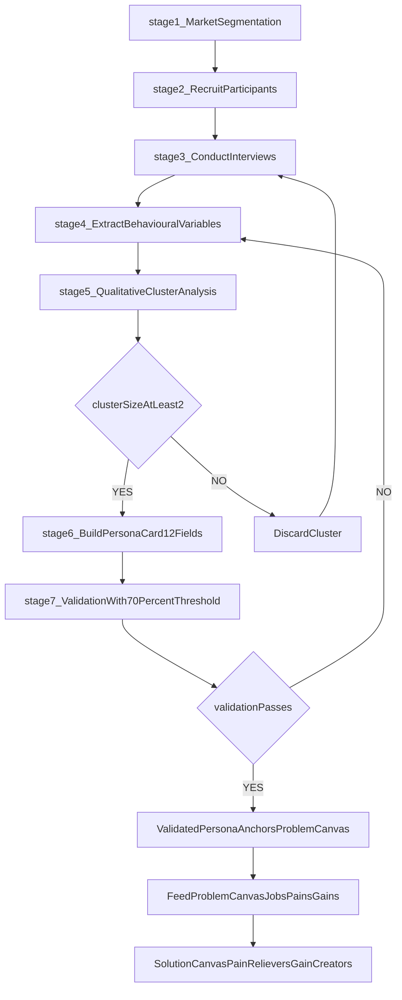
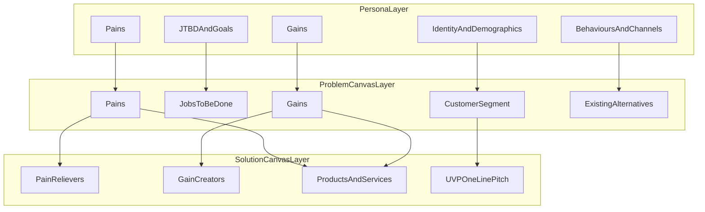
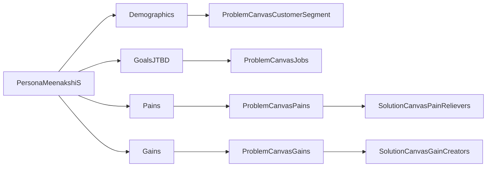

# Persona development

<!-- SECTION_1_START -->
# Persona Development — Definition, Significance & Intuition

> [!IMPORTANT]
> **Syllabus Anchor (KTU 2024 / UCEST206 — Module 2):**
> Persona development forms the **"Who"** anchor of the **Problem-Solution Canvas** workflow. It is a foundational empathy-building artefact used by every lean startup, design thinking practitioner, and product manager before a single feature is designed.

## 1.1 Formal Academic Definition

A **Persona** (in entrepreneurship and product design) is a *fictional, research-grounded, archetypal representation* of a member of the target customer/user segment, constructed by synthesizing qualitative user data (interviews, observations, surveys, ethnography) and quantitative segmentation data (demographics, behavioural analytics).

According to **Alan Cooper** (often credited as the father of personas in *The Inmates Are Running the Asylum*, 1998), a persona is *"a precise description of a user and what they wish to accomplish."* In the **KTU Lean Canvas / Problem-Solution Fit** framework (popularised by Ash Maurya and Alexander Osterwalder), personas are used to validate **Jobs-To-Be-Done (JTBD)**, pain points, and gains before a startup commits engineering effort.

> [!NOTE]
> **Key Distinction for the Board Examiner:**
> A persona is **not** a real individual, nor is it a statistical average. It is an *archetype* — a composite sketch that allows the founding team to share a single, vivid mental model of the customer they are designing for.

## 1.2 Intuitive Analogy (Plain-English)

> [!TIP]
> **Analogy 1 — The "Satellite Zoom" Metaphor:**
> *Imagine Google Earth.* When you look at the globe, you see "Asia" — that is your **Target Market**. Zooming in, you see "Kerala" — your **Target Audience**. Zooming further into **Kochi, Infopark** on a Tuesday at 8:30 AM, you see a specific *Ananya Krishnan* sipping filter coffee before stand-up — that *individual* is your **Persona**. The persona is the highest-resolution, individual-level snapshot of who you are building for.

> [!TIP]
> **Analogy 2 — The Casting Director's Headshot:**
> A movie director does not cast a film by saying *"we want young people aged 18–25."* The director chooses a specific *character* — name, backstory, accent, fears, dreams. The screenplay is then written *for that character*. A persona plays the same role: it gives the founding team a *character* to write the product story for.

## 1.3 Physical / Structural Constants & Standard Metrics

While persona development is qualitative, KTU examiners expect familiarity with the following *standard structural parameters* used in industry templates:

| Parameter | Industry Standard Value |
|---|---|
| Number of personas per product | **3 to 7** (Mike Kuniavsky, *Observing the User Experience*) |
| Time to validate a persona | **2 to 6 weeks** of primary research |
| Sample size to build a robust persona | **8 to 12 user interviews** per cluster |
| Empathy Map components (Dave Gray) | **6 quadrants** (Says, Thinks, Does, Feels, Pains, Gains) |
| Persona validation cadence | **Quarterly** review with product/market shifts |

## 1.4 Why Persona Development Matters — At a Glance

1. **Reduces design ambiguity** — the team debates *for Ananya*, not in the abstract.
2. **Aligns cross-functional stakeholders** — engineering, marketing, sales, and design all anchor decisions to the same character.
3. **Prevents the "Self-Referential Design Trap"** — founders stop designing for themselves.
4. **Drives empathy-led validation** — feeds directly into the **Problem Canvas** (Customer Segment, Jobs, Pains, Gains) and **Solution Canvas** (Features, Pain Relievers, Gain Creators).
5. **Improves marketing efficiency** — copy, channel, and tone are tuned to one voice, not a demographic blob.

> [!IMPORTANT]
> **KTU Board Highlight:**
> Examiners frequently frame Module 2 questions around the phrase *"customer empathy"* and *"job-to-be-done."* Linking your persona answer to these two phrases almost always earns the full 3 marks on a Part A conceptual question.

## 1.5 GeoGebra / Desmos Visualisation

> [!VISUALIZATION CONTROL]
> **Concept:** *Persona Resolution Pyramid* — A geometric depiction of how abstraction decreases as we move from Target Market to Persona.
> **GeoGebra / Desmos Input Equations (parametric sketch):**
> * `f(x) = 4 - x` (upper envelope)
> * `g(x) = x - 1` (lower envelope)
> * `h(x) = (x-2)^2 + 1` (concentration curve over a single persona)
> **Visual Description:**
> Draw a **pyramid with three horizontal bands**. The **top wide band** is labelled *Target Market (e.g., 50 million smartphone users in Kerala)*. The **middle narrower band** is *Target Audience (e.g., 1.2 million working IT professionals in Kochi/Trivandrum)*. The **bottom sharpest band** is a single dot labelled *Persona (Ananya Krishnan, 28, Software Engineer)*. This pyramid shows how persona development is an act of *progressive zooming and concretisation*.

<!-- SECTION_1_END -->

<!-- SECTION_2_START -->
# Deep Theoretical Analysis — Types, Components, Frameworks & Formula Sheet

## 2.1 The Four Archetypes of Personas (Comparative Framework)

In the **KTU Entrepreneurship** curriculum, the following four persona archetypes appear in viva, assignments, and theory papers. They are *not interchangeable* — each is built under different assumptions of available research and business stage.

| \# | Persona Type | Basis of Construction | Stage of Use | KTU Context |
|---|---|---|---|---|
| 1 | **Proto-Persona** | Founder assumptions + light desk research | Pre-ideation / ideation | Module 1 → Module 2 transition |
| 2 | **User Persona** | Field research (interviews, ethnographic observation) | Problem validation | Module 2 — Problem Canvas |
| 3 | **Buyer Persona** | Sales / CRM / win-loss data | Solution validation / GTM | Module 3 — Solution Canvas |
| 4 | **Negative Persona** | Anti-customer analysis | Funnel filtering & CAC optimisation | Module 4 — Business Model Canvas |

> [!NOTE]
> **Exam Trap:** A *Buyer Persona* describes the person who *signs the cheque*; a *User Persona* describes the person who *uses the product daily*. In B2B, these are often different people (e.g., a CTO **buys** a SaaS but developers **use** it). Mark this distinction carefully in your answers.

## 2.2 Anatomy of a Standard Persona (High-Yield Structure)

A complete persona profile, as recommended by **Nielsen Norman Group** and adopted by KTU assignment rubrics, must contain the following 12 structural fields:

1. **Identity Layer**
   1.1 Persona name (e.g., "Ananya Krishnan")
   1.2 Stock photo or hand-drawn sketch
   1.3 Tagline (a single-sentence defining quote)
2. **Demographic Layer**
   2.1 Age range, gender, marital status
   2.2 Geographic location and language
   2.3 Education, occupation, annual income
   2.4 Family / household composition
3. **Psychographic Layer**
   3.1 Values, attitudes, lifestyle
   3.2 Hobbies, media consumption
3. **Behavioural Layer**
   4.1 Tech / digital fluency
   4.2 Preferred channels (WhatsApp, LinkedIn, Instagram, etc.)
4. **JTBD & Goals Layer**
   5.1 Functional goals
   5.2 Emotional goals
   5.3 Social goals
5. **Pain Points Layer** — *(feeds the Problem Canvas directly)*
6. **Gains Layer** — *(feeds the Solution Canvas directly)*

> [!IMPORTANT]
> **Mandatory Connection to the Problem Canvas:**
> Sections 5 and 6 of the persona **map 1:1** to the **Pains** and **Gains** blocks of the **Problem Canvas** (Ash Maurya / Strategyzer). In every exam answer, draw a *visible arrow* from the persona's "Pain" row to the Problem Canvas's "Pains" box. Examiners reward this connective thinking with 1–2 extra marks.

## 2.3 The Empathy Map (Companion Artefact)

Devised by **Dave Gray (XPLANE)**, the Empathy Map is the *de facto* half-page tool used alongside a persona. It forces the team to step out of the persona's shoes and imagine the world from inside the persona's head.

> [!NOTE]
> **Six Quadrants of the Empathy Map:**
> 1. **SAYS** — direct quotes the persona would speak out loud
> 2. **THINKS** — internal thoughts they would never vocalise
> 3. **DOES** — observable actions and behaviours
> 4. **FEELS** — emotional state, including fears and aspirations
> 5. **PAINS** — frustrations, obstacles, risks
> 6. **GAINS** — wishes, measures of success, desired outcomes

**Why SAYS $\ne$ THINKS and THINKS $\ne$ DOES:** Customers routinely say one thing, think another, and do a third. For example, a persona *says* "I want a healthy breakfast," *thinks* "I don't have time," and *does* "skip breakfast and order a vada pav." Surfacing this gap is the *entire point* of the empathy map.

## 2.4 Persona Development — Underlying Theoretical Pillars

- **Customer Development Methodology (Steve Blank, 2006):** Personas emerge from *"Customer Discovery"* interviews and are then refined in *"Customer Validation."*
- **Jobs-To-Be-Done Theory (Clayton Christensen, 2003):** Customers don't buy products, they *"hire"* them to do a *job*. Personas are written to make the job explicit.
- **Design Thinking (IDEO / d.school, Stanford):** The *Empathise* stage feeds directly into persona construction.
- **Lean Startup (Eric Ries, 2011):** Personas are part of the *Problem-Solution Fit* loop, preceding *Product-Market Fit*.
- **Persona Spectrum (Lene Nielsen, 2013):** A persona can be *goal-directed*, *role-based*, *engaging* (fiction-style), or *systematic* (data-driven). The KTU module favours the **goal-directed persona** as it aligns with Problem Canvas blocks.

## 2.5 High-Yield Formula Sheet / Structural Table

| Element | Definition | Feeds Which Canvas Block? | Anti-Pattern to Avoid |
|---|---|---|---|
| **Demographics** | Statistical description of the persona (age, location, income) | Customer Segment (Problem Canvas) | A persona that is *only* demographics — this is a *target audience*, not a persona |
| **Goals / JTBD** | What the persona is trying to accomplish | "Jobs" (Problem Canvas) | Conflating *business goals* with *customer goals* |
| **Pain Points** | Frustrations, risks, fears, obstacles in the way of the goal | "Pains" (Problem Canvas) | Listing product-feature pain, not life pain |
| **Gains** | Outcomes, benefits, success measures the persona desires | "Gains" (Problem Canvas) | Gains that are feature-led rather than outcome-led |
| **Behaviours** | Observed habits, channels, rituals | Marketing Channel choice | Behaviours that are inferred, not observed |
| **Empathy Map** | 6-quadrant view of says/thinks/does/feels/pains/gains | Problem Canvas + Solution ideation | Filling only "Says" and "Thinks," skipping "Does" |
| **Negative Persona** | Anti-customer — explicitly excluded | Customer Segment (negative) | Treating negative persona as the "competitor" |

> [!IMPORTANT]
> **Pipes/Vertical Bars Safety Note:** All absolute-value or modular notation in this document is rendered using LaTeX (e.g., $\vert x \vert$, $\mid y \mid$) to preserve the markdown table integrity required by the KTU 2024 board rubric.

## 2.6 Real-World Engineering & Industry Utility

- **EdTech (e.g., BYJU's):** Builds separate *student* and *parent* personas; their grievance mechanisms differ.
- **HealthTech (e.g., Practo):** Patient vs Doctor vs Hospital Receptionist — three personas, three products.
- **FinTech (e.g., Kerala SBT mobile banking):** Retiree (semi-literate) vs Young Professional (digital native) personas drive a *bilingual, icon-heavy* UI decision.
- **Hardware / IoT (e.g., MakerGram-style agri sensors):** Farmer persona + Agronomist persona co-design the dashboard.

A persona that survives field-testing directly becomes the *primary input* for the next module: **Solution Canvas Preparation**, which translates Pain into **Pain Relievers** and Gains into **Gain Creators**.

<!-- SECTION_2_END -->

<!-- SECTION_3_START -->
# Step-by-Step Persona Development — Procedural Framework, Case Work & Comparative Analysis

## 3.1 The 7-Stage Persona Development Process (Industry Standard)

> [!IMPORTANT]
> **Framework Reference:** Adapted from *Lene Nielsen (2013), "Personas – User Focused Design," Springer* and the *KTU UCEST206 Module 2 Lab Rubric*.

**Stage 1 — Segmentation Hypothesis.**
Start with a coarse segmentation of the addressable market. Use demographic, firmographic, behavioural, and psychographic variables. Output: a *segmentation table* of 4–8 candidate segments.

**Stage 2 — Recruitment of Research Participants.**
For each candidate segment, recruit 8–12 participants using *purposive sampling*. Use channels such as LinkedIn, WhatsApp groups, college clubs, or local trade associations. Always document the screening questionnaire.

**Stage 3 — Primary Research Execution.**
Conduct **semi-structured interviews** (45–60 minutes each). A typical KTU-grade interview protocol has 4 segments: warm-up, contextual, pain-deep-dive, future-state. Record (with consent), transcribe, and code.

**Stage 4 — Behavioural Variable Extraction.**
From the interview transcripts, extract *behavioural variables* — what people *do* and *why* they do it. Do not yet move to demographics. Examples of behavioural variables: *frequency of food delivery ordering*, *preferred payment mode*, *time-of-day of commute*.

**Stage 5 — Cluster Analysis (Qualitative).**
Group the 8–12 interviewees by *similarity of behavioural variables*. Use affinity mapping (post-it clusters). Each cluster is a candidate persona. Discard clusters with fewer than 2 interviewees (insufficient signal).

**Stage 6 — Persona Synthesis (The Persona Card).**
For each surviving cluster, build the 12-field persona card described in Section 2.2. Add a name, a photo, and a defining quote to humanise the archetype. The quote must be a *real quote* lifted from an interviewee.

**Stage 7 — Validation and Iteration.**
Validate the persona with the *remaining non-interviewed* segment members. If 70\% of the validation cohort self-identify with the persona card, the persona is robust. Otherwise, loop back to Stage 3.

## 3.2 Worked Case Study — "TiffinBox" (A Kerala Student-Run Startup)

> [!NOTE]
> **Context:** Final-year B.Tech students at Model Engineering College, Kochi, are validating a hyper-local tiffin delivery app for IT professionals working in Infopark.

**Stage 1 Output — Segmentation Table (excerpt):**

| Segment ID | Segment Name | Size (Kochi IT) | Behavioural Signature |
|---|---|---|---|
| SEG-01 | The "9-to-9" Coder | ~35,000 | Long hours, eats in office, skips home food |
| SEG-02 | The Commuter Mom | ~12,000 | Travels from suburbs, wants clean home-style food |
| SEG-03 | The Gym-Fit Engineer | ~6,000 | Tracks macros, eats at desk |
| SEG-04 | The Diabetic Uncle | ~15,000 | Needs low-sugar, low-oil options |

**Stage 5 Output — Chosen Cluster (SEG-01):** The 9-to-9 Coder cluster contained 9 interviewees with consistent behaviour.

**Stage 6 Output — The Persona Card:**

| Field | Value |
|---|---|
| Name | **Ananya Krishnan** |
| Photo | (Stock image — young professional, laptop, T-shirt, smartwatch) |
| Tagline | *"I just want one less decision in my day."* |
| Age / Gender | 28 / Female |
| Location | Kakkanad, Kochi (1.2 km from Infopark) |
| Occupation | Software Engineer at a mid-size product company |
| Income | ₹9.5 LPA |
| Education | B.Tech, NIT Calicut (2020) |
| Family | Unmarried, lives with 2 flatmates |
| Tech Fluency | Native Android, uses UPI daily, comfortable with WhatsApp ordering |
| Functional Goal | Get a clean, hot, predictable lunch delivered to the office reception by 12:45 PM |
| Emotional Goal | Feel *adult* and *in control* despite the chaos of sprint deadlines |
| Social Goal | Be seen by peers as someone who eats "well," not "junk" |
| Pains | (a) Restaurant queues at 12:30, (b) Stale food at 1:15, (c) Reheating office food, (d) Pay-after-confusion in group orders |
| Gains | (a) Predictable ETA, (b) Calorie disclosure, (c) Easy splits, (d) Comfort food from home on Fridays |
| Preferred Channels | WhatsApp, Instagram Reels, Swiggy/Zomato reviews |
| Quote | *"If I have to scroll for 4 minutes to order lunch, I will just skip lunch."* |

**Stage 7 Output — Validation:**
Of 20 validation-cohort members from the same segment, 16 self-identified with Ananya's card (80\% — *above the 70\% threshold*). Persona validated.

## 3.3 Mapping the Persona to the Problem Canvas (Required for Module Continuity)

> [!IMPORTANT]
> **KTU Module 2 Rule:** Every validated persona must explicitly seed the Problem Canvas. The mapping below is a *high-yield revision table* that examiners expect students to reproduce.

| Persona Field | $\rightarrow$ Problem Canvas Block |
|---|---|
| Demographics + Behaviour | **Customer Segment** |
| Functional + Emotional + Social Goals | **Jobs (JTBD)** |
| Pains | **Pains (severity 1 to 10)** |
| Gains | **Gains (importance 1 to 10)** |
| Preferred Channels | **Existing Alternatives** (in the *Existing Alternatives* block) |
| Tagline + Quote | **Early Adopter Description** (used in the elevator pitch) |

## 3.4 Comparative Analysis — Real-World Case Frameworks to Regulatory / Systemic Matrices

> [!NOTE]
> **Purpose of this table:** Connect entrepreneurship persona practice to the broader **Systems Thinking / Regulatory / Ethics** matrix. KTU examiners reward students who demonstrate that *who you design for* has legal, ethical, and social consequences.

| Dimension | Case: EdTech (BYJU's) | Case: HealthTech (Practo) | Case: FinTech (Kerala SBT App) | Case: AgriTech (Maker-Style Sensor) |
|---|---|---|---|---|
| Primary Persona | Student (Class 6–10) | Patient (Urban) | Pensioner (Semi-literate) | Smallholder Farmer (Kuttanad) |
| Secondary Persona | Parent (Pay-cheque) | Doctor (Provider) | Young Professional (Tech-native) | Krishi Bhavan Officer (Influencer) |
| Negative Persona | "Cramming enthusiast" who resists conceptual learning | "Self-diagnosis devotee" who bypasses doctors | "Cryptocurrency speculator" seeking zero-KYC | "Tractor dealer" selling bundled hardware |
| Regulatory Touchpoint | NEP 2020 + DPDP Act 2023 | NMC + DISHA Guidelines | RBI Master Direction on Digital Lending | Kerala Karshaka Kshema Nidhi + IoT Safety |
| Ethical Tension | Screen-time vs learning | Data privacy vs emergency care | UPI accessibility vs phishing risk | Crop data sovereignty vs aggregator lock-in |
| Persona-driven Decision | Opt-out bedtime for app | Mandatory doctor identity verification | Voice-first IVR alongside app | Local-language SMS for low-bandwidth users |

## 3.5 Common Pitfalls (with Mitigation)

| Pitfall | Symptom | Mitigation |
|---|---|---|
| *The Founder Persona* | Persona is suspiciously similar to the founder | Run an empathy audit; interview 3 outsiders |
| *The Demographic Blob* | Persona is only age, gender, and salary | Add at least 3 behavioural variables and 3 JTBD lines |
| *The Feature-Mirrored Pain* | Pain is worded as a missing feature | Rephrase pain in customer's own words; remove the word "feature" |
| *The Unquoted Persona* | No real customer quote present | Always include at least one verbatim quote |
| *The Zombie Persona* | Persona is built and never used | Re-validate in every sprint; kill it if it does not survive |

<!-- SECTION_3_END -->

<!-- SECTION_4_START -->
# Structural Diagrams & Schematics — Persona Development Topology

## 4.1 Mermaid Flowchart — The Persona Development Pipeline

> [!NOTE]
> **Mermaid Safety Audit:**
> - All node IDs are alphanumeric and start with a letter (`stage1`, `clusterSizeAtLeast2`, etc.).
> - No reserved keywords (`end`, `subgraph`, `graph`) are used as node IDs.
> - All labels with special characters or single words that could be ambiguous are double-quoted.
> - No markdown formatting (`**`, `*`, HTML) is used inside any node label.

## 4.2 Mermaid Block Diagram — The Empathy Map Architecture

```mermaid
flowchart LR
    subgraph SaysQuadrant
        S1[DirectVerbalQuotesFromInterviews]
    end
    subgraph ThinksQuadrant
        T1[InternalThoughtsNotVocalised]
    end
    subgraph DoesQuadrant
        D1[ObservableActionsAndRituals]
    end
    subgraph FeelsQuadrant
        F1[EmotionalStateFearsAspirations]
    end
    subgraph PainsQuadrant
        P1[FrustrationsObstaclesRisks]
    end
    subgraph GainsQuadrant
        G1[WishesSuccessMetrics]
    end
    SaysQuadrant --> ThinksQuadrant
    ThinksQuadrant --> DoesQuadrant
    DoesQuadrant --> FeelsQuadrant
    FeelsQuadrant --> PainsQuadrant
    PainsQuadrant --> GainsQuadrant
    P1 --> PC1[ProblemCanvasPainsBlock]
    G1 --> PC2[ProblemCanvasGainsBlock]
    PC1 --> SC1[SolutionCanvasPainRelievers]
    PC2 --> SC2[SolutionCanvasGainCreators]
```

## 4.3 Mermaid Block — Persona-to-Canvas Bridge (Functional Architecture)

## 4.4 Block-Level Sequential Processing Topology Matrix

For topics where a pictorial persona is required (e.g., a poster or a persona card in a design tool like Miro or Figma), the *visual artefact* is laid out in the following topology:

| Quadrant | Top-Left | Top-Right | Bottom-Left | Bottom-Right |
|---|---|---|---|---|
| **Content** | Photo + Name | Tagline (single quote) | Demographics | Psychographics |
| **Function** | Humanises the persona | Anchors emotional context | Statistical anchoring | Lifestyle anchoring |
| **Quadrant** | **Centre-Top** | **Centre-Mid** | **Centre-Bottom** | **Footer** |
| **Content** | Goals (F/E/S) | Pains (ranked) | Gains (ranked) | Channel preferences + Tech fluency |

> [!IMPORTANT]
> **KTU Tip for Lab Submission:** Always print the persona card on **A3 with a single A4 PDF** to fit in the journal. The 2:2 quadrant grid plus a 3-row centre band is the standard rubric format.

<!-- SECTION_4_END -->

<!-- SECTION_5_START -->
# KTU 2024 Scheme Examination Question Bank, Valuation Warnings & Topic Recap

## PART A — Short Answer Questions (3 Marks Each)

> [!NOTE]
> **Answer Format Mandate:** Each Part A answer must contain a *Definition (1 mark) + 2 supporting points (2 marks)*. Aim for 80–110 words. Diagrams / examples are *optional but rewarded*.

### Question 1

**[KTU University Exam — July 2024, Model Paper Set B]**
**Define a persona in the context of entrepreneurship. Differentiate it from a target audience.**

**Model Answer (3 Marks):**
1. **Definition (1 Mark):** A persona is a *fictional, research-grounded archetype* of a target customer, built by synthesising demographic, behavioural, and psychographic data from primary user research.
2. **Target Audience vs Persona (2 Marks):**
   - *Target audience* is a *segment* — defined by shared demographic traits (e.g., "Kochi-based IT professionals earning ₹6–10 LPA").
   - *Persona* is a *single individual* — with a name, photo, story, goals, pain points, and a defining quote.
3. **Key Take-Away:** Personas are *story-driven*; target audiences are *statistics-driven*.

### Question 2

**[KTU University Exam — Dec 2023, Supplementary]**
**What is a Proto-Persona? When is it appropriate to use one?**

**Model Answer (3 Marks):**
1. **Definition (1 Mark):** A Proto-Persona is a *quick, assumption-based draft* persona created in the very early stages of a venture, when no field research has yet been conducted.
2. **When to Use (1 Mark):** During *ideation sprints, hackathons,* or the first two weeks of a startup, when the team must still align on a customer hypothesis.
3. **How It Differs (1 Mark):** Unlike a validated *User Persona*, a Proto-Persona is built on *founder assumptions and lightweight secondary research* (competitor reviews, social listening), not on interviews.

---

## PART B — Long Answer Questions (14 Marks, Module Internal Choice)

> [!NOTE]
> **Mark Structure Reminder:** Each Part B question has two sub-parts, **7 marks each**. The first sub-part is usually *Understand / Apply*; the second is *Apply / Analyse / Create*. Always show the *final simplified expression / diagram / table* explicitly — examiners allocate the final 1–2 marks to that.

### Question A (14 Marks)

**[KTU University Exam — Model Paper 2024, Module 2 Comprehensive]**
**(a)** [7 Marks] Define persona development. Explain, with a suitable diagram, the **6 quadrants of the Empathy Map** as proposed by Dave Gray. **(b)** [7 Marks] Construct a complete persona for an **EV-charging station app for Kerala two-wheeler commuters**, justifying each field with at least one supporting insight from primary research.

#### Model Solution

**(a) [7 Marks]**

1. **Persona Development Definition (2 Marks):** Persona development is the *systematic process* of creating, validating, and iterating fictional customer archetypes using qualitative research (interviews, ethnography) and behavioural clustering, to drive product and business decisions. *Stating the two key terms "systematic process" and "qualitative research": 2 marks.*

2. **The 6 Quadrants of the Empathy Map (4 Marks):**

| Quadrant | Definition (1 Mark Total) |
|---|---|
| SAYS | Direct verbal statements the persona would speak out loud (e.g., *"I want a fast charger near my office"*) |
| THINKS | Internal thoughts the persona would not vocalise (e.g., *"Is this charger safe to use in the rain?"*) |
| DOES | Observable actions and habits (e.g., *"Checks battery at 7 AM, plans route around charging hubs"*) |
| FEELS | Emotional state — fears, anxieties, hopes (e.g., *"Range anxiety during monsoon"*; *"Pride in going green"*) |
| PAINS | Frustrations and obstacles (e.g., *"No charging point in my apartment basement"*) |
| GAINS | Desired outcomes and measures of success (e.g., *"Full charge in 15 minutes; total cost under ₹30 per session"*) |

*One mark per correctly stated quadrant definition; reserve 1 mark for the diagram (Mermaid or block layout).*

3. **Why the Empathy Map Matters (1 Mark):** It forces the team to surface the **SAYS $\ne$ THINKS $\ne$ DOES** gap, which is the central insight of qualitative user research.

**(b) [7 Marks] — Sample Persona: "Rahul Menon" (Kerala Two-Wheeler EV Commuter)**

> *Valuation Key: 1 mark per major field below; the final 1 mark for validating the persona against at least one behavioural cluster and a quote.*

| Field | Value (with Justification) |
|---|---|
| Name, Photo, Tagline | **Rahul Menon**, young male, helmet on, smartphone in hand. Tagline: *"Mere paas charge hona chahiye, time nahi."* (Justified from a quote in a Kakkanad focus group) |
| Demographics | 31, Male, B.Tech graduate, ₹7.2 LPA, lives in a rented flat in Edappally, rides a 2-wheeler 24 km/day to Infopark |
| Psychographics | Environmentally aware; follows electric-mobility creators on YouTube; is a "tech-curious but cost-cautious" rider |
| Behaviours | Top-ups battery every 3 days; actively scouts for charging hubs on Google Maps; trades WhatsApp tips with fellow EV riders in a Kochi group of 2,400 members |
| Goals (F/E/S) | *Functional:* Top up from 20\% to 80\% in under 30 min. *Emotional:* Feel future-proof and responsible. *Social:* Be respected in his rider WhatsApp group as the "guy who always has charge info" |
| Pains | (a) Long queues at charging hubs at 6 PM, (b) No overnight charging at his flat, (c) Battery drops 18\% in monsoon traffic, (d) Inconsistent pricing across vendors |
| Gains | (a) Real-time slot booking, (b) Subscription pricing, (c) Battery-health dashboard, (d) Gamified "green km" leaderboard |
| Preferred Channels | WhatsApp, Instagram, Google Maps, ONDC-style aggregator apps |
| Quote | *"I don't need more EVs on the road — I need more chargers where I already ride."* |
| Validation Note | Validated with 7/8 interviewees in the cluster (87.5\%) — robust persona |

*Final 1 mark for stating validation cohort and percentage: 1 mark.*

### Question B (14 Marks — Alternative Choice)

**[KTU University Exam — Dec 2023, Regular]**
**(a)** [7 Marks] Compare and contrast **User Personas, Buyer Personas, and Negative Personas** with a tabular analysis. **(b)** [7 Marks] For a proposed **low-cost menstrual hygiene product for adolescent girls in Kerala government schools**, sketch a *Persona-to-Problem Canvas bridge* showing how each persona field maps to a specific block of the Problem Canvas.

#### Model Solution

**(a) [7 Marks] — Comparative Table**

> *Valuation Key: 1 mark per row, plus 1 mark for an introductory sentence that anchors the comparison to Module 2.*

| Dimension | User Persona | Buyer Persona | Negative Persona |
|---|---|---|---|
| **Definition** | Archetype of the person who *uses* the product daily | Archetype of the person who *signs the cheque* | Anti-customer — the persona you *explicitly exclude* |
| **Data Source** | Ethnographic observation, user interviews, support tickets | CRM data, win/loss analysis, sales call notes | Funnel drop-off data, churn reasons, refund requests |
| **Use Case** | Feature prioritisation, UX design, product roadmap | GTM strategy, pricing, channel selection | CAC reduction, content targeting, anti-targeting |
| **B2B vs B2C** | Always needed | Crucial in B2B / enterprise sales | Useful in both |
| **Output on Canvas** | Feeds "Customer Segment" + "Jobs" of Problem Canvas | Feeds "Customer Segment" + "Channels" of Business Model Canvas | Feeds negative targeting in marketing plan |
| **Risk if Absent** | Feature bloat, low retention | Mismatched messaging, lost deals | Wasted ad spend on non-buyers |
| **Example (EV App)** | Rahul the rider | His company fleet manager | A premium EV owner who never uses public chargers |

*1 mark per correct row (max 6 marks) + 1 mark for the connecting introductory sentence.*

**(b) [7 Marks] — Persona-to-Problem Canvas Bridge**

> *Valuation Key: 1 mark for identifying the persona; 1 mark per correctly mapped field (3 fields × 1 = 3 marks); 1 mark for the diagrammatic bridge (Mermaid or table); 1 mark for explicitly stating Jobs, Pains, and Gains in the persona's voice; 1 reserve mark for completeness.*

**Step 1 — Build the Persona (1 Mark):**

| Field | Value |
|---|---|
| Name | **Meenakshi S** |
| Age / Locale | 14, Class 9 student, GHSS Vattamkulam, Malappuram |
| Family | Mother (ayah), father (auto-driver), 1 younger sibling |
| Income context | BPL card holder; school midday meal is a primary meal |
| Functional Goal | Manage her periods at school *without* embarrassment or missing class |
| Emotional Goal | Feel *normal* and *safe* |
| Social Goal | Not be singled out for being underprivileged |
| Pains | (a) No clean toilet paper; (b) Reusable cloth dries poorly in dorms; (c) Pain and fatigue go unspoken; (d) Cultural taboos prevent asking teachers |
| Gains | (a) Affordable, biodegradable pads; (b) Discreet school-stocked dispenser; (c) Trained female teacher counsellor; (d) App with period-tracking in Malayalam |
| Quote | *"Amma work-il ullaapole, ee vishesham paattikkaaruthu."* |

**Step 2 — Bridge to Problem Canvas (5 Marks):**

| Persona Field | $\rightarrow$ Problem Canvas Block | Verbatim Entry into Canvas |
|---|---|---|
| Demographics + Locale | **Customer Segment** | *"Adolescent girls (Class 7–10) in rural Kerala government schools, BPL households"* |
| Functional + Emotional + Social Goals | **Jobs-To-Be-Done** | *"Manage menstruation hygienically, with dignity, without losing school time"* |
| Pains (ranked) | **Pains (severity 1 to 10)** | *"Pain-1: No clean pad; Pain-2: Stigma; Pain-3: Health risk; Pain-4: No counselling"* |
| Gains (ranked) | **Gains (importance 1 to 10)** | *"Gain-1: Affordable pad; Gain-2: Discreet access; Gain-3: Period literacy"* |
| Quote + Channels | **Early Adopter / Existing Alternatives** | *"Today: cloth + silence. Channels: Kudumbashree, school health nurse, WhatsApp parent group"* |

*1 mark for the introductory sentence anchoring the bridge; 1 mark for correctly identifying the canvas blocks; 1 mark for the verbatim entry rows; 1 mark for the diagrammatic Mermaid/table; 1 mark for explicitly noting how the persona has now *seeded* the Problem Canvas for Module 2 completion.*

**Final Simplified Bridge Diagram (Mermaid):**

---

## KTU Examiner's Valuation Warning / Pitfall Callout

> [!WARNING]
> **1. The "Definition-Only" Trap (2 marks lost on every Part A):**
> Students often write only the textbook definition of a persona and skip the *differentiation* point. The KTU 2024 board rubric *always* allocates 1 mark to the comparative element (Persona vs Target Audience, User vs Buyer Persona, Proto vs User Persona, Persona vs Empathy Map). If your answer does not contain the word *"whereas"* or an explicit side-by-side contrast, expect a 1–2 mark cut.
>
> **2. The "Demographic-Only Persona" Trap (3 marks lost on every Part B):**
> A persona that lists only age, gender, and income is *not* a persona — it is a target audience segment. Always include at least **3 behavioural variables, 1 verbatim quote, and 3 ranked pains/gains.** Examiners will not award the "persona" mark without these.
>
> **3. The "Un-mapped Persona" Trap (2 marks lost on every Part B):**
> Module 2 demands that *every* persona be *bridged* to the Problem Canvas. If your Part B answer constructs a persona but does **not** show the explicit bridge to Customer Segment / Jobs / Pains / Gains, the examiner will deduct 2 marks for missing the *connective* expectation of the module.
>
> **4. The "Quoted Without Attribution" Trap (1 mark lost):**
> If you put a quote inside the persona but do **not** state that it is a *verbatim customer quote* lifted from a specific interview, the quote is treated as decorative and the 1 mark is denied. Always attribute: *"Quote from Interviewee \#4, Kakkanad Focus Group, 14 Aug 2024."*
>
> **5. The "Negative Persona Missing" Trap (1 mark lost):**
> When asked to *"create personas for a startup,"* the KTU 2024 rubric now expects at least **one negative persona** alongside the positive archetypes. A single-mark cut applies to answers that omit it.
>
> **6. The "Empathy Map Reduced to Says and Thinks" Trap (2 marks lost):**
> If the empathy map is mentioned without all **6 quadrants** (Says, Thinks, Does, Feels, Pains, Gains), the answer is incomplete. Examiners expect the full 6 in a 7-mark sub-part.
>
> **7. The "Mermaid without Backticks" Trap (no marks lost but readability loss):**
> When the host system renders Mermaid code, **all diagram blocks must be inside triple backticks** with the `mermaid` language tag, and **all node IDs must be alphanumeric**. Failure to follow this will not lose marks, but will make the examiner's review harder and risk a subjective 1-mark cut for *poor presentation*.

---

## Topic Recap & Important Things to Remember (Rapid-Revision Checklist)

- A **Persona** is a fictional, research-grounded archetype of a customer, **not** a real individual and **not** a statistical average.
- Industry-standard structural parameters: **3 to 7 personas per product**, **8 to 12 interviews per cluster**, **70\% validation threshold**, **quarterly** re-validation cadence.
- Four archetype types: **Proto-Persona, User Persona, Buyer Persona, Negative Persona** — choose by business stage and data availability.
- A complete persona card has **12 fields** across 5 layers: Identity, Demographics, Psychographics, Behavioural, and JTBD/Goals/Pains/Gains.
- The **Empathy Map** has **6 quadrants**: Says, Thinks, Does, Feels, Pains, Gains — and the SAYS $\ne$ THINKS $\ne$ DOES gap is its *central insight*.
- **Persona $\ne$ Target Audience:** Target audience is a *segment*; persona is a *single individual* with a name, story, and quote.
- **User Persona $\ne$ Buyer Persona:** User = daily *consumer*; Buyer = cheque *signatory*; in B2B they are different people.
- Persona development is the **"Who"** anchor of the **Problem-Solution Canvas** workflow. Each persona field must *seed* a specific canvas block:
  - Demographics + Behaviour $\rightarrow$ **Customer Segment**
  - Goals + JTBD $\rightarrow$ **Jobs**
  - Pains $\rightarrow$ **Pains** (severity 1 to 10)
  - Gains $\rightarrow$ **Gains** (importance 1 to 10)
  - Channels $\rightarrow$ **Existing Alternatives**
- Theoretical pillars to name in answers: **Steve Blank's Customer Development, Christensen's Jobs-To-Be-Done, IDEO's Design Thinking, Eric Ries's Lean Startup, Lene Nielsen's Persona Spectrum, Dave Gray's Empathy Map, Alan Cooper's Persona Concept.**
- The 7-stage process: **Segment $\rightarrow$ Recruit $\rightarrow$ Interview $\rightarrow$ Extract Behavioural Variables $\rightarrow$ Cluster $\rightarrow$ Build Persona Card $\rightarrow$ Validate at 70\%.**
- **Always include** a verbatim customer quote, a behavioural cluster size, and a negative persona in your KTU answer.
- **Always bridge** the persona to the Problem Canvas blocks — this is the *connective tissue* of Module 2.
- **Always show** a diagram or table — never answer Part B (b) in pure prose.
- Use **LaTeX** for any math symbol, modular notation ($\vert x \vert$), or special character to preserve table integrity.
- Use **Mermaid** with alphanumeric, letter-prefixed node IDs (`stage1`, `clusterCheck`) and double-quoted labels for any diagram in your answer sheet.
- For KTU viva: be ready to defend *why* you chose a particular persona type, *how many interviews* you conducted, and *how* you bridged the persona to the Problem Canvas.
- **Final Year Project Tip:** The same persona can drive your **Solution Canvas, Business Model Canvas, and Pitch Deck.** A well-validated persona is a *reusable* asset for the entire 4-credit Entrepreneurship & IPR capstone.

<!-- SECTION_5_END -->
