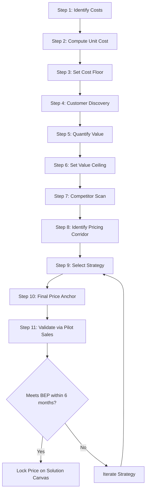
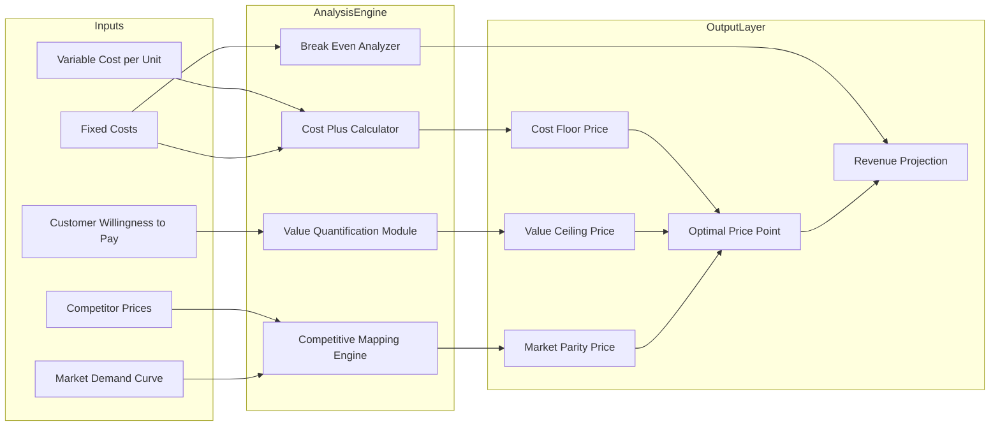
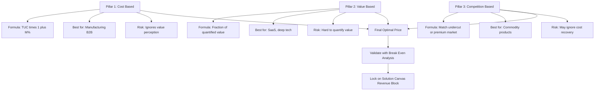
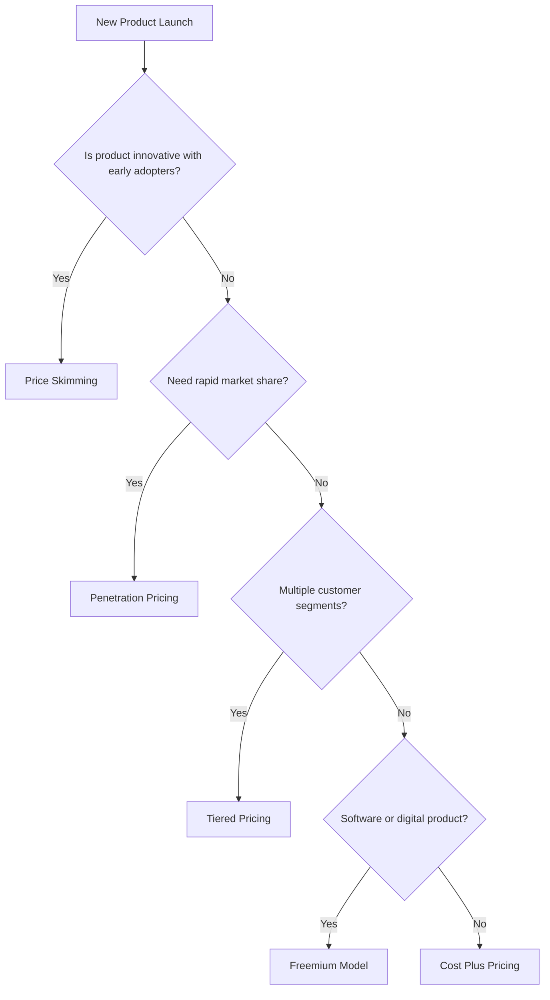

# Pricing analysis

<!-- SECTION_1_START -->

# Pricing Analysis — Core Technical Definition & Intuitive Overview

## Formal Definition (KTU 2024 Syllabus Terminology)

> [!IMPORTANT]
> **Pricing Analysis** is a strategic and quantitative evaluation process used by entrepreneurs to determine the optimal price point for a product or service. It involves systematically assessing costs, customer perceived value, competitor benchmarks, market demand elasticity, and revenue model viability to arrive at a price that maximizes profitability while ensuring product-market fit.

In the **Solution Canvas** framework (Module 2 context), pricing analysis occupies the **Revenue Streams** and **Pricing Strategy** blocks. It is the bridge between what the customer *values* (Solution block) and what the business *earns* (Revenue block).

## Conceptual Analogy / Intuition

> [!NOTE]
> **The Cafe Latte Analogy** ☕
>
> Imagine a small café owner in Kerala trying to price a cup of filter coffee. The pricing puzzle has three voices:
> 1. **The Accountant whispers**: "Cost of milk + sugar + powder + cup + gas + rent = ₹18. Charge at least ₹18, or you lose money."
> 2. **The Customer whispers**: "I just had a ₹60 coffee at the airport, and it tasted ordinary. Your coffee is special, so I'd pay ₹40 happily."
> 3. **The Competitor whispers**: "The shop next door sells it for ₹25."
>
> **Pricing Analysis** is the act of *listening to all three voices*, weighing them, and arriving at a number (say, ₹35) that **covers cost, reflects value, and beats competition** — while still leaving room for the entrepreneur to *survive and grow*.

## Why Pricing Analysis Matters in the Solution Canvas

The **Solution Canvas** (a derivative of the Lean Canvas by Ash Maurya) contains:
- **Solution** → What you build
- **Key Metrics** → What you measure
- **Unique Value Proposition (UVP)** → Why you are different
- **Unfair Advantage** → What cannot be copied
- **Channels** → How you reach customers
- **Customer Segments** → For whom you build
- **Cost Structure** → What you spend
- **Revenue Streams** → What you earn (← *Pricing lives here*)

> [!IMPORTANT]
> **KTU 2024 Highlight:** Pricing is *not* a number — it is a *system*. A wrong price can sink a brilliant solution. Pricing Analysis converts the *value promise* of the Solution Canvas into a *quantifiable business reality*.

## Key Pricing Vocabulary (Bold Constants / Standard Metrics)

- **CAC (Customer Acquisition Cost)** — money spent to acquire one paying customer.
- **LTV (Lifetime Value)** — total revenue a customer brings over their entire relationship.
- **ARPU (Average Revenue Per User)** — average revenue per customer per period.
- **Break-Even Point (BEP)** — the sales volume at which total revenue equals total cost (zero profit, zero loss).
- **Contribution Margin** — selling price minus variable cost per unit.
- **Price Elasticity of Demand (PED)** — sensitivity of quantity demanded to a change in price.
- **MRR (Monthly Recurring Revenue)** — predictable monthly revenue, common in SaaS startups.

> [!VISUALIZATION CONTROL]
> **Concept:** Pricing Triad — The Three Pillars of Price Discovery
> **GeoGebra / Desmos Input Equations:**
> * `Circle: (x - 18)^2 + (y - 25)^2 = 10^2`  (Cost Floor boundary)
> * `Circle: (x - 40)^2 + (y - 25)^2 = 12^2`  (Customer Value Ceiling)
> * `Point A = (35, 25)`  (Optimal Pricing Point)
> **Visual Description:** On a 2D plane, the *X-axis* represents **Customer Willingness to Pay** and the *Y-axis* represents **Competitor Pricing**. The lower circle (cost floor) and upper circle (value ceiling) form a *pricing corridor*. The optimal point lies **inside this corridor** where profit is maximized.

<!-- SECTION_1_END -->

<!-- SECTION_2_START -->

# Deep Theoretical Analysis & KTU High-Yield Formula Sheet

## The Three Pillars of Pricing Analysis

### Pillar 1: Cost-Plus (Cost-Based) Pricing

The simplest method. Add a markup percentage to the unit cost.

**Steps:**
1. Compute **Total Variable Cost per Unit (VCU)** — direct materials, labor, packaging.
2. Compute **Allocated Fixed Cost per Unit (FCU)** — rent, salaries, utilities spread over expected volume.
3. Compute **Total Unit Cost (TUC) = VCU + FCU**.
4. Apply **Markup Percentage (M\%)** to get Selling Price.
5. **Selling Price (SP) = TUC × (1 + M/100)**.

**Strengths:** Easy to compute, ensures cost recovery.
**Weaknesses:** Ignores customer value perception and competitor benchmarks. *Commonly used in manufacturing-heavy engineering products (e.g., custom PCBs, 3D-printed parts).*

### Pillar 2: Value-Based Pricing

Price is set according to the **perceived value** the customer derives, not the cost incurred.

**Steps:**
1. Conduct **Customer Discovery Interviews** to understand willingness-to-pay.
2. Quantify the **Value Quantification (VQ)** — money saved, time saved, or pain removed.
3. Set price as a fraction of VQ (typically **10\%–33\%** of quantified value).
4. Validate via **Van Westendorp Price Sensitivity Meter** (too cheap, cheap, expensive, too expensive).

**Strengths:** Captures premium positioning; common in SaaS and deep-tech.
**Weaknesses:** Hard to quantify intangible value; requires deep customer empathy.

### Pillar 3: Competition-Based Pricing

Price is set by **observing competitor pricing** and positioning relative to them.

**Steps:**
1. Identify 3–5 direct competitors.
2. Map their prices on a **Competitive Pricing Matrix**.
3. Choose a positioning: *Penetration* (below market), *Parity* (at market), *Premium* (above market).
4. Justify any premium via the **Unique Value Proposition (UVP)**.

**Strengths:** Market-realistic; quick to deploy.
**Weaknesses:** Ignores cost recovery; can trigger price wars.

## KTU Formula Sheet / Cheat Sheet

| Formula | Symbol Meaning | Application Context |
| :--- | :--- | :--- |
| $SP = TUC \times \left(1 + \dfrac{M}{100}\right)$ | $SP$=Selling Price, $TUC$=Total Unit Cost, $M$=Markup\% | Cost-plus pricing |
| $PED = \dfrac{\%\Delta Q_d}{\%\Delta P}$ | $PED$=Price Elasticity, $Q_d$=Quantity demanded, $P$=Price | Demand sensitivity analysis |
| $BEP_{units} = \dfrac{FC}{SP - VCU}$ | $BEP$=Break-Even units, $FC$=Fixed Cost, $VCU$=Variable Cost/Unit | Startup survival analysis |
| $BEP_{revenue} = \dfrac{FC}{1 - \dfrac{VCU}{SP}}$ | $BEP$ in revenue (₹) terms | Service-business break-even |
| $CM = SP - VCU$ | $CM$=Contribution Margin per unit | Profit planning |
| $LTV = ARPU \times \text{Avg. Customer Lifespan}$ | $LTV$=Lifetime Value, $ARPU$=Avg. Revenue/User | SaaS / subscription models |
| $LTV : CAC \geq 3 : 1$ | Healthy startup rule | Investor due-diligence check |
| $MRR = \text{No. of Subscribers} \times \text{Monthly Plan Price}$ | $MRR$=Monthly Recurring Revenue | Subscription business health |
| $Discounted\ Price = SP \times \left(1 - \dfrac{D}{100}\right)$ | $D$=Discount\% | Promotional / launch pricing |
| $Price\ Skimming\ Curve: P_t = P_0 \cdot e^{-kt}$ | $P_t$=Price at time $t$, $k$=decay rate | High-tech launch strategy |

> [!NOTE]
> **KTU Examiner's Tip:** Always write the *unit* (₹, units, months) next to every symbol. A formula without units is incomplete in board valuation.

## Pricing Strategy Spectrum (for Solution Canvas Selection)

| Strategy | When to Use | Risk |
| :--- | :--- | :--- |
| **Penetration Pricing** | New market entry, network-effect product | Margin erosion |
| **Price Skimming** | Innovative tech with early adopters | Early negative reviews |
| **Freemium** | Software / app with viral potential | Low conversion rate |
| **Dynamic Pricing** | Ride-share, hospitality, e-commerce | Customer trust loss |
| **Tiered Pricing** | SaaS with multiple user segments | Cannibalization between tiers |
| **Bundle Pricing** | Complementary products sold together | Lower per-unit revenue |
| **Psychological Pricing** | FMCG, retail (₹99 vs ₹100) | Limited for B2B |
| **Cost-Plus** | Manufacturing, B2B contracts | Ignores market reality |

## Real-World Utility in Engineering \& Computer Science

- **SaaS Startups** (e.g., Zoho, Freshworks): Use **Value-Based + Tiered** pricing. Engineer-entrepreneurs must compute *server cost per user* (cost floor) and *willingness-to-pay* (value ceiling) separately.
- **Hardware Startups** (e.g., drone makers, IoT devices): Use **Cost-Plus** with a *learning-curve discount factor* as production scales.
- **Service Firms** (e.g., custom software, consulting): Use **Time-and-Materials** or **Fixed-Price** with milestone-based billing.
- **Marketplace Platforms** (e.g., Onato, Meesho): Use **Commission-Based** pricing where the platform takes a cut of GMV (Gross Merchandise Value).

<!-- SECTION_2_END -->

<!-- SECTION_3_START -->

# Step-by-Step Derivations, Case Analysis \& Implementation

## Derivative 1: Break-Even Analysis — Full Worked Solution

**Problem Setup:** A KTU student-entrepreneur launches a custom-PCB design startup. The fixed monthly costs (rent, software licenses, one designer's salary) are **₹80,000**. The variable cost per PCB (components, fabrication outsourcing) is **₹600**. The selling price per PCB is **₹1,400**.

**Find:** (a) Break-Even Point in units. (b) Break-Even Point in revenue. (c) Profit if 200 PCBs are sold in a month. (d) Margin of Safety if expected sales = 250 units.

### Step-by-Step Solution

**Step 1 — Identify given values.**

$$
\begin{aligned}
FC &= 80{,}000 \quad (\text{Fixed Cost, ₹/month}) \\
VCU &= 600 \quad (\text{Variable Cost per Unit, ₹}) \\
SP &= 1{,}400 \quad (\text{Selling Price per Unit, ₹}) \\
Q_{expected} &= 250 \quad (\text{Expected monthly sales, units})
\end{aligned}
$$

**Step 2 — Compute Contribution Margin per unit.**

$$
\begin{aligned}
CM &= SP - VCU \\
   &= 1{,}400 - 600 \\
   &= 800 \quad (\text{₹ per unit})
\end{aligned}
$$

> Valuation Key Point: *Correctly identifying and subtracting VCU from SP — 1 Mark. Final answer ₹800 — 1 Mark.*

**Step 3 — Compute Break-Even Point in units.**

$$
\begin{aligned}
BEP_{units} &= \frac{FC}{CM} \\
            &= \frac{80{,}000}{800} \\
            &= 100 \quad \text{units}
\end{aligned}
$$

> Valuation Key Point: *Formula statement — 1 Mark. Substitution — 1 Mark. Final answer 100 units — 1 Mark.*

**Step 4 — Compute Break-Even Point in revenue (₹).**

$$
\begin{aligned}
BEP_{revenue} &= BEP_{units} \times SP \\
              &= 100 \times 1{,}400 \\
              &= 1{,}40{,}000 \quad (\text{₹})
\end{aligned}
$$

**Step 5 — Compute profit at Q = 200 units.**

$$
\begin{aligned}
\text{Total Revenue (TR)} &= Q \times SP = 200 \times 1{,}400 = 2{,}80{,}000 \\
\text{Total Cost (TC)}    &= FC + (Q \times VCU) = 80{,}000 + (200 \times 600) = 80{,}000 + 1{,}20{,}000 = 2{,}00{,}000 \\
\text{Profit}             &= TR - TC = 2{,}80{,}000 - 2{,}00{,}000 = 80{,}000 \quad (\text{₹})
\end{aligned}
$$

**Step 6 — Compute Margin of Safety at Q = 250 units.**

$$
\begin{aligned}
MoS_{units}    &= Q_{expected} - BEP_{units} = 250 - 100 = 150 \quad \text{units} \\
MoS_{revenue}  &= 150 \times 1{,}400 = 2{,}10{,}000 \quad (\text{₹}) \\
MoS_{\%}       &= \frac{150}{250} \times 100 = 60\%
\end{aligned}
$$

**Interpretation for Solution Canvas:** The startup has a *60\% margin of safety*, meaning sales can drop by 60\% before the business incurs a loss. This is a *healthy* indicator for a freshly launched hardware venture.

## Derivative 2: Value-Based Pricing — Willingness-to-Pay Computation

**Problem Setup:** A team builds a *Student Attendance Automation SaaS* for KTU colleges. Customer Discovery interviews (n = 30 colleges) reveal:
- ₹8 saved per student per month in manual attendance effort.
- Average college has 500 students.
- 80\% of this value is *capturable* by the SaaS.
- Founders propose capturing **20\%** of the capturable value.

**Step-by-Step Solution:**

$$
\begin{aligned}
\text{Value per student}     &= 8 \quad (\text{₹/month}) \\
\text{Students per college}  &= 500 \\
\text{Total monthly value}   &= 8 \times 500 = 4{,}000 \quad (\text{₹/college/month}) \\
\text{Capturable value (80\%)}&= 0.80 \times 4{,}000 = 3{,}200 \\
\text{Target price (20\% of capturable)} &= 0.20 \times 3{,}200 = 640 \quad (\text{₹/college/month})
\end{aligned}
$$

> [!IMPORTANT]
> **Validation Step:** Now round this to a *psychological price point* → **₹599/month per college**. This becomes the **Price Anchor** on the Solution Canvas.

## Case Comparison Matrix — Mapping Frameworks to KTU 2024 Outcomes

| Engineering Case | Pricing Method Used | Strategic Reasoning | Canvas Block Populated |
| :--- | :--- | :--- | :--- |
| **Custom Drone Manufacturing** (B2B) | Cost-Plus + Skimming | High R\&D cost recovery; early adopters price-insensitive | Revenue Streams: ₹X per unit |
| **College Canteen App** (B2C) | Freemium + In-app Ads | Network effect required; free for students, paid for canteens | Revenue: Ads + Premium tier |
| **IoT Water-Quality Monitor** (Govt.) | Value-Based | Quantified savings in water-borne disease cost | Revenue: Subscription per district |
| **AI Code Reviewer** (SaaS) | Tiered Usage-Based | Developers pay per API call; aligns with consumption | Revenue: Pay-per-use |
| **E-Waste Recycling** (Social) | Cost-Plus + Subsidy | Social venture; needs government grant bridge | Revenue: Govt. + CSR funds |

> [!NOTE]
> **KTU Valuation Insight:** Examiners reward students who *justify* their pricing method with a one-line strategic reason. Always end your pricing block with the line: *"This pricing is justified because \_\_\_."*

## Real-World Engineering Example: A KTU Capstone IoT Product

**Scenario:** Four B.Tech final-year students develop a *Smart Helmet* for miners with gas-leak detection. Build cost = ₹1,800. Target buyer = coal mining companies.

**Pricing Process:**
1. **Cost-Plus Floor:** ₹1,800 × 1.25 = ₹2,250 (25\% markup).
2. **Value Reference:** Each mining accident costs the firm ₹15 lakh in compensation. One accident prevented = 750× the helmet cost. Willingness-to-pay ceiling = ₹10,000.
3. **Competitor Benchmark:** Imported equivalents sell at ₹7,500.
4. **Decision:** Price = **₹4,999** (above cost-floor, below competitor, well within value-ceiling). Add a **₹500/year service subscription** for gas-sensor calibration → recurring revenue stream.

<!-- SECTION_3_END -->

<!-- SECTION_4_START -->

# Structural Diagrams \& Schematics

## Diagram 1: Pricing Analysis — Sequential Processing Topology

## Diagram 2: Pricing Decision Matrix (Block-Level Architecture)

## Diagram 3: The Three Pricing Pillars — Comparative View

## Diagram 4: Pricing Strategy Decision Tree

<!-- SECTION_4_END -->

<!-- SECTION_5_START -->

# KTU 2024 Scheme Examination Question Bank \& Topic Recap

## Part A Questions (3 Marks Each)

### Question A1 `[KTU University Exam - July 2024]`
**Define Pricing Analysis. List any four pricing strategies used by startups.**

**Model Answer (3 Marks):**
- **Definition (1 Mark):** Pricing Analysis is the systematic evaluation of costs, customer value perception, and competitor benchmarks to determine the optimal selling price of a product or service that maximizes profitability and market acceptance.
- **Four Strategies (2 Marks — ½ Mark each):**
  1. **Penetration Pricing** — setting a low initial price to gain market share.
  2. **Price Skimming** — setting a high initial price targeting early adopters.
  3. **Freemium Pricing** — offering a free basic version with paid premium features.
  4. **Tiered Pricing** — offering multiple plans (Basic / Pro / Enterprise) for different segments.

---

### Question A2 `[KTU University Exam - Dec 2023]`
**What is Break-Even Point? Write its formula in units and in revenue terms.**

**Model Answer (3 Marks):**
- **Definition (1 Mark):** Break-Even Point (BEP) is the level of sales at which total revenue equals total cost, resulting in **zero profit and zero loss**.
- **Formula in Units (1 Mark):**
$$BEP_{units} = \frac{FC}{SP - VCU}$$
- **Formula in Revenue (1 Mark):**
$$BEP_{revenue} = \frac{FC}{1 - \dfrac{VCU}{SP}}$$

---

## Part B Questions (14 Marks Each) — Internal Choice Format

### Question B-A `[KTU University Exam - July 2024]` — 14 Marks

**(a)** Explain the three pillars of pricing analysis in detail. *(7 Marks)*

**(b)** A KTU student-startup sells an IoT-based air quality monitor. Fixed costs = ₹50,000/month. Variable cost per unit = ₹1,200. Selling price = ₹3,000. Calculate: (i) Contribution Margin (ii) Break-Even Point in units (iii) Profit at 80 units sold (iv) Margin of Safety in % if expected sales = 100 units. *(7 Marks)*

**Model Solution:**

**(a) Three Pillars — 7 Marks (each pillar ~ 2.3 Marks)**

- **Pillar 1: Cost-Based Pricing (2 Marks)** — Explanation with formula $SP = TUC \times (1 + M/100)$. Application: manufacturing, B2B. Limitation: ignores value.
- **Pillar 2: Value-Based Pricing (2 Marks)** — Explanation using customer willingness-to-pay. Formula: fraction of quantified value. Application: SaaS, deep-tech. Limitation: hard to quantify.
- **Pillar 3: Competition-Based Pricing (2 Marks)** — Explanation using market benchmarks. Three positions: penetration, parity, premium. Application: commodity markets. Limitation: ignores cost.
- **Conclusion (1 Mark)** — A robust pricing strategy **combines all three**: cost floor (Pillar 1), value ceiling (Pillar 2), competitor reference (Pillar 3).

**(b) Numerical — 7 Marks (1.75 Marks each sub-part)**

**(i) Contribution Margin:**
$$CM = SP - VCU = 3{,}000 - 1{,}200 = 1{,}800 \text{ ₹/unit}$$
*[Formula: 0.5 Mark, Substitution: 0.5 Mark, Final answer: 0.75 Mark]*

**(ii) Break-Even Point in units:**
$$BEP_{units} = \frac{FC}{CM} = \frac{50{,}000}{1{,}800} = 27.78 \approx 28 \text{ units}$$
*[Formula: 0.5 Mark, Substitution: 0.5 Mark, Final answer rounded: 0.75 Mark]*

**(iii) Profit at 80 units:**
$$\begin{aligned}
TR &= 80 \times 3{,}000 = 2{,}40{,}000 \\
TC &= 50{,}000 + (80 \times 1{,}200) = 50{,}000 + 96{,}000 = 1{,}46{,}000 \\
\text{Profit} &= 2{,}40{,}000 - 1{,}46{,}000 = 94{,}000 \text{ ₹}
\end{aligned}$$
*[TR: 0.5 Mark, TC: 0.75 Mark, Profit: 0.5 Mark]*

**(iv) Margin of Safety in % at 100 units:**
$$MoS_{\%} = \frac{Q_{expected} - BEP_{units}}{Q_{expected}} \times 100 = \frac{100 - 28}{100} \times 100 = 72\%$$
*[Formula: 0.5 Mark, Substitution: 0.5 Mark, Final answer: 0.75 Mark]*

---

### Question B-B `[KTU University Exam - Dec 2023]` — 14 Marks *(Alternative Choice)*

**(a)** Differentiate between Cost-Based, Value-Based, and Competition-Based pricing with suitable examples. *(7 Marks)*

**(b)** A software-as-a-service startup is launching a code-review tool. Customer interviews reveal developers save 5 hours/week. Average developer salary = ₹50,000/month. The startup proposes to capture 10\% of this saved time-value. What should be the monthly subscription price? Validate using the *LTV : CAC ≥ 3 : 1* rule assuming CAC = ₹800. *(7 Marks)*

**Model Solution:**

**(a) Differentiation Table — 7 Marks (1 Mark per comparison-row + 1 Mark for example)**

| Parameter | Cost-Based | Value-Based | Competition-Based |
| :--- | :--- | :--- | :--- |
| **Anchor** | Unit cost | Customer value | Market price |
| **Formula** | $TUC \times (1+M/100)$ | Fraction of quantified value | Match / Undercut / Premium |
| **Best For** | Manufacturing, B2B | SaaS, innovation | Commodities, FMCG |
| **Risk** | Ignores value | Hard to quantify | Ignores cost |
| **Example** | Custom PCB pricing | Zoho Office Suite | Mobile phone pricing |

*(5 rows × 1 Mark = 5 Marks. Suitable examples for all three — 2 Marks)*

**(b) Numerical — 7 Marks**

**Step 1 — Compute time saved in monetary terms.**
$$\begin{aligned}
\text{Value of 5 hrs/week} &= \frac{5 \times 4 \text{ weeks}}{160 \text{ working hrs/month}} \times 50{,}000 \\
&= \frac{20}{160} \times 50{,}000 = 6{,}250 \text{ ₹/month}
\end{aligned}$$
*[Hourly rate derivation: 1 Mark, Weekly-to-monthly conversion: 1 Mark, Final value: 1 Mark]*

**Step 2 — Apply 10\% capture rate.**
$$\text{Target Price} = 0.10 \times 6{,}250 = 625 \text{ ₹/month}$$
*[Formula: 0.5 Mark, Calculation: 0.5 Mark]*

**Step 3 — Validate LTV : CAC ratio (assume avg. customer lifespan = 12 months).**
$$\begin{aligned}
LTV &= ARPU \times \text{Lifespan} = 625 \times 12 = 7{,}500 \text{ ₹} \\
\frac{LTV}{CAC} &= \frac{7{,}500}{800} = 9.375
\end{aligned}$$
*LTV : CAC = 9.375 : 1* which is **well above the 3 : 1 threshold**. *Validation: 1 Mark*

**Step 4 — Psychological rounding.** Final price = **₹599/month** (rounded to psychological anchor).
*[Rounding logic: 1 Mark]*

---

> [!WARNING]
> **KTU Examiner's Valuation Warning / Common Pitfalls**
> 1. **Skipping units in formulas** — Always write ₹/unit, units/month next to your final answer. *Loss: 0.5–1 Mark per question.*
> 2. **Confusing Markup with Margin** — Markup is on cost; Margin is on selling price. A 25% markup ≠ 25% margin. *Loss: 1–2 Marks.*
> 3. **Forgetting to round up BEP** — You cannot sell 27.78 units; round to **28 units**. *Loss: 0.5 Mark.*
> 4. **Not stating the pricing strategy explicitly** — Examiners look for the *strategy name* (penetration, skimming, freemium) followed by justification. *Loss: 1–2 Marks in 14-mark questions.*
> 5. **Using competitor price as the only anchor** — Always triangulate cost + value + competitor. *Loss: conceptual marks in differentiation questions.*
> 6. **Ignoring the Solution Canvas context** — In Module 2, every pricing answer must end with: *"This price populates the Revenue Streams block of the Solution Canvas."* *Loss: 0.5 Mark for context.*

---

## Topic Recap \& Important Things to Remember

> [!NOTE]
> **High-Density Revision Checklist for Pricing Analysis**

- **Definition:** Pricing Analysis = systematic study of cost, value, competition, and demand to set optimal price.
- **Three Pillars:** Cost-Plus, Value-Based, Competition-Based — always triangulate all three.
- **Cost-Plus Formula:** $SP = TUC \times (1 + M/100)$.
- **Value-Based Formula:** $Price = k \times \text{Quantified Customer Value}$, where $k$ = capture rate (typically 10–33%).
- **Break-Even Units:** $BEP = \dfrac{FC}{SP - VCU}$.
- **Break-Even Revenue:** $BEP = \dfrac{FC}{1 - \dfrac{VCU}{SP}}$.
- **Contribution Margin:** $CM = SP - VCU$.
- **Price Elasticity of Demand:** $PED = \dfrac{\%\Delta Q_d}{\%\Delta P}$; if $PED > 1$, demand is *elastic* (price-sensitive); if $PED < 1$, demand is *inelastic*.
- **LTV : CAC Rule:** Healthy ratio $\geq 3 : 1$. Below 1:1 means the business is destroying value.
- **MRR Formula:** $\text{Subscribers} \times \text{Monthly Plan Price}$ — key SaaS metric.
- **Markup vs Margin:** $\text{Margin} = \dfrac{SP - TUC}{SP}$ ; $\text{Markup} = \dfrac{SP - TUC}{TUC}$.
- **Eight Core Strategies:** Penetration, Skimming, Freemium, Tiered, Dynamic, Bundle, Psychological, Cost-Plus.
- **Canvas Placement:** Pricing populates the **Revenue Streams** block; it is justified by the **UVP** block.
- **Van Westendorp:** A four-question survey tool to find acceptable price range — mention in value-based answers.
- **Margin of Safety:** Cushion between expected sales and break-even sales — investors love a high MoS\%.
- **KTU 2024 Buzzwords to Use:** *Solution Canvas, UVP, Customer Segment, Cost Structure, Revenue Streams, BEP, LTV, CAC, MRR, Price Elasticity.*
- **Always end pricing answers with:** *"This price is validated by \_\_\_ (method) and contributes to the Revenue Streams block of the Solution Canvas."*

<!-- SECTION_5_END -->
